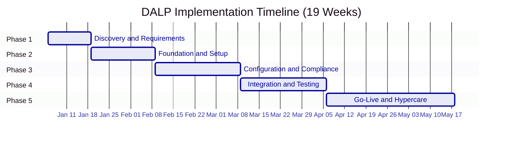

# Section 6: Implementation Methodology

## Phase Overview

SettleMint follows a structured, phase-gated implementation methodology refined through production deployments with regulated banks, market infrastructure providers, and sovereign entities. The standard implementation spans 19 weeks from kickoff to the end of hypercare, organized into five delivery phases. Each phase concludes with a formal gate review involving key stakeholders from both SettleMint and the client organization. Progression to the next phase requires sign-off on defined deliverables and acceptance criteria.

| Phase | Duration | Focus | Key Outcome |
|---|---|---|---|
| 1. Discovery and Requirements | 2 weeks | Requirements capture, architecture design, regulatory mapping | Validated requirements, target architecture, implementation roadmap |
| 2. Foundation and Setup | 3 weeks | Environment provisioning, network setup, identity framework | Functional platform environments ready for configuration |
| 3. Configuration and Compliance | 4 weeks | Asset types, compliance modules, feeds, operational workflows | Configured platform matching business and regulatory requirements |
| 4. Integration and Testing | 4 weeks | System integration, functional/security/performance/UAT testing | Validated, integrated system with formal go-live readiness |
| 5. Go-Live and Hypercare | 6 weeks | Production deployment (2 weeks) + intensive post-go-live support (4 weeks) | Production system with knowledge transfer and support transition |
| **Total** | **19 weeks** | | |

---

## Phase 1: Discovery and Requirements (Weeks 1--2)

### Objective

Establish a validated understanding of the client's business objectives, technical landscape, regulatory environment, and operational requirements, producing an architecture design and implementation roadmap that guides all subsequent phases.

### Activities

**Stakeholder Interviews.** Structured sessions with business sponsors, technology leadership, compliance and risk officers, operations teams, and end users. These interviews capture requirements across functional, regulatory, operational, and technical dimensions. Each session is documented and shared for validation within 48 hours.

**Current-State Assessment.** Review of the existing systems landscape including core banking, custody arrangements, compliance tooling, identity management, and reporting infrastructure. The assessment identifies integration touchpoints, data flows, and technical constraints that shape the target architecture.

**Regulatory and Compliance Mapping.** Documentation of applicable regulatory frameworks (MiCA, MAS, FCA, JFSA, or regional equivalents), jurisdictional constraints, investor eligibility rules, and reporting obligations. Each requirement is mapped to specific DALP compliance module types from the platform's 18 available modules. This mapping becomes the compliance configuration blueprint for Phase 3.

**Asset Class and Lifecycle Scoping.** Definition of target asset classes, lifecycle events (issuance, transfers, corporate actions, redemptions), and business rules for each. This scoping drives token template selection, feature composition, and addon configuration decisions.

**Architecture Design.** Production of a target architecture document covering deployment topology (managed cloud, self-hosted cloud, or on-premises), network selection (public EVM or permissioned Hyperledger Besu), custody integration model (DFNS, Fireblocks, or local signer), identity provider integration, and external system connectivity.

### Deliverables

| # | Deliverable | Description |
|---|---|---|
| 1.1 | Business Requirements Document | Validated functional and non-functional requirements with acceptance criteria |
| 1.2 | Regulatory and Compliance Matrix | Requirements mapped to DALP compliance modules, claim topics, and trusted issuer tiers |
| 1.3 | Target Architecture Document | Deployment topology, network design, integration architecture, and security model |
| 1.4 | Implementation Roadmap | Milestones, dependencies, resource requirements, and risk register |
| 1.5 | RACI Matrix | Responsibility assignments for all implementation activities |
| 1.6 | Communication Plan | Reporting cadence, escalation paths, and stakeholder notification protocols |

### Gate 1 Review Criteria

- [ ] All stakeholder interviews completed and requirements validated by business sponsors
- [ ] Regulatory and compliance matrix reviewed and approved by client compliance team
- [ ] Target architecture document accepted by client technology leadership
- [ ] Implementation roadmap with milestones accepted by both project managers
- [ ] RACI matrix signed off by both SettleMint and client project leadership
- [ ] Resource availability confirmed for Phase 2 (both teams)
- [ ] Risk register reviewed and mitigation strategies agreed

---

## Phase 2: Foundation and Setup (Weeks 3--5)

### Objective

Provision the DALP environment, configure the blockchain network, establish the identity and access framework, and prepare the integration layer, delivering a functional platform ready for detailed configuration and integration work.

### Activities

**Environment Provisioning.** Deploy DALP infrastructure according to the target architecture, including the DALP dApp, DAPI service, indexer, signer service, and observability stack. Three environments are provisioned: development (for iterative configuration), staging (for integration testing and UAT), and production (locked until Phase 5 deployment). Environment provisioning includes Helm chart configuration, database setup, Redis deployment, object storage configuration, and DNS resolution.

**Network Configuration.** Set up the target blockchain network(s). For permissioned Hyperledger Besu networks, this includes validator node deployment (typically 4 validators + 2 RPC nodes), consensus configuration (IBFT 2.0 or QBFT), gas management, and network monitoring. For public EVM networks, this includes RPC endpoint configuration, EntryPoint contract setup, and network health monitoring.

**Identity and Access Framework.** Configure OnchainID-based identity verification, Identity Registry setup, and RBAC configuration across DALP's role categories. This includes defining the role hierarchy, configuring system-level roles, establishing per-asset role templates, and setting up the organization role synchronization middleware.

**Key Management Setup.** Configure Key Guardian with the appropriate storage backend and custody provider integration. For DFNS deployments, this includes API credential setup, policy engine configuration, and programmatic wallet provisioning. For Fireblocks deployments, this includes vault configuration, TAP policy setup, and co-signer integration. For local signer deployments, this includes encrypted database storage and nonce tracker configuration.

**Observability Setup.** Deploy the monitoring stack (VictoriaMetrics, Loki, Tempo, Grafana) or configure integration with the client's existing observability infrastructure. Import DALP's pre-built dashboards and configure alert routing to the client's notification channels.

### Deliverables

| # | Deliverable | Description |
|---|---|---|
| 2.1 | Provisioned Environments | Development, staging, and production environments operational |
| 2.2 | Network Configuration Document | Blockchain network topology, consensus parameters, and node configuration |
| 2.3 | Identity and Access Design | RBAC model, role hierarchy, and verification workflows |
| 2.4 | Key Management Configuration | Custody provider integration, signing policies, and key lifecycle procedures |
| 2.5 | Observability Setup Report | Dashboard deployment, alert routing, and monitoring baseline |
| 2.6 | Environment Validation Report | Infrastructure health, connectivity, and baseline performance confirmation |

### Gate 2 Review Criteria

- [ ] All three environments (development, staging, production) provisioned and passing health checks
- [ ] Blockchain network operational with expected consensus behavior
- [ ] Identity and access framework functional with test user provisioning
- [ ] Key management and custody integration verified with test signing operations
- [ ] Observability stack operational with dashboards and alerting confirmed
- [ ] Environment validation report accepted by client technical lead
- [ ] No blocking infrastructure issues open

---

## Phase 3: Configuration and Compliance (Weeks 6--9)

### Objective

Configure asset types, compliance modules, data feeds, and operational workflows to match the client's specific business and regulatory requirements.

### Activities

**Token and Asset Configuration.** Define target asset classes using DALP's asset templates (bonds, equity, funds, deposits, stablecoins, real estate, precious metals, or configurable tokens). For each asset type, configure parameters, business rules, lifecycle events, corporate action logic, and feature composition using the SMART Configurable extension system (up to 32 pluggable features per token).

**Compliance Module Setup.** Configure controls from DALP's 18 module types. This includes identity verification expressions using RPN notation for complex regulatory configurations, country restrictions, investor count limits, holding period enforcement, supply caps, transfer windows, and collateral backing verification. Compliance configurations are tested against the regulatory and compliance matrix from Phase 1, including both pass and fail scenarios.

**Claims and Trusted Issuer Configuration.** Establish the claim topic scheme, register trusted issuers at appropriate tiers (global, system, or subject-scoped), and configure auto-claim validation rules. Trusted issuer configuration includes integration with external KYC providers and definition of claim expiry and renewal policies.

**Feed Configuration.** Set up price feeds, NAV feeds, exchange rate synchronization, and the FeedsDirectory with appropriate feed types and history modes. Configure Chainlink adapter integration where applicable for external feed consumption.

**Workflow Design.** Define operational workflows for day-to-day operations including issuance approval chains, transfer processing, corporate action execution, and exception handling. Workflows are documented and validated against the client's operational procedures.

### Deliverables

| # | Deliverable | Description |
|---|---|---|
| 3.1 | Asset Configuration Documentation | Token parameters, business rules, lifecycle logic, and feature composition per asset type |
| 3.2 | Compliance Module Configuration | Module setup mapped to jurisdictions and investor categories with test evidence |
| 3.3 | Claims and Feed Configuration | Claim topic scheme, trusted issuer registry, and feed configuration documentation |
| 3.4 | Integration Design Document | API specifications, data mappings, webhook definitions, and error handling patterns |
| 3.5 | Operational Workflow Documentation | Step-by-step procedures for standard operations and exception handling |

### Gate 3 Review Criteria

- [ ] All target asset types configured and validated in staging environment
- [ ] Compliance modules tested against regulatory matrix (both allow and block scenarios)
- [ ] Claims and trusted issuer configuration verified with test claim issuance and verification
- [ ] Feeds operational with correct data flow and history retention
- [ ] Integration design document reviewed and approved by client technical team
- [ ] Operational workflows reviewed and accepted by client operations team
- [ ] No configuration defects with severity P1 or P2 open

---

## Phase 4: Integration and Testing (Weeks 10--13)

### Objective

Connect DALP to the client's existing systems and validate the complete deployment against functional, security, performance, and compliance requirements before production go-live.

### Activities

#### System Integration

**API Integration.** Implement connections using DALP's v2 REST API with organization-scoped API keys, rate limiting configuration, structured error handling using DALP's 534-error-code system, and retry logic with configurable presets (fast, standard, and long-running). Each integration endpoint is validated for authentication, authorization, payload correctness, and error response handling.

**Custody Connector Setup.** Complete integration with the client's custody provider through DALP's provider abstraction. This includes signing policy configuration, approval workflow testing, and transaction lifecycle validation end-to-end from DALP through the custody provider to blockchain settlement.

**Core Banking and Payment Integration.** Connect to relevant systems for account reconciliation, position management, and settlement. Where applicable, ISO 20022 message format support enables integration with SWIFT, SEPA, and RTGS payment infrastructure for cash-leg settlement.

#### Testing Strategy

Testing follows a structured four-track approach. All test plans, scripts, and results are documented and retained as part of the implementation evidence package.

**Track 1: Functional Testing.** Systematic validation of all configured asset types, lifecycle events (issuance, transfer, corporate actions, redemption, maturity), compliance rules (including edge cases where compliance should block and where it should allow), custody workflows (signing, approval, rejection), and settlement logic (DvP and XvP flows including approval, execution, cancellation, and expiry scenarios). Test scenarios cover both standard operations and exception cases, with specific attention to boundary conditions in compliance modules (investors at exact count limits, transfers at exact value thresholds, claims approaching expiry).

| Test Category | Scope | Pass Criteria |
|---|---|---|
| Asset lifecycle | Issuance, transfer, pause, freeze, burn, maturity, redemption | All lifecycle states transition correctly with proper event emission |
| Compliance enforcement | All 18 module types, RPN expressions, boundary conditions | Compliant transactions pass; non-compliant transactions are blocked with correct error codes |
| Custody workflows | Signing, approval, rejection, timeout, policy enforcement | Transactions follow configured approval paths; policy violations are correctly rejected |
| Settlement | DvP and XvP creation, approval, execution, cancellation, expiry | Settlement logic executes correctly across all states with proper atomicity |
| Identity and claims | Registration, claim issuance, verification, revocation, expiry | Identity lifecycle operates correctly; expired or revoked claims block dependent operations |
| Corporate actions | Dividends, interest, splits, conversions | Corporate actions execute with correct calculations and proper holder notification |

**Track 2: Security Testing.** Penetration testing of the API surface (both RPC and v2 endpoints), authentication bypass attempts, authorization escalation testing, input validation and injection vectors, smart contract security review, custody integration security, and infrastructure configuration review. The security assessment is conducted in alignment with the client's security review process and vendor risk assessment requirements.

| Security Domain | Test Focus | Evidence Produced |
|---|---|---|
| API security | Authentication bypass, injection, rate limiting, input validation | Penetration test report with severity-classified findings |
| Authorization | Role escalation, cross-organization access, per-asset boundary enforcement | Authorization matrix test results |
| Smart contract | Reentrancy, overflow, access control, upgrade safety | Smart contract audit report |
| Custody integration | Signing policy bypass, approval workflow integrity | Custody integration security assessment |
| Infrastructure | Network segmentation, TLS configuration, secrets exposure | Infrastructure security scan results |
| Data protection | Encryption at rest and in transit, PII handling, backup encryption | Data protection assessment report |

**Track 3: Performance Testing.** Validation of transaction throughput under the client's expected workload profile, API response latency against agreed SLA targets, and system behavior under peak conditions including concurrent user sessions, burst transaction volumes, and sustained high-throughput periods.

| Performance Metric | Measurement Method | Typical Target |
|---|---|---|
| API response latency (p50) | Load test with realistic workload | < 200ms |
| API response latency (p99) | Load test with burst traffic | < 2,000ms |
| Transaction throughput | Sustained load at expected peak volume | Per deployment (varies by network and consensus) |
| Concurrent user capacity | Simulated concurrent sessions | Per deployment |
| Indexer event latency | Time from blockchain event to analytics view | < 5 seconds |
| Recovery time | Simulated component failure during load | Within RTO target |

**Track 4: User Acceptance Testing (UAT).** Structured sessions with designated client users across business, operations, compliance, and technology teams, using business-scenario test scripts derived from the client's actual operational workflows. UAT validates that the system meets business requirements in practice, not just technical specifications.

| UAT Track | Participants | Validation Focus |
|---|---|---|
| Business operations | Operations staff, relationship managers | Day-to-day asset lifecycle operations, reporting, dashboard usability |
| Compliance operations | Compliance officers, risk managers | Compliance enforcement behavior, audit trail completeness, exception handling |
| Technical operations | Platform administrators, DevOps | Monitoring, alerting, backup procedures, incident response |
| Integration validation | Integration developers, technical architects | End-to-end data flow, error handling, reconciliation accuracy |

### Deliverables

| # | Deliverable | Description |
|---|---|---|
| 4.1 | Integrated System Landscape | All connectors operational with end-to-end data flow |
| 4.2 | End-to-End Workflow Documentation | System interactions, data flows, and exception handling procedures |
| 4.3 | Functional Test Report | Pass/fail status for all test scenarios with defect log |
| 4.4 | Security Assessment Report | Findings classified by severity with remediation actions and timelines |
| 4.5 | Performance Test Report | Benchmark results, capacity recommendations, and bottleneck analysis |
| 4.6 | UAT Sign-Off | Formal acceptance from designated client stakeholders per track |
| 4.7 | Go-Live Readiness Assessment | Comprehensive checklist covering technical, operational, and organizational criteria |

### Gate 4 Review Criteria

- [ ] All integrations operational and tested end-to-end in staging
- [ ] Functional test pass rate at 100% for P1 and P2 scenarios (no open P1/P2 defects)
- [ ] Security assessment completed with no unmitigated critical or high findings
- [ ] Performance test results within agreed SLA targets
- [ ] UAT sign-off received from all designated client stakeholder groups
- [ ] Go-live readiness assessment completed with all critical items resolved
- [ ] Incident response procedures documented and reviewed
- [ ] Rollback procedures tested and documented

---

## Phase 5: Go-Live and Hypercare (Weeks 14--19)

### Go-Live (Weeks 14--15)

#### Objective

Execute a controlled production deployment with minimal risk, ensuring operational readiness and immediate support coverage.

#### Activities

**Production Deployment.** Execute the deployment runbook, including infrastructure validation, platform deployment, configuration migration from staging, and final verification checks. The deployment follows the Helm-based deployment process with environment-specific values.

**Data Migration.** Transfer required reference data, investor registries, or asset configurations from staging to production with data integrity validation. Migration scripts are version-controlled and tested in staging before production execution.

**Go-Live Validation.** Execute a smoke-test suite in production to confirm platform health, integration connectivity, compliance enforcement, and observability. The SettleMint go-live support team provides dedicated coverage during the deployment window with real-time monitoring of platform health, transaction processing, and integration status.

**Go-Live Support.** Dedicated SettleMint team on standby during the deployment window and the first 48 hours of production operation. Monitoring coverage includes platform health, transaction processing, integration stability, and system performance.

#### Go-Live Deliverables

| # | Deliverable | Description |
|---|---|---|
| 5.1 | Production Deployment Confirmation | Deployment checklist completion with smoke-test results |
| 5.2 | Migration Validation Report | Data integrity confirmation for all migrated records |
| 5.3 | Incident Response Procedures | Escalation paths, rollback procedures, and emergency contacts |

### Hypercare (Weeks 16--19)

#### Objective

Provide intensive post-go-live support, optimize platform performance based on production data, and complete knowledge transfer to the client's operational teams.

#### Activities

**Dedicated Monitoring.** Platform health, transaction volumes, compliance enforcement, integration stability, and system performance are monitored continuously during the hypercare period. Proactive identification and resolution of emerging issues takes priority over new feature work.

**Performance Optimization.** Analysis of production metrics to identify tuning opportunities across query performance, indexing efficiency, caching, and resource utilization. Optimization actions are documented and applied through the standard change-control process.

**Knowledge Transfer Completion.** Structured training sessions covering platform administration, monitoring, troubleshooting, compliance module management, and operational workflows across all three training tracks (see Training and Knowledge Transfer section below).

**Operational Readiness Validation.** Confirm the client's teams can independently manage day-to-day operations through scenario-based proficiency assessment.

**Support Transition.** Managed transition from hypercare to the client's contracted support tier with context handover and establishment of ongoing support procedures.

#### Hypercare Deliverables

| # | Deliverable | Description |
|---|---|---|
| 5.4 | Hypercare Summary Report | Incident log, performance metrics, optimization actions, and lessons learned |
| 5.5 | Complete Documentation Package | All implementation documentation consolidated and version-controlled |
| 5.6 | Knowledge Transfer Completion Certificate | Training completion records across all three tracks |
| 5.7 | Support Transition Plan | Handover documentation, ongoing support procedures, and escalation contacts |

---

## RACI Matrix

The following RACI matrix defines responsibility assignments for key implementation activities. R = Responsible (does the work), A = Accountable (owns the outcome), C = Consulted (provides input), I = Informed (kept updated).

| Activity | SM Delivery Lead | SM Solution Architect | SM Platform Engineer | SM QA Lead | Client PM | Client Tech Lead | Client DevOps | Client Compliance |
|---|---|---|---|---|---|---|---|---|
| **Phase 1: Discovery** | | | | | | | | |
| Stakeholder interviews | R | C | I | I | A | C | I | C |
| Current-state assessment | C | R | C | I | A | R | C | I |
| Regulatory mapping | C | R | I | I | I | I | I | A |
| Architecture design | C | A | R | I | C | R | C | I |
| Implementation roadmap | A | C | C | I | R | C | I | I |
| **Phase 2: Foundation** | | | | | | | | |
| Environment provisioning | A | C | R | I | I | C | R | I |
| Network configuration | C | C | R | I | I | C | C | I |
| Identity and access setup | C | A | R | I | I | C | I | C |
| Key management setup | C | A | R | I | I | C | C | I |
| Observability setup | C | I | R | I | I | I | C | I |
| **Phase 3: Configuration** | | | | | | | | |
| Token and asset config | A | R | R | I | C | C | I | C |
| Compliance module setup | C | R | R | I | I | I | I | A |
| Claims and issuer config | C | R | R | I | I | C | I | C |
| Feed configuration | C | C | R | I | I | C | I | I |
| Workflow design | A | C | C | I | C | C | I | R |
| **Phase 4: Integration** | | | | | | | | |
| API integration | A | C | R | I | I | R | C | I |
| Custody connector setup | C | C | R | I | I | C | C | I |
| Functional testing | C | I | C | A | I | C | I | C |
| Security testing | C | C | C | R | I | A | C | I |
| Performance testing | C | I | R | A | I | C | C | I |
| UAT coordination | A | I | C | C | R | C | I | C |
| **Phase 5: Go-Live** | | | | | | | | |
| Production deployment | A | C | R | I | C | C | R | I |
| Data migration | C | I | R | C | I | C | C | I |
| Go-live validation | A | C | R | R | C | C | C | I |
| **Hypercare** | | | | | | | | |
| Monitoring and triage | A | I | R | I | I | C | C | I |
| Performance optimization | C | C | R | I | I | C | C | I |
| Knowledge transfer | A | C | R | I | C | C | C | C |
| Support transition | A | I | C | I | R | C | I | I |

---

## Resource Requirements

Successful DALP implementation requires active participation from both SettleMint and the client. The delivery model is collaborative by design. SettleMint brings platform expertise, delivery patterns, and technical implementation capability. The client brings business rules, regulatory context, infrastructure access, and decision-making authority.

The most common cause of delivery delay in regulated platform implementations is not technical difficulty but decision latency, especially around compliance rules, custody policies, and integration ownership. Resource planning should prioritize timely stakeholder availability as much as technical staffing.

### SettleMint Team

| Role | Phase 1 | Phase 2 | Phase 3 | Phase 4 | Phase 5 | Hypercare |
|---|---|---|---|---|---|---|
| **Delivery Lead** | Full | Full | Full | Full | Full | Partial |
| **Solution Architect** | Full | Full | Partial | Partial | On-call | On-call |
| **Platform Engineer(s)** | Partial | Full | Full | Full | Full | Partial |
| **QA/Test Lead** | None | None | Partial | Full | Partial | None |

The **Delivery Lead** owns execution against the plan, risk tracking, phase gates, and cross-team coordination. The **Solution Architect** owns target-state architecture, design decisions, and alignment between requirements and platform configuration. **Platform Engineers** own environment provisioning, deployment automation, observability setup, and integration of custody and infrastructure services. The **QA/Test Lead** owns structured test planning, execution oversight, defect triage, and evidence collection for go-live readiness.

### Client Team

| Role | Phase 1 | Phase 2 | Phase 3 | Phase 4 | Phase 5 | Hypercare |
|---|---|---|---|---|---|---|
| **Project Manager** | Full | Full | Full | Full | Full | Full |
| **Technical Lead** | Full | Full | Full | Full | On-call | Partial |
| **DevOps/Infrastructure** | None | Full | Partial | Partial | Full | Partial |
| **Compliance/Risk** | Full | Partial | Full | Full | None | Partial |

The **Project Manager** is central to governance and decision flow. The **Technical Lead** provides architectural alignment with the client's broader systems landscape and validates integration and security decisions. **DevOps and Infrastructure** personnel are essential for dedicated cloud and on-premises models because environment readiness, DNS, certificates, firewall rules, and identity platform integration frequently sit outside the direct control of the DALP delivery team. **Compliance and Risk** participants are particularly important during discovery, configuration, and testing because regulatory rules, claim topics, and transfer restrictions cannot be guessed or deferred without risking rework later in the project.

---

## Client Responsibilities

The following responsibilities are required from the client to maintain the implementation timeline. Delays in these areas are the primary source of schedule slippage in regulated platform deployments.

### Decision Making and Governance

- **Stakeholder availability.** Named decision-makers must be available for scheduled review sessions and gate approvals. Proxy decision-making should be established for periods when primary stakeholders are unavailable.
- **Decision turnaround.** Design decisions, configuration approvals, and compliance rule sign-offs should be completed within 5 business days of request. Decisions deferred beyond this window are logged in the risk register with assessed timeline impact.
- **Change control participation.** Scope changes are expected in regulated programs. The client must participate in impact assessment and prioritization through the agreed change-control process.

### Technical and Infrastructure

- **Environment access.** Timely provisioning of infrastructure resources (cloud accounts, Kubernetes clusters, database instances, DNS entries, TLS certificates, firewall rules) per the implementation roadmap.
- **Network and connectivity.** Outbound access to harbor.settlemint.com (port 443) for container images, plus connectivity to managed service endpoints (PostgreSQL, Redis).
- **Integration endpoints.** API access, credentials, and test environments for core banking, custody providers, identity providers, and other systems identified during discovery.
- **Security review.** Timely completion of vendor security assessments, penetration test coordination, and approval of infrastructure configurations.

### Compliance and Business

- **Regulatory requirements.** Complete and validated documentation of applicable regulatory frameworks, jurisdictional rules, and investor eligibility requirements.
- **Compliance rule definition.** Specific configuration parameters for compliance modules (country lists, investor count limits, holding periods, transfer windows, supply caps) with formal sign-off.
- **Business rules.** Asset class parameters, lifecycle event definitions, corporate action logic, and operational workflow specifications.
- **Test participation.** Dedicated personnel for UAT across business, operations, compliance, and technology tracks.

### Operational

- **Training participation.** Designated attendees for all three training tracks (administrator, developer, end-user) with protected time for training sessions.
- **Documentation review.** Timely review and feedback on implementation documentation, operational procedures, and knowledge transfer materials.
- **Support transition.** Designated contacts for ongoing support relationship and internal operational ownership.

---

## Risk Mitigation

The following risk patterns are common in regulated platform implementations. Each includes the typical trigger, impact, and SettleMint's standard mitigation approach.

### Decision Latency

**Risk.** Key decisions on compliance rules, custody policies, or integration ownership are delayed because stakeholders are unavailable or organizational approval chains are long.

**Impact.** Schedule slippage in Phases 1 and 3, with cascading delays to integration and testing. Each week of decision delay typically adds 1.5 weeks to overall timeline due to context-switching and rework.

**Mitigation.** RACI matrix established in Phase 1 with named decision-makers and proxy authority. Decisions pending beyond 5 business days are escalated through both project managers. Weekly decision log tracks outstanding items with age and assessed impact.

### Integration Complexity

**Risk.** Core banking, custody, or payment rail integrations prove more complex than anticipated due to undocumented APIs, legacy system constraints, or third-party provider response times.

**Impact.** Phase 4 extension. Integration work is often on the critical path because downstream testing depends on connected systems.

**Mitigation.** Integration design document produced in Phase 3 with explicit dependency map and fallback strategies. Mock interfaces built for integration testing where third-party systems are not yet available. Parallel workstreams for independent integration tracks. Early engagement with third-party providers during Phase 1.

### Regulatory Change

**Risk.** New regulatory requirements emerge during implementation (common when legal teams or external advisors discover additional obligations).

**Impact.** Configuration rework in Phase 3 or Phase 4, potential impact on compliance module selection and claim topic design.

**Mitigation.** Compliance modules are configurable, not hard-coded. DALP's 18 module types and RPN expression system provide flexibility to absorb new requirements without architectural changes. Change-control process captures scope changes with impact assessment. Regulatory buffer built into Phase 3 timeline.

### Infrastructure Readiness

**Risk.** Client infrastructure (cloud accounts, Kubernetes clusters, network connectivity, DNS, certificates) is not provisioned on time for Phase 2.

**Impact.** Foundation phase blocked. Cannot proceed to configuration without functional environments.

**Mitigation.** Infrastructure prerequisites checklist delivered during Phase 1 with specific deadlines for each item. Weekly infrastructure readiness tracking during Phase 1. Managed cloud option available as a fallback if client infrastructure provisioning is delayed.

### Key Personnel Changes

**Risk.** Named stakeholders on either side change roles or leave during implementation.

**Impact.** Knowledge loss, decision delays, and potential requirement reinterpretation.

**Mitigation.** All decisions documented in writing with rationale. Knowledge transfer sessions include backup personnel. RACI matrix includes secondary contacts for critical roles. Implementation documentation is structured for onboarding new team members mid-project.

### Scope Expansion

**Risk.** Additional asset classes, jurisdictions, or integration requirements are identified after Phase 1 discovery.

**Impact.** Timeline and effort increase, particularly in Phases 3 and 4.

**Mitigation.** Change-control process with formal impact assessment for each scope change. Prioritization framework (must-have for go-live vs. post-go-live enhancement) agreed with client during Phase 1. Additional asset classes and jurisdictions can often be added post-go-live with lower risk than mid-implementation additions.

### Testing Defects

**Risk.** Significant defects discovered during Phase 4 testing require configuration or integration rework.

**Impact.** Phase 4 extension or delayed go-live.

**Mitigation.** Continuous testing from Phase 2 onwards (not just Phase 4). Configuration validation in staging during Phase 3 catches issues early. Defect severity classification with clear criteria for go-live blocking vs. post-go-live remediation. Defect resolution SLAs built into the implementation plan.

---

## Testing Strategy

### Testing Principles

Testing is continuous, not a single phase. While Phase 4 is the formal integration and testing phase, testing activities begin in Phase 2 and continue through hypercare.

| Phase | Testing Activities |
|---|---|
| Phase 2 | Infrastructure validation, environment health checks, connectivity verification |
| Phase 3 | Configuration validation, compliance module testing (pass and fail scenarios), feed verification |
| Phase 4 | Functional, security, performance, and user acceptance testing |
| Phase 5 | Production smoke testing, go-live validation, operational procedure testing |
| Hypercare | Production monitoring validation, incident response testing, knowledge transfer assessments |

### Test Environment Strategy

| Environment | Purpose | Data | Access |
|---|---|---|---|
| Development | Iterative configuration, developer testing, integration prototyping | Synthetic | SettleMint + client development team |
| Staging | Integration testing, UAT, performance testing, pre-production validation | Anonymized production-representative | SettleMint + client full team |
| Production | Live operations | Real | Controlled per RBAC model |

### Defect Classification

| Severity | Definition | Go-Live Impact |
|---|---|---|
| P1: Critical | System unusable, data loss risk, compliance enforcement failure | Blocks go-live |
| P2: High | Major function impaired, no acceptable workaround | Blocks go-live |
| P3: Medium | Function impaired but workaround exists | Does not block go-live; remediation timeline agreed |
| P4: Low | Minor issue, cosmetic, or enhancement request | Post-go-live backlog |

### Test Evidence and Traceability

All test activities produce documented evidence retained as part of the implementation package:

- Test plans with traceability to requirements
- Test scripts with expected and actual results
- Defect reports with severity, status, and resolution
- Test summary reports per track
- Go-live readiness checklist with test evidence references

---

## Training and Knowledge Transfer

### Training Program Structure

SettleMint delivers a structured training program as part of every DALP implementation, organized around three role-based tracks. Training begins during the implementation phases (configuration, integration, and testing) as client team members shadow SettleMint engineers, and is formally completed during the hypercare period. The goal is operational independence: by the end of hypercare, the client's teams should be able to manage day-to-day operations, handle common scenarios, troubleshoot issues, and know when and how to escalate to SettleMint support.

### Training Tracks

**Administrator Training (3--4 days).** Covers platform architecture and component overview (DAPI, indexer, signer service, observability stack), environment management, user and access management, compliance module administration, identity management (OnchainID, Identity Registry, claims), key management and custody administration, monitoring and observability, backup and recovery procedures, and platform update processes.

**Developer Training (4--5 days).** Covers DALP API deep dive (v2 REST API, authentication, rate limiting, error handling with the 534-error-code system, retry strategies), integration patterns for core banking, custody, identity, and payment systems, event-driven architecture (webhooks, event types, payload schemas), smart contract interaction, indexer queries, custom workflow development, testing strategies, and security practices.

**End-User Training (2 days).** Covers platform navigation (dApp interface, dashboards, user settings), asset operations (issuance, transfer, batch operations, lifecycle events), compliance workflows (investor onboarding, verification, exception handling), settlement operations (DvP/XvP workflows, status monitoring), custody operations (maker-checker signing, freeze/recovery), reporting and audit (dashboards, transaction reporting, audit trails), and common troubleshooting scenarios.

### Knowledge Transfer Schedule (During Hypercare)

| Week | Focus | Participants |
|---|---|---|
| Week 16 | Administrator training | Platform admins, DevOps engineers, infrastructure leads |
| Week 17 | Developer training | Integration developers, technical architects |
| Week 18 | End-user training | Business users, operations staff, compliance officers |
| Week 19 | Cross-track review, scenario exercises, operational readiness assessment | All tracks |

### Knowledge Transfer Methodology

Knowledge transfer is integrated into the implementation lifecycle, not delivered as a standalone event at the end. This matters because operational confidence is built through repetition in context, not through a single compressed handover workshop.

- **Phase 2**: Administrators shadow SettleMint engineers during environment setup
- **Phase 3**: Developers participate in compliance module setup and integration design sessions
- **Phase 4**: All tracks participate in UAT, with administrators learning monitoring and triage through test execution
- **Hypercare**: Formal training delivery following the structured schedule above

The approach combines four methods: instructor-led sessions for conceptual models, guided labs on the client's own staging environment for hands-on practice, shadowing during implementation for real-world operational patterns, and documentation plus recorded sessions for persistent reference.

### Operational Readiness Assessment

At the conclusion of knowledge transfer, an operational readiness assessment verifies that each role can independently execute core responsibilities. The assessment includes scenario-based proficiency testing.

**Sample scenarios:**

- Review a blocked transfer and identify which compliance module rejected it
- Trace a delayed transaction through the lifecycle states to identify the bottleneck
- Rotate an API key for an integration without causing service interruption
- Review an expiring claim population and initiate renewal actions
- Confirm that monitoring alerts route correctly to operational channels
- Execute a rollback procedure for a failed deployment

The readiness assessment requires formal sign-off by designated client stakeholders before the support transition is completed.

### Self-Service Resources

Beyond initial training, SettleMint provides ongoing resources:

- **DALP Documentation Portal**: Continuously updated platform documentation, release notes, and migration guides
- **Knowledge Base**: Searchable articles maintained by the support team, updated from real support interactions
- **Release Training**: Materials covering new features and changed behaviors with major releases
- **Refresher Training**: Available on request for new team members or expansion to new asset classes
- **Office Hours**: Periodic open sessions with SettleMint engineers (Premium and Enterprise support tiers)

---

## Hypercare and Support Transition

### Hypercare Operating Model

During the 4-week hypercare period (weeks 16--19), SettleMint provides enhanced support that goes beyond the contracted support tier:

| Capability | Hypercare | Standard Support |
|---|---|---|
| Response time for P1 | 30 minutes | Per contracted tier |
| SettleMint engineer availability | Dedicated | Shared queue |
| Monitoring | Proactive, continuous | Alert-driven |
| Scope | Full platform + integrations | Platform only |
| Knowledge transfer | Active, scheduled sessions | Documentation only |
| Performance tuning | Included | Professional services |

### Support Transition Process

The transition from hypercare to ongoing support follows a structured handover:

1. **Week 18: Transition planning.** Support tier confirmation, named contact registration, escalation path documentation, and operational procedure handover.
2. **Week 19: Parallel operation.** Client team operates with SettleMint in an advisory role. Issues are routed through the standard support channels with SettleMint monitoring for gaps.
3. **Post-hypercare: Standard support.** The contracted support tier takes effect. The dedicated hypercare engineer transitions to the support pool with context documentation preserved.

### Ongoing Support Tiers

SettleMint provides three support tiers post-hypercare:

| Capability | Standard (8x5) | Premium (12x7) | Enterprise (24x7) |
|---|---|---|---|
| Coverage hours | 09:00--18:00 CET, Mon--Fri | 07:00--22:00 CET, Mon--Fri + P1 on-call weekends | 24/7/365 |
| P1 response time | 4 hours | 1 hour | 15 minutes |
| P1 resolution target | 8 hours | 4 hours | 2 hours |
| Named contacts | Up to 3 | Up to 8 | Unlimited |
| Support channels | Email, portal | + Slack, phone | + Video escalation |
| Assigned engineer | Shared pool | Designated | Dedicated team |
| Release cadence | Quarterly | Monthly | Continuous with staged rollout |
| Business reviews | Quarterly | Monthly | Bi-weekly |
| Architecture reviews | None | None | Quarterly with Solution Architect |
| Uptime SLA | 99.9% | 99.95% | 99.99% |

---

## Commercial Summary

### Implementation Pricing

| Item | Duration | Monthly Rate | Total |
|---|---|---|---|
| Implementation project | 19 weeks (~5 months) | Scoped per proposal | Per proposal |
| Development environment | Ongoing | EUR 10,000/month | Per contract term |
| Production environment | Ongoing | EUR 25,000/month | Per contract term |
| Support tier | Ongoing | Per selected tier | Per contract term |

Development and production environment fees begin when environments are provisioned (Phase 2). Implementation project fees are scoped per engagement based on complexity, asset class count, integration requirements, and deployment model.

### Timeline Adjustments

The 19-week standard timeline assumes:

- Single deployment region
- Up to 3 asset classes
- Up to 5 external integrations
- Standard compliance configuration
- Client team availability per the RACI matrix

Additional asset classes, jurisdictions, integrations, or multi-region deployments extend the timeline. SettleMint provides adjusted timelines as part of the proposal process based on the specific scope of the engagement.

---

## Change Control

Scope changes are expected in regulated programs, especially when external providers or legal teams discover additional requirements. The important point is not to pretend scope is static. It is to make change visible, assess its impact on timeline and risk, and absorb it through a governed process rather than through silent schedule erosion.

### Change Control Process

1. **Request.** Either party submits a change request describing the proposed change, rationale, and urgency.
2. **Impact assessment.** SettleMint assesses timeline, effort, risk, and cost impact within 5 business days.
3. **Decision.** Both project managers review the assessment and decide: approve, defer to post-go-live, or reject.
4. **Implementation.** Approved changes are incorporated into the implementation plan with updated milestones.
5. **Tracking.** All change requests are logged in the change register with status, impact assessment, and decision rationale.

Changes classified as "must-have for go-live" are prioritized and absorbed into the current timeline with appropriate adjustments. Changes classified as "post-go-live enhancement" are documented and scheduled for implementation after production stabilization.
