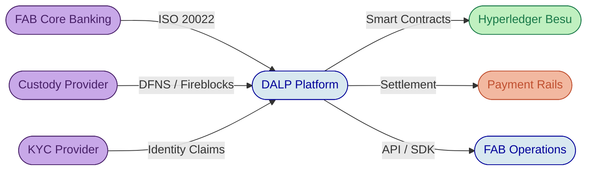
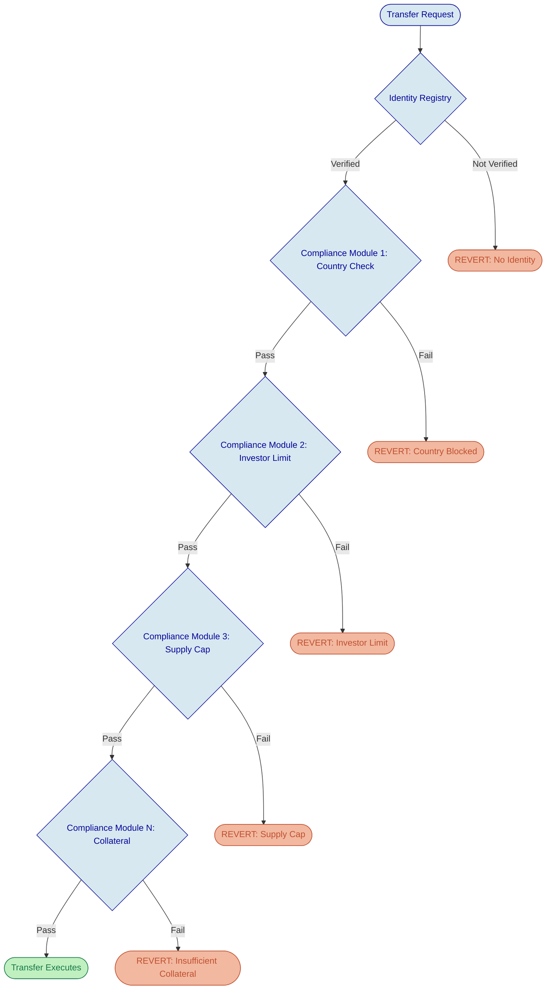
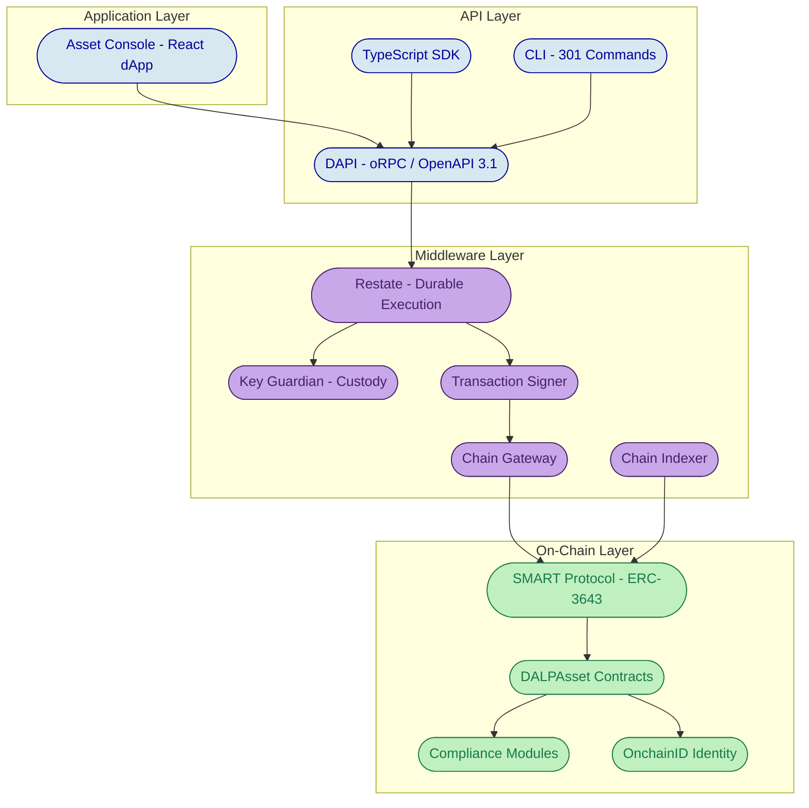
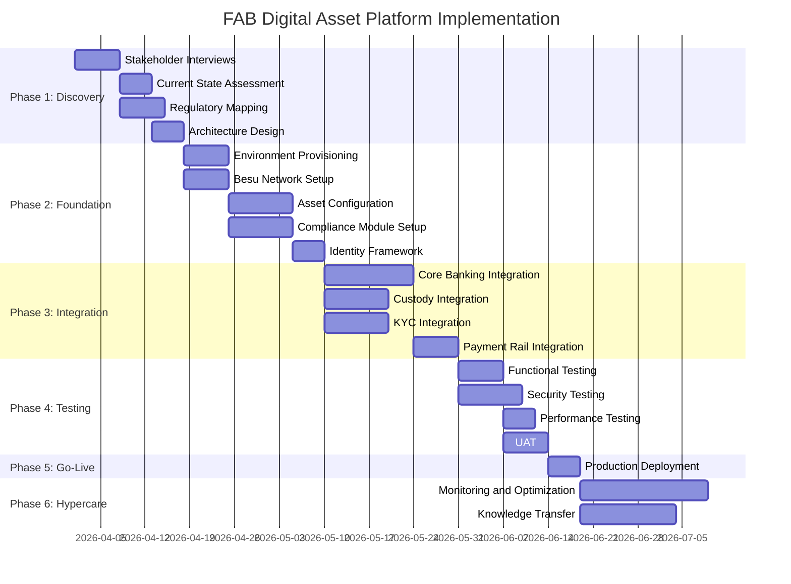
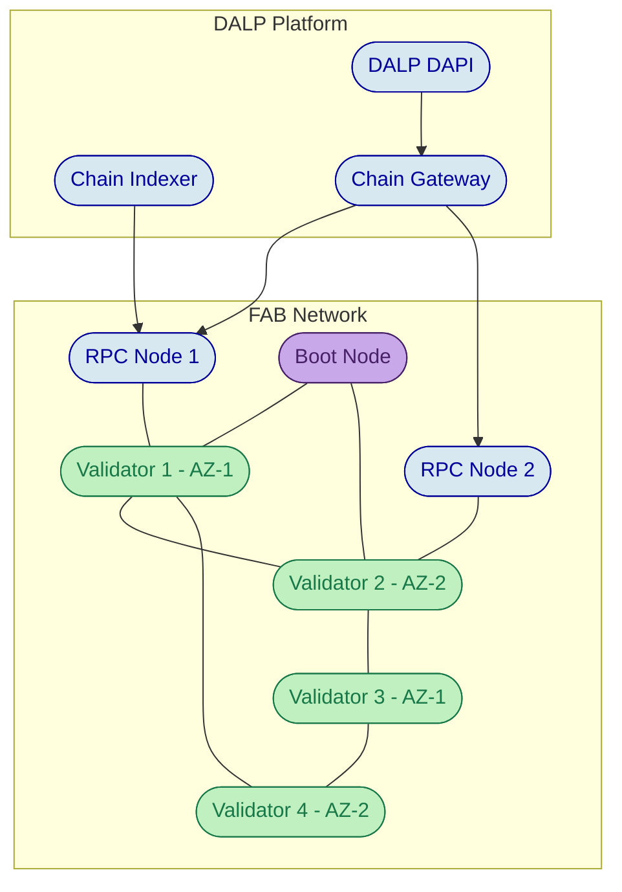

# Technical Proposal: Digital Asset Lifecycle Platform for First Abu Dhabi Bank

**Prepared for:** First Abu Dhabi Bank (FAB)

**Prepared by:** SettleMint NV

**Date:** March 2026

**Version:** 1.0

**Classification:** Confidential

**Primary Contact:** Matthew Van Niekerk, CEO, matthew@settlemint.com

---

## Executive Summary

### Context and Strategic Drivers

First Abu Dhabi Bank stands at the forefront of a structural transformation in the financial services landscape of the United Arab Emirates and the wider Gulf region. As the largest bank by assets in the UAE, FAB occupies a unique position to define how institutional digital asset infrastructure operates across the Emirates and to set the standard that other regional institutions will follow. The convergence of several forces makes this moment decisive: the Central Bank of the UAE (CBUAE) has finalized its Payment Token Services Regulation (2024), creating a clear licensing and supervisory framework for dirham-backed stablecoins and tokenized deposits; the Abu Dhabi Global Market (ADGM) through its Financial Services Regulatory Authority (FSRA) has established a comprehensive digital asset framework governing virtual asset service providers; the Dubai International Financial Centre (DIFC) has enacted its Digital Assets Law and updated its regulatory regime; and the Securities and Commodities Authority (SCA) has introduced token regulations that bring tokenized securities under formal oversight. Together, these frameworks create the regulatory certainty that FAB needs to move from exploration to full-scale digital asset operations.

FAB's ambition extends across multiple asset classes and use cases: dirham-denominated stablecoin issuance to serve as programmable settlement currency across the bank's operations, tokenized deposits that represent commercial bank money on-chain with full regulatory compliance, and tokenized bonds including government sukuk and corporate debt instruments that bring capital markets efficiency to fixed-income products. Each of these use cases carries its own lifecycle complexity, compliance requirements, and operational demands. Executing them as isolated projects with separate technology stacks would multiply integration risk, fragment governance, and create the kind of operational complexity that undermines institutional confidence in digital assets.

### Why This Programme Is Hard

The challenge FAB faces is not tokenization itself. Creating a token on an EVM-compatible blockchain is straightforward. The genuine difficulty lies in everything that surrounds that act of creation: ensuring that every transfer enforces eligibility rules before execution rather than reviewing compliance after the fact; managing the complete lifecycle of each instrument from issuance through coupon payments, yield distribution, and eventual redemption or retirement; integrating on-chain operations with FAB's existing core banking systems, custody relationships, payment rails, and reporting infrastructure; and maintaining the auditability and governance controls that CBUAE, ADGM, and FAB's own risk and compliance functions require.

Most institutions discover this complexity only after committing to a technology path. The gap between a successful proof-of-concept and a production system that can withstand regulatory scrutiny, operational stress, and multi-year asset lifecycles is where digital asset programmes stall. Integration with existing treasury management, ISO 20022 payment messaging, and institutional custody providers adds further layers of coordination that cannot be solved by smart contracts alone. FAB requires a platform that absorbs this complexity rather than exposing it, enabling the bank's teams to focus on business model innovation and client service rather than blockchain infrastructure engineering.

### Proposed Response

SettleMint proposes DALP (Digital Asset Lifecycle Platform) as the unified infrastructure layer for FAB's digital asset operations. DALP is a composable, configurable platform that covers the full digital asset lifecycle, from asset design and structuring through compliance enforcement, custody integration, atomic settlement, lifecycle servicing, and retirement, treated as one continuous operating model rather than a collection of disconnected tools.

The proposed deployment model is a private cloud or on-premises deployment within FAB's infrastructure, running on Hyperledger Besu as a permissioned EVM network. This approach gives FAB full control over data residency, network governance, and security posture while maintaining complete compatibility with the EVM ecosystem's mature tooling and standards. DALP's architecture is chain-agnostic across EVM networks, meaning FAB can start with a permissioned Besu network and extend to public chains or additional private networks as strategy evolves.

For FAB's target asset scope, DALP provides purpose-built templates for stablecoins, deposits, and bonds, each with asset-specific lifecycle logic, compliance controls, and operational workflows. Critically, all three asset types share a single composable architecture: the DALPAsset configurable contract. Rather than maintaining separate codebases for each instrument, FAB configures token features, compliance modules, and metadata schemas from pre-audited catalogs. This composable approach means that expanding from the initial three use cases to equity, funds, real estate, or precious metals requires configuration, not development.

Compliance is enforced ex-ante at the smart contract level using the ERC-3643 (T-REX) regulated token standard with OnchainID for verifiable investor identities. DALP's 18 compliance module types map directly to UAE regulatory requirements: country restrictions for CBUAE jurisdictional controls, investor accreditation modules for ADGM qualified investor rules, supply cap enforcement for reserve-backed stablecoin issuance limits, transfer approval workflows for compliance officer oversight, and collateral backing verification for CBUAE reserve attestation requirements. These modules compose through fail-closed AND logic, meaning every transfer must satisfy every active rule before execution.

Settlement leverages DALP's atomic Delivery-versus-Payment (DvP) and Exchange-versus-Payment (XvP) capabilities, ensuring that asset and cash legs complete together or revert together. For cross-border settlement scenarios, Hash Time-Locked Contracts (HTLC) provide the same atomicity guarantees across chains. Integration with ISO 20022 payment messaging connects on-chain settlement with FAB's existing SWIFT, UAESWITCH, and RTGS connectivity.

The implementation follows a phased delivery model spanning 15 to 19 weeks from kickoff to production go-live, with an initial phase focused on AED stablecoin issuance, followed by tokenized deposits and tokenized bonds in subsequent phases. Each phase concludes with a formal gate review, and the entire programme is supported by SettleMint's structured support framework with Enterprise-tier SLA coverage.

### Why SettleMint

SettleMint brings nearly a decade of focused experience building blockchain infrastructure for regulated institutions. This is not a startup pivoting from a different market; it is a company that has spent its entire existence solving the specific challenges of institutional digital asset operations. The depth of that experience is reflected in production deployments that span multiple continents and asset classes.

In the Gulf region specifically, SettleMint is the delivery partner for Saudi Arabia's Real Estate Registry (RER) programme, a country-scale blockchain infrastructure for real estate registration, fractionalization, and digital marketplace operated by the Real Estate Registry under the Real Estate General Authority (REGA). This sovereign-scale programme demonstrates SettleMint's ability to operate at national infrastructure level within the regulatory and institutional context of the GCC. SettleMint has also delivered tokenized equity infrastructure on ADI's Abu Dhabi-based mainnet through the Finstreet programme, with institutional custody integration (DFNS, Fireblocks), ERC20Votes governance, and cloud-agnostic deployment in the UAE/GCC.

Beyond the Gulf, SettleMint's production credentials include multi-year continuous deployments with OCBC Bank (security token engine for securitized assets), Standard Chartered Bank (Digital Virtual Exchange for fractional tokenization), Sony Bank in Japan (stablecoin issuance with integrated digital identity), Commerzbank (hybrid on/off-chain ETP issuance with settlement under 10 seconds), and Maybank's Project Photon (FX tokenization and cross-border XvP settlement). The company has delivered CBDC infrastructure for the State Bank of India and Sharia-compliant subsidy distribution across 57 countries for the Islamic Development Bank. SettleMint holds ISO 27001 and SOC 2 Type II certifications, confirming that security controls are independently audited and continuously maintained.

### Why DALP

DALP is not a tokenization toolkit that requires months of custom development before it delivers value. It is a complete lifecycle platform where FAB's teams configure instruments, compliance rules, and operational workflows from pre-built, pre-audited components. The platform's composable architecture, built around the DALPAsset configurable contract with up to 32 pluggable token features and 18 compliance module types, means that FAB can launch its first stablecoin in weeks and expand to bonds, deposits, and additional asset classes using the same platform, the same governance model, and the same operational tooling.

DALP's five lifecycle pillars (Issuance, Compliance, Custody, Settlement, Servicing) cover the complete operational scope that FAB's digital asset programme requires. The compliance pillar implements the ERC-3643 standard with configurable modules that map to CBUAE, ADGM, DIFC, and SCA regulatory frameworks. The custody pillar integrates with institutional custody providers (Fireblocks, DFNS) through a bring-your-own-custodian model, preserving FAB's existing custody relationships. The settlement pillar provides atomic DvP/XvP with ISO 20022 payment rail connectivity. And the servicing pillar automates the lifecycle operations that most platforms ignore entirely: coupon payments, yield distribution, maturity redemption, and corporate actions.

The operational tooling that ships with DALP, including pre-built Grafana dashboards, three-pillar observability (metrics, logs, traces), distributed tracing across the full transaction lifecycle, automated alerting, and 534 structured error codes, reflects a platform designed to be operated at institutional scale, not just deployed and left.

### Reference Fit Snapshot

Three reference deployments demonstrate direct relevance to FAB's programme:

**Saudi Arabia RER** provides the closest geographic and institutional parallel: a sovereign-scale programme in the GCC delivering blockchain infrastructure integrated with government registry systems, demonstrating SettleMint's ability to operate within Gulf regulatory and institutional frameworks.

**Sony Bank (Japan)** demonstrates stablecoin issuance with integrated digital identity and KYC-enabled Web3 banking, directly relevant to FAB's AED stablecoin programme with its requirement for CBUAE-compliant identity verification.

**Commerzbank** demonstrates hybrid on/off-chain financial instrument issuance with near-real-time settlement (under 10 seconds) and exchange listing integration, relevant to FAB's tokenized bond programme with its capital markets settlement requirements.

---

## About SettleMint

### Company Overview

SettleMint is the digital asset lifecycle platform company for regulated financial markets and sovereign use cases. The company exists at the intersection of institutional finance and blockchain technology, providing the infrastructure that banks, market infrastructure providers, and sovereign entities need to issue, manage, and operate tokenized assets under regulation. SettleMint's positioning is deliberate: the company sells a configurable software platform, not consulting engagements or custom development projects. Institutions deploy DALP and operate it with their own teams, supported by SettleMint's engineering and delivery organization but never dependent on external developers for ongoing operations.

The company's mission is to solve the complexity of doing digital assets right. That phrase is not marketing language; it describes the specific gap SettleMint addresses. Tokenization technology is accessible. Running a pilot is straightforward. But production deployment that meets regulatory requirements, implements proper governance, supports the full asset lifecycle, and scales into real institutional infrastructure is genuinely difficult. Most institutions underestimate this difficulty until they are deep in implementation. SettleMint absorbs that complexity into DALP so institutions can focus on their business case.

### History and Market Position

SettleMint has nearly a decade of focused experience in blockchain infrastructure for enterprises and regulated institutions. The company's evolution tracks the maturation of the digital asset market itself.

In the early enterprise blockchain era, SettleMint built foundational distributed ledger infrastructure for demanding enterprise environments spanning financial services, supply chains, telecoms, and government entities. This foundational period produced the engineering depth and institutional understanding that later shaped DALP's architecture. As financial institutions moved beyond proof-of-concept and into production, SettleMint deepened its focus on the regulatory, governance, and operational requirements that separate pilot projects from institutional infrastructure. Multi-year continuous production deployments with regulated banks in Asia and Europe established the company's credentials in compliance-heavy environments.

The current phase, the digital asset lifecycle era, reflects SettleMint's recognition that the market needed more than issuance tools or custody solutions. DALP consolidates years of production experience into a unified platform providing end-to-end coverage from asset design through retirement. Today, SettleMint operates with a team that combines decades of experience across blockchain engineering, financial markets, and enterprise delivery. The core team brings together financial services expertise (banks, market infrastructure, fintech), enterprise software and SaaS experience, and deep blockchain R&D and protocol-level work.

### Production Credentials

SettleMint's production track record spans multiple continents, asset classes, and institutional types. The following table summarizes key proof points:

| Category | Evidence |
| --- | --- |
| Market Validation | Nearly 10 years focused on blockchain infrastructure; 7+ years of continuous production deployments at regulated banks |
| Operational Maturity | Live deployments across bonds, equities, deposits, stablecoins, real estate, funds; security and compliance validated across regulated environments |
| Sovereign Credibility | Active sovereign and national-scale programmes in the Middle East, including Saudi Arabia RER |
| Ecosystem Strength | Trusted by tier-1 and tier-2 banks, CSDs, and sovereign entities; backed by leading European and Middle Eastern investors |
| Team Depth | 200+ years combined banking and blockchain experience across the team |

These are not sandbox experiments. SettleMint's deployments operate under institutional SLAs with 24/7 uptime requirements, security reviews, penetration testing, and vendor risk assessments typical of large financial institutions. Many programmes that began as innovation pilots have matured, using the same technology stack, into long-lived platforms under IT ownership and reference architectures for broader institutional tokenization programmes.

### Regulatory Readiness

SettleMint builds for regulated environments from day one. The platform supports compliance frameworks across multiple jurisdictions, with particular depth in the regulatory frameworks relevant to FAB's operations:

| Jurisdiction | Framework | DALP Coverage |
| --- | --- | --- |
| UAE (CBUAE) | Payment Token Services Regulation (2024) | Reserve monitoring, attestation integration, stablecoin compliance modules, reporting controls |
| UAE (ADGM/FSRA) | Digital Asset Framework, FSMR | Qualified investor eligibility, virtual asset service provider controls, identity verification |
| UAE (DIFC) | Digital Assets Law, Investment Token Regime | Tokenized securities compliance, transfer restrictions, investor categorization |
| UAE (SCA) | Token Regulations | Securities token compliance modules, offering controls |
| European Union | MiCA, GDPR | Full MiCA compliance modules, data protection controls |
| Singapore | MAS Framework | MAS-aligned compliance modules |
| United Kingdom | FCA Requirements | FCA-aligned compliance modules |
| Japan | FSA Framework | FSA-aligned compliance modules |
| GCC | Regional frameworks, Sharia compliance | Islamic finance compatibility, regional regulatory alignment |

Native support for the ERC-3643 (T-REX) regulated token standard, combined with OnchainID for verifiable on-chain investor identities, provides a compliance architecture that enforces eligibility before execution. This ex-ante compliance model, with 18 configurable compliance module types, enables FAB to navigate the UAE's multi-regulator landscape (CBUAE, ADGM, DIFC, SCA) while maintaining the auditability and evidence trail that each authority requires.

### Team and Delivery Capability

The team behind SettleMint combines three critical competencies that are rarely found together in digital asset infrastructure providers. Technical depth at the protocol level ensures that DALP's smart contract architecture, consensus integration, and cryptographic key management meet the standards that institutional deployments demand. Financial domain knowledge spanning capital markets structure, custody models, settlement flows, and regulatory compliance across jurisdictions means that the platform is designed by people who understand how banks actually operate. Enterprise delivery expertise in governance, change management, and integration with legacy infrastructure ensures that DALP implementations navigate the internal processes (security review, vendor onboarding, change control, architecture review boards) that large institutions require.

Dedicated solution architects, delivery leads, and customer success teams have implemented tokenization and DLT solutions in multiple jurisdictions. They speak the language of CIOs and architects (integration, resilience, scalability), COOs and product owners (operational workflows, business cases), and risk, compliance, and legal functions (controls, governance, regulatory fit).

### Ecosystem and Partnerships

SettleMint has built a partner ecosystem designed to scale implementations and support local requirements across regions:

**Custody Partnerships:** Deep integrations with institutional custody platforms including Fireblocks and DFNS, providing MPC-based key management with maker-checker approval workflows and configurable signing policies. These integrations operate through DALP's bring-your-own-custodian model, meaning FAB can use its preferred custody provider without platform modification.

**Infrastructure Partnerships:** Integration with cloud infrastructure providers and blockchain networks, supporting deployment on AWS, Azure, GCP, and OpenShift. For FAB's requirement, Hyperledger Besu provides the permissioned EVM network layer with IBFT 2.0 or QBFT consensus.

**System Integrator Ecosystem:** Partnerships with global consultancies and regional system integrators that design and implement digital asset programmes for their clients, providing local market knowledge and implementation capacity.

**Strategic Investors:** Backed by leading investors in Europe and the Middle East, with board-level financial services expertise that reinforces SettleMint's institutional credibility.

### Why Relevant to This Bid

FAB's digital asset programme requires a technology partner that understands three things simultaneously: the technical architecture of institutional-grade digital asset platforms, the regulatory landscape of the UAE with its multiple regulatory authorities, and the operational reality of deploying technology within one of the largest banks in the Middle East.

SettleMint's relevance to this specific programme rests on demonstrated capability across all three dimensions. The Saudi Arabia RER programme proves SettleMint can deliver sovereign-scale infrastructure within the GCC institutional context. The ADI Finstreet programme proves deployment capability within the Abu Dhabi ecosystem specifically. Production deployments with banks across Asia and Europe (OCBC, Standard Chartered, Sony Bank, Commerzbank, Maybank) prove that DALP operates in the regulated banking environment that FAB requires. And the platform's multi-jurisdictional compliance architecture, with configurable modules that map to CBUAE, ADGM, DIFC, and SCA requirements, means FAB does not need a platform that must be customized for the UAE regulatory landscape; DALP is designed for it.

---

## About DALP

### Platform Overview

DALP is SettleMint's Digital Asset Lifecycle Platform for designing, launching, and operating tokenized assets across financial instruments and real-world assets. The platform addresses the central challenge facing institutions like FAB: tokenization technology is accessible, but institutional implementation is not. Running a pilot or minting a token is straightforward. Production deployment that meets regulatory requirements, implements proper governance, supports the full asset lifecycle, and scales into institutional infrastructure is where most programmes stall. DALP exists to close that gap.

The platform operates as a control plane that sits between FAB's existing core financial systems and the blockchain network, providing the governance, orchestration, and compliance enforcement layer that enables compliant digital asset operations. DALP is not a point solution that addresses only issuance, only custody, or only trading. It provides unified coverage of the full digital asset lifecycle, from asset design through issuance, compliance enforcement, custody integration, settlement, servicing, and retirement, treated as one continuous lifecycle under a single governance model, security posture, and operating framework.

For FAB, DALP supports seven purpose-built asset templates (bonds, equities, funds, deposits, stablecoins, real estate, and precious metals) plus a configurable token type for novel instruments. The three asset classes central to FAB's initial programme (stablecoins, deposits, bonds) are all covered by dedicated templates with asset-specific lifecycle logic, compliance controls, and operational workflows. The platform is designed to be operated over time, not just deployed; it manages every event in an asset's lifetime from creation to retirement.

### Core Lifecycle Pillars

DALP is structured around five integrated lifecycle pillars. Each pillar is independently functional but designed to operate as part of a unified platform where data, governance, and compliance flow seamlessly across lifecycle stages.

**Issuance** enables rapid deployment of tokenized assets across all supported asset classes, each with purpose-built lifecycle logic. For FAB's stablecoin programme, this means configurable reserve-backed issuance with supply controls and attestation integration. For tokenized bonds, it means automated coupon schedules, maturity logic, and structured note parameters. For tokenized deposits, it means programmable interest, maturity, and withdrawal rules. The Asset Designer wizard provides a multi-step configuration interface that validates compliance controls, permission models, and token parameters before deployment, while the full REST API enables programmatic issuance for automated workflows.

**Compliance** enforces regulatory requirements at the smart contract level, before execution rather than after review. DALP implements the ERC-3643 (T-REX) standard with 18 compliance module types organized across six categories: eligibility, restrictions, transfer controls, issuance and supply, time-based rules, and settlement and collateral. For FAB's multi-regulator environment, this means configuring country restrictions for CBUAE jurisdictional controls, investor accreditation modules for ADGM qualified investor categorization, supply cap enforcement for reserve-backed stablecoin issuance, collateral backing verification for CBUAE reserve attestation, and transfer approval workflows for compliance officer oversight. Modules compose through fail-closed AND logic and can be reconfigured post-deployment as UAE regulations evolve, without redeploying the underlying token contracts.

**Custody** orchestrates key management workflows across institutional custody providers through a bring-your-own-custodian model. DALP does not act as a custodian; it integrates with FAB's chosen custody provider through dedicated connectors for Fireblocks (MPC-CMP with continuous key refresh) and DFNS (threshold MPC with distributed key shards). The Key Guardian service manages cryptographic key material through defense-in-depth with multiple storage backends: encrypted database, cloud secret manager, HSM (FIPS 140-2 Level 3), and third-party custody integration. Maker-checker approval workflows with configurable multi-signature quorum enforce separation of duties for high-value transactions.

**Settlement** provides atomic Delivery-versus-Payment (DvP) and Exchange-versus-Payment (XvP) capabilities where asset and cash legs complete together or revert together, eliminating counterparty risk and reconciliation gaps. For same-chain settlements, execution is atomic in a single transaction. For cross-chain scenarios, Hash Time-Locked Contracts (HTLC) provide coordinated settlement with the same atomicity guarantees. Settlement integrates with ISO 20022 payment messaging for SWIFT, SEPA, and RTGS connectivity, connecting on-chain finality with FAB's existing payment infrastructure including UAESWITCH.

**Servicing** automates the lifecycle operations that most platforms ignore entirely: coupon payments for tokenized bonds, yield distribution for deposit products, dividend processing for equity instruments, maturity redemption with atomic treasury payout, and corporate action management. This pillar is what separates DALP from issuance-only solutions. For FAB's tokenized bond programme, servicing handles automated coupon schedules with pull-based claiming from funded treasuries. For tokenized deposits, it manages interest accrual and distribution. For stablecoins, it provides reserve monitoring and attestation workflows.

### Platform Foundations

Beneath the five lifecycle pillars, DALP provides three cross-cutting platform foundations that support all asset types and lifecycle stages.

**Identity and Access Management** embeds a unified identity layer across the entire platform. OnchainID provides verifiable, on-chain investor identities with claim-based verification. The Identity Registry manages verified profiles with KYC/KYB credentials, accreditation status, and jurisdictional eligibility that are reusable across all assets and transactions. Role-based access control governs every action with five defined asset-level roles (admin, governance, supply management, custodian, emergency) plus nine system-level people roles and three platform roles, enforcing separation of duties at both the application and smart contract layers. For FAB, this means that an investor verified once for a stablecoin purchase does not require re-verification when participating in a tokenized bond offering, provided their identity claims satisfy the bond's compliance requirements.

**Integration and Interoperability** ensures DALP operates within FAB's existing systems environment rather than replacing it. The platform provides comprehensive APIs (REST with OpenAPI 3.1, oRPC, event webhooks), a typed TypeScript SDK, and a CLI with 301 commands across 26 groups. Payment rail connectivity supports ISO 20022 standards for SWIFT, SEPA, and RTGS integration. Bring-your-own-custodian integrations connect to Fireblocks and DFNS. External token registration enables governed onboarding of tokens from other platforms. The platform supports seven object storage providers and deploys on any EVM-compatible network.

**Observability and Operations** ships the operational tooling that institutional environments demand. Pre-built Grafana dashboards cover operations overview, transaction monitoring, compliance activity, and security events. Three-pillar observability provides metrics (VictoriaMetrics), logs (Loki), and traces (Tempo/OpenTelemetry) with distributed tracing across the full transaction lifecycle. Automated alerting with structured notification templates triggers on error rate spikes, latency degradation, resource exhaustion, and chain connectivity issues. The async transaction pipeline provides 11-state lifecycle management with idempotency, retry semantics, dead-letter rescue, and full state-transition audit trail. 534 structured error codes with metadata and translations across four locales (including Arabic) ensure that operational issues are diagnosable without blockchain expertise.

### Supported Asset Classes and Operating Scope

DALP provides purpose-built templates for seven asset classes, plus a configurable token for custom instruments:

| Asset Class | Template | Key Lifecycle Features | FAB Relevance |
| --- | --- | --- | --- |
| Stablecoins | StableCoin | Reserve monitoring, attestation integration, multi-currency support, regulatory reporting | Primary: AED stablecoin issuance |
| Deposits | Deposit | Programmable interest, maturity rules, withdrawal controls | Primary: Tokenized deposit programme |
| Bonds | Bond | Automated coupon schedules, maturity logic, call/put options, secondary market connectivity | Primary: Tokenized bond/sukuk programme |
| Equities | Equity | Automated dividend distribution, voting rights, corporate action processing | Extension: Future equity tokenization |
| Funds | Fund | NAV integration, fractional units, fee structures, subscription/redemption | Extension: Future fund tokenization |
| Real Estate | RealEstate | Property title tokenization, fractional ownership, rental income distribution | Extension: UAE real estate market |
| Precious Metals | PreciousMetal | Asset-backed tokens, provenance tracking, chain-of-custody | Extension: Gold-backed instruments |
| Configurable | DALPAsset | Up to 32 pluggable features, fully composable architecture | Extension: Novel instrument types |

For FAB's initial programme, the stablecoin, deposit, and bond templates provide immediate coverage with asset-specific lifecycle logic. The configurable token type ensures that any future asset class FAB wishes to support, including sukuk structures or Sharia-compliant instruments with specific economic behaviours, can be modelled through composition of features and compliance modules rather than custom development.

### Standards and Protocols

DALP builds on established open standards rather than proprietary protocols:

| Category | Standards |
| --- | --- |
| Token Standards | ERC-20, ERC-721, ERC-1400, ERC-3643 (T-REX), ERC-5805 (voting power), EIP-2612 (permits) |
| Identity | OnchainID (ERC-734/735), claim-based verification |
| Account Abstraction | ERC-4337 smart accounts, ERC-7579 modular validation |
| Compliance | 18 module types across eligibility, restrictions, transfer controls, issuance/supply, time-based rules, and settlement/collateral |
| Settlement | Atomic DvP/XvP, HTLC cross-chain |
| Payment Rails | ISO 20022 (SWIFT, SEPA, RTGS) integration |
| Blockchain Networks | Any EVM-compatible network (Hyperledger Besu recommended for FAB) |

The choice of ERC-3643 as the compliance standard is significant. Unlike proprietary compliance mechanisms, ERC-3643 is an open standard with a growing ecosystem of compatible tools and services. FAB's tokenized assets remain interoperable with any ERC-3643-compatible platform, avoiding vendor lock-in at the protocol level.

### Key Differentiators

DALP's differentiation against alternative approaches is structural, not incremental. The digital asset market has numerous issuance tools and custody solutions. What it lacks, and what DALP uniquely provides, is the operational lifecycle layer that sits between them.

**Composable architecture replacing custom development:** DALP's DALPAsset configurable contract represents any financial instrument through runtime configuration of token features, compliance modules, and metadata schemas. Institutions configure from pre-audited catalogs rather than writing custom smart contracts. This is not a template system that generates static contracts; it is a runtime-composable architecture where features and compliance modules can be added, reordered, and reconfigured post-deployment without redeploying the token contract. For FAB, this means the same composable base serves stablecoins, deposits, and bonds, and can be extended to any future asset class.

**Ex-ante compliance enforcement:** Most platforms treat compliance as an application-layer check that can be bypassed. DALP enforces compliance at the smart contract level through ERC-3643's modular compliance engine. Every transfer must pass through configured compliance modules before execution. The first module veto blocks the transfer. This fail-closed design means non-compliant tokens never exist in unauthorized wallets; compliance is enforced, not monitored.

**Full lifecycle coverage beyond issuance:** DALP manages the complete asset lifecycle including coupon payments, yield distribution, maturity redemption, corporate actions, and retirement. Most competing platforms stop at issuance and leave lifecycle servicing as an integration exercise. For FAB's tokenized bonds, this means automated coupon schedules and maturity redemption are platform capabilities, not custom development projects.

**Institutional operational tooling:** DALP ships with the observability, monitoring, alerting, and operational infrastructure that regulated institutions require. This is not a developer toolkit that needs operational wrapping; it is a platform designed to be run by operations teams in institutional environments.

### Relevance to FAB's Scope

DALP's architecture maps directly to FAB's stated requirements across its three primary use cases. For the AED stablecoin programme, DALP provides the stablecoin template with reserve monitoring, collateral backing compliance modules for CBUAE reserve attestation, and regulatory reporting capabilities. For tokenized deposits, the deposit template offers programmable interest calculations, maturity rules, and integration with core banking systems for position reconciliation. For tokenized bonds, the bond template delivers automated coupon schedules, maturity redemption with atomic treasury payout, and secondary market transfer compliance.

The composable architecture ensures that these three use cases share a unified governance model, compliance framework, and operational tooling. FAB's compliance team configures rules once and applies them consistently across asset classes. FAB's operations team monitors all asset types through the same dashboards. And FAB's technology team maintains a single platform rather than three separate systems.


*Figure 1: DALP Dashboard providing a unified view of all digital asset operations, portfolio positions, and platform health across asset classes.*

---

## Customer References

### Summary Table

| Client | Use Case | Geography | Asset Theme | Relevance to FAB |
| --- | --- | --- | --- | --- |
| Saudi Arabia RER | Country-scale real estate tokenization | Middle East (KSA) | Real Estate | GCC sovereign-scale infrastructure |
| ADI Finstreet | Tokenized equity on Abu Dhabi mainnet | Middle East (UAE) | Equity | Abu Dhabi ecosystem, institutional custody |
| OCBC Bank | Security token engine for asset securitization | Asia (Singapore) | Multi-asset | Tier-1 bank, HNWI investment products |
| Standard Chartered Bank | Digital Virtual Exchange, fractional tokenization | Asia/Middle East/Africa | Securities | Multi-region institutional trading |
| Sony Bank | Stablecoin issuance with digital identity | Asia (Japan) | Stablecoin | Stablecoin with KYC integration |
| Commerzbank | Hybrid on/off-chain ETP issuance | Europe (Germany) | Bonds/ETPs | Capital markets settlement |
| Maybank (Project Photon) | FX tokenization, cross-border XvP | Asia (Malaysia) | FX/Deposits | Cross-border settlement, XvP |
| State Bank of India | CBDC infrastructure | Asia (India) | CBDC | Central bank digital currency |
| Islamic Development Bank | Sharia-compliant subsidy distribution | Global (57 countries) | Payments | Sharia compliance, multi-country |
| Islamic Development Bank | Market stabilization for Islamic finance | Global | Collateral | Sharia-compliant financial products |
| KBC Securities (Bolero) | Equity crowdfunding, SME loans | Europe (Belgium) | Equity/Debt | Smart contract lifecycle automation |
| KBC Insurance | NFT-based asset valuation | Europe (Belgium) | Insurance | Digital asset passports |
| Mizuho Bank | Bond tokenization, trade finance | Asia (Japan) | Bonds | Bond lifecycle, institutional banking |
| Reserve Bank of India | Multi-bank trade finance | Asia (India) | Trade Finance | Multi-party blockchain infrastructure |

### Relevance Selection Logic

The three expanded references below were selected for their direct relevance to FAB's programme across three dimensions: geographic proximity and institutional similarity within the GCC (Saudi Arabia RER), stablecoin issuance with integrated digital identity compliance (Sony Bank), and capital markets settlement efficiency for fixed-income instruments (Commerzbank). Together, these references demonstrate SettleMint's capability across sovereign-scale GCC infrastructure, stablecoin lifecycle management with regulatory compliance, and tokenized bond operations with institutional settlement integration.

### Expanded Reference: Saudi Arabia Real Estate Registry (RER)

**Context:** The Real Estate Registry (RER), operating under Saudi Arabia's Real Estate General Authority (REGA), required a country-scale blockchain infrastructure for real estate registration, fractionalization, and digital marketplace. This programme is central to the Kingdom's digital transformation under Vision 2030, implementing a "registry-as-truth" model where the RER ledger serves as the conclusive record of property rights.

**Challenge:** Building national-scale infrastructure that integrates blockchain and tokenization capabilities with existing government systems (core registry, billing, escrow, case worker, and government platforms) while meeting the regulatory and institutional requirements of a sovereign programme. The solution needed to support the full property transaction lifecycle: listing, due diligence, identity verification, fee payment, escrow, on-chain transfer, and deed update.

**Solution:** SettleMint serves as the delivery partner for the end-to-end solution, providing marketplace services, API gateway, and the blockchain and tokenization layer powered by DALP. The platform integrates with RER's core registry and government systems through a unified API Gateway that exposes capabilities to PropTechs, banks, and developers. The solution handles the complete property tokenization lifecycle from title registration through fractional ownership and marketplace transactions.

**Relevance to FAB:** This reference demonstrates SettleMint's ability to deliver infrastructure at sovereign scale within the GCC institutional and regulatory context. The integration complexity (government systems, identity verification, payment processing, regulatory compliance) parallels FAB's requirement to integrate DALP with core banking, custody, payment rails, and UAE regulatory frameworks. The programme's scale and criticality confirm SettleMint's capacity for high-stakes institutional delivery in the Middle East.

### Expanded Reference: Sony Bank (Japan)

**Context:** Sony Bank, part of the Sony Group, required a platform for issuing and managing stablecoins with integrated digital identity, enabling KYC-enabled Web3 banking within Japan's evolving regulatory framework.

**Challenge:** Build secure Web3 banking infrastructure that integrates digital identity with stablecoin operations, provides fiat on-chain settlement, complies with unclear and evolving regulations, and delivers a usable product within a three-month timeline. The solution needed to hide technical Web3 complexity from end users while maintaining institutional-grade security and compliance.

**Solution:** SettleMint delivered a new ERC standard combining digital identity, a stablecoin engine, and asset tokenization capabilities. Seamless onboarding through Privado.id enables KYC-verified investor participation while abstracting blockchain interactions. The solution positions Sony Bank for regulatory readiness as Japan's FSA framework evolves.

**Relevance to FAB:** This reference directly parallels FAB's AED stablecoin programme. Both require stablecoin issuance with integrated identity verification, regulatory compliance within an evolving framework (FSA for Sony Bank, CBUAE for FAB), and an operational model that enables KYC-verified participants to interact with digital assets. The three-month delivery timeline demonstrates DALP's rapid deployment capability for stablecoin use cases.

### Expanded Reference: Commerzbank

**Context:** Commerzbank, one of Germany's largest banks, required a hybrid on/off-chain solution for issuing and managing exchange-traded products (ETPs) with integration into existing exchange infrastructure.

**Challenge:** Enable ETP issuance on-chain while maintaining integration with traditional exchange infrastructure (Boerse Stuttgart listing service) and Commerzbank's existing issuance engine. The solution needed to clear and settle trades in near real-time while reducing counterparty risk and listing inefficiencies.

**Solution:** SettleMint implemented a hybrid solution integrating on-chain issuance with Boerse Stuttgart's listing service and Commerzbank's issuance engine. Trades are cleared and settled in near real-time, with settlement completing in under 10 seconds.

**Relevance to FAB:** This reference demonstrates DALP's capability for tokenized financial instrument issuance with institutional settlement infrastructure integration. The hybrid on/off-chain model, near-real-time settlement, and exchange integration are directly relevant to FAB's tokenized bond programme, where on-chain bonds must integrate with existing capital markets infrastructure. The identified potential savings of EUR 7 million annually demonstrate the business case for tokenized fixed-income operations.

### Reference Fit Matrix

| Reference | FAB Requirement Area | Why Relevant | Evidence Provided |
| --- | --- | --- | --- |
| Saudi Arabia RER | GCC regulatory and institutional context | Sovereign-scale GCC delivery with government system integration | Institutional credibility in Middle East |
| Sony Bank | AED stablecoin with identity compliance | Stablecoin issuance with KYC-integrated digital identity | Stablecoin lifecycle capability |
| Commerzbank | Tokenized bonds and capital markets | Near-real-time settlement, exchange integration, institutional issuance | Bond/ETP lifecycle and settlement efficiency |
| ADI Finstreet | Abu Dhabi ecosystem deployment | Tokenized equity on Abu Dhabi mainnet with DFNS/Fireblocks custody | UAE deployment and custody integration |
| Maybank | Cross-border settlement | XvP atomic settlement, tokenized FX, cross-currency | Settlement and XvP capabilities |
| OCBC Bank | Multi-asset platform for bank | Security token engine across bonds, SPVs, stocks, real estate | Multi-asset platform for tier-1 bank |

---

## Understanding of Requirements

### Client Context

First Abu Dhabi Bank, as the UAE's largest bank by assets and a systemically important financial institution, operates under the oversight of multiple regulatory authorities. The bank's digital asset programme must satisfy CBUAE requirements for payment tokens and tokenized deposits, ADGM/FSRA requirements for virtual asset activities within the Abu Dhabi financial free zone, DIFC requirements for tokenized investment instruments, and SCA requirements for tokenized securities. This multi-regulator environment creates compliance complexity that most digital asset platforms are not designed to handle.

FAB's transformation is driven by several converging factors. The CBUAE's Payment Token Services Regulation (2024) has created a clear licensing and supervisory framework, removing the regulatory ambiguity that previously constrained institutional participation. Client demand for digital asset services is increasing across FAB's corporate, institutional, and wealth management segments. Competitive pressure from regional institutions, fintech entrants, and global banks with UAE operations creates urgency. And the UAE's broader vision for financial market modernization, articulated through initiatives from CBUAE, ADGM, and DIFC, positions digital asset infrastructure as a strategic national priority rather than an innovation experiment.

The target users and participants in FAB's digital asset operations span multiple institutional functions: the digital assets team designing and managing tokenized instruments, the compliance function ensuring regulatory adherence across CBUAE, ADGM, DIFC, and SCA requirements, the treasury team managing stablecoin reserves and liquidity, the capital markets team structuring and distributing tokenized bonds, the technology team deploying and operating the platform infrastructure, and external participants including institutional investors, corporate clients, and counterparty banks.

### Requirement Domains

FAB's digital asset programme spans six interdependent requirement domains. Each domain carries specific challenges, and the relationships between domains create additional complexity that must be managed at the platform level.

| Domain | Scope | Key Requirements |
| --- | --- | --- |
| Product and Asset Scope | AED stablecoin, tokenized deposits, tokenized bonds; extensibility to additional asset classes | Multi-asset lifecycle support, composable asset configuration, asset-specific lifecycle logic |
| Identity and Onboarding | Investor verification, KYC/KYB compliance, identity reusability | On-chain identity with verified claims, integration with KYC providers, identity reuse across assets |
| Compliance and Control | CBUAE, ADGM, DIFC, SCA regulatory frameworks; ex-ante enforcement | Modular compliance engine, jurisdiction-specific rules, configurable transfer restrictions, audit trails |
| Settlement and Cash Leg | Atomic DvP/XvP, ISO 20022 payment rail integration, T+0 settlement | Atomic settlement protocols, payment rail connectivity, deterministic closure |
| Integration and Reporting | Core banking, custody, payment rails, regulatory reporting | REST APIs, SDK, event webhooks, ISO 20022, SWIFT/RTGS connectivity |
| Infrastructure and Operations | Deployment, monitoring, security, DR/HA | Private cloud or on-premises deployment, observability stack, HA/DR, security controls |

### Key Challenges Identified

**Multi-regulator compliance complexity.** FAB operates under the concurrent jurisdiction of CBUAE (for payment tokens and deposits), ADGM/FSRA (for virtual asset activities within the ADGM financial free zone), DIFC (for investment tokens within the DIFC regime), and SCA (for tokenized securities). Each regulator has distinct requirements for investor eligibility, transfer restrictions, reporting, and operational controls. A platform must support configurable, per-asset compliance rules that can satisfy different regulatory requirements simultaneously, and adapt as these relatively new frameworks evolve. The implied complexity is that a single tokenized bond may need to satisfy SCA token regulations for its securities classification, CBUAE requirements for its AED-denominated cash leg, and ADGM requirements if distributed to investors within the Abu Dhabi free zone.

**Asset lifecycle management beyond issuance.** Issuing a token is the beginning, not the end, of the operational challenge. FAB's tokenized bonds require automated coupon schedules, maturity redemption, and corporate action processing over multi-year lifetimes. Tokenized deposits require interest accrual, maturity management, and withdrawal processing. Stablecoins require continuous reserve monitoring, attestation, and regulatory reporting. Most platforms address issuance and ignore the operational lifecycle, forcing institutions to build custom servicing infrastructure. The complexity compounds when multiple asset types share the same platform and must be serviced under different regulatory requirements.

**Integration with existing institutional infrastructure.** FAB's digital asset operations cannot exist in isolation from the bank's core systems. Token issuance must reconcile with core banking ledgers. Settlement must connect to SWIFT, UAESWITCH, and RTGS payment rails through ISO 20022 messaging. Custody must integrate with institutional custody providers under FAB's existing relationships. Regulatory reporting must feed into FAB's compliance and risk management systems. Identity verification must connect to KYC/KYB providers under FAB's existing onboarding processes. Each integration point carries its own complexity, and the aggregate integration burden is what separates pilot programmes from production infrastructure.

**Operational governance and auditability.** As a systemically important financial institution, FAB requires operational controls that go beyond basic access management. Every action must be auditable. Separation of duties must be enforced at the platform level, not just by policy. Maker-checker workflows must govern high-value operations. Emergency pause capabilities must be available for security incidents or market disruptions. And the entire control framework must produce the evidence trail that CBUAE, ADGM, and FAB's internal audit function require.

### Requirement Prioritization

| Priority | Requirement | Rationale |
| --- | --- | --- |
| Must Have | Multi-asset lifecycle platform covering stablecoins, deposits, bonds | Core programme scope |
| Must Have | Ex-ante compliance enforcement with UAE regulatory mapping | Regulatory non-negotiable |
| Must Have | Atomic DvP/XvP settlement | Eliminates counterparty risk |
| Must Have | Institutional custody integration (Fireblocks/DFNS) | FAB custody requirements |
| Must Have | Private deployment on Hyperledger Besu | Data sovereignty and network control |
| Must Have | ISO 20022 payment rail integration | Core banking connectivity |
| Should Have | Automated coupon/yield distribution | Bond and deposit lifecycle |
| Should Have | Multi-chain extensibility | Future network strategy |
| Should Have | White-label UI customization | FAB branding requirements |
| Could Have | Token sale/primary offering module | Future distribution capabilities |
| Could Have | Cross-chain HTLC settlement | Future cross-border scenarios |

### Response Principles

SettleMint's response to FAB's requirements is guided by six principles that reflect institutional best practice:

**Control before speed.** Every capability described in this proposal prioritizes governance, auditability, and compliance enforcement over time-to-market. Speed is a consequence of proper platform architecture, not a substitute for it.

**Configuration over custom development.** FAB's requirements are met through platform configuration, not bespoke development. This ensures predictable timelines, auditable configurations, and independence from external developers for ongoing operations.

**Reuse before fragmentation.** A single platform, a single governance model, a single compliance framework, and a single operational tooling stack serve all asset classes. Fragmented approaches multiply integration risk and operational overhead.

**Phased delivery with gate reviews.** The programme proceeds in controlled phases with formal acceptance gates, ensuring that each stage is validated before the next begins. This approach manages risk without sacrificing momentum.

**Evidence-led compliance.** Every compliance claim in this proposal maps to a specific DALP capability that enforces the requirement at the platform level. Compliance is not a policy statement; it is an architectural property.

**Integration by design.** DALP is designed to operate within FAB's existing systems environment, connecting to core banking, custody, payment rails, and reporting infrastructure through standard APIs and protocols.

---

## Proposed Solution and Functional Capabilities

### Solution Overview

SettleMint proposes deploying DALP as FAB's unified digital asset infrastructure, covering the issuance, compliance enforcement, custody integration, settlement, and lifecycle servicing of three primary asset classes: AED-denominated stablecoins, tokenized deposits (commercial bank money tokens), and tokenized bonds (including government sukuk and corporate debt instruments). The solution extends naturally to equity, funds, real estate, and precious metals as FAB's programme matures.

The solution boundary encompasses the following platform components: the DALP dApp (web-based Asset Console), the DAPI middleware layer (Durable API Service), the SMART Protocol smart contracts (ERC-3643 foundation), the Key Guardian custody integration service, the Chain Indexer for blockchain data projection, the observability stack (Grafana, VictoriaMetrics, Loki, Tempo), and the XvP settlement system. FAB's teams interact with the platform through the Asset Console UI, the REST API (OpenAPI 3.1), the TypeScript SDK, and the CLI.

The deployment assumption for FAB is a private cloud or on-premises deployment running on Hyperledger Besu as a permissioned EVM network with IBFT 2.0 or QBFT consensus. This gives FAB full control over data residency within the UAE, network governance, validator node operation, and security posture. The architecture supports future extension to additional EVM networks (public or private) without platform modification.

Participants in the platform include FAB's digital asset operations team (asset issuance and lifecycle management), compliance officers (compliance module configuration and monitoring), treasury team (stablecoin reserve management and settlement), capital markets team (bond structuring and distribution), technology and DevOps team (platform operation and monitoring), institutional investors (token holders and settlement counterparties), and external systems (core banking, custody providers, payment rails, KYC providers).


*Figure 2: DALP solution context within FAB's institutional environment, showing integration points with core banking, custody, KYC, blockchain network, payment rails, and operations teams.*

### Issuance and Asset Configuration

DALP's composable architecture is the foundation of the issuance capability. Rather than providing separate, hardcoded contract types for each asset class, DALP uses a single audited token contract (DALPAsset) that can represent any financial instrument through runtime configuration. This architectural decision has profound implications for FAB's programme: it means that the same contract base, the same compliance engine, and the same operational tooling serve stablecoins, deposits, and bonds. When FAB extends to equity, funds, or novel instrument types in the future, the extension is a configuration exercise, not a development project.

The DALPAsset contract extends the SMART Protocol (SettleMint's implementation of the ERC-3643 standard) with the SMARTConfigurable extension, enabling token features and compliance modules to be attached, reordered, and reconfigured at runtime after deployment. Up to 32 token features can be selected from a pre-audited catalog covering economic behaviours (fees, yield, maturity redemption, fixed treasury yield, conversion), governance capabilities (voting power via ERC-5805, historical balance snapshots), and operational features (gasless approvals via EIP-2612 permits). Features execute through six lifecycle hooks (mint, burn, transfer, redeem, update, attach) in a deterministic order specified by the operator at configuration time. Restriction features run first to block operations before fees are collected or analytics recorded.

For FAB's AED stablecoin, the configuration would include collateral backing verification (ensuring minting occurs only when sufficient AED reserves are attested), supply cap enforcement (limiting total issuance to verified reserve levels), and country restriction modules (constraining distribution to approved jurisdictions per CBUAE requirements). For tokenized bonds, the configuration would add maturity redemption (automated retirement at maturity date with atomic treasury payout), fixed treasury yield (scheduled coupon distribution from funded treasury), and transfer approval workflows (compliance officer oversight for secondary market transfers). For tokenized deposits, the configuration would include programmable interest accrual, maturity rules, and withdrawal controls.

All asset deployment flows through a factory pattern using CREATE2 deterministic addressing. The factory wraps proxy deployment, identity registration, compliance initialization, role assignment, and feature configuration into a single atomic transaction orchestrated by DALP's durable execution engine (Restate). No partially deployed tokens can exist on-chain. Newly deployed tokens start in a paused state by default, giving the compliance team time to verify configuration before the token goes live. This deliberate friction is a governance control, not a limitation.


*Figure 3: DALP Asset Designer showing compliance module selection during asset configuration. Compliance modules are selected and configured before deployment, enforcing transfer restrictions from the first transaction.*

### Identity and Eligibility

DALP's identity system is built on OnchainID (ERC-734/735), providing verifiable, on-chain investor identities with claim-based verification. This is not a proprietary identity mechanism; it is an open standard that creates portable, reusable identity attestations stored on the blockchain itself. For FAB, this means that an investor's KYC verification, accreditation status, and jurisdictional eligibility are represented as cryptographic claims issued by trusted issuers and stored in the investor's OnchainID contract.

The identity verification process follows a trust model where FAB designates trusted claim issuers (typically the bank's own KYC function or approved external providers) who can attest to specific claim types (identity verification, accreditation status, jurisdictional eligibility, Sharia compliance status). These attestations are published as on-chain claims that the compliance engine evaluates before every transfer. The identity verification itself happens off-chain through FAB's existing KYC/KYB processes and providers; DALP consumes the resulting claims and enforces them on-chain.

The Identity Registry manages verified profiles with structured review workflows (approve, reject, request-update) and deterministic remediation loops. Once an investor is verified and their claims are registered, the identity is reusable across all tokens in the system. An investor verified for the AED stablecoin does not require separate verification for a tokenized bond offering, provided their identity claims satisfy the bond's compliance module requirements. This cross-asset identity reuse significantly reduces onboarding friction for institutional investors participating in multiple FAB offerings.

Investor onboarding follows an invitation-linked model that binds user enrollment to tenant membership boundaries. KYC/KYB profile management includes structured review workflows with deterministic remediation loops, and wallet verification with multi-factor gates (PIN, OTP, secret codes) provides step-up authentication for privileged transaction signing.

For FAB's multi-regulator environment, the claim-based model enables nuanced eligibility rules. A UAE national investor might carry claims for CBUAE compliance, ADGM qualified investor status, and SCA eligible investor classification. Each tokenized instrument can be configured to require different combinations of these claims, enabling FAB to enforce the specific eligibility requirements of each regulatory authority through the same identity infrastructure.


*Figure 4: DALP on-chain identity record showing verified claims, claim issuers, and identity status. This identity is reusable across all tokenized instruments within the FAB platform.*

### Compliance Enforcement

Compliance enforcement is DALP's most critical differentiator and the capability most relevant to FAB's multi-regulator environment. The platform implements ex-ante compliance, meaning every transfer is validated against configured rules before execution, not reviewed after the fact. This architectural property ensures that non-compliant tokens never exist in unauthorized wallets. There is no state where a transfer has occurred but compliance has not been verified.

The compliance architecture operates through ERC-3643's modular compliance engine. Each token has a set of compliance modules that evaluate in sequence before any transfer can execute. A single module veto blocks the transfer entirely. This is a fail-closed design: the default is denial unless all modules explicitly approve. Modules can be added, removed, or reconfigured at runtime under governance control (requiring the GOVERNANCE_ROLE) without redeploying the token contract. This runtime reconfigurability is essential for FAB's environment, where UAE regulatory frameworks are relatively new and evolving.

DALP provides 18 compliance module types organized across six categories:

| Category | Module Types | FAB Application |
| --- | --- | --- |
| Eligibility | Identity verification, investor accreditation | ADGM qualified investor rules, SCA eligible investor requirements |
| Restrictions | Country allow/block list, address block list | CBUAE jurisdictional controls, sanctions enforcement |
| Transfer Controls | Transfer approval, time lock (holding periods) | Compliance officer oversight, DIFC transfer restrictions |
| Issuance and Supply | Supply cap, investor count limit | Stablecoin reserve-backed issuance limits |
| Time-Based Rules | Holding period enforcement (FIFO batch tracking) | Lock-up periods for bond offerings |
| Settlement and Collateral | Collateral backing requirement | CBUAE reserve attestation for stablecoins |

For a specific example: FAB's AED stablecoin would be configured with identity verification (requiring all holders to have verified OnchainID with CBUAE-compliant KYC claims), country allow list (restricting distribution to CBUAE-approved jurisdictions), supply cap (limiting total supply to attested reserve levels), and collateral backing verification (requiring on-chain proof of reserves before minting). If CBUAE subsequently requires an additional control, such as a holding period or transfer approval for transactions above a threshold, FAB's compliance team adds the relevant module through the DALP console without touching the underlying stablecoin contract.

The compliance architecture also supports a two-layer policy model: DALP compliance modules enforce on-platform transfer rules at the smart contract level, while custodian policies (configured within Fireblocks or DFNS) enforce additional rules at the custody layer. This layered approach means FAB can implement defense-in-depth compliance where critical controls are enforced at multiple independent layers.


*Figure 5: DALP compliance enforcement flow. Every transfer passes through the identity registry and all configured compliance modules in sequence. The first failure reverts the transaction. No non-compliant transfer can execute.*

### Transfer, Settlement, and Cash-Leg Coordination

DALP provides deterministic settlement through its XvP (Exchange versus Payment) settlement system, which supports both Delivery-versus-Payment (DvP) for asset-against-cash exchanges and Payment-versus-Payment (PvP) for cross-currency swaps. The defining characteristic of DALP's settlement model is atomicity: both legs of a settlement complete together in a single transaction, or both revert together. There is no state where one party has delivered assets but the other has not delivered payment.

For same-chain settlements (where all assets and payment tokens exist on the same Hyperledger Besu network), settlement executes atomically in a single blockchain transaction. This achieves T+0 settlement finality with compliance enforcement built into every leg. For cross-chain scenarios, Hash Time-Locked Contracts (HTLC) provide coordinated settlement where a cryptographic hash links the settlements across chains, ensuring that either all parties receive their assets or no assets change hands.

Settlement integrates with ISO 20022 payment messaging for connectivity to SWIFT, SEPA, and RTGS payment rails. For FAB, this means the cash leg of a tokenized bond settlement can be coordinated with AED payment through UAESWITCH or the CBUAE's RTGS system. The on-chain settlement provides finality and compliance enforcement; the payment rail integration provides the fiat movement that completes the economic transaction.

Settlement types supported include standard DvP (bond tokens exchanged for AED stablecoin), PvP (AED stablecoin exchanged for USD stablecoin in cross-currency scenarios), and multi-party transactions involving three or more counterparties. All legs of a settlement are subject to the compliance rules of each token involved. If a compliance check fails on any leg, the entire settlement reverts, maintaining atomicity even across multiple instruments.

The settlement lifecycle is deterministic, moving through defined states (pending, approved, executed, cancelled, or expired-withdrawn) with closure-readiness checks at each transition. Governance controls ensure that settlements cannot be modified after initiation without proper authorization, and the entire settlement history is recorded on-chain for auditability.

### Lifecycle Servicing and Corporate Actions

The lifecycle servicing pillar is where DALP most visibly differentiates itself from issuance-only platforms. For FAB's tokenized bonds, servicing includes automated coupon distribution, maturity redemption, and corporate action processing. For tokenized deposits, it includes interest accrual and distribution. For stablecoins, it includes reserve monitoring and attestation workflows. These are not future capabilities; they are current platform features with API and UI coverage.

**Coupon and yield distribution** operates through two mechanisms. The Fixed Treasury Yield token feature provides fixed-rate yield where the issuer funds a treasury and token holders claim accrued yield at configured intervals. The system is pull-based: holders or their custodians initiate claims rather than the issuer pushing payments. This design avoids the gas cost and block gas limit issues of iterating over thousands of holders. Yield calculation uses Historical Balance snapshots to determine each holder's proportional share at each accrual period. The Yield Schedule system addon automates distribution with snapshot-based balance capture, flexible schedules (one-time, recurring, or custom), pro-rata calculation, and the option to distribute in the same asset or a different payment token.

**Maturity redemption** for fixed-income instruments is fully automated. After the configured maturity date, the token blocks all transfers. Holders redeem tokens for the denomination asset (such as AED stablecoin or USDC) at the configured face value. The mechanism is atomic: tokens are burned and the denomination asset transfers from the treasury in a single transaction. If the treasury has insufficient funds, the redemption reverts. No partial redemptions occur. For FAB's tokenized bonds, this means the complete maturity and redemption process is handled by the platform without manual intervention.

**Reserve monitoring for stablecoins** includes attestation integration for CBUAE reserve verification, multi-currency support for dirham-denominated operations, and regulatory reporting capabilities. The collateral backing compliance module enforces that stablecoin minting occurs only when on-chain proof of reserves is verified, aligning with CBUAE Payment Token Services Regulation requirements for reserve maintenance and attestation.

**Servicing operations** available across all asset types include freeze and unfreeze (full and partial) for suspicious activity investigation or regulatory hold orders, global pause and unpause for emergency circuit-breaker capability, token recovery for stuck assets, and role-based management with separation of duties across five operational roles.

### Integration and Interoperability

DALP is designed to operate within FAB's existing systems environment, providing comprehensive integration surfaces that connect digital asset operations to core banking, custody, payment rails, identity, and reporting infrastructure.

The primary integration surface is DAPI (Durable API Service), DALP's unified API layer. DAPI provides a REST API at `/api/v2` with OpenAPI 3.1 specifications generated directly from procedure definitions, ensuring documentation stays synchronized with implementation. The API covers every DALP domain: token lifecycle, system administration, user management, wallet operations, compliance, settlement (XvP), data feeds, monitoring, and add-on modules. Interactive documentation is available through Swagger UI, and the OpenAPI specification can be imported into Postman, Insomnia, or any OpenAPI-compatible tooling for API governance workflows.

For programmatic integration, the TypeScript SDK (@settlemint/dalp-sdk) provides full type safety with contract-bound types, automatic serialization of blockchain value types (arbitrary-precision decimals, BigInt, Date), and support for all API namespaces. Multi-language SDK generation is supported through the OpenAPI specification using openapi-generator-cli for Python, Go, C#, and Java clients.

The CLI provides 301 commands across 26 groups for system administration, token lifecycle, identity, compliance, monitoring, and addon workflows. This enables CI/CD pipeline integration, automated compliance module setup, batch operations, and scripted token lifecycle management.

Event-driven integration is supported through webhooks for real-time notifications on transaction confirmations, compliance state changes, asset lifecycle events, and settlement status changes. The Chain Indexer provides queryable projections of on-chain data with millisecond-latency responses, transforming blockchain events into domain models that serve application query patterns.

For FAB's specific integration requirements:

| Integration Point | DALP Capability | FAB System |
| --- | --- | --- |
| Core Banking | REST API, event webhooks, ISO 20022 messaging | FAB core banking and general ledger |
| Custody | DFNS and Fireblocks connectors, Key Guardian | FAB institutional custody provider |
| Payment Rails | ISO 20022 integration (SWIFT, RTGS) | UAESWITCH, CBUAE RTGS, SWIFT |
| KYC/KYB | OnchainID claim issuance, identity registry API | FAB KYC/AML providers |
| Regulatory Reporting | Structured event logs, audit trail API, data exports | CBUAE, ADGM, SCA reporting systems |
| SIEM | Structured JSON logs, correlation IDs, log forwarding | FAB security monitoring infrastructure |

### Functional Fit Matrix

| Functional Requirement | DALP Capability | Confidence | Notes |
| --- | --- | --- | --- |
| AED stablecoin issuance | 🟢 Stablecoin template with reserve monitoring and collateral compliance | 🟢 Native | CBUAE-aligned compliance modules |
| Tokenized deposit management | 🟢 Deposit template with programmable interest and maturity | 🟢 Native | Core banking integration via API |
| Tokenized bond lifecycle | 🟢 Bond template with coupon schedules, maturity redemption | 🟢 Native | Automated servicing capabilities |
| Ex-ante compliance enforcement | 🟢 ERC-3643 with 18 compliance module types | 🟢 Native | Fail-closed design |
| Multi-regulator compliance | 🟢 Configurable per-asset compliance modules | 🟢 Native | CBUAE, ADGM, DIFC, SCA mapping |
| Atomic DvP/XvP settlement | 🟢 XvP settlement system with local and HTLC modes | 🟢 Native | T+0 settlement finality |
| Institutional custody integration | 🟢 Fireblocks and DFNS connectors, Key Guardian | 🟢 Native | Bring-your-own-custodian model |
| ISO 20022 payment integration | 🟢 Payment rail connectivity for SWIFT, RTGS | 🟢 Native | UAESWITCH and CBUAE RTGS |
| On-chain identity (KYC) | 🟢 OnchainID with claim-based verification | 🟢 Native | Cross-asset identity reuse |
| Role-based access control | 🟢 26 roles across 4 layers, on-chain enforcement | 🟢 Native | Separation of duties |
| Audit trail and evidence | 🟢 Comprehensive event logging, immutable on-chain record | 🟢 Native | Regulator-ready evidence |
| Automated coupon/yield | 🟢 Fixed Treasury Yield feature, Yield Schedule addon | 🟢 Native | Pull-based and automated |
| Maturity redemption | 🟢 Maturity Redemption feature with atomic payout | 🟢 Native | Automated at maturity date |
| Observability and monitoring | 🟢 Three-pillar observability, pre-built dashboards, alerting | 🟢 Native | Institutional operational tooling |
| Private network deployment | 🟢 Hyperledger Besu with IBFT 2.0/QBFT | 🟢 Native | Full data sovereignty |
| White-label UI | 🟢 Theming and branding configuration | 🟢 Native | FAB branding |
| Multi-asset extensibility | 🟢 7 templates + configurable token with 32 features | 🟢 Native | Configuration, not development |
| Cross-chain settlement | 🟢 HTLC settlement across EVM chains | 🟢 Native | Future cross-border scenarios |
| Sukuk/Sharia-compliant structures | 🟡 Configurable token with composable features | 🟡 Configurable | Requires Sharia-specific feature configuration |
| Order book/secondary market trading | 🔴 Not included | 🔴 Gap | Requires external trading venue integration |

---

## Technical Architecture

### Architectural Principles

DALP's architecture is governed by five principles that reflect the requirements of regulated financial infrastructure:

**Lifecycle-first design.** Every architectural decision prioritizes the complete asset lifecycle rather than optimizing for a single operation. The platform treats issuance, compliance, settlement, and servicing as stages of a continuous lifecycle rather than independent functions. This means that data flows, governance models, and operational tooling are designed to span the full lifetime of a tokenized instrument.

**Durable execution.** All critical operations run as durable, deterministic workflows through Restate, a durable execution engine. Multi-step workflows survive process restarts, infrastructure failures, and network partitions. This is not best-effort scripting; it is enterprise reliability where workflow phases are explicitly state-tracked with persisted status, enabling recovery from any interruption point. For FAB, this means that a bond issuance operation that spans proxy deployment, identity registration, compliance initialization, and role assignment either completes fully or can be resumed from the last successful step.

**Defense-in-depth.** Security is enforced through multiple independent control layers. No single-layer failure grants unauthorized access. The platform enforces authentication at the API boundary, authorization through dual-layer permission checks (off-chain platform roles and on-chain smart contract roles), wallet verification for blockchain write operations, on-chain compliance enforcement through ERC-3643 modules, and custody provider policy evaluation before transaction signing. Each layer operates independently, meaning a compromised session token is still blocked by wallet verification, and a bypassed API authorization check is still blocked by on-chain compliance.

**Separation of concerns.** The four-layer architecture (smart contract, middleware, API, application) maintains clear responsibility boundaries between layers. Each layer independently enforces its own controls. The smart contract layer enforces compliance and identity on-chain. The middleware layer handles orchestration, key management, and transaction lifecycle. The API layer provides typed, validated access surfaces. The application layer provides operational interfaces. This separation makes each layer independently auditable and upgradeable.

**Provider abstraction.** Custody, blockchain networks, identity providers, and infrastructure services are accessed through abstract interfaces. Switching custody providers (from DFNS to Fireblocks or vice versa), changing blockchain networks, or migrating cloud providers requires configuration changes, not code modifications. For FAB, this means that starting with one custody provider does not create lock-in, and the choice of Hyperledger Besu for the initial deployment does not preclude operating on additional EVM networks in the future.

### Layered Architecture

DALP is structured as a four-layer stack where each layer has a distinct responsibility boundary and layers communicate through well-defined interfaces.

**On-chain layer (Smart Contracts).** The foundation of DALP's architecture is the SMART Protocol, SettleMint's implementation of the ERC-3643 standard. All tokenized assets, compliance rules, and identity verifications are enforced at this layer through Solidity smart contracts executing on the EVM. The on-chain architecture itself follows a five-layer hierarchy: the SMART Protocol (ERC-3643 framework), the Global layer (platform-wide infrastructure shared across all instances), the System layer (per-system identity registration, compliance, and access control), the Assets layer (tokenized financial instruments with lifecycle support), and the Addons layer (operational tools for distribution, settlement, and treasury). A request flows top-down through this stack: an addon or API call triggers an operation on an asset, the asset delegates identity and compliance checks to the system layer, the system resolves implementations through the global directory, and the SMART Protocol executes the compliant state change.

The DALPAsset configurable contract is the central component of this layer. It extends the SMART Protocol with SMARTConfigurable, enabling runtime attachment and reconfiguration of token features and compliance modules. All contracts are deployed through a factory pattern using CREATE2 deterministic addressing, ensuring predictable contract addresses, atomic deployment (no partially deployed tokens), standardized initialization (identity before compliance, compliance before transfers), and automatic system registration.

**Execution and orchestration layer (Middleware).** The middleware layer handles the operational complexity of blockchain interaction: workflow orchestration through Restate (durable execution engine with persistent state and exactly-once semantics), cryptographic key management through Key Guardian (supporting encrypted database, cloud secret manager, HSM, and third-party custody backends), transaction signing and nonce management through the Transaction Signer (supporting EIP-1559 gas pricing and meta-transactions), blockchain event processing through the Chain Indexer (one indexer virtual object per chain ID), multi-network routing through the Chain Gateway (with failover and load balancing), and trusted market data through the Feeds System.

The transaction processing architecture within this layer is particularly relevant for institutional operations. Nonce coordination uses a Restate-backed virtual-object service that serializes nonce allocation per address and chain ID, with self-healing behavior for nonce conflicts. The external signer abstraction normalizes wallet creation, signing, and approvals across local, DFNS, and Fireblocks custody backends. The transaction processor manages queued transaction submission, confirmation polling, and cancellation via replacement-by-fee.

**API and integration layer.** DAPI (Durable API Service) provides the unified programmatic surface for all platform operations. The API is built on oRPC with OpenAPI 3.1 specifications, Zod schema validation, custom serializers for blockchain types, and streaming support. Two distinct endpoints serve different consumers: `/api/rpc` for the browser-based Asset Console (session authentication) and `/api/v2` for SDK, CLI, and backend integrations (API key authentication with HTTP-method-scoped permissions). This separation is a hardened security boundary: API keys are explicitly blocked on the RPC endpoint.

The middleware chain progressively enriches each request: session resolution, auth enforcement, organization role synchronization (aligning off-chain permissions with on-chain role state), system context hydration, token context gating, wallet verification (for sensitive mutations), and transaction queue management. This is not a flat authentication check; it is a progressive context-enrichment pipeline that converts a generic HTTP request into a fully scoped, permission-aware execution context.

**Presentation and operations layer (Application).** The Asset Console is a React-based decentralized application providing the operational interface for asset lifecycle management, compliance workflows, portfolio views, system monitoring, and the Asset Designer wizard for multi-step token configuration. The console supports internationalization with four locales including Arabic (ar-SA) with right-to-left layout support, directly relevant for FAB's UAE-based operations. Global search with role-aware token visibility, client-side effective-status derivation (compensating for indexer lag), and arbitrary-precision arithmetic for financial calculations (avoiding floating-point errors) complete the production-ready operational surface.


*Figure 6: DALP four-layer architecture showing the flow from application interfaces through the API layer and middleware orchestration to on-chain smart contract execution.*

### Data Architecture

DALP maintains three categories of state, each serving different query patterns and consistency requirements.

**Chain state** is the authoritative record of all asset ownership, compliance configurations, identity claims, and settlement outcomes. This state lives on the Hyperledger Besu blockchain and is immutable once confirmed. Chain state is optimized for consensus verification and deterministic execution, not for application queries. For FAB, chain state provides the immutable audit trail that CBUAE, ADGM, and internal audit require: every transfer, compliance check, role change, and settlement outcome is permanently recorded on-chain.

**Application state** resides in PostgreSQL and stores platform configuration, user profiles, session data, API key records, tenant boundaries, and workflow state. Application state is managed through standard database operations with transactional guarantees. The Chain Indexer bridges chain state and application state by processing blockchain events and projecting them into queryable domain models (asset balances, investor portfolios, transaction history, compliance status, distribution records).

**Indexed and analytical state** is constructed by the Chain Indexer from blockchain events, using a custom PostgreSQL indexer with zero-downtime schema lifecycle (rotating deployment schemas). This state enables millisecond-latency queries against historical blockchain data that would otherwise require expensive on-chain lookups. The indexer processes events across 8+ domains: token creation/transfer, identity, compliance, addon operations (feeds, token sale, XvP, fixed yield, vault), and token extensions (bonds, funds, capped, pausable).

**Audit evidence model** spans all three state categories. On-chain events provide the immutable, tamper-evident record. Application-state audit logs capture all authentication events, authorization decisions, data access, configuration changes, administrative actions, wallet verification attempts, and key lifecycle events. Indexed state provides efficient query access to the full event history. Together, these three layers provide the evidential basis that CBUAE regulatory examinations, ADGM compliance reviews, and FAB's internal audit function require.

### Network and Chain Topology

For FAB's deployment, SettleMint recommends Hyperledger Besu as the permissioned EVM network. Besu provides IBFT 2.0 or QBFT consensus (Byzantine fault tolerant), permissioned network access, private transactions, and full EVM compatibility. FAB operates validator nodes within its own infrastructure, maintaining full control over network governance, consensus participation, and block production.

The choice of a permissioned EVM network is driven by three requirements: data sovereignty (all blockchain data resides within FAB's infrastructure), transaction privacy (permissioned access ensures only authorized participants see transaction data), and regulatory alignment (CBUAE and ADGM expect institutional blockchain deployments to maintain governance controls over the underlying network).

DALP abstracts chain-specific details (gas estimation, nonce management, transaction confirmation) while maintaining identical token architecture, compliance rules, and access control across networks. No application code changes are required when switching or adding networks. This means FAB can start with a permissioned Besu network for its initial deployment and extend to additional EVM networks (public or private) as its multi-chain strategy evolves.

### Multi-Tenancy and Environment Segregation

DALP supports configurable multi-tenancy through Better Auth organizations. Tenant isolation is enforced at the database query level on every API request, preventing cross-tenant data access. Each tenant has isolated membership, roles, assets, compliance records, and audit trails. For FAB, this architecture supports several operational models: separate tenants for different business units (retail banking, corporate banking, capital markets), separate tenants for different regulatory regimes (CBUAE-regulated stablecoins versus SCA-regulated securities tokens), or separate tenants for different deployment phases (development, staging, production).

Environment segregation follows standard enterprise patterns with development, staging, and production environments. Each environment runs the full DALP stack independently, ensuring that development and testing activities cannot affect production operations. Helm chart deployment with comprehensive configuration options enables consistent environment provisioning with environment-specific parameters.

### Operational Architecture

The operational architecture is built around Restate's durable execution engine, which provides the reliability guarantees that institutional operations demand. All stateful operations, from token deployment to settlement closure, run as durable workflows that survive infrastructure failures, process restarts, and network partitions. Workflow phases are explicitly state-tracked with persisted status, enabling recovery from any interruption point.

The async transaction pipeline manages the complete transaction lifecycle through 11 states (created, queued, submitted, broadcasting, pending, confirming, confirmed, failed, cancelled, expired, replaced). Every transaction is idempotent (enforced via Idempotency-Key headers), durable (survives restarts via Restate), and auditable (full state-transition history with BRIN-indexed timestamps). Multi-transaction operations return all transaction hashes in execution order, ensuring that complex operations spanning multiple on-chain calls maintain clear provenance.

The Chain Indexer maintains queryable projections of on-chain state with configurable polling intervals and genesis discovery (bootstrapping by querying the on-chain DALP Directory for registered factories). Indexer lag is managed at the application layer through client-side effective-status derivation, ensuring that the UI presents accurate state even when the indexer is processing a backlog of events.

---

## Security

### Security Model Overview

DALP treats security as a structural property of the platform architecture, not an afterthought or add-on layer. The security model enforces defense-in-depth across five independent control layers: identity verification (OnchainID with claim-based credentials), role-based access control (26 roles across 4 layers with on-chain enforcement), transaction-level wallet verification (PIN, TOTP, backup codes, passkeys), on-chain compliance enforcement (ERC-3643 modular compliance engine), and custody provider policy evaluation (Fireblocks TAP or DFNS policy engine). No single-layer failure grants unauthorized access to digital assets.

SettleMint holds ISO 27001 and SOC 2 Type II certifications, confirming that security controls are not just designed but independently audited and continuously maintained. ISO 27001 covers the systematic approach to managing sensitive information including risk assessment, security controls, organizational policies, and continuous improvement. SOC 2 Type II goes beyond point-in-time control design to verify that controls operate effectively over an extended audit period, providing assurance that access controls, change management, and incident response procedures are followed in practice.

The three trust boundaries define the security perimeter: the platform boundary (between external users and DALP's API surface, controlled by authentication, session management, and rate limiting), the execution boundary (between the API layer and the execution engine, controlled by authorization, input validation, and wallet verification), and the chain boundary (between the execution engine and the blockchain, controlled by on-chain compliance, custody provider policies, and MPC signing). Each boundary operates independently. A compromised session token is blocked by wallet verification. A bypassed API authorization check is blocked by on-chain compliance. Custody provider policies provide the final gate before any transaction reaches the blockchain.

### Authentication and Access Control

DALP implements a multi-method authentication framework appropriate to the different operational contexts within FAB's digital asset operations.

For human operators accessing the Asset Console, DALP supports email and password authentication, passkeys (WebAuthn) for phishing-resistant authentication with hardware security keys and biometric verification, LDAP/Active Directory integration for FAB's corporate directory, OAuth 2.0/OIDC integration for enterprise SSO (Okta, Auth0, Azure AD), and SAML 2.0 for legacy SSO systems. Browser-based sessions use HTTP-only cookies with Secure flag (HTTPS-only transmission), SameSite attribute (CSRF protection), 7-day expiry with 24-hour refresh window, and binding to user identity and active organization for audit trails.

For machine-to-machine integrations, API keys follow the principle of least privilege. Each key is scoped to specific procedure namespaces with HTTP-method-based permissions (read-only keys restricted to GET/HEAD/OPTIONS; read-write keys for all methods). Keys are hashed in the database with cleartext shown once at creation, rate-limited at 10,000 requests per 60-second window, and immediately revocable.

Beyond session authentication, DALP enforces a dedicated second factor for all blockchain write operations. Even with a valid authenticated session, no on-chain transaction executes without the user proving wallet control through PIN, TOTP (RFC 6238, 30-second rotation), backup codes, or passkey challenge-response. If wallet verification fails, the request is rejected immediately: no gas consumed, no custody provider interaction, no on-chain state change. There is no administrative override that skips wallet verification.

The authorization model enforces dual-layer permissions. Off-chain platform roles managed by Better Auth control API and console access at the organizational level (owner, admin, member). On-chain roles in Solidity contracts govern blockchain operations at the system level (9 roles including systemManager, identityManager, tokenManager, complianceManager) and at the per-asset level (7 roles including admin, governance, supplyManagement, custodian, emergency). Both layers must pass for blockchain write operations: platform permission alone is insufficient without the appropriate on-chain role, and vice versa.

For FAB's operational model, this dual-layer authorization enables precise separation of duties. The compliance team holds complianceManager and claimPolicyManager roles for compliance module configuration. The treasury team holds supplyManagement for stablecoin minting and yield distribution. The operations team holds custodian for freeze/unfreeze and forced transfer capabilities. The emergency team holds the emergency role for pause/unpause circuit-breaker capability. No single role can unilaterally modify the entire system, enforcing the separation of duties that FAB's governance framework requires.

### Key Management and Custody Integration

The Key Guardian service manages cryptographic key material through defense-in-depth with multiple storage backends at escalating security levels. Keys never leave secure boundaries in plaintext.

| Storage Tier | Protection Level | Recommended Use |
| --- | --- | --- |
| Encrypted database | Application-level encryption | Development and proof-of-concept |
| Cloud secret manager | Platform-managed encryption | Standard production deployments |
| Hardware Security Module (HSM) | FIPS 140-2 Level 3 | Regulated financial services (recommended for FAB) |
| Third-party custody (DFNS, Fireblocks) | Delegated institutional MPC | Highest security requirements |

For FAB's production deployment, SettleMint recommends HSM-backed key storage for treasury operations combined with institutional MPC custody (Fireblocks or DFNS) for transaction signing. HSM-backed keys generate entirely within hardware and never exist in software memory. Software keys use cryptographically secure random sources with immediate encryption before memory clearing.

DALP integrates with DFNS and Fireblocks through a unified signer abstraction that makes custody providers interchangeable through configuration changes alone. DFNS provides threshold MPC with distributed key shards and fully programmatic approval workflows. Fireblocks provides MPC-CMP with continuous key refresh (eliminating static key shares) and Transaction Authorization Policy (TAP) for amount thresholds, whitelisted destinations, velocity limits, and multi-approver requirements. Both providers ensure that no single private key ever exists in one place.

The division of responsibility is clear: DALP owns permissioning, wallet verification, queueing, and workflow state transitions. The custody provider owns nonce allocation, gas handling, signing, and broadcast. Maker-checker approval workflows with configurable multi-signature quorum enforce separation of duties for high-value transactions, and all custody operations are fully logged for auditability.

### Data Protection and Encryption

All communication between clients and the DALP platform is encrypted using TLS. The platform enforces HTTPS for all API endpoints, console access, and inter-service communication. Session cookies carry the Secure flag and are HTTP-only, preventing client-side script access. API keys are transmitted only during creation and stored as hashed values.

For data at rest, database-managed keys are encrypted at application level before storage. Cloud secret manager backends provide platform-managed encryption for production deployments. HSM-backed keys never leave the hardware boundary. Object storage supports seven provider backends with provider-native encryption-at-rest capabilities and a dual-bucket model separating public assets from sensitive data in private buckets.

Tenant data isolation is enforced at the database query level. Every API request is scoped to the active organization, preventing cross-tenant data access. This isolation extends to all audit trails, compliance records, and operational data. For FAB, this means that data from different business units, regulatory regimes, or operational environments is architecturally separated, not just logically partitioned.

Sensitive data handling includes HMAC-SHA256 signed presigned URLs for filesystem operations with constant-time comparison for verification, production safety checks that reject default development credentials at startup, and wallet verification credentials stored with cryptographic protections independent of session tokens.

### Compliance Controls and Auditability

The platform captures comprehensive audit trails that serve both operational monitoring and regulatory evidence requirements:

Every authentication event is recorded with timestamp, method, and outcome. Authorization decisions are logged with resource, action, and result. Data access is tracked with query details. Configuration changes are captured with before/after state. Administrative actions include operator identity. Wallet verification attempts (success and failure) record user identity and timestamp. Key lifecycle events track generation, signature requests, rotation, and access denials. On-chain events provide an immutable, tamper-evident record of every transfer, compliance check, role change, and settlement outcome.

Audit logs are retained according to regulatory requirements, typically seven years for financial services. For FAB, the combination of on-chain immutable evidence and off-chain structured logging provides the evidential basis that CBUAE examinations, ADGM compliance reviews, DIFC regulatory audits, and FAB's internal audit function require.

The observability stack provides the monitoring infrastructure to detect security events in real-time: Grafana dashboards for security event visualization, automated alerting for error rate spikes, latency degradation, and chain connectivity issues, and structured JSON logs with correlation identifiers linking related entries across components. Alert routing supports PagerDuty for critical alerts, Slack for warnings, and email for informational notifications.

### Testing and Assurance

SettleMint maintains ISO 27001 and SOC 2 Type II certifications, which require regular security testing as part of the continuous improvement process. The platform incorporates multiple layers of vulnerability prevention: wallet verification rate limiting with progressive lockout prevents brute-force attacks, API key rate limiting at 10,000 requests per 60-second window, input validation at the API contract layer with Zod schema enforcement, path traversal protection in object storage, HMAC-signed presigned URLs with constant-time comparison, and production safety checks that reject default development credentials.

Security assessment can be coordinated with FAB's internal InfoSec team, including penetration testing against the DALP deployment, vulnerability scanning, access control validation, key management audit, and smart contract security review. Remediation findings are prioritized and addressed according to the agreed severity classification, with evidence shared through the standard reporting process.

### Security Responsibility Matrix

| Control Area | SettleMint Responsibility | FAB Responsibility | Shared |
| --- | --- | --- | --- |
| Platform authentication | Authentication framework, session management, API key lifecycle | Identity provider integration, user provisioning, SSO configuration | Authentication policy alignment |
| On-chain access control | Smart contract role enforcement, access manager implementation | Role assignment decisions, separation of duties policy | Role taxonomy validation |
| Key management | Key Guardian implementation, custody provider connectors | HSM provisioning, custody provider selection and contract | Key lifecycle policy |
| Compliance enforcement | ERC-3643 compliance engine, module catalog | Compliance module configuration, regulatory rule definition | Compliance rule validation |
| Network security | DALP internal service security, API TLS enforcement | Network perimeter, firewall rules, VPN/private link | Ingress/egress policy |
| Data protection | Encryption at rest/transit within DALP, tenant isolation | Infrastructure encryption, backup encryption | Data classification and residency |
| Monitoring and alerting | Pre-built dashboards, alerting infrastructure, structured logging | Alert routing configuration, incident response process | Monitoring threshold tuning |
| Audit trail | Immutable on-chain records, structured application logging | Log retention infrastructure, SIEM integration | Audit trail completeness review |
| Penetration testing | Platform-level security testing, vulnerability remediation | Deployment-specific testing, infrastructure testing | Coordinated testing schedule |


---

## Project Implementation and Delivery

### Delivery Overview

SettleMint follows a structured, phase-gated implementation methodology for DALP deployments, refined through years of production implementations with regulated banks, market infrastructure providers, and sovereign entities. The methodology balances speed-to-value with the rigorous governance, security, and compliance requirements that regulated institutions like FAB demand.

For FAB's programme, the standard implementation timeline spans 15 to 19 weeks from kickoff to production go-live, followed by a 4-week hypercare period. Given the multi-asset scope (stablecoins, deposits, bonds), the implementation is structured so that the AED stablecoin launches first as the foundational asset class, with tokenized deposits and tokenized bonds following in phased extensions. Each phase concludes with a formal gate review involving key stakeholders from both SettleMint and FAB. Progression to the next phase requires sign-off on defined deliverables and acceptance criteria.

The delivery approach is built on a fundamental principle: DALP is a configurable platform, not a custom development project. The implementation timeline reflects configuration, integration, and validation work, not software development. This means timelines are more predictable, risks are lower, and the delivered system is maintainable by FAB's own teams without ongoing dependency on SettleMint engineering.

### Phase Plan

#### Phase 1: Discovery and Requirements (Weeks 1 to 3)

**Objective:** Establish a comprehensive understanding of FAB's business objectives, technical landscape, regulatory environment, and operational requirements, producing a validated architecture design and implementation roadmap.

**Key Activities:**

Stakeholder interviews with structured sessions covering FAB's digital assets team, technology leadership, compliance and risk officers (with specific focus on CBUAE, ADGM, DIFC, and SCA requirements), treasury and capital markets teams, and end users across the three target asset classes. Current state assessment reviewing FAB's existing systems landscape including core banking, custody arrangements, compliance tooling, identity management, payment rails (UAESWITCH, SWIFT, RTGS), and reporting infrastructure. Regulatory and compliance mapping documenting applicable UAE regulatory frameworks and mapping requirements to DALP's 18 compliance module types. Asset class and lifecycle scoping defining the target stablecoin, deposit, and bond configurations including lifecycle events, business rules, and compliance controls per asset type and jurisdiction. Architecture design producing a target architecture document covering Hyperledger Besu deployment topology, custody integration model, identity provider integration, and external system connectivity. Risk assessment identifying implementation risks, dependencies, and mitigation strategies.

**Deliverables:** Business Requirements Document (BRD), Regulatory and Compliance Matrix mapping UAE regulatory requirements to DALP compliance modules, Target Architecture Document, Implementation Roadmap with milestones, RACI Matrix.

**Acceptance Gate:** All deliverables reviewed and signed off by FAB's project sponsor and key stakeholders. Architecture design approved by FAB's architecture review board.

#### Phase 2: Foundation and Setup (Weeks 4 to 7)

**Objective:** Provision the DALP environment, configure asset types and compliance modules, establish the identity and access framework, and prepare the integration layer, delivering a functional platform ready for integration work.

**Key Activities:**

Environment provisioning deploying DALP infrastructure on FAB's Hyperledger Besu network, including the DALP dApp, DAPI, indexer, signer service, and observability stack (Grafana, VictoriaMetrics, Loki, Tempo). Provisioning of development, staging, and production environments. Network configuration setting up the Hyperledger Besu permissioned network with IBFT 2.0 or QBFT consensus, validator node configuration, gas management, and network monitoring. Token and asset configuration configuring the AED stablecoin, tokenized deposit, and tokenized bond templates with appropriate parameters, business rules, lifecycle events, and corporate action logic. Compliance module setup configuring compliance controls from DALP's 18 module types mapped to CBUAE, ADGM, DIFC, and SCA requirements for each asset type. Identity and access framework configuring OnchainID-based identity verification, Identity Registry, claim-based verification workflows, RBAC across DALP's role taxonomy, and integration planning for FAB's identity providers. Key management setup configuring Key Guardian with HSM and institutional MPC custody (Fireblocks or DFNS), maker-checker approval workflows, and multi-signature quorum policies.

**Deliverables:** Provisioned development, staging, and production environments; Asset Configuration Documentation; Compliance Module Configuration mapped to UAE jurisdictions; Identity and Access Design; Integration Design Document; Environment Validation Report.

**Acceptance Gate:** All environments validated and healthy. Asset configurations reviewed by FAB's compliance team. Identity and access model approved.

#### Phase 3: Configuration and Compliance (Weeks 8 to 11)

**Objective:** Connect DALP to FAB's existing systems, implement end-to-end operational workflows, and deliver integrated compliance enforcement across all asset types.

**Key Activities:**

API integration implementing connections between DALP and FAB's core banking, treasury management, and reporting systems using the REST API, event webhooks, and ISO 20022 messaging. Custody connector setup integrating with FAB's custody provider through DALP's bring-your-own-custodian model, configuring transaction signing policies, key management workflows, and custody reconciliation. Identity and KYC integration connecting FAB's KYC/KYB providers to DALP's OnchainID framework, configuring claim issuance workflows and investor onboarding flows. Core banking and payment rail integration setting up connectivity for account reconciliation, position management, and ISO 20022 payment messaging for UAESWITCH and CBUAE RTGS. Data feed integration configuring external data feeds for pricing, interest rates, and reference data required for asset servicing. Reporting and audit integration setting up data exports and reporting feeds for CBUAE, ADGM, and SCA regulatory reporting, and configuring audit log forwarding to FAB's SIEM platform.

**Deliverables:** Integrated System Landscape with all connectors operational; API Integration Documentation; End-to-End Workflow Documentation covering issuance, transfer, settlement, and compliance flows; Integration Test Results; Draft Operational Runbook.

**Acceptance Gate:** All integration points validated with test evidence. End-to-end workflows demonstrated across all three asset types. Draft runbook reviewed by FAB operations team.

#### Phase 4: Integration and Testing (Weeks 12 to 14)

**Objective:** Validate that the complete DALP deployment meets all functional, security, performance, and compliance requirements before production go-live.

**Key Activities:**

Functional testing with systematic validation of all configured asset types, lifecycle events, compliance rules, custody workflows, settlement logic, and reporting across stablecoins, deposits, and bonds. Security testing including penetration testing, vulnerability scanning, access control validation, key management audit, and smart contract security review, coordinated with FAB's InfoSec team. Performance testing validating transaction throughput, latency targets, and system behavior under peak conditions against agreed SLA targets on the Hyperledger Besu network. Compliance validation testing ex-ante compliance enforcement end-to-end, verifying that non-compliant transfers are correctly blocked, investor eligibility rules enforce correctly across UAE regulatory frameworks, and audit trails capture all required evidence. User acceptance testing (UAT) with structured sessions involving FAB's digital assets, compliance, treasury, capital markets, and technology teams. Disaster recovery testing validating backup, failover, and recovery procedures, confirming that durable execution workflows survive infrastructure failures.

**Deliverables:** Comprehensive Test Plan and Test Cases; Functional Test Report; Security Assessment Report; Performance Test Report; UAT Sign-Off from FAB stakeholders; Go-Live Readiness Assessment.

**Acceptance Gate:** All critical and high-severity defects resolved. UAT sign-off obtained from designated FAB stakeholders. Security assessment findings addressed. Go-live readiness confirmed.

#### Phase 5: Go-Live (Week 15)

**Objective:** Execute a controlled production deployment with minimal risk, ensuring operational readiness and immediate support coverage.

**Key Activities:**

Production deployment executing the deployment runbook on FAB's production Hyperledger Besu network, including platform deployment, configuration migration from staging, and final validation checks. Data migration migrating investor registries, compliance configurations, and reference data from staging to production with integrity validation. Go-live validation executing smoke tests in production confirming platform health, integration connectivity, compliance enforcement, and observability. Cutover coordination managing the transition from any parallel-run processes with FAB's operations teams. Go-live support with a dedicated SettleMint support team providing immediate response during the go-live window, with real-time monitoring of platform health, transaction processing, and integration status.

**Deliverables:** Production Deployment Confirmation with smoke-test results; Migration Validation Report; Go-Live Communication; Incident Response Procedures with escalation paths and rollback procedures.

**Acceptance Gate:** Production environment validated. Smoke tests passed. Go-live communication issued to FAB stakeholders.

#### Phase 6: Hypercare (Weeks 16 to 19)

**Objective:** Provide intensive post-go-live support, optimize platform performance based on production data, and complete knowledge transfer to FAB's operational teams.

**Key Activities:**

Intensive monitoring of platform health, transaction volumes, compliance enforcement, integration stability, and system performance. Performance optimization based on real production workload patterns, including query performance, indexing efficiency, gas optimization, and resource utilization. Priority issue resolution with accelerated response times. Knowledge transfer completion covering platform administration, monitoring and alerting, troubleshooting procedures, compliance module management, and operational workflows. Operational readiness validation confirming that FAB's teams can independently manage day-to-day operations. Managed transition from hypercare to FAB's contracted Enterprise support tier.

**Deliverables:** Hypercare Summary Report; Optimized Configuration; Complete Documentation Package (architecture docs, runbooks, API guides, troubleshooting guides, compliance module reference); Knowledge Transfer Completion Certificate; Support Transition Plan.

**Acceptance Gate:** All knowledge transfer sessions completed. Operational readiness validated by FAB's operations team. Support transition to Enterprise tier executed.

### Governance and Decision Structure

The implementation programme operates under a governance framework with defined decision rights at each level:

**Steering Committee** meets bi-weekly with senior stakeholders from both SettleMint and FAB to review progress, risks, and strategic decisions. The committee includes FAB's programme sponsor, CTO/CIO representative, and head of digital assets, alongside SettleMint's delivery leadership.

**Project Status Reporting** delivers weekly status reports covering progress against plan, risks, issues, and upcoming milestones. Reports are structured for executive consumption with clear escalation flags for items requiring steering committee attention.

**Phase Gate Reviews** provide formal review and sign-off at the conclusion of each phase. Progression requires documented approval from designated FAB stakeholders.

**Change Control** manages all scope changes through a formal change request process with impact assessment (timeline, cost, risk) and stakeholder approval before implementation. Scope is locked at the Phase 1 gate.

### Resource Model

| Role | Phase 1 | Phase 2 | Phase 3 | Phase 4 | Phase 5 | Phase 6 |
| --- | --- | --- | --- | --- | --- | --- |
| **SettleMint** | | | | | | |
| Delivery Lead | Full | Full | Full | Full | Full | Partial |
| Solution Architect | Full | Full | Partial | Partial | On-call | On-call |
| Platform Engineer(s) | - | Full | Full | Full | Full | Partial |
| Integration Engineer(s) | - | Partial | Full | Partial | On-call | On-call |
| QA / Test Lead | - |, | Partial | Full | Partial | - |
| Support Engineer | - |, | - |, | Full | Full |
| **FAB** | | | | | | |
| Project Sponsor | Gate reviews | Gate reviews | Gate reviews | Gate reviews | Approval | Sign-off |
| Project Manager | Full | Full | Full | Full | Full | Full |
| Technical Lead / Architect | Full | Full | Full | Partial | On-call | - |
| Infrastructure / DevOps | - | Full | Partial | Partial | Full | Partial |
| Business / Operations SMEs | Full | - |, | Full | - | Full |
| Compliance / Risk | Full | Full | - | Full | - |, |
| Security / InfoSec | - | Partial | - | Full | - |, |

### Risks to Delivery and Mitigations

| Risk | Likelihood | Impact | Mitigation | Owner |
| --- | --- | --- | --- | --- |
| UAE regulatory requirements evolve during implementation | Medium | High | Phase-gated approach with compliance validation at each gate; modular compliance configuration enables rapid adjustment without redeployment | Shared |
| Integration complexity with FAB core banking exceeds estimates | Medium | High | Detailed integration assessment in Phase 1; comprehensive API layer reduces custom development; contingency buffer in Phase 3 | SettleMint |
| FAB resource availability delays phase milestones | Medium | Medium | RACI matrix and resource commitments agreed in Phase 1; escalation procedures defined; parallel workstreams where possible | FAB |
| Security review by FAB InfoSec extends beyond timeline | Medium | Medium | Early engagement with InfoSec in Phase 1; security testing parallelized with UAT | Shared |
| Scope expansion beyond three initial asset classes | High | Medium | Formal change control process; scope locked at Phase 1 gate; expansion to additional asset classes planned as separate phases | FAB |
| Custody provider integration delays | Medium | Medium | Early identification and engagement of custody provider; fallback to Key Guardian database/HSM backend for testing | SettleMint |
| Hyperledger Besu network performance under production load | Low | High | Performance testing in Phase 4 with load profiles based on FAB transaction volume projections; QBFT consensus tuning | SettleMint |

---

## Deployment

### Deployment Principles

DALP delivers the same platform capabilities regardless of deployment model. The choice of deployment architecture is driven by FAB's requirements for data sovereignty, security posture, regulatory compliance, and operational preferences, not by platform limitations. Three principles govern DALP's deployment approach:

**Portability.** DALP deploys through Helm charts on Kubernetes, supporting any compliant Kubernetes distribution (EKS, AKS, GKE, OpenShift, bare-metal clusters). Moving between cloud providers or from cloud to on-premises requires configuration changes, not platform modification. This portability ensures FAB is never locked into a specific infrastructure provider.

**Capability parity.** All deployment models deliver the same lifecycle modules, compliance engine, settlement protocols, observability stack, and API surface. FAB's operations team uses the same tooling and workflows regardless of whether the platform runs in a private cloud, on-premises, or managed SaaS.

**Security and residency alignment.** The deployment architecture aligns with FAB's data sovereignty requirements under UAE law and CBUAE regulations, ensuring that all blockchain data, application state, and cryptographic key material reside within FAB's chosen jurisdiction.

### Recommended Deployment Model

For FAB's programme, SettleMint recommends a **private cloud or on-premises deployment** within FAB's own infrastructure. This recommendation is driven by three factors: CBUAE regulatory expectations for data residency and infrastructure control over payment token operations, FAB's institutional security posture as a systemically important financial institution, and the requirement for full control over the Hyperledger Besu permissioned network including validator node operation and consensus participation.

Under this model, FAB owns the infrastructure (cloud accounts or data centre resources) with full control over network configuration, security policies, and access management. SettleMint provides Helm chart deployment artifacts with comprehensive configuration options, deployment documentation, infrastructure sizing guidance, and ongoing platform support. FAB's DevOps/SRE team manages day-to-day operations including scaling, monitoring, patching, and backup, with SettleMint providing platform-level support for issues, upgrade guidance, and configuration best practices.

This deployment model positions FAB for long-term operational independence. After the hypercare period, FAB's teams operate the platform with SettleMint in a support and advisory role rather than an operational dependency. The platform's Helm-based deployment automation and comprehensive observability stack (shipped as part of the DALP Helm chart) reduce the operational expertise required to run the platform.

### Deployment Options Considered

| Capability | Managed SaaS | Private Cloud (Recommended) | On-Premises | Hybrid |
| --- | --- | --- | --- | --- |
| Infrastructure Management | SettleMint-managed | FAB-managed with SettleMint support | FAB-managed | Split by component |
| Data Residency | Configurable by region | Full FAB control | Full FAB control | Component-level control |
| Network Connectivity | Internet / VPN | FAB VPN / private link | Air-gapped capable | Mixed |
| Update Management | Automated by SettleMint | Coordinated releases | FAB-controlled | Component-specific |
| Scaling | Auto-scaling | FAB-provisioned | FAB-provisioned | Component-specific |
| Time-to-Deploy | Fastest (2 to 4 weeks) | Moderate (4 to 6 weeks) | Longest (6 to 8 weeks) | Moderate |
| Operational Overhead | Lowest | Moderate | Highest | Moderate |
| CBUAE Regulatory Alignment | Requires jurisdiction-specific hosting | Strong | Strongest | Flexible |

The managed SaaS option was considered but not recommended as the primary model due to CBUAE expectations for infrastructure control over payment token operations. However, it remains available as a disaster recovery option or for non-production environments. The hybrid model (primary deployment on-premises with managed SaaS disaster recovery) is a viable alternative that FAB may consider as an enhancement after the initial deployment stabilizes.

### Infrastructure Requirements

For the recommended private cloud deployment model, FAB's infrastructure must provide:

**Compute:** Kubernetes cluster (v1.25+) with minimum 16 vCPUs and 64 GB RAM for baseline deployment. Production workloads with the anticipated transaction volume across three asset classes typically require 32+ vCPUs and 128+ GB RAM. Auto-scaling is recommended for handling peak loads during bond offerings or stablecoin distribution events.

**Database:** PostgreSQL (v15+) with managed HA configuration. High-IOPS storage (SSD) is recommended for the Chain Indexer and transaction processing. Database capacity should support indexer projections across all configured asset types with historical data retention aligned with CBUAE regulatory requirements.

**Storage:** Object storage (AWS S3, GCP Cloud Storage, Azure Blob Storage, or S3-compatible service) for document management and asset artifacts. MinIO or RustFS available as self-hosted alternatives.

**Secrets Management:** Cloud-native secret manager (AWS Secrets Manager, GCP Secret Manager, HashiCorp Vault) or HSM (FIPS 140-2 Level 3) for production key management. HSM is recommended for FAB's deployment.

**Networking:** Ingress controller with TLS termination, internal service mesh or network policies, Hyperledger Besu validator node connectivity, and outbound connectivity for optional SettleMint support channels.

**Monitoring:** DALP ships Helm charts for the complete observability stack (Grafana, VictoriaMetrics, Loki, Tempo, alerting). FAB may also integrate with existing enterprise monitoring infrastructure.

### Availability, Resilience, and DR Approach

For FAB's deployment, SettleMint recommends the cloud-native HA pattern using managed Kubernetes services with multi-AZ pod distribution:

| Attribute | Target |
| --- | --- |
| Recovery Time Objective (RTO) | 2 to 15 minutes |
| Recovery Point Objective (RPO) | Seconds to 1 minute |
| Architecture | Single-region, multi-AZ with managed services |
| Database HA | Managed PostgreSQL with synchronous replication |
| Backup | Velero for Kubernetes resources; CloudNativePG for PostgreSQL with WAL archival |
| Object Storage Durability | 99.999999999% (S3-class) |
| DR Drills | Quarterly (recommended in operational runbook) |

The Hyperledger Besu network provides its own resilience through IBFT 2.0/QBFT consensus with configurable fault tolerance. Validator keys can be pre-staged in standby clusters for geographic redundancy scenarios. DALP's durable execution engine (Restate) ensures that multi-step workflows survive process restarts and infrastructure failures, providing application-level resilience beyond infrastructure HA.

For geographic redundancy, the hot-warm pattern provides active-standby deployment across two clusters with continuous PostgreSQL replication and pre-staged validator nodes. Failover includes database replica promotion, warm validator enablement, DNS switching, and quorum validation.

### Data Residency and Sovereignty

FAB's deployment ensures complete data sovereignty within the UAE:

All blockchain data (transaction history, asset ownership, compliance records, identity claims) resides on FAB's Hyperledger Besu nodes within FAB's chosen UAE data centre or cloud region. Application state (PostgreSQL) is hosted within FAB's infrastructure with no cross-border data movement. Cryptographic key material is stored in FAB's HSM or within the custody provider's UAE-based infrastructure. Object storage containing documents and asset artifacts is hosted within FAB's chosen UAE region.

DALP does not require any data to leave FAB's jurisdiction. All platform operations, including observability, monitoring, and alerting, operate within the deployment boundary. SettleMint's support access, when required, can be provided through FAB's VPN or secure channel with full audit logging of support engineer activities.

---

## Training and Knowledge Transfer

### Training Strategy

SettleMint's training programme ensures that FAB's teams achieve operational independence with DALP. Training is structured around three audience tracks, each designed for a specific operational role, and delivered during Phases 5 and 6 of the implementation. The training approach prioritizes hands-on practice with FAB's actual deployment over theoretical instruction, ensuring that skills transfer is grounded in the specific configurations, integrations, and workflows that FAB operates.

Training materials are provided in English with Arabic language support where available (the DALP platform supports Arabic localization including right-to-left layout). All training sessions are recorded for future reference, and comprehensive documentation packages are delivered as part of the knowledge transfer.

### Administrator Track

Designed for FAB's platform administrators and DevOps engineers responsible for day-to-day platform operations:

Platform administration covering environment management, configuration updates, user provisioning, role assignment, and tenant management. Monitoring and alerting covering Grafana dashboard usage, alert configuration and routing, log analysis through Loki, and trace investigation through Tempo for incident diagnosis. Infrastructure management covering Kubernetes cluster operations, Helm chart updates, database maintenance, backup and restore procedures, and Hyperledger Besu node management. Security operations covering API key lifecycle management, HSM/custody provider monitoring, audit log review, and incident response procedures.

Duration: 3 days of structured sessions plus 2 days of supervised operational practice during hypercare.

### Developer and Integration Track

Designed for FAB's integration engineers and developers building connections between DALP and FAB's internal systems:

API integration covering REST API usage patterns, authentication (API key lifecycle, session management), error handling, retry strategies, and webhook configuration. SDK and CLI covering TypeScript SDK setup and usage, CLI command structure for automation, and scripting patterns for batch operations. Integration patterns covering core banking integration through ISO 20022 messaging, custody provider API coordination, KYC/KYB provider integration, and reporting data export configuration. Smart contract interaction covering ABI usage, event listening, and transaction status monitoring for advanced integration scenarios.

Duration: 3 days of structured sessions plus hands-on integration lab exercises using FAB's staging environment.

### End-User and Operations Track

Designed for FAB's digital assets team, compliance officers, treasury operators, and capital markets personnel:

Asset lifecycle operations covering the Asset Designer wizard, token issuance workflows, minting and distribution, and lifecycle event management for stablecoins, deposits, and bonds. Compliance operations covering compliance module configuration and monitoring, identity verification workflows, claim management, and transfer approval processes. Treasury and settlement operations covering stablecoin reserve management, DvP/XvP settlement workflows, coupon distribution, and maturity redemption processes. Reporting and analytics covering portfolio views, transaction history, compliance activity monitoring, and data export for regulatory reporting.

Duration: 2 days of structured sessions with role-specific breakout sessions plus 1 day of supervised operational practice.

### Knowledge Transfer Method

Knowledge transfer follows a structured progression: instructor-led sessions introduce concepts and demonstrate capabilities, guided labs provide hands-on practice with FAB's actual deployment, shadowing during hypercare allows FAB's teams to operate the platform with SettleMint engineering available for immediate guidance, runbook walkthrough ensures operational procedures are understood and practiced, and an operational readiness assessment confirms that FAB's teams can independently handle day-to-day operations including common scenarios and appropriate escalation.

The complete documentation package delivered at knowledge transfer completion includes architecture documentation, operational runbooks, API integration guides, troubleshooting guides, compliance module reference, and administrator guides. This documentation serves as the reference foundation for FAB's ongoing platform operations.

---

## Support and SLA

### Support Model Overview

SettleMint provides structured, tiered support for all DALP production deployments. For FAB's programme, SettleMint recommends the Enterprise support tier, reflecting the criticality of FAB's digital asset operations as a systemically important financial institution, the multi-asset scope spanning stablecoins, deposits, and bonds, and the regulatory environment requiring continuous compliance and operational availability.

Support is delivered by engineers with deep expertise in DALP's architecture, blockchain infrastructure, compliance modules, and integration patterns. Every support interaction is logged, tracked, and auditable, consistent with the governance expectations that FAB and its regulators require.

### Support Tiers

| Attribute | Standard | Premium | Enterprise (Recommended) |
| --- | --- | --- | --- |
| Coverage Hours | Business hours (09:00 to 18:00 CET, Mon to Fri) | Extended (07:00 to 22:00 CET, Mon to Fri; P1 on-call weekends) | 24/7/365 |
| Support Channels | Email, support portal | Email, portal, dedicated Slack, phone (P1/P2) | Email, portal, Slack, phone, video |
| Named Contacts | Up to 3 | Up to 8 | Unlimited |
| Uptime SLA | 99.9% monthly (~43 min downtime) | 99.95% monthly (~22 min downtime) | 99.99% monthly (~4.3 min downtime) |
| Designated Support | - | Named engineer | Named support team |
| Platform Updates | Quarterly | Monthly with early access | Continuous delivery with staged rollouts |
| Account Management | Quarterly review | Monthly review | Bi-weekly review with named CSM |
| Solution Architect Access | - |, | Quarterly architecture reviews |

### Severity and Response Matrix

| Severity | Classification | Response (Enterprise) | Resolution (Enterprise) |
| --- | --- | --- | --- |
| P1: Critical | Production down, compliance failure, settlement failure | 15 minutes | 2 hours |
| P2: High | Major degradation, integration failure, identity verification failure | 1 hour | 4 hours |
| P3: Medium | Workaround available, non-critical degradation | 4 hours | 2 business days |
| P4: Low | Minor/cosmetic, feature enhancement request | 1 business day | 3 business days |

P1 examples include DALP dApp or DAPI unresponsive, compliance module bypass, atomic DvP failure in production, Key Guardian signing failure, and data loss or corruption. P2 examples include settlement delays exceeding SLA, identity verification failures blocking investor onboarding, observability stack down, and major integration failure with FAB core banking.

### Escalation and Incident Management

**Automatic Escalation:** P1 incidents not acknowledged within 15 minutes escalate to the Support Engineering Manager. P1 incidents not resolved within 2 hours escalate to VP Engineering with FAB notification. Recurring P1/P2 incidents (3+ in 30 days) trigger a Root Cause Review with Solution Architect and FAB briefing.

**FAB-Initiated Escalation Path:** Level 1 (Designated Support Team) to Level 2 (Support Engineering Manager) to Level 3 (VP Engineering / Head of Customer Success) to Level 4 (SettleMint Executive Management). Escalation contact details are provided in FAB's support onboarding package.

**Incident Management Process:** Report (FAB reports through authorized channel with severity assessment), Acknowledge (SettleMint confirms severity within response target), Triage and Diagnose (investigation and root cause identification), Resolve/Workaround (service restored within resolution target), Post-Mortem (P1/P2: root cause analysis within 5 business days, shared with FAB), Close (after FAB confirmation; all incidents retained for audit).

### Maintenance and Update Policy

Scheduled maintenance uses a standard window of Saturdays 02:00 to 06:00 CET (adjustable to FAB's preferred schedule, potentially aligned with UAE working hours). Minimum 5 business days notification for standard maintenance; 10 business days for major upgrades. Emergency maintenance for critical security patches or compliance-impacting fixes executes with maximum practical advance notice.

Under the Enterprise tier, platform updates follow a continuous delivery model with staged rollouts (staging to production), preview environments for FAB to evaluate changes, and a FAB approval gate before production deployment. Security patches are applied on an accelerated timeline. Compliance module updates are coordinated with FAB's compliance team and include regulatory impact assessment.

### Service Reporting

Monthly uptime reports are provided as part of the bi-weekly operational review cycle. Uptime is measured via synthetic monitoring against DALP's core services (DAPI, dApp, signer service, indexer). Planned maintenance windows are excluded from uptime calculations. Service credits apply when SettleMint fails to meet the contracted uptime SLA, capped at 50% of monthly support fees, with specific credit levels at 10% (below SLA but above 99.0%), 25% (below 99.0% but above 98.0%), and 50% (below 98.0%).

---

## Risk Management

### Risk Management Approach

Risk management for FAB's digital asset programme follows a structured, continuous process integrated into the project governance framework. Risks are identified during Phase 1 (Discovery) and tracked throughout the implementation lifecycle through a formal risk register. Each risk is assessed for likelihood and impact, assigned an owner, and paired with specific mitigation actions. The Steering Committee reviews the risk register bi-weekly, and any risk escalation triggers immediate notification to the appropriate decision-makers.

The risk management approach recognizes that FAB's programme operates in an environment where regulatory frameworks are relatively new and evolving, integration complexity is inherent in connecting digital asset infrastructure to a major bank's systems landscape, and the multi-asset scope creates interdependencies between asset classes that must be managed carefully. These contextual factors inform the risk identification and mitigation strategies.

### Risk Register

| ID | Risk | Likelihood | Impact | Mitigation | Owner | Status |
| --- | --- | --- | --- | --- | --- | --- |
| R1 | CBUAE Payment Token regulation evolves, requiring compliance module changes during or after implementation | Medium | High | Modular compliance architecture enables runtime reconfiguration without redeployment; phase-gated compliance validation; SettleMint regulatory monitoring | Shared | Active |
| R2 | ADGM/FSRA or DIFC digital asset framework updates introduce new requirements | Medium | Medium | Per-asset compliance module configuration; configurable rules mapped to each regulatory authority; compliance module catalog updated by SettleMint | Shared | Active |
| R3 | Integration with FAB core banking systems exceeds estimated complexity | Medium | High | Detailed integration assessment in Phase 1; DALP's comprehensive API layer (REST, SDK, webhooks, ISO 20022) reduces custom development; contingency buffer in Phase 3 | SettleMint | Active |
| R4 | FAB resource availability (technical leads, compliance, InfoSec) delays phase milestones | Medium | Medium | RACI matrix with resource commitments agreed in Phase 1; escalation to Steering Committee; parallel workstreams where possible | FAB | Active |
| R5 | Security review and penetration testing by FAB InfoSec extends beyond planned Phase 4 timeline | Medium | Medium | Early InfoSec engagement in Phase 1; security testing planning in Phase 2; parallelized with UAT where possible | Shared | Active |
| R6 | Scope expansion to additional asset classes during initial implementation | High | Medium | Formal change control process; scope locked at Phase 1 gate; expansion planned as separate phases with independent timelines | FAB | Active |
| R7 | Custody provider (Fireblocks/DFNS) integration delays due to provider onboarding or API changes | Medium | Medium | Early provider engagement in Phase 1; fallback to Key Guardian database/HSM backend for testing; provider health monitoring in production | SettleMint | Active |
| R8 | Hyperledger Besu network performance under production transaction volumes | Low | High | Performance benchmarking in Phase 4; QBFT consensus tuning; validator node capacity planning based on FAB volume projections | SettleMint | Active |
| R9 | KYC/KYB provider integration complexity for OnchainID claim issuance | Medium | Medium | Early KYC provider engagement; standardized claim issuance API; mock integrations for testing; multiple provider support | Shared | Active |
| R10 | Data residency requirements create operational constraints for support access | Low | Medium | VPN-based support access with full audit logging; all support operations within UAE jurisdiction; no cross-border data movement required | Shared | Active |

### Governance of Risks

Risks are governed through the project Steering Committee with bi-weekly review. Each risk has a designated owner responsible for monitoring status, executing mitigation actions, and reporting changes. Risk escalation follows the project governance structure: delivery team to Delivery Lead to SettleMint management/FAB Project Sponsor. New risks identified during implementation are added to the register with immediate assessment and owner assignment.

---

## Compliance Matrix

### Usage Instructions

The compliance matrix maps FAB's digital asset programme requirements to DALP capabilities. Each row traces a specific requirement to the platform response, with a status code indicating the level of coverage. The matrix serves as a traceable record linking requirements to specific platform capabilities, ensuring that evaluation scoring can verify each claim against the detailed sections of this proposal.

### Status Legend

| Status | Definition |
| --- | --- |
| Full | DALP provides this capability natively, available out-of-the-box |
| Configurable | DALP supports this through platform configuration (compliance modules, token features, metadata schemas) |
| Partial | DALP provides the foundation; specific aspects require integration or configuration work |
| Assumption | Capability is available subject to stated assumptions about FAB's environment or third-party systems |
| Out of Scope | Not within DALP's platform boundary; requires external system or custom development |

### Detailed Matrix

| Req ID | Requirement Summary | Status | DALP Response | Source Reference | Notes |
| --- | --- | --- | --- | --- | --- |
| FAB-001 | AED stablecoin issuance and management | Full | Stablecoin template with reserve monitoring, collateral compliance, supply controls | Proposed Solution: Issuance | CBUAE Payment Token regulation aligned |
| FAB-002 | Tokenized deposit lifecycle management | Full | Deposit template with programmable interest, maturity, withdrawal rules | Proposed Solution: Issuance | Core banking integration via API |
| FAB-003 | Tokenized bond/sukuk lifecycle | Full | Bond template with coupon schedules, maturity redemption, corporate actions | Proposed Solution: Lifecycle Servicing | Sukuk-specific parameters via configurable token |
| FAB-004 | Ex-ante compliance enforcement | Full | ERC-3643 modular compliance engine with 18 module types, fail-closed design | Proposed Solution: Compliance | Smart contract level enforcement |
| FAB-005 | CBUAE Payment Token regulation compliance | Configurable | Country restrictions, supply cap, collateral backing, investor verification modules | Compliance Enforcement | Module configuration mapped to CBUAE requirements |
| FAB-006 | ADGM/FSRA digital asset framework compliance | Configurable | Investor accreditation, qualified investor categorization, transfer restrictions | Compliance Enforcement | ADGM-specific module configuration |
| FAB-007 | DIFC digital assets law compliance | Configurable | Investment token compliance modules, transfer restrictions, investor categorization | Compliance Enforcement | DIFC-specific module configuration |
| FAB-008 | SCA token regulation compliance | Configurable | Securities token compliance modules, offering controls | Compliance Enforcement | SCA-specific module configuration |
| FAB-009 | Atomic DvP/XvP settlement | Full | XvP settlement system with local and HTLC modes, deterministic closure | Proposed Solution: Settlement | T+0 settlement finality |
| FAB-010 | ISO 20022 payment rail integration | Full | Payment rail connectivity for SWIFT, RTGS, SEPA | Integration and Interoperability | UAESWITCH and CBUAE RTGS |
| FAB-011 | Institutional custody integration | Full | Fireblocks and DFNS connectors, Key Guardian with HSM | Security: Key Management | Bring-your-own-custodian |
| FAB-012 | On-chain KYC/identity verification | Full | OnchainID with claim-based verification, Identity Registry | Proposed Solution: Identity | Cross-asset identity reuse |
| FAB-013 | Role-based access control with separation of duties | Full | 26 roles across 4 layers, on-chain enforcement, dual-layer authorization | Security: Authentication | Maker-checker workflows |
| FAB-014 | Comprehensive audit trail | Full | On-chain immutable records, structured application logging, 7-year retention | Security: Compliance Controls | Regulator-ready evidence |
| FAB-015 | Automated coupon/yield distribution | Full | Fixed Treasury Yield feature, Yield Schedule addon | Proposed Solution: Lifecycle Servicing | Pull-based and automated |
| FAB-016 | Maturity redemption | Full | Maturity Redemption feature with atomic treasury payout | Proposed Solution: Lifecycle Servicing | Automated at maturity date |
| FAB-017 | Reserve monitoring for stablecoins | Full | Collateral backing compliance module, attestation integration | Proposed Solution: Lifecycle Servicing | CBUAE reserve requirements |
| FAB-018 | Private network deployment (Besu) | Full | Hyperledger Besu with IBFT 2.0/QBFT consensus | Technical Architecture: Network | Full data sovereignty |
| FAB-019 | Observability and monitoring | Full | Three-pillar observability, pre-built dashboards, automated alerting | Technical Architecture: Operational | Institutional operational tooling |
| FAB-020 | Multi-asset extensibility | Full | 7 templates + configurable token with 32 pluggable features | About DALP: Asset Classes | Configuration, not development |
| FAB-021 | White-label UI customization | Full | Theming and branding configuration | Platform Foundations | FAB branding |
| FAB-022 | Arabic language support | Full | ar-SA locale with RTL layout support | Technical Architecture: Application | Native Arabic localization |
| FAB-023 | API-first integration architecture | Full | REST API (OpenAPI 3.1), TypeScript SDK, CLI (301 commands), webhooks | Integration and Interoperability | Full programmatic access |
| FAB-024 | HA/DR with UAE data residency | Full | Multi-AZ deployment, Velero backup, PostgreSQL HA, Besu validator redundancy | Deployment: Availability | RTO 2-15 min, RPO seconds |
| FAB-025 | Sharia-compliant instrument support | Configurable | Configurable token with composable features for Sharia-specific economic behaviour | About DALP: Asset Classes | Feature composition for Sharia structures |
| FAB-026 | Secondary market transfer compliance | Full | Compliance-checked transfers, forced transfers, on-chain audit trail | Proposed Solution: Settlement | Same compliance pipeline as primary |
| FAB-027 | Freeze/unfreeze for regulatory holds | Full | Full and partial freeze, global pause, emergency circuit-breaker | Proposed Solution: Lifecycle Servicing | Custodian and emergency roles |
| FAB-028 | Order book/matching engine | Out of Scope | Not included; DALP enforces compliance on transfers from external venues | Functional Fit Matrix | Requires external trading venue |
| FAB-029 | Cross-chain token bridging | Out of Scope | XvP settlement for cross-chain asset exchange; native bridging not included | Functional Fit Matrix | HTLC settlement as alternative |
| FAB-030 | 24/7 Enterprise support | Full | Enterprise tier: 24/7/365, P1 response in 15 min, 99.99% uptime SLA | Support and SLA | Named support team and CSM |

### Example Completed Row

| Req ID | Requirement Summary | Status | DALP Response | Source Reference | Notes |
| --- | --- | --- | --- | --- | --- |
| FAB-001 | AED stablecoin issuance and management | Full | DALP provides a dedicated stablecoin template with reserve monitoring, collateral backing compliance module (requiring on-chain proof of reserves before minting), supply cap enforcement, and regulatory reporting capabilities. The stablecoin is deployed as a DALPAsset with configurable compliance modules mapped to CBUAE Payment Token Services Regulation requirements. | Proposed Solution: Issuance and Asset Configuration | Collateral compliance module verifies reserve attestation before each mint operation, aligning with CBUAE reserve maintenance requirements. |

---

## Support Appendix

### Support Tier Comparison

| Attribute | Standard | Premium | Enterprise |
| --- | --- | --- | --- |
| Coverage Hours | 09:00 to 18:00 CET, Mon to Fri | 07:00 to 22:00 CET, Mon to Fri; P1 on-call weekends | 24/7/365 |
| Email | Yes | Yes | Yes |
| Support Portal | Yes | Yes | Yes |
| Dedicated Slack Channel | No | Yes | Yes |
| Phone Escalation | No | P1/P2 only | All severities |
| Video Escalation | No | No | Yes |
| Designated Engineer | No | Named individual | Named team |
| Customer Success Manager | No | No | Named CSM |
| Uptime SLA | 99.9% | 99.95% | 99.99% |
| Release Cadence | Quarterly | Monthly | Continuous delivery |

### Severity and Response/Resolution Table

| Severity | Description | Enterprise Response | Enterprise Resolution |
| --- | --- | --- | --- |
| P1: Critical | Production down, data loss, compliance failure, settlement failure | 15 minutes | 2 hours |
| P2: High | Major degradation, integration failure, no workaround | 1 hour | 4 hours |
| P3: Medium | Functional issue with workaround available | 4 hours | 2 business days |
| P4: Low | Minor/cosmetic, feature request | 1 business day | 3 business days |

### Escalation Path

Escalation follows a four-level path: Designated Support Team (Level 1), Support Engineering Manager (Level 2), VP Engineering / Head of Customer Success (Level 3), SettleMint Executive Management (Level 4). Automatic escalation triggers when P1 response or resolution targets are missed, and when recurring P1/P2 incidents indicate systemic issues requiring Root Cause Review.

### Maintenance Windows

Standard maintenance window: Saturdays 02:00 to 06:00 CET (adjustable). Notification: 5 business days for standard, 10 for major upgrades. Emergency maintenance: with maximum practical advance notice for critical security patches. Service credits: 10% of monthly support fees below SLA target, 25% below 99.0%, 50% below 98.0%, capped at 50% of monthly support fees.

---

## Appendix: DALP Platform Capabilities in Detail

### Composable Token Architecture

The DALPAsset configurable contract is the architectural foundation that enables FAB to support multiple asset classes from a single platform. Understanding its composability is essential for evaluating DALP's long-term suitability for FAB's multi-asset digital asset programme.

Traditional tokenization platforms take one of two approaches: they either provide fixed-function contracts for specific asset types (bonds, equities, stablecoins) with rigid behaviour that cannot be modified after deployment, or they provide blank-slate smart contract development frameworks that require engineering teams to build everything from scratch. Both approaches create problems at institutional scale. Fixed-function contracts limit flexibility: when FAB's requirements evolve, the platform cannot adapt without contract migration. Blank-slate frameworks shift complexity onto the institution: FAB would need to maintain smart contract engineering expertise, manage audit cycles, and bear the risk of custom code.

DALP's composable architecture resolves this tension. The DALPAsset contract extends the SMART Protocol (ERC-3643) with the SMARTConfigurable extension, creating a single audited contract that can represent any financial instrument through runtime configuration. The configuration operates across four independent dimensions:

**Token Features** define the economic and governance behaviour of the instrument. Up to 32 features can be selected from a pre-audited catalog and attached to any token, in any combination, in any order. The ordering matters: features execute through six lifecycle hooks (mint, burn, transfer, redeem, update, attach) in the sequence specified by the operator. Restriction features run first to block operations before fees are collected or analytics recorded. Currently verified features include: Historical Balances (snapshot-based balance tracking for yield calculations), Voting Power (ERC-5805 governance), Permit (EIP-2612 gasless approvals), AUM Fee (assets-under-management fee calculation), Maturity Redemption (automated fixed-income lifecycle endpoint), Fixed Treasury Yield (scheduled coupon/dividend distribution), Transaction Fee variants (standard, accounting, external), and Conversion/Conversion-Minter (convertible instrument logic). Features can be added, reordered, and reconfigured post-deployment without redeploying the token contract, under governance role control.

**Compliance Modules** define the regulatory and eligibility rules that govern every transfer. The 18 module types across six categories compose through fail-closed AND logic: every module must approve a transfer for it to execute. Modules include identity verification (requiring verified OnchainID for all transfers), country allow list and block list (jurisdiction restrictions based on the holder's verified country claim), address block list (explicit wallet blocking for sanctions enforcement), investor count limit (capping unique holders), time lock (minimum holding period with FIFO batch tracking), transfer approval (manual approval required with configurable expiry), supply cap (maximum total supply), collateral requirement (on-chain proof of reserves before minting), and additional modules for specific regulatory scenarios. Modules can be added, removed, or reconfigured at runtime under governance control.

**Metadata Schemas** define what data the token carries beyond the standard ERC-20 interface. Each instrument template specifies custom metadata fields (property specifications for real estate, ISIN for bonds, GPS coordinates for physical assets, fund classifications for investment funds) with field-level mutability controls. This means that a tokenized bond carries its coupon rate, maturity date, issuer information, and regulatory classification as structured, queryable metadata rather than opaque off-chain references.

**Operational Add-ons** extend any token with distribution, settlement, and treasury capabilities without modifying the core contract. Available add-ons include XvP Settlement (atomic DvP with local and HTLC modes), Token Sale (configurable primary offering with presale, public sale, vesting, and refund mechanics), Airdrop (Merkle-tree distribution in three variants: push, time-bound self-claim, and vesting), Vault (multi-signature treasury management), Yield Schedule (automated distribution with configurable schedules), and Data Feeds (trusted market data integration).

For FAB's programme, this composability means several things in practice. The AED stablecoin, tokenized deposits, and tokenized bonds all share the same underlying DALPAsset contract architecture. Compliance modules configured for CBUAE requirements can be applied consistently across all three asset types, or configured differently per asset type when regulatory requirements diverge (for example, SCA-specific modules for bonds that do not apply to stablecoins). When FAB extends to sukuk, the Sharia-specific economic behaviours (profit-sharing rather than interest, asset-backed rather than debt-based) can be modelled through composition of existing features without custom smart contract development. And when entirely new instrument types emerge, the configurable token with 32 pluggable features provides a framework for innovation within audited, governance-controlled boundaries.

### Compliance Module Catalog for UAE Regulatory Mapping

The following table provides a detailed mapping of DALP's compliance module types to specific UAE regulatory requirements across FAB's target regulatory authorities. This mapping demonstrates how platform configuration, not custom development, addresses the multi-regulator compliance challenge.

| Module Type | Category | CBUAE Application | ADGM/FSRA Application | DIFC Application | SCA Application |
| --- | --- | --- | --- | --- | --- |
| Identity Verification | Eligibility | Payment token holder KYC per CBUAE AML/CFT regulations | VASP client due diligence per FSMR | Client identity verification per DIFC AML rules | Investor identification per SCA token regulations |
| Country Allow List | Restrictions | Restrict stablecoin distribution to CBUAE-approved jurisdictions | ADGM-licensed jurisdiction controls | DIFC-regulated market access controls | SCA-approved distribution territories |
| Country Block List | Restrictions | Sanctions compliance per UAE Federal AML/CFT law | ADGM sanctions regime enforcement | DIFC sanctions screening | SCA restricted territory enforcement |
| Address Block List | Restrictions | Individual sanctions/freeze enforcement | Entity-level blocking per FSRA directives | Address-level restrictions per DIFC orders | Individual blocking per SCA enforcement |
| Investor Count Limit | Issuance/Supply | N/A for stablecoins | Private placement investor limits under ADGM rules | DIFC exempt offer investor limits | SCA token offering participant caps |
| Supply Cap | Issuance/Supply | Reserve-backed issuance limit for payment tokens | N/A (typically market-driven) | N/A | Authorized issuance limits |
| Collateral Backing | Settlement/Collateral | CBUAE reserve attestation for payment tokens | Reserve verification for asset-referenced tokens | Asset backing verification | Reserve requirements for backed tokens |
| Time Lock | Time-Based | N/A | Lock-up periods for restricted offers | DIFC lock-up period enforcement | SCA lock-up periods for private placements |
| Transfer Approval | Transfer Controls | Large transaction approval per CBUAE STR requirements | Compliance officer approval for controlled transfers | DIFC transfer oversight | SCA-regulated transfer approval |
| Investor Accreditation | Eligibility | N/A for payment tokens | Qualified investor / professional client classification | DIFC professional client categorization | SCA eligible investor classification |

This mapping is configured during Phase 2 (Foundation and Setup) and validated during Phase 4 (Integration and Testing). As UAE regulatory frameworks evolve, DALP's runtime-reconfigurable compliance modules enable FAB to update rules without redeploying contracts, significantly reducing the regulatory change management burden.

### XvP Settlement Architecture for FAB

The XvP (Exchange versus Payment) settlement system provides the atomic settlement capability that FAB's digital asset operations require. Understanding the settlement architecture in detail is important because settlement risk and counterparty risk are among the primary concerns for any institutional digital asset programme.

**Same-chain atomic settlement** operates when all assets involved in a trade exist on FAB's Hyperledger Besu network. In a typical bond-for-stablecoin DvP, the seller commits bond tokens to the XvP contract, the buyer commits AED stablecoin tokens, and the XvP contract executes both transfers atomically in a single blockchain transaction. Either both parties receive their assets, or neither party's balance changes. There is no state where one party has delivered but the other has not. This eliminates the settlement risk inherent in traditional T+2 clearing cycles.

The settlement lifecycle moves through deterministic states: Pending (trade initiated, awaiting counterparty commitments), Approved (all parties committed, ready for execution), Executed (atomic swap completed, both parties received their assets), Cancelled (trade cancelled by authorized party before execution), or Expired-Withdrawn (trade expired and assets returned to original owners). Each state transition is recorded on-chain with timestamps and party identifiers, providing a complete audit trail for every settlement.

**Cross-chain HTLC settlement** operates when assets exist on different EVM networks. The protocol uses Hash Time-Locked Contracts where a cryptographic hash links settlements across chains. The buyer generates a secret and shares its hash with the seller. The buyer locks AED stablecoin on the payment chain with the hash lock. The seller locks bond tokens on the asset chain with the same hash lock. The buyer reveals the secret to claim the bond tokens, which simultaneously enables the seller to claim the stablecoin using the same secret. If either party fails to act within the timelock period, both sides can withdraw their original assets.

**Multi-party settlement** supports transactions involving three or more counterparties, enabling complex trade structures such as simultaneous repo transactions, multi-leg derivative settlements, or syndicated bond distributions where multiple investors receive tokens while the issuer receives payment.

All legs of every settlement are subject to the compliance rules of each token involved. If the bond's compliance module rejects the buyer (for example, because their jurisdiction claim does not satisfy the country allow list), the entire settlement reverts. Compliance enforcement in settlement is not optional and cannot be bypassed.

```mermaid
sequenceDiagram
    classDef primary fill:#D8E8F0,stroke:#000099,color:#000099
    participant Seller as Bond Seller
    participant XvP as XvP Settlement
    participant Buyer as AED Buyer
    participant Compliance as Compliance Engine
    participant Chain as Besu Network

    Seller->>XvP: Initiate DvP (bond tokens)
    XvP->>Compliance: Verify seller compliance
    Compliance-->>XvP: Approved
    Buyer->>XvP: Commit AED stablecoin
    XvP->>Compliance: Verify buyer compliance
    Compliance-->>XvP: Approved
    XvP->>Chain: Execute atomic swap
    Chain-->>XvP: Both legs confirmed
    XvP-->>Seller: AED stablecoin received
    XvP-->>Buyer: Bond tokens received
```
*Figure 9: Atomic DvP settlement flow for a bond-for-stablecoin trade on FAB's Hyperledger Besu network. Both legs are compliance-checked and execute atomically.*

### Observability and Operational Monitoring

DALP's observability stack is designed for institutional operations teams, not blockchain developers. The pre-built dashboards, automated alerting, and structured error handling provide the operational visibility that FAB's technology team needs to run the platform with the same confidence as any other mission-critical banking system.

**Pre-built Grafana dashboards** cover five operational domains:

The Operations Overview dashboard presents request rates, error rates, and latency metrics across all DALP services, giving platform operators an at-a-glance view of system health. The Transaction Monitor dashboard tracks pending transactions, gas usage, confirmation times, and the 11-state transaction lifecycle, enabling operations teams to identify bottlenecks and failed transactions. The Compliance Activity dashboard shows verification volumes, approval rates, compliance module evaluation results, and blocked transfers, giving compliance officers real-time visibility into enforcement activity. The Security Overview dashboard presents authentication events, access patterns, failed login attempts, and API key usage, supporting FAB's security operations team. The Infrastructure Health dashboard covers resource utilization, node health, database performance, and Kubernetes cluster metrics for DevOps teams.

**Automated alerting** triggers on specific conditions with configurable thresholds:

| Alert Category | Trigger Condition | Severity | Routing |
| --- | --- | --- | --- |
| Error rate spike | Error rate above 5% for 5 minutes | Critical | PagerDuty |
| Latency degradation | P99 latency above 2x baseline | Warning | Slack |
| Resource exhaustion | Memory above 90% for 10 minutes | Warning | Slack |
| Chain connectivity | No blocks for 5 minutes | Critical | PagerDuty |
| Transaction failure | Failure rate above 1% | Warning | Slack |
| Authentication anomaly | Failed login rate spike | Warning | SIEM + Slack |

**Structured error handling** through 534 error codes ensures that operational issues are diagnosable. Each error code includes a 4-byte selector for programmatic handling, severity level, audience targeting (operator vs. developer vs. end-user), retryability flag, and i18n translations across four locales including Arabic (ar-SA). Blockchain revert reasons surface as structured DALP contract errors rather than opaque revert blobs, meaning FAB's operations team can understand why a transaction failed without requiring blockchain expertise.

**Blockchain infrastructure monitoring** provides real-time visibility into Hyperledger Besu node health, block production, validator status, and RPC endpoint availability. Snapshot history, timeline aggregation, and live SSE streaming give operators continuous insight into the blockchain layer. Hysteresis-based health classification (requiring three-sample threshold before status changes) prevents alert fatigue from transient fluctuations.


*Figure 10: DALP blockchain monitoring dashboard showing real-time node health, block production metrics, and infrastructure status for the Hyperledger Besu network.*

### Identity Recovery and Wallet Management

Institutional deployments must handle scenarios where wallet credentials are lost, compromised, or need to be transferred between operational roles. DALP includes a durable, operator-governed recovery workflow for these situations.

The identity recovery workflow follows deterministic phases: preview (assessing the scope of recovery across all tokens the identity holds), durable recovery execution (coordinated through Restate for infrastructure resilience), credential reset (session deletion, two-factor removal, passkey cleanup, wallet verification reset, and user credential rewrite within a single database transaction), and per-token balance migration (transferring balances from the compromised wallet to the recovered identity's new wallet). The workflow is idempotent and keyed by user ID to prevent duplicate concurrent recovery operations.

The Custodian role provides broader wallet recovery capabilities through forced transfers, moving assets from compromised or inaccessible wallets to secure addresses. Forced transfers bypass the compliance engine (replicating the authority traditional custodians have under court orders, estate transfers, or regulatory enforcement actions) but still emit on-chain events and update tracking systems, maintaining the audit trail. Both single and batch forced transfers (up to 100 per API call) are supported.

For FAB's operational model, these recovery capabilities ensure that wallet loss or compromise does not result in permanent asset loss. The governance controls (requiring the Custodian or Emergency role) prevent unauthorized recovery operations, and the audit trail ensures that every recovery action is documented for regulatory purposes.

---

## Appendix: Use Case Deep Dives

### AED Stablecoin Issuance

**Business Context.** FAB's AED stablecoin programme aims to issue a dirham-denominated digital currency fully backed by AED reserves, serving as programmable settlement currency across the bank's digital asset operations. The stablecoin operates under CBUAE's Payment Token Services Regulation (2024), which establishes licensing requirements, reserve maintenance obligations, and supervisory expectations for payment token issuers in the UAE.

**Issuance Flow.** FAB's treasury team initiates stablecoin minting through the DALP Asset Console or REST API. Before any AED stablecoin tokens are created, the collateral backing compliance module verifies that sufficient AED reserves are attested on-chain. The supply cap module enforces that total supply does not exceed the verified reserve level. The identity verification module confirms that the recipient wallet has a registered OnchainID with CBUAE-compliant KYC claims. Once all compliance checks pass, the mint transaction executes atomically, creating new stablecoin tokens and assigning them to the verified recipient. The entire operation is logged in the immutable on-chain audit trail.

**Lifecycle Management.** Ongoing stablecoin operations include minting (when FAB receives new AED deposits for conversion to digital currency), burning (when holders redeem stablecoins for fiat AED), transfers (peer-to-peer and institutional, all subject to compliance enforcement), and reserve attestation (periodic on-chain verification that reserve levels match or exceed circulating supply). The collateral backing module can be configured to require reserve attestation at configurable intervals, aligning with CBUAE reporting requirements.

**Redemption.** Stablecoin redemption follows the reverse of the issuance flow: the holder initiates a redemption request, the platform verifies the holder's identity and compliance status, tokens are burned (permanently reducing circulating supply), and the corresponding AED fiat payment is coordinated through FAB's payment rails. The supply cap recalculates after each burn, freeing capacity for future minting.

**Compliance Checks.** Every stablecoin transfer is subject to: identity verification (verified OnchainID required), country allow list (CBUAE-approved jurisdictions), supply cap (reserve-backed issuance limit), collateral backing (on-chain reserve attestation), and any additional modules FAB configures (such as transfer amount thresholds or velocity controls). CBUAE regulatory reporting is supported through structured event logs and data exports from the audit trail.


*Figure 7: DALP stablecoin management interface showing active stablecoin instruments with lifecycle status, supply metrics, and operational controls.*

### Tokenized Deposits (Commercial Bank Money Tokens)

**Business Context.** Tokenized deposits represent FAB's commercial bank money on-chain, enabling programmable payment and settlement capabilities while maintaining the bank's role as deposit-taker and money creator. Unlike stablecoins (which are new digital assets), tokenized deposits are digital representations of existing bank deposits, carrying the same credit quality and deposit insurance protections as traditional deposits.

**Issuance Flow.** When a corporate client deposits AED into a designated account, FAB's core banking system communicates with DALP through the REST API to mint corresponding deposit tokens. The deposit template includes programmable interest accrual, maturity rules, and withdrawal controls specific to the deposit product terms. Identity verification ensures the recipient has verified KYC credentials. The minting transaction is atomic and logged on-chain.

**Lifecycle Management.** Tokenized deposit lifecycle operations include interest accrual and distribution (automated through the Fixed Treasury Yield feature with configurable schedules), maturity management (automatic enforcement of maturity dates with the Maturity Redemption feature), transfers between verified FAB clients (compliance-checked with CBUAE requirements), and position reconciliation with FAB's core banking general ledger through API integration.

**Redemption.** Deposit token redemption converts the on-chain representation back to traditional bank deposits. The holder requests redemption, the platform verifies compliance, tokens are burned, and FAB's core banking system credits the corresponding fiat AED to the holder's account. The redemption can occur at maturity (automated) or on-demand (subject to the deposit product terms configured in the token parameters).

**Compliance Checks.** Tokenized deposits carry compliance modules for identity verification, CBUAE deposit regulations, transfer restrictions between verified clients, and regulatory reporting. The audit trail captures every deposit token operation for CBUAE examination purposes.

### Tokenized Bonds (Government Sukuk and Corporate Bonds)

**Business Context.** FAB's tokenized bond programme covers both conventional bonds and Sharia-compliant sukuk instruments. Tokenization brings capital markets efficiency to fixed-income products: automated coupon/profit distribution, T+0 settlement, reduced intermediation, and programmable lifecycle events. The programme operates under SCA token regulations for securities classification and CBUAE/ADGM requirements for the AED-denominated cash leg.

**Issuance Flow.** FAB's capital markets team configures the bond using DALP's Asset Designer or REST API. The bond template captures face value, coupon rate (or profit rate for sukuk), coupon frequency, maturity date, denomination currency, and compliance controls. For sukuk, the configurable token type enables Sharia-specific economic behaviours through composable features. Compliance modules are configured for SCA eligible investor requirements, ADGM qualified investor categorization (if distributed within ADGM), and jurisdiction-specific transfer restrictions. The bond is deployed through the factory pattern with deterministic addressing and starts in a paused state for compliance review before activation.

**Lifecycle Management.** Bond lifecycle operations span the full instrument lifetime: primary distribution to verified institutional investors through minting or the Token Sale module, secondary market transfers with full compliance enforcement on every transfer, automated coupon distribution through the Fixed Treasury Yield feature (FAB funds the treasury, holders claim proportional coupon payments based on Historical Balance snapshots), and maturity redemption where the Maturity Redemption feature automatically blocks transfers after maturity and enables atomic redemption of tokens for the denomination asset at face value.

**Redemption.** At maturity, the bond token automatically transitions to redemption-only mode: transfers are blocked, and holders redeem tokens for the denomination asset (AED stablecoin or fiat-backed token) at the configured face value. The redemption is atomic: tokens burn and payment transfers in a single transaction. If the treasury has insufficient funds, the individual redemption reverts, ensuring no partial payments.

**Compliance Checks.** Bond transfers are subject to identity verification, investor accreditation (SCA eligible investor classification), country restrictions, holding period enforcement (lock-up periods for primary offerings), transfer approval (compliance officer oversight for large secondary market trades), and investor count limits where applicable. For sukuk, additional Sharia compliance claims can be verified through the OnchainID claim system.

**Reporting.** FAB's regulatory reporting obligations to SCA, ADGM, and CBUAE are supported through structured event logs capturing every issuance, transfer, coupon distribution, and redemption event. The Chain Indexer provides queryable projections for reporting system integration, and the audit trail API enables automated data exports aligned with regulatory reporting schedules.


*Figure 8: DALP bond detail view showing coupon payment events, bond lifecycle status, and compliance information for a tokenized bond instrument.*

---

## Appendix: Integration Architecture for FAB

### Core Banking Integration

Integration between DALP and FAB's core banking system is a critical success factor for the programme. The integration must support real-time position reconciliation, ledger synchronization, and regulatory reporting while maintaining the separation of concerns between the on-chain digital asset layer and the off-chain banking infrastructure.

DALP provides multiple integration surfaces optimized for different interaction patterns. The REST API (OpenAPI 3.1) at `/api/v2` serves as the primary integration endpoint for synchronous operations such as token minting (when FAB receives a deposit and needs to issue corresponding deposit tokens), burning (when a holder redeems tokens for fiat), and balance queries (for position reconciliation). The typed SDK (@settlemint/dalp-sdk) provides a development-friendly wrapper for the same API with full type safety and automatic serialization of blockchain-specific types. Event webhooks deliver real-time notifications when on-chain events occur (transfers, compliance checks, settlement completions), enabling FAB's core banking system to react to digital asset operations without polling.

For payment rail integration, DALP's ISO 20022 messaging support enables structured communication with FAB's SWIFT gateway, UAESWITCH for domestic payments, and the CBUAE's RTGS system for high-value settlement. This means the cash leg of a DvP settlement (for example, the AED payment in a bond purchase) can be coordinated through FAB's existing payment infrastructure. The on-chain leg provides finality and compliance enforcement; the payment rail provides the fiat movement.

The reconciliation model follows a dual-ledger approach. The DALP Chain Indexer maintains queryable projections of all on-chain positions, balances, and transaction history. FAB's core banking system maintains its own ledger positions. A reconciliation process, typically implemented as a scheduled job using the DALP REST API or SDK, compares positions across both ledgers and flags discrepancies. DALP's atomic operations (every mint, burn, and transfer either completes fully or reverts entirely) minimize reconciliation complexity because there are no partial transactions or ambiguous states.

For regulatory reporting, DALP's structured event logs capture every operation with the metadata required for CBUAE, ADGM, DIFC, and SCA reporting. The audit trail API enables automated data exports that can feed into FAB's existing regulatory reporting infrastructure. The Chain Indexer's queryable projections support complex aggregation queries (total issuance by period, transfer volumes by jurisdiction, compliance check results by module type) without requiring direct blockchain queries.

### Custody Provider Integration Architecture

DALP's bring-your-own-custodian model means FAB can use its preferred institutional custody provider without platform modification. The unified signer abstraction normalizes the interface across all custody backends, meaning that switching providers or operating multiple providers simultaneously requires configuration changes, not code modifications.

The integration architecture differs by provider:

**Fireblocks integration** operates through Fireblocks' API with MPC-CMP (continuous key refresh) providing the cryptographic foundation. DALP submits transaction requests to Fireblocks, which applies its Transaction Authorization Policy (TAP) before signing. TAP rules can enforce amount thresholds, whitelisted destination addresses, velocity limits, and multi-approver requirements. Approvals are processed through the Fireblocks Console or Co-Signer appliance. Once Fireblocks signs and broadcasts the transaction, DALP tracks the confirmation lifecycle through its async transaction pipeline. The division of responsibility is clear: DALP handles admission control (authentication, authorization, compliance checks) and Fireblocks handles execution control (signing, broadcasting, gas management).

**DFNS integration** operates through DFNS' programmatic API with threshold MPC providing distributed key management. DFNS supports fully programmatic approval workflows, meaning complex approval chains can be automated without manual console interaction. DFNS' policy engine enforces transaction limits and multi-party approval requirements before signing. Pending approvals surface through the DALP interface for operator resolution.

For FAB's deployment, the recommended approach is to select one custody provider for the initial deployment and configure Key Guardian accordingly. The unified signer abstraction ensures that migration to an alternative provider, or operation of multiple providers for different asset classes or risk tiers, requires only configuration changes. Mixed deployments are supported: HSM for treasury operations (stablecoin reserve management), institutional MPC custody for operational signing (bond issuance, investor transfers), and database keys for automated processes (coupon distribution, indexing operations).

### KYC/KYB Provider Integration

DALP's identity system consumes KYC/KYB verification results from external providers and publishes them as on-chain claims through the trusted issuer model. The integration follows a clear separation: the identity verification itself (document verification, liveness checks, sanctions screening, PEP screening, adverse media checks) happens off-chain through FAB's existing KYC processes and providers. DALP does not perform KYC; it consumes and enforces the results.

The integration flow is as follows. FAB's KYC provider verifies an investor's identity through its existing processes. Upon successful verification, FAB's system calls DALP's identity API to register the investor's OnchainID and issue the appropriate claims (identity verified, jurisdiction, accreditation status, investor classification). These claims are stored on-chain as cryptographic attestations issued by FAB's designated trusted issuer identity. When the investor subsequently participates in any tokenized instrument operation (buying stablecoins, subscribing to a bond offering, receiving deposit tokens), the compliance modules verify the investor's claims automatically before the transaction executes.

For FAB, this integration model has several advantages. FAB's existing KYC processes and provider relationships are preserved. The on-chain claims are reusable across all asset types, so an investor verified once can participate in stablecoins, deposits, and bonds without re-verification (provided their claims satisfy each instrument's compliance requirements). Claims can be updated or revoked as investor status changes (for example, if a sanctions screening flag is raised), and the revocation propagates immediately to block all future transactions for that identity. The claim model also supports multiple claim types per identity, enabling nuanced eligibility rules for different regulatory authorities.

### SIEM and Audit Log Integration

DALP's structured logging is designed for integration with enterprise SIEM (Security Information and Event Management) platforms. All platform events are logged as structured JSON with correlation identifiers that link related entries across components. The log format includes timestamp, event type, severity, user identity, action, resource, result, and contextual metadata.

For FAB's SIEM integration, DALP supports log forwarding through the Loki log aggregation layer (part of the standard observability stack). Loki can forward logs to external systems through standard log shipping mechanisms. The structured JSON format ensures that FAB's SIEM platform can parse, index, and alert on DALP events using standard log analysis rules.

Key event types relevant to FAB's security monitoring include authentication events (successful/failed login, API key usage, wallet verification attempts), authorization decisions (role-based access checks, on-chain permission evaluations), compliance events (transfer approvals, compliance module evaluations, blocked transfers), configuration changes (compliance module updates, role assignments, token feature modifications), and operational events (transaction lifecycle state changes, settlement completions, error conditions).

The pre-built alerting rules in DALP's Grafana instance cover the most common security scenarios. FAB can extend these with custom alerts routed to the SIEM platform, enabling correlation of DALP security events with events from other banking systems for holistic security monitoring.

---

## Appendix: Regulatory Framework Analysis for UAE

### CBUAE Payment Token Services Regulation (2024)

The CBUAE's Payment Token Services Regulation establishes the licensing and supervisory framework for payment token issuance in the UAE. For FAB's AED stablecoin programme, the regulation creates several requirements that DALP addresses through platform configuration:

**Reserve maintenance.** Payment token issuers must maintain reserves equal to or exceeding the outstanding payment token supply. DALP's collateral backing compliance module enforces this at the smart contract level: no stablecoin tokens can be minted without on-chain verification that sufficient reserves are attested. The supply cap module provides an additional enforcement layer by limiting total supply to verified reserve levels.

**Redemption rights.** Payment token holders must be able to redeem tokens for fiat currency at par value. DALP's burn mechanism provides the on-chain component of redemption: tokens are permanently destroyed, reducing circulating supply. The payment processing (fiat AED credit to the holder's account) is coordinated through FAB's existing payment infrastructure via ISO 20022 integration.

**KYC/AML compliance.** The CBUAE requires payment token issuers to comply with Federal AML/CFT legislation. DALP's identity verification compliance module ensures that every payment token holder has a verified OnchainID with KYC claims issued by FAB's designated trusted issuer. The country allow list and address block list modules enforce sanctions compliance at the transfer level.

**Regulatory reporting.** The CBUAE requires periodic reporting on payment token operations including outstanding supply, transaction volumes, reserve composition, and compliance incidents. DALP's structured event logs and Chain Indexer projections provide the data foundation for these reports, exportable through the audit trail API.

**Operational resilience.** The CBUAE expects payment token infrastructure to maintain operational availability and business continuity. DALP's HA/DR architecture (multi-AZ deployment with RTO of 2 to 15 minutes, RPO of seconds to 1 minute) and the Enterprise support tier (99.99% uptime SLA with 24/7/365 coverage) address this requirement.

### ADGM/FSRA Digital Asset Framework

The ADGM's Financial Services Regulatory Authority has established a comprehensive framework for virtual asset activities within the Abu Dhabi financial free zone. For FAB's operations that touch the ADGM regime, DALP provides:

**Client categorization.** ADGM distinguishes between retail clients, professional clients, and market counterparties. DALP's investor accreditation compliance module can enforce eligibility rules based on claim types that map to these categories. An investor's OnchainID carries claims attesting to their client classification, and each tokenized instrument can be configured to require specific classifications.

**Conduct of business.** ADGM requires fair treatment of clients, conflict of interest management, and suitability assessment. While these are primarily operational and policy matters, DALP's comprehensive audit trail ensures that every client interaction through the platform (subscription, transfer, redemption) is recorded with the evidence required for regulatory review.

**Prudential requirements.** ADGM imposes capital adequacy and financial resource requirements on regulated entities. DALP's reserve monitoring and collateral backing modules provide the on-chain enforcement component for asset-referenced tokens within the ADGM regime.

### DIFC Digital Assets Law

The DIFC has enacted specific legislation for digital assets and investment tokens. DALP's compliance architecture supports DIFC requirements through:

**Investment token classification.** DIFC's Investment Token Regime defines specific rules for tokens that constitute investments. DALP's compliance modules can be configured to enforce DIFC-specific investor eligibility, transfer restrictions, and offering controls for instruments classified as investment tokens under DIFC law.

**Transfer restrictions.** DIFC may impose specific restrictions on the transfer of digital assets, particularly for instruments offered under exempt offer provisions. DALP's transfer approval module (requiring compliance officer approval for transfers) and time lock module (enforcing holding periods) directly address these requirements.

### SCA Token Regulations

The Securities and Commodities Authority regulates tokenized securities in the UAE. For FAB's tokenized bond programme:

**Eligible investor requirements.** SCA defines categories of eligible investors for token offerings. DALP's investor accreditation module enforces these classifications at the smart contract level, preventing token transfers to investors who do not meet SCA eligibility criteria.

**Offering controls.** SCA regulates the offering process for tokenized securities. DALP's Token Sale module provides a configurable primary offering mechanism with investor limits, vesting schedules, and cap mechanics that can be configured to comply with SCA offering regulations.

**Secondary market compliance.** SCA requires ongoing compliance for secondary market trading of tokenized securities. DALP's compliance-checked transfer pipeline ensures that every secondary market transfer satisfies SCA requirements, with the same ex-ante enforcement applied to primary distribution.

---

## Appendix: Implementation Timeline


*Figure 11: Implementation timeline for FAB's digital asset platform, showing the six-phase delivery from Discovery through Hypercare.*

---

## Appendix: Data Architecture and Indexing

### Chain Indexer Architecture

The Chain Indexer is one of DALP's most architecturally significant components for institutional operations. Blockchain storage optimizes for consensus verification, not application queries. Querying historical balances, aggregating transfer volumes, or retrieving compliance event history directly from the blockchain would require scanning potentially millions of blocks, a process that takes seconds or fails entirely for complex aggregations. The Chain Indexer transforms blockchain event logs into application-ready domain models that serve FAB's operational query patterns with millisecond-latency responses.

The indexer is built on PostgreSQL with Drizzle ORM and Restate durable virtual objects. One ChainIndexer Restate Virtual Object manages indexing per chain ID, processing events across 8+ domains: token creation and transfer events, identity registration and verification events, compliance module evaluations, addon operations (data feeds, token sales, XvP settlements, fixed yield distributions, vault operations), and token extension events (bond coupon schedules, fund NAV updates, supply cap changes, pause/unpause state changes).

**Domain models constructed by the indexer include:**

Asset balances tracking current and historical token holdings per investor wallet, updated in real-time as Transfer, Mint, and Burn events are processed. These projections enable instant balance queries without blockchain interaction.

Investor portfolios aggregating holdings across multiple token types per investor identity, combined with verification status from identity events. This supports portfolio-level views and investor-level compliance monitoring.

Transaction history maintaining a complete, filterable record of every on-chain operation, queryable by asset, investor, time range, transaction type, and compliance outcome. This directly supports FAB's regulatory reporting requirements.

Compliance status tracking the current verification state of every investor identity, including claim types, issuer identities, and expiration dates. Combined with compliance module evaluation events, this provides a complete compliance posture view.

Distribution records tracking pending and completed yield distributions, coupon payments, and redemption events. This supports FAB's corporate action processing and reconciliation with core banking.

**Zero-downtime schema lifecycle.** The indexer uses a rotating deployment schema approach for schema migrations. When a schema change is required (for example, when DALP adds support for a new token feature that produces new event types), the indexer creates a new schema, populates it by re-indexing relevant events, and switches read queries to the new schema once it is current. This means schema migrations do not require downtime and cannot corrupt existing query paths.

**Genesis directory discovery.** When the indexer starts (or restarts after an outage), it bootstraps by querying the on-chain DALP Directory for all registered factories, then discovers all deployed contracts by scanning factory event logs. This self-healing behavior ensures that the indexer automatically discovers and indexes all assets without manual configuration, even if new assets were deployed during an indexer outage.

### Audit Evidence Architecture

FAB's regulatory environment requires a comprehensive, tamper-evident audit trail that spans the entire digital asset lifecycle. DALP's audit evidence architecture operates across three layers:

**On-chain evidence (immutable).** Every state change on the blockchain emits events that are permanently recorded in the block history. These events cannot be modified, deleted, or backdated. For FAB's regulatory purposes, on-chain evidence includes every token transfer with sender, recipient, amount, and block timestamp; every compliance module evaluation with module type, result (pass/fail), and reason; every role change with grantor, grantee, role type, and action; every settlement operation with parties, assets, amounts, and outcome; and every issuance and burn event with operator identity and authorization evidence.

**Application-level evidence (structured logs).** DALP's application layer captures operational context that supplements on-chain evidence: authentication events with method, outcome, IP address, and session context; authorization decisions with API endpoint, required role, actual role, and decision; wallet verification attempts with user identity, method, and outcome; configuration changes with before/after state and administrator identity; and API access patterns with request details, response codes, and correlation identifiers.

**Indexed evidence (queryable projections).** The Chain Indexer transforms raw on-chain events into domain-specific projections optimized for regulatory query patterns. These projections support complex aggregation queries (total stablecoin supply over time, transfer volumes by jurisdiction, compliance module rejection rates by category) that would be impractical to compute from raw blockchain data.

The three-layer approach provides both the tamper-evident immutability that regulators require (on-chain evidence cannot be modified) and the operational queryability that FAB's compliance and audit teams need (indexed projections support complex analytical queries). Audit log retention follows regulatory requirements, typically seven years for financial services operations in the UAE.

### Transaction Pipeline Architecture

DALP's async transaction pipeline manages the complete lifecycle of every blockchain transaction through 11 states, providing the reliability and visibility that institutional operations demand. Understanding this pipeline is important because transaction management is where many digital asset platforms fail under production load: lost transactions, stuck nonces, duplicate submissions, and undiagnosable failures are common problems that DALP's architecture explicitly prevents.

The 11-state lifecycle:

Created (request received, validated, and persisted), Queued (admitted to the processing queue, awaiting nonce allocation), Submitted (nonce allocated, transaction prepared for signing), Broadcasting (signed transaction being submitted to the blockchain network), Pending (transaction submitted, awaiting inclusion in a block), Confirming (transaction included in a block, awaiting sufficient confirmations), Confirmed (transaction finalized with sufficient block confirmations), Failed (transaction reverted on-chain or rejected by the network), Cancelled (transaction cancelled by operator via replacement-by-fee), Expired (transaction not confirmed within the configured timeout), Replaced (transaction replaced by a new transaction with the same nonce).

Every state transition is persisted in the transaction_request table with BRIN index on created_at for efficient time-ordered audit access. This means that the complete history of every transaction, including intermediate states, timestamps, gas estimates, nonce values, and revert reasons, is available for operational monitoring and post-incident analysis.

Key architectural properties of the pipeline:

**Idempotency.** Every mutation request accepts an Idempotency-Key header. If the same key is submitted twice, the pipeline returns the result of the first execution rather than creating a duplicate transaction. This protects against network retries, client-side duplicate submissions, and infrastructure failures during the request/response cycle.

**Durability.** The pipeline runs on Restate, meaning that every state transition is persisted before the transition executes. If the DALP process crashes between steps, the pipeline resumes from the last persisted state on restart. No transactions are lost, and no intermediate states are abandoned.

**Self-healing nonce management.** Nonce coordination uses a Restate-backed virtual-object service that serializes nonce allocation per address and chain ID. If a nonce conflict occurs (for example, because an external system submitted a transaction from the same address), the nonce service re-reads on-chain state, advances its internal counter, and retries up to three times before surfacing a terminal error. Operator repair surfaces (sync with on-chain state, reset, force-set, full history) provide manual intervention capabilities when automated recovery is insufficient.

**Structured error surfacing.** When a transaction fails, the pipeline surfaces the failure reason as a structured DALP error code rather than an opaque blockchain revert message. The 534 error codes provide machine-readable classification (retryable vs. terminal, operator-facing vs. developer-facing), human-readable descriptions in four locales (including Arabic), and actionable context (required roles, insufficient balances, compliance module that rejected the transfer). This means FAB's operations team can understand and act on transaction failures without blockchain debugging expertise.

---

## Appendix: White-Label and Localization

### Branding and Theming

DALP supports comprehensive white-label customization enabling FAB to present the platform under its own brand identity. The theming system covers color schemes, logo placement, typography, and layout elements across the Asset Console interface. This means that FAB's digital asset operations teams, compliance officers, and treasury operators interact with a platform that carries FAB's visual identity rather than SettleMint's.

Theming configuration is applied at the deployment level and persists across platform updates. When SettleMint delivers new DALP versions, FAB's custom theme is preserved automatically. The theming system is accessible through the Settings interface in the Asset Console and does not require development effort to configure or maintain.

### Arabic Language Support

DALP supports four locales out of the box: English (en-US), German (de-DE), Arabic (ar-SA), and Japanese (ja-JP). The Arabic locale includes full right-to-left (RTL) layout support, meaning that the entire interface, including navigation, forms, tables, dashboards, and workflow wizards, renders correctly in RTL orientation.

For FAB's UAE-based operations, Arabic language support means that operators who prefer working in Arabic can use the platform in their native language. The 534 structured error codes include Arabic translations, ensuring that error messages and operational diagnostics are accessible to Arabic-speaking team members. Dashboard labels, form fields, navigation elements, and system messages are all localized.

The localization framework is extensible. If FAB requires additional locale support (for example, for operations in markets served by FAB's international branches), new locales can be added through the standard i18n process.

---

## Appendix: Competitive Positioning

### Why Not Build In-House

FAB's technology team has the capability to build blockchain infrastructure from scratch. The question is whether that approach serves the bank's business objectives better than deploying a pre-built, pre-audited lifecycle platform.

Building in-house requires assembling and integrating multiple point solutions for issuance, compliance, custody, settlement, and monitoring. This creates coordination overhead (cross-vendor integration with no single accountable platform), extended timelines (18 to 24 months of development versus weeks with DALP), compliance risk (compliance treated as development rather than configuration, creating exposure during the build phase), and skills dependency (the team must maintain blockchain engineering expertise alongside financial domain knowledge). Most institutions that attempt the build approach discover that the integration complexity, not the individual components, is where programmes stall.

DALP eliminates these challenges by providing a unified platform where issuance, compliance, custody integration, settlement, and servicing share a single registry, governance model, and operational tooling. Pre-built compliance modules eliminate the need for custom compliance development. Atomic settlement removes reconciliation risk. And proven deployment patterns, validated through multi-year production at banks across Asia and Europe, reduce implementation risk to the configuration and integration work that constitutes the standard deployment timeline.

### Why Not Issuance-Only Platforms

Several platforms in the market focus exclusively on token issuance, providing tools to create and distribute tokenized instruments. These platforms typically stop at the point of initial distribution, leaving lifecycle servicing (coupon payments, yield distribution, maturity redemption, corporate actions) as an integration exercise for the institution to solve independently.

For FAB's programme, this gap is particularly significant. A tokenized bond with a five-year maturity requires automated coupon distribution ten times (for semi-annual coupons) and maturity redemption at the end of the period. A tokenized deposit requires continuous interest accrual and distribution. An AED stablecoin requires ongoing reserve monitoring, attestation, and regulatory reporting. Issuance-only platforms address perhaps 20% of the operational requirement; the remaining 80% is lifecycle servicing.

DALP covers the full lifecycle. Coupon distribution is a platform feature (Fixed Treasury Yield, Yield Schedule addon). Maturity redemption is a platform feature (Maturity Redemption with atomic payout). Reserve monitoring is a platform feature (collateral backing compliance module). FAB does not need to build lifecycle servicing infrastructure; it configures it within DALP.

### Why Not Custody Platforms

Institutional custody platforms (Fireblocks, DFNS) provide essential key management and transaction signing capabilities. However, they do not provide asset lifecycle management, compliance enforcement, or settlement orchestration. Using a custody platform as the foundation for a digital asset programme means building everything else from scratch.

DALP's approach is complementary: it integrates with custody platforms through the bring-your-own-custodian model, using custody for what it does well (key management, transaction signing) while providing the lifecycle, compliance, and settlement capabilities that custody platforms do not offer. FAB maintains its custody provider relationship while gaining full lifecycle management through DALP.

---

*Figure 11: Implementation timeline for FAB's digital asset platform, showing the six-phase delivery from Discovery through Hypercare.*

---

## Appendix: Smart Contract Architecture Detail

### SMART Protocol Foundation

The SMART Protocol (SettleMint Adaptable Regulated Token) is DALP's implementation of the ERC-3643 standard, providing the on-chain foundation for all tokenized assets. Understanding the SMART Protocol's architecture is important for FAB's technical evaluation committee because it determines the security guarantees, compliance enforcement model, and upgrade capabilities of every tokenized instrument.

ERC-3643 was selected over alternative token standards (such as ERC-1400 or proprietary compliance frameworks) for three architectural reasons. First, ERC-3643's modular compliance engine separates compliance logic from token logic, allowing compliance rules to be independently configured, updated, and audited without modifying the token contract. This separation of concerns is essential for FAB's multi-regulator environment where compliance requirements differ by asset class and regulatory authority. Second, ERC-3643's integration with OnchainID (ERC-734/735) provides a standardized, on-chain identity system where investor credentials are verifiable by the smart contract itself, not by an off-chain application layer that could be bypassed. Third, ERC-3643 is an open standard with a growing ecosystem, ensuring that FAB's tokenized assets remain interoperable with other ERC-3643-compatible platforms and avoiding protocol-level vendor lock-in.

The SMART Protocol provides three foundational sub-layers:

**Token sub-layer.** ERC-20 compatible contracts with compliance hooks and a modular extension system. External systems (wallets, exchanges, indexers) interact through standard ERC-20 interfaces (transfer, balanceOf, approve, totalSupply) while the compliance hooks intercept every state-changing operation to evaluate regulatory rules before execution. This means FAB's tokenized assets are compatible with any ERC-20-aware infrastructure while maintaining compliance enforcement.

**Compliance sub-layer.** An orchestration engine that evaluates a configurable set of transfer rules before each transaction. Rules are implemented as separate smart contracts (compliance modules) that the compliance orchestrator calls in sequence. Each module returns an approval or rejection with a reason. The orchestrator applies fail-closed AND logic: all modules must approve for the transfer to execute. This modular design means FAB's compliance team can add, remove, or reconfigure compliance rules without redeploying the token contract and without coordinating with SettleMint engineering.

**Identity sub-layer.** On-chain identity management via OnchainID (ERC-734/735), storing verifiable KYC/AML claims as cryptographic attestations. Identity verification is enforced on-chain as a prerequisite for transfers. The identity sub-layer ensures that compliance checks have access to verified, tamper-evident identity information rather than relying on off-chain databases that could be inconsistent or compromised.

### Five-Layer On-Chain Hierarchy

The on-chain architecture follows a five-layer hierarchy where each level builds on the one below it. Lower layers are more stable and shared; upper layers are more asset-specific and change more frequently.

**SMART Protocol layer** provides the ERC-3643 token framework with modular compliance, identity management, and the extension system. This is the most stable layer, changing only when the ERC-3643 standard itself evolves or when SettleMint introduces fundamental protocol improvements.

**Global layer** provides platform-wide infrastructure shared across all system instances on a given chain. This includes the central directory (which maps system addresses to their components), identity factory (which creates new OnchainID contracts), and identity implementations (which define the claim types and verification logic). For FAB's Hyperledger Besu deployment, the global layer is deployed once and shared across all asset types.

**System layer** provides per-system infrastructure managing identity registration, compliance orchestration, and access control. Each DALP instance has its own system layer, providing tenant isolation at the smart contract level. The system layer includes the Identity Registry (mapping wallet addresses to OnchainID contracts), compliance orchestration (routing compliance checks to the appropriate modules), the Access Manager (enforcing role-based permissions at the contract level), and factory registries (tracking deployed asset factories).

**Assets layer** contains the tokenized financial instruments with full lifecycle support. The DALPAsset configurable contract operates at this layer, along with legacy asset types (Bond, Equity, Fund, Deposit, StableCoin, RealEstate, PreciousMetal) for backward compatibility. Each asset has its own compliance module configuration, feature set, and role assignments.

**Addons layer** provides operational tools that extend assets with distribution, settlement, and treasury capabilities. Addons include Airdrop (push, merkle-drop, and vesting variants), Vault (multi-signature treasury management), XvP Settlement (atomic DvP with local and HTLC modes), Token Sale (configurable primary offering), and Yield (automated distribution schedules). Addons attach to any asset without modifying the asset's core contract.

A request flows top-down through this stack. An API call or addon operation triggers an action on an asset at the Assets layer. The asset delegates identity and compliance checks to the System layer. The System layer resolves implementations through the Global layer's directory. The SMART Protocol layer at the foundation executes the compliant state change on the EVM. This layered design means that changes to compliance rules (System layer) or operational capabilities (Addons layer) do not require changes to the token contracts (Assets layer) or the protocol (SMART Protocol layer).

### UUPS Proxy and Upgrade Pattern

DALPAsset contracts are deployable as either upgradeable (using the UUPS proxy pattern) or immutable. The choice is made at factory creation time and cannot be changed after deployment. For FAB's deployment, SettleMint recommends upgradeable deployment to enable future platform improvements without requiring asset migration.

Under the UUPS (Universal Upgradeable Proxy Standard) pattern, the proxy contract holds all state (token balances, compliance configuration, identity data, role assignments) and delegates all function calls to an implementation contract. Upgrade logic lives in the implementation contract itself, not in the proxy, meaning the implementation must explicitly authorize upgrades through the governance role. This prevents unauthorized contract replacement.

Upgrades replace the implementation address in the proxy while preserving all on-chain state. Token addresses remain stable across upgrades, meaning that wallet integrations, custody provider configurations, and external system references do not need to change when the underlying implementation is upgraded. The upgrade process requires the GOVERNANCE_ROLE and can be subject to multi-signature or timelock governance controls for additional security.

For FAB's institutional context, the upgrade capability provides two important benefits. First, FAB can adopt new DALP features (for example, new compliance module types or token features) without migrating balances or reconfiguring compliance rules. Second, if a security vulnerability is discovered in the implementation contract, it can be patched through an upgrade without disrupting token operations or requiring investor interaction.

Immutable deployment is available as an alternative for regulatory or legal frameworks that require compile-time guarantees. Immutable contracts cannot be upgraded after deployment, providing absolute assurance that the contract behavior will never change. The trade-off is that adopting new features or patching vulnerabilities requires deploying new contracts and migrating assets, which is operationally more complex.

### CREATE2 Deterministic Deployment

All asset types are deployed through a factory pattern using CREATE2, which provides deterministic contract addressing. This is an important architectural property because it means token addresses can be computed before deployment, enabling pre-configuration of external systems (custody providers, compliance systems, reporting tools, exchange listings) with the future token address before the token is actually created.

The factory deployment sequence is atomic. The factory receives a createAsset call and deploys a UUPS proxy via CREATE2 with a deterministic address derived from the deployment parameters. It then registers an OnchainID identity contract for the token, initializes the proxy with the identity, delegates to the implementation contract, initializes the compliance engine with selected modules, configures token features in the specified order, assigns initial roles (admin, governance, supply management, custodian, emergency), and registers the token in the factory registry. If any step fails, the entire deployment reverts. No partially deployed tokens can exist on-chain.

Key invariants enforced by the factory include CREATE2 determinism (the same parameters always produce the same address), initialization order (identity must be set before compliance, compliance before transfers are enabled), role completeness (all required roles are assigned atomically), and pause-by-default (newly deployed tokens start paused, requiring explicit governance action to activate). These invariants eliminate misconfiguration risk and ensure that every token enters the system in a safe, auditable, governance-controlled state.

### Administrative Controls

Every asset includes administrative controls built through the Custodian extension of the ERC-3643 standard. These controls replicate the authority that traditional custodians and transfer agents hold, ensuring that institutional governance requirements can be met on-chain:

**Forced transfers** enable the custodian role to move assets between wallets without compliance engine evaluation. This is necessary for court-ordered asset seizures, estate transfers following holder death, regulatory enforcement actions, and wallet recovery for compromised institutional accounts. Forced transfers bypass compliance module pre-checks but still emit on-chain events and update tracking systems (investor count, supply tracking), maintaining the complete audit trail.

**Account freezing** enables the custodian role to prevent all transfers to and from a specific wallet address. DALP supports both full address freezes (blocking all transfers) and partial amount freezes (locking a specific amount while allowing the holder to transfer their unfrozen balance). Use cases include suspicious activity investigation, regulatory hold orders, dispute resolution, and sanctions enforcement.

**Token recovery** enables the emergency role to recover stuck ERC-20 tokens from the asset contract (tokens accidentally sent to the contract address rather than to a holder wallet). The custodian role provides broader wallet recovery through forced transfers.

**Emergency pause** enables the emergency role to halt all operations on a token. When paused, no transfers, mints, or burns can execute. Read-only operations and role management continue to work. The emergency role is intentionally limited: it can halt the system but cannot alter its state, providing circuit-breaker capability without granting undue administrative power.

All administrative actions are available through the DALP API, CLI, and Asset Console UI, and all emit on-chain events for auditability. For FAB's governance model, these controls ensure that institutional authorities (compliance holds, court orders, regulatory actions) can be executed on-chain with the same legal and operational force as in traditional custody arrangements.

---

## Appendix: API Reference Summary

### REST API Overview

DALP's REST API is organized by namespace, with each namespace covering a specific domain of platform functionality. The API follows RESTful conventions with POST for mutations and GET for queries, uses JSON request and response bodies with structured error codes, and provides OpenAPI 3.1 documentation generated directly from the API implementation.

| Namespace | Purpose | Key Operations | Authentication |
| --- | --- | --- | --- |
| token | Asset lifecycle operations | create, mint, burn, transfer, freezeAddress, pause, unpause, list, read | API key (read-write) |
| system | Platform infrastructure | grantRole, revokeRole, identity.register, trustedIssuers.create | API key (read-write) |
| user | User management | me, update, stats, list | API key (read-only sufficient for queries) |
| account | Wallet operations | identity, claims, balance | API key (read-only sufficient for queries) |
| transaction | Transaction tracking | read, list, status | API key (read-only sufficient) |
| addons.xvp | Settlement operations | create, approve, execute, cancel | API key (read-write) |
| addons.fixedYield | Yield operations | configure, distribute, claim | API key (read-write) |
| addons.tokenSale | Primary offering | create, configure, buy, refund | API key (read-write) |
| addons.vault | Treasury management | create, deposit, withdraw | API key (read-write) |
| contacts | Address book | list, create, update, delete | API key (read-write) |
| exchangeRates | Currency rates | list, convert, sync | API key (read-only sufficient) |
| monitoring | Operational health | api, blockchain, logs, snapshots | API key (read-only sufficient) |
| search | Global search | query (across tokens, contacts, transactions) | API key (read-only sufficient) |
| settings | Platform configuration | get, update | API key (read-write) |

### Authentication Patterns

**Browser-based access (Asset Console):** Session cookies via Better Auth at `/api/rpc`. HTTP-only, Secure, SameSite cookies with 7-day expiry and 24-hour refresh window. Supports email/password, passkeys, LDAP, OAuth/OIDC, and SAML.

**Programmatic access (SDK, CLI, integrations):** API keys at `/api/v2` via `X-Api-Key` header. Keys are scoped with read-only (GET/HEAD/OPTIONS only) or read-write (all methods) permissions. Rate limited at 10,000 requests per 60-second window per key.

**Wallet verification (blockchain write operations):** Step-up authentication via `X-Wallet-Verification` header with PIN, TOTP, backup code, or passkey challenge. Required for all on-chain mutations regardless of session or API key authentication.

### Error Handling

All errors follow a consistent JSON structure with machine-readable code, HTTP status, human-readable message, and optional context data. 534 error codes cover authentication failures, authorization denials, validation errors, compliance rejections, blockchain reverts, and operational conditions. Error codes include severity levels, retryability flags, and translations in four locales (en-US, de-DE, ar-SA, ja-JP).

For integration resilience, DALP provides structured retry guidance: validation errors (400) should not be retried, authentication failures (401) require reauthentication, authorization denied (403) requires role verification, rate limited (429) should be retried after the Retry-After header value, server errors (500) should be retried with exponential backoff, and confirmation timeouts (504) should be checked for transaction status before retry to avoid duplicate submissions.

---

## Appendix: High Availability and Disaster Recovery Detail

### Cloud-Native HA Architecture (Recommended)

The recommended HA architecture for FAB's DALP deployment uses managed Kubernetes services (EKS, AKS, GKE, or OpenShift) with multi-Availability Zone pod distribution. This pattern provides automatic failover for most component failures with minimal operator intervention.

**Kubernetes layer.** DALP's services run as Kubernetes deployments with pod anti-affinity rules that distribute replicas across AZs. The Kubernetes scheduler automatically reschedules pods to healthy nodes when node failures occur. Liveness and readiness probes detect service health issues and trigger automated recovery. Horizontal Pod Autoscalers adjust replica counts based on CPU, memory, and custom metrics (transaction queue depth, API request rate). Resource quotas and limit ranges prevent resource starvation across DALP services.

**Database layer.** PostgreSQL runs in a managed HA configuration with synchronous replication to a standby in a different AZ. Managed database services (RDS Multi-AZ, Cloud SQL HA, Azure Zone-Redundant) handle automatic failover, backup management, and point-in-time recovery. The RPO for synchronous replication is seconds to 1 minute, meaning that in a failover scenario, minimal data loss occurs. CloudNativePG manages PostgreSQL backup with Write-Ahead Log (WAL) archival for continuous backup beyond the database service's native snapshots.

**Blockchain layer.** Hyperledger Besu validator nodes can be distributed across AZs with IBFT 2.0/QBFT Byzantine fault tolerance. The consensus protocol tolerates up to f Byzantine failures out of 3f+1 total validators. For a 4-validator network, 1 validator can fail without affecting block production. For higher fault tolerance, a 7-validator configuration tolerates 2 simultaneous failures. Validator keys can be pre-staged in standby clusters for geographic redundancy, enabling rapid validator replacement without key ceremony.

**Object storage layer.** Cloud object storage (S3, GCS, Azure Blob) provides 99.999999999% (eleven nines) durability with automatic cross-AZ replication. Document artifacts, asset metadata, and operational data are stored with this durability guarantee.

**Backup and restore.** Velero provides Kubernetes resource and persistent volume backup with scheduled automated backups and on-demand backup capability. Recovery from a complete cluster loss involves provisioning a new Kubernetes cluster, restoring Velero backups (Kubernetes resources and persistent volumes), promoting the PostgreSQL standby or restoring from WAL backup, and re-enabling Hyperledger Besu validators. The complete recovery process achieves the stated RTO of 2 to 15 minutes for infrastructure failures within the primary region.

### Geographic Redundancy (Hot-Warm Pattern)

For organizations requiring geographic redundancy beyond the multi-AZ pattern, the hot-warm architecture provides active-standby deployment across two clusters, potentially in different UAE regions or data centres.

**Primary cluster** runs the full DALP stack with active read-write capability. All user traffic and blockchain operations are processed by the primary.

**Standby cluster** maintains a warm copy of the deployment with continuous PostgreSQL replication (streaming replication with WAL shipping) and pre-staged Hyperledger Besu validator keys. The standby cluster does not process user traffic or participate in blockchain consensus under normal operations.

**Failover procedure.** When the primary cluster becomes unavailable, the failover process involves promoting the PostgreSQL standby to primary (accepting read-write queries), enabling warm Hyperledger Besu validators to rejoin consensus, switching DNS or load balancer routing to direct traffic to the standby cluster, and validating quorum and service health before accepting user traffic. The RTO for geographic failover is 30 to 180 minutes depending on the automation level and validation requirements.

**Recovery coordination.** DALP's durable execution engine (Restate) provides application-level resilience during failover. Workflows that were in progress when the primary failed resume from their last persisted state on the standby cluster. No in-flight operations are lost (though they may be delayed). The async transaction pipeline's idempotency guarantees prevent duplicate processing when interrupted workflows resume.

### Durable Workflow Resilience

DALP's use of Restate for workflow orchestration provides a level of application-level resilience that goes beyond infrastructure HA. Every critical operation (token deployment, settlement execution, identity recovery, bulk distribution) runs as a durable workflow with the following guarantees:

**Exactly-once semantics.** Each workflow step executes exactly once, even through process restarts and infrastructure failures. Restate tracks the completion status of each step and skips already-completed steps on replay.

**Persistent state.** Workflow state (which steps completed, intermediate results, error counts) is persisted durably. A workflow that was 3 steps into a 5-step process will resume at step 4 after restart, not start over from step 1.

**Configurable retry handling.** Failed steps retry with exponential backoff using configurable presets (fast, standard, long-running). After exhausting retries, the workflow enters a terminal error state with the specific failure reason preserved for operator investigation.

**Deterministic recovery.** Workflow execution is deterministic: given the same inputs and the same persisted state, a replayed workflow produces exactly the same outputs. This property makes workflows auditable and predictable.

For FAB's deployment, this means that a bond issuance operation spanning proxy deployment, identity registration, compliance initialization, feature configuration, and role assignment either completes fully or can be resumed from the exact point of interruption. A settlement operation involving multiple counterparties either executes atomically or preserves the pre-settlement state. An identity recovery operation with its multi-phase workflow (preview, execution, credential reset, balance migration) maintains consistent state even through infrastructure disruptions.

---

## Appendix: Hyperledger Besu Network Architecture

### Network Topology for FAB

Hyperledger Besu is the recommended blockchain network for FAB's DALP deployment, providing a permissioned EVM network with institutional-grade consensus, privacy features, and enterprise tooling. The following network topology is recommended for FAB's production deployment.

**Validator nodes** participate in consensus and produce blocks. A minimum of 4 validators provides fault tolerance for 1 simultaneous failure (IBFT 2.0/QBFT with 3f+1 model). For higher resilience, 7 validators tolerate 2 simultaneous failures. Validators should be distributed across different physical locations or availability zones within FAB's infrastructure. Validator keys are the most sensitive cryptographic material in the network and should be stored in HSM.

**RPC nodes** serve API requests from DALP without participating in consensus. Separating RPC from validator functions ensures that API load does not affect block production. Multiple RPC nodes behind a load balancer provide both capacity scaling and redundancy.

**Boot nodes** provide peer discovery for network participants. Boot nodes maintain the Ethereum Node Record (ENR) table that new nodes use to find and connect to the network.

The network configuration includes several Besu-specific parameters relevant to FAB's operations:

**Block time** determines the interval between block production. Besu supports configurable block times; a 2 to 5 second block time provides near-real-time transaction finality while maintaining network stability. Faster block times increase throughput capacity but require more network bandwidth and storage growth.

**Gas limit** determines the maximum computation per block. For FAB's permissioned network where gas fees are nominal (validators do not charge real economic gas costs), the gas limit should be set high enough to accommodate complex multi-step operations (token deployment, settlement execution) without artificial constraints.

**Transaction pool configuration** manages pending transactions awaiting inclusion in blocks. Besu's transaction pool supports configurable limits, priority ordering, and replacement-by-fee policies that DALP's transaction pipeline leverages for transaction management.

**Permissioning** controls which nodes can participate in the network and which accounts can submit transactions. Besu supports both node-level permissioning (which peers can connect) and account-level permissioning (which addresses can transact). For FAB's deployment, node permissioning ensures that only FAB-authorized validator and RPC nodes participate in the network.


*Figure 12: Hyperledger Besu network topology for FAB's DALP deployment, showing validator distribution across availability zones, RPC nodes for API access, and DALP platform connectivity.*

### Consensus Configuration

Besu supports IBFT 2.0 and QBFT consensus protocols, both providing Byzantine Fault Tolerance:

**IBFT 2.0** is the established consensus protocol with broad production deployment history. It provides immediate block finality (once a block is committed, it is final and cannot be reversed), configurable block time, and deterministic validator sets with configurable round-change timeout.

**QBFT** is the newer consensus protocol that improves upon IBFT 2.0 with better liveness properties during validator failures, more efficient message passing, and improved recovery behavior after network partitions. QBFT is recommended for new deployments.

Both protocols provide the same security guarantee: blocks are final once committed by a supermajority (2f+1 out of 3f+1) of validators. There is no concept of block confirmation depth or probabilistic finality as in proof-of-work chains. When DALP receives a block confirmation from the Besu network, the transactions within that block are finalized and irreversible. This deterministic finality is essential for FAB's settlement operations where T+0 finality must be guaranteed.

### Network Monitoring and Health

DALP's blockchain infrastructure monitoring provides continuous visibility into network health:

**Block production monitoring** tracks block intervals, validator participation, round-change events, and missed blocks. Alerts trigger when block production stalls (no new blocks for a configurable threshold, default 5 minutes), when validator participation drops below the fault tolerance threshold, or when consensus round-changes become frequent (indicating network instability).

**RPC endpoint monitoring** tracks request latency, error rates, and connection pool utilization for all RPC nodes. The Chain Gateway component provides failover between RPC endpoints, automatically routing traffic away from degraded nodes.

**Peer connectivity monitoring** tracks the peer count and network topology, alerting when peer connections drop below expected levels (indicating network partition or node failure).

**Storage growth monitoring** tracks blockchain data growth, database size, and disk utilization to support capacity planning and prevent storage exhaustion.

All monitoring data flows into the standard DALP observability stack (Grafana dashboards, VictoriaMetrics for metrics, Loki for logs), providing FAB's operations team with a unified monitoring view across both the application and infrastructure layers.

---

## Appendix: Multi-Asset Extensibility Roadmap

### Beyond the Initial Three Asset Classes

FAB's initial programme targets stablecoins, deposits, and bonds. DALP's composable architecture ensures that extending to additional asset classes is a configuration exercise, not a development project. This appendix outlines the extension path for four additional asset classes that FAB may pursue as its digital asset programme matures.

### Equity Tokenization

DALP's equity template provides automated dividend distribution, voting rights (via ERC-5805), and corporate action processing. For FAB, equity tokenization could serve the bank's investment banking clients by enabling fractional ownership of listed or private securities. The equity template supports stock registry management, cap table tracking, automated dividend calculation based on Historical Balance snapshots, voting power delegation, and corporate actions (stock splits via controlled mint and burn). Compliance modules for equity tokens would include SCA eligible investor requirements, ADGM qualified investor classification, transfer restrictions for restricted shares, and holding period enforcement for IPO lock-ups.

The ADI Finstreet reference deployment demonstrates DALP's equity tokenization capability in the Abu Dhabi ecosystem specifically, with institutional custody integration and governance features including ERC20Votes.

### Fund Tokenization

DALP's fund template provides NAV integration, fractional units, fee structures, and subscription/redemption workflows. For FAB's asset management division, fund tokenization could enable fractional access to investment funds, automated NAV-based pricing, and streamlined subscription/redemption processes. The fund template supports NAV price feeds through DALP's data feed system, subscription and redemption workflows with compliance-checked participation, automated AUM fee calculation and collection, and investor reporting through portfolio analytics views.

Compliance modules for fund tokens would include investor accreditation (ADGM qualified investor requirements), subscription limits (minimum investment amounts), jurisdiction restrictions (distribution territory controls), and holding period enforcement where applicable.

### Real Estate Tokenization

DALP's real estate template provides property title tokenization, fractional ownership, and rental income distribution. Given the UAE's active real estate market and the precedent established by Saudi Arabia's RER programme, real estate tokenization represents a significant opportunity for FAB. The real estate template supports property metadata capture (including geolocation, property specifications, and valuation data), fractional ownership with investor cap management, automated rental income distribution through the yield schedule addon, and compliance controls including jurisdiction-specific property ownership rules.

SettleMint's experience with the Saudi Arabia RER programme, which implements country-scale real estate registration and tokenization, provides direct reference capability for UAE real estate tokenization. The RER programme's integration with government registry systems, escrow management, and regulatory compliance frameworks closely parallels the requirements FAB would face for UAE property tokenization.

### Precious Metal Tokenization

DALP's precious metal template provides asset-backed token issuance, provenance tracking, and chain-of-custody documentation. For gold-backed tokens aligned with UAE's position as a major gold trading hub, the precious metal template supports token supply tied to verified physical asset holdings, provenance metadata tracking from mine to vault, chain-of-custody documentation through the asset's metadata schema, and redemption for physical delivery.

Compliance modules for precious metal tokens would include collateral backing verification (ensuring tokens are backed by verified physical holdings), country restrictions (distribution territory controls for sanctioned jurisdictions), and identity verification (KYC for all token holders).

### Configurable Token for Novel Instruments

Beyond the seven pre-built templates, DALP's configurable token type (DALPAsset) enables FAB to model entirely novel instruments through composition of up to 32 pluggable features and 18 compliance module types. Potential novel instrument types include:

**Sukuk structures** with Sharia-specific economic behaviours (profit-sharing rather than interest, asset-backed rather than debt-based). The configurable token can model ijarah (lease-based), murabaha (cost-plus financing), and mudarabah (profit-sharing) structures through appropriate feature combinations.

**Carbon credits** with verified emission reduction metadata, vintage tracking, and retirement mechanisms. The configurable token would combine burn functionality (for retirement) with provenance metadata and compliance controls for carbon market regulations.

**Trade finance instruments** such as letters of credit, bills of exchange, and warehouse receipts. The configurable token's metadata schema can capture trade-specific information while compliance modules enforce counterparty eligibility and jurisdictional rules.

**Insurance-linked securities** with parametric trigger mechanisms, premium distribution, and claims processing. The configurable token's composable features can model the economic behaviour of catastrophe bonds or insurance certificates.

For each of these extensions, FAB follows the same configuration-driven process: select or compose features from the pre-audited catalog, configure compliance modules for the applicable regulatory framework, define the metadata schema for instrument-specific data, and deploy through the standard factory pattern with deterministic addressing and pause-by-default governance.

---

## Appendix: SettleMint Certifications

### ISO 27001 Information Security Management

SettleMint maintains ISO 27001 certification, the international standard for information security management systems (ISMS). This certification confirms that SettleMint has established, implemented, maintained, and continuously improves a systematic approach to managing sensitive information. The certification scope covers:

Risk assessment and treatment processes that identify, evaluate, and address information security risks systematically. Security controls spanning access management, cryptography, physical security, operations security, communications security, system acquisition and development, supplier relationships, incident management, business continuity, and compliance. Organizational policies and procedures that define roles, responsibilities, and governance for information security. Management review and continuous improvement processes that ensure the ISMS remains effective and aligned with evolving threats.

The certification is maintained through annual surveillance audits and periodic recertification audits by an accredited certification body. For FAB, ISO 27001 certification provides independent assurance that SettleMint's information security practices meet international standards and are subject to ongoing external verification.

### SOC 2 Type II Security Assurance

SettleMint holds SOC 2 Type II certification, which provides a higher level of assurance than SOC 2 Type I. While Type I verifies that security controls are designed appropriately at a point in time, Type II verifies that controls operate effectively over an extended audit period (typically 6 to 12 months). The Type II report confirms:

Security controls are consistently enforced, not just designed. Access controls, change management, and incident response procedures are followed in practice. The organization monitors and responds to security events on an ongoing basis. Control failures are detected, investigated, and remediated with documented outcomes.

The SOC 2 Type II report covers the Trust Services Criteria: Security, Availability, Processing Integrity, Confidentiality, and Privacy. For FAB's vendor risk assessment, the SOC 2 Type II report provides evidence that SettleMint's operational security practices meet the standards expected of a technology provider serving regulated financial institutions.

---

## Writer's Checklist

### Structural Checks

- Front matter includes proposal title, client name (First Abu Dhabi Bank), submission date, version, confidentiality level, and primary contact
- No manual numbering in headings
- Section order follows the TITAN Technical Full skeleton (BM-TS-01-v2.0)
- Word targets met across all major sections
- Minimum 10 diagrams/visuals included across major sections (12 figures provided)

### Evidence Checks

- All DALP capability claims reference verified platform features from content sources
- Reference projects use only approved names and outcomes from reference-projects.md
- No invented metrics or outcomes beyond source documentation
- Named examples match approved reference file entries

### Customization Checks

- All client placeholders resolved to First Abu Dhabi Bank / FAB
- UAE regulatory authorities (CBUAE, ADGM, DIFC, SCA) referenced throughout
- Selected references match Gulf region and banking context
- Deployment model (private cloud / on-premises with Hyperledger Besu) consistent across document
- Asset classes (stablecoins, deposits, bonds) consistent across all sections

### Tone Checks

- No banned phrases used ("production-grade", "enterprise-grade", "pilot to production", "from ambition to", "fragmented stack", "stitched together")
- No hype language or unsupported superlatives
- No consultant-speak or roadmap-as-reality
- No duplicate DALP definitions across sections
- Prose-first approach throughout; bullets used only for genuinely enumerable items

### Production Checks

- Tables use pipe-delimited format compatible with Word conversion
- Mermaid diagrams use SettleMint brand colors and rounded nodes
- No manual section numbering (Word template handles numbering)
- No em dashes or en dashes used
- Screenshots referenced with relative paths from output folder
- All figures captioned with sequential numbering

---

## Appendix: Glossary

| Term | Definition |
| --- | --- |
| ADGM | Abu Dhabi Global Market, the international financial centre in Abu Dhabi |
| AED | United Arab Emirates Dirham, the national currency |
| CBUAE | Central Bank of the United Arab Emirates |
| DALP | Digital Asset Lifecycle Platform, SettleMint's core product |
| DALPAsset | The configurable smart contract that represents any financial instrument through runtime composition of features and compliance modules |
| DIFC | Dubai International Financial Centre |
| DvP | Delivery versus Payment, atomic settlement where asset and cash legs complete together |
| ERC-3643 | The regulated token standard (also known as T-REX) that DALP implements for compliant security tokens |
| EVM | Ethereum Virtual Machine, the execution environment for smart contracts |
| FSRA | Financial Services Regulatory Authority, the regulatory arm of ADGM |
| HTLC | Hash Time-Locked Contract, a cryptographic mechanism for cross-chain atomic settlement |
| HSM | Hardware Security Module, FIPS 140-2 Level 3 certified hardware for cryptographic key storage |
| IBFT 2.0 | Istanbul Byzantine Fault Tolerant consensus protocol used by Hyperledger Besu |
| ISO 20022 | International standard for electronic data interchange between financial institutions |
| MPC | Multi-Party Computation, a cryptographic technique for distributed key management |
| OnchainID | On-chain identity standard (ERC-734/735) providing verifiable identity claims |
| QBFT | Quorum Byzantine Fault Tolerant consensus protocol, alternative to IBFT 2.0 |
| RBAC | Role-Based Access Control |
| SCA | Securities and Commodities Authority of the UAE |
| SMART Protocol | SettleMint Adaptable Regulated Token, the ERC-3643 implementation that underpins all DALP tokens |
| T-REX | Token for Regulated Exchanges, the ERC-3643 standard |
| XvP | Exchange versus Payment, multi-party atomic settlement |
