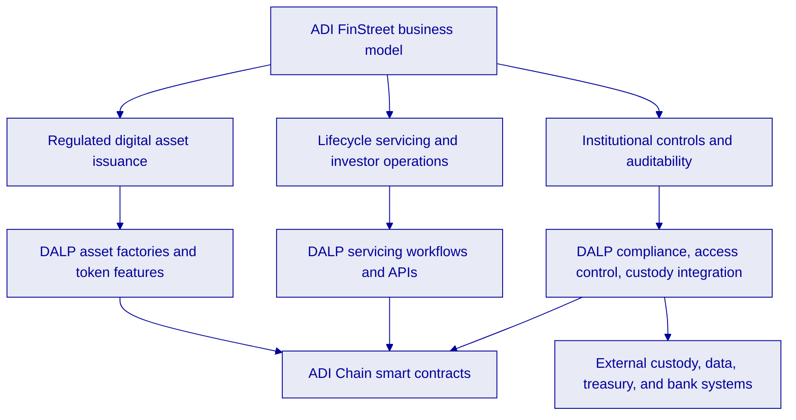
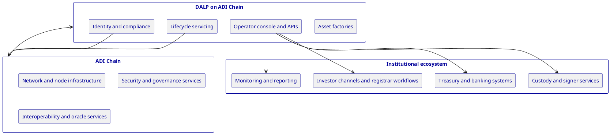
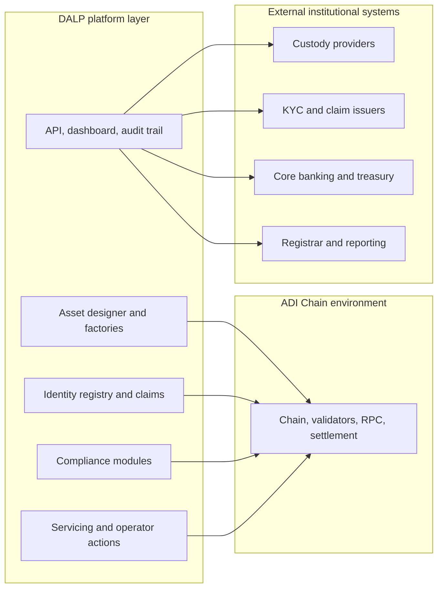
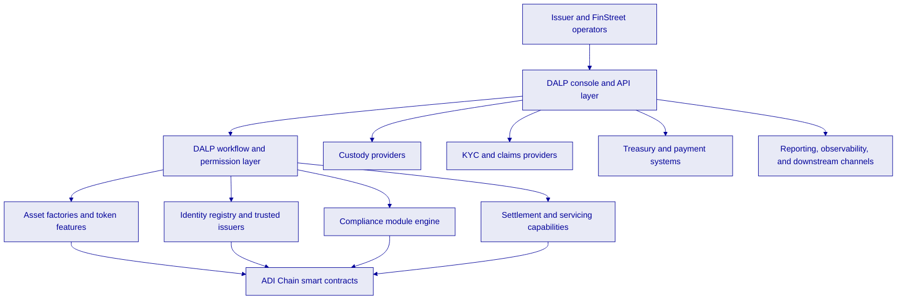
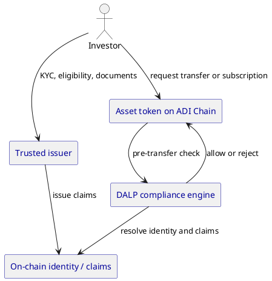
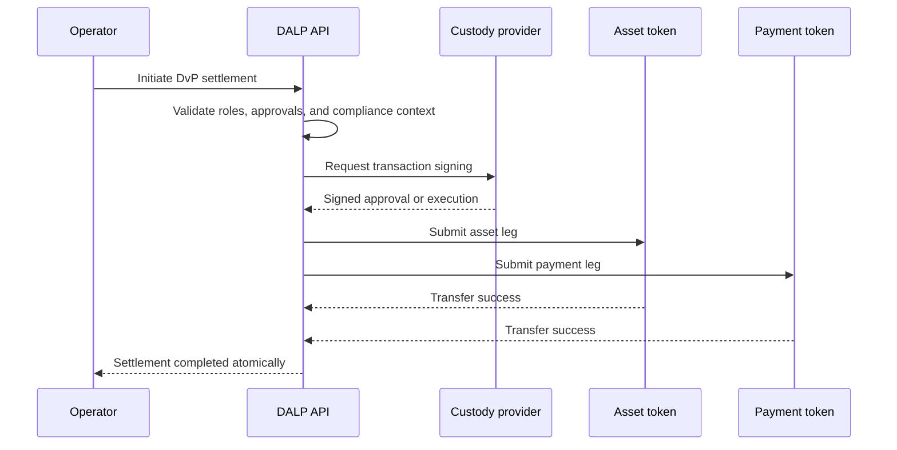
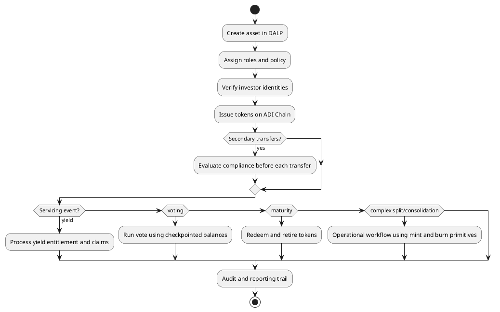
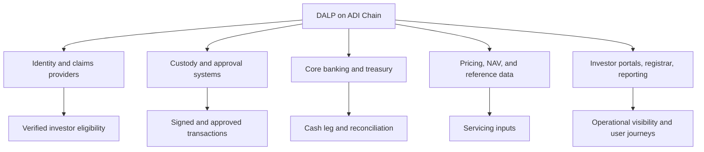

# Technical Proposal

## Proposal Title
DALP for ADI FinStreet, issuance and lifecycle management of regulated assets on ADI Chain

## Subtitle
Technical proposal, platform operating model, architecture, controls, and delivery approach

## Company
ADI FinStreet

## Valid Until
15 April 2026

## Contact Name
SettleMint Bid Team

## Contact Title
Digital Asset Platform Team

## Contact Email
bid@settlemint.com

## Contact Phone
[TO VERIFY]

---

## Executive Summary

ADI FinStreet's opportunity is not to prove that tokenization is possible. The market has already done that. The harder problem is to run regulated issuance and asset servicing on infrastructure that can enforce rules before execution, connect into custody and treasury controls, support investor governance, and keep operations auditable over time. That is the complexity of doing it right. This proposal positions SettleMint DALP as the platform layer for that operating model on ADI Chain.

DALP is a configurable digital asset lifecycle platform built for institutional issuance, servicing, compliance, and operations on EVM networks. Based on the DALP documentation and code reviewed for this proposal, the platform supports regulated token issuance through ERC-3643 and SMART Protocol compliance controls, identity-linked transfers, role-based operating controls, asset-type-specific token factories, runtime-configurable token features, and settlement workflows including DvP and XvP. For ADI FinStreet, that means DALP can serve as the issuance and lifecycle control plane for equity, bonds, funds, deposits, stablecoins, and other regulated digital assets deployed on ADI Chain, while preserving separation between on-chain enforcement, off-chain business workflows, and external institutional integrations.

The proposal does not assume DALP replaces every system in the ADI Chain ecosystem. It assumes DALP provides the asset layer, operator console, API surface, and policy enforcement engine inside a broader ADI Chain operating model that may also include chain services, external data and oracle services, institutional custody, fiat and treasury systems, registrar workflows, transfer agent controls, and investor-facing channels. That is consistent with the architecture direction discussed in the opportunity channel, including the ADI Chain planning diagram shared in Slack, which showed a layered model spanning core services, protocol and node infrastructure, orchestration and integration, access and custody, governance and treasury, security, wallet, network, external data, and client and bank integrations.

For ADI FinStreet specifically, DALP is strongest where institutional tokenization projects usually fail after the first demo: deterministic compliance before transfer, identity-aware investor controls, programmable servicing, corporate action primitives, operational segregation of duties, custody-provider abstraction, auditability, and observability. Where DALP has gaps or needs integration, this proposal states that clearly. For example, DALP supports dividend-style yield distribution, maturity redemption, governance voting, and core servicing actions, but a dedicated stock split engine is not currently verified in the reviewed materials. Stock splits and consolidations should therefore be positioned as workflow-driven operations built from controlled mint and burn primitives, governance controls, and back-office orchestration, not as a finished one-click native feature unless separately verified.

The recommended target state is an ADI Chain deployment in which DALP issues and manages regulated asset contracts, enforces investor and transfer rules through on-chain identity and modular compliance, exposes operator APIs and dashboards for FinStreet teams, connects to approved custody and treasury controls, and supports phased rollout from initial issuance use cases into broader lifecycle and market infrastructure.

---

## Opportunity Context and Design Principles

The opportunity context from the ADI Chain thread points to a platform role larger than a single token issuance app. The shared ADI Chain planning diagram describes a sovereign rollup model with core services, protocol and node infrastructure, interoperability, orchestration and integration, governance and treasury, custody and access, wallet, security, network, external data and oracle services, and domain-specific SPVs and token categories. That context matters because DALP should not be framed as the chain itself. It should be framed as the regulated asset platform that sits inside this architecture and turns ADI Chain into an operational market infrastructure rather than only a settlement network.

Public market context also supports this framing. ADI Foundation and FinStreet have announced strategic agreements linked to institutional asset tokenization and ecosystem build-out in Abu Dhabi. Those announcements indicate an ambition to attract large issuers and create a credible chain environment for funds, deposits, credit, and other regulated instruments. In that setting, the winning platform is not the one that can mint the first token fastest. It is the one that can support repeated issuance, policy changes, operator approvals, servicing events, investor controls, and integration into treasury and banking processes without breaking the control model every time a new instrument is launched.

This proposal therefore adopts five design principles.

First, chain and platform responsibilities should stay separate. ADI Chain provides the execution environment and surrounding network services. DALP provides the regulated asset control plane, issuance templates, asset servicing features, operator APIs, and compliance logic.

Second, compliance must be ex-ante. DALP's reviewed ERC-3643 implementation enforces identity and transfer controls before execution. That is the correct model for regulated issuance on ADI Chain.

Third, the operating model must survive beyond issuance day. Investor onboarding, claim expiry, holder servicing, voting, redemptions, freezes, exceptions, and audit requests are not edge cases. They are routine institutional operations.

Fourth, integration points should be explicit. Custody, banking rails, pricing and NAV feeds, registrar functions, and reporting systems remain part of the architecture. DALP should expose controlled APIs and events, not try to absorb those systems into a single monolith.

Fifth, claims must stay evidence-based. This proposal only attributes capabilities to DALP that were verified in the reviewed workspace sources, DALP documentation, or DALP code references. Open points are marked as assumptions or limitations.

---

## DALP Role in the ADI Chain Operating Model

DALP should be positioned as the asset issuance and lifecycle administration layer for ADI Chain. In practical terms, that means four responsibilities.

The first responsibility is asset definition and deployment. DALP supports asset classes for bonds, equity, funds, stablecoins, deposits, real estate, precious metals, and configurable tokens. The Asset Designer and factory model matter here because ADI FinStreet is unlikely to stop at a single instrument type. A credible platform on ADI Chain needs repeatable issuance patterns that can be controlled and audited. DALP's reviewed documentation shows asset factories, parameter validation, role assignment, and feature composition for these asset types.

The second responsibility is regulated transfer control. DALP implements ERC-3643 and its SMART Protocol layer with identity registry, trusted issuer claims, modular compliance modules, and fail-closed transfer evaluation. That makes DALP suitable for ADI Chain use cases where investor eligibility, jurisdiction, accreditation, KYC status, or holding restrictions must be enforced in the asset logic rather than left to downstream surveillance.

The third responsibility is lifecycle servicing. DALP covers core operational actions such as minting, burning, pausing, freezing, forced transfers, maturity-based redemption, fixed treasury yield distribution, and governance voting through ERC-5805-compatible voting power. This is where DALP becomes useful for FinStreet operations teams, because issuance is only the beginning of the lifecycle.

The fourth responsibility is institutional operations. DALP includes a dual-layer permission model, organization-scoped access, on-chain role authority, custody abstraction across local and external signers, API surfaces, and observability integration. For ADI Chain, this allows FinStreet to present a controlled operational layer to issuers, operators, compliance teams, and possibly downstream ecosystem participants without exposing raw chain complexity to each of them.

What DALP is not, based on the reviewed evidence, is the full market infrastructure stack by itself. Matching engine functions, fiat movement, banking settlement, registrar administration, external KYC providers, and some complex corporate action workflows remain external systems or integrations. That is not a weakness in this proposal. It is the correct institutional architecture boundary.

---

## Target Use Cases for ADI FinStreet

### Equity issuance and shareholder operations

The strongest directly verified ADI FinStreet reference in the workspace is tokenized equity on ADI's Abu Dhabi-based mainnet, with on-chain voting through ERC20Votes, upgradeable contracts, and institutional custody integration paths including DFNS and Fireblocks. DALP's reviewed token documentation also confirms equity support, ERC-5805 voting power, historical balance checkpoints, and governance-oriented lifecycle features.

That makes DALP a strong fit for primary issuance of tokenized equity and ongoing shareholder operations on ADI Chain. Investor entitlement can be tied to verified identity, transfers can be restricted through compliance modules, voting rights can be delegated and checkpointed, and record-date logic can be supported through historical balances. For FinStreet, this is important because an equity token is not only a balance ledger. It is a governance and entitlement instrument whose operational burden usually grows after issuance.

The main limitation is corporate action breadth. Dividend-style distribution, governance voting, minting, burning, and forced transfer controls are evidenced. A dedicated native stock split or reverse split engine is not verified in the reviewed DALP materials. The workspace explicitly marks that as a gap that would require workflow coordination using existing mint and burn primitives and external orchestration. This proposal therefore recommends positioning DALP as fully capable for equity issuance, transfer controls, and voting, and partially capable for advanced equity servicing depending on the exact corporate action set.

### Fixed income, funds, deposits, and cash-equivalent instruments

DALP's asset catalog and lifecycle materials show support for bonds with face value, maturity date, denomination asset, fixed treasury yield, and maturity redemption. They also show support for funds, stablecoins, and deposits. For ADI Chain, that matters because FinStreet's strategic value will likely come from a multiproduct asset environment rather than a single equity deployment. DALP's ability to issue bond, fund, deposit, and stablecoin instruments from a common operating model is relevant to that expansion path.

For bonds, DALP can encode denomination asset, maturity, redemption, and yield mechanics. For funds, DALP supports NAV-linked patterns and AUM fee logic. For deposits and stablecoins, DALP documentation shows cash-equivalent asset support and compliance patterns such as collateral or reserve-linked controls. Those capabilities make DALP suitable as a product factory for a phased ADI Chain roadmap.

### Investor onboarding and transfer eligibility

DALP's identity and compliance architecture is one of the most important reasons to use it in a regulated ADI Chain environment. The reviewed materials confirm on-chain identities, trusted issuers, verification claims, and compliance modules spanning identity, geography, volume, timing, investor limits, and collateral requirements. This lets FinStreet define which investors can hold which asset, under which conditions, and with which exceptions.

That is a better model than relying on exchange-side policy alone because asset rules travel with the token. If an asset must only move between verified investors in approved jurisdictions, DALP can enforce that in the token transfer path itself.

### Settlement, treasury, and exchange versus payment workflows

DALP documentation confirms DvP and XvP settlement support, including local atomic settlement and HTLC-based cross-chain modes. For ADI Chain, the immediate use case is likely local single-chain DvP rather than cross-chain complexity. That means a regulated asset token and a payment or deposit token on ADI Chain can be exchanged atomically, with both legs succeeding or both reverting.

This is a key design point for FinStreet because institutional buyers do not want settlement exposure between the asset leg and the payment leg. DALP gives FinStreet a standards-based way to couple those legs while still applying each token's compliance checks. That architecture is also extensible into more complex treasury or distribution patterns over time.

---

## Technical Solution Architecture

### Platform architecture

The proposed architecture places DALP as an application and contract layer on top of ADI Chain, with controlled integration into custody, KYC, treasury, reporting, and external participant systems.

At the bottom sits ADI Chain itself, including validator infrastructure, RPC access, network security, and the chain services required by the ecosystem. DALP deploys its smart contracts to that network and interacts through RPC and indexer services. On top of the chain, DALP provides smart contract factories, identity registry contracts, compliance modules, role-controlled asset contracts, and settlement capabilities. Above that, DALP's console and APIs provide the operational layer for issuers and FinStreet teams. Around it sit the institutional integrations.

### Identity and compliance architecture

DALP's compliance model is based on ERC-3643 and SMART Protocol. That means every holder must have a verified on-chain identity, every transfer is checked before execution, and claims used in compliance decisions must come from trusted issuers. This is the right model for ADI Chain because FinStreet can define investor classes and transfer eligibility in a way that is both enforceable and inspectable.

The reviewed materials describe a three-tier compliance interface hierarchy and a catalog of modular controls that can be combined by asset type and jurisdiction. That matters because ADI Chain is likely to host multiple instruments with different policy sets. The platform should support policy composition rather than one hard-coded rulebook.

### Access control and operational segregation

DALP uses a dual-layer authorization model with off-chain organization roles and on-chain role enforcement. The chain is treated as the source of truth for role assignments, while route-level middleware enforces access at API level. This is relevant to FinStreet because digital asset operations need more than a generic administrator role. They require separation between system governance, identity administration, token management, compliance management, treasury-facing actions, and emergency actions.

The reviewed access control materials also confirm step-up verification for sensitive actions, custody-provider policy checks, and durable audit evidence. Those capabilities are important for a platform that may be used by FinStreet operators, issuers, and regulated counterparties.

### Settlement, treasury, and custody integration

DALP is not a custodian. The reviewed security materials explicitly position it as a bring-your-own-custodian model with support for Fireblocks and DFNS integrations and provider-abstracted signing. For ADI FinStreet, that is the correct institutional stance. DALP should orchestrate approvals and signer calls while external custody remains the key-protection boundary.

On settlement, DALP supports DvP and XvP. In the recommended ADI Chain operating model, this is used for asset-versus-payment settlement using payment tokens, deposit tokens, or equivalent cash-leg instruments issued on the same network. For more complex banking settlement, DALP should integrate with treasury and banking systems rather than replace them.

### Observability and operational support

Institutional deployments need more than successful transaction execution. They need operational visibility. The reviewed DALP security and capability materials confirm an observability stack with Grafana and related telemetry components, and the opportunity thread included a Grafana screenshot from the ADI environment. That makes observability part of the proposal story, not a side note.

For FinStreet, this should be framed as three outcomes: transaction and RPC health monitoring, visibility into operational bottlenecks, and auditable evidence when something fails or degrades. In regulated environments, the ability to explain why an action was rejected or delayed is often as important as the action itself.

---

## Asset Lifecycle Coverage for ADI FinStreet

### Issuance and launch

DALP supports guided asset creation through the Asset Designer and programmatic deployment through APIs and factories. For ADI FinStreet, this creates a repeatable issuance pipeline. Asset terms, roles, identity requirements, compliance templates, and token features are configured before launch. This reduces the amount of bespoke contract design required for each product.

### Distribution and investor access

Investor onboarding is controlled through identity issuance, verification claims, and policy-based eligibility. Once an investor is eligible, tokens can be distributed through standard minting and transfer paths or through more structured sales and allocation workflows. DALP's model is useful here because it makes investor access a governed process rather than a simple wallet allowlist.

### Ongoing servicing

Servicing operations are where DALP can create the most operational value for FinStreet. The reviewed materials confirm freezing and unfreezing, pauses, forced transfers, maturity redemption, fixed treasury yield claims, record-date style historical balances, and governance voting support. These are the tools that make the platform operationally usable after issuance.

For equity-like instruments on ADI Chain, the most relevant verified servicing features are governance voting, historical checkpoints, mint and burn controls, and role-based operational actions. For fixed-income instruments, the most relevant are maturity and yield. For funds, NAV-linked and fee-oriented features matter. DALP therefore supports a lifecycle-first operating model rather than a one-time issuance model.

### Corporate actions and exceptions

This is the area where precision matters most. DALP clearly supports several corporate action primitives, including yield distribution, voting, maturity-based redemption, forced transfers, and controlled burn and mint actions. However, the reviewed workspace also states that a dedicated stock split or reverse split feature is not currently verified in the platform's token feature catalog. That means ADI FinStreet should treat advanced corporate actions in three categories.

The first category is fully supported, such as dividend or yield-style distribution, maturity redemption, and voting.

The second category is workflow-supported but not productized as a dedicated feature, such as stock splits, consolidations, and some conversion flows. These can be implemented through controlled operational workflows using DALP primitives and external approvals.

The third category is outside current scope unless separately developed or integrated, such as complex tender offers or full registrar-grade rights offerings.

That distinction helps FinStreet avoid overcommitting in early phases while still designing a credible lifecycle roadmap.

---

## Integrations Required for Production ADI FinStreet Deployment

A credible ADI FinStreet deployment on ADI Chain should assume a defined integration perimeter from the start.

The first integration domain is identity and verification. DALP can store and enforce claims, but the source KYC, AML, accreditation, and entity-verification processes may come from approved third-party providers or FinStreet's own operating processes. DALP should be positioned as the claim enforcement and policy layer, not the document-checking vendor itself.

The second integration domain is custody and signing. DALP supports signer abstraction and custody integration paths, but institutional key control remains with the selected provider and governance process. This is important for treasury, issuance approvals, emergency operations, and operational separation of duties.

The third integration domain is banking and treasury. DALP can manage tokenized asset logic and on-chain settlement patterns, but fiat movement, reconciliations, and accounting postings still belong in banking, ERP, or treasury systems. For ADI Chain, this is especially relevant if payment tokens or deposit tokens are paired with bank-side funding events.

The fourth integration domain is pricing, NAV, reference data, and servicing inputs. Funds, bonds, and some equity workflows need external data such as valuations, calendars, or entitlement data. DALP documentation shows feed-oriented patterns, but the operating owner of the underlying data must be defined in the deployment design.

The fifth integration domain is reporting and downstream channel exposure. FinStreet may need issuer portals, investor channels, registrar processes, or analytics layers beyond DALP's console. DALP's API and event surfaces should feed these systems rather than force all user journeys into one interface.

---

## Security, Governance, and Risk Controls

For ADI FinStreet, security should be described as an operating model, not only a contract property. DALP's reviewed materials show four layers of control that matter here.

The first is contract-level control. Asset contracts use role-based permissions, compliance hooks, and type-aware factories. This reduces the risk of misconfigured token behavior and makes permissions explicit.

The second is organizational and route-level control. DALP validates organization scope, role assignments, and interface support before write operations execute. This helps prevent a user with broad console access from invoking unsupported or unauthorized blockchain actions.

The third is custody and approval control. DALP can route transactions through external custody and signer policies, which is essential for institutional governance on ADI Chain.

The fourth is audit and observability control. Role events, transaction history, compliance outcomes, and infrastructure metrics provide the evidence needed for internal controls and external review.

For ADI FinStreet, the recommended governance pattern is clear separation between platform administrators, identity and compliance operators, token managers, and treasury or custody approvers. That aligns well with DALP's reviewed role taxonomy.

---

## Proposed Delivery Phasing

### Phase 1, foundation and control model

The first phase should establish the ADI Chain deployment topology, the DALP environment, custody integration pattern, role model, supported asset types, and baseline identity and compliance controls. The output of this phase is not only a running environment. It is a signed-off control model for who can do what, on which system, under which approval conditions.

### Phase 2, first production asset and operator workflows

The second phase should focus on one production-priority asset class, most likely equity if the reference ADI FinStreet use case remains the lead path. This phase includes issuance workflow validation, investor onboarding, transfer policy configuration, voting or governance setup where relevant, and reconciliation with treasury and reporting processes.

### Phase 3, servicing and settlement expansion

The third phase should add servicing workflows, settlement token pairing, DvP or XvP patterns where required, and the first expanded operating procedures for exceptions, freezes, redemptions, and audit review.

### Phase 4, multiproduct scale-out

The fourth phase should extend the same platform controls into additional ADI Chain instruments such as bonds, funds, deposits, or stablecoins. At this point, the success measure is not only more assets. It is lower marginal effort to launch each additional regulated product.

---

## Why DALP Fits ADI FinStreet

DALP fits ADI FinStreet because it addresses the institutional parts of tokenization that usually determine whether a chain ecosystem becomes operationally credible.

It supports multiple asset classes from a common platform model, which matters for ADI Chain expansion.

It enforces investor and transfer rules before execution through identity-linked compliance, which matters for regulated market confidence.

It provides lifecycle and servicing primitives, which matter because FinStreet must operate assets after issuance rather than only launch them.

It supports role-driven operations, custody integration, and auditability, which matter for real institutional controls.

It also fits because its boundaries are realistic. DALP does not need to become the whole ADI Chain stack to create value. It needs to become the platform that makes regulated assets on ADI Chain repeatable, governable, and operable.

---

## Assumptions, Limitations, and Open Points

This proposal relies on several explicit assumptions.

ADI Chain is treated as an EVM-compatible execution environment suitable for DALP deployment. The workspace materials describe ADI Chain as a UAE-based chain for institutional finance and the shared Slack architecture sketch points to an EVM and rollup-oriented model. If ADI Chain introduces non-EVM constraints, this architecture must be revalidated.

The proposal assumes FinStreet wants DALP to operate as the issuance and lifecycle platform on top of ADI Chain, not as a replacement for chain infrastructure, banking systems, or external KYC and custody providers.

The proposal assumes institutional custody patterns using DFNS, Fireblocks, or equivalent signer infrastructure remain in scope. DALP documentation supports that integration model.

The following points remain open or limited based on reviewed evidence.

A dedicated native stock split and reverse split feature is not verified. Stock splits and consolidations should be treated as governed workflows using mint and burn primitives and back-office coordination unless DALP product evidence is expanded.

Native same-token bridging across chains is not verified in DALP. Cross-chain scenarios are evidenced through XvP and HTLC settlement rather than native bridge contracts.

Exact ADI production architecture, validator count, hosting topology, and operational SLAs were not fully specified in the retrieved thread history available to this run and should be confirmed during solution design.

Direct evidence from the ADI opportunity thread was strongest around the planning diagram, DALP screenshots from the opportunity workstream, and the task framing itself. If the main team has additional thread files or architecture notes, those should be folded into the next iteration.

---

## Conclusion

ADI FinStreet's challenge is not whether ADI Chain can host tokenized assets. It is whether the operating model around those assets will stand up to real issuance, investor management, compliance enforcement, servicing, and institutional review. DALP is a strong fit for that problem.

The reviewed DALP evidence supports a clear positioning. DALP can act as the regulated asset platform on ADI Chain, providing asset factories, compliance enforcement, identity-aware transfer controls, servicing primitives, voting, maturity and yield workflows, settlement patterns, operational APIs, dashboards, and institutional control boundaries. That gives ADI FinStreet a practical route from initial asset launch to repeatable market infrastructure.

The right deployment approach is phased and disciplined. Start with a control model and one production-grade asset path. Prove issuance, investor onboarding, transfer restrictions, approvals, and servicing. Then expand into settlement and additional asset types using the same operating model. That is how ADI FinStreet can make ADI Chain a credible environment for regulated digital assets rather than only a technical demonstration.
