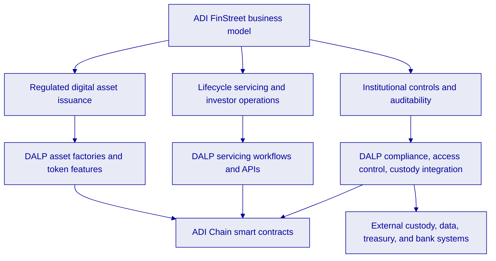
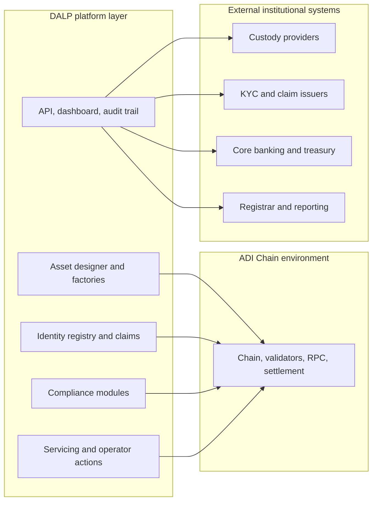
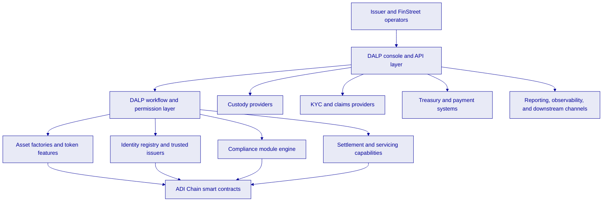
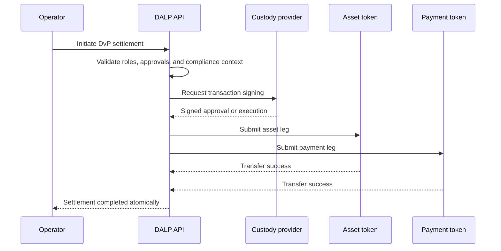
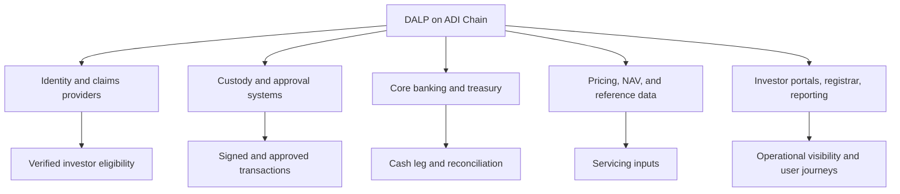

# ADI FinStreet Proposal Diagram Sources

## Diagram 1, platform fit

## Diagram 2, operating model layering

## Diagram 3, solution architecture

## Diagram 4, DvP flow

## Diagram 5, integration perimeter

