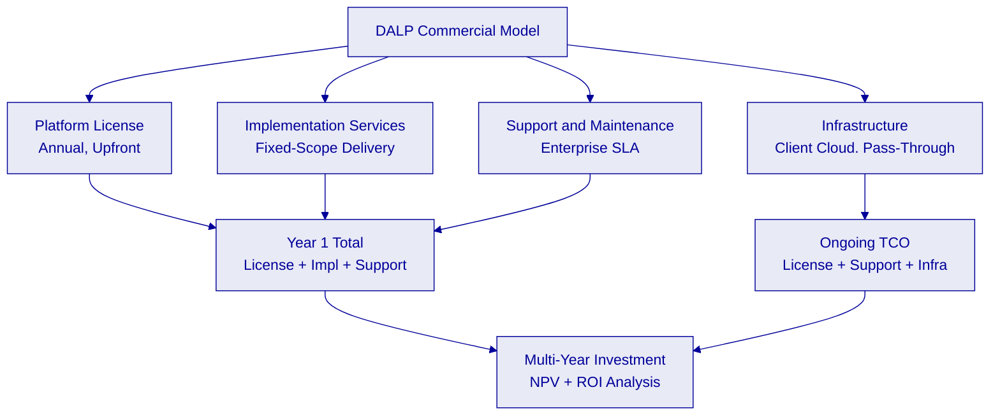

# Commercial Proposal

**Tokenized Fixed Income Platform**
**Submitted to: HDFC Bank**
**RFP Reference: HDFC-BANK-RFP-202603**
**Date: March 2026**
**Version: 1.0 Draft**
**Prepared by: SettleMint NV, Leuven, Belgium**
**Classification: Confidential – For Evaluation Purposes Only**

> All prices exclude applicable taxes and VAT. Taxes are added separately based on HDFC Bank's jurisdiction and applicable tax treaties.

---

## Table of Contents

1. Commercial Summary
2. Pricing Structure
3. Licensing Model
4. Implementation Investment
5. Support and Maintenance
6. Total Cost of Ownership
7. Payment Terms and Conditions
8. Value Analysis and ROI
9. Contract Framework
10. Commercial Assumptions and Exclusions

---

## Commercial Summary

This commercial proposal sets out SettleMint's pricing, licensing structure, implementation investment, and total cost of ownership for the DALP tokenized fixed income platform deployment at HDFC Bank. It is the companion document to SettleMint's technical proposal responding to HDFC-BANK-RFP-202603.

The commercial proposal is structured for four distinct audiences on HDFC Bank's evaluation committee: procurement and sourcing teams who need clear pricing terms and contractual structures; business sponsors who need to understand the investment relative to expected business value; technology and operations leads who need to understand the support model; and finance teams who need to understand the total cost model over a multi-year horizon.

### Commercial Architecture Diagram

### Document Map

| Section | Purpose | Primary Audience |
|---------|---------|-----------------|
| Pricing Structure | Platform license fees and structure | Procurement, Finance |
| Licensing Model | License types, environments, terms | Procurement, Technology |
| Implementation Investment | One-time delivery costs | Business Sponsors, Finance |
| Support and Maintenance | Ongoing support model and costs | Technology, Operations |
| Total Cost of Ownership | Multi-year cost model | Finance, Business Sponsors |
| Payment Terms | Payment schedule and contractual terms | Procurement, Finance |
| Value Analysis and ROI | Business value and investment return | Business Sponsors, Executive |
| Commercial Assumptions | Scope boundaries and exclusions | All audiences |

---

## Pricing Structure

### Platform License Fees

SettleMint's platform licensing follows a per-environment annual model. The base license rates are:

| License Type | Monthly Equivalent | Annual Fee (upfront) |
|---|---|---|
| Production License | €25,000/month | €300,000/year |
| Development License | €10,000/month | €120,000/year |

> **Payment terms: Annual, upfront. All prices exclude applicable taxes and VAT.**

### Recommended Environment Configuration

For HDFC Bank's tokenized fixed income programme, SettleMint recommends the following environment configuration:

| Environment | Purpose | License Type | Annual Fee |
|-------------|---------|--------------|------------|
| Production | Live transaction processing | Production | €300,000 |
| Staging/UAT | Pre-production validation and integration testing | Development | €120,000 |
| Development | Feature development and internal testing | Development | €120,000 |
| **Annual Platform License Total** | | | **€540,000** |

> Multi-environment combined pricing: €540,000/year upfront for Production + two Development environments. All prices exclude applicable taxes and VAT.

### License Fee Summary

| Year | Platform License | Notes |
|------|-----------------|-------|
| Year 1 | €540,000 | Three environments (1 Production, 2 Development) |
| Year 2+ | €540,000/year | Same structure, subject to annual renewal |

---

## Licensing Model

### What the License Includes

The DALP platform license includes the following for each licensed environment:

**Platform Software.** Full access to the DALP platform software stack: Asset Console (web UI), Unified API (OpenAPI 3.1), TypeScript SDK, Execution Engine, Key Guardian, Chain Indexer, Chain Gateway, Feeds System, and all SMART Protocol smart contracts including the DALPAsset contract and all compliance modules.

**Platform Updates.** Continuous platform updates delivered by SettleMint, including security patches, compliance module updates, and feature releases. Updates are deployed according to the support tier's update cadence.

**Documentation.** Full technical documentation, API reference, runbooks, operational procedures, and integration guides. Documentation is updated with each platform release.

**Smart Contract Deployment Rights.** Right to deploy DALP smart contracts on the licensed blockchain networks as configured in the deployment agreement.

### What the License Does Not Include

The platform license does not include:

- Implementation and professional services (priced separately, see Section 4)
- Cloud or on-premises infrastructure costs (pass-through at cost for managed services; borne by client for private cloud or on-premises)
- Third-party software licenses (KYC systems, payment rail connectors, HSM software, custody providers)
- Custom smart contract development beyond the standard DALP catalog

### License Terms

- License term: minimum 12 months, renewable annually
- License is non-transferable and non-sublicensable
- License is scoped to the specific environments and blockchain networks defined in the deployment agreement
- License does not expire mid-term if the platform is operational; SettleMint will not suspend a live production environment for non-renewal without 90 days' written notice

---

## Implementation Investment

### Implementation Scope

Implementation services cover the delivery of a production-ready DALP deployment for HDFC Bank's tokenized fixed income programme. The implementation follows SettleMint's five-phase methodology (19 weeks) as described in the technical proposal.

### Implementation Pricing

Implementation costs are specific to HDFC Bank's programme scope, integration complexity, and deployment model. The figures below represent SettleMint's standard ranges for APAC bank deployments of comparable scope. Final pricing is subject to scope validation during Phase 1.

| Workstream | Scope Description | Investment Range |
|-----------|------------------|-----------------|
| Discovery and Architecture | Requirements workshops, architecture design, regulatory mapping, compliance blueprint | [CLIENT-SPECIFIC: scoped at contract] |
| Foundation and Setup | Environment provisioning, blockchain network initialization, identity framework | [CLIENT-SPECIFIC: scoped at contract] |
| Configuration and Compliance | Asset template configuration, compliance module setup, workflow configuration | [CLIENT-SPECIFIC: scoped at contract] |
| Integration Development | Finacle GL integration, KYC system integration, RTGS/NDS-OM integration, reporting integrations | [CLIENT-SPECIFIC: scoped at contract] |
| Testing and Validation | SIT, UAT support, performance testing, security testing, regulatory documentation | [CLIENT-SPECIFIC: scoped at contract] |
| Go-Live and Hypercare | Production deployment, go-live support, knowledge transfer, 4 weeks intensive post-go-live | [CLIENT-SPECIFIC: scoped at contract] |
| Training | Platform administration, operations, compliance officer, developer, train-the-trainer | [CLIENT-SPECIFIC: scoped at contract] |
| **Total Implementation Investment** | | **[CLIENT-SPECIFIC: scoped at contract]** |

> Implementation pricing is marked [CLIENT-SPECIFIC] and will be confirmed during scoping. For context: SettleMint's comparable APAC bank implementations for regulated tokenized fixed income programmes have ranged from €400,000 to €900,000 depending on integration complexity, number of instrument types, and regulatory scope.

### Fixed-Price vs. Time-and-Materials

SettleMint offers implementation services on a **fixed-price basis** for defined-scope workstreams. The fixed-price model requires a detailed scope agreement at the start of each phase. Out-of-scope work is managed through a formal change control process.

Time-and-materials pricing is available for discovery phases and for open-ended integration workstreams where scope is not determinable in advance. The specific pricing model for each workstream is agreed during the commercial negotiation.

---

## Support and Maintenance

### Recommended Support Tier: Enterprise

SettleMint recommends the **Enterprise Support** tier for HDFC Bank's production deployment. This tier provides:

| Attribute | Enterprise Support |
|-----------|-------------------|
| Coverage Hours | 24/7/365 |
| Uptime SLA | 99.99% monthly |
| P1 Response | 15 minutes |
| P2 Response | 1 hour |
| Named Contacts | Unlimited |
| Account Management | Bi-weekly review, named CSM |
| Designated Support Team | Named team, deep deployment familiarity |
| Solution Architect Access | Quarterly architecture reviews |

### Support Costs

| Support Element | Annual Cost |
|----------------|-------------|
| Enterprise Support (included with Enterprise license tier) | [CLIENT-SPECIFIC: included or add-on based on tier] |
| Designated Support Engineer (add-on) | [CLIENT-SPECIFIC: scoped at contract] |
| On-site support days (annual pool) | [CLIENT-SPECIFIC: scoped at contract] |

> Note: For the Enterprise licensing tier, base Enterprise Support coverage is included in the license fee. Additional support elements (dedicated support engineer, on-site days) are scoped per engagement.

---

## Total Cost of Ownership

### Three-Year TCO Model

The table below presents indicative three-year total cost of ownership for HDFC Bank's tokenized fixed income deployment. Implementation costs are one-time; license and support costs recur annually. Infrastructure costs are HDFC Bank's own cloud spend (pass-through).

| Cost Category | Year 1 | Year 2 | Year 3 | 3-Year Total |
|---------------|--------|--------|--------|-------------|
| Platform License (3 environments) | €540,000 | €540,000 | €540,000 | €1,620,000 |
| Implementation Services | [CLIENT-SPECIFIC] | - |, | [CLIENT-SPECIFIC] |
| Support and Maintenance | [CLIENT-SPECIFIC] | [CLIENT-SPECIFIC] | [CLIENT-SPECIFIC] | [CLIENT-SPECIFIC] |
| Infrastructure (Cloud. HDFC Bank pass-through) | Client cost | Client cost | Client cost | Client cost |
| **Total (excl. infrastructure and impl.)** | **€540,000 + impl.** | **€540,000** | **€540,000** | **€1,620,000 + impl.** |

> All figures exclude applicable taxes and VAT.

### Build vs. Buy Analysis

HDFC Bank's evaluation committee will consider whether to build an equivalent platform internally or procure DALP. The following analysis provides directional guidance:

| Dimension | Build Internally | DALP (SettleMint) |
|-----------|-----------------|-------------------|
| Time to production | 24-36 months (estimated) | 19 weeks |
| Smart contract audit cost | €300,000-€600,000 (ERC-3643 from scratch) | Included (audited SMART Protocol) |
| Compliance module development | 18+ months, specialist team required | Available immediately, configurable |
| ISO 27001 / SOC 2 | 18-24 months to certify | Already certified |
| Regulatory examination documentation | Created from scratch | Provided by SettleMint |
| Ongoing maintenance | 4-8 FTE blockchain engineers | Covered by license |
| 3-year total cost (build) | €6M-€12M (conservative estimate) | €1.6M + impl. + support |
| Risk of regulatory non-compliance | High (compliance logic custom-built) | Low (proven in regulated deployments) |

### Infrastructure Cost Guidance

For HDFC Bank's private cloud deployment on AWS Mumbai or Azure India West, indicative infrastructure costs are:

| Component | Estimated Monthly Cost |
|-----------|----------------------|
| Kubernetes cluster (production) | USD 2,000-4,000 |
| Managed PostgreSQL (production) | USD 500-1,500 |
| Hyperledger Besu nodes (3 validators) | USD 1,500-3,000 |
| Secret manager / KMS | USD 200-500 |
| Monitoring (Grafana Cloud or equivalent) | USD 200-500 |
| **Total infrastructure (production only)** | **USD 4,400-9,500/month** |
| | **(approx. INR 3.7L-8.0L/month at 1 USD = 84 INR)** |

> Infrastructure costs are HDFC Bank's own cloud spend and are not marked up by SettleMint. These figures are indicative and depend on instance sizing and cloud provider agreements. INR equivalents are provided at indicative exchange rates and will reflect market rates at time of deployment.

---

## Payment Terms and Conditions

### Platform License Payment

- Platform license fees are invoiced **annually, upfront** at the start of each license year.
- Invoice is due net 30 days from invoice date.
- The first license year begins on the date the production environment is handed over to HDFC Bank operations.
- For the development and staging environments (provisioned earlier in the implementation), a pro-rated license fee applies from provisioning date to the production go-live date, after which the full annual fee applies.

### Implementation Services Payment

- Implementation services are invoiced against defined delivery milestones.
- Standard milestone schedule: 25% at contract signature, 25% at Phase 2 completion (environments live), 25% at Phase 4 completion (UAT sign-off), 25% at production go-live.
- Alternative milestone schedules available by agreement.
- Payment is due net 30 days from invoice date and milestone acceptance.

### Support and Maintenance Payment

- Annual support fees are invoiced at the start of each support year.
- The first support year is co-terminus with the first platform license year.
- Payment is due net 30 days from invoice date.

### Currency

- All platform license fees are invoiced in EUR.
- Implementation services can be invoiced in EUR, USD, SGD, or GBP by agreement.
- INR-denominated invoicing is available for entities incorporated in India, subject to applicable tax treatment.

---

## Value Analysis and ROI

### Business Value Framework

HDFC Bank's investment in DALP generates value across four dimensions:

**1. Operational Efficiency.** Tokenized fixed income eliminates manual reconciliation across multiple legacy systems, reduces settlement times from T+2 to T+0, and automates corporate action processing. Based on comparable deployments, institutions capture 60-80% reduction in settlement operations headcount for digitized instrument types.

**2. Regulatory Risk Reduction.** Built-in compliance enforcement at the smart contract layer reduces the risk of compliance failures compared to procedural controls. Immutable audit trails reduce examination preparation time and improve regulator confidence. CERT-In cybersecurity controls are structurally enforced rather than process-dependent.

**3. Time to Market.** A 19-week implementation timeline versus 24-36 months for an internally built solution represents a significant competitive advantage. HDFC Bank captures first-mover position in India's institutional tokenized fixed income market 18-24 months ahead of an internal build timeline.

**4. Platform Extensibility.** DALP's architecture supports expansion to additional asset classes (equity, funds, deposits, stablecoins) and additional markets (GIFT City expansion, international DvP connectivity) without re-platforming. The Year 1 investment creates infrastructure that supports a multi-year product expansion roadmap.

### ROI Indicators

| Value Driver | Quantification Basis | Indicative Impact |
|-------------|---------------------|------------------|
| Settlement operations efficiency | Industry average: 60-70% headcount reduction for digitized workflows | Significant multi-year FTE savings |
| Reconciliation automation | Elimination of manual HDFC Bank-to-NSDL/CDSL reconciliation | 2-5 operations FTE equivalent |
| Time to market advantage | 18-24 month headstart vs. build | First-mover revenue on new tokenized product line |
| Regulatory penalty avoidance | Compliance enforcement structural rather than procedural | Material risk reduction value |
| Infrastructure cost savings | Platform vs. build: 3-year cost difference | €4M-€10M (conservative) |

### Reference for ROI Validation

SettleMint is prepared to facilitate reference conversations with existing clients who have completed comparable deployments under NDA. This provides HDFC Bank's evaluation committee with direct evidence of realized operational benefits rather than projected estimates.

---

## Contract Framework

### Contract Structure

The commercial engagement between SettleMint and HDFC Bank is governed by the following contract structure:

| Document | Purpose |
|---------|---------|
| Master Services Agreement (MSA) | Governing terms, IP ownership, liability, confidentiality |
| Platform License Agreement | License scope, permitted use, restrictions, audit rights |
| Statement of Work (SOW) | Implementation scope, deliverables, milestones, acceptance criteria |
| Support Agreement | Support tier, SLA terms, escalation procedures |
| Data Processing Agreement (DPA) | GDPR/data protection obligations where personal data is processed |

### Warranty Terms

SettleMint provides the following warranties under the engagement:

| Warranty | Period | Coverage |
|---------|--------|---------|
| Platform software warranty | 12 months from go-live | Defects in DALP platform functionality corrected at no additional charge |
| Implementation warranty | 90 days from UAT sign-off | Defects in configuration, integration, or delivered artefacts corrected at no additional charge |
| Smart contract correctness | Continuous (under license) | Compliance engine and token logic operate per documented specifications |
| SLA compliance | Per support tier | SLA credits issued for uptime shortfalls per Enterprise Support tier terms |

Warranty exclusions: defects caused by HDFC Bank modifications to DALP configurations without SettleMint guidance, third-party system failures, force majeure, and changes to HDFC Bank's infrastructure that affect DALP operation without prior SettleMint consultation.

### IP Ownership

- DALP platform software and smart contracts: SettleMint's intellectual property
- Client configurations, data, and business logic: HDFC Bank's intellectual property
- Integration code developed for HDFC Bank: jointly owned or HDFC Bank-owned by agreement
- SettleMint does not claim ownership of HDFC Bank's tokenized instruments or client data

### Liability and Indemnification

Standard SettleMint MSA terms apply. Key positions:

- SettleMint's aggregate liability cap: 12 months of platform license fees paid
- Mutual indemnification for IP infringement claims
- Indemnification by HDFC Bank for claims arising from HDFC Bank's use of the platform beyond its licensed scope

> Specific liability terms are subject to negotiation during the commercial process.

---

## Commercial Assumptions and Exclusions

### Assumptions

This commercial proposal is based on the following assumptions. Material changes to these assumptions may affect pricing:

1. HDFC Bank's deployment uses DALP standard contract types (DALPAsset, Bond factory). Custom smart contract development is out of scope.
2. Integration with HDFC Bank's KYC/AML system uses DALP's standard identity claims API. Custom KYC system integration requiring significant middleware development is treated as an additional integration workstream.
3. Blockchain network is Hyperledger Besu in permissioned configuration, deployed within HDFC Bank's cloud tenancy. Public network deployment requires additional network configuration assessment.
4. Infrastructure costs are borne by HDFC Bank and are not included in SettleMint's pricing.
5. Implementation timeline assumes HDFC Bank stakeholder availability for Phase 1 workshops within 4 weeks of contract execution.
6. Third-party software licenses (KYC system, HSM software, custody provider agreements) are procured by HDFC Bank independently.

### Exclusions

The following are explicitly excluded from the scope of this proposal:

- Custom blockchain network development or protocol modifications
- Custom smart contract features beyond the DALP catalog
- Physical security of HDFC Bank's data centers or cloud accounts
- Legal advice or regulatory filings (SettleMint provides technical compliance mapping; legal advice is HDFC Bank's responsibility)
- Translation of platform documentation into Hindi or regional Indian languages
- Integration with systems not identified in the technical proposal (additional integrations are treated as change requests)

### Change Management

Changes to scope during implementation are managed through a formal change request process:

1. HDFC Bank submits a written change request describing the proposed change
2. SettleMint provides a written impact assessment (scope, timeline, cost) within 5 business days
3. Changes are implemented only upon written approval from authorized representatives of both parties
4. No change is implemented without written agreement on cost, timeline, and scope impact

---

*This commercial proposal is submitted by SettleMint NV in response to HDFC-BANK-RFP-202603. All pricing reflects SettleMint's current standard rates. Platform license pricing is locked at the stated figures; implementation and support pricing is scoped per engagement. All figures exclude applicable taxes and VAT.*

*Classification: Confidential, for evaluation purposes only. Not for distribution outside the HDFC Bank evaluation committee.*
