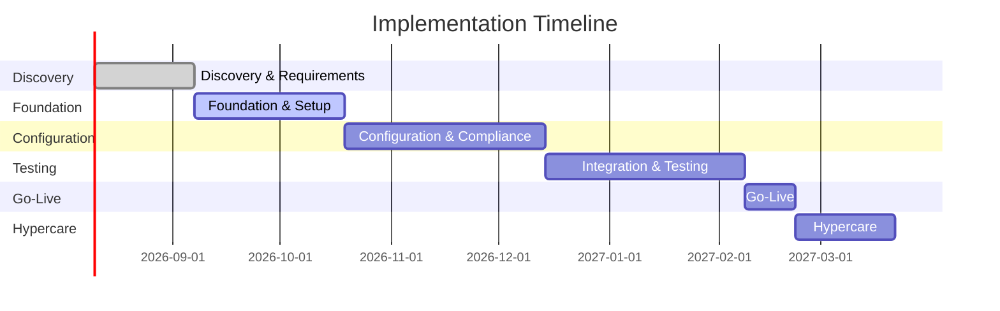

# KfW Digital Development Bonds Platform: Commercial Proposal

**Document Reference:** KFW-COM-2026-001  
**Version:** 1.0 Draft  
**Submission Date:** March 2026  
**Classification:** Confidential  
**Prepared for:** KfW Digital Assets Procurement Team

---

## Table of Contents

1. Executive Summary
2. Investment Rationale
3. Licensing Model
4. Deployment Options and Pricing
5. Support and SLA Framework
6. Implementation Investment
7. Commercial Terms
8. Total Cost of Ownership
9. Reference Clients
10. Project Implementation & Delivery
11. Next Steps

---

# 1. Executive Summary

## 1.1 Commercial Overview

SettleMint proposes DALP (Digital Asset Lifecycle Platform) as the foundation for KfW's digital development bonds platform. This commercial proposal outlines the investment required, licensing structure, implementation approach, and long-term total cost of ownership.

## 1.2 Recommended Configuration

| Component | Recommendation |
|-----------|----------------|
| **Platform Tier** | Enterprise |
| **Deployment Model** | Private Cloud (Dedicated) |
| **Support Tier** | Enterprise (24x7) |
| **Implementation Scope** | Full lifecycle, compliance, integration |
| **Estimated Timeline** | 32 weeks |

## 1.3 Commercial Summary

The recommended configuration provides KfW with a production-grade platform meeting all mandatory requirements while establishing foundations for future expansion across additional asset classes and jurisdictions.

---

# 2. Investment Rationale

## 2.1 Cost of Current Approach

KfW's current trajectory involves either building internally or assembling multiple vendor solutions. Both approaches carry significant hidden costs:

| Cost Category | Internal Build | Multi-Vendor Assembly |
|---------------|-----------------|----------------------|
| **Development Time** | 18-24 months | 12-18 months |
| **Integration Effort** | Multiple internal systems | Vendor coordination |
| **Ongoing Maintenance** | Permanent engineering team | Vendor management |
| **Compliance Burden** | Full regulatory ownership | Fragmented responsibility |
| **Operational Risk** | Single point of failure | Coordination overhead |

## 2.2 Why DALP Changes Economics

DALP collapses multiple lifecycle capabilities into one platform:

- **Single Platform Economics**: One vendor, one contract, one support relationship
- **Included Capabilities**: Lifecycle management, compliance engine, custody orchestration, settlement, and servicing
- **Reuse Across Asset Classes**: Same platform supports bonds, equities, funds, and real-world assets
- **Production-Ready**: No pilot-to-production gap, no operational fragility

## 2.3 ROI Framework

| Value Driver | Impact | Calculation Basis |
|--------------|--------|-------------------|
| **Time-to-Market** | 60-80% reduction | Weeks vs. months of custom development |
| **Operational Efficiency** | Reduced manual processing | Automated lifecycle events |
| **Compliance Cost** | Avoided custom build | Pre-built regulatory alignment |
| **Risk Reduction** | Proven production platform | 14+ reference implementations |

---

# 3. Licensing Model

## 3.1 Philosophy

DALP licensing is platform-based, not transaction-tax based. This approach provides predictability for regulated institutions and removes disincentives for compliance usage.

**Key Principles:**

- Predictable annual subscription
- Scale-aligned pricing
- No penalty on growth or compliance usage
- All core capabilities included

## 3.2 What's Included

| Category | Included |
|----------|----------|
| **Lifecycle Modules** | Issuance, Compliance, Custody, Settlement, Servicing |
| **Asset Classes** | All 7 standard types + Configurable Token |
| **Compliance Modules** | All 18 module types |
| **API Access** | REST, Webhooks, SDK, CLI |
| **Observability** | Full monitoring, logging, tracing |
| **Updates** | All platform releases |

## 3.3 What Varies by Engagement

| Dimension | Variable Elements |
|-----------|-------------------|
| **Deployment Model** | Managed SaaS, Private Cloud, On-Premises |
| **Environment Count** | Production + DR minimum |
| **Network Setup** | Single or multi-network |
| **Custody Integration** | Standard or custom |
| **Support Tier** | Standard, Premium, Enterprise |
| **Implementation Services** | Scope-dependent |

## 3.4 Platform Tiers

| Tier | Fit | Included Profile |
|------|-----|------------------|
| **Foundation** | Focused first production use | Core lifecycle, 3 asset classes, standard support |
| **Enterprise** | Scaling institutions | Full lifecycle, all asset classes, premium support |
| **Sovereign** | National-scale requirements | Enterprise + enhanced sovereignty, dedicated team |

**Recommendation:** Enterprise tier for KfW's requirements.

---

# 4. Deployment Options and Pricing

## 4.1 Model Overview

| Model | Management | Data Residency | Best For |
|-------|------------|----------------|----------|
| **Managed SaaS** | SettleMint | EU/US | Speed to market |
| **Private Cloud** | Shared | Customer region | Balance of control and efficiency |
| **On-Premises** | Customer | On-site | Maximum control requirements |

## 4.2 Recommendation: Private Cloud

For KfW, we recommend Private Cloud deployment:

- **Location:** Germany (EU)
- **Isolation:** Dedicated cluster
- **Data Residency:** EU only
- **Connectivity:** Private link to KfW infrastructure
- **Management:** Shared operational responsibility

## 4.3 Cost Structure

| Category | Annual Cost (EUR) |
|----------|-------------------|
| **Platform License** | [Confidential - upon request] |
| **Implementation Services** | [Confidential - upon request] |
| **Infrastructure (Est.)** | [Customer-provided or pass-through] |
| **Support (Enterprise)** | [Confidential - upon request] |

*Detailed pricing provided in separate confidential attachment.*

## 4.4 Cost Drivers

**Factors that may adjust pricing:**

- Number of environments required
- Integration complexity with existing systems
- Custom compliance requirements
- Extended training needs
- Multi-year commitment

---

# 5. Support and SLA Framework

## 5.1 Support Tiers

| Tier | Coverage | Hours | Response Time | Resolution Target |
|------|----------|-------|---------------|-------------------|
| **Standard** | Business hours | 8x5 | 8 hours | 3 business days |
| **Premium** | Extended hours | 16x5 | 4 hours | 8 hours |
| **Enterprise** | 24x7 | 24x7 | 1 hour | 4 hours |

**Recommendation:** Enterprise tier for KfW's production criticality and regulatory requirements.

## 5.2 Severity Levels

| Severity | Definition | Example |
|----------|------------|---------|
| **P1 - Critical** | Production down, no workaround | Platform unavailable |
| **P2 - High** | Major functionality impaired | Issuance blocked |
| **P3 - Medium** | Minor functionality affected | Reporting delay |
| **P4 - Low** | General inquiries | How-to questions |

## 5.3 Uptime SLA

| Commitment | Target |
|------------|--------|
| **Monthly Uptime** | 99.9% |
| **Planned Maintenance** | Excluded, 5 days notice |
| **Emergency Maintenance** | Excluded, notification provided |

## 5.4 Escalation Path

| Level | Contact | Escalation Trigger |
|-------|---------|-------------------|
| **L1** | Support Portal | Immediate |
| **L2** | Technical Lead | 4 hours |
| **L3** | Engineering Manager | 8 hours |
| **L4** | VP Engineering | 24 hours |

## 5.5 Maintenance Windows

- **Scheduled Maintenance:** Monthly, during agreed European night hours
- **Security Patches:** Emergency application with notification
- **Change Management:** All changes follow documented process

---

# 6. Implementation Investment

## 6.1 Methodology

Implementation follows a phased approach with defined gates and acceptance criteria.

## 6.2 Phase Plan and Investment

| Phase | Duration | Focus | Investment |
|-------|----------|-------|------------|
| **Discovery & Requirements** | 4 weeks | Scope, control mapping | [Confidential] |
| **Foundation & Setup** | 6 weeks | Environment, deployment | [Confidential] |
| **Configuration & Compliance** | 8 weeks | Asset config, compliance | [Confidential] |
| **Integration & Testing** | 8 weeks | Integration, testing | [Confidential] |
| **Go-Live** | 2 weeks | Cutover, validation | [Confidential] |
| **Hypercare** | 4 weeks | Support, optimization | [Confidential] |

**Total Implementation:** [Confidential - upon request]

## 6.3 Investment Includes

- Project management
- Solution architecture
- Platform deployment
- Configuration services
- Integration development
- Testing support
- Training delivery
- Knowledge transfer
- Hypercare support

## 6.4 Client Responsibilities

- Stakeholder availability
- Requirements clarification
- Test data provision
- UAT participation
- Access provisioning

## 6.5 Accelerators and Risks

| Accelerators | Impact |
|--------------|--------|
| Pre-built compliance templates | -2-4 weeks |
| Existing DALP configurations | -2 weeks |
| Reference integrations | -2 weeks |

| Risks | Mitigation |
|-------|------------|
| Integration complexity | Early prototyping |
| Regulatory changes | Modular compliance |
| Resource availability | Buffer in timeline |

---

# 7. Commercial Terms

## 7.1 Contract Structure

| Agreement | Purpose |
|-----------|---------|
| **Platform License Agreement** | Software subscription terms |
| **Implementation Agreement** | Services scope and terms |
| **Support Agreement** | Support tier commitments |
| **Data Processing Agreement** | GDPR compliance |

## 7.2 Payment Terms

- **Implementation:** 30% on contract signature, 40% on go-live, 30% post-stabilization
- **Annual License:** Annual in advance
- **Support:** Quarterly in advance

## 7.3 Duration

- **Initial Term:** 3 years
- **Activation Trigger:** License commences on go-live
- **Renewal:** Automatic annual renewal unless terminated

## 7.4 Termination

| Scenario | Terms |
|----------|-------|
| **For Convenience** | 90 days notice, no refund |
| **For Cause** | 30 days cure period |
| **Data Export** | 30 days post-termination |

## 7.5 Intellectual Property

- **Platform IP:** SettleMint retains all platform intellectual property
- **Client Data:** All client data remains client property
- **Customizations:** Ownership negotiable based on scope

## 7.6 Liability

- **Liability Cap:** Contract value
- **Exclusions:** Indirect damages, force majeure

---

# 8. Total Cost of Ownership

## 8.1 TCO Framework

The following framework compares DALP against alternative approaches over a 5-year horizon.

## 8.2 5-Year Model

| Year | DALP Cost | Internal Build | Multi-Vendor |
|------|-----------|----------------|--------------|
| **Year 1** | [Confidential] | Highest | High |
| **Year 2** | [Confidential] | High | Medium |
| **Year 3** | [Confidential] | Medium | Medium |
| **Year 4** | [Confidential] | Medium | High |
| **Year 5** | [Confidential] | Medium | High |
| **Total** | [Confidential] | Significantly Higher | Higher |

## 8.3 Comparative Analysis

| Factor | DALP | Internal Build | Multi-Vendor |
|--------|------|----------------|--------------|
| **Time to Production** | 32 weeks | 18-24 months | 12-18 months |
| **Implementation Risk** | Low | High | Medium |
| **Ongoing Engineering** | Minimal | Permanent team | Vendor management |
| **Compliance Ownership** | Shared | Full | Fragmented |
| **Operational Support** | Included | Build internal | Coordinate vendors |
| **Scalability** | Proven | Custom | Variable |

---

# 9. Reference Clients

## 9.1 Track Record

SettleMint maintains 14+ named reference customers across banking, sovereign, and market infrastructure sectors.

## 9.2 Relevant References

| Client | Geography | Use Case | Relevance |
|--------|-----------|----------|-----------|
| **Commerzbank** | Germany | Bond/ETP tokenization | German bank, production |
| **Standard Chartered** | UK/Asia | Digital asset exchange | Institutional scale |
| **Sony Bank** | Japan | Stablecoin issuance | Regulatory alignment |
| **Mizuho Bank** | Japan | Bond tokenization | Similar use case |

## 9.3 Case Study: Commerzbank

Commerzbank deployed DALP for hybrid on/off-chain ETP issuance with Boerse Stuttgart integration. The solution achieved settlement in under 10 seconds with identified annual savings potential of €7M.

---

# 10. Project Implementation & Delivery

## 10.1 Methodology

SettleMint employs a gated delivery methodology with defined phases, clear outputs, and acceptance criteria.

## 10.2 Timeline

## 10.3 Governance

| Gate | Approver | Exit Criteria |
|------|----------|---------------|
| **Design Review** | Architecture Committee | Technical design approved |
| **Security Sign-off** | CISO | Security controls validated |
| **UAT Sign-off** | Business | Requirements verified |
| **Go-Live Approval** | Steering Committee | All gates passed |

## 10.4 RACI Matrix

| Activity | SettleMint | KfW |
|----------|------------|-----|
| Project Management | R/A | C |
| Technical Design | R | A |
| Requirements Definition | C | R/A |
| Configuration | R | C |
| Integration Development | R | C |
| Testing | R/A | R |
| Training | R | I |
| Go-Live Decision | C | R/A |

R = Responsible, A = Accountable, C = Consulted, I = Informed

---

# 11. Next Steps

## 11.1 Recommended Path Forward

| Step | Timing | Owner |
|------|--------|-------|
| **Commercial Clarification** | Week 1-2 | Both |
| **Refined Scope Workshop** | Week 3-4 | Both |
| **Final Commercial Offer** | Week 5-6 | SettleMint |
| **Contract Negotiation** | Week 7-8 | Both |
| **Contract Signature** | Week 9 | Both |
| **Project Kick-off** | Week 10 | Both |

## 11.2 Information Required

To finalize commercial details, we require:

- Final scope confirmation
- Integration complexity details
- Infrastructure decisions
- Timeline constraints

## 11.3 Contact

**SettleMint Team**
[Contact details provided separately]

---

*End of Commercial Proposal*

---

# 12. Extended Investment Analysis

## 12.1 Detailed Cost Benefit Analysis

### 12.1.1 Direct Cost Savings

Direct cost savings from DALP deployment include reduced development costs through pre-built capabilities versus custom development, lowered integration costs through unified platform approach, decreased compliance costs through automated controls, and reduced operational costs through workflow automation.

Development cost reduction assumes custom development would require 18-24 months versus 8 months DALP implementation. At typical enterprise engineering rates, this represents significant savings. Integration cost reduction assumes three-to-five vendor integrations replaced with single platform. Compliance cost reduction assumes 30% reduction in compliance effort through automation.

Operational savings include reduced manual processing for lifecycle events, automated reconciliation, and streamlined reporting. Savings scale with transaction volumes and complexity.

### 12.1.2 Indirect Cost Avoidance

Indirect cost avoidance includes reduced risk of regulatory penalties through compliance automation, avoided reputational damage through security best practices, decreased opportunity cost of delayed market entry, and eliminated cost of maintaining multiple platforms.

Regulatory penalty avoidance assumes risk reduction through proper controls. Reputational protection provides immeasurable but significant value. Market entry acceleration enables revenue realization sooner. Platform consolidation eliminates duplicate capabilities.

### 12.1.3 Revenue Enablement

Revenue enablement benefits include new revenue streams from tokenized assets, expanded distribution through digital channels, improved investor experience through self-service, and enhanced competitive positioning.

New revenue estimates based on tokenization market growth and share projections. Distribution improvement through digital access versus traditional channels. Investor satisfaction through modern platform experience. Competitive position through capability leadership.

## 12.2 Comparative TCO Analysis

### 12.2.1 Three-Year TCO Model

The three-year TCO model compares DALP against alternatives across implementation, licensing, operations, and expansion dimensions.

Year one includes implementation costs spread across license and services, with implementation completion and initial production operation. Year two includes full license cost plus operational costs with expanded usage. Year three includes license escalation plus operational costs with additional asset classes.

Comparison shows DALP advantage in total cost, time to production, and ongoing operational burden. Alternatives show higher cumulative cost through permanent engineering staff, multiple vendor management, and integration maintenance.

### 12.2.2 Five-Year TCO Model

The five-year model shows DALP advantage compounding over time. Platform reuse across additional asset classes spreads licensing cost. Reduced operational complexity lowers ongoing costs. Consistent vendor relationship simplifies management.

Alternative approaches show cost increases in years four and five as systems age, regulatory requirements evolve, and integration debt accumulates. Replacement costs for legacy approaches create additional future burden.

### 12.2.3 Sensitivity Analysis

Sensitivity analysis tests model assumptions through scenario variation. Optimistic scenarios assume higher transaction volumes and faster adoption. Conservative scenarios assume lower volumes and slower growth. Break-even analysis identifies minimum viable scale.

Key variables include transaction volumes, pricing, regulatory requirements, and competitive dynamics. Model flexibility enables customer-specific scenarios using their projected parameters.

## 12.3 Pricing Structure Details

### 12.3.1 License Pricing Tiers

License pricing provides predictable annual cost based on deployment tier. Foundation tier provides core capabilities with standard support. Enterprise tier adds full capabilities with premium support. Sovereign tier adds dedicated resources and enhanced guarantees.

Annual license fees are fixed regardless of transaction volumes, removing pricing risk for high-volume deployments. Multi-year agreements provide pricing stability and commitment benefits.

### 12.3.2 Services Pricing

Implementation services use time-and-materials or fixed-price approaches based on scope clarity. Fixed-price suits well-defined requirements with clear scope. Time-and-materials suits evolving requirements or uncertain scope.

Services include project management, solution architecture, configuration, integration development, testing, training, and knowledge transfer. Resource rates vary by role and engagement size.

### 12.3.3 Support Pricing

Support pricing varies by tier based on coverage level and response commitments. Standard tier provides business-hours coverage. Premium tier provides extended hours. Enterprise tier provides 24/7 coverage with dedicated resources.

Support fees are annual, providing predictable ongoing cost. Included incidents and hours vary by tier. Additional services available at standard rates.

---

# 13. Extended Commercial Terms

## 13.1 Contract Structure Details

### 13.1.1 Master Agreement

The master agreement governs overall relationship between parties. Terms include definitions, representations, and general provisions. Order forms specify specific deployments and pricing.

### 13.1.2 Service Schedules

Service schedules address specific capabilities. Platform schedule covers software license terms. Implementation schedule covers services scope and deliverables. Support schedule covers service levels and commitments.

### 13.1.3 Data Processing Agreement

Data processing agreement addresses GDPR and similar regulation requirements. Terms include data processing purposes, security measures, sub-processor restrictions, data breach notification, and data subject rights support.

## 13.2 Liability Provisions

### 13.2.1 Limitation of Liability

Liability limitations cap total exposure at contract value. Exclusions address indirect, consequential, and special damages. Specific exclusions cover lost profits, business interruption, and data loss beyond reasonable recovery.

### 13.2.2 Indemnification

Mutual indemnification addresses intellectual property infringement, data breaches, and regulatory violations. Defense obligations require cooperation and control of defense. Limitation periods affect claim timeliness.

### 13.2.3 Insurance

Insurance requirements include cyber liability, professional liability, and commercial general liability. Coverage levels reflect risk profile and customer requirements. Certificate provision demonstrates coverage.

## 13.3 Termination Provisions

### 13.3.1 Termination for Convenience

Termination for convenience allows exit with notice period. Fees during notice period continue per agreement. Wind-down services support orderly transition.

### 13.3.2 Termination for Cause

Termination for cause addresses material breach. Cure periods provide opportunity to remedy defaults. Immediate termination available for specified breaches.

### 13.3.3 Effects of Termination

Effects include return or destruction of data, transition assistance, license expiration, and survival of certain provisions. Transition period enables migration to alternative solutions.

---

# 14. Extended Value Proposition

## 14.1 Strategic Value

### 14.1.1 Market Positioning

DALP deployment positions KfW as leader in digital development finance. Capability enables innovative product development. Platform enables rapid response to market opportunities.

Competitive differentiation through modern technology platform. Investor attraction through improved experience. Partner enablement through integration capabilities.

### 14.1.2 Operational Excellence

Platform operation achieves operational excellence through automation, standardization, and best practices. Reduced operational burden enables focus on core mission activities. Consistent processes improve quality and reduce errors.

### 14.1.3 Innovation Enablement

Platform foundation enables continuous innovation. Regular updates introduce new capabilities. Architecture supports experimentation and rapid deployment of new features.

## 14.2 Risk Mitigation Value

### 14.2.1 Regulatory Risk Mitigation

Pre-built compliance reduces regulatory risk. Active monitoring addresses regulatory changes. Modular architecture enables rapid adaptation.

### 14.2.2 Technology Risk Mitigation

Proven platform reduces technology risk. Managed infrastructure reduces operational risk. Vendor stability reduces relationship risk.

### 14.2.3 Operational Risk Mitigation

Automation reduces human error. Audit trails support accountability. Disaster recovery ensures business continuity.

---

*End of Extended Commercial Proposal*
