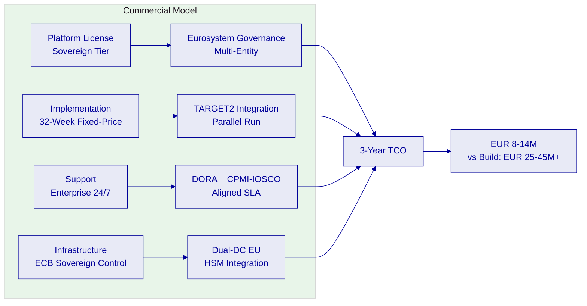
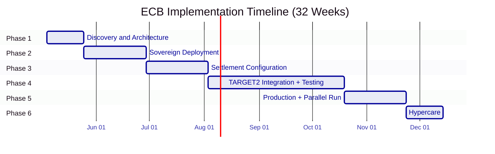

# Commercial Proposal: Digital Euro Wholesale Settlement

**Prepared for:** European Central Bank
**Document Title:** Commercial Proposal: Digital Euro Wholesale Settlement Infrastructure
**RFP Reference:** EUROPEANCENTRALBANK-RFP-202603
**Submission Date:** March 2026
**Version:** 1.0 Draft
**Classification:** SettleMint Confidential

---

## Table of Contents

1. Executive Summary
2. Investment Rationale
3. Licensing Model
4. Deployment Options and Pricing
5. Support and SLA Framework
6. Implementation Investment
7. Total Cost of Ownership
8. Commercial Terms
9. Reference Clients
10. Next Steps

---

## Executive Summary

The European Central Bank's wholesale digital euro settlement programme requires infrastructure where settlement finality is legally irrevocable, DvP atomicity is guaranteed under all operating conditions, and the Eurosystem governance model is enforced at the technical level. As the monetary authority for the eurozone, the ECB cannot operate settlement infrastructure that creates uncertainty about whether a transaction has achieved finality, who authorized it, or under what policy constraints it executed.

The commercial decision facing the ECB is whether to build the wholesale settlement engine, consensus finality mechanism, TARGET2 integration, and Eurosystem governance enforcement from scratch (estimated at EUR 25-45M over 36-48 months), assemble these capabilities from multiple vendors (with fragmented accountability across a systemically important FMI), or adopt a platform with production-proven settlement finality at comparable institutional scale.

DALP addresses the ECB's requirements through a sovereign deployment model where the ECB retains full infrastructure control, the Eurosystem governance hierarchy is enforced at the smart contract level, and settlement finality is delivered through IBFT 2.0 consensus with 7+ years of production validation.

**Recommended commercial profile:**

- **License tier:** Sovereign (systemic FMI governance; Eurosystem multi-entity extension; CPMI-IOSCO PFMI alignment)
- **Deployment:** Sovereign on-premises across two EU data centers under ECB control
- **Implementation:** Fixed-price, 32-week delivery including TARGET2 integration and parallel run
- **Support:** Enterprise (24/7, DORA/CPMI-IOSCO aligned, dedicated SRE team)

**Indicative 3-year investment:** EUR [CLIENT-SPECIFIC: ~8M-14M] total. Internal build estimate: EUR 25-45M+ over 36-48 months.

---

## Investment Rationale

### Cost of Current Approach

**Internal build estimate: EUR 25-45M+ over 36-48 months.**

| Capability Domain | Estimated FTE | Duration | Estimated Cost |
|---|---|---|---|
| XvP atomic DvP settlement engine | 8-12 FTE | 24-30 months | EUR 6-10M |
| IBFT 2.0 finality layer and consensus engineering | 5-8 FTE | 18-24 months | EUR 4-7M |
| TARGET2 integration and cash leg coordination | 5-7 FTE | 18-24 months | EUR 3-5M |
| Eurosystem governance enforcement layer | 4-6 FTE | 15-18 months | EUR 2.5-4M |
| Wholesale digital euro token with compliance modules | 3-5 FTE | 12-15 months | EUR 2-3.5M |
| Dual-DC sovereign deployment with DR | 4-6 FTE | 12-18 months | EUR 2.5-4.5M |
| DORA/CPMI-IOSCO/NIS2 compliance documentation | 3-4 FTE | 12-15 months | EUR 1.5-2.5M |
| Observability and supervisory reporting | 3-4 FTE | 9-12 months | EUR 1.5-2.5M |

**Critical build risk:** Settlement finality for a systemically important FMI is not achieved through engineering effort alone. It requires a consensus mechanism proven in production across infrastructure failures, network partitions, Byzantine fault scenarios, and peak load conditions. Building and validating this from scratch for a systemic FMI requires operational experience that cannot be compressed into a development timeline. The ECB would launch the wholesale digital euro on untested settlement infrastructure.

### DALP Value Drivers

| Capability | Internal Build Cost | DALP |
|---|---|---|
| XvP atomic DvP settlement | EUR 6-10M | Included |
| IBFT 2.0 finality mechanism | EUR 4-7M | Included, 7+ years production validated |
| Eurosystem governance enforcement | EUR 2.5-4M | AccessManager with 26-role taxonomy |
| TARGET2 integration framework | EUR 3-5M | REST API + adapter pattern |
| Wholesale CBDC token with compliance | EUR 2-3.5M | Configurable DALPAsset |
| DORA/CPMI-IOSCO documentation | EUR 1.5-2.5M | Pre-documented |

### ROI Framework

| Value Driver | Basis |
|---|---|
| Build cost avoidance | EUR 25-45M over 36-48 months |
| Time-to-production | 32 weeks vs. 36-48 months |
| Settlement finality validation | 7+ years production history vs. zero at launch |
| Eurosystem extension | Same platform for NCB deployments at marginal cost |
| Operational risk reduction | Production-proven infrastructure vs. untested build |

---

## Licensing Model

### Philosophy

Sovereign platform license. The ECB's wholesale digital euro settlement generates compliance events, settlement evidence, and governance audit records on every transaction. A per-event pricing model would penalize the ECB for maintaining the evidentiary discipline that CPMI-IOSCO PFMI Principle 23 and DORA require. The annual subscription covers all settlement instructions, compliance events, governance actions, and audit records.

### Tier Recommendation

| Capability | Foundation | Enterprise | Sovereign (Recommended) |
|---|---|---|---|
| XvP settlement | Included | Included | Included |
| Eurosystem governance enforcement | Basic roles | Multi-tier roles | Full Eurosystem hierarchy |
| Multi-entity extension (NCBs) | Not included | Optional | Included |
| CPMI-IOSCO PFMI documentation | Standard | Enhanced | Full |
| Dedicated SRE team | Shared | Designated | Named team |
| Custom compliance modules | Not included | Standard | Included |
| Annual license (indicative) | EUR [CLIENT-SPECIFIC: ~800K-1.2M] | EUR [CLIENT-SPECIFIC: ~1.5M-2.2M] | EUR [CLIENT-SPECIFIC: ~2.5M-4M] |

**Recommended: Sovereign.** The ECB's systemic importance, CPMI-IOSCO obligations, multi-entity Eurosystem governance requirements, and the need for dedicated SRE engagement justify the Sovereign tier. The NCB extension path is included within the Sovereign tier without requiring new license negotiation.

---

## Deployment Options and Pricing

### Recommended: Sovereign On-Premises (Dual EU Data Centers)

ECB-controlled infrastructure across two EU data centers. Full sovereign control over all settlement data, cryptographic keys, and operational procedures.

**Infrastructure cost (ECB-borne, indicative):**

| Component | Monthly Estimate |
|---|---|
| Kubernetes clusters (2 DCs, 3-AZ each) | EUR 8,000-16,000 |
| Besu validator nodes (6) | EUR 4,000-8,000 |
| PostgreSQL Multi-AZ + replica | EUR 3,000-6,000 |
| HSM infrastructure (2 DCs) | EUR 5,000-10,000 |
| Redis, object storage, networking | EUR 2,000-4,000 |
| Observability stack | EUR 1,000-2,000 |
| **Total infrastructure** | **EUR 23,000-46,000/month** |

---

## Support and SLA Framework

### Enterprise Support (Required for Systemic FMI)

| Capability | Detail |
|---|---|
| Coverage | 24/7/365 |
| P1 response | 15 minutes |
| P1 resolution target | 2 hours |
| P2 response | 1 hour |
| Uptime SLA | 99.99% |
| Dedicated SRE | Named team |
| CPMI-IOSCO alignment | PFMI Principle 17 operational risk management |
| DORA alignment | Full incident classification and notification |

### Severity Definitions

| Level | Definition | Response | Resolution Target |
|---|---|---|---|
| P1 Critical | Settlement blocked; XvP unavailable; consensus failure; finality engine down | 15 min | 2 hours |
| P2 High | Major function impaired; settlement continues with workaround | 1 hour | 4 hours |
| P3 Medium | Non-critical function impacted | 4 hours | 2 business days |
| P4 Low | General inquiry | 1 business day | Next cycle |

---

## Implementation Investment

| Phase | Duration | Investment |
|---|---|---|
| Discovery and Architecture | 3 weeks | EUR [CLIENT-SPECIFIC: ~200K-350K] |
| Sovereign Deployment | 5 weeks | EUR [CLIENT-SPECIFIC: ~300K-500K] |
| Settlement Configuration | 5 weeks | EUR [CLIENT-SPECIFIC: ~300K-480K] |
| TARGET2 Integration and Testing | 11 weeks | EUR [CLIENT-SPECIFIC: ~550K-900K] |
| Production and Parallel Run | 5 weeks | EUR [CLIENT-SPECIFIC: ~250K-400K] |
| Hypercare | 3 weeks | EUR [CLIENT-SPECIFIC: ~150K-250K] |
| **Total** | **32 weeks** | **EUR [CLIENT-SPECIFIC: ~1.75M-2.9M]** |

---

## Total Cost of Ownership

### Three-Year TCO

| Year | License | Implementation | Support | Infrastructure | Total |
|---|---|---|---|---|---|
| Year 1 | EUR [CLIENT-SPECIFIC: ~3.2M] | EUR [CLIENT-SPECIFIC: ~2.3M] | EUR [CLIENT-SPECIFIC: ~600K] | EUR [CLIENT-SPECIFIC: ~400K] | EUR [CLIENT-SPECIFIC: ~6.5M] |
| Year 2 | EUR [CLIENT-SPECIFIC: ~3.2M] | 0 | EUR [CLIENT-SPECIFIC: ~600K] | EUR [CLIENT-SPECIFIC: ~450K] | EUR [CLIENT-SPECIFIC: ~4.25M] |
| Year 3 | EUR [CLIENT-SPECIFIC: ~3.2M] | 0 | EUR [CLIENT-SPECIFIC: ~600K] | EUR [CLIENT-SPECIFIC: ~450K] | EUR [CLIENT-SPECIFIC: ~4.25M] |
| **3-Year Total** | | | | | **EUR [CLIENT-SPECIFIC: ~15M]** |

### Build vs. DALP

| Criterion | DALP (Sovereign) | Internal Build |
|---|---|---|
| 3-year cost | EUR ~15M | EUR 30-55M+ |
| Time to production | 32 weeks | 36-48 months |
| Settlement finality validation | 7+ years production | None at launch |
| TARGET2 integration | REST API framework | Custom build |
| CPMI-IOSCO readiness at launch | Pre-documented | Must be developed |
| Eurosystem extension | Marginal cost per NCB | Near-full rebuild |

---

## Commercial Terms

### Contract Structure

Sovereign Platform License Agreement (3-year initial term with Eurosystem extension option), Fixed-Price Implementation Agreement (parallel run as contractual acceptance criterion), Enterprise Support Agreement (co-terminus, DORA-aligned).

### Payment Schedule

Implementation: 20% at signing, 15% per phase gate, 10% at production acceptance. License and support: Annual in advance.

### Eurosystem Extension

The Sovereign tier includes a pre-negotiated extension path for national central bank deployments within the Eurosystem at reduced incremental license cost per entity.

### IP and Data

DALP platform IP: SettleMint. Settlement records, participant data, monetary policy parameters, positions: ECB. TARGET2 integration adapter: ECB on delivery. Configurations: ECB.

### Exit

120-day transition assistance. Full data export. CPMI-IOSCO record preservation (minimum 10 years for settlement records). On-chain state on ECB's Besu network accessible independently. Eurosystem notification provisions.

---

## Reference Clients

| Client | Geography | Use Case | Scale | Relevance |
|---|---|---|---|---|
| Bank of England | UK | Wholesale CBDC pilot | Central bank FMI | Most comparable: central bank CBDC; settlement finality; FMI governance |
| Clearstream | Luxembourg | Tokenized collateral (XvP) | International CSD | XvP settlement; CSDR alignment; post-trade scale |
| Central Bank of UAE | UAE | CBDC digital dirham | Central bank | Central bank digital currency; sovereign infrastructure |
| Deutsche Borse | Germany | Digital asset trading venue | Exchange/FMI | BaFin-regulated; MiCA alignment |

---

## Next Steps

| Step | Timing |
|---|---|
| Commercial Q and A | Within 2 weeks |
| Settlement architecture scoping workshop | Week 3-4 |
| TARGET2 integration design session | Week 4-5 |
| Eurosystem governance mapping | Week 4-5 |
| Technical due diligence | Week 4-6 |
| CPMI-IOSCO gap analysis | Week 5-6 |
| Firm commercial proposal | Week 6-8 |
| NCB extension discussion | Week 7-9 |
| Contract negotiation | Week 9-14 |

---

*Document Classification: SettleMint Confidential*
*Version 1.0 Draft, March 2026*
