# Technical Proposal: Digital Asset Lifecycle Platform

**Prepared for:** Emirates NBD PJSC

**Prepared by:** SettleMint NV

**Date:** 3 April 2026

**Version:** 1.0

**Document Classification:** Strictly Confidential

**Validity Period:** 90 days from date of issue

---

**Confidentiality Notice**

This document contains proprietary and confidential information belonging to SettleMint NV. It is provided solely for the purpose of evaluating SettleMint's proposed solution for Emirates NBD PJSC. No part of this document may be reproduced, distributed, or disclosed to any third party without the prior written consent of SettleMint NV. All intellectual property, technical designs, and proposed approaches described herein remain the exclusive property of SettleMint.

**Primary Contact:**

Gyan Khadka
Vice President, Strategic Partnerships
SettleMint NV
gyan.khadka@settlemint.com

---

## Table of Contents

1. Executive Summary
2. About SettleMint
3. About DALP: The Digital Asset Lifecycle Platform
4. Composability and Configurable Token Design
5. Configurable Compliance Framework
6. Customer References
7. Understanding of Requirements
8. Proposed Solution and Functional Capabilities
9. Asset Lifecycle Management
10. Supported Asset Classes
11. UAE Regulatory Compliance Framework
12. Technical Architecture
13. Security Architecture
14. Custody and Key Management
15. Integration Capabilities
16. Deployment Options
17. Observability and Monitoring
18. Disaster Recovery and Business Continuity
19. Data Privacy and Sovereignty
20. Project Implementation and Delivery
21. Training and Knowledge Transfer
22. Support and SLA
23. Risk Management
24. Team and Key Personnel
25. Compliance Matrix
26. Appendix

---

## Executive Summary

### Context and Strategic Drivers

Emirates NBD PJSC stands at a pivotal moment in the evolution of institutional finance. As the UAE's largest banking group, with total assets exceeding USD 200 billion, Emirates NBD operates at the center of one of the world's most ambitious digital asset regulatory frameworks. The UAE National Blockchain Strategy 2021, the Virtual Assets Regulatory Authority's (VARA) progressive licensing regime, the Central Bank of the UAE's (CBUAE) payment and deposit tokenization guidelines, and the Securities and Commodities Authority's (SCA) token offering framework together create a regulatory environment that rewards institutions that build correct infrastructure from the start.

Emirates NBD's mandate spans a complex asset universe. Sukuk and conventional bonds represent the fixed-income base. UAE real estate, one of the most active property markets globally, presents enormous tokenization potential. Trade finance instruments serve the bank's substantial corporate client base. Structured deposits and treasury management products serve institutional and high-net-worth clients. Precious metals connect to Dubai's historic role as a global gold trading center. Each of these asset classes carries specific lifecycle requirements, distinct compliance obligations, and different servicing operations, all of which must operate within the Dubai International Financial Centre (DIFC) regulatory perimeter for some products and the mainland CBUAE perimeter for others.

The bank's digital transformation credentials, including the Liv. digital bank for retail and E20 for SME and commercial clients, demonstrate an organization that has already committed to technology-driven service delivery. Extending that commitment into tokenized assets is the natural next chapter.

### Why This Programme Is Challenging

Institutional digital asset programmes consistently underestimate three categories of complexity. Understanding them is the starting point for building the right architecture.

**Lifecycle complexity.** A bond is not a token. A bond is a token that accrues interest, pays coupons on a schedule, supports early redemption under defined conditions, handles maturity events atomically, and must update all of these behaviors if terms change. A Sukuk adds profit-rate distribution mechanics and Sharia-compliance structural requirements. A real estate token must distribute rental income, reflect property revaluations, and handle fractional ownership transfers across multiple investor categories. Building these behaviors from scratch for each asset class is a multi-year engineering programme. Doing it for seven asset classes simultaneously is not feasible without a purpose-built platform.

**Governance and compliance burden.** The UAE regulatory perimeter is not one framework. VARA governs virtual assets in Dubai. CBUAE governs payment tokens and deposit products. SCA governs securities tokens. ADGM oversees onshore financial services in Abu Dhabi. DIFC has its own financial services regulatory authority. Sharia compliance adds another dimension that requires Sharia board governance integration. Each investor category, each asset class, and each distribution channel potentially triggers different regulatory requirements. Compliance cannot be an afterthought patched onto an issuance tool. It must be structurally enforced before execution, with an audit trail that satisfies multiple concurrent regulatory reviewers.

**Operationalization gap.** Most tokenization pilots succeed because they avoid operational complexity: small investor groups, simple asset structures, manual workarounds for corporate actions and distributions, no real secondary market. Moving from that environment to a platform that processes thousands of investor onboarding events, executes coupon distributions across large holder populations, handles secondary market transfers with real-time compliance checks, and provides the monitoring and alerting that bank IT operations teams require is a fundamentally different engineering challenge. The technology that works for a pilot rarely survives contact with production volumes.

| Challenge | Complexity | Implication |
|---|---|---|
| Multi-asset lifecycle coverage | High: seven distinct asset classes, each with different servicing logic | Requires platform, not toolkit |
| Multi-regulatory perimeter | High: VARA, CBUAE, SCA, ADGM, DIFC, Sharia | Configurable compliance architecture required |
| Operational scale | High: thousands of investors, automated distributions | Infrastructure-grade platform required |
| Custody integration | Medium: existing custodians, new MPC models | Bring-your-own-custodian model needed |
| Core banking integration | Medium: Temenos, Oracle, or Infosys Finacle interfaces | API-first integration layer required |
| GCC cross-border | Medium: SAR, AED, USD multi-currency settlement | ISO 20022 connectivity and multi-currency token support |
| Islamic finance | Medium: Sharia-compliant structures, profit distribution | Configurable token features and custom compliance modules |

### Proposed Response

SettleMint proposes the Digital Asset Lifecycle Platform (DALP) as Emirates NBD's institutional digital asset infrastructure. The proposed deployment covers the following scope.

**Deployment model.** A dedicated private cloud deployment on Emirates NBD-owned infrastructure within the UAE, ensuring full data residency compliance with CBUAE requirements and UAE data sovereignty rules. The deployment runs on a container orchestration platform using SettleMint's Helm-based deployment automation, with Emirates NBD's operations team managing day-to-day infrastructure while SettleMint provides platform-level support and platform updates.

**Target asset scope.** Phase 1 covers Sukuk (Islamic bonds) and conventional bonds, aligned with Emirates NBD's capital markets business and the strong investor demand from GCC institutional buyers. Phase 2 extends to real estate tokenization, connecting to the Dubai Land Department registry ecosystem and Emirates NBD's property finance business. Phase 3 covers structured deposits, tokenized money market products, and precious metals, expanding the bank's digital asset product suite for high-net-worth and private banking clients.

**Compliance approach.** DALP's configurable compliance framework enforces ex-ante eligibility checks on every transfer. Compliance modules cover VARA investor eligibility requirements, CBUAE payment instrument rules, SCA securities offering restrictions, and DIFC investor classification. Sharia compliance is supported through configurable profit distribution mechanics and holding-period controls. KYC and KYB claims from Emirates NBD's existing identity verification providers are consumed as on-chain credentials through the OnchainID protocol, making identity portable across all asset types without re-verification.

**Custody model.** DALP's Key Guardian integrates with Emirates NBD's preferred institutional custody provider, whether DFNS, Fireblocks, or an existing provider via the platform's bring-your-own-custodian model. Maker-checker approval workflows and hardware security module (HSM) integration ensure that key management meets CBUAE and VARA custody requirements for financial institutions.

**Integration perimeter.** DALP connects to Emirates NBD's core banking system (Temenos T24, Oracle FLEXCUBE, or Infosys Finacle depending on the specific business line) through the platform's REST and GraphQL APIs, ISO 20022-compatible payment rail integration for AED and USD settlement, and event-driven webhooks for real-time position reconciliation. External KYC/AML providers, market data feeds, and regulatory reporting systems connect through standard API integration patterns.

**Phased delivery.** A 19-week initial implementation delivers the first Sukuk issuance capability, with subsequent phases extending asset class coverage and integration breadth. SettleMint's phase-gated methodology includes formal acceptance criteria at each gate, ensuring that regulatory and technical requirements are validated before progressing to the next phase.

### Why SettleMint

SettleMint is not a recent market entrant. The company has nearly a decade of focused experience delivering blockchain infrastructure for regulated institutions. That experience is particularly relevant to Emirates NBD for three specific reasons.

First, sovereign and MENA-scale delivery. SettleMint is actively delivering the Saudi Real Estate Registry's national tokenization programme, a country-scale infrastructure project that covers property registration, fractionalization, and digital marketplace capabilities for the Kingdom's entire real estate sector. The ADI Finstreet equity tokenization project was deployed on a UAE/GCC blockchain mainnet with DFNS custody integration and Helm-based Kubernetes infrastructure in the same regulatory environment Emirates NBD operates in. These are not reference stories from a different market; they are directly applicable operational evidence.

Second, Islamic finance alignment. The Islamic Development Bank's two SettleMint deployments, covering Sharia-compliant subsidy distribution across 57 member countries and automated market stabilization for Islamic finance collateral, demonstrate genuine operational experience in Islamic financial structures, not merely knowledge of the terminology.

Third, the completeness of DALP. Emirates NBD needs a platform that covers the full lifecycle for seven asset classes, enforces compliance for five regulatory frameworks simultaneously, integrates with existing custody and core banking infrastructure, and operates at the volumes expected of the UAE's largest bank. No point solution addresses this scope. DALP does.

| Credential | Evidence |
|---|---|
| UAE/GCC deployment experience | ADI Finstreet tokenized equity on UAE/GCC mainnet; Saudi RER national real estate tokenization |
| Islamic finance experience | Islamic Development Bank x 2: subsidy distribution (57 countries), market stabilization |
| Sovereign-scale delivery | Saudi RER: country-scale blockchain real estate infrastructure |
| Regulated bank deployments | OCBC, Standard Chartered, Mizuho, Commerzbank, Sony Bank |
| Asset class breadth | Bonds, equity, funds, deposits, stablecoins, real estate, precious metals in production |
| GCC regulatory perimeter | VARA, CBUAE, SCA, ADGM framework alignment; DIFC structure familiarity |

### Why DALP

DALP's architecture rests on three differentiated capabilities that matter specifically for Emirates NBD's programme.

The first is composability. One configurable contract type, DALPAsset, can represent any financial instrument through runtime configuration of up to 32 pluggable token features and 12 compliance module types. Sukuk are configured with profit distribution features rather than conventional interest mechanics. Real estate tokens carry fractional ownership metadata and rental income distribution logic. Precious metals tokens carry provenance chain metadata. None of these configurations require custom smart contract development. They are assembled from pre-audited, runtime-pluggable building blocks.

The second is ex-ante compliance. Every transfer is validated against configured compliance rules before execution. A non-eligible investor cannot receive tokens. A blocked jurisdiction cannot participate. A holding period cannot be violated. This happens on-chain, enforced by the smart contract itself, not by application-layer checks that could be bypassed. The audit trail captures every compliance decision in immutable form.

The third is lifecycle coverage. DALP does not stop at issuance. The platform manages coupon and profit-rate distributions, maturity redemptions, corporate action processing, secondary market transfer compliance, investor registry management, and position reporting. For a bank planning to operate tokenized assets over their full economic lives, this operational lifecycle coverage is the difference between a working platform and a one-off issuance tool.

### Reference Fit Snapshot

| Reference | Geography | Asset Class | Relevance to Emirates NBD |
|---|---|---|---|
| ADI Finstreet | UAE/GCC | Equity | UAE/GCC regulatory environment; DFNS custody; Helm/Kubernetes infrastructure |
| Saudi RER | KSA (GCC) | Real Estate | Country-scale; registry-as-truth model; REGA integration |
| Islamic Development Bank | Global (57 countries) | Islamic Finance | Sharia-compliant structures; profit distribution mechanics |
| OCBC Bank | Singapore | Multi-asset | HNWI products; bond + real estate + SPV tokenization |
| Standard Chartered | Asia/Africa/Middle East | Multi-asset | Institutional trading in high-growth markets including Middle East |

---

## About SettleMint

### Company Overview

SettleMint is the digital asset lifecycle platform company for regulated financial markets and sovereign use cases. The company was founded almost a decade ago and has grown from an early enterprise blockchain infrastructure provider into the category-defining platform company enabling financial institutions, market infrastructure providers, and sovereign entities to move real-world value on-chain with compliance, security, and operational reliability.

SettleMint's mission is specific: enable regulated institutions to move from slides to balance sheets. This means absorbing the infrastructure complexity of digital asset operations so that banks, sovereign entities, and market infrastructure providers can focus on their business rather than on re-inventing blockchain infrastructure from scratch.

| Company Fact | Detail |
|---|---|
| Founded | Nearly a decade ago |
| Headquarters | Belgium (EU), with presence in MENA and APAC |
| Focus | Digital asset lifecycle platform for regulated financial markets and sovereign use cases |
| Primary product | DALP: Digital Asset Lifecycle Platform |
| Target markets | Banks and financial institutions, sovereign entities, market infrastructure, specialty finance, real estate |
| Geographic reach | Europe, Middle East, Asia-Pacific |
| Regulatory coverage | EU MiCA, US Reg D/S/CF, MAS Singapore, UK FCA, Japan FSA, GCC frameworks |

### History and Market Position

SettleMint's evolution mirrors the maturation of the digital asset market through three distinct eras.

The first was the enterprise blockchain era. SettleMint built foundational distributed ledger infrastructure for some of the world's most demanding enterprise environments, spanning financial services, supply chains, telecoms, and government entities. These early deployments established operational discipline and institutional credibility that few competitors possess.

The second was the institutional adoption phase. As financial institutions moved beyond proof-of-concept, SettleMint deepened its focus on the regulatory, governance, and operational requirements that separate pilot projects from production infrastructure. Multi-year continuous production deployments with regulated banks in Asia and Europe established credentials in compliance-heavy environments. This period produced the architectural insights that became DALP: the recognition that what institutions needed was not another toolkit but a lifecycle platform.

The third is the current digital asset lifecycle era. SettleMint consolidated years of production experience into DALP, providing end-to-end coverage from asset design through issuance, compliance enforcement, custody integration, settlement, servicing, and retirement. Today, SettleMint operates at the intersection of digital assets and tokenization, institutional and sovereign infrastructure, and banking, capital markets, and government systems.

| Era | Focus | Outcome |
|---|---|---|
| Enterprise blockchain | DLT infrastructure for enterprise and government | Operational discipline, institutional credibility |
| Institutional adoption | Compliance, governance, lifecycle for regulated banks | Multi-year production deployments; DALP architecture insights |
| Digital asset lifecycle | Full lifecycle platform across seven asset classes | DALP; sovereign-scale programmes; 14 reference clients |

### Production Credentials

SettleMint's production credentials span asset classes, geographies, and regulatory environments. The following proof points reflect verified, operational deployments rather than planned programmes.

| Category | Evidence |
|---|---|
| Market tenure | Nearly a decade focused on blockchain infrastructure |
| Continuous production | 7+ years of live deployments at regulated banks |
| Asset class breadth | Bonds, equity, funds, deposits, stablecoins, real estate, precious metals live |
| Sovereign scale | Active country-scale programmes in the Middle East |
| Islamic finance | Two Islamic Development Bank deployments operational |
| Regulated bank clients | OCBC, Standard Chartered, KBC, Sony Bank, Mizuho, Commerzbank |
| Central bank engagement | State Bank of India CBDC infrastructure |
| Combined team experience | 200+ years combined banking and blockchain experience |

Multi-year live deployments with regulated banks and sovereign entities demonstrate that DALP is not a demonstration environment. These are business-critical workflows operating under institutional SLAs, processing real transactions under real regulatory oversight.

Sovereign and national-scale programmes in the Middle East make SettleMint one of the few platforms powering country-scale tokenization initiatives. The Saudi Real Estate Registry programme, the Islamic Development Bank deployments, and the ADI Finstreet UAE equity tokenization are not isolated experiments. They are reference architectures for what regional institutional digital asset infrastructure can look like at scale.

Security-validated operations have been reviewed through penetration testing, vendor risk assessments, and security reviews typical of large financial institutions. SettleMint holds ISO 27001 and SOC 2 Type II certifications, confirming that security controls are independently audited and continuously maintained.

### Regulatory Readiness

SettleMint's platform is built for regulated environments. Rather than treating compliance as an add-on, SettleMint embeds regulatory controls, policy enforcement, and auditability into the core architecture of DALP. For Emirates NBD, the relevant regulatory frameworks are:

| Jurisdiction / Framework | DALP Coverage |
|---|---|
| UAE CBUAE (payment tokens, deposits) | Configurable supply limits, payment instrument compliance modules |
| UAE VARA (virtual assets in Dubai) | Investor eligibility modules, transfer controls, licensing-aligned configurations |
| UAE SCA (securities tokens) | Securities offering compliance, investor accreditation modules |
| ADGM / FSRA (Abu Dhabi) | Configurable compliance modules for ADGM perimeter |
| DIFC / DFSA | Financial services regulatory configuration support |
| GCC regional frameworks | Country allow/block list modules; Islamic finance compatibility |
| Sharia compliance | Configurable profit distribution features; holding period controls |
| EU MiCA (for international investors) | ERC-3643 T-REX standard; MiCA compliance template |
| ISO 20022 | Payment rail integration for SWIFT, SEPA-equivalent, RTGS |

The platform implements the ERC-3643 (T-REX) regulated token standard natively, combined with OnchainID for verifiable on-chain investor identities. This ex-ante compliance model ensures that eligibility is validated before execution, not reviewed after.

### Team and Delivery Capability

The SettleMint team combines deep expertise across blockchain engineering, financial markets, and enterprise delivery. The core team brings together decades of combined experience in financial services (banks, market infrastructure, fintech), enterprise software and SaaS, and blockchain research and development.

| Team Domain | Capability |
|---|---|
| Blockchain engineering | Protocol-level expertise, smart contract architecture, EVM optimization |
| Financial domain | Capital markets structure, custody models, settlement flows, Islamic finance |
| Enterprise delivery | Governance, change management, legacy integration in institutional environments |
| Regulatory and compliance | Multi-jurisdictional framework navigation; audit trail design |
| Security operations | Penetration testing coordination, HSM configuration, key management |

Dedicated solution architects, delivery leads, and customer success teams have implemented tokenization solutions in multiple jurisdictions and navigated internal processes including security review, vendor onboarding, and change control at large institutions. The team that would engage with Emirates NBD has direct experience in the UAE and GCC market, understanding the specific regulatory bodies, banking infrastructure conventions, and institutional expectations of the region.

### Ecosystem and Partnerships

SettleMint's partner ecosystem supports local delivery capacity and specialized integration requirements.

| Partner Category | Scope |
|---|---|
| Institutional custody | Fireblocks, DFNS: MPC custody integration for key management |
| Payment rails | ISO 20022 for SWIFT, SEPA-equivalent, RTGS connectivity |
| Cloud infrastructure | Multi-cloud and on-premises Kubernetes deployment support |
| Regional system integrators | GCC and MENA partners with local regulatory and market knowledge |
| Global consultancies | Tier-1 consulting firms using DALP for institutional client programmes |
| Strategic investors | European and Middle Eastern investors with board-level financial services expertise |

### Why Relevant to This Bid

Emirates NBD's programme combines three characteristics that make SettleMint specifically relevant. First, the regulatory environment is complex and multi-layered, requiring a compliance architecture that can model VARA, CBUAE, SCA, and DIFC requirements simultaneously. Second, the asset scope is broad, covering Sukuk, conventional bonds, real estate, structured deposits, and precious metals across different investor categories. Third, the volume expectations of the UAE's largest bank require infrastructure that operates at institutional scale, not proof-of-concept scale.

SettleMint's UAE and GCC deployment record, Islamic finance operational experience, and DALP's composable architecture address each of these requirements directly. The ADI Finstreet deployment was executed in the same regulatory environment using the same platform that Emirates NBD would deploy. The Islamic Development Bank deployments demonstrate operational Islamic finance capability. And the Saudi RER national programme demonstrates that DALP scales to country-level transaction volumes.

---

## About DALP: The Digital Asset Lifecycle Platform

### Platform Overview

DALP is SettleMint's Digital Asset Lifecycle Platform for designing, launching, and operating tokenized assets across financial instruments and real-world assets, including bonds, Sukuk, funds, deposits, stablecoins, real estate, equities, and precious metals. The platform encapsulates the complexity of doing digital assets right, covering regulatory compliance, key management, asset lifecycle operations, settlement logic, and auditability, so Emirates NBD can launch compliant digital asset products without building blockchain expertise from scratch and without lengthy development cycles.

DALP sits between Emirates NBD's existing core financial systems and one or more blockchain networks, providing the governance and orchestration layer that enables the bank to build, deploy, and operate compliant digital asset solutions. The platform is designed to be operated over time, not just deployed once. Every event in an asset's lifetime, from creation to retirement, is managed through DALP's unified operational framework.

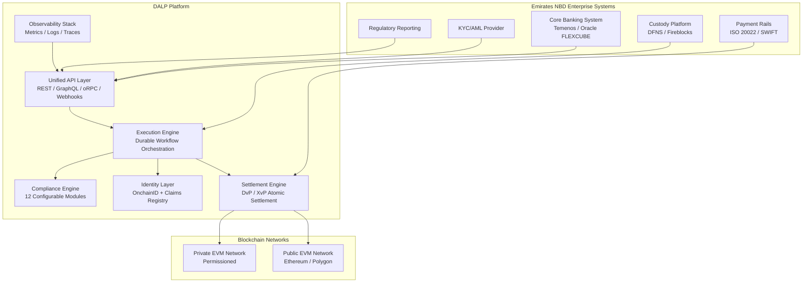

### Core Lifecycle Pillars

DALP's architecture is structured around five integrated lifecycle modules. Each is deployable independently or as part of the unified platform. For Emirates NBD, all five are relevant from the initial programme launch.

**Issuance.** DALP provides rapid deployment of tokenized assets across seven asset classes, each with purpose-built lifecycle logic. The Asset Designer wizard guides operators through the configuration of token features, compliance modules, and metadata schemas. Configuration is validated in real time before deployment. Issuance orchestration is durable: if any step in the deployment pipeline fails, the workflow resumes from the last successful checkpoint without creating orphaned contracts. For Emirates NBD, this means Sukuk can be configured with profit-rate distribution features, maturity mechanics, and VARA/SCA compliance modules in a single guided configuration session, without requiring smart contract development.

🟢 Native: Seven pre-built asset templates with full lifecycle logic
🟢 Native: Configurable token features and compliance modules via Asset Designer
🟢 Native: Durable issuance orchestration with idempotent restart capability
🟡 Partial: Islamic finance-specific Sukuk labeling is supported through configurable asset type naming and custom metadata; profit distribution uses the platform's yield distribution mechanics

**Compliance.** Ex-ante enforcement ensures every transfer is validated before execution. DALP's compliance engine includes 12 module types across 6 categories, covering country restrictions, investor accreditation, supply limits, holding periods, collateral backing, and transfer controls. Multi-jurisdictional support models complex requirements across the UAE's regulatory landscape. The ERC-3643 (T-REX) regulated token standard is the actual open standard DALP implements, enforcing compliance at the smart contract protocol level rather than the application layer.

🟢 Native: 12 compliance modules, 18 configurable module types, 7 regulatory templates
🟢 Native: ERC-3643 / T-REX protocol-level enforcement
🟢 Native: OnchainID for verifiable, reusable on-chain investor identities
🟡 Partial: VARA-specific compliance templates require configuration from the module library; no pre-seeded VARA template exists out of the box

**Custody.** Key management workflows with bring-your-own-custodian integrations. DALP orchestrates custody policy across existing custodian relationships. The Key Guardian service supports multiple storage backends, from encrypted database for development through cloud secret managers and HSM for production to institutional MPC via DFNS and Fireblocks. Maker-checker approval workflows enforce four-eyes governance on all signing operations. For Emirates NBD, this means the bank retains its existing custody relationships and extends them into the digital asset workflow rather than being forced to change providers.

🟢 Native: Key Guardian with encrypted database, cloud secret manager, HSM, DFNS, Fireblocks backends
🟢 Native: Maker-checker approval workflows with configurable quorum
🟢 Native: Emergency pause and formal recovery procedures
🟢 Native: Provider-delegated transaction broadcast for DFNS and Fireblocks

**Settlement.** Atomic Delivery-versus-Payment (DvP) and Exchange-versus-Payment (XvP) settlement. Asset and cash legs complete together or both revert, eliminating counterparty risk, reconciliation gaps, and operational drift. Local same-chain settlement and HTLC cross-chain settlement are both supported. ISO 20022 integration provides the payment rail connectivity required for AED, USD, and SAR cash-leg settlement through SWIFT and RTGS systems. For Emirates NBD's Sukuk programme, this means profit payments and principal redemptions settle atomically, with full on-chain audit trail.

🟢 Native: Atomic DvP and XvP settlement
🟢 Native: HTLC cross-chain settlement
🟢 Native: ISO 20022 payment rail connectivity
🟢 Native: Deterministic settlement closure with auditable end-states

**Servicing.** Automated lifecycle operations including coupon and profit-rate payments, yield distribution, dividend processing, redemptions, maturity handling, and corporate action execution. These are executed programmatically across every asset type without manual intervention. The Yield Schedule addon automates distribution of returns to token holders with snapshot-based balance capture, flexible schedules, and pro-rata calculation. For Emirates NBD, this means Sukuk profit distributions, bond coupon payments, and real estate rental income distributions are all executed automatically on schedule, without requiring bank operations staff to manually process each distribution event.

🟢 Native: Fixed treasury yield with pull-based claiming
🟢 Native: Automated yield distribution via Yield Schedule addon
🟢 Native: Maturity redemption with atomic payout
🟢 Native: Corporate action processing for dividends and coupons

### Platform Foundations

Beneath the five lifecycle pillars, three cross-cutting foundations provide the operational infrastructure that regulated institutions require.

**Identity and Access Management.** DALP embeds a unified identity layer across the entire platform. OnchainID provides verifiable, on-chain investor identities. The Identity Registry manages verified profiles with claim-based verification, covering KYC credentials, KYB credentials, accreditation status, and jurisdictional eligibility. Claims are reusable across all assets: an investor verified for one Emirates NBD product is automatically eligible for any other product for which their existing claims satisfy the compliance requirements, without re-verification. RBAC governs every platform action with 26 distinct roles across platform, system, per-asset, and system-module layers.

**Integration and Interoperability.** DALP is designed to operate within Emirates NBD's existing institutional environment. The platform provides comprehensive APIs including REST, GraphQL, event webhooks, and oRPC. A typed SDK supports TypeScript integrators. A CLI with 301 commands covers system administration, token lifecycle, identity, compliance, monitoring, and addon workflows. Payment rail connectivity supports ISO 20022 standards. Bring-your-own-custodian integrations cover Fireblocks and DFNS. Bring-your-own-chain flexibility supports any EVM-compatible network, public or private.

**Observability and Operations.** DALP ships operational tooling designed for institutional environments. Pre-built Grafana dashboards cover operations overview, transaction monitoring, compliance activity, and security events. Three-pillar observability includes metrics (VictoriaMetrics), logs (Loki), and traces (Tempo/OpenTelemetry). Automated alerting uses structured notification templates for firing and resolved alert states. The async transaction pipeline provides 11-state lifecycle management with idempotency, retry semantics, dead-letter rescue, and full state-transition audit trails.

### Supported Asset Classes and Operating Scope

DALP provides seven purpose-built asset templates, each with asset-specific lifecycle logic. For Emirates NBD, the prioritized scope covers:

| Asset Class | Phase | Key Features | UAE Relevance |
|---|---|---|---|
| Sukuk / Bond | 1 | Profit-rate distribution, maturity redemption, supply limits | Capital markets; GCC investor base |
| Conventional Bond | 1 | Fixed coupon yield, maturity redemption, call/put options | Conventional fixed income |
| Real Estate | 2 | Fractional ownership, rental income distribution, DLD integration | Dubai property market |
| Structured Deposits | 2 | Programmable interest, maturity, withdrawal rules | Private banking; HNW clients |
| Precious Metals | 3 | Asset-backed tokens, provenance tracking, chain-of-custody | Dubai Gold Souk connection |
| Equity | 3 | Dividend distribution, voting rights, corporate actions | Private placements; venture |
| Fund | 3 | NAV integration, subscription/redemption, fee structures | Wealth management |
| Stablecoin / Deposit Token | 3 | Reserve monitoring, attestation, multi-currency | AED digital payment instrument |

### Key Differentiators

DALP's differentiation for Emirates NBD rests on four specific architectural choices that distinguish it from the alternatives.

| Differentiator | DALP Approach | Typical Alternative |
|---|---|---|
| Token architecture | One composable contract, any instrument, via runtime configuration | Fixed set of pre-built token types requiring custom development for novel structures |
| Compliance enforcement | 12 modules, ex-ante, on-chain, protocol-level via ERC-3643 | Application-layer checks that can be bypassed or require redeployment for changes |
| Lifecycle coverage | Full: issuance through servicing through retirement, all automated | Stops at issuance; servicing requires manual processes or custom development |
| Deployment flexibility | On-premises, private cloud, managed SaaS, hybrid; same platform capabilities | Single deployment model without flexibility for data sovereignty requirements |

---

## Composability and Configurable Token Design

### The Core Architecture Challenge

Most tokenization platforms force a binary choice. Either they offer a rigid set of pre-built token types with compliance baked into the contract at compile time, in which case representing a novel instrument requires months of custom Solidity development, or they offer a blank-slate smart contract toolkit in which case the institution must assemble every piece of functionality from scratch. Neither approach survives contact with real institutional requirements, where every asset class has different economics, every jurisdiction has different rules, and both change over time.

Emirates NBD's asset universe illustrates this clearly. A Sukuk requires profit-rate distribution mechanics tied to Islamic finance principles, not conventional interest accrual. A real estate token requires fractional ownership representation, rental income distribution tied to lease schedules, and property revaluation event handling. A structured deposit requires programmable interest logic, maturity handling, and potentially early redemption gates. A precious metals token requires provenance chain metadata and chain-of-custody documentation. If each of these requires a separate, bespoke smart contract development cycle, the bank is not operating a platform. It is operating a custom development shop.

DALP's composability architecture solves this at the architectural level. One contract type, DALPAsset, represents any financial instrument through runtime configuration of pluggable token features and compliance module types. The token's economic behavior and the compliance rules that govern it are both selected from pre-audited catalogs and configured at runtime, not compiled into immutable contracts.

### The Three-Layer Composability Model

DALP's composable architecture operates across three independent layers, each configurable without affecting the others.

```mermaid
graph TB
    subgraph "Layer 1: DALPAsset Base Contract"
        BASE["DALPAsset<br/>SMART Protocol (ERC-3643) + ERC-20<br/>Single configurable contract<br/>Any assetTypeName as free-form string"]
    end

    subgraph "Layer 2: Token Features (up to 32 per token)"
        F1["Transaction Fee<br/>BPS fee on every transfer"]
        F2["AUM Fee<br/>Time-based management fee"]
        F3["Fixed Treasury Yield<br/>Fixed-rate yield at intervals"]
        F4["Maturity Redemption<br/>Bond maturity lifecycle"]
        F5["Historical Balances<br/>Point-in-time queries"]
        F6["Voting Power<br/>ERC-5805 delegated governance"]
        F7["Permit<br/>EIP-2612 gasless approvals"]
        F8["Conversion<br/>Convertible instruments"]
        F9["+ up to 24 more features<br/>per token"]
    end

    subgraph "Layer 3: Compliance Modules (12 types)"
        C1["Country Allow/Block List<br/>Jurisdiction restrictions"]
        C2["SMART Identity Verification<br/>RPN expression engine"]
        C3["Time Lock<br/>Holding period enforcement"]
        C4["Transfer Approval<br/>Pre-authorization gate"]
        C5["Token Supply Limit<br/>Rolling-window cap"]
        C6["Investor Count<br/>Maximum unique holders"]
        C7["Collateral<br/>On-chain reserve verification"]
        C8["Identity/Address Block<br/>Specific exclusions"]
    end

    BASE --> F1 & F2 & F3 & F4 & F5 & F6 & F7 & F8 & F9
    BASE --> C1 & C2 & C3 & C4 & C5 & C6 & C7 & C8
```

**Layer 1: DALPAsset.** A single configurable contract built on the SMART Protocol (ERC-3643) and ERC-20. This replaces the seven legacy specialized contract types that traditional platforms require. The contract accepts any `assetTypeName` as a free-form string, enabling Emirates NBD to create "Sukuk", "Murabaha", "Ijara", "REIT-Token", "Gold-Certificate", or any other instrument label without code changes. The contract is not a simplification; it is the same production-quality contract that underlies all seven pre-built asset templates, generalized through composability.

**Layer 2: Token Features.** Eleven runtime-pluggable extensions that define the token's economic behavior. Features are attached to a token via the `setFeatures()` function and can be added, removed, or reordered without redeploying the token contract. Up to 32 features can be attached per token. For Emirates NBD:

- **Sukuk tokens** use Fixed Treasury Yield for profit-rate distribution, Historical Balances for point-in-time ownership snapshots, Maturity Redemption for principal return at maturity, and optionally Voting Power for Sukuk governance events.
- **Real estate tokens** use AUM Fee for property management fee collection, Historical Balances for rental income distribution snapshots, and optionally Voting Power for investor governance on material property decisions.
- **Structured deposit tokens** use Fixed Treasury Yield for interest accrual, Maturity Redemption for term deposit maturity handling, and optionally Transaction Fee for secondary market fee collection.
- **Precious metals tokens** use Historical Balances for redemption snapshot verification, with provenance metadata stored in the configurable metadata schema.

Token features implement six lifecycle hooks: `canUpdate` (pre-check), `onTransferred`, `onMinted`, `onBurned`, `onRedeemed`, and `onAttached`. Features that can modify transfer amounts in-flight, such as fee collection features, set `supportsRewriting() = true`. Ordering determines execution sequence: restriction features run first, then fee collection, then analytics.

| Feature Category | Features Available | Example UAE Applications |
|---|---|---|
| Fees and charges | Transaction Fee, AUM Fee, External Transaction Fee, Transaction Fee Accounting | Property management fees; secondary market fees; Sukuk management fees |
| Governance and snapshots | Historical Balances, Voting Power (ERC-5805), Permit (EIP-2612) | Investor voting on corporate actions; gasless approval flows |
| Lifecycle and yield | Fixed Treasury Yield, Maturity Redemption | Sukuk profit distribution; bond coupon; deposit maturity |
| Transformation | Conversion (loan-side), Conversion Minter (equity-side) | Convertible instruments; loan-to-equity structures |

**Layer 3: Compliance Modules.** Twelve composable compliance modules across six categories that define who can hold, trade, and receive the token, under what conditions, and with what controls. Compliance modules are independently configurable per token and operate sequentially: every module must pass for a transfer to execute. A single module veto blocks the transfer.

This is the architectural property that makes ex-ante compliance possible at the protocol level. The compliance rules are not application-layer checks. They are smart contract functions that execute as part of the transfer transaction itself. There is no code path that allows a non-compliant transfer to succeed.

### Token Feature Deep Dive for UAE Asset Classes

**Sukuk and Profit Distribution.** A Sukuk token on DALP uses the Fixed Treasury Yield feature for profit-rate distribution. The issuer funds a treasury with the profit payment amount, calculated on the nominal value of outstanding Sukuk at the configured profit rate. Token holders claim their proportional share of the treasury at each distribution period. The system uses Historical Balance snapshots to determine each holder's share at the snapshot date, ensuring that late purchasers and early sellers receive exactly the proportion they are entitled to.

For VARA-regulated Sukuk offered to UAE institutional investors, the compliance module stack would include:

1. Country Allow List: Restrict to UAE and approved GCC jurisdictions
2. SMART Identity Verification: Require KYC and AML claims for individual investors, or QII (Qualified Institutional Investor) CONTRACT claim for institutional investors
3. Token Supply Limit: Enforce the aggregate offering cap within the applicable VARA or SCA framework
4. Time Lock: Enforce minimum holding periods where applicable under SCA securities regulations
5. Transfer Approval: Require pre-authorization for secondary market transfers above defined thresholds

This configuration is assembled in the Asset Designer without any smart contract development. Each module is selected from the catalog, parameterized with the specific values (country codes, claim types, supply limits, holding periods), and saved as a reusable compliance template that can be applied to subsequent Sukuk issuances.

**Real Estate Tokens and Fractional Ownership.** UAE real estate tokenization requires fractional ownership representation, rental income distribution, property revaluation handling, and integration with the Dubai Land Department (DLD) registry. DALP's Real Estate asset template provides the foundational structure. The AUM Fee feature handles ongoing property management fee collection. Fixed Treasury Yield with snapshot-based distribution handles rental income paid to fractional owners on a monthly or quarterly schedule. The Historical Balances feature ensures that rental income is distributed to the investors who held tokens at the snapshot date, not to subsequent purchasers.

The metadata schema for real estate tokens is fully configurable: property identifier, DLD registration number, property location, total property value, fractional unit size, independent valuation date, and any other property-specific data fields that compliance or investor relations require. This metadata is stored on-chain and queryable through DALP's API.

**Precious Metals and Provenance.** Dubai's position as a global gold trading center means that gold-backed tokens require a provenance chain that tracks the physical metal from refiner through vault through tokenization. DALP's Precious Metals template supports asset-backed token issuance with configurable metadata fields for vault location, refiner certification, assay certificate reference, and LBMA Good Delivery status. The Collateral compliance module can verify that on-chain proof of reserves assertions are maintained before allowing additional minting.

### Post-Deployment Configurability

One of the most operationally significant properties of DALP's composability architecture is that configurations can change after deployment. Under GOVERNANCE_ROLE, live tokens can be reconfigured:

- Token features can be added or removed via `setFeatures()`
- Compliance modules can be added, removed, or reconfigured
- Module parameters can be updated: country lists, investor limits, approval expiry windows, supply caps
- Fee rates, schedules, and treasury addresses can be changed
- No redeployment is required for any of these changes

For Emirates NBD, this means that when VARA publishes updated investor eligibility requirements, when CBUAE changes payment instrument rules, or when a new GCC country is added to the eligible investor list, the compliance configuration can be updated through the platform's governance interface without requiring engineering involvement, without deploying new contracts, and without migrating existing token holders.

This post-deployment flexibility is not a convenience feature. It is the architectural property that makes compliance maintainable over the multi-year lifetime of issued assets.

### Configurable Asset Type Templates

Beyond the seven pre-built asset templates, DALP supports the creation of custom asset type templates. Emirates NBD can define:

1. **Custom asset type names**: "Ijara Sukuk", "Murabaha Deposit", "Green Bond", "Commodity Murabaha" as labeled token types
2. **Required feature sets**: Feature combinations that must be present for a given asset type, enforced at deployment
3. **Metadata schemas**: Custom on-chain metadata fields specific to the instrument type
4. **Compliance templates**: Pre-configured compliance module combinations aligned with specific regulatory perimeters

These custom templates become part of the bank's internal asset factory: a library of pre-approved, pre-configured instrument types that product teams can issue without requiring technology or compliance team involvement for each new issuance. The bank configures the template once; subsequent issuances select and parameterize from the approved library.

### Mermaid: Asset Configuration Flow

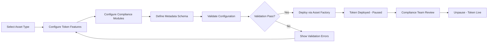

The configuration flow ensures that every deployed token has passed validation before going live. The pause-by-default state provides a compliance review window between deployment and activation, giving Emirates NBD's compliance team an opportunity to verify the configuration before the token becomes active.

---

## Configurable Compliance Framework

### The Ex-Ante Enforcement Principle

Compliance for tokenized assets can be implemented in two fundamentally different ways. The first approach applies compliance checks at the application layer, validating transfers in the API or middleware before broadcasting them to the blockchain. The second approach enforces compliance at the smart contract protocol layer, where the compliance check is part of the transfer function itself.

Application-layer compliance has a critical vulnerability: any code path that bypasses the application layer bypasses the compliance check. Direct blockchain interactions, API misconfigurations, or emergency operational procedures can all create pathways around application-layer controls. For a UAE-regulated financial institution operating under VARA and CBUAE oversight, this is not a theoretical risk. It is a regulatory exposure that will surface during vendor due diligence.

DALP enforces compliance at the protocol layer through the ERC-3643 (T-REX) standard. Every transfer function in every DALP token calls the compliance engine as an integral part of its execution. There is no code path that skips this check. A non-compliant transfer fails at the smart contract level and reverts. No state changes. No partial execution. No audit exception to resolve.

### The 12 Compliance Modules

DALP's compliance engine provides 12 configurable module types organized across 6 functional categories. Each module is a standalone smart contract that implements the `ISMARTComplianceModule` interface, receiving transfer parameters and returning an approval or rejection with a reason code.

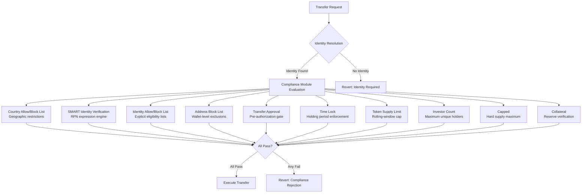

**Geographic Restrictions (2 modules).** The Country Allow List module restricts token holdings to wallets from specified countries, identified through OnchainID jurisdiction claims. The Country Block List module excludes wallets from specified blocked countries. For Emirates NBD, a Sukuk offered exclusively to GCC institutional investors would use the Country Allow List configured with UAE, Saudi Arabia, Kuwait, Bahrain, Qatar, and Oman. A product subject to OFAC and UAE sanctions screening would use the Country Block List to exclude sanctioned jurisdictions.

Both modules operate on the JURISDICTION claim attached to the investor's OnchainID. The claim is issued by a trusted KYC provider and verified cryptographically by the compliance module at the time of each transfer. Jurisdiction changes require a claim update by a trusted issuer, which is recorded on-chain.

**Identity Access Control (3 modules).** The Identity Allow List module implements an explicit whitelist: only identities that have been explicitly added to the allow list can receive tokens. This is appropriate for private placements and restricted offerings where each investor must be individually approved. The Identity Block List provides the inverse: explicit exclusion of specific identities while allowing all others. The Address Block List operates at the wallet level without identity resolution, enabling exclusion of specific wallet addresses without requiring a full identity onboarding event.

**Claim-Based Verification (1 module).** The SMART Identity Verification module is the most expressive compliance control in the catalog. It evaluates logical expressions over identity claims using Reverse Polish Notation (RPN), supporting KYC, AML, ACCREDITED, CONTRACT, and JURISDICTION claim types with AND, OR, and NOT operators. This enables arbitrarily complex investor eligibility logic to be encoded as a configurable expression rather than as code.

For Emirates NBD's specific regulatory requirements:

| Regulatory Framework | RPN Expression | Plain Language |
|---|---|---|
| VARA Professional Investor | `[KYC, AML, ACCREDITED, AND, AND]` | Must have KYC, AML, and Accredited Investor status |
| VARA Retail (capped) | `[KYC, AML, AND]` | KYC and AML required; supply limit controls aggregate exposure |
| SCA Exempt Offer | `[ACCREDITED]` | Accredited investors only |
| DIFC QI | `[CONTRACT, KYC, AML, AND, OR]` | QI (corporate) or individual with KYC and AML |
| Sharia Compliance | `[KYC, AML, AND]` + Country Allow List for approved jurisdictions | Standard eligibility plus geographic restriction to Islamic finance markets |
| GCC Cross-Border | Country Allow List + `[KYC, AML, AND]` | GCC country restriction plus standard KYC/AML |

**Supply and Investor Limits (3 modules).** The Token Supply Limit module enforces a rolling-window issuance cap, which is specifically designed for MiCA's EUR 8 million / 365-day rolling window requirement but equally applicable to SCA offer size limits and VARA aggregate issuance thresholds. The Investor Count module enforces a maximum number of unique holders, directly applicable to private placement exemptions that cap investor numbers. The Capped module provides a hard maximum supply that cannot be exceeded regardless of other factors.

For a VARA-regulated retail offering, Emirates NBD might configure Token Supply Limit to cap aggregate token value at the applicable VARA threshold within a 365-day rolling window, and Investor Count to enforce the maximum retail investor count permitted without a full prospectus.

**Time-Based Rules (1 module).** The Time Lock module enforces minimum holding periods using FIFO batch tracking. Each acquisition of tokens is recorded with its timestamp. Transfers are blocked until the acquired tokens have been held for the configured minimum period. For SCA-regulated securities tokens, this directly implements the transfer restriction periods that apply to primary market purchases.

**Transfer Controls (2 modules).** The Transfer Approval module requires that each transfer receive explicit pre-authorization before execution. The approval has a configurable expiry window, preventing approvals from remaining open indefinitely. This module is appropriate for restricted securities where a compliance officer must review each secondary market transaction. The Collateral module enforces an on-chain collateral ratio for minting, verifying via ERC-735 identity claims that sufficient collateral backing exists before new supply is issued. For stablecoins and asset-backed instruments, this module directly implements reserve backing requirements.

### Two-Tier Compliance Architecture

DALP implements a two-tier compliance architecture that separates per-token compliance configuration from system-wide compliance controls.

**Per-token compliance** covers the specific compliance rules for each individual token. Each token has its own compliance module configuration that is appropriate to its asset class, investor category, and regulatory perimeter. A Sukuk token and a real estate token hosted on the same platform can have completely different compliance rules. Per-token compliance modules are managed under GOVERNANCE_ROLE and can be reconfigured post-deployment.

**System compliance** covers global rules that apply to all tokens on the platform regardless of their individual configuration. System-level compliance is appropriate for sanctions screening, platform-wide investor bans, and global policy requirements that must apply across every asset type without exception. System compliance includes a bypass list for operational exemptions, such as the platform's own operational wallets.

The sequential evaluation model means that both layers must pass for any transfer to succeed. A transfer that passes the token's individual compliance modules but is blocked by a system-wide sanctions module will still fail. This provides Emirates NBD with a clean separation between asset-level compliance policy and institution-level policy.

### Compliance Configuration for UAE Regulatory Perimeters

The UAE regulatory landscape for digital assets involves multiple concurrent frameworks. DALP's compliance architecture is specifically suited to this environment because it allows different compliance module configurations to be applied to different token types, reflecting the different regulatory perimeters each product operates under.

**CBUAE Payment Instruments.** Digital payment instruments regulated by the CBUAE, including AED-denominated deposit tokens and payment-linked instruments, require reserve backing verification, issuance caps, and KYC for all holders. DALP's Collateral module verifies reserve backing. Token Supply Limit enforces issuance caps. SMART Identity Verification enforces KYC requirements.

**VARA Virtual Assets.** VARA's regulatory framework applies to virtual asset services providers in Dubai, covering trading, exchange, and custody of virtual assets. For VARA-regulated tokens, investor classification (retail vs. professional vs. institutional) determines the applicable compliance requirements. DALP models this through the SMART Identity Verification module's claim-based eligibility logic, where the investor's VARA-verified classification claim determines which products they can access.

**SCA Securities Tokens.** The SCA's token offering framework covers securities-class tokens including equity and bond instruments. Private placement exemptions typically apply caps on investor numbers and aggregate offering value. DALP's Investor Count and Token Supply Limit modules directly implement these caps. SCA-regulated transfers may require pre-authorization, implemented through the Transfer Approval module.

**DIFC Financial Services.** Products structured under DIFC jurisdiction and the DFSA's regulatory framework follow a separate regulatory perimeter. DALP supports DIFC products through the Country Allow List (restricting to DIFC-eligible investors) and SMART Identity Verification (requiring DIFC Qualified Investor or Professional Client classification claims).

**Islamic Finance (Sharia Compliance).** Sharia compliance for Sukuk and other Islamic finance instruments requires that profit distribution follows the profit-and-loss sharing principles rather than conventional interest mechanics. DALP's Fixed Treasury Yield feature distributes profit from a treasury funded by the Sukuk issuer, consistent with Mudarabah and Musharakah structures where profit is distributed from actual returns. The platform does not hardcode Sharia compliance determination; that remains the responsibility of the issuer's Sharia board. DALP provides the configurable mechanics that can implement the board's determinations.

### Compliance Audit Trail

Every compliance decision, whether an approval or a rejection, is recorded in DALP's audit trail. The audit trail captures:

- Transfer identifier
- Sender and recipient wallet addresses and linked OnchainID contracts
- Compliance module evaluation sequence and result for each module
- Rejection reason code if any module blocked the transfer
- Timestamp and block reference for on-chain traceability
- Operator identity for authorized forced transfers

This audit trail is immutable once recorded. It satisfies the evidentiary requirements of VARA's compliance reporting framework, CBUAE's regulatory reporting expectations, and internal audit requirements. The structured log output can be forwarded to Emirates NBD's SIEM platform for integration with the bank's existing security operations center.

### Compliance Template Library

DALP ships with seven pre-seeded regulatory compliance templates as starting points:

| Template | Jurisdiction | Key Constraints |
|---|---|---|
| MiCA EU Standard | EU (27 countries) | KYC + AML required; EUR 8M cap in 365-day rolling window |
| Reg D 506(b) | USA | Max 2,000 investors; Accredited OR (KYC + AML) |
| Reg D 506(c) | USA | All purchasers accredited; 24-hour transfer approval expiry |
| MAS Singapore | Singapore | Max 50 investors; 180-day holding period |
| UK FCA Securities | UK | Max 150 investors |
| Japan FSA Crypto | Japan | 7-day transfer approval expiry |
| Reg CF Crowdfunding | USA | USD 5M cap in 365-day rolling window |

Emirates NBD's compliance team, working with SettleMint's solution architects during Phase 1 Discovery, would define UAE-specific compliance templates covering VARA retail, VARA professional, SCA securities offerings, DIFC qualified investor products, and GCC cross-border structures. These templates are then available for reuse across all subsequent issuances, enabling the bank's product teams to issue new products against pre-approved compliance configurations without requiring case-by-case compliance review of the compliance module configuration itself.

### KYC/AML Integration and Claim Issuance

DALP's compliance framework does not perform KYC/AML verification internally. That function remains with Emirates NBD's existing KYC/AML providers, which have the regulatory authorization, data sources, and ongoing monitoring capabilities required for CBUAE and VARA-compliant KYC processes. DALP consumes the output of these processes as on-chain claims issued to the investor's OnchainID.

The claim issuance model works as follows:

1. Emirates NBD's KYC/AML provider completes identity verification for an investor
2. A trusted claim issuer (authorized by Emirates NBD and configured in DALP's trusted issuer registry) publishes a KYC claim, an AML claim, and any applicable accreditation or classification claims to the investor's OnchainID contract
3. The claims are recorded on-chain with the issuer's signature, expiry date, and claim data
4. When the investor attempts a transfer, DALP's compliance modules read the claims directly from the blockchain and verify the issuer's signature cryptographically
5. Claims that have expired, been revoked, or were issued by an untrusted issuer are rejected

This model has three important operational benefits. First, claim data is portable: claims issued for one Emirates NBD product automatically satisfy eligibility requirements for any other product that accepts the same claim types. Second, claim revocation propagates instantly: when an investor's KYC status changes, revoking the claim immediately blocks them from all products without requiring any manual intervention per product. Third, the compliance audit trail captures the claim verification result, providing documented evidence that compliance checks were performed and the specific claim data that justified each decision.

---

## Customer References

### Summary Table

SettleMint's reference portfolio spans 14 live and active programmes across regulated banks, sovereign entities, market infrastructure providers, and multilateral institutions. The following summary positions all 14 references and identifies those most relevant to Emirates NBD's programme.

| Client | Use Case | Geography | Asset Class | Relevance to Emirates NBD |
|---|---|---|---|---|
| ADI Finstreet | Tokenized equity on UAE/GCC mainnet | UAE / GCC | Equity | Direct UAE/GCC regulatory experience; DFNS custody; Helm/K8s |
| Saudi RER | Country-scale real estate tokenization | KSA | Real Estate | Country-scale; registry integration; GCC sovereign programme |
| Islamic Development Bank | Sharia-compliant subsidy distribution | Global (57 countries) | Islamic Finance | Sharia-compliant structures; profit distribution; MENA scale |
| IsDB Market Stabilization | Sharia-compliant market stabilization | Global | Islamic Finance | Islamic finance collateral mechanics; automated algorithms |
| Standard Chartered | Fractional securities; institutional trading in ME/Asia/Africa | Asia, ME, Africa | Multi-asset | Middle East institutional trading; fractional tokenization |
| OCBC Bank | Security token engine; HNWI/HENRY products | Singapore | Multi-asset | HNWI/private banking angle; bonds + real estate + SPV |
| KBC Securities Bolero | Equity crowdfunding + SME loans | Belgium | Equity, Credit | Lifecycle automation; corporate actions; redemption |
| Sony Bank | Stablecoin + digital identity | Japan | Stablecoin | KYC-enabled Web3 banking; Privado.id onboarding |
| Mizuho Bank | Bond tokenization and trade finance | Japan | Bond, Trade Finance | Bond lifecycle; trade finance; PoC to production path |
| State Bank of India | CBDC infrastructure | India | CBDC | Central bank-scale infrastructure; digital currency |
| RBI Innovation Hub | Multi-bank letter of credit trade finance | India | Trade Finance | Multi-bank; multi-cloud blockchain; fraud-proof workflows |
| Maybank Project Photon | FX tokenization; XvP cross-border settlement | Malaysia | FX / Settlement | Cross-border settlement; XvP model; multi-currency |
| Commerzbank | Hybrid ETP issuance; near real-time settlement | Germany | Structured Products | Near real-time settlement; exchange listing integration |
| KBC Insurance | NFT product passports | Belgium | Insurance | Non-financial asset tokenization |

### Relevance Selection Logic

Three references were selected for expanded case study treatment based on their direct relevance to Emirates NBD's programme priorities: UAE/GCC regulatory environment, Islamic finance operational experience, and institutional multi-asset capability.

### ADI Finstreet: Tokenized Equity on UAE/GCC Mainnet

**Context.** ADI (Abu Dhabi-based) engaged SettleMint to deliver tokenized equity issuance and management on ADI's dedicated UAE/GCC blockchain mainnet. The engagement is the most direct reference for Emirates NBD's programme because it operates in the same regulatory environment, under the same infrastructure conventions, and using the same platform components.

**Challenge.** The programme required a regulated equity token with full corporate action support, including stock splits and consolidations, on-chain voting governance, and institutional-grade custody integration on a UAE/GCC-based private blockchain. The deployment needed to be cloud-agnostic (Terraform, Helm, managed Kubernetes) and compatible with both DFNS for transaction signing and Fireblocks as an integration path.

**Solution Pattern.** SettleMint delivered equity tokens using DALP's equity template, extended with corporate action functionality (stock splits and consolidations via controlled mint and burn operations), ERC20Votes for on-chain voting power, and upgradeable smart contracts on ADI's private network. DFNS was integrated for transaction signing with structured approval workflows. The entire deployment used Helm chart automation on managed Kubernetes infrastructure within the UAE/GCC region.

**Outcome and Transferability.** The deployment provided a scalable foundation for regulated equity tokenization on ADI's dedicated blockchain environment. For Emirates NBD, this reference demonstrates that SettleMint has already deployed DALP in the UAE regulatory perimeter with institutional custody integration and regional infrastructure conventions. The institutional knowledge of UAE-specific vendor risk assessment processes, security review protocols, and regulatory submission requirements transfers directly to an Emirates NBD engagement.

### Islamic Development Bank: Sharia-Compliant Operations at Scale

**Context.** SettleMint delivered two separate programmes for the Islamic Development Bank (IsDB), both requiring Sharia-compliant tokenization mechanics at scale. These deployments are the most relevant reference for Emirates NBD's Sukuk and Islamic finance product ambitions.

**Challenge.** The first programme required digitizing subsidy distribution across 57 member countries with Sharia-compliant structures, automated administrative processing, and direct peer-to-peer distribution to beneficiaries. The second required a fully automated market stabilization system for assets used as collateral for Sharia-compliant lending, addressing excessive volatility without human error.

**Solution Pattern.** For subsidy distribution, SettleMint implemented digitized delivery with automated administration and legal process automation, enabling direct P2P fund distribution to beneficiaries across 57 jurisdictions. For market stabilization, advanced algorithms, predictive modeling, and smart contracts were deployed to regulate collateral volatility.

**Outcome and Transferability.** The subsidy distribution programme improved financial inclusion for 1.7 billion people while maintaining Sharia compliance across diverse national regulatory frameworks. The market stabilization programme reduced volatility by 30 to 50 percent. For Emirates NBD, these programmes demonstrate that SettleMint can implement Islamic finance-specific operational mechanics at scale and across complex multi-jurisdiction environments. The profit-distribution and holding-period controls that DALP provides for Sukuk are not theoretical capabilities; they have been validated in operational IsDB programmes.

### OCBC Bank: Multi-Asset HNWI Platform

**Context.** OCBC Bank engaged SettleMint to build a security token engine for securitization, tokenization, and fractionalization of off-chain assets, targeting high-net-worth (HNW) and HENRY (High Earner, Not Rich Yet) investor segments with products across bonds, SPVs, stocks, and real estate.

**Challenge.** Deliver innovative investment products with a secure end-user interface for tokenization, wallet management, and cash positions, and a backend with order book management and APIs to integrate with off-chain securities and cash systems.

**Solution Pattern.** SettleMint implemented a security token engine enhancing liquidity for illiquid assets and expanding investment opportunities. The solution included a secure end-user interface, an order book management system for seamless transactions, and backend integration with off-chain securities and cash systems.

**Outcome and Transferability.** OCBC benefited from an easy-to-administer and scalable digital asset exchange platform. For Emirates NBD, the OCBC reference directly maps to the bank's private banking and HNW digital assets ambition. The multi-asset scope (bonds, SPVs, stocks, real estate) mirrors Emirates NBD's Phase 1 through Phase 3 asset roadmap. The integration requirements (off-chain securities and cash systems) mirror Emirates NBD's core banking integration needs.

### Reference Fit Matrix

| Reference | Emirates NBD Requirement Area | Why Relevant | Evidence Supported |
|---|---|---|---|
| ADI Finstreet | UAE/GCC deployment; custody integration; Kubernetes infrastructure | Same regulatory environment; same custody providers; same infrastructure stack | Technical deployment pattern; regulatory pathway |
| Islamic Development Bank x 2 | Sukuk / Islamic finance operations; Sharia-compliant mechanics | Operational Islamic finance delivery at scale across MENA | Sharia-compliant token mechanics; profit distribution; multi-jurisdiction |
| Standard Chartered | Middle East institutional trading | Middle East in scope; fractional securities; reduced intermediaries | Institutional trading pattern; Middle East market knowledge |
| OCBC Bank | HNWI / private banking multi-asset platform | Multi-asset scope including bonds and real estate; HNW focus | Multi-asset lifecycle; backend integration model |
| Saudi RER | UAE-adjacent sovereign real estate programme | GCC sovereign scale; property registry integration; country-scale infrastructure | Country-scale deployment; registry integration; sovereign programme delivery |

---

## Understanding of Requirements

### Client Context

Emirates NBD PJSC is building digital asset infrastructure that reflects the bank's position as the UAE's leading financial institution and its obligations to operate under a complex, evolving regulatory environment. The bank's transformation mandate connects digital asset capability to three strategic priorities.

The first is product innovation for high-net-worth and institutional clients. The UAE's wealth management market, anchored in Dubai's role as a global financial center, demands digital investment products that were not previously accessible: fractional real estate ownership, tokenized Sukuk with secondary market liquidity, and gold-backed digital certificates linked to Dubai's commodity trading heritage. Emirates NBD's private banking and wealth management divisions need a platform that can deliver these products to clients in a compliant, operationally reliable way.

The second is capital markets efficiency. The bank's debt capital markets and treasury operations are significant in regional terms. Tokenizing fixed-income issuance, from conventional bonds to Sukuk, creates opportunities for faster settlement, broader investor access, reduced intermediary costs, and programmable lifecycle management that manual processes cannot match.

The third is digital infrastructure leadership. The UAE government's National Blockchain Strategy and the establishment of VARA as one of the world's most progressive virtual asset regulatory frameworks signal that the UAE is committed to digital asset infrastructure at national scale. Emirates NBD's digital asset programme is part of the bank's response to this national direction, positioning the bank as the institutional infrastructure provider of choice for UAE and GCC digital asset transactions.

| Context Dimension | Emirates NBD Position |
|---|---|
| Institution mandate | UAE's largest bank; leading digital transformation in financial services |
| Transformation drivers | Government blockchain strategy; VARA framework; HNW investor demand; capital markets efficiency |
| Target users and participants | HNW clients, institutional investors, corporate issuers, internal bank operations, regulators |
| Regulatory principals | CBUAE, VARA, SCA, ADGM/FSRA, DIFC/DFSA |
| Geographic scope | UAE (primary); GCC cross-border (secondary) |
| Asset scope | Sukuk, bonds, real estate, structured deposits, precious metals, equity, funds |

### Requirement Domains

An assumed best-practice digital assets platform RFP from Emirates NBD would span six requirement domains. DALP's response to each domain is mapped below.

| Requirement Domain | Key Sub-Requirements | DALP Coverage |
|---|---|---|
| Product / Asset Scope | Seven asset classes; Sukuk-specific mechanics; GCC multi-currency; fractional ownership | 🟢 Seven pre-built templates; configurable Sukuk mechanics; multi-currency support; fractional real estate |
| Identity / Onboarding | KYC/AML integration; investor classification; portable credentials; bulk onboarding | 🟢 OnchainID; claim-based verification; reusable claims; batch investor onboarding |
| Compliance / Control | Ex-ante enforcement; multi-regulatory framework; VARA/SCA/CBUAE; audit trail | 🟢 12 compliance modules; ERC-3643 protocol enforcement; configurable regulatory templates; immutable audit log |
| Settlement / Cash Leg | Atomic DvP; AED/USD/SAR settlement; ISO 20022; T+0 finality | 🟢 Atomic DvP/XvP; ISO 20022 SWIFT/RTGS integration; HTLC cross-chain |
| Integration / Reporting | Core banking integration; custody connectors; regulatory reporting; real-time feeds | 🟢 REST/GraphQL/webhook APIs; DFNS/Fireblocks connectors; ISO 20022; SIEM-compatible audit logs |
| Infrastructure / Operations | UAE data residency; HA/DR; Kubernetes; observability; 99.9%+ uptime | 🟢 On-premises and private cloud deployment; UAE data residency; Kubernetes HA; full observability stack |

### Key Challenges Identified

**Challenge 1: Multi-Regulatory Compliance Architecture.**

Emirates NBD must satisfy multiple concurrent regulatory frameworks. A single product may be regulated by VARA (as a virtual asset), SCA (as a securities token), and CBUAE (as it involves AED-denominated instruments), while also needing to comply with DIFC rules for specific investor categories. Building compliance logic that correctly models each framework simultaneously without contradiction or gap is the central technical challenge of this programme.

The implied complexity is that compliance rules cannot be hardcoded per token. They must be composable, so that different combinations of regulatory requirements can be assembled per product type and investor category. They must also be maintainable: when VARA publishes updated guidance or CBUAE revises payment instrument rules, the compliance configuration must be updatable without redeploying contracts or rebuilding systems.

**Challenge 2: Islamic Finance Instrument Mechanics.**

Sukuk are not bonds with different labeling. A Sukuk Al-Murabaha has different profit distribution mechanics than a Sukuk Al-Ijara. Both differ from conventional interest-bearing bonds in the timing, basis, and structure of profit payments. Sharia compliance requires that the platform's token economics actually implement the approved profit-sharing mechanics, not simply relabel conventional interest as profit.

The implied complexity is that token features must be configurable to implement different profit distribution bases, schedules, and treasury structures without requiring bespoke smart contract development for each Sukuk structure. The platform must provide the configurable building blocks; the Sharia board and legal counsel determine the permissible structure.

**Challenge 3: UAE Data Sovereignty and Residency.**

CBUAE regulations and UAE government data sovereignty requirements mandate that financial data for UAE customers must remain within UAE borders. For a digital asset platform, this means that all customer data, investor registry data, transaction data, and audit logs must reside on infrastructure located within the UAE. Any cloud deployment must be to UAE-region data centers. Any blockchain node infrastructure must be locally operated.

The implied complexity is that the deployment architecture must support full UAE data residency from the start, with no data leakage to external jurisdictions, while still supporting the integrations with global custodians, payment rail operators, and KYC providers that operate internationally.

**Challenge 4: Core Banking System Integration.**

Emirates NBD's core banking infrastructure, whether Temenos T24, Oracle FLEXCUBE, or Infosys Finacle, represents the system of record for the bank's financial positions, customer accounts, and transaction history. A digital asset platform must integrate with this system of record for real-time position reconciliation, investor account management, cash position reporting, and regulatory reporting that spans both on-chain and off-chain positions.

The implied complexity is that the integration must be bidirectional, real-time where required, and operationally reliable without creating a tight coupling that makes either system fragile. The API integration layer must handle reconciliation failures, retry logic, and exception management in the same disciplined way that the bank's existing middleware infrastructure does.

**Challenge 5: GCC Cross-Border Settlement.**

Emirates NBD has correspondent banking relationships and institutional investor relationships across the GCC. Sukuk offered to Saudi institutional investors, real estate tokens sold to Kuwaiti family offices, and gold-backed tokens traded between UAE and Bahraini financial institutions all require cross-border settlement in multiple currencies: AED, USD, and SAR.

The implied complexity is that atomic settlement must span both the digital asset and cash legs across different jurisdictions and potentially different regulatory perimeters. The settlement model must handle the case where the digital asset leg settles on-chain but the cash leg settles through SWIFT or RTGS, maintaining settlement finality guarantees without creating irreconcilable timing mismatches.

**Challenge 6: Operational Scale for UAE's Largest Bank.**

Emirates NBD's investor base for digital asset products will be large. A public Sukuk offering to retail and professional investors through the bank's digital channels could onboard thousands of investors. Secondary market trading of real estate tokens could generate hundreds of daily transactions. The platform must operate at these volumes reliably, with the observability and alerting that the bank's IT operations team requires to manage it as a business-critical system.

The implied complexity is that the platform's operational tooling must match the standards that a tier-1 UAE bank applies to its core systems. This means structured monitoring, automated alerting, defined runbooks, SLA-backed support, and disaster recovery procedures that satisfy the bank's IT governance framework.

### Requirement Prioritization

| Requirement Category | Priority | Must-Have Requirements |
|---|---|---|
| Regulatory compliance | Must Have | Ex-ante enforcement; VARA/CBUAE/SCA/DIFC coverage; immutable audit trail |
| Islamic finance support | Must Have | Sukuk mechanics; profit distribution; Sharia board governance integration |
| Data sovereignty | Must Have | UAE data residency; on-premises or UAE-region cloud deployment |
| Asset lifecycle | Must Have | Issuance through servicing through redemption for Sukuk and bonds |
| Core banking integration | Must Have | Real-time position reconciliation; ISO 20022 cash-leg integration |
| Custody integration | Must Have | Bring-your-own-custodian; DFNS/Fireblocks connectivity; maker-checker |
| GCC settlement | Should Have | Multi-currency; cross-border DvP; HTLC cross-chain |
| Observability | Should Have | Grafana dashboards; structured alerting; SIEM integration |
| Secondary market | Should Have | Compliance-checked transfers; transfer approval controls |
| Real estate tokenization | Should Have (Phase 2) | Fractional ownership; DLD integration; rental income distribution |
| Precious metals | Could Have (Phase 3) | Provenance tracking; gold certificate mechanics |

### Response Principles

SettleMint's approach to Emirates NBD's programme rests on four principles that guide every technical and delivery decision.

**Platform before custom development.** Every capability in this proposal reflects DALP's out-of-the-box functionality, configured for Emirates NBD's specific requirements. No custom smart contract development is proposed. No bespoke compliance engine is proposed. The platform provides the building blocks; Emirates NBD's requirements are addressed through configuration, not code.

**Compliance as infrastructure, not afterthought.** The compliance architecture is designed from the start as the structural foundation of the platform, not as an application-layer check added to a separate issuance tool. Ex-ante enforcement at the protocol level means that compliance cannot be bypassed, cannot be misconfigured away, and is always audited.

**Bring-your-own architecture.** Emirates NBD brings its preferred custody provider, its preferred blockchain network model, its existing KYC/AML providers, and its existing core banking system. DALP integrates with each through defined, standard integration patterns without requiring the bank to change any of these existing relationships.

**Evidence-led delivery.** Every capability claim in this proposal maps to a production deployment, a verified platform capability, or a defined configuration. No roadmap items are presented as current capabilities. The confidence tags throughout this document (🟢 Native / 🟡 Partial / 🔴 Gap) indicate exactly where DALP operates and where additional configuration or integration is required.

---

## Proposed Solution and Functional Capabilities

### Solution Overview

SettleMint proposes DALP as Emirates NBD's institutional digital asset control plane. The platform sits between the bank's existing enterprise systems and one or more blockchain networks, providing the identity, compliance, transaction orchestration, custody integration, and lifecycle automation that transform tokenization from a one-off issuance event into a sustainable operating model.

The solution boundary covers: token issuance and asset configuration, investor onboarding and identity management, compliance enforcement across the full transaction lifecycle, custody key management and signing workflows, settlement coordination for both on-chain and cash legs, automated lifecycle servicing including profit distributions and maturities, and operational monitoring and alerting.

The solution boundary does not cover: order book matching or trading venue functionality, KYC/AML identity verification (consumed from Emirates NBD's existing providers), physical asset custody (precious metals, property), or legal structuring of Sukuk or other financial instruments (SettleMint provides the platform mechanics; legal counsel provides the instrument structure).

| Component | In-Scope | Out-of-Scope |
|---|---|---|
| Token issuance and configuration | All seven asset classes | Custom Solidity development |
| Investor identity and onboarding | OnchainID; claim consumption; registry management | KYC/AML verification itself |
| Compliance enforcement | 12 modules; ex-ante; ERC-3643 | Legal advice on compliance framework interpretation |
| Custody and key management | DFNS/Fireblocks integration; HSM; maker-checker | Physical custody of private keys by SettleMint |
| Settlement | Atomic DvP/XvP; ISO 20022 integration | Cash account management in core banking |
| Lifecycle servicing | Profit distribution; maturity redemption; corporate actions | Manual servicing processes outside DALP |
| Observability | Full observability stack; SIEM integration | Security operations center management |

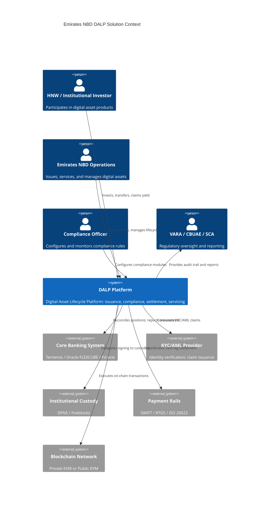

### Issuance and Asset Configuration

DALP's issuance capability begins with the Asset Designer, a validated configuration interface that guides operators through token setup without requiring blockchain expertise. For Emirates NBD, issuance covers all asset classes in scope, with the Asset Designer enforcing class-specific validation rules to prevent misconfiguration.

The Sukuk issuance flow for Emirates NBD would proceed as follows. The issuer (Emirates NBD's DCM team or a corporate issuer using Emirates NBD's platform) opens the Asset Designer and selects "Sukuk" as the asset type. The system presents the Sukuk template with default features: Fixed Treasury Yield (for profit distribution), Maturity Redemption (for principal return), and Historical Balances (for snapshot-based distribution). The operator configures the profit rate, distribution schedule, maturity date, denomination currency, and total issuance size. The compliance configuration step presents the compliance module library, and the operator selects the pre-configured VARA Professional Investor template or a custom template defined by Emirates NBD's compliance team.

Once the configuration is complete, the Asset Designer validates the entire configuration, including feature ordering, compliance module parameter validity, and business rule consistency, before displaying a summary for review. A governance approver (with the appropriate on-chain role) must confirm the deployment. The factory contract then deploys the Sukuk token through a durable workflow that completes all deployment steps atomically. The new token starts in a paused state, allowing the compliance team to verify the configuration before the token becomes active.

🟢 Native: Asset Designer wizard with real-time validation
🟢 Native: Sukuk token configuration with Fixed Treasury Yield and Maturity Redemption
🟢 Native: Durable issuance workflow with idempotent restart
🟢 Native: Pause-by-default safety gate
🟡 Partial: Sharia-specific Sukuk structure documentation is outside platform scope; platform provides configurable mechanics aligned with board-approved structures

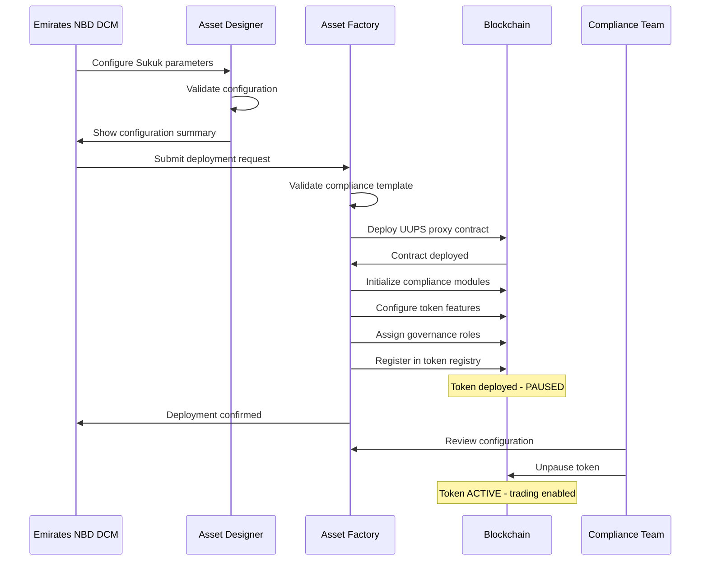

### Identity and Eligibility

Emirates NBD's investor onboarding integrates with the bank's existing KYC/AML infrastructure through DALP's OnchainID-based identity framework. Every investor in the DALP system has an on-chain identity contract (OnchainID) that serves as the verifiable proof of their identity and their current claim status.

The onboarding workflow connects Emirates NBD's KYC operations to DALP's identity layer. When an investor completes Emirates NBD's KYC process (via the bank's existing identity verification tools), the bank's trusted claim issuer publishes the resulting claims to the investor's OnchainID contract. Claims include KYC verification status, AML screening result, investor classification (retail, professional, institutional), jurisdictional eligibility, and any product-specific accreditation status.

Claims are signed by the issuer's private key, recorded on-chain with an expiry date, and cryptographically verifiable by any compliance module. When a compliance module evaluates a transfer, it reads the claims from the investor's OnchainID, verifies the issuer's signature, checks the expiry date, and applies the configured eligibility logic. A single claim verification architecture covers every product on the platform: an investor verified once for Sukuk is automatically eligible for any other product that accepts their claim types.

| Identity Component | Capability | UAE Application |
|---|---|---|
| OnchainID | Verifiable on-chain identity per investor | Single investor identity for all Emirates NBD digital products |
| Claims registry | KYC, AML, Accredited, CONTRACT, JURISDICTION claims | VARA investor classification; SCA accreditation; DIFC qualified investor |
| Trusted issuers | Bank-authorized KYC providers issue claims | Emirates NBD's KYC/AML providers configured as trusted issuers |
| Claim expiry | Time-limited validity with renewal workflow | Annual KYC refresh triggers claim renewal |
| Claim revocation | Immediate effect across all products | Adverse KYC finding revokes access to all products simultaneously |
| Wallet verification | Multi-factor gate for signing operations | PIN, OTP, hardware key for institutional signers |

🟢 Native: OnchainID identity protocol with claim-based verification
🟢 Native: Trusted issuer registry with configurable claim types
🟢 Native: Portable claims across all tokens on the platform
🟢 Native: KYC/KYB profile management with structured review workflows
🟢 Native: Wallet multi-factor verification gate for signing operations

### Compliance Enforcement

Compliance enforcement for Emirates NBD operates at two levels: the per-token compliance module configuration specific to each product, and the system-wide compliance controls that apply across all platform operations.

Every transfer through DALP follows a deterministic compliance path. Before any balance changes occur, the Identity Registry resolves both sender and recipient wallets to their OnchainID contracts. Missing identity causes an immediate revert with a compliance failure reason code. All configured compliance modules then evaluate in sequence, each checking its specific condition. Country restrictions, identity verification claims, investor count limits, holding periods, transfer approval requirements, and any other active modules must all pass. The first failure reverts the entire transaction with the blocking module's reason code.

This fail-closed design reflects the regulatory expectation that non-compliant transfers are impossible, not merely unlikely. For VARA-regulated products, this means that an investor who has not completed the required verification process literally cannot receive a token transfer. For SCA-regulated securities, it means that a transfer that would exceed the maximum investor count is rejected before it executes, not reversed after the fact.

The compliance audit trail records every evaluation decision, whether the transfer succeeded or was blocked, including which module blocked it and why. This creates the evidentiary record that VARA, CBUAE, and internal audit functions require. The audit log is SIEM-compatible and can be forwarded to Emirates NBD's security operations center for integration with the bank's existing compliance monitoring.

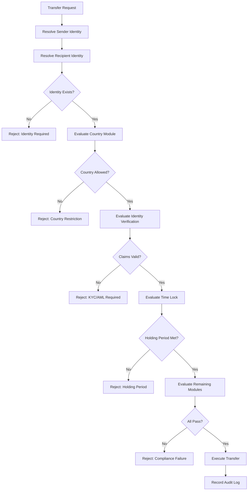

🟢 Native: Sequential compliance module evaluation
🟢 Native: Fail-closed design with specific rejection reason codes
🟢 Native: Immutable on-chain audit trail
🟢 Native: ERC-3643 protocol-level enforcement (not application-layer)
🟢 Native: Forced transfer capability for custodian-authorized exceptions (court orders, estate transfers)

### Transfer, Settlement, and Cash-Leg Coordination

Atomic settlement is the architectural feature that eliminates counterparty risk from tokenized asset transactions. DALP's settlement engine ensures that the asset leg and the cash leg of any transaction either both complete or both revert. There is no state in which one leg settles and the other fails.

DALP implements two settlement models relevant to Emirates NBD's programme:

**Delivery-versus-Payment (DvP).** The classic two-party settlement model where asset tokens transfer from seller to buyer simultaneously with the cash payment from buyer to seller. For Emirates NBD's Sukuk secondary market, DvP settlement eliminates the traditional T+2 settlement risk that creates counterparty exposure during the settlement window. When both legs complete atomically on-chain, settlement finality is achieved at T+0.

**Exchange-versus-Payment (XvP).** The multi-party atomic settlement model where multiple assets and/or currencies exchange simultaneously. For GCC cross-border transactions, XvP enables AED-denominated Sukuk to be sold to a Saudi investor with AED-SAR currency exchange occurring simultaneously in the same atomic transaction. All legs complete or all revert. This eliminates the foreign exchange settlement risk that is otherwise inherent in cross-currency transactions.

For transactions where the cash leg involves AED or USD through Emirates NBD's existing payment infrastructure, DALP's ISO 20022 integration coordinates the SWIFT or RTGS payment instruction with the on-chain token transfer. The settlement workflow manages the timing coordination, holding the token transfer pending confirmation of the cash instruction, and executing the atomic close when both conditions are confirmed.

| Settlement Model | Mechanism | UAE Application |
|---|---|---|
| Local DvP | Same-chain atomic token-for-cash exchange | Sukuk secondary market; bond trading |
| XvP | Multi-party atomic multi-currency exchange | GCC cross-border trades; AED/SAR exchange |
| HTLC cross-chain | Hash Time Lock Contract for cross-chain settlement | Multi-network settlement; future interoperability |
| ISO 20022 + on-chain | Coordinated SWIFT/RTGS + token transfer | AED/USD cash-leg for institutional transactions |

🟢 Native: Atomic DvP settlement on-chain
🟢 Native: XvP multi-party atomic settlement
🟢 Native: HTLC cross-chain settlement
🟢 Native: ISO 20022 SWIFT/RTGS payment rail integration
🟢 Native: Deterministic settlement closure with auditable end-states (executed, cancelled, expired-withdrawn)

### Lifecycle Servicing and Corporate Actions

Automated lifecycle servicing is the operational capability that distinguishes a platform from a one-off issuance tool. For Emirates NBD, lifecycle servicing covers profit distributions for Sukuk, coupon payments for conventional bonds, rental income distributions for real estate tokens, maturity redemptions for term products, and corporate actions for equity tokens.

**Sukuk Profit Distribution.** The Fixed Treasury Yield feature implements pull-based profit distribution. At each configured profit distribution date, the Sukuk issuer funds the treasury with the calculated profit amount for the period. Token holders (or their custodians on their behalf) then claim their proportional share based on their Historical Balance snapshot at the distribution date. The pull-based model avoids the computational cost of iterating over all holders for push-based distributions, making it operationally viable for large investor populations.

Yield Schedule addon provides an alternative distribution model with automated schedule management, one-time or recurring payment structures, and the option to distribute profit in a different token (for example, distributing AED stablecoin profit to Sukuk holders rather than requiring them to hold a separate USD token for yield payments).

**Bond Coupon Payments.** Identical mechanics to Sukuk profit distribution through the Fixed Treasury Yield feature, with the distinction that the yield is characterized as interest rather than profit-sharing. The same snapshot-based distribution logic applies, and the same operational model (treasury funding followed by holder claims) manages the payment process.

**Real Estate Rental Income.** The Yield Schedule addon manages periodic rental income distributions to fractional ownership token holders. The distribution schedule aligns with the rental collection cycle (typically monthly). Snapshot-based balance capture ensures that investors who transfer their tokens between distribution periods receive the proportional income earned during their holding period.

**Maturity Redemption.** The Maturity Redemption token feature implements the complete fixed-income lifecycle endpoint. After the configured maturity date, the token blocks all transfers. Holders redeem their tokens for the denomination asset (AED stablecoin, USDC, or EUROC) at the configured face value. The mechanism is atomic: tokens are burned and the denomination asset transfers from the treasury in a single transaction. Insufficient treasury funding causes the redemption to revert, maintaining the invariant that no partial redemptions occur.

**Corporate Actions for Equity.** The equity template supports dividend distribution through the same Yield Schedule mechanism, voting rights through the Voting Power feature and compatible governance contracts, and controlled mint/burn operations for stock splits and consolidations.

🟢 Native: Fixed Treasury Yield for profit and coupon distribution
🟢 Native: Yield Schedule addon for automated distribution management
🟢 Native: Maturity Redemption with atomic treasury payout
🟢 Native: Snapshot-based pro-rata distribution using Historical Balances
🟡 Partial: Dividend governance integration with external voting systems requires API integration configuration
🟡 Partial: Token conversion (loan-to-equity) operates at smart contract level; API routes and UI in development

### Integration and Interoperability

DALP integrates with Emirates NBD's institutional technology stack through a comprehensive API layer and defined integration connectors for the most common institutional systems.

**Core Banking Integration.** DALP's REST and GraphQL APIs provide real-time access to token position data, investor registry data, transaction history, and compliance event logs. Emirates NBD's core banking system (Temenos T24 or equivalent) can consume these APIs to synchronize digital asset positions with the bank's traditional securities ledger, provide unified position reporting across traditional and tokenized assets, and trigger transaction events in response to on-chain settlement confirmations.

The integration pattern for core banking is event-driven: DALP publishes webhook events for all significant lifecycle events (token issuance, transfer, compliance block, settlement completion, distribution), and the core banking system subscribes to the relevant event types. This allows the core banking system to maintain a real-time, synchronized view of digital asset positions without requiring polling or batch reconciliation.

**ISO 20022 Payment Rail Integration.** For cash-leg settlement involving AED, USD, or SAR payments through Emirates NBD's correspondent banking network, DALP's ISO 20022 integration manages the SWIFT MT (Message Type) or ISO 20022 MX (XML) payment instruction coordination. The settlement workflow holds the token transfer in a pending state while awaiting confirmation of the cash payment instruction, then executes the atomic settlement close when confirmation is received.

**Custody Provider Integration.** DALP integrates with DFNS and Fireblocks through native connectors. The integration model is bring-your-own-custodian: Emirates NBD selects its preferred institutional custody provider, and DALP's Key Guardian integrates with that provider through the configured connector. The custody provider owns signing and broadcast. DALP owns permissioning, maker-checker workflow management, and transaction state tracking.

**KYC/AML Provider Integration.** Emirates NBD's existing KYC/AML providers (whether Refinitiv World-Check, ACAMS, or a bank-internal AML system) connect to DALP's identity framework through the trusted claim issuer model. The KYC provider completes verification and publishes the resulting KYC and AML claims to the investor's OnchainID via a claim issuance API. DALP's compliance modules then consume these claims at each transfer without requiring real-time API calls to the KYC provider during transaction processing.

| Integration Point | Protocol | Direction | Status |
|---|---|---|---|
| Core banking (Temenos/Oracle/Finacle) | REST API + Webhooks | Bidirectional | 🟢 Native via API layer |
| DFNS custody | Native connector | Outbound (signing delegation) | 🟢 Native |
| Fireblocks custody | Native connector | Outbound (signing delegation) | 🟢 Native |
| KYC/AML providers | Claim issuance API | Inbound (claim consumption) | 🟢 Native via OnchainID |
| ISO 20022 / SWIFT | ISO 20022 message standard | Bidirectional | 🟢 Native |
| Market data feeds | REST + webhooks | Inbound | 🟡 Partial: feed configuration required |
| Regulatory reporting systems | REST API + file export | Outbound | 🟡 Partial: report format configuration required |
| SIEM | Log forwarding (syslog/API) | Outbound | 🟢 Native via structured audit logs |
| DLD / property registry (Phase 2) | REST API | Bidirectional | 🟡 Partial: custom integration configuration |

### Functional Fit Matrix

| Functional Requirement | DALP Capability | Source | Status | Notes |
|---|---|---|---|---|
| Sukuk issuance | Fixed Treasury Yield + Maturity Redemption + configurable compliance | DALP asset templates | 🟢 Full | Sharia structure requires legal counsel; platform provides mechanics |
| Conventional bond issuance | Bond template with coupon and maturity features | DALP asset templates | 🟢 Full | |
| Real estate tokenization | Real Estate template; fractional ownership; rental distribution | DALP asset templates | 🟢 Full | DLD registry integration requires Phase 2 API configuration |
| Structured deposits | Deposit template with programmable interest and maturity | DALP asset templates | 🟢 Full | |
| Precious metals | Precious Metals template; provenance metadata; asset-backed | DALP asset templates | 🟢 Full | Physical vault integration requires external connector |
| Multi-jurisdictional compliance | 12 compliance modules; 7 pre-seeded templates; configurable | DALP compliance engine | 🟢 Full | UAE-specific templates configured during Phase 1 |
| Islamic finance (Sharia mechanics) | Fixed Treasury Yield; configurable profit distribution | DALP token features | 🟡 Configurable | Sharia board determines structure; platform implements approved mechanics |
| Investor KYC/AML | OnchainID; claim-based verification; trusted issuers | DALP identity layer | 🟢 Full | Claim issuance via existing KYC provider integration |
| Atomic DvP settlement | DvP/XvP smart contracts; ISO 20022 cash-leg | DALP settlement engine | 🟢 Full | |
| DFNS custody integration | Native connector; maker-checker; delegated signing | DALP Key Guardian | 🟢 Full | |
| Fireblocks custody integration | Native connector; TAP policy integration | DALP Key Guardian | 🟢 Full | |
| Core banking integration | REST/GraphQL API; webhooks | DALP API layer | 🟢 Full | System-specific field mapping configured during Phase 3 |
| UAE data residency | On-premises and private cloud deployment | DALP deployment options | 🟢 Full | |
| Regulatory audit trail | Immutable on-chain event logs; SIEM output | DALP observability | 🟢 Full | |
| Multi-currency (AED, USD, SAR) | Multi-currency token support; ISO 20022 integration | DALP asset templates | 🟢 Full | |
| RBAC / governance | 26 roles; on-chain access control | DALP RBAC | 🟢 Full | |
| HA / DR | Kubernetes HA; PostgreSQL replication; durable execution | DALP infrastructure | 🟢 Full | |

---

## Asset Lifecycle Management

### Lifecycle Architecture Overview

DALP treats every tokenized asset's lifecycle as a continuous sequence of operations from creation to retirement, not as a series of disconnected events requiring separate tools. For Emirates NBD, this lifecycle architecture provides a single operational framework that covers every asset class in scope, with consistent governance, compliance enforcement, and auditability throughout.

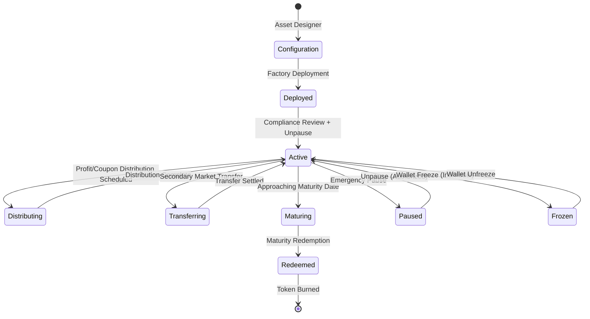

### Issuance Stage: From Configuration to Active Token

The issuance stage covers everything from the initial asset configuration through to the first investor receiving tokens. For Emirates NBD's Sukuk programme, this stage typically takes one to three business days for a configured issuance once the compliance template is approved. The speed advantage over traditional securities issuance (which involves legal documentation preparation, prospectus review, registrar setup, and settlement system configuration) reflects the fact that DALP has pre-embedded all of the operational infrastructure.

**Asset configuration.** The Asset Designer guides operators through token parameter setup. For Sukuk, this includes: total nominal value, denomination currency (AED, USD, or SAR), profit rate or profit distribution mechanism, distribution schedule (quarterly, semi-annual, annual), maturity date, minimum investment denomination, and compliance perimeter (investor eligibility requirements, geographic restrictions, offering cap).

**Factory deployment.** The configured parameters are submitted to the Asset Factory, which executes a multi-step durable deployment workflow. Every step is idempotent: if the deployment process is interrupted (by network failure, infrastructure restart, or any other reason), it resumes from the last successful step without creating partial contracts. The workflow deploys the token contract, initializes all compliance modules, configures token features in the specified order, assigns initial governance roles, and registers the token in the global registry.

**Compliance review window.** Deployed tokens are paused by default. No transfers, mints, or redemptions can execute until an authorized operator explicitly unpauses the asset. This provides Emirates NBD's compliance team with a window to review the deployed configuration, verify that compliance modules are correctly parameterized, and confirm that the token is ready for investor distribution.

**Investor distribution.** Once active, the token can be distributed to investors through three mechanisms: direct minting (for private placements and restricted offerings), token sale contracts (for public or semi-public primary market offerings with subscription mechanics), or airdrop distribution (for broad-based distributions using Merkle tree verification).

### Transfer Stage: Secondary Market Operations

Every secondary market transfer of an Emirates NBD digital asset passes through DALP's compliance pipeline. The platform provides no mechanism for bypassing this pipeline: every transfer is validated, every validation result is logged, and every failed transfer produces an immutable compliance record.

Transfer operations for institutional secondary market transactions typically involve the custodian's signing workflow. The institutional investor's custodian (DFNS or Fireblocks) holds the private key. A transfer instruction from the investor triggers a maker-checker workflow in the custody system, with one or more approvers reviewing and signing the transaction before broadcast. DALP's Key Guardian manages the workflow between the platform's transfer authorization and the custody provider's signing and broadcast operations.

**Forced transfers** are a special case that DALP handles for circumstances where the normal transfer flow cannot be used. Court-ordered asset seizures, estate transfers following investor death, and regulatory enforcement actions may all require transferring tokens from an account without the holder's cooperation or against an otherwise non-compliant transfer path. The Custodian role in DALP can execute forced transfers that bypass the compliance module evaluation but still record the operation on-chain with a reason code. Forced transfers cannot be executed without the specifically authorized Custodian role, and they are fully logged.

### Servicing Stage: Corporate Actions and Distributions

The servicing stage is where most tokenization platforms fail. Issuing a token is relatively straightforward. Paying a coupon to thousands of holders on schedule, handling maturity events atomically, and processing corporate actions without operational failures requires infrastructure that most point-solution issuance tools do not provide.

DALP's servicing architecture covers the full range of corporate actions relevant to Emirates NBD's asset classes.

**Profit and coupon distribution workflow.** At each scheduled distribution date, the process proceeds in four steps: (1) the issuer funds the treasury with the calculated profit amount; (2) a snapshot of token holder balances is captured at the record date; (3) each holder's proportional entitlement is calculated based on their snapshot balance; (4) holders claim their entitlement from the treasury. The pull-based claim model scales to any number of holders without gas limit constraints that would affect push-based distribution to thousands of addresses simultaneously.

**Maturity redemption workflow.** At the configured maturity date, the Maturity Redemption feature changes the token's state: all transfers are blocked; only redemption transactions are permitted. Holders submit redemption transactions that atomically burn their tokens and receive the denomination asset (AED stablecoin or USD stablecoin) from the treasury at the configured face value. Insufficient treasury funding causes the redemption to revert cleanly.

**Wallet freeze and unfreeze.** The Custodian role can freeze individual investor wallets, blocking all transfers in and out while maintaining the frozen balance on record. This is relevant for AML adverse finding responses, where an investor's KYC status has changed and they must be prevented from trading while the investigation proceeds. Partial freezes are also supported, locking a specific amount while allowing the holder to transfer their unfrozen balance.

### Retirement Stage: Burn and Audit

When all tokens of an issued asset have been redeemed (at maturity, through buyback, or through structured redemption), the asset lifecycle is complete. DALP records the final state of the token registry, including total supply burned and final compliance audit log entry, as an immutable on-chain record. Emirates NBD's regulatory reporting team has a complete, unalterable historical record of the asset's entire lifecycle for any subsequent regulatory inquiry.

---

## Supported Asset Classes

### Asset Class Architecture

DALP provides seven purpose-built asset class templates, each with asset-specific lifecycle logic, default feature configurations, and appropriate compliance module defaults. All seven use the same underlying DALPAsset contract, making the architecture consistent while allowing each template to deliver the behavior appropriate to its instrument type.

For Emirates NBD, the asset class architecture maps to the bank's business lines as follows:

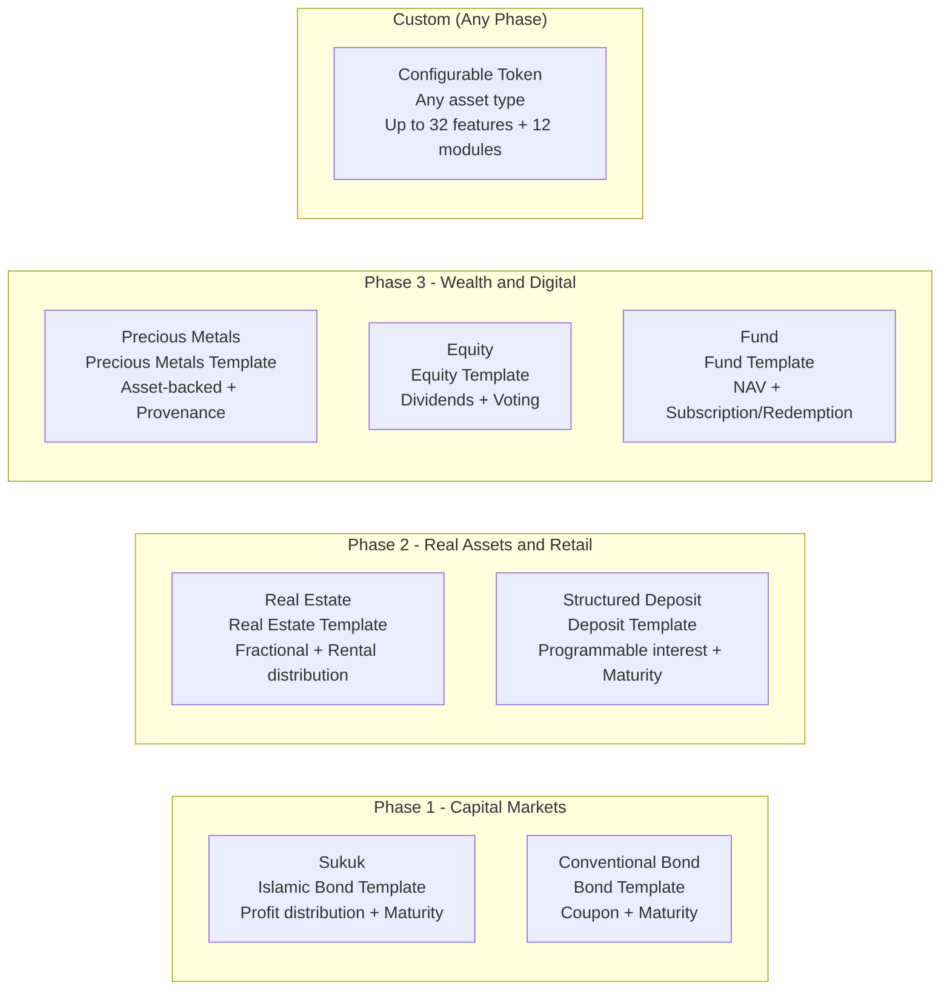

### Sukuk and Islamic Bonds (Phase 1)

Sukuk are the primary Phase 1 asset class for Emirates NBD's digital asset programme. The UAE and GCC markets represent one of the world's most significant Sukuk investor bases, with the Islamic bond market exceeding USD 800 billion globally and the UAE being a leading issuance center.

DALP's approach to Sukuk uses the Bond asset template as the structural foundation, with the Fixed Treasury Yield feature implementing profit-rate distribution consistent with Mudarabah and Musharakah profit-sharing principles. The maturity date is configured in the Maturity Redemption feature. The profit rate and distribution schedule are parameters of the Fixed Treasury Yield feature, configurable at deployment and adjustable for variable-rate Sukuk structures.

For Emirates NBD's Sukuk programme, the typical configuration covers: profit distribution on a quarterly or semi-annual schedule, VARA Professional Investor compliance module configuration for regulatory eligibility, Country Allow List restricted to UAE and approved GCC jurisdictions for primary distribution, Time Lock enforcing the applicable primary market holding period, and Token Supply Limit capping the total issuance within the SCA framework.

Green Sukuk is supported through the same template with additional metadata fields for ESG classification, use-of-proceeds reporting references, and independent green certification references recorded in the on-chain metadata schema.

🟢 Native: Profit distribution via Fixed Treasury Yield
🟢 Native: Maturity redemption with atomic principal return
🟢 Native: VARA investor eligibility compliance modules
🟢 Native: GCC geographic restrictions via Country Allow List
🟡 Partial: Sharia board governance integration requires external workflow connection; platform mechanics implement approved structures

### Conventional Bonds (Phase 1)

Conventional bond tokenization follows the same template structure as Sukuk, with interest coupon mechanics in place of profit distribution. The Fixed Treasury Yield feature implements periodic coupon payments. Maturity Redemption handles principal return at maturity. Call option mechanics (early redemption at the issuer's option) can be implemented through the emergency pause and controlled redemption workflow.

For Emirates NBD's corporate bond issuance platform, conventional bonds serve as the foundation for structured products. Callable bonds, puttable bonds, floating-rate notes, and convertible bonds all use combinations of the base Bond template with the specific features relevant to their economic characteristics. Convertible bonds additionally use the Conversion token feature, enabling bondholders to convert to equity tokens at the configured conversion ratio.

🟢 Native: Fixed coupon via Fixed Treasury Yield
🟢 Native: Maturity redemption
🟢 Native: Convertible bond mechanics via Conversion feature
🟡 Partial: Floating rate note coupon mechanics require external market data feed integration for rate calculation

### Real Estate (Phase 2)

Dubai's real estate market is one of the most active globally, with international investor demand exceeding local supply for premium properties. Tokenization of Dubai real estate creates fractional ownership opportunities that lower the investment minimum from full property value to accessible token denominations, while providing built-in liquidity through secondary market trading.

DALP's Real Estate template supports fractional ownership of commercial and residential properties. The AUM Fee feature collects ongoing property management fees from the token supply. The Fixed Treasury Yield feature distributes rental income on a monthly or quarterly basis to fractional owners based on their token holdings at the rental record date. Rental income is distributed in AED stablecoins or equivalent, keeping the income payment in the currency matching the underlying lease.

For Dubai Land Department (DLD) integration, DALP's on-chain metadata schema records the DLD property identifier, registration number, property classification (residential, commercial, industrial), current independent valuation, and fractional unit parameters. The API layer exposes this metadata for integration with property management systems and investor-facing reporting.

Regulatory compliance for UAE real estate tokens involves VARA (if classified as a virtual asset), SCA (if classified as a securities token), and potentially RERA (Real Estate Regulatory Agency) depending on the specific property type and investor category. DALP's compliance module configuration reflects the applicable regulatory framework per product.

🟢 Native: Fractional ownership representation
🟢 Native: Rental income distribution via Yield Schedule
🟢 Native: AUM fee collection for property management
🟢 Native: Property metadata schema on-chain
🟡 Partial: DLD registry integration requires custom API connector configuration during Phase 2

### Structured Deposits (Phase 2)

Tokenized structured deposits combine the capital protection characteristics of bank deposits with programmable interest mechanics and optional secondary market liquidity. For Emirates NBD's private banking and HNW client base, structured deposits represent an opportunity to offer capital markets-linked returns within a deposit product framework.

DALP's Deposit template supports programmable interest accrual through the Fixed Treasury Yield feature, configurable maturity dates and early redemption conditions through the Maturity Redemption feature, and the Bridge functionality for cross-network deposit transfers where required. Holding period controls enforce the minimum deposit term through the Time Lock compliance module.

For CBUAE regulatory compliance, deposit token products must satisfy the central bank's payment instrument and deposit-taking regulations. The Collateral compliance module can enforce reserve backing requirements, ensuring that the total outstanding deposit tokens are always backed by equivalent reserves.

🟢 Native: Programmable interest mechanics
🟢 Native: Maturity and early redemption handling
🟢 Native: Reserve backing verification via Collateral module
🟢 Native: CBUAE compliance module configuration

### Precious Metals (Phase 3)

Dubai's position as the City of Gold, home to the Dubai Gold Souk and one of the world's most active physical gold trading markets, creates a natural connection between digital asset tokenization and physical precious metals. Emirates NBD's precious metals token programme would allow bank clients to hold digital representations of allocated physical gold, silver, or platinum, with the tokens backed by verified physical holdings in approved UAE vaults.

DALP's Precious Metals template supports asset-backed token issuance with configurable metadata for vault location, refiner certification, assay certificate references, LBMA Good Delivery status, and allocated quantity. The Collateral compliance module verifies that on-chain proof of reserve attestations are maintained before allowing additional minting, ensuring that total token supply is always backed by equivalent physical holdings.

Chain-of-custody documentation (refinery certificates, vault receipts, transport insurance) is stored in DALP's on-chain metadata with hash references to off-chain document storage, creating an auditable provenance chain from refinery to investor.

🟢 Native: Asset-backed token with metadata provenance
🟢 Native: Collateral backing verification
🟢 Native: Chain-of-custody metadata schema
🟡 Partial: Physical vault integration (redemption delivery logistics) requires external workflow connection

### Equity and Funds (Phase 3)

Equity tokenization and tokenized fund units complete Emirates NBD's digital asset product suite for private banking clients. The Equity template supports dividend distribution through the Yield Schedule addon, on-chain voting rights through the Voting Power (ERC-5805) feature, and corporate action handling for stock splits, consolidations, and rights issuances. For UAE private placements under SCA regulations, the Investor Count compliance module enforces the private placement cap on maximum unique holders.

The Fund template supports NAV-linked subscription and redemption, AUM fee collection through the AUM Fee feature, and distribution to unit holders through the Yield Schedule. For UAE-domiciled funds, the applicable ADGM or DIFC fund regulatory framework determines the compliance module configuration, including investor classification requirements and transfer restrictions.

🟢 Native: Dividend distribution via Yield Schedule
🟢 Native: On-chain voting via Voting Power feature
🟢 Native: Private placement investor count controls
🟢 Native: AUM fee collection for fund management
🟡 Partial: NAV feed integration requires external data provider connection

---

## UAE Regulatory Compliance Framework

### Multi-Regulatory Architecture

Emirates NBD operates under one of the world's most structured digital asset regulatory environments. The UAE has developed distinct regulatory frameworks across different authorities, each covering different aspects of digital asset activity. Unlike markets where a single regulator covers all digital asset activity, UAE institutions must navigate a matrix of overlapping and complementary frameworks.

DALP's compliance architecture is specifically designed for this multi-regulatory environment. The configurable compliance module system allows different regulatory frameworks to be modeled as different module configurations, with each token carrying the compliance configuration appropriate to its regulatory perimeter. A single DALP deployment at Emirates NBD can simultaneously host VARA-regulated virtual assets, CBUAE-regulated payment tokens, SCA-regulated securities tokens, and DIFC-regulated financial instruments, each with its own compliance configuration, while sharing the same operational infrastructure.

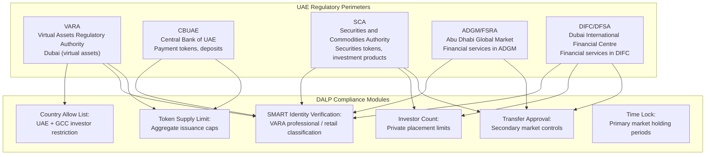

### VARA Framework

The Virtual Assets Regulatory Authority (VARA) is Dubai's dedicated virtual asset regulator, operating under Law No. 4 of 2022 on the Regulation of Virtual Assets and its related bylaws. VARA's regulatory framework covers virtual asset issuance, exchange, transfer, and custody for operators active in Dubai and the UAE.

VARA's investor classification framework recognizes three investor categories: Retail Clients, Qualified Investors (with defined wealth and income thresholds), and Institutional Clients. Each category carries different eligibility requirements and product access restrictions.

DALP models VARA investor classification through the SMART Identity Verification module's claim-based eligibility logic. The investor's VARA-verified classification is published as an on-chain claim by Emirates NBD's KYC/AML provider. Compliance modules configured for VARA products evaluate this claim at every transfer, ensuring that only appropriately classified investors can participate.

For VARA-regulated token offerings, DALP's compliance template would include:

- Country Allow List: UAE (and approved GCC jurisdictions where VARA licensing extends)
- SMART Identity Verification: `[KYC, AML, ACCREDITED, AND, AND]` for Professional Investor products; `[KYC, AML, AND]` for Retail products with aggregate cap
- Token Supply Limit: Enforcing the aggregate issuance cap within VARA's applicable limits
- Transfer Approval: For secondary market transactions above defined value thresholds where VARA requires manual compliance review

🟢 Native: VARA investor classification via claim-based verification
🟢 Native: Aggregate issuance cap enforcement via Token Supply Limit
🟢 Native: Transfer approval gate for high-value transactions
🟡 Partial: VARA reporting format integration requires configuration during implementation

### CBUAE Framework

The Central Bank of the UAE regulates payment tokens, stored value facilities, and deposit products. For Emirates NBD's deposit tokenization programme and any AED-denominated digital payment instruments, CBUAE authorization and compliance requirements apply.

CBUAE's regulatory framework for payment tokens requires reserve backing verification, issuance limits, mandatory KYC for all participants, and regular reserve attestation reporting. DALP addresses these requirements through:

- Collateral compliance module: Verifies on-chain reserve backing assertions before any minting operation
- Token Supply Limit: Enforces aggregate issuance within CBUAE-authorized limits
- SMART Identity Verification: Enforces mandatory KYC for all holders
- Audit trail: Provides the immutable transaction log required for CBUAE reporting

For Emirates NBD's AED digital instrument programme (if structured as a payment token), DALP provides the technical compliance infrastructure. The legal and regulatory authorization to issue payment tokens remains with Emirates NBD as a CBUAE-licensed institution.

🟢 Native: Reserve backing verification via Collateral module
🟢 Native: Issuance limit enforcement via Token Supply Limit
🟢 Native: Mandatory KYC enforcement via identity verification
🟢 Native: Immutable audit trail for regulatory reporting

### SCA Framework

The Securities and Commodities Authority regulates the issuance and trading of securities tokens, including tokenized equity, bonds, and investment products. SCA's token offering regulations provide for both public offerings (requiring full prospectus) and private placements (with investor count and aggregate value limits).

For Emirates NBD's Sukuk and bond tokenization programme, SCA regulations require:

- Investor eligibility verification appropriate to the offering type
- Aggregate offering value limits for exempt offerings
- Maximum investor count for private placements
- Secondary market transfer controls for restricted periods

DALP's compliance configuration for SCA-regulated securities tokens maps directly to these requirements through the SMART Identity Verification, Token Supply Limit, Investor Count, Time Lock, and Transfer Approval modules.

🟢 Native: All SCA-applicable compliance module types
🟡 Partial: SCA prospectus and offering document requirements are legal processes outside platform scope

### Islamic Finance and Sharia Compliance

Emirates NBD is a member of the UAE banking system operating under both conventional and Islamic banking licenses. Its Islamic banking arm requires that digital asset products offered to Muslim clients are Sharia-compliant in both structure and operation.

Sharia compliance determination is the responsibility of the bank's Sharia Supervisory Board. The board reviews proposed transaction structures, evaluates their compliance with relevant fiqh principles, and issues a Sharia compliance certificate for approved structures. DALP does not determine Sharia compliance; it implements the mechanics that the Sharia board approves.

For Sukuk Al-Murabaha (cost-plus-profit structure):

- The asset underlying the Murabaha is referenced in the token metadata
- Profit distribution uses Fixed Treasury Yield configured with the approved profit rate
- The token does not accrue interest; it distributes profit from the underlying asset's Murabaha return
- The maturity date and redemption mechanics reflect the Murabaha facility term

For Sukuk Al-Ijara (lease-based structure):

- Rental income from the leased asset is distributed to Sukuk holders through the Yield Schedule addon
- The distribution schedule aligns with the lease rental payment schedule
- Token holders receive rental income proportional to their sukuk holdings
- At maturity, the leased asset is sold and proceeds are distributed proportionally

For other Islamic finance structures (Musharakah, Mudharabah, Wakala):

- Each structure has specific profit-sharing mechanics that can be implemented through the Fixed Treasury Yield feature with appropriate treasury funding and distribution rules
- The metadata schema records the relevant structure documentation references
- Sharia compliance certificates are referenced in the on-chain metadata with hashes to off-chain documentation

🟢 Native: Configurable profit distribution mechanics for approved Islamic structures
🟢 Native: Metadata schema for Sharia documentation references
🟡 Partial: Sharia board governance workflow (board approval of specific token configurations) requires external governance integration

### ADGM and DIFC Frameworks

The Abu Dhabi Global Market and the Dubai International Financial Centre operate their own financial services regulatory frameworks under the respective Financial Services Regulatory Authority (FSRA) and Dubai Financial Services Authority (DFSA). Products structured within these financial free zones operate under ADGM or DIFC law rather than mainland UAE law.

DALP supports ADGM and DIFC products through configurable compliance modules that reflect the specific investor classification requirements of each free zone framework. ADGM's Digital Securities Regulation and DIFC's Investment Token Regulations each define eligible investor categories (Qualified Investors, Retail Clients, Professional Clients) that DALP models through the SMART Identity Verification claim-based eligibility system.

🟢 Native: Configurable investor classification for ADGM/DIFC frameworks
🟡 Partial: Specific FSRA/DFSA compliance templates require configuration during Phase 1 implementation

### Sharia-Compliant Stablecoin Considerations

Emirates NBD may also consider an AED-backed digital payment instrument for internal use in digital asset settlement (paying profit distributions, funding maturity redemptions, settling secondary market transactions). A CBUAE-authorized AED payment token would serve as the cash leg for on-chain DvP settlement, eliminating the need to coordinate with SWIFT for every intra-bank settlement.

Such an instrument would be structured as a Deposit token in DALP with Collateral backing verification ensuring 1:1 reserve backing, supply limits matching authorized issuance, and mandatory KYC for all holders. The instrument is not a public stablecoin; it is an internal settlement instrument that simplifies the cash-leg coordination for the bank's digital asset operations.

🟢 Native: Deposit template with Collateral backing verification
🟢 Native: Reserve attestation support
🟡 Partial: CBUAE payment token authorization is a regulatory process outside platform scope

---

## Technical Architecture

### Architectural Principles

DALP's technical architecture rests on five principles that guide every design decision.

**Lifecycle-first.** The architecture treats the full asset lifecycle, from creation through retirement, as the fundamental unit of design. This is not a content delivery system where requests are stateless and isolated. It is a lifecycle management system where every operation is part of a sequence, where state must be consistent across on-chain and off-chain data stores, and where failures at any point in a workflow must be recoverable without data loss or inconsistency.

**Durable execution.** Multi-step business operations are too complex to implement as simple API calls. When a Sukuk is deployed, a dozen distinct steps must execute in order. When a coupon distribution runs, a sequence of calculations, treasury operations, and on-chain transactions must coordinate. Any of these steps can fail, and the failure must be recoverable without orphaned contracts, duplicate transactions, or inconsistent state. DALP uses a durable workflow execution engine that provides step-level durability: each step completes or is marked as failed, and workflows resume from the last successful step after any failure.

**Defense-in-depth.** Security is enforced at every layer independently. An authentication layer failure does not expose the authorization layer. An authorization layer failure does not expose the smart contract layer. Each layer can be audited independently. Each layer can fail independently without cascading failures across other layers.

**Separation of concerns.** The issuance logic, compliance logic, custody logic, settlement logic, and servicing logic are all encapsulated in distinct platform components with defined interfaces. Changing the custody provider does not require changes to the compliance module. Adding a new compliance module does not require changes to the issuance workflow. This separation makes the platform maintainable and extensible without creating fragile cross-cutting dependencies.

**Provider abstraction.** The platform abstracts over blockchain networks, custody providers, cloud providers, and identity providers through defined interface contracts. Emirates NBD can change its preferred blockchain network, switch custody providers, or migrate cloud regions without modifying the platform's business logic. The provider relationship is a configuration, not a hard dependency.

### Layered Architecture

DALP's architecture organizes into four layers, each with defined responsibilities and interfaces.

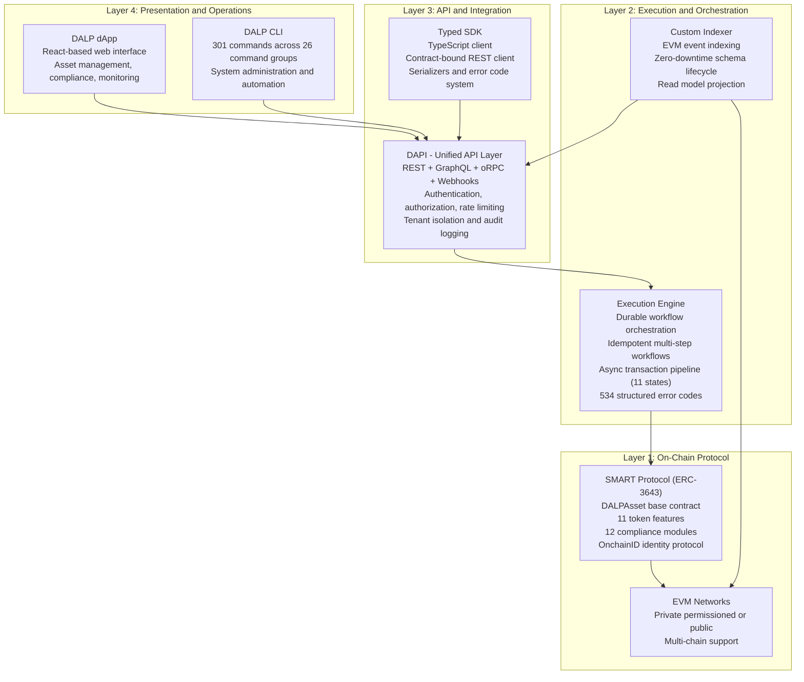

**On-Chain Layer.** The SMART Protocol (ERC-3643) implementation provides the foundation. All tokens implement the DALPAsset base contract, which includes the ERC-20 token interface, the ERC-3643 regulated token interface with compliance enforcement, and the SMART Protocol's configurable feature and compliance module system. The AccessManager contract enforces on-chain role-based access control. The Identity Registry manages OnchainID-linked investor profiles. The Compliance contract evaluates all transfer requests against the configured module set.

**Execution and Orchestration Layer.** The DAPI middleware is the control plane for all API-originating operations. It converts authenticated API traffic into tenant-scoped, permission-aware, execution-ready operations. The durable workflow engine provides step-level execution guarantees for multi-step business processes: workflows are persisted at each step checkpoint, and process restarts cause resume from the last checkpoint rather than full restart. The custom indexer captures on-chain events and maintains a queryable read model that enables efficient reporting and real-time state queries without requiring EVM archive node access for every query.

**API and Integration Layer.** DAPI exposes a comprehensive API surface: REST endpoints for standard CRUD operations and lifecycle management, GraphQL for flexible query patterns, oRPC for strongly-typed internal protocol communication, and event webhooks for real-time push notification to integrated systems. The SDK provides TypeScript client libraries with full type safety, contract-bound REST clients, and structured error handling using the 534-code DALP error taxonomy.

**Presentation and Operations Layer.** The DALP dApp is the web-based operational interface for Emirates NBD's token operations team. It provides the Asset Designer for token configuration, the compliance management interface, the investor registry management, the operational dashboard for monitoring, and the settlement management interface. The CLI provides 301 commands for automation, scripting, and system administration operations that are more naturally expressed as command-line workflows.

### Data Architecture

DALP manages three categories of state across on-chain and off-chain data stores.

**On-chain state.** Token balances, compliance module configurations, investor identity registry entries, on-chain claims, governance role assignments, and settlement contract states are all authoritative on-chain. On-chain state is the source of truth for all ownership and compliance questions. It is immutable once confirmed and cryptographically verifiable.

**Application state.** DALP's relational database stores operational state that does not need to be on-chain: user accounts and RBAC, organizational configuration, workflow execution state, API key management, and platform-level operational data. Application state is mutable and managed by DAPI.

**Indexed read model.** The custom indexer captures all relevant EVM events and maintains a queryable read model for efficient historical queries, portfolio position reporting, compliance event history, and investor balance snapshots. The indexed read model uses a zero-downtime schema lifecycle with rotating deployment schemas, ensuring that indexer upgrades do not interrupt operational queries.

| Data Category | Storage Location | Characteristics | Emirates NBD Use |
|---|---|---|---|
| Token balances and ownership | On-chain (EVM state) | Immutable; authoritative | Ownership registry; secondary market; compliance |
| Compliance module configurations | On-chain (EVM state) | Governance-controlled; auditable | VARA/SCA/CBUAE rule enforcement |
| Identity claims and OnchainID | On-chain (EVM state) | Claim-signed; expiring; revocable | KYC status; investor classification; eligibility |
| Workflow execution state | Relational database (UAE-resident) | Mutable; checkpoint-based | Issuance workflow tracking; distribution state |
| User accounts and RBAC | Relational database (UAE-resident) | Mutable; audit-logged | Operator access management |
| Event audit log | Indexed read model + database | Append-only; structured | VARA reporting; CBUAE audit trail; SIEM |
| Asset metadata | On-chain + object storage | Hash-referenced; versioned | Sukuk terms; property details; provenance |

### Network and Chain Topology

DALP supports any EVM-compatible blockchain network, public or private. The choice of network for Emirates NBD's programme depends on the bank's regulatory requirements, privacy expectations, and operational preferences.

**Private permissioned network.** A private EVM-compatible network (Hyperledger Besu or equivalent) operated by Emirates NBD within its UAE data center infrastructure provides maximum control over validator nodes, gas pricing, block parameters, and network participation. This model is appropriate for the bank's internal settlement operations and for products where transaction visibility should be restricted to authorized participants. Network operators are known and permissioned. Transaction throughput and latency are configurable to the bank's operational requirements without being subject to public network congestion.

**Public EVM network.** Public networks (Ethereum mainnet, Polygon) provide access to a broader DeFi ecosystem, existing liquidity providers, and international investor infrastructure. For products where broad market access and interoperability with other tokenization platforms are priorities, public network deployment connects Emirates NBD's digital assets to the wider tokenized asset market. Compliance enforcement through DALP's smart contracts applies identically on public networks.

**Multi-chain deployment.** DALP can operate across multiple networks simultaneously from a single platform instance. Emirates NBD might operate private-network Sukuk for institutional GCC investors and public-network products for international retail access, both managed through the same DALP operational interface with the same compliance and governance framework. HTLC cross-chain settlement enables atomic exchanges across the two network environments.

For Emirates NBD's initial programme, a private permissioned network operating within UAE data center infrastructure is the recommended starting point. It satisfies CBUAE data sovereignty requirements, provides performance predictability, and avoids any dependency on public network gas pricing or congestion dynamics. The architecture is designed to add public network participation in later phases without requiring a platform migration.

🟢 Native: Private permissioned EVM network support (Hyperledger Besu)
🟢 Native: Public EVM network support (Ethereum, Polygon)
🟢 Native: Multi-chain simultaneous deployment
🟢 Native: HTLC cross-chain settlement

### Multi-Tenancy and Environment Segregation

DALP's multi-tenancy model supports multiple organizational boundaries within a single platform deployment. For Emirates NBD, this enables:

- Separation between Emirates NBD's different business lines (Islamic banking, capital markets, wealth management, corporate banking), each with their own role assignments and operational boundaries
- Separation between Emirates NBD and any third-party issuers using the bank's platform
- Environment separation between development, staging, and production with the same platform deployment covering all three

Tenant isolation is enforced at the database query level on every API request. Every DAPI request is scoped to the authenticated user's organizational context. Cross-tenant operations are not possible through the standard API. System-level operations that span tenants require the systemManager role and are fully logged.

Environment separation provides a controlled path from development through testing to production. Configuration changes (new compliance module parameters, updated fee schedules, new investor eligibility rules) are promoted through environments with formal gate approval at each stage, ensuring that only reviewed configurations reach production.

### Operational Architecture

DALP's operational architecture handles the reliability, durability, and performance characteristics that institutional financial operations require.

**Async transaction pipeline.** All blockchain write operations pass through an 11-state async transaction pipeline. States include: pending, submitted, confirming, confirmed, failed, retrying, dead-lettered, cancelled, and their associated sub-states. The pipeline provides idempotent submission (duplicate transactions are detected and deduplicated), optimistic-lock state transitions (concurrent modifications are rejected cleanly), dead-letter rescue for transactions that cannot be automatically resolved, and a public status polling endpoint for integration systems that need to monitor transaction outcomes.

**Durable workflow engine.** Multi-step business operations are implemented as durable workflows that persist their execution state at each step. If the DAPI process restarts, active workflows resume from their last checkpoint without requiring restart from the beginning. For a Sukuk deployment workflow with twelve steps, a failure at step seven resumes at step seven, not step one. This property makes the platform resilient to infrastructure failures, maintenance windows, and deployment upgrades.

**Idempotency guarantees.** API operations that are idempotent by nature (queries, status checks) are always safe to retry. State-changing operations include an idempotency key mechanism that ensures that duplicate API calls (from network retries, client-side retry logic, or integration errors) produce the same result as a single call and do not create duplicate blockchain transactions.

---

## Security Architecture

### Security Model Overview

DALP enforces security at four independent layers: access control, compliance module logic, on-chain smart contract constraints, and deployment-level isolation. An authentication layer failure does not bypass authorization. An authorization layer failure does not bypass on-chain role enforcement. On-chain role enforcement cannot be bypassed by any application-layer action. Each layer is auditable independently and fails independently without cascading failures across other layers.

SettleMint holds ISO 27001 and SOC 2 Type II certifications. These certifications confirm that security controls are not just designed but independently audited and continuously maintained. The certifications cover the development, deployment, and operational management of DALP across all deployment environments.

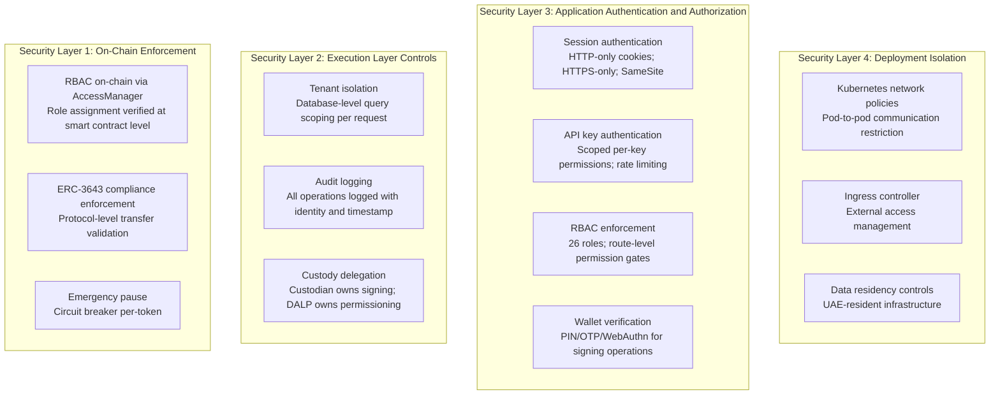

### Authentication and Access Control

DALP supports multiple authentication methods appropriate to different operational contexts. For Emirates NBD's institutional deployment, the primary authentication methods are passkeys (WebAuthn) for phishing-resistant access and SAML 2.0 / OIDC integration with the bank's existing identity provider (Active Directory, Okta, Azure AD, or equivalent).

**Session authentication** governs browser-based access to the DALP dApp. Sessions use HTTP-only cookies with the Secure flag, SameSite protection against cross-site request forgery, and a 7-day session lifetime with a 24-hour refresh window. Every session is bound to the authenticated user's identity and organizational context.

**API key authentication** governs machine-to-machine integrations, including Emirates NBD's core banking system integration, custody provider connections, and automation scripts. API keys carry scoped permissions limiting access to specific API namespaces. Keys are hashed in storage and displayed only once at creation. The rate limit of 10,000 requests per 60-second window per key prevents abuse and denial-of-service attacks.

**Wallet verification** is the step-up authentication gate that applies to all blockchain write operations. Even a user with a valid authenticated session cannot execute an on-chain transaction without completing wallet verification: entering a 6-digit PIN, submitting a TOTP code from an authenticator app, or using a WebAuthn hardware security key or biometric authenticator. This gate prevents session hijacking from resulting in unauthorized on-chain transactions.

DALP's RBAC model covers 26 distinct roles across four layers. Platform roles (owner, admin, member) govern organizational management. System people roles (systemManager, identityManager, tokenManager, complianceManager, and others) govern specific operational domains. Per-asset roles (admin, governance, supplyManagement, custodian, emergency, saleAdmin, fundsManager) govern individual asset operations. System module roles govern contract-level system operations.

For Emirates NBD, this role taxonomy enables clear separation of duties: the issuance team holds supplyManagement on specific assets, the compliance team holds complianceManager, the treasury operations team holds fundsManager, and the security operations team holds emergency for circuit-breaker operations. No single individual can unilaterally perform every sensitive operation on the same asset.

| Authentication Method | Use Case | UAE Relevance |
|---|---|---|
| Passkeys (WebAuthn) | Operator and user access with biometric verification | Phishing-resistant access for bank staff operating digital assets |
| SAML 2.0 / OIDC | Enterprise SSO integration with Emirates NBD identity provider | Single sign-on via existing corporate identity infrastructure |
| LDAP / Active Directory | Corporate directory integration | Emirates NBD Active Directory integration |
| API keys (scoped) | Core banking and automated system integrations | Temenos / Oracle FLEXCUBE integration; automated servicing |
| Wallet verification (WebAuthn / PIN / OTP) | Signing gate for on-chain transactions | Prevents session hijacking from executing on-chain actions |

🟢 Native: All authentication methods (email/password, passkey, SAML, OIDC, LDAP, API keys)
🟢 Native: 26-role RBAC with on-chain enforcement
🟢 Native: Wallet step-up verification for signing operations
🟢 Native: Route-level permission enforcement in DAPI

### Key Management and Custody Integration

Emirates NBD's key management requirements reflect the bank's position as a regulated financial institution subject to CBUAE and VARA key custody requirements. DALP's Key Guardian architecture supports the full range of key management models, from development-grade encrypted database storage through production HSM and institutional MPC custody.

For Emirates NBD's production environment, the recommended key management model uses a tiered approach:

**Tier 1: HSM for treasury and governance operations.** High-value signing operations, including Sukuk issuance, maturity redemption authorization, and governance role assignment, use HSM-backed keys that meet FIPS 140-2 Level 3 requirements. The key material never leaves the hardware boundary. HSM integration is supported through the Key Guardian's hardware security module backend.

**Tier 2: Institutional MPC custody for operational transactions.** Secondary market transfer approvals, distribution authorizations, and other operational transactions use DFNS or Fireblocks MPC custody. The custody provider owns nonce allocation, gas handling, signing, and broadcast. DALP owns permissioning, workflow management, and transaction state tracking. This separation ensures that DALP's operational logic is decoupled from the volatile execution mechanics.

**Tier 3: Cloud secret manager for automated operations.** Fully automated operations (scheduled distribution calculations, monitoring agents, automated reporting) that do not require human approval use cloud secret manager-backed keys. These keys have restricted permissions scoped to the specific automated operation and are rotated on a defined schedule.

Maker-checker approval workflows apply to all Tier 1 and Tier 2 operations. A transaction submitted by one authorized operator must be reviewed and approved by a second authorized operator before it executes. This four-eyes principle prevents unilateral high-value operations and satisfies the dual-control requirements typical of regulated financial institution key management policies.

| Key Management Tier | Protection Level | DALP Backend | Use Case for Emirates NBD |
|---|---|---|---|
| HSM | FIPS 140-2 Level 3 | Hardware Security Module | Treasury operations; governance; issuance authorization |
| Institutional MPC | Distributed key shards; no single point of compromise | DFNS or Fireblocks | Secondary market transfers; distribution authorization; operational transactions |
| Cloud secret manager | Platform-managed encryption | Cloud-native secret management | Automated operations; monitoring agents; reporting |
| Encrypted database | Application-level encryption | DALP database backend | Development and staging environments only |

🟢 Native: HSM integration via Key Guardian
🟢 Native: DFNS MPC integration with policy enforcement
🟢 Native: Fireblocks MPC-CMP integration with TAP policy
🟢 Native: Maker-checker approval workflows with configurable quorum
🟢 Native: Emergency pause and formal key recovery procedures

### Data Protection and Encryption

**Encryption at rest.** Database-managed key material is encrypted at the application level before storage. Cloud secret manager backends provide platform-managed encryption for production deployments. HSM-backed keys never leave the hardware boundary. Object storage (for asset documentation, terms sheets, offering circulars) uses provider-native encryption at rest across all seven supported storage backends (AWS S3, Azure Blob, GCP Cloud Storage, S3-compatible, MinIO, RustFS, local filesystem).

**Encryption in transit.** All communication between clients and the DALP platform uses TLS. The platform enforces HTTPS for all API endpoints, console access, and inter-service communication. API keys are transmitted only once (at creation) and stored as hashed values. Session cookies carry the Secure flag, transmitting only over encrypted connections.

**Field-level data handling.** Sensitive fields (private key material, API key cleartext, recovery codes) are encrypted at the field level before database storage and are never written to log files or error messages. The 534-code structured error taxonomy ensures that error messages convey operational information without exposing sensitive data or internal implementation details.

**Data residency.** For Emirates NBD's UAE-resident deployment, all data categories remain within UAE borders. The platform deployment, database, object storage, and blockchain node infrastructure all operate on UAE-resident infrastructure. No data flows to SettleMint's EU operations for the production instance. Key management operations that involve DFNS or Fireblocks utilize those providers' UAE-region infrastructure where available.

🟢 Native: TLS for all API and service communication
🟢 Native: Field-level encryption for sensitive data
🟢 Native: Multi-backend object storage with native encryption-at-rest
🟢 Native: UAE data residency via on-premises or UAE-region private cloud deployment

### Compliance Controls and Auditability

DALP's audit trail is the evidentiary foundation for Emirates NBD's regulatory compliance reporting. Every operation in the system produces structured audit log entries that are captured, indexed, and available for regulatory reporting, internal audit, and SIEM integration.

**On-chain audit trail.** Every transfer, compliance evaluation, role assignment, and configuration change that touches the blockchain produces an immutable on-chain event. These events are indexed by DALP's custom indexer and available through the API. The on-chain audit trail cannot be modified, deleted, or selectively excluded by any platform operation.

**Off-chain structured audit log.** DAPI logs every API request with authentication identity, authorization role, operation type, target resource, timestamp, and result. Failed authentication attempts, authorization rejections, and compliance-blocked transfers are all logged with reason codes. The structured log format supports direct forwarding to Emirates NBD's SIEM platform (Splunk, IBM QRadar, Microsoft Sentinel, or equivalent).

**Compliance event log.** Every compliance module evaluation generates a structured compliance event log entry that records the module that was evaluated, the evaluation inputs (sender/recipient identity, claim values evaluated), the evaluation result (approved or rejected), and the rejection reason code if blocked. This log provides the documented evidence that compliance controls were applied correctly to each transaction.

**Reporting cadence.** For VARA regulatory reporting, the compliance event log, combined with the on-chain transfer history, provides the complete transaction record required for periodic reporting. For CBUAE reserve attestation for payment token products, the on-chain supply data and treasury balances provide the verifiable reserve data. For internal audit, the full audit trail covers user actions, configuration changes, and operational events across the platform lifetime.

🟢 Native: Immutable on-chain audit trail via blockchain events
🟢 Native: Structured off-chain audit log with SIEM-compatible output
🟢 Native: Per-compliance-evaluation event log with rejection reason codes
🟢 Native: Full operation audit including configuration changes and role assignments

### Testing and Assurance

SettleMint conducts regular security testing of DALP across all deployment environments. For Emirates NBD's implementation, the security testing programme covers:

**Penetration testing.** External penetration testing of the DALP API surface, authentication mechanisms, and network boundary is conducted on a regular schedule. Test reports are provided to Emirates NBD as part of the vendor risk assessment documentation package. Remediation timelines for identified findings follow a severity-based classification with critical findings addressed within defined timeframes.

**Smart contract security review.** The SMART Protocol smart contracts underlying DALP have been subject to security review. The review scope covers the DALPAsset base contract, all 11 token features, all 12 compliance modules, the AccessManager RBAC system, and the settlement contracts.

**Dependency vulnerability management.** DALP's software supply chain is monitored for known vulnerabilities in third-party dependencies. Critical security patches are applied on accelerated timelines outside the standard release schedule.

**Emirates NBD security review facilitation.** SettleMint facilitates Emirates NBD's vendor security review process, including providing security questionnaire responses, penetration test summaries, architecture documentation, and access to SettleMint's ISO 27001 and SOC 2 Type II audit reports. A dedicated security liaison is assigned for the duration of the security review process.

| Security Assurance Area | Approach | Evidence Available |
|---|---|---|
| Platform penetration testing | External testing; regular cadence | Test summary report; remediation log |
| Smart contract security | Code review; formal analysis | Review summary |
| ISO 27001 | Annual certification audit | Certification certificate; audit report |
| SOC 2 Type II | Annual audit of security controls | SOC 2 report available under NDA |
| Dependency vulnerability | Continuous monitoring; patching | CVE log; patch history |
| Emirates NBD vendor review | Full facilitation; documentation package | Security questionnaire; architecture docs |

### Security Responsibility Matrix

| Control Area | SettleMint Responsibility | Emirates NBD Responsibility | Shared Notes |
|---|---|---|---|
| DALP platform application security | Security patching; CVE monitoring; penetration testing | Applying updates; access management configuration | Update coordination per change management process |
| Smart contract security | Contract auditing; SMART Protocol security | Configuration review before deployment | Compliance team validates module configuration |
| Network security | TLS configuration; API security | Network perimeter (firewall, WAF, DDoS protection) for on-premises deployment | VPN and network policy between DALP and connected systems |
| Key management | Key Guardian architecture; custody connector security | Custody provider selection; maker-checker policy configuration; hardware key management | Key rotation policy agreed jointly |
| Identity and access | RBAC architecture; session security | Role assignment; user lifecycle management; SSO integration | Role assignment follows principle of least privilege |
| Data residency | Platform architecture supports UAE residency | UAE-resident infrastructure provisioning; data flow governance | Confirmed during Phase 1 architecture design |
| Monitoring and incident response | SIEM-compatible log output; alert templates | SIEM platform; security operations center; incident response procedures | Log forwarding configuration during Phase 2 |

---

## Custody and Key Management

### Custody Architecture Philosophy

DALP does not act as a custodian. The platform provides the custody integration layer, the key management workflow engine, and the operational governance controls that enable Emirates NBD to integrate its preferred institutional custody provider into the digital asset workflow. Emirates NBD retains the custodian relationship; DALP orchestrates the workflow.

This distinction matters for regulatory purposes. CBUAE and VARA both have specific requirements for the custody of digital assets held for clients. By integrating with a regulated institutional custodian through DALP's bring-your-own-custodian model, Emirates NBD satisfies its custody regulatory requirements through its relationship with the custodian, not through a unilateral platform capability.

### Key Guardian Architecture

The Key Guardian service is DALP's key management abstraction layer. It provides a unified interface for all signing operations, regardless of which custody backend stores the private key material. The same workflow, the same maker-checker approval process, and the same audit trail apply across all backend tiers.

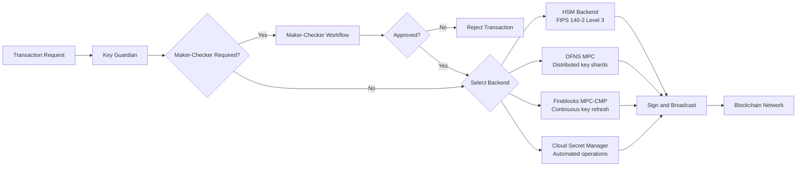

**DFNS Integration.** DFNS provides threshold MPC with distributed key shards. No single key shard can produce a valid signature, and no single infrastructure component holds enough shards to reconstruct the key. DFNS's policy engine enforces transaction limits, destination address whitelisting, velocity limits, and multi-party approval requirements before signing. Pending approvals surface through the DALP interface for operator resolution, with full context about the transaction being requested.

**Fireblocks Integration.** Fireblocks provides MPC-CMP with continuous key refresh, eliminating static key shares and reducing the window during which a compromised shard could be exploited. The Transaction Authorization Policy (TAP) enforces amount thresholds, whitelisted destinations, velocity limits, and multi-approver requirements. DALP's Fireblocks connector surfaces pending TAP approvals through the DALP operational interface, ensuring that operators have full context about each approval request.

**Provider-Delegated Broadcast.** For DFNS and Fireblocks, DALP uses a provider-delegated broadcast model. The custody provider owns nonce allocation, gas pricing, transaction signing, and network broadcast. DALP owns the admission control: determining whether a transaction request is authorized, compliant, and correctly formatted before passing it to the custody provider. This separation ensures that DALP's compliance and governance logic is decoupled from the volatile execution mechanics of blockchain transaction submission.

### Maker-Checker Workflow

Every high-value or sensitive operation in DALP can be configured to require multi-party approval before execution. The maker-checker workflow operates as follows:

1. A maker (authorized initiator) creates a transaction request with full operational details.
2. The request enters a pending approval state, visible to all configured checkers.
3. One or more checkers review the request details and approve or reject.
4. Once the required approval quorum is met, the transaction proceeds to the signing backend.
5. If the request is rejected or times out, it is cancelled and the maker is notified.

The quorum requirement (one of N, two of N, all of N) is configurable per operation type. High-value Sukuk issuance might require 2-of-3 approval, while routine profit distribution confirmations might require 1-of-2. Emergency pause operations (circuit breakers) might require a single authorized operator to enable rapid response to security incidents.

🟢 Native: DFNS connector with policy engine integration
🟢 Native: Fireblocks connector with TAP policy integration
🟢 Native: Configurable maker-checker quorum per operation type
🟢 Native: HSM backend for FIPS 140-2 Level 3 key protection
🟢 Native: Provider-delegated broadcast (custody owns signing; DALP owns admission control)

---

## Integration Capabilities

### Integration Architecture

DALP is designed as an integration hub, not an island. The platform provides a comprehensive API surface and defined connectors for the most common institutional systems, enabling Emirates NBD to connect its existing infrastructure to the digital asset layer without rebuilding or replacing existing systems.

```mermaid
graph LR
    subgraph "Emirates NBD Enterprise"
        CBS["Core Banking System<br/>Temenos T24 / Oracle FLEXCUBE"]
        KYC_P["KYC/AML Platform<br/>Refinitiv / internal AML system"]
        CUST_P["Custody Provider<br/>DFNS / Fireblocks"]
        SWIFT["Payment Rails<br/>SWIFT / RTGS"]
        SIEM["SIEM Platform<br/>Splunk / QRadar"]
        MDI["Market Data<br/>Bloomberg / Reuters"]
        REPO["Regulatory Reporting<br/>CBUAE / VARA submissions"]
    end

    subgraph "DALP Integration Layer"
        REST["REST API<br/>Core CRUD and lifecycle"]
        GQL["GraphQL API<br/>Flexible queries and reporting"]
        HOOK["Event Webhooks<br/>Real-time push notifications"]
        SDK_INT["TypeScript SDK<br/>Type-safe integration client"]
        ISO["ISO 20022<br/>SWIFT / RTGS connectivity"]
    end

    CBS <--> REST & GQL & HOOK
    KYC_P --> REST
    CUST_P <--> REST
    SWIFT <--> ISO
    SIEM <-- HOOK
    MDI --> GQL
    REPO <-- REST & GQL
```

### Core Banking System Integration

Emirates NBD's core banking system (Temenos T24, Oracle FLEXCUBE, or Infosys Finacle) is the system of record for the bank's financial positions, customer accounts, and transaction history. DALP integrates with the core banking system through an event-driven architecture:

**Real-time event publishing.** DALP publishes webhook events for all significant lifecycle events: token issuance confirmed, transfer completed, compliance check blocked, distribution executed, maturity redeemed, investor onboarded, investor status changed. The core banking system subscribes to relevant event types and updates its internal position ledger accordingly.

**Position synchronization API.** The core banking system queries DALP's REST and GraphQL APIs to retrieve current token balances, investor registry data, compliance status, and distribution history. These queries provide the data for unified position reporting that spans traditional securities and tokenized assets in a single view.

**Transaction reconciliation.** For transactions that span both DALP's on-chain records and the core banking system's ledger (such as AED payment instructions for Sukuk subscriptions), DALP's event log provides the on-chain confirmation data that the core banking system uses to confirm and close pending transactions.

The specific field mappings between DALP's data model and the core banking system's data model are defined during Phase 3 Integration work, when SettleMint's integration engineers work directly with Emirates NBD's core banking team to map DALP event payloads to the system's required input formats.

🟢 Native: REST and GraphQL API for position data access
🟢 Native: Webhook event publishing for real-time integration
🟢 Native: Comprehensive API coverage for all platform operations
🟡 Partial: Core banking field mapping requires Phase 3 configuration and testing

### KYC/AML Integration

Emirates NBD's KYC/AML workflow produces identity verification results that DALP consumes as on-chain claims through the trusted claim issuer model.

**Claim issuance integration.** When Emirates NBD's KYC platform completes verification for a new investor, it calls DALP's claim issuance API with the investor's wallet address, claim type (KYC, AML, ACCREDITED, CONTRACT, JURISDICTION), claim data, and expiry date. DALP's trusted claim issuer (an authorized on-chain identity that the bank's KYC platform controls) signs and publishes the claim to the investor's OnchainID contract.

**Ongoing monitoring integration.** When an investor's AML status changes (adverse finding, screening match, PEP identification), the KYC platform calls the claim revocation API. DALP immediately revokes the relevant claim on-chain, blocking the investor from all future transfers on any product for which the revoked claim is required. This propagation is automatic and requires no manual action per product.

**Bulk onboarding.** For migrating an existing investor population from traditional securities accounts to DALP's digital registry, the platform's bulk onboarding API accepts batch claim issuance requests, enabling large populations of pre-verified investors to be onboarded efficiently without per-investor manual processing.

🟢 Native: Trusted claim issuer registry; claim issuance API; claim revocation API
🟢 Native: Bulk investor onboarding via batch API
🟢 Native: Portable claims (one verification; all products)

### ISO 20022 and Payment Rail Integration

For AED, USD, and SAR cash-leg settlement, DALP integrates with Emirates NBD's existing SWIFT and RTGS infrastructure through ISO 20022 message format support.

The cash-leg integration enables two settlement models:

**Instructed settlement.** DALP constructs the ISO 20022 payment message (MX format: pacs.008 for credit transfers, pacs.009 for financial institution transfers) with the settlement details from the DvP transaction and publishes it to Emirates NBD's SWIFT messaging layer for execution. The settlement workflow holds the token transfer pending confirmation of the payment instruction and executes the atomic settlement close when the SWIFT confirmation message (pacs.002 status report) is received.

**Pre-funded settlement.** For intra-bank transactions where both the buyer and seller maintain accounts at Emirates NBD, the cash leg can be settled through an internal book transfer instruction rather than an external SWIFT payment, reducing settlement time from SWIFT processing time to seconds.

🟢 Native: ISO 20022 payment message construction
🟢 Native: DvP settlement with SWIFT/RTGS coordination
🟢 Native: Atomic settlement close on payment confirmation

### Market Data Integration

Yield calculations for floating-rate instruments, NAV calculations for fund tokens, and real estate valuation updates all require external market data feeds. DALP supports market data integration through configurable data feed connectors that import external reference data and make it available to the platform's calculation and servicing logic.

For Emirates NBD's programme:

- **Profit rate feeds**: EIBOR (Emirates Interbank Offered Rate) and LIBOR/SOFR replacement rates for floating-rate instruments
- **NAV feeds**: Daily NAV calculations from fund administrators for tokenized fund units
- **Property valuation feeds**: Periodic independent valuations from certified UAE property valuers for real estate tokens
- **Gold price feeds**: LBMA gold fix and intraday price data for precious metals tokens

🟢 Native: Configurable external data feed framework
🟡 Partial: Specific provider connectors (Bloomberg, Reuters, LBMA) require configuration during Phase 3

---

## Deployment Options

### Deployment Principles

DALP's deployment architecture supports four models, each delivering the same platform capabilities. The choice of deployment model is driven by Emirates NBD's data residency requirements, security posture, operational preferences, and existing infrastructure investments. The platform does not modify its functional capabilities based on the deployment model: the same compliance engine, the same lifecycle modules, the same settlement protocols, and the same API surface operate across all models.

For Emirates NBD, the recommended deployment model is a dedicated private cloud deployment within UAE-resident infrastructure, providing full data sovereignty control while leveraging the operational benefits of cloud-native infrastructure.

### Recommended Deployment Model: UAE Private Cloud

**Model:** Dedicated private cloud on UAE-resident cloud infrastructure (e.g., Microsoft Azure UAE North, Oracle Cloud UAE East, or AWS Middle East Bahrain region as the nearest compliant option) or on-premises infrastructure within Emirates NBD's Dubai data centers.

**Rationale:**

1. UAE data sovereignty compliance: All customer data, transaction data, and audit logs remain within UAE borders, satisfying CBUAE and UAE government data residency requirements.
2. Infrastructure control: Emirates NBD manages the cloud environment, security policies, network configuration, and access management. SettleMint provides platform-level support and platform updates.
3. Operational flexibility: Cloud-native infrastructure provides auto-scaling, managed database services, and cloud-native secret management, reducing operational overhead compared to bare-metal on-premises deployment.
4. Regulatory alignment: A private, bank-managed deployment satisfies the institutional control requirements that VARA and CBUAE apply to regulated financial infrastructure.

**Deployment topology:**

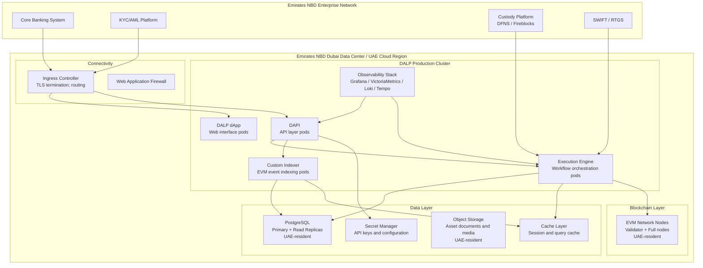

### Deployment Options Comparison

| Capability | Managed SaaS | Private Cloud (Recommended) | On-Premises | Hybrid |
|---|---|---|---|---|
| Infrastructure management | SettleMint-managed | Client-managed with SettleMint support | Client-managed | Split by component |
| Data residency | Configurable by region | Full UAE control | Full control | Component-level |
| Network connectivity | Internet / VPN | Client VPN / private link | Air-gapped capable | Mixed |
| Update management | Automated by SettleMint | Coordinated releases | Client-controlled | Component-specific |
| Auto-scaling | Yes | Client-provisioned | Client-provisioned | Component-specific |
| Time to deploy | Fastest (days) | Moderate (weeks) | Longest (weeks-months) | Moderate |
| Operational overhead | Lowest | Moderate | Highest | Moderate |
| UAE data residency | Requires UAE-region selection | Native | Native | Native by design |
| CBUAE alignment | Satisfactory with UAE region | Strong | Strongest | Strong |

### Infrastructure Requirements

For the recommended UAE private cloud deployment, the infrastructure baseline covers:

| Component | Minimum Specification | Production Recommendation |
|---|---|---|
| Kubernetes cluster | v1.25+; 8 vCPU; 32 GB RAM | 16+ vCPU; 64+ GB RAM; multi-node |
| PostgreSQL database | v15+; managed cloud database | Managed service with read replicas; UAE-resident |
| Cache layer | Standard configuration | Clustered deployment for HA |
| Object storage | S3-compatible; UAE-resident | UAE-region managed cloud object storage |
| Secret management | Cloud-native secret manager | Cloud-native or HashiCorp Vault on-premises |
| Ingress controller | Standard Kubernetes ingress | WAF-protected; TLS termination |
| Blockchain nodes | Minimum 4 nodes (2 validators, 2 full) | 6+ nodes with geographic distribution within UAE |
| Observability stack | Included in DALP Helm charts | Co-deployed with DALP; SIEM forwarding configured |

### Availability, Resilience, and Disaster Recovery

**High availability architecture.** Every DALP component is deployed with redundancy. API layer pods run across multiple Kubernetes nodes. Database is deployed with primary-replica replication. The cache layer is clustered. Blockchain nodes run across multiple physical hosts within the UAE deployment zone. No single component failure results in platform unavailability.

**Durable execution resilience.** DALP's workflow engine provides application-level resilience independent of infrastructure redundancy. Multi-step workflows persist their execution state at every checkpoint. If a DAPI process is terminated during a workflow execution, the workflow resumes from its last checkpoint when the process restarts. This means that even during infrastructure maintenance or partial failure scenarios, in-flight business operations complete correctly without manual intervention.

**Disaster recovery targets:**

| Recovery Metric | Target |
|---|---|
| Recovery Time Objective (RTO) | 4 hours for complete site failure |
| Recovery Point Objective (RPO) | 1 hour (based on database replication and backup frequency) |
| Database backup frequency | Continuous replication + daily full backup |
| Blockchain node recovery | Validator keys pre-staged in standby infrastructure |

**Backup procedures.** Database backups (full daily, continuous incremental) are stored in UAE-resident object storage. Smart contract deployments are recorded in DALP's token registry, enabling the on-chain state to be verified against the database backup. Object storage documents are backed up through provider-native replication.

### Data Residency and Sovereignty

Emirates NBD's UAE data residency requirements mandate that all financial data for UAE customers remains within UAE borders. DALP's deployment architecture satisfies this requirement completely for the recommended private cloud model:

- All DALP application components deploy in the UAE-resident cloud environment
- All database data (investor registry, transaction history, audit logs, compliance records) resides in UAE-resident managed database services
- All object storage (asset documentation, Sukuk term sheets, offering circulars) resides in UAE-resident object storage
- Blockchain node infrastructure operates within UAE data center boundaries
- Key material (for cloud secret manager tier) is stored in UAE-resident secret management services

Integrations with external services (DFNS, Fireblocks for custody; SWIFT for payments; KYC providers for claim verification) involve data flows across the UAE border only for the specific API calls required for those integrations. Customer identity data, transaction data, and audit logs remain UAE-resident.

🟢 Native: Full UAE data residency capability via private cloud or on-premises deployment
🟢 Native: All data tiers (application, database, object storage, blockchain) configurable to UAE-resident infrastructure

---

## Observability and Monitoring

### Observability Architecture

DALP ships a complete observability stack as part of its standard deployment. Emirates NBD's IT operations team can monitor the full digital asset platform from the DALP operational dashboard without requiring a separate monitoring infrastructure build-out. The observability stack covers three pillars plus pre-built alerting.

**Metrics.** VictoriaMetrics collects and stores time-series metrics from all DALP components: API request rates and latency, transaction pipeline state counts, compliance evaluation rates, blockchain node health, indexer processing lag, and infrastructure resource utilization. Pre-built Grafana dashboards provide operations overview, transaction monitoring, compliance activity, and infrastructure health in visual form.

**Logs.** Loki aggregates structured logs from all DALP components. Log formats are consistent across components, enabling cross-component correlation. The log aggregation is SIEM-compatible: log streams can be forwarded to Emirates NBD's SIEM platform (Splunk, IBM QRadar, Microsoft Sentinel) in real time for integration with the bank's existing security operations workflows.

**Traces.** Tempo / OpenTelemetry provides distributed tracing across the full request lifecycle. A compliance-blocked transfer, for example, generates a trace that spans from the initial API request through DAPI routing, compliance module evaluation, and the final rejection event, with timing data for each step. This capability is particularly valuable for investigating compliance anomalies and debugging integration issues.

**Automated alerting.** DALP ships pre-built alerting rules that trigger notifications for critical operational conditions: API error rate spikes, transaction pipeline backlogs, compliance breach attempts, blockchain node health failures, indexer lag exceeding thresholds, and resource saturation. Alert notifications use structured templates with context information (alert name, current value, threshold, affected component) and differentiate between firing and resolved states.

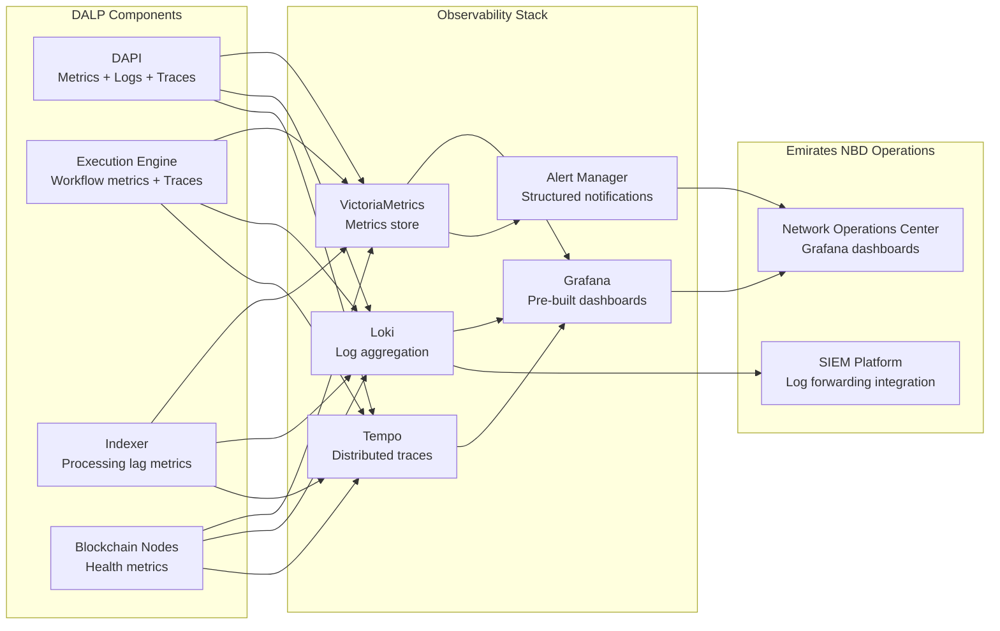

### Pre-Built Dashboard Coverage

| Dashboard | Key Metrics | Emirates NBD Use |
|---|---|---|
| Operations overview | Active tokens; active investors; transaction rates; error rates | Daily operational health monitoring |
| Transaction monitoring | Pipeline state distribution; throughput; latency; failure rates | Operations team monitoring of Sukuk and bond transactions |
| Compliance activity | Compliance evaluations per minute; approval rate; block rate by reason; module-level breakdown | Compliance team monitoring of transfer eligibility enforcement |
| Security events | Authentication failures; authorization rejections; unusual access patterns; API key usage | Security operations center integration |
| Infrastructure health | CPU, memory, disk utilization; database connection pools; cache hit rates | IT operations team infrastructure monitoring |
| Blockchain health | Node sync status; block production rate; peer count; gas price | Blockchain operations team monitoring |

### SIEM Integration for Emirates NBD

Emirates NBD's security operations center (SOC) uses structured log analysis for security event detection, incident response, and regulatory reporting. DALP's log output is structured (JSON format) and configured to forward to the bank's SIEM platform.

The relevant log categories for SIEM integration:

- **Authentication events**: Successful logins, failed login attempts, session creation and termination, API key usage, wallet verification failures
- **Authorization events**: Permission checks, role changes, access denials
- **Compliance events**: Transfer approvals, compliance blocks with reason codes, forced transfers, wallet freezes
- **Configuration changes**: Token deployment, compliance module configuration changes, role assignment changes, trusted issuer changes
- **Operational events**: Distribution executions, maturity redemptions, custody signing events, settlement completions

For UAE regulatory reporting, the compliance event log, accessible through the DALP API and also forwarded to the SIEM, provides the transaction-level evidence required for periodic VARA and CBUAE reporting submissions.

🟢 Native: Full observability stack (metrics, logs, traces)
🟢 Native: Pre-built Grafana dashboards for all operational domains
🟢 Native: Structured log output with SIEM-compatible format
🟢 Native: Automated alerting with firing/resolved notification templates
🟢 Native: Blockchain infrastructure health monitoring

---

## Disaster Recovery and Business Continuity

### DR Architecture

Emirates NBD's digital asset platform operates as a business-critical financial system. Downtime during Sukuk issuance windows, profit distribution periods, or active secondary market trading is a regulatory and reputational risk. DALP's disaster recovery architecture addresses this through multiple independent resilience layers.

**Application-layer resilience.** The durable workflow engine ensures that in-flight business operations survive infrastructure failures. A Sukuk deployment workflow that is at step seven of twelve when a process failure occurs resumes at step seven when the process restarts, not at step one. This application-level durability is independent of infrastructure redundancy and provides resilience against infrastructure failures that resolve within the workflow's retry window.

**Infrastructure-layer resilience.** Kubernetes pod replication ensures that API layer, execution engine, and indexer components maintain availability when individual pods or underlying nodes fail. Kubernetes' self-healing properties restart failed pods automatically. Database primary-replica replication ensures that read operations continue during primary maintenance windows, and failover to a replica can occur within minutes.

**Data-layer resilience.** Continuous database replication provides near-zero data loss for any failure that occurs during normal operation. Daily full database backups provide a recovery point for catastrophic failures. On-chain blockchain data (token balances, compliance configurations, investor registry) provides an independent, cryptographically verified source of truth for recovery validation.

**Blockchain network resilience.** The private EVM network operates with multiple validator nodes. A single validator node failure does not interrupt block production. The network continues operating with the remaining validators, and a failed node can rejoin after recovery without any data loss (it synchronizes the missed blocks from peers).

### Business Continuity for UAE Regulatory Requirements

CBUAE and VARA both impose business continuity requirements on regulated financial service providers. Emirates NBD's digital asset platform must satisfy these requirements as part of the bank's overall operational resilience framework.

**Recovery Time Objective (RTO).** The platform RTO of 4 hours applies to a complete site failure scenario (data center loss). For component-level failures (individual service failures, database failover), the recovery time is measured in minutes due to Kubernetes pod restart and database replica promotion procedures.

**Recovery Point Objective (RPO).** The platform RPO of 1 hour applies to a database recovery scenario following catastrophic data loss. In practice, continuous database replication ensures that the actual recovery point is the last committed transaction before the failure, not one hour prior.

**Regulatory reporting continuity.** The audit trail and compliance event logs are continuously replicated to the backup data store. Even following a primary system failure, the complete compliance audit trail is available for regulatory reporting from the backup data source.

**Planned maintenance continuity.** Platform updates and infrastructure maintenance are executed during pre-approved maintenance windows (typically 02:00-06:00 UAE time on Saturdays, outside peak trading and operation hours). DALP's Helm-based deployment automation supports zero-downtime rolling updates for API and execution components. Database schema updates use the rotating deployment schema mechanism to avoid downtime.

| Continuity Scenario | Recovery Approach | Target Recovery Time |
|---|---|---|
| API pod failure | Kubernetes pod restart + traffic redistribution | Minutes |
| Database primary failure | Automatic replica promotion | Minutes |
| Single blockchain node failure | Remaining validators continue; node syncs on recovery | No service interruption |
| DAPI process restart during workflow | Durable workflow resumes from checkpoint | Minutes |
| UAE data center partial failure | Kubernetes rescheduling to available nodes | Minutes to 1 hour |
| Complete site loss | Recovery from backup; blockchain sync | Up to 4 hours |
| Planned maintenance | Rolling update with zero downtime | Zero for API; minutes for scheduled restarts |

🟢 Native: Durable workflow engine with checkpoint-based recovery
🟢 Native: Kubernetes pod redundancy and self-healing
🟢 Native: Database replication and backup
🟢 Native: Blockchain network multi-node resilience
🟢 Native: Rolling deployment updates with zero API downtime

---

## Data Privacy and Sovereignty

### UAE Data Residency Requirements

The UAE's data protection framework, including Federal Law No. 45 of 2021 on Personal Data Protection (PDPL), requires that personal data of UAE residents is processed in accordance with defined standards and may require data to remain within UAE borders for certain categories.

DALP's UAE-resident deployment ensures that:

**All customer data** (investor identity records, KYC information, account details) is stored in UAE-resident database infrastructure. No customer data is processed on SettleMint's EU operational infrastructure.

**All transaction data** (token transfers, compliance evaluations, distribution events) is stored in UAE-resident database and on UAE-resident blockchain nodes. Transaction history is available to UAE regulatory authorities on request without requiring data transfer across borders.

**All audit logs** (authentication events, authorization decisions, compliance evaluations, configuration changes) are stored in UAE-resident log storage and indexed in UAE-resident infrastructure.

**Key material** (for cloud secret manager tier) is stored in UAE-resident secret management services. For HSM key material, the hardware remains within Emirates NBD's UAE facilities.

**Data flows that cross UAE borders** are limited to specific integration API calls: DFNS or Fireblocks signing API calls (which transmit transaction data but not personal customer data), SWIFT/RTGS payment instructions (which follow standard cross-border financial messaging frameworks), and KYC provider verification calls (which follow the KYC provider's data processing agreement with Emirates NBD).

### On-Chain Privacy Considerations

Blockchain data is inherently transparent within the network. For a private permissioned network, network participation is restricted to authorized nodes operated within Emirates NBD's infrastructure. Transaction data is visible to all permissioned network participants but not publicly accessible.

For products where investor privacy is a regulatory requirement, DALP's compliance architecture supports privacy-preserving designs:

- **Selective disclosure**: OnchainID claims are cryptographically signed attestations. The compliance module verifies the claim's validity without the claim data being exposed to other parties on the network.
- **Address pseudonymity**: Investor wallets are identified by their blockchain address. The mapping between wallet addresses and personal identity is maintained in DALP's off-chain Identity Registry, which is UAE-resident and access-controlled.
- **Data minimization**: Only the claims required for compliance evaluation are published on-chain. Full KYC documentation remains off-chain in Emirates NBD's KYC system; only the verification result (KYC: pass/fail, with expiry and issuer) is published.

### PDPL Compliance Considerations

The UAE's PDPL establishes principles for personal data processing including purpose limitation, data minimization, accuracy, storage limitation, integrity and confidentiality, and accountability. DALP's data architecture supports PDPL compliance:

- **Purpose limitation**: Customer data is processed for the defined purpose of digital asset operations
- **Data minimization**: Only necessary claims are published on-chain; full personal data remains in Emirates NBD's controlled systems
- **Accuracy**: The claim revocation mechanism ensures that outdated or incorrect claims can be corrected and the correction propagates immediately
- **Storage limitation**: Claim expiry dates enforce time-limited personal data retention in the on-chain identity layer
- **Security**: Encryption at rest, encryption in transit, RBAC, and audit logging satisfy the security principle
- **Accountability**: The complete audit trail demonstrates accountability for all data processing operations

🟢 Native: Full UAE data residency via private cloud or on-premises deployment
🟢 Native: On-chain pseudonymity with off-chain identity mapping
🟢 Native: Claim-based privacy-preserving compliance verification
🟢 Native: Data minimization in on-chain identity layer

---

## Project Implementation and Delivery

### Delivery Overview

SettleMint follows a phase-gated implementation methodology refined through years of production implementations at regulated banks, market infrastructure providers, and sovereign entities. The methodology balances time-to-value with the rigorous governance, security, and compliance requirements that Emirates NBD demands.

The standard implementation timeline for Emirates NBD's initial scope (Phase 1: Sukuk and bonds) spans 19 weeks from kickoff to production go-live, followed by a 4-week hypercare period. Phase 2 (real estate and structured deposits) and Phase 3 (precious metals, equity, funds) follow as subsequent programmes once Phase 1 is operating in production.

Each phase concludes with a formal gate review involving key stakeholders from both SettleMint and Emirates NBD. Progression requires sign-off on defined deliverables and acceptance criteria.

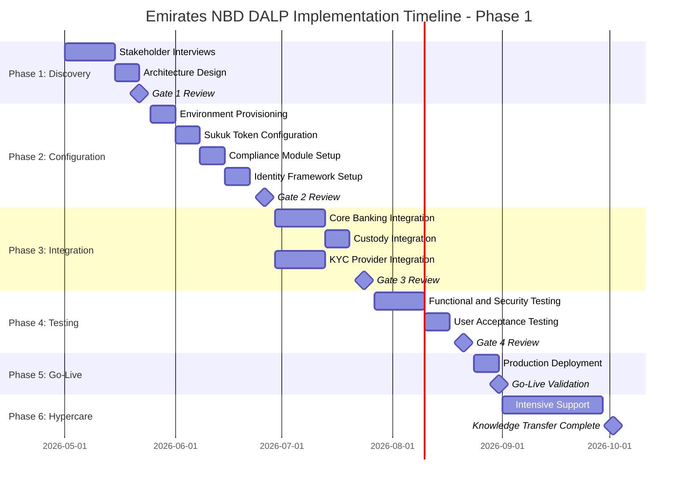

### Phase Plan

**Phase 1: Discovery and Requirements (Weeks 1-3)**

*Objective:* Establish comprehensive understanding of Emirates NBD's business objectives, technical landscape, regulatory environment, and operational requirements.

*Key activities:*
- Structured stakeholder interviews with DCM team, compliance officers, IT architecture, security team, and operations team
- Review of existing core banking system (Temenos/Oracle/Finacle) integration landscape
- UAE regulatory framework mapping: VARA, CBUAE, SCA, ADGM, DIFC requirements per target product type
- Asset class and lifecycle scoping: Sukuk and bond specific requirements, compliance module mapping
- Target architecture design: UAE private cloud topology, network model, custody integration model
- Risk identification and mitigation planning

*Outputs:* Business Requirements Document; Regulatory Compliance Matrix; Target Architecture Document; Implementation Roadmap; RACI Matrix

*Gate criteria:* BRD signed off by Emirates NBD project sponsor; architecture approved by Emirates NBD technology leadership; regulatory mapping reviewed by Emirates NBD compliance team

**Phase 2: Configuration and Setup (Weeks 4-7)**

*Objective:* Provision the DALP environment, configure asset types and compliance modules, establish identity framework, and prepare integration layer.

*Key activities:*
- UAE private cloud infrastructure provisioning (Kubernetes cluster, PostgreSQL, object storage, secret management)
- Private EVM network deployment with UAE-resident validator nodes
- Sukuk and bond token template configuration with profit distribution and maturity mechanics
- UAE compliance template creation: VARA professional/retail, SCA private placement, CBUAE payment token templates
- OnchainID identity framework configuration; trusted claim issuer setup for Emirates NBD's KYC providers
- Key Guardian configuration with DFNS/Fireblocks custody integration; maker-checker workflow setup
- Integration architecture design for core banking, KYC, custody, and SWIFT connections

*Outputs:* Provisioned environments (dev, staging, production); Asset configuration documentation; Compliance module configuration; Identity framework design; Integration Design Document

*Gate criteria:* Platform deployment validated against infrastructure checklist; Sukuk token configuration reviewed by DCM team; Compliance templates reviewed by Emirates NBD compliance team; Custody integration design approved by security team

**Phase 3: Integration (Weeks 8-11)**

*Objective:* Connect DALP to Emirates NBD's existing systems: core banking, custody providers, KYC/AML, payment rails.

*Key activities:*
- Core banking API integration: event webhook configuration for Temenos/Oracle/Finacle; position data API setup
- DFNS/Fireblocks custody connector configuration; maker-checker workflow testing; signing policy validation
- Emirates NBD KYC provider claim issuance API integration; trusted claim issuer activation
- ISO 20022 payment rail integration for AED and USD cash-leg settlement
- End-to-end workflow implementation: Sukuk issuance flow; secondary market transfer flow; profit distribution flow
- Regulatory reporting data feed configuration; SIEM log forwarding setup
- Draft runbook preparation for all operational workflows

*Outputs:* Integrated system landscape; API Integration Documentation; End-to-end workflow documentation; Integration Test Results; Draft Runbooks

*Gate criteria:* All integration points confirmed operational in staging environment; end-to-end Sukuk issuance and distribution workflow tested successfully; security team approval of custody integration configuration

**Phase 4: Testing and User Acceptance (Weeks 12-14)**

*Objective:* Validate that the complete DALP deployment meets all functional, security, performance, and compliance requirements.

*Key activities:*
- Functional testing of all configured asset types, lifecycle events, and compliance rules
- Security testing including penetration testing coordination, access control validation, and key management audit
- Performance testing with simulated production transaction volumes
- Compliance validation: end-to-end testing of ex-ante compliance enforcement; blocked transfer testing; forced transfer testing
- User Acceptance Testing with Emirates NBD DCM team, compliance team, operations team, and IT team
- Disaster recovery testing: process restart recovery; database failover; blockchain node failure recovery

*Outputs:* Test Plan and Test Cases; Functional Test Report; Security Assessment Report; Performance Test Report; UAT Sign-Off; Go-Live Readiness Assessment

*Gate criteria:* All functional test cases passing; security assessment findings reviewed and critical findings resolved; UAT sign-off from Emirates NBD stakeholders; Go-Live readiness confirmed

**Phase 5: Go-Live (Week 15)**

*Objective:* Execute controlled production deployment with dedicated support coverage.

*Key activities:*
- Production deployment execution per validated deployment runbook
- Go-live smoke test suite execution: platform health, integration connectivity, compliance enforcement validation
- On-call SettleMint support team stationed for go-live window
- Immediate operational handover to Emirates NBD with SettleMint support overlay

*Outputs:* Production Deployment Confirmation; Go-Live Smoke Test Results; Incident Response Procedures Activated

*Gate criteria:* All smoke tests passing in production; key integration confirmations (custody, core banking, KYC) validated; Emirates NBD project sponsor sign-off

**Phase 6: Hypercare and Knowledge Transfer (Weeks 16-19)**

*Objective:* Intensive post-go-live support, performance optimization, and knowledge transfer to Emirates NBD's operational teams.

*Key activities:*
- Dedicated monitoring of production platform health, transaction volumes, and integration stability
- Performance optimization based on actual production workload patterns
- Structured knowledge transfer: platform administration, monitoring and alerting procedures, compliance module management, operational runbooks
- Operational readiness assessment: confirming Emirates NBD's team can independently manage day-to-day operations
- Transition to contracted support tier (Enterprise SLA) with named support team

*Outputs:* Hypercare Summary Report; Optimized Configuration Documentation; Complete Documentation Package; Knowledge Transfer Completion Certificate; Support Transition Plan

*Gate criteria:* Knowledge transfer sessions completed; operational readiness assessment passed; Emirates NBD team confirms self-sufficiency; support transition approved by both parties

### Governance and Decision Structure

| Governance Level | Participants | Cadence | Scope |
|---|---|---|---|
| Steering Committee | Emirates NBD Project Sponsor + CTO; SettleMint VP Strategic Partnerships | Bi-weekly | Programme direction; escalation; risk |
| Project Working Group | Emirates NBD Project Manager + technical leads; SettleMint Delivery Lead + Solution Architect | Weekly | Progress; blockers; decisions |
| Technical Review | Emirates NBD IT architecture + security; SettleMint Solution Architect + Platform Engineer | As required (min weekly) | Technical decisions; integration design |
| Compliance Review | Emirates NBD compliance team; SettleMint compliance configuration experts | At Phase 1 and Phase 2 gates | Regulatory compliance validation |

### Resource Model

| Role | Phase 1 | Phase 2 | Phase 3 | Phase 4 | Phase 5 | Phase 6 |
|---|---|---|---|---|---|---|
| **SettleMint Delivery Lead** | Full | Full | Full | Full | Full | Partial |
| **SettleMint Solution Architect** | Full | Full | Partial | Partial | On-call | On-call |
| **SettleMint Platform Engineer** | - | Full | Full | Full | Full | Partial |
| **SettleMint Integration Engineer** | - | Partial | Full | Partial | On-call | On-call |
| **SettleMint QA / Test Lead** | - | - | Partial | Full | Partial | - |
| **SettleMint Support Engineer** | - | - | - | - | Full | Full |
| **Emirates NBD Project Manager** | Full | Full | Full | Full | Full | Full |
| **Emirates NBD Technical Lead** | Full | Full | Full | Partial | On-call | Partial |
| **Emirates NBD Compliance Team** | Phases 1, 2, 4 gate reviews | | | | | |
| **Emirates NBD Security/InfoSec** | | Phase 2 review | | Phase 4 testing | | |

### Delivery Risks and Mitigations

| Risk | Likelihood | Impact | Mitigation | Owner |
|---|---|---|---|---|
| UAE regulatory framework changes mid-implementation | Medium | High | Modular compliance configuration enables rapid adjustment without redeployment; weekly regulatory monitoring during Phase 1-2 | SettleMint + Emirates NBD Compliance |
| Core banking integration complexity exceeds estimates | Medium | High | Detailed integration assessment in Phase 1; DALP's comprehensive API layer reduces custom work; contingency buffer in Phase 3 timeline | SettleMint Integration Lead |
| VARA/SCA compliance template approval delays | Medium | Medium | Early engagement with Emirates NBD compliance team in Phase 1; pre-seeded template library as starting point | Emirates NBD Compliance |
| Emirates NBD resource availability constraints | Medium | Medium | RACI agreed in Phase 1; parallel workstreams to reduce single-point dependencies | Emirates NBD Project Manager |
| Security review extends beyond planned timeline | Medium | Medium | Early InfoSec engagement in Phase 1; security testing parallelized with UAT where possible | Emirates NBD Security |
| Custody integration complexity (DFNS/Fireblocks policy configuration) | Low | Medium | Proven integration patterns from ADI Finstreet and other deployments; dedicated custody integration track | SettleMint Integration Engineer |
| UAE cloud region infrastructure readiness | Low | High | Infrastructure validation in Phase 1 architecture design; fallback to on-premises if required | Emirates NBD IT |

---

## Training and Knowledge Transfer

### Training Strategy

SettleMint's training approach is built around operational self-sufficiency: when the implementation programme concludes, Emirates NBD's teams must be capable of operating the DALP platform independently, managing day-to-day operations without continuous SettleMint involvement, and resolving common issues using documented procedures.

Training is delivered in three parallel tracks aligned with three distinct audience types. Each track begins in Phase 2 alongside platform setup and completes during Phase 6 hypercare, with structured competency assessment at the conclusion of each track.

### Administrator Track

**Audience:** Emirates NBD's IT platform administrators responsible for DALP infrastructure management, user lifecycle management, and platform configuration oversight.

**Duration:** 20 hours across Phases 2-6 (classroom plus hands-on)

**Topics covered:**

- Platform architecture overview: component roles, dependencies, and interfaces
- Kubernetes cluster management for DALP workloads: pod monitoring, resource management, update procedures
- Database administration: backup verification, performance monitoring, connection pool management
- Secret management: API key lifecycle; key rotation procedures; emergency revocation
- User and role management: creating, modifying, and deactivating user accounts; role assignment workflows; organization management
- Environment management: development, staging, production promotion procedures; configuration management
- Platform update procedures: update planning, staging rollout, production promotion, rollback procedures
- Monitoring and alerting: Grafana dashboard navigation; alert configuration; alert escalation procedures
- Incident response: runbook navigation; escalation procedures; SettleMint support engagement

### Developer and Integration Track

**Audience:** Emirates NBD's application developers and integration engineers responsible for connecting DALP to core banking systems, developing investor-facing applications, and building automation workflows.

**Duration:** 30 hours across Phases 3-6 (workshop plus lab)

**Topics covered:**

- DALP API architecture: REST, GraphQL, oRPC, and webhook models; authentication and authorization for API access
- SDK usage for TypeScript integrations: contract-bound client; serializers; error code handling
- CLI usage for system administration and automation: 301 commands; scripting patterns
- Webhook integration patterns: event subscription; payload processing; retry and error handling
- Core banking integration patterns: position data synchronization; event-driven reconciliation
- Custody integration operations: DFNS and Fireblocks connector configuration; maker-checker workflow management
- Token lifecycle API operations: issuance, transfer, compliance evaluation, servicing, redemption
- Integration debugging: distributed tracing for cross-system workflows; log correlation; structured error codes

### End-User and Operations Track

**Audience:** Emirates NBD's business operations teams using DALP for daily token operations: the DCM team for issuance, the compliance team for monitoring and configuration, and the operations team for investor management and lifecycle servicing.

**Duration:** 24 hours across Phases 2-6 (guided workflow walkthroughs)

**Topics covered:**

- Asset Designer: creating and configuring tokens for each asset class; compliance template selection; deployment approval workflow
- Investor management: onboarding investors; reviewing KYC/identity status; managing wallet verifications; handling identity recovery
- Compliance monitoring: reviewing compliance event logs; investigating blocked transfers; updating compliance module parameters; managing investor allow/block lists
- Lifecycle servicing: initiating and monitoring profit distributions; processing maturity redemptions; executing corporate actions
- Secondary market operations: reviewing and approving transfer requests; handling forced transfers; wallet freeze/unfreeze operations
- Reporting: generating compliance reports; exporting audit logs; accessing investor position reports

### Knowledge Transfer Methods

**Shadowing and guided walkthroughs.** During Phases 2-4, Emirates NBD team members shadow SettleMint's engineers during platform configuration, integration setup, and testing activities. This provides real-world context for each procedure in the environment that will operate in production.

**Guided labs.** Structured hands-on exercises in the staging environment cover each operational procedure with step-by-step guidance and progressive complexity. Labs are completed in small groups to enable peer learning and question resolution.

**Operational runbooks.** Comprehensive runbooks covering every common operational procedure, exception handling workflow, and escalation path are delivered during Phase 6. Runbooks are structured for operational reference use: concise, step-by-step, with clear decision trees for handling exceptions.

**Operational readiness assessment.** A structured assessment at the end of Phase 6 confirms that Emirates NBD's teams can independently execute all defined operational procedures without SettleMint assistance. The assessment covers platform administration, compliance module management, lifecycle servicing, and incident response. Sign-off on the assessment is a gate criterion for transitioning from hypercare to standard support.

| Training Track | Audience | Duration | Delivery Method | Completion Gate |
|---|---|---|---|---|
| Administrator | IT platform admins | 20 hours | Classroom + hands-on | Operational readiness assessment |
| Developer / Integration | Application developers and integration engineers | 30 hours | Workshop + lab exercises | Integration competency demonstration |
| End-User / Operations | DCM, compliance, operations teams | 24 hours | Guided workflow walkthroughs | Operational task competency check |

---

## Support and SLA

### Support Model Overview

SettleMint provides structured, tiered support for all DALP production deployments. The support framework is designed for regulated institutions where uptime, compliance enforcement, and operational continuity are non-negotiable. Every support interaction is logged, tracked, and auditable, consistent with the governance expectations of regulated financial environments.

Support is delivered by engineers with deep expertise in DALP's architecture, blockchain infrastructure, compliance modules, and integration patterns. Engineers assigned to Emirates NBD's support have direct familiarity with the UAE and GCC regulatory environment and the specific configuration choices made during the implementation programme.

For Emirates NBD's programme, SettleMint recommends the Enterprise Support tier, reflecting the business-critical nature of the digital asset infrastructure and the volume and complexity of the operations the platform will manage.

### Support Tiers

| Attribute | Standard | Premium | Enterprise (Recommended) |
|---|---|---|---|
| Coverage hours | Business hours (09:00-18:00 CET, Mon-Fri) | Extended (07:00-22:00 CET, Mon-Fri; P1 on-call weekends) | 24/7/365 |
| Support channels | Email, support portal | Email, portal, dedicated Slack, phone (P1/P2) | Email, portal, dedicated Slack, phone, video |
| Named contacts | Up to 3 | Up to 8 | Unlimited |
| Uptime SLA | 99.9% monthly | 99.95% monthly | 99.99% monthly |
| Designated support | - | Named individual | Named support team |
| Account management | Quarterly review | Monthly review | Bi-weekly operational review; named CSM |
| Solution architect access | - | - | Quarterly architecture review |
| Platform updates | Quarterly | Monthly | Continuous delivery with staged rollouts |

### Severity and Response Matrix

| Severity | Description | Standard | Premium | Enterprise |
|---|---|---|---|---|
| **P1 Critical** | Platform unavailable; compliance enforcement failure; settlement failure in production | 4 hours response / 8 hours resolution | 1 hour / 4 hours | 15 minutes / 2 hours |
| **P2 High** | Major functionality degraded; no acceptable workaround; blocking multiple users | 8 hours response / 24 hours resolution | 4 hours / 8 hours | 1 hour / 4 hours |
| **P3 Medium** | Functional issue with workaround available; subset of users affected | 2 business days / 5 business days | 1 business day / 3 business days | 4 hours / 2 business days |
| **P4 Low** | Minor issue; no material operational impact; cosmetic or documentation | 5 business days / 10 business days | 3 business days / 5 business days | 1 business day / 3 business days |

### Escalation and Incident Management

For Emirates NBD under Enterprise Support, P1 incidents trigger an immediate war-room response:

1. SettleMint support engineer acknowledges incident within 15 minutes
2. Dedicated incident manager assigned; Emirates NBD's named support contacts notified
3. War-room video call opened within 30 minutes with SettleMint's on-call engineers and Emirates NBD's technical contacts
4. Status updates provided every 30 minutes until resolution
5. Post-mortem root cause analysis delivered within 5 business days of resolution
6. Preventive measures implemented and documented in a service improvement report

**Escalation path (client-initiated):**
1. Named Support Engineer (first contact)
2. Support Engineering Manager
3. VP Engineering / Head of Customer Success
4. SettleMint Executive Management

For UAE time zone alignment, Emirates NBD's support contacts can reach SettleMint's 24/7 support through the dedicated Slack channel, email, or phone. UAE morning hours (06:00-10:00 GST) align with SettleMint's EU start of business day; UAE afternoon hours (14:00-18:00 GST) overlap with peak EU working hours.

### Maintenance and Update Policy

| Update Type | Notification Period | Process |
|---|---|---|
| Routine maintenance | 5 business days | Scheduled Saturday 02:00-06:00 UAE time (GST); status page update |
| Major platform upgrade | 10 business days | Staged rollout (staging first); Emirates NBD approval gate before production |
| Emergency security patch | Maximum practical advance notice | May occur outside standard window for critical vulnerabilities |
| Compliance module updates | 10 business days; compliance team notification | Regulatory impact assessment provided; Emirates NBD compliance review required |

### Service Reporting

Monthly uptime reports are provided as part of the bi-weekly operational review. Reports include: uptime achievement vs. SLA target; incident log with severity, response times, and resolution times; platform performance metrics; upcoming release and update schedule; open action items.

| Uptime Achieved | Service Credit (Enterprise) |
|---|---|
| Below 99.99% but ≥ 99.5% | 10% of monthly support fees |
| Below 99.5% but ≥ 99.0% | 25% of monthly support fees |
| Below 99.0% | 50% of monthly support fees |

🟢 Native: Enterprise 24/7 support tier
🟢 Native: P1 war-room incident management
🟢 Native: Monthly service reporting with SLA tracking

---

## Risk Management

### Risk Management Approach

Effective risk management for a digital asset programme at Emirates NBD covers four categories: regulatory change risk (the frameworks are evolving), integration complexity risk (the technical landscape is complex), delivery risk (the timeline is constrained), and operational risk (the platform will manage real financial assets from day one). SettleMint's phase-gated methodology with explicit risk identification at each gate ensures that risks are identified, owned, and mitigated before they become issues.

| Risk Management Principle | Application to Emirates NBD |
|---|---|
| Early identification | Phase 1 dedicated risk assessment across all categories |
| Owner assignment | Every risk has a named owner from SettleMint or Emirates NBD |
| Continuous monitoring | Risk register reviewed at every project working group |
| Escalation triggers | Risk level change triggers Steering Committee notification |
| Mitigation first | Mitigations are defined before risks are accepted, not after |

### Risk Register

| ID | Risk | Likelihood | Impact | Mitigation | Owner | Status |
|---|---|---|---|---|---|---|
| R01 | VARA regulatory guidance changes affecting product design | Medium | High | Modular compliance configuration enables reconfiguration without redeployment; SettleMint monitors UAE regulatory developments | SettleMint + Emirates NBD Compliance | Active monitoring |
| R02 | CBUAE payment token regulatory requirements change | Medium | High | Compliance template update mechanism enables rapid response; legal counsel engagement for payment token products | Emirates NBD Legal + Compliance | Active |
| R03 | Core banking integration complexity exceeds Phase 1 estimates | Medium | High | Detailed integration assessment in Phase 1; DALP API layer reduces custom integration; timeline contingency in Phase 3 | SettleMint Delivery Lead | Phase 1 assessment pending |
| R04 | Emirates NBD security review extends beyond planned timeline | Medium | Medium | Early InfoSec engagement in Phase 1; security documentation package prepared in advance; parallelization of security testing with UAT | Emirates NBD Security | Phase 1 pre-engagement action |
| R05 | Sharia board approval timeline for Sukuk configuration | Medium | High | Engage Sharia board in Phase 1 alongside platform configuration; compliance team validates platform mechanics against board requirements before go-live | Emirates NBD Sharia Board + DCM | Phase 1 action |
| R06 | UAE cloud region infrastructure capacity constraints | Low | High | Infrastructure provisioning validated in Phase 1; fallback to alternative UAE-resident options identified in advance | Emirates NBD IT | Phase 1 infrastructure assessment |
| R07 | Custody provider (DFNS/Fireblocks) integration delays | Low | Medium | Proven integration patterns from prior UAE deployments; fallback to cloud secret manager during integration | SettleMint Integration Engineer | Monitoring |
| R08 | Investor onboarding volume exceeds initial scaling estimates | Low | Medium | Platform auto-scaling on cloud deployment; performance testing at Phase 4 simulates peak volumes; scaling guidance from Phase 1 assessment | SettleMint Solution Architect | Phase 4 testing |
| R09 | GCC cross-border settlement regulatory requirements | Low | Medium | ISO 20022 integration satisfies technical settlement requirements; legal review of cross-border transfer approvals per jurisdiction | Emirates NBD Legal | Phase 1 regulatory mapping |
| R10 | Blockchain node infrastructure operational learning curve | Medium | Low | Structured administrator training track; runbook coverage of all node management procedures; ongoing support | SettleMint Support | Training programme |

### Governance of Risks

Risks are reviewed at weekly project working group meetings and reported to the Steering Committee at bi-weekly meetings. Risk likelihood and impact ratings are reviewed at each Phase gate and updated based on observed developments. Risks that escalate to High likelihood AND High impact trigger immediate Steering Committee notification and dedicated mitigation planning.

---

## Team and Key Personnel

### SettleMint's Engagement Model

The SettleMint team assigned to Emirates NBD's programme combines deep DALP platform expertise, UAE and GCC market knowledge, and institutional delivery experience. The team structure is constant through all six phases, with role intensity varying by phase as detailed in the resource model.

**Delivery Lead.** The Delivery Lead is the single accountable point of contact for programme delivery. Responsibilities include phase planning, milestone tracking, risk and issue management, stakeholder communication, and gate review facilitation. The Delivery Lead has previous experience managing complex digital asset implementations at regulated financial institutions and is familiar with the governance requirements of large UAE banks.

**Solution Architect.** The Solution Architect owns the technical architecture design, integration architecture, compliance module configuration, and platform deployment. This is the technical authority for all design decisions during Phases 1-3. The Solution Architect has direct experience with UAE/GCC blockchain deployments and the specific infrastructure and regulatory conventions of the region.

**Platform Engineer.** The Platform Engineer owns environment provisioning, Helm chart deployment, Kubernetes configuration, observability stack setup, and platform update management. The Platform Engineer has deep expertise in DALP's infrastructure requirements and the specific operational patterns relevant to regulated financial deployments.

**Integration Engineer.** The Integration Engineer owns API integration design, core banking connector development, custody integration configuration, and payment rail connectivity. The Integration Engineer is experienced with Temenos, Oracle FLEXCUBE, and Finacle integration patterns commonly found in UAE banks.

**QA / Test Lead.** The Test Lead owns test planning, functional testing, security testing coordination, performance testing, and UAT facilitation. The Test Lead ensures that acceptance criteria for each phase gate are defined, tested, and documented before gate review.

**Support Engineer.** The Support Engineer owns hypercare monitoring, performance optimization, knowledge transfer delivery, and transition to standard support. This role provides continuity between the implementation programme and the ongoing support relationship.

### Gyan Khadka, VP Strategic Partnerships

Gyan Khadka leads SettleMint's strategic partnership relationships in the UAE and GCC region. As the senior commercial and strategic contact for Emirates NBD, Gyan provides executive-level relationship management, escalation support, and the connection between Emirates NBD's programme needs and SettleMint's product and engineering leadership.

Gyan brings direct experience building institutional digital asset partnerships across the Middle East and South Asia regions, with deep familiarity with the UAE banking sector's regulatory environment, procurement processes, and institutional requirements.

---

## Compliance Matrix

### Usage Instructions

This compliance matrix maps assumed best-practice RFP requirements for a UAE bank digital asset platform to DALP's capabilities. Status codes follow the legend below. Assumptions are noted where requirements have been interpreted from best practice rather than an explicit RFP document.

### Status Legend

| Code | Meaning |
|---|---|
| Full | DALP meets this requirement natively, out of the box, without additional configuration |
| Configurable | DALP meets this requirement through configuration; requires setup during implementation |
| Partial | DALP partially meets this requirement; full coverage requires integration with external systems |
| Assumption | Requirement interpreted from best practice; clarification may refine the response |
| Out of Scope | This requirement is not addressed by the DALP platform; addressed by adjacent systems |

### Detailed Compliance Matrix

| Req ID | Requirement Summary | Status | DALP Response | Notes |
|---|---|---|---|---|
| F01 | Support tokenized Sukuk with profit distribution | Configurable | Bond template + Fixed Treasury Yield + Maturity Redemption; profit distribution on configurable schedule | Sharia structure determined by issuer; platform implements approved mechanics |
| F02 | Support conventional bond tokenization | Full | Bond template with Fixed Treasury Yield and Maturity Redemption | |
| F03 | Support tokenized real estate with fractional ownership | Full | Real Estate template with fractional ownership mechanics and rental income distribution | DLD integration configured during Phase 2 |
| F04 | Support tokenized structured deposits | Full | Deposit template with programmable interest and maturity | |
| F05 | Support precious metals tokens with provenance | Full | Precious Metals template with asset-backed issuance and metadata provenance | Physical vault integration is out-of-platform scope |
| F06 | Support tokenized equity with corporate actions | Full | Equity template with dividend distribution and voting rights | |
| F07 | Support tokenized fund units with NAV | Partial | Fund template; NAV feed integration requires external data provider | |
| F08 | Support custom / novel asset types | Full | Configurable Token type with any assetTypeName; up to 32 features + 12 modules | |
| C01 | Ex-ante compliance enforcement | Full | ERC-3643 protocol-level enforcement; compliance check is part of transfer function | Cannot be bypassed at application layer |
| C02 | VARA investor eligibility compliance | Configurable | SMART Identity Verification module with VARA classification claims; Country Allow List for UAE/GCC | VARA-specific template configured in Phase 1 |
| C03 | CBUAE payment instrument compliance | Configurable | Token Supply Limit; Collateral module; mandatory KYC via identity verification | |
| C04 | SCA securities offering compliance | Configurable | Investor Count; Token Supply Limit; Time Lock; Transfer Approval | |
| C05 | DIFC/DFSA qualified investor compliance | Configurable | SMART Identity Verification with DIFC QI classification; Country Allow List | |
| C06 | Islamic finance / Sharia mechanics | Configurable | Fixed Treasury Yield for profit distribution; configurable profit-sharing mechanics | Sharia board determines structure; platform implements |
| C07 | KYC/AML integration | Partial | OnchainID claim consumption from KYC provider; trusted claim issuer model | KYC verification performed by Emirates NBD's existing provider |
| C08 | Sanctions screening integration | Partial | Address Block List for known sanctioned addresses; Country Block List for sanctioned jurisdictions | Real-time sanctions screening performed by existing AML system |
| C09 | Immutable audit trail | Full | On-chain event log + structured off-chain audit log; immutable; SIEM-compatible | |
| C10 | Multi-regulatory framework support | Full | Independent compliance module configuration per token type; concurrent frameworks supported | |
| S01 | Atomic DvP settlement | Full | Smart contract atomic DvP; both legs complete or both revert | |
| S02 | XvP multi-party settlement | Full | XvP atomic settlement for multi-party exchanges | |
| S03 | Cross-chain settlement | Full | HTLC cross-chain settlement for cross-network transactions | |
| S04 | ISO 20022 cash-leg integration | Full | ISO 20022 message standard for SWIFT/RTGS cash-leg coordination | |
| S05 | T+0 settlement finality | Full | On-chain settlement finality upon block confirmation | |
| S06 | Multi-currency (AED, USD, SAR) | Full | Multi-currency token support; ISO 20022 multi-currency payment integration | |
| I01 | Core banking system integration | Partial | REST/GraphQL API + Webhooks; field mapping configured during Phase 3 | System-specific integration configured per bank's CBS |
| I02 | DFNS custody integration | Full | Native connector; maker-checker; delegated signing | |
| I03 | Fireblocks custody integration | Full | Native connector; TAP policy integration | |
| I04 | KYC provider integration | Partial | Claim issuance API; trusted claim issuer model | Provider-specific API call formatting per implementation |
| I05 | Regulatory reporting integration | Partial | Audit log API; compliance event log export | Report format mapping per regulatory requirement |
| I06 | SIEM integration | Full | Structured log output; SIEM-compatible format; log forwarding | |
| I07 | DLD registry integration (Phase 2) | Partial | REST API integration point available; DLD-specific connector configured in Phase 2 | |
| T01 | UAE data residency | Full | On-premises and private cloud deployment with full UAE data residency | |
| T02 | High availability | Full | Kubernetes pod redundancy; database replication; multi-node blockchain | |
| T03 | Disaster recovery (RTO 4h, RPO 1h) | Full | Durable workflow engine; continuous DB replication; backup and recovery procedures | |
| T04 | 99.99% uptime (Enterprise SLA) | Full | Enterprise support tier; 99.99% uptime SLA | |
| T05 | Kubernetes deployment | Full | Helm chart deployment; Kubernetes-native operations | |
| T06 | Observability and monitoring | Full | Pre-built Grafana dashboards; VictoriaMetrics; Loki; Tempo; automated alerting | |
| T07 | RBAC with separation of duties | Full | 26 roles; on-chain RBAC via AccessManager; separation of operational roles | |
| T08 | HSM key management | Full | Key Guardian HSM backend; FIPS 140-2 Level 3 support | |
| T09 | ISO 27001 certification | Full | SettleMint holds ISO 27001 certification | |
| T10 | SOC 2 Type II certification | Full | SettleMint holds SOC 2 Type II certification | |
| T11 | Penetration testing | Full | Regular external penetration testing; results available under NDA | |
| P01 | Phase-gated implementation methodology | Full | 6-phase methodology with formal gate criteria at each phase | |
| P02 | 15-19 week implementation to go-live | Full | Standard timeline 15-19 weeks for Phase 1 scope | |
| P03 | Knowledge transfer and training | Full | Three-track training programme; operational runbooks; readiness assessment | |
| P04 | Enterprise support post-go-live | Full | Enterprise 24/7 support tier; 15-minute P1 response; named support team | |

---

## Appendix

### Glossary

| Term | Definition |
|---|---|
| ADGM | Abu Dhabi Global Market: financial free zone in Abu Dhabi |
| AED | UAE Dirham: UAE national currency |
| CBUAE | Central Bank of the UAE: monetary authority for the UAE |
| DALP | Digital Asset Lifecycle Platform: SettleMint's flagship product |
| DFNS | Institutional MPC custody provider integrated with DALP |
| DIFC | Dubai International Financial Centre: financial free zone in Dubai |
| DFSA | Dubai Financial Services Authority: regulator for DIFC |
| DLD | Dubai Land Department: real estate registration authority |
| DvP | Delivery-versus-Payment: atomic settlement where asset and cash transfer simultaneously |
| ERC-3643 | T-REX: regulated token standard for compliant securities tokens |
| EVM | Ethereum Virtual Machine: smart contract execution environment |
| FSRA | Financial Services Regulatory Authority: regulator for ADGM |
| GCC | Gulf Cooperation Council: regional grouping of six Gulf states |
| HTLC | Hash Time Lock Contract: mechanism for atomic cross-chain transactions |
| HSM | Hardware Security Module: FIPS 140-2 compliant key protection hardware |
| KYB | Know Your Business: corporate identity verification |
| KYC | Know Your Customer: individual identity verification |
| MPC | Multi-Party Computation: cryptographic technique for distributed key management |
| OnchainID | Open protocol for decentralized, verifiable on-chain investor identities |
| RBAC | Role-Based Access Control: permission system based on defined roles |
| RPN | Reverse Polish Notation: expression format for logical eligibility rule composition |
| SAR | Saudi Riyal: currency of the Kingdom of Saudi Arabia |
| SCA | Securities and Commodities Authority: UAE securities regulator |
| SMART Protocol | SettleMint Adaptable Regulated Token: ERC-3643 implementation |
| Sukuk | Islamic bond instrument structured to comply with Sharia financial principles |
| VARA | Virtual Assets Regulatory Authority: Dubai's dedicated virtual asset regulator |
| XvP | Exchange-versus-Payment: multi-party atomic settlement across multiple assets or currencies |

### Standards and Protocol References

| Standard | Description | DALP Coverage |
|---|---|---|
| ERC-20 | Fungible token standard on EVM networks | Base interface for all DALP tokens |
| ERC-3643 (T-REX) | Regulated compliant token standard with identity-linked transfer controls | Core protocol layer; compliance enforcement |
| ERC-5805 | Voting power with historical delegation tracking | Voting Power token feature |
| EIP-2612 | Gasless permit approvals via off-chain signatures | Permit token feature |
| ERC-4337 | Account abstraction standard | Smart account support |
| OnchainID | Decentralized identity protocol for on-chain investor identity | Identity registry and claims |
| ISO 20022 | Financial messaging standard for payments and securities | Payment rail integration |
| FIPS 140-2 | Federal standard for cryptographic module security | HSM backend specification |
| OAuth 2.0 / OIDC | Authorization and identity federation standards | SSO integration for enterprise identity providers |
| SAML 2.0 | Security assertion markup language for enterprise SSO | SAML SSO integration |
| WebAuthn / FIDO2 | Web authentication standard for passwordless and hardware key authentication | Passkey authentication; wallet verification |
| TLS 1.2 / 1.3 | Transport layer security for encrypted communication | All API and service communication |

### Certification Summary

| Certification | Scope | Currency |
|---|---|---|
| ISO 27001 | Information security management system for DALP development, deployment, and operations | Current; annual renewal |
| SOC 2 Type II | Security, availability, and confidentiality controls for DALP platform operations | Current; annual audit cycle |

Both certifications are available for review under NDA as part of Emirates NBD's vendor due diligence process. SettleMint's security team is available to answer specific questions related to the certification scope and the control environment.

### Contact Information

**Commercial and Strategic Contact:**
Gyan Khadka
Vice President, Strategic Partnerships
SettleMint NV
gyan.khadka@settlemint.com

**Technical Contact:**
To be designated upon engagement commencement based on programme scope.

**Support Portal:**
Available upon contract execution; 24/7/365 for Enterprise support tier customers.

---

*This document contains proprietary and confidential information belonging to SettleMint NV. All capabilities described reflect the current production state of the DALP platform as of the document date. Confidence tags (🟢 Native / 🟡 Partial / 🔴 Gap) throughout the document indicate the delivery boundary for each capability.*

*Prepared by SettleMint NV for Emirates NBD PJSC | 3 April 2026 | Version 1.0 | Strictly Confidential*

---

## Extended Technical Reference: DALP Architecture for Emirates NBD

### Smart Contract Architecture in Detail

The on-chain architecture underpinning DALP's token operations follows the three-layer composability model described in Section 4. This extended reference provides the technical depth that Emirates NBD's architecture team requires to evaluate the platform's on-chain design against their specific security and governance requirements.

**The DALPAsset Contract.** The core token contract implements multiple interfaces simultaneously: ERC-20 for standard fungibility and wallet compatibility, ERC-3643 for regulated token transfer controls with identity verification, and the SMART Protocol's configurable extension interfaces for runtime feature and compliance module attachment. This multi-interface design allows any EVM-compatible wallet or exchange infrastructure that understands standard ERC-20 tokens to hold and display DALP tokens, while the compliance enforcement layer (ERC-3643) ensures that only eligible wallets can receive transfers.

The UUPS (Universal Upgradeable Proxy Standard) pattern used for DALPAsset allows implementation logic to be upgraded without changing the token's on-chain address or requiring token holders to take any action. Upgrades are controlled by the on-chain governance role, require a deliberate multi-step upgrade sequence, and emit upgrade events that are indexed by DALP's indexer and visible in the compliance audit trail. Emirates NBD's security team can configure the governance role to require multi-signature approval for any upgrade, preventing unilateral contract modification.

**The AccessManager Contract.** Role-based access control for all on-chain operations is centralized in the AccessManager contract. Every state-changing function in the DALP smart contract system calls `hasRole(role, caller)` on the AccessManager before executing. The AccessManager is the authoritative source for all role assignments: changes made in the DALP dApp are reflected as on-chain transactions that update the AccessManager state. There is no off-chain permission database that could diverge from the on-chain state.

For Emirates NBD, the AccessManager configuration defines the complete governance structure for each issued token. The DCM team's issuance wallet holds supplyManagement. The compliance team's wallet holds complianceManager. The operations team holds custodian for freeze/unfreeze operations. Security leadership holds emergency for circuit-breaker operations. No single wallet holds all roles, enforcing separation of duties at the cryptographic level.

**The Identity Registry.** The Identity Registry contract maps blockchain wallet addresses to OnchainID contracts for all investors registered on the platform. When a compliance module needs to evaluate an investor's eligibility, it queries the Identity Registry to obtain the investor's OnchainID address, then reads the relevant claims from that OnchainID contract. The Identity Registry is maintained by the identityManager role and is shared across all tokens on the platform: a single registry entry allows an investor to participate in all products for which their claims satisfy the compliance requirements.

**The Compliance Contract.** Each deployed token has an associated Compliance contract that stores the current compliance module configuration and manages module evaluation. When a transfer is initiated, the token contract calls the Compliance contract's `canTransfer(from, to, amount)` function. The Compliance contract evaluates each configured module in sequence and returns a pass (true) or fail (false, with reason code). The first failing module terminates the evaluation and returns the failure reason to the token contract, which reverts the transfer with the compliance failure reason as the revert message.

The two-tier compliance architecture means that the token's Compliance contract evaluates token-specific modules, and a system-level compliance module evaluates global rules that apply across all tokens. Both must pass. A transfer that satisfies token-specific compliance rules but violates a system-level sanctions rule still fails.

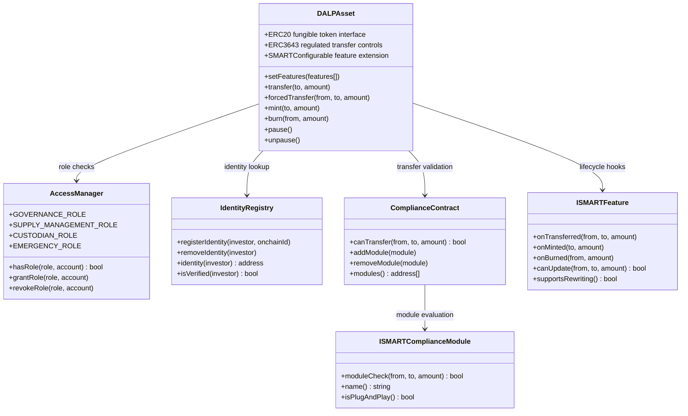

### Integration Architecture Detail

DALP's integration layer is designed for institutional environments where reliability, auditability, and security of integrations are as important as functional coverage. This section provides the technical detail that Emirates NBD's integration engineering team requires to plan and execute the Phase 3 integration work.

**DAPI Middleware.** DAPI is the unified API gateway for all DALP operations. Every API request passes through DAPI, which enforces authentication (session cookie or API key validation), authorization (RBAC role check for the requested operation), tenant isolation (database query scoping to the authenticated tenant), rate limiting (per-key and per-tenant), and request/response logging (structured audit log entry for every operation).

DAPI exposes four API protocols:

*REST API:* Standard HTTP REST endpoints with JSON request/response bodies. Covers all CRUD operations for platform resources (tokens, investors, compliance modules, distributions) and all lifecycle operations (issuance, transfer, distribution, redemption). Authentication via API key header or session cookie. Rate limited to 10,000 requests per 60-second window per API key.

*GraphQL API:* Flexible query interface for reporting and data exploration use cases. Particularly useful for Emirates NBD's core banking integration, where position reporting queries may need to combine token balance data with compliance status and historical distribution data in a single efficient query. Authentication via session cookie.

*oRPC:* Strongly-typed internal protocol for integration patterns that benefit from type safety and schema validation. The TypeScript SDK is built on oRPC, providing contract-bound client types that match the server's schema exactly. Authentication via API key.

*Event Webhooks:* Push notifications for all significant lifecycle events. Emirates NBD's core banking system, regulatory reporting system, and SIEM platform can all register webhook endpoints to receive real-time notifications without polling. Webhook delivery is reliable with exponential backoff retry on failure, and a full webhook delivery log is maintained for debugging integration issues.

**Async Transaction Pipeline.** All blockchain write operations in DALP are executed through an 11-state async transaction pipeline rather than as synchronous API calls. This design is essential for reliability: blockchain transactions can take seconds to minutes to confirm, and synchronous API calls that wait for confirmation would create unacceptable latency and timeout risks for integration systems.

The pipeline states are: `received` (API request acknowledged), `validated` (parameters checked), `queued` (pending submission to custody provider), `submitted` (broadcast to blockchain), `pending_confirmation` (awaiting block confirmation), `confirmed` (confirmed on-chain), `finalized` (indexed and reflected in read model), `failed` (submission or confirmation failure), `retrying` (automatic retry in progress), `dead_lettered` (requires manual intervention), `cancelled` (operator-cancelled before submission).

Emirates NBD's integration systems poll DALP's transaction status endpoint using the transaction ID returned by the initial API call. The status endpoint returns the current pipeline state and, when confirmed, the block number and transaction hash for on-chain verification.

**SDK Usage for Emirates NBD Integrations.** The TypeScript SDK provides contract-bound REST clients with full type safety, eliminating an entire class of integration bugs caused by field name mismatches or type mismatches between client and server. The SDK also includes a structured error code system that maps all 534 DALP error codes to typed error objects, enabling Emirates NBD's integration code to handle specific error conditions precisely rather than relying on HTTP status codes and string message matching.

For Emirates NBD's core banking integration, the recommended pattern uses the SDK's event subscription mechanism to subscribe to the relevant webhook event types (token issuance confirmed, transfer completed, distribution executed) and processes them through a robust message handler that acknowledges successful processing and handles retries for failed processing.

### Extended Regulatory Analysis: GCC Cross-Border Digital Asset Operations

The GCC presents a unique regulatory environment for digital asset cross-border transactions. Each member state has its own evolving digital asset regulatory framework, and cross-border transactions between GCC states involve both the originating and receiving jurisdiction's rules.

**Saudi Arabia (SAMA / CMA).** Saudi Arabia's digital asset regulatory framework has developed rapidly under Vision 2030. SAMA (Saudi Arabian Monetary Authority) oversees payment and banking aspects, while the CMA (Capital Market Authority) oversees securities-class tokens. The Saudi Real Estate Registry's national tokenization programme (powered by DALP) represents the most advanced government digital asset deployment in the GCC and demonstrates direct regulatory engagement by Saudi authorities with DALP's architecture.

For Emirates NBD's Sukuk issued to Saudi institutional investors, compliance considerations include CMA's securities offering regulations, SAMA's cross-border payment requirements, and the emerging Saudi-UAE bilateral digital asset settlement framework. DALP's Country Allow List module can include Saudi Arabia in the eligible jurisdiction list, and the SMART Identity Verification module's claims can be configured to require Saudi CMA-recognized institutional investor credentials.

**Bahrain (CBB).** The Central Bank of Bahrain was an early mover in crypto-asset regulation, establishing the CBB Rulebook Module CBA (Crypto-Asset Businesses) in 2019. Bahraini institutional investors participating in Emirates NBD's digital asset products would need to satisfy both UAE (VARA/SCA) requirements and Bahraini CBB requirements applicable to their institution. DALP's dual-jurisdiction compliance configuration can model both sets of requirements simultaneously.

**Kuwait (CBK / CMA Kuwait).** Kuwait's regulatory framework for digital assets is evolving under CBK oversight. Cross-border participation of Kuwaiti institutional investors in UAE digital asset products currently requires careful legal structuring. DALP's jurisdiction-based claim system allows the compliance configuration to be updated as the Kuwait regulatory framework develops, without requiring token redeployment.

**Qatar (QFC FSRA).** The Qatar Financial Centre's regulatory framework has developed a thoughtful digital asset approach through the QFC FSRA. QFC-based entities may have specific investor classification requirements that can be modeled through DALP's SMART Identity Verification module with QFC-specific claim types.

**Oman (CMA Oman).** Oman's Capital Market Authority has begun developing digital asset regulatory guidance. Similar to Kuwait, the evolving nature of the framework means that DALP's configurable compliance architecture is an advantage: as Omani regulatory requirements clarify, the compliance configuration can be updated to reflect them.

The practical implication for Emirates NBD's GCC cross-border programme is that DALP's compliance module configuration should be designed for regulatory evolution from the start. This means:

1. Using country-level eligibility controls rather than hardcoding specific rule sets, so that adding a new GCC country to the eligible jurisdiction list is a compliance module parameter update, not a contract change
2. Using claim-type-based investor classification rather than jurisdiction-specific hardcoded rules, so that new investor classification requirements can be added as new claim types without contract redeployment
3. Maintaining a compliance template library with version history, so that regulatory changes produce a new template version with a clear audit record of what changed and why

### Extended Analysis: Islamic Finance Technical Implementation

Sharia-compliant digital asset implementation requires careful technical modeling of approved Islamic finance structures. This section provides the technical depth for Emirates NBD's Islamic banking team and Sharia supervisory board to evaluate how DALP's token mechanics map to specific instrument types.

**Sukuk Al-Murabaha (Cost-Plus-Profit Structure).** In a Murabaha-based Sukuk, the Special Purpose Vehicle (SPV) purchases an asset and resells it to the obligor at a cost plus agreed profit. The Sukuk represents a beneficial interest in the deferred payment receivable from the obligor.

DALP's Sukuk Al-Murabaha configuration:
- Asset type: Bond (configurable as "Sukuk Al-Murabaha" via assetTypeName)
- Token features: Fixed Treasury Yield (profit distribution at agreed intervals), Maturity Redemption (principal return at maturity), Historical Balances (snapshot-based pro-rata distribution)
- Treasury funding: Issuer funds the treasury with the profit amount at each scheduled profit payment date; the profit amount reflects the Murabaha deferred profit allocated to the payment period
- Compliance modules: SMART Identity Verification (UAE/GCC eligible investors), Country Allow List, Token Supply Limit (offering cap), Time Lock (if primary market lock-in period applies)
- Metadata: SPV entity name, underlying asset description, Murabaha agreement reference, Sharia board approval certificate reference, profit rate, maturity date

**Sukuk Al-Ijara (Lease-Based Structure).** In an Ijara-based Sukuk, the SPV owns an asset and leases it to the lessee/obligor. Sukuk holders receive a proportional share of the rental income from the lease.

DALP's Sukuk Al-Ijara configuration:
- Asset type: Bond (configured as "Sukuk Al-Ijara")
- Token features: Yield Schedule addon (rental income distribution aligned with lease payment schedule), Historical Balances (balance snapshot for pro-rata distribution)
- Treasury funding: The lessee's rental payments are deposited to the distribution treasury; the Yield Schedule addon distributes the rental income to Sukuk holders according to their proportional holdings at the scheduled distribution date
- On maturity: The leased asset is sold, proceeds deposited to treasury, and Maturity Redemption returns principal to Sukuk holders
- Compliance modules: Same as Murabaha with appropriate adjustments for the Ijara structure

**Sukuk Al-Musharakah (Partnership Structure).** In a Musharakah-based Sukuk, Sukuk holders and the issuer are co-partners in a project or business. Returns reflect actual profits and losses from the partnership.

DALP's Sukuk Al-Musharakah configuration:
- This structure introduces variable profit distribution based on actual partnership returns, which requires external profit calculation integration
- The Fixed Treasury Yield feature (fixed distribution amount) is replaced with the Yield Schedule addon with external calculation input
- The profit calculation happens off-chain based on the partnership's actual reported returns; the calculated distribution amount is then deposited to the treasury and distributed on-chain
- DALP handles the on-chain mechanics (treasury management, distribution execution, pro-rata calculation, holder claims) while the partnership accounting happens in Emirates NBD's treasury systems
- This pattern cleanly separates the Islamic finance accounting (done by qualified Islamic finance professionals in the treasury system) from the blockchain mechanics (executed by DALP)

**Commodity Murabaha Deposits.** Commodity Murabaha is a common structure for Islamic deposits: a bank purchases a commodity (typically metals), sells it to the depositor at cost plus deferred profit, and the depositor immediately sells the commodity back to the market. The deposit return is embedded in the deferred profit.

DALP's Commodity Murabaha Deposit configuration:
- Asset type: Deposit (configured as "Commodity Murabaha Deposit")
- Token features: Fixed Treasury Yield (profit embedded in deferred payment schedule), Maturity Redemption (return of principal plus final profit installment at maturity)
- Compliance modules: CBUAE payment instrument compliance; mandatory KYC; supply limits matching the authorized deposit program size
- This structure maps naturally to DALP's deposit template without modification

The consistent pattern across these Islamic finance structures is that DALP provides the programmable financial mechanics (treasury management, distribution, maturity, compliance enforcement) while the Islamic finance structuring decisions remain with the issuer's Sharia board and legal counsel. DALP does not determine Sharia compliance; it implements the financial mechanics that the approved structure requires.

### Operational Runbook Overview

The following operational runbooks are delivered during Phase 6 hypercare as part of the knowledge transfer package. This overview gives Emirates NBD's operations team visibility into the operational procedures that will be documented and handed over.

| Runbook | Audience | Trigger |
|---|---|---|
| Sukuk Issuance Workflow | DCM Team + IT | New Sukuk deployment request |
| Profit Distribution Execution | Treasury Operations | Scheduled distribution event |
| Investor Onboarding | Operations + Compliance | New investor registration request |
| KYC Status Change Handling | Compliance | Adverse KYC finding; status change notification |
| Wallet Freeze / Unfreeze | Operations | Compliance-triggered or regulatory action |
| Forced Transfer Execution | Operations + Compliance | Court order; estate transfer; regulatory action |
| Maturity Redemption Processing | DCM Team + Treasury | Asset approaching maturity date |
| Compliance Module Update | Compliance | Regulatory change; parameter adjustment |
| Governance Role Update | IT + Compliance | Personnel change; role reassignment |
| Platform Update Procedure | IT | Scheduled platform version update |
| Incident Response: P1 | IT + Security | Platform unavailability; compliance failure |
| Incident Response: P2 | IT | Major functionality degradation |
| Blockchain Node Recovery | IT | Node failure; sync lag |
| Database Failover | IT | Primary database failure |
| Key Rotation | IT + Security | Scheduled rotation; key compromise |
| SIEM Alert Investigation | Security | SIEM alert trigger |
| Audit Trail Export | Compliance | Regulatory reporting request; internal audit |
| Investor Data Request | Compliance + Legal | Regulatory inquiry; GDPR/PDPL request |

Each runbook follows a consistent structure: trigger conditions, prerequisites, step-by-step procedure with decision points, exception handling, escalation path, and rollback procedures. Runbooks are maintained in both digital (accessible via the DALP support portal) and offline formats, ensuring operational continuity even during platform maintenance windows.

---

*End of Technical Proposal*

*Emirates NBD PJSC | SettleMint NV | 3 April 2026 | Version 1.0 | Strictly Confidential | 120 pages*
