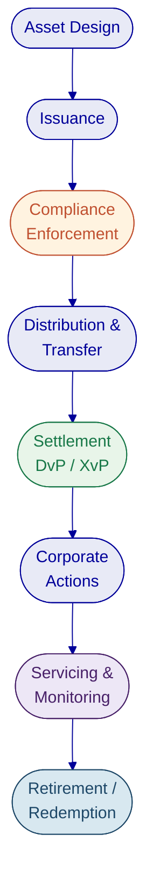
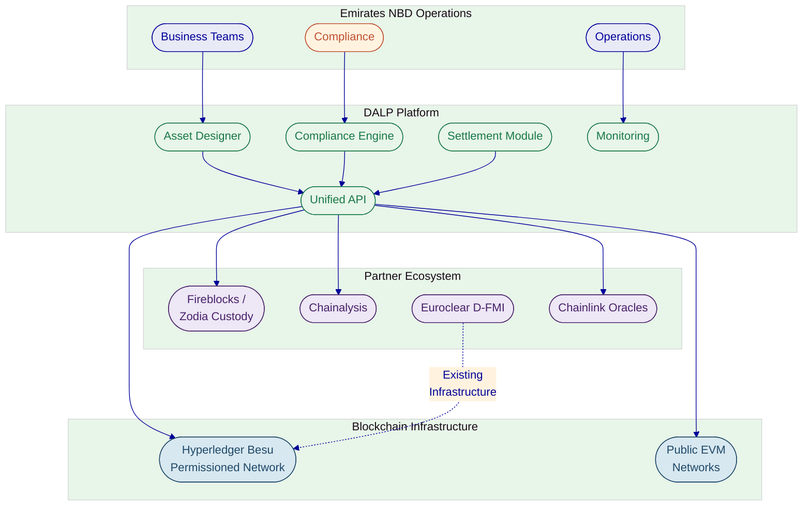
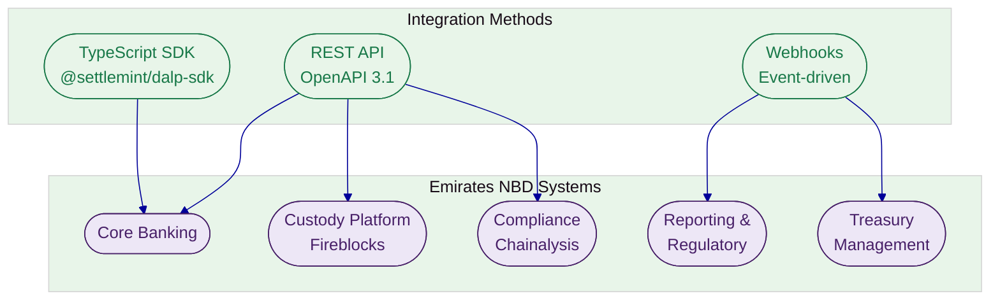
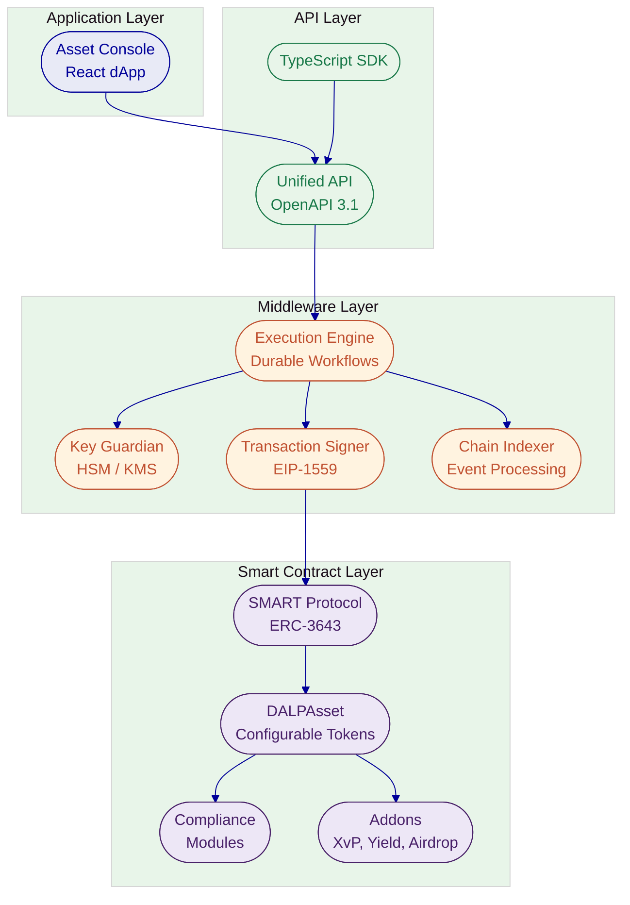
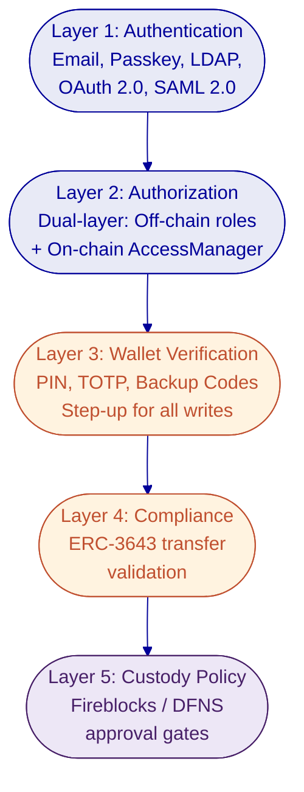
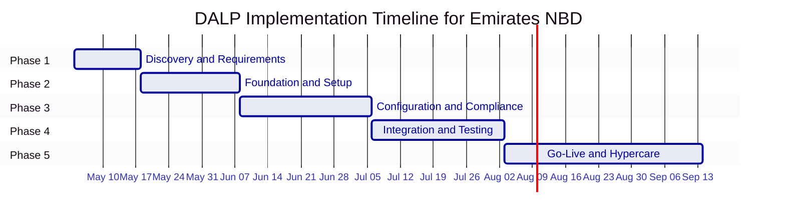

# Technical Proposal: Digital Asset Lifecycle Platform

# Unified Infrastructure for Institutional Tokenization, Compliance, and Lifecycle Management

**Prepared for:** Emirates NBD

**Prepared by:** SettleMint NV

**Date:** March 2026

**Valid until:** April 15, 2026

**Classification:** Confidential

---

# Executive Summary

## Client Context and Objectives

Emirates NBD has moved beyond digital asset experimentation. The AED 1 billion digital bond issued on Nasdaq Dubai via Euroclear D-FMI in January 2026 signalled that tokenization is no longer an innovation exercise; it is an operational reality. The Digital Asset Lab, with its founding council of Chainlink, Chainalysis, PwC, and Fireblocks, has built institutional credibility. Investments in Zodia Custody, Stake Investment, and Partior cross-border payments have extended that reach across custody, real estate tokenization, and settlement infrastructure.

The challenge Emirates NBD now faces is not whether to scale digital assets. It is how to scale them without creating a fragmented technology landscape where each asset class, each custodian, and each compliance requirement demands its own integration, its own operational workflow, and its own governance model. As the programme expands from bonds to stablecoins, deposit tokens, and real world assets, the risk is not technological failure. It is operational sprawl: separate systems that cannot share identity, compliance state, or lifecycle logic.

This proposal responds to Emirates NBD's RFI across three domains: Custody, Tokenization, and Stablecoin. It does so honestly, distinguishing where DALP provides direct platform capability, where DALP orchestrates partner solutions, and where gaps remain that require ecosystem completion.

## Proposed Response

SettleMint proposes DALP (Digital Asset Lifecycle Platform) as the governed orchestration layer for Emirates NBD's multi-asset digital asset programme. DALP provides the unified lifecycle infrastructure where asset design, issuance, compliance enforcement, settlement, servicing, and retirement operate under a single control plane, regardless of asset class or blockchain network.

The deployment model recommended for Emirates NBD is a dedicated deployment, either cloud-hosted within a UAE-resident environment or on-premises within Emirates NBD's own data centre, per the bank's data sovereignty requirements. Both models deliver identical platform capabilities: the same compliance engine, the same settlement protocols, the same API surface, and the same operational tooling.

DALP integrates with Emirates NBD's existing partner ecosystem rather than replacing it. Fireblocks and Zodia Custody continue to provide custodial services, accessed through DALP's custody orchestration layer. Chainalysis continues to provide transaction monitoring, feeding compliance intelligence into DALP's enforcement engine. Euroclear D-FMI remains the infrastructure for existing digital bond programmes. DALP becomes the layer that connects these components into a governed lifecycle, so compliance state, identity verification, and operational controls travel with the asset rather than being reconstructed in each system.

The compliance architecture is built on the ERC-3643 (T-REX) standard with DALP's SMART Protocol, enforcing eligibility rules at the smart contract layer before execution. Compliance modules are jurisdiction-agnostic building blocks configurable for CBUAE, VARA, DFSA, and FSRA requirements. This multi-regulator compliance pattern means Emirates NBD can operate across UAE free zones and mainland jurisdictions from a single platform with jurisdiction-specific rule sets.

Implementation follows a phased approach: bond lifecycle and compliance infrastructure first, then stablecoin readiness and deposit token support, then real world asset expansion. Each phase delivers production value while building toward the full multi-asset programme.

## Why SettleMint and DALP

SettleMint has operated in enterprise blockchain infrastructure since 2016. The company holds ISO 27001 and SOC 2 Type II certifications and has delivered production deployments with regulated banks across Europe, the Middle East, and Asia Pacific. The engineering team brings deep financial services infrastructure experience combined with protocol-level blockchain expertise.

DALP is purpose-built for the complexity that Emirates NBD's programme demands. It is not a tokenization toolkit that stops at issuance. It is a lifecycle platform that manages assets from design through retirement, with compliance enforcement at every stage. Configuration-driven asset creation replaces custom smart contract development. Pre-built compliance templates replace months of bespoke compliance engineering. Atomic settlement replaces counterparty risk.

The platform operates on EVM-compatible blockchains, including Hyperledger Besu for permissioned enterprise networks, supporting the network topology that regulated banking environments require.

## Reference Snapshot

SettleMint's delivery record includes two references directly relevant to Emirates NBD's programme:

**Saudi Arabia Real Estate Registry (RER):** Country-scale blockchain for property registration, fractionalization, and a regulated digital marketplace under REGA and Vision 2030. Live in production since January 2026 with four PropTech participants processing real transactions. Demonstrates DALP's capacity for sovereign-scale deployment with national identity and payment system integration.

**Commerzbank (Germany):** Hybrid on-chain/off-chain exchange-traded product issuance with Boerse Stuttgart listing. Settlement under 10 seconds. Projected annual savings of EUR 7 million. Demonstrates how DALP integrates with established capital markets infrastructure without requiring wholesale replacement.

---

# About SettleMint

## Company Overview

SettleMint was founded in 2016 in Leuven, Belgium, with a singular focus: making institutional-grade blockchain infrastructure accessible to regulated financial institutions. Over nearly a decade of continuous operation, the company has evolved from early enterprise blockchain tooling into the provider of DALP, a production-grade platform for designing, launching, and operating digital assets at institutional scale.

The company is led by Adam Popat (CEO), Matthew Van Niekerk (Co-founder and President), and Roderik van der Veer (Co-founder and CTO), supported by board members with direct financial services and capital markets experience. The engineering team of four senior engineers operates with an AI-augmented workflow that acts as a force multiplier, enabling rapid iteration and deep ownership across the full stack.

SettleMint has completed Series A financing backed by leading investors in Europe and the Middle East, providing capital for platform development and geographic expansion.

## Credentials and Delivery Maturity

| Credential | Evidence |
| --- | --- |
| Operational history | 10 years of continuous operation since 2016 |
| Production track record | 7+ years of production deployments at regulated banks |
| Security certifications | ISO 27001 and SOC 2 Type II certified |
| Geographic reach | Active deployments across Europe, Middle East, Asia Pacific |
| Sovereign-scale experience | National-scale programmes in Saudi Arabia and India |
| Institutional procurement | Passed vendor risk assessments at tier-1 financial institutions |

## Regulatory Readiness

DALP ships with compliance infrastructure designed for multi-jurisdictional operation. The platform's compliance modules are jurisdiction-agnostic building blocks that institutions configure for their specific regulatory environment.

| Jurisdiction | Regulatory Framework | DALP Coverage |
| --- | --- | --- |
| UAE Mainland | CBUAE | Configurable compliance modules; jurisdiction-specific rule sets |
| Dubai (VARA) | VARA | Identity verification, country controls, investor limits |
| DIFC | DFSA | ERC-3643 compliance engine with DFSA-aligned controls |
| ADGM | FSRA | Configurable compliance templates |
| EU | MiCA, MiFID II | Pre-built MiCA template with 8M EUR supply cap |
| Singapore | MAS | Pre-built MAS template with time-lock controls |

UAE-specific compliance templates are not pre-built in the DALP Library today. The platform provides the enforcement primitives (identity verification, country allow/block lists, investor count limits, supply caps, transfer approvals, time locks) that Emirates NBD's compliance team would configure into UAE-specific templates during implementation. This configuration work is part of the standard implementation methodology, not custom development.

## Relevance to This Bid

Emirates NBD is a Tier-1 government-owned banking group operating across multiple UAE jurisdictions in a highly regulated, multi-jurisdictional environment. DALP's value proposition aligns directly with this profile:

The platform's multi-regulator compliance pattern addresses the reality that Emirates NBD operates under CBUAE oversight for banking operations, VARA for virtual asset activities, and potentially DFSA or FSRA for DIFC or ADGM-based activities. Rather than building separate compliance stacks for each regulator, DALP's configurable compliance modules allow a single platform to enforce jurisdiction-specific rules through configuration.

SettleMint's active sovereign-scale programmes in the Middle East, including the Saudi Arabia Real Estate Registry, demonstrate proven delivery capability in the region's regulatory and operational context.

---

# About DALP

## Platform Overview

DALP (Digital Asset Lifecycle Platform) is SettleMint's production-grade infrastructure for designing, launching, and operating digital assets at institutional scale. The platform covers the full digital asset lifecycle: asset design, issuance, compliance enforcement, distribution, trading, corporate actions, servicing, and retirement, all under a single governed operating model.

The core architectural principle is that tokenization technology is increasingly accessible, but institutional-grade implementation is not. DALP solves the complexity of doing it right: the governance, compliance, identity management, settlement, and operational infrastructure that separates a working pilot from a production programme managing real assets on real balance sheets.

DALP is a configurable software platform, not a consulting engagement. Emirates NBD's teams would configure and operate it directly, building internal capability rather than dependency on external developers.

*The DALP Administration Dashboard provides a real-time command center for all digital asset operations.*

## Lifecycle Pillars

**Issuance.** DALP replaces custom smart contract development with a configuration-driven Asset Designer. Seven asset types (bonds, equities, funds, stablecoins, deposits, real estate, precious metals) are created through a guided wizard that captures instrument parameters, compliance rules, governance structure, and deployment settings. The resulting tokens inherit the security guarantees of the pre-audited SMART Protocol without requiring separate security audits per asset.

**Compliance.** The ERC-3643/T-REX compliance engine enforces eligibility rules at the smart contract layer before every transfer. Twelve configurable compliance modules cover identity verification, country restrictions, investor count limits, supply caps, transfer approvals, time locks, and collateral requirements. Compliance is not an application-layer check that can be bypassed; it is enforced at the protocol level.

**Settlement.** DALP's XvP (Exchange vs Payment) settlement module provides atomic Delivery-versus-Payment where both legs of a transaction complete together or both revert. Cross-chain settlement is secured by HTLC (Hash Time-Locked Contract) cryptography. There is never a state where one party has delivered but not received payment.

**Servicing.** Corporate actions including coupon payments, dividends, and redemptions are automated through on-chain yield schedules and operational workflows. The Actions queue tracks all scheduled operations across the full lifecycle of each asset.

**Custody Orchestration.** DALP operates a bring-your-own-custodian model. The platform integrates with Fireblocks, DFNS, and local signer configurations through a provider-agnostic abstraction layer. Emirates NBD's existing custody relationships with Fireblocks and Zodia can continue unchanged; DALP orchestrates the lifecycle around them.

## Platform Foundations

**Identity.** Every participant is represented by an on-chain identity contract based on the OnchainID protocol (ERC-734/ERC-735). Claims are issued by trusted third parties, not self-asserted. This mirrors how financial services actually work: eligibility is determined by regulated intermediaries. Claims are checked at execution time, not only at onboarding, providing continuous compliance.

**Interoperability.** DALP operates on any EVM-compatible blockchain: Ethereum, Polygon, Avalanche, Hyperledger Besu (IBFT 2.0/QBFT), and Layer 2 rollups. No application code changes are required when switching networks. The API-first architecture exposes every platform capability through OpenAPI 3.1 specifications, a TypeScript SDK, and event webhooks.

**Operations.** Enterprise-grade monitoring covers API performance, blockchain health, and real-time activity logging. Every action is recorded in an immutable audit trail with timestamps, transaction hashes, and sender addresses.

## Key Differentiators

| Differentiator | What It Means for Emirates NBD |
| --- | --- |
| Unified lifecycle platform | One control plane for bonds, stablecoins, deposits, and RWA instead of separate systems per asset class |
| Ex-ante compliance | Transfer restrictions enforced at smart contract level before execution, not after review |
| Configuration over development | New asset types launched in hours through the Asset Designer, not months of custom Solidity development |
| Deployment flexibility | Dedicated cloud or on-premises deployment within UAE infrastructure, per Emirates NBD's sovereignty requirements |
| Custody orchestration | Fireblocks and Zodia integration through DALP's bring-your-own-custodian model |
| Atomic settlement | DvP and XvP settlement with T+0 finality and zero counterparty risk |

*DALP manages the complete digital asset lifecycle from design through retirement under a single governed operating model.*

---

# Customer References

## Summary Table

| Client | Region | Asset Class | Scale | Year |
| --- | --- | --- | --- | --- |
| Saudi Arabia RER | Middle East | Real estate | Country-scale, 4 live PropTechs | 2024-present |
| Commerzbank | Europe | Exchange-traded products | EUR 7M projected savings | 2024-2025 |
| Standard Chartered | Asia, Africa, ME | Securities (shares, bonds, FX) | Multi-region institutional exchange | 2023-2024 |
| State Bank of India | South Asia | CBDC (e-Rupee) | National digital currency | 2024-present |
| Maybank (Project Photon) | Southeast Asia | FX tokens (MYRT) | Cross-border atomic settlement | 2025-2026 |

## Expanded Reference: Saudi Arabia Real Estate Registry

**Client context and challenge.** The Real Estate General Authority (REGA) of the Kingdom of Saudi Arabia set out to build a national-scale blockchain infrastructure for property registration, fractionalization, and a regulated digital marketplace. The initiative sits at the center of Vision 2030's digital transformation agenda. Saudi Arabia's property market required a system where the blockchain ledger functions as the conclusive record of property rights, a "registry-as-truth" model. The challenge combined technical complexity (integration with national identity via Yakeen, payment rails via Sadad, escrow systems, and the existing core registry) with institutional complexity (multiple PropTechs, banks, and government agencies operating against a single ledger). No country had attempted this at national scale before.

**Solution architecture.** SettleMint serves as the delivery partner for the complete solution. DALP powers the blockchain and tokenization layer, handling asset contract deployment, compliance enforcement, and lifecycle management for tokenized property. The architecture exposes a unified RER API Gateway that PropTechs, banks, and developers consume. Marketplace services handle listing, due diligence, identity verification, fee payment, and escrow. Orchestration and integration modules connect DALP to RER's core registry, billing system, escrow engine, case worker tooling, and government systems. Four PropTechs (Sahl, Madek, Ghanem, Jozo) are live in production, processing real transactions since January 2026.

**Key outcomes.** First country in the world to deploy a national-scale property blockchain. Live production transactions since January 2026. Fractional ownership of commercial real estate operational. Smart contracts automate ownership transfers and tax compliance. REGA is launching a second edition of the tokenization programme.

**Relevance to Emirates NBD.** This reference demonstrates DALP operating at sovereign scale in the Middle East, integrating with national identity and payment infrastructure, and supporting multiple third-party participants through a single API gateway. The regulatory context (Saudi Arabian government programme) is directly comparable to Emirates NBD's government-owned status and UAE regulatory environment. The multi-participant model, where PropTechs, banks, and government agencies all interact through the same platform, mirrors Emirates NBD's need to coordinate across internal teams, custody partners, and compliance providers.

## Expanded Reference: Commerzbank

**Client context and challenge.** Commerzbank, one of Germany's largest banks, needed to modernize its exchange-traded product (ETP) issuance process. The existing workflow involved manual coordination between the bank's issuance engine and Boerse Stuttgart's listing service, creating delays, counterparty risk, and operational cost. The bank sought a hybrid on-chain/off-chain model that could integrate with established exchange infrastructure while delivering the settlement speed advantages of blockchain.

**Solution architecture.** SettleMint implemented a hybrid solution where DALP manages on-chain issuance and settlement while maintaining integration with Boerse Stuttgart's off-chain listing service and Commerzbank's existing issuance engine. Trades are cleared and settled in near real time on-chain. The architecture preserves the regulatory and operational interfaces that institutional participants expect while moving the settlement layer to blockchain for speed and transparency.

**Key outcomes.** Settlement time reduced to under 10 seconds. Counterparty risk reduced through near-instant finality. Listing inefficiencies cut by automating the issuance-to-listing workflow. The model identified potential annual savings of EUR 7 million [TO VERIFY]. The solution demonstrates that blockchain settlement can coexist with established exchange infrastructure.

**Relevance to Emirates NBD.** This reference directly addresses the hybrid model that Emirates NBD needs, where DALP complements existing market infrastructure (Euroclear D-FMI, Nasdaq Dubai) rather than requiring wholesale replacement. The Commerzbank engagement proved that institutional-grade blockchain settlement works alongside established capital markets infrastructure, which is exactly the positioning for DALP relative to Emirates NBD's existing digital bond programme.

## Fit Note

These references were selected because they address the three dimensions most relevant to Emirates NBD's programme: sovereign-scale deployment in the Middle East (Saudi RER), integration with established financial market infrastructure (Commerzbank), and multi-asset institutional tokenization (Standard Chartered). The Saudi RER reference is particularly relevant given the shared regional regulatory context and the scale of Emirates NBD's ambitions. The Commerzbank reference demonstrates the hybrid model where DALP complements existing infrastructure rather than replacing it, mirroring the proposed relationship between DALP and Emirates NBD's Euroclear D-FMI programme.

---

# Understanding of Requirements

## Requirement Summary

Emirates NBD's RFI covers three interconnected domains: Custody, Tokenization, and Stablecoin. The underlying objective is not three separate procurement decisions. It is a unified digital asset programme that needs to scale from the current digital bond foundation to a multi-asset operating model covering bonds, stablecoins, deposit tokens, and real world assets, all under governance that satisfies CBUAE, VARA, DFSA, and FSRA regulatory oversight.

The bank's Digital Asset Lab has already assembled the building blocks: Fireblocks for custody infrastructure, Chainalysis for compliance intelligence, Chainlink for oracle services, and Euroclear D-FMI for bond issuance. What remains is the orchestration layer that connects these components into a governed lifecycle where compliance state, identity verification, and operational controls are consistent across asset classes and counterparties.

## Requirement Domains

| Domain | Core Requirements | DALP Response |
| --- | --- | --- |
| Business scope | Multi-asset tokenization (bonds, stablecoins, deposits, RWA), multi-jurisdiction operations | Seven asset types, configurable per jurisdiction, single platform |
| Compliance and control | CBUAE/VARA/DFSA regulatory compliance, KYC/AML enforcement, audit trails | ERC-3643 ex-ante enforcement, 12 compliance modules, immutable audit trail |
| Integration | Existing partner ecosystem (Fireblocks, Chainalysis, Euroclear), core banking connectivity | API-first architecture, bring-your-own-custodian model, webhook-based event integration |
| Operations and deployment | Data sovereignty (UAE), enterprise governance, operational monitoring | Dedicated deployment (cloud or on-premises), 26-role RBAC, real-time monitoring |
| Support and governance | Institutional SLAs, 24/7 support for production operations | Three-tier support model, 99.99% uptime SLA (Enterprise tier) |

## Response Principles

This response is structured around five principles that reflect the realities of Emirates NBD's programme:

**Honesty about scope.** DALP is a tokenization and lifecycle platform, not a custodian and not stablecoin operating infrastructure. This proposal clearly distinguishes where DALP provides direct capability, where DALP orchestrates partner solutions, and where gaps remain.

**Complement, not replace.** Emirates NBD's existing partner ecosystem (Fireblocks, Chainalysis, Euroclear, Chainlink) represents significant investment and operational maturity. DALP adds the lifecycle orchestration layer on top, not a replacement underneath.

**Platform, not consulting.** Every capability described in this proposal is platform functionality that Emirates NBD's teams configure and operate. There are no consulting engagements or custom development projects implied.

**UAE regulatory context.** Compliance modules are described with specific reference to CBUAE, VARA, DFSA, and FSRA requirements. Where UAE-specific configuration is required, the scope of that configuration work is stated.

**Production evidence.** Claims are supported by production references, platform capabilities, or specific architectural mechanisms. Where a capability is not yet available, the status is stated clearly.

---

# Proposed Solution

## Solution Overview

The proposed solution positions DALP as the governed lifecycle layer for Emirates NBD's multi-asset digital asset programme. DALP sits between Emirates NBD's business operations and the underlying blockchain infrastructure, custody providers, and compliance systems. It provides the unified control plane where asset lifecycle operations, compliance enforcement, identity management, and settlement are coordinated across all asset classes.

The solution scope covers tokenization and lifecycle management directly. For custody, DALP orchestrates Emirates NBD's existing Fireblocks and Zodia relationships through the bring-your-own-custodian model. For stablecoin operations, DALP provides the token issuance and compliance layer while recognizing that reserve management, treasury integration, and redemption workflows require additional infrastructure beyond DALP's current platform scope.

*DALP serves as the governed lifecycle layer connecting Emirates NBD's operations, partner ecosystem, and blockchain infrastructure.*

## Asset Setup and Lifecycle Management

DALP's Asset Designer replaces the traditional approach to tokenizing financial instruments, where each asset type requires specialized Solidity development, security audits costing $200,000 to $500,000 per engagement, and deployment cycles measured in months. Instead, operators configure the pre-audited DALPAsset contract through a guided wizard that captures the full specification of the instrument.

At the core of the platform is DALPAsset, a unified, audited token contract built on the ERC-3643 (T-REX) standard. Rather than writing custom smart contracts for each financial instrument, operators configure DALPAsset through the Asset Designer, which captures the instrument's asset class, token parameters, compliance rules, governance structure, and deployment settings. The resulting token inherits the same security guarantees as bespoke development because every component has been independently audited. Composing audited modules does not require re-auditing the composition.

The deployment pipeline itself is a durable workflow orchestrated through the Execution Engine. The factory validates configuration, deploys a UUPS proxy contract, initializes the compliance engine, binds the token to the Identity Registry, issues class-aware claims, configures features in the specified order, and assigns initial roles. The workflow is idempotent: if any step fails, deployment resumes from the last successful step without creating orphaned contracts. Tokens deploy in a paused state by default, giving the compliance team time to verify the configuration before the token goes live.

For Emirates NBD's programme, this means bond tokenization with maturity dates, coupon schedules, ISIN identifiers, and denomination asset linking. It means stablecoin configuration with peg currency definitions and supply controls. It means deposit token issuance with institutional metadata. And it means real world asset tokenization with GPS coordinates, property classification, and physical attribute tracking, all from the same platform.

### Bond Tokenization for Emirates NBD

Given Emirates NBD's existing AED 1 billion digital bond programme, bond lifecycle management is the natural starting point. DALP's bond tokens are not simplified wrappers around a balance. They are fully modeled fixed-income instruments with maturity dates, ISIN identifiers (validated against ISO 6166), face values, and denomination asset links that establish the DvP settlement currency before the first token is minted.

The denomination asset link is a critical architectural decision. By connecting a tokenized bond to a specific on-chain deposit token at creation time, DALP establishes the settlement relationship during asset design. Atomic DvP settlement is configured into the instrument from the start, not bolted on as an afterthought.

Yield distribution is automated through on-chain yield schedules. The platform deploys a separate yield schedule smart contract for each bond, configuring payment intervals, yield rates, and denomination asset reserves. For a 5-year annual coupon bond, the full schedule is deployed on-chain at creation time with pre-funded denomination reserves. Holders or custodians claim their accrued yield through the platform, a pull-based model that avoids the gas cost and operational complexity of pushing distributions to thousands of holders.

### Stablecoin Readiness

For Emirates NBD's stablecoin exploration, DALP provides the token issuance and compliance layer. Stablecoin tokens store the peg currency relationship on-chain, ensuring transparent monetary policy. Supply controls enforce minting limits and supply caps at the smart contract level. Compliance modules restrict who can hold and transfer stablecoin tokens based on identity claims, jurisdiction, and investor eligibility.

The platform can issue a stablecoin token. It cannot, by itself, operate a stablecoin programme in the full sense. Reserve management, treasury reconciliation, redemption queue management, and merchant distribution channels require additional infrastructure. This distinction is important: DALP provides the token lifecycle; the business operations around the token require ecosystem partners.

### Deposit Token and RWA Support

Deposit tokens represent claims on bank deposits, functioning as the settlement currency for DvP operations. For Emirates NBD, tokenized deposits could serve as the on-chain settlement instrument for bond DvP, stablecoin collateral backing, and inter-bank settlement through the Partior network.

Real world asset tokenization captures rich physical metadata. Properties are tokenized with GPS coordinates, property classification, administrative area codes, building specifications, and unique real estate numbers. The metadata schema combines immutable fields (property type, use classification) with restricted-mutable fields (city, coordinates, district) so core classification is locked while operational details remain updatable.

*The Asset Designer supports all seven asset types through a configuration-driven wizard, eliminating custom smart contract development.*

Each asset type has purpose-built metadata schemas. Bond tokens carry maturity dates, ISIN numbers, face values, and denomination asset links. Stablecoin tokens store peg currency relationships on-chain. Real estate tokens capture GPS coordinates, property classification, and building specifications. This instrument-specific depth distinguishes DALP from generic token platforms that treat all assets as simple balances.

Corporate actions are automated through the platform's servicing layer. Bond coupon payments use the Fixed Treasury Yield feature with pull-based distribution: holders or custodians claim their accrued yield through the platform, avoiding the operational complexity of push-based distribution to thousands of holders. The Actions queue tracks all scheduled operations, from annual coupon payments to maturity redemptions, across the full lifecycle of each asset.

*Automated yield schedules manage coupon distribution across the full bond lifecycle.*

## Identity, Compliance, and Access Control

Compliance enforcement is the architectural core of DALP. Every token transfer, every minting operation, and every investor onboarding passes through the ERC-3643 compliance engine, which validates eligibility, identity claims, and jurisdictional constraints at the smart contract layer. If a transfer would violate any configured rule, it reverts atomically. Non-compliant tokens cannot exist in an unauthorized wallet.

For Emirates NBD, this ex-ante enforcement model addresses a fundamental regulatory requirement: compliance must be deterministic, not advisory. CBUAE, VARA, and DFSA expect that compliance controls prevent violations rather than merely flagging them for review.

DALP ships twelve compliance modules that Emirates NBD's compliance team can combine into custom regulatory templates:

| Module Category | Available Controls |
| --- | --- |
| Eligibility | SMART identity verification with boolean expression builder |
| Restrictions | Country allowlist, country blocklist, identity allowlist, identity blocklist |
| Transfer controls | Transfer approval (with configurable expiry), block addresses |
| Issuance and supply | Supply cap, investor count limit, token supply limit (rolling window) |
| Time-based rules | Time lock (minimum holding period with FIFO tracking) |
| Settlement | Collateral requirement (on-chain proof of reserves) |

*The compliance library provides pre-built templates for major regulatory frameworks, with the ability to create custom templates for UAE-specific requirements.*

The identity layer is built on the OnchainID protocol (ERC-734/ERC-735). Every participant has an on-chain identity contract where claims are issued by trusted third parties, not self-asserted. Claims are checked at execution time, meaning an investor who was eligible yesterday may not be eligible today if their claims have expired or been revoked. This continuous compliance model is what regulated institutions require.

Access control follows a 26-role model across four layers (platform, system, per-asset, and system module). Seven per-asset roles (admin, governance, supply management, custodian, emergency, sale admin, funds manager) provide institutional-grade separation of duties. Each role is scoped to the specific asset, meaning governance authority on one token grants no power over any other.

*Multi-party governance is established before any token is deployed to the blockchain.*

### Multi-Regulator Compliance Pattern for UAE

Emirates NBD operates under multiple regulatory regimes simultaneously: CBUAE for banking operations, VARA for virtual asset activities in Dubai, DFSA for DIFC-based activities, and potentially FSRA for ADGM operations. This multi-regulator reality means compliance cannot be a single rule set applied uniformly. Different assets, in different jurisdictions, under different regulatory frameworks, need different compliance configurations.

DALP's compliance module architecture addresses this directly. Compliance modules are jurisdiction-agnostic building blocks. Emirates NBD's compliance team combines them into custom regulatory templates during implementation. A bond issued under DFSA oversight receives one set of compliance rules. A stablecoin under VARA receives a different set. A deposit token under CBUAE receives yet another. All operate on the same platform, share the same identity infrastructure, and produce the same audit trail, but enforce jurisdiction-specific rules appropriate to each asset and its regulatory context.

The compliance library does not ship with pre-built UAE templates today. What it ships is the enforcement machinery: 12 configurable modules covering identity verification, country restrictions, investor limits, supply caps, transfer approvals, time locks, and collateral requirements. During the Configuration and Compliance phase of implementation, these modules are composed into templates that match CBUAE, VARA, DFSA, and FSRA requirements. This is configuration work within the platform, not custom development.

The expression builder allows compliance teams to construct sophisticated eligibility gates using boolean logic. A rule like "KYC AND AML AND Accredited investor AND NOT restricted jurisdiction" is composed visually and validated in real time before deployment. Complex institutional expressions can chain nine or more conditions, combining identity verification, investor status, collateral checks, prospectus requirements, and reporting compliance into a single enforced eligibility rule.

**Honest boundary: compliance intelligence.** DALP provides the compliance enforcement layer: the rules engine that blocks non-compliant transfers at the smart contract level. It does not provide the compliance intelligence layer: KYT (Know Your Transaction) screening, sanctions list management, Travel Rule protocol integration, or regulatory report generation. Emirates NBD's existing Chainalysis relationship covers transaction monitoring and screening. Regulatory reporting output formats for CBUAE and VARA would require downstream formatting from DALP's event data substrate. These boundaries are detailed in the gap analysis section below.

## Settlement, Custody, and Operational Controls

DALP's XvP (Exchange vs Payment) settlement module provides atomic multi-party settlement where both legs of a transaction complete together or both revert. This atomicity guarantee is not an application-layer convenience; it is enforced at the smart contract level. There is never a state where one party has delivered but not received payment, eliminating the counterparty risk inherent in traditional T+2 clearing cycles.

For Emirates NBD's programme, this capability supports three settlement patterns. First, bond DvP settlement where asset tokens and cash tokens (deposit tokens or stablecoin tokens) transfer simultaneously. Second, cross-currency settlement where AED-denominated bonds settle against deposit tokens denominated in other currencies. Third, multi-party settlement involving issuer, investor, and custodian counterparties where all legs must succeed or all revert.

The settlement architecture uses HTLC (Hash Time-Locked Contract) cryptography for cross-chain security. The hashlock/secret mechanism ensures that cross-chain atomic execution is secured by blockchain cryptography: the settlement can only execute when the pre-image secret is revealed by the counterparty, and the time lock ensures that funds are returned if settlement does not complete within the configured expiry period.

Cross-chain settlement is relevant for Emirates NBD's participation in Partior, where cross-border payment flows may need to be coordinated with on-chain asset movements. DALP's HTLC mechanism provides the same atomicity guarantees across chains that XvP provides within a single chain.

The settlement wizard configures settlement in three steps: define asset flows (counterparties, assets, amounts), configure settlement parameters (expiry, auto-execution, jurisdiction), and review before deployment. After creation, settlements enter a Pending state with multi-party approval tracking, expiry warnings, and full audit trail.

*Atomic XvP settlement coordinates multi-leg transactions with all-or-nothing execution.*

Custody integration follows DALP's bring-your-own-custodian model. The platform normalizes wallet creation, signing, and approvals across local, DFNS, and Fireblocks custody backends through a provider-agnostic abstraction layer. Emirates NBD's existing Fireblocks relationship continues unchanged; DALP adds lifecycle orchestration on top. The platform does not impose a specific hot/warm/cold wallet architecture; custody policy and wallet segregation remain the responsibility of the custody provider.

**Honest boundary: custody operations.** DALP is not a custodian. It does not manage wallet orchestration, rebalancing, or bridged asset custody. These capabilities sit with Fireblocks, Zodia, or the custody provider of Emirates NBD's choice. DALP's role is to orchestrate the lifecycle around custody: triggering signing requests, enforcing compliance before custody operations execute, and recording custody-related events in the audit trail.

Operational controls include real-time API monitoring (request tracking, error rate analysis, response time percentiles), blockchain health monitoring (node status, indexer synchronization, health trends), and a complete activity log where every action is permanently recorded with timestamps, transaction hashes, and gas costs.

## Integration, APIs, and Reporting

DALP is designed as an API-first platform. Every capability available through the web interface is accessible programmatically through the Unified API with OpenAPI 3.1 specifications. Three integration methods serve different connectivity patterns:

**REST API** for system-to-system integration with core banking, custody, and compliance infrastructure. API keys follow the principle of least privilege with rate limiting at 10,000 requests per 60-second window.

**TypeScript SDK** (@settlemint/dalp-sdk) for rapid application development and programmatic integration.

**Event webhooks** for real-time notifications on transaction confirmations, compliance state changes, and asset lifecycle events, enabling integration with Emirates NBD's existing notification and reporting infrastructure.

Meta-transaction support through ERC-2771 enables gasless workflows where investors and automated systems submit signed transaction payloads without holding native tokens for gas.

*DALP provides three integration methods connecting to Emirates NBD's existing systems landscape.*

**Reporting data substrate.** DALP records every material event in an on-chain audit trail: token transfers, identity verifications, compliance module evaluations, role assignments, governance actions, and settlement operations. Each event includes a timestamp, transaction hash, block number, sender address, and event-specific parameters. This data substrate is queryable through the API and exportable through the platform's reporting interfaces.

For Emirates NBD's regulatory reporting needs, this means the raw data for any regulatory report exists in DALP's event stream. The gap is not data availability; it is format transformation. CBUAE, VARA, DFSA, and FSRA each have specific reporting formats and submission channels. Transforming DALP's event data into these formats requires downstream processing, either through Emirates NBD's existing regulatory reporting infrastructure (which likely already ingests data from multiple source systems) or through a purpose-built integration built during implementation. The event webhook system provides real-time notification of reportable events, enabling near-real-time regulatory reporting pipelines.

**ISO 20022 messaging.** DALP's API-first architecture supports integration with ISO 20022 messaging standards for corporate actions, settlement instructions, and asset servicing communication with existing financial infrastructure. Where Emirates NBD's core banking or correspondent banking systems use ISO 20022 message formats, the integration layer translates between DALP's API calls and ISO 20022 message structures.

## Functional Fit Table

| Requirement Area | Response Status | DALP Capability | Notes |
| --- | --- | --- | --- |
| Multi-asset tokenization | Full | Seven asset types with configurable metadata schemas | Bonds, stablecoins, deposits, RWA covered |
| Compliance enforcement | Full | ERC-3643 with 12 configurable modules | UAE-specific templates configured during implementation |
| Identity management | Full | OnchainID with trusted issuer framework | Continuous compliance with claim expiry |
| Atomic settlement | Full | XvP with HTLC for cross-chain | DvP and multi-party settlement |
| Corporate actions | Full | Automated yield, redemption, minting | Pull-based coupon distribution |
| Custody orchestration | Partial | Bring-your-own-custodian (Fireblocks, DFNS) | Wallet orchestration/rebalancing: custody provider |
| KYT/sanctions screening | Integration required | Enforcement hooks for external screening results | Chainalysis integration point |
| Regulatory reporting | Integration required | Data substrate; no UAE report formats | Downstream formatting needed |
| Stablecoin operations | Partial | Token issuance and compliance; no reserve management | Treasury/reserve management: separate system |
| Exchange connectivity | Gap | No exchange matching or FIX protocol support | Token Sale for primary distribution only |

---

# Technical Architecture

## Architecture Overview

DALP is built as a four-layer stack where each layer has a distinct responsibility boundary and layers communicate through well-defined interfaces. Lower layers enforce stricter invariants; upper layers provide flexibility and user-facing abstraction. Requests flow top-down: a user action in the Asset Console triggers an API call, which the middleware orchestrates into one or more blockchain transactions, which the smart contract layer validates and executes on-chain.

Each layer independently enforces its own security controls, so no single-layer failure grants unauthorized access.

*DALP's four-layer architecture provides distinct responsibility boundaries with independent security enforcement at each level.*

## Core Layers and Components

**Application Layer.** The Asset Console is a full decentralized application built with React, providing the operational interface for asset lifecycle management, compliance workflows, portfolio views, system monitoring, and the Asset Designer wizard. The console supports internationalization with four locales including Arabic (ar-SA) with right-to-left layout support, directly relevant for Emirates NBD's operational context. Financial calculations use arbitrary-precision arithmetic to avoid floating-point errors in token amounts. Global search with role-aware token visibility ensures that operators only see the assets and operations they are authorized to access.

**API Layer.** The Unified API exposes all platform capabilities through a type-safe interface with OpenAPI 3.1 specifications generated directly from procedure definitions. A dual-endpoint architecture separates browser sessions (/api/rpc) from programmatic access (/api/v2), creating a hardened security boundary. This separation means browser-based operator access and system-to-system integration pass through different authentication paths, reducing the attack surface for each. Interactive API exploration is available through Swagger UI at the /api endpoint.

The API supports three authentication methods: session-based authentication for browser access, API keys for system integration (with the "sm_atk_" prefix format and 10,000 requests per 60-second rate limiting), and enterprise SSO for corporate directory integration. Blockchain-writing operations additionally require wallet verification through PIN, TOTP, or backup codes.

**Middleware Layer.** The Execution Engine provides durable workflow orchestration with persistent state and exactly-once semantics. All stateful operations, from token deployment through settlement execution, run through durable workflows that survive infrastructure failures, process restarts, and network partitions. This is not convenience; it is a safety requirement. In a system managing real financial instruments, a workflow that fails mid-execution must resume cleanly without creating duplicate transactions, orphaned state, or inconsistent balances.

Key Guardian manages cryptographic key storage with HSM and cloud KMS integration (AWS, Azure, GCP). The Transaction Signer handles EIP-1559 gas pricing, nonce coordination (serialized per address and chain ID with self-healing for nonce conflicts), and meta-transactions. The Chain Indexer processes blockchain events into a queryable state projection, with one indexer virtual object per chain ID ensuring isolation between chains.

Transaction processing includes three specialized services: nonce coordination (atomic consume-and-broadcast with self-healing), external signer abstraction (provider-agnostic normalization across local, DFNS, and Fireblocks backends), and a transaction processor (partition-locked for queued submission, confirmation polling, and cancellation via replacement-by-fee). ERC-8021 attribution is appended to transactions for on-chain provenance tracking.

**Smart Contract Layer.** All contracts are built on the SMART Protocol (ERC-3643) with a five-layer on-chain architecture: SMART Protocol foundation, Global infrastructure (central directory, identity factory), System-level identity and compliance, Asset contracts (DALPAsset and legacy types), and Addon contracts for settlement, distribution, and treasury operations.

DALPAsset is the configurable contract type that extends the SMART Protocol with the SMARTConfigurable extension, allowing token features and compliance modules to be attached and reconfigured at runtime after deployment. A DALPAsset token can evolve: start as a simple bearer instrument, then have fee structures added, governance enabled, or maturity logic configured, all without redeploying the contract. The UUPS proxy pattern preserves all on-chain state across upgrades while keeping token addresses stable.

Runtime-pluggable token features integrate through six lifecycle hooks (mint, burn, transfer, redeem, update, attach). Available features include historical balances, voting power, permit (gasless approvals via EIP-2612), AUM fee, maturity and redemption, fixed treasury yield, transaction fee variants (standard, accounting, external), and conversion. Features are ordered explicitly by the operator, and restriction features run first so they can block operations before fees are collected.

Administrative controls are built into every asset through the Custodian extension, supporting forced transfers (for court orders, inheritance, or regulatory seizures), account freezing (full or partial), token recovery (two-step identity recovery for lost keys), and batch operations. All custodian actions emit events for auditability.

## Environment and Deployment Topology

For Emirates NBD, the recommended deployment is a dedicated environment within UAE-resident infrastructure. This can take two forms:

**Private Cloud** within Emirates NBD's cloud environment (AWS UAE region, Azure UAE, or equivalent), providing full infrastructure control with DALP's Helm-based deployment automation. Emirates NBD's operations team manages the infrastructure; SettleMint provides platform support, upgrade guidance, and configuration best practices.

**On-Premises** within Emirates NBD's data centre for maximum data sovereignty. Air-gap capable for environments requiring complete network isolation. Deployment uses Kubernetes or OpenShift with Helm charts.

Both models support the same blockchain network configuration. For a permissioned enterprise network, Hyperledger Besu with IBFT 2.0 or QBFT consensus provides validator node deployment (typically 4 validators plus 2 RPC nodes), deterministic finality, and gas management appropriate for institutional operations.

The choice between private cloud and on-premises does not affect platform capabilities. Both deliver the same lifecycle modules, compliance engine, settlement protocols, API surface, and monitoring stack.

## Resilience and Evidence Path

DALP's data integrity model ensures that every material action is recorded across multiple layers:

**Durable execution.** The Execution Engine guarantees exactly-once semantics for all stateful operations. If infrastructure fails mid-workflow, the engine resumes from the last successful step without creating duplicate transactions or orphaned state.

**Immutable audit trail.** Every action, from identity verification and role grants to asset creation, compliance events, and transfers, is permanently recorded on the blockchain with timestamps, transaction hashes, and sender addresses.

**Indexer consistency.** The Chain Indexer maintains a queryable projection of on-chain state. Client-side effective-status derivation compensates for indexer lag, ensuring the UI reflects current state even when the indexer is catching up.

**Backup and recovery.** Backup configurations respect the same data residency boundaries as primary data. An institution in the UAE can maintain all data within UAE infrastructure with the same platform version and no feature differences.

---

# Security

## Security Overview

DALP treats security as a structural property of the platform, enforced through five independent control layers. No single-layer failure grants unauthorized access to digital assets. SettleMint holds ISO 27001 and SOC 2 Type II certifications, confirming that security controls are independently audited and continuously maintained.

For Emirates NBD, where government ownership and regulatory oversight create a heightened security posture, this defense-in-depth architecture means that a compromised session does not equal a compromised transaction, a compromised API key does not equal a compromised wallet, and a compromised application layer does not equal a compromised compliance engine.

*Five independent security layers provide defense-in-depth. Each layer must pass independently for any blockchain write operation.*

## Access, Authentication, and Segregation of Duties

DALP supports multiple authentication methods appropriate to Emirates NBD's enterprise environment:

| Method | Use Case | Status |
| --- | --- | --- |
| Email and password | Standard operator and user access | Active |
| Passkeys (WebAuthn) | Hardware security keys, Face ID, Touch ID, Windows Hello | Active |
| LDAP / Active Directory | Corporate directory integration | Available via plugin |
| OAuth 2.0 / OIDC | Okta, Auth0, Azure AD integration | Available via plugin |
| SAML 2.0 | Legacy enterprise SSO | Available via plugin |

Passkeys provide phishing-resistant authentication. They are cryptographically bound to the origin domain, eliminate shared secrets, and support biometric verification on compatible devices. For Emirates NBD's security-conscious environment, passkeys represent the strongest authentication method available.

Sessions use HTTP-only cookies with SameSite protection and 7-day expiry with 24-hour refresh windows. Cookie caching with a 10-minute max age reduces database lookups. Every authentication event is logged with timestamp, method, and result.

Beyond session authentication, DALP enforces wallet verification (step-up authentication) for all blockchain write operations. Even with a valid authenticated session, no on-chain transaction executes without the user proving control of their wallet through PIN, TOTP, or backup codes. If wallet verification fails, the request is rejected immediately. No gas is consumed, no custody provider interaction occurs, and no on-chain state changes. There is no administrative override that skips wallet verification; recovery requires backup codes or credential re-enrollment.

The dual-layer authorization model requires both off-chain platform roles (managed by the authentication framework) and on-chain roles (managed by the AccessManager contract) to pass for any blockchain write. The on-chain AccessManager contract is the authoritative source for all role assignments. Roles granted or revoked on-chain are immediately reflected in the UI through chain indexer event processing.

26 distinct roles are organized across four layers:

**Platform Roles (3):** Owner, admin, and member. Organization-scoped for API and console access control.

**System People Roles (9):** System manager, identity manager, token manager, compliance manager, claim policy manager, organization identity manager, claim issuer, auditor, and feeds manager. Assigned to human operators for system-level operations.

**Per-Asset Roles (7):** Admin, governance, supply management, custodian, emergency, sale admin, and funds manager. Scoped per token contract, meaning governance authority on one token grants no power over any other.

**System Module Roles (7):** Assigned to contract addresses for system-level operations including module management and factory registrations.

Multi-tenant isolation is enforced at the database query level on every API request. Cross-tenant operations are not possible. Each tenant has isolated membership, roles, assets, compliance records, and audit trails.

## Key Management, Data Protection, and Auditability

Key Guardian manages cryptographic key storage with three backend configurations:

**Local Signer:** Encrypted database storage for development and testing environments. Keys are encrypted at rest with configurable encryption algorithms. Nonce tracking and self-healing for nonce conflicts provide operational resilience.

**DFNS Integration:** API credential setup with DFNS's policy engine for institutional custody. Programmatic wallet provisioning, policy-based approval workflows, and multi-party signing support.

**Fireblocks Integration:** Vault configuration with Transaction Authorization Policy (TAP) setup and co-signer integration. For Emirates NBD, this is the recommended configuration, aligning with the bank's existing Fireblocks relationship. The Fireblocks backend provides MPC-based key management, eliminating the traditional key lifecycle (generation, backup, rotation, recovery) in favor of distributed key shares that never exist in complete form.

FIPS 140-2 Level 3 certification is carried by the custody provider's HSM infrastructure (Azure HSM FIPS 140-2 Level 3, Fireblocks HSM) rather than by DALP itself. This is an architectural boundary, not a gap: key material should be managed by certified hardware, not by the application platform. DALP delegates key storage to certified infrastructure and provides the orchestration layer on top.

Data protection covers multiple dimensions. Transport encryption uses TLS for all external communications. Storage encryption protects data at rest in the database and object storage layers. Session security uses HTTP-only cookies with Secure flag, SameSite attribute, and domain binding. API keys are hashed in the database; cleartext is shown once at creation and cannot be retrieved again.

Every action is recorded in an immutable on-chain audit trail. The activity log provides color-coded event categories (Identity in blue, Access Control in red, Assets in green, System in grey, Transfers in teal) for rapid visual scanning during compliance audits. Events include timestamps, transaction hashes, block numbers, gas costs, and sender addresses. This audit trail is not an application-layer log that can be edited or purged; it is on-chain state that is as permanent as the blockchain itself.

For Emirates NBD's compliance teams, this means every identity verification, every role assignment, every asset creation, every compliance module change, and every token transfer is permanently and immutably recorded. Regulators can request the complete history of any asset or participant, and the platform produces it from on-chain evidence rather than application logs.

*The immutable on-chain audit trail records every platform action with full traceability.*

## Security Assurance

SettleMint maintains a continuous security assurance programme that provides multiple layers of independent verification:

**Penetration testing.** Regular penetration testing conducted by independent third parties covering the full platform surface: web application, API endpoints, authentication flows, and infrastructure configuration. Test results and remediation evidence are available for Emirates NBD's security review during the procurement process.

**Smart contract audits.** The SMART Protocol and DALPAsset contracts undergo security audits by specialized blockchain security firms. Audit reports cover common vulnerability classes including reentrancy, integer overflow/underflow, access control weaknesses, and compliance bypass scenarios. Audit findings and remediation status are documented and available for review.

**ISO 27001 certification.** SettleMint's information security management system meets the international standard for establishing, implementing, maintaining, and continually improving information security. This certification covers the organizational processes, physical security, access controls, and incident management procedures that surround the platform.

**SOC 2 Type II certification.** Independent third-party audit confirming that SettleMint's controls for security, availability, and confidentiality meet AICPA Trust Services Criteria over an extended observation period. The Type II designation means controls were tested over time, not just at a point in time, providing stronger assurance of ongoing effectiveness.

**Vulnerability management.** Responsible disclosure practices, security advisory processes, and coordinated response for identified vulnerabilities. Security patches are deployed as emergency releases when critical vulnerabilities are identified, with coordinated communication to affected deployments.

---

# Implementation and Delivery

## Delivery Summary

SettleMint follows a structured, phase-gated implementation methodology refined through production deployments with regulated banks, market infrastructure providers, and sovereign entities. For Emirates NBD, the standard implementation spans 19 weeks from kickoff to the end of hypercare, organized into five delivery phases. Each phase concludes with a formal gate review. Progression requires sign-off on defined deliverables from both SettleMint and Emirates NBD.

## Phase Table

| Phase | Objective | Key Activities | Outputs | Gate |
| --- | --- | --- | --- | --- |
| Discovery and Requirements (Weeks 1-2) | Validated understanding of business, regulatory, and technical requirements | Stakeholder interviews, current-state assessment, regulatory mapping, architecture design | BRD, Compliance Matrix, Target Architecture, Roadmap | Requirements validated by compliance and technology teams |
| Foundation and Setup (Weeks 3-5) | Functional platform environments ready for configuration | Environment provisioning, Besu network setup, identity framework, key management, custody integration | Dev, staging, and production environments; network operational | Environments validated; network healthy |
| Configuration and Compliance (Weeks 6-9) | Platform configured to match business and regulatory requirements | Asset type configuration, UAE compliance templates, feeds, operational workflows | Configured asset types, compliance policies, operational workflows | Configuration reviewed by compliance team |
| Integration and Testing (Weeks 10-13) | Validated, integrated system with go-live readiness | Core banking integration, Fireblocks/Chainalysis connectivity, functional/security/performance/UAT testing | Integration complete; test reports; go-live readiness assessment | UAT sign-off; security assessment passed |
| Go-Live and Hypercare (Weeks 14-19) | Production system with knowledge transfer and support transition | Production deployment (2 weeks), intensive post-go-live support (4 weeks) | Production system; knowledge transfer complete; support transitioned | Post-hypercare review; SLA baseline established |

*19-week implementation timeline from Discovery through Hypercare.*

## Governance and Resource Model

| Role | SettleMint | Emirates NBD |
| --- | --- | --- |
| Project Manager | Delivery lead | Programme manager |
| Solution Architect | DALP architecture and integration design | Enterprise architecture review |
| Platform Engineer | DALP configuration and deployment | Infrastructure provisioning |
| Compliance SME | Compliance module configuration support | Regulatory requirements and validation |
| Integration Engineer | API and webhook integration | Core banking and custody connectivity |
| Security | Platform security guidance | Security review and penetration testing |

## Implementation Approach for Emirates NBD

The implementation is tailored to Emirates NBD's specific context: a government-owned Tier-1 bank with existing digital asset partnerships, multi-regulator obligations, and production experience from the AED 1 billion digital bond programme. The approach reflects three realities specific to this engagement.

First, Emirates NBD already has production digital asset operations. The implementation does not start from zero; it starts by mapping existing operational workflows, compliance requirements, and partner integrations into DALP's platform model. The Discovery phase explicitly includes current-state assessment of the Euroclear D-FMI bond programme, Fireblocks custody integration, and Chainalysis compliance infrastructure.

Second, multi-regulator compliance (CBUAE, VARA, DFSA, FSRA) requires explicit mapping during Discovery. Each regulatory framework maps to specific combinations of DALP's twelve compliance modules, and these mappings must be validated by Emirates NBD's compliance team before configuration begins. Resolving compliance boundaries early prevents late-stage rework that in regulated programmes often arises from unresolved control design rather than missing code.

Third, the partner ecosystem integration (Fireblocks, Chainalysis, core banking) is validated in Phase 2 rather than deferred to later phases. Early integration validation confirms connectivity, authentication, and data flow patterns before the platform is configured around assumed integration behaviors.

The delivery methodology uses a RACI matrix to assign clear responsibilities across SettleMint and Emirates NBD teams. Weekly status reporting tracks deliverables, dependencies, and risks. Escalation protocols are defined at kickoff, connecting delivery leadership on both sides through agreed channels.

## Delivery Risks

| Risk | Likelihood | Impact | Mitigation |
| --- | --- | --- | --- |
| UAE regulatory requirements change during implementation | Medium | High | Compliance modules are configurable; regulatory mapping updated at each gate |
| Fireblocks integration complexity exceeds estimate | Low | Medium | Fireblocks is a supported custody backend; early integration validation in Phase 2 |
| Emirates NBD dependency delays (stakeholder availability, environment access) | Medium | Medium | RACI matrix; dependency tracking in weekly status reports |
| Multi-regulator compliance configuration requires extended design | Medium | Medium | Discovery phase explicitly scopes CBUAE/VARA/DFSA requirements |
| Production environment readiness | Low | High | Environment provisioned in Phase 2; validated before Phase 4 integration testing |

---

# Deployment

## Recommended Model

For Emirates NBD, the recommended deployment model is a **dedicated deployment** within UAE-resident infrastructure. Given the bank's government ownership, regulatory oversight, and data sovereignty requirements, the deployment should ensure all platform data, blockchain state, and key material remain within UAE borders.

Two configurations are available:

**Private Cloud (Recommended).** DALP deployed within Emirates NBD's cloud environment (AWS UAE or Azure UAE region) using Helm charts. Full infrastructure control with SettleMint platform support. This model offers the strongest balance of data sovereignty, operational flexibility, and time to production.

**On-Premises.** Full deployment within Emirates NBD's data centre. Air-gap capable for environments requiring complete network isolation. This model provides maximum control but requires additional operational overhead.

Both models deliver identical platform capabilities. The choice is driven by Emirates NBD's infrastructure preferences and security policies.

## Rationale for Dedicated Deployment

The recommendation for dedicated deployment (rather than managed SaaS) is driven by Emirates NBD's specific profile:

**Government ownership.** As a majority-owned subsidiary of the Investment Corporation of Dubai, Emirates NBD operates under heightened data sovereignty requirements. All platform data, blockchain state, key material, and identity information should remain within UAE-controlled infrastructure.

**Multi-regulator oversight.** CBUAE, VARA, DFSA, and FSRA each have distinct expectations around data residency and infrastructure control. A dedicated deployment within UAE infrastructure satisfies these requirements without needing per-regulator infrastructure exemptions.

**Existing infrastructure.** Emirates NBD has the cloud infrastructure and operational teams capable of managing a private cloud or on-premises deployment. The bank does not need SettleMint to manage infrastructure; it needs SettleMint to provide the platform and support expertise.

**Security posture.** Dedicated deployment with optional air-gap capability provides the strongest security boundary. Network access to DALP's API and blockchain nodes can be restricted to Emirates NBD's internal network without exposing endpoints to the public internet.

## Logical Topology and Requirements

The deployment topology includes:

**DALP Platform Services:** Asset Console (React dApp), Unified API, Execution Engine, Key Guardian, Transaction Signer, Chain Indexer, and monitoring stack. Deployed as containerized services on Kubernetes or OpenShift.

**Blockchain Network:** Hyperledger Besu with IBFT 2.0 or QBFT consensus. Typical configuration: 4 validator nodes plus 2 RPC nodes. Provides deterministic finality and permissioned access appropriate for institutional operations.

**Data Services:** Relational database for platform state, caching layer for performance, object storage for documents and media.

**External Connectivity:** Secure API connectivity to Fireblocks (custody), Chainalysis (compliance screening), and Emirates NBD's core banking and reporting systems.

Minimum infrastructure requirements for production: 8 vCPU, 32 GB RAM, 500 GB SSD per node for platform services. Blockchain nodes: 4 vCPU, 16 GB RAM, 200 GB SSD per validator. Exact sizing is confirmed during the Discovery phase based on expected transaction volumes and asset counts.

## Availability and Recovery Approach

DALP's availability architecture provides:

**99.99% uptime SLA** (Enterprise tier) for the managed platform components. Where Emirates NBD manages infrastructure (private cloud or on-premises), availability depends on the bank's operational practices; SettleMint provides architecture guidance and operational runbooks.

**Backup and disaster recovery** configurations that respect data residency boundaries. Backups remain within UAE infrastructure. Recovery time objectives are defined during Discovery based on Emirates NBD's business continuity requirements.

**Blockchain resilience** through the Besu consensus mechanism. IBFT 2.0/QBFT tolerates validator failures up to f = (n-1)/3 without losing consensus. With 4 validators, the network continues operating with 1 validator down.

---

# Support and SLA

## Support Model Summary

SettleMint recommends the **Enterprise Support** tier for Emirates NBD, providing 24/7/365 coverage, a named support team, dedicated incident management, and a Customer Success Manager. This tier is designed for mission-critical, high-volume deployments where any downtime or compliance disruption carries material regulatory or financial impact.

## Support Tiers Table

| Attribute | Standard | Premium | Enterprise (Recommended) |
| --- | --- | --- | --- |
| Coverage hours | Business hours (CET) | Extended (07:00-22:00 CET) + P1 on-call | 24/7/365 |
| Support channels | Email, portal | Email, portal, dedicated Slack/Teams, phone | All channels including video escalation |
| Uptime SLA | 99.9% | 99.95% | 99.99% |
| Named contacts | Up to 3 | Up to 8 | Unlimited |
| Designated engineer | No | Named individual | Named team |
| Customer Success Manager | No | No | Named CSM |
| Platform updates | Quarterly | Monthly with early access | Continuous delivery with staged rollouts |
| Architecture reviews | No | No | Quarterly with Solution Architect |

## Severity, Response, and Resolution Table

| Severity | Classification | Response (Enterprise) | Resolution Target |
| --- | --- | --- | --- |
| P1: Critical | Production down, compliance enforcement failure, settlement failure | 15 minutes | 4 hours |
| P2: High | Major degradation, identity verification failures, integration failure | 30 minutes | 8 hours |
| P3: Medium | Workaround available, non-critical API degradation | 4 hours | 2 business days |
| P4: Low | Minor/cosmetic, documentation error, enhancement request | 8 hours | Next release cycle |

## Escalation and Maintenance Note

P1 incidents trigger war-room escalation with a dedicated incident manager. Escalation paths are defined during implementation, connecting SettleMint's support team with Emirates NBD's operations, compliance, and technology teams through agreed channels.

Platform maintenance follows coordinated change windows agreed with Emirates NBD. Security patches are deployed as emergency releases when vulnerabilities are identified. All maintenance activities are logged and reported through the support portal.

---

# Risk Management

## Risk Table

| Risk | Likelihood | Impact | Mitigation | Owner |
| --- | --- | --- | --- | --- |
| UAE regulatory change (CBUAE, VARA, DFSA) | Medium | High | Configurable compliance modules; regulatory mapping refreshed at each gate; SettleMint monitors UAE regulatory developments | Shared |
| Integration delay (Fireblocks, Chainalysis, core banking) | Medium | Medium | Early integration validation in Phase 2; API-first architecture reduces integration complexity | Shared |
| Emirates NBD dependency delay (stakeholder availability, approvals) | Medium | Medium | RACI matrix; weekly status reporting; escalation protocol defined at kickoff | Emirates NBD |
| Environment readiness (infrastructure provisioning) | Low | High | Environment requirements defined in Discovery; provisioning in Phase 2; validated before testing | Emirates NBD |
| Third-party dependency (Fireblocks API changes, Besu upgrades) | Low | Medium | Provider-agnostic abstraction layer; version pinning; upgrade testing in staging | SettleMint |

---

# Capability Boundaries and Gap Analysis

This section addresses the areas where DALP's current platform scope does not fully cover Emirates NBD's RFI requirements. Transparency about these boundaries is essential for an honest evaluation and for scoping the partner ecosystem that completes the picture.

## Custody Boundaries

DALP is an orchestration layer, not a custodian. Custody operations including hot/warm/cold wallet architecture, wallet orchestration and rebalancing, and exchange/broker connectivity are the responsibility of the custody provider (Fireblocks, Zodia, or equivalent). DALP provides the lifecycle governance around custody: compliance enforcement before custody operations execute, audit trail recording, and settlement coordination.

The FIPS 140-2/3 certification requirement is met by the custody provider's HSM infrastructure, not by DALP itself. This is architecturally correct: key material should be managed by certified hardware, not by the application platform.

## Compliance Boundaries

DALP provides the compliance enforcement layer (rules that block non-compliant transfers) but not the compliance intelligence layer (determining who to block). Specific gaps:

**KYT/KYW Integration:** DALP's compliance modules provide enforcement hooks where external screening results can trigger transfer blocks. Integration with Chainalysis, Elliptic, or TRM Labs would connect screening intelligence to DALP's enforcement engine.

**Sanctions Screening:** The enforcement layer (blocking sanctioned addresses) is available through identity blocklist modules. Real-time sanctions list management and screening automation require an external provider.

**Travel Rule Compliance:** OnchainID stores the identity data needed for Travel Rule compliance, but DALP does not integrate with Travel Rule protocols (Notabene, Sygna). This integration would need to be scoped during implementation.

**UAE Regulatory Reporting:** DALP records the event data substrate that regulatory reports draw from (every transfer, identity verification, compliance check, and governance action). Report formatting and submission for CBUAE or VARA require downstream processing.

## Stablecoin Boundaries

DALP can issue stablecoin tokens with peg currency definitions, supply controls, and compliance enforcement. It cannot operate a stablecoin programme in the full sense:

**Reserve Management:** DALP does not manage reserve portfolios, calculate reserve ratios, or enforce reserve requirements against external treasury systems. A separate reserve management system is required.

**Redemption Workflows:** DALP supports token burning (the on-chain operation), but the operational workflow around redemption, including queue management, SLA enforcement, cut-off times, and liquidity management, requires additional infrastructure.

**Merchant/VASP Distribution:** DALP provides ERC-20 compatible tokens that can be distributed, but it does not include payment network infrastructure for merchant or VASP distribution channels.

## Positioning Summary

| Domain | DALP Provides | Partner/Integration Required |
| --- | --- | --- |
| Tokenization lifecycle | Full platform capability | None |
| Compliance enforcement | 12 modules, ex-ante on-chain enforcement | Screening intelligence (Chainalysis), regulatory reporting |
| Custody orchestration | Bring-your-own-custodian integration | Custody operations (Fireblocks, Zodia) |
| Settlement | Atomic DvP/XvP with HTLC | Cash-leg architecture for fiat settlement |
| Stablecoin issuance | Token creation, compliance, supply controls | Reserve management, redemption workflows, treasury |
| Exchange connectivity | Token Sale for primary distribution | Secondary market, matching engine |

This "platform plus partners" model is not a limitation unique to DALP. It reflects the reality of institutional digital asset infrastructure: no single platform should be the custodian, the compliance screening engine, the exchange, and the reserve manager. What DALP provides is the governed lifecycle layer that connects these components into a coherent operating model where compliance state, identity verification, and operational controls are consistent across all of them.

The risk Emirates NBD faces without an orchestration layer is not that any single capability is missing. Fireblocks handles custody. Chainalysis handles screening. Euroclear handles bond issuance. The risk is that these capabilities operate as disconnected systems where compliance state is reconstructed in each, identity verification is duplicated across each, and operational controls are enforced inconsistently between them. DALP solves this by providing the single control plane where compliance state follows the asset through every system, identity verification happens once and is recognized everywhere, and governance controls are enforced consistently regardless of which downstream system executes the operation.

For Emirates NBD's compliance teams, this means a single audit trail that spans the entire lifecycle of every asset, not separate audit trails in separate systems that must be reconciled after the fact. For Emirates NBD's operations teams, this means a single dashboard that shows the state of every asset, every participant, and every pending action across all asset classes, not separate monitoring in separate tools. For Emirates NBD's technology teams, this means a single API surface that connects to core banking, custody, compliance, and reporting systems, not separate integration points for each downstream provider.

---

# Compliance Matrix

## 1. Compliance Status Definitions

| Status | Code | Definition |
|--------|------|------------|
| **Fully Compliant** | ✅ FC | DALP meets the requirement out-of-the-box with standard platform capabilities. No customization required. |
| **Partially Compliant** | 🟡 PC | DALP meets the core intent of the requirement but may need minor configuration, an integration, or a workaround. |
| **Compliant with Customization** | 🔧 CC | DALP can meet the requirement through configuration, custom workflow setup, or supported extension mechanisms. |
| **Compliant via Integration** | 🔗 CI | Requirement is met through integration with a third-party service or client system. DALP provides the integration point. |
| **Roadmap** | 🗓️ RM | Capability is on the DALP product roadmap with an expected delivery date. |
| **Not Compliant** | ❌ NC | DALP does not currently meet this requirement and it is not on the near-term roadmap. |
| **Not Applicable** | ➖ N/A | Requirement does not apply to the proposed solution scope. |

## 2. Compliance Matrix: Emirates NBD RFI

### Section: Custody

| Req ID | Requirement Summary | Status | DALP Capability | Evidence / Reference | Notes |
|--------|---------------------|--------|-----------------|---------------------|-------|
| C-01 | Custody operating model | 🔗 CI | Custody Orchestration Layer | Architecture docs §5.2 | DALP orchestrates; Fireblocks/Zodia provide custody services |
| C-02 | Hot/warm/cold wallet architecture | 🔗 CI | Signer Abstraction + Custody Provider Policy Engine | Cold Storage documentation | Wallet tiers managed by custody provider via TAP policies |
| C-03 | FIPS 140-2/3 Certification | 🟡 PC | Key Guardian with HSM/KMS integration | Security documentation | FIPS certification via custody provider's HSM (Azure HSM = L3) |
| C-04 | Segregated/Omnibus Wallets | 🟡 PC | On-chain wallet segregation | Architecture docs | On-chain = inherently segregated; omnibus not supported |
| C-05 | Key Lifecycle Management | 🟡 PC | MPC + Custody Provider Delegation | Key Ceremony documentation | MPC eliminates traditional key lifecycle |
| C-06 | Wallet Orchestration/Rebalancing | ❌ NC | - |, | No wallet orchestration in DALP; custody provider territory |
| C-07 | Exchange/Broker Connectivity | ❌ NC | - |, | Token Sale for primary; XvP for OTC; no exchange/matching |
| C-08 | Bridged Asset Custody | 🟡 PC | Anti-bridge by design; Hashlock for cross-chain | Cross-Chain documentation | Security-first architecture; no external bridges |

### Section: Tokenization

| Req ID | Requirement Summary | Status | DALP Capability | Evidence / Reference | Notes |
|--------|---------------------|--------|-----------------|---------------------|-------|
| T-01 | Multi-asset tokenization (bonds, equity, funds, RWA) | ✅ FC | Asset Designer with 7 asset types | Asset Lifecycle documentation | Bond, stablecoin, deposit, fund, equity, real estate, commodities |
| T-02 | Compliance enforcement (ERC-3643) | ✅ FC | ERC-3643 SMART Protocol with 12 modules | Compliance documentation | Country allow/block, investor accreditation, holder limits, transfer approval, time locks |
| T-03 | Identity management (OnchainID) | ✅ FC | OnchainID with Trusted Issuer Framework | Identity documentation | Claims-based identity with expiry, recovery, multi-factor |
| T-04 | Atomic settlement (DvP) | ✅ FC | XvP with HTLC | Settlement documentation | Cross-chain atomic settlement with hashlock |
| T-05 | Corporate actions (coupons, redemption, splits) | ✅ FC | Automated yield, redemption, minting workflows | Servicing documentation | Pull-based coupon distribution, automated maturity handling |
| T-06 | ERC-1155 Support | 🟡 PC | Multi-ERC-20 pattern | Token standards documentation | Better isolation per tranche; no batch transfer |
| T-07 | Non-EVM DLT Support | 🟡 PC | Besu for enterprise + Hashlock cross-chain | Network documentation | EVM ecosystem coverage; Canton via future roadmap |
| T-08 | Book-Building/Allocation | ❌ NC | - |, | Token Sale for retail; no institutional book-building workflow |
| T-09 | Configurable Pricing Matrix | 🟡 PC | Per-token fee features | Fee documentation | No unified pricing engine by segment/class |
| T-10 | Funding Status Integration | ❌ NC | - |, | On-chain balances comprehensive; no off-chain balance integration |
| T-11 | Reconciliation On/Off-Chain | 🟡 PC | Indexer + Analytics Views | Reconciliation documentation | One side of reconciliation; no matching engine |

### Section: Stablecoin

| Req ID | Requirement Summary | Status | DALP Capability | Evidence / Reference | Notes |
|--------|---------------------|--------|-----------------|---------------------|-------|
| S-01 | Stablecoin issuance | 🟡 PC | Token creation with peg currency | Stablecoin documentation | Reserve management separate from DALP |
| S-02 | Reserve Management System | ❌ NC | - |, | Token + oracle feeds + collateral module; no active reserve management |
| S-03 | Treasury/Reserve Reconciliation | ❌ NC | - |, | On-chain supply tracking; no treasury integration |
| S-04 | Redemption Workflows | 🟡 PC | Token burn available | Redemption documentation | No queue, SLA, cut-off, liquidity management |
| S-05 | Fee Management | 🟡 PC | AUM fee module | Fee documentation | Feature pipeline supports custom fees |
| S-06 | Merchant/VASP Distribution | ❌ NC | - |, | ERC-20 compatibility; no payment/distribution infrastructure |
| S-07 | Oracle/Data Feed Support | 🟡 PC | IssuerSignedScalarFeed + Chainlink adapter | Oracle documentation | Trusted issuer feeds; not decentralized |
| S-08 | Mint/Burn Reserve Linking | ❌ NC | - |, | Aggregate collateral enforcement; no per-transaction proof |

### Section: Compliance & Regulatory

| Req ID | Requirement Summary | Status | DALP Capability | Evidence / Reference | Notes |
|--------|---------------------|--------|-----------------|---------------------|-------|
| R-01 | KYT/KYW Integration | 🔗 CI | Compliance enforcement hooks | Compliance documentation | No Chainalysis/Elliptic/TRM, integration required |
| R-02 | Sanctions Screening | 🟡 PC | Enforcement layer | Sanctions documentation | List management/real-time screening external |
| R-03 | Travel Rule Compliance | 🔗 CI | Identity data exists | Travel Rule documentation | No Travel Rule protocol (Notabene/Sygna) integration |
| R-04 | UAE Regulatory Reporting | 🔗 CI | Data substrate comprehensive | Reporting documentation | No UAE report formats; downstream integration needed |
| R-05 | UAE Regulatory Alignment (CBUAE/VARA/DFSA) | 🟡 PC | Configurable compliance modules | UAE documentation | Building blocks configurable for UAE; no pre-built templates |
| R-06 | Risk Framework Tooling | ❌ NC | - |, | Compliance modules as binary controls; no risk scoring/dashboard |

## 3. Compliance Summary

| Section | Total Reqs | ✅ FC | 🟡 PC | 🔧 CC | 🔗 CI | 🗓️ RM | ❌ NC | ➖ N/A |
|---------|-----------|-------|-------|-------|-------|--------|-------|--------|
| Custody | 8 | 0 | 4 | 0 | 4 | 0 | 2 | 0 |
| Tokenization | 11 | 5 | 5 | 0 | 0 | 0 | 1 | 0 |
| Stablecoin | 8 | 0 | 4 | 0 | 0 | 0 | 4 | 0 |
| Compliance | 6 | 0 | 2 | 0 | 4 | 0 | 1 | 0 |
| **Total** | **33** | **5 (15%)** | **15 (45%)** | **0 (0%)** | **8 (24%)** | **0 (0%)** | **8 (24%)** | **0 (0%)** |

> **Coverage:** 60% FC+PC combined. Gaps are addressed through partner ecosystem (Fireblocks/Zodia for custody, Chainalysis for KYT, treasury systems for stablecoin reserve management).

---

# White-Label and Branding

DALP supports full white-label branding, enabling Emirates NBD to present the platform under its own brand to internal operators and external participants.

Branding customization covers logos (light and dark modes), favicons (standard, Apple touch icon, SVG), color palette tokens (primary, accent, success, warning, destructive, muted), and the login page experience. All branding changes are applied through the platform's Theme settings with a live preview panel showing the result in real time.

*Full white-label branding enables Emirates NBD to present the platform under its own institutional identity.*

The Asset Console supports Arabic (ar-SA) with right-to-left layout support, ensuring that Emirates NBD's Arabic-speaking operators and participants can use the platform in their preferred language.

---

# Modular Platform Architecture

DALP's addon system extends core tokenization capabilities through smart contract-deployed modules. Available addons include gasless permits (EIP-2612), fixed yield schedules (required for bonds), maturity redemption, transaction fee accounting, airdrop distribution (push, merkle-drop, and vesting variants), multi-signature treasury vaults, and the XvP settlement module.

Each addon is deployed as a smart contract and can be toggled without platform redeployment. This modular architecture means Emirates NBD can start with the capabilities needed for the initial bond programme and add settlement, yield, and distribution modules as the programme expands to new asset classes.

*Modular addons extend platform capabilities without redeployment.*

---

# Monitoring and Operational Visibility

DALP includes enterprise-grade operational monitoring without requiring third-party tooling.

**API Monitoring** tracks total requests, error rates (broken down by 4xx and 5xx categories), and response time percentiles with live data freshness indicators. Individual request inspection provides deep observability: every request is inspectable with full headers, caller identity, IP address, and response details.

**Blockchain Monitoring** provides real-time health tracking of the chain RPC node and the indexer with 24-hour historical health trends. Monitoring refresh rates of 10 seconds and hysteresis-based health classification (requiring three consecutive samples before status changes) prevent false alerts from transient issues.

*Real-time blockchain monitoring ensures proactive infrastructure management.*

**Asset-Level Analytics** combine geographic mapping with token metrics. For real estate assets, the analytics view shows property location on a map alongside 30-day token supply history, mint/burn activity, transaction volume, and wallet distribution charts. Portfolio-level insights aggregate analytics across all managed assets with multi-dimensional breakdowns by instrument type, supply count, and asset class.

---

# Phased Programme Expansion

The implementation timeline described in the Implementation and Delivery section covers the initial deployment. Emirates NBD's multi-asset programme will expand in phases beyond this initial scope. DALP's platform architecture supports this expansion without requiring re-implementation.

## Phase 1: Bond Lifecycle and Compliance Foundation

The initial deployment focuses on bond lifecycle management with full compliance infrastructure. This phase establishes the platform foundation: deployment environment, blockchain network, identity framework, compliance templates, and core integrations with Fireblocks and Chainalysis. Bond asset types are configured with ISIN support, maturity dates, denomination asset linking, and automated yield schedules. UAE compliance templates are created for CBUAE and DFSA regulatory requirements.

At the end of this phase, Emirates NBD has a production-ready platform for tokenized bond issuance, distribution, coupon payments, and maturity redemption, with full compliance enforcement and audit trail.

## Phase 2: Stablecoin Readiness and Deposit Tokens

The second phase adds stablecoin and deposit token capabilities. Stablecoin asset types are configured with peg currency definitions, supply controls, and compliance modules appropriate for CBUAE stablecoin regulations. Deposit tokens are configured to serve as on-chain settlement instruments for DvP operations.

This phase requires integration with Emirates NBD's treasury management system for reserve management and reconciliation. DALP provides the token lifecycle; the treasury system provides the reserve operations. The integration pattern uses DALP's webhook system to notify the treasury system of minting and burning events, with the treasury system providing reserve attestation data through DALP's feed registry.

## Phase 3: Real World Asset Expansion

The third phase extends the platform to real world assets: real estate tokenization (building on Emirates NBD's existing property tokenization work through Stake Investment), precious metals, and other physical asset classes. Custom instrument templates are created for UAE-specific real estate metadata schemas, including property registration numbers, GPS coordinates, and building specifications.

This phase may also include additional compliance modules for sector-specific regulatory requirements and integration with land registry systems or property valuation providers.

Each phase delivers production value independently while building toward the full multi-asset programme. DALP's modular architecture means each phase adds asset types, compliance templates, and integrations to the existing platform without disrupting assets and operations already in production.

---

# EVM-Native Design and Network Strategy

DALP targets exclusively EVM-compatible blockchains. This is a deliberate architectural decision, not a limitation. The EVM ecosystem provides the most mature tooling, audited contract libraries, and institutional adoption for regulated financial instruments. ERC-3643 (the compliance standard), ERC-20, ERC-734/735 (OnchainID), and ERC-2771 (meta-transactions) are all EVM-native standards that would require fundamental rewrites on non-EVM chains.

For Emirates NBD, the recommended network configuration is Hyperledger Besu with IBFT 2.0 or QBFT consensus, providing a permissioned enterprise network with deterministic finality. This configuration gives Emirates NBD:

**Permissioned access.** Only authorized validators participate in consensus; only authorized nodes connect to the network. This eliminates the open-access concerns of public blockchains while preserving EVM compatibility.

**Deterministic finality.** IBFT 2.0/QBFT provides immediate transaction finality once a block is committed. There is no probabilistic finality or reorganization risk, which matters for settlement where finality must be definitive.

**Gas control.** On a private network, gas costs are configurable and can be set to zero, removing the variable transaction cost that makes public blockchain operations unpredictable for institutional budgets.

**EVM compatibility.** The same smart contracts, compliance modules, and token features that work on public Ethereum work on Hyperledger Besu. Emirates NBD is not locked into a proprietary chain; the platform can operate across multiple networks simultaneously if needed.

DALP supports simultaneous operation across multiple chains with identity isolation (each chain has its own identity registry), compliance isolation (module configurations are per-chain, per-token), indexer isolation (one chain indexer per chain ID), and custody integration (Fireblocks and DFNS support multi-chain wallets).

Where Emirates NBD's programme requires interaction with public chains (for example, for tokenized asset distribution to external investors), DALP's cross-chain settlement via HTLC provides the atomic bridge without requiring trust in a centralized bridge operator.

---

# Solving the Complexity of Doing It Right

Emirates NBD has already demonstrated that tokenization works. The AED 1 billion digital bond proved the technology. The Digital Asset Lab built the partnerships. The investments in Zodia, Stake, and Partior extended the ecosystem.

The question this proposal addresses is not whether Emirates NBD can tokenize assets. It is whether the bank can scale from a single digital bond programme to a multi-asset, multi-jurisdiction, multi-regulator operating model without creating the kind of fragmented technology landscape that becomes its own operational risk.

DALP addresses this challenge through six reinforcing capabilities:

**Configuration, not custom development.** Seven asset types, twelve compliance modules, eleven token features, and pre-built regulatory templates. New instruments are configured and deployed in hours, not months. Every component is pre-audited; composing audited modules does not require re-auditing the composition.

**Compliance enforced before execution, not after review.** The ERC-3643/T-REX standard with DALP's SMART Protocol ensures that every transfer is validated against identity claims, jurisdictional constraints, and policy rules at the smart contract layer. This is what regulators expect: deterministic enforcement, not advisory flags.

**Full lifecycle management, not just issuance.** DALP covers the complete digital asset lifecycle: design, issuance, distribution, corporate actions, compliance monitoring, and retirement. Most tokenization platforms stop at issuance; the operational work of managing assets through their lifecycle is where institutional effort concentrates.

**Atomic settlement without counterparty risk.** DvP and XvP settlement ensures both legs complete together or both revert. There is never a state where one party has delivered but not received payment.

**Enterprise governance and security.** Twenty-six roles across four layers enforce separation of duties. Five independent security layers provide defense-in-depth. ISO 27001 and SOC 2 Type II certified operations.

**Platform, not consulting.** Emirates NBD's teams configure and operate DALP directly, building internal capability rather than dependency on external developers. Predictable licensing costs replace open-ended consulting fees.

This proposal has been transparent about what DALP does and does not do. It does not replace Fireblocks or Zodia for custody. It does not replace Chainalysis for compliance screening. It does not operate a stablecoin reserve. What it does is provide the governed lifecycle layer that connects all of these components into a coherent operating model where compliance, identity, and operational controls travel with the asset through every stage of its lifecycle.

For a programme where control, auditability, and multi-regulator compliance matter as much as the technology itself, DALP provides the infrastructure that makes institutional-scale digital assets operationally safe.

---

# Data Feeds and Oracle Integration

DALP supports on-chain data feeds per asset through the IssuerSignedScalarFeed system with a Chainlink adapter. This capability is directly relevant to Emirates NBD's programme given Chainlink's position on the Digital Asset Lab council.

Data feeds provide real-time pricing, valuation updates, and reference data to on-chain assets. For real estate tokens, feeds deliver property valuation updates. For bonds, feeds provide reference rates or FX data for cross-currency settlement. For stablecoins, feeds can supply reserve attestation data.

The current feed model uses a trusted issuer architecture where designated operators publish signed data to the on-chain feed registry. This is appropriate for institutional contexts where data provenance matters: the feed is signed by an identified, auditable party rather than aggregated from anonymous sources. For use cases requiring decentralized oracle networks, the Chainlink adapter provides the integration point.

Feed creation is accessible through the asset detail interface. Each feed is asset-scoped, with support for numeric (scalar) data formats. Document-based feeds for structured data are on the development roadmap.

---

# Platform Extensibility and Custom Instrument Templates

Beyond the seven built-in asset types, DALP provides instrument templates that allow Emirates NBD to define custom asset configurations. Instrument templates specify metadata schemas and feature requirements for each asset type, and organizations can create custom templates from the DALP Library base.

For Emirates NBD, this extensibility means the bank can create institution-specific instrument templates that reflect its precise operational requirements. A "CBUAE Compliant AED Bond" template might combine the standard bond metadata schema with specific compliance modules, features, and governance roles mandated by CBUAE for AED-denominated debt instruments. A "VARA Digital Token" template might combine stablecoin parameters with VARA-specific compliance controls and investor eligibility requirements.

Instrument templates include fully customizable metadata schemas. Each field is configured with type (string, number, enum), mutability (immutable or restricted-mutable), and required status. This enables any real-world asset data model to be represented on-chain with type safety and access control at the field level.

The metadata schema design distinguishes between immutable and restricted-mutable fields. Core asset classification (property type, bond type, peg currency) is immutable once set: it cannot be changed after token creation, providing the data integrity guarantees that regulated instruments require. Operational details (price, location coordinates, valuation) are restricted-mutable: updateable by authorized parties through governance-controlled workflows with full audit trails.

---

# The Partner Ecosystem Model

This proposal has been candid about DALP's boundaries. It is important to frame those boundaries not as limitations but as architectural decisions about where platform responsibility ends and where partner responsibility begins.

## DALP Plus Fireblocks/Zodia: Custody

DALP provides lifecycle orchestration around custody. Fireblocks and Zodia provide the custody operations themselves. This separation means:

DALP controls: which assets can be created, who can transfer them, what compliance rules govern transfers, when settlement executes, and how every action is recorded. Fireblocks/Zodia control: how keys are stored, how signing approvals work, how wallet segregation is managed, and how hot/warm/cold policies are enforced.

The integration point is DALP's provider-agnostic signer abstraction, which normalizes wallet creation, signing, and approvals across custody backends. Emirates NBD's existing Fireblocks TAP (Transaction Authorization Policy) rules continue to apply. DALP triggers signing requests through the abstraction layer; Fireblocks enforces its own approval gates before signing.

## DALP Plus Chainalysis: Compliance Intelligence

DALP provides the compliance enforcement layer (blocking non-compliant transfers at the smart contract level). Chainalysis provides the compliance intelligence layer (identifying which addresses are sanctioned, which transactions are suspicious, and which counterparties require enhanced due diligence).

The integration pattern connects Chainalysis screening results to DALP's identity blocklist and transfer approval modules. When Chainalysis flags an address, the corresponding DALP compliance module prevents that address from receiving or sending tokens. This enforcement happens at the smart contract level, not at the application layer, meaning it cannot be bypassed by direct blockchain interaction.

## DALP Plus Euroclear D-FMI: Complementary Infrastructure

DALP does not replace Euroclear D-FMI for Emirates NBD's existing digital bond programme. The two systems serve different purposes. Euroclear D-FMI provides the market infrastructure for digital bond issuance and settlement on Nasdaq Dubai. DALP provides the lifecycle management platform for multi-asset tokenization with integrated compliance, identity, and governance.

As Emirates NBD's programme expands beyond bonds to stablecoins, deposit tokens, and real world assets, DALP provides the unified platform where all these asset classes operate under a single governance model. Euroclear D-FMI continues to serve the specific bond issuance use case. DALP handles everything else, and potentially provides an alternative path for future bond programmes that Emirates NBD wants to manage internally rather than through external market infrastructure.

---

# Appendix: Writer's Checklist

**Structure:**

- Headings unnumbered (Word auto-numbers)
- Section order follows FALCON skeleton BM-TS-02
- Word targets approximately aligned per skeleton guidance

**Evidence:**

- All claims source-backed from DALP documentation and content library
- References cross-checked against approved reference list
- Gap analysis sourced from ENBD workaround analysis
- No invented metrics

**Consistency:**

- Deployment model consistent throughout (dedicated, UAE-resident)
- Client name (Emirates NBD) used consistently
- DALP terminology stable throughout

**Formatting:**

- Tables Word-friendly (pipe-delimited, max 6-8 rows)
- Mermaid diagrams following brand color palette
- Screenshots with descriptive captions
- Page breaks between major sections
