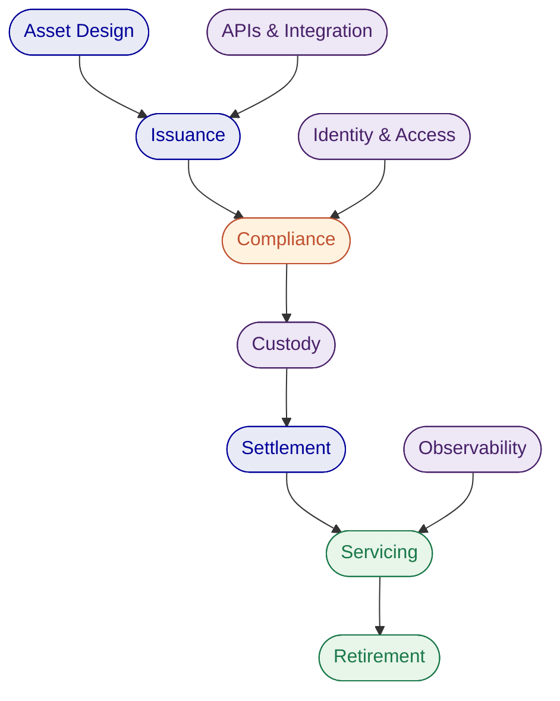
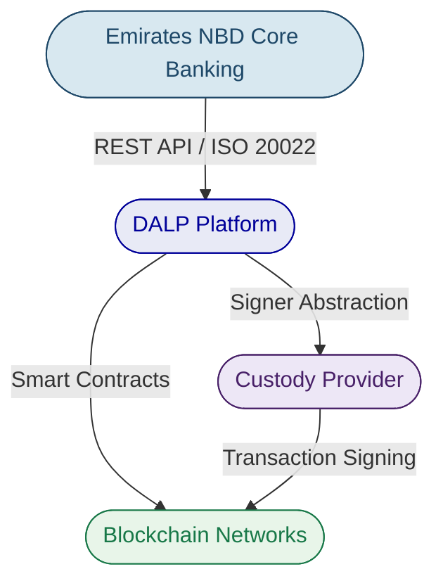
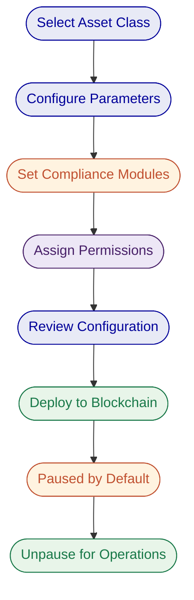
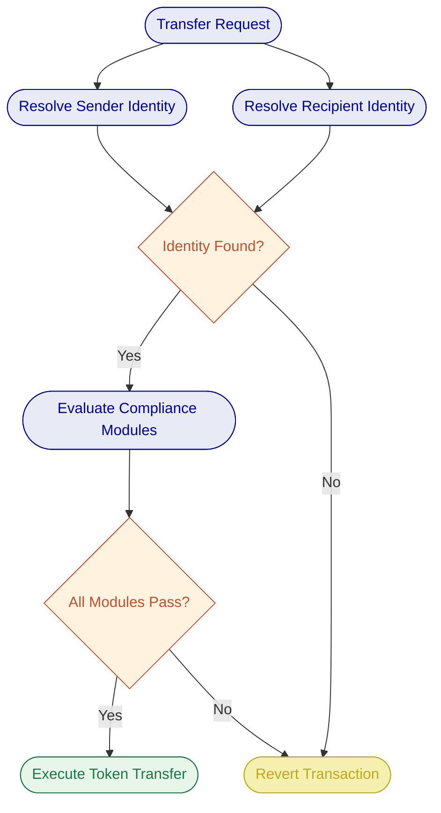
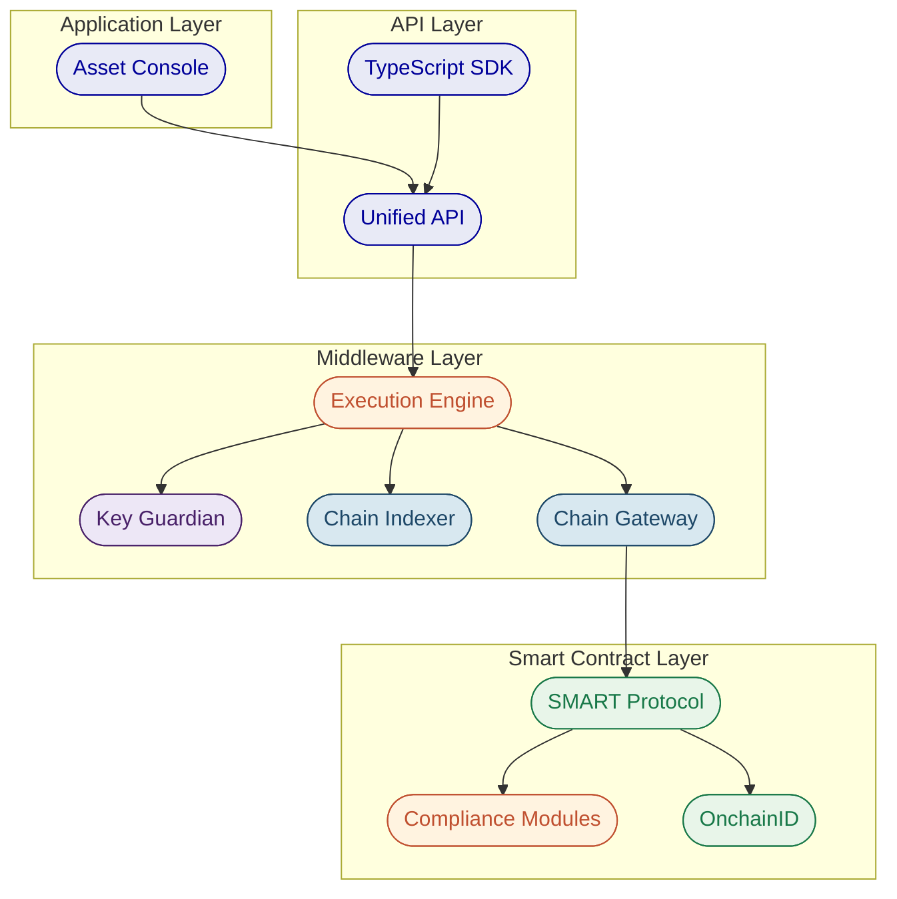
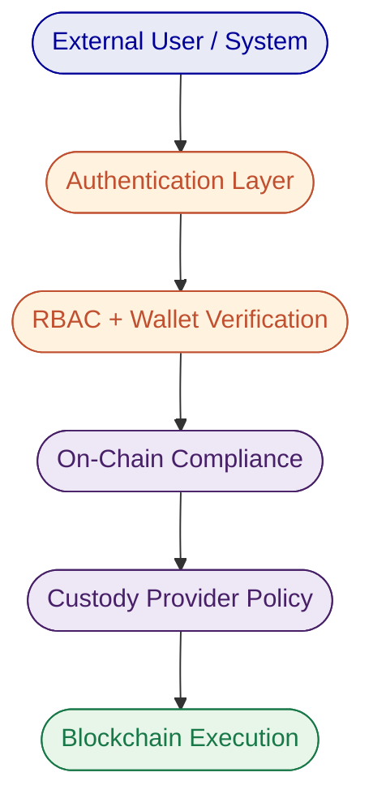
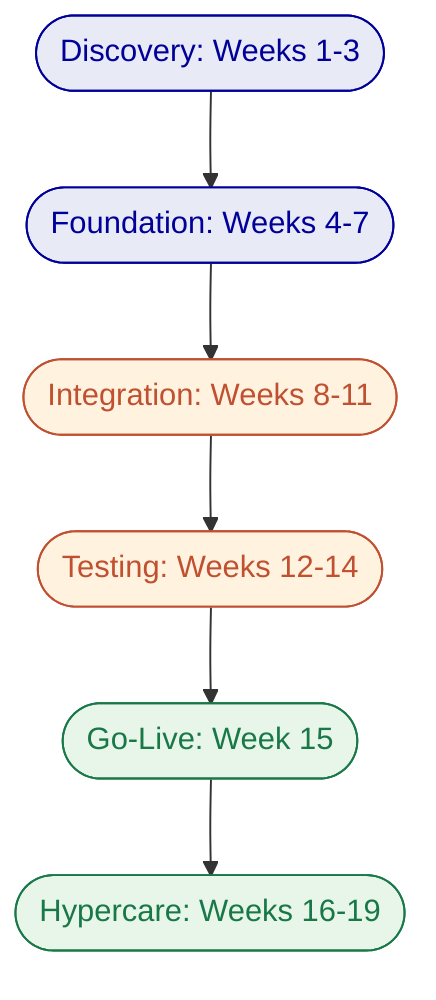
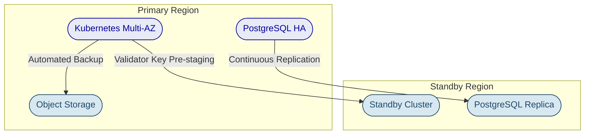

# Executive Summary

## Client Context and Objectives

Emirates NBD is evaluating digital asset infrastructure to position the bank at the forefront of the UAE's rapidly maturing digital finance ecosystem. The bank's objectives span three interconnected domains: a tokenization platform capable of handling institutional-grade asset issuance and lifecycle management, a stablecoin issuance platform for creating and operating digital currencies, and digital asset custody infrastructure that integrates with the bank's existing security and governance requirements.

The UAE regulatory landscape, shaped by VARA, CBUAE, and ADGM frameworks, demands that any digital asset infrastructure meet stringent compliance, auditability, and operational resilience standards from day one. Emirates NBD's scale and market position require a platform that can move beyond pilot-stage experimentation into production-grade operations across multiple asset classes and jurisdictions.

## Proposed Response

SettleMint proposes its Digital Asset Lifecycle Platform (DALP) as the unified infrastructure layer for Emirates NBD's digital asset strategy. DALP is a production-grade platform that covers the full digital asset lifecycle, from asset design and structuring through issuance, compliance enforcement, custody integration, settlement, servicing, and retirement, all governed by a single control plane, security posture, and operating model.

For tokenization, DALP provides pre-built asset templates across seven asset classes (bonds, equities, funds, deposits, stablecoins, real estate, and precious metals), with a configurable token type for additional instruments. Emirates NBD's operations team can design, configure, and deploy tokenized assets through an intuitive Asset Designer wizard or programmatically through the REST API and TypeScript SDK.

For stablecoin issuance, DALP supports the full stablecoin lifecycle: creation with configurable peg currency and reserve parameters, supply management with compliance-enforced minting and burning, multi-currency support (including AED-denominated stablecoins), and reserve monitoring with on-chain attestation integration.

For digital asset custody, DALP follows a custody-agnostic architecture. The platform integrates with institutional custody providers, including Fireblocks and DFNS (currently deployed for the ADI chain in Abu Dhabi), through a unified signer abstraction. Emirates NBD retains full control over custody provider selection and can integrate its existing or preferred custody solution without platform constraints.

The recommended deployment model is a private cloud or on-premises deployment within Emirates NBD's infrastructure, ensuring full data residency within the UAE. Implementation follows a structured six-phase methodology spanning 15 to 19 weeks from kickoff to production go-live.

## Why SettleMint and DALP

Tokenization technology is increasingly accessible. Institutional-grade implementation is not. The real complexity lies in doing tokenization correctly at production scale: meeting regulatory requirements, implementing proper governance, supporting the full asset lifecycle, and building infrastructure that withstands institutional scrutiny.

SettleMint has spent nearly a decade solving this exact problem. The company has delivered multi-year production deployments with regulated banks across Asia, the Middle East, and Europe, including active sovereign-scale programmes in the Gulf region. DALP is the product of that accumulated production experience, not a proof-of-concept framework promoted to production status.

Three factors make SettleMint uniquely positioned for Emirates NBD:

**Regional proof.** SettleMint is actively delivering sovereign-scale digital asset infrastructure in the Middle East, including the Saudi Arabia Real Estate Registry (country-scale property tokenization under REGA and Vision 2030) and tokenized equity on the ADI chain in Abu Dhabi with DFNS custody integration. These are not pilots. They are production systems processing real transactions.

**Full lifecycle coverage.** DALP is not just an issuance tool. It manages every event in an asset's lifetime, from coupon payments and dividend distribution to maturity redemption and retirement. This operational depth is what separates DALP from point solutions that stop at token creation.

**Compliance by design.** DALP enforces compliance before every transaction through 12 configurable compliance module types, with pre-built templates for global regulatory frameworks including GCC, MiCA, MAS, FCA, and SEC regulations. Compliance is embedded in the protocol layer, not bolted on as an application-layer check.

## Reference Snapshot

| Reference | Relevance |
| --- | --- |
| Saudi Arabia RER | Country-scale real estate tokenization in the Gulf; DALP-powered; integration with national identity and payment systems |
| ADI, Finstreet | Tokenized equity on Abu Dhabi mainnet; DFNS custody integration; UAE/GCC regulatory context |
| Maybank (Project Photon) | FX tokenization and cross-border XvP settlement; atomic cross-currency swaps |

---

# About SettleMint

## Company Overview

SettleMint is the production-grade digital asset lifecycle management company for regulated financial markets and sovereign use cases. Founded in 2016 and headquartered in Leuven, Belgium, the company has grown from an early enterprise blockchain infrastructure provider into the category-defining platform enabling financial institutions, market infrastructure providers, and sovereign entities to move real-world value on-chain with compliance, security, and operational reliability.

SettleMint exists to bridge the gap between tokenization ambitions and production-grade execution. As regulatory frameworks mature and expectations shift from innovation theatre to operational reality, most organisations remain stuck in pilot mode, isolated internal experiments, underestimated operational complexity, and architectures that do not scale or withstand regulatory scrutiny. SettleMint's mission is to enable regulated institutions to move from slides to balance sheets.

## Credentials and Delivery Maturity

| Category | Evidence |
| --- | --- |
| Market Validation | Nearly 10 years focused on blockchain infrastructure; 7+ years of continuous production deployments at regulated banks |
| Operational Maturity | Live deployments across bonds, equities, deposits, stablecoins, real estate, funds, and precious metals |
| Sovereign Credibility | Active sovereign and national-scale programmes in Saudi Arabia, Abu Dhabi, and across the Middle East |
| Security Certifications | ISO 27001 and SOC 2 Type II certified |
| Ecosystem Strength | Trusted by tier-1 and tier-2 banks (OCBC, Standard Chartered, Commerzbank, Mizuho, Sony Bank, Maybank); backed by leading European and Middle Eastern investors |
| Team Depth | 200+ years combined banking and blockchain experience across the team |

## Regulatory Readiness

DALP supports compliance frameworks across multiple jurisdictions through its configurable compliance engine:

| Jurisdiction | Framework | DALP Coverage |
| --- | --- | --- |
| UAE / GCC | VARA, CBUAE, ADGM, DFSA | Configurable compliance modules; GCC regulatory template support; Shariah-compatible asset structures |
| European Union | MiCA, MiFID II, GDPR | Pre-built MiCA compliance template with 8M EUR rolling supply cap |
| United States | Reg D, Reg S, Reg CF | Pre-built SEC compliance templates |
| Singapore | MAS Framework | Pre-built MAS compliance template with holding period controls |
| United Kingdom | FCA Requirements | Pre-built FCA compliance template |
| Japan | FSA Compliance | Pre-built FSA compliance template |

SettleMint's platform is built for regulated environments from day one. Native support for the ERC-3643 (T-REX) regulated token standard, combined with OnchainID for verifiable on-chain investor identities, provides a compliance architecture that enforces eligibility before execution, not after.

## Relevance to This Bid

Emirates NBD's requirements align directly with SettleMint's core capabilities and regional experience. As a major UAE banking group operating under CBUAE and VARA oversight, Emirates NBD requires a platform partner with proven ability to deliver production-grade digital asset infrastructure in the Gulf regulatory context. SettleMint's active deployments in Saudi Arabia (country-scale real estate tokenization) and Abu Dhabi (tokenized equity on ADI chain) demonstrate exactly this capability. The combination of banking-grade security (ISO 27001, SOC 2 Type II), custody-agnostic architecture (supporting Fireblocks, DFNS, and bring-your-own-custodian models), and full lifecycle coverage across all asset classes Emirates NBD is evaluating makes DALP the natural infrastructure choice.

SettleMint's value to Emirates NBD rests on three reinforcing pillars. First, technology: DALP provides production-grade infrastructure covering the full digital asset lifecycle with pre-built compliance for the regulatory frameworks relevant to Emirates NBD's operations. Second, track record: multi-year production deployments with regulated banks across Asia, Europe, and the Middle East, with active sovereign-scale programmes in the Gulf. Third, team: a group with deep cumulative experience in tokenization and financial infrastructure, combining technical depth, financial domain knowledge, and enterprise delivery expertise, with regional leaders providing local regulatory and market knowledge in the UAE and broader GCC.

---

# About DALP

## Platform Overview

DALP is SettleMint's production-grade Digital Asset Lifecycle Platform for designing, launching, and operating tokenized assets across financial instruments and real-world assets. It provides production-ready infrastructure from day one, so institutions can launch digital assets without building blockchain expertise internally, without lengthy development cycles, and without navigating the complexity of assembling production-grade infrastructure from scratch.

The challenge that most institutions face is not tokenization technology itself, but the operational complexity that surrounds it. Running a pilot or minting a token is straightforward. Production deployment that meets regulatory requirements, implements proper governance, supports the full asset lifecycle, and scales into real institutional infrastructure is where most organisations get stuck. DALP exists to solve this gap.

Unlike point solutions that address only issuance, only custody, or only trading, DALP provides a unified platform covering the full digital asset lifecycle, from asset design through issuance, compliance enforcement, custody integration, settlement, servicing, and retirement, treated as one continuous lifecycle under a single governance model, security posture, and operating framework. This unified approach eliminates the coordination overhead, operational risk, and accountability gaps that arise when institutions assemble separate tools for each lifecycle stage.

DALP sits between existing core financial systems and multiple blockchain networks, providing the governance and orchestration layer that enables institutions to build, deploy, and operate compliant digital asset solutions in production. By abstracting the blockchain layer and embedding compliance and governance directly into the platform, DALP enables institutions to move from exploration to execution much faster. The platform is designed to be operated over time, not just deployed, managing every event in an asset's lifetime from creation to retirement.

DALP supports seven asset classes out of the box, each with purpose-built lifecycle logic:

| Asset Class | Types | Typical Instruments |
| --- | --- | --- |
| Fixed Income | Bond | Corporate bonds, government bonds, structured notes, sukuk |
| Flexible Income | Equity, Fund | Common stock, preferred shares, investment fund units |
| Cash Equivalent | Stablecoin, Deposit | Fiat-pegged stablecoins, tokenized bank deposits |
| Real World Asset | Real Estate, Precious Metal | Fractional property ownership, gold-backed tokens |
| Custom | Configurable Token | Carbon credits, trade finance instruments, loyalty programmes |

## Lifecycle Pillars

DALP is structured around five integrated core-lifecycle modules:

**Issuance.** Rapid deployment of tokenized assets across seven asset classes, each with purpose-built lifecycle logic. The Asset Designer wizard guides operators through token configuration with live validation, while the REST API enables fully programmatic issuance. Pre-built smart contract sets are deployed through configuration, not custom development. Each asset type carries class-specific validation rules: bonds require maturity dates and ISIN codes, equities enforce voting rights and dividend parameters, stablecoins define peg currencies and reserve models. Token creation follows a deterministic factory pattern using CREATE2 deterministic addressing, ensuring atomic deployment where all steps succeed or all revert. No partially deployed tokens can exist on-chain.

**Compliance.** Ex-ante enforcement ensures every transfer is validated before execution, not reviewed after. DALP's compliance architecture includes 12 compliance module types covering country restrictions, investor accreditation, supply limits, holding periods, collateral backing, transfer controls, and more. Multi-jurisdictional support models complex requirements across EU MiCA, Singapore MAS, UK FCA, Japan FSA, US Reg D/S/CF, and GCC frameworks, all built on the ERC-3643 (T-REX) regulated token standard with OnchainID for verifiable on-chain investor identities. The platform ships with pre-built compliance templates that can be selected with a single click during asset creation, while a visual expression builder allows compliance teams to construct custom eligibility rules using boolean logic without writing code. This is not application-layer validation that can be bypassed; compliance is enforced by the smart contract itself.

**Custody.** Enterprise-grade key management workflows with a custody-agnostic, bring-your-own-custodian model. DALP orchestrates custody policy across existing custodian relationships through Key Guardian, supporting encrypted database, cloud secret manager, HSM (FIPS 140-2 Level 3), and third-party custody via Fireblocks and DFNS. Maker-checker approval workflows and configurable multi-signature quorum provide institutional governance. Both DFNS and Fireblocks implement MPC (Multi-Party Computation), ensuring no single private key ever exists in one place. The unified signer abstraction makes custody providers interchangeable through configuration changes alone, with no workflow or code modifications required.

**Settlement.** Atomic Delivery-versus-Payment (DvP) and Exchange-versus-Payment (XvP) settlement ensures asset and cash legs complete together or revert together, eliminating counterparty risk, reconciliation gaps, and operational drift. Both local (same-chain) and HTLC (cross-chain) settlement models are supported, with ISO 20022 integration for SWIFT, SEPA, and RTGS connectivity. The XvP system supports multi-party transactions involving three or more counterparties, and all settlement legs are subject to the compliance rules of each token involved. Deterministic settlement closure produces auditable end-states (executed, cancelled, or expired-withdrawn) with closure-readiness checks enforced before finalization.

**Servicing.** Automated lifecycle operations, coupon payments, yield distribution, dividend processing, redemptions, maturity handling, executed programmatically across every asset type. This is the operational capability most platforms lack entirely: managing the asset from issuance through every event in its lifecycle to retirement. Fixed treasury yield features allow issuers to fund a treasury from which holders claim accrued yield at configured intervals. The maturity redemption feature implements the complete fixed-income lifecycle endpoint: after the maturity date, the token blocks all transfers, and holders redeem tokens for the denomination asset at configured face value in a single atomic transaction. Distribution mechanisms include token sales, airdrop systems (push, time-bound, vesting), and claim fulfillment workflows.

## Platform Foundations

Beneath the five lifecycle pillars, DALP provides three cross-cutting platform foundations:

**Identity and Access Management.** OnchainID provides verifiable, on-chain investor identities with claim-based verification reusable across all assets. Role-based access control governs every action with five defined roles. KYC/KYB profile management with structured review workflows, invitation-linked onboarding, wallet verification with multi-factor gates, and identity recovery with durable, phase-tracked workflows provide the institutional identity infrastructure Emirates NBD requires.

**Integration and Interoperability.** DALP is designed to operate within existing institutional environments. The platform offers REST APIs (OpenAPI 3.1), a typed TypeScript SDK (DALP TypeScript SDK), a CLI with 301 commands across 26 groups, event webhooks, and ISO 20022 payment rail connectivity. Custody integration (Fireblocks, DFNS), chain flexibility (any EVM-compatible network), and support for on-premises, private cloud, or managed SaaS deployment ensure DALP fits Emirates NBD's existing technology landscape.

**Observability and Operations.** DALP ships production-grade operational tooling including pre-built monitoring dashboards, three-pillar observability (metrics, logs, traces), automated alerting, blockchain infrastructure monitoring, and a durable workflow orchestration engine that ensures multi-step operations survive process restarts and infrastructure failures.

## Supported Standards and Protocols

DALP is built on open industry standards, ensuring interoperability and reducing vendor lock-in:

| Category | Standards |
| --- | --- |
| Token Standards | ERC-20, ERC-721, ERC-1400, ERC-3643 (T-REX), ERC-5805 (voting power), EIP-2612 (permits) |
| Identity | OnchainID (ERC-734/735), claim-based verification |
| Account Abstraction | ERC-4337 smart accounts, ERC-7579 modular validation |
| Compliance | 12 module types across eligibility, restrictions, transfer controls, issuance/supply, time-based rules, settlement/collateral |
| Settlement | Atomic DvP/XvP, HTLC cross-chain |
| Payment Rails | ISO 20022 (SWIFT, SEPA, RTGS) integration |
| Regulatory Frameworks | EU MiCA, US Reg D/S/CF, Singapore MAS, UK FCA, Japan FSA, GCC frameworks |
| Blockchain Networks | Any EVM-compatible network (public or private) |

## Key Differentiators

| Differentiator | Detail |
| --- | --- |
| Unified lifecycle | Single platform from issuance through servicing to retirement; no multi-vendor coordination |
| Ex-ante compliance | 12 compliance module types enforced at the protocol layer before every transaction |
| Deployment flexibility | On-premises, private cloud, managed SaaS, or hybrid; UAE data residency fully supported |
| Operational maturity | 7+ years of continuous production at regulated banks; ISO 27001 and SOC 2 Type II certified |
| Custody-agnostic | Integrates with Fireblocks, DFNS, HSM, or any institutional custody provider |
| API-first architecture | Every platform capability accessible through REST API, SDK, CLI, and webhooks |
| Arabic language support | Full ar-SA locale with right-to-left layout support |

---

# Customer References

## Summary Table

| Client | Region | Asset Class | Scope |
| --- | --- | --- | --- |
| Saudi Arabia RER | Middle East (Saudi Arabia) | Real estate | Country-scale blockchain for property registration, fractionalization, and digital marketplace |
| ADI, Finstreet | Middle East (Abu Dhabi) | Equity tokens | Tokenized equity on ADI mainnet with corporate actions and DFNS custody |
| Maybank (Project Photon) | Southeast Asia (Malaysia) | FX tokens | FX tokenization and cross-border XvP settlement |
| Standard Chartered Bank | Asia, Africa, Middle East | Securities | Digital Virtual Exchange with fractional tokenization |
| Commerzbank | Europe (Germany) | ETPs | Hybrid on/off-chain ETP issuance; settlement under 10 seconds |
| Sony Bank | East Asia (Japan) | Stablecoins | Stablecoin issuance with integrated digital identity |
| OCBC Bank | Southeast Asia (Singapore) | Securities | Security token engine for HNWI investment products |
| Mizuho Bank | East Asia (Japan) | Bonds | Bond tokenization with standard platform capabilities |
| State Bank of India | South Asia (India) | CBDC | CBDC infrastructure for digital currency |
| Islamic Development Bank | Multi-region (57 countries) | Subsidy tokens | Sharia-compliant blockchain-based subsidy distribution |
| KBC Securities | Europe (Belgium) | Equity, SME loans | Smart contract backend for crowdfunding platform |
| Reserve Bank of India | South Asia (India) | Trade finance | Multi-bank letter of credit blockchain |
| Commerzbank | Europe (Germany) | ETPs | Hybrid ETP issuance with Boerse Stuttgart listing |
| Islamic Development Bank | Multi-region | Collateral assets | Sharia-compliant market stabilization |

## Expanded Reference: Saudi Arabia RER

The Real Estate General Authority (REGA) of the Kingdom of Saudi Arabia set out to build a national-scale blockchain infrastructure for property registration, fractionalization, and a regulated digital marketplace. The initiative sits at the centre of Vision 2030's digital transformation agenda. Saudi Arabia's property market required a system where the blockchain ledger functions as the conclusive record of property rights, a "registry-as-truth" model. The challenge combined technical complexity (integration with national identity via Yakeen, payment rails via Sadad, escrow systems, and the existing core registry) with institutional complexity (multiple PropTechs, banks, and government agencies operating against a single ledger). No country had attempted this at national scale before.

SettleMint serves as the delivery partner for the solution. DALP powers the blockchain and tokenization layer, handling asset contract deployment, compliance enforcement, and lifecycle management for tokenized property. The architecture exposes a unified RER API Gateway that PropTechs, banks, and developers consume. Marketplace services handle listing, due diligence, identity verification, fee payment, and escrow. Orchestration and integration modules connect DALP to RER's core registry, billing system, escrow engine, case worker tooling, and government systems. Four PropTechs (Sahl, Madek, Ghanem, Jozo) are live in production, processing real transactions as of January 2026. Infrastructure includes tested backup and restore procedures for production continuity.

This is the first country in the world to deploy a national-scale property blockchain. Fractional ownership of commercial real estate is operational. Smart contracts automate ownership transfers and tax compliance. REGA is launching a second edition of the tokenization programme. The project has been presented at the Cityscape exhibition (November 2025) and the Real Estate Future Forum (January 2026).

This reference demonstrates DALP's ability to operate at country scale, work within a regulated government framework, integrate with national identity and payment infrastructure, and support multiple third-party participants through a single API gateway, directly relevant to Emirates NBD's scale and governance requirements.

## Expanded Reference: ADI, Finstreet

ADI's Abu Dhabi-based programme deploys tokenized equity on a dedicated mainnet using DALP. The solution includes embedded corporate action functionality (stock splits, consolidations via controlled mint and burn), on-chain voting using ERC20Votes, and upgradeable smart contracts on ADI's private network. Institutional-grade custody is provided through DFNS for transaction signing, with a Fireblocks integration path. The architecture includes a structured approval workflow for governance operations.

Infrastructure runs on cloud-agnostic tooling (infrastructure-as-code tooling, Helm, managed Kubernetes) within the UAE/GCC. The solution is designed for scalable, regulated equity tokenization on ADI's dedicated blockchain environment.

This engagement is directly relevant to Emirates NBD because it demonstrates DALP operating within the UAE regulatory and infrastructure context, with the same custody providers Emirates NBD may evaluate, on infrastructure deployed within the GCC. The equity tokenization with corporate actions capability maps directly to Emirates NBD's requirements for managing the full lifecycle of tokenized securities.

## Fit Note

These references were selected because they demonstrate SettleMint's production capability in the Gulf region (Saudi Arabia, Abu Dhabi), across the asset classes Emirates NBD is evaluating (bonds, equities, stablecoins, real estate), and with the custody integration models (DFNS, Fireblocks) relevant to Emirates NBD's requirements. The Maybank reference adds cross-border settlement capability, a key requirement for a bank with Emirates NBD's international footprint.

---

# Understanding of Requirements

## Requirement Summary

Emirates NBD is evaluating digital asset infrastructure across three interconnected categories: tokenization platform, stablecoin issuance, and digital asset custody. The evaluation follows a successful 90-minute demo session on March 10, 2026, and builds on an RFI submitted in February 2026. The bank requires a platform partner that can support its full digital asset ambition, not a collection of point solutions that require extensive integration.

The core objective is to establish production-grade digital asset infrastructure that operates within the UAE regulatory framework (VARA, CBUAE, ADGM), integrates with Emirates NBD's existing banking systems, and scales across multiple asset classes and use cases over time.

## Requirement Domains

| Domain | Key Requirements | DALP Response |
| --- | --- | --- |
| Business Scope | Tokenization across multiple asset classes; stablecoin issuance and lifecycle; custody integration | Full coverage: 7 pre-built asset classes plus configurable token; native stablecoin lifecycle; custody-agnostic architecture |
| Compliance and Control | UAE regulatory alignment (VARA, CBUAE); ex-ante compliance enforcement; audit trail; investor eligibility | 12 compliance module types; GCC regulatory templates; ERC-3643 protocol-level enforcement; immutable on-chain audit trail |
| Integration | Core banking connectivity; custody provider integration; API-first architecture; ISO 20022 payment rails | REST API (OpenAPI 3.1), TypeScript SDK, 301-command CLI, webhooks; Fireblocks/DFNS custody connectors; ISO 20022 support |
| Operations and Deployment | UAE data residency; on-premises or private cloud; high availability; disaster recovery | All deployment models supported; Helm-based Kubernetes deployment; multi-AZ HA with 2-15 minute RTO; UAE data residency |
| Support and Governance | Enterprise-grade SLA; 24/7 support option; named support team; structured escalation | Three support tiers (Standard, Premium, Enterprise); up to 99.99% uptime SLA; dedicated support team; formal escalation path |

## Response Principles

This proposal is guided by five principles that reflect Emirates NBD's stated requirements and SettleMint's delivery philosophy:

**Platform, not project.** DALP is a configurable software platform, not a consulting engagement. Emirates NBD's team will operate the platform independently after implementation, with SettleMint providing ongoing support and updates.

**Show everything.** Following the strategic direction established in the demo session, this proposal presents DALP's full capability across all three requirement categories, demonstrating that SettleMint has Emirates NBD covered across the entire digital asset spectrum.

**Compliance first.** Every capability described in this proposal operates within DALP's compliance framework. Compliance is not an add-on layer; it is enforced at the protocol level before every transaction.

**Regional credibility.** Claims are backed by active production deployments in the Gulf region, not theoretical capabilities or future roadmap items.

**Operational realism.** This proposal describes what DALP does today, with clear identification of any capabilities that require integration or are on the development roadmap.

---

# Proposed Solution

## Solution Overview

SettleMint proposes DALP as the unified digital asset infrastructure platform for Emirates NBD, covering all three evaluation categories within a single integrated solution. The platform provides the governance and orchestration layer between Emirates NBD's existing core banking systems and blockchain networks, delivering tokenization, stablecoin issuance, and custody integration through a single API surface, compliance engine, and operating model.

The solution boundary encompasses: all seven DALP asset classes plus configurable tokens, the full compliance engine with UAE/GCC-specific configuration, custody integration through Emirates NBD's selected provider(s), atomic DvP/XvP settlement, automated lifecycle servicing, and production-grade observability. Payment rail integration (ISO 20022 for SWIFT, SEPA, and domestic payment systems) and core banking connectivity are addressed through DALP's API layer during the integration phase.

## Functional Capability Areas

### Asset Setup and Lifecycle Management

DALP's Asset Designer provides a guided, step-by-step wizard for configuring and deploying tokenized assets across all seven asset classes. Each asset type carries purpose-built lifecycle logic: bonds include maturity dates, ISIN codes, and automated coupon schedules; equities support dividend distribution, voting rights, and corporate actions; stablecoins manage peg currency relationships and reserve attestation; real estate tokens capture GPS coordinates, property classification, and fractional ownership parameters; deposits model programmable interest and maturity rules; funds handle NAV integration and fee structures.

The deployment pipeline is deterministic and durable. Token creation deploys a new smart contract through the Asset Factory using CREATE2 deterministic addressing, with the deployment sequence validating configuration, deploying the proxy contract, initializing compliance modules, binding identity, configuring features, and assigning roles in a single atomic transaction. No partially deployed tokens can exist on-chain. Newly deployed tokens start in a paused state by default, giving the compliance team time to verify configuration before the token goes live.

Post-issuance lifecycle operations span the full asset lifetime:

**Issuance and Distribution.** Supply managers mint tokens to verified investor wallets with single or batch operations (up to 100 recipients per request). Each mint validates the caller's role, verifies wallet ownership through multi-factor authentication, confirms recipient identity and compliance status, and checks supply caps. Alternative distribution mechanisms include token sales (configurable primary offerings with presale and public phases), airdrop distribution (Merkle-tree based with push, time-bound, and vesting variants), and claim fulfillment workflows.

**Transfer and Secondary Trading.** Every token transfer follows a deterministic compliance path. The Identity Registry resolves sender and recipient wallets to OnchainID contracts. All configured compliance modules evaluate in sequence. Token features run pre-check hooks. Only after all checks pass does the ERC-20 balance update execute atomically. Post-transfer hooks handle fee collection, balance checkpoint updates, voting power transfers, and FIFO batch recording. For legal requirements, the Custodian role can execute forced transfers that bypass compliance for court-ordered seizures, estate transfers, or regulatory enforcement, with full audit trail maintained.

**Corporate Actions.** Automated coupon and yield distribution through fixed treasury yield (pull-based claiming from funded treasuries) and yield schedule features (automated distribution with snapshot-based balance capture). Maturity redemption with atomic payout: after the maturity date, the token blocks all transfers, and holders redeem tokens for the denomination asset at configured face value in a single transaction. Convertible instrument conversion supports both holder-initiated and custodian-initiated conversions with atomic loan-token burn and equity-token mint.

**Servicing Operations.** Full and partial freeze/unfreeze for compliance holds and investigation. Global pause/unpause as an emergency circuit breaker. ERC-20 recovery for tokens accidentally sent to contract addresses. Role management with separation of duties across five operational roles (admin, custodian, emergency, governance, supply management).

**Retirement.** Burn operations permanently remove units from circulation. For fixed-income instruments with maturity redemption, retirement is built into the lifecycle: holders redeem, tokens burn, and the denomination asset pays out atomically until all units are retired.

The token issuance process follows a deterministic pipeline from design through deployment:

For stablecoin issuance specifically, DALP provides native support for creating AED-denominated, USD-denominated, or multi-currency stablecoins with configurable peg parameters, supply management with compliance-enforced minting and burning, and reserve monitoring through on-chain attestation. The platform already manages stablecoins including USDC, USDT, and custom institutional stablecoins in production environments. Sony Bank's engagement with SettleMint specifically demonstrates stablecoin issuance with integrated digital identity for regulated use, a pattern directly applicable to Emirates NBD's stablecoin requirements.

For tokenized deposits, DALP manages the full lifecycle of bank deposit tokens. The platform currently handles deposit tokens denominated in multiple currencies that function as on-chain settlement currencies across bonds and XvP settlements. This deposit tokenization capability is directly relevant to Emirates NBD's existing deposit products and treasury operations.

### Identity, Compliance, and Access Control

DALP's compliance architecture enforces eligibility before execution, not after. Every token transfer passes through a modular compliance engine built on the ERC-3643 (T-REX) standard, where configurable rules are evaluated in sequence before any balance change occurs. A single rule violation blocks the transfer. This is a fail-closed design: the default is denial unless all modules explicitly approve.

The platform ships with pre-built compliance templates covering all major global regulatory frameworks: Japan FSA, MAS Singapore, MiCA EU, SEC Reg CF, SEC Reg D 506(b) and 506(c), and UK FCA. For Emirates NBD's UAE context, custom compliance templates can be created with jurisdiction-specific controls, investor count limits per country, and GCC-specific eligibility requirements using DALP's visual expression builder, which allows compliance teams to construct investor eligibility rules using boolean logic without writing code.

On-chain identity is managed through OnchainID, where every investor has a cryptographic identity contract deployed on the blockchain with verified compliance claims (KYC, AML, accreditation status, jurisdictional eligibility). Identity verification is reusable across all assets, so an investor verified once does not need re-verification for subsequent token operations.

The following diagram illustrates the compliance enforcement flow that executes before every token transfer:

Access control follows a dual-layer model: off-chain platform roles managed by the authentication system control API and console access, while on-chain roles in smart contracts govern blockchain operations. Twenty-six distinct roles are organised across four layers (platform, system, per-asset, and system module), ensuring separation of duties between governance, operations, compliance, and emergency functions.

The compliance architecture also supports white-labeling of the entire compliance workflow. Emirates NBD can create organisation-specific compliance templates with custom jurisdiction controls, building on DALP's library of 12 available compliance controls across 7 categories (eligibility, restrictions, transfer controls, issuance and supply, time-based rules, settlement and collateral). This extensibility means that as UAE regulatory requirements evolve (new VARA directives, CBUAE circulars, or ADGM rule changes), Emirates NBD's compliance team can create and deploy updated compliance templates without SettleMint involvement.

### Settlement, Custody, and Operational Controls

DALP's XvP (Exchange vs. Payment) settlement system provides atomic multi-party settlement where all legs complete together or all revert together, eliminating counterparty risk and reconciliation gaps. The system supports both local (same-chain) atomic settlement and HTLC (Hash Time-Locked Contract) cross-chain settlement for multi-network scenarios.

For Emirates NBD's cross-border operations, the XvP system enables atomic cross-currency swaps (demonstrated in the Maybank Project Photon engagement), DvP settlement for bonds against stablecoins or deposit tokens, and multi-party transactions involving three or more counterparties. All legs of a settlement are subject to the compliance rules of each token involved.

For digital asset custody, DALP operates through a custody-agnostic architecture using the Key Guardian service. Emirates NBD selects its preferred custody provider, and DALP integrates through a unified signer abstraction that supports multiple tiers:

| Storage Tier | Protection Level | Use Case |
| --- | --- | --- |
| Encrypted database | Application-level encryption | Development and proof-of-concept |
| Cloud secret manager | Platform-managed encryption | Standard production |
| Hardware security module (HSM) | FIPS 140-2 Level 3 | Regulated financial services |
| Third-party custody (DFNS, Fireblocks) | Delegated institutional MPC | Highest security requirements |

DFNS and Fireblocks integrations are production-proven. In the ADI Finstreet deployment, DFNS handles transaction signing on the Abu Dhabi mainnet. Both providers implement MPC (Multi-Party Computation), ensuring no single private key ever exists in one place. DALP owns permissioning, wallet verification, queueing, and workflow state transitions; the custody provider owns nonce allocation, gas handling, signing, and broadcast.

### Integration, APIs, and Reporting

DALP is API-first by design. Every platform capability is accessible programmatically, ensuring Emirates NBD's existing systems can integrate with the platform without manual workarounds.

| Integration Method | Description |
| --- | --- |
| REST API (OpenAPI 3.1) | Full platform access with interactive Swagger documentation; 10,000 requests per 60-second window per API key |
| TypeScript SDK | Typed client (DALP TypeScript SDK) with arbitrary-precision arithmetic for financial calculations |
| CLI | 301 commands across 26 groups for system administration and automation |
| Event Webhooks | Real-time notifications for transaction confirmations, compliance events, and lifecycle changes |
| ISO 20022 | Payment rail connectivity for SWIFT, SEPA, and RTGS |

For Emirates NBD's core banking integration, DALP's API layer supports account reconciliation, position management, and reporting through standard REST endpoints. Custody provider integration uses the signer abstraction layer, supporting Fireblocks, DFNS, and HSM backends through configuration changes alone, with no workflow or code modifications required.

The platform's observability stack provides enterprise-grade operational monitoring through pre-built monitoring dashboards covering operations overview, transaction monitoring, compliance activity, and security events. Distributed tracing follows operations across component boundaries, and automated alerting triggers notifications when metrics exceed configured thresholds.

DALP also supports full white-label branding. Emirates NBD can customise the platform's entire visual identity: application logos for light and dark modes, colour palette tokens (primary, accent, success, warning, destructive, muted), login page branding, and favicon configuration for all browser and device contexts. The live preview panel shows branding changes in real time before deployment, ensuring the platform presents as an Emirates NBD product to all users.

## Functional Fit Table

| Requirement Area | Status | DALP Capability | Notes |
| --- | --- | --- | --- |
| Multi-asset tokenization | Full | 7 pre-built asset classes plus configurable token | Bonds, equities, funds, deposits, stablecoins, real estate, precious metals |
| Stablecoin issuance | Full | Native stablecoin lifecycle with peg currency, reserve monitoring, multi-currency | AED-denominated stablecoin supported |
| Digital asset custody | Full | Custody-agnostic via Key Guardian; Fireblocks and DFNS integrations | Emirates NBD selects preferred provider |
| Compliance enforcement | Full | 12 module types; ERC-3643 protocol enforcement; pre-built regulatory templates | GCC-specific templates configurable |
| Atomic settlement | Full | XvP with local and HTLC cross-chain modes | DvP, PvP, multi-party supported |
| Corporate actions | Full | Automated yield, dividends, maturity redemption | Coupon schedules, distribution |
| API integration | Full | REST, SDK, CLI, webhooks, ISO 20022 | OpenAPI 3.1 specification |
| On-premises deployment | Full | Helm-based Kubernetes; air-gap capable | UAE data residency |
| White-label branding | Full | Full theme customization: logos, colours, login page | Emirates NBD branding |
| Multi-language support | Full | 4 locales including Arabic (ar-SA) with RTL layout | Arabic interface available |
| Regulatory reporting (CBUAE/VARA) | Configuration Required | Report templates configured during Phase 2 | Specific format requirements mapped during Discovery |
| Core banking reconciliation | Integration Required | REST API integration; data mapping workflows | Requires API specifications from Emirates NBD |
| Custody provider onboarding | Partner Dependent | Fireblocks and DFNS connectors available | Other providers require scoping in Phase 1 |

## Gaps, Dependencies, and Roadmap Items

The following items require configuration, integration, or are on the development roadmap. Transparent identification reflects SettleMint's commitment to operational realism.

| Item | Status | Mitigation |
|------|--------|-----------|
| CBUAE/VARA-specific regulatory report formats | Configuration required | Report templates built during Phase 2 based on Emirates NBD's specific reporting requirements |
| Core banking system integration | Integration required | REST API connectors configured during Phase 3; requires API specifications from Emirates NBD |
| Custody provider onboarding | Partner dependent | Fireblocks and DFNS connectors production-ready; alternative providers require scoping in Phase 1 |
| AED stablecoin reserve attestation | Configuration required | On-chain reserve monitoring available; specific attestation format configured during implementation |
| Arabic RTL layout refinement | Available, refinement ongoing | ar-SA locale with RTL layout shipped; specific UI refinements based on Emirates NBD feedback during UAT |

---

# Technical Architecture

## Architecture Overview

DALP is built as a four-layer stack where each layer has a distinct responsibility boundary and layers communicate through well-defined interfaces. Lower layers enforce stricter invariants; upper layers provide flexibility and user-facing abstraction.

| Layer | Role | Key Components |
| --- | --- | --- |
| Application | User-facing interfaces for operators, issuers, and compliance officers | Asset Console (web UI) with full Arabic (RTL) support |
| API | Programmatic access surface for external systems | Unified API (OpenAPI 3.1), TypeScript SDK |
| Middleware | Workflow orchestration, transaction lifecycle, key management, indexing | Execution Engine, Key Guardian, Transaction Signer, Chain Indexer, Chain Gateway |
| Smart Contract | On-chain enforcement of compliance, identity, and asset logic | SMART Protocol (ERC-3643), DALPAsset contracts, compliance modules |

Requests flow top-down through these layers. A user action in the Asset Console triggers an API call, which the middleware orchestrates into one or more blockchain transactions, which the smart contract layer validates and executes on-chain. Each layer independently enforces its own security controls, so no single-layer failure grants unauthorized access.

## Core Layers and Components

**Smart Contract Layer.** The foundation of DALP's on-chain architecture is the SMART Protocol (SettleMint Adaptable Regulated Token), an implementation of the ERC-3643 standard. ERC-3643 was chosen over ERC-1400 for its modular compliance engine, on-chain identity integration through OnchainID, and active ecosystem support. All tokenized assets are deployed as DALPAsset contracts, a configurable contract type that extends the SMART Protocol with the SMARTConfigurable extension. This allows token features and compliance modules to be attached and reconfigured at runtime after deployment.

This design eliminates the need to commit to a specialised contract type at deployment time. A DALPAsset token can evolve: start as a simple bearer instrument, then have fee structures added, governance enabled, or maturity and redemption logic configured, all without redeploying the contract. Runtime-pluggable token features integrate through six lifecycle hooks (mint, burn, transfer, redeem, update, attach), providing capabilities including historical balances, voting power, gasless approvals (permits), AUM fees, maturity and redemption, fixed treasury yield, transaction fees, and conversion.

The on-chain architecture follows a five-layer stack. The SMART Protocol provides the ERC-3643 token framework. The Global layer provides platform-wide infrastructure shared across all system instances. The System layer manages per-system identity registration, compliance, and access control. The Assets layer implements production-ready tokenized financial instruments. The Addons layer extends assets with distribution, settlement, and treasury capabilities including airdrop systems, multi-sig vaults, XvP settlement, token sales, and yield schedules.

DALPAsset contracts are deployable as either upgradeable (using the UUPS proxy pattern) or immutable, with the choice made at factory creation time. Under UUPS, the proxy contract holds the state while delegating calls to an implementation contract, and upgrade logic lives in the implementation itself, preventing unauthorised contract replacement. Token addresses remain stable across upgrades.

**Middleware Layer.** The middleware layer handles the operational complexity of blockchain interaction through several core services. The Execution Engine provides reliable workflow orchestration with persistent state and exactly-once semantics, built on a durable workflow engine that ensures all stateful operations survive infrastructure failures, process restarts, and network partitions. The Key Guardian manages cryptographic key material through defence-in-depth with multiple storage backends. The Chain Indexer processes blockchain events and maintains queryable state projections, with one indexer virtual object per chain ID. The Chain Gateway provides multi-network connectivity with failover and load balancing.

Transaction processing is a first-class runtime capability. A dedicated nonce coordination service serialises nonce allocation per address and chain ID with self-healing behaviour for nonce conflicts. An external signer abstraction normalises wallet creation, signing, and approvals across local, DFNS, and Fireblocks custody backends. The transaction processor owns queued submission, broadcast branching, confirmation polling, reconciliation, and cancellation via replacement-by-fee, appending ERC-8021 attribution to transactions for on-chain provenance tracking.

The authentication and authorisation middleware chain converts authenticated HTTP requests into tenant-scoped, permission-aware operation contexts. Session and API key resolution supports browser sessions and organisation-scoped API keys. On-chain access-control state is synchronised into organisation membership roles at sign-in time, so off-chain platform permissions stay aligned with chain-authoritative role assignments.

**API Layer.** The Unified API exposes all DALP platform capabilities through a type-safe interface with OpenAPI 3.1 specifications generated directly from procedure definitions, ensuring documentation stays synchronised with implementation. Interactive exploration is available through Swagger UI. Procedures are organised by domain namespace covering token lifecycle, user management, wallet operations, investor relationships, asset metadata, and platform administration.

The TypeScript SDK (DALP TypeScript SDK) provides a typed client factory with automatic serialisation of blockchain value types and arbitrary-precision arithmetic for financial calculations. The SDK supports all API namespaces and is available as a public npm package. Meta-transaction support through ERC-2771 integration enables callers to submit signed transaction payloads without holding native tokens for gas, with a configured relayer service sponsoring transaction costs for gasless investor workflows.

**Application Layer.** The Asset Console is a full decentralised application providing the operational interface for asset lifecycle management, compliance workflows, portfolio views, system monitoring, and the Asset Designer wizard. The console implements client-side effective-status derivation to compensate for indexer lag, and uses arbitrary-precision arithmetic for financial calculations to avoid floating-point errors in token amounts. Internationalisation supports four locales including Arabic (ar-SA) with right-to-left layout support, directly relevant to Emirates NBD's operational context.

**Network Support.** DALP operates on any blockchain that implements the Ethereum JSON-RPC specification. No application code changes are required when switching networks. Supported networks include Layer 1 mainnets (Ethereum, Polygon, Avalanche), Layer 2 rollups (Arbitrum, Optimism, Base, zkSync Era), and private/consortium networks (Hyperledger Besu with IBFT 2.0 or QBFT consensus). Multi-chain operation is supported with identity, compliance, and indexer isolation per chain, while custody integration (Fireblocks, DFNS) supports multi-chain asset wallets through the same vault.

## Environment and Deployment Topology

For Emirates NBD, SettleMint recommends a private cloud or on-premises deployment within the bank's own infrastructure, ensuring full UAE data residency and compliance with CBUAE and VARA requirements. DALP's Helm-based deployment supports both models with identical platform capabilities.

The recommended topology provisions three environments: development (for configuration and testing), staging (for UAT and integration validation), and production (for live operations). Each environment is isolated with its own Kubernetes namespace, database instance, and blockchain network connectivity.

Infrastructure requirements for a production deployment:

| Component | Requirement |
| --- | --- |
| Compute | Kubernetes cluster (v1.25+) with minimum 16 vCPUs and 64 GB RAM; scaled based on transaction volume |
| Database | PostgreSQL (v15+) with HA configuration; high IOPS for indexer and transaction processing |
| Storage | Object storage (AWS S3, GCP Cloud Storage, Azure Blob, or S3-compatible) for document management |
| Secrets | Cloud-native secret manager or HSM for production key management |
| Network | Ingress controller, internal service mesh or network policies, blockchain node connectivity |
| Monitoring | monitoring dashboards, time-series metrics collection, centralized log aggregation, distributed tracing (shipped as DALP observability Helm chart) |

DALP ships Helm charts for all platform components, with configuration options for cloud, on-premises, and hybrid environments. The observability stack deploys alongside the application, providing full operational visibility from day one without requiring separate monitoring infrastructure.

## Resilience and Evidence Path

DALP's architecture is designed for enterprise-grade resilience across all layers. The durable workflow orchestration engine ensures that multi-step operations (token deployment, settlement, corporate actions) survive process restarts and infrastructure failures. Workflow phases are explicitly state-tracked with persisted status, enabling recovery from any interruption point. Configurable retry handling with exponential backoff (fast, standard, and long-running presets) ensures operations complete even through transient failures.

The asynchronous transaction pipeline provides 11-state lifecycle management with idempotency, optimistic-lock state transitions, dead-letter rescue for failed transactions, and a public status polling endpoint. This ensures that no transaction is lost or duplicated, even in failure scenarios.

The platform provides full event traceability through three channels:

**On-chain event logging.** Every transfer, compliance check, role change, and configuration update is recorded immutably on the blockchain with block number, transaction hash, and gas cost. Checkpoint mechanisms (ERC-3643) automatically record compliance snapshots per transfer.

**Off-chain structured audit trails.** Authentication events with outcome and context, authorisation decisions with resource and action, all data access with query details, configuration changes with before-and-after state, and wallet verification attempts (success and failure) are captured in structured logs retained for regulatory compliance periods (typically seven years for financial services).

**Real-time observability.** Three-pillar observability (metrics via time-series metrics collection, logs via centralized log aggregation, traces via distributed tracing/observability instrumentation) provides distributed tracing across all component boundaries, with pre-built monitoring dashboards for operations overview, transaction monitoring, compliance activity, and security events. Automated alerting with structured Slack notification templates surfaces critical events (error rate spikes, latency degradation, chain connectivity loss) proactively.

For disaster recovery, the recommended cloud-native pattern achieves an RTO of 2 to 15 minutes and an RPO of seconds to 1 minute through multi-AZ pod distribution, managed PostgreSQL with synchronous replication, and automated Kubernetes backup and restore. Geographic redundancy is available through a hot-warm pattern with continuous PostgreSQL replication across two clusters, providing failover with database replica promotion, validator key pre-staging, and DNS switching.

DALP includes durable, operator-governed recovery workflows for wallet-loss remediation with deterministic phase tracking: preview, durable recovery execution, credential reset, and per-token balance migration. Recovery workflows are idempotent and include local security reconciliation (session deletion, two-factor removal, passkey cleanup, wallet verification reset) within a single database transaction.

---

# Security

## Security Overview

DALP treats security as a structural property of the platform. The architecture enforces defence-in-depth across five independent control layers: identity verification, role-based access control, transaction-level wallet verification, on-chain compliance enforcement, and custody provider policy evaluation. No single-layer failure grants unauthorized access to digital assets.

SettleMint holds ISO 27001 and SOC 2 Type II certifications, confirming that security controls are not just designed but independently audited and continuously maintained.

## Access, Authentication, and Segregation of Duties

DALP supports multiple authentication methods appropriate to different operational contexts: email and password for standard access, passkeys (WebAuthn) for phishing-resistant hardware-key authentication, LDAP/Active Directory for corporate directory integration, OAuth 2.0/OIDC for Okta, Auth0, or Azure AD integration, and SAML 2.0 for legacy enterprise SSO.

Beyond session authentication, DALP enforces a dedicated second factor for all blockchain write operations. Even with a valid authenticated session, no on-chain transaction executes without the user proving control of their wallet through PIN, TOTP, passkey, or backup codes. If wallet verification fails, the request is rejected immediately with no gas consumed and no on-chain state changes. There is no administrative override that skips wallet verification.

Authorisation follows a dual-layer model with 26 distinct roles organised across four layers. Off-chain platform roles control API and console access, while on-chain roles in smart contracts govern blockchain operations independently. The on-chain AccessManager contract is the authoritative source for all role assignments, ensuring off-chain permissions stay aligned with chain-authoritative role assignments.

Multi-tenant isolation is enforced at the database query level on every API request. Cross-tenant operations are not possible. Each tenant has isolated membership, roles, assets, compliance records, and audit trails, directly supporting Emirates NBD's requirement for segregation between business units or client-facing operations.

## Key Management, Data Protection, and Auditability

The Key Guardian service manages cryptographic key material through defence-in-depth. For Emirates NBD's production deployment, SettleMint recommends either HSM-backed storage (FIPS 140-2 Level 3) or third-party MPC custody through DFNS or Fireblocks. HSM-backed keys generate entirely within hardware and never leave the secure boundary in plaintext. MPC custody through DFNS and Fireblocks ensures no single private key ever exists in one place.

Data protection spans both at-rest and in-transit encryption. Database-managed keys are encrypted at application level before storage. All API communication uses TLS. A dual-bucket object storage model separates public assets from sensitive data. API keys are hashed in the database with cleartext shown only once at creation.

The platform captures audit trails across every layer: authentication events with outcome and context, authorisation decisions with resource and action, all configuration changes with before-and-after state, wallet verification attempts (success and failure), and every on-chain transaction with block number, transaction hash, and gas cost. Audit logs are retained according to regulatory requirements, typically seven years for financial services.

## Security Assurance

SettleMint's security programme is validated through ISO 27001 certification (information security management system) and SOC 2 Type II certification (controls operating effectively over an extended audit period). The platform incorporates multiple layers of vulnerability prevention including wallet verification rate limiting with progressive lockout, API key rate limiting at 10,000 requests per 60-second window, input validation with schema enforcement, and path traversal protection in object storage.

Smart contract security is ensured through the ERC-3643 standard's modular compliance engine, where every transfer must pass through compliance checks enforced at the protocol level, not the application layer. Role separation across 26 distinct roles ensures that no single role can unilaterally modify the entire system. The UUPS proxy upgrade pattern requires explicit governance-role authorisation for contract upgrades.

The platform also enforces three independent trust boundaries that define the security perimeter. The platform boundary (between external users and DALP's API surface) is controlled by authentication, session management, and rate limiting. The execution boundary (between the API layer and the Execution Engine) is controlled by authorisation, input validation, and wallet verification. The chain boundary (between the Execution Engine and the blockchain) is controlled by on-chain compliance, custody provider policies, and MPC signing. Each boundary operates independently: a compromised session token is blocked by wallet verification, a bypassed API authorisation check is blocked by on-chain compliance, and custody provider policies provide the final gate before any transaction reaches the blockchain.

For Emirates NBD's deployment, SettleMint recommends HSM-backed key management (FIPS 140-2 Level 3) for treasury and governance operations, combined with third-party MPC custody through DFNS or Fireblocks for investor-facing operations. This mixed model provides the highest security for sensitive operations while maintaining operational efficiency for high-volume transaction flows.

---

# Implementation and Delivery

## Delivery Summary

SettleMint follows a structured, phase-gated implementation methodology refined through years of production implementations with regulated banks and sovereign entities. The standard timeline spans 15 to 19 weeks from kickoff to production go-live, followed by a 4-week hypercare period. Each phase concludes with a formal gate review requiring stakeholder sign-off before progression.

For Emirates NBD, the implementation scope covers all three evaluation categories (tokenization platform, stablecoin issuance, custody integration) within a single delivery programme, avoiding the coordination overhead of separate vendor engagements.

## Phase Table

| Phase | Objective | Key Activities | Outputs | Gate |
| --- | --- | --- | --- | --- |
| Discovery and Requirements (Weeks 1-3) | Validate requirements, design architecture | Stakeholder interviews; regulatory mapping to DALP modules; asset class scoping; integration assessment; target architecture | BRD, regulatory matrix, architecture document, roadmap, RACI | Requirements sign-off |
| Foundation and Setup (Weeks 4-7) | Provision environments, configure platform | Environment provisioning (dev, staging, production); network configuration; token and asset setup; compliance module configuration; identity framework; Key Guardian setup | Provisioned environments, asset config docs, compliance config, integration design | Configuration validation |
| Integration (Weeks 8-11) | Connect DALP to Emirates NBD systems | API integration with core banking; custody connector setup (DFNS/Fireblocks); KYC provider integration; payment rail connectivity; data feeds; reporting | Integrated system landscape, API docs, workflow docs, test results | Integration validation |
| Testing and UAT (Weeks 12-14) | Validate full deployment | Functional testing; security assessment and penetration testing; performance testing; compliance validation; UAT with Emirates NBD users | Test reports, security assessment, UAT sign-off, go-live readiness | UAT approval |
| Go-Live (Week 15) | Production deployment | Production deployment; data migration; smoke testing; cutover coordination; dedicated go-live support | Deployment confirmation, migration report, incident procedures | Go-live confirmation |
| Hypercare (Weeks 16-19) | Stabilise and transfer knowledge | Intensive monitoring; performance optimisation; issue resolution; knowledge transfer to Emirates NBD operations team; transition to standard support | Hypercare report, documentation package, KT sign-off, support transition | Operational readiness |

## Governance and Resource Model

| Role | SettleMint | Emirates NBD |
| --- | --- | --- |
| Delivery Lead | Full engagement across all phases | Project sponsor and project manager |
| Solution Architect | Full (Phases 1-4), on-call (5-6) | Technical lead / architect (Phases 1-4) |
| Platform Engineer(s) | Full (Phases 2-5), partial (6) | Infrastructure / DevOps (Phases 2-5) |
| Integration Engineer(s) | Partial (2), full (3), partial (4-6) | Business / operations SMEs (Phases 1, 4, 6) |
| QA / Test Lead | Partial (3), full (4), partial (5) | Compliance / risk (Phases 1, 2, 4) |
| Support Engineer | Full (Phases 5-6) | Security / InfoSec (Phases 2, 4) |

Governance includes bi-weekly steering committee meetings, weekly status reports, formal phase gate reviews, a structured change control process, and defined escalation procedures.

## Delivery Risks

| Risk | Likelihood | Mitigation |
| --- | --- | --- |
| Regulatory requirements change during implementation | Medium | Phase-gated approach with compliance validation at each gate; modular compliance configuration enables rapid adjustment |
| Integration complexity with legacy banking systems | Medium | Detailed integration assessment in Phase 1; DALP's API layer reduces custom development |
| Emirates NBD resource availability | Medium | RACI matrix and resource commitments agreed in Phase 1; parallel workstreams where possible |
| Custody provider onboarding delays | Medium | Early engagement with selected custody provider in Phase 1; fallback configurations for testing |
| Scope expansion | High | Formal change control process; scope locked at Phase 1 gate |

## RACI Matrix

| Activity | SettleMint | Emirates NBD |
| --- | --- | --- |
| Requirements gathering and workshops | Responsible | Consulted, Informed |
| Architecture design | Responsible | Accountable (approval) |
| Environment provisioning | Responsible (platform) | Responsible (infrastructure) |
| Compliance module configuration | Responsible | Consulted (regulatory requirements) |
| Integration development | Responsible | Consulted (system access, data mappings) |
| Security and penetration testing | Responsible (execution) | Consulted (InfoSec coordination) |
| UAT execution | Consulted (facilitation) | Responsible |
| Production deployment | Responsible | Accountable (approval) |
| Knowledge transfer | Responsible | Accountable (team readiness) |
| Ongoing platform operations | Consulted (support) | Responsible |

## Milestones and Gates

Each phase gate requires formal sign-off from designated Emirates NBD stakeholders before the next phase begins. Gate reviews cover deliverable completeness, risk assessment, and go/no-go decision. A formal change control process manages any scope changes identified during implementation, with impact assessment (timeline, cost, risk) and stakeholder approval required before implementation.

---

# Deployment

## Recommended Model

For Emirates NBD, SettleMint recommends a **private cloud deployment** within the bank's own cloud infrastructure (AWS, Azure, or GCP) in the UAE region. This model provides full control over network configuration, security policies, and data residency while benefiting from DALP's Helm-based deployment automation.

The rationale for this recommendation:

**Data residency.** Emirates NBD retains full control over data location through cloud region selection within the UAE, meeting CBUAE and VARA requirements. All DALP data, including on-chain state projections, audit logs, identity records, and compliance configurations, remains within Emirates NBD's chosen region.

**Infrastructure control.** The bank's operations team manages the cloud infrastructure with full control over network configuration, security policies, and access management, while SettleMint provides platform-level support and upgrade guidance. This aligns with Emirates NBD's existing vendor risk management and IT governance frameworks.

**Operational maturity.** Private cloud deployment aligns with Emirates NBD's existing cloud investment and Kubernetes operational capabilities, minimising new infrastructure learning. DALP's Helm charts with full value files handle all platform component configuration.

**Update flexibility.** Platform updates follow a staged rollout model (staging environment first, then production after Emirates NBD approval), giving the bank's operations team full control over when and how updates are applied.

An on-premises deployment (within Emirates NBD's data centres) is also fully supported if data centre-only policies apply. A hybrid model, where the application layer runs in private cloud while HSM key management operates on-premises, is also available. All models deliver identical platform capabilities.

DALP supports any EVM-compatible blockchain network regardless of deployment model. For Emirates NBD, the blockchain network selection (public, private permissioned, or both) is determined during the Discovery phase based on the bank's requirements for each use case. Private permissioned networks (Hyperledger Besu with IBFT 2.0 or QBFT consensus) are commonly selected by banking institutions for their ability to control validator membership and achieve fast block times.

## Logical Topology and Requirements

The production deployment provisions three isolated environments on the same Kubernetes cluster infrastructure:

| Environment | Purpose | Sizing |
| --- | --- | --- |
| Development | Configuration, testing, developer integration | 8 vCPUs, 32 GB RAM |
| Staging | UAT, integration validation, pre-production | 16 vCPUs, 64 GB RAM |
| Production | Live operations | 16+ vCPUs, 64+ GB RAM (scaled based on volume) |

Each environment requires: Kubernetes cluster (v1.25+), PostgreSQL database (v15+) with HA configuration, object storage (S3, GCS, or Azure Blob), secrets management (cloud-native or HSM), DNS and TLS certificate management, and blockchain node connectivity.

DALP ships Helm charts for all platform components, including the observability stack (monitoring dashboards, time-series metrics collection, centralized log aggregation, distributed tracing) and blockchain infrastructure monitoring.

## Availability and Recovery Approach

| Scenario | RTO | RPO | Description |
| --- | --- | --- | --- |
| Cloud-native (recommended) | 2-15 minutes | Seconds to 1 minute | Multi-AZ pod distribution; managed PostgreSQL with synchronous replication |
| Hot-warm standby | 30-180 minutes | 5-60 minutes | Geographic redundancy with continuous PostgreSQL replication |
| Backup-based | 8-72 hours | 4-24 hours | Cost-optimised for non-critical systems |

The recommended cloud-native pattern uses managed Kubernetes services (EKS, AKS, or GKE), managed PostgreSQL with HA, and automated backup tooling for Kubernetes resources and persistent volumes. The managed PostgreSQL operator handles database backup with WAL archival. Object storage provides 99.999999999% durability (S3-class). Blockchain validator keys can be pre-staged in standby clusters for geographic redundancy without exposing them to public networks.

For Emirates NBD's production environment, SettleMint recommends the cloud-native pattern as the primary approach, with hot-warm standby available for geographic redundancy if required by Emirates NBD's business continuity policies. Quarterly DR drills are recommended as part of the standard operational runbook to validate backup, failover, and recovery procedures.

---

# Support and SLA

## Support Model Summary

SettleMint provides structured, tiered support designed for regulated institutions where uptime, compliance enforcement, and operational continuity are non-negotiable. Support is delivered by engineers with deep expertise in DALP's architecture, blockchain infrastructure, compliance modules, and integration patterns. Every support interaction is logged, tracked, and auditable.

For Emirates NBD's production deployment, SettleMint recommends the **Premium** or **Enterprise** support tier, selected based on the bank's operational criticality assessment.

## Support Tiers Table

| Attribute | Standard | Premium | Enterprise |
| --- | --- | --- | --- |
| Coverage Hours | Business hours (09:00-18:00 CET) | Extended (07:00-22:00 CET; P1 on-call weekends) | 24/7/365 |
| Channels | Email, portal | Email, portal, Slack, phone | Email, portal, Slack, phone, video |
| Named Contacts | Up to 3 | Up to 8 | Unlimited |
| Uptime SLA | 99.9% (~43 min/month) | 99.95% (~22 min/month) | 99.99% (~4.3 min/month) |
| Designated Engineer | No | Named individual | Named team |
| Account Management | Quarterly review | Monthly review | Bi-weekly review with named CSM |

## Severity / Response / Resolution Table

| Severity | Description | Standard Response | Premium Response | Enterprise Response |
| --- | --- | --- | --- | --- |
| P1, Critical | Production down; compliance enforcement failure; settlement failure | 4 hours / 8 hours | 1 hour / 4 hours | 15 minutes / 2 hours |
| P2, High | Major degradation affecting critical workflows | 8 hours / 24 hours | 4 hours / 8 hours | 1 hour / 4 hours |
| P3, Medium | Functional issue with workaround available | 2 business days / 5 business days | 1 business day / 3 business days | 4 hours / 2 business days |
| P4, Low | Minor / cosmetic | 5 business days / 10 business days | 3 business days / 5 business days | 1 business day / 3 business days |

## Escalation and Maintenance Note

Automatic escalation triggers when response or resolution targets are exceeded. P1 incidents not acknowledged within the response target escalate immediately to the Support Engineering Manager. P1 incidents not resolved within the resolution target escalate to VP Engineering with client notification. Recurring P1/P2 incidents (3+ in 30 days) trigger a root cause review with a Solution Architect.

Scheduled maintenance uses a standard window of Saturdays 02:00-06:00 CET (or a client-agreed alternative), with minimum 5 business days notice for standard maintenance and 10 business days for major upgrades. Emergency maintenance for critical security patches may be executed outside standard windows with maximum practical advance notice.

Service credits apply when uptime SLA targets are missed: 10% of monthly support fees when below SLA but above 99.0%, 25% between 98.0% and 99.0%, and 50% below 98.0%.

---

# Risk Management

## Risk Table

| Risk | Likelihood | Impact | Mitigation | Owner |
| --- | --- | --- | --- | --- |
| Regulatory change (VARA, CBUAE updates) | Medium | High | Phase-gated compliance validation; modular compliance modules enable rapid adjustment; pre-built GCC templates | SettleMint + Emirates NBD Compliance |
| Integration delay with core banking systems | Medium | High | Detailed integration assessment in Phase 1; DALP API-first architecture reduces custom development; contingency buffer in Phase 3 | SettleMint Delivery Lead |
| Emirates NBD resource availability | Medium | Medium | RACI matrix agreed in Phase 1; escalation procedures defined; parallel workstreams where possible | Emirates NBD Project Manager |
| Environment readiness (cloud infrastructure) | Medium | Medium | Infrastructure requirements documented in Phase 1; provisioning begins in Phase 2 with validation checkpoints | Emirates NBD Infrastructure |
| Third-party dependency (custody provider) | Medium | Medium | Early engagement with preferred custody provider in Phase 1; mock integrations available for testing | SettleMint + Emirates NBD |
| Scope expansion beyond original three categories | High | Medium | Formal change control process; scope locked at Phase 1 gate with defined change request procedures | Both |

---

# Compliance Architecture

## DALP Compliance Module Catalog

DALP enforces compliance at the protocol layer through 12 concrete compliance module types organized across six categories. Each module is a production-deployed smart contract with a specific type ID in the discriminated-union schema. Modules compose through sequential AND evaluation: every active module must pass for a transfer to succeed.

### Module Quick Reference

| # | Module | Type ID | Category | What It Does |
|---|--------|---------|----------|--------------|
| 1 | Identity Verification | `identity-verification` | Eligibility | Evaluates logical expressions (AND/OR/NOT) over identity claims to determine investor eligibility |
| 2 | Identity Allow List | `identity-allow-list` | Eligibility | Restricts token participation to approved identities |
| 3 | Identity Block List | `identity-block-list` | Eligibility | Blocks specific identities from receiving or transferring the asset |
| 4 | Country Allow List | `country-allow-list` | Restriction | Only allows recipients from specified countries (ISO 3166-1) |
| 5 | Country Block List | `country-block-list` | Restriction | Blocks recipients from prohibited countries |
| 6 | Address Block List | `address-block-list` | Restriction | Blocks specific wallet addresses regardless of identity status |
| 7 | Transfer Approval | `transfer-approval` | Transfer Control | Requires explicit pre-authorization before a transfer executes; identity-bound, configurable expiry |
| 8 | Time Lock | `time-lock` | Transfer Control | Enforces holding periods using FIFO batch tracking with exemption support |
| 9 | Token Supply Limit | `token-supply-limit` | Issuance and Supply | Enforces minting limits (lifetime, fixed-period, or rolling-period) with base-currency conversion |
| 10 | Capped | `capped` | Issuance and Supply | Simple circulating supply cap |
| 11 | Investor Count | `investor-count` | Issuance and Supply | Restricts number of unique holders with global and per-country limits |
| 12 | Collateral | `collateral` | Settlement and Collateral | Requires sufficient collateral proof before minting can proceed |

### Pre-Built Regulatory Templates

DALP ships with pre-built compliance templates that combine these modules into jurisdiction-specific configurations:

| Template | Jurisdiction | Modules Used | Key Controls |
|----------|-------------|-------------|--------------|
| GCC Regulated Asset | UAE (VARA, CBUAE) | 1, 4, 7, 9, 11 | Identity verification, country restrictions, transfer approval, supply limits, investor caps |
| MiCA EU Token | European Union | 1, 4, 8, 9, 10 | Identity verification, EU country allow list, holding periods, rolling supply limit (8M EUR), supply cap |
| SEC Reg D 506(b) | United States | 1, 2, 8, 11 | Identity verification, accredited investor allow list, 12-month lock-up, 35 non-accredited investor cap |
| SEC Reg D 506(c) | United States | 1, 2, 8, 11 | Identity verification with verified accredited status, 12-month lock-up |
| SEC Reg S | United States (offshore) | 1, 4, 5, 8 | Identity verification, non-US country restrictions, US block list, distribution compliance period |
| MAS Framework | Singapore | 1, 4, 8, 11 | Identity verification, Singapore allow list, holding period, investor count controls |
| FCA Regulated | United Kingdom | 1, 4, 8, 11 | Identity verification, UK allow list, holding period, investor count |
| FSA Japan | Japan | 1, 4, 8, 11 | Identity verification, Japan allow list, holding period, investor count |

### Emirates NBD Compliance Configuration

For Emirates NBD's digital asset infrastructure, the recommended compliance configuration combines:

**Tokenization Platform:**
- Identity Verification (module 1) with KYC, AML, and accredited investor claim requirements
- Country Allow List (module 4) configured for UAE and GCC jurisdictions
- Transfer Approval (module 7) for maker-checker workflows on high-value transfers
- Investor Count (module 11) for regulatory reporting and offering limits
- Time Lock (module 8) for holding period enforcement on specific asset classes

**Stablecoin Issuance:**
- Identity Verification (module 1) for all participants
- Country Allow List (module 4) for jurisdictional controls
- Capped (module 10) for circulating supply management
- Token Supply Limit (module 9) for minting governance with reserve-backed limits

**Custody Integration:**
- All compliance modules operate independently of the custody provider
- The custody-agnostic signer abstraction ensures that Fireblocks, DFNS, or any other custody provider selected by Emirates NBD operates within the same compliance envelope
- Compliance is enforced at the protocol layer, not the custody layer, ensuring no custody provider can bypass transfer restrictions

### Compliance Enforcement Flow

Every token transfer in DALP follows a deterministic compliance path:

1. Transfer request initiated (via UI, API, or programmatic trigger)
2. Identity resolution: sender and recipient wallet addresses mapped to OnchainID contracts
3. Sequential module evaluation: every active compliance module evaluates the transfer
4. All modules must return "compliant" for the transfer to execute
5. Any module returning "non-compliant" causes the entire transaction to revert
6. All evaluation results logged to immutable on-chain audit trail

This is ex-ante enforcement: compliance is checked before execution, not after. There is no "approve and remediate later" pathway.

### Audit and Reporting

| Capability | Description |
|-----------|-------------|
| On-chain audit trail | Every compliance evaluation recorded as blockchain event |
| Off-chain structured logs | Detailed compliance decision logs with full context |
| Retention | 7-year standard; configurable per regulatory requirement |
| Export formats | JSON, CSV for regulatory reporting integration |
| Real-time monitoring | Dashboard alerts for compliance failures, near-limit conditions |

