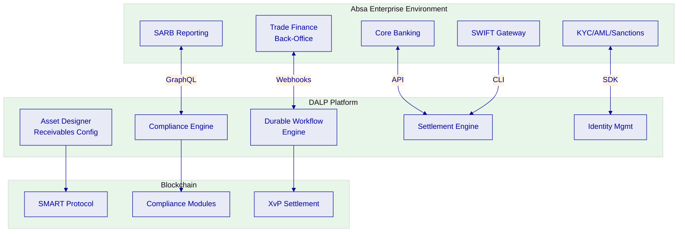
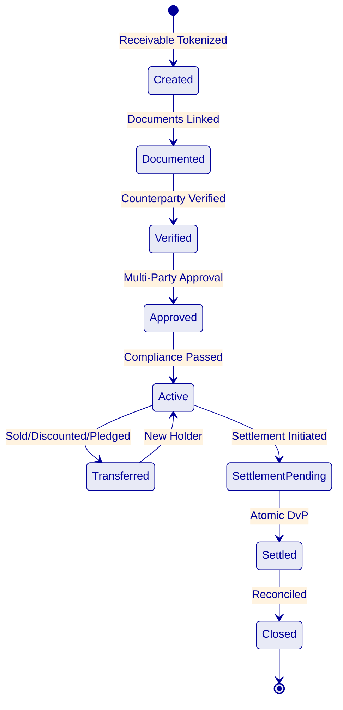
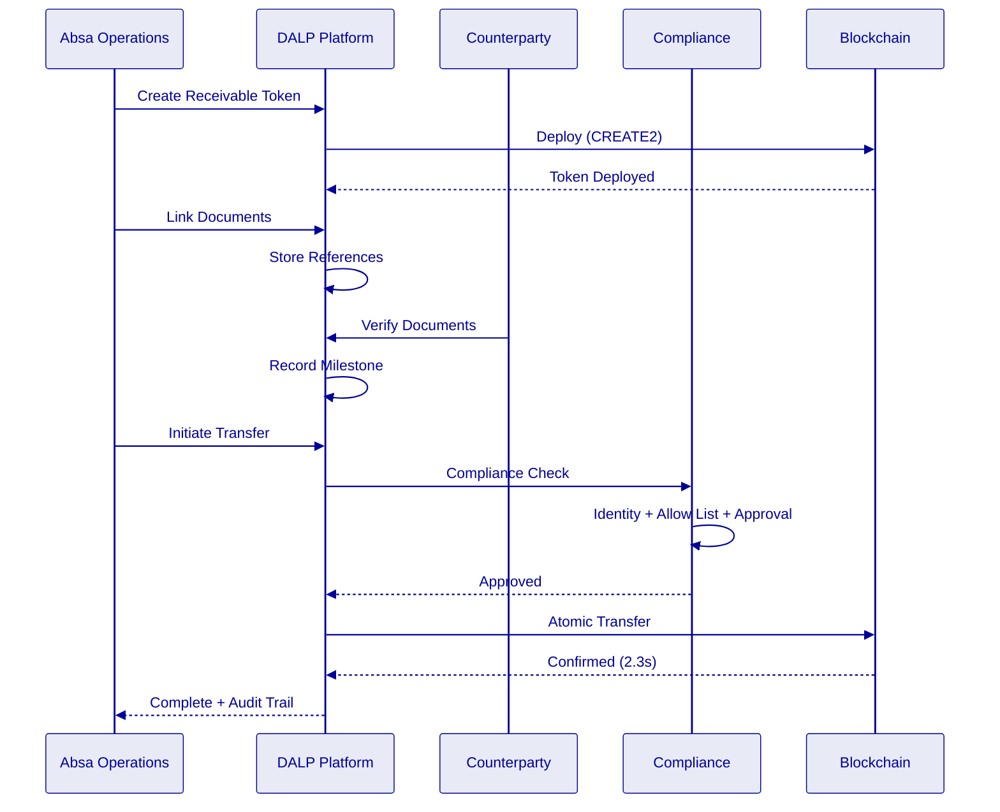
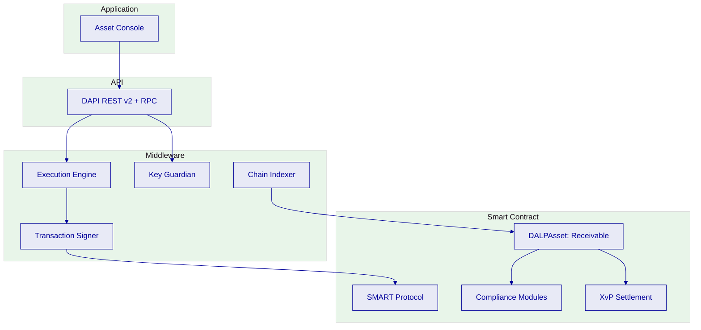
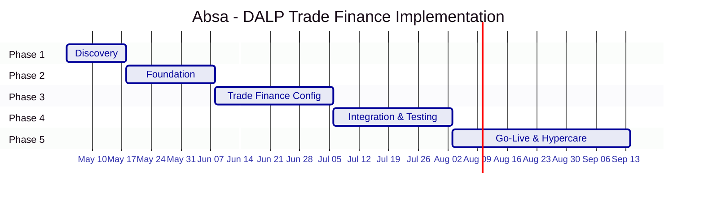

# Technical Proposal: Tokenized Trade Finance Workflow and Receivables Digitization

| Field | Value |
|---|---|
| Proposal title | Technical Proposal. Tokenized Trade Finance Workflow and Receivables Digitization |
| Client | Absa Group |
| Submitted by | SettleMint NV |
| Date | March 2026 |
| Version | v1.0 |
| Confidentiality | Restricted |
| RFP Reference | ABSA-GROUP-RFP-TOKENIZED-TRADE-FINANCE-202603 |
| Primary contact | Adam Popat, CEO |

---

## Table of Contents

- Executive Summary
- About SettleMint
- About DALP
- Understanding Absa's Programme Objectives
- Customer References
- Proposed Solution and Functional Capabilities
- Technical Architecture
- Smart Contract Architecture for Trade Finance
- Identity, Compliance, and Regulatory Controls
- Settlement, Servicing, and Lifecycle Management
- Integration Architecture
- Security, Resilience, and Operational Assurance
- Implementation Approach and Delivery Phases
- Deployment Model
- Training and Knowledge Transfer
- Support and SLA
- Risk Management
- Compliance Matrix
- Appendices

---

## Executive Summary

Absa Group has identified tokenized trade finance workflow and receivables digitization as a business-critical capability requiring production-grade discipline. This procurement seeks a platform that can support trade finance operations within South Africa's regulatory environment, including SARB prudential controls, FSCA financial sector regulations, and the practical considerations of cross-border African trade.

SettleMint's Digital Asset Lifecycle Platform (DALP) addresses this requirement through its durable workflow engine and configurable token architecture. DALP provides production-ready infrastructure for tokenizing trade finance instruments (letters of credit, bills of exchange, receivables), orchestrating multi-party approval workflows, enforcing compliance at the smart contract level, and settling through atomic delivery-versus-payment.

**Why DALP fits Absa Group's requirements:**

- **Trade finance workflow capability.** DALP's durable execution engine handles multi-step trade finance workflows, document presentation, counterparty verification, milestone approvals, limit checks, and conditional settlement, with deterministic completion guarantees. Each workflow step produces auditable evidence, and failure at any point triggers defined recovery paths. The Reserve Bank of India Innovation Hub engagement, multi-bank, multi-node, multi-cloud blockchain for fraud-proof trade finance (letters of credit), directly demonstrates this capability.

- **Receivables digitization.** DALPAsset's configurable architecture supports tokenization of trade receivables with document metadata linking, counterparty identity verification, transfer restrictions to nominated parties, and milestone-based liquidity release. Receivable tokens can be transferred (sold, discounted, pledged) with full compliance enforcement.

- **African market understanding.** SettleMint's Standard Chartered engagement spans Asia, Africa, and the Middle East. The South African Reserve Bank's Project Khokha (wholesale CBDC pilot) and JSE digital asset initiatives demonstrate the market's trajectory. DALP's configurable compliance engine accommodates SARB and FSCA requirements through module composition.

- **Production credentials.** 14 institutional deployments including Standard Chartered, Commerzbank (EUR 7M/year savings), OCBC, SBI, Islamic Development Bank. ISO 27001 and SOC 2 Type II certified.

- **Enterprise integration.** REST API v2, GraphQL, webhooks, SDK, CLI (301 commands). Connects to core banking, trade finance back-office, SWIFT, KYC/AML, and regulatory reporting.

The proposed implementation follows a 19-week phase-gated methodology with five formal gate reviews.

---

## About SettleMint

### Company Overview

SettleMint: production-grade digital asset lifecycle management for regulated markets. Founded 2016, Leuven, Belgium. 10 years continuous operation, 7+ years production deployments at regulated banks. ISO 27001, SOC 2 Type II.

### Relevance to Absa Group

| Credential | Evidence |
|---|---|
| Trade finance experience | RBI Innovation Hub: multi-bank LC processing |
| African market exposure | Standard Chartered: Asia, Africa, ME |
| Institutional deployments | 14 engagements at regulated institutions |
| Cross-border capability | Maybank Project Photon: atomic cross-border settlement |
| South Africa context | Awareness of Project Khokha, SARB framework, FSCA requirements |

---

## About DALP

### Trade Finance Lifecycle

### Core Capabilities for Trade Finance

**Durable Workflow Engine.** Multi-step trade finance workflows execute with deterministic completion guarantees. State persists to PostgreSQL, surviving restarts, network partitions, and partner outages. Configurable timeouts and escalation paths for long-running approval processes.

**Configurable Token Architecture.** DALPAsset supports trade finance instrument configuration: document reference metadata, milestone definitions, counterparty restrictions, holding period enforcement, and multi-party approval workflows.

**On-chain Compliance.** 18 compliance module types enforce transfer rules before execution. Identity verification, address allow lists (nominated counterparties), transfer approvals (maker-checker), and timelocks (holding periods) compose into instrument-specific compliance configurations.

**Atomic Settlement.** XvP settlement provides atomic DvP, both legs in a single transaction, zero counterparty exposure, deterministic finality (median 2.3s under IBFT 2.0).

---

## Customer References

### Trade Finance References

| Client | Relevance | Geography |
|---|---|---|
| RBI Innovation Hub | Multi-bank LC processing | India |
| Standard Chartered | Institutional trading, Africa exposure | Asia, Africa, ME |
| Commerzbank | Regulated settlement, EUR 7M/year savings | Germany |
| IsDB | Multi-country distribution (57 nations) | Global |
| Maybank Photon | Cross-border atomic settlement | Malaysia |

### Expanded: RBI Innovation Hub: Trade Finance

**Context.** The RBI Innovation Hub required multi-bank, multi-node, multi-cloud blockchain for fraud-proof trade finance, specifically letters of credit processing across multiple banks.

**Solution.** DALP powers blockchain and trade finance workflow: document verification, milestone tracking, multi-party approvals, settlement across banks. Multi-cloud deployment for resilience.

**Outcomes.** Fraud-proof LC workflows operational. Multi-bank participation. Multi-cloud resilience demonstrated.

**Transferability.** Directly maps to Absa's requirements: multi-party trade workflows, document-linked operations, counterparty verification, milestone-based settlement.

---

## Proposed Solution

### Solution Overview

DALP deploys as Absa's trade finance digitization platform covering:

1. **Receivable Tokenization:** Trade receivables represented as on-chain tokens with document metadata, counterparty identity, and compliance rules
2. **Workflow Orchestration:** Multi-step trade finance workflows with durable execution, milestone tracking, and audit evidence
3. **Settlement:** Atomic DvP for receivable transfers (sale, discount, pledge) and maturity settlement

### Receivable Token Configuration

**Features:**
1. Historical balances, trade history and audit
2. Timelock, holding period enforcement

**Compliance modules:**
1. Identity verification, counterparty identity required
2. Address allow list, nominated counterparties only
3. Transfer approval, multi-party with configurable expiry
4. Timelock, minimum holding period (FIFO tracking)

### Trade Finance Workflow

### Functional Fit Matrix

| Req | Summary | Status | Response |
|---|---|---|---|
| REQ-01 | Segregated environments | Full | Independent instances |
| REQ-02 | API-first interfaces | Full | DAPI, SDK, CLI, webhooks |
| REQ-03 | RBAC, maker-checker | Full | 26 roles, wallet verification |
| REQ-04 | Configurable lifecycle | Full | DALPAsset runtime config |
| REQ-05 | Dependency disclosure | Full | Register provided |
| REQ-06 | Resilience, monitoring | Full | Multi-AZ, Grafana |
| REQ-07 | Phased implementation | Full | 19-week methodology |
| REQ-08 | Audit evidence | Full | On-chain + off-chain |
| REQ-09 | Document-linked workflows | Full | Durable engine + metadata |
| REQ-10 | Core books reconciliation | Configurable | API integration Phase 4 |
| REQ-11 | Multi-entity limits | Configurable | Compliance modules + API |

---

## Technical Architecture

### Four-Layer Stack

### Security: 5-Layer Defense-in-Depth

1. Authentication (passkeys, LDAP, OAuth)
2. Authorization (26 roles, RBAC)
3. Wallet verification (step-up auth)
4. Compliance (18 modules, fail-closed)
5. Custody policy (DFNS/Fireblocks)

ISO 27001, SOC 2 Type II certified.

---

## Implementation (19 Weeks)

**Estimated Absa effort: 75 person-days**

---

## Deployment

| Aspect | Configuration |
|---|---|
| Model | Dedicated cloud |
| Region | AWS Cape Town or Azure South Africa |
| Data residency | South Africa compliant |
| Blockchain | 4-node Besu (IBFT 2.0) |

---

## Support: Premium

| Aspect | Configuration |
|---|---|
| Coverage | 16×5 |
| P1 response | 2 hours |
| Uptime SLA | 99.95% |
| Dedicated engineer | Yes |

---

## Risk Register

| ID | Risk | Mitigation |
|---|---|---|
| R1 | SARB/FSCA regulatory changes | Configurable compliance |
| R2 | Trade finance system complexity | Phase 1 deep discovery |
| R3 | Cross-border integration | Phased approach |
| R4 | Security review timeline | Pre-share certifications |

---

## Appendices

### Glossary

| Term | Definition |
|---|---|
| DALP | Digital Asset Lifecycle Platform |
| SMART Protocol | ERC-3643 implementation |
| DALPAsset | Configurable token contract |
| OnchainID | On-chain identity (ERC-734/735) |
| XvP | Atomic settlement addon |
