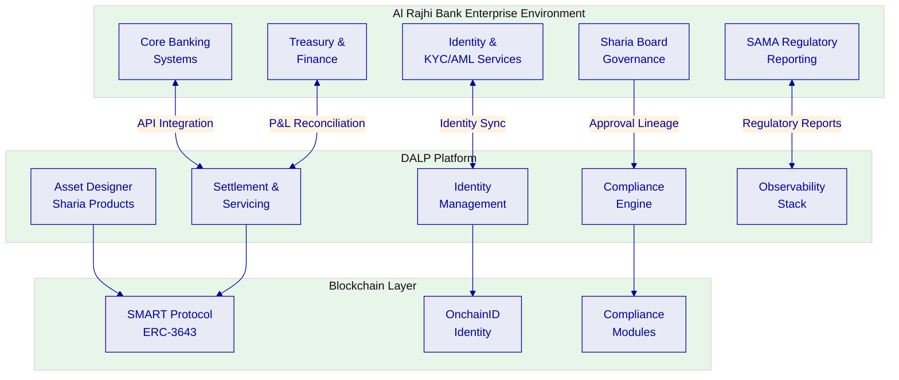
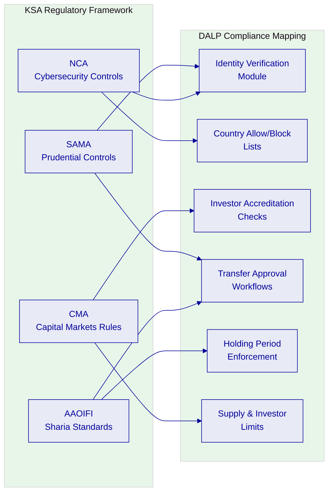
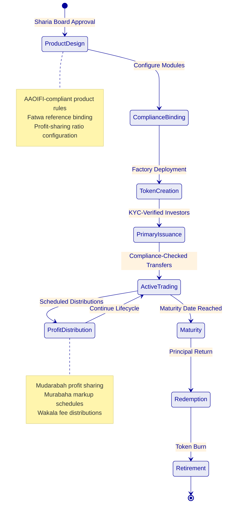
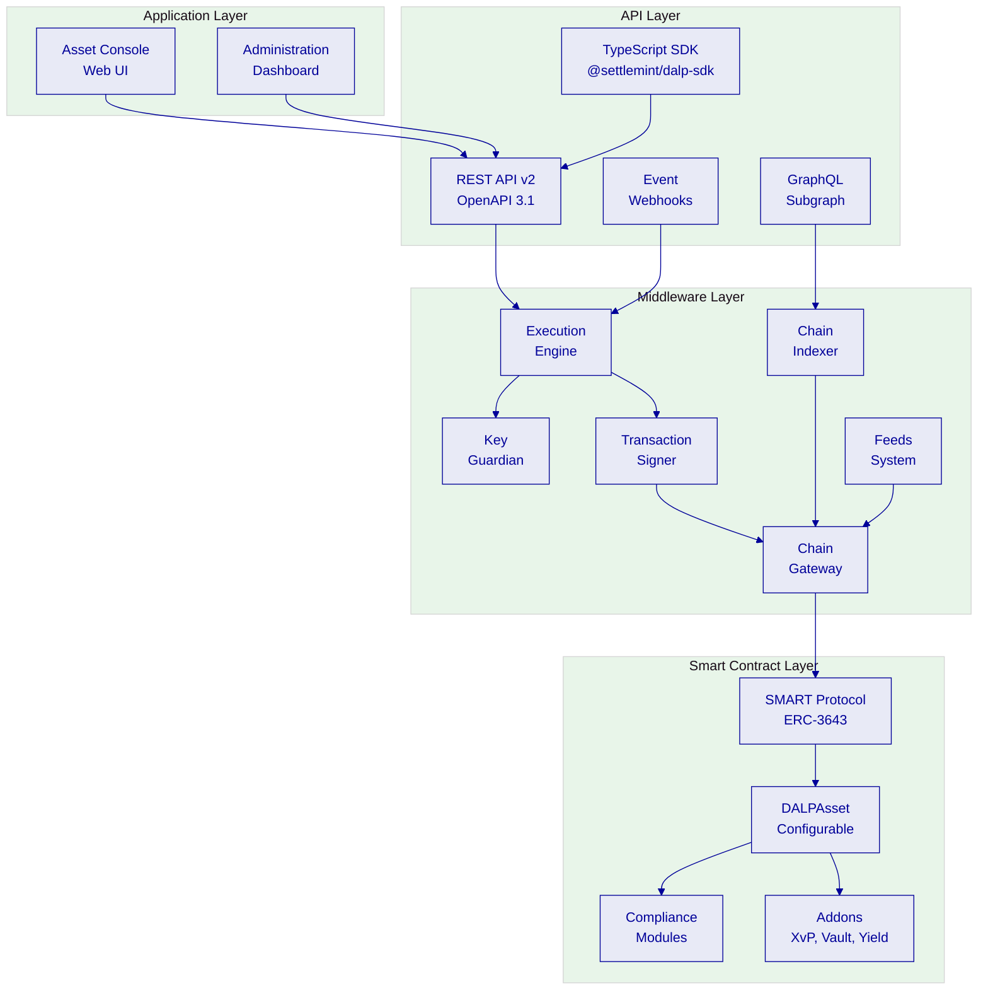
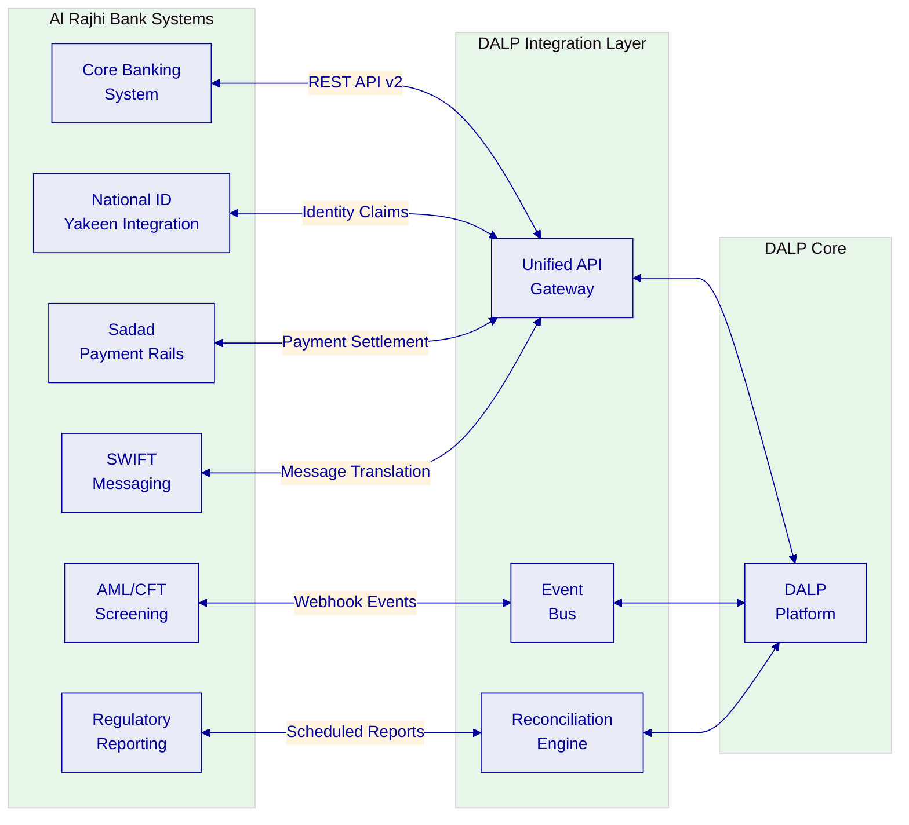
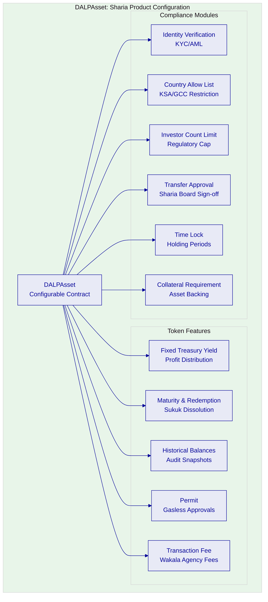
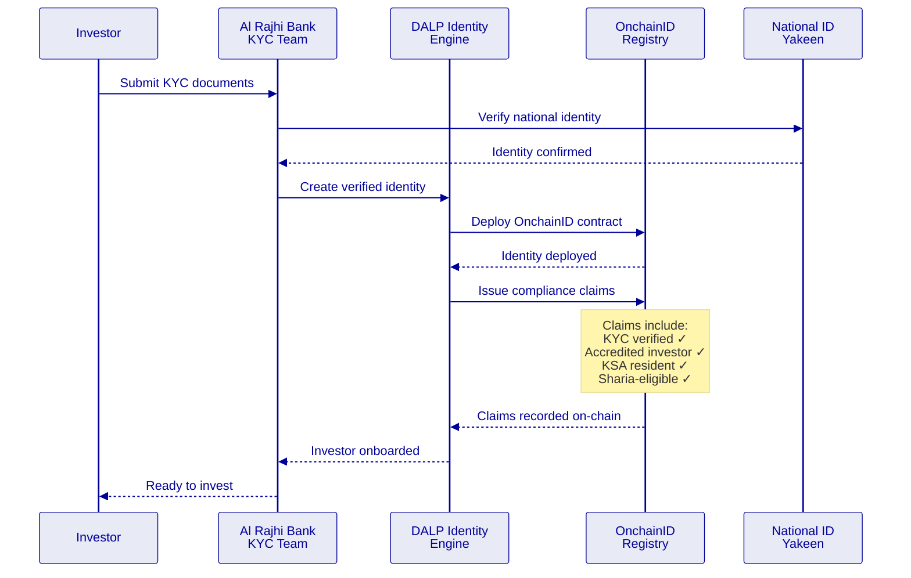
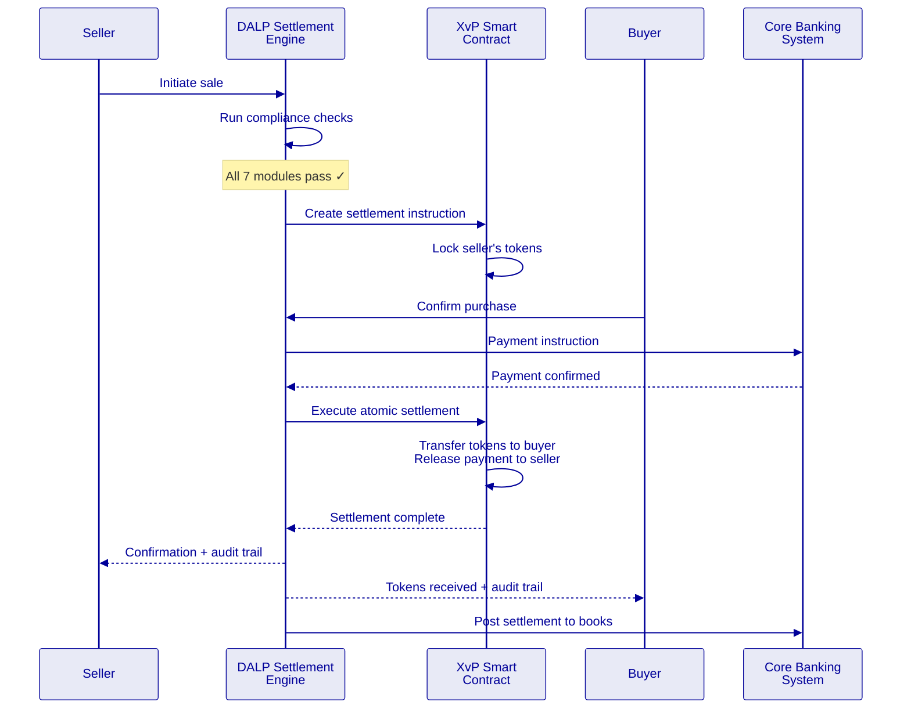
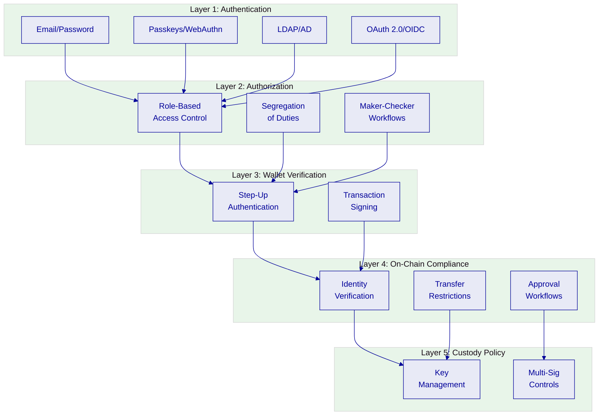
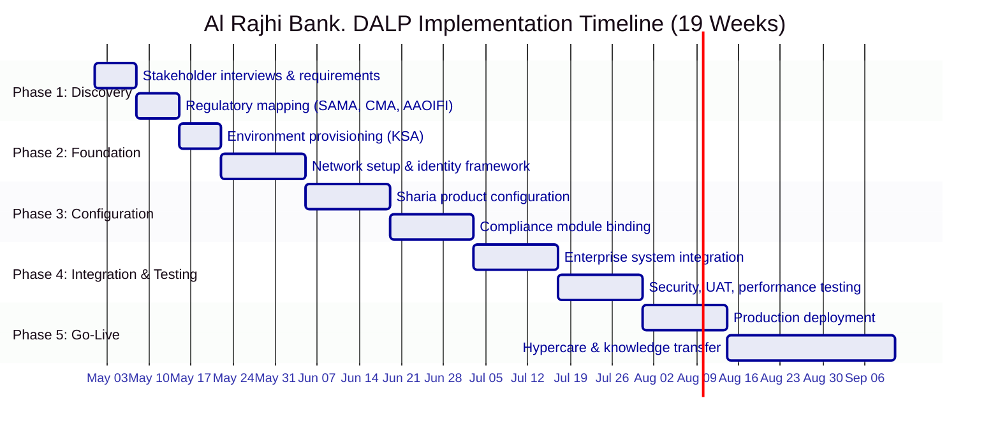

# Technical Proposal: Sharia-Compliant Tokenized Savings and Investment Products

| Field | Value |
|---|---|
| Proposal title | Technical Proposal. Sharia-Compliant Tokenized Savings and Investment Products |
| Client | Al Rajhi Bank |
| Submitted by | SettleMint NV |
| Date | March 2026 |
| Version | v1.0 |
| Confidentiality | Restricted |
| RFP Reference | AL-RAJHI-BANK-RFP-SHARIA-TOKENIZED-PRODUCTS-202603 |
| Primary contact | Adam Popat, CEO |

---

## Table of Contents

- Executive Summary
- Understanding Al Rajhi Bank's Programme Objectives
- Proposed DALP Operating Model for Sharia-Compliant Tokenized Products
- Technical Architecture and Integration Boundaries
- Smart Contract Architecture for Islamic Finance
- Identity, Compliance, and Sharia Governance Controls
- Settlement, Servicing, and Lifecycle Management
- Security, Resilience, and Operational Assurance
- Implementation Approach and Delivery Phases
- Current Coverage, Dependencies, and Qualified Gaps
- Relevant Delivery Evidence
- Appendices

---

## Executive Summary

Al Rajhi Bank has identified Sharia-compliant tokenized savings and investment products as a business-critical capability requiring the same discipline applied to core regulated systems. This is not an innovation exercise, it is a procurement intended to determine whether the market can supply a dependable platform and implementation model for production-grade tokenized Islamic finance products that operate within SAMA regulatory expectations, CMA capital markets rules, AAOIFI governance standards, and the bank's internal control environment.

SettleMint's Digital Asset Lifecycle Platform (DALP) addresses this requirement directly. DALP provides production-ready infrastructure for designing, issuing, servicing, and retiring tokenized financial instruments, with compliance enforcement, identity verification, and governance controls embedded at the smart contract level rather than bolted on as application-layer overlays.

**Why DALP fits Al Rajhi Bank's requirements:**

- **Sharia-compliant product configuration.** DALP's configurable token architecture allows the bank to define Sharia-compliant product rules, profit-sharing ratios, Mudarabah and Murabaha structures, maturity schedules, and distribution mechanics, through platform configuration rather than custom smart contract development. The compliance engine enforces eligibility checks, investor accreditation, and transfer restrictions at the contract level, ensuring that Sharia governance rules travel with the token throughout its lifecycle.

- **Production-proven at institutional scale.** DALP processes digital assets across production deployments with regulated institutions including Standard Chartered Bank, State Bank of India, Commerzbank, OCBC Bank, and the Islamic Development Bank. The Islamic Development Bank engagement, covering Sharia-compliant subsidy distribution across 57 member countries serving 1.7 billion people, directly demonstrates DALP's fitness for Islamic finance use cases at sovereign scale.

- **Enterprise integration, not isolation.** DALP connects to identity services, core banking ledgers, sanctions and AML tooling, reporting environments, and observability stacks through a comprehensive API surface (REST, GraphQL, webhooks, SDK, CLI). The platform does not create an isolated digital-asset island; it sits inside institutional plumbing with defined integration boundaries and reconciliation points.

- **Control integrity from day one.** Every operation, issuance, transfer, corporate action, distribution, produces a complete audit trail with initiator identity, policy checks applied, approval chain, and resulting state. Role-based access control with maker-checker workflows, segregation of duties, and Sharia board approval lineage are native to the platform.

The proposed implementation follows SettleMint's phase-gated methodology: 19 weeks from kickoff to hypercare completion, with five delivery phases, formal gate reviews, and clearly defined client responsibilities at each stage. The first production asset class can be live within 13 weeks of kickoff.

This proposal responds to every requirement in the RFP with explicit status, evidence references, and honest qualification of gaps. Where a capability is partial or planned, the gap, mitigation, and timeline are stated directly. SettleMint's position is that operational honesty earns more trust than an over-optimistic response, and we believe Al Rajhi Bank's evaluation team shares that view.

---

## Understanding Al Rajhi Bank's Programme Objectives

### The Challenge: Production-Grade Islamic Finance Tokenization

Al Rajhi Bank's procurement is grounded in three specific challenges that we address directly:

**First, control integrity.** The bank must be able to identify who initiated a change or transaction, which policy checks applied, who approved the event, and how the resulting state can be reconstructed later. For Sharia-compliant products, this extends to Sharia board approval lineage, fatwa references, and evidence that profit-sharing mechanics operate as certified.

**Second, enterprise coexistence.** The selected solution cannot become a reconciliation sinkhole. It must integrate with existing core banking, identity, compliance, treasury, and reporting systems without creating hidden operational debt or unowned responsibilities.

**Third, phased scalability.** Al Rajhi Bank wants to move from initial product launch to broader adoption, additional asset classes, investor segments, and distribution channels, without a platform reset.

DALP addresses all three challenges through its architecture:

- Control integrity is structural, not bolted on. Every transaction flows through the compliance engine, identity registry, and approval workflow before execution. Audit trails are immutable and queryable.
- Enterprise integration is the platform's default mode. DALP exposes 301 CLI commands across 26 command groups, a REST API (v2), GraphQL via subgraph, event webhooks, and a TypeScript SDK, providing multiple integration patterns for different enterprise system categories.
- Scalability is configuration-driven. New asset classes use the same DALPAsset configurable contract with different feature and compliance module compositions. No redeployment, no re-audit, no platform reset.

### Regulatory Context: KSA Market Realities

We anchor this response in the actual regulatory and market infrastructure realities of the Kingdom:

- **SAMA expectations** for digital asset platforms, including prudential controls, operational resilience, and outsourcing governance
- **CMA capital markets rules** governing tokenized investment products, investor eligibility, and market conduct
- **AAOIFI standards** for Islamic finance product governance, profit distribution, and Sharia compliance documentation
- **Saudi cybersecurity controls** (NCA) for critical infrastructure and data protection requirements
- **Project Aber** and Digital Dirham learnings relevant to cross-border settlement architecture, though not treated as substitutes for explicit control design

---

## Proposed DALP Operating Model for Sharia-Compliant Tokenized Products

### Operating Model Overview

The proposed operating model maps DALP's capabilities directly to Al Rajhi Bank's five workstreams. Each workstream is addressed with specific deliverables, responsibilities, and milestone gates, not generic methodology statements.

| Workstream | DALP Capability | Al Rajhi Bank Responsibility | Integration Point |
|---|---|---|---|
| WS-01: Mobilisation | Environment provisioning, governance framework | Steering committee, design authority | Joint RAID management |
| WS-02: Product Configuration | Asset Designer, compliance modules, lifecycle rules | Sharia board approval, product policy decisions | Business rules validation |
| WS-03: Integration | API surface, webhooks, event system | Core banking, identity, AML system readiness | Defined API contracts |
| WS-04: Testing | Platform test environments, security testing | UAT execution, business acceptance | Joint defect triage |
| WS-05: Operations | Observability stack, runbooks, SLA framework | Service desk staffing, management reporting | Support handoff protocol |

### Product Lifecycle for Sharia-Compliant Instruments

DALP supports the full lifecycle of Sharia-compliant tokenized products through its configurable architecture:

**Product Design and Configuration.** The Asset Designer wizard guides operators through Sharia-compliant product configuration. For each product type:

- **Mudarabah savings products:** Configure profit-sharing ratios, expected return ranges, distribution frequency, and loss-sharing mechanics. The platform enforces that profit distribution follows the contractually defined ratio, not a fixed interest rate.
- **Murabaha investment products:** Configure cost-plus-markup structures, deferred payment schedules, and ownership transfer mechanics. The compliance engine ensures the underlying asset transfer occurs before markup application.
- **Wakala investment products:** Configure agency fee structures, investment mandate parameters, and performance-based distribution rules.
- **Sukuk instruments:** Configure underlying asset references, periodic distribution schedules, dissolution mechanics, and Sharia board attestation requirements.

Each product configuration binds specific compliance modules that enforce Sharia governance rules at the smart contract level:

| Compliance Module | Sharia Application | Enforcement Level |
|---|---|---|
| Identity Verification | Investor KYC/AML, Saudi national ID integration | On-chain (pre-transfer) |
| Country Allow List | KSA-only or GCC-permitted investor base | On-chain (pre-transfer) |
| Investor Count Limit | Regulatory caps on participant numbers | On-chain (pre-mint) |
| Transfer Approval | Sharia board sign-off on secondary transfers | On-chain (pre-transfer) |
| Holding Period (Time Lock) | Minimum holding periods per AAOIFI guidance | On-chain (pre-transfer) |
| Collateral Requirement | Asset-backing verification for Sukuk | On-chain (pre-mint) |

---

## Technical Architecture and Integration Boundaries

### Four-Layer Architecture

DALP is built as a four-layer stack where each layer has a distinct responsibility boundary and layers communicate through well-defined interfaces:

**Requests flow top-down through these layers.** A user action in the Asset Console triggers an API call, which the middleware orchestrates into one or more blockchain transactions, which the smart contract layer validates and executes on-chain. Each layer independently enforces its own security controls, so no single-layer failure grants unauthorized access.

### Enterprise Integration Architecture for Al Rajhi Bank

The following diagram shows how DALP integrates with Al Rajhi Bank's enterprise systems, addressing the RFP's requirement that the solution fit into the broader enterprise stack without creating hidden operational debt:

**Integration patterns by system category:**

| Enterprise System | Integration Pattern | Data Flow | Frequency |
|---|---|---|---|
| Core Banking | REST API v2, bidirectional | Position sync, P&L booking | Real-time + batch reconciliation |
| AML/CFT Screening | Webhook events + API | Transaction alerts, case referrals | Real-time per transaction |
| National Identity (Yakeen) | Identity claims via API | KYC verification, identity attestation | On investor onboarding |
| Regulatory Reporting | Scheduled API extracts | SAMA reports, CMA filings | Daily/monthly per requirement |
| Sadad Payment Rails | Payment API integration | Fiat settlement instructions | Per settlement event |
| SWIFT Messaging | Message translation middleware | Cross-border instructions | Per cross-border transaction |

### Deployment Architecture

DALP supports three deployment models. For Al Rajhi Bank, we recommend a **dedicated cloud deployment** within KSA-resident infrastructure to satisfy data residency requirements:

| Environment | Purpose | Configuration |
|---|---|---|
| Development | Feature development, API testing | Shared infrastructure, reduced compute |
| UAT/Staging | Business acceptance, integration testing | Production-mirror configuration |
| DR | Disaster recovery, failover testing | Geo-separated within KSA |
| Production | Live operations | Full HA, dedicated compute, KSA data center |

REQ-01 (segregated environments) is fully supported. All environments are isolated at the network, compute, and data levels with separate access controls.

---

## Smart Contract Architecture for Islamic Finance

### DALPAsset Configuration for Sharia Products

All Sharia-compliant products use the DALPAsset configurable contract, which extends the SMART Protocol (ERC-3643) with runtime-pluggable features and compliance modules. This design means Al Rajhi Bank does not need separate smart contract development for each product type:

**Key Sharia compliance considerations in the smart contract design:**

1. **Profit vs. interest segregation (REQ-13).** The Fixed Treasury Yield feature is configured to distribute profits based on the contractually defined profit-sharing ratio, not a fixed interest rate. The distribution calculation references the actual investment pool performance, and the smart contract enforces that distributions are labelled and calculated as profit shares rather than interest payments. This distinction is enforced at the contract level and visible in all audit trails.

2. **Sharia board workflow integration (REQ-12).** The Transfer Approval compliance module supports multi-level approval workflows. For Sharia governance, this can be configured to require Sharia board representative approval for product launches, secondary market enablement, and distribution parameter changes. Each approval is recorded on-chain with the approver's verified identity, timestamp, and reference to the relevant fatwa or board resolution.

3. **AAOIFI documentation treatment.** Product configurations can reference specific AAOIFI standards (e.g., FAS 4 for Murabaha, FAS 3 for Mudarabah) in metadata fields that travel with the token throughout its lifecycle. These references are queryable via the API and included in regulatory reporting extracts.

### UUPS Proxy Upgrade Pattern

DALPAsset contracts are deployed using the UUPS (Universal Upgradeable Proxy Standard) pattern, which preserves all on-chain state during upgrades while allowing the implementation logic to evolve:

- The proxy contract holds the state (token balances, compliance configuration, identity data)
- Upgrade logic lives in the implementation contract, requiring explicit authorization via GOVERNANCE_ROLE
- Token addresses remain stable across upgrades, no migration required
- Immutable deployment is available for regulatory frameworks requiring compile-time guarantees

For Al Rajhi Bank, we recommend upgradeable deployment for development and UAT environments, with the option to deploy immutable contracts in production if required by SAMA or the bank's internal governance framework.

---

## Identity, Compliance, and Sharia Governance Controls

### Identity Management with OnchainID

DALP manages investor and participant identities through OnchainID (ERC-734/735), providing on-chain identity verification as a prerequisite for all asset operations:

### Role-Based Access Control and Maker-Checker (REQ-03)

DALP implements granular RBAC with segregation of duties across all operations:

| Role | Permissions | Maker-Checker Scope |
|---|---|---|
| Product Manager | Asset design, configuration | Creates product → requires Sharia Board approval |
| Compliance Officer | Compliance module configuration, claim management | Configures rules → requires Head of Compliance approval |
| Operations Manager | Issuance execution, distribution processing | Initiates operations → requires Treasury approval |
| Sharia Board Representative | Product certification, distribution approval | Reviews and certifies → recorded on-chain |
| Treasury Manager | Settlement authorization, reconciliation sign-off | Approves settlements → requires dual authorization |
| Platform Administrator | User management, environment configuration | System changes → requires CISO approval |
| Auditor (read-only) | Full audit trail access, report generation | No write access; complete read visibility |

Every action by every role produces an immutable audit log entry containing: user identity, timestamp, action performed, parameters, approval chain, and resulting state change.

### Compliance Engine: Fail-Closed Design

DALP's compliance engine evaluates a configurable set of transfer rules before each transaction. Modules evaluate in sequence, and a single module veto blocks the transfer. This is a **fail-closed design**: the default is denial unless all modules explicitly approve.

For Al Rajhi Bank's Sharia-compliant products, the compliance evaluation sequence is:

1. **Identity Verification**: Does the investor have a verified OnchainID with valid KYC claims?
2. **Country Allow List**: Is the investor's jurisdiction in the permitted list (KSA, or GCC if configured)?
3. **Investor Accreditation**: Does the investor meet the accreditation requirements for this product?
4. **Sharia Eligibility**: Does the investor have a valid Sharia-eligibility claim?
5. **Transfer Approval**: Has the required approval (Sharia board, compliance, or treasury) been granted?
6. **Holding Period**: Has the minimum holding period elapsed for FIFO-tracked token batches?
7. **Investor Count Limit**: Would this transfer exceed the regulatory cap on unique holders?

If any module denies the transfer, the transaction reverts with a specific error code identifying which compliance check failed. This provides Al Rajhi Bank's operations team with immediate visibility into why a transaction was blocked, supporting exception management and regulatory evidence requirements.

---

## Settlement, Servicing, and Lifecycle Management

### Settlement Architecture

DALP supports atomic Delivery versus Payment (DvP) settlement through the XvP Settlement addon, which ensures that asset delivery and payment occur simultaneously or not at all:

### Profit Distribution Workflow

For Sharia-compliant products, profit distributions follow a distinct workflow that ensures compliance with AAOIFI standards:

| Distribution Type | Mechanism | Compliance Control |
|---|---|---|
| Mudarabah profit share | Calculated from investment pool performance × agreed ratio | Enforced at contract level; cannot default to fixed rate |
| Murabaha markup payment | Scheduled payments per deferred sale agreement | Payment schedule locked at issuance; visible in audit trail |
| Wakala performance fee | Agent fee calculated on actual returns | Fee cap enforced at contract level |
| Sukuk periodic distribution | Rental income or profit from underlying asset | Distribution linked to verified asset performance data |

### Reconciliation Framework (REQ-04)

DALP provides comprehensive reconciliation capabilities between on-chain state and Al Rajhi Bank's books-and-records:

- **Real-time position sync** via API, on-chain balances queryable at any point in time using historical balance snapshots
- **Event-driven notifications**: every state change (mint, burn, transfer, distribution) triggers webhook events to downstream systems
- **Reconciliation extracts**: scheduled API exports in formats compatible with core banking reconciliation tools
- **Break identification**: discrepancies between on-chain state and expected positions surface through the observability dashboard
- **Audit trail correlation**: every on-chain transaction can be correlated with the initiating API call, approval chain, and downstream booking

---

## Security, Resilience, and Operational Assurance

### Security Architecture Overview

DALP implements defense-in-depth across five independent control layers:

### Certifications and Assurance (REQ-06)

| Certification | Status | Relevance |
|---|---|---|
| ISO 27001 | Current | Information security management system |
| SOC 2 Type II | Current | Security, availability, confidentiality controls |
| Smart contract audits | Completed per release | Independent security review of all on-chain code |
| Penetration testing | Annual + per major release | External assessment of platform security posture |

### Operational Resilience

| Capability | Implementation | Evidence |
|---|---|---|
| Recovery Point Objective (RPO) | < 1 hour | Continuous database replication, blockchain state is inherently replicated |
| Recovery Time Objective (RTO) | < 4 hours | Automated failover procedures, tested quarterly |
| Backup integrity | Daily automated backups with integrity verification | Tested restore procedures documented |
| Incident management | Structured escalation with defined severity levels | SLA-bound response times per severity |
| Monitoring | Three-pillar observability (metrics, logs, traces) | Pre-built Grafana dashboards, automated alerting |

---

## Implementation Approach and Delivery Phases

### 19-Week Implementation Plan

### Phase-by-Phase Detail

**Phase 1: Discovery and Requirements (Weeks 1–2)**
- Stakeholder interviews with business, technology, compliance, risk, Sharia board, and operations
- Regulatory mapping: SAMA, CMA, AAOIFI standards to specific DALP compliance modules
- Current-state assessment of core banking, identity, and compliance systems
- Architecture design for KSA-resident deployment
- **Gate deliverable:** Validated requirements document, target architecture, implementation roadmap

**Phase 2: Foundation and Setup (Weeks 3–5)**
- Environment provisioning: Dev, UAT, DR, and Production environments within KSA
- Blockchain network setup (permissioned Hyperledger Besu recommended for regulatory control)
- Identity framework deployment and Yakeen integration design
- Custody integration model selection (DFNS or Fireblocks)
- **Gate deliverable:** Functional platform environments ready for configuration

**Phase 3: Configuration and Compliance (Weeks 6–9)**
- Sharia product configuration: Mudarabah, Murabaha, Sukuk product templates
- Compliance module binding per product type (identity, jurisdiction, holding periods, approvals)
- Profit distribution schedule configuration
- Sharia board approval workflow setup
- **Gate deliverable:** Configured platform matching business and Sharia governance requirements

**Phase 4: Integration and Testing (Weeks 10–13)**
- Core banking integration (position sync, settlement booking)
- AML/CFT system integration (transaction monitoring, alert routing)
- Functional testing, security testing, performance testing, UAT
- Regulatory reporting validation
- **Gate deliverable:** Validated, integrated system with formal go-live readiness

**Phase 5: Go-Live and Hypercare (Weeks 14–19)**
- Production deployment (2 weeks)
- Knowledge transfer to operations team
- Hypercare: intensive post-go-live support (4 weeks)
- Service desk handoff and SLA activation
- **Gate deliverable:** Production system with operational readiness confirmed

### Client Responsibilities

Al Rajhi Bank's responsibilities during implementation include:
- Steering committee and design authority participation
- Sharia board availability for product certification
- Core banking and identity system API readiness
- UAT execution and business acceptance
- Operational staffing for post-go-live service desk
- Network and infrastructure provisioning (if on-premises deployment selected)

---

## Current Coverage, Dependencies, and Qualified Gaps

### Requirements Coverage Matrix

| Req ID | Requirement | Status | Evidence Reference |
|---|---|---|---|
| REQ-01 | Segregated environments | **Full** | Section: Deployment Architecture |
| REQ-02 | API-first interfaces, eventing, version governance | **Full** | Section: Technical Architecture |
| REQ-03 | RBAC, segregation of duties, maker-checker, audit logs | **Full** | Section: Identity, Compliance, and Sharia Governance |
| REQ-04 | Configurable lifecycle states, policy controls, limits, reconciliation | **Full** | Section: Settlement, Servicing, and Lifecycle Management |
| REQ-05 | Third-party dependency disclosure | **Full** | See Dependency Register below |
| REQ-06 | Resilience, recovery, monitoring, incident management | **Full** | Section: Security, Resilience, and Operational Assurance |
| REQ-07 | Delivery method, client effort, phased plan | **Full** | Section: Implementation Approach |
| REQ-08 | Audit evidence extraction, supervisory review, board reporting | **Full** | Section: Identity, Compliance, and Sharia Governance |
| REQ-12 | Sharia board workflows, fatwa references, AAOIFI documentation | **Partial** | Section: Smart Contract Architecture for Islamic Finance |
| REQ-13 | Profit vs. interest segregation | **Full** | Section: Smart Contract Architecture for Islamic Finance |

### Qualified Gaps and Mitigations

**REQ-12: Sharia board workflows. Partial.**

DALP's Transfer Approval compliance module supports multi-level approval workflows that can be configured for Sharia board sign-off requirements. Fatwa references can be stored as metadata attached to product configurations and are included in audit trail extracts.

However, DALP does not currently provide a dedicated Sharia board portal with specialized UI for fatwa management, board resolution tracking, or AAOIFI standard compliance dashboards. These capabilities are achievable through:

1. **Configuration of existing approval workflows** (available now). Sharia board representatives are assigned the GOVERNANCE_ROLE with approval permissions on product configuration and distribution events
2. **Custom dashboard development** (implementation phase, estimated 2 weeks additional effort). A dedicated Sharia governance view can be built using DALP's API and the existing observability stack
3. **AAOIFI reporting templates** (Q3 2026 roadmap). Structured reporting templates aligned to specific AAOIFI Financial Accounting Standards are in development

**Mitigation timeline:** Core Sharia governance workflows are functional from day one through existing approval mechanisms. The dedicated Sharia board dashboard is deliverable during the implementation phase. AAOIFI reporting templates are targeted for Q3 2026 and will be delivered as a platform update within the license term.

### Dependency Register

| Dependency | Type | Owner | Risk |
|---|---|---|---|
| KSA-resident cloud infrastructure | Infrastructure | Al Rajhi Bank / Cloud provider | Medium, requires provisioning lead time |
| Core banking API readiness | Integration | Al Rajhi Bank | High, critical path for settlement booking |
| Yakeen national identity integration | Integration | Al Rajhi Bank / NIC | Medium, required for investor onboarding |
| Sharia board availability | Business | Al Rajhi Bank | Medium, required for product certification gates |
| SAMA regulatory guidance on tokenized products | Regulatory | SAMA | Low, current framework sufficient for initial scope |
| Custody provider selection | Technical | Joint decision | Medium, affects key management architecture |

---

## Relevant Delivery Evidence

### Reference Deployments

| Client | Region | Asset Class | Relevance to Al Rajhi Bank |
|---|---|---|---|
| Islamic Development Bank | Multi-region (57 countries) | Subsidy tokens, Sharia-compliant | Direct. Sharia-compliant tokenization at sovereign scale |
| Saudi Arabia RER | KSA | Real estate | Direct. KSA production deployment, national-scale |
| Standard Chartered Bank | Asia, Africa, Middle East | Securities | Direct, multi-jurisdiction bank deployment |
| State Bank of India | South Asia | CBDC | Relevant, national-scale institutional deployment |
| OCBC Bank | Southeast Asia | Securities, bonds, real estate | Relevant, regulated bank, multi-asset |
| Commerzbank | Europe | Exchange-traded products | Relevant, hybrid on/off-chain, regulated exchange |

### Islamic Development Bank: Sharia-Compliant at Sovereign Scale

The Islamic Development Bank engagement is the most directly relevant reference for Al Rajhi Bank. SettleMint delivered a Sharia-compliant blockchain-based subsidy distribution system serving 57 member countries and 1.7 billion people. The system:

- Operates under Islamic finance principles with peer-to-peer fund delivery
- Handles multi-country distribution with jurisdiction-specific compliance rules
- Provides complete audit trails for Sharia governance review
- Demonstrates DALP's capability to operate at sovereign scale within Islamic finance frameworks

### Saudi Arabia RER: Production in KSA

SettleMint serves as the delivery partner for Saudi Arabia's national-scale Real Estate Registry blockchain. This project demonstrates:

- Production deployment within KSA
- Integration with national identity (Yakeen) and payment rails (Sadad)
- Multi-stakeholder governance (PropTechs, banks, government agencies)
- Live production transactions since January 2026

---

## Appendices

### Appendix A: Response Matrix

A detailed response matrix mapping every RFP requirement (REQ-01 through REQ-13, RC-01 through RC-06) to specific proposal sections, compliance status, and evidence references is provided as a separate document.

### Appendix B: Glossary

| Term | Definition |
|---|---|
| DALP | Digital Asset Lifecycle Platform. SettleMint's production-grade tokenization platform |
| SMART Protocol | SettleMint Adaptable Regulated Token. ERC-3643 implementation for compliant security tokens |
| DALPAsset | Configurable token contract supporting runtime feature and compliance module composition |
| OnchainID | On-chain identity standard (ERC-734/735) for verifiable KYC/AML claims |
| XvP Settlement | Exchange versus Payment, atomic settlement ensuring simultaneous asset and payment transfer |
| AAOIFI | Accounting and Auditing Organization for Islamic Financial Institutions |
| Mudarabah | Islamic profit-sharing partnership where one party provides capital, the other provides management |
| Murabaha | Islamic cost-plus financing where the bank purchases an asset and resells at an agreed markup |
| Wakala | Islamic agency contract where one party acts as agent for investment on behalf of the principal |
| Sukuk | Islamic equivalent of bonds, certificates representing ownership in an underlying asset |
| SAMA | Saudi Arabian Monetary Authority (now Saudi Central Bank) |
| CMA | Capital Market Authority of Saudi Arabia |

### Appendix C: IP and Confidentiality Statement

This proposal contains no internal tool names, code snippets, file paths, or internal project references. All technical descriptions use client-facing terminology appropriate for external communication. Document metadata has been reviewed to ensure no internal information leakage.
