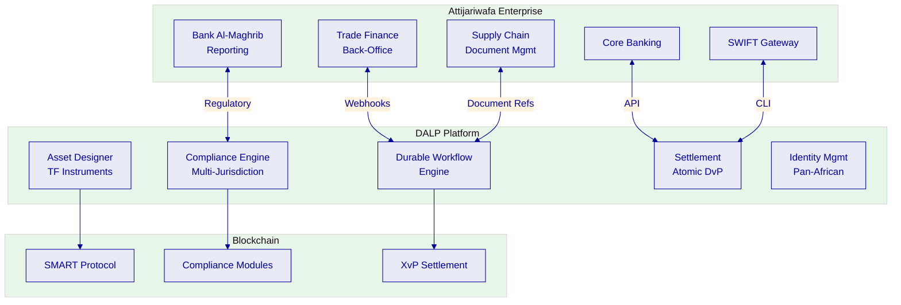
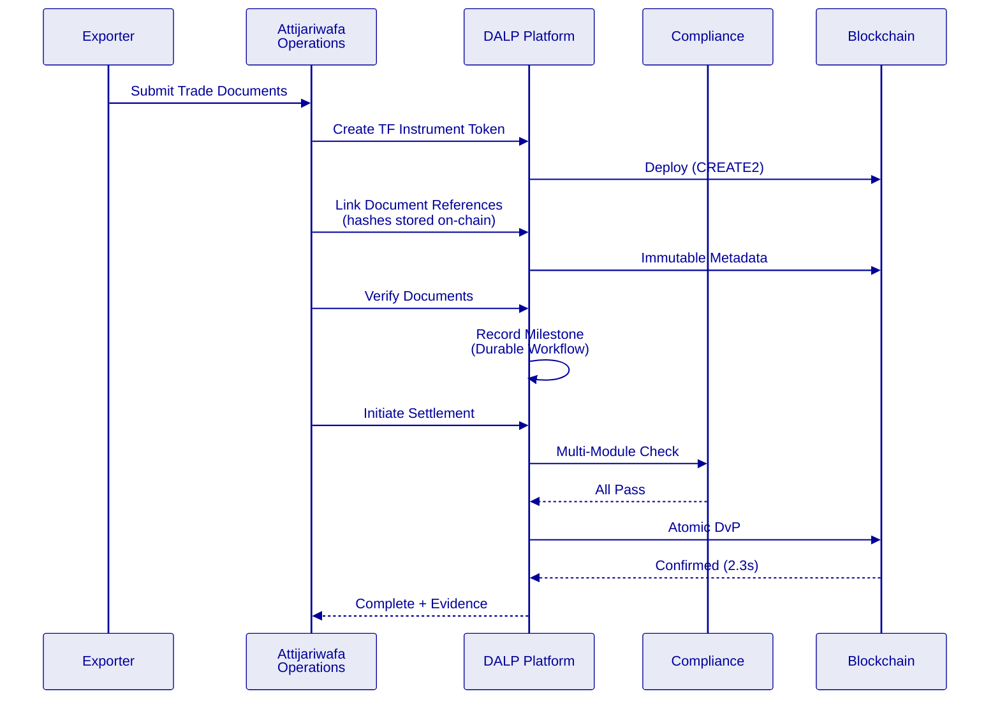
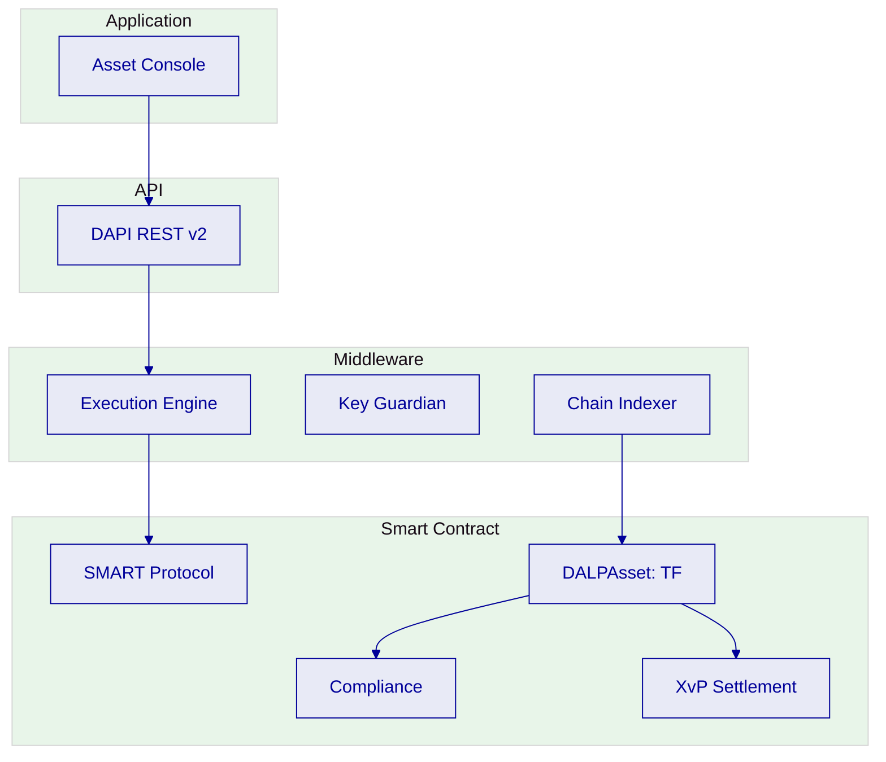
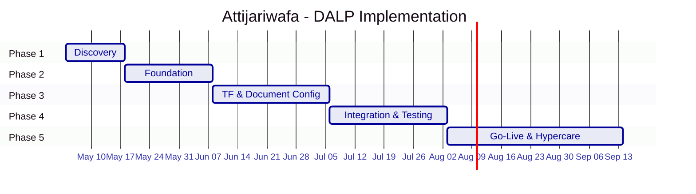

# Technical Proposal: Tokenized Trade Finance and Supply-Chain Document Digitization

| Field | Value |
|---|---|
| Proposal title | Technical Proposal. Tokenized Trade Finance and Supply-Chain Document Digitization |
| Client | Attijariwafa Bank |
| Submitted by | SettleMint NV |
| Date | March 2026 |
| Version | v1.0 |
| Confidentiality | Restricted |
| RFP Reference | ATTIJARIWAFA-BANK-RFP-TOKENIZED-TRADE-FINANCE-MOROCCO-202603 |
| Primary contact | Adam Popat, CEO |

---

## Table of Contents

- Executive Summary
- About SettleMint
- About DALP
- Understanding Attijariwafa's Programme Objectives
- Customer References
- Proposed Solution and Functional Capabilities
- Technical Architecture
- Smart Contract Architecture for Trade Finance
- Identity, Compliance, and Regulatory Controls
- Settlement, Servicing, and Lifecycle Management
- Integration Architecture
- Security, Resilience, and Operational Assurance
- Implementation Approach and Delivery Phases
- Deployment Model
- Training and Knowledge Transfer
- Support and SLA
- Risk Management
- Compliance Matrix
- Appendices

---

## Executive Summary

Attijariwafa Bank has identified tokenized trade finance and supply-chain document digitization as a business-critical capability. As Morocco's largest banking group with significant pan-African operations, Attijariwafa requires a platform that operates within Bank Al-Maghrib regulatory expectations, AMMC capital markets rules, and supports the cross-border trade finance requirements of its pan-African network spanning 25+ countries.

SettleMint's Digital Asset Lifecycle Platform (DALP) addresses this through its durable workflow engine and configurable token architecture. DALP provides production-ready infrastructure for tokenizing trade finance instruments, digitizing supply-chain documents with on-chain evidence, orchestrating multi-party approval workflows, and settling through atomic delivery-versus-payment.

**Why DALP fits Attijariwafa Bank's requirements:**

- **Trade finance workflow expertise.** The RBI Innovation Hub engagement, multi-bank, multi-node, multi-cloud blockchain for fraud-proof letters of credit, directly demonstrates DALP's capability for the document-linked, multi-party trade workflows that Attijariwafa requires.

- **Supply-chain document digitization.** DALP's metadata linking, durable workflow engine, and compliance modules support the digitization of supply-chain documents with on-chain evidence of document presentation, verification, and approval. Document references (hashes, identifiers) are stored immutably on-chain while document content remains in Attijariwafa's document management systems.

- **Cross-border African trade.** Standard Chartered's engagement spans Africa. The Islamic Development Bank program operates across 57 countries including multiple African nations. DALP's configurable compliance engine accommodates multi-jurisdiction requirements through per-token compliance module composition.

- **Production credentials.** 14 institutional deployments. Commerzbank: EUR 7M/year savings. ISO 27001, SOC 2 Type II.

- **Enterprise integration.** REST API v2, GraphQL, webhooks, SDK, CLI (301 commands). Connects to core banking, trade finance systems, SWIFT, KYC/AML.

---

## About SettleMint

### Relevance to Attijariwafa Bank

| Credential | Evidence |
|---|---|
| Trade finance | RBI Innovation Hub: multi-bank LC processing |
| African market | Standard Chartered: Africa exposure; IsDB: African nations |
| Islamic finance | IsDB: Sharia-compliant distribution across 57 countries |
| Institutional scale | 14 deployments, 7+ years production |
| Certifications | ISO 27001, SOC 2 Type II |

---

## About DALP

### Supply-Chain Document Digitization

DALP's document digitization capability for trade finance:

**Document reference model:**
- Document hashes stored on-chain as immutable metadata
- Document content remains in Attijariwafa's document management system
- Verification status recorded as workflow milestone with approver identity
- Any change to references produces an audit event
- Full lifecycle evidence preserved for regulatory examination

### Core Capabilities

**Durable Workflow Engine:** Multi-step supply-chain workflows with deterministic completion, state persistence, timeout management, and escalation paths.

**Configurable Tokens:** DALPAsset with document metadata, counterparty restrictions, multi-party approvals, holding period enforcement.

**On-chain Compliance:** 18 modules. Identity verification, address allow lists, transfer approvals, timelocks. Fail-closed logic.

**Atomic Settlement:** XvP, both legs in single transaction, deterministic finality (2.3s median, 4.1s P99 under IBFT 2.0).

---

## Understanding Attijariwafa's Programme Objectives

### Client Context

**Challenge 1: Pan-African trade complexity.** Attijariwafa operates across 25+ African countries with different regulatory frameworks. The platform must support multi-jurisdiction compliance through configurable per-token module composition.

**Challenge 2: Supply-chain document integrity.** Paper-based trade documents create fraud risk, processing delays, and audit challenges. On-chain document references with immutable verification timestamps address these concerns.

**Challenge 3: Cross-border settlement efficiency.** Current cross-border trade settlement involves multiple intermediaries and T+3 to T+5 delays. Atomic DvP reduces this to under 3 seconds.

### Regulatory Context: Morocco

| Regulator | Requirements | DALP Coverage |
|---|---|---|
| Bank Al-Maghrib | Prudential controls, operational resilience | Multi-AZ, defense-in-depth |
| AMMC | Capital markets, financial instruments | Compliance modules, OnchainID |
| Morocco AML/CFT | Anti-money laundering | OnchainID with KYC claims |
| Morocco data protection | Data residency, privacy | Configurable deployment location |

---

## Customer References

| Client | Trade Finance Relevance |
|---|---|
| RBI Innovation Hub | Multi-bank LC processing, direct match |
| Standard Chartered | Africa market exposure |
| IsDB | Pan-African, Sharia-compliant operations |
| Commerzbank | Regulated settlement, EUR 7M/year savings |
| Maybank Photon | Cross-border atomic settlement |

---

## Proposed Solution

### Trade Finance Instrument Configuration

**Features:** Historical balances, timelock

**Compliance modules:** Identity verification, address allow list, transfer approval, timelock

### Supply-Chain Workflow

| Stage | DALP Component | Evidence |
|---|---|---|
| Document creation | Metadata linking | Hash on-chain |
| Document verification | Workflow milestone | Approver + timestamp |
| Counterparty approval | Transfer approval module | Multi-party |
| Compliance check | Compliance engine | 18 modules |
| Settlement | XvP | Atomic, 2.3s |
| Reconciliation | API integration | Webhook-driven |

### Functional Fit Matrix

| Req | Summary | Status |
|---|---|---|
| REQ-01 | Segregated environments | Full |
| REQ-02 | API-first interfaces | Full |
| REQ-03 | RBAC, maker-checker | Full |
| REQ-04 | Configurable lifecycle | Full |
| REQ-05 | Dependency disclosure | Full |
| REQ-06 | Resilience, monitoring | Full |
| REQ-07 | Phased implementation | Full |
| REQ-08 | Audit evidence | Full |
| REQ-09 | Document-linked workflows | Full |
| REQ-10 | Core books reconciliation | Configurable |
| REQ-11 | Multi-entity limits | Configurable |

---

## Technical Architecture

### Security: 5-Layer Defense-in-Depth

1. Authentication (passkeys, LDAP, OAuth)
2. Authorization (26 roles)
3. Wallet verification
4. Compliance (18 modules)
5. Custody policy

ISO 27001, SOC 2 Type II.

---

## Implementation (19 Weeks)

**Estimated client effort: 75 person-days**

---

## Deployment

| Aspect | Configuration |
|---|---|
| Model | Dedicated cloud |
| Region | AWS Europe (Paris) or Azure France |
| Data residency | Morocco/EU compliant |
| Blockchain | 4-node Besu (IBFT 2.0) |

---

## Support: Premium

| Aspect | Configuration |
|---|---|
| Coverage | 16×5 |
| P1 response | 2 hours |
| Uptime SLA | 99.95% |

---

## Risk Register

| ID | Risk | Mitigation |
|---|---|---|
| R1 | BAM regulatory changes | Configurable compliance |
| R2 | Pan-African integration complexity | Phased rollout by country |
| R3 | Document management integration | Phase 1 discovery |
| R4 | Cross-border data residency | Configurable deployment |

---

## Appendices

### Glossary

| Term | Definition |
|---|---|
| DALP | Digital Asset Lifecycle Platform |
| SMART Protocol | ERC-3643 implementation |
| DALPAsset | Configurable token contract |
| OnchainID | On-chain identity (ERC-734/735) |
| XvP | Atomic settlement addon |
