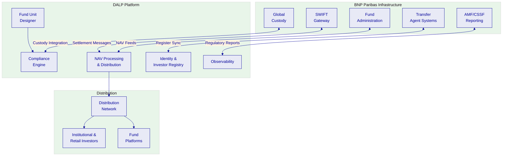
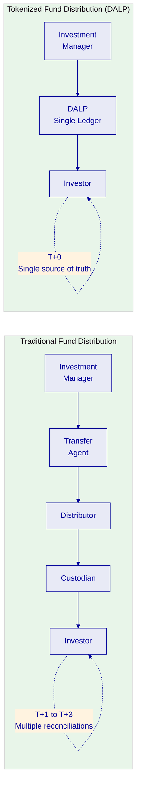
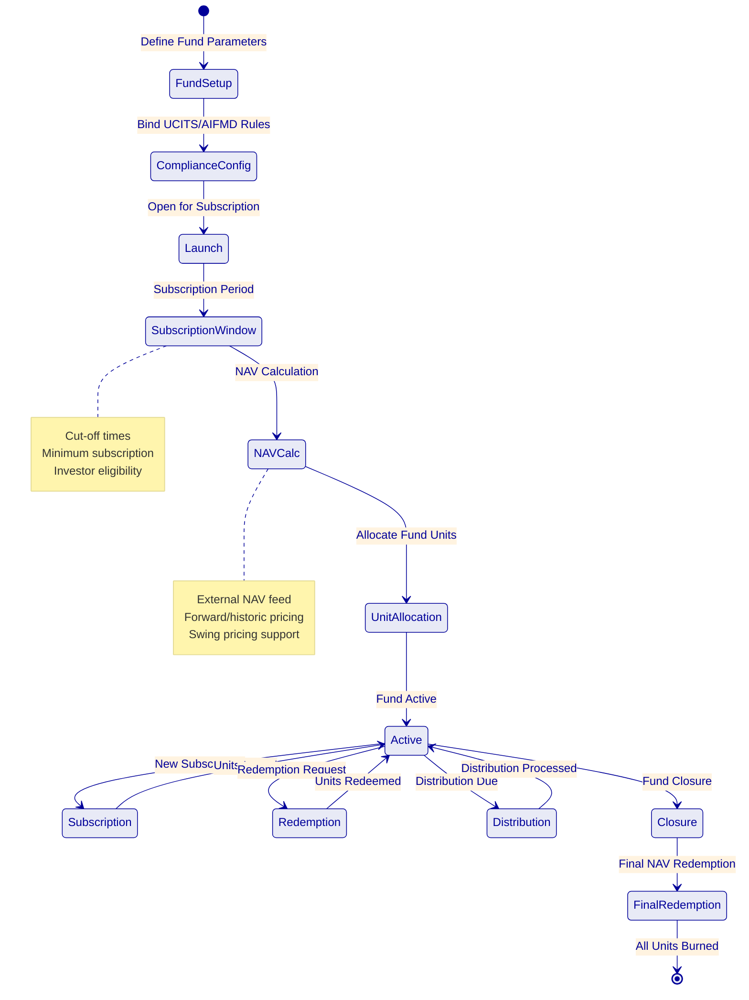
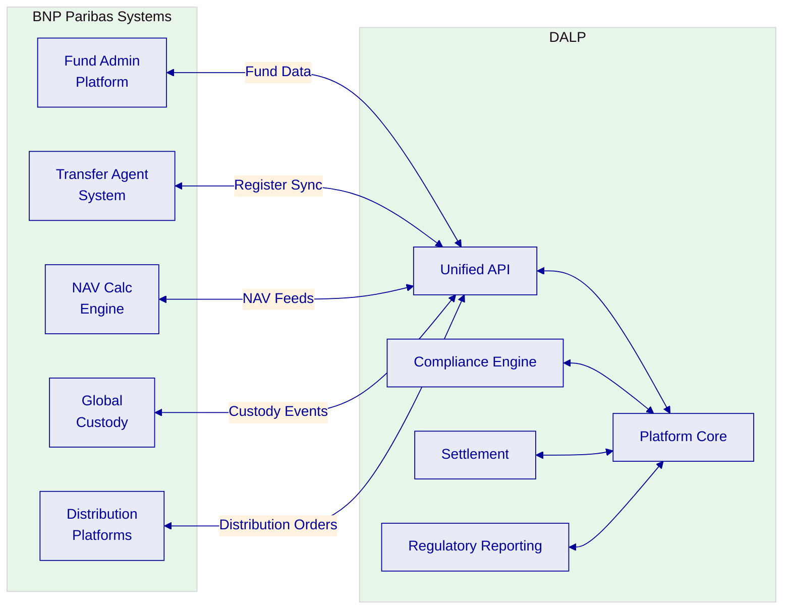
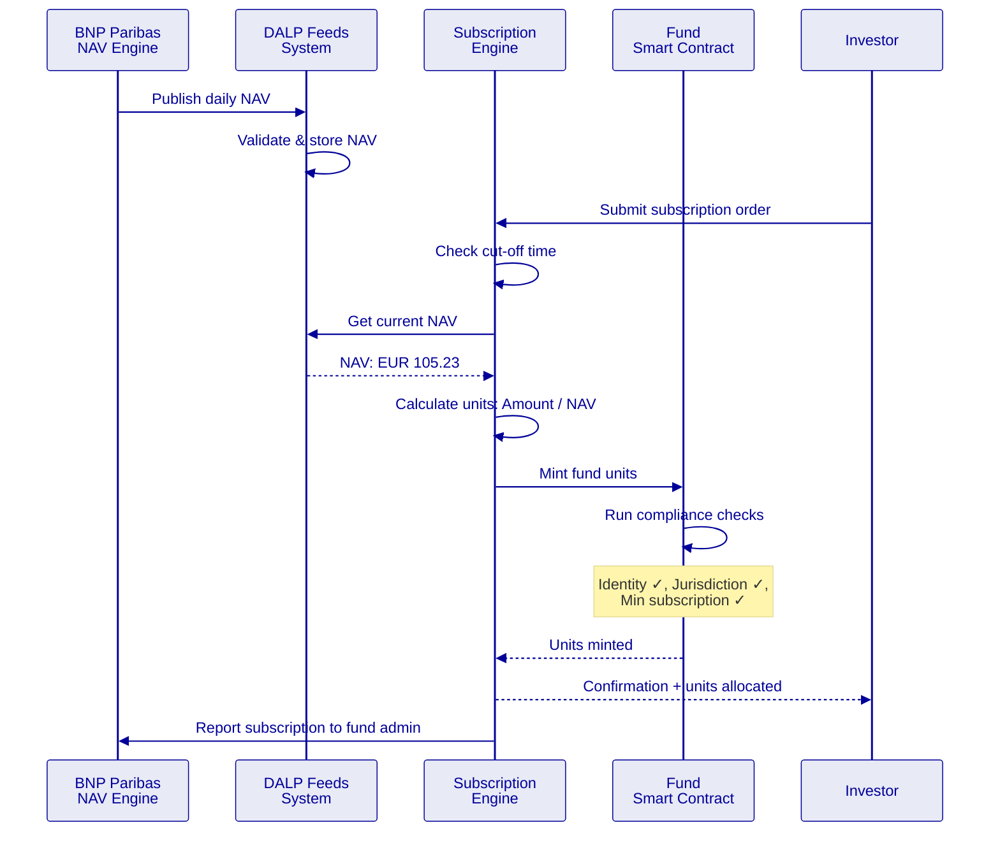
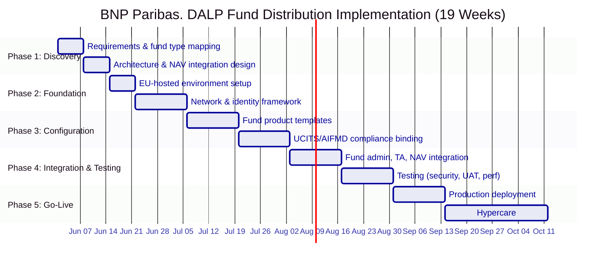

# Technical Proposal: Tokenized Funds Distribution Platform

| Field | Value |
|---|---|
| Proposal title | Technical Proposal. Tokenized Funds Distribution Platform |
| Client | BNP Paribas |
| Submitted by | SettleMint NV |
| Date | March 2026 |
| Version | v1.0 |
| Confidentiality | Restricted |
| RFP Reference | BNP-PARIBAS-RFP-TOKENIZED-FUNDS-202603 |
| Primary contact | Adam Popat, CEO |

---

## Table of Contents

- Executive Summary
- Understanding BNP Paribas's Programme Objectives
- Proposed DALP Operating Model for Tokenized Funds
- Technical Architecture and Integration Boundaries
- Fund-Specific Smart Contract Architecture
- Identity, Compliance, and MiCA/UCITS Controls
- Distribution, NAV Processing, and Lifecycle Management
- Security, Resilience, and Operational Assurance
- Implementation Approach and Delivery Phases
- Current Coverage, Dependencies, and Qualified Gaps
- Relevant Delivery Evidence
- Appendices

---

## Executive Summary

BNP Paribas has identified tokenized fund distribution as a strategic capability for transforming its asset servicing and fund administration operations. As the world's largest custodian by assets under custody and a leading fund administrator, BNP Paribas is uniquely positioned to define how tokenized funds are distributed, settled, and serviced across European and global markets.

SettleMint's Digital Asset Lifecycle Platform (DALP) provides the infrastructure for the complete fund tokenization lifecycle, from fund unit creation and distribution through NAV-based subscription and redemption, transfer agent automation, and regulatory reporting, with MiCA compliance and UCITS/AIFMD fund governance controls embedded at the smart contract level.

**Why DALP fits BNP Paribas's requirements:**

- **Full fund lifecycle coverage.** DALP manages fund unit issuance, subscription processing, redemption handling, distribution payments, corporate actions, and fund closure through configurable smart contracts. The Fund asset class in DALPAsset supports NAV-based pricing, subscription windows, redemption queues, and transfer restrictions, all configurable without custom development.

- **Transfer agent automation.** DALP's configurable compliance modules and approval workflows can automate core transfer agent functions: investor eligibility verification, subscription/redemption processing, register maintenance, and distribution calculations. This reduces manual processing while maintaining the audit trails required by fund administrators.

- **MiCA and UCITS compliance.** DALP's compliance engine supports MiCA token classification, UCITS distribution rules, AIFMD investor eligibility restrictions, and cross-border fund passport requirements. Compliance modules enforce these rules at the smart contract level, ensuring that every fund unit transfer complies with the applicable regulatory framework.

- **Production reference in fund operations.** KBC Securities (Bolero Crowdfunding) deployed DALP for equity crowdfunding with corporate actions, lifecycle events, and fiat-backed token settlement, demonstrating DALP's capability to handle fund-like operations including subscription, distribution, and redemption workflows.

---

## Understanding BNP Paribas's Programme Objectives

### The Fund Distribution Challenge

Traditional fund distribution involves multiple intermediaries, transfer agents, fund administrators, distributors, custodians, and settlement systems, each maintaining separate records that require constant reconciliation. A single subscription or redemption can take T+1 to T+3 to settle, with manual processing at multiple points in the chain.

Tokenized fund distribution collapses this intermediary chain. Fund units represented as tokens on a single ledger eliminate the reconciliation burden, enable T+0 or T+1 settlement, and provide real-time visibility into the investor register for all authorized parties.

BNP Paribas's programme objectives:

**First, distribution efficiency.** Reduce the cost and time of fund distribution by automating subscription, redemption, and transfer processing through smart contracts while maintaining regulatory compliance across jurisdictions.

**Second, register accuracy.** Provide a single source of truth for fund unit ownership, eliminating reconciliation between transfer agents, custodians, and distributors.

**Third, cross-border scalability.** Support fund distribution across multiple EU jurisdictions under MiCA, UCITS, and AIFMD frameworks, with the ability to extend to non-EU markets.

---

## Proposed DALP Operating Model for Tokenized Funds

### Fund Lifecycle Coverage

### Fund Configuration Parameters

| Parameter | Description | DALP Configuration |
|---|---|---|
| Fund type | UCITS, AIFM, money market, ETF | Compliance module binding |
| NAV pricing | Forward, historic, dual pricing | Feeds System integration |
| Subscription cut-off | Daily, weekly, monthly | Configurable schedule |
| Redemption notice | T+0 to T+5 | Time Lock module |
| Minimum subscription | Per investor class | Supply limit module |
| Distribution policy | Accumulating or distributing | Yield feature |
| Swing pricing | Anti-dilution mechanism | Fee feature configuration |
| Transfer restrictions | Lock-up periods, qualified investor only | Compliance modules |

---

## Technical Architecture and Integration Boundaries

### Enterprise Integration for BNP Paribas

### NAV Feed Integration

---

## Identity, Compliance, and MiCA/UCITS Controls

### Multi-Jurisdiction Fund Compliance

| Framework | Requirement | DALP Module |
|---|---|---|
| UCITS | Investor eligibility per share class | Investor Accreditation + Country Allow List |
| AIFMD | Professional investor restriction | Investor Accreditation module |
| MiCA | Token classification, disclosure | Asset metadata + compliance modules |
| MiFID II | Distribution suitability | Transfer Approval (distributor attestation) |
| GDPR | Investor data protection | On-chain pseudonymity + off-chain PII |
| PRIIPS | KID documentation | Metadata fields with document references |

### Investor Classification

| Investor Class | UCITS | AIFM | Compliance Module |
|---|---|---|---|
| Retail | Permitted | Restricted | Identity Verification + Country Allow List |
| Professional | Permitted | Permitted | Investor Accreditation |
| Institutional | Permitted | Permitted | Investor Accreditation + enhanced KYC |
| Qualified | Permitted | Permitted | Full accreditation + Transfer Approval |

---

## Distribution, NAV Processing, and Lifecycle Management

### Subscription and Redemption Workflow

DALP automates subscription and redemption processing:

- **Subscription:** Investor submits order → cut-off check → NAV feed → unit calculation → compliance verification → mint units → confirmation
- **Redemption:** Investor submits request → notice period check → NAV feed → unit calculation → compliance check → burn units → payment instruction → confirmation

### Distribution Processing

| Distribution Type | Mechanism | DALP Feature |
|---|---|---|
| Income distribution | Proportional to holdings at record date | Yield feature + historical balance snapshots |
| Capital gains | Per fund accounting rules | Configurable distribution calculation |
| Reinvestment | Automatic subscription at NAV | Minting at distribution NAV |
| Accumulation | NAV adjustment (no distribution) | Metadata update only |

---

## Security, Resilience, and Operational Assurance

| Control | Implementation |
|---|---|
| Certifications | ISO 27001, SOC 2 Type II |
| Authentication | MFA, passkeys, LDAP/AD, OAuth 2.0 |
| Key management | HSM integration, multi-signature |
| RPO / RTO | < 1 hour / < 4 hours |
| Monitoring | Three-pillar observability |
| GDPR compliance | EU-resident deployment, data minimization |

---

## Implementation Approach and Delivery Phases

### 19-Week Implementation

---

## Current Coverage, Dependencies, and Qualified Gaps

### Coverage Summary

| Requirement | Status | Notes |
|---|---|---|
| Fund unit tokenization | **Full** | Fund asset class in DALPAsset |
| Subscription/redemption | **Full** | Configurable workflows |
| NAV-based pricing | **Full** | Feeds System integration |
| Distribution processing | **Full** | Yield feature + historical snapshots |
| Transfer restrictions | **Full** | Compliance modules |
| UCITS compliance | **Full** | Investor eligibility, jurisdiction controls |
| MiCA compliance | **Full** | Token classification, disclosure |
| Transfer agent automation | **Partial** | Core TA functions automated; full TA replacement requires additional configuration |
| Swing pricing | **Partial** | Fee feature supports anti-dilution; specific swing pricing formula requires configuration |
| FundSettle/Euroclear integration | **Planned** | Integration architecture defined; requires joint development |

### Qualified Gaps

**Full transfer agent replacement. Partial.** DALP automates core TA functions (register maintenance, subscription/redemption processing, distribution calculations). Complete TA replacement including regulatory reporting, tax reclaim processing, and multi-currency settlement requires additional configuration and integration work estimated at 4 weeks beyond standard implementation.

**FundSettle/Euroclear integration. Planned.** Direct integration with Euroclear's FundSettle platform requires joint development. DALP provides the API surface and settlement instruction format; FundSettle connectivity requires BNP Paribas's existing CSD relationship and technical coordination. Timeline: achievable during implementation Phase 4.

---

## Relevant Delivery Evidence

| Client | Region | Relevance |
|---|---|---|
| KBC Securities (Bolero) | Belgium | **Direct**: equity crowdfunding, corporate actions, fiat-backed tokens |
| OCBC Bank | Singapore | Securities tokenization, wealth products |
| Commerzbank | Germany | Hybrid on/off-chain issuance, exchange listing |
| Standard Chartered Bank | Multi-region | Multi-jurisdiction securities |
| SIX Digital Exchange | Switzerland | Tokenized fund distribution reference |

### KBC Securities: Fund-Like Operations

KBC Securities deployed DALP for Bolero Crowdfunding:
- Equity and SME loan tokenization
- Corporate actions processing (dividends, lifecycle events)
- Fiat-backed stable token for settlement
- Complete lifecycle from issuance through redemption
- Regulatory-compliant under Belgian securities law
- Demonstrates subscription, distribution, and redemption workflows

---

## Appendices

### Appendix A: Glossary

| Term | Definition |
|---|---|
| DALP | Digital Asset Lifecycle Platform |
| UCITS | Undertakings for Collective Investment in Transferable Securities |
| AIFMD | Alternative Investment Fund Managers Directive |
| MiCA | Markets in Crypto-Assets Regulation |
| MiFID II | Markets in Financial Instruments Directive II |
| NAV | Net Asset Value |
| KID | Key Information Document (PRIIPS) |
| TA | Transfer Agent |
| DALPAsset | Configurable token contract |
| OnchainID | On-chain identity standard (ERC-734/735) |
| XvP | Exchange versus Payment |
| AMF | Autorité des marchés financiers (France) |
| CSSF | Commission de Surveillance du Secteur Financier (Luxembourg) |
