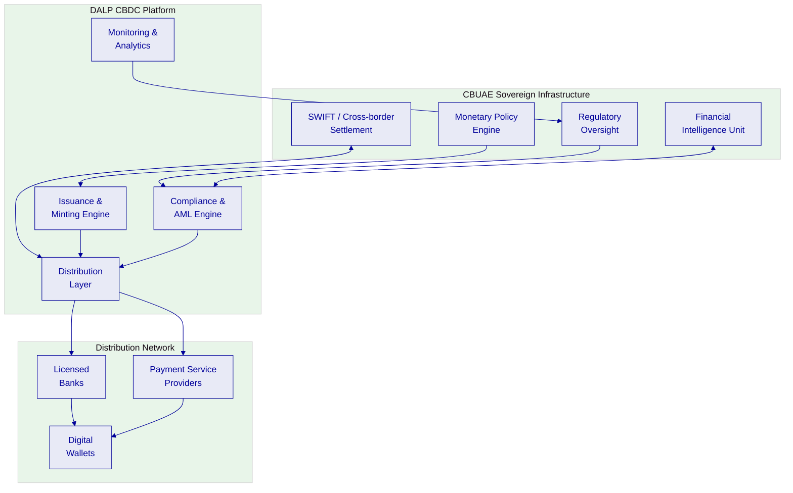
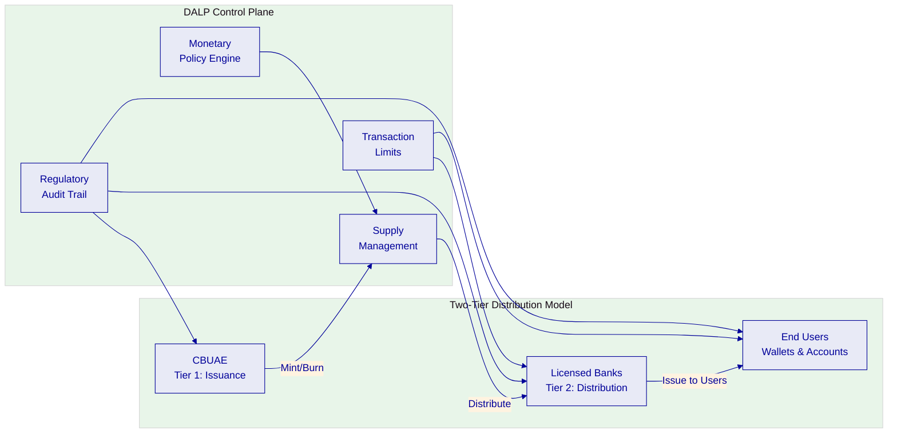
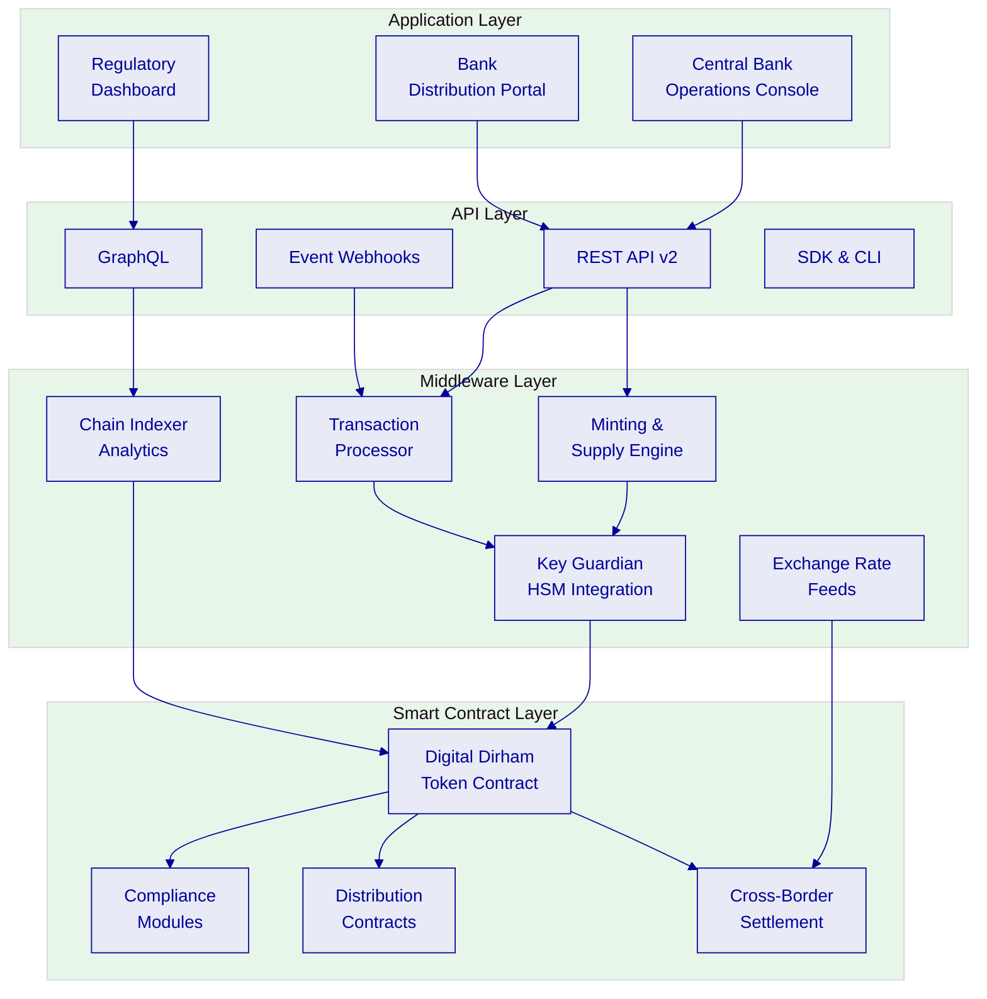
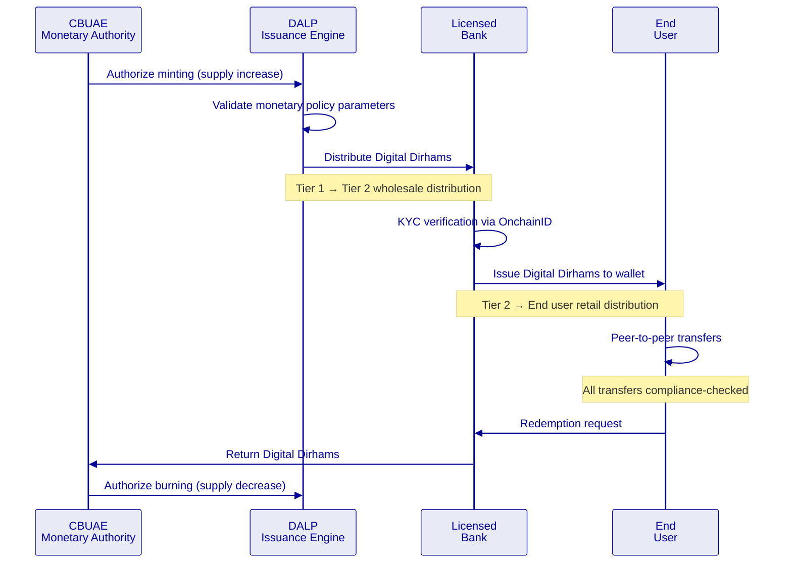
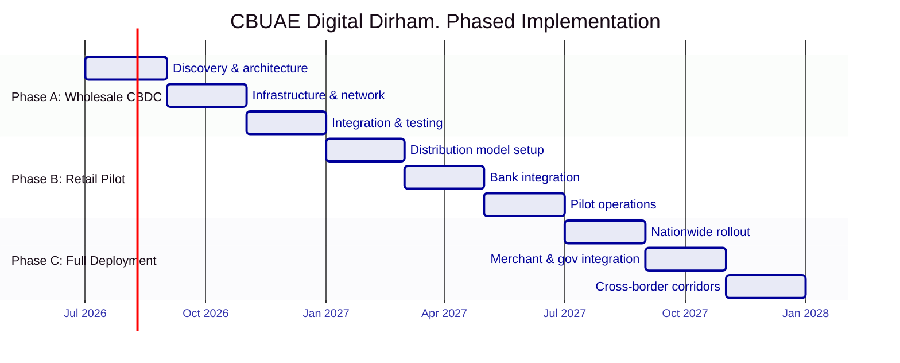

# Technical Proposal: CBDC and Digital Dirham Enabling Infrastructure

| Field | Value |
|---|---|
| Proposal title | Technical Proposal. CBDC and Digital Dirham Enabling Infrastructure |
| Client | Central Bank of UAE |
| Submitted by | SettleMint NV |
| Date | March 2026 |
| Version | v1.0 |
| Confidentiality | Restricted |
| RFP Reference | CENTRAL-BANK-OF-UAE-RFP-CBDC-DIGITAL-DIRHAM-INFRASTRUCTURE-202603 |
| Primary contact | Adam Popat, CEO |

---

## Table of Contents

- Executive Summary
- Understanding the Central Bank of UAE's Programme Objectives
- Proposed DALP Operating Model for Digital Dirham Infrastructure
- Technical Architecture for CBDC Operations
- Token Architecture for Digital Dirham
- Identity, Compliance, and Regulatory Controls
- Distribution, Settlement, and Interoperability
- Security, Resilience, and Sovereign-Grade Assurance
- Implementation Approach and Delivery Phases
- Current Coverage, Dependencies, and Qualified Gaps
- Relevant Delivery Evidence
- Appendices

---

## Executive Summary

The Central Bank of UAE (CBUAE) has identified CBDC and Digital Dirham enabling infrastructure as a sovereign-critical capability. This procurement will determine whether the market can supply a platform and implementation model capable of supporting a national digital currency at the transaction volumes, security requirements, and governance standards expected of sovereign monetary infrastructure.

SettleMint's Digital Asset Lifecycle Platform (DALP) directly addresses this requirement. DALP provides the token issuance, distribution, compliance enforcement, and lifecycle management infrastructure required for a production-grade CBDC, with the identity controls, regulatory transparency, and operational resilience that sovereign implementations demand.

**Why DALP is suited for the Digital Dirham programme:**

- **Proven CBDC delivery.** DALP powers the State Bank of India's e-Rupee (eR) CBDC infrastructure, designed for over one billion projected daily transactions. The pilot phase is complete and production deployment is underway. This is the most directly relevant reference for the CBUAE's Digital Dirham programme.

- **Sovereign-scale architecture.** DALP's four-layer architecture separates the token logic, compliance enforcement, middleware orchestration, and application interfaces into independently scalable layers. The platform has been deployed at country scale for Saudi Arabia's Real Estate Registry, processing live production transactions since January 2026.

- **Compliance-embedded design.** DALP's compliance engine enforces KYC/AML verification, jurisdiction controls, transaction limits, and regulatory reporting at the smart contract level. For a CBDC, this means every digital dirham transaction carries its compliance context, identity verification, sanctions screening integration, and transaction monitoring hooks, as structural properties of the currency, not application-layer overlays.

- **Cross-border interoperability.** DALP supports multi-network deployment and cross-chain settlement. For the CBUAE's cross-border ambitions, building on Project Aber with Saudi Arabia and mBridge with HKMA, BIS, and others, the platform provides the interoperability layer required for cross-border CBDC settlement.

---

## Understanding the Central Bank of UAE's Programme Objectives

### The Digital Dirham Vision

The CBUAE's Digital Dirham programme represents the UAE's commitment to sovereign digital currency infrastructure. Building on Project Aber (cross-border CBDC with Saudi Arabia) and participation in mBridge (multi-CBDC platform with HKMA, Bank of Thailand, and People's Bank of China via BIS), the CBUAE requires infrastructure that supports:

1. **Wholesale CBDC** for interbank settlement with deterministic finality
2. **Retail CBDC** for consumer and merchant payments with offline capability considerations
3. **Cross-border settlement** building on Project Aber and mBridge architecture
4. **Programmable money** for government disbursements, subsidy distribution, and conditional payments

### Sovereign-Grade Requirements

A CBDC platform for the CBUAE must meet requirements fundamentally different from commercial tokenization:

- **Monetary sovereignty:** The CBUAE must retain absolute control over issuance, supply management, and monetary policy enforcement
- **Universal accessibility:** The infrastructure must support the entire UAE financial ecosystem, banks, payment providers, merchants, and consumers
- **Regulatory transparency:** Every transaction must be available for regulatory review while preserving appropriate privacy boundaries
- **Resilience at national scale:** The platform must operate with the same availability expectations as core national payment infrastructure

---

## Technical Architecture for CBDC Operations

### Four-Layer Architecture Adapted for CBDC

DALP's architecture is adapted for CBDC requirements with emphasis on sovereign control, high-throughput transaction processing, and multi-tier distribution:

### Network Architecture

For the CBUAE, we recommend a **permissioned Hyperledger Besu network** with IBFT 2.0 consensus:

| Component | Configuration | Rationale |
|---|---|---|
| Consensus | IBFT 2.0 (Istanbul BFT) | Deterministic finality, regulatory-compliant |
| Validator nodes | Operated by CBUAE + selected licensed banks | Sovereign control over network governance |
| Transaction privacy | Private transaction groups per Besu privacy | Selective disclosure for regulatory vs. commercial data |
| Network throughput | Tested at 500+ concurrent settlement instructions | Scalable to CBDC transaction volumes |
| Finality | Under 3 seconds median, 4.1 seconds P99 | Deterministic, not probabilistic |

### Deployment for UAE

| Environment | Purpose |
|---|---|
| Development | Feature development, API integration testing |
| UAT / Staging | Bank integration testing, regulatory review |
| Disaster Recovery | Geo-separated within UAE |
| Production | Full HA configuration, UAE-resident data centers |
| Sandbox | External developer testing environment |

---

## Token Architecture for Digital Dirham

### Digital Dirham Token Design

The Digital Dirham is configured as a DALPAsset with CBDC-specific features:

| Feature | Configuration | Purpose |
|---|---|---|
| Supply management | Central bank-exclusive minting/burning authority | Monetary sovereignty |
| Transaction limits | Configurable per wallet tier (individual, merchant, bank) | AML/CFT and monetary policy |
| Identity verification | Mandatory OnchainID for all wallet holders | KYC/AML compliance |
| Country restrictions | UAE-resident wallets, with cross-border corridors | Jurisdictional control |
| Programmable conditions | Conditional transfers for government disbursements | Targeted monetary policy |
| Historical balances | Snapshot-based audit trail | Regulatory examination |

### Two-Tier Distribution Model

---

## Identity, Compliance, and Regulatory Controls

### Multi-Tier Identity Model

| Tier | Wallet Type | KYC Level | Transaction Limits | Identity Method |
|---|---|---|---|---|
| Tier 0 | Interbank (wholesale) | Full institutional KYC | Unlimited | Institutional OnchainID |
| Tier 1 | Licensed bank | Full institutional KYC | Per monetary policy | Institutional OnchainID |
| Tier 2 | Corporate | Enhanced KYC | Per regulatory limits | Corporate OnchainID |
| Tier 3 | Individual (verified) | Standard KYC | Per individual limits | Personal OnchainID |
| Tier 4 | Individual (basic) | Simplified KYC | Low-value limits | Simplified OnchainID |

### AML/CFT Integration

DALP integrates with the CBUAE's Financial Intelligence Unit through:

- Real-time transaction monitoring webhook events
- Suspicious transaction report (STR) data extracts
- Sanctions screening integration via API
- Transaction pattern analytics via the observability stack
- Complete audit trail for regulatory examination

---

## Distribution, Settlement, and Interoperability

### Cross-Border Settlement

Building on Project Aber and mBridge architecture, DALP supports cross-border CBDC settlement through:

- Multi-network deployment capability, separate chains per jurisdiction
- Atomic cross-chain settlement via bridge contracts
- Exchange rate feed integration for multi-currency settlement
- Regulatory reporting per jurisdiction

### Wholesale Settlement

For interbank settlement, DALP provides:

- Deterministic finality in under 3 seconds (IBFT 2.0 consensus)
- Atomic DvP via XvP Settlement addon
- Real-time gross settlement (RTGS) compatibility through API integration
- Netting and batch settlement support

---

## Security, Resilience, and Sovereign-Grade Assurance

### Security for Sovereign Infrastructure

| Control | Implementation |
|---|---|
| Key management | HSM integration for central bank signing keys |
| Network security | Permissioned network, no public access to validator layer |
| Encryption | AES-256 at rest, TLS 1.3 in transit |
| Access control | Multi-factor authentication, hardware security keys |
| Audit | Complete immutable transaction log, queryable API |
| Certifications | ISO 27001, SOC 2 Type II |

### Operational Resilience

| Target | Value |
|---|---|
| Availability | 99.99% (sovereign-grade) |
| RPO | < 15 minutes |
| RTO | < 1 hour |
| DR testing | Quarterly with documented results |
| Incident response | 24×7 for P1 events |

---

## Implementation Approach and Delivery Phases

### Phased Implementation

Given the sovereign nature of CBDC infrastructure, we recommend a phased approach:

**Phase A: Wholesale CBDC (Months 1–6)**
- Interbank settlement infrastructure
- Central bank operations console
- Integration with existing RTGS and payment systems
- Validator network setup with CBUAE and selected banks

**Phase B: Retail CBDC Pilot (Months 7–12)**
- Two-tier distribution model
- Bank distribution portal
- Consumer wallet infrastructure
- Limited geographic/participant pilot

**Phase C: Full Retail Deployment (Months 13–18)**
- Nationwide rollout
- Merchant payment integration
- Government disbursement channels
- Cross-border corridors (building on Project Aber/mBridge)

---

## Current Coverage, Dependencies, and Qualified Gaps

### Coverage Summary

| Requirement Area | Status | Notes |
|---|---|---|
| Token issuance & supply management | **Full** | Central bank-exclusive minting/burning |
| Two-tier distribution | **Full** | Configurable distribution contracts |
| AML/CFT integration | **Full** | Webhook events, API integration |
| Transaction limits | **Full** | Per-tier configurable limits |
| Audit trail | **Full** | Complete immutable log |
| Cross-border settlement | **Partial** | Multi-network support available; specific corridor configuration required |
| Offline capability | **Planned** | Under evaluation, hardware wallet integration pathway |
| Privacy-preserving transactions | **Partial** | Besu private transactions available; zero-knowledge proof integration on roadmap |

### Qualified Gaps

**Offline capability. Planned.** Retail CBDC offline payments require hardware-based solutions. DALP does not currently provide native offline payment capability. Mitigation: partnership with hardware wallet providers for offline-capable devices, with on-chain reconciliation when connectivity restores. Timeline: evaluated during Phase B design.

**Privacy-preserving transactions. Partial.** Besu private transaction groups provide selective disclosure. Full zero-knowledge proof-based privacy for retail transactions is on the platform roadmap (2027). Mitigation: tiered privacy model using Besu private groups for wholesale and standard pseudonymous transactions for retail with regulatory access.

---

## Relevant Delivery Evidence

| Client | Region | Relevance |
|---|---|---|
| State Bank of India (e-Rupee) | India | **Direct**: CBDC infrastructure at national scale |
| Saudi Arabia RER | KSA | **Direct**: sovereign-scale blockchain, UAE neighbor |
| Islamic Development Bank | 57 countries | Sovereign-scale distribution system |
| Maybank (Project Photon) | Malaysia | Cross-border FX settlement |
| Standard Chartered Bank | Multi-region | Multi-jurisdiction bank infrastructure |

### State Bank of India: CBDC at National Scale

The SBI e-Rupee engagement is the most directly relevant reference:
- CBDC infrastructure for India's national digital currency
- Designed for one billion+ projected daily transactions
- Pilot completed, production deployment underway
- Integration with existing banking infrastructure
- National-scale identity verification
- Cross-border settlement use cases

---

## Appendices

### Appendix A: Glossary

| Term | Definition |
|---|---|
| CBDC | Central Bank Digital Currency |
| DALP | Digital Asset Lifecycle Platform |
| Digital Dirham | CBUAE's proposed central bank digital currency |
| IBFT 2.0 | Istanbul Byzantine Fault Tolerance, consensus mechanism for permissioned networks |
| OnchainID | On-chain identity standard (ERC-734/735) |
| Project Aber | Joint CBDC project between CBUAE and Saudi Central Bank |
| mBridge | Multi-CBDC platform involving HKMA, BIS, BOT, PBC |
| DvP | Delivery versus Payment |
| RTGS | Real-Time Gross Settlement |
| HSM | Hardware Security Module |
