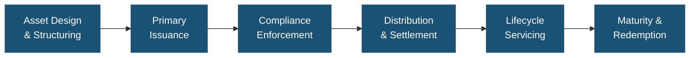
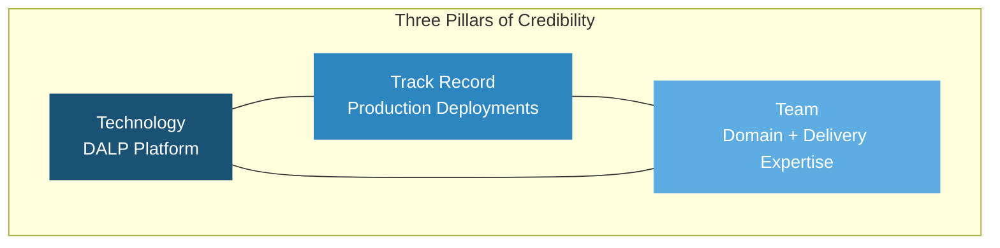
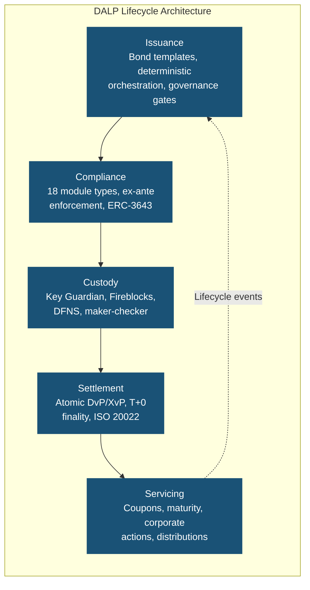
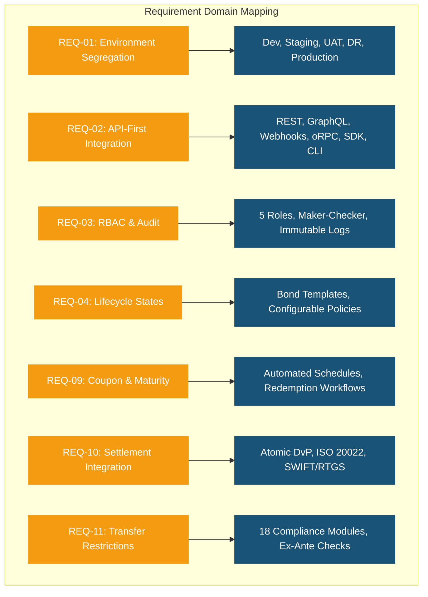
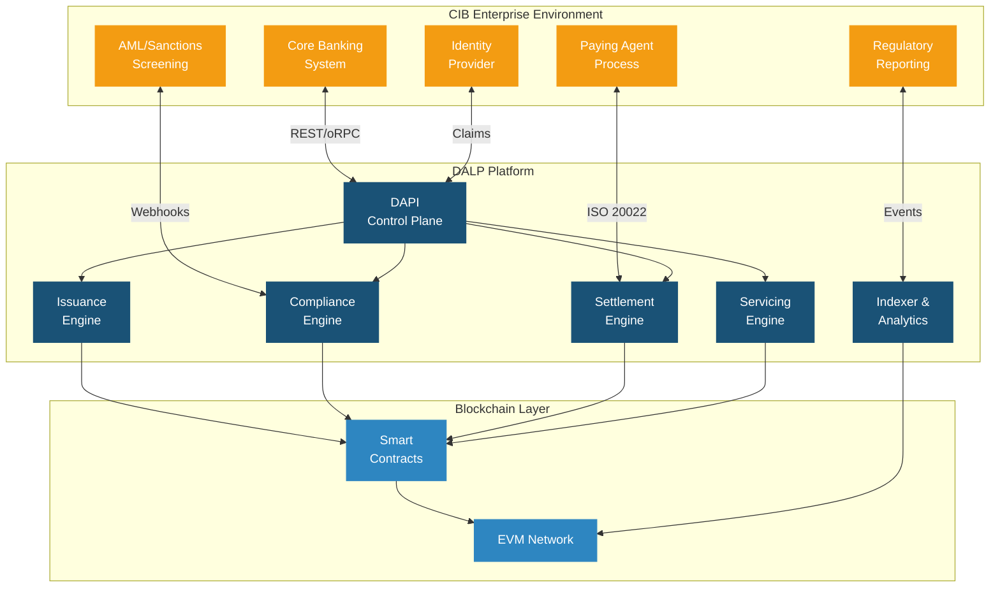
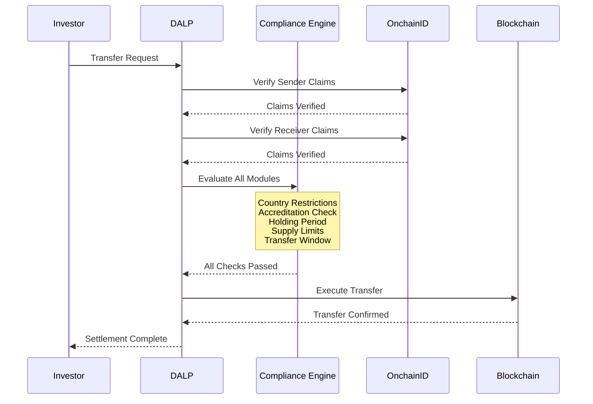
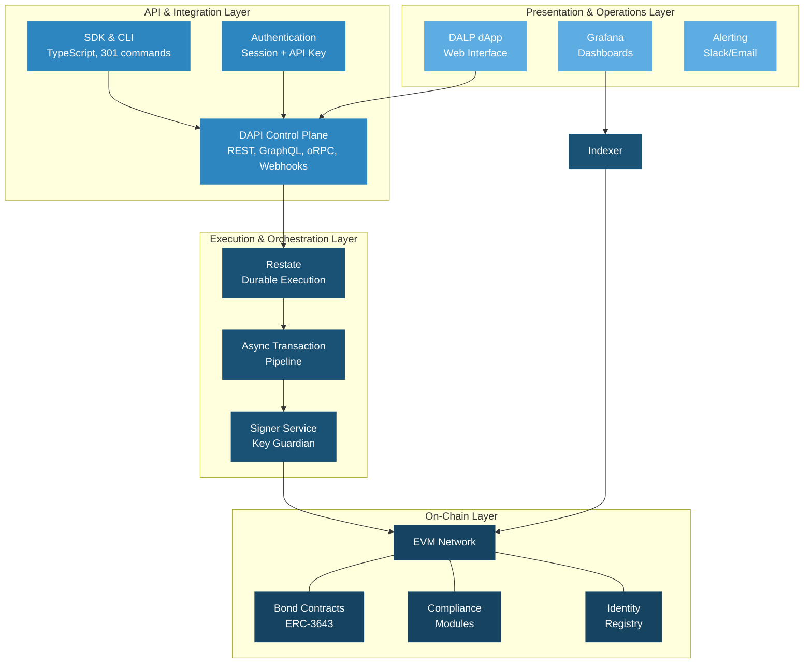
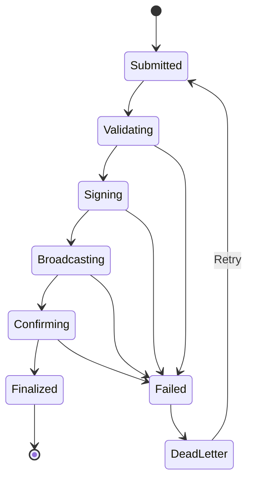
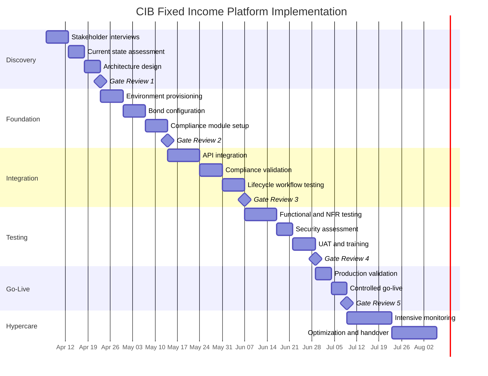
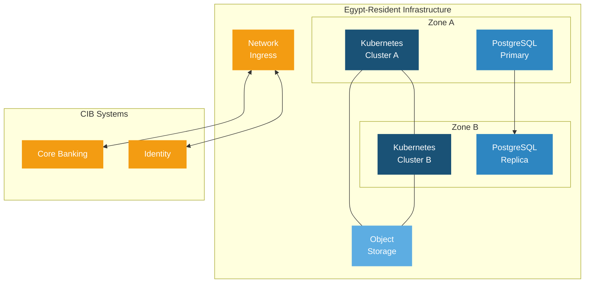

# Technical Proposal: Tokenized Fixed Income Servicing and Distribution Platform

| Field | Value |
|---|---|
| Proposal title | Technical Proposal: Tokenized Fixed Income Servicing and Distribution Platform |
| Client | Commercial International Bank (Egypt) |
| Submitted by | SettleMint NV |
| Date | March 2026 |
| Version | v1.0 |
| Confidentiality | Restricted |
| RFP Reference | COMMERCIAL-INTERNATIONAL-BANK-RFP-TOKENIZED-FIXED-INCOME-EGYPT-202603 |
| Contact | SettleMint NV, Kempische Steenweg 311/4.01, 3500 Hasselt, Belgium |
| Valid until | June 2026 |

---

# Executive Summary

## Context and Strategic Drivers

Commercial International Bank (CIB) has identified tokenized fixed income servicing and distribution as a business-critical capability that must operate within the same control discipline applied to core regulated systems. The procurement reflects a clear institutional mandate: move beyond isolated pilots toward a production-grade platform that can handle issuance calendars, coupon and profit schedules, maturity events, investor allocations, and secondary market servicing under the supervisory expectations of the Central Bank of Egypt (CBE) and the Financial Regulatory Authority (FRA).

The drivers behind this programme are structural, not speculative. Egypt's capital markets are entering a phase where digital infrastructure for fixed income instruments can reduce settlement friction, improve distribution reach across institutional and qualified investor segments, and strengthen the audit and evidence trail that supervisory bodies increasingly expect. CIB's position as the leading private-sector bank in Egypt places it at the intersection of domestic market development and cross-border capital flows, making the reliability and governance of the selected platform a matter of strategic and reputational significance.

## Why This Programme Is Hard

Tokenized fixed income is accessible as a concept but difficult to operationalize at institutional scale. The challenge is not minting a token that represents a bond; it is building the infrastructure that manages every event in that bond's lifecycle from structuring through distribution, compliance enforcement, coupon servicing, maturity handling, and retirement, all within a control environment that satisfies internal audit, regulatory review, and operational risk management.

The integration burden is substantial. A fixed income servicing platform must connect to CIB's core banking ledger, identity and KYC infrastructure, sanctions screening and AML tooling, registrar and paying agent processes, and regulatory reporting systems. Each of these integration points introduces operational dependencies that, if poorly governed, create reconciliation gaps, unowned responsibilities, and hidden operational debt.

Egypt's regulatory landscape adds further complexity. The CBE's digital asset framework is maturing, the FRA has jurisdiction over capital markets instruments, and cross-border distribution requires careful handling of multi-jurisdictional compliance. A platform that treats regulatory controls as a bolt-on layer rather than an architectural foundation will not survive the scrutiny that CIB's compliance, risk, and internal audit teams will apply.

## Proposed Response

SettleMint proposes the Digital Asset Lifecycle Platform (DALP) as the production-grade infrastructure for CIB's tokenized fixed income programme. The deployment model is a dedicated cloud environment with Egypt-resident infrastructure, ensuring full data sovereignty and compliance with CBE data localization expectations.

DALP covers the complete fixed income lifecycle through a single platform: asset design and structuring using purpose-built bond templates with configurable coupon schedules, maturity logic, and call/put options; primary issuance with deterministic orchestration and paused-by-default governance controls; ex-ante compliance enforcement through 18 configurable compliance module types; atomic Delivery-versus-Payment (DvP) settlement where asset and cash legs complete together or revert together; automated lifecycle servicing including coupon distribution, yield calculation, maturity redemption, and corporate actions; and custody orchestration through bring-your-own-custodian integrations with Fireblocks and DFNS.

The implementation follows a 19-week phase-gated delivery model, progressing through discovery and requirements validation, environment provisioning and asset configuration, integration with CIB's enterprise stack, testing and user acceptance, and controlled go-live with a 4-week hypercare period.

## Why SettleMint

SettleMint brings nearly a decade of focused experience building blockchain and tokenization infrastructure for regulated financial institutions and sovereign entities. The company operates production deployments with regulated banks across Asia, Europe, and the Middle East, including multi-year continuous live operations supporting bonds, equities, deposits, stablecoins, real estate, and funds.

Particularly relevant to CIB's programme are SettleMint's sovereign-scale deployments in the Middle East, including the Saudi Real Estate Registry (RER) programme and the Islamic Development Bank (IsDB) subsidy distribution platform serving 57 member countries. These engagements demonstrate the ability to deliver within regulatory environments that share structural similarities with Egypt's supervisory framework, including the emphasis on institutional governance, auditability, and controlled access.

SettleMint's bond tokenization experience with Commerzbank, which achieved settlement in under 10 seconds and identified potential savings of EUR 7 million annually, and the Mizuho Bank proof of concept that is now advancing toward production planning, provide direct evidence of fixed income platform capability in demanding institutional settings.

## Why DALP

DALP is not a token issuance tool or a custody solution. It is a lifecycle control plane that manages every event in a digital asset's life from creation through retirement. For CIB's fixed income programme, this means the same platform that structures and issues a bond also enforces compliance on every transfer, orchestrates settlement with deterministic finality, distributes coupon payments on schedule, and processes maturity redemption, all under a unified registry, security posture, and governance model.

The platform implements the ERC-3643 (T-REX) regulated token standard with OnchainID for verifiable on-chain investor identities, providing a compliance architecture that validates eligibility before execution rather than reviewing it after the fact. This ex-ante enforcement model, with 18 compliance module types covering country restrictions, investor accreditation, holding periods, supply limits, and transfer controls, directly addresses CIB's requirement for control integrity and auditability.

DALP's durable execution engine (Restate) ensures that multi-step lifecycle workflows, including coupon distributions across thousands of investors, survive process restarts and infrastructure failures. This is not best-effort scripting; it is enterprise-grade reliability designed for operations that cannot afford partial execution.

## Reference Fit Snapshot

Three reference deployments are particularly relevant to this procurement:

- **Commerzbank**: Hybrid on/off-chain ETP issuance with settlement in under 10 seconds and EUR 7M annual savings potential, demonstrating fixed income platform economics
- **Islamic Development Bank (IsDB)**: Sharia-compliant financial infrastructure operating across 57 member countries, demonstrating multi-jurisdictional governance in markets with regulatory structures comparable to Egypt
- **Saudi RER**: Country-scale tokenization programme with deep integration into government registry, billing, and escrow systems, demonstrating enterprise integration discipline at national scale

---

# About SettleMint

## Company Overview

SettleMint is the production-grade digital asset lifecycle management company for regulated financial markets and sovereign use cases. Founded nearly a decade ago, SettleMint has evolved from an early enterprise blockchain infrastructure provider into the category-defining platform company enabling financial institutions, market infrastructure providers, and sovereign entities to move real-world value on-chain with compliance, security, and operational reliability.

The company exists to bridge the gap between tokenization ambitions and production-grade execution. Tokenization technology is increasingly accessible, but institutional-grade implementation is not. Meeting regulatory requirements, implementing proper governance, supporting the full asset lifecycle, and ensuring that early pilots can scale into real institutional infrastructure represents the complexity that most institutions underestimate. SettleMint's mission is to enable regulated institutions to move from slides to balance sheets by turning digital asset strategy into operating systems that reduce time-to-market and remove operational and regulatory risk.

## History and Market Position

SettleMint is not a new entrant reacting to the latest tokenization wave. The company has nearly a decade of focused experience building blockchain infrastructure for enterprises and regulated institutions, producing a depth of expertise and operational maturity that cannot be replicated quickly.

The company's evolution reflects the broader maturation of the digital asset market. In the early enterprise blockchain era, SettleMint built foundational distributed ledger infrastructure for some of the world's most demanding enterprise environments, spanning financial services, supply chains, telecoms, and government entities. As financial institutions moved beyond proof-of-concept, SettleMint deepened its focus on regulatory, governance, and operational requirements that separate pilot projects from production infrastructure. Multi-year continuous production deployments with regulated banks in Asia and Europe established the company's credentials in compliance-heavy environments.

Recognizing that the market needed more than issuance tools or custody solutions, SettleMint consolidated years of production experience into DALP, providing coverage from asset design through issuance, compliance, custody integration, settlement, servicing, corporate actions, and redemption.

## Production Credentials

| Category | Evidence |
|---|---|
| Market Validation | Nearly 10 years focused on blockchain infrastructure; 7+ years of continuous production deployments at regulated banks |
| Operational Maturity | Live deployments across bonds, equities, deposits, stablecoins, real estate, and funds |
| Sovereign Credibility | Active sovereign and national-scale programmes in the Middle East |
| Ecosystem Strength | Trusted by tier-1 and tier-2 banks, CSDs, and sovereign entities |
| Team Depth | 200+ years combined banking and blockchain experience across the team |

## Regulatory Readiness

SettleMint's platform supports compliance frameworks across multiple jurisdictions relevant to CIB's operating environment:

| Jurisdiction | Framework | DALP Support |
|---|---|---|
| Egypt | CBE digital asset requirements, FRA capital markets obligations | Platform controls mapped to CBE and FRA expectations; buyer retains regulatory interpretation |
| European Union | MiCA, GDPR | Native compliance module templates |
| GCC | Regional frameworks, Islamic finance compatibility | Sharia-compliant structures supported; AAOIFI alignment where applicable |
| United States | Reg D, Reg S, Reg CF | Pre-built compliance module templates |
| Singapore | MAS framework | Compliance modules for MAS requirements |
| United Kingdom | FCA requirements | Pre-built compliance controls |

The ERC-3643 (T-REX) regulated token standard combined with OnchainID provides a compliance architecture that enforces eligibility before execution. The 18 configurable compliance module types enable CIB to model complex multi-jurisdictional requirements while maintaining the auditability and evidence trail that the CBE and FRA expect.

## Team and Delivery Capability

The team behind SettleMint combines deep expertise across blockchain engineering, financial markets, and enterprise delivery. The core team brings together decades of combined experience in financial services, enterprise software and SaaS, and blockchain R&D and protocol-level work.

Dedicated solution architects, delivery leads, and customer success teams have implemented tokenization and DLT solutions in multiple jurisdictions and navigated internal processes such as security review, vendor onboarding, and change control with large institutions. For CIB's programme, SettleMint will assign a dedicated Solution Architect and Delivery Lead with relevant fixed income and Middle East/Africa deployment experience.

## Ecosystem and Partnerships

SettleMint's partner ecosystem supports implementation scaling and local requirements across the Middle East and Africa. The ecosystem includes trusted relationships with leading consulting firms, regional system integrators providing local market knowledge and regulatory expertise, deep integrations with institutional custody platforms (Fireblocks, DFNS), payment rails (ISO 20022 for SWIFT, SEPA, RTGS), and strategic backing from leading investors in Europe and the Middle East.

## Why Relevant to This Bid

CIB's procurement requires a supplier that understands three things simultaneously: the technical demands of a production-grade fixed income lifecycle platform, the regulatory and governance discipline expected in Egypt's financial market, and the enterprise integration reality of operating within an existing institutional technology stack. SettleMint's combination of multi-year regulated bank deployments, sovereign-scale Middle East programmes, and purpose-built lifecycle platform makes the company directly relevant to all three requirements.

---

# About DALP

## Platform Overview

DALP is SettleMint's production-grade Digital Asset Lifecycle Platform for designing, launching, and operating tokenized assets across financial instruments and real-world assets. Unlike point solutions that address only issuance, only custody, or only trading, DALP provides a unified platform covering the full digital asset lifecycle, from asset design through issuance, compliance enforcement, custody integration, settlement, servicing, and retirement, treated as one continuous lifecycle under a single governance model, security posture, and operating framework.

For CIB's tokenized fixed income programme, DALP provides the control plane that sits between CIB's existing core financial systems and the blockchain network, converting authenticated API traffic into tenant-scoped, permission-aware, execution-ready operations. The platform is designed to be operated over time, managing every event in a bond's lifetime from creation through coupon payments, secondary transfers, and maturity redemption.

## Core Lifecycle Pillars

### Issuance

DALP enables rapid deployment of tokenized bonds using purpose-built templates with asset-specific lifecycle logic. The bond template includes configurable coupon schedules (fixed, floating, zero-coupon), maturity logic, call and put options, and secondary market connectivity. Each issuance follows a deterministic orchestration path with class-specific validation, factory dispatch, and claim enrichment. The paused-by-default behaviour ensures that no asset becomes active without explicit governance approval, and the governance role is assigned to the creator by default.

For CIB's programme, this means new fixed income products can be structured and configured through the Asset Designer wizard with validation for enterprise-safe input handling, then issued through a controlled process that aligns with CIB's internal product approval workflows.

### Compliance

DALP's compliance architecture enforces every transfer validation before execution, not after. The system implements 18 compliance module types covering country restrictions, investor accreditation, supply limits, holding periods, collateral backing, and transfer controls. Multi-jurisdictional support models complex requirements across the regulatory frameworks relevant to CIB's operating environment, including CBE requirements and FRA obligations.

The ERC-3643 (T-REX) regulated token standard provides the on-chain compliance mechanism, while OnchainID enables verifiable, on-chain investor identities with claim-based verification for KYC/KYB credentials, accreditation status, and jurisdictional eligibility. The two-layer policy model separates DALP compliance module enforcement from custodian policy enforcement, providing clear accountability boundaries.

### Custody

DALP orchestrates custody policy across existing custodian relationships without acting as a custodian itself. Key Guardian provides multiple storage backends: encrypted database, cloud secret manager, HSM, and third-party custody via Fireblocks and DFNS. Maker-checker approval workflows with configurable multi-signature quorum ensure that no high-value operation proceeds without appropriate authorization.

For CIB, the bring-your-own-custodian model means the bank can integrate its preferred institutional custody provider while DALP retains permissioning and workflow control. Provider-delegated transaction broadcast for DFNS and Fireblocks means the custodian owns nonce allocation, gas handling, signing, and broadcast while DALP maintains deterministic admission control.

### Settlement

Atomic Delivery-versus-Payment (DvP) settlement ensures that asset and cash legs complete together or revert together, eliminating counterparty risk, reconciliation gaps, and operational drift. DALP supports both local (same-chain) and HTLC (cross-chain) settlement models with deterministic closure into auditable end-states: executed, cancelled, or expired-withdrawn.

ISO 20022 integration provides connectivity to SWIFT, SEPA, and RTGS payment rails, which is directly relevant to CIB's requirement for integration with paying agent and settlement processes. The settlement architecture achieves T+0 finality with compliance enforcement built into every transaction.

### Servicing

This is the operational capability most platforms lack entirely: managing the asset from issuance through every event in its lifecycle to retirement. DALP provides automated corporate actions across the full lifecycle, including fixed treasury yield and AUM fee features with configurable schedules, maturity redemption with treasury payout abstraction, and distribution mechanisms including primary offerings and claim fulfilment workflows.

For CIB's fixed income programme, this means coupon payments are calculated and distributed programmatically according to the configured schedule, maturity events trigger redemption workflows automatically, and all lifecycle events produce the audit trail and evidence that CIB's internal audit and regulatory reporting functions require.

## Platform Foundations

### Identity and Access Management

DALP embeds a unified identity layer across the entire platform. OnchainID provides verifiable, on-chain investor identities. The Identity Registry manages verified profiles with claim-based verification reusable across all assets and transactions. Role-based access control (RBAC) governs every action with five defined roles, from token issuance to transfer approval. KYC/KYB profile management includes structured review workflows with approve, reject, and request-update paths and deterministic remediation loops.

### Integration and Interoperability

DALP is designed to operate within CIB's existing institutional environment, not replace it. The platform provides comprehensive APIs through REST, GraphQL, event webhooks, and oRPC, giving programmatic access to every platform capability. A typed SDK (@settlemint/dalp-sdk) for TypeScript integrators and a CLI with 301 commands across 26 groups support both automated integration and system administration. Payment rail connectivity supports ISO 20022 standards for SWIFT, SEPA, and RTGS, directly addressing CIB's requirement for integration with settlement processes and paying agents.

### Observability and Operations

DALP ships production-grade operational tooling including pre-built Grafana dashboards covering operations overview, transaction monitoring, compliance activity, and security events. The three-pillar observability stack (metrics via VictoriaMetrics, logs via Loki, traces via Tempo/OpenTelemetry) provides the depth of operational visibility that CIB's service management and incident management processes require. Automated alerting with structured Slack notification templates, blockchain infrastructure monitoring with live SSE snapshot streaming, and 534 structured error codes with metadata and i18n translations in four locales complete the operational foundation.

## Supported Asset Classes

| Asset Class | Lifecycle Features |
|---|---|
| **Bonds** | Automated coupon schedules, maturity logic, call/put options, secondary market connectivity |
| Equities | Dividend distribution, voting rights, corporate action processing |
| Funds | NAV integration, fractional units, fee structures, subscription/redemption |
| Deposits | Programmable interest, maturity, withdrawal rules |
| Stablecoins | Reserve monitoring, attestation integration, multi-currency support |
| Real Estate | Property title tokenization, fractional ownership, rental income distribution |
| Precious Metals | Asset-backed tokens, provenance tracking |
| Configurable Token | Up to 32 pluggable features for novel asset classes |

## Standards and Protocols

| Category | Standards |
|---|---|
| Token Standards | ERC-20, ERC-721, ERC-1400, ERC-3643 (T-REX), ERC-5805, EIP-2612 |
| Identity | OnchainID, claim-based verification |
| Account Abstraction | ERC-4337, ERC-7579 |
| Compliance | 18 module types across eligibility, restrictions, transfer controls |
| Settlement | Atomic DvP/XvP, HTLC cross-chain |
| Payment Rails | ISO 20022 (SWIFT, SEPA, RTGS) |
| Blockchain Networks | Any EVM-compatible network (public or private) |

## Key Differentiators

The digital asset market has plenty of issuance tools and custody solutions. What it lacks is the operational lifecycle layer that sits between them. Competitors typically stop at issuance without lifecycle management, focus on custody without compliance or servicing depth, build infrastructure without applications requiring extensive custom development, or serve a single regulatory regime limiting geographic reach.

DALP's position is the combination of multi-asset lifecycle automation, ex-ante compliance, atomic settlement, enterprise deployment flexibility, and multi-jurisdiction coverage in one platform. For CIB, this means the bank does not need to assemble and integrate separate point solutions for issuance, compliance, custody, settlement, and servicing, eliminating the coordination overhead, extended timelines, compliance gaps, and operational risk that a multi-vendor approach would introduce.

---

# Customer References

## Summary Table

| Client | Use Case | Geography | Asset Theme | Relevance to CIB |
|---|---|---|---|---|
| OCBC Bank | Security token engine, securitization | Asia | Multi-asset | Enterprise platform deployment at tier-1 bank |
| KBC Securities (Bolero) | Equity crowdfunding, SME loans | Europe | Equity, loans | Lifecycle automation reducing operational costs |
| KBC Insurance | NFT product passports | Europe | Insurance | Digital asset innovation in regulated setting |
| Standard Chartered Bank | Digital Virtual Exchange | Asia, Africa, ME | Securities | Institutional trading, fractional tokenization |
| Reserve Bank of India | Multi-bank trade finance | India | Trade finance | Multi-party regulated infrastructure |
| Sony Bank | Stablecoin with digital identity | Japan | Stablecoins | Identity-integrated financial products |
| State Bank of India | CBDC infrastructure | India | CBDC | Sovereign-scale digital currency |
| IsDB (Subsidy) | Sharia-compliant subsidy distribution | 57 countries | Distribution | Multi-jurisdictional financial inclusion |
| Mizuho Bank | Bond tokenization, trade finance | Japan | Bonds | Fixed income platform capability |
| IsDB (Market Stabilization) | Sharia-compliant market stabilization | Multi-region | Collateral | Automated financial operations |
| Maybank (Project Photon) | FX tokenization, cross-border settlement | Malaysia | FX, deposits | Atomic XvP settlement |
| ADI Finstreet | Tokenized equity on Abu Dhabi mainnet | UAE/GCC | Equity | Gulf region deployment with custody integration |
| Commerzbank | Hybrid ETP issuance | Europe | Fixed income | Settlement under 10 seconds, EUR 7M savings |
| Saudi RER | Country-scale real estate tokenization | KSA | Real estate | National-scale integration programme |

## Expanded Reference: Commerzbank

Commerzbank required a hybrid on-chain/off-chain solution for issuing and managing exchange-traded products (ETPs) that could integrate with Boerse Stuttgart's listing service and the bank's own issuance engine. The challenge was not the token itself but the operational requirement for near real-time clearing and settlement that could withstand institutional scrutiny.

SettleMint delivered a solution that integrated listing, issuance, and settlement into a single workflow. Trades are cleared and settled in near real time, with settlement completing in under 10 seconds. The model identified potential annual savings of EUR 7 million by reducing counterparty risk and eliminating listing inefficiencies. This deployment directly demonstrates DALP's fixed income capability in a production banking environment with regulatory oversight.

## Expanded Reference: Islamic Development Bank (Subsidy Distribution)

The Islamic Development Bank required a blockchain-based platform to distribute subsidies across its 57 member countries in a manner consistent with Sharia principles. The challenge was operational at scale: replacing inefficient analogue processes with digital infrastructure that could provide transparency, direct peer-to-peer distribution, and full control over subsidy spending.

SettleMint delivered a digitized subsidy delivery platform that improved financial inclusion for 1.7 billion people across IsDB's member states. The automated administrative and legal processes reduced redundancies while maintaining the governance and evidence trail required for multi-jurisdictional financial operations. For CIB, this reference demonstrates SettleMint's ability to operate across regulatory environments with structures comparable to Egypt's, including Islamic finance governance requirements.

## Expanded Reference: Saudi RER

The Saudi Real Estate Registry programme represents a country-scale blockchain infrastructure deployment for real estate registration, fractionalization, and digital marketplace, operated by the Real Estate Registry under the Real Estate General Authority (REGA). SettleMint serves as the delivery partner for the solution, covering marketplace services, API gateway, blockchain and tokenization layer powered by DALP, and deep integration with RER's core registry, billing, escrow, and government systems.

This reference is relevant to CIB's procurement because it demonstrates enterprise integration discipline at national scale: the ability to connect a blockchain platform into existing institutional plumbing across registry, billing, escrow, and government systems without creating hidden operational debt. The programme's complexity, operating under Saudi Arabia's institutional governance framework, closely parallels the integration requirements CIB has described.

---

# Understanding of Requirements

## Client Context

CIB is approaching tokenized fixed income not as an innovation exercise but as a business-critical procurement. The bank requires a platform that can operate within its existing control environment, shaped by business ownership, architecture standards, security review, legal interpretation, compliance sign-off, and internal audit expectations. The evaluation team will assess whether bidders can explain how the platform behaves under real-world operational pressure, including incomplete onboarding data, limit breaches, governance-delayed approvals, partner outages, regulatory evidence requests, and phased rollout constraints.

The programme must anchor in Egypt's market infrastructure and supervisory realities, including the pace of CBE digital asset policy development, the role of the FRA in capital markets oversight, regulated intermediary requirements, and the practical limits of cross-border interoperability.

## Requirement Domains

| Domain | CIB Requirements | DALP Coverage |
|---|---|---|
| Product and Asset Scope | Tokenized fixed income with issuance calendars, allocations, coupon schedules, maturity events (REQ-09) | Bond templates with configurable coupon schedules, maturity logic, call/put options |
| Identity and Onboarding | Integration with CIB identity services and KYC infrastructure | OnchainID, Identity Registry, KYC/KYB workflows, claim-based verification |
| Compliance and Control | Transfer restrictions, eligibility checks, amendment governance (REQ-11), RBAC and audit logs (REQ-03) | 18 compliance module types, ex-ante enforcement, 5-role RBAC, complete audit trails |
| Settlement and Cash Leg | Integration with paying agent, registrar, depository, settlement (REQ-10) | Atomic DvP, ISO 20022, SWIFT/SEPA/RTGS connectivity |
| Integration and Reporting | API-first interfaces, eventing, version governance (REQ-02), evidence extraction for audit (REQ-08) | REST, GraphQL, webhooks, oRPC, 534 error codes, structured logging |
| Infrastructure and Operations | Segregated environments (REQ-01), resilience, DR, monitoring (REQ-06) | Dev/staging/production environments, 3-pillar observability, automated alerting |

## Key Challenges Identified

**Control integrity across the lifecycle.** CIB must be able to identify who initiated any change or transaction, which policy checks applied, who approved the event, and how the resulting state can be reconstructed later. DALP addresses this through its immutable audit trail, structured event logging, and the ex-ante compliance model that records every eligibility check before execution.

**Coexistence with the enterprise stack.** The platform cannot become a reconciliation sinkhole. DALP's API-first architecture with REST, GraphQL, event webhooks, and oRPC provides the integration surface to connect with CIB's core banking ledger, sanctions tooling, reporting systems, and service management processes. The typed SDK and CLI provide additional integration paths for automated workflows.

**Phased scalability.** CIB needs to move from initial launch to broader adoption without a platform reset. DALP's multi-asset architecture, where bonds are the starting point but equities, funds, deposits, and additional asset classes can be added using the same platform, compliance engine, and governance model, directly supports this requirement.

**Regulatory evidence production.** The bank's risk, compliance, and audit teams need evidence that can be produced for CBE, FRA, and internal audit review. DALP's structured logging, 534 error codes with full metadata, compliance enforcement records, and operational dashboards provide the evidence base these teams require.

## Requirement Prioritization

| Priority | Requirements | DALP Response |
|---|---|---|
| Mandatory | REQ-01 through REQ-08 (environment segregation, API-first, RBAC/audit, lifecycle states, third-party disclosure, resilience, delivery method, evidence extraction) | Full coverage across all mandatory requirements |
| High | REQ-09 (issuance calendars, coupon schedules), REQ-10 (paying agent integration), REQ-11 (transfer restrictions, eligibility) | Full coverage through bond templates, ISO 20022 integration, and compliance modules |

## Response Principles

This response is structured around four principles that reflect CIB's procurement expectations:

**Control before speed.** Every capability described operates within governance gates, role-based access, and audit trail requirements. Platform speed is a consequence of good architecture, not a substitution for proper controls.

**Reuse before fragmentation.** DALP provides one platform for the full lifecycle rather than requiring CIB to assemble separate point solutions. Each additional asset class, jurisdiction, or investor segment operates within the same compliance engine and governance model.

**Phased delivery with clear gates.** The 19-week implementation follows formal gate reviews at each phase boundary. CIB retains decision authority at every stage.

**Evidence-led compliance.** Every claim about compliance, auditability, or control integrity is anchored in specific DALP mechanisms, not abstract assurances.

---

# Proposed Solution and Functional Capabilities

## Solution Overview

The proposed solution deploys DALP as the tokenized fixed income lifecycle platform within CIB's enterprise environment. The solution boundary encompasses asset structuring and configuration, primary issuance orchestration, compliance enforcement, investor identity management, custody orchestration, DvP settlement, lifecycle servicing (coupons, maturity, corporate actions), and operational monitoring. CIB retains business policy ownership, product approval authority, regulatory engagement responsibility, and ultimate control ownership.

The deployment architecture uses dedicated cloud infrastructure with Egypt-resident data residency. DALP connects to CIB's core banking ledger, identity provider, sanctions and AML tooling, registrar and paying agent processes, and reporting infrastructure through its API-first integration layer.

## Issuance and Asset Configuration

DALP's bond issuance capability provides CIB with a structured path from product design to market. The Asset Designer wizard enables compliance and product teams to configure bond parameters, including face value, coupon type (fixed, floating, or zero-coupon), coupon frequency, maturity date, call and put options, and distribution rules, through a validated interface that enforces enterprise-safe input handling.

Each issuance follows a deterministic orchestration path. When CIB creates a new fixed income token, the platform executes class-specific validation, dispatches the appropriate factory contract, enriches the token with required claims (issuer identity, jurisdiction, accreditation requirements), and deploys the token in a paused state. This paused-by-default behaviour is not a limitation; it is a governance gate that ensures no asset becomes tradable without explicit authorization from a role holder with the appropriate permissions.

The factory model supports multiple fixed income product types within the same platform instance. CIB can configure government bonds, corporate bonds, commercial paper, and structured products using the same issuance engine, compliance framework, and governance model. The role-based permission bootstrapping assigns the governance role to the creator by default, ensuring clear ownership from the moment of creation.

## Identity and Eligibility

DALP's identity layer addresses CIB's requirement for integration with identity services and KYC infrastructure (referenced in the RFP's scope of work). OnchainID provides verifiable, on-chain investor identities that are reusable across all assets and transactions. When an investor is verified once for a bond issuance, that verified identity can be used for subsequent fixed income products without re-verification, reducing operational friction for both CIB and its investors.

The Identity Registry manages verified profiles with claim-based verification covering KYC and KYB credentials, accreditation status, and jurisdictional eligibility. The structured review workflows support approve, reject, and request-update paths with deterministic remediation loops, ensuring that every identity decision follows a governed process and produces an auditable record.

Invitation-linked onboarding binds user enrolment to tenant membership boundaries, providing clear separation between different investor segments or product contexts. Wallet verification with multi-factor gates (PIN, OTP, secret codes) adds an additional security layer for privileged transaction signing. Identity recovery with durable, phase-tracked workflows handles wallet loss or compromise scenarios without compromising the integrity of the investor's verified credentials.

## Compliance Enforcement

CIB's RFP identifies transfer restrictions, eligibility checks, and amendment governance (REQ-11) as high-priority requirements. DALP's compliance architecture addresses these requirements through a multi-layered enforcement model.

The 18 compliance module types cover the full spectrum of transfer controls that CIB's fixed income programme requires. Country restriction modules enforce geographic eligibility rules, ensuring that only investors from permitted jurisdictions can hold or trade specific instruments. Investor accreditation modules verify that investors meet qualification thresholds before allowing participation. Holding period modules prevent premature transfers, protecting both the issuer and investors from regulatory exposure. Supply limit modules cap the total outstanding supply, and transfer window modules restrict trading to defined periods when required.

Every compliance check is executed ex-ante, meaning eligibility is validated before execution rather than reviewed after the fact. When an investor attempts to transfer a bond token, the compliance engine evaluates all applicable modules against the investor's verified claims, the transfer parameters, and the token's compliance configuration. If any check fails, the transfer is rejected with a specific error code and the failure is logged. This creates the evidence chain that CIB's compliance and audit teams require: for every transfer that occurred, there is a record of which checks were evaluated, what data was used, and what the result was.

## Transfer, Settlement, and Cash-Leg Coordination

DALP's settlement architecture directly addresses CIB's requirement for integration with paying agent, registrar, depository, and settlement processes (REQ-10). The atomic DvP settlement model ensures that the asset leg (bond token transfer) and the cash leg (payment) complete together or both revert, eliminating the counterparty risk that traditional T+2 settlement cycles create.

The settlement engine achieves deterministic closure into one of three auditable end-states: executed, cancelled, or expired-withdrawn. There is no ambiguous intermediate state where CIB would need to manually reconcile whether a settlement completed. Closure-readiness checks validate all preconditions before settlement execution, and the result is recorded immutably.

ISO 20022 integration provides connectivity to CIB's existing payment rails. For domestic settlement, the platform can connect to Egypt's RTGS system. For cross-border fixed income distribution, SWIFT and SEPA connectivity enable cash-leg coordination with international counterparties. The payment rail integration is not a custom development requirement; it is a built-in platform capability using established messaging standards.

The Exchange-versus-Payment (XvP) extension coordinates multi-party exchanges with the same atomicity guarantees, which becomes relevant when CIB expands into structured products or cross-currency fixed income instruments where multiple legs must settle simultaneously.

## Lifecycle Servicing and Corporate Actions

The servicing layer is where DALP's value becomes most apparent for CIB's fixed income programme. Most platforms in the market can issue a token; far fewer can manage the operational reality of what happens after issuance. DALP automates the complete lifecycle servicing workflow.

Coupon payments are calculated according to the configured schedule and distributed programmatically to all eligible holders. The fixed treasury yield feature handles standard coupon calculations, while the configurable schedule supports complex payment structures including step-up coupons, deferred interest, and ex-date processing. Each distribution event produces a complete audit record including the calculation basis, eligible holders at the record date, amounts per holder, and transaction confirmation.

Maturity redemption is handled through treasury payout abstraction that supports both externally owned account (EOA) and contract-based treasury structures. When a bond reaches maturity, the redemption workflow calculates the final payment, validates the treasury balance, and executes distribution to all holders. Early redemption through call options follows the same governed workflow with appropriate approval gates.

Corporate actions beyond standard coupons and maturity, such as amendments to bond terms, consent solicitations, or tender offers, are managed through DALP's governance framework, ensuring that every action follows the appropriate approval chain and produces the evidence trail required for CIB's internal audit and regulatory reporting.

## Integration and Interoperability

CIB's RFP emphasizes that the solution must fit into a broader enterprise stack. DALP's integration architecture is designed for exactly this requirement. The platform provides four API paradigms: REST for standard CRUD operations, GraphQL for flexible data queries, event webhooks for real-time notifications to CIB's event-driven systems, and oRPC for high-performance remote procedure calls.

The typed SDK (@settlemint/dalp-sdk) provides TypeScript integrators with a contract-bound REST client, serializers, and a structured error code system. For system administration and operational automation, the CLI provides 301 commands across 26 groups covering token lifecycle, identity management, compliance configuration, monitoring, and addon workflows.

Integration with CIB's specific enterprise systems follows established patterns:

| Integration Point | Protocol | Data Flow |
|---|---|---|
| Core Banking Ledger | REST/oRPC | Bidirectional: position updates, reconciliation data |
| Identity Provider | Claims-based | Inbound: investor verification, KYC status |
| AML/Sanctions | Webhooks | Outbound: screening requests; inbound: alert results |
| Registrar | REST | Outbound: holder registry updates, transfer records |
| Paying Agent | ISO 20022 | Bidirectional: payment instructions, settlement confirmation |
| Reporting | Events/GraphQL | Outbound: transaction data, compliance records, audit logs |
| Observability | Metrics/Logs/Traces | Bidirectional: platform health, incident data |

## Functional Fit Matrix

| Req ID | Requirement | DALP Capability | Status | Notes |
|---|---|---|---|---|
| REQ-01 | Segregated environments | Dev, staging, UAT, DR, production environment provisioning | Full | Standard deployment pattern |
| REQ-02 | API-first interfaces | REST, GraphQL, webhooks, oRPC, SDK, CLI | Full | 301 CLI commands, typed SDK |
| REQ-03 | RBAC, maker-checker, audit logs | 5-role RBAC, configurable quorum, immutable audit trail | Full | Role assignment per action |
| REQ-04 | Configurable lifecycle states | Bond templates with policy controls, limits, exceptions | Full | Asset Designer wizard |
| REQ-05 | Third-party dependency disclosure | Architecture documentation, partner mapping | Full | See Deployment section |
| REQ-06 | Resilience, DR, monitoring | HA deployment, backup, 3-pillar observability | Full | See Security section |
| REQ-07 | Delivery method and plan | 19-week phase-gated implementation | Full | See Implementation section |
| REQ-08 | Evidence extraction for audit | Structured logs, compliance records, dashboard exports | Full | 534 error codes with metadata |
| REQ-09 | Issuance calendars, coupon schedules | Bond templates with configurable schedules and maturity logic | Full | Fixed, floating, zero-coupon |
| REQ-10 | Paying agent, registrar integration | ISO 20022, REST APIs, webhook notifications | Full | SWIFT, SEPA, RTGS |
| REQ-11 | Transfer restrictions, eligibility | 18 compliance modules, ex-ante enforcement | Full | ERC-3643, OnchainID |

---

# Technical Architecture

## Architectural Principles

DALP's architecture is built on five principles that align with CIB's expectations for a production-grade platform:

**Lifecycle-first design.** Every architectural decision starts with the question: does this support the full asset lifecycle from creation to retirement? Components are organized around lifecycle stages, not technology layers.

**Durable execution.** Multi-step workflows, including coupon distributions, settlement sequences, and compliance evaluations, survive process restarts and infrastructure failures through Restate's durable execution engine. This is enterprise reliability by design, not best-effort scripting.

**Defense-in-depth.** Security controls operate at every layer: network boundary, API authentication, session management, role-based access, smart contract permissions, and custody approval workflows. No single control point failure compromises the system.

**Separation of concerns.** The on-chain layer handles ownership, compliance, and settlement finality. The execution layer manages orchestration, workflow durability, and business logic. The API layer provides integration and access control. The presentation layer provides operational visibility.

**Provider abstraction.** DALP abstracts blockchain networks, custody providers, key management solutions, and cloud infrastructure behind consistent interfaces, preventing vendor lock-in at any layer.

## Layered Architecture

### On-Chain Layer

The on-chain layer manages ownership records, compliance enforcement, and settlement finality on an EVM-compatible blockchain network. Bond tokens implement the ERC-3643 (T-REX) standard, which embeds compliance verification into the transfer function itself. Compliance modules are deployed as separate contracts that the token references, allowing CIB to activate, deactivate, or reconfigure compliance rules without redeploying the token contract. The Identity Registry stores verified investor claims on-chain, providing the compliance engine with the data it needs to evaluate eligibility in real time.

### Execution and Orchestration Layer

The execution layer converts API requests into deterministic, auditable operations. Restate provides durable workflow orchestration: when a coupon distribution requires processing thousands of individual payments, the workflow survives any process restart or infrastructure interruption and resumes from exactly where it stopped. The async transaction pipeline manages the complete transaction lifecycle through 11 states with idempotency, optimistic-lock state transitions, dead-letter rescue for failed transactions, and a public status polling endpoint.

The signer service (Key Guardian) manages key material and transaction signing through multiple backends. For CIB's deployment, the recommended configuration integrates with an institutional custody provider (Fireblocks or DFNS) for production key management, with the provider handling nonce allocation, gas management, signing, and broadcast while DALP retains deterministic admission control.

### API and Integration Layer

DAPI (Durable API Service) is the middleware control plane that converts authenticated API traffic into tenant-scoped, permission-aware, execution-ready operations. The two-endpoint authentication model separates session-authenticated dApp frontend access from API-key-authenticated programmatic access, with hard enforcement of auth-method-to-endpoint affinity. This prevents cross-channel credential abuse and simplifies CIB's security review of integration patterns.

### Presentation and Operations Layer

The DALP dApp provides a web interface for platform administration, asset management, compliance configuration, and operational monitoring. Grafana dashboards with pre-built views for operations overview, transaction monitoring, compliance activity, and security events provide the operational visibility that CIB's service management teams require.

## Data Architecture

DALP maintains three distinct data stores, each serving a specific purpose:

**Chain state** is the authoritative record of ownership, compliance status, and settlement finality. On-chain data is immutable and provides the evidence foundation for audit and regulatory reporting.

**Application state** (PostgreSQL) stores platform configuration, user profiles, workflow state, and transaction pipeline data. The custom indexer maintains zero-downtime schema lifecycle using rotating deployment schemas, ensuring that platform upgrades do not require downtime.

**Indexed and analytical state** provides read-optimized views for dashboards, reporting, and queries. The indexer processes blockchain events into structured data that CIB's reporting systems can consume through GraphQL queries or webhook-triggered exports.

## Network and Chain Topology

DALP supports any EVM-compatible blockchain network, giving CIB flexibility in network selection. For a regulated fixed income programme, the recommended approach is a permissioned private network that provides CIB with full control over network participants, transaction visibility, and consensus governance. IBFT (Istanbul Byzantine Fault Tolerant) consensus is the recommended consensus mechanism for permissioned deployments, providing deterministic finality without the energy overhead of proof-of-work.

The network topology will be defined during the Discovery phase based on CIB's requirements for node distribution, performance targets, and regulatory constraints. If CIB's programme later requires cross-chain interoperability, DALP's HTLC settlement model supports controlled interaction with other networks.

## Multi-Tenancy and Environment Segregation

DALP provides full environment segregation as required by REQ-01. Each environment (development, testing, UAT, DR, production) operates as an isolated tenant with separate infrastructure, data stores, and network connectivity. Governance boundaries ensure that configuration changes in one environment do not propagate to another without explicit promotion through a controlled release process.

Within each environment, DALP's multi-tenancy model supports separation between different organizational units, product contexts, or investor segments if CIB requires such segregation for its fixed income programme.

## Operational Architecture

The async transaction pipeline is the backbone of DALP's operational reliability. Every transaction passes through an 11-state lifecycle: from initial submission through validation, signing, broadcast, confirmation, and finalization. Idempotency keys prevent duplicate processing. Optimistic-lock state transitions ensure that concurrent operations do not produce inconsistent results. Failed transactions enter a dead-letter queue where they can be inspected, corrected, and resubmitted without losing the audit trail.

The public status polling endpoint allows CIB's monitoring and integration systems to track transaction progress in real time. Combined with webhook notifications for state transitions, this provides the operational visibility required for a production fixed income platform.

---

# Security

## Security Model Overview

DALP's security model operates across three trust domains: the platform domain (SettleMint-managed infrastructure and application security), the custody domain (key management and transaction signing under CIB's custody provider), and the governance domain (business rules, compliance policies, and access control under CIB's authority). Each domain has explicit responsibilities, and the boundaries between them are enforced architecturally rather than through procedural controls alone.

Defense-in-depth is the guiding principle. No single security control protects the system; instead, multiple independent layers ensure that a failure at one layer is contained by the next. This approach has been validated through security reviews and penetration testing at multiple regulated bank deployments.

## Authentication and Access Control

DALP implements a two-endpoint authentication model that separates security contexts:

**Session-authenticated access** (DALP dApp): CIB's platform operators access the web interface through session-based authentication with appropriate session management controls. This channel serves administrative operations, compliance configuration, and operational monitoring.

**API-key-authenticated access** (programmatic): CIB's integration layer accesses DALP through API keys with scoped permissions. Each key is bound to a specific role and set of allowed operations.

Hard enforcement of auth-method-to-endpoint affinity prevents cross-channel credential abuse. A session token cannot be used on the API endpoint, and an API key cannot be used on the dApp endpoint.

Role-based access control (RBAC) with five defined roles governs every action on the platform. The roles enforce separation of duties between governance, operations, compliance, and day-to-day token management. Verification gates ensure that sensitive operations require additional confirmation beyond standard authentication.

## Key Management and Custody Integration

Key Guardian provides DALP's key management abstraction with four storage tiers:

| Tier | Backend | Use Case |
|---|---|---|
| Tier 1 | Encrypted database | Development and testing environments |
| Tier 2 | Cloud secret manager | Staging environments with enhanced security |
| Tier 3 | HSM | High-security requirements with hardware protection |
| Tier 4 | Third-party custody (Fireblocks, DFNS) | Production environments with institutional custody |

For CIB's production deployment, Tier 4 is recommended. Provider-delegated transaction broadcast means the custody provider owns the volatile execution mechanics (nonce allocation, gas handling, signing, and broadcast) while DALP retains deterministic admission control (role verification, compliance checks, workflow state management). This separation ensures that key material never touches the DALP application layer in production.

Maker-checker approval workflows with configurable multi-signature quorum ensure that high-value or high-risk operations require multiple authorized approvals before execution. Emergency pause capability allows CIB to halt all platform operations if a security incident is detected, with formal recovery procedures for resuming operations after investigation.

## Data Protection and Encryption

All data at rest is encrypted using industry-standard algorithms. Database encryption protects application state, and blockchain data is protected by the network's cryptographic guarantees. All data in transit uses TLS 1.2 or higher for external connections and internal service-to-service communication. Field-level secrets (API keys, custody credentials) are managed through the platform's secret management layer, which is separate from application data storage.

## Compliance Controls and Auditability

Every platform action produces an audit record. The 534 structured error codes with full metadata, i18n translations in four locales, and SDK mirror provide granular traceability for every operation that succeeded, failed, or was rejected by compliance checks. The audit trail is immutable: records cannot be modified or deleted after creation.

SIEM-compatible log formats enable CIB to feed DALP's operational logs into existing security monitoring infrastructure. Pre-built Grafana dashboards for security events provide real-time visibility into authentication patterns, access control decisions, and anomalous activity.

## Testing and Assurance

DALP has undergone penetration testing and security reviews as part of regulated bank deployments. SettleMint follows a structured remediation approach: vulnerabilities identified through testing are categorized by severity, assigned remediation timelines, and tracked to closure. Evidence of testing and remediation can be shared with CIB's information security team under appropriate confidentiality arrangements.

For CIB's deployment, SettleMint recommends a dedicated security assessment during the Testing and User Acceptance phase (Phase 4 of the implementation), allowing CIB's security team to validate the platform's security posture within their specific infrastructure configuration.

## Security Responsibility Matrix

| Control Area | SettleMint | CIB | Notes |
|---|---|---|---|
| Platform application security | Owner | Reviewer | Code, dependencies, patching |
| Infrastructure security (managed) | Owner | Reviewer | Cloud infrastructure hardening |
| Network security | Shared | Shared | Perimeter: CIB; internal: SettleMint |
| Key management | Shared | Owner | Custody provider selected by CIB |
| Access control configuration | Advisor | Owner | Roles and permissions defined by CIB |
| Compliance rule configuration | Advisor | Owner | Business rules defined by CIB |
| Penetration testing | Facilitator | Coordinator | Joint testing recommended |
| Incident response | Shared | Shared | Escalation procedures defined jointly |
| Business continuity | Shared | Owner | Platform DR: SettleMint; business DR: CIB |

---

# Project Implementation and Delivery

## Delivery Overview

SettleMint follows a structured, phase-gated implementation methodology refined through years of production implementations with regulated banks, market infrastructure providers, and sovereign entities. The standard timeline spans 19 weeks from kickoff to production go-live, followed by a 4-week hypercare period. Each phase concludes with a formal gate review involving key stakeholders from both SettleMint and CIB. Progression to the next phase requires sign-off on defined deliverables and acceptance criteria.

## Phase Plan

### Discovery and Requirements (Weeks 1 to 3)

**Objective:** Establish a validated understanding of CIB's business objectives, technical landscape, regulatory environment, and operational requirements.

**Key Activities:** Stakeholder interviews with business sponsors, technology leadership, compliance and risk officers, and operations teams. Current state assessment of CIB's core banking, custody, identity, compliance, and reporting infrastructure. Regulatory and compliance mapping to CBE and FRA requirements. Asset class and lifecycle scoping for the fixed income programme. Target architecture design covering deployment topology, network selection, custody integration, and external system connectivity.

**Outputs:** Business Requirements Document, Regulatory and Compliance Matrix, Target Architecture Document, Implementation Roadmap, RACI Matrix.

**Gate criteria:** CIB sign-off on requirements, architecture, and implementation plan.

### Foundation and Setup (Weeks 4 to 7)

**Objective:** Provision the DALP environment, configure bond templates and compliance modules, and prepare the integration layer.

**Key Activities:** Environment provisioning for development, staging, and production. Network configuration for the target blockchain. Bond token configuration using DALP's asset templates. Compliance module setup covering CBE and FRA requirements. Identity and access framework configuration. Key management setup with CIB's selected custody provider. Integration planning with detailed API specifications and data mappings.

**Outputs:** Provisioned environments, Asset Configuration Documentation, Compliance Module Configuration, Identity and Access Design, Integration Design Document.

**Gate criteria:** Environments operational, asset configuration validated, integration design approved.

### Configuration and Compliance (Weeks 8 to 11)

**Objective:** Complete integration connections, configure compliance enforcement end-to-end, and validate the full lifecycle workflow.

**Key Activities:** API integration with CIB's core banking, identity, AML/sanctions, and reporting systems. Paying agent and registrar integration via ISO 20022. Compliance module testing across all configured rules. Lifecycle workflow validation including issuance, transfer, coupon distribution, and maturity.

**Outputs:** Integrated platform, Compliance Validation Report, End-to-End Lifecycle Test Results.

**Gate criteria:** All integrations functional, compliance enforcement validated, lifecycle workflows passing.

### Integration and Testing (Weeks 12 to 15)

**Objective:** Execute comprehensive testing including functional, non-functional, security, resilience, and user acceptance testing.

**Key Activities:** Functional testing of all bond lifecycle operations. Non-functional testing covering performance, scalability, and resilience. Security assessment including penetration testing. Disaster recovery testing and validation. User acceptance testing with CIB's business, operations, and compliance teams. Training delivery for administrators, operators, and integration teams.

**Outputs:** Test Results Report, Security Assessment Report, DR Validation Report, UAT Sign-off, Training Completion Records.

**Gate criteria:** All critical defects resolved, security assessment passed, UAT approved by CIB.

### Go-Live (Weeks 16 to 17)

**Objective:** Execute controlled production cutover with risk-managed transition.

**Key Activities:** Production environment final validation. Data migration where applicable. Controlled go-live with smoke testing. Monitoring validation and alert configuration. CIB operations team activation.

**Outputs:** Go-Live Checklist Completion, Production Validation Report.

**Gate criteria:** Production operational, monitoring active, CIB operations team confirmed ready.

### Hypercare (Weeks 18 to 21)

**Objective:** Intensive monitoring, optimization, issue resolution, and structured handover to steady-state operations.

**Key Activities:** Enhanced monitoring and proactive issue detection. Performance optimization based on production data. Knowledge transfer completion. Support transition from implementation team to support team. Operational readiness assessment.

**Outputs:** Hypercare Report, Operational Handover Documentation, Support Transition Confirmation.

**Gate criteria:** Operational stability confirmed, CIB self-sufficient in day-to-day operations.

## Governance and Decision Structure

A joint steering committee comprising CIB and SettleMint leadership meets bi-weekly throughout the implementation to review progress, resolve escalations, and approve gate transitions. The RACI matrix defines responsibility assignments for all implementation activities, ensuring clear accountability between SettleMint's delivery team and CIB's project, technology, compliance, and business teams.

## Resource Model

| Role | SettleMint | CIB |
|---|---|---|
| Solution Architect | Dedicated, full engagement | Architecture review and approval |
| Delivery Lead | Dedicated, full engagement | Project coordination and governance |
| Platform Engineers | 2 to 3 per phase | IT operations support |
| Compliance Specialist | Phase-specific | Compliance and risk officers |
| Integration Engineer | Phase-specific | Integration team |
| Training Facilitator | Phases 4 to 5 | Training participants |
| Executive Sponsor | Steering committee | Steering committee and gate approvals |

## Risks to Delivery and Mitigations

| Risk | Likelihood | Impact | Mitigation |
|---|---|---|---|
| Regulatory interpretation delays | Medium | High | Early engagement with CBE/FRA during Discovery; assumption register maintained |
| Integration complexity with legacy systems | Medium | Medium | Detailed integration design in Phase 2; iterative testing from Phase 3 |
| Custody provider onboarding timeline | Low | Medium | Provider engagement starts in Discovery; parallel setup track |
| CIB resource availability | Medium | Medium | RACI matrix with named individuals; steering committee escalation path |
| Security review timeline | Low | High | Dedicated security assessment slot in Phase 4; CIB InfoSec engaged from Phase 1 |

---

# Deployment

## Deployment Principles

DALP supports flexible deployment models while maintaining consistent platform capabilities across all options. For CIB's programme, three principles guide the deployment recommendation: data residency compliance with CBE requirements, security posture alignment with CIB's information security standards, and operational sustainability matching CIB's internal capability model.

## Recommended Deployment Model

SettleMint recommends a **dedicated cloud deployment** with Egypt-resident infrastructure for CIB's fixed income programme. This model provides CIB with full data residency compliance while SettleMint manages platform operations, monitoring, patching, and updates in the dedicated environment.

The dedicated cloud model offers the optimal balance between time-to-production and operational control. CIB accesses DALP through standard APIs, the dApp web interface, SDK, and CLI without managing underlying blockchain or platform infrastructure. SettleMint manages the observability stack, automated alerting, and incident response within the dedicated environment.

## Deployment Options Considered

| Capability | Managed SaaS | Dedicated Cloud (Recommended) | On-Premises | Hybrid |
|---|---|---|---|---|
| Infrastructure Management | SettleMint-managed | SettleMint-managed in dedicated environment | CIB-managed | Split by component |
| Data Residency | Configurable by region | Full control, Egypt-resident | Full control | Component-level control |
| Time-to-Deploy | Fastest | Moderate | Longest | Moderate |
| Operational Overhead | Lowest | Low | Highest | Moderate |
| Security Posture | SettleMint security model | Dedicated environment, CIB review | CIB security model | Mixed |

## Infrastructure Requirements

DALP requires Kubernetes or OpenShift for container orchestration, PostgreSQL for application state, Redis for caching and session management, object storage (S3-compatible) for document and artifact storage, and standard ingress and network connectivity. For the dedicated cloud deployment, SettleMint provisions and manages all infrastructure components within the Egypt-resident cloud region.

## Availability, Resilience, and DR Approach

The recommended deployment includes multi-zone distribution for infrastructure resilience, automated backups with defined retention periods, failover capability with tested recovery procedures, and defined RTO and RPO targets agreed during the Discovery phase. DR testing is included in the implementation plan (Phase 4) to validate recovery capability before go-live.

## Data Residency and Sovereignty

All platform data, including blockchain state, application state, investor records, and operational logs, will reside within Egypt-based infrastructure. Cross-border data flows are limited to what CIB explicitly permits for integration with international payment rails or cross-border investor distribution. The data residency configuration will be documented during the Discovery phase and validated against CBE requirements.

---

# Training and Knowledge Transfer

## Training Strategy

SettleMint provides structured training tailored to CIB's operational model. Training is delivered in three tracks, each targeting a different audience within CIB's organization, and supplemented by operational knowledge transfer activities throughout the hypercare period.

## Administrator Track

Platform administrators learn DALP configuration, environment management, compliance module administration, identity management, and operational monitoring. This track covers the day-to-day platform operations that CIB's IT and operations teams will perform after handover.

## Developer and Integration Track

CIB's integration team receives training on DALP's API surface (REST, GraphQL, webhooks, oRPC), the typed SDK, CLI usage for automation, and integration patterns for core banking, identity, and reporting system connectivity.

## End-User and Operations Track

Business operations and compliance teams receive training on the DALP dApp interface, bond lifecycle management, compliance monitoring, coupon distribution oversight, and reporting workflows.

## Knowledge Transfer Method

Knowledge transfer follows a structured approach: guided training sessions, hands-on labs using CIB's configured environment, shadowing during production operations in the hypercare period, runbook handover for standard operational procedures, and an operational readiness assessment before the implementation team transitions to support.

---

# Support and SLA

## Support Model Overview

SettleMint provides structured, tiered support for all DALP production deployments. Support is delivered by engineers with deep expertise in DALP's architecture, blockchain infrastructure, compliance modules, and integration patterns. Every support interaction is logged, tracked, and auditable.

## Support Tiers

| Attribute | Standard | Premium (Recommended) | Enterprise |
|---|---|---|---|
| Coverage Hours | 09:00 to 18:00 CET, Monday to Friday | 07:00 to 22:00 CET, Monday to Friday; P1 on-call weekends | 24/7/365 |
| Channels | Email, portal | Email, portal, Slack, phone | All channels including video |
| Named Contacts | Up to 3 | Up to 8 | Unlimited |
| Uptime SLA | 99.9% monthly | 99.95% monthly | 99.99% monthly |
| P1 Response | 4 hours | 2 hours | 30 minutes |
| Platform Updates | Quarterly | Monthly | Continuous delivery |
| Designated Engineer | No | Yes | Dedicated team |

SettleMint recommends **Premium Support** for CIB's fixed income programme, providing the 2-hour P1 response time, dedicated support engineer, and monthly release cycle appropriate for a business-critical production deployment.

## Severity and Response Matrix

| Severity | Definition | Response Time (Premium) | Resolution Target |
|---|---|---|---|
| P1 Critical | Production down or major function unavailable | 2 hours | 4 hours |
| P2 High | Significant degradation affecting business operations | 4 hours | 8 hours |
| P3 Medium | Non-critical functionality impaired | 8 business hours | 3 business days |
| P4 Low | Minor issue, workaround available | 2 business days | Next release cycle |

## Escalation and Incident Management

Automatic escalation triggers if response or resolution targets are at risk. CIB can also initiate escalation through the dedicated Slack channel or phone. The escalation path progresses from assigned support engineer to support team lead to engineering management to executive management, with defined time triggers at each level.

## Maintenance and Update Policy

Platform updates follow a monthly release cycle under Premium support. Updates are deployed through coordinated change windows with advance notification. Security patches for critical vulnerabilities are deployed outside the standard release cycle with priority notification. CIB's change management process is respected throughout.

---

# Risk Management

## Risk Management Approach

Risk management is integrated into every phase of the implementation, not treated as a separate workstream. The risk register is established during Discovery, reviewed at every gate review, and maintained through go-live and hypercare. Risks are categorized by likelihood and impact, with specific mitigations assigned to named owners.

## Risk Register

| ID | Risk | Likelihood | Impact | Mitigation | Owner |
|---|---|---|---|---|---|
| R-01 | CBE regulatory interpretation delays | Medium | High | Early regulatory mapping in Discovery; assumption register with CIB legal | CIB (legal), SettleMint (advisory) |
| R-02 | Integration complexity with CIB core banking | Medium | Medium | Detailed integration design in Phase 2; iterative testing from Phase 3 | SettleMint (delivery), CIB (IT) |
| R-03 | Custody provider onboarding delays | Low | Medium | Provider engagement from Discovery; parallel setup track | CIB (procurement), SettleMint (technical) |
| R-04 | CIB stakeholder availability constraints | Medium | Medium | Named resources in RACI; steering committee escalation | CIB (project sponsor) |
| R-05 | Security review extends timeline | Low | High | Security team engaged from Phase 1; dedicated assessment in Phase 4 | CIB (InfoSec), SettleMint (facilitator) |
| R-06 | Payment rail integration complexity | Low | Medium | ISO 20022 standard patterns; early paying agent engagement | SettleMint (integration), CIB (treasury) |

## Governance of Risks

Risks are reviewed at bi-weekly steering committee meetings and at every gate review. New risks identified during implementation are added to the register with impact assessment and mitigation plan within 48 hours. Risk status is reported as part of the standard project reporting cadence.

---

# Compliance Matrix

## Status Legend

| Code | Meaning |
|---|---|
| Full | Requirement fully met by production-ready platform capability |
| Partial | Requirement partially met; gap and compensating control described |
| Configurable | Met through platform configuration during implementation |
| Assumption | Response assumes specific client-side decisions or conditions |

## Detailed Matrix

| Req ID | Requirement Summary | Status | DALP Response | Source | Notes |
|---|---|---|---|---|---|
| REQ-01 | Segregated environments | Full | Dev, staging, UAT, DR, production provisioning | Deployment options | Standard deployment pattern |
| REQ-02 | API-first interfaces | Full | REST, GraphQL, webhooks, oRPC, SDK, CLI | Integration architecture | 301 CLI commands |
| REQ-03 | RBAC, maker-checker, audit | Full | 5 roles, configurable quorum, immutable trail | Security, RBAC | Every action logged |
| REQ-04 | Configurable lifecycle states | Full | Bond templates, policy controls, limits | Issuance, compliance | Asset Designer wizard |
| REQ-05 | Third-party disclosure | Full | Architecture docs, partner mapping | Deployment, risk | Included in proposal |
| REQ-06 | Resilience, DR, monitoring | Full | HA, backup, 3-pillar observability | Deployment, operations | DR testing in Phase 4 |
| REQ-07 | Delivery method and plan | Full | 19-week phase-gated implementation | Implementation | 6 phases, 5 gates |
| REQ-08 | Evidence for audit | Full | Structured logs, compliance records, dashboards | Security, observability | 534 error codes |
| REQ-09 | Issuance, coupons, maturity | Full | Bond templates, automated schedules | Issuance, servicing | Fixed, floating, zero-coupon |
| REQ-10 | Paying agent integration | Full | ISO 20022, REST, webhooks | Settlement, integration | SWIFT, SEPA, RTGS |
| REQ-11 | Transfer restrictions | Full | 18 compliance modules, ex-ante enforcement | Compliance | ERC-3643, OnchainID |
| RC-01 | Regulatory mapping | Configurable | Compliance modules mapped to CBE/FRA | Compliance | Buyer retains interpretation |
| RC-02 | AML/CFT screening | Full | Webhook integration with AML/sanctions tooling | Integration | Real-time screening |
| RC-03 | Data governance | Full | Encryption, residency, retention, access logging | Security, deployment | Egypt-resident infrastructure |
| RC-04 | Operational resilience | Full | DR, backup, monitoring, incident management | Deployment, support | Tested in Phase 4 |
| RC-05 | Outsourcing disclosure | Full | Cloud and partner arrangements documented | Deployment, risk | Included in proposal |
| RC-06 | Assurance and audit | Full | Logs, reports, attestations, audit support | Security, observability | Penetration test evidence available |

---

# Support Appendix

## Support Tier Detail

SettleMint's support framework provides three tiers designed for different operational profiles. For CIB's fixed income programme, Premium Support is recommended, providing extended coverage hours, a dedicated support engineer familiar with CIB's deployment and configuration, and a 2-hour response time for critical incidents.

The dedicated support engineer assigned to CIB will maintain knowledge of the specific bond templates, compliance module configuration, integration architecture, and operational procedures deployed in CIB's environment. This continuity reduces resolution time and eliminates the need for CIB to re-explain its environment on every support interaction.

## Severity Definitions

P1 (Critical) incidents are defined as production environment down or a major platform function unavailable with no workaround, affecting CIB's ability to execute bond lifecycle operations. P2 (High) incidents involve significant degradation affecting business operations but with a partial workaround available. P3 (Medium) incidents involve non-critical functionality impairment that does not block core operations. P4 (Low) incidents are minor issues with workarounds available, typically addressed in the next scheduled release.

## Maintenance Windows

Scheduled maintenance is performed during agreed change windows with a minimum of 72 hours advance notification for standard maintenance and 24 hours for emergency security patches. Maintenance windows are coordinated with CIB's change management process. The monthly release cycle under Premium support includes release notes, migration guides, and staged rollout procedures.
