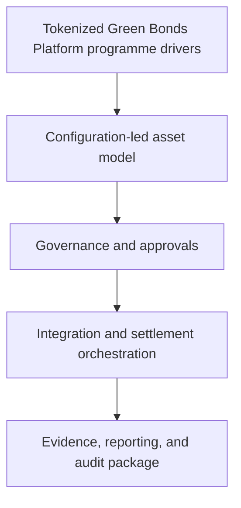
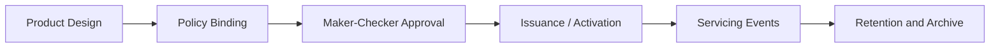
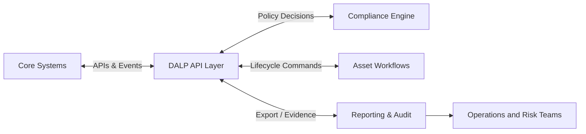
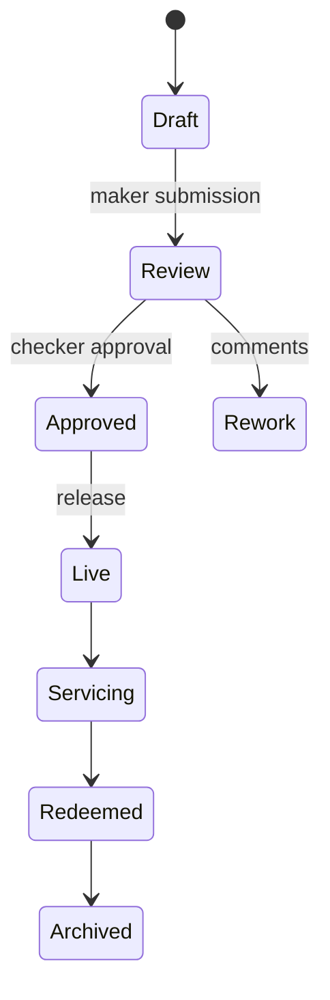
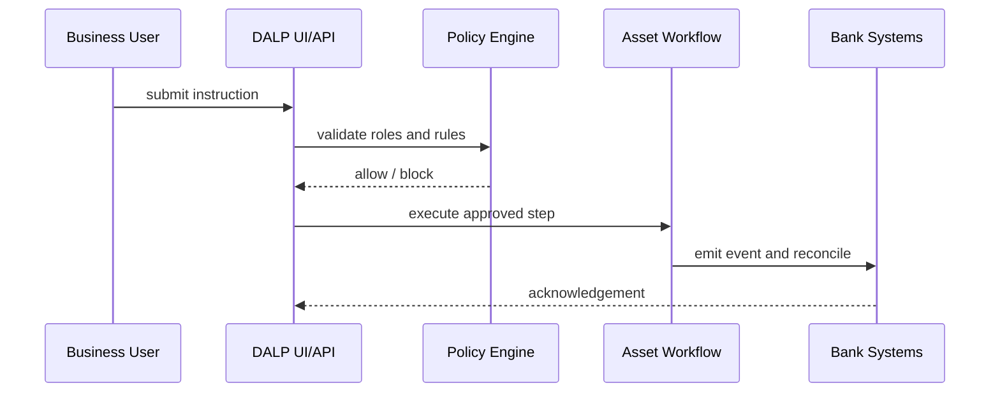
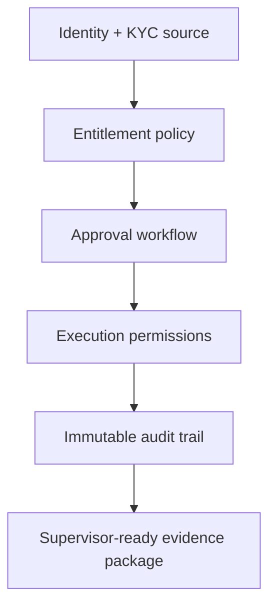
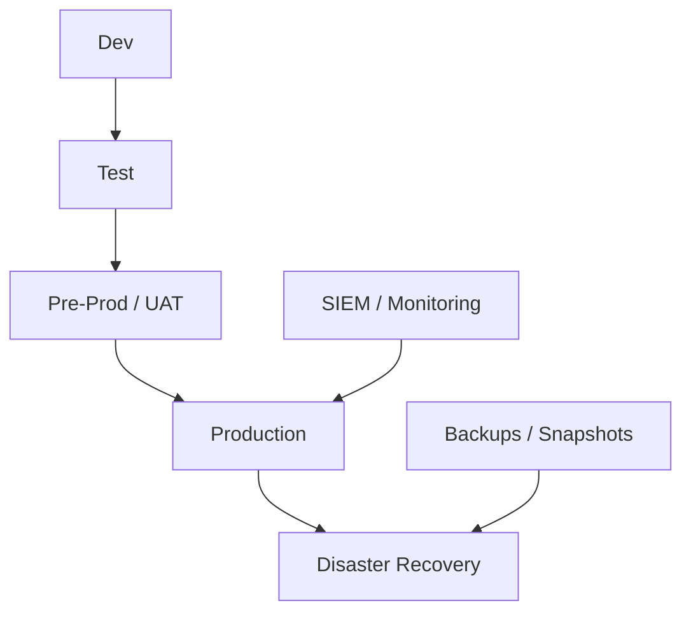
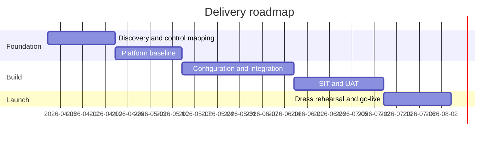
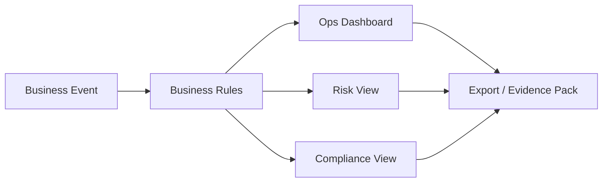
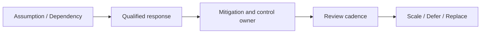

# Technical Proposal: Tokenized Green Bonds Platform

| Field | Value |
|---|---|
| Proposal title | Technical Proposal. Tokenized Green Bonds Platform |
| Client | Credit Agricole |
| Submitted by | SettleMint NV |
| Date | March 2026 |
| Version | v1.0 |
| Confidentiality | Restricted |
| RFP Reference | CA-RFP-202603-11 |
| Primary contact | SettleMint Bid Team |

---

## Table of Contents

- Executive Summary
- Understanding the Institution Operating Model
- Proposed DALP Operating Model
- Target Business Workflows
- Architecture and Integration Boundaries
- Data, Identity, and Compliance Controls
- Security and Operational Resilience
- Implementation Approach
- Service Model and Operating Readiness
- Requirements Response Narrative
- Qualified Dependencies and Assumptions
- Relevant Delivery Evidence
- Appendices

## Executive Summary

Crédit Agricole CIB is not buying a pilot stack; it is buying an operating capability for tokenized green bonds platform that must survive architecture review, operational risk review, compliance challenge, and production support handover. For that reason, the response throughout this section assumes that DALP is introduced as a governed platform component with clear ownership boundaries, explicit approvals, and deterministic exports into the surrounding bank estate rather than as an isolated innovation sandbox. The practical design principle is configuration before customization: policy, product parameters, participant roles, and lifecycle states are expressed in managed configurations so that Crédit Agricole CIB can scale new products, legal entities, and corridors without rebuilding the control model each time.

The relevant regulatory backdrop is MiCA, MiFID II, the EU Green Bond Regulation, SFDR, CSRD, DORA, GDPR, and AMF supervisory guidance for sustainable finance disclosures. DALP supports these obligations through configurable workflow gates, audit logs, entitlements, approval chains, API-led integration, and exportable evidence packs; where a requirement depends on external market infrastructure, local legal advice, or a customer-selected service provider, we say so explicitly and treat it as a dependency rather than folding it into an unsupported platform claim. That distinction matters for Crédit Agricole CIB because procurement and control teams need to separate core platform capability from implementation work and from third-party services at contract stage, not discover those distinctions during UAT.

In programme thesis, the emphasis is anchoring the response in buyer-owned governance, realistic rollout sequencing, and explicit control responsibilities. We therefore describe not only the happy path but also queue states, dual control, exception routing, evidence retention, and rollback options, because those are the areas where institutional programmes usually fail when digital-asset proposals are written only from a product-marketing perspective. The architecture described here is intentionally designed to let Crédit Agricole CIB keep supervisory accountability, data ownership, and operational authority while using DALP as the configurable execution and policy layer underneath the target workflow.

The central recommendation for Crédit Agricole CIB is to adopt DALP as the configuration-led lifecycle, policy, evidence, and integration orchestration layer for tokenized green bonds platform. This means the bank retains authority over product approval, legal interpretation, participant onboarding policy, and production release gates, while DALP handles the repeatable machinery of workflow states, asset rules, role enforcement, event emission, and evidence generation. That operating split aligns well with how Crédit Agricole CIB already governs material technology changes: central architecture and control teams set the rules; platform configuration operationalizes them consistently.

A strong institutional response has to be both operationally realistic and commercially honest about what is native, what is configurable, and what sits in implementation scope. DALP natively supports configurable token and workflow models, maker-checker approvals, audit trails, multi-environment deployments, API-led integration, and supervisory evidence packaging. Connectivity to specific market infrastructures, ESG data providers, payment rails, custodians, or registry operators is supported through bank-approved integration patterns and partner workstreams rather than claimed as universal hard-wired functionality.

## Understanding the Institution Operating Model

Crédit Agricole CIB is not buying a pilot stack; it is buying an operating capability for tokenized green bonds platform that must survive architecture review, operational risk review, compliance challenge, and production support handover. For that reason, the response throughout this section assumes that DALP is introduced as a governed platform component with clear ownership boundaries, explicit approvals, and deterministic exports into the surrounding bank estate rather than as an isolated innovation sandbox. The practical design principle is configuration before customization: policy, product parameters, participant roles, and lifecycle states are expressed in managed configurations so that Crédit Agricole CIB can scale new products, legal entities, and corridors without rebuilding the control model each time.

The relevant regulatory backdrop is MiCA, MiFID II, the EU Green Bond Regulation, SFDR, CSRD, DORA, GDPR, and AMF supervisory guidance for sustainable finance disclosures. DALP supports these obligations through configurable workflow gates, audit logs, entitlements, approval chains, API-led integration, and exportable evidence packs; where a requirement depends on external market infrastructure, local legal advice, or a customer-selected service provider, we say so explicitly and treat it as a dependency rather than folding it into an unsupported platform claim. That distinction matters for Crédit Agricole CIB because procurement and control teams need to separate core platform capability from implementation work and from third-party services at contract stage, not discover those distinctions during UAT.

In buyer objectives and constraints, the emphasis is translating the rfp from feature requests into an operating model that can be owned by treasury, operations, compliance, and architecture teams together. We therefore describe not only the happy path but also queue states, dual control, exception routing, evidence retention, and rollback options, because those are the areas where institutional programmes usually fail when digital-asset proposals are written only from a product-marketing perspective. The architecture described here is intentionally designed to let Crédit Agricole CIB keep supervisory accountability, data ownership, and operational authority while using DALP as the configurable execution and policy layer underneath the target workflow.

The RFP makes clear that Crédit Agricole CIB wants a reusable platform, not a one-deal delivery. That is why the proposed model emphasizes reusable product templates, parameterized lifecycle events, policy binding, and audit-friendly exports. For Crédit Agricole CIB, the economic value of the programme comes from reducing repeated project friction across new products and entities, not from proving that one isolated transaction can be put on a ledger.

The in-scope use cases we treat as primary are tokenized green bond issuance, ESG evidence capture and attestation, investor eligibility and sustainability reporting, and coupon, redemption, and post-issuance reporting. These workflows all require different front-office narratives, but they share the same control skeleton: product configuration, participant policy, approvals, execution, exception handling, reporting, and archive. That shared skeleton is the reason a platform approach is more robust than a set of bespoke point solutions.

## Proposed DALP Operating Model

Crédit Agricole CIB is not buying a pilot stack; it is buying an operating capability for tokenized green bonds platform that must survive architecture review, operational risk review, compliance challenge, and production support handover. For that reason, the response throughout this section assumes that DALP is introduced as a governed platform component with clear ownership boundaries, explicit approvals, and deterministic exports into the surrounding bank estate rather than as an isolated innovation sandbox. The practical design principle is configuration before customization: policy, product parameters, participant roles, and lifecycle states are expressed in managed configurations so that Crédit Agricole CIB can scale new products, legal entities, and corridors without rebuilding the control model each time.

The relevant regulatory backdrop is MiCA, MiFID II, the EU Green Bond Regulation, SFDR, CSRD, DORA, GDPR, and AMF supervisory guidance for sustainable finance disclosures. DALP supports these obligations through configurable workflow gates, audit logs, entitlements, approval chains, API-led integration, and exportable evidence packs; where a requirement depends on external market infrastructure, local legal advice, or a customer-selected service provider, we say so explicitly and treat it as a dependency rather than folding it into an unsupported platform claim. That distinction matters for Crédit Agricole CIB because procurement and control teams need to separate core platform capability from implementation work and from third-party services at contract stage, not discover those distinctions during UAT.

In configuration-led delivery, the emphasis is using parameterized assets and workflow components so future variants can be introduced without redesigning the governance layer. We therefore describe not only the happy path but also queue states, dual control, exception routing, evidence retention, and rollback options, because those are the areas where institutional programmes usually fail when digital-asset proposals are written only from a product-marketing perspective. The architecture described here is intentionally designed to let Crédit Agricole CIB keep supervisory accountability, data ownership, and operational authority while using DALP as the configurable execution and policy layer underneath the target workflow.

At the core of the response is a configurable asset and workflow model. Product teams define the business parameters, compliance teams define the policy overlays, operations teams define approval and servicing patterns, and platform administrators publish those configurations through governed release workflows. This design avoids embedding business change into source-code changes for each standard variation while preserving a documented change trail.

For Crédit Agricole CIB, that configuration-led model supports phased rollout. The bank can start with a contained product perimeter, prove operational fitness, and then add adjacent variants, new approval groups, or new participant types using the same control plane. The benefit is less architectural sprawl, clearer accountability, and faster audit review because the platform semantics stay consistent across deployments.

| Requirement theme | Position | Response |
|---|---|---|
| Lifecycle control | Supported | Configurable asset templates, approval states, servicing events, archive and redemption flows. |
| Enterprise integration | Supported | REST APIs, events, and export patterns for bank systems; market-infrastructure adapters remain implementation scope. |
| Role segregation | Supported | RBAC, maker-checker, environment separation, and auditable admin events. |
| Evidence generation | Supported | Audit logs, export packages, dashboards, and regulator-ready extracts. |
| Jurisdiction-specific legal interpretation | Buyer owned with partner support | Implemented as configurable policy and documentation workstream, not a hard-coded legal engine. |
| Third-party connectivity | Supported via integration | Custody, messaging, ESG, payment, registry, and identity providers connected through approved interfaces. |

## Target Business Workflows

Crédit Agricole CIB is not buying a pilot stack; it is buying an operating capability for tokenized green bonds platform that must survive architecture review, operational risk review, compliance challenge, and production support handover. For that reason, the response throughout this section assumes that DALP is introduced as a governed platform component with clear ownership boundaries, explicit approvals, and deterministic exports into the surrounding bank estate rather than as an isolated innovation sandbox. The practical design principle is configuration before customization: policy, product parameters, participant roles, and lifecycle states are expressed in managed configurations so that Crédit Agricole CIB can scale new products, legal entities, and corridors without rebuilding the control model each time.

The relevant regulatory backdrop is MiCA, MiFID II, the EU Green Bond Regulation, SFDR, CSRD, DORA, GDPR, and AMF supervisory guidance for sustainable finance disclosures. DALP supports these obligations through configurable workflow gates, audit logs, entitlements, approval chains, API-led integration, and exportable evidence packs; where a requirement depends on external market infrastructure, local legal advice, or a customer-selected service provider, we say so explicitly and treat it as a dependency rather than folding it into an unsupported platform claim. That distinction matters for Crédit Agricole CIB because procurement and control teams need to separate core platform capability from implementation work and from third-party services at contract stage, not discover those distinctions during UAT.

In lifecycle coverage, the emphasis is showing how dalp supports day-to-day operations rather than only product setup. We therefore describe not only the happy path but also queue states, dual control, exception routing, evidence retention, and rollback options, because those are the areas where institutional programmes usually fail when digital-asset proposals are written only from a product-marketing perspective. The architecture described here is intentionally designed to let Crédit Agricole CIB keep supervisory accountability, data ownership, and operational authority while using DALP as the configurable execution and policy layer underneath the target workflow.

Lifecycle completeness matters more than demo polish. Institutional programmes fail when setup is elegant but servicing, exception handling, and reporting remain manual. The proposed design for Crédit Agricole CIB therefore treats lifecycle stages as first-class operational states with approvals, timers, ownership, and downstream evidence generation attached to each state.

Every state transition generates an auditable event and a clear operational ownership boundary. If an instruction is blocked by policy, if a transfer is pending an external acknowledgement, or if a servicing event requires dual approval, those states remain visible to bank operators through dashboard and export patterns instead of being hidden inside smart-contract internals. This is crucial for operational resilience because supervisors and internal auditors do not accept 'the chain says it happened' as a substitute for reconstructable institutional evidence.

| Workflow stage | Operational outcome | Platform role | Buyer-owned activity |
|---|---|---|---|
| Product setup | Define the instrument or corridor | Template selection, parameter validation, approval workflow | Legal interpretation, commercial approval |
| Participant readiness | Establish access and permissions | Role binding, policy checks, evidence capture | KYC/AML policy, account opening, contractual onboarding |
| Execution | Launch issuance, transfer, settlement, or servicing event | Controlled workflow execution and event emission | Cash management, market-infrastructure coordination |
| Exception handling | Resolve breaks and retries | Queue visibility, state tracking, audit packaging | Operational decisions and escalation |
| Reporting and archive | Evidence for audit and supervisors | Export generation, retention support | Supervisory narrative, formal submissions |

## Architecture and Integration Boundaries

Crédit Agricole CIB is not buying a pilot stack; it is buying an operating capability for tokenized green bonds platform that must survive architecture review, operational risk review, compliance challenge, and production support handover. For that reason, the response throughout this section assumes that DALP is introduced as a governed platform component with clear ownership boundaries, explicit approvals, and deterministic exports into the surrounding bank estate rather than as an isolated innovation sandbox. The practical design principle is configuration before customization: policy, product parameters, participant roles, and lifecycle states are expressed in managed configurations so that Crédit Agricole CIB can scale new products, legal entities, and corridors without rebuilding the control model each time.

The relevant regulatory backdrop is MiCA, MiFID II, the EU Green Bond Regulation, SFDR, CSRD, DORA, GDPR, and AMF supervisory guidance for sustainable finance disclosures. DALP supports these obligations through configurable workflow gates, audit logs, entitlements, approval chains, API-led integration, and exportable evidence packs; where a requirement depends on external market infrastructure, local legal advice, or a customer-selected service provider, we say so explicitly and treat it as a dependency rather than folding it into an unsupported platform claim. That distinction matters for Crédit Agricole CIB because procurement and control teams need to separate core platform capability from implementation work and from third-party services at contract stage, not discover those distinctions during UAT.

In system fit and interface design, the emphasis is ensuring the platform complements the existing bank estate instead of creating a disconnected sidecar. We therefore describe not only the happy path but also queue states, dual control, exception routing, evidence retention, and rollback options, because those are the areas where institutional programmes usually fail when digital-asset proposals are written only from a product-marketing perspective. The architecture described here is intentionally designed to let Crédit Agricole CIB keep supervisory accountability, data ownership, and operational authority while using DALP as the configurable execution and policy layer underneath the target workflow.

The integration perimeter for Crédit Agricole CIB is broad: core issuance and treasury systems, ESG data and assurance providers, custody and registrar services, reporting warehouses and supervisory exports, and identity and access management. The architecture is therefore API-led and event-aware, with bank systems remaining systems of record for the domains they already own while DALP provides the execution and policy layer for the digital-asset workflow. This prevents authority confusion between ledger state, finance books, payment confirmations, and reporting stores.

A practical principle in this response is that integrations should be observable and reversible. Requests, acknowledgements, status changes, and export jobs need correlation identifiers and repeatable reconciliation logic so that break analysis does not require vendor forensic work during production incidents. The proposed model therefore favors explicit command and event boundaries rather than hidden background synchronization.

| Integration domain | Pattern | Notes |
|---|---|---|
| Core banking / treasury | REST APIs, events, scheduled exports | Used for positions, balances, reference data, and accounting handoff |
| Identity and access | SSO / IAM integration with role synchronization | Buyer remains identity authority |
| Reporting and audit | Export bundles, dashboard feeds, evidence packages | Supports internal audit and supervisory requests |
| External infrastructure | Adapter or middleware pattern | Subject to partner, network, or operator approval |
| Monitoring | SIEM, metrics, and alert forwarding | Supports operational resilience and support runbooks |

## Data, Identity, and Compliance Controls

Crédit Agricole CIB is not buying a pilot stack; it is buying an operating capability for tokenized green bonds platform that must survive architecture review, operational risk review, compliance challenge, and production support handover. For that reason, the response throughout this section assumes that DALP is introduced as a governed platform component with clear ownership boundaries, explicit approvals, and deterministic exports into the surrounding bank estate rather than as an isolated innovation sandbox. The practical design principle is configuration before customization: policy, product parameters, participant roles, and lifecycle states are expressed in managed configurations so that Crédit Agricole CIB can scale new products, legal entities, and corridors without rebuilding the control model each time.

The relevant regulatory backdrop is MiCA, MiFID II, the EU Green Bond Regulation, SFDR, CSRD, DORA, GDPR, and AMF supervisory guidance for sustainable finance disclosures. DALP supports these obligations through configurable workflow gates, audit logs, entitlements, approval chains, API-led integration, and exportable evidence packs; where a requirement depends on external market infrastructure, local legal advice, or a customer-selected service provider, we say so explicitly and treat it as a dependency rather than folding it into an unsupported platform claim. That distinction matters for Crédit Agricole CIB because procurement and control teams need to separate core platform capability from implementation work and from third-party services at contract stage, not discover those distinctions during UAT.

In policy enforcement, the emphasis is making regulatory obligations operational through configurable policies, role segregation, and evidence output. We therefore describe not only the happy path but also queue states, dual control, exception routing, evidence retention, and rollback options, because those are the areas where institutional programmes usually fail when digital-asset proposals are written only from a product-marketing perspective. The architecture described here is intentionally designed to let Crédit Agricole CIB keep supervisory accountability, data ownership, and operational authority while using DALP as the configurable execution and policy layer underneath the target workflow.

The platform does not replace the institution's legal accountability; it operationalizes approved policy. Identity sources, investor classifications, sanctions outcomes, and jurisdiction tags can be consumed as controlled inputs, after which DALP can enforce eligibility, transfer restrictions, workflow approvals, and exception routing based on those inputs. That approach is more durable than encoding legal concepts directly into application branches because the underlying rule parameters can evolve under governance.

For Crédit Agricole CIB, data lineage is as important as execution itself. Each significant action should be reconstructable: who submitted it, which policy version was in force, which reference data was used, which external acknowledgements were received, and which export or report captured the result. Those lineage expectations influence not just compliance design but also the shape of the operations dashboard, the archive model, and the test evidence required before go-live.

| Control area | Response |
|---|---|
| Role-based access | Supported through configurable roles, groups, and approval chains |
| Segregation of duties | Supported through maker-checker, approval steps, and environment controls |
| Audit trail | Supported through immutable event logging and exportable evidence |
| Policy enforcement | Supported through configurable rule checks bound to identity and product metadata |
| Data retention | Supported through managed exports and archive-oriented lifecycle states |

## Security and Operational Resilience

Crédit Agricole CIB is not buying a pilot stack; it is buying an operating capability for tokenized green bonds platform that must survive architecture review, operational risk review, compliance challenge, and production support handover. For that reason, the response throughout this section assumes that DALP is introduced as a governed platform component with clear ownership boundaries, explicit approvals, and deterministic exports into the surrounding bank estate rather than as an isolated innovation sandbox. The practical design principle is configuration before customization: policy, product parameters, participant roles, and lifecycle states are expressed in managed configurations so that Crédit Agricole CIB can scale new products, legal entities, and corridors without rebuilding the control model each time.

The relevant regulatory backdrop is MiCA, MiFID II, the EU Green Bond Regulation, SFDR, CSRD, DORA, GDPR, and AMF supervisory guidance for sustainable finance disclosures. DALP supports these obligations through configurable workflow gates, audit logs, entitlements, approval chains, API-led integration, and exportable evidence packs; where a requirement depends on external market infrastructure, local legal advice, or a customer-selected service provider, we say so explicitly and treat it as a dependency rather than folding it into an unsupported platform claim. That distinction matters for Crédit Agricole CIB because procurement and control teams need to separate core platform capability from implementation work and from third-party services at contract stage, not discover those distinctions during UAT.

In deployment and recovery, the emphasis is demonstrating that the platform can be run as an enterprise service with clear boundaries between environments and recoverable operations. We therefore describe not only the happy path but also queue states, dual control, exception routing, evidence retention, and rollback options, because those are the areas where institutional programmes usually fail when digital-asset proposals are written only from a product-marketing perspective. The architecture described here is intentionally designed to let Crédit Agricole CIB keep supervisory accountability, data ownership, and operational authority while using DALP as the configurable execution and policy layer underneath the target workflow.

The RFP rightly emphasizes resilience, and the response treats resilience as a whole-system property rather than an infrastructure checkbox. Separate environments, release discipline, privileged-access controls, backup strategy, disaster-recovery rehearsals, and monitoring integration are all needed before a digital-asset workflow can be considered production-ready. DALP supports this model through multi-environment deployment patterns, auditable administrative actions, and integration into the customer's chosen observability and ticketing stack.

Equally important is evidentiary resilience. Operational incidents become governance incidents when teams cannot reconstruct what happened, which controls triggered, or which external dependencies were involved. The proposed design therefore pairs runtime monitoring with exportable event history, approval logs, and repeatable incident runbooks so that production support and post-incident review use the same source of truth.

## Implementation Approach

Crédit Agricole CIB is not buying a pilot stack; it is buying an operating capability for tokenized green bonds platform that must survive architecture review, operational risk review, compliance challenge, and production support handover. For that reason, the response throughout this section assumes that DALP is introduced as a governed platform component with clear ownership boundaries, explicit approvals, and deterministic exports into the surrounding bank estate rather than as an isolated innovation sandbox. The practical design principle is configuration before customization: policy, product parameters, participant roles, and lifecycle states are expressed in managed configurations so that Crédit Agricole CIB can scale new products, legal entities, and corridors without rebuilding the control model each time.

The relevant regulatory backdrop is MiCA, MiFID II, the EU Green Bond Regulation, SFDR, CSRD, DORA, GDPR, and AMF supervisory guidance for sustainable finance disclosures. DALP supports these obligations through configurable workflow gates, audit logs, entitlements, approval chains, API-led integration, and exportable evidence packs; where a requirement depends on external market infrastructure, local legal advice, or a customer-selected service provider, we say so explicitly and treat it as a dependency rather than folding it into an unsupported platform claim. That distinction matters for Crédit Agricole CIB because procurement and control teams need to separate core platform capability from implementation work and from third-party services at contract stage, not discover those distinctions during UAT.

In delivery sequencing, the emphasis is reducing delivery risk through phased scope, objective checkpoints, and clear control sign-off before scale-out. We therefore describe not only the happy path but also queue states, dual control, exception routing, evidence retention, and rollback options, because those are the areas where institutional programmes usually fail when digital-asset proposals are written only from a product-marketing perspective. The architecture described here is intentionally designed to let Crédit Agricole CIB keep supervisory accountability, data ownership, and operational authority while using DALP as the configurable execution and policy layer underneath the target workflow.

The recommended implementation path is to begin with a narrow but real production slice and only then expand. That first slice should include end-to-end control evidence: configuration approval, external integration acknowledgements, operational monitoring, break handling, and audit export. For Crédit Agricole CIB, this means the early phases are as much about proving operational readiness as they are about standing up the base workflow.

Programme governance should combine product, architecture, security, compliance, and operations representation. Each phase should close with an evidence package: decisions taken, configurations approved, interfaces validated, known dependencies, residual risks, and release criteria for the next stage. That package is what lets procurement and steering committees compare delivery progress against the original commitments in the RFP.

| Phase | Primary outcome | Exit criteria |
|---|---|---|
| Discovery and control mapping | Finalize scope, policies, target integrations, evidence expectations | Agreed operating model and RACI |
| Foundation build | Baseline environments, roles, templates, and monitoring | Environments ready and admin controls signed off |
| Configuration and integration | Product workflows and interfaces implemented | SIT complete and reconciliation evidence approved |
| UAT and readiness | Operational procedures, support model, and exports tested | Go-live board approves release |
| Launch and hypercare | Controlled production rollout | Stability metrics met and backlog triaged |

## Service Model and Operating Readiness

Crédit Agricole CIB is not buying a pilot stack; it is buying an operating capability for tokenized green bonds platform that must survive architecture review, operational risk review, compliance challenge, and production support handover. For that reason, the response throughout this section assumes that DALP is introduced as a governed platform component with clear ownership boundaries, explicit approvals, and deterministic exports into the surrounding bank estate rather than as an isolated innovation sandbox. The practical design principle is configuration before customization: policy, product parameters, participant roles, and lifecycle states are expressed in managed configurations so that Crédit Agricole CIB can scale new products, legal entities, and corridors without rebuilding the control model each time.

The relevant regulatory backdrop is MiCA, MiFID II, the EU Green Bond Regulation, SFDR, CSRD, DORA, GDPR, and AMF supervisory guidance for sustainable finance disclosures. DALP supports these obligations through configurable workflow gates, audit logs, entitlements, approval chains, API-led integration, and exportable evidence packs; where a requirement depends on external market infrastructure, local legal advice, or a customer-selected service provider, we say so explicitly and treat it as a dependency rather than folding it into an unsupported platform claim. That distinction matters for Crédit Agricole CIB because procurement and control teams need to separate core platform capability from implementation work and from third-party services at contract stage, not discover those distinctions during UAT.

In day-2 ownership, the emphasis is ensuring the bank can own the platform after launch without permanent vendor dependency. We therefore describe not only the happy path but also queue states, dual control, exception routing, evidence retention, and rollback options, because those are the areas where institutional programmes usually fail when digital-asset proposals are written only from a product-marketing perspective. The architecture described here is intentionally designed to let Crédit Agricole CIB keep supervisory accountability, data ownership, and operational authority while using DALP as the configurable execution and policy layer underneath the target workflow.

A credible proposal must explain who runs the service on day two. Our recommended operating model places business ownership, policy ownership, and operational authority with the bank, while SettleMint provides platform product support, upgrade guidance, and specialist implementation assistance where contracted. That split avoids a hidden managed-service dependency while still giving the institution access to vendor expertise when platform changes or incident analysis require it.

Operating readiness also depends on practical artefacts: runbooks, ownership maps, change windows, support severity definitions, dashboard views, and evidence exports for internal control teams. Those artefacts should be produced during implementation rather than postponed until after go-live, because Crédit Agricole CIB will need them for acceptance, audit, and resilience review before any scaled rollout is authorized.

## Requirements Response Narrative

Crédit Agricole CIB is not buying a pilot stack; it is buying an operating capability for tokenized green bonds platform that must survive architecture review, operational risk review, compliance challenge, and production support handover. For that reason, the response throughout this section assumes that DALP is introduced as a governed platform component with clear ownership boundaries, explicit approvals, and deterministic exports into the surrounding bank estate rather than as an isolated innovation sandbox. The practical design principle is configuration before customization: policy, product parameters, participant roles, and lifecycle states are expressed in managed configurations so that Crédit Agricole CIB can scale new products, legal entities, and corridors without rebuilding the control model each time.

The relevant regulatory backdrop is MiCA, MiFID II, the EU Green Bond Regulation, SFDR, CSRD, DORA, GDPR, and AMF supervisory guidance for sustainable finance disclosures. DALP supports these obligations through configurable workflow gates, audit logs, entitlements, approval chains, API-led integration, and exportable evidence packs; where a requirement depends on external market infrastructure, local legal advice, or a customer-selected service provider, we say so explicitly and treat it as a dependency rather than folding it into an unsupported platform claim. That distinction matters for Crédit Agricole CIB because procurement and control teams need to separate core platform capability from implementation work and from third-party services at contract stage, not discover those distinctions during UAT.

In qualification of coverage, the emphasis is translating the requirement matrix into clear capability positions with no hidden assumptions. We therefore describe not only the happy path but also queue states, dual control, exception routing, evidence retention, and rollback options, because those are the areas where institutional programmes usually fail when digital-asset proposals are written only from a product-marketing perspective. The architecture described here is intentionally designed to let Crédit Agricole CIB keep supervisory accountability, data ownership, and operational authority while using DALP as the configurable execution and policy layer underneath the target workflow.

Across the RFP, our position is consistent: DALP is strong where configurable lifecycle control, policy enforcement, approvals, integrations, and evidence generation are required. Where the target model depends on legal interpretation, third-party market infrastructure, external attestations, or customer-specific enterprise tooling, we identify the dependency and propose how it is governed. This is the most reliable way to preserve trust during procurement and to avoid over-claiming functionality that, in practice, belongs in implementation scope or in the bank's retained control obligations.

For Crédit Agricole CIB, the most important delivery question is not whether a digital workflow can be demonstrated once; it is whether the institution can own, govern, and evidence that workflow across products and over time. The response is therefore optimized for maintainability, reuse, and supervisory defensibility rather than for speculative breadth. That makes it a stronger fit for a regulated institution seeking industrialized operations rather than innovation theatre.

| Requirement theme | Position | Response |
|---|---|---|
| Lifecycle control | Supported | Configurable asset templates, approval states, servicing events, archive and redemption flows. |
| Enterprise integration | Supported | REST APIs, events, and export patterns for bank systems; market-infrastructure adapters remain implementation scope. |
| Role segregation | Supported | RBAC, maker-checker, environment separation, and auditable admin events. |
| Evidence generation | Supported | Audit logs, export packages, dashboards, and regulator-ready extracts. |
| Jurisdiction-specific legal interpretation | Buyer owned with partner support | Implemented as configurable policy and documentation workstream, not a hard-coded legal engine. |
| Third-party connectivity | Supported via integration | Custody, messaging, ESG, payment, registry, and identity providers connected through approved interfaces. |

## Qualified Dependencies and Assumptions

The following assumptions apply to the proposal and are intentionally explicit. Jurisdiction-specific legal interpretations, final regulatory filings, external connectivity certifications, and customer-selected hosting controls remain joint workstreams between the institution, its advisors, and relevant third parties. DALP supports those workstreams through configurable controls and integration patterns; it does not substitute for them.

| Assumption | Why it matters | Proposed treatment |
|---|---|---|
| Final legal structure confirmed by buyer counsel | Product rules and disclosures depend on it | Bind policy after legal sign-off |
| External infrastructure access approved | Connectivity and acceptance testing depend on it | Treat as gated dependency in plan |
| Enterprise IAM and logging standards available | Role sync and evidentiary monitoring depend on them | Integrate during foundation phase |
| Data-retention and reporting requirements finalized | Export pack shape depends on them | Confirm during discovery with control teams |
| Buyer operational staffing identified | UAT and day-2 readiness require named owners | Include in governance workstream |

These assumptions are not blockers to starting the programme, but they are blockers to claiming a full production release without residual risk. Capturing them early is part of responsible delivery.

## Relevant Delivery Evidence

The proposal is framed around evidence types that procurement and control teams can validate for Crédit Agricole CIB. These include environment designs, role maps, requirement traceability, sample exports, integration contracts, support model definitions, and delivery references relevant to regulated financial institutions. Where supporting artefacts are more appropriately shared under NDA or in diligence phases, this is noted rather than treated as absent evidence.

| Evidence category | How it is provided |
|---|---|
| Architecture and workflow diagrams | Included in this proposal and in implementation design packs |
| Requirement traceability | Requirement matrix and section cross-reference |
| Security and resilience narrative | Control response and deployment model summary |
| Support model | Severity definitions, ownership model, and escalation paths |
| References | regulated green and sustainable finance digitization programmes; institutional bond workflows with configurable compliance controls; bank-led digital asset environments with evidence packaging for auditors and supervisors |

The objective is to give the institution enough evidence to assess fit now while structuring the diligence process so that deeper artefacts can be reviewed in an appropriate commercial and confidentiality framework.

## Appendices

Appendix A contains section-by-section requirement references. Appendix B lists integration domains and ownership boundaries. Appendix C lists qualified gaps, assumptions, and implementation responsibilities. Appendix D summarizes recommended governance checkpoints for scale-out beyond the first release.

The body of the proposal is intentionally written so each major section can stand on its own during procurement review. That structure supports parallel evaluation by business sponsors, architecture, security, compliance, and procurement stakeholders.
