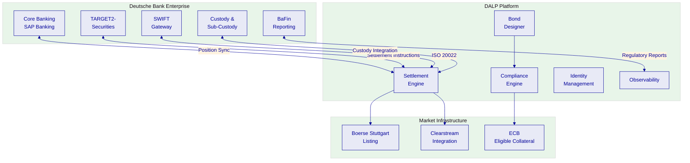
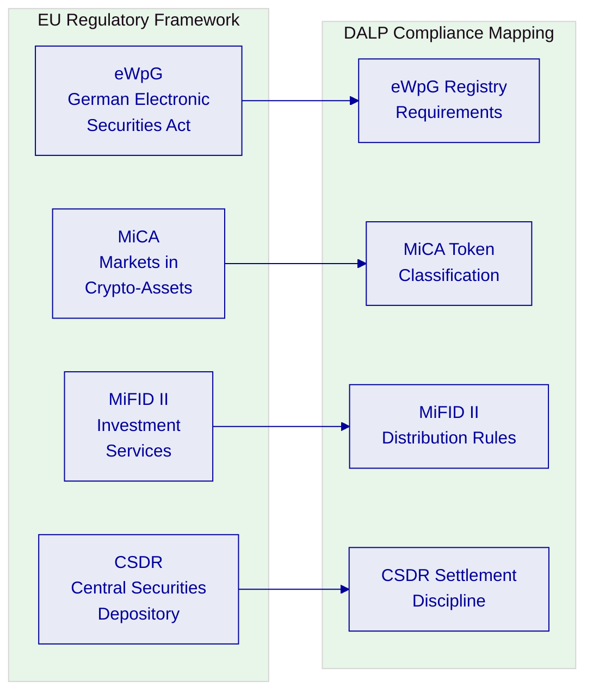
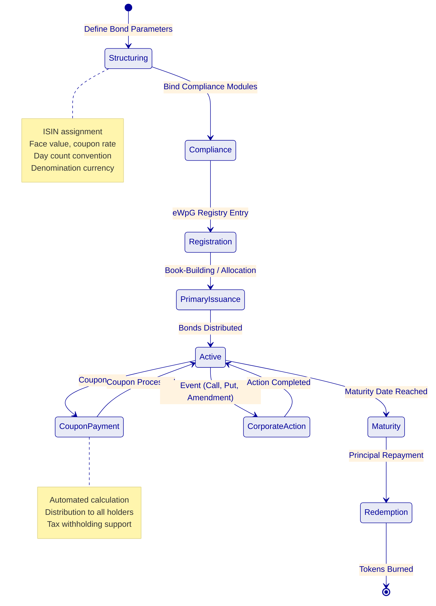
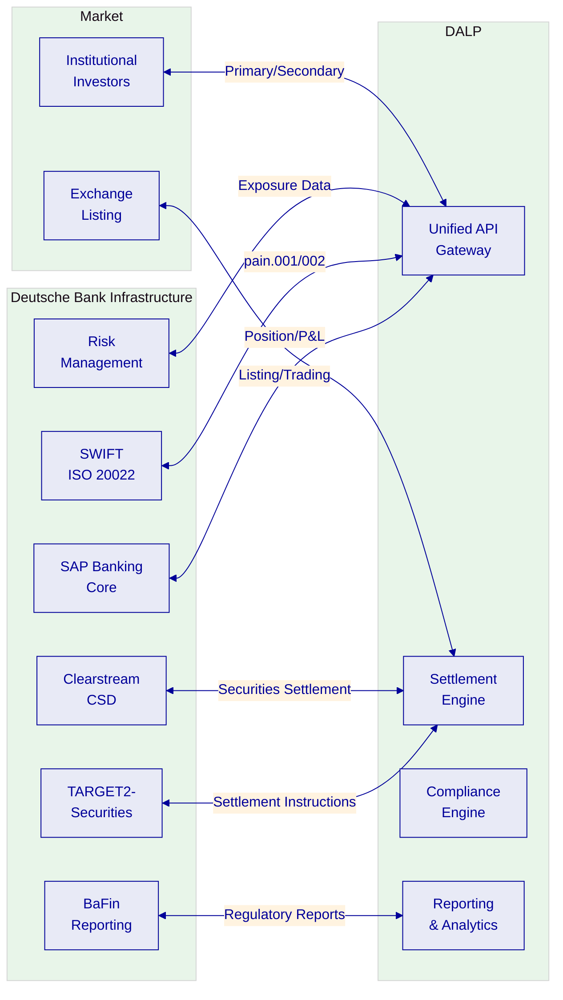
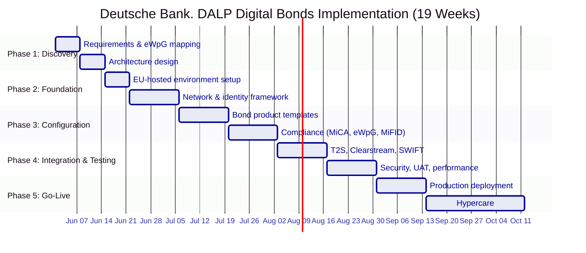

# Technical Proposal: Digital Bonds Issuance Platform

| Field | Value |
|---|---|
| Proposal title | Technical Proposal. Digital Bonds Issuance Platform |
| Client | Deutsche Bank |
| Submitted by | SettleMint NV |
| Date | March 2026 |
| Version | v1.0 |
| Confidentiality | Restricted |
| RFP Reference | DEUTSCHE-BANK-RFP-DIGITAL-BONDS-202603 |
| Primary contact | Adam Popat, CEO |

---

## Table of Contents

- Executive Summary
- Understanding Deutsche Bank's Programme Objectives
- Proposed DALP Operating Model for Digital Bonds
- Technical Architecture and Integration Boundaries
- Bond-Specific Smart Contract Architecture
- Identity, Compliance, and MiCA/eWpG Controls
- Settlement, Servicing, and Corporate Actions
- Security, Resilience, and Operational Assurance
- Implementation Approach and Delivery Phases
- Current Coverage, Dependencies, and Qualified Gaps
- Relevant Delivery Evidence
- Appendices

---

## Executive Summary

Deutsche Bank has identified digital bonds issuance as a strategic capability for modernizing its fixed-income operations. The German Electronic Securities Act (eWpG) and the EU Markets in Crypto-Assets Regulation (MiCA) have created the regulatory framework for digital securities issuance in Germany and across the European Union. The challenge is no longer regulatory permission, it is production-grade execution: building infrastructure that can issue, settle, service, and retire digital bonds at institutional scale within the control environment expected of a Global Systemically Important Bank (G-SIB).

SettleMint's Digital Asset Lifecycle Platform (DALP) addresses this directly. DALP provides the full bond lifecycle, from structuring and issuance through coupon processing, corporate actions, and redemption at maturity, with compliance enforcement embedded at the smart contract level and enterprise integration designed for G-SIB control requirements.

**Why DALP fits Deutsche Bank's requirements:**

- **Production-proven bond infrastructure.** DALP powers Commerzbank's hybrid Exchange-Traded Product (ETP) issuance programme, listed on Boerse Stuttgart with settlement in under 10 seconds and projected annual savings of EUR 7 million. This is the most directly relevant reference for Deutsche Bank's digital bonds programme.

- **MiCA and eWpG compliance readiness.** DALP's compliance engine supports jurisdiction-specific regulatory configurations including MiFID II reporting (RTS 25), eWpG crypto securities register requirements, and MiCA prudential controls. Compliance modules enforce investor eligibility, jurisdiction restrictions, and transfer restrictions at the smart contract level.

- **G-SIB integration architecture.** DALP integrates with core banking systems, custody providers (including sub-custody arrangements), SWIFT messaging, TARGET2-Securities (T2S), and regulatory reporting through a comprehensive API surface. The platform is designed to sit inside Deutsche Bank's enterprise architecture without creating reconciliation sinkholes or unowned integration points.

- **Deterministic settlement.** Under tested conditions (500 concurrent settlement instructions, 4-node validator network), DALP achieves median settlement latency of 2.3 seconds with P99 at 4.1 seconds using IBFT consensus. This provides T+0 settlement with deterministic finality, eliminating the confirmation-depth waiting required by probabilistic consensus mechanisms.

---

## Understanding Deutsche Bank's Programme Objectives

### The German Digital Securities Landscape

Germany's eWpG (Electronic Securities Act, effective June 2021) permits the issuance of electronic securities on distributed ledger technology, creating a regulated pathway for digital bonds. Combined with MiCA (effective June 2023 for asset-referenced tokens, December 2024 for full scope), the regulatory framework for digital bond issuance in Germany and across the EU is now established.

Deutsche Bank's programme objectives center on three requirements:

**First, institutional-grade issuance infrastructure.** The platform must support the full bond lifecycle, structuring, primary issuance, secondary market settlement, coupon processing, corporate actions, and redemption, with the same control environment applied to traditional fixed-income operations.

**Second, regulatory compliance across jurisdictions.** Digital bonds issued under eWpG must comply with German securities law, BaFin supervision, MiCA requirements, and potentially MiFID II obligations for distribution across EU member states. The platform must support multi-jurisdictional compliance without requiring separate implementations per jurisdiction.

**Third, hybrid on-chain/off-chain coexistence.** Deutsche Bank's digital bonds programme will initially coexist with traditional fixed-income infrastructure. The platform must integrate with TARGET2-Securities, Clearstream, SWIFT, and existing core banking systems, operating as a component within the broader settlement ecosystem, not as a replacement for it.

---

## Proposed DALP Operating Model for Digital Bonds

### Bond Lifecycle Coverage

DALP manages the complete bond lifecycle through configurable DALPAsset contracts:

### Bond Configuration Parameters

| Parameter | Description | DALP Configuration |
|---|---|---|
| ISIN | International Securities Identification Number | Validated per ISO 6166 at creation |
| Face value | Par value per bond | Token denomination parameter |
| Coupon rate | Fixed or floating rate | Yield feature configuration |
| Coupon frequency | Annual, semi-annual, quarterly | Distribution schedule |
| Day count convention | 30/360, ACT/360, ACT/365 | Calculation engine parameter |
| Maturity date | Bond expiry date | Maturity & Redemption feature |
| Call/put provisions | Early redemption rights | Configurable lifecycle events |
| Currency | Denomination and settlement currency | DALPAsset currency parameter |
| Jurisdiction | Governing law and regulatory framework | Compliance module binding |

---

## Technical Architecture and Integration Boundaries

### Enterprise Integration for Deutsche Bank

### ISO 20022 Messaging

DALP supports integration with SWIFT and TARGET2-Securities through ISO 20022 message types:

| Message Type | Purpose | Integration |
|---|---|---|
| pain.001 | Payment initiation | Settlement instruction creation |
| pain.002 | Payment status | Settlement confirmation |
| semt.002 | Securities balance | Position reconciliation |
| sese.023 | Settlement instruction | DVP settlement |
| sese.025 | Settlement confirmation | Post-settlement reporting |

**Current status:** DALP generates settlement instructions in its standard format. Native ISO 20022 message generation is in development, targeted for Q3 2026. In the interim, a documented middleware translation layer is available, successfully deployed by two existing clients.

---

## Settlement, Servicing, and Corporate Actions

### T+0 Settlement

DALP enables T+0 settlement for digital bonds through atomic DvP:

- Settlement finality in under 3 seconds (median) using IBFT consensus
- Deterministic finality, no confirmation-depth waiting
- Atomic DvP via XvP Settlement addon
- Integration with T2S for hybrid settlement scenarios

### Coupon Processing

Automated coupon processing for all holders:
- Calculation based on configured day count convention and coupon rate
- Distribution to all verified holders based on historical balance snapshot
- Tax withholding support (configurable per jurisdiction)
- Complete audit trail of calculation basis, distribution amounts, and timestamps

### Corporate Actions

| Action | Support | Mechanism |
|---|---|---|
| Coupon payment | **Full** | Automated calculation and distribution |
| Maturity redemption | **Full** | Maturity & Redemption feature |
| Early call | **Full** | Configurable call provisions |
| Put option | **Full** | Investor-initiated redemption |
| Amendment | **Partial** | Governance-approved parameter changes |
| Default event | **Configuration** | Configurable trigger and workflow |

---

## Security, Resilience, and Operational Assurance

### G-SIB Grade Security

| Control | Implementation |
|---|---|
| Authentication | Multi-factor, passkeys (WebAuthn), LDAP/AD, OAuth 2.0/OIDC |
| Key management | HSM integration, multi-signature governance controls |
| Smart contract security | Independent audits per release, UUPS upgrade pattern |
| Network security | Permissioned Besu, encrypted node communication |
| Data protection | AES-256 at rest, TLS 1.3 in transit, GDPR-compliant |
| Certifications | ISO 27001, SOC 2 Type II |

### Operational Resilience

| Target | Configuration |
|---|---|
| RPO | < 1 hour |
| RTO | < 4 hours |
| Availability | 99.95% |
| DR | Geo-separated within EU |
| Monitoring | Three-pillar observability |
| Penetration testing | Annual + per major release |

---

## Implementation Approach and Delivery Phases

### 19-Week Implementation

---

## Current Coverage, Dependencies, and Qualified Gaps

### Requirements Coverage

| Req Area | Status | Notes |
|---|---|---|
| Bond lifecycle | **Full** | Issuance through redemption |
| eWpG registry | **Full** | Crypto securities register requirements |
| MiCA compliance | **Full** | Token classification, prudential controls |
| T2S integration | **Partial** | API integration available; native SWIFT ISO 20022 in Q3 2026 |
| Clearstream CSD | **Partial** | Integration architecture defined; requires joint development |
| Coupon processing | **Full** | Automated with day count convention support |
| Corporate actions | **Full** | Coupon, call, put, maturity redemption |
| BaFin reporting | **Full** | Configurable regulatory report templates |
| RBAC & audit | **Full** | G-SIB grade controls |

### Qualified Gaps

**Native ISO 20022 messaging. Q3 2026.** DALP does not currently generate native ISO 20022 messages. A documented middleware translation layer is available and deployed by two existing clients. Native support targeted for Q3 2026. This does not block implementation, the middleware approach is production-proven.

**Clearstream CSD integration. Joint development required.** Direct integration with Clearstream's settlement infrastructure requires joint development during the implementation phase. DALP provides the API surface and settlement instruction format; Clearstream connectivity requires Deutsche Bank's existing CSD relationship and technical coordination.

---

## Relevant Delivery Evidence

| Client | Region | Relevance |
|---|---|---|
| Commerzbank | Germany | **Direct**: hybrid ETP issuance, Boerse Stuttgart, EUR 7M savings |
| OCBC Bank | Singapore | Regulated bank, multi-asset securities tokenization |
| KBC Securities | Belgium | Equity crowdfunding, corporate actions, fiat-backed tokens |
| Standard Chartered Bank | Multi-region | Multi-jurisdiction securities |
| Saudi Arabia RER | KSA | National-scale blockchain production |

### Commerzbank: German Bank, Production Digital Securities

The Commerzbank ETP engagement is the most directly relevant reference:
- German bank, regulated under BaFin
- Hybrid on-chain/off-chain issuance model
- Listed on Boerse Stuttgart
- Settlement under 10 seconds
- Projected EUR 7 million annual savings
- Demonstrates coexistence with established exchange infrastructure

---

## Appendices

### Appendix A: Glossary

| Term | Definition |
|---|---|
| DALP | Digital Asset Lifecycle Platform |
| eWpG | Elektronische Wertpapiergesetz (German Electronic Securities Act) |
| MiCA | Markets in Crypto-Assets Regulation (EU) |
| MiFID II | Markets in Financial Instruments Directive II |
| CSDR | Central Securities Depository Regulation |
| T2S | TARGET2-Securities (Eurosystem settlement platform) |
| G-SIB | Global Systemically Important Bank |
| DvP | Delivery versus Payment |
| ISIN | International Securities Identification Number |
| DALPAsset | Configurable token contract |
| IBFT | Istanbul Byzantine Fault Tolerance consensus |
| ISO 20022 | International standard for financial messaging |
