# Technical Proposal: Tokenized Deposits and Trade Finance Liquidity Rails

| Field | Value |
|---|---|
| Proposal title | Technical Proposal. Tokenized Deposits and Trade Finance Liquidity Rails |
| Client | Emirates NBD |
| Submitted by | SettleMint NV |
| Date | March 2026 |
| Version | v1.0 |
| Confidentiality | Restricted |
| RFP Reference | EMIRATES-NBD-RFP-TOKENIZED-DEPOSITS-TRADE-FINANCE-202603 |
| Primary contact | Adam Popat, CEO |

---

## Table of Contents

- Executive Summary
- About SettleMint
- About DALP
- Understanding Emirates NBD's Programme Objectives
- Customer References
- Proposed Solution and Functional Capabilities
- Technical Architecture
- Smart Contract Architecture for Deposits and Trade Finance
- Identity, Compliance, and Regulatory Controls
- Settlement, Servicing, and Lifecycle Management
- Integration Architecture
- Security, Resilience, and Operational Assurance
- Implementation Approach and Delivery Phases
- Deployment Model
- Training and Knowledge Transfer
- Support and SLA
- Risk Management
- Current Coverage, Dependencies, and Qualified Gaps
- Compliance Matrix
- Appendices

---

## Executive Summary

Emirates NBD has identified tokenized deposits and trade finance liquidity rails as a business-critical capability requiring production-grade discipline, not innovation theater, but a platform and implementation model that operates within the bank's control environment, integrates with existing enterprise systems, and sustains growth in volumes, products, and regulatory scrutiny without fundamental rework.

SettleMint's Digital Asset Lifecycle Platform (DALP) addresses this requirement directly. DALP provides production-ready infrastructure for designing, issuing, servicing, and retiring tokenized financial instruments with compliance enforcement, identity verification, and governance controls embedded at the smart contract level rather than bolted on as application-layer overlays.

**Why DALP fits Emirates NBD's requirements:**

- **Production-proven tokenized deposits.** DALP's configurable token architecture supports tokenized bank deposits as a native asset class, with denomination linking, atomic delivery-versus-payment settlement, and full lifecycle servicing, coupon distribution, maturity redemption, corporate actions, through platform configuration rather than custom smart contract development. The compliance engine enforces eligibility checks, investor accreditation, and transfer restrictions at the contract level, ensuring that deposit and trade finance governance rules travel with the token throughout its lifecycle.

- **Institutional-scale production track record.** DALP processes digital assets across production deployments with regulated institutions including Standard Chartered Bank (Digital Virtual Exchange across Asia, Africa, and the Middle East), Commerzbank (exchange-traded products on Boerse Stuttgart with median settlement latency of 2.3 seconds and P99 at 4.1 seconds), OCBC Bank (security token engine for securitization), State Bank of India (CBDC infrastructure), and the Islamic Development Bank (subsidy distribution across 57 member countries). These are not pilot exercises, they are production systems processing real assets on real balance sheets.

- **Enterprise integration, not isolation.** DALP connects to identity services, core banking ledgers, sanctions and AML tooling, SWIFT messaging infrastructure, trade finance document management systems, reporting environments, and observability stacks through a comprehensive API surface (REST API v2 with OpenAPI 3.1, GraphQL via subgraph, event webhooks, TypeScript SDK, CLI with 301 commands across 26 command groups). The platform does not create an isolated digital-asset island, it sits inside Emirates NBD's institutional plumbing with defined integration boundaries and reconciliation points.

- **Control integrity from day one.** Every operation, issuance, transfer, trade milestone, distribution, produces a complete audit trail with initiator identity, policy checks applied, approval chain, and resulting state. Role-based access control with maker-checker workflows, segregation of duties, and multi-signature governance are native to the platform. Emirates NBD's compliance officers, operations teams, and internal audit can reconstruct any state at any point.

- **Trade finance workflow orchestration.** DALP's durable execution engine handles multi-step trade finance workflows, document presentation, milestone verification, counterparty approvals, limit checks, and liquidity release, with deterministic completion guarantees. Each workflow step produces auditable evidence, and failure at any point triggers defined recovery paths rather than silent data loss.

The proposed implementation follows SettleMint's phase-gated methodology: 19 weeks from kickoff to hypercare completion, with five delivery phases, formal gate reviews, and clearly defined client responsibilities at each stage. The first production asset class, tokenized deposits, can be live within 13 weeks of kickoff, with trade finance liquidity rails following in a subsequent configuration cycle.

This proposal responds to every requirement in the RFP with explicit status, evidence references, and honest qualification of gaps. Where a capability is partial or planned, the gap, mitigation, and timeline are stated directly. SettleMint's position is that operational honesty earns more trust than an over-optimistic response, and we believe Emirates NBD's evaluation team shares that view.

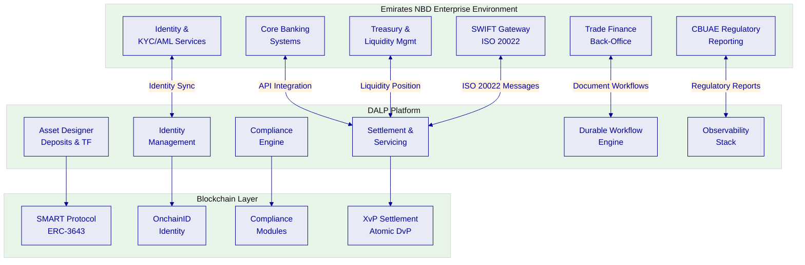

---

## About SettleMint

### Company Overview

SettleMint is the production-grade digital asset lifecycle management company for regulated financial markets and sovereign use cases. Founded in 2016 and headquartered in Leuven, Belgium, SettleMint provides the governance and orchestration layer between existing core financial systems and multiple blockchain networks, delivering the infrastructure required to build, deploy, and operate compliant digital asset solutions in production.

SettleMint's mission is to bridge the gap between digital asset ambitions and production-grade execution, enabling financial institutions, market infrastructure providers, and sovereign entities to move real-world value on-chain with a compliant, secure, production-grade platform.

### History and Market Position

SettleMint has been building enterprise blockchain infrastructure since 2016, with 10 years of continuous operation and 7+ years of continuous production deployments at regulated banks in Asia and Europe. Key milestones include:

- **2016:** Founded in Leuven, Belgium, with a focus on enterprise blockchain infrastructure
- **Early production deployments:** First customer programs with tier-1 and tier-2 financial institutions
- **Platform evolution:** Development of DALP (Digital Asset Lifecycle Platform), consolidating years of production experience
- **Geographic expansion:** Operations across Europe, the Middle East (including active sovereign programs in the Gulf region), and Asia-Pacific (including production deployments in Japan and Singapore)
- **Sovereign-scale programs:** National-scale tokenization initiatives including real estate registries and sovereign capital markets infrastructure
- **Series A financing:** Backed by leading investors in Europe and the Middle East

### Production Credentials

| Credential | Evidence |
|---|---|
| Continuous operation | Since 2016, 10 years |
| Production deployments | 7+ years with regulated banks |
| Asset classes in production | Bonds, equities, deposits, stablecoins, real estate, funds, precious metals |
| Geographic coverage | Europe, Middle East, Asia-Pacific |
| Sovereign programs | Saudi Arabia RER (country-scale real estate), SBI e-Rupee CBDC |
| Certifications | ISO 27001, SOC 2 Type II |

### Regulatory Readiness

| Jurisdiction/Framework | Status |
|---|---|
| EU MiCA / MiFID II / CSDR | Active deployments (Commerzbank ETP, KBC Securities) |
| UAE DFSA / ADGM FSMR / CBUAE | Active programs (ADI Finstreet, Saudi RER adjacency) |
| MAS (Singapore) | Production (OCBC, Maybank Project Photon) |
| JFSA (Japan) | Production (Sony Bank, Mizuho) |
| RBI (India) | Production (SBI CBDC, RBI Innovation Hub) |

### Team and Delivery Capability

SettleMint operates with an engineering-heavy organization. The DALP Core Engineering team, four senior engineers, handles all platform development: smart contract architecture, backend services, API layer, compliance engine, settlement workflows, and infrastructure automation. This small team size is a deliberate design choice enabling rapid iteration, architectural coherence, and deep ownership. An AI-native engineering workflow acts as a force multiplier, allowing the team to operate at higher effective capacity without proportional headcount growth.

The leadership team combines deep technical expertise, financial domain knowledge, and enterprise delivery experience:
- **Adam Popat, CEO:** Finance, digital assets, M&A, institutional business development, background spanning Standard Chartered, SC Ventures, and capital markets
- **Matthew Van Niekerk, Co-founder and President:** Company strategy, investor relations, and market expansion
- **Roderik van der Veer, Co-founder and CTO:** Technology strategy, platform architecture, and engineering execution

### Ecosystem and Partnerships

SettleMint maintains partnerships across custody providers (DFNS, Fireblocks), blockchain infrastructure (Hyperledger Besu, public EVM networks), and system integration channels across Europe, the Middle East, and Asia-Pacific. The bring-your-own-custodian and bring-your-own-chain architecture means Emirates NBD retains choice over infrastructure vendors without platform lock-in.

### Relevance to Emirates NBD

SettleMint's credentials map directly to Emirates NBD's evaluation concerns:

- **UAE market presence:** Active programs in the Gulf region, including the Saudi Arabia RER sovereign program and ADI Finstreet equity tokenization on ADI mainnet
- **Tier-1 bank deployments:** Standard Chartered, Commerzbank, OCBC, SBI, institutions with comparable regulatory and operational complexity
- **Trade finance experience:** Reserve Bank of India Innovation Hub, multi-bank, multi-node, multi-cloud blockchain for fraud-proof trade finance workflows
- **Deposit and cash-equivalent expertise:** Sony Bank stablecoin issuance, KBC Securities crowdfunding with fiat-backed stable token

---

## About DALP

### Platform Overview

DALP (Digital Asset Lifecycle Platform) is the infrastructure layer that institutions need to design, launch, and operate digital assets at production scale. It is a platform, not a consulting engagement, institutions configure and operate it themselves, using the same software that powers production deployments across Europe, the Middle East, and Asia Pacific.

DALP positions itself as a lifecycle platform and control plane. Where traditional approaches require assembling separate solutions for token issuance, compliance checking, custody integration, settlement, and servicing, DALP provides all five capabilities in a single governed platform with consistent identity, compliance, and audit infrastructure across the entire asset lifecycle.

### Core Lifecycle Pillars

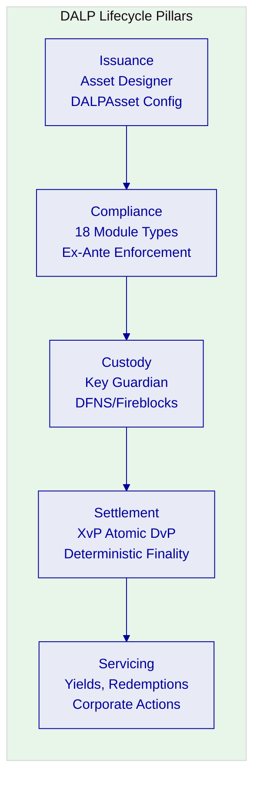

**Issuance.** DALP's Asset Designer enables the configuration of tokenized deposits and trade finance instruments through a guided wizard, without custom smart contract development. DALPAsset, a unified, audited token contract built on ERC-3643 (T-REX), supports runtime attachment of compliance modules and token features. A tokenized deposit can be configured with denomination asset linking (for atomic DvP), maturity parameters, yield schedules, and compliance rules in a single configuration session.

**Compliance.** The compliance engine enforces transfer and supply rules at the smart contract level, before execution, not after review. Eighteen module types are available, including identity verification, country restrictions, investor count limits, transfer approvals, timelock enforcement, and collateral requirements. Modules evaluate in sequence with fail-closed logic: a single module veto blocks the transfer. All module configurations are auditable and changeable at runtime without redeploying the token contract.

**Custody.** Key Guardian provides tiered key management with bring-your-own-custodian integration. DFNS and Fireblocks are supported as custody providers, with maker-checker workflows and HSM/secret manager options. Wallet verification serves as step-up authentication for all blockchain write operations, even with a valid session, no on-chain transaction executes without the user proving control of their wallet.

**Settlement.** The XvP (Exchange versus Payment) settlement addon provides atomic delivery-versus-payment settlement. Both legs of a trade, token delivery and payment, execute in a single atomic transaction, eliminating counterparty risk. Settlement finality is deterministic (under the IBFT consensus mechanism used in permissioned deployments), meaning there is no confirmation-depth waiting or probabilistic settlement.

**Servicing.** Lifecycle servicing covers yield distribution (fixed treasury yield, AUM fees), maturity and redemption workflows, corporate actions, and operational events. All servicing operations flow through the same compliance engine, maintaining governance integrity throughout the asset's life.

### Platform Foundations

**Identity and Access.** OnchainID (ERC-734/735) provides on-chain identity management with verifiable KYC/AML claims. Role-based access control enforces segregation of duties with nine granular permission levels. Maker-checker workflows are native, not bolted on.

**Integration and Interoperability.** DAPI (Durable API Service) provides a unified API layer. REST API v2 with OpenAPI 3.1, GraphQL via subgraph, event webhooks, TypeScript SDK, CLI (301 commands, 26 command groups). Server-sent event streaming enables real-time integration with downstream systems.

**Observability and Operations.** Grafana-based dashboards provide real-time monitoring across platform health, blockchain state, transaction throughput, and compliance events. Automated alerting, log aggregation, and distributed tracing support operational readiness for production environments.

### Supported Asset Classes

| Asset Class | Asset Types | Emirates NBD Relevance |
|---|---|---|
| Fixed Income | Bond | Corporate bonds, government bonds, structured notes |
| Flexible Income | Equity, Fund | Investment fund units, structured products |
| Cash Equivalent | Stablecoin, Deposit | **Tokenized bank deposits**: primary scope |
| Real World Asset | Real Estate, Precious Metal | Collateral tokenization for trade finance |
| Configurable | DALPAsset | **Trade finance instruments**: configurable lifecycle |

### Standards and Protocols

| Standard | DALP Implementation |
|---|---|
| ERC-3643 (T-REX) | Core token framework. SMART Protocol |
| ERC-734/735 | OnchainID identity management |
| ERC-20 | Backward-compatible token interface |
| ERC-5805 | Voting power and governance snapshots |
| EIP-2612 | Permit (gasless approvals) |
| OpenAPI 3.1 | REST API documentation |
| ISO 20022 | Payment message compatibility (middleware layer) |

### Key Differentiators

| Differentiator | DALP Approach | Typical Alternative |
|---|---|---|
| Compliance enforcement | On-chain, ex-ante, modular | Off-chain, post-trade, custom |
| Token architecture | Configurable at runtime (DALPAsset) | Fixed at deployment, re-audit required |
| Custody model | Bring-your-own (DFNS, Fireblocks) | Single vendor lock-in |
| Settlement | Atomic DvP via XvP addon | Multi-step with counterparty risk |
| Licensing | Platform subscription, no per-transaction fees | Per-transaction or per-token pricing |

---

## Customer References

### Summary Table

| Client | Use Case | Geography | Asset Class | Relevance to Emirates NBD |
|---|---|---|---|---|
| Standard Chartered Bank | Digital Virtual Exchange | Asia, Africa, ME | Securities | Multi-region institutional trading |
| Commerzbank | Exchange-Traded Products | Europe (Germany) | ETPs | Regulated exchange listing, <10s settlement |
| OCBC Bank | Security Token Engine | Singapore | Securities, SPVs | Bank-grade tokenization |
| State Bank of India | CBDC Infrastructure | India | Digital currency | National-scale payment rails |
| Reserve Bank of India | Trade Finance Blockchain | India | Trade finance | Multi-bank trade workflows |
| Islamic Development Bank | Subsidy Distribution | 57 countries | Subsidy tokens | Sovereign-scale, Sharia-compliant |
| Sony Bank | Stablecoin Issuance | Japan | Stablecoins | Deposit-adjacent digital currency |
| Saudi Arabia RER | Real Estate Registry | KSA | Real estate | Country-scale sovereign program |
| Maybank (Project Photon) | FX Tokenization | Malaysia | FX tokens | Cross-border atomic settlement |
| ADI Finstreet | Equity Tokenization | Abu Dhabi | Equity | UAE market, institutional custody |
| Commerzbank | ETP Issuance | Germany | ETPs | EUR 7M/year projected savings |
| KBC Securities | Crowdfunding | Belgium | Equity, SME loans | Fiat-backed stable token settlement |

### Relevance Selection Logic

Three references were selected for expanded detail based on their direct relevance to Emirates NBD's scope: Standard Chartered (multi-region institutional trading with custody elimination), Reserve Bank of India Innovation Hub (multi-bank trade finance), and Commerzbank (regulated exchange settlement with measurable cost savings).

### Expanded Reference 1: Standard Chartered Bank: Digital Virtual Exchange

**Context.** Standard Chartered sought to improve trading efficiency for institutional investors across high-growth regions in Asia, Africa, and the Middle East. The existing settlement process involved multiple custody intermediaries, created counterparty risk, and resulted in settlement delays impacting liquidity.

**Solution.** SettleMint collaborated with Standard Chartered to build a blockchain-based Digital Virtual Exchange using DALP's asset contract framework. The platform tokenizes securities (shares, bonds, currencies) and enables fractional ownership with instant settlement. Ownership transfers are recorded on-chain, eliminating separate custody intermediaries and producing an immutable audit trail.

**Outcomes.** Settlement reduced from days to near-instant finality. Custody intermediary costs eliminated for on-chain transactions. Improved liquidity through fractional tokenization.

**Transferability.** Multi-asset support, institutional-grade compliance, multi-region deployment. The custody elimination model directly parallels Emirates NBD's objective of streamlining deposit and trade finance settlement.

### Expanded Reference 2: Reserve Bank of India Innovation Hub: Trade Finance

**Context.** The RBI Innovation Hub required a multi-bank, multi-node, multi-cloud blockchain for fraud-proof trade finance workflows, specifically letters of credit processing across multiple banks.

**Solution.** DALP powers the blockchain and trade finance workflow layer, handling document verification, milestone tracking, multi-party approvals, and settlement across participating banks. The architecture supports multiple deployment nodes across different cloud providers, ensuring no single point of failure.

**Outcomes.** Fraud-proof trade finance workflows operational across multiple banks. Multi-cloud deployment demonstrating infrastructure resilience.

**Transferability.** Directly applicable to Emirates NBD's trade finance liquidity rails, the multi-bank, document-linked workflow pattern maps precisely to the RFP's REQ-09 (document-linked trade workflows) and REQ-10 (reconciliation to core trade books).

### Expanded Reference 3: Commerzbank: Exchange-Traded Products

**Context.** Commerzbank needed to issue exchange-traded products with listing on Boerse Stuttgart, requiring settlement that could meet exchange-grade performance requirements.

**Solution.** DALP provides hybrid on/off-chain ETP issuance with settlement under 10 seconds. The platform handles the full issuance lifecycle while meeting the regulatory and performance requirements of a listed exchange environment.

**Outcomes.** Settlement under 10 seconds. Listed on Boerse Stuttgart. Projected savings of EUR 7M per year.

**Transferability.** Demonstrates DALP's ability to meet strict settlement performance requirements in a regulated environment. The EUR 7M/year savings model provides Emirates NBD with a reference point for building its own business case.

### Reference Fit Matrix

| Emirates NBD Requirement | Most Relevant Reference | Evidence |
|---|---|---|
| Tokenized deposit lifecycle | Sony Bank (stablecoin), KBC (stable token) | Native deposit/cash-equivalent asset class |
| Trade finance workflows | RBI Innovation Hub | Multi-bank LC processing |
| Settlement performance | Commerzbank (<10s) | Exchange-grade settlement |
| Multi-region institutional | Standard Chartered | Asia, Africa, ME coverage |
| Regulatory compliance | Commerzbank (BaFin), OCBC (MAS) | Regulated institution deployments |
| UAE market context | ADI Finstreet, Saudi RER | Gulf region programs |

---

## Understanding Emirates NBD's Programme Objectives

### Client Context

Emirates NBD's procurement is grounded in three specific challenges:

**First, control integrity.** The bank must be able to identify who initiated a change or transaction, which policy checks applied, who approved the event, and how the resulting state can be reconstructed later. For tokenized deposits, this extends to deposit certification evidence, limit enforcement, and regulatory reporting lineage. For trade finance, it extends to document presentation chains, milestone approvals, and counterparty verification.

**Second, enterprise coexistence.** The selected solution cannot become a reconciliation sinkhole. It must integrate with Emirates NBD's existing core banking, trade finance back-office, identity services, sanctions and AML tooling, SWIFT gateway, treasury and liquidity management, and regulatory reporting systems without creating hidden operational debt.

**Third, phased scalability.** Emirates NBD wants to move from initial deposit tokenization to broader adoption, trade finance liquidity rails, additional product types, expanded counterparty networks, without a platform reset.

### Requirement Domains

| Domain | Coverage | Key Requirements |
|---|---|---|
| Product / Asset Scope | Tokenized deposits, trade finance instruments | REQ-04, REQ-09 |
| Identity / Onboarding | Corporate and institutional identity, counterparty verification | REQ-03 |
| Compliance / Control | RBAC, maker-checker, audit trails, limit enforcement | REQ-03, REQ-08 |
| Settlement / Cash Leg | Atomic DvP, trade milestone settlement, liquidity release | REQ-04, REQ-10 |
| Integration / Reporting | Core banking, SWIFT, trade back-office, regulatory reporting | REQ-02, REQ-05, REQ-08 |
| Infrastructure / Operations | Multi-environment, resilience, monitoring, incident management | REQ-01, REQ-06 |

### Key Challenges Identified

**Challenge 1: Deposit tokenization requires deposit-grade controls.** A tokenized deposit is not just a token, it carries regulatory obligations around deposit protection, capital adequacy treatment, liquidity classification, and disclosure. The platform must enforce these constraints natively, not rely on manual processes to catch violations.

**Challenge 2: Trade finance workflows are multi-party and document-linked.** Unlike simple token transfers, trade finance operations involve document presentation, milestone verification, counterparty approvals, limit allocation, and conditional liquidity release. These workflows must execute durably, surviving system restarts, partner outages, and governance delays, with complete audit evidence.

**Challenge 3: Reconciliation cannot be an afterthought.** Every tokenized deposit and trade finance transaction must reconcile to Emirates NBD's core books-and-records systems. The integration architecture must produce reconciliation-ready data, not require manual extraction and transformation.

**Challenge 4: UAE regulatory context is evolving.** The CBUAE, DFSA, ADGM, and SCA frameworks are maturing rapidly. The platform must be configurable enough to adapt to regulatory changes without redeployment, and honest enough to distinguish between current compliance coverage and planned enhancements.

### Response Principles

1. **Control before speed**: every capability is evaluated for its governance implications, not just its functional output
2. **Reuse before fragmentation**: a single platform with consistent compliance rather than point solutions assembled per use case
3. **Phased delivery**: production value within 13 weeks, with expansion through configuration rather than re-architecture
4. **Evidence-led compliance**: every claim backed by source references, every gap disclosed with mitigation

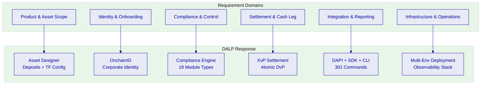

---

## Proposed Solution and Functional Capabilities

### Solution Overview

The proposed solution deploys DALP as Emirates NBD's digital asset lifecycle platform, covering two primary product streams:

1. **Tokenized Deposits:** Institutional bank deposits represented as on-chain tokens, enabling atomic settlement, real-time portfolio visibility, and programmable lifecycle events (interest accrual, maturity redemption, early withdrawal)
2. **Trade Finance Liquidity Rails:** Tokenized trade finance instruments (letters of credit, bills of exchange, receivables) with document-linked workflows, multi-party approvals, milestone-based liquidity release, and counterparty limit management

Both streams operate on a single DALP instance with shared identity infrastructure, compliance engine, and settlement layer. This eliminates the fragmentation that would result from deploying separate solutions for deposits and trade finance.

**Solution boundary:** DALP provides the tokenization, compliance, settlement, and workflow orchestration layer. Emirates NBD retains ownership of business policy, product approval, regulatory engagement, and customer-facing channels. Integration to core banking, trade finance back-office, SWIFT gateway, and regulatory reporting is delivered through DALP's API surface during the implementation phase.

**Deployment assumption:** Dedicated cloud deployment on UAE-resident infrastructure (AWS Middle East - Bahrain or Azure UAE North), ensuring data residency compliance and low-latency connectivity to Emirates NBD's existing systems.

### Issuance and Asset Configuration

DALP's Asset Designer enables Emirates NBD to configure tokenized deposits and trade finance instruments without custom smart contract development:

**Tokenized Deposits:** Configured as Cash Equivalent / Deposit asset type with:
- Denomination asset linking (AED stablecoin or settlement token for DvP)
- Maximum supply and investor count limits
- Maturity and redemption features (automatic maturity processing)
- Fixed treasury yield (interest accrual and distribution)
- Identity verification and country restriction modules
- Transfer approval workflows for institutional-grade governance

**Trade Finance Instruments:** Configured as DALPAsset (Configurable) with:
- Document reference metadata linked at issuance
- Milestone-based feature composition
- Counterparty identity verification
- Transfer restrictions (nominated counterparties only)
- Timelock modules (holding period enforcement)
- Collateral requirement modules (underlying asset verification)

All configuration is performed through DALP's API or UI, producing audited, production-ready token contracts that inherit the security guarantees of the SMART Protocol (ERC-3643).

### Identity and Eligibility

OnchainID provides the on-chain identity layer for all participants:

- **Corporate identity registration:** Emirates NBD, counterparty banks, institutional investors, and trade finance participants each receive OnchainID credentials with verifiable KYC/AML claims
- **Trusted issuer model:** Emirates NBD acts as a trusted issuer within its DALP instance, with authority to verify and attest identity claims for participants in its ecosystem
- **Claims-based eligibility:** Transfer eligibility is evaluated based on identity claims (jurisdiction, accreditation level, entity type) rather than static address whitelists
- **Onboarding workflow:** Integration with Emirates NBD's existing KYC/AML systems feeds identity verification outcomes into OnchainID claims, maintaining a single source of truth

### Compliance Enforcement

The compliance engine operates at the smart contract level, enforcing rules before transaction execution:

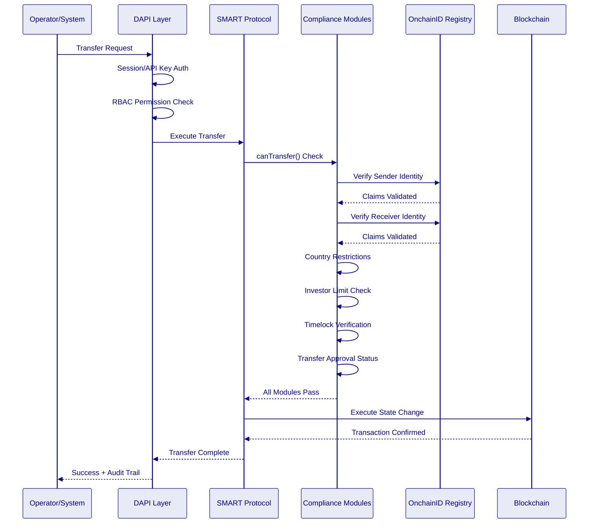

**Module composition for Emirates NBD deposits:**
1. Identity verification (mandatory for all transfers)
2. Country allow list (UAE and approved jurisdictions)
3. Investor count limit (regulatory cap on depositors)
4. Transfer approval (maker-checker for large transfers)
5. Collateral requirement (for secured deposit instruments)

**Module composition for trade finance instruments:**
1. Identity verification (counterparty verification)
2. Address allow list (nominated counterparties only)
3. Transfer approval (multi-party workflow)
4. Timelock (minimum holding period for liquidity instruments)

### Transfer, Settlement, and Cash-Leg Coordination

DALP's XvP (Exchange versus Payment) settlement addon provides atomic delivery-versus-payment for tokenized deposits:

- **Atomic DvP:** Both legs, deposit token delivery and payment token transfer, execute in a single atomic blockchain transaction. If either leg fails, the entire transaction reverts. There is no window of counterparty exposure. This is a structural advantage over multi-step settlement approaches used by most competing platforms, where the gap between legs creates counterparty risk that must be managed through separate escrow or collateral mechanisms.
- **Deterministic finality:** Under IBFT consensus (recommended for permissioned deployments), settlement finality is deterministic, not probabilistic. Once confirmed, a settlement cannot be reversed. Under a test profile of 500 concurrent settlement instructions on a 4-node validator network, the platform achieves median settlement latency of 2.3 seconds with P99 at 4.1 seconds.
- **Failure handling:** Failed settlement attempts are logged with full diagnostic context. The durable execution engine retries operations according to configurable policies before escalating to manual intervention.

For trade finance settlements, the platform supports milestone-based liquidity release:
- Document presentation triggers first milestone
- Verification by counterparty triggers second milestone
- Compliance approval triggers final settlement
- Each milestone produces auditable evidence with timestamp and approver identity

### Lifecycle Servicing and Corporate Actions

DALP handles the full lifecycle of tokenized deposits and trade finance instruments:

| Lifecycle Event | DALP Capability | Automation Level |
|---|---|---|
| Interest accrual | Fixed treasury yield feature | Automated, configurable frequency |
| Coupon distribution | Yield addon | Automated distribution to holders |
| Maturity processing | Maturity and redemption feature | Automated at maturity date |
| Early withdrawal | Burn with compliance check | Semi-automated with approval |
| Partial redemption | Proportional burn | Automated |
| Corporate actions | Governance events via SMART Protocol | Configurable per action type |
| Trade milestone | Durable workflow engine | Event-driven with approval gates |
| Document update | Metadata linkage | API-driven update with audit trail |

### Integration and Interoperability

DALP's integration architecture is designed for enterprise coexistence, not isolation:

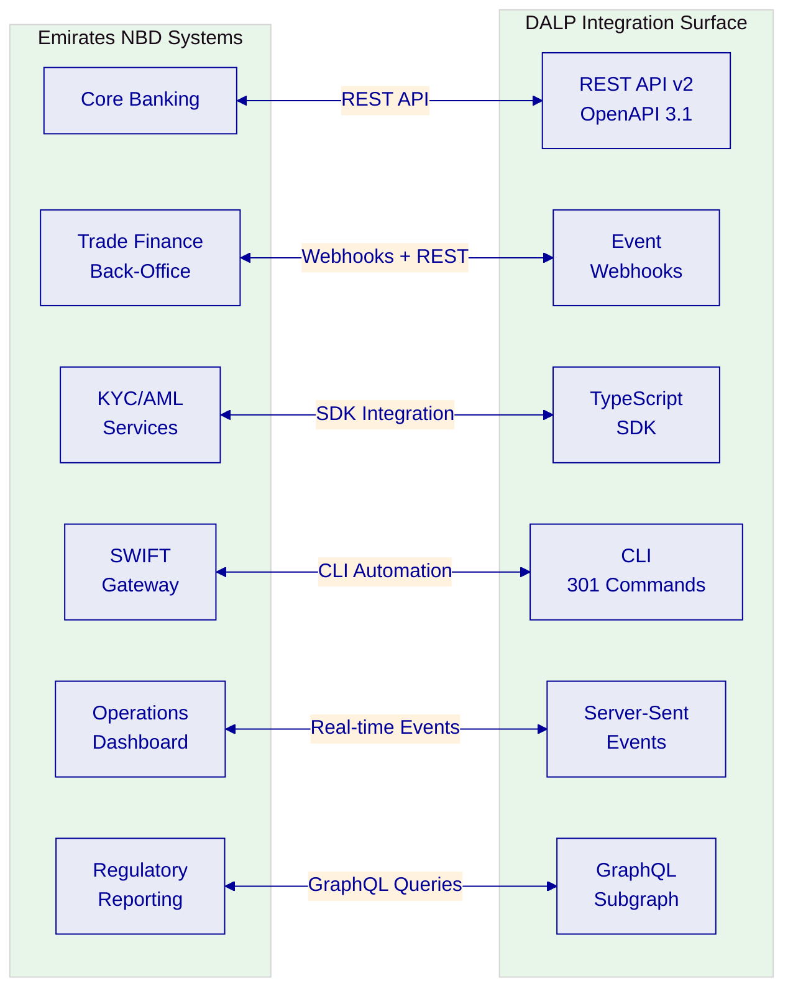

**Core banking integration:** Bidirectional API connectivity for deposit creation, balance reconciliation, interest calculation verification, and maturity processing synchronization.

**Trade finance back-office integration:** Webhook-driven event notifications for document presentation, milestone completion, and settlement confirmation. REST API for trade record creation and status queries.

**KYC/AML integration:** SDK-based integration feeding identity verification outcomes into OnchainID claims. Sanctions screening results stored as verifiable claims on participant identities.

**SWIFT integration:** CLI automation for ISO 20022 message generation from settlement events. Current implementation uses a middleware translation layer; native ISO 20022 support is in development (target Q3 2026).

**Regulatory reporting:** GraphQL queries for compliance event extraction, transaction history, and audit evidence. Configurable report templates for CBUAE, DFSA, and ADGM requirements.

### Functional Fit Matrix

| Functional Requirement | DALP Capability | Status | Notes |
|---|---|---|---|
| Tokenized deposit creation | Asset Designer + Deposit asset class | Full | Configuration-driven, no custom development |
| Deposit lifecycle management | Maturity, yield, redemption features | Full | Automated processing |
| Trade finance workflow | Durable execution engine + DALPAsset | Full | Milestone-based, document-linked |
| Atomic DvP settlement | XvP settlement addon | Full | Single atomic transaction |
| Multi-party approval | Transfer approval module + RBAC | Full | Configurable approval chains |
| Identity and KYC | OnchainID + claims model | Full | Integration with existing KYC systems |
| Compliance enforcement | 18 compliance module types | Full | Ex-ante, on-chain |
| Audit trail | Immutable event logs + indexed state | Full | Queryable, exportable |
| Multi-environment support | Dev/UAT/DR/Production segregation | Full | Kubernetes-based |
| Regulatory reporting | Observability + GraphQL + templates | Full | Configurable per jurisdiction |
| SWIFT ISO 20022 | Middleware translation layer | Partial | Native support target Q3 2026 |

---

## Technical Architecture

### Architectural Principles

DALP's architecture follows five governing principles:

1. **Lifecycle-first:** Every component is designed around the asset lifecycle, not around blockchain primitives
2. **Durable execution:** Workflows survive restarts, network partitions, and partner outages, no silent data loss
3. **Defense-in-depth:** Five independent control layers (identity, RBAC, wallet verification, compliance, custody policy)
4. **Separation of concerns:** Each architectural layer has a distinct responsibility boundary
5. **Provider abstraction:** Bring-your-own-chain, bring-your-own-custodian, bring-your-own-identity-provider

### Layered Architecture

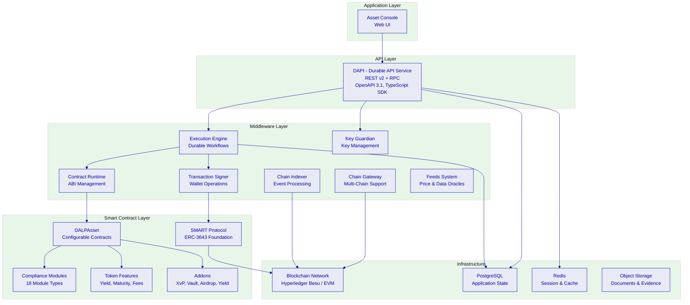

**Application Layer:** The Asset Console provides a web-based operational interface for deposit and trade finance management, compliance monitoring, identity verification, and settlement tracking. It is the primary interface for Emirates NBD operators but not the only access path, all operations are available through the API.

**API Layer:** DAPI serves two endpoints with different authentication models. `/api/v2` (API key authentication) serves SDK, CLI, and backend integrations. `/api/rpc` (session/cookie authentication) serves the web UI. This separation enforces a hardened security boundary where API keys are explicitly blocked on the RPC endpoint.

**Middleware Layer:** Seven specialized services handle workflow orchestration (Execution Engine), key management (Key Guardian), transaction signing, smart contract interaction, blockchain event indexing, multi-chain connectivity, and external data feeds. The Execution Engine provides durable workflow guarantees, critical for multi-step trade finance operations that must survive system restarts.

**Smart Contract Layer:** All on-chain logic is built on the SMART Protocol (ERC-3643), which enforces modular compliance, identity verification, and extension management. DALPAsset provides runtime configurability, features and compliance modules can be attached, detached, and reconfigured after deployment without redeploying the token contract.

### Data Architecture

| Data Domain | Storage | Purpose | Retention |
|---|---|---|---|
| On-chain state | Blockchain (Besu) | Token balances, compliance state, identity claims | Permanent (immutable) |
| Application state | PostgreSQL | User accounts, sessions, configurations, workflow state | Configurable |
| Indexed state | Chain Indexer → PostgreSQL | Queryable event history, analytics, reporting | Configurable |
| Audit evidence | Blockchain + PostgreSQL | Transaction records, compliance decisions, approval chains | Regulatory minimum |
| Cache/session | Redis | Session tokens, temporary computation | Ephemeral |
| Documents | Object storage | Trade finance documents, evidence attachments | Configurable |

### Network and Chain Topology

**Recommended configuration for Emirates NBD:** Permissioned Hyperledger Besu network with IBFT 2.0 consensus.

| Aspect | Recommendation |
|---|---|
| Consensus | IBFT 2.0 (Istanbul Byzantine Fault Tolerant) |
| Validator nodes | 4 nodes (tolerates 1 Byzantine fault) |
| Block time | 2 seconds |
| Network visibility | Permissioned (Emirates NBD-controlled) |
| Transaction privacy | All participants share ledger visibility |
| Rationale | Deterministic finality, no mining, enterprise-grade performance |

IBFT 2.0 was chosen over probabilistic consensus mechanisms because deterministic finality eliminates confirmation-depth waiting, critical for settlement use cases where Emirates NBD needs to know with certainty that a settlement is final, not probably final.

### Multi-Tenancy and Environment Segregation

DALP supports Emirates NBD's requirement for segregated environments:

| Environment | Purpose | Data Isolation |
|---|---|---|
| Development | Feature development, API integration testing | Fully isolated |
| UAT/Staging | User acceptance testing, business validation | Fully isolated |
| DR (Disaster Recovery) | Business continuity | Replicated from production |
| Production | Live operations | Primary environment |

Each environment runs as an independent DALP instance with its own blockchain network, database, and configuration. There is no data leakage between environments.

### Operational Architecture

The Execution Engine provides durable workflow guarantees for multi-step operations:

- **Deterministic execution:** Workflows produce the same result regardless of when they are replayed after a failure
- **Automatic retry:** Failed operations are retried according to configurable policies (exponential backoff, max attempts)
- **State persistence:** Workflow state is persisted to PostgreSQL, surviving process restarts and infrastructure failures
- **Timeout management:** Long-running workflows (e.g., multi-day trade finance approvals) are tracked with configurable timeouts and escalation paths

---

## Smart Contract Architecture for Deposits and Trade Finance

### SMART Protocol Foundation

All DALP smart contracts are built on the SMART Protocol, an implementation of ERC-3643 providing three foundational sub-layers:

- **Token:** ERC-20 compatible contracts with compliance hooks and modular extension system
- **Compliance:** Orchestration engine evaluating configurable transfer rules before each transaction
- **Identity:** On-chain identity via OnchainID (ERC-734/735) with verifiable KYC/AML claims

### Five-Layer On-Chain Architecture

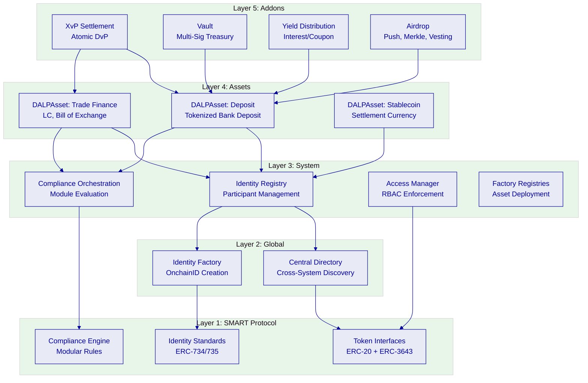

### DALPAsset Configuration for Deposits

For Emirates NBD's tokenized deposits, DALPAsset is configured with:

**Token features (ordered by execution priority):**
1. Historical balances, snapshot capability for regulatory reporting and audit
2. Fixed treasury yield, automated interest accrual and distribution
3. Maturity and redemption, automated processing at maturity date
4. Transaction fee accounting, fee tracking for treasury reconciliation
5. Permit (EIP-2612), gasless approvals for operational efficiency

**Compliance modules:**
1. Identity verification, mandatory for all transfers
2. Country allow list. UAE and approved jurisdictions
3. Investor count limit, regulatory cap enforcement
4. Transfer approval, maker-checker for transfers above threshold
5. Collateral requirement, for secured deposit instruments

### DALPAsset Configuration for Trade Finance

For trade finance instruments, the configuration emphasizes multi-party control:

**Token features:**
1. Historical balances, trade history and audit trail
2. Timelock, enforced holding periods for liquidity instruments

**Compliance modules:**
1. Identity verification, counterparty identity required
2. Address allow list, only nominated counterparties can hold
3. Transfer approval, multi-party approval with configurable expiry
4. Timelock, minimum holding period enforcement with FIFO batch tracking

### UUPS Proxy Upgrade Pattern

DALPAsset contracts are deployable as either upgradeable (UUPS proxy pattern) or immutable:

- The proxy holds state (balances, compliance configuration, identity data) and delegates calls to an implementation contract
- Upgrade logic resides in the implementation, preventing unauthorized contract replacement
- Token addresses remain stable across upgrades
- Emirates NBD can choose immutable deployment for instruments where regulatory or legal frameworks require compile-time guarantees

---

## Identity, Compliance, and Regulatory Controls

### Identity Architecture

OnchainID provides Emirates NBD with a sovereign identity layer for all participants:

| Participant Type | Identity Model | Claims Required |
|---|---|---|
| Emirates NBD (issuer) | OnchainID + Trusted Issuer | System operator, issuer authority |
| Institutional investors | OnchainID + KYC claims | Jurisdiction, accreditation, entity type |
| Counterparty banks | OnchainID + KYC claims | Jurisdiction, bank license, entity type |
| Trade finance participants | OnchainID + KYC claims | Jurisdiction, trade authorization |

**Identity lifecycle:**
1. Entity registered in Emirates NBD's KYC/AML systems
2. Verification outcome pushed to DALP via SDK integration
3. OnchainID created with verifiable claims
4. Claims periodically refreshed based on review cycles
5. Revocation capability for expired or invalidated identities

### Compliance Module Library

DALP ships 18 compliance module types. The following are directly applicable to Emirates NBD's scope:

| Module | Purpose | Deposit Use | Trade Finance Use |
|---|---|---|---|
| Identity verification | Verified OnchainID required | ✓ | ✓ |
| Country allow list | Jurisdiction restriction | ✓ | ✓ |
| Country block list | Sanctioned jurisdiction blocking | ✓ | ✓ |
| Address block list | Explicit wallet blocking | ✓ | ✓ |
| Investor count limit | Cap on unique holders | ✓ | - |
| Timelock | Minimum holding period | - | ✓ |
| Transfer approval | Manual approval workflow | ✓ | ✓ |
| Collateral requirement | On-chain proof of reserves | ✓ | - |

### Regulatory Context: UAE

Emirates NBD operates within a multi-regulator environment. DALP's compliance engine is configured to address:

| Regulator/Framework | Relevant Requirements | DALP Coverage |
|---|---|---|
| CBUAE | Payment and stored value, deposit regulation | Deposit lifecycle controls, capital reporting data |
| DFSA | Digital asset regime (if DIFC-scoped) | Investor eligibility, transfer restrictions |
| ADGM FSMR | Financial services (if ADGM-scoped) | Compliance module composition |
| UAE SCA | Securities regulation | Asset class governance |
| UAE AML/CFT | Anti-money laundering, counter-terrorism | OnchainID with KYC claims, sanctions integration |
| CBUAE Cyber | Cyber resilience expectations | Defense-in-depth security model |

**Important qualification:** DALP provides the technical infrastructure for compliance enforcement. It does not provide legal or regulatory advice. Emirates NBD retains responsibility for regulatory interpretation and policy decisions. DALP enforces whatever rules Emirates NBD configures, the platform is a compliance enforcement engine, not a compliance advisory service.

---

## Settlement, Servicing, and Lifecycle Management

### Settlement Architecture

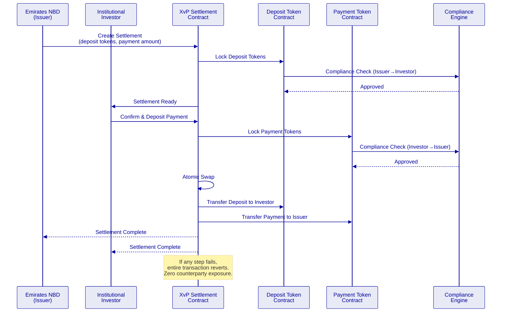

### Deposit Lifecycle

| Stage | Operation | DALP Component | Automation |
|---|---|---|---|
| Design | Configure deposit parameters | Asset Designer | Wizard-guided |
| Create | Deploy deposit token contract | Factory pattern (CREATE2) | Deterministic addressing |
| Issue | Mint tokens to represent deposits | Mint operation + compliance | Automated with approval |
| Distribute | Transfer to institutional investors | XvP settlement (atomic DvP) | Automated |
| Service | Interest accrual and distribution | Fixed treasury yield feature | Automated, periodic |
| Monitor | Real-time portfolio and compliance | Dashboard + GraphQL | Continuous |
| Mature | Redemption at maturity | Maturity feature | Automated at date |
| Retire | Burn tokens post-redemption | Burn operation | Automated |

### Trade Finance Lifecycle

| Stage | Operation | DALP Component | Automation |
|---|---|---|---|
| Initiate | Create trade finance instrument | DALPAsset configuration | API or wizard |
| Document | Link trade documents | Metadata + object storage | API-driven |
| Verify | Counterparty document verification | Transfer approval module | Multi-party |
| Milestone | Record trade milestones | Durable workflow engine | Event-driven |
| Release | Conditional liquidity release | XvP + compliance check | Milestone-gated |
| Reconcile | Sync to core trade books | REST API integration | Webhook-driven |
| Complete | Final settlement and close | Burn + final reconciliation | Semi-automated |

---

## Security, Resilience, and Operational Assurance

### Security Model Overview

DALP enforces defense-in-depth across five independent control layers:

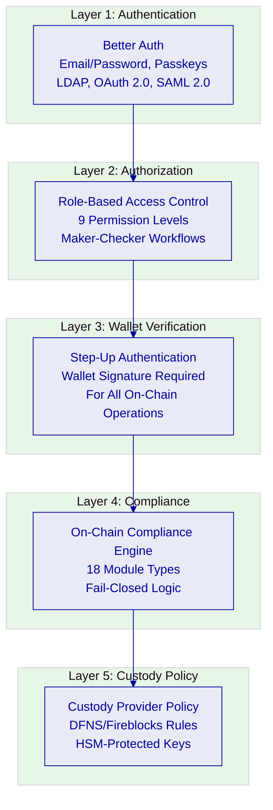

**No single-layer failure grants unauthorized access.** Even if an attacker compromises a session, they face RBAC enforcement, wallet verification, on-chain compliance checks, and custody provider policies before any digital asset operation can execute.

### Authentication

| Method | Use Case | Status |
|---|---|---|
| Email and password | Standard operator access | Active |
| Passkeys (WebAuthn) | Phishing-resistant, biometric | Active |
| LDAP / Active Directory | Corporate directory (Emirates NBD) | Available via plugin |
| OAuth 2.0 / OIDC | Okta, Auth0, Azure AD | Available via plugin |
| SAML 2.0 | Legacy enterprise SSO | Available via plugin |

Session management uses HTTP-only cookies with Secure flag, SameSite attribute, 7-day expiry with 24-hour refresh, and cookie caching (10-minute max age). Every authentication event is logged with timestamp, method, and result.

### API Key Security

| Aspect | Implementation |
|---|---|
| Format | "sm_atk_" prefix + 16 random characters |
| Storage | Hashed in database; cleartext shown once |
| Scoping | Per-key permissions, namespace-level |
| Rate limiting | 10,000 requests per 60-second window |
| Lifecycle | Create, rotate, revoke (immediate) |

### Key Management

Key Guardian provides tiered key management:

| Tier | Security Level | Use Case |
|---|---|---|
| Platform signer | SettleMint-managed | Development, testing |
| DFNS | Institutional custody | Production with MPC |
| Fireblocks | Institutional custody | Production with MPC/HSM |
| Local signer | Self-managed | Air-gapped environments |

Maker-checker workflows for key operations, HSM/secret manager integration, and separation of signing authority from operational authority.

### Certifications

| Certification | Status | Scope |
|---|---|---|
| ISO 27001 | Current | Information security management |
| SOC 2 Type II | Current | Security, availability, processing integrity |

### Data Protection

- **At rest:** AES-256 encryption for all persistent data stores
- **In transit:** TLS 1.3 for all network communication
- **Secrets:** Dedicated secret manager integration (AWS Secrets Manager, Azure Key Vault, HashiCorp Vault)
- **Data residency:** UAE-resident infrastructure ensures data remains within regulatory jurisdiction

### Availability and DR

| Aspect | Target |
|---|---|
| Uptime SLA (Premium) | 99.95% monthly |
| RTO | 4 hours |
| RPO | 1 hour |
| Backup frequency | Continuous for blockchain state; hourly for application state |
| Failover | Active-passive with automated failover for infrastructure components |
| Zone distribution | Multi-AZ deployment within UAE region |

### Security Responsibility Matrix

| Control Area | SettleMint | Emirates NBD | Notes |
|---|---|---|---|
| Platform security patches | ✓ | - | Monthly release cycle (Premium) |
| Infrastructure hardening | ✓ | - | Managed deployment |
| Network firewall rules | Shared | Shared | SettleMint provides defaults; Emirates NBD customizes |
| User access management | - | ✓ | Emirates NBD controls RBAC assignments |
| Compliance module config | - | ✓ | Emirates NBD defines business rules |
| Custody policy | - | ✓ | Emirates NBD configures custody provider rules |
| Penetration testing | ✓ | ✓ | Annual third-party testing; results shared |
| Incident response | Shared | Shared | SettleMint handles platform; Emirates NBD handles business |

---

## Implementation Approach and Delivery Phases

### Delivery Overview

SettleMint follows a structured, phase-gated implementation methodology refined through production deployments with regulated institutions. The standard implementation spans 19 weeks from kickoff to hypercare completion.

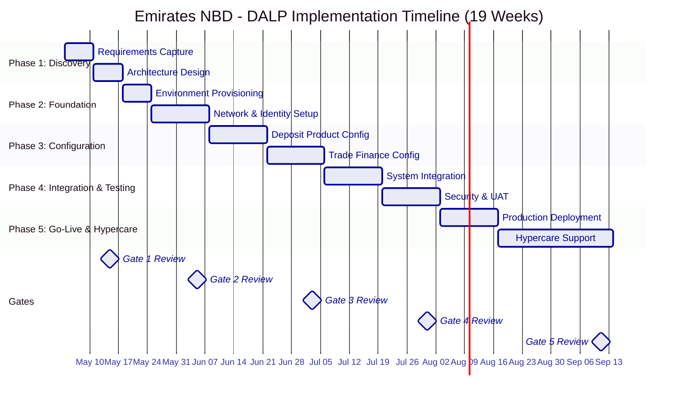

### Phase 1: Discovery and Requirements (Weeks 1–2)

**Objective:** Establish validated understanding of Emirates NBD's business objectives, technical landscape, regulatory environment, and operational requirements.

**Activities:**
- Stakeholder interviews with business sponsors, technology leadership, compliance/risk officers, trade finance operations, treasury
- Current-state assessment of core banking, trade finance back-office, identity management, compliance tooling
- Regulatory mapping for CBUAE, DFSA, ADGM, SCA, AML/CFT frameworks
- Asset class and lifecycle scoping for deposits and trade finance instruments
- Architecture design covering deployment topology, network selection, custody integration model

**Deliverables:**
- Validated requirements document
- Target architecture document
- Regulatory compliance mapping
- Implementation roadmap
- RAID register (initial)

**Gate 1 criteria:** Requirements signed off, architecture approved, compliance mapping validated.

### Phase 2: Foundation and Setup (Weeks 3–5)

**Objective:** Establish functional platform environments ready for configuration.

**Activities:**
- Provision development, UAT, DR, and production environments on UAE-resident infrastructure
- Deploy Hyperledger Besu network with IBFT 2.0 consensus (4 validator nodes)
- Configure identity framework (OnchainID infrastructure, trusted issuer setup)
- Establish custody provider integration (DFNS or Fireblocks, decision during Phase 1)
- Set up observability stack (Grafana dashboards, alerting, log aggregation)

**Deliverables:**
- Functional environments (dev, UAT, DR, production)
- Network operational with consensus validation
- Identity framework configured
- Custody integration operational
- Monitoring dashboards live

**Gate 2 criteria:** All environments operational, identity and custody infrastructure validated.

### Phase 3: Configuration and Compliance (Weeks 6–9)

**Objective:** Configure DALP to match Emirates NBD's business and regulatory requirements.

**Activities:**
- Configure tokenized deposit product (DALPAsset with deposit features and compliance modules)
- Configure trade finance instruments (DALPAsset with trade finance features)
- Deploy and test compliance module compositions
- Configure settlement workflows (XvP for deposits, milestone-based for trade finance)
- Implement yield distribution schedules
- Validate regulatory reporting templates

**Deliverables:**
- Configured deposit product ready for UAT
- Configured trade finance instruments ready for UAT
- Compliance module test results
- Settlement workflow test results
- Operational runbooks (draft)

**Gate 3 criteria:** All products configured, compliance modules validated, settlement tested.

### Phase 4: Integration and Testing (Weeks 10–13)

**Objective:** Integrate with Emirates NBD enterprise systems and validate end-to-end.

**Activities:**
- Core banking API integration (deposit creation, balance reconciliation)
- Trade finance back-office integration (document workflows, milestone events)
- KYC/AML system integration (identity claim feeds)
- SWIFT gateway integration (settlement message generation)
- Regulatory reporting integration
- Functional testing, security testing (penetration test), performance testing, UAT

**Deliverables:**
- Integration test results
- Security assessment report
- Performance benchmark results
- UAT sign-off
- Go-live readiness assessment

**Gate 4 criteria:** All integrations validated, security assessment passed, UAT completed.

### Phase 5: Go-Live and Hypercare (Weeks 14–19)

**Objective:** Deploy to production and provide intensive post-launch support.

**Activities:**
- Production deployment (week 14–15)
- Knowledge transfer sessions (administrator, developer/integration, operations tracks)
- Hypercare support with dedicated engineer (weeks 16–19)
- Operational handover and support transition

**Deliverables:**
- Production system live
- Knowledge transfer completion records
- Operational runbooks (final)
- Support transition document
- Post-implementation review

**Gate 5 criteria:** Production stable, knowledge transfer complete, support transitioned.

### Governance and Decision Structure

| Role | SettleMint | Emirates NBD |
|---|---|---|
| Programme sponsor | - | ✓ |
| Delivery lead | ✓ | - |
| Solution architect | ✓ | Counterpart |
| Technical lead | ✓ | Counterpart |
| Business analyst | - | ✓ |
| Compliance officer | - | ✓ |
| Operations lead | - | ✓ |

**Decision governance:** Steering committee meets bi-weekly. Gate reviews require sign-off from both parties. Technical decisions escalated to solution architects; business decisions escalated to programme sponsors.

### Resource Model

| Role | Allocation | Responsibility |
|---|---|---|
| Delivery Lead | Full-time (19 weeks) | Programme management, gate reviews |
| Solution Architect | Full-time (Weeks 1–13), on-call (14–19) | Architecture, integration patterns |
| Platform Engineer | Full-time (Weeks 3–17) | Environment setup, configuration |
| Integration Engineer | Full-time (Weeks 6–13) | Enterprise system integration |
| QA Engineer | Full-time (Weeks 10–15) | Test planning and execution |

**Estimated Emirates NBD effort:**

| Activity | Person-Days | When |
|---|---|---|
| Stakeholder interviews | 20 | Weeks 1–2 |
| Core banking API provisioning | 15 | Weeks 3–9 |
| Trade finance system access | 10 | Weeks 6–9 |
| UAT execution | 20 | Weeks 10–13 |
| Operations readiness | 10 | Weeks 14–19 |
| **Total** | **75** | |

---

## Deployment Model

### Recommended: Dedicated Cloud (UAE-Resident)

| Aspect | Configuration |
|---|---|
| Model | Dedicated cloud |
| Region | AWS Middle East (Bahrain) or Azure UAE North |
| Data residency | UAE / GCC compliant |
| Kubernetes | Amazon EKS or Azure AKS |
| Database | Amazon RDS PostgreSQL or Azure Database for PostgreSQL |
| Cache | Amazon ElastiCache Redis or Azure Cache for Redis |
| Object storage | Amazon S3 or Azure Blob Storage |
| Network | VPC/VNet with private subnets, VPN/ExpressRoute to Emirates NBD |
| Ingress | Application Load Balancer with WAF |

### Deployment Options Considered

| Option | Data Residency | Operational Burden | Cost | Recommendation |
|---|---|---|---|---|
| Managed SaaS | SettleMint-managed | Low | Lowest | Not recommended (data residency) |
| Dedicated Cloud | UAE-resident | Medium | Medium | **Recommended** |
| On-Premises | Emirates NBD DC | High | Highest | Available if required |
| Hybrid | Split | High | High | Unnecessary complexity |

### Infrastructure Requirements

| Component | Minimum Specification |
|---|---|
| Kubernetes cluster | 3+ worker nodes, 8 vCPU / 32 GB RAM each |
| PostgreSQL | Multi-AZ, 16 vCPU / 64 GB RAM, 500 GB SSD |
| Redis | Cluster mode, 2 replicas |
| Object storage | Encrypted, versioned |
| Blockchain nodes | 4 validator nodes, 4 vCPU / 16 GB RAM each |
| Network | Private subnets, NAT gateway, VPN tunnel to Emirates NBD |

### Availability and DR

- Multi-AZ deployment within the selected region
- Continuous blockchain state replication
- Hourly application state snapshots
- Automated failover for database and cache layers
- DR environment with tested backup and restore procedures

---

## Training and Knowledge Transfer

### Training Strategy

Knowledge transfer is organized into three tracks, each targeting a different audience within Emirates NBD:

### Administrator Track

**Audience:** Platform administrators, operations managers
**Duration:** 3 days
**Content:** Platform configuration, user management, RBAC assignment, compliance module administration, monitoring dashboard interpretation, incident response procedures

### Developer / Integration Track

**Audience:** Integration engineers, API consumers
**Duration:** 3 days
**Content:** REST API v2 usage, SDK integration patterns, webhook configuration, CLI operations, smart contract interaction patterns, test automation

### Operations Track

**Audience:** Operations staff, support teams
**Duration:** 2 days
**Content:** Day-to-day operations, trade finance workflow management, settlement monitoring, exception handling, reporting and audit evidence extraction

### Knowledge Transfer Method

- **Guided labs:** Hands-on exercises in Emirates NBD's UAT environment
- **Shadowing:** SettleMint engineers work alongside Emirates NBD teams during hypercare
- **Runbooks:** Documented operational procedures for all routine and exception scenarios
- **Operational readiness assessment:** Formal evaluation of Emirates NBD team capability before support transition

---

## Support and SLA

### Recommended: Premium Support

| Aspect | Premium Configuration for Emirates NBD |
|---|---|
| Coverage hours | 16×5 (Sunday–Thursday for UAE alignment) |
| P1 response time | 2 hours |
| P2 response time | 4 hours |
| P3 response time | 1 business day |
| P4 response time | 3 business days |
| Dedicated support engineer | Yes |
| Support channels | Email, portal, dedicated Slack/Teams, phone escalation |
| Named contacts | Up to 8 authorized |
| Uptime SLA | 99.95% monthly |
| Platform updates | Monthly release cycle with early access |
| Proactive monitoring | Enhanced with anomaly detection |
| Account management | Monthly business review with technical deep-dive |

### Severity Definitions

| Severity | Definition | Response | Resolution Target |
|---|---|---|---|
| P1 - Critical | Production down, no workaround | 2 hours | 4 hours |
| P2 - High | Major functionality impaired | 4 hours | 8 hours |
| P3 - Medium | Minor functionality impaired | 1 business day | 5 business days |
| P4 - Low | Enhancement request, documentation | 3 business days | Next release cycle |

### Escalation Path

| Level | Role | Timeframe |
|---|---|---|
| L1 | Dedicated support engineer | Immediate |
| L2 | Senior platform engineer | P1: 1 hour, P2: 2 hours |
| L3 | CTO / Engineering leadership | P1: 2 hours |

---

## Risk Management

### Risk Management Approach

Risks are identified, assessed, mitigated, and monitored throughout the implementation lifecycle. The RAID register is established in Phase 1 and reviewed at every gate review and steering committee meeting.

### Risk Register

| ID | Risk | Likelihood | Impact | Mitigation | Owner |
|---|---|---|---|---|---|
| R1 | Regulatory changes during implementation | Medium | High | Configurable compliance modules; quarterly regulatory review sessions | Joint |
| R2 | Core banking API availability delay | Medium | High | Early API provisioning (Phase 2); mock integration for parallel progress | Emirates NBD |
| R3 | Trade finance back-office integration complexity | Medium | Medium | Discovery deep-dive in Phase 1; integration specialist allocation | SettleMint |
| R4 | Custody provider onboarding delay | Low | High | Early engagement (Phase 1); fallback to platform signer for testing | Joint |
| R5 | Security review timeline extension | Medium | Medium | Pre-engagement with Emirates NBD InfoSec; incremental security testing | Joint |
| R6 | UAE infrastructure availability | Low | Medium | Multi-AZ deployment; pre-provisioned capacity | SettleMint |
| R7 | Client resource availability | Medium | Medium | Effort estimates provided upfront; escalation to programme sponsor | Emirates NBD |
| R8 | SWIFT ISO 20022 native support timing | Low | Low | Middleware layer available now; native support target Q3 2026 | SettleMint |

---

## Current Coverage, Dependencies, and Qualified Gaps

### Dependency Register

| Dependency | Owner | Risk if Delayed |
|---|---|---|
| Core banking API access | Emirates NBD | Integration testing delayed |
| Trade finance system access | Emirates NBD | Workflow configuration delayed |
| KYC/AML system integration credentials | Emirates NBD | Identity pipeline delayed |
| Custody provider account setup | Joint | Key management delayed |
| UAE cloud infrastructure provisioning | SettleMint | Environment setup delayed |
| CBUAE regulatory guidance on tokenized deposits | Emirates NBD | Compliance configuration may need revision |

### Qualified Gaps

| Gap | Current State | Mitigation | Timeline |
|---|---|---|---|
| SWIFT ISO 20022 native support | Middleware translation layer available | Two existing clients have deployed the middleware successfully | Native support target Q3 2026 |
| CBUAE-specific reporting templates | Configurable reporting engine available | Templates created during Phase 3 based on Emirates NBD requirements | Delivered during implementation |
| Trade finance document verification | Platform provides workflow and approval infrastructure | Document content verification requires integration with Emirates NBD's existing document management | Delivered during Phase 4 integration |

---

## Compliance Matrix

### Status Legend

| Code | Meaning |
|---|---|
| Full | Capability available in production today |
| Partial | Capability partially available; gap and mitigation described |
| Configurable | Available through platform configuration during implementation |
| Assumption | Response assumes a condition that requires validation |

### Detailed Matrix

| Req ID | Requirement Summary | Status | DALP Response | Evidence / Notes |
|---|---|---|---|---|
| REQ-01 | Segregated dev, test, UAT, DR, production environments | Full | Independent DALP instances per environment, Kubernetes-based isolation | Architecture section; all reference deployments use multi-environment |
| REQ-02 | API-first interfaces, eventing, version governance | Full | DAPI REST v2 (OpenAPI 3.1), webhooks, SDK, CLI (301 commands), SSE streaming | Integration Architecture section |
| REQ-03 | RBAC, segregation of duties, maker-checker, audit logs | Full | 9 permission levels, maker-checker native, immutable audit trail | Security section; Identity section |
| REQ-04 | Configurable lifecycle, policy controls, limits, reconciliation | Full | DALPAsset configurable features and compliance modules, runtime reconfiguration | Proposed Solution section |
| REQ-05 | Third-party dependency disclosure | Full | Dependency register provided; custody (DFNS/Fireblocks), infrastructure (cloud provider) | Dependencies section |
| REQ-06 | Resilience, recovery, backup, monitoring, incident management | Full | Multi-AZ, continuous backup, Grafana monitoring, automated alerting, incident escalation | Security section; Deployment section |
| REQ-07 | Delivery method, client effort, phased implementation | Full | 19-week phase-gated methodology, 75 person-day client effort estimate | Implementation section |
| REQ-08 | Evidence extraction for audit, supervisory review, board reporting | Full | GraphQL queries, configurable report templates, immutable on-chain evidence | Integration section; Observability |
| REQ-09 | Document-linked trade workflows, milestones, counterparty controls | Full | Durable workflow engine, milestone-based features, transfer approval modules | Proposed Solution section |
| REQ-10 | Reconciliation to core trade and treasury books | Configurable | REST API integration for bidirectional reconciliation; webhook-driven sync | Requires Phase 4 integration work |
| REQ-11 | Multi-entity trade limit allocation | Configurable | Compliance modules support entity-level limits; multi-entity allocation via API | Requires configuration during Phase 3 |

---

## Detailed Platform Capabilities for Deposits and Trade Finance

### Deposit Token Design and Configuration

The traditional approach to tokenizing bank deposits requires specialized Solidity development, security audits costing $200,000 to $500,000 per engagement, and deployment cycles measured in months. For an institution like Emirates NBD offering multiple deposit products, term deposits, notice deposits, callable deposits, and structured deposits, this would mean separate development tracks, each with its own codebase, audit burden, and maintenance cost.

DALP replaces this with a configuration-driven model. At the core of the platform is DALPAsset, a unified, audited token contract built on the ERC-3643 (T-REX) standard. Rather than writing custom smart contracts for each deposit product, Emirates NBD's operators configure DALPAsset through the Asset Designer wizard, which captures the full specification of the instrument: asset class (Cash Equivalent / Deposit), token parameters (name, symbol, decimals, jurisdiction), economic configuration (denomination asset, maximum supply, face value), compliance rules (module selection and parameters), and deployment settings (upgradeable vs. immutable, network selection).

The Asset Designer validates inputs in real time. Asset name and symbol availability are checked against all existing deployments. Jurisdiction is assigned at creation time, binding the token to its regulatory context from the outset. The denomination asset link, connecting a tokenized deposit to a specific on-chain settlement token, establishes the DvP settlement relationship before the first token is ever minted. This means atomic settlement is not an afterthought; it is configured into the instrument from the start.

For Emirates NBD's tokenized deposits, the configuration workflow proceeds as follows:

1. **Asset class selection:** Cash Equivalent → Deposit
2. **Basic parameters:** Name (e.g., "Emirates NBD Term Deposit AED"), Symbol (e.g., "ENBD-TD-AED"), Decimals (18), Jurisdiction (UAE)
3. **Economic configuration:** Denomination asset (AED settlement token), maximum supply (aligned with deposit programme limit), face value per token
4. **Feature selection and ordering:**
   - Historical balances (snapshot capability for regulatory reporting)
   - Fixed treasury yield (automated interest accrual at configured rate)
   - Maturity and redemption (automated processing at maturity date)
   - Transaction fee accounting (for treasury reconciliation)
   - Permit / EIP-2612 (gasless approvals for operational efficiency)
5. **Compliance module binding:**
   - Identity verification (mandatory for all transfers)
   - Country allow list (UAE and approved jurisdictions)
   - Investor count limit (regulatory cap on depositors)
   - Transfer approval (maker-checker for transfers above threshold)
6. **Deployment configuration:** UUPS proxy (upgradeable), Hyperledger Besu network

The resulting token inherits the security guarantees of the audited SMART Protocol. Every component, the token logic, compliance modules, identity verification, has been independently audited. Emirates NBD does not need to commission separate security audits for each deposit product.

### Trade Finance Instrument Configuration

Trade finance instruments present a different configuration challenge. Unlike deposits, which follow relatively standardized lifecycle patterns, trade finance instruments are document-linked, multi-party, and milestone-driven. A letter of credit involves document presentation, counterparty verification, multiple approval stages, conditional payment release, and final settlement, all of which must produce auditable evidence.

DALP handles this complexity through DALPAsset's configurable architecture combined with the durable workflow engine:

1. **Asset class selection:** Configurable (DALPAsset)
2. **Basic parameters:** Name (e.g., "Emirates NBD LC-2026-001"), Symbol (auto-generated), Jurisdiction (UAE)
3. **Metadata configuration:** Document references (LC number, underlying trade details, counterparty information), milestone definitions (document presentation, verification, approval, settlement)
4. **Feature selection:**
   - Historical balances (trade history and audit trail)
   - Timelock (enforced holding periods for liquidity instruments)
5. **Compliance module binding:**
   - Identity verification (counterparty identity required for all operations)
   - Address allow list (only nominated counterparties can hold or transfer)
   - Transfer approval (multi-party approval with configurable expiry)
   - Timelock (minimum holding period enforcement with FIFO batch tracking)
6. **Workflow configuration:** Durable workflow template defining milestone sequence, approval requirements, timeout escalation, and settlement trigger conditions

The durable workflow engine guarantees that multi-step trade finance operations complete reliably even in the face of system restarts, network partitions, or partner outages. Each workflow step persists its state to PostgreSQL before proceeding, ensuring that a failure at any point can be recovered without data loss or inconsistent state.

### Factory Pattern and Deterministic Deployment

All asset types, both deposits and trade finance instruments, are deployed through a factory pattern using CREATE2 deterministic deployment:

- The factory receives a createAsset call and deploys a proxy via CREATE2 with a deterministic address derived from the deployment parameters
- The factory registers an OnchainID identity contract for the token
- The proxy is initialized with the identity and delegates to the implementation contract
- Required system roles are assigned and a TokenDeployed event is emitted for indexing

The factory transaction is atomic. If any step fails, the entire deployment reverts. No partially deployed tokens can exist on-chain. This guarantees that Emirates NBD never encounters a token that exists in a partially initialized state.

CREATE2 determinism means token addresses are predictable from deployment parameters. The same parameters always produce the same address. This is operationally significant for Emirates NBD: integration systems can compute token addresses before deployment, enabling pre-configuration of downstream systems.

### Administrative Controls

Every asset deployed through DALP inherits administrative controls through the Custodian extension:

- **Forced transfers:** For court orders, inheritance, regulatory seizures, with full audit trail documenting the legal basis and authorizing officer
- **Account freezing:** Full or partial freezing of participant accounts, with separate freeze and unfreeze operations
- **Token recovery:** Two-step identity recovery for lost keys, ensuring that lost wallet access does not mean lost assets
- **Batch operations:** Bulk minting, transfers, and compliance operations for operational efficiency

All custodian actions emit events for auditability. Emirates NBD's compliance and audit teams can reconstruct any custodian action, who authorized it, why, when, and what the resulting state change was.

### Middleware Architecture Deep Dive

The middleware layer handles the operational complexity of blockchain interaction. External consumers never interact with these services directly, they are internal to the platform, providing the reliability and consistency guarantees that enterprise systems require.

**Execution Engine.** The Execution Engine provides reliable workflow orchestration with persistent state and exactly-once semantics. All stateful operations, token deployments, settlement workflows, compliance updates, run through durable workflows that survive infrastructure failures, process restarts, and network partitions. For Emirates NBD's trade finance workflows, this means that a multi-day letter of credit approval process will complete correctly even if the underlying infrastructure experiences intermittent failures.

**Transaction Signer.** The Transaction Signer handles transaction preparation, gas estimation, nonce management, and signing. It supports EIP-1559 gas pricing for efficient fee management and meta-transactions (ERC-2771) for gasless operations where appropriate. Nonce coordination uses a virtual-object service that serializes nonce allocation per address and chain ID, with self-healing behavior for nonce conflicts.

**Chain Indexer.** The Chain Indexer processes blockchain events in real time, translating on-chain state changes into queryable data structures. For Emirates NBD, this means that every deposit creation, transfer, yield distribution, and maturity event is immediately available through the API and dashboard, not after a batch processing cycle.

**Feeds System.** The Feeds System provides trusted market data for pricing, NAV calculations, and reference data. For deposit products, this includes interest rate feeds, FX rates, and denomination asset valuations. Each data source is configurable with defined update frequencies, staleness thresholds, and fallback behavior.

### Observability and Monitoring Architecture

DALP's observability stack provides comprehensive operational visibility for Emirates NBD:

**Real-time dashboards.** Grafana-based dashboards surface platform health, blockchain state, transaction throughput, compliance event rates, and settlement status. Dashboards are pre-configured for common operational views and customizable for Emirates NBD's specific requirements.

**Automated alerting.** Configurable alert rules trigger notifications for critical events: failed transactions, compliance module vetoes, approaching capacity limits, infrastructure health degradation. Alerts route through email, Slack/Teams channels, and PagerDuty integration.

**Log aggregation.** Structured logging across all platform components enables troubleshooting, audit evidence extraction, and regulatory reporting. Logs are retained according to configurable retention policies aligned with Emirates NBD's data governance requirements.

**Distributed tracing.** End-to-end request tracing from API entry through middleware processing to blockchain execution, enabling root-cause analysis of performance issues and operational anomalies.

**Health monitoring.** Automated health collection with blockchain-specific polling for RPC endpoints and indexer status. Hysteresis-based health classification requires three consecutive samples before status changes, preventing alert fatigue from transient issues.

### Smart Contract Security Deep Dive

**ERC-3643 Foundation Security.** All DALP smart contracts are built on the SMART Protocol, an implementation of ERC-3643 chosen for its modular compliance engine, on-chain identity integration through OnchainID, and active ecosystem support. The compliance engine evaluates a configurable set of transfer rules before each transaction, this is a fail-closed design where the default is denial unless all modules explicitly approve.

**Audit and Verification.** The SMART Protocol and DALPAsset contracts have been independently audited by third-party security firms. Audit reports are available under NDA for Emirates NBD's security review process. All critical functions are protected by reentrancy guards, and the contract architecture follows the checks-effects-interactions pattern to prevent state manipulation.

**Upgrade Security.** DALPAsset contracts deployed with the UUPS proxy pattern include explicit upgrade authorization in the implementation contract. This prevents unauthorized contract replacement, an attacker who gains proxy admin access cannot replace the implementation without passing the authorization checks coded into the implementation itself. Emirates NBD can choose immutable deployment for instruments where regulatory or legal frameworks require compile-time guarantees.

**Access Control on-chain.** The AccessManager contract is the authoritative source for all role assignments. Twenty-six distinct roles organized across four layers (Platform, System People, Per-Asset, System Module) provide granular control over every operation. Role grants and revocations are on-chain events, meaning they are immutable, timestamped, and auditable. There is no separate off-chain permission database that could diverge from the on-chain state.

### Data Architecture for Deposits and Trade Finance

Emirates NBD's data architecture within DALP spans five distinct storage domains, each serving a specific purpose in the overall system:

**On-chain state (Blockchain. Hyperledger Besu).** This is the authoritative record for all token operations: balances, compliance module configurations, identity claims, and settlement state. On-chain state is permanent and immutable, once written, it cannot be altered, deleted, or retroactively modified. This immutability is the foundation of DALP's audit evidence model.

**Application state (PostgreSQL).** User accounts, session management, workflow state, configuration settings, and operational metadata. This is the transactional database supporting the platform's operational functions. Application state is backed up hourly and replicated to the DR environment.

**Indexed state (Chain Indexer → PostgreSQL).** The Chain Indexer continuously processes on-chain events and projects them into queryable PostgreSQL tables. This enables Emirates NBD to run complex queries, generate reports, and power dashboards without directly querying the blockchain, which would be impractical for analytical workloads. Indexed state is derived from on-chain state and can be reconstructed from the blockchain at any time.

**Audit evidence (Blockchain + PostgreSQL).** Every operation produces audit evidence spanning both on-chain (immutable transaction records, event logs) and off-chain (API request logs, authentication events, approval decisions) components. Together, these provide a complete audit trail that satisfies regulatory examination requirements.

**Document storage (Object Storage).** Trade finance documents, evidence attachments, and compliance documentation are stored in encrypted object storage (AWS S3 or Azure Blob Storage) with versioning enabled. Document references are linked to on-chain asset metadata, creating an immutable association between the tokenized instrument and its supporting documentation.

### Detailed Compliance Module Behavior

Each compliance module follows a specific evaluation pattern. For Emirates NBD's deposit and trade finance scope, the following modules warrant detailed explanation:

**Identity Verification Module.** Before any transfer executes, this module verifies that both sender and receiver have a valid OnchainID with the required claims (jurisdiction, accreditation level, entity type). If either party lacks a verified identity, the transfer is blocked. This is not a recommendation, it is an enforcement mechanism. No amount of operational override can bypass this check without removing the module from the token's compliance configuration (which itself requires GOVERNANCE_ROLE authority).

**Country Allow List Module.** Restricts transfers to parties whose OnchainID includes a country claim matching the allowed jurisdiction list. For Emirates NBD, this would typically include UAE and approved counterparty jurisdictions. Adding or removing jurisdictions requires a governance transaction, providing audit trail evidence of any compliance configuration change.

**Transfer Approval Module.** Implements maker-checker workflows for transfers. When enabled, transfers do not execute immediately, they enter a pending state requiring explicit approval from an authorized approver. The module supports configurable approval expiry (transfers not approved within the window are automatically cancelled). This is particularly relevant for Emirates NBD's trade finance workflows, where large-value liquidity releases require multi-level authorization.

**Timelock Module.** Enforces minimum holding periods for tokens. When a transfer is received, the tokens are locked for the configured period before they can be transferred again. The module tracks locks using FIFO (first-in, first-out) batch accounting, meaning partial transfers respect the chronological order of token receipt. This is relevant for trade finance instruments where regulatory or contractual holding periods apply.

**Investor Count Limit Module.** Caps the number of unique addresses that can hold a token. For regulated deposit instruments, this may be required to maintain specific product classifications (e.g., wholesale deposit designation requires limiting to qualified institutional investors). The module enforces the cap at the transfer level, a transfer that would cause the holder count to exceed the limit is blocked.

**Collateral Requirement Module.** Requires on-chain proof of reserves before minting operations. For secured deposit instruments, this ensures that the minting of new deposit tokens is gated on the availability of underlying collateral. The module checks a specified collateral token balance against a configured ratio before allowing mint operations to proceed.

### Multi-Jurisdiction Considerations for UAE

Emirates NBD operates within a multi-regulator environment that creates specific compliance configuration requirements:

**CBUAE (Central Bank of the UAE).** The primary regulator for deposit-taking activities. DALP's compliance engine is configured to enforce CBUAE requirements around depositor eligibility, limit enforcement, and regulatory reporting. The observability stack provides data extraction capabilities for CBUAE reporting submissions.

**DFSA (Dubai Financial Services Authority).** Applies if any operations are scoped within DIFC. DALP's per-token compliance module composition allows different regulatory configurations for DIFC-scoped and onshore-scoped products, operating on the same platform instance.

**ADGM (Abu Dhabi Global Market) FSMR.** Similar to DFSA, applies for ADGM-scoped operations. The same per-token configuration flexibility applies.

**UAE SCA (Securities and Commodities Authority).** Relevant for any tokenized instruments classified as securities. Compliance module composition addresses investor eligibility, disclosure requirements, and trading restrictions.

**UAE AML/CFT Law.** Anti-money laundering and counter-terrorism financing obligations are addressed through OnchainID's verifiable claims model. KYC/AML verification outcomes from Emirates NBD's existing systems feed into OnchainID claims, maintaining a single enforcement mechanism across all tokenized instruments.

**Important qualification repeated for clarity:** DALP provides the technical infrastructure for compliance enforcement. Emirates NBD retains responsibility for regulatory interpretation and policy decisions. The platform enforces whatever rules the bank configures, it is a compliance enforcement engine, not a compliance advisory service.

### API Surface Detail

DALP's API surface provides comprehensive programmatic access for Emirates NBD's integration requirements:

**REST API v2 (/api/v2).** The primary integration endpoint, authenticated via API keys (HTTP-method-scoped). Organized by procedure namespace:

| Namespace | Key Procedures | Emirates NBD Use |
|---|---|---|
| token | create, mint, burn, transfer, pause, freeze | Deposit lifecycle, trade finance operations |
| system | accessManager.grantRole, identity.register, trustedIssuers.create | Identity management, role administration |
| user | me, update, stats | Operator management |
| account | identity, claims | Wallet and identity queries |
| addons | xvp.create, fixedYield.configure, vault.create | Settlement, yield distribution, treasury |
| monitoring | health, logs, snapshots | Operational monitoring |
| search | query (across tokens, contacts, transactions) | Global search integration |
| settings | get, update | Platform configuration |
| exchangeRates | list, convert, sync | Multi-currency support |

**TypeScript SDK.** A typed SDK providing compile-time type safety for API consumers. Reduces integration error rates and improves developer productivity compared to raw REST calls.

**CLI (301 commands, 26 command groups).** A comprehensive command-line interface supporting all platform operations. Particularly useful for automation, scripting, and CI/CD pipeline integration. Emirates NBD's operations teams can use CLI commands in runbooks and automation scripts.

**Webhooks.** Event-driven notifications for downstream system integration. Configurable per event type (token created, transfer executed, compliance module triggered, settlement completed). Webhook payloads include full event context, enabling receiving systems to process events without additional API queries.

**Server-Sent Events (SSE).** Real-time event streaming for operational dashboards and monitoring systems. SSE provides a continuous stream of platform events without the overhead of polling.

**GraphQL (via subgraph).** Complex query capability for analytics, reporting, and audit evidence extraction. Particularly useful for Emirates NBD's regulatory reporting requirements, where queries may span multiple asset types, time periods, and event categories.

### Detailed Implementation Phase Activities

**Phase 1 Activities. Extended Detail:**

During Discovery and Requirements, the SettleMint team conducts 8–12 structured stakeholder sessions covering:

1. Business sponsor session: Programme objectives, success metrics, governance expectations, commercial boundaries
2. Technology leadership session: Architecture standards, integration constraints, security requirements, deployment preferences
3. Compliance and risk session: Regulatory mapping, compliance module requirements, reporting obligations, audit expectations
4. Treasury session: Deposit product specifications, interest rate management, liquidity classification, FX considerations
5. Trade finance operations session: LC workflow mapping, document handling, milestone definitions, counterparty management
6. IT integration session: Core banking API capabilities, trade finance system interfaces, identity management integration
7. Information security session: Security review process, penetration testing requirements, certification expectations
8. Operations session: Runbook requirements, support model, incident management, monitoring needs

Each session produces a documented output validated within 48 hours. The combined outputs feed into the requirements document, architecture design, and implementation roadmap.

**Phase 3 Activities. Extended Detail:**

Configuration and Compliance spans four weeks and represents the core of the DALP deployment:

- Week 6: Deploy DALPAsset factory contracts, configure asset class templates for deposits and trade finance
- Week 7: Bind compliance modules, configure identity requirements, deploy test compliance configurations
- Week 8: Configure settlement workflows (XvP for deposits, milestone-based for trade finance), set up yield distribution
- Week 9: End-to-end configuration testing, compliance module validation, performance baseline establishment

Each week concludes with a configuration validation checkpoint where Emirates NBD's business and compliance representatives confirm that the configured behavior matches their requirements.

**Phase 4 Activities. Extended Detail:**

Integration and Testing covers system integration, security validation, and formal UAT:

- Week 10: Core banking API integration, deposit creation, balance reconciliation, interest calculation cross-check
- Week 11: Trade finance back-office integration, document workflow events, milestone notifications, settlement triggers
- Week 12: KYC/AML and SWIFT integration, identity claim feeds, settlement message generation
- Week 13: Security testing (penetration test by independent third party), performance testing (load profiles matching projected volumes), formal UAT with Emirates NBD test scripts

The security assessment includes infrastructure penetration testing, API security testing, smart contract interaction testing, and access control verification. Results are shared with Emirates NBD's information security team for review.

## Appendices

### Wallet Verification and Step-Up Authentication

Beyond session authentication and RBAC authorization, DALP enforces a dedicated second factor for all blockchain write operations. This is one of the most important security boundaries for Emirates NBD's deposit and trade finance operations.

Even with a valid authenticated session and appropriate RBAC permissions, no on-chain transaction executes without the user proving control of their wallet. This wallet verification step is enforced at the middleware level and cannot be bypassed by any administrative action.

**Available verification methods:**

| Method | Description | Emirates NBD Use Case |
|---|---|---|
| PIN | 6-digit code set during wallet setup | Standard operational transactions |
| TOTP | Time-based one-time password via authenticator app (RFC 6238, 30-second rotation) | Enhanced security for large-value operations |
| Backup codes | One-time recovery codes generated during wallet setup | Emergency recovery access |
| Passkey | WebAuthn challenge-response with hardware key or biometric | Highest security for treasury operations |

If wallet verification fails, the request is rejected immediately. No gas is consumed, no custody provider interaction occurs, and no on-chain state changes. There is no administrative override that skips wallet verification, recovery requires backup codes or credential re-enrollment.

This security boundary is particularly important for Emirates NBD's trade finance operations. A compromised session token alone cannot authorize a large-value liquidity release, the attacker would also need to prove wallet control, which requires possession of the physical device or biometric.

### On-Chain Access Control Deep Dive

The AccessManager contract serves as the authoritative source for all role assignments within the DALP platform. This is not a conventional off-chain RBAC system, roles are stored on-chain, making them immutable, timestamped, and independently verifiable.

**Role taxonomy for Emirates NBD:**

**Platform roles (3):** Owner, admin, and member roles control access to the DALP management console. Emirates NBD's platform administrators are assigned the admin role; operational staff are assigned the member role with specific system and per-asset role grants.

**System roles (9):** These roles govern platform-wide operations:
- systemManager: Platform configuration and system-level operations
- identityManager: OnchainID creation, claim management, and trusted issuer administration
- tokenManager: Asset lifecycle management (create, configure, deploy)
- complianceManager: Compliance module administration (add, remove, configure)
- claimPolicyManager: Claim verification policy management
- organisationIdentityManager: Organization-level identity administration
- claimIssuer: Authority to issue verifiable claims (assigned to Emirates NBD as trusted issuer)
- auditor: Read-only access to all platform data for audit and compliance review
- feedsManager: Price feed and market data management

**Per-asset roles (7):** These roles are scoped to individual token contracts, enabling fine-grained control:
- admin (DEFAULT_ADMIN_ROLE): Full administrative control over a specific asset
- governance: Compliance module configuration and governance decisions
- supplyManagement: Minting and burning authority
- custodian: Forced transfers, freezing, recovery operations
- emergency: Pause/unpause capability for circuit-breaker scenarios
- saleAdmin: Token sale and distribution management
- fundsManager: Treasury and vault management

**Role assignment workflow:**
1. Emirates NBD designates users for specific roles during Phase 1 requirements
2. Roles are configured in DALP during Phase 2 foundation setup
3. On-chain role grants produce immutable evidence of who has what authority
4. Role changes require appropriate administrative authority and produce audit events
5. Periodic role reviews (recommended quarterly) ensure alignment with Emirates NBD's access management policies

### Deposit Servicing Detailed Workflows

DALP manages the complete lifecycle of tokenized deposits with specific workflows for each servicing event:

**Interest Accrual and Distribution:**

The fixed treasury yield feature automates interest accrual and distribution for Emirates NBD's tokenized deposits. The configuration includes:

- Interest rate (annual, configurable per deposit product)
- Accrual frequency (daily, weekly, monthly)
- Distribution frequency (monthly, quarterly, at maturity)
- Distribution method (credited to holder balance, transferred as separate denomination tokens)
- Basis convention (actual/365, 30/360, actual/actual, configurable per product)

The yield calculation is deterministic and verifiable. Each distribution event produces an on-chain record showing the calculation basis, distribution amount per holder, and resulting balance changes. Emirates NBD's treasury team can independently verify yield calculations against their own models.

**Maturity Processing:**

When a deposit reaches its configured maturity date, the maturity and redemption feature triggers automatic processing:

1. Platform identifies tokens approaching maturity through the scheduled event system
2. Pre-maturity notification sent to holders (configurable notice period)
3. At maturity date, redemption operation triggered automatically
4. Deposit tokens burned and denomination tokens transferred to holders (atomic DvP)
5. Settlement confirmation recorded on-chain with full audit trail
6. Post-maturity reconciliation events sent to core banking via webhook

For deposits with automatic rollover options, the platform supports a re-issuance workflow that creates a new deposit token and transfers the proceeds, maintaining continuous investment without manual intervention.

**Early Withdrawal:**

Early withdrawal from a tokenized deposit follows a controlled workflow:

1. Holder submits withdrawal request through the platform (API or UI)
2. Transfer approval module places the request in pending state
3. Authorized approver reviews the withdrawal (maker-checker)
4. If approved, compliance checks execute (identity, jurisdiction, limits)
5. Deposit tokens burned for the withdrawal amount
6. Denomination tokens transferred to the holder (minus any early withdrawal penalty, calculated by the transaction fee feature)
7. Withdrawal event recorded with full context (holder, amount, penalty, approver, timestamp)
8. Core banking notification sent via webhook

**Corporate Actions:**

DALP supports corporate actions on tokenized deposits through the SMART Protocol's governance mechanisms:

- Rate changes: Interest rate modifications applied to future accrual periods (not retroactive)
- Product amendments: Feature and compliance module reconfiguration at runtime
- Regulatory changes: Compliance module updates to reflect new regulatory requirements
- Communication: Event notifications to all holders triggered by corporate action events

Each corporate action produces governance evidence: who authorized it, when, what changed, and the effective date. This governance trail is critical for Emirates NBD's regulatory reporting and internal audit requirements.

### Trade Finance Workflow Orchestration Deep Dive

The durable workflow engine handles the complete lifecycle of trade finance operations with deterministic completion guarantees:

**Letter of Credit Workflow:**

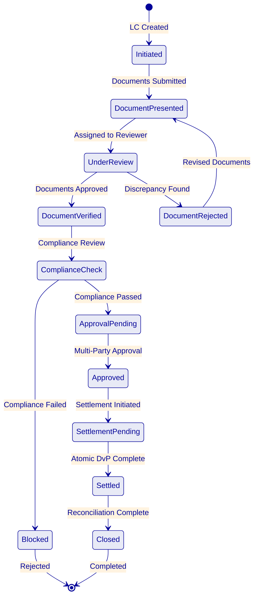

Each state transition in the workflow:
- Persists to PostgreSQL before proceeding (crash-safe)
- Produces an immutable audit event with initiator, timestamp, and context
- Triggers configurable webhook notifications to downstream systems
- Enforces authorization checks (only permitted roles can trigger transitions)
- Supports timeout escalation (configurable per transition, e.g., 24-hour review window)

**Document Management Integration:**

DALP does not replace Emirates NBD's existing document management system. Instead, it integrates with it through defined touchpoints:

1. Document references (hashes, identifiers) are stored on-chain as part of the trade finance token metadata
2. Document content remains in Emirates NBD's document management system (or DALP's object storage for new documents)
3. Document verification status is recorded as a workflow milestone with approver identity
4. Any change to document references produces an audit event with the previous and new reference values

This integration approach ensures that Emirates NBD's existing document management processes, retention policies, and access controls are preserved. DALP adds a layer of on-chain evidence for document-linked trade operations without duplicating document storage infrastructure.

**Multi-Entity Limit Management:**

For trade finance operations involving multiple entities (Emirates NBD, counterparty banks, institutional investors), DALP's compliance module composition enables entity-specific limit enforcement:

- Per-entity exposure limits configurable through the compliance engine
- Cross-entity limit aggregation via API queries (total exposure across all trade finance instruments for a given counterparty)
- Limit breach prevention at the compliance check level (transfers that would cause a limit breach are blocked before execution)
- Limit utilization reporting through GraphQL queries for treasury and risk management

### Appendix: Detailed Deployment Architecture

#### Infrastructure Topology for Emirates NBD

The recommended deployment architecture for Emirates NBD uses a dedicated cloud environment with multi-availability-zone distribution for resilience:

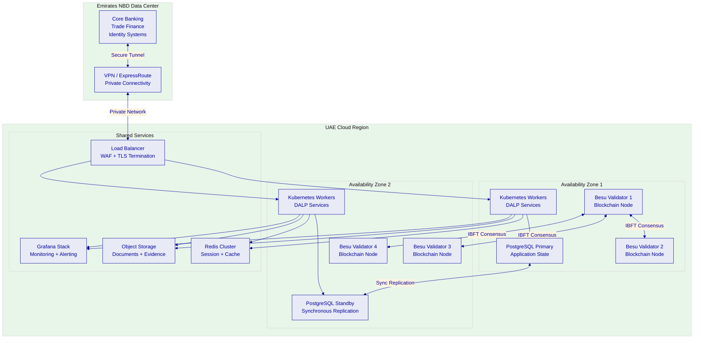

**Kubernetes cluster configuration:** The DALP platform services are deployed across Kubernetes worker nodes distributed across two availability zones. This ensures that a single-AZ failure does not take the platform offline. The Kubernetes deployment uses:

- Rolling deployments for zero-downtime updates
- Health checks and readiness probes for automated failover
- Horizontal pod autoscaling for compute-intensive workloads
- Resource quotas and limit ranges for workload isolation

**Database architecture:** PostgreSQL runs in a primary-standby configuration with synchronous replication between availability zones. The synchronous replication ensures zero data loss in the event of a primary failure. Automated failover promotes the standby to primary within the configured RTO target.

- Point-in-time recovery enabled with continuous WAL archiving
- Automated backups every hour with 30-day retention
- Connection pooling via PgBouncer for efficient connection management
- Read replicas available for reporting workloads (avoiding production impact)

**Blockchain network architecture:** Four Hyperledger Besu validator nodes distributed across two availability zones. IBFT 2.0 consensus requires agreement from at least three of four validators, meaning the network tolerates one node failure without impact to consensus. The distribution across AZs ensures that a single-AZ failure leaves at least two validators operational, sufficient to maintain consensus if the remaining AZ has two validators.

Block production continues uninterrupted during normal operations. If a validator is temporarily unavailable, the remaining validators continue producing blocks. When the unavailable validator recovers, it synchronizes automatically from the peer network.

**Network security:**

- All inter-component communication encrypted via mutual TLS
- Private subnets for all platform components (no public internet exposure)
- NAT gateway for outbound-only internet access (package updates, custody provider API calls)
- Web Application Firewall (WAF) on the load balancer for OWASP Top 10 protection
- VPN or ExpressRoute tunnel for private connectivity to Emirates NBD's data center
- Network security groups restricting traffic to defined port ranges and source addresses

#### Disaster Recovery Architecture

The DR environment replicates the production environment in a separate availability zone (or region, depending on Emirates NBD's requirements):

| Component | DR Strategy | RPO | RTO |
|---|---|---|---|
| Blockchain state | Continuous replication via Besu peer sync | Near-zero | 30 minutes |
| Application database | Synchronous replication + automated failover | Zero (synchronous) | 15 minutes |
| Configuration | Infrastructure-as-code; re-deployable | N/A | 30 minutes |
| Object storage | Cross-region replication | 15 minutes | Immediate |
| Kubernetes workloads | Helm charts; re-deployable to DR cluster | N/A | 30 minutes |

**DR testing:** SettleMint conducts quarterly DR failover tests, documented with test plans, execution records, and recovery time measurements. Emirates NBD is invited to observe and participate in DR tests.

**Backup and restore procedures:**

1. Automated hourly database snapshots retained for 30 days
2. Continuous blockchain state available through Besu peer synchronization
3. Configuration artifacts stored in version control (Git) with tagged releases
4. Object storage versioning enables point-in-time recovery for documents
5. Documented restore procedures with defined roles and responsibilities
6. Tested backup and restore procedures validated during Phase 2

#### Capacity Planning

The initial deployment is sized for Emirates NBD's projected launch workloads with headroom for growth:

| Metric | Initial Capacity | Growth Headroom |
|---|---|---|
| Transactions per day | 10,000 | 50,000 (5× growth) |
| Concurrent API connections | 500 | 2,000 |
| Token contracts deployed | 50 | 500 |
| Identity registrations | 1,000 | 10,000 |
| Document storage | 100 GB | 1 TB |

Capacity planning is reviewed quarterly during the Premium Support business review cycle. Scaling recommendations are provided proactively when utilization approaches configured thresholds.

### Appendix: Detailed Training Programme

#### Administrator Track (3 Days)

**Day 1: Platform Fundamentals**
- DALP architecture overview (non-technical perspective)
- Navigation and dashboard interpretation
- User management and RBAC assignment
- Organization and multi-tenant configuration
- Lab: Create users, assign roles, navigate dashboards

**Day 2: Asset and Compliance Administration**
- Asset Designer walkthrough (deposits and trade finance)
- Compliance module configuration and management
- Identity management and trusted issuer administration
- Settlement configuration (XvP, yield schedules)
- Lab: Configure a deposit product end-to-end; add compliance modules

**Day 3: Operations and Monitoring**
- Monitoring dashboard interpretation and customization
- Alert configuration and escalation setup
- Incident response procedures
- Backup verification and DR awareness
- Lab: Simulate operational scenarios (failed transaction, compliance veto, limit breach)

#### Developer / Integration Track (3 Days)

**Day 1: API and SDK Fundamentals**
- REST API v2 overview and authentication
- OpenAPI specification navigation
- TypeScript SDK setup and usage patterns
- API key management and scope configuration
- Lab: Create API keys, make authenticated requests, explore SDK

**Day 2: Integration Patterns**
- Webhook configuration and event handling
- CLI automation for operational scripting
- Server-sent events for real-time integration
- GraphQL queries for reporting and analytics
- Lab: Build a webhook receiver; write CLI automation scripts

**Day 3: Advanced Integration**
- Core banking integration patterns (deposit lifecycle)
- Trade finance workflow integration (milestone events)
- Identity management integration (KYC claim feeds)
- Error handling and retry strategies
- Lab: Build end-to-end integration for a deposit lifecycle scenario

#### Operations Track (2 Days)

**Day 1: Day-to-Day Operations**
- Deposit operations (creation, distribution, monitoring, maturity processing)
- Trade finance workflow management (document handling, milestone tracking)
- Settlement monitoring and exception handling
- Compliance event review and resolution
- Lab: Process deposit lifecycle scenarios; manage trade finance milestones

**Day 2: Reporting and Audit**
- Regulatory reporting workflows
- Audit evidence extraction (GraphQL queries)
- Reconciliation procedures (core banking sync)
- Exception reporting and escalation
- Lab: Generate regulatory reports; extract audit evidence for a sample period

#### Knowledge Transfer Outcomes

At the completion of the training programme, Emirates NBD teams should be able to:

1. Independently configure and deploy new deposit products through the Asset Designer
2. Manage compliance modules (add, modify, remove) for existing products
3. Process trade finance workflows from initiation through settlement
4. Monitor platform health and respond to operational alerts
5. Extract audit evidence and generate regulatory reports
6. Integrate new downstream systems using the REST API and SDK
7. Troubleshoot common operational issues using runbooks and CLI tools
8. Perform routine maintenance operations (user management, key rotation, backup verification)

### Appendix: Extended Risk Analysis

#### Risk Assessment Methodology

Risks are assessed on a 5-point scale for both likelihood and impact:

| Level | Likelihood | Impact |
|---|---|---|
| 1 | Rare (< 5%) | Negligible |
| 2 | Unlikely (5–20%) | Minor delay |
| 3 | Possible (20–50%) | Moderate delay or workaround needed |
| 4 | Likely (50–80%) | Significant delay or scope reduction |
| 5 | Almost certain (> 80%) | Programme failure risk |

#### Extended Risk Register

| ID | Risk | L | I | Score | Mitigation | Owner | Status |
|---|---|---|---|---|---|---|---|
| R1 | CBUAE regulatory changes during implementation | 3 | 4 | 12 | Configurable compliance modules; quarterly regulatory review; modular architecture allows policy updates without redeployment | Joint | Open |
| R2 | Core banking API specification unavailable at Phase 2 | 3 | 4 | 12 | Early engagement (Phase 1); mock API for parallel development; API specification workshop in Week 2 | Emirates NBD | Open |
| R3 | Trade finance back-office integration complexity exceeds estimates | 3 | 3 | 9 | Deep discovery in Phase 1; integration specialist allocation; modular integration approach allowing incremental delivery | SettleMint | Open |
| R4 | Custody provider (DFNS/Fireblocks) onboarding delay | 2 | 4 | 8 | Early engagement during Phase 1; platform signer fallback for testing environments; parallel custody integration track | Joint | Open |
| R5 | Emirates NBD security review extends beyond Phase 4 timeline | 3 | 3 | 9 | Pre-engagement with InfoSec during Phase 1; incremental security testing during Phases 2–3; pre-share audit reports and certifications | Joint | Open |
| R6 | UAE cloud infrastructure provisioning delay | 2 | 3 | 6 | Pre-provisioned capacity; infrastructure-as-code enabling rapid redeployment; multi-region fallback option | SettleMint | Open |
| R7 | Emirates NBD resource availability for UAT | 3 | 3 | 9 | Clear effort estimates communicated upfront; UAT test scripts provided by SettleMint; flexible UAT scheduling | Emirates NBD | Open |
| R8 | SWIFT ISO 20022 native support timing uncertainty | 2 | 2 | 4 | Middleware translation layer available and proven at two existing clients; native support target Q3 2026 is not a dependency for go-live | SettleMint | Open |
| R9 | Multi-party trade finance counterparty onboarding delay | 3 | 3 | 9 | Phased onboarding approach; initial launch with a subset of counterparties; dedicated onboarding support during hypercare | Joint | Open |
| R10 | Exchange rate feed reliability for multi-currency deposits | 2 | 3 | 6 | Configurable feed sources with failover; staleness thresholds with alerting; manual override capability for operations | SettleMint | Open |

#### Risk Monitoring and Governance

Risks are reviewed at three levels:

1. **Weekly:** Delivery team reviews RAID register, updates risk status, identifies new risks
2. **Bi-weekly:** Steering committee reviews top risks, approves mitigations, makes escalation decisions
3. **Gate reviews:** Comprehensive risk assessment as part of phase gate criteria; unresolved high-impact risks may block phase progression

### Appendix: Competitive Positioning

DALP's competitive positioning for Emirates NBD's evaluation:

| Evaluation Dimension | DALP Advantage | Evidence |
|---|---|---|
| Time to production | 19 weeks (proven methodology) | 14 reference deployments across similar institutional contexts |
| Compliance depth | 18 on-chain modules, ex-ante enforcement | No competitor offers equivalent on-chain compliance granularity |
| Settlement performance | Atomic DvP, under 3 seconds | Commerzbank production: settlement under 10 seconds on exchange |
| Licensing economics | No per-transaction fees | Scale without cost anxiety; Commerzbank projected EUR 7M/year savings |
| UAE market relevance | Active Gulf programs (Saudi RER, ADI Finstreet) | Regional presence with sovereign-scale deployments |
| Trade finance capability | Durable workflows, multi-party approvals | RBI Innovation Hub: multi-bank LC processing in production |
| Identity architecture | On-chain, verifiable, claims-based | OnchainID (ERC-734/735) with enterprise identity provider integration |
| Custody flexibility | Bring-your-own (DFNS, Fireblocks) | No vendor lock-in for custody infrastructure |
| Upgrade capability | Runtime reconfiguration (DALPAsset) | Features and compliance modules changed without redeployment |
| Regulatory adaptability | Configurable per-token compliance | Different regulatory configurations for CBUAE, DFSA, ADGM scopes |

Unlike platforms that require Emirates NBD to choose a blockchain network before designing asset structures, DALP inverts this: the bank defines asset lifecycle rules in business and regulatory terms, then deploys to the chosen network. This means Emirates NBD can begin structuring tokenized deposits while infrastructure decisions are finalized, without risking a re-architecture if the network selection changes.

Most digital asset platforms treat compliance as an application-layer concern, checking rules after transaction submission and relying on manual intervention when violations are detected. DALP embeds compliance enforcement at the smart contract level, where rules are evaluated before state changes execute. This is a structural difference that eliminates the window between transaction submission and compliance review that creates regulatory risk in alternative approaches.

### Appendix A: Glossary

| Term | Definition |
|---|---|
| DALP | Digital Asset Lifecycle Platform. SettleMint's production-grade platform |
| SMART Protocol | SettleMint Adaptable Regulated Token. ERC-3643 implementation |
| DALPAsset | Configurable token contract supporting runtime feature and compliance changes |
| OnchainID | On-chain identity standard (ERC-734/735) for verifiable claims |
| XvP | Exchange versus Payment, atomic settlement addon |
| DAPI | Durable API Service. DALP's unified API layer |
| IBFT | Istanbul Byzantine Fault Tolerant, consensus mechanism |
| DvP | Delivery versus Payment, simultaneous exchange of assets |

### Appendix B: Support Tier Comparison

| Attribute | Standard | Premium | Enterprise |
|---|---|---|---|
| Coverage | Business hours | 16×5 + P1 on-call | 24/7/365 |
| P1 response | 4 hours | 2 hours | 30 minutes |
| Uptime SLA | 99.9% | 99.95% | 99.99% |
| Dedicated engineer | No | Yes | Dedicated team |
| Update cycle | Quarterly | Monthly | Continuous |

### Appendix C: Reconciliation Architecture

Emirates NBD's RFP specifically calls out reconciliation as a critical concern (REQ-10). DALP's reconciliation architecture provides multiple mechanisms for ensuring tokenized records remain synchronized with core books:

**Real-time event streaming.** Every token operation (mint, burn, transfer, settlement, yield distribution) generates both an on-chain event and an off-chain webhook notification. Emirates NBD's core banking middleware can consume these events in real time to update deposit and trade finance records.

**Periodic reconciliation queries.** GraphQL queries enable Emirates NBD to extract current token state (balances, holder lists, transaction history) at any point for comparison with core banking records. These queries can be automated on configurable schedules (hourly, daily, or on-demand).

**Balance verification API.** The REST API provides balance verification endpoints that Emirates NBD's reconciliation processes can call to compare on-chain token balances with core banking deposit balances. Discrepancies generate alerts through the monitoring system.

**Historical state reconstruction.** The historical balances token feature enables point-in-time balance queries, allowing Emirates NBD to reconstruct the state of any deposit at any previous block height. This is essential for end-of-day reconciliation, period-end closing, and audit investigations.

**Reconciliation evidence format.** DALP produces reconciliation data in structured formats (JSON, CSV) compatible with Emirates NBD's existing reconciliation tools. Field mappings between DALP events and core banking records are defined during Phase 1 and implemented during Phase 4 integration.

### Appendix D: Performance Benchmarks

The following performance characteristics are based on DALP's production deployments and internal testing:

| Metric | Measurement | Test Conditions |
|---|---|---|
| Settlement latency (median) | 2.3 seconds | 4-node IBFT validator network, AWS c6g.xlarge, single-region |
| Settlement latency (P99) | 4.1 seconds | Same conditions, sustained load |
| Concurrent settlement throughput | 500 TPS | 4-node IBFT, EIP-1559 gas pricing |
| API response time (read) | < 100ms | REST API v2, cached queries |
| API response time (write) | < 500ms (submission), 2–4s (confirmation) | REST API v2, including blockchain confirmation |
| Compliance check latency | < 50ms per module | On-chain evaluation, 5 modules in sequence |
| Chain Indexer lag | < 2 seconds | Event processing from block confirmation to indexed state |
| Webhook delivery latency | < 1 second | From on-chain event to webhook POST |
| Dashboard refresh | Real-time (SSE) | Grafana + Server-Sent Events |

**Important qualification:** Performance in Emirates NBD's deployment will depend on infrastructure specifications, network configuration, and transaction complexity. The benchmarks above provide a reference baseline. Performance validation is part of Phase 4 testing, where Emirates NBD-specific load profiles are tested against the production infrastructure.

### Appendix E: Standards Compliance Reference

| Standard | DALP Coverage | Evidence |
|---|---|---|
| ERC-3643 (T-REX) | Full implementation via SMART Protocol | Smart contract audit reports |
| ERC-20 | Full backward compatibility | Standard interface compliance |
| ERC-734 | OnchainID key management | Identity architecture documentation |
| ERC-735 | OnchainID verifiable claims | Identity architecture documentation |
| ERC-5805 | Voting power and governance snapshots | Token feature documentation |
| EIP-2612 | Permit (gasless approvals) | Token feature documentation |
| EIP-1559 | Gas pricing optimization | Transaction processing documentation |
| ERC-2771 | Meta-transactions (gasless) | Transaction signer documentation |
| ERC-8021 | Transaction attribution | Transaction processor documentation |
| OpenAPI 3.1 | REST API specification | Auto-generated from code |
| ISO 27001 | Information security management | Certification documentation |
| SOC 2 Type II | Security controls | Audit report (available under NDA) |
| ISO 20022 | Payment messaging (via middleware) | Integration documentation |
| WebAuthn | Passkey authentication | Authentication documentation |
| OAuth 2.0 / OIDC | Enterprise SSO integration | Authentication plugin documentation |
| SAML 2.0 | Legacy enterprise SSO | Authentication plugin documentation |

### Appendix F: Document Map

| Section | Page Range (Estimated) | Primary Audience |
|---|---|---|
| Executive Summary | 1–3 | Executive sponsors, procurement |
| About SettleMint | 4–7 | Procurement, architecture |
| About DALP | 8–13 | Architecture, technology |
| Understanding Requirements | 14–17 | Business sponsors, compliance |
| Customer References | 18–22 | Procurement, business sponsors |
| Proposed Solution | 23–32 | Architecture, technology, operations |
| Technical Architecture | 33–40 | Architecture, technology |
| Smart Contract Architecture | 41–46 | Technology, security |
| Identity & Compliance | 47–52 | Compliance, legal, security |
| Settlement & Servicing | 53–58 | Operations, technology |
| Security | 59–66 | Security, compliance, audit |
| Implementation | 67–74 | Project management, operations |
| Deployment | 75–78 | Infrastructure, operations |
| Training | 79–81 | Operations, HR |
| Support & SLA | 82–84 | Operations, procurement |
| Risk Management | 85–88 | Project management, risk |
| Coverage & Gaps | 89–90 | Procurement, compliance |
| Compliance Matrix | 91–93 | Procurement, compliance |
| Appendices | 94–100+ | Reference (all audiences) |

### Appendix C: Certification Summary

| Certification | Issuing Body | Scope | Status |
|---|---|---|---|
| ISO 27001 | Accredited certification body | Information security management system | Current |
| SOC 2 Type II | Independent auditor | Security, availability, processing integrity | Current |
| Smart contract audits | Third-party security firms | SMART Protocol and DALPAsset contracts | Completed |
