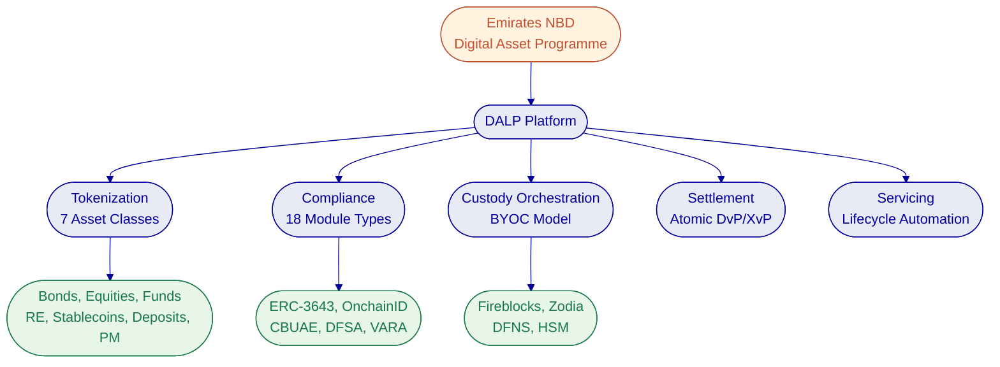
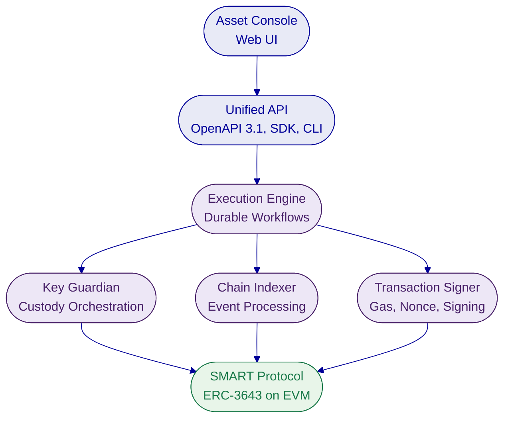
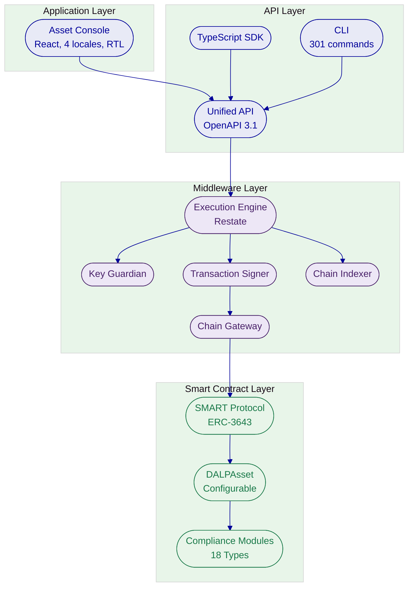
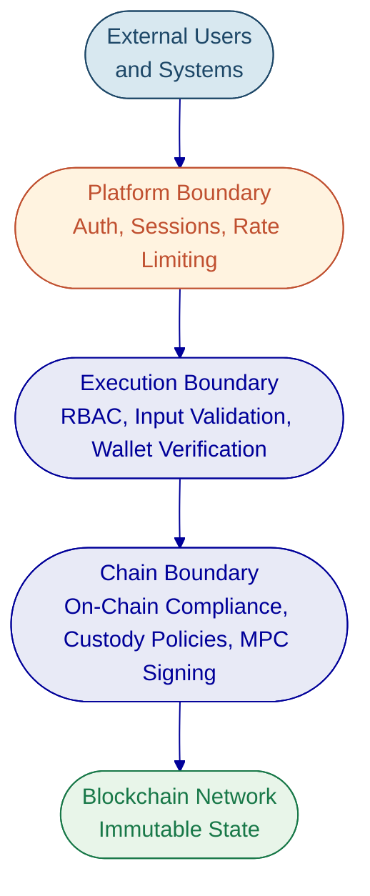
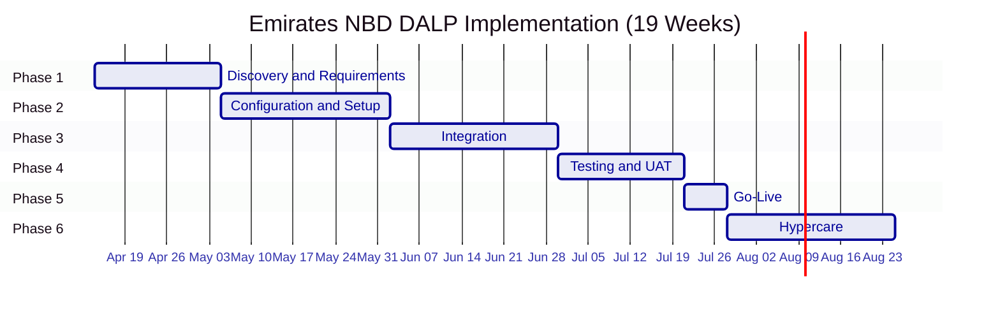
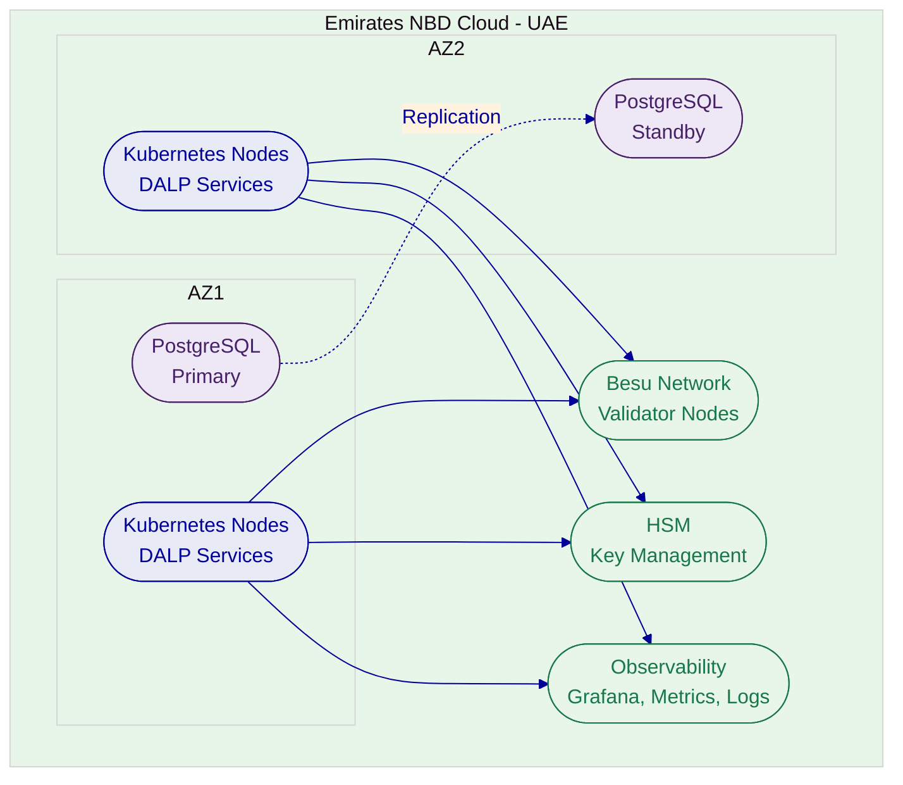
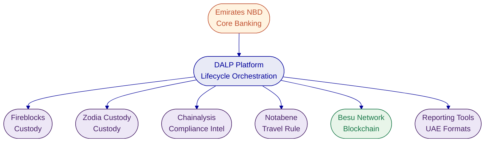
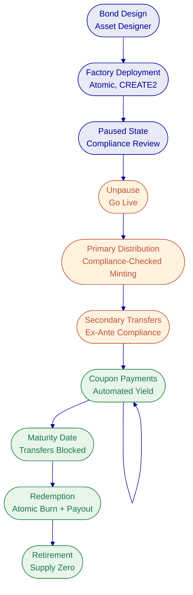

# Executive Summary

## Client Context and Objectives

Emirates NBD stands at the forefront of digital asset adoption in the MENAT region. Having successfully issued MENA's first AED 1 billion Digitally Native Notes via Euroclear's D-FMI platform in January 2026, the bank has proven its capacity to execute institutional-grade tokenized instruments at production scale. The next phase of Emirates NBD's digital asset programme requires a unified platform capable of managing multiple asset classes across the full lifecycle, from issuance through compliance enforcement, custody orchestration, settlement, servicing, and retirement, while meeting the regulatory requirements of the UAE Central Bank, DFSA, and VARA.

The challenge is no longer whether tokenization works. Emirates NBD has demonstrated that it does. The challenge is operational: consolidating point solutions into a single governance model, scaling from a single digital bond issuance to a multi-asset programme spanning bonds, equities, funds, real estate, and stablecoins, and doing so under a compliance framework that satisfies multiple UAE regulatory authorities simultaneously.

## Proposed Response

SettleMint proposes DALP (Digital Asset Lifecycle Platform) as the unified tokenization, compliance, and custody orchestration layer for Emirates NBD's digital asset programme. DALP provides production-ready infrastructure covering seven asset classes, each with purpose-built lifecycle logic, deployed through a configurable platform that requires no custom smart contract development.

The proposed deployment follows a sovereign private cloud model within Emirates NBD's infrastructure, ensuring full data residency compliance within the UAE. DALP integrates with Emirates NBD's existing custody relationships (Fireblocks, Zodia Custody) through its bring-your-own-custodian architecture, connects to existing compliance tooling (Chainalysis) through its enforcement hooks, and supports both permissioned private networks and public EVM-compatible chains.

The compliance architecture, built on the ERC-3643 standard with 18 configurable compliance module types, enforces investor eligibility before every transfer at the smart contract level. This ex-ante enforcement model aligns with CBUAE, DFSA, and VARA regulatory expectations. The platform supports phased delivery, starting with digital bond lifecycle management and expanding to additional asset classes. A standard implementation timeline of 15 to 19 weeks delivers production deployment with full knowledge transfer.

## Why SettleMint and DALP

SettleMint brings nearly a decade of focused experience delivering blockchain infrastructure for regulated financial institutions. Multi-year continuous production deployments with tier-1 banks across Asia, Europe, and the Middle East demonstrate operational maturity that cannot be replicated through pilot programmes alone. The platform has been battle-tested in environments where uptime, compliance enforcement, and operational continuity are non-negotiable.

DALP addresses the specific challenge Emirates NBD faces: the complexity of doing tokenization right at production scale. Rather than assembling separate tools for issuance, custody, compliance, and servicing, DALP provides a single platform with a unified registry, atomic settlement, and production-grade observability. This eliminates the integration tax, accountability gaps, and operational risk that come from multi-vendor architectures.

For Emirates NBD specifically, DALP provides lifecycle management for digital bonds (automated coupon payments, maturity handling), multi-asset expansion capability (equities, funds, real estate, stablecoins using the same platform), custody orchestration that preserves existing Fireblocks and Zodia relationships, and compliance enforcement that maps to UAE regulatory frameworks.

## Reference Snapshot

SettleMint's delivery record includes engagements directly relevant to Emirates NBD's programme:

**Saudi Arabia RER** provides country-scale real estate tokenization under the Real Estate General Authority, powered by DALP. This sovereign programme demonstrates the platform's ability to operate at national scale within a Middle Eastern regulatory framework, with production transactions live since January 2026.

**Maybank (Project Photon)** delivers FX tokenization and cross-border settlement using DALP's XvP atomic settlement capability. The MYRT token (tokenized Malaysian Ringgit) enables atomic cross-currency swaps, directly relevant to Emirates NBD's cross-border settlement ambitions.

**Commerzbank** operates a hybrid on/off-chain solution for exchange-traded products, achieving settlement in under 10 seconds and projected annual savings of EUR 7 million. This demonstrates DALP's capacity for institutional capital markets infrastructure.

---

# About SettleMint

## Company Overview

SettleMint is the production-grade digital asset lifecycle management company for regulated financial markets and sovereign use cases. Founded nearly a decade ago, SettleMint has evolved from an early enterprise blockchain infrastructure provider into the category-defining platform company enabling financial institutions, market infrastructure providers, and sovereign entities to move real-world value on-chain with compliance, security, and operational reliability.

SettleMint exists to bridge the gap between tokenization ambitions and production-grade execution. Tokenization technology is increasingly accessible, but institutional-grade implementation is not. Meeting regulatory requirements, implementing proper governance, supporting the full asset lifecycle, and ensuring that early pilots can scale into real institutional infrastructure: this is the complexity that most institutions underestimate. SettleMint's mission is to enable regulated institutions to move from slides to balance sheets by turning digital asset strategy into operating systems that reduce time-to-market and remove operational and regulatory risk.

## Credentials and Delivery Maturity

| Category | Evidence |
|---|---|
| **Market Validation** | Nearly 10 years focused on blockchain infrastructure; 7+ years of continuous production deployments at regulated banks |
| **Operational Maturity** | Live deployments across bonds, equities, deposits, stablecoins, real estate, funds; enterprise-grade security and compliance |
| **Sovereign Credibility** | Active sovereign and national-scale programmes in the Middle East, including Saudi Arabia's national real estate tokenization |
| **Ecosystem Strength** | Trusted by tier-1 and tier-2 banks, CSDs, and sovereign entities; backed by leading European and Middle Eastern investors |
| **Team Depth** | 200+ years combined banking and blockchain experience; protocol-level expertise, financial domain knowledge, and enterprise delivery discipline |
| **Security Posture** | ISO 27001 and SOC 2 Type II certified; deployments have undergone penetration testing and vendor risk assessments at major financial institutions |

## Regulatory Readiness

SettleMint's platform embeds regulatory controls, policy enforcement, and auditability into the core architecture rather than treating compliance as an afterthought. The platform supports compliance frameworks across multiple jurisdictions relevant to Emirates NBD's operations:

| Jurisdiction | Framework | DALP Coverage |
|---|---|---|
| **UAE** | CBUAE, VARA, DFSA | Compliance modules configurable for UAE requirements; jurisdiction-specific controls deployable through compliance templates |
| **European Union** | MiCA, MiFID II, GDPR | Pre-built MiCA compliance template with supply caps, identity verification, and country restrictions |
| **Singapore** | MAS framework | Pre-built MAS Capital Markets template with holding period enforcement |
| **United Kingdom** | FCA requirements | Pre-built UK FCA Securities template |
| **Japan** | FSA compliance | Pre-built Japan FSA template |
| **GCC** | Regional frameworks | Shariah-compliant structure support; Islamic finance compatibility |

Native support for the ERC-3643 (T-REX) regulated token standard, combined with OnchainID for verifiable on-chain investor identities, provides a compliance architecture that enforces eligibility before execution, not after.

## Relevance to Emirates NBD

Emirates NBD's profile, a MENAT-leading banking group with production digital asset experience, an active innovation lab, and multi-regulatory oversight, maps directly to SettleMint's core delivery experience. SettleMint has deployed production tokenization infrastructure for institutions of comparable scale and regulatory complexity in the Middle East, Asia, and Europe. The combination of sovereign-scale delivery experience, deep compliance architecture, and a team that understands the approval chains and governance structures of major banking institutions means SettleMint can meet Emirates NBD where they already are: past pilots, operating at production scale, and ready for multi-asset expansion.

---

# About DALP

## Platform Overview

DALP is SettleMint's production-grade Digital Asset Lifecycle Platform for designing, launching, and operating tokenized assets across financial instruments and real-world assets. It provides production-ready infrastructure from day one, so institutions can launch digital assets without building blockchain expertise internally, without lengthy development cycles, and without assembling production-grade infrastructure from scratch.

Unlike point solutions that address only issuance, only custody, or only trading, DALP provides a unified platform covering the full digital asset lifecycle: from asset design through issuance, compliance enforcement, custody integration, settlement, servicing, and retirement. This is treated as one continuous lifecycle under a single governance model, security posture, and operating framework.

DALP sits between existing core financial systems and multiple blockchain networks, providing the governance and orchestration layer that enables institutions to build, deploy, and operate compliant digital asset solutions in production. The platform is designed to be operated over time, not just deployed, managing every event in an asset's lifetime from creation to retirement.

## Lifecycle Pillars

**Issuance.** DALP supports rapid deployment of tokenized assets across seven asset classes: bonds, equities, funds, deposits, stablecoins, real estate, and precious metals. Each asset class has purpose-built lifecycle logic with configurable business rules, compliance controls, and term structures. The Asset Designer wizard guides issuers through a multi-step configuration process, and a Configurable Token type enables institutions to digitise any asset class beyond the seven pre-built templates using a composable architecture with up to 32 pluggable features per token.

**Compliance.** Ex-ante enforcement ensures every transfer is validated before execution, not reviewed after. DALP's compliance architecture includes 18 compliance module types covering country restrictions, investor accreditation, supply limits, holding periods, collateral backing, and transfer controls. The ERC-3643 (T-REX) standard and OnchainID provide verifiable, on-chain investor identities with claim-based verification reusable across all assets.

**Custody.** Enterprise-grade key management workflows with bring-your-own-custodian integrations. DALP orchestrates custody policy across existing custodian relationships through Fireblocks and DFNS connectors. The Key Guardian provides multiple storage backends from encrypted database through cloud secret manager and HSM to third-party MPC custody. Maker-checker approval workflows enforce operational governance.

**Settlement.** Atomic Delivery-versus-Payment (DvP) and Exchange-versus-Payment (XvP) settlement ensures asset and cash legs complete together or revert together, eliminating counterparty risk and reconciliation gaps. Both local (same-chain) and HTLC (cross-chain) settlement models are supported, with ISO 20022 integration for SWIFT, SEPA, and RTGS connectivity on payment rails.

**Servicing.** Automated lifecycle operations, including coupon payments, yield distribution, dividend processing, redemptions, and maturity handling, are executed programmatically across every asset type. This is the operational capability most platforms lack entirely: managing the asset from issuance through every event in its lifecycle to retirement.

## Platform Foundations

Beneath the five lifecycle pillars, DALP provides cross-cutting foundations. A unified identity layer built on OnchainID provides verifiable, on-chain investor identities with KYC/KYB profile management, invitation-linked onboarding, and identity recovery workflows. The integration surface includes REST APIs (OpenAPI 3.1), a typed TypeScript SDK, a CLI with 301 commands, event webhooks, and payment rail connectivity via ISO 20022. Production-grade observability ships with pre-built Grafana dashboards, three-pillar monitoring (metrics, logs, traces), and 534 structured error codes with multi-locale translations.

## Key Differentiators

| Differentiator | What It Means for Emirates NBD |
|---|---|
| **Unified Lifecycle** | Consolidate point solutions (Euroclear, Fireblocks, Chainalysis) under a single governance model |
| **Ex-Ante Compliance** | Every transfer validated at the smart contract level before execution, not audited after the fact |
| **Deployment Flexibility** | Deploy on-premises in UAE data centres, in private cloud, or as managed SaaS, with the same platform capabilities |
| **Operational Maturity** | Monitoring, alerting, distributed tracing, and structured error handling ship with the platform |
| **Multi-Asset Scalability** | Start with bonds, expand to equities, funds, real estate, and stablecoins using the same platform and operating model |
| **Custody Orchestration** | Preserve existing Fireblocks and Zodia relationships through bring-your-own-custodian architecture |

---

# Customer References

## Summary Table

| Client | Region | Asset Class | Year | Scope |
|---|---|---|---|---|
| Saudi Arabia RER | Middle East | Real estate | 2024-present | Country-scale registration, fractionalization, and digital marketplace |
| Maybank (Project Photon) | Southeast Asia | FX tokens | 2025-2026 | FX tokenization and cross-border XvP settlement |
| Commerzbank | Europe | ETPs | 2024-2025 | Hybrid ETP issuance; settlement under 10 seconds |
| OCBC Bank | Southeast Asia | Securities, bonds, RE | 2023-2024 | Security token engine for HNWIs |
| Standard Chartered Bank | Asia, Africa, ME | Securities | 2023-2024 | Digital Virtual Exchange with fractional tokenization |
| Sony Bank | East Asia | Stablecoins | 2024 | Stablecoin issuance with integrated digital identity |
| ADI Finstreet | Middle East | Equity | 2025 | Tokenized equity on Abu Dhabi mainnet |
| Mizuho Bank | East Asia | Bonds | 2025 | Bond tokenization PoC, production planning |
| State Bank of India | South Asia | CBDC | 2024-present | CBDC infrastructure for e-Rupee |
| Islamic Development Bank | Multi-region | Subsidy tokens | 2023-2024 | Sharia-compliant subsidy distribution across 57 countries |
| KBC Securities | Europe | Equity, SME loans | 2022-2023 | Crowdfunding with smart contract lifecycle management |
| Commerzbank | Europe | ETPs | 2024-2025 | Near real-time settlement; projected EUR 7M annual savings |
| Reserve Bank of India | South Asia | Trade finance | 2023-2024 | Multi-bank letter of credit on blockchain |
| Islamic Development Bank | Multi-region | Collateral assets | 2023-2024 | Market stabilization; 30-50% volatility reduction |

## Expanded Reference: Saudi Arabia RER

The Real Estate General Authority (REGA) of the Kingdom of Saudi Arabia selected SettleMint to build national-scale blockchain infrastructure for property registration, fractionalization, and a regulated digital marketplace. This initiative sits at the centre of Vision 2030's digital transformation agenda.

SettleMint serves as the delivery partner for the complete solution. DALP powers the blockchain and tokenization layer, handling asset contract deployment, compliance enforcement, and lifecycle management for tokenized property. The architecture exposes a unified RER API Gateway consumed by PropTechs, banks, and developers. Four PropTechs are live in production as of January 2026, processing real transactions. The project represents the first country in the world to deploy a national-scale property blockchain.

This reference is directly relevant to Emirates NBD because it demonstrates DALP's ability to operate at sovereign scale within a Middle Eastern regulatory framework, integrate with national identity and payment infrastructure, and support multiple third-party participants through a single API gateway.

## Expanded Reference: Maybank (Project Photon)

Maybank's Project Photon delivers FX tokenization and cross-border settlement using DALP's XvP settlement capability. The MYRT token, a tokenized Malaysian Ringgit, is issued in a controlled environment fully backed by fiat balances. The solution enables atomic cross-currency swaps with simultaneous settlement of both legs, reducing counterparty and settlement risk. Implementation aligns with Bank Negara Malaysia's Digital Asset Innovation Hub (DAIH).

This reference is relevant because it demonstrates atomic cross-currency settlement (directly applicable to Emirates NBD's multi-currency operations), production XvP capability for institutional FX, and central bank alignment in a regulated Asian market.

## Fit Note

These references were selected for their direct relevance to Emirates NBD's programme: Saudi Arabia RER demonstrates Middle Eastern sovereign-scale delivery, Maybank demonstrates cross-border settlement for a major banking group, and Commerzbank demonstrates capital markets infrastructure with institutional-grade settlement times. Collectively, they demonstrate that DALP operates at the scale, regulatory rigour, and asset class diversity that Emirates NBD requires.

---

# Understanding of Requirements

## Requirement Summary

Emirates NBD is evaluating vendors across three interconnected domains: tokenization, custody, and stablecoin infrastructure. The bank has already achieved significant milestones, most notably the AED 1 billion Digitally Native Notes issued via Euroclear D-FMI. The evaluation reflects a strategic shift from single-instrument execution to building an institutional platform capable of supporting a multi-asset digital asset programme under UAE regulatory supervision.

The bank's requirements reflect its position as a CLM Level 4 institution: the fundamental technology is proven, and the focus is now on operational scale, regulatory compliance across CBUAE, DFSA, and VARA, integration with existing infrastructure (Fireblocks, Chainalysis, Zodia Custody), and lifecycle management beyond issuance.

## Requirement Domains

| Domain | Requirement Summary | DALP Alignment |
|---|---|---|
| **Tokenization** | Multi-asset lifecycle platform covering bonds, equities, funds, real estate, stablecoins; purpose-built lifecycle logic per asset class; configurable business rules | Core capability: 7 asset classes with purpose-built templates, Asset Designer wizard, Configurable Token for custom assets |
| **Compliance** | UAE regulatory alignment (CBUAE, DFSA, VARA); investor eligibility enforcement; multi-jurisdictional support; audit trails | 18 compliance module types; ERC-3643 ex-ante enforcement; OnchainID identity verification; configurable compliance templates |
| **Custody** | Institutional custody orchestration; bring-your-own-custodian model; integration with existing Fireblocks and Zodia relationships | Key Guardian with Fireblocks and DFNS connectors; maker-checker workflows; unified signer abstraction |
| **Integration** | Core banking connectivity; payment rail integration (ISO 20022); existing partner ecosystem preservation | REST API (OpenAPI 3.1), TypeScript SDK, CLI, webhooks; ISO 20022 support; bring-your-own-custodian and bring-your-own-chain flexibility |
| **Operations** | Production-grade monitoring; enterprise security; high availability; disaster recovery | Three-pillar observability; ISO 27001 and SOC 2 Type II; multiple HA patterns; durable workflow orchestration |
| **Stablecoin** | Stablecoin issuance, compliance, minting/burning; reserve management | Stablecoin asset template with minting, burning, and collateral verification; reserve management and merchant distribution require partner integration (see Architecture Boundaries section) |

## Response Principles

**Platform, not consulting.** DALP is a configurable software platform, not a consulting engagement. Emirates NBD's team configures and operates the platform independently, with SettleMint providing support and expertise.

**Honesty about boundaries.** Where DALP's capabilities end and partner solutions begin, this proposal states that clearly. DALP is a tokenization and lifecycle platform; custody, compliance intelligence, and payment infrastructure are partner domains.

**Lifecycle focus.** The proposal addresses the full lifecycle, from issuance through servicing to retirement, because that is where operational complexity concentrates and where most platforms fall short.

**UAE-first deployment.** The proposed architecture prioritises UAE data residency, regulatory alignment, and integration with Emirates NBD's existing infrastructure.

**Phased delivery.** Start with the highest-value asset class (digital bonds), prove operational capability, then expand to additional asset classes using the same platform.

---

# Proposed Solution

## Solution Overview

DALP serves as the unified digital asset lifecycle layer for Emirates NBD's programme, sitting between the bank's core systems and blockchain networks. The platform consolidates tokenization, compliance enforcement, custody orchestration, settlement, and servicing into a single operating environment. Emirates NBD retains its existing custody relationships (Fireblocks, Zodia), compliance tooling (Chainalysis), and infrastructure partnerships while DALP provides the lifecycle orchestration and governance layer.

The solution scope covers multi-asset tokenization (bonds, equities, funds, real estate, stablecoins, deposits, precious metals), compliance enforcement aligned to CBUAE, DFSA, and VARA requirements, custody orchestration through the bring-your-own-custodian model, atomic DvP/XvP settlement, and automated servicing (coupon payments, maturity handling, yield distribution).

The deployment model is a sovereign private cloud within Emirates NBD's infrastructure, ensuring full data residency compliance. DALP supports deployment on any EVM-compatible blockchain network, enabling Emirates NBD to operate on permissioned private networks for regulated instruments while maintaining the flexibility to connect to public networks as regulatory frameworks evolve.

## Asset Setup and Lifecycle Management

DALP manages tokenized assets from initial design through retirement, treating the entire lifecycle as a configuration and operations problem rather than a custom development exercise.

**Asset Design and Configuration.** The lifecycle begins with the Asset Designer, a multi-step wizard that guides issuers through asset class selection, parameter configuration, compliance module binding, and permission assignment. Emirates NBD's treasury and DCM teams can configure digital bonds with maturity dates, ISIN numbers, coupon schedules, and denomination assets without writing smart contract code.

Seven pre-built asset templates cover the asset classes relevant to Emirates NBD's programme:

| Asset Class | Emirates NBD Application | DALP Capabilities |
|---|---|---|
| **Bonds** | Digital bond programme expansion (building on AED 1B issuance) | Automated coupon schedules, maturity logic, denomination asset linking, ISIN tracking |
| **Equities** | Potential equity tokenization | Dividend distribution, voting rights, corporate action processing, collateral management |
| **Funds** | Investment fund units | NAV integration, fractional units, fee structures, subscription/redemption |
| **Stablecoins** | Stablecoin exploration | Minting/burning, collateral verification, multi-currency support |
| **Real Estate** | Property tokenization (building on Dubai resale market programme) | Fractional ownership, GPS mapping, rental income distribution, property metadata |
| **Deposits** | Tokenized bank deposits | Programmable interest, maturity rules, bridge functionality |
| **Precious Metals** | Commodity-backed tokens | Asset-backed tokens, provenance tracking, custodian metadata |

**Token Creation.** Token deployment executes through a factory pattern using CREATE2 deterministic addressing, wrapped in a durable workflow that validates configuration, deploys the proxy contract, initializes compliance, binds identity, assigns roles, and registers the token, all as a single atomic transaction. Newly deployed tokens start in a paused state by default, giving compliance teams time to verify configuration before the token goes live.

**Lifecycle Operations.** Post-issuance, DALP provides single and batch minting with compliance checks, compliance-verified transfers with ex-ante enforcement, corporate actions (coupon payments, dividends, maturity redemption, conversion), freeze/unfreeze and pause/unpause controls, and full audit trails for every on-chain event. Token Sale and Airdrop addons provide additional distribution mechanisms for primary offerings.

## Identity, Compliance, and Access Control

DALP's compliance architecture is built on the principle that regulatory enforcement happens at the smart contract level, not the application layer. This is the most important architectural distinction for a regulated institution: compliance cannot be bypassed by any application, integration, or user interface because it is enforced by the blockchain itself.

**ERC-3643 Compliance Engine.** Every token transfer passes through a modular compliance engine before execution. Compliance modules evaluate in sequence; a single module veto blocks the transfer. This is a fail-closed design: the default is denial unless all modules explicitly approve. Modules can be added, removed, or reconfigured at runtime without redeploying the token contract.

The 18 compliance module types cover:

| Category | Modules | Emirates NBD Application |
|---|---|---|
| **Eligibility** | Identity verification, identity allowlist/blocklist | Investor eligibility for regulated instruments |
| **Restrictions** | Country allowlist/blocklist, address blocking | VARA/DFSA jurisdiction controls |
| **Transfer Controls** | Transfer approval, conditional transfer | Maker-checker for high-value transfers |
| **Issuance and Supply** | Supply cap, investor count limit, token supply limit | Regulatory issuance limits, MiCA-style caps |
| **Time-Based** | Timelock (holding period enforcement) | Lock-up periods for private placements |
| **Settlement and Collateral** | Collateral requirement | Reserve verification for stablecoins |

**OnchainID Identity Layer.** Every investor has an on-chain identity contract (built on ERC-734/735) storing verifiable KYC/AML claims from trusted issuers. Identity verification happens off-chain through Emirates NBD's chosen KYC/AML providers; DALP consumes the resulting claims and makes them enforceable at the protocol level. Once verified, an investor's identity is reusable across all tokens, eliminating per-token re-verification.

**Role-Based Access Control.** DALP implements 26 distinct roles organized across four layers: platform roles, system roles, per-asset roles, and system module roles. This granularity enables Emirates NBD to implement proper separation of duties between governance, operations, compliance, and emergency functions, matching the governance structures expected in regulated banking environments.

## Settlement, Custody, and Operational Controls

**Atomic Settlement.** DALP's XvP (Exchange versus Payment) settlement system ensures that asset and cash legs complete together or revert together. For same-chain settlements, execution is atomic within a single transaction. For cross-chain settlements, HTLC (Hash Time-Locked Contracts) provide cryptographic linkage ensuring coordinated execution across different blockchain networks. All legs of a settlement are subject to the compliance rules of each token involved.

**Custody Orchestration.** DALP is not a custodian. It orchestrates custody policy across Emirates NBD's existing custodian relationships through a provider-abstracted signer service. The Key Guardian manages cryptographic key material with four storage tiers: encrypted database, cloud secret manager, HSM (FIPS 140-2 Level 3), and third-party MPC custody (Fireblocks, DFNS). Emirates NBD's existing Fireblocks relationship integrates through DALP's Fireblocks connector, with vault-based wallet management and Transaction Authorization Policy (TAP) enforcement. Zodia Custody can integrate through the custodian API layer.

**Operational Controls.** Every platform action is auditable. The observability stack provides pre-built Grafana dashboards covering operations, transactions, compliance, and security. Three-pillar monitoring (metrics via VictoriaMetrics, logs via Loki, traces via Tempo/OpenTelemetry) ensures full visibility into platform health. An async transaction pipeline with 11-state lifecycle management, idempotency, retry semantics, and dead-letter rescue ensures operational reliability.

## Integration, APIs, and Reporting

DALP is designed to operate within existing institutional environments, not replace them. The platform provides multiple integration surfaces:

**API Layer.** The Unified API exposes all platform capabilities through OpenAPI 3.1 specifications with interactive Swagger documentation. Two authentication-separated endpoints serve browser sessions (RPC) and programmatic access (REST) with hard enforcement boundaries. All mutations flow through a durable async transaction pipeline with idempotency, status polling, and structured error responses (534 error codes).

**TypeScript SDK.** The public npm package (@settlemint/dalp-sdk) provides a typed client with contract-bound types, arbitrary-precision decimal handling for financial calculations, and support for all API namespaces. Multi-language SDK generation is supported through the OpenAPI specification.

**CLI.** A 301-command CLI enables scripting, CI/CD integration, and operational automation across token lifecycle, identity, compliance, monitoring, and addon workflows.

**Data and Reporting.** 18 PostgreSQL analytics views provide direct database access for BI tools (Looker, Tableau, Power BI). Blockchain events are indexed in real time (under 5 seconds from event to view availability). SSE streaming enables real-time operational dashboards. The data substrate supports Emirates NBD's internal reporting requirements, though UAE-specific regulatory report formats and submission pipelines require integration with specialised reporting tools.

## Functional Fit Table

| Requirement Area | Response Status | Relevant DALP Capability | Notes |
|---|---|---|---|
| Multi-asset tokenization | Full | 7 asset templates + Configurable Token | Bonds, equities, funds, stablecoins, RE, deposits, precious metals |
| Compliance enforcement | Full | 18 modules, ERC-3643, OnchainID | Ex-ante enforcement at smart contract level |
| Custody orchestration | Full | Key Guardian, Fireblocks/DFNS connectors | Bring-your-own-custodian model |
| Atomic settlement | Full | DvP/XvP, HTLC cross-chain | Same-chain and cross-chain settlement |
| Bond lifecycle | Full | Coupon schedules, maturity redemption, yield | Automated servicing with denomination asset linking |
| Investor identity | Full | OnchainID, identity registry, KYC profiles | Reusable across all assets |
| Role-based governance | Full | 26 roles across 4 layers | Separation of duties for regulated environments |
| API integration | Full | REST, SDK, CLI, webhooks | OpenAPI 3.1, 301 CLI commands |
| Observability | Full | Grafana, metrics, logs, traces | Pre-built dashboards; SIEM integration capability |
| KYT/Transaction monitoring | Partner | Enforcement hooks available | Chainalysis/Elliptic integration at compliance layer |
| Travel Rule compliance | Partner | Identity data available | Notabene/Sygna protocol integration required |
| Stablecoin reserve management | Partner | Collateral module + oracle feeds | Active reserve management via treasury system |
| Regulatory reporting (UAE) | Partner | Data substrate available | UAE report formats via specialised reporting tools |
| Book-building/allocation | Partner | Token Sale for retail distribution | Institutional book-building via external workflow |
| Exchange/OTC connectivity | Partner | XvP for bilateral OTC settlement | Exchange matching engine external |

---

# Technical Architecture

## Architecture Overview

DALP is built as a four-layer stack where each layer has a distinct responsibility boundary and layers communicate through well-defined interfaces. Lower layers enforce stricter invariants; upper layers provide flexibility and user-facing abstraction. This layered design ensures that no single-layer failure grants unauthorized access to digital assets.

The platform architecture is purpose-built for the Ethereum Virtual Machine ecosystem. This is a deliberate decision: the EVM ecosystem provides the most mature tooling, audited contract libraries, and institutional adoption for regulated financial instruments. ERC-3643, ERC-20, OnchainID (ERC-734/735), and ERC-2771 are all EVM-native standards. Compatibility across L1 networks, L2 rollups, and private networks (Hyperledger Besu) means the same contracts and tooling work across deployment configurations without modification.

## Core Layers and Components

| Layer | Role | Key Components |
|---|---|---|
| **Application** | User-facing interfaces for operators, issuers, and compliance officers | Asset Console (React web UI with RTL support, 4 locales including Arabic) |
| **API** | Programmatic access for external systems | Unified API (OpenAPI 3.1), TypeScript SDK, 301-command CLI |
| **Middleware** | Workflow orchestration, key management, indexing, transaction lifecycle | Execution Engine (Restate), Key Guardian, Transaction Signer, Chain Indexer, Chain Gateway, Feeds System |
| **Smart Contract** | On-chain enforcement of compliance, identity, and asset logic | SMART Protocol (ERC-3643), DALPAsset contracts, 18 compliance modules, token features, addons |

Requests flow top-down. A user action in the Asset Console triggers an API call, which the middleware orchestrates into one or more blockchain transactions, which the smart contract layer validates and executes on-chain. Each layer independently enforces its own security controls.

The smart contract layer follows a five-layer on-chain architecture: SMART Protocol (ERC-3643 framework) at the base, Global infrastructure (central directory, identity factory), System infrastructure (identity registry, compliance orchestration, access manager), Assets (DALPAsset configurable tokens), and Addons (airdrop, vault, XvP settlement, token sale, yield).

**DALPAsset: The Configurable Contract.** DALPAsset is the recommended contract type for all new tokenization projects. It extends the SMART Protocol with runtime-pluggable token features and compliance modules. A DALPAsset token can evolve: start as a simple bearer instrument, then have fee structures added, governance enabled, or maturity and redemption logic configured, all without redeploying the contract. This eliminates the need to commit to a specialised contract type at deployment time.

**Durable Execution.** All critical operations run as durable, deterministic workflows through Restate. Workflow phases are explicitly state-tracked with persisted status, enabling recovery from any interruption point. This is enterprise reliability by design: multi-step workflows survive process restarts and infrastructure failures.

## Environment and Deployment Topology

For Emirates NBD, SettleMint recommends a **private cloud deployment** within Emirates NBD's cloud infrastructure in the UAE. This model provides full data residency control, integration with Emirates NBD's existing cloud services, and Helm-based deployment automation while preserving the bank's operational sovereignty.

The deployment topology includes:

- **Development environment** for integration testing and configuration validation
- **Staging environment** mirroring production for pre-release validation
- **Production environment** with high-availability configuration across multiple availability zones
- **Permissioned blockchain network** (Hyperledger Besu with IBFT 2.0/QBFT consensus) for regulated instruments
- **Observability stack** (Grafana, VictoriaMetrics, Loki, Tempo) deployed alongside the platform

Infrastructure requirements include a Kubernetes cluster (v1.25+) with 16+ vCPUs and 64+ GB RAM for production workloads, PostgreSQL (v15+) with high-availability configuration, object storage for document management, and HSM integration for production key management.

## Resilience and Evidence Path

DALP ensures data durability and consistency through multiple mechanisms. The Chain Indexer transforms blockchain event logs into queryable domain models with millisecond-latency responses, maintaining rollback capability for chain reorganisations. Zero-downtime reindexing through schema isolation allows new indexer versions to build fresh data alongside the running version, then switch atomically.

The async transaction pipeline manages an 11-state lifecycle with idempotency, optimistic-lock state transitions, dead-letter rescue, and public status polling. Every state transition is recorded in an auditable transaction request table. Durable nonce coordination serialises nonce allocation per wallet-and-chain partition, with self-healing behaviour for nonce conflicts.

For disaster recovery, the recommended cloud-native pattern achieves RTO of 2 to 15 minutes and RPO of seconds to 1 minute through multi-AZ pod distribution, managed PostgreSQL with HA, and Velero backup and restore.

---

# Security

## Security Overview

DALP treats security as a structural property of the platform. The architecture enforces defence-in-depth across five independent control layers: identity verification, role-based access control, transaction-level wallet verification, on-chain compliance enforcement, and custody provider policy evaluation. No single-layer failure grants unauthorized access to digital assets.

SettleMint holds ISO 27001 and SOC 2 Type II certifications, confirming that security controls are not just designed but independently audited and continuously maintained. These certifications cover risk assessment, security controls, organizational policies, and continuous improvement processes.

## Access, Authentication, and Segregation of Duties

DALP supports multiple authentication methods appropriate to different operational contexts: email/password, passkeys (WebAuthn for phishing-resistant authentication), LDAP/Active Directory integration, OAuth 2.0/OIDC (Okta, Auth0, Azure AD), and SAML 2.0 for legacy enterprise SSO. This range ensures Emirates NBD can integrate DALP with its existing identity infrastructure.

Beyond session authentication, DALP enforces a dedicated second factor for all blockchain write operations through wallet verification (PIN, TOTP, backup codes, or passkey). Even with a valid authenticated session, no on-chain transaction executes without the user proving control of their wallet. There is no administrative override that skips wallet verification.

Authorization operates through a dual-layer permission model. Off-chain platform roles (managed by Better Auth) control API and console access. On-chain roles in Solidity contracts govern blockchain operations. Both layers must pass for any blockchain write operation. The on-chain AccessManager contract is the authoritative source for all role assignments, with 26 distinct roles organized across four layers providing granular separation of duties.

Multi-tenant isolation is enforced at the database query level on every API request. Cross-tenant operations are architecturally impossible.

## Key Management, Data Protection, and Auditability

The Key Guardian manages cryptographic key material through defence-in-depth with four storage tiers: encrypted database for development, cloud secret manager for standard production, HSM (FIPS 140-2 Level 3) for regulated financial services, and third-party MPC custody (Fireblocks, DFNS) for the highest security requirements. Organizations select their tier based on security requirements and regulatory obligations.

For Emirates NBD, the recommended configuration uses HSM for treasury and governance operations and Fireblocks MPC for institutional custody. Keys never leave secure boundaries in plaintext. Rotation, recovery, and revocation procedures are built into the key lifecycle.

All communication uses TLS encryption. Database-managed keys are encrypted at application level before storage. A dual-bucket model separates public assets from sensitive data. API keys are hashed in the database; cleartext is shown once at creation and never stored again.

DALP captures audit trails for every authentication event, authorization decision, data access, configuration change, administrative action, wallet verification attempt, and key lifecycle event. Audit logs are retained according to regulatory requirements (typically seven years for financial services) and support tamper-evident storage.

## Security Assurance

The platform incorporates multiple layers of vulnerability prevention: wallet verification rate limiting with progressive lockout, API key rate limiting at 10,000 requests per 60-second window, Zod schema enforcement at the API contract layer, path traversal protection in object storage, HMAC-signed presigned URLs with constant-time comparison, and production safety checks that reject default development credentials at startup.

Three trust boundaries define the security perimeter: the platform boundary (between external users and the API surface), the execution boundary (between the API layer and the Execution Engine), and the chain boundary (between the Execution Engine and the blockchain). Each boundary operates independently.

---

# Implementation and Delivery

## Delivery Summary

SettleMint follows a structured, phase-gated implementation methodology refined through production deployments with regulated banks, market infrastructure providers, and sovereign entities. The standard implementation spans 19 weeks from kickoff to the end of hypercare. Each phase concludes with a formal gate review. Progression requires sign-off on defined deliverables and acceptance criteria.

For Emirates NBD, Phase 1 (Discovery) focuses on mapping the digital bond lifecycle requirements, defining UAE regulatory compliance modules, designing the integration architecture with Fireblocks and existing systems, and establishing the target deployment topology within Emirates NBD's infrastructure.

## Phase Table

| Phase | Duration | Objective | Key Activities | Outputs | Gate |
|---|---|---|---|---|---|
| **Discovery and Requirements** | Weeks 1-3 | Validate requirements, design architecture, map regulatory environment | Stakeholder interviews, current state assessment, regulatory mapping (CBUAE, DFSA, VARA), asset class scoping, architecture design | BRD, regulatory matrix, target architecture, implementation roadmap, RACI | Architecture sign-off |
| **Configuration and Setup** | Weeks 4-7 | Provision environments, configure assets and compliance, establish identity framework | Environment provisioning (dev, staging, production), network setup (Besu), token configuration (bonds first), compliance modules (UAE), OnchainID setup, Key Guardian with Fireblocks | Provisioned environments, asset configuration docs, compliance module configs, integration design | Environment validation |
| **Integration** | Weeks 8-11 | Connect DALP to Emirates NBD's systems | Fireblocks custody connector, KYC/AML provider integration, core banking API connectivity, data feed integration, reporting pipeline setup, end-to-end workflow orchestration | Integrated system landscape, API documentation, workflow docs, integration test results | Integration validation |
| **Testing and UAT** | Weeks 12-14 | Validate all requirements across functional, security, performance, and compliance dimensions | Functional testing (all asset types, lifecycle events), security assessment, performance testing, compliance validation (ex-ante checks), UAT with Emirates NBD teams, DR testing | Test reports, security assessment, UAT sign-off, go-live readiness assessment | Go-live approval |
| **Go-Live** | Week 15 | Execute controlled production deployment | Production deployment, data migration, smoke testing, cutover coordination, go-live support | Production confirmation, migration validation, incident response procedures | Production sign-off |
| **Hypercare** | Weeks 16-19 | Stabilise, optimise, transfer knowledge | Intensive monitoring, performance optimisation, issue resolution, knowledge transfer, operational readiness validation, transition to standard support | Hypercare summary, optimised configuration, complete documentation, knowledge transfer certificate | Support transition |

## Governance and Resource Model

| Role | SettleMint | Emirates NBD |
|---|---|---|
| **Executive Sponsor** | Account Director | Programme Sponsor |
| **Delivery Lead** | Full-time across all phases | Project Manager (full engagement) |
| **Solution Architect** | Full-time Phases 1-4, on-call thereafter | Technical Lead / Architect |
| **Platform Engineers** | Full-time Phases 2-5 | Infrastructure / DevOps team |
| **Integration Engineers** | Full-time Phase 3 | Core banking, custody, compliance team contacts |
| **QA / Test Lead** | Full-time Phase 4 | UAT participants (business, ops, compliance, technology) |
| **Support Engineer** | Phases 5-6 | On-call contacts for go-live |

Governance includes bi-weekly steering committee meetings, weekly status reports, formal phase gate reviews, a defined change control process, and escalation procedures from delivery team through to executive management.

## Delivery Risks

| Risk | Likelihood | Impact | Mitigation |
|---|---|---|---|
| UAE regulatory requirements change during implementation | Medium | High | Phase-gated approach with compliance validation at each gate; modular compliance configuration enables rapid adjustment |
| Fireblocks integration complexity exceeds estimates | Medium | Medium | Existing Fireblocks connector production-tested; detailed integration assessment in Phase 1; contingency buffer in Phase 3 |
| Emirates NBD internal resource availability | Medium | Medium | RACI matrix and resource commitments in Phase 1; parallel workstreams where possible |
| Security review extends beyond planned timeline | Medium | Medium | Early InfoSec engagement in Phase 1; security testing parallelised with UAT |
| Multi-regulatory alignment (CBUAE + DFSA + VARA) | Medium | High | Compliance mapping in Phase 1; configurable modules support per-jurisdiction rules; compliance team engaged from discovery |

---

# Deployment

## Recommended Model

SettleMint recommends a **private cloud deployment** within Emirates NBD's cloud environment for the following reasons:

**Data residency.** Emirates NBD maintains full control over data residency within the UAE, satisfying CBUAE, DFSA, and VARA data localisation requirements. All platform data, blockchain state, identity records, and audit logs remain within Emirates NBD's infrastructure perimeter.

**Infrastructure control.** Emirates NBD's existing cloud infrastructure and DevOps teams can manage the platform using familiar tooling. DALP's Helm-based deployment automation integrates with standard Kubernetes operations.

**Security posture.** The deployment integrates with Emirates NBD's existing security controls: network policies, ingress/egress rules, IAM, and monitoring infrastructure. HSM integration for key management aligns with institutional security requirements.

**Operational independence.** Emirates NBD retains full operational control over the platform including scaling, monitoring, patching, and backup, with SettleMint providing platform-level support and upgrade guidance.

## Logical Topology and Requirements

The production deployment consists of:

- **Kubernetes cluster** (v1.25+) across multiple availability zones with 16+ vCPUs and 64+ GB RAM
- **PostgreSQL database** (v15+) with managed HA configuration for the indexer and platform state
- **Object storage** for document management and asset artifacts (S3-compatible)
- **HSM integration** for production key management (FIPS 140-2 Level 3)
- **Hyperledger Besu** private network with IBFT 2.0/QBFT consensus for regulated instruments
- **Observability stack** (Grafana, VictoriaMetrics, Loki, Tempo) deployed via DALP Helm charts
- **Development and staging environments** for configuration testing and pre-release validation

The platform exposes the same API surface regardless of deployment model, ensuring integration code developed against staging works identically in production.

## Availability and Recovery Approach

The recommended cloud-native HA pattern uses multi-AZ pod distribution with managed Kubernetes, achieving:

| Scenario | RTO | RPO |
|---|---|---|
| Single pod/node failure | Automatic (Kubernetes self-healing) | Zero (no data loss) |
| AZ failure | 2-15 minutes | Seconds to 1 minute |
| Full region DR | 30-180 minutes (hot-warm standby) | 5-60 minutes |

Velero provides Kubernetes resource and persistent volume backup. CloudNativePG manages PostgreSQL backup with WAL archival. Object storage provides 99.999999999% durability. Quarterly DR drills are recommended.

---

# Support and SLA

## Support Model Summary

SettleMint provides structured, tiered support for all DALP production deployments. Support is delivered by engineers with deep expertise in DALP's architecture, blockchain infrastructure, compliance modules, and integration patterns. Every support interaction is logged, tracked, and auditable.

For Emirates NBD's production deployment, SettleMint recommends **Premium Support** at minimum, with **Enterprise Support** recommended for the digital bond programme given its regulatory and operational criticality.

## Support Tiers Table

| Attribute | Standard | Premium | Enterprise |
|---|---|---|---|
| **Coverage** | Business hours (09:00-18:00 CET) | Extended (07:00-22:00 CET; P1 weekend on-call) | 24/7/365 |
| **Channels** | Email, portal | Email, portal, dedicated Slack/Teams, phone | Email, portal, Slack/Teams, phone, video |
| **Named Contacts** | Up to 3 | Up to 8 | Unlimited |
| **Uptime SLA** | 99.9% (~43 min/month) | 99.95% (~22 min/month) | 99.99% (~4.3 min/month) |
| **Updates** | Quarterly | Monthly with early access | Continuous delivery with preview environments |
| **Designated Engineer** | No | Named individual | Named team |
| **Account Management** | Quarterly review | Monthly review | Bi-weekly review with named CSM |

## Severity and Response Table

| Severity | Classification | Standard Response | Premium Response | Enterprise Response |
|---|---|---|---|---|
| **P1: Critical** | Production down, compliance failure, settlement failure | 4 hours / 8 hours | 1 hour / 4 hours | 15 minutes / 2 hours |
| **P2: High** | Major degradation, identity failures, integration failure | 8 hours / 24 hours | 4 hours / 8 hours | 1 hour / 4 hours |
| **P3: Medium** | Workaround available, non-critical degradation | 2 business days / 5 business days | 1 business day / 3 business days | 4 hours / 2 business days |
| **P4: Low** | Minor/cosmetic, feature requests | 5 business days / 10 business days | 3 business days / 5 business days | 1 business day / 3 business days |

## Escalation and Maintenance

Automatic escalation triggers when P1 incidents are not acknowledged within response targets (escalation to Support Engineering Manager), when P1 incidents are not resolved within targets (escalation to VP Engineering), or when recurring P1/P2 incidents exceed 3 in 30 days (Root Cause Review with Solution Architect).

Scheduled maintenance uses a standard Saturday 02:00-06:00 CET window with 5 business days notice for standard maintenance and 10 business days for major upgrades. Emergency maintenance for critical security patches may execute outside standard windows with maximum practical advance notice.

Service credits apply if uptime falls below contracted SLA: 10% credit for performance below target but above 99.0%, 25% for performance between 98.0% and 99.0%, and 50% for performance below 98.0%.

---

# Risk Management

## Risk Table

| Risk | Likelihood | Impact | Mitigation | Owner |
|---|---|---|---|---|
| **Regulatory change** (CBUAE, DFSA, or VARA updates during implementation) | Medium | High | Modular compliance configuration enables rapid adjustment; compliance validation at each phase gate; dedicated regulatory mapping in Phase 1 | Joint (SettleMint compliance architecture; Emirates NBD regulatory liaison) |
| **Integration delay** (Fireblocks, core banking, or KYC provider integration exceeds estimates) | Medium | High | Existing production-tested connectors for Fireblocks; detailed integration assessment in Phase 1; mock integrations for parallel testing; contingency buffer in Phase 3 | SettleMint (technical); Emirates NBD (access and credentials) |
| **Client dependency delay** (Emirates NBD resource availability, infrastructure provisioning, or approvals) | Medium | Medium | RACI matrix with commitments in Phase 1; escalation procedures; parallel workstreams; early infrastructure provisioning | Emirates NBD (primary); SettleMint (escalation) |
| **Environment readiness** (UAE cloud infrastructure provisioning, Kubernetes setup, network configuration) | Medium | Medium | Infrastructure requirements documented in Phase 1; SettleMint provides Helm charts and deployment guides; early provisioning coordination | Emirates NBD (infrastructure); SettleMint (guidance) |
| **Third-party dependency** (Fireblocks API changes, Chainalysis integration, custody provider SLA) | Low | Medium | Provider-abstracted signer interface insulates from custody API changes; integration tests in staging; defined fallback configurations | SettleMint (abstraction layer); Emirates NBD (vendor relationships) |
| **Multi-regulatory complexity** (overlapping CBUAE, DFSA, and VARA requirements creating conflicting controls) | Medium | High | Comprehensive regulatory mapping in Phase 1; per-jurisdiction compliance module configuration; legal counsel engagement for conflict resolution | Joint (SettleMint regulatory mapping; Emirates NBD legal/compliance) |
| **Scope expansion** | High | Medium | Formal change control process; scope locked at Phase 1 gate; change requests assessed for timeline, cost, and risk impact | Joint |

---

# Compliance Matrix

## Status Legend

| Status | Meaning |
|---|---|
| **Full** | DALP natively provides this capability |
| **Partial** | Capability exists with limitations or requires configuration |
| **Partner** | Requires integration with external partner/system |
| **Configurable** | Supported through platform configuration, not code |
| **Architecture Boundary** | Intentional design boundary; addressed through partner ecosystem |

## Matrix Table

| ID | Requirement Summary | Status | Response Note | Assumptions |
|---|---|---|---|---|
| TOK-01 | Multi-asset tokenization platform | Full | 7 pre-built asset templates + Configurable Token for custom assets | Asset classes prioritised in Phase 1 scoping |
| TOK-02 | Bond lifecycle management | Full | Automated coupon schedules, maturity redemption, denomination asset linking, ISIN tracking | Bond parameters validated during Phase 2 configuration |
| TOK-03 | Equity tokenization | Full | Dividend distribution, voting rights (ERC-5805), corporate actions, collateral management | Equity programme timing to be confirmed |
| TOK-04 | Stablecoin issuance | Partial | Minting, burning, collateral verification via compliance module; reserve management and merchant distribution require partner integration | Reserve management scope defined in Phase 1 |
| TOK-05 | Real estate tokenization | Full | Fractional ownership, GPS mapping, property metadata, rental income distribution | Building on existing Dubai property tokenization programme |
| COM-01 | UAE regulatory alignment | Configurable | Compliance modules are jurisdiction-agnostic building blocks; UAE-specific configuration (CBUAE, DFSA, VARA) deployed through templates | Regulatory requirements mapped in Phase 1 |
| COM-02 | Ex-ante compliance enforcement | Full | Every transfer validated at smart contract level before execution via ERC-3643 modular compliance engine | N/A |
| COM-03 | Investor identity verification | Full | OnchainID with claim-based verification; KYC/AML provider integration for off-chain verification | Emirates NBD designates KYC/AML provider |
| COM-04 | KYT/Transaction monitoring | Partner | Compliance enforcement hooks available; Chainalysis/Elliptic integration at compliance layer | Emirates NBD's Chainalysis relationship leveraged |
| COM-05 | Travel Rule compliance | Partner | Identity data (sender, receiver, amounts) available on-chain; Travel Rule protocol integration (Notabene, Sygna) required | Travel Rule scope confirmed in Phase 1 |
| COM-06 | Regulatory reporting (UAE) | Partner | Data substrate (18 analytics views, indexed events) supports reporting; UAE-specific report formats and submission pipelines require specialised tools | Reporting tools identified in Phase 1 |
| CUS-01 | Bring-your-own-custodian | Full | Key Guardian with Fireblocks and DFNS connectors; unified signer abstraction | Fireblocks integration for Emirates NBD custody |
| CUS-02 | HSM support | Full | FIPS 140-2 Level 3 HSM integration for production key management | HSM infrastructure provided by Emirates NBD |
| CUS-03 | Maker-checker workflows | Full | Configurable multi-signature quorum for sensitive operations | Approval policies defined in Phase 2 |
| CUS-04 | Wallet orchestration/rebalancing | Architecture Boundary | Not in DALP scope; custody provider territory (Fireblocks vault management) | Fireblocks vault operations for wallet management |
| SET-01 | Atomic DvP settlement | Full | Asset and cash legs complete together or revert together; same-chain atomic execution | Settlement assets configured in Phase 2 |
| SET-02 | Cross-chain settlement | Full | HTLC (Hash Time-Locked Contracts) for cross-chain atomic settlement | Cross-chain requirements scoped in Phase 1 |
| SET-03 | ISO 20022 connectivity | Full | Payment rail integration supporting SWIFT, SEPA, RTGS messaging standards | Payment rail integration scope in Phase 3 |
| OPS-01 | Production monitoring | Full | Pre-built Grafana dashboards, three-pillar observability, 534 structured error codes | Monitoring stack deployed in Phase 2 |
| OPS-02 | High availability | Full | Multi-AZ deployment, PostgreSQL HA, durable workflow orchestration | HA configuration per deployment topology |
| OPS-03 | Disaster recovery | Full | Multiple DR patterns (cloud-native RTO 2-15 min); Velero backup; quarterly DR drills recommended | DR pattern selected in Phase 1 |
| SEC-01 | Enterprise SSO integration | Full | OAuth 2.0/OIDC, SAML 2.0, LDAP/AD integration options | Emirates NBD IdP integration in Phase 2 |
| SEC-02 | ISO 27001 / SOC 2 Type II | Full | SettleMint certified; controls independently audited and continuously maintained | Certificates available upon request |
| API-01 | Programmatic API access | Full | REST API (OpenAPI 3.1), TypeScript SDK, 301-command CLI, event webhooks | API integration designed in Phase 1 |

---

# Architecture Boundaries and Partner Ecosystem

This section addresses areas where DALP's capabilities end and partner solutions begin. Honesty about boundaries is a core principle of this proposal: DALP is a tokenization and lifecycle platform, not a custodian, compliance intelligence provider, or payment system.

## Custody Domain

DALP orchestrates custody policy through its Key Guardian and unified signer abstraction. It does not act as a custodian. Emirates NBD's existing custody relationships (Fireblocks, Zodia Custody) remain the custodians of record. Wallet orchestration, rebalancing, and hot/warm/cold wallet tiering are custody provider functions managed through Fireblocks vault operations and policy engine.

FIPS 140-2/3 certification is carried by the custody backends themselves. Azure HSM provides FIPS 140-2 Level 3 certification. Fireblocks and DFNS carry their own MPC security certifications. DALP does not need independent FIPS certification because it delegates cryptographic operations to these certified backends.

## Compliance Intelligence Domain

DALP provides the compliance **enforcement** layer: 18 module types, ERC-3643, OnchainID, ex-ante transfer validation. What DALP does not provide is the compliance **intelligence** layer: who to block, what patterns indicate suspicious activity, and what to report. Specifically:

**KYT/KYW (Know Your Transaction/Know Your Wallet)**: Chainalysis, Elliptic, or TRM integration provides transaction monitoring and wallet risk scoring. DALP's compliance modules can enforce the resulting decisions (block addresses, restrict transfers) but do not perform the analysis.

**Travel Rule**: DALP stores the identity data needed for Travel Rule compliance (sender, receiver, amounts, identity claims). Protocol-level Travel Rule messaging (TRISA, OpenVASP) requires integration with Notabene, Sygna, or equivalent.

**Regulatory Reporting**: DALP's data substrate (18 analytics views, indexed blockchain events, audit trails) provides the raw data for regulatory reports. UAE-specific report formats, submission pipelines, and regulatory filing for CBUAE, DFSA, and VARA require specialised reporting tools.

## Stablecoin Infrastructure Domain

DALP can **issue** a stablecoin token: create it, configure compliance modules, enforce transfer restrictions, manage minting and burning with collateral verification. DALP cannot **operate** a stablecoin programme at the infrastructure level required by a major banking institution. Specifically:

**Reserve Management**: Active reserve management (investment, rebalancing, attestation scheduling) requires a treasury management system. DALP provides the collateral compliance module and oracle feed integration as enforcement mechanisms.

**Redemption Workflows**: DALP provides the burn mechanism. Queue management, SLA enforcement, cut-off times, and liquidity management for institutional redemption workflows require operational tooling beyond DALP's scope.

**Merchant/VASP Distribution**: Payment distribution infrastructure for stablecoin usage at merchant or VASP level is not within DALP's scope. The stablecoin token is ERC-20 compatible and interoperable with standard payment infrastructure.

## Partner Integration Architecture

The "platform plus partners" model for Emirates NBD's programme:

| Domain | DALP Provides | Partner Provides |
|---|---|---|
| **Tokenization** | Full lifecycle: issuance, transfers, servicing, retirement | N/A (core DALP capability) |
| **Compliance Enforcement** | 18 module types, ERC-3643, OnchainID | N/A (core DALP capability) |
| **Compliance Intelligence** | Enforcement hooks | Chainalysis (KYT), Notabene (Travel Rule) |
| **Custody** | Orchestration, signer abstraction | Fireblocks, Zodia Custody (custodian of record) |
| **Settlement** | Atomic DvP/XvP | N/A (core DALP capability) |
| **Exchange/Trading** | XvP for bilateral OTC | Exchange/matching engine (if required) |
| **Reserve Management** | Collateral module, oracle feeds | Treasury management system |
| **Regulatory Reporting** | Data substrate, analytics views | Reporting tools with UAE format support |

---

# Bond Lifecycle Deep Dive

Given Emirates NBD's demonstrated commitment to digital bonds (the AED 1 billion Digitally Native Notes), this section provides additional depth on DALP's bond lifecycle capabilities.

## Bond Configuration

DALP's bond template captures all parameters required for institutional fixed-income instruments:

| Parameter | Configuration | Example |
|---|---|---|
| Name and Symbol | Free-text with availability validation | "Emirates NBD Digital Bond", "ENBDB" |
| ISIN | ISO 6166 format, 12-character validation | AE000XXXXXXXXX |
| Decimals | Configurable (0 for whole units, 18 for fractional) | 18 |
| Jurisdiction | Dropdown selection | UAE |
| Maturity Date | Date and time with timezone | March 15, 2029, 00:00 GST |
| Denomination Asset | On-chain settlement token (stablecoin or deposit) | AED Stablecoin, USD Deposit |
| Face Value | Per-unit value in denomination asset | 1,000 AED |
| Maximum Supply | Token supply cap | 1,000,000 (representing AED 1B at AED 1,000 face value) |
| Compliance Modules | Selected from 18 module types | Identity verification, country allowlist, investor count limit |

## Coupon Automation

DALP's Fixed Treasury Yield feature automates bond coupon distribution:

1. The issuer funds a treasury with the denomination asset (e.g., AED stablecoin)
2. Yield schedule is configured with rate, payment interval, start date, and end date
3. At each accrual period, holders claim their proportional share based on Historical Balance snapshots
4. Yield calculation uses arbitrary-precision arithmetic to avoid floating-point errors in financial calculations
5. The treasury can be the token contract itself or an external vault with multi-signature governance

The Yield Schedule addon provides additional flexibility with snapshot-based balance capture, recurring or custom schedules, pro-rata calculation, and the option to distribute in the same asset or a different payment token.

## Maturity and Redemption

The Maturity Redemption feature implements the complete fixed-income lifecycle endpoint:

1. After the configured maturity date, the token blocks all transfers
2. Holders redeem tokens for the denomination asset at the configured face value
3. The redemption is atomic: tokens are burned and the denomination asset transfers from the treasury in a single transaction
4. If the treasury has insufficient funds, the redemption reverts. No partial redemptions occur
5. The token supply decreases as holders redeem until all units are retired

This lifecycle, from issuance through automated coupon distribution to maturity redemption, runs entirely within the platform without custom development.

---

# UAE Regulatory Alignment

## Regulatory Landscape

Emirates NBD operates under three primary regulatory authorities, each with distinct but overlapping requirements for digital asset activities:

| Authority | Jurisdiction | Scope | DALP Alignment |
|---|---|---|---|
| **UAE Central Bank (CBUAE)** | UAE federal | Banking regulation, payment systems, stablecoin oversight | Compliance modules configurable for CBUAE requirements; payment rail integration via ISO 20022 |
| **DFSA** | DIFC | Securities regulation, investment tokens | ERC-3643 compliance enforcement; investor eligibility modules; audit trails |
| **VARA** | Dubai | Virtual asset service provider regulation | Configurable compliance templates; identity verification; transfer controls |

## How DALP Supports UAE Compliance

DALP's compliance architecture is jurisdiction-agnostic by design: the 18 module types are building blocks that can be configured for any regulatory framework. For UAE deployment, the configuration maps as follows:

**Investor Eligibility.** OnchainID-based identity verification with claim-based KYC/AML credentials. Country allowlist modules restrict participation to approved jurisdictions. Investor count limits enforce regulatory caps. Accredited/qualified investor verification through trusted issuer claims.

**Transfer Controls.** Ex-ante enforcement validates every transfer before execution. Transfer approval modules enable maker-checker workflows for high-value transactions. Timelock modules enforce holding periods where required. Address blocklist modules support sanctions enforcement.

**Issuance Controls.** Supply cap and token supply limit modules enforce regulatory issuance caps. Collateral requirement modules verify backing before minting (relevant for stablecoin issuance under CBUAE oversight).

**Audit and Reporting.** Every platform action generates an immutable on-chain audit trail. 18 PostgreSQL analytics views provide the data substrate for regulatory reporting. The observability stack captures operations, transactions, compliance, and security events.

The specific UAE compliance configuration is defined during Phase 1 (Discovery) in collaboration with Emirates NBD's compliance and legal teams. SettleMint's experience with GCC regulatory frameworks, including active sovereign programmes in Saudi Arabia and engagement with Islamic finance requirements at the Islamic Development Bank, provides practical precedent for UAE regulatory mapping.

---

# Stablecoin Capability Assessment

Emirates NBD is exploring stablecoin infrastructure as one of three RFI categories. This section provides an honest assessment of DALP's stablecoin capabilities and identifies where partner integration is required.

## What DALP Provides

DALP's stablecoin asset template supports the token issuance and lifecycle management layer:

- **Token creation** with peg currency configuration, supply management, and compliance module binding
- **Minting and burning** with compliance-checked operations and role-based access control
- **Collateral verification** through the collateral requirement compliance module (on-chain proof of reserves before minting)
- **Transfer compliance** via the full ERC-3643 compliance engine (investor eligibility, jurisdiction restrictions, transfer controls)
- **Oracle integration** through the Feeds System for reserve attestation and price feeds (Issuer-Signed Scalar Feed and Chainlink adapter)
- **Multi-currency support** with exchange rate management and cross-currency settlement via XvP

## What Requires Partner Integration

| Capability | Current State | Partner Approach |
|---|---|---|
| **Reserve management** | Aggregate collateral enforcement on-chain; no active reserve management | Treasury management system for investment, rebalancing, attestation scheduling |
| **Treasury reconciliation** | On-chain supply tracking; no off-chain treasury integration | Core banking integration for real-time reserve balance reconciliation |
| **Redemption workflows** | Burn mechanism available; no queue, SLA, cut-off, or liquidity management | Operational tooling for institutional redemption workflow management |
| **Merchant/VASP distribution** | ERC-20 compatible token; no payment distribution infrastructure | Payment network integration for merchant acceptance |
| **Mint-burn reserve linking** | Aggregate collateral enforcement; no per-transaction cryptographic proof | Enhanced attestation integration for per-mint reserve verification |

## Recommended Approach

For Emirates NBD's stablecoin exploration, SettleMint recommends a phased approach:

**Phase 1**: Use DALP for stablecoin token issuance, compliance enforcement, and basic minting/burning with collateral verification. This addresses the tokenization and compliance layers.

**Phase 2**: Integrate treasury management and reserve attestation systems for active reserve management. DALP's oracle feeds and collateral module provide the enforcement hooks.

**Phase 3**: Build operational workflows for institutional redemption, merchant distribution, and regulatory reporting through the API and integration layer.

This approach delivers immediate value on the tokenization and compliance dimensions while transparently acknowledging that full stablecoin operating infrastructure requires additional partner integration.

---

# Appendix: Support and SLA Detail

## Incident Management Process

1. **Report**: Emirates NBD reports incident through authorized support channel with description, severity assessment, and impact scope
2. **Acknowledge**: SettleMint acknowledges and confirms or adjusts severity within applicable response time
3. **Triage and Diagnose**: Support engineer investigates, identifies root cause or workaround
4. **Resolve / Workaround**: Service restored within resolution target; Emirates NBD notified
5. **Post-Mortem** (P1/P2): Root cause analysis within 5 business days; shared with Emirates NBD
6. **Close**: Incident closed after Emirates NBD confirmation; retained for audit and trend analysis

## Maintenance Windows

| Type | Window | Notice Period |
|---|---|---|
| Standard maintenance | Saturdays 02:00-06:00 CET (or agreed alternative aligned to UAE business hours) | 5 business days |
| Major upgrades | Coordinated with Emirates NBD | 10 business days |
| Emergency security patches | Outside standard windows | Maximum practical advance notice |

## Platform Update Policy

| Tier | Cadence | Model |
|---|---|---|
| Standard | Quarterly | Scheduled update with release notes and migration guide |
| Premium | Monthly | Staged rollout with early access to release candidates |
| Enterprise | Continuous | Staged rollout with preview environments; Emirates NBD approval gate before production |

Security patches are applied on accelerated timelines regardless of release cadence. Compliance module updates are coordinated with Emirates NBD's compliance team and include regulatory impact assessment.

---

# Appendix: Glossary

| Term | Definition |
|---|---|
| **DALP** | Digital Asset Lifecycle Platform; SettleMint's production-grade tokenization platform |
| **ERC-3643** | Ethereum standard for regulated security tokens with modular compliance (also known as T-REX) |
| **OnchainID** | On-chain identity protocol (ERC-734/735) for verifiable investor identities |
| **SMART Protocol** | SettleMint Adaptable Regulated Token; DALP's implementation of ERC-3643 |
| **DvP** | Delivery versus Payment; atomic settlement where asset and cash legs complete together |
| **XvP** | Exchange versus Payment; multi-party, multi-asset atomic settlement |
| **HTLC** | Hash Time-Locked Contract; cryptographic mechanism for cross-chain atomic settlement |
| **Key Guardian** | DALP's key management service with multiple custody backend support |
| **DALPAsset** | DALP's configurable token contract with runtime-pluggable features |
| **BYOC** | Bring Your Own Custodian; DALP's custody integration architecture |
| **CBUAE** | Central Bank of the UAE |
| **DFSA** | Dubai Financial Services Authority |
| **VARA** | Virtual Assets Regulatory Authority (Dubai) |
| **ISIN** | International Securities Identification Number (ISO 6166) |
| **HSM** | Hardware Security Module (FIPS 140-2/3 certified) |
| **MPC** | Multi-Party Computation; custody technology where no single key exists in one place |
