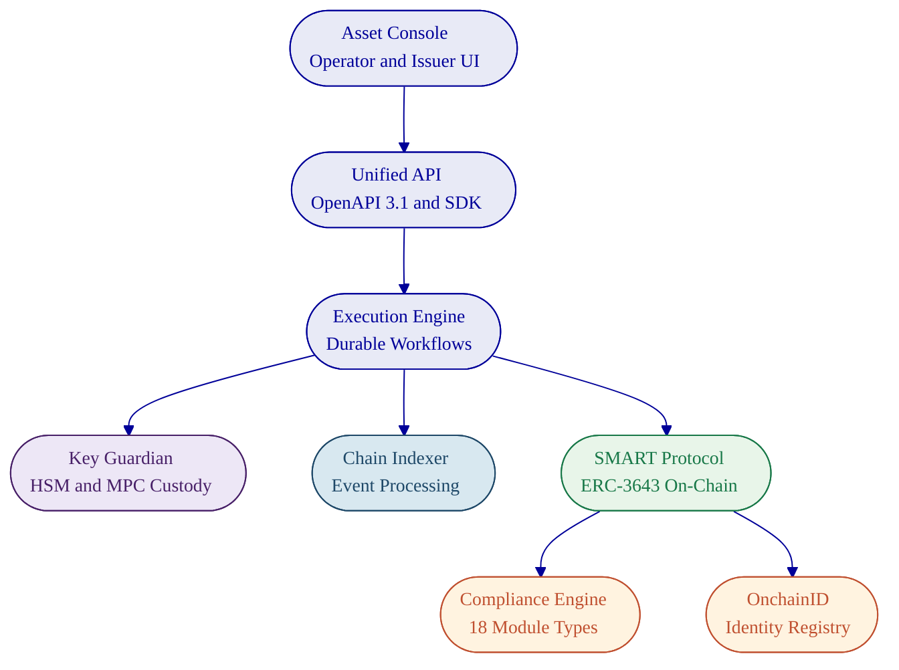
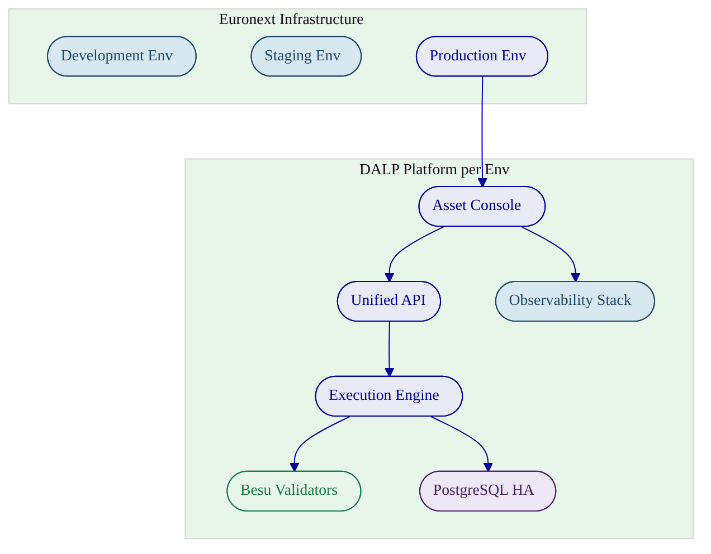

# Technical Proposal: Digital Securities Listing Platform

---

## Executive Summary

### Client Need and Proposed Response

Euronext requires a production-grade digital securities listing platform that can operate within its existing pan-European exchange infrastructure while meeting the governance, compliance, and operational standards that regulated market infrastructure demands. The platform must support participant admission, instrument lifecycle management, compliance enforcement across multiple jurisdictions, and integration with incumbent systems for settlement, custody, market data, and supervisory reporting. It must do all of this under institutional change control, with full audit trails and segregation of duties.

SettleMint proposes its Digital Asset Lifecycle Platform (DALP) as the foundation for this capability. DALP is a configurable platform, not a consulting engagement or custom development project, that provides production-ready infrastructure for designing, issuing, managing, and retiring tokenized securities. It covers the full instrument lifecycle from listing through servicing to redemption, with compliance enforcement built into every transaction at the smart contract level via the ERC-3643 standard.

The recommended deployment model is private cloud within Euronext's existing infrastructure, giving Euronext full control over data residency, network segmentation, and security policies while benefiting from DALP's Helm-based deployment automation and pre-built operational tooling. For the initial scope, SettleMint proposes a phased delivery targeting bonds and equities as the first instrument classes, with a 19-week implementation timeline from mobilisation to the end of hypercare.

### Why SettleMint and DALP

SettleMint is purpose-built for this category of engagement. The company has operated in enterprise blockchain infrastructure since 2016, with seven or more years of continuous production deployments at regulated banks in Asia and Europe. It holds ISO 27001 and SOC 2 Type II certifications, has passed security reviews and vendor risk assessments at tier-1 financial institutions, and operates sovereign-scale programmes in the Middle East, including a country-scale real estate registry in Saudi Arabia.

DALP addresses the core challenge that Euronext's RFP identifies: the gap between tokenisation technology being accessible and institutional-grade implementation being production-ready. Most platforms in this market stop at issuance or focus narrowly on custody. DALP covers the complete lifecycle, from asset design and primary issuance through compliant transfers, corporate actions, yield distribution, redemption, and retirement, within a single governed platform. Compliance is enforced ex-ante at the smart contract level, meaning transfer restrictions are validated before execution, not reviewed after. Every action is recorded in an immutable on-chain audit trail.

For Euronext specifically, DALP's multi-jurisdictional compliance library (covering MiCA, MiFID II, MAS, FCA, Japan FSA, and US SEC frameworks), its five-role access control model with separation of duties, and its API-first architecture for integration with existing market infrastructure make it a strong technical and operational fit.

### Response Snapshot

| Dimension | SettleMint Response |
| --- | --- |
| Platform | DALP, Digital Asset Lifecycle Platform |
| Deployment model | Private cloud (Euronext-managed infrastructure) |
| Instrument coverage | Bonds, equities, funds, deposits (expandable) |
| Compliance standard | ERC-3643 with 18 configurable compliance modules |
| Settlement | Atomic DvP/XvP with T+0 finality |
| Implementation timeline | 19 weeks (5 phases, gated) |
| Support tier | Enterprise (24/7, 99.99% uptime SLA) |
| Certifications | ISO 27001, SOC 2 Type II |

---

## About SettleMint

SettleMint is a production-grade digital asset lifecycle management company headquartered in Leuven, Belgium. Founded in 2016, the company has spent nearly a decade building blockchain infrastructure for regulated financial institutions, market infrastructure providers, and sovereign entities.

This is not a startup entering the market on the back of a tokenisation trend. SettleMint has built its platform through sustained production experience: multi-year live deployments with regulated banks, high-volume transactional flows in payments and settlements, and sovereign-scale programmes requiring the kind of governance discipline that Euronext demands.

The company holds ISO 27001 and SOC 2 Type II certifications, confirming that security controls are not only designed but independently audited and continuously maintained. SettleMint has successfully completed vendor risk assessments at tier-1 and tier-2 financial institutions and maintains the professional indemnity, cyber risk, and liability insurance coverage appropriate for enterprise technology providers serving critical financial infrastructure.

| Proof Point | Evidence |
| --- | --- |
| Operational history | 10 years building enterprise blockchain infrastructure |
| Production deployments | 7+ years continuous operation at regulated banks |
| Sovereign programmes | Country-scale initiatives in the Middle East |
| Asset coverage | Bonds, equities, deposits, stablecoins, funds, real estate, precious metals |
| Certifications | ISO 27001, SOC 2 Type II |
| Geographic presence | Europe (HQ Belgium), Middle East, Asia-Pacific |

SettleMint's leadership combines technical depth, financial domain knowledge, and enterprise delivery experience. The CTO and co-founder, Roderik van der Veer, oversees all platform architecture and engineering. The CEO, Adam Popat, brings a background spanning Standard Chartered, SC Ventures, and capital markets. The engineering team operates as a focused unit of four senior engineers responsible for the full DALP stack, a deliberate design choice enabling architectural coherence and rapid iteration without the coordination overhead of large distributed teams.

---

## About DALP

DALP (Digital Asset Lifecycle Platform) is SettleMint's configurable platform for designing, launching, and operating tokenised assets across financial instruments and real-world assets. It provides production-ready infrastructure from day one, covering the complete digital asset lifecycle from asset design through issuance, compliance enforcement, custody integration, settlement, servicing, and retirement, all within a single governance model, security posture, and operating framework.

The platform is built on a four-layer architecture with clear responsibility boundaries at each level:

| Layer | Responsibility |
| --- | --- |
| Application | Operator, issuer, and compliance officer interfaces (Asset Console) |
| API | Programmatic access surface for external systems (OpenAPI 3.1, TypeScript SDK) |
| Middleware | Workflow orchestration, transaction lifecycle, key management, indexing |
| Smart Contract | On-chain enforcement of compliance, identity, and asset logic (SMART Protocol, ERC-3643) |

Requests flow top-down through these layers. A user action in the Asset Console triggers an API call, which the middleware orchestrates into blockchain transactions, which the smart contract layer validates and executes on-chain. Each layer independently enforces its own security controls, so no single-layer failure grants unauthorised access.

DALP supports seven asset classes with purpose-built lifecycle logic (bonds, equities, funds, deposits, stablecoins, real estate, precious metals) plus a configurable token type for novel instrument classes. For Euronext's digital securities listing programme, the bond and equity templates are the primary starting point, with funds and deposits available for expansion.

Compliance enforcement is the architectural foundation, not an application-layer add-on. DALP implements the ERC-3643 standard with 18 configurable compliance modules covering identity verification, country restrictions, investor count limits, holding periods, transfer approvals, supply caps, and collateral requirements. Every transfer must pass through the compliance engine before execution. This is a fail-closed design: the default is denial unless all active modules explicitly approve.

---

## Customer References

| Client | Use Case | Geography | Relevance to Euronext |
| --- | --- | --- | --- |
| Commerzbank | Hybrid on/off-chain ETP issuance; Boerse Stuttgart listing; settlement under 10 seconds | Germany | Exchange-listed digital instruments, near real-time settlement |
| Standard Chartered Bank | Digital Virtual Exchange; fractional tokenisation of securities; institutional trading | Asia, Africa, Middle East | Exchange venue for tokenised securities with custody integration |
| OCBC Bank | Security token engine; securitisation, tokenisation, fractionalization of off-chain assets | Singapore | Institutional asset tokenisation with order book management |
| KBC Securities (Bolero) | Equity crowdfunding; smart contracts for issuance, lifecycle, corporate actions, redemption | Belgium | European regulated issuance with full lifecycle automation |
| Sony Bank (Japan) | Stablecoin issuance with integrated digital identity; KYC-enabled Web3 banking | Japan | Regulated issuance with identity verification and compliance |
| Maybank (Project Photon) | FX tokenisation; Exchange-versus-Payment (XvP); atomic cross-currency swaps | Malaysia | Atomic settlement with cross-currency XvP mechanics |
| ADI, Finstreet | Tokenised equity on Abu Dhabi mainnet; corporate actions, ERC20Votes, DFNS custody | UAE/GCC | Equity lifecycle with institutional custody integration |
| Saudi RER | Country-scale real estate tokenisation; registry-as-truth; integration with government systems | Saudi Arabia | Sovereign-scale platform integration with existing registries |
| Mizuho Bank | Bond tokenisation and trade finance; standard platform capabilities | Japan | Fixed income tokenisation for tier-1 bank |
| State Bank of India | CBDC infrastructure; pilot successful, production deployment in progress | India | National-scale digital currency infrastructure |
| Reserve Bank of India | Multi-bank letter of credit trade finance; multi-node, multi-cloud blockchain | India | Multi-party, multi-institution workflow on shared infrastructure |
| Islamic Development Bank | Sharia-compliant subsidy distribution across 57 member countries | Multi-country | Cross-border, multi-jurisdiction digital asset distribution |
| IsDB (market stabilisation) | Automated market stabilisation; smart contracts regulating collateral volatility | Multi-country | Algorithmic stability controls for regulated instruments |
| KBC Insurance | NFTs as digital product passports for insured asset valuation and claims | Belgium | Digital record keeping with evidentiary integrity |

The Commerzbank engagement is particularly relevant to Euronext's requirements. It involved a hybrid on-chain/off-chain solution for issuing and managing exchange-traded products (ETPs), integrated with Boerse Stuttgart's listing service and Commerzbank's issuance engine. Trades were cleared and settled in near real time, with settlement completing in under 10 seconds. The model identified potential annual savings of EUR 7 million. This engagement demonstrates SettleMint's ability to integrate with existing exchange infrastructure while delivering production-grade tokenised instrument management.

---

## Solution Overview

### Requirement Themes

Euronext's RFP articulates five dominant evaluation concerns that structure the proposed operating model:

1. **Institutional control and governance**: segregation of duties, transparent approvals, auditable operator actions, and maker-checker workflows across all sensitive operations
2. **Regulatory alignment**: demonstrable compliance with MiFID II/MiFIR, Prospectus Regulation, DORA, GDPR, AMLD, and MiCA, with evidence generation built into the platform rather than bolted on
3. **Operational resilience**: tested recovery, failover, deterministic error handling, and evidence controls that work under stress, not only during normal operations
4. **Integration with incumbent infrastructure**: interface design that connects to existing listing workflows, settlement systems, custody platforms, market data distribution, and supervisory reporting
5. **Lifecycle completeness**: participant admission, listing governance, issuance, compliance-checked transfers, corporate actions, redemption, and retirement in a single governed platform

### Proposed Operating Model

The proposed operating model positions DALP as the digital securities lifecycle engine within Euronext's existing exchange infrastructure. DALP handles instrument creation, compliance enforcement, participant entitlement management, corporate action execution, and audit trail generation. Euronext retains full ownership of policy decisions, regulatory accountability, and integration with its incumbent systems.

Key actors in the operating model:

- **Euronext Operations**: platform administration, venue state management, participant oversight, and incident response
- **Issuers**: instrument configuration, issuance requests, corporate action initiation, and disclosure management
- **Members and Market Makers**: participant onboarding, entitlement management, and transfer execution
- **Compliance Officers**: compliance module configuration, identity verification oversight, and regulatory reporting
- **SettleMint**: platform support, release management, and architecture advisory

The deployment runs on Euronext's private cloud infrastructure (Kubernetes-based), with DALP's Helm chart deployment model providing repeatable, auditable environment provisioning across development, staging, and production.

### Core Capability Response

**Asset and Lifecycle Control.** DALP manages the full instrument lifecycle from creation through retirement. Bonds, equities, and funds each have purpose-built factory contracts with asset-class-specific validation rules, configurable parameters, and lifecycle events. The Asset Designer wizard guides operators through a multi-step configuration process covering instrument details (including ISIN), compliance module selection, pricing and valuation, and permission assignment. Tokens are deployed through an atomic factory pattern using CREATE2 deterministic addressing, meaning token addresses are predictable before deployment, enabling pre-configuration of external systems. New tokens start in a paused state by default, giving the compliance team time to verify configuration before the instrument goes live. Post-issuance, DALP handles minting, compliant transfers, yield distribution, maturity redemption, freeze/unfreeze operations, and orderly retirement through token burning.

**Identity and Compliance.** DALP enforces compliance at the smart contract level through the ERC-3643 standard. Every transfer must pass through a modular compliance engine before execution. The platform ships with pre-built compliance templates for MiCA EU, MAS Singapore, Japan FSA, UK FCA, and US SEC frameworks, each configurable to Euronext's specific requirements. The expression builder allows compliance teams to construct complex eligibility rules using boolean logic (AND, OR, NOT) across verification topics including KYC, AML, accredited investor status, asset classification, and jurisdictional eligibility. Identity management is handled through OnchainID, which stores verifiable claims on-chain. Once an investor's identity is verified, it is reusable across all tokens in the system without per-token re-verification.

**Settlement and Custody.** DALP provides atomic Delivery-versus-Payment (DvP) and Exchange-versus-Payment (XvP) settlement where asset and cash legs complete together or revert together, achieving T+0 finality with no counterparty risk. The XvP engine supports both local (same-chain) and HTLC (cross-chain) settlement models. Custody is handled through a bring-your-own-custodian model with integrations for institutional-grade MPC custody providers (DFNS, Fireblocks) alongside HSM and cloud KMS options. DALP orchestrates custody policy; it does not act as a custodian itself.

**Integration and Reporting.** DALP is API-first by design. The Unified API exposes all platform capabilities through an OpenAPI 3.1 specification, with a TypeScript SDK for programmatic integration. Event-driven notifications via webhooks provide real-time updates on transaction confirmations, compliance state changes, and asset lifecycle events. ISO 20022 message format support enables connectivity with SWIFT, SEPA, and RTGS payment rails for cash-leg settlement. Every action generates structured audit data, with comprehensive logging across authentication events, authorisation decisions, data access, configuration changes, and administrative actions.

### Fit Table

| Requirement Area | DALP Response | Status |
| --- | --- | --- |
| Participant onboarding and entitlements (TR-001) | Five-role RBAC with on-chain enforcement, OnchainID for identity, configurable entitlements per asset | Comply |
| Listing workflow and disclosure (TR-006, TR-011) | Asset Designer wizard with multi-step validation, document versioning, ISIN capture | Comply |
| Compliance enforcement (TR-014) | ERC-3643 with 18 configurable modules, pre-built MiCA/MiFID II templates | Comply |
| Corporate actions and yield (TR-015) | Automated yield schedules, maturity redemption, dividend distribution | Comply |
| Role segregation (TR-016) | Five per-asset roles (admin, governance, supply, custodian, emergency) plus nine system roles | Comply |
| Audit trails and evidence (TR-017, TR-023) | Immutable on-chain event logs, structured off-chain audit trails, evidence-grade timestamping | Comply |
| Observability (TR-025) | Three-pillar stack (metrics, logs, traces) with 21 pre-built Grafana dashboards | Comply |
| Disaster recovery (TR-027) | Multi-AZ deployment, Velero backup, documented RTO/RPO per deployment pattern | Comply |
| Secure API access (TR-028) | OAuth 2.0/OIDC, SAML 2.0, scoped API keys with rate limiting, wallet verification for writes | Comply |
| Market data distribution (TR-008) | Feeds system with configurable sources, real-time SSE streaming | Partially comply |
| Trading sessions and venue state (TR-002) | Pause/unpause controls, circuit breaker via Emergency role; market model configuration requires adaptation | Partially comply |
| Market surveillance feeds (TR-003) | Structured event data, webhook integration for SIEM; native surveillance alerting requires integration | Partially comply |
| Order sequencing and determinism (TR-004) | Durable workflow orchestration with exactly-once semantics; deterministic nonce coordination | Comply |

Where DALP partially complies, the gap is clearly scoped. Market surveillance alerting, for example, is handled by exporting DALP's structured event data and audit logs to Euronext's existing surveillance infrastructure via SIEM integration and webhook feeds. DALP provides the evidence; Euronext's surveillance tools provide the analysis.

---

## Architecture Overview

DALP's architecture follows three design principles that align directly with Euronext's requirements for institutional control: single source of truth (the blockchain is authoritative for ownership, compliance, and identity state), atomic operations (multi-step workflows either complete fully or revert entirely), and defence in depth (five independent security control layers operate in series).

The four-layer stack separates concerns cleanly:

The **Application Layer** (Asset Console) provides the operational interface for asset lifecycle management, compliance workflows, portfolio views, and system monitoring. It supports internationalisation in four locales and uses arbitrary-precision arithmetic for financial calculations to avoid floating-point errors.

The **API Layer** (Unified API) exposes all platform capabilities through a type-safe, documented interface with OpenAPI 3.1 specifications generated directly from procedure definitions. Three authentication methods are supported: session-based (browser), API keys (system integration), and enterprise SSO (OIDC, SAML). Blockchain-writing operations additionally require wallet verification through PIN, TOTP, or backup codes.

The **Middleware Layer** orchestrates the operational complexity of blockchain interaction. The Execution Engine provides durable workflow orchestration with persistent state and exactly-once semantics, meaning workflows survive infrastructure failures, process restarts, and network partitions. The Key Guardian manages cryptographic key material through multiple storage backends (encrypted database, cloud KMS, HSM, DFNS, Fireblocks). The Chain Indexer processes blockchain events into queryable state projections.

The **Smart Contract Layer** implements the SMART Protocol (SettleMint Adaptable Regulated Token), an ERC-3643 implementation that enforces compliance at the protocol level. Every transfer passes through the modular compliance engine. Identity verification through OnchainID provides verifiable on-chain investor credentials.

For Euronext's deployment, DALP operates on a private EVM-compatible blockchain network (Hyperledger Besu with IBFT 2.0 or QBFT consensus), deployed within Euronext's infrastructure. This provides full control over data visibility, participant access, consensus parameters, and gas costs while maintaining the same smart contract architecture and tooling as public EVM networks.

---

## Security Overview

DALP treats security as a structural property, not a feature. The architecture enforces five independent control layers in series: identity verification, role-based access control, transaction-level wallet verification, on-chain compliance enforcement, and custody provider policy evaluation. No single-layer failure grants unauthorised access to digital assets.

**Authentication and Access Control.** DALP supports multiple authentication methods: email/password, passkeys (WebAuthn for phishing-resistant authentication), LDAP/Active Directory, OAuth 2.0/OIDC (Okta, Auth0, Azure AD), and SAML 2.0. API keys follow least-privilege principles with per-key permission scoping, rate limiting at 10,000 requests per 60-second window, and immediate revocation capability. All blockchain write operations require a dedicated second factor (wallet verification via PIN, TOTP, backup codes, or passkey), even with a valid authenticated session. There is no administrative override for wallet verification.

**Role-Based Access Control.** DALP implements a dual-layer permission model with 26 distinct roles across four levels: platform roles (3), system roles (9), per-asset roles (7), and system module roles (7). The on-chain AccessManager contract is the authoritative source for all role assignments. Role changes are reflected immediately through chain indexer event processing. Multi-tenant isolation is enforced at the database query level on every API request, preventing cross-tenant data access.

| Control Domain | Mechanism |
| --- | --- |
| Authentication | Passkeys, OIDC, SAML, LDAP, API keys |
| Authorisation | Dual-layer RBAC (26 roles), on-chain enforcement |
| Transaction signing | Wallet verification (PIN, TOTP, passkey, backup codes) |
| Compliance | ERC-3643 ex-ante enforcement, 18 module types |
| Custody | MPC (DFNS, Fireblocks), HSM, cloud KMS |
| Encryption | TLS in transit, application-level and provider-native at rest |
| Audit | Immutable on-chain events, structured off-chain logs, 7-year retention |

**Key Management and Custody.** The Key Guardian manages cryptographic keys through tiered storage backends: encrypted database (development), cloud secret manager (standard production), HSM with FIPS 140-2 Level 3 (regulated financial services), and third-party MPC custody (DFNS and Fireblocks for the highest security requirements). MPC custody ensures no single private key ever exists in one place. Key rotation, recovery, and revocation are managed through explicit procedures.

**Data Protection and Auditability.** All communication uses TLS. Database-managed keys are encrypted at application level. Object storage uses a dual-bucket model separating public assets from sensitive data. Audit trails capture every authentication event, authorisation decision, data access, configuration change, and administrative action. Logs are retained according to regulatory requirements, with tamper-evident storage ensuring integrity. DALP's structured audit logging integrates with SIEM tooling through OTLP export.

**Certifications and Testing.** SettleMint holds ISO 27001 and SOC 2 Type II certifications. Regular penetration testing and security assessments are conducted by independent third parties. The platform incorporates rate limiting with progressive lockout, input validation with schema enforcement, path traversal protection, HMAC-signed presigned URLs with constant-time comparison, and production safety checks that reject default development credentials at startup.

---

## Implementation Timeline

SettleMint follows a phase-gated implementation methodology refined through production deployments with regulated banks and market infrastructure providers. Each phase concludes with a formal gate review. Progression requires sign-off on defined deliverables and acceptance criteria.

| Phase | Objective | Duration | Key Outputs |
| --- | --- | --- | --- |
| Discovery and Requirements | Requirements capture, architecture design, regulatory mapping, integration scoping | 2 weeks | Validated requirements document, target architecture, regulatory compliance matrix, RACI |
| Foundation and Setup | Environment provisioning, Besu network configuration, identity framework, observability stack | 3 weeks | Functional dev/staging/production environments, blockchain network, monitoring baseline |
| Configuration and Compliance | Asset type configuration, MiCA/MiFID II compliance modules, listing workflow design | 4 weeks | Configured bond and equity templates, compliance rules tested against regulatory matrix |
| Integration and Testing | System integration with Euronext infrastructure, functional/security/performance/UAT testing | 4 weeks | Validated integrations, test evidence, go-live readiness assessment |
| Go-Live and Hypercare | Production deployment, data migration, 4-week intensive post-go-live support | 6 weeks | Production system, knowledge transfer, support transition |
| **Total** | | **19 weeks** | |

The timeline assumes a single deployment region, up to three asset classes, up to five external integrations, and client team availability per the RACI matrix. Additional asset classes, jurisdictions, or integrations extend the timeline proportionally. SettleMint provides adjusted estimates as part of scope refinement during Phase 1.

Client dependencies that affect the timeline include: timely provision of infrastructure (Kubernetes cluster, database, networking), decision turnaround on compliance rules and integration ownership within five business days, and dedicated personnel for UAT across business, operations, compliance, and technology tracks.

---

## Deployment

The recommended deployment model for Euronext is **private cloud**: DALP deployed within Euronext's own cloud or data centre infrastructure, managed by Euronext's operations team, with SettleMint providing Helm chart deployment artefacts, configuration guidance, and ongoing platform support.

This model gives Euronext full control over network configuration, security policies, data residency, and access management, while benefiting from DALP's deployment automation and operational tooling. All four deployment models (managed SaaS, private cloud, on-premises, hybrid) deliver the same platform capabilities.

| Deployment Aspect | Specification |
| --- | --- |
| Orchestration | Kubernetes 1.27+ or OpenShift 4.14+ |
| Database | Managed PostgreSQL 17.x with multi-AZ HA |
| Cache | Redis 8.x with TLS, persistence enabled |
| Object storage | S3-compatible with versioning and lifecycle policies |
| Blockchain network | Hyperledger Besu (4 validators, 2 RPC nodes, IBFT 2.0/QBFT) |
| Secrets management | HSM for production key management |
| Observability | Grafana, VictoriaMetrics, Loki, Tempo (shipped as Helm charts) |
| Container images | Served via harbor.settlemint.com, mirrorable to private registry |
| Environments | Development, staging, production (logically segregated) |

DALP's Helm charts support infrastructure-as-code practices and integrate with standard CI/CD tooling (ArgoCD, Flux, Jenkins, GitLab CI). The DALP CLI provides 301 typed commands for operational automation within deployment pipelines. All containers run as non-root on OpenShift with the restricted-v2 Security Context Constraint.

High availability is achieved through multi-AZ Kubernetes node distribution (minimum three availability zones), pod disruption budgets for controlled rolling updates, database HA through managed service multi-AZ replication, and blockchain node redundancy through multiple validator and RPC nodes. The recommended cloud-native HA pattern provides an RTO of 2 to 15 minutes and RPO of seconds to 1 minute.

---

## Support and SLA

SettleMint recommends the **Enterprise** support tier for Euronext's deployment, providing 24/7/365 coverage with the response times and operational maturity expected for critical market infrastructure.

| Attribute | Enterprise Tier |
| --- | --- |
| Coverage | 24/7/365 |
| Uptime SLA | 99.99% monthly (~4.3 min max downtime) |
| P1 response | 15 minutes |
| P1 resolution | 2 hours |
| P2 response | 1 hour |
| P2 resolution | 4 hours |
| Support channels | Portal, email, dedicated Slack, phone, video escalation |
| Named contacts | Unlimited |
| Assigned team | Dedicated support team |
| Release cadence | Continuous delivery with staged rollout and client approval gate |
| Architecture reviews | Quarterly with Solution Architect |
| Business reviews | Bi-weekly |

| Severity | Classification | Go-Live Impact |
| --- | --- | --- |
| P1, Critical | Complete unavailability, compliance enforcement failure, settlement failure | Blocks operations |
| P2, High | Major function impaired, no acceptable workaround | Requires immediate attention |
| P3, Medium | Function impaired, workaround exists | Remediation timeline agreed |
| P4, Low | Minor issue, no operational impact | Post-release backlog |

Service credits apply when uptime falls below the contracted SLA: 10% of monthly support fees for uptime below target but at or above 99.0%, 25% for below 99.0% but at or above 98.0%, and 50% for below 98.0%. Escalation procedures include automatic escalation when P1 incidents are not resolved within target, and client-initiated escalation through four levels from designated support engineer to SettleMint executive management.

---

## Risk Register

| Risk | Impact | Mitigation | Owner |
| --- | --- | --- | --- |
| Integration complexity with Euronext incumbent systems | Phase 4 extension; integration on critical path | Integration design document in Phase 3 with dependency map and fallback strategies; mock interfaces where third-party systems unavailable; early engagement with Euronext system owners | Joint |
| Decision latency on compliance rules, custody policies, or integration ownership | Schedule slippage of 1.5x per week of delay | RACI matrix with named decision-makers and proxy authority; 5-day escalation trigger; weekly decision log | Euronext |
| Regulatory change during implementation | Configuration rework in Phase 3 or 4 | Compliance modules are configurable, not hard-coded; 18 module types and expression system absorb new requirements without architectural changes; regulatory buffer in Phase 3 | Joint |
| Infrastructure readiness (Kubernetes cluster, network, DNS, certificates) | Foundation phase blocked | Prerequisites checklist delivered in Phase 1 with deadlines; weekly tracking; managed cloud fallback available | Euronext |
| Third-party dependency (custody provider, identity provider response times) | Integration delay | Parallel workstreams for independent integration tracks; early provider engagement in Phase 1 | Joint |
| Key personnel changes | Knowledge loss, decision delays | All decisions documented with rationale; backup personnel in RACI; implementation documentation structured for mid-project onboarding | Joint |

---

## Project Implementation and Delivery

### Delivery Methodology

SettleMint uses a structured, phase-gated delivery methodology refined through production deployments with regulated banks, sovereign entities, and market infrastructure providers. Each phase has defined scope, measurable outcomes, entry and exit criteria, and a formal gate review involving key stakeholders from both SettleMint and Euronext. Progression to the next phase requires sign-off on defined deliverables.

The methodology is designed for institutional decision cycles. Regulated platform implementations do not fail because of technical difficulty; they stall because of decision latency around compliance rules, custody policies, and integration ownership. The delivery model accounts for this by front-loading stakeholder alignment, establishing clear decision authority through the RACI matrix, and building regulatory buffer into the configuration phase.

### Phase Objectives and Gates

**Phase 1: Discovery and Requirements (Weeks 1 to 2).** Structured sessions with Euronext's business sponsors, technology leadership, compliance and risk officers, and operations teams. Activities include current-state assessment of Euronext's systems landscape, regulatory mapping against MiFID II, MiCA, DORA, GDPR, and AMLD, and production of the target architecture document. Gate 1 requires validated requirements, approved architecture, and signed RACI matrix.

**Phase 2: Foundation and Setup (Weeks 3 to 5).** Provision three DALP environments (development, staging, production), configure the Hyperledger Besu network, establish the identity and access framework, set up key management and custody integration, and deploy the observability stack. Gate 2 requires all environments passing health checks, blockchain network operational, and identity framework functional.

**Phase 3: Configuration and Compliance (Weeks 6 to 9).** Configure bond and equity asset templates with Euronext-specific parameters, set up MiCA and MiFID II compliance modules with country restrictions and investor eligibility rules, establish trusted issuer configuration for KYC providers, and design operational workflows for issuance, transfer, and corporate actions. Gate 3 requires all asset types validated in staging and compliance modules tested against the regulatory matrix.

**Phase 4: Integration and Testing (Weeks 10 to 13).** Connect DALP to Euronext's existing systems (listing workflows, settlement, custody, market data, supervisory reporting), execute functional testing across all lifecycle events, conduct security testing (penetration testing, authorisation escalation, smart contract review), run performance testing under representative and peak conditions, and complete user acceptance testing with designated Euronext stakeholders. Gate 4 requires 100% pass rate on P1/P2 test scenarios, security assessment completed with no unmitigated critical findings, and UAT sign-off.

**Phase 5: Go-Live and Hypercare (Weeks 14 to 19).** Production deployment with smoke testing, data migration with integrity validation, 48-hour dedicated go-live support, then four weeks of intensive hypercare covering monitoring, performance optimisation, knowledge transfer, and support transition.

### RACI Summary

| Activity Domain | SettleMint | Euronext |
| --- | --- | --- |
| Platform deployment and configuration | Responsible | Infrastructure provision |
| Architecture design | Accountable | Consulted, approved |
| Compliance module configuration | Responsible | Accountable (sign-off) |
| Integration implementation | Responsible | API access, credentials, test environments |
| Testing execution | Responsible (functional, security, performance) | UAT participation, acceptance |
| Operational readiness | Responsible (training, documentation) | Operational ownership post-hypercare |

### Client Dependencies

Delays in the following areas are the primary source of schedule slippage in regulated platform deployments:

- Named decision-makers available for gate reviews; proxy authority established for absence periods
- Design decisions, configuration approvals, and compliance rule sign-offs within 5 business days
- Infrastructure resources provisioned per the Phase 1 prerequisites checklist
- API access, credentials, and test environments for Euronext systems identified during discovery
- Dedicated personnel for UAT across business, operations, compliance, and technology tracks

---

## Support Appendix

### Support Tier Comparison

| Capability | Standard (8x5) | Premium (12x7) | Enterprise (24x7) |
| --- | --- | --- | --- |
| Coverage hours | 09:00 to 18:00 CET, Mon to Fri | 07:00 to 22:00 CET, Mon to Fri; P1 on-call weekends | 24/7/365 |
| P1 response | 4 hours | 1 hour | 15 minutes |
| P1 resolution | 8 hours | 4 hours | 2 hours |
| Named contacts | Up to 3 | Up to 8 | Unlimited |
| Support channels | Email, portal | Email, portal, Slack, phone | Email, portal, Slack, phone, video |
| Assigned engineer | Shared pool | Designated | Dedicated team |
| Release cadence | Quarterly | Monthly | Continuous with staged rollout |
| Uptime SLA | 99.9% | 99.95% | 99.99% |
| Business reviews | Quarterly | Monthly | Bi-weekly |
| Architecture reviews | None | None | Quarterly |

### Severity Definitions and Response Targets

| Severity | Description | Enterprise Response | Enterprise Resolution |
| --- | --- | --- | --- |
| P1, Critical | Platform unavailable, compliance enforcement failure, settlement failure | 15 minutes | 2 hours |
| P2, High | Major function impaired, no workaround | 1 hour | 4 hours |
| P3, Medium | Function impaired, workaround exists | 4 hours | 2 business days |
| P4, Low | Minor issue, no operational impact | 1 business day | 3 business days |

### Maintenance and Update Policy

Scheduled maintenance uses a standard window (Saturdays 02:00 to 06:00 CET or Euronext-agreed alternative) with minimum 5 business days notice for standard maintenance and 10 business days for major upgrades. Emergency maintenance for critical security patches or compliance-impacting fixes may occur outside standard windows with maximum practical advance notice. Security patches are applied on an accelerated timeline. Compliance module updates are coordinated with Euronext's compliance team and include regulatory impact assessment.

### Incident Management Process

Incidents follow a six-step process: report (via authorised channel), acknowledge (within response target), triage and diagnose, resolve or workaround (within resolution target), post-mortem (for P1/P2, within 5 business days, covering timeline, root cause, remediation, and preventive measures), and close (after Euronext confirmation). All incidents are retained in the support portal for audit and trend analysis. Monthly incident reviews analyse trends and resolution effectiveness. Quarterly service reviews cover SLA performance, platform health, and optimisation recommendations.

---

## Writer's Checklist

- Headings unnumbered: verified
- Deployment model consistent throughout: private cloud (Euronext-managed)
- All claims source-backed from DALP documentation and content sections
- No unsupported metrics or roadmap items presented as current capability
- Tables concise and Word-compatible (maximum 8 rows)
- References selected for relevance to exchange/market infrastructure context
- Screenshots selected for relevance: dashboard, compliance templates, MiCA detail, asset designer compliance, XvP settlement, API monitoring, blockchain monitoring
- Tone: evidence-led, non-promotional, precise
- No em dashes, no AI-tell words, active voice throughout
- Core positioning ("Complexity of Doing It Right") present in executive summary
- Partially-comply items explicitly scoped with gap description and mitigation
