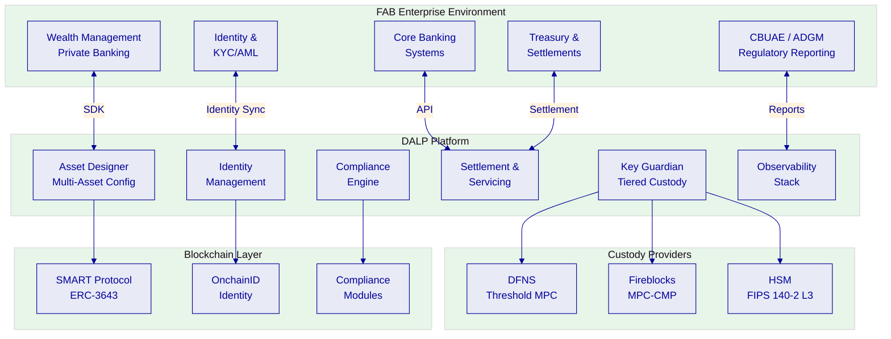
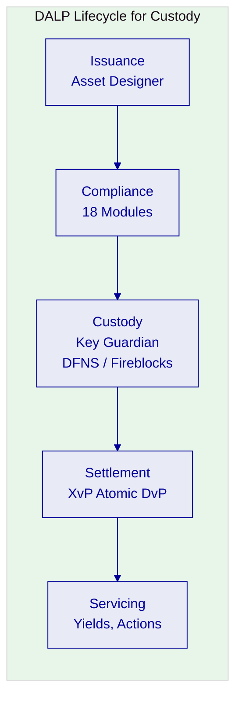
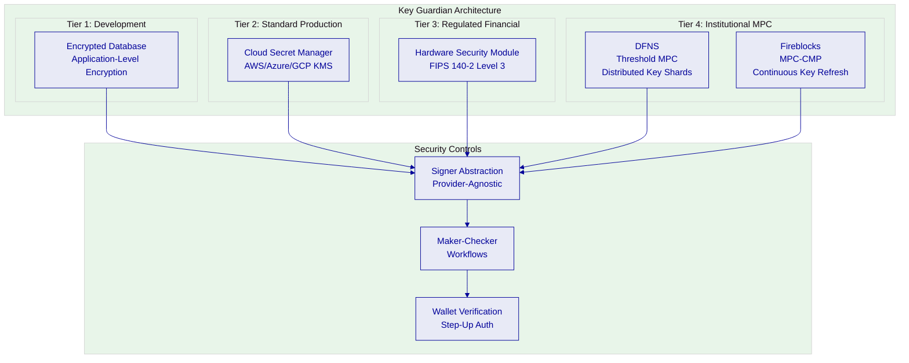
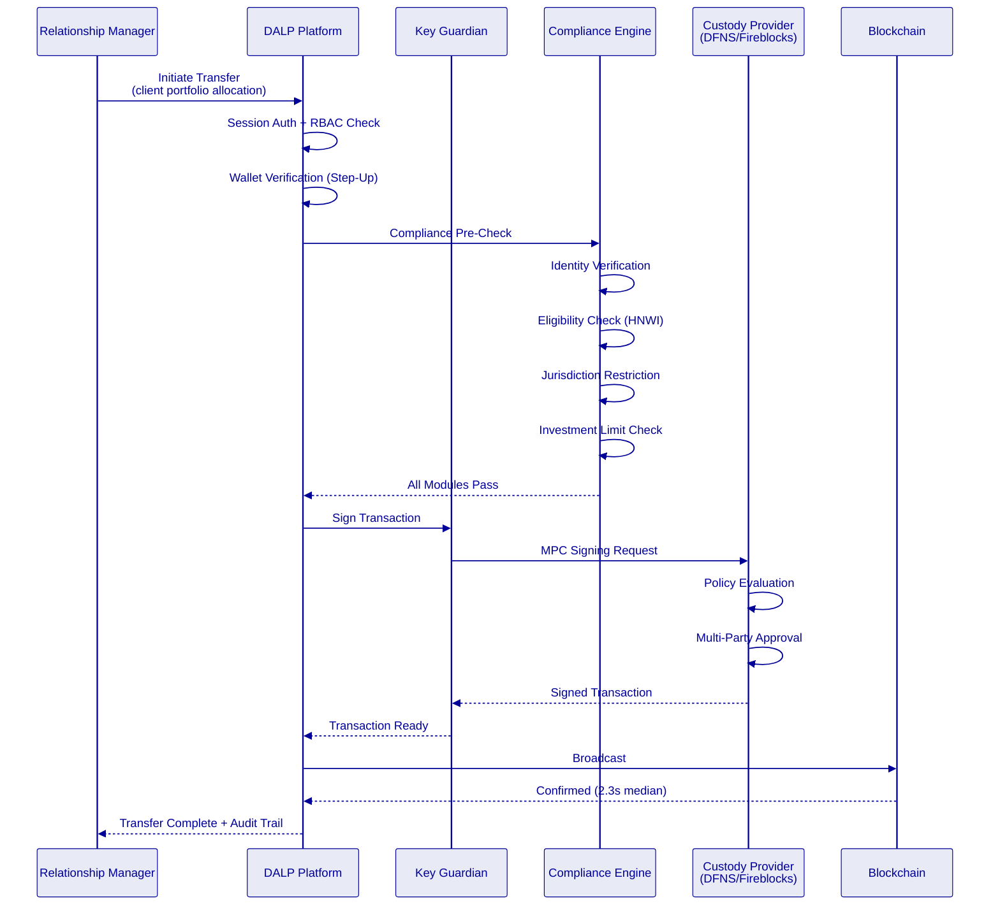
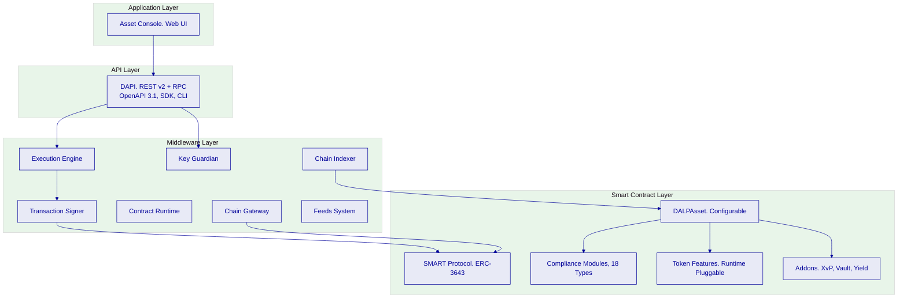
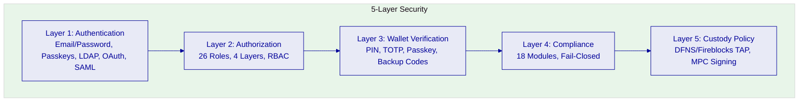
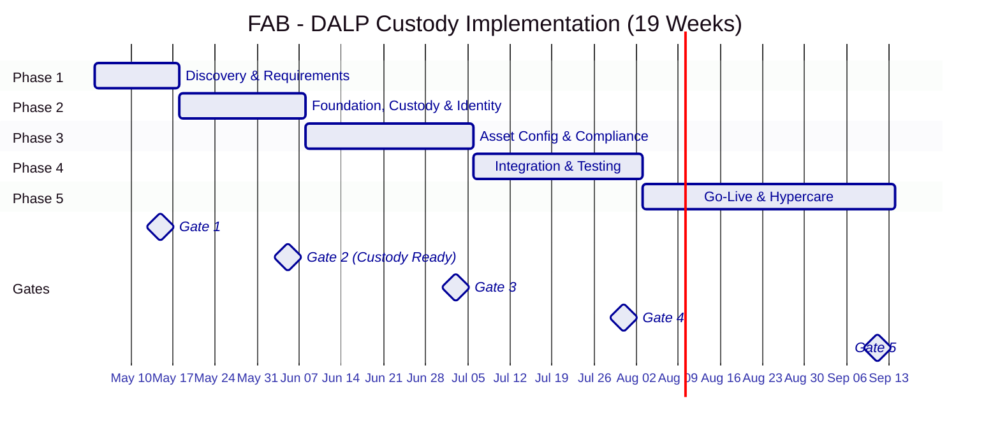

# Technical Proposal: Digital Asset Custody for Institutional and Private Banking Distribution

| Field | Value |
|---|---|
| Proposal title | Technical Proposal. Digital Asset Custody for Institutional and Private Banking Distribution |
| Client | First Abu Dhabi Bank |
| Submitted by | SettleMint NV |
| Date | March 2026 |
| Version | v1.0 |
| Confidentiality | Restricted |
| RFP Reference | FIRST-ABU-DHABI-BANK-RFP-DIGITAL-ASSET-CUSTODY-202603 |
| Primary contact | Adam Popat, CEO |

---

## Table of Contents

- Executive Summary
- About SettleMint
- About DALP
- Understanding FAB's Programme Objectives
- Customer References
- Proposed Solution and Functional Capabilities
- Technical Architecture
- Smart Contract Architecture for Custody Operations
- Identity, Compliance, and Regulatory Controls
- Key Management and Custody Architecture
- Settlement, Servicing, and Lifecycle Management
- Integration Architecture
- Security, Resilience, and Operational Assurance
- Implementation Approach and Delivery Phases
- Deployment Model
- Training and Knowledge Transfer
- Support and SLA
- Risk Management
- Current Coverage, Dependencies, and Qualified Gaps
- Compliance Matrix
- Appendices

---

## Executive Summary

First Abu Dhabi Bank has identified digital asset custody for institutional and private banking distribution as a business-critical capability requiring production-grade discipline. This is a procurement to determine whether the market can supply a dependable platform and implementation model for custody operations that meet the bank's control environment standards, business ownership, architecture standards, security review, legal interpretation, compliance sign-off, and internal audit expectations.

SettleMint's Digital Asset Lifecycle Platform (DALP) addresses this requirement through a custody-centric deployment model. DALP provides production-ready infrastructure for managing the full digital asset lifecycle, design, issuance, compliance enforcement, custody integration, settlement, and servicing, with the Key Guardian custody architecture providing tiered key management, institutional custody provider integration (DFNS, Fireblocks), and maker-checker workflows for all custody operations.

**Why DALP fits First Abu Dhabi Bank's requirements:**

- **Institutional custody architecture.** Key Guardian provides defense-in-depth key management with four storage tiers: encrypted database (development), cloud secret manager (standard production), hardware security module (FIPS 140-2 Level 3 for regulated financial services), and third-party MPC custody (DFNS/Fireblocks for highest security). Maker-checker workflows, HSM integration, and wallet verification step-up authentication are native to the platform.

- **Private banking distribution capability.** DALP's identity and compliance infrastructure supports the eligibility management required for private banking distribution, investor accreditation verification, jurisdiction restrictions, minimum investment enforcement, and suitability controls. The compliance engine enforces these rules at the smart contract level before any transfer executes, ensuring that custody operations are inseparable from compliance operations.

- **Production-proven at institutional scale.** DALP processes digital assets across production deployments with regulated institutions including Standard Chartered Bank, Commerzbank (ETP issuance with settlement under 10 seconds and projected EUR 7M/year savings), OCBC Bank, State Bank of India, and the Islamic Development Bank. ADI Finstreet in Abu Dhabi uses DALP for tokenized equity issuance with institutional custody integration on ADI mainnet, directly demonstrating UAE market capability.

- **Enterprise integration, not isolation.** DALP connects to FAB's existing identity services, core banking, wealth management platforms, sanctions screening, regulatory reporting, and observability infrastructure through REST API v2 (OpenAPI 3.1), GraphQL, webhooks, TypeScript SDK, and CLI (301 commands across 26 command groups).

- **Control integrity from day one.** Every custody operation, key generation, signing, transfer authorization, settlement, produces a complete audit trail. Role-based access control with 26 distinct roles across four layers, wallet verification step-up authentication, and on-chain compliance enforcement ensure that no single-layer failure grants unauthorized access to digital assets.

The proposed implementation follows SettleMint's phase-gated methodology: 19 weeks from kickoff to hypercare completion with five formal gate reviews. The custody infrastructure, including Key Guardian deployment, custody provider integration, and identity framework, is operational by Week 5, enabling configuration and testing to begin with production-grade key management from the outset.

---

## About SettleMint

### Company Overview

SettleMint is the production-grade digital asset lifecycle management company for regulated financial markets and sovereign use cases. Founded in 2016 and headquartered in Leuven, Belgium, SettleMint has been building enterprise blockchain infrastructure for 10 years with 7+ years of continuous production deployments at regulated banks across Europe, the Middle East, and Asia-Pacific.

### Production Credentials

| Credential | Evidence |
|---|---|
| Continuous operation | Since 2016, 10 years |
| Production deployments | 14 institutional engagements, 7+ years continuous |
| Asset classes in production | Bonds, equities, deposits, stablecoins, real estate, funds, precious metals |
| Geographic coverage | Europe, Middle East, Asia-Pacific |
| Certifications | ISO 27001, SOC 2 Type II |
| Custody integrations | DFNS (threshold MPC), Fireblocks (MPC-CMP) |
| UAE presence | ADI Finstreet (Abu Dhabi), Saudi RER (KSA) |

### Relevance to First Abu Dhabi Bank

SettleMint's credentials map directly to FAB's custody and private banking evaluation:

- **Abu Dhabi market presence:** ADI Finstreet, tokenized equity issuance with institutional custody on ADI mainnet
- **Custody depth:** Integrated DFNS and Fireblocks with maker-checker workflows, HSM support
- **Tier-1 bank deployments:** Standard Chartered, Commerzbank, OCBC, SBI
- **Private banking distribution:** OCBC, security token engine targeting HNWIs with securitization and fractionalization

---

## About DALP

### Platform Overview

DALP (Digital Asset Lifecycle Platform) provides the infrastructure for institutions to design, launch, and operate digital assets at production scale. For First Abu Dhabi Bank's custody use case, DALP serves as both the lifecycle management platform and the custody orchestration layer, coordinating between FAB's business operations, compliance requirements, and institutional custody providers.

### Core Lifecycle Pillars

**Issuance.** The Asset Designer enables configuration of any supported asset class, bonds, equities, funds, deposits, stablecoins, real estate, precious metals, without custom development. For FAB's institutional and private banking distribution, the platform supports configuring investor eligibility rules, minimum investment thresholds, and distribution channel restrictions at the token level.

**Compliance.** Eighteen compliance module types enforce transfer and supply rules at the smart contract level. For custody operations, the identity verification, country restriction, investor count limit, and transfer approval modules ensure that only eligible investors hold assets, and all transfers pass through the compliance engine before execution.

**Custody.** Key Guardian provides tiered key management with the bring-your-own-custodian model. FAB selects the custody tier appropriate for each use case, from cloud-managed keys for development through to DFNS/Fireblocks MPC custody for production. Wallet verification step-up authentication ensures that no on-chain operation executes without proof of wallet control.

**Settlement.** XvP (Exchange versus Payment) provides atomic delivery-versus-payment settlement. Both legs of a trade execute in a single atomic transaction, deterministic finality under IBFT consensus, with median latency of 2.3 seconds.

**Servicing.** Full lifecycle servicing: yield distribution, maturity processing, corporate actions, and governance events, all flowing through the compliance engine.

### Key Guardian Custody Architecture

**DFNS integration:** Threshold MPC with distributed key shards. No single private key ever exists in one place. DFNS policy engine enforces transaction limits and multi-party approval before signing. Pending approvals surface through the DALP interface.

**Fireblocks integration:** MPC-CMP with continuous key refresh eliminates static key shares. Transaction Authorization Policy (TAP) enforces amount thresholds, whitelisted destinations, velocity limits, and multi-approver requirements.

**Signer abstraction:** The unified signer interface abstracts over all custody backends. Runtime capability detection allows the platform to select local or provider-delegated execution paths dynamically. Adding a new custody provider requires implementing the signer adapter, not changing platform workflows. This means FAB is never locked into a single custody vendor.

---

## Understanding FAB's Programme Objectives

### Client Context

First Abu Dhabi Bank's procurement centers on three core challenges:

**First, custody-grade security for digital assets.** FAB requires key management that meets institutional standards. FIPS-grade hardware security, multi-party computation, maker-checker authorization, and complete audit trails for every custody operation. The custody solution must be at least as secure as traditional securities custody infrastructure.

**Second, private banking distribution readiness.** The platform must support the eligibility management, suitability controls, and distribution channel governance required for serving institutional and high-net-worth private banking clients with digital asset products.

**Third, enterprise coexistence.** The custody platform must integrate with FAB's existing core banking, wealth management, identity management, and regulatory reporting infrastructure, not create an isolated system that requires manual reconciliation.

### Regulatory Context: UAE

FAB operates within the UAE's multi-regulator environment:

| Regulator/Framework | Relevant Requirements | DALP Coverage |
|---|---|---|
| CBUAE | Payment/stored value, prudential controls | Key management, operational resilience |
| ADGM FSMR | Custody services, digital assets | Custody provider integration, compliance modules |
| DFSA | Investment services (if DIFC-scoped) | Investor eligibility, transfer restrictions |
| UAE SCA | Securities regulation | Asset governance, distribution controls |
| UAE AML/CFT | Anti-money laundering | OnchainID with KYC claims, sanctions integration |
| CBUAE Cyber | Cyber resilience | Defense-in-depth, ISO 27001, SOC 2 Type II |

---

## Customer References

### Reference Fit for Custody

| Client | Relevance to FAB Custody | Geography |
|---|---|---|
| ADI Finstreet | Tokenized equity with institutional custody on ADI mainnet | Abu Dhabi |
| Standard Chartered | Digital Virtual Exchange, custody intermediary elimination | Asia, Africa, ME |
| OCBC Bank | Security token engine for HNWIs, securitization | Singapore |
| Commerzbank | ETP issuance, exchange-grade settlement | Germany |
| Sony Bank | Stablecoin with KYC-enabled digital identity | Japan |
| Saudi RER | Country-scale with institutional custody | KSA |
| Maybank Photon | Cross-border atomic settlement (XvP) | Malaysia |

### Expanded Reference: ADI Finstreet: Abu Dhabi

**Context.** ADI required tokenized equity issuance on ADI mainnet with institutional-grade custody integration, corporate actions (on-chain voting), and compliance enforcement.

**Solution.** DALP powers the tokenization and custody layer. Key Guardian integrates with the selected custody provider for institutional key management. On-chain voting is implemented through the ERC-5805 voting power feature. Compliance modules enforce investor eligibility and transfer restrictions.

**Outcomes.** Tokenized equity operational on ADI mainnet. Corporate actions (voting) executed on-chain. Institutional custody integrated.

**Transferability.** Directly applicable to FAB, same market (Abu Dhabi), same asset class focus (institutional distribution), same custody integration pattern.

### Expanded Reference: OCBC Bank: Security Token Engine

**Context.** OCBC required a security token engine for securitization, tokenization, and fractionalization of off-chain assets targeting high-net-worth investors. The platform needed to support multi-asset tokenization with investor eligibility enforcement.

**Solution.** DALP provides the token engine with configurable compliance modules for HNWI eligibility verification, jurisdiction restrictions, and transfer controls. The fractionalization model enables broader investor access while maintaining regulatory compliance.

**Outcomes.** Security token engine operational. HNWI targeting with compliance enforcement. Multi-asset tokenization capability.

**Transferability.** Directly relevant to FAB's private banking distribution objective, the HNWI targeting model, fractionalization capability, and compliance enforcement pattern are identical requirements.

---

## Proposed Solution and Functional Capabilities

### Solution Overview

The proposed solution deploys DALP as FAB's digital asset custody and distribution platform, covering:

1. **Institutional Custody Infrastructure:** Key Guardian with DFNS or Fireblocks integration, providing institutional-grade key management with maker-checker workflows and HSM support
2. **Asset Lifecycle Management:** Configuration, issuance, compliance enforcement, settlement, and servicing for digital assets distributed through institutional and private banking channels
3. **Distribution Channel Governance:** Compliance modules enforcing investor eligibility, suitability, jurisdiction restrictions, and distribution channel controls at the smart contract level

### Custody Operations Architecture

### Identity and Eligibility for Private Banking

| Investor Category | Identity Requirements | Compliance Modules |
|---|---|---|
| Institutional investors | OnchainID + institutional KYC | Identity verification, country allow list |
| HNWI private banking | OnchainID + accreditation claims | Identity verification, investor qualification |
| Qualified investors | OnchainID + qualification evidence | Identity verification, transfer approval |
| Retail (if applicable) | OnchainID + retail KYC | Full compliance stack including limits |

### Asset Classes for Distribution

| Asset Class | Distribution Channel | Custody Model | Key Features |
|---|---|---|---|
| Tokenized bonds | Institutional + private banking | DFNS/Fireblocks | Yield distribution, maturity redemption |
| Tokenized equities | Institutional + private banking | DFNS/Fireblocks | Voting (ERC-5805), corporate actions |
| Tokenized funds | Private banking | DFNS/Fireblocks | NAV tracking, subscription/redemption |
| Tokenized deposits | Institutional | DFNS/Fireblocks | Interest accrual, maturity processing |
| Real estate tokens | Private banking (HNWI) | DFNS/Fireblocks | Fractional ownership, yield |

### Functional Fit Matrix

| Req ID | Requirement Summary | Status | DALP Response |
|---|---|---|---|
| REQ-01 | Segregated environments (dev, test, UAT, DR, prod) | Full | Independent DALP instances per environment |
| REQ-02 | API-first interfaces with version governance | Full | DAPI REST v2, OpenAPI 3.1, SDK, CLI |
| REQ-03 | RBAC, segregation of duties, maker-checker | Full | 26 roles, 4 layers, wallet verification |
| REQ-04 | Configurable lifecycle, policy controls | Full | DALPAsset runtime configuration |
| REQ-05 | Third-party dependency disclosure | Full | Dependency register provided |
| REQ-06 | Resilience, recovery, backup, monitoring | Full | Multi-AZ, continuous backup, Grafana |
| REQ-07 | Phased implementation plan | Full | 19-week methodology |
| REQ-08 | Audit evidence extraction | Full | GraphQL, immutable on-chain evidence |
| REQ-09 | Institutional custody key management | Full | Key Guardian with DFNS/Fireblocks |
| REQ-10 | Private banking eligibility enforcement | Full | Compliance modules + OnchainID claims |
| REQ-11 | Wealth management system integration | Configurable | REST API integration during Phase 4 |

---

## Technical Architecture

### Layered Architecture

DALP follows a four-layer architecture with distinct responsibility boundaries:

**Application Layer:** Asset Console provides web-based operational interface for custody operations, compliance monitoring, identity management, and portfolio tracking.

**API Layer:** DAPI serves REST API v2 (API key authentication) for programmatic access and RPC endpoint (session authentication) for the web UI. OpenAPI 3.1 auto-generated specifications ensure documentation synchronization.

**Middleware Layer:** Seven services handle workflow orchestration, key management (Key Guardian), transaction signing, contract interaction, event indexing, multi-chain connectivity, and market data feeds. The Execution Engine provides durable workflow guarantees, critical for custody operations that must complete reliably.

**Smart Contract Layer:** SMART Protocol (ERC-3643) provides the on-chain foundation. DALPAsset offers runtime configurability. Eighteen compliance module types and runtime-pluggable token features cover all custody and distribution requirements.

### Data Architecture

| Data Domain | Storage | Purpose |
|---|---|---|
| On-chain state | Blockchain (Besu) | Token balances, compliance state, identity claims, permanent, immutable |
| Application state | PostgreSQL | Users, sessions, configurations, workflow state, backed up hourly |
| Indexed state | Chain Indexer → PostgreSQL | Queryable event history, analytics, reporting |
| Audit evidence | Blockchain + PostgreSQL | Transaction records, compliance decisions, custody events |
| Key material | Key Guardian (HSM/MPC) | Cryptographic keys, never stored in plaintext |

### Network Configuration

| Aspect | Recommendation for FAB |
|---|---|
| Consensus | IBFT 2.0 (deterministic finality) |
| Validators | 4 nodes (tolerates 1 Byzantine fault) |
| Block time | 2 seconds |
| Network | Permissioned (FAB-controlled) |

---

## Security, Resilience, and Operational Assurance

### Defense-in-Depth Security Model

No single-layer failure grants unauthorized access. This five-layer model is particularly critical for custody operations, where the consequence of a security breach is direct asset loss.

### Wallet Verification Detail

For custody operations, wallet verification provides the final security gate:

| Method | Description | FAB Use Case |
|---|---|---|
| PIN | 6-digit code | Standard custody operations |
| TOTP | Time-based OTP (RFC 6238) | Enhanced security transactions |
| Backup codes | One-time recovery codes | Emergency access |
| Passkey | WebAuthn hardware key / biometric | Treasury and high-value operations |

If wallet verification fails: request rejected immediately, no gas consumed, no custody provider interaction, no state change. No administrative override exists.

### Certifications

| Certification | Status |
|---|---|
| ISO 27001 | Current |
| SOC 2 Type II | Current |
| Smart contract audits | Completed (third-party) |

---

## Implementation Approach and Delivery Phases

### 19-Week Implementation Timeline

**Phase 1 (Weeks 1–2):** Discovery, stakeholder interviews, custody provider selection (DFNS vs. Fireblocks), regulatory mapping, architecture design
**Phase 2 (Weeks 3–5):** Foundation, environment provisioning, Besu network deployment, Key Guardian + custody provider integration, identity framework
**Phase 3 (Weeks 6–9):** Configuration, asset class setup, compliance module binding, settlement workflows, distribution channel configuration
**Phase 4 (Weeks 10–13):** Integration, core banking, wealth management, KYC/AML, security testing, UAT
**Phase 5 (Weeks 14–19):** Go-live + hypercare, production deployment, knowledge transfer, support transition

### Resource Model

| Role | Allocation |
|---|---|
| Delivery Lead | Full-time (19 weeks) |
| Solution Architect | Full-time (Weeks 1–13), on-call (14–19) |
| Platform Engineer | Full-time (Weeks 3–17) |
| Integration Engineer | Full-time (Weeks 6–13) |
| QA Engineer | Full-time (Weeks 10–15) |

**Estimated FAB effort: 75 person-days**

---

## Deployment Model

### Recommended: Dedicated Cloud (UAE-Resident)

| Aspect | Configuration |
|---|---|
| Model | Dedicated cloud |
| Region | AWS Bahrain or Azure UAE North |
| Data residency | UAE compliant |
| Blockchain | 4-node Hyperledger Besu (IBFT 2.0) |
| Database | Multi-AZ PostgreSQL |
| Custody | DFNS or Fireblocks (selected in Phase 1) |

---

## Support and SLA

### Recommended: Premium Support

| Aspect | Premium for FAB |
|---|---|
| Coverage | 16×5 (Sunday–Thursday UAE) |
| P1 response | 2 hours |
| P2 response | 4 hours |
| Uptime SLA | 99.95% monthly |
| Dedicated engineer | Yes |

---

## Risk Management

| ID | Risk | L | I | Mitigation |
|---|---|---|---|---|
| R1 | Custody provider onboarding delay | 2 | 4 | Early engagement Phase 1; platform signer fallback |
| R2 | Regulatory changes | 3 | 4 | Configurable compliance; quarterly review |
| R3 | Wealth management integration complexity | 3 | 3 | Phase 1 deep discovery; modular integration |
| R4 | Security review timeline | 3 | 3 | Pre-share certifications; incremental testing |
| R5 | Client resource availability | 3 | 3 | Upfront effort estimates; escalation path |

---

## Current Coverage, Dependencies, and Qualified Gaps

| Gap | Current State | Mitigation | Timeline |
|---|---|---|---|
| SWIFT ISO 20022 | Middleware layer available | Two clients deployed successfully | Native Q3 2026 |
| Wealth management API | REST API available | Integration during Phase 4 | Implementation |
| ADGM-specific templates | Configurable engine | Created during Phase 3 | Implementation |

---

## Compliance Matrix

| Req ID | Requirement | Status | DALP Response |
|---|---|---|---|
| REQ-01 | Segregated environments | Full | Independent instances per environment |
| REQ-02 | API-first interfaces | Full | DAPI, SDK, CLI, webhooks |
| REQ-03 | RBAC, maker-checker, audit | Full | 26 roles, wallet verification, immutable trail |
| REQ-04 | Configurable lifecycle | Full | DALPAsset runtime config |
| REQ-05 | Dependency disclosure | Full | Register provided |
| REQ-06 | Resilience and monitoring | Full | Multi-AZ, Grafana, alerting |
| REQ-07 | Phased implementation | Full | 19-week methodology |
| REQ-08 | Audit evidence | Full | On-chain + off-chain evidence |
| REQ-09 | Institutional custody | Full | Key Guardian + DFNS/Fireblocks |
| REQ-10 | Private banking eligibility | Full | Compliance modules + OnchainID |
| REQ-11 | WM system integration | Configurable | Phase 4 integration |

---

## Appendices

### Glossary

| Term | Definition |
|---|---|
| DALP | Digital Asset Lifecycle Platform |
| Key Guardian | DALP's tiered key management service |
| SMART Protocol | SettleMint Adaptable Regulated Token (ERC-3643) |
| DALPAsset | Configurable token contract |
| OnchainID | On-chain identity (ERC-734/735) |
| XvP | Exchange versus Payment (atomic settlement) |
| MPC | Multi-Party Computation (custody) |
| IBFT | Istanbul Byzantine Fault Tolerant (consensus) |
