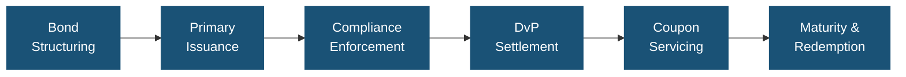
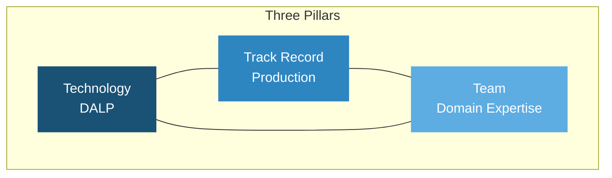
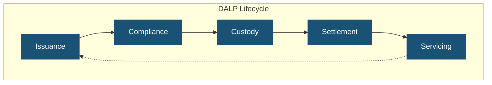
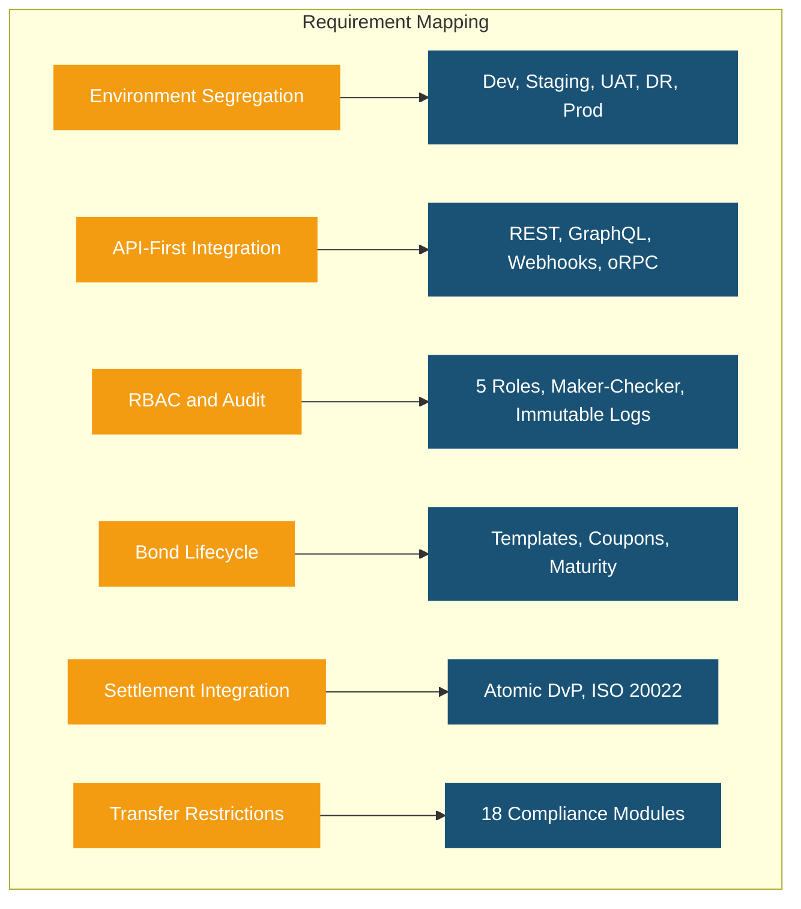
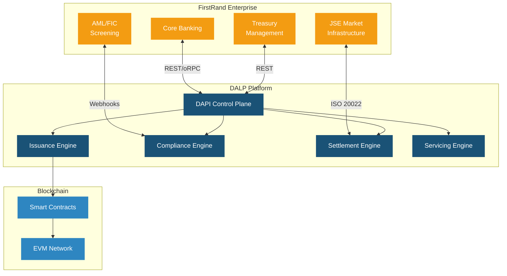
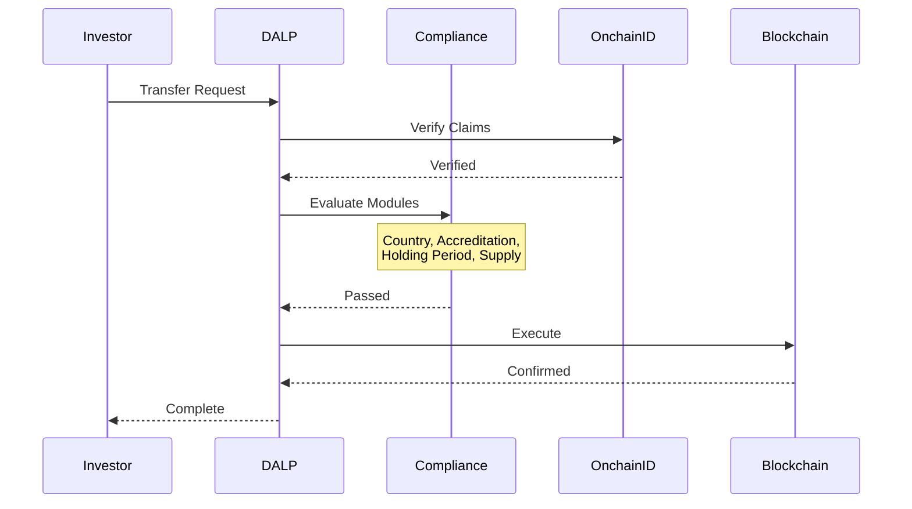
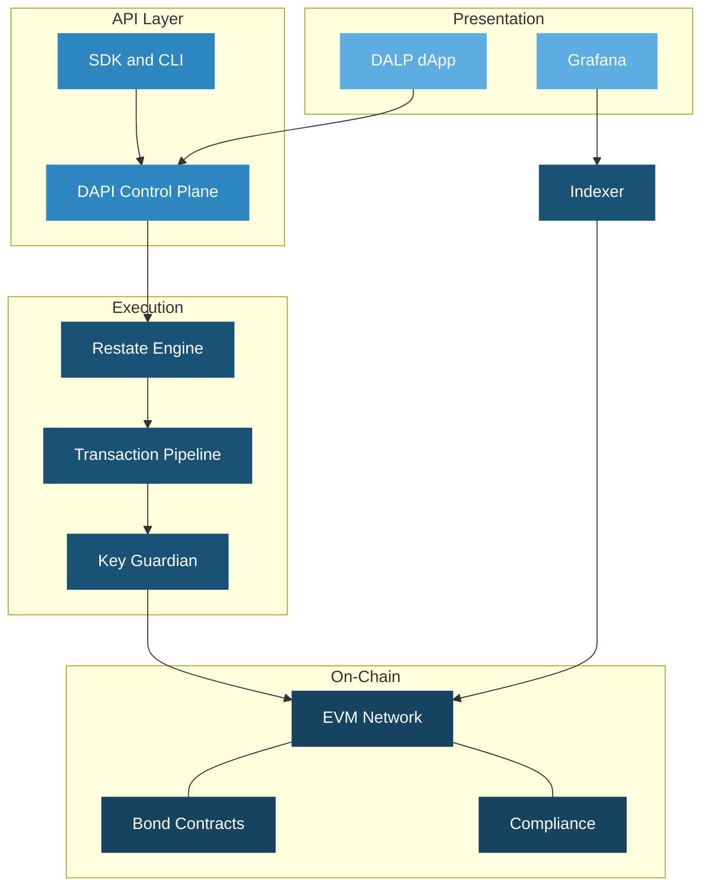
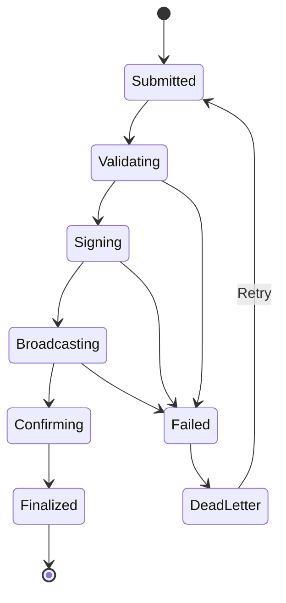
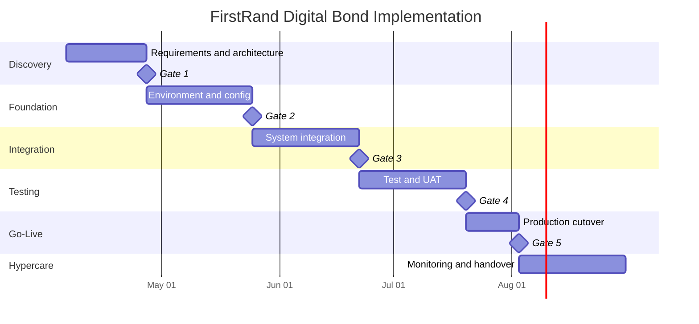
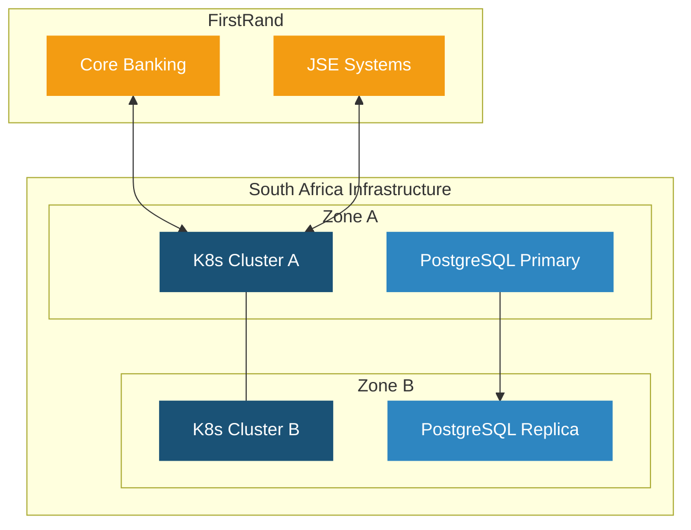

# Technical Proposal: Digital Bond Platform for Wholesale and Treasury Issuance

| Field | Value |
|---|---|
| Proposal title | Technical Proposal: Digital Bond Platform for Wholesale and Treasury Issuance |
| Client | FirstRand (South Africa) |
| Submitted by | SettleMint NV |
| Date | March 2026 |
| Version | v1.0 |
| Confidentiality | Restricted |
| RFP Reference | FIRSTRAND-RFP-DIGITAL-BOND-PLATFORM-202603 |
| Contact | SettleMint NV, Kempische Steenweg 311/4.01, 3500 Hasselt, Belgium |
| Valid until | June 2026 |

---

# Executive Summary

## Context and Strategic Drivers

FirstRand is procuring a digital bond platform for wholesale and treasury issuance as a business-critical capability, not a speculative innovation exercise. The bank requires production-grade infrastructure that can operate within its existing control environment, shaped by business ownership, architecture standards, security review, legal interpretation, compliance sign-off, and internal audit expectations under the South African Reserve Bank (SARB) and Financial Sector Conduct Authority (FSCA) supervisory framework.

South Africa's capital markets are at a pivotal moment. The SARB's Project Khokha has demonstrated the feasibility of blockchain-based settlement infrastructure, and the Johannesburg Stock Exchange (JSE) is actively exploring digital asset capabilities. FirstRand's position as one of South Africa's largest financial services groups places the bank at the forefront of this transition. The platform selected must deliver deterministic settlement finality in under 3 seconds, with compliance enforcement built into every transaction, to meet the operational and regulatory standards that wholesale and treasury operations demand.

## Why This Programme Is Hard

Wholesale bond issuance operates at a scale and with governance requirements that far exceed retail tokenization use cases. Treasury instruments require precise maturity management, coupon calculation across complex day-count conventions, call and put option handling, and secondary market connectivity, all within a control environment that produces the audit evidence SARB, FSCA, and internal audit teams expect.

The integration challenge is significant. A wholesale bond platform must connect to FirstRand's core banking systems, treasury management platform, identity and KYC infrastructure, SARB reporting systems, custodian arrangements, and the JSE's market infrastructure. Each integration point introduces dependencies that, if poorly governed, create reconciliation gaps and operational risk.

South Africa's regulatory landscape adds complexity. SARB's prudential requirements, FSCA conduct standards, Financial Intelligence Centre (FIC) AML/CFT obligations, and the evolving digital asset regulatory framework create a multi-layered compliance environment. Cross-border distribution to international institutional investors adds further jurisdictional complexity.

## Proposed Response

SettleMint proposes the Digital Asset Lifecycle Platform (DALP) as the production-grade infrastructure for FirstRand's digital bond programme. The deployment model is a dedicated cloud environment with South Africa-resident infrastructure, ensuring data sovereignty compliance with SARB data localization expectations.

DALP covers the complete wholesale bond lifecycle through a single platform: asset design and structuring with purpose-built bond templates; primary issuance with deterministic orchestration and governance controls; ex-ante compliance enforcement through 18 configurable compliance module types; atomic Delivery-versus-Payment (DvP) settlement with T+0 finality; automated lifecycle servicing including coupon distribution, maturity redemption, and corporate actions; and custody orchestration through bring-your-own-custodian integrations.

The implementation follows a 19-week phase-gated delivery model with formal gate reviews at each phase boundary.

## Why SettleMint

SettleMint brings nearly a decade of focused experience building blockchain and tokenization infrastructure for regulated financial institutions and sovereign entities. Production deployments with regulated banks across Asia, Europe, and the Middle East, including multi-year continuous operations, demonstrate the operational maturity that FirstRand's wholesale programme requires.

Particularly relevant references include Commerzbank's hybrid ETP issuance programme achieving settlement in under 10 seconds with EUR 7 million annual savings potential, Standard Chartered Bank's Digital Virtual Exchange serving institutional investors across Asia, Africa, and the Middle East, and the Saudi RER programme demonstrating country-scale enterprise integration.

SettleMint's existing presence in Africa through the Standard Chartered engagement and familiarity with markets sharing structural similarities with South Africa's regulatory environment provides relevant regional context for FirstRand's deployment.

## Why DALP

DALP provides the lifecycle control plane that manages every event in a digital bond's life from creation through retirement. For wholesale and treasury instruments, this means the same platform that structures and issues a bond also enforces compliance on every transfer, orchestrates settlement with deterministic finality, distributes coupons on schedule, and processes maturity redemption, under a unified registry, security posture, and governance model.

The platform implements ERC-3643 (T-REX) with OnchainID for ex-ante compliance enforcement. The 18 compliance module types cover the transfer restrictions, investor accreditation, and holding period requirements relevant to wholesale bond distribution. DALP's durable execution engine ensures that complex lifecycle operations survive infrastructure interruptions without partial execution.

## Reference Fit Snapshot

- **Commerzbank**: Fixed income platform with settlement under 10 seconds and EUR 7M savings, directly demonstrating wholesale bond economics
- **Standard Chartered Bank**: Institutional trading across Asia, Africa, and the Middle East, demonstrating reach into FirstRand's geographic operating context
- **Mizuho Bank**: Bond tokenization advancing from PoC to production planning, demonstrating platform bond-specific capability

---

# About SettleMint

## Company Overview

SettleMint is the production-grade digital asset lifecycle management company for regulated financial markets and sovereign use cases. Founded nearly a decade ago, the company has evolved from an early enterprise blockchain infrastructure provider into the category-defining platform enabling financial institutions, market infrastructure providers, and sovereign entities to move real-world value on-chain with compliance, security, and operational reliability.

## History and Market Position

The company's nearly decade-long focus on blockchain infrastructure for enterprises and regulated institutions has produced a depth of expertise and operational maturity that cannot be replicated quickly. Multi-year continuous production deployments with regulated banks in Asia and Europe established credentials in compliance-heavy environments. The consolidation of this experience into DALP provides coverage from asset design through the complete lifecycle.

## Production Credentials

| Category | Evidence |
|---|---|
| Market Validation | Nearly 10 years focused; 7+ years continuous production at regulated banks |
| Operational Maturity | Live across bonds, equities, deposits, stablecoins, real estate, funds |
| Sovereign Credibility | National-scale programmes in the Middle East |
| Ecosystem Strength | Tier-1 and tier-2 banks, CSDs, sovereign entities |
| Team Depth | 200+ years combined banking and blockchain experience |

## Regulatory Readiness

| Jurisdiction | Framework | DALP Support |
|---|---|---|
| South Africa | SARB prudential, FSCA conduct, FIC AML/CFT | Platform controls mapped; buyer retains regulatory interpretation |
| European Union | MiCA, GDPR | Native compliance module templates |
| GCC | Regional frameworks | Supported |
| Singapore | MAS framework | Compliance modules |
| United Kingdom | FCA requirements | Pre-built controls |

## Team and Delivery Capability

Dedicated solution architects, delivery leads, and customer success teams with experience implementing tokenization solutions in multiple jurisdictions. For FirstRand, SettleMint will assign a dedicated Solution Architect and Delivery Lead with relevant fixed income and African market deployment experience.

## Ecosystem and Partnerships

Partnerships with leading consulting firms, regional system integrators, institutional custody platforms (Fireblocks, DFNS), payment rail providers (ISO 20022 for SWIFT, SEPA, RTGS), and strategic investors in Europe and the Middle East.

---

# About DALP

## Platform Overview

DALP is SettleMint's production-grade Digital Asset Lifecycle Platform covering the full lifecycle from asset design through issuance, compliance enforcement, custody integration, settlement, servicing, and retirement under a single governance model. For FirstRand's wholesale bond programme, DALP provides the control plane between existing core financial systems and the blockchain network.

## Core Lifecycle Pillars

### Issuance

Purpose-built bond templates with configurable coupon schedules (fixed, floating, zero-coupon), maturity logic, call/put options, and secondary market connectivity. Deterministic orchestration with paused-by-default governance. Configurable for government bonds, corporate bonds, commercial paper, and structured products through the Asset Designer wizard.

### Compliance

Ex-ante enforcement through 18 compliance module types covering country restrictions, investor accreditation, supply limits, holding periods, and transfer controls. ERC-3643 (T-REX) regulated token standard with OnchainID for verifiable on-chain investor identities. Two-layer policy model separating platform compliance from custodian policy.

### Custody

Key Guardian with multiple storage backends (encrypted database, cloud secret manager, HSM, Fireblocks, DFNS). Maker-checker approval workflows with configurable quorum. Provider-delegated transaction broadcast for institutional custody integration.

### Settlement

Atomic DvP where asset and cash legs complete together or revert together. Deterministic closure into auditable end-states. ISO 20022 integration for SWIFT, SEPA, and RTGS connectivity. XvP extension for multi-party exchanges. T+0 settlement finality.

### Servicing

Automated coupon payments, yield distribution, maturity redemption, and corporate actions. Fixed treasury yield with configurable schedules. Treasury payout abstraction supporting EOA and contract-based treasuries. Complete audit trail for every lifecycle event.

## Platform Foundations

### Identity and Access Management

OnchainID for verifiable investor identities, Identity Registry with claim-based verification, RBAC with five defined roles, KYC/KYB workflows, invitation-linked onboarding, wallet verification with multi-factor gates, and identity recovery workflows.

### Integration and Interoperability

REST, GraphQL, event webhooks, and oRPC APIs. Typed SDK (@settlemint/dalp-sdk), CLI with 301 commands across 26 groups. ISO 20022 payment rail connectivity. Bring-your-own-custodian and bring-your-own-chain flexibility. Multi-provider object storage.

### Observability and Operations

Pre-built Grafana dashboards, three-pillar observability (VictoriaMetrics, Loki, Tempo/OpenTelemetry), automated alerting, blockchain infrastructure monitoring, async transaction pipeline with 11-state lifecycle management, and 534 structured error codes.

## Standards and Protocols

| Category | Standards |
|---|---|
| Token Standards | ERC-20, ERC-721, ERC-1400, ERC-3643, ERC-5805, EIP-2612 |
| Identity | OnchainID, claim-based verification |
| Compliance | 18 module types |
| Settlement | Atomic DvP/XvP, HTLC cross-chain |
| Payment Rails | ISO 20022 (SWIFT, SEPA, RTGS) |
| Networks | Any EVM-compatible |

---

# Customer References

## Summary Table

| Client | Use Case | Geography | Relevance |
|---|---|---|---|
| Commerzbank | ETP issuance, settlement under 10s | Germany | Wholesale fixed income |
| OCBC Bank | Security token engine | Singapore | Tier-1 bank platform |
| Standard Chartered | Digital exchange | Asia, Africa, ME | African market presence |
| IsDB (Subsidy) | Subsidy distribution, 57 countries | Multi-region | Multi-jurisdictional governance |
| Saudi RER | Country-scale real estate | KSA | National-scale integration |
| Mizuho Bank | Bond tokenization | Japan | Fixed income capability |
| Maybank | FX tokenization, XvP settlement | Malaysia | Atomic settlement |
| KBC Securities | Equity crowdfunding automation | Belgium | Lifecycle automation |
| Sony Bank | Stablecoin with identity | Japan | Identity-integrated finance |
| SBI | CBDC infrastructure | India | Sovereign-scale digital currency |
| IsDB (Market Stabilization) | Sharia-compliant stabilization | Multi-region | Automated financial operations |
| ADI Finstreet | Tokenized equity, Abu Dhabi | UAE/GCC | Custody integration |
| KBC Insurance | NFT product passports | Belgium | Digital asset innovation |
| Reserve Bank of India | Multi-bank trade finance | India | Multi-party infrastructure |

## Expanded Reference: Commerzbank

Commerzbank required a hybrid on/off-chain solution for issuing and managing exchange-traded products integrated with Boerse Stuttgart's listing service. SettleMint delivered a solution achieving settlement in under 10 seconds with EUR 7 million annual savings potential. This reference directly demonstrates wholesale fixed income capability at production scale under European banking regulation.

## Expanded Reference: Standard Chartered Bank

Standard Chartered collaborated with SettleMint on a blockchain-based Digital Virtual Exchange supporting fractional tokenization of securities across Asia, Africa, and the Middle East. Ownership changes are recorded instantly and immutably, eliminating custody intermediaries and reducing settlement times. This reference demonstrates SettleMint's capability in African institutional markets directly relevant to FirstRand's operating context.

## Expanded Reference: Saudi RER

The Saudi Real Estate Registry programme delivers country-scale blockchain infrastructure with deep integration into government registry, billing, escrow, and administrative systems. SettleMint serves as delivery partner for the solution powered by DALP. This reference demonstrates enterprise integration discipline at national scale, relevant to FirstRand's requirement for integration with its existing institutional technology stack and South Africa's market infrastructure.

---

# Understanding of Requirements

## Client Context

FirstRand approaches this procurement as a business-critical investment, requiring a platform that operates within its existing control environment under SARB and FSCA oversight. The evaluation will assess whether bidders can explain platform behaviour under operational pressure, including incomplete onboarding data, limit breaches, governance-delayed approvals, and regulatory evidence requests.

## Requirement Domains

| Domain | FirstRand Requirements | DALP Coverage |
|---|---|---|
| Product Scope | Wholesale bonds, treasury instruments, issuance calendars, coupon schedules | Bond templates with configurable lifecycle logic |
| Identity | Integration with KYC infrastructure and SARB reporting | OnchainID, Identity Registry, KYC/KYB workflows |
| Compliance | Transfer restrictions, eligibility checks, FIC AML/CFT | 18 compliance modules, ex-ante enforcement |
| Settlement | Integration with JSE infrastructure, paying agents | Atomic DvP, ISO 20022, SWIFT/RTGS |
| Integration | API-first, core banking, treasury management | REST, GraphQL, webhooks, oRPC, SDK, CLI |
| Infrastructure | Segregated environments, resilience, DR | Full environment segregation, 3-pillar observability |

## Key Challenges

**Control integrity.** Every transaction must be traceable: who initiated it, which compliance checks applied, who approved it, and how the state can be reconstructed. DALP provides immutable audit trails, structured event logging, and ex-ante compliance records.

**JSE and SARB coexistence.** The platform must integrate with South Africa's market infrastructure without creating reconciliation overhead. DALP's API-first architecture and ISO 20022 connectivity provide the integration surface.

**Phased scalability.** FirstRand needs to move from initial wholesale bond issuance to broader treasury instrument coverage without platform replacement. DALP's multi-asset architecture supports this progression.

---

# Proposed Solution and Functional Capabilities

## Solution Overview

DALP deploys as the wholesale bond lifecycle platform within FirstRand's enterprise environment. The solution boundary encompasses asset structuring, primary issuance, compliance enforcement, investor identity management, custody orchestration, DvP settlement, lifecycle servicing, and operational monitoring. FirstRand retains business policy ownership, regulatory engagement, and ultimate control authority.

## Issuance and Asset Configuration

DALP's bond templates support wholesale instrument types including government bonds, corporate bonds, commercial paper, and structured treasury products. The Asset Designer wizard enables product teams to configure face value, coupon type, frequency, maturity date, call/put options, and distribution rules through a validated interface. Deterministic orchestration with paused-by-default governance ensures no instrument becomes active without authorized approval.

## Identity and Eligibility

OnchainID provides verifiable on-chain investor identities reusable across all instruments. The Identity Registry manages verified profiles with claim-based verification for KYC/KYB credentials, accreditation status, and jurisdictional eligibility. For wholesale distribution, the identity layer supports institutional investor qualification, qualified purchaser verification, and cross-border eligibility assessment.

## Compliance Enforcement

The 18 compliance module types cover the transfer controls wholesale bond operations require. Country restriction modules enforce geographic eligibility. Investor accreditation modules verify institutional qualification thresholds. Supply limit and holding period modules provide additional governance. Every compliance check executes ex-ante with full audit trail recording.

## Settlement and Cash-Leg Coordination

Atomic DvP settlement with ISO 20022 integration for connectivity to SARB's RTGS and the JSE's settlement infrastructure. Deterministic closure into auditable end-states eliminates reconciliation ambiguity. The XvP extension supports multi-party treasury operations where multiple legs must settle simultaneously.

## Lifecycle Servicing

Automated coupon distribution, maturity redemption, and corporate actions. Each lifecycle event produces a complete audit record. The servicing capability distinguishes DALP from competitors that stop at issuance, providing the operational infrastructure FirstRand needs to manage wholesale instruments through their full lifecycle.

## Functional Fit Matrix

| Requirement | DALP Capability | Status |
|---|---|---|
| Segregated environments | Dev, staging, UAT, DR, production | Full |
| API-first interfaces | REST, GraphQL, webhooks, oRPC, SDK, CLI | Full |
| RBAC, maker-checker, audit | 5 roles, configurable quorum, immutable trail | Full |
| Bond lifecycle management | Templates, configurable policies, governance gates | Full |
| Third-party disclosure | Architecture documentation, partner mapping | Full |
| Resilience and DR | HA, backup, 3-pillar observability | Full |
| Implementation plan | 19-week phase-gated delivery | Full |
| Audit evidence | Structured logs, compliance records, dashboards | Full |
| Coupon and maturity | Automated schedules, redemption workflows | Full |
| Settlement integration | Atomic DvP, ISO 20022, SWIFT/RTGS | Full |
| Transfer restrictions | 18 compliance modules, ex-ante enforcement | Full |

---

# Technical Architecture

## Architectural Principles

Lifecycle-first design, durable execution through Restate, defense-in-depth security, separation of concerns across on-chain, execution, API, and presentation layers, and provider abstraction preventing vendor lock-in at any layer.

## Layered Architecture

## Data Architecture

Three data stores: chain state (authoritative ownership and compliance records), application state (PostgreSQL with zero-downtime schema lifecycle), and indexed analytical state (read-optimized views for dashboards and reporting).

## Network Topology

Recommended permissioned private EVM network with IBFT consensus for deterministic finality. Network topology defined during Discovery based on FirstRand's performance and regulatory requirements.

## Transaction Pipeline

---

# Security

## Security Model

Three-domain trust model: platform domain (SettleMint-managed), custody domain (FirstRand's provider), and governance domain (FirstRand's authority). Defense-in-depth across network, API, session, role, contract, and custody layers.

## Authentication and Access Control

Two-endpoint authentication separating session-based dApp access from API-key programmatic access. Five-role RBAC with segregation of duties. Hard enforcement of auth-method-to-endpoint affinity.

## Key Management

Key Guardian with Tier 4 (institutional custody via Fireblocks or DFNS) recommended for production. Maker-checker workflows with configurable quorum. Emergency pause capability with formal recovery procedures.

## Security Responsibility Matrix

| Control Area | SettleMint | FirstRand |
|---|---|---|
| Platform security | Owner | Reviewer |
| Infrastructure | Owner (managed) | Reviewer |
| Key management | Shared | Owner |
| Access control config | Advisor | Owner |
| Compliance rules | Advisor | Owner |
| Penetration testing | Facilitator | Coordinator |

---

# Project Implementation and Delivery

## Phase Plan

| Phase | Weeks | Objective |
|---|---|---|
| Discovery and Requirements | 1 to 3 | Validate requirements, architecture, SARB/FSCA mapping |
| Foundation and Setup | 4 to 7 | Provision environments, configure bonds and compliance |
| Configuration and Compliance | 8 to 11 | Integrate with core banking, JSE, FIC; validate lifecycle |
| Integration and Testing | 12 to 15 | Functional, NFR, security, DR testing, UAT |
| Go-Live | 16 to 17 | Controlled production cutover |
| Hypercare | 18 to 21 | Intensive monitoring and operational handover |

## Risk Register

| Risk | Likelihood | Impact | Mitigation |
|---|---|---|---|
| SARB regulatory interpretation delays | Medium | High | Early engagement during Discovery |
| JSE integration complexity | Medium | Medium | Detailed design in Phase 2, iterative testing |
| Custody provider onboarding | Low | Medium | Parallel setup from Discovery |
| FirstRand resource availability | Medium | Medium | Named RACI, steering committee |
| Security review timeline | Low | High | InfoSec engaged from Phase 1 |

---

# Deployment

## Recommended Model

Dedicated cloud deployment with South Africa-resident infrastructure. All deployment models deliver identical platform capabilities. SettleMint manages platform operations within the dedicated environment.

## Infrastructure Requirements

Kubernetes/OpenShift, PostgreSQL, Redis, S3-compatible storage, standard network ingress. Multi-zone distribution for resilience.

---

# Training and Knowledge Transfer

Three tracks: Administrator (platform configuration, monitoring), Developer/Integration (APIs, SDK, CLI), and End-User/Operations (bond lifecycle, servicing, reporting). Knowledge transfer through guided labs, shadowing, runbooks, and operational readiness assessment.

---

# Support and SLA

## Recommended Tier: Premium

| Attribute | Premium |
|---|---|
| Coverage | 07:00 to 22:00 CET, P1 weekends |
| Channels | Email, portal, Slack, phone |
| Uptime SLA | 99.95% monthly |
| P1 Response | 2 hours |
| Designated Engineer | Yes |
| Release Cycle | Monthly |

## Severity Matrix

| Severity | Response | Resolution Target |
|---|---|---|
| P1 | 2 hours | 4 hours |
| P2 | 4 hours | 8 hours |
| P3 | 8 business hours | 3 business days |
| P4 | 2 business days | Next release |

---

# Compliance Matrix

| Requirement | Status | DALP Response |
|---|---|---|
| Segregated environments | Full | Dev, staging, UAT, DR, production |
| API-first interfaces | Full | REST, GraphQL, webhooks, oRPC, SDK, CLI |
| RBAC, maker-checker, audit | Full | 5 roles, quorum, immutable trail |
| Bond lifecycle states | Full | Templates, policies, governance gates |
| Third-party disclosure | Full | Architecture documentation |
| Resilience and DR | Full | HA, backup, 3-pillar observability |
| Delivery plan | Full | 19-week phase-gated |
| Audit evidence | Full | 534 error codes, compliance records |
| Coupon and maturity | Full | Automated schedules and redemption |
| Settlement integration | Full | Atomic DvP, ISO 20022 |
| Transfer restrictions | Full | 18 modules, ex-ante enforcement |
| Regulatory mapping | Configurable | Modules mapped; buyer interprets |
| AML/CFT and FIC | Full | Webhook integration with screening |
| Data governance | Full | Encryption, residency, retention |
| Operational resilience | Full | DR, backup, monitoring |

---

# Support Appendix

Premium support assigns a dedicated engineer maintaining knowledge of FirstRand's deployment, bond templates, compliance configuration, and integration architecture. Monthly service reports cover ticket volumes, resolution times, SLA compliance, and availability. Scheduled maintenance with 72-hour notice minimum; critical security patches with 24-hour notice.
