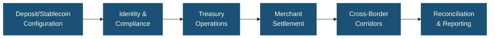
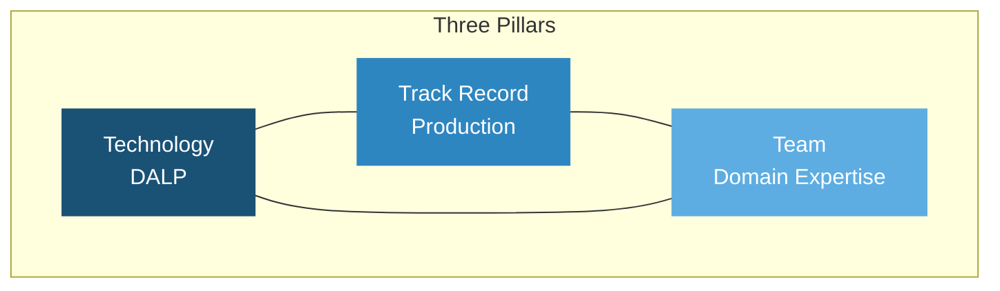
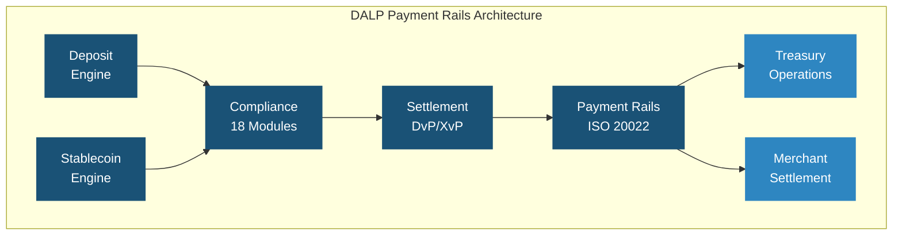
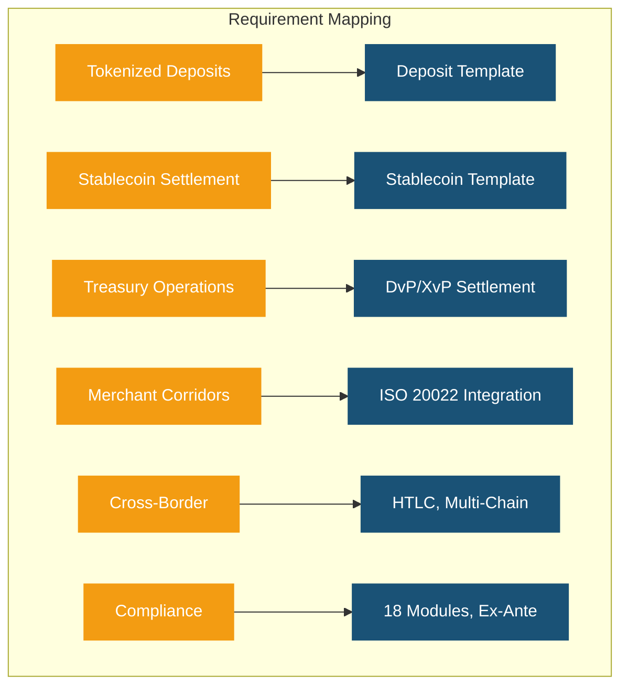
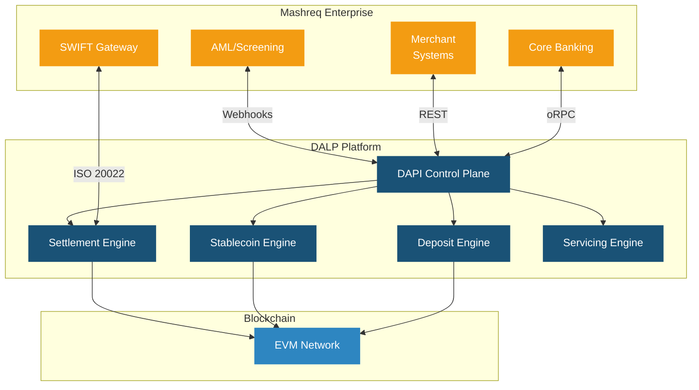
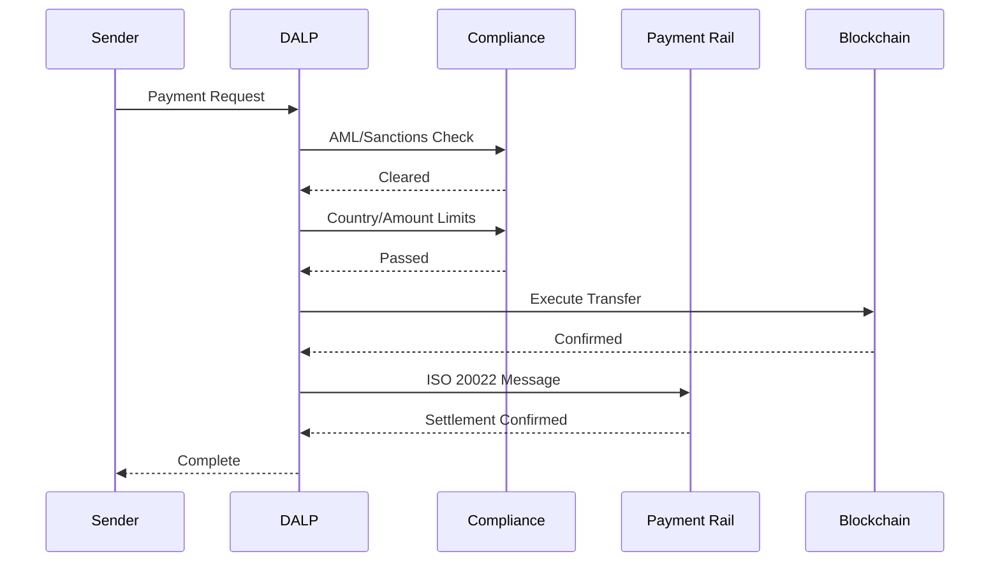
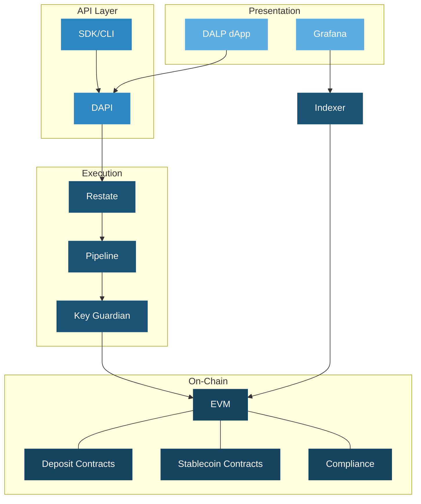
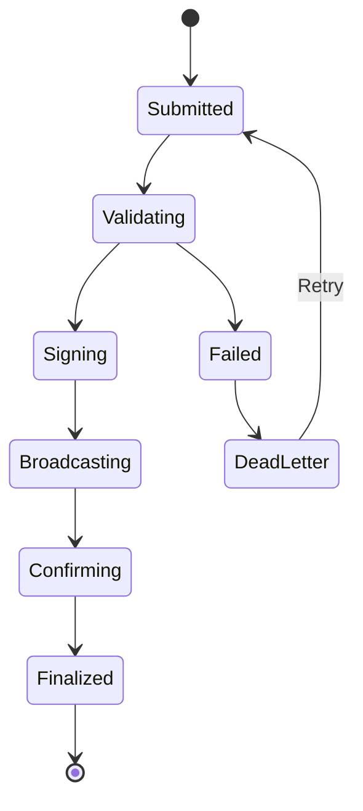
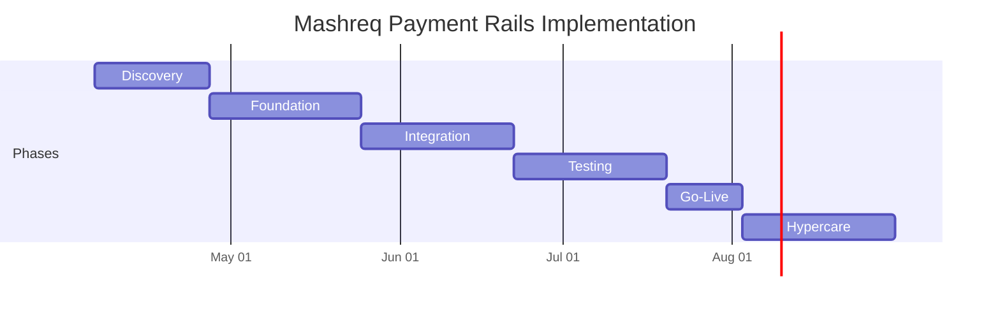
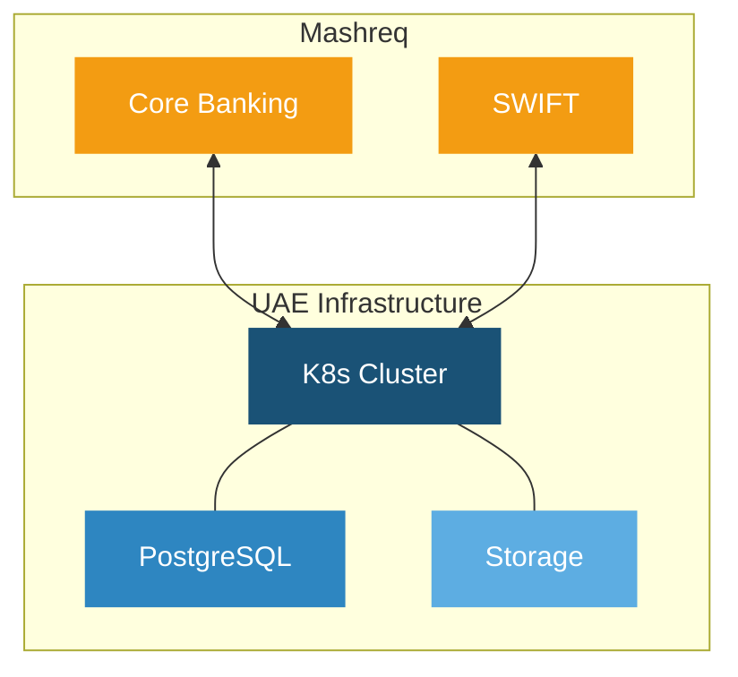

# Technical Proposal: Digital Asset-Enabled Payment Rails for Treasury and Merchant Corridors

| Field | Value |
|---|---|
| Proposal title | Technical Proposal: Digital Asset-Enabled Payment Rails for Treasury and Merchant Corridors |
| Client | Mashreq Bank (UAE) |
| Submitted by | SettleMint NV |
| Date | March 2026 |
| Version | v1.0 |
| Confidentiality | Restricted |
| RFP Reference | MASHREQ-BANK-RFP-DIGITAL-ASSET-PAYMENT-RAILS-202603 |
| Contact | SettleMint NV, Kempische Steenweg 311/4.01, 3500 Hasselt, Belgium |
| Valid until | June 2026 |

---

# Executive Summary

## Context and Strategic Drivers

Mashreq Bank is procuring digital asset-enabled payment rails for treasury and merchant corridors as a business-critical capability that must operate within its existing control environment under the Central Bank of the UAE (CBUAE) supervisory framework. The UAE's Digital Dirham programme, CBUAE regulatory developments, and the Dubai International Financial Centre (DIFC) digital asset framework create a regulatory environment that requires platforms to demonstrate production-grade compliance, auditability, and integration with established payment infrastructure.

Mashreq Bank's procurement targets a platform that can enable tokenized deposits, stablecoin settlement, and digital asset-enabled treasury operations while integrating with existing payment rails, correspondent banking relationships, and merchant settlement processes. DALP delivers deterministic settlement finality in under 3 seconds with compliance enforcement built into every transaction.

## Why This Programme Is Hard

Payment rail infrastructure operates at the intersection of multiple regulatory regimes (CBUAE, DFSA for DIFC operations, international correspondent banking standards), requires real-time settlement with zero tolerance for reconciliation failures, must integrate with SWIFT, RTGS, and local payment systems, and demands the highest levels of operational resilience and security. The merchant corridor dimension adds complexity through high-volume, low-latency requirements and multi-currency considerations.

## Proposed Response

SettleMint proposes DALP as the lifecycle platform for Mashreq Bank's digital payment rails programme. The deployment uses dedicated cloud infrastructure within UAE-resident data centres, ensuring compliance with CBUAE data localization requirements.

DALP addresses the payment rails use case through its deposit and stablecoin asset templates with programmable interest and withdrawal rules, atomic DvP/XvP settlement for treasury operations, ISO 20022 integration for SWIFT, SEPA, and RTGS connectivity, bridge functionality for cross-network settlement, and ex-ante compliance enforcement with 18 configurable module types.

## Why SettleMint

Nearly a decade of production experience with regulated banks and sovereign entities. Particular relevance: Maybank's Project Photon for FX tokenization and cross-border settlement using atomic XvP, the Saudi RER programme for national-scale integration, and the Central Bank of UAE engagement context through the broader Middle East operations.

## Why DALP

DALP provides the lifecycle control plane for tokenized deposits and stablecoins with built-in payment rail connectivity. ISO 20022 integration connects to SWIFT, SEPA, and RTGS. The deposit template includes programmable interest, maturity, withdrawal rules, and bridge functionality for external network connectivity. The stablecoin template includes reserve monitoring, attestation integration, and multi-currency support.

## Reference Fit Snapshot

- **Maybank (Project Photon)**: FX tokenization and cross-border settlement with atomic XvP, tokenized Malaysian Ringgit (MYRT)
- **Commerzbank**: Settlement under 10 seconds with EUR 7M annual savings, demonstrating payment efficiency at institutional scale
- **Saudi RER**: National-scale programme with deep enterprise integration, demonstrating UAE-region delivery capability

---

# About SettleMint

## Company Overview

SettleMint is the production-grade digital asset lifecycle management company for regulated financial markets and sovereign use cases, with nearly a decade of focused experience and 7+ years of continuous production deployments at regulated banks.

## Production Credentials

| Category | Evidence |
|---|---|
| Market Validation | Nearly 10 years; 7+ years production at regulated banks |
| Operational Maturity | Live across bonds, equities, deposits, stablecoins, real estate, funds |
| Sovereign Credibility | National-scale Middle East programmes |
| Team Depth | 200+ years combined banking and blockchain experience |

## Regulatory Readiness

| Jurisdiction | Framework | DALP Support |
|---|---|---|
| UAE | CBUAE requirements, DFSA framework | Platform controls mapped; buyer retains interpretation |
| GCC | Regional frameworks | Supported |
| EU | MiCA, GDPR | Native compliance templates |
| Singapore | MAS | Compliance modules |

---

# About DALP

## Platform Overview

DALP provides the full digital asset lifecycle from design through retirement. For Mashreq Bank's payment rails programme, DALP serves as the control plane for tokenized deposits, stablecoin operations, and treasury settlement, sitting between existing core systems and blockchain networks.

## Core Lifecycle Pillars

### Issuance

Deposit template with programmable interest, maturity, and withdrawal rules. Stablecoin template with reserve monitoring, attestation integration, and multi-currency support. Bridge functionality for external network connectivity. Deterministic orchestration with paused-by-default governance.

### Compliance

18 compliance module types with ex-ante enforcement. CBUAE and GCC framework alignment. ERC-3643 with OnchainID for verifiable investor identities. Two-layer policy model.

### Custody

Key Guardian with Fireblocks and DFNS integration. Maker-checker workflows. Provider-delegated transaction broadcast.

### Settlement

Atomic DvP/XvP where both legs complete or revert. ISO 20022 for SWIFT, SEPA, RTGS. HTLC cross-chain settlement for cross-border corridors. T+0 finality with compliance enforcement.

### Servicing

Automated interest distribution, withdrawal processing, and lifecycle management. Corporate actions, reserve attestation reporting, and audit trail generation.

## Platform Foundations

### Identity and Access Management

OnchainID, Identity Registry, 5-role RBAC, KYC/KYB workflows, invitation-linked onboarding, wallet verification, identity recovery.

### Integration and Interoperability

REST, GraphQL, webhooks, oRPC, typed SDK, CLI with 301 commands, ISO 20022 payment connectivity, bring-your-own-custodian, multi-chain EVM support.

### Observability and Operations

Grafana dashboards, three-pillar observability (VictoriaMetrics, Loki, Tempo), automated alerting, 11-state async transaction pipeline, 534 structured error codes.

---

# Customer References

## Summary Table

| Client | Use Case | Geography | Relevance |
|---|---|---|---|
| Maybank (Project Photon) | FX tokenization, XvP settlement | Malaysia | Cross-border payment rails |
| Commerzbank | ETP issuance, settlement under 10s | Germany | Payment efficiency |
| Saudi RER | Country-scale tokenization | KSA | UAE-region delivery |
| IsDB (Subsidy) | Multi-country distribution | 57 countries | Multi-jurisdictional payments |
| Sony Bank | Stablecoin with identity | Japan | Stablecoin capability |
| Standard Chartered | Digital exchange | Asia, Africa, ME | UAE market presence |
| OCBC Bank | Security token engine | Singapore | Tier-1 bank platform |
| SBI | CBDC infrastructure | India | Digital currency operations |

## Expanded Reference: Maybank (Project Photon)

Maybank deployed the MYRT token (tokenized Malaysian Ringgit) for FX tokenization and cross-border settlement using DALP's Exchange-versus-Payment (XvP) model. The solution enables atomic cross-currency swaps with simultaneous settlement of both legs, reducing counterparty and settlement risk. Implemented in alignment with Bank Negara Malaysia's Digital Asset Innovation Hub, the programme provides a scalable foundation for production deployment across broader tokenized deposit and cross-border settlement use cases. This reference directly parallels Mashreq Bank's requirement for digital asset-enabled payment corridors.

## Expanded Reference: Commerzbank

Settlement in under 10 seconds with EUR 7 million annual savings potential through reduced counterparty risk and eliminated listing inefficiencies. The hybrid on/off-chain ETP solution demonstrates production-grade payment and settlement efficiency in a European banking environment.

---

# Understanding of Requirements

## Requirement Domains

| Domain | Mashreq Requirements | DALP Coverage |
|---|---|---|
| Product Scope | Tokenized deposits, stablecoin settlement, treasury operations | Deposit and stablecoin templates, treasury features |
| Compliance | CBUAE requirements, AML/CFT, cross-border controls | 18 modules, ex-ante enforcement |
| Settlement | Real-time, multi-currency, merchant corridors | Atomic DvP/XvP, ISO 20022 |
| Integration | Core banking, SWIFT, RTGS, merchant systems | REST, GraphQL, webhooks, ISO 20022 |
| Operations | High-volume, low-latency, resilience | Async pipeline, 3-pillar observability |

---

# Proposed Solution and Functional Capabilities

## Solution Overview

DALP deploys as the payment rails lifecycle platform within Mashreq Bank's enterprise environment. The solution encompasses tokenized deposit configuration, stablecoin management, treasury settlement operations, merchant corridor settlement, cross-border payment orchestration, and operational monitoring.

## Deposit and Stablecoin Configuration

DALP's deposit template provides programmable interest, maturity, and withdrawal rules for tokenized deposits. The stablecoin template includes reserve monitoring, attestation integration, multi-currency support, and regulatory reporting capabilities. Bridge functionality enables interoperability with external networks, supporting Mashreq Bank's cross-border corridor requirements.

## Compliance Enforcement

The 18 compliance module types enforce CBUAE requirements, AML/CFT controls, and cross-border transfer restrictions ex-ante. Every payment transaction is validated against applicable compliance rules before execution. The audit trail records which checks were evaluated, what data was used, and the result, providing the evidence base CBUAE supervisory review requires.

## Settlement and Payment Integration

Atomic DvP/XvP settlement with ISO 20022 connectivity to SWIFT, RTGS, and local payment systems. For merchant corridors, DALP provides high-throughput settlement with the same compliance and audit controls applied to treasury operations. The XvP extension coordinates multi-currency exchanges for cross-border corridors with simultaneous settlement of all legs.

## Functional Fit Matrix

| Requirement | DALP Capability | Status |
|---|---|---|
| Tokenized deposits | Deposit template with programmable rules | Full |
| Stablecoin settlement | Stablecoin template with reserve monitoring | Full |
| Treasury operations | DvP/XvP, multi-currency settlement | Full |
| Merchant corridors | High-throughput settlement, REST APIs | Full |
| Cross-border payment | HTLC cross-chain, ISO 20022 | Full |
| CBUAE compliance | 18 modules, ex-ante enforcement | Full |
| AML/CFT integration | Webhook screening integration | Full |
| RBAC and audit | 5 roles, maker-checker, immutable trail | Full |
| Environment segregation | Dev, staging, UAT, DR, production | Full |
| Resilience and DR | HA, backup, 3-pillar observability | Full |

---

# Technical Architecture

## Layered Architecture

## Data Architecture

Chain state (authoritative records), application state (PostgreSQL with zero-downtime schema), indexed state (read-optimized views for dashboards and reporting). The async transaction pipeline provides 11-state lifecycle management with idempotency, dead-letter rescue, and public status polling.

## Transaction Pipeline

---

# Security

Three-domain trust model with defense-in-depth. Two-endpoint authentication. Five-role RBAC. Key Guardian with Tier 4 custody (Fireblocks/DFNS) for production. Maker-checker workflows. Emergency pause capability. Encrypted data at rest and in transit. 534 structured error codes for auditability. Security testing as part of Phase 4.

| Control Area | SettleMint | Mashreq Bank |
|---|---|---|
| Platform security | Owner | Reviewer |
| Key management | Shared | Owner |
| Access control config | Advisor | Owner |
| Compliance rules | Advisor | Owner |

---

# Project Implementation and Delivery

## Phase Plan

| Phase | Weeks | Objective |
|---|---|---|
| Discovery | 1 to 3 | Requirements, CBUAE mapping, architecture |
| Foundation | 4 to 7 | Environments, deposit/stablecoin config, compliance |
| Integration | 8 to 11 | Core banking, SWIFT, merchant systems, AML |
| Testing | 12 to 15 | Functional, NFR, security, UAT |
| Go-Live | 16 to 17 | Controlled cutover |
| Hypercare | 18 to 21 | Monitoring and handover |

## Risks

| Risk | Likelihood | Impact | Mitigation |
|---|---|---|---|
| CBUAE regulatory timing | Medium | High | Early engagement in Discovery |
| SWIFT integration complexity | Medium | Medium | ISO 20022 standard patterns |
| Merchant system diversity | Medium | Medium | Phased integration approach |
| Custody provider onboarding | Low | Medium | Parallel setup track |

---

# Deployment

Dedicated cloud, UAE-resident infrastructure. Multi-zone HA. All models deliver identical capabilities.

---

# Training and Knowledge Transfer

Administrator track (platform ops), Developer track (APIs, SDK), Operations track (payment workflows, monitoring). Knowledge transfer through labs, shadowing, and runbooks.

---

# Support and SLA

Premium recommended. 99.95% uptime, 2-hour P1 response, dedicated engineer, monthly releases.

---

# Compliance Matrix

| Requirement | Status | DALP Response |
|---|---|---|
| Tokenized deposits | Full | Deposit template |
| Stablecoin operations | Full | Stablecoin template |
| Treasury settlement | Full | DvP/XvP, ISO 20022 |
| Merchant settlement | Full | REST APIs, high-throughput |
| Cross-border corridors | Full | HTLC, bridge functionality |
| CBUAE compliance | Configurable | Modules mapped; buyer interprets |
| AML/CFT | Full | Webhook integration |
| RBAC and audit | Full | 5 roles, immutable trail |
| Environment segregation | Full | Full environment set |
| Resilience and DR | Full | HA, 3-pillar observability |

---

# Support Appendix

Dedicated engineer maintaining knowledge of Mashreq's deployment. Monthly service reports. 72-hour maintenance notice; 24-hour for critical security patches.
