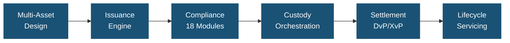
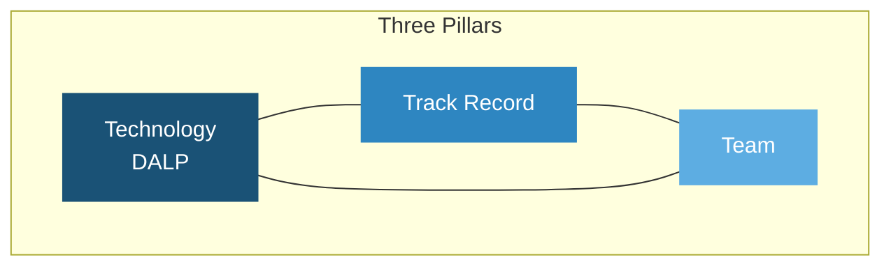
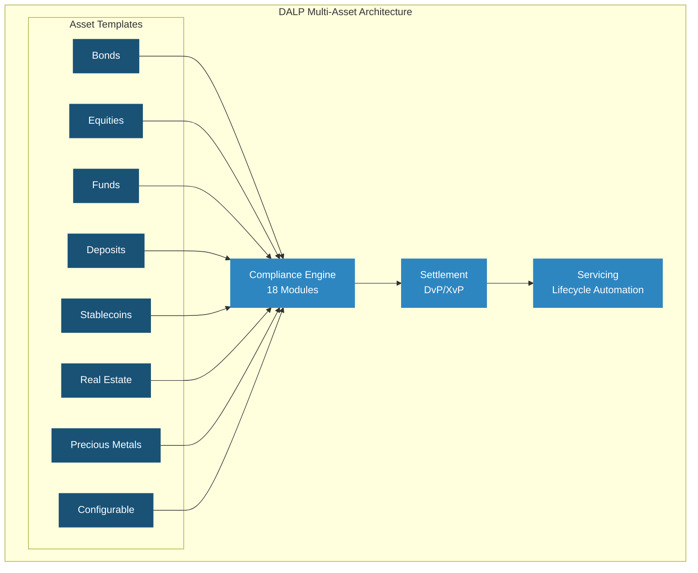
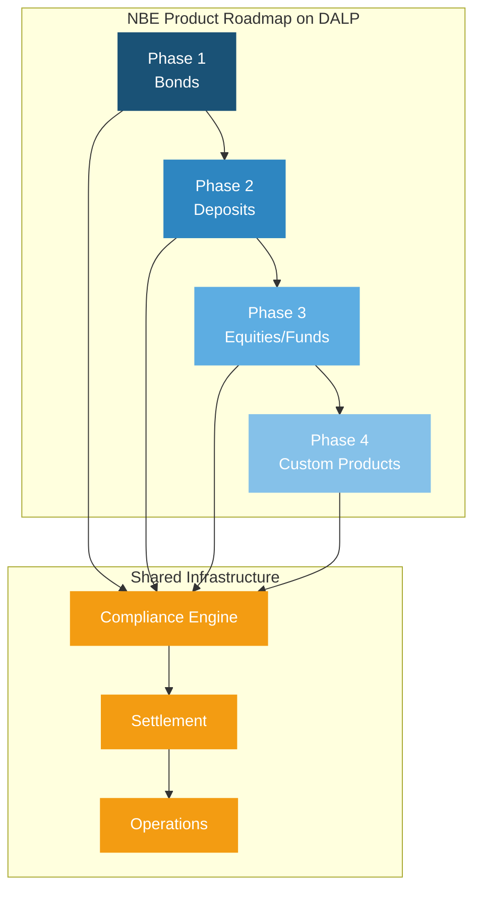
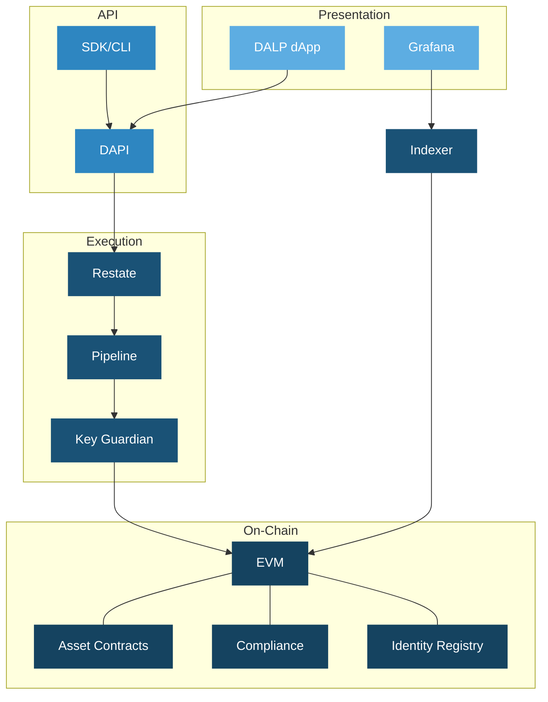
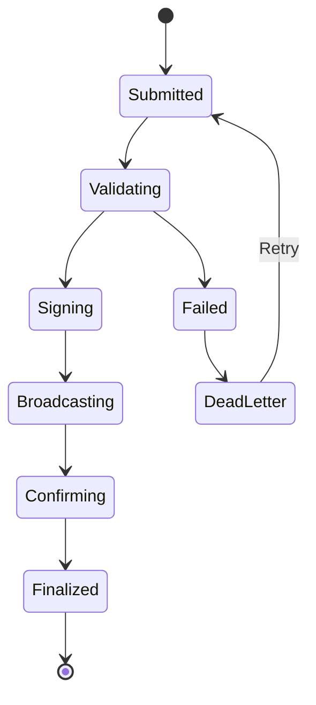
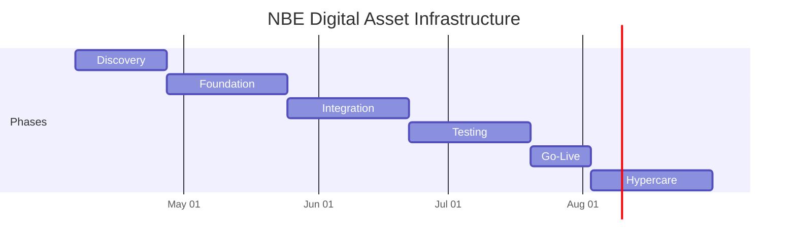

# Technical Proposal: Digital Asset Core Infrastructure for Regulated Institutional Products

| Field | Value |
|---|---|
| Proposal title | Technical Proposal: Digital Asset Core Infrastructure for Regulated Institutional Products |
| Client | National Bank of Egypt (Egypt) |
| Submitted by | SettleMint NV |
| Date | March 2026 |
| Version | v1.0 |
| Confidentiality | Restricted |
| RFP Reference | NATIONAL-BANK-OF-EGYPT-RFP-DIGITAL-ASSET-INFRASTRUCTURE-202603 |
| Contact | SettleMint NV, Kempische Steenweg 311/4.01, 3500 Hasselt, Belgium |
| Valid until | June 2026 |

---

# Executive Summary

## Context and Strategic Drivers

National Bank of Egypt (NBE) is procuring digital asset core infrastructure for regulated institutional products as a business-critical capability operating within a control environment shaped by the Central Bank of Egypt (CBE) and Financial Regulatory Authority (FRA) supervisory frameworks. As Egypt's largest and oldest commercial bank, NBE requires production-grade infrastructure that can support multiple digital asset product types across institutional and potentially retail segments, with the governance, compliance, and operational reliability that regulatory oversight demands.

DALP delivers deterministic settlement finality in under 3 seconds with compliance enforcement built into every transaction, providing the performance and control characteristics that institutional digital asset products require.

## Why This Programme Is Hard

Digital asset core infrastructure for a bank of NBE's scale must support multiple asset classes simultaneously, from bonds and deposits through to potentially equities and structured products. The platform must integrate with NBE's extensive branch network systems, core banking infrastructure, identity and KYC processes, and regulatory reporting. Egypt's evolving digital asset regulatory framework requires a platform that can adapt compliance controls as CBE and FRA guidance matures.

The "core infrastructure" designation means this is not a single-product deployment; it is the foundation on which multiple digital asset products will be built over time. This demands architectural flexibility, multi-asset lifecycle management, and the ability to add new product types without replacing or substantially modifying the underlying platform.

## Proposed Response

SettleMint proposes DALP as the core digital asset infrastructure for NBE's regulated institutional products. DALP's multi-asset architecture, covering bonds, equities, funds, deposits, stablecoins, real estate, and precious metals through purpose-built templates, plus a configurable token for novel asset classes, provides the product breadth NBE requires. The deployment model uses dedicated cloud with Egypt-resident infrastructure.

## Why SettleMint

Nearly a decade of production experience. Sovereign-scale Middle East programmes (Saudi RER, IsDB). Multi-year regulated bank deployments (OCBC, Standard Chartered, SBI). Bond-specific credentials (Commerzbank, Mizuho). Multi-asset platform capability proven across 7 asset classes in production.

## Why DALP

DALP uniquely provides multi-asset lifecycle coverage through a single platform. The 7 pre-built asset templates plus configurable token mean NBE can launch bonds first, then add deposits, equities, or funds using the same compliance engine, governance model, and operational tooling. This eliminates the need to procure separate platforms for each product type and ensures consistent compliance enforcement across all digital asset products.

## Reference Fit Snapshot

- **Saudi RER**: National-scale tokenization with deep government system integration, relevant to NBE's Egyptian public-sector context
- **IsDB**: Multi-country financial infrastructure serving 57 member countries, demonstrating scale and multi-jurisdictional governance
- **OCBC Bank**: Multi-asset security token engine for institutional distribution, demonstrating the core infrastructure use case

---

# About SettleMint

## Company Overview

Production-grade digital asset lifecycle management company with nearly 10 years of focus and 7+ years of continuous production at regulated banks. Multi-year deployments across bonds, equities, deposits, stablecoins, real estate, and funds.

## Production Credentials

| Category | Evidence |
|---|---|
| Market Validation | Nearly 10 years; 7+ years production |
| Operational Maturity | 7 asset classes in production |
| Sovereign Credibility | National-scale Middle East programmes |
| Team Depth | 200+ years combined experience |

## Regulatory Readiness

| Jurisdiction | DALP Support |
|---|---|
| Egypt (CBE, FRA) | Controls mapped; buyer interprets |
| EU (MiCA) | Native templates |
| GCC | Supported |
| Singapore (MAS) | Modules available |

---

# About DALP

## Platform Overview

Full digital asset lifecycle from design through retirement. Multi-asset platform supporting 7 asset classes plus configurable tokens. For NBE, DALP provides the foundational infrastructure on which multiple digital asset products can be launched and operated under a single governance model.

## Core Lifecycle Pillars

### Issuance

7 purpose-built asset templates (bonds, equities, funds, deposits, stablecoins, real estate, precious metals) plus configurable token with up to 32 pluggable features. Asset Designer wizard. Deterministic orchestration with paused-by-default governance.

### Compliance

18 compliance module types with ex-ante enforcement. ERC-3643 (T-REX) with OnchainID. Multi-jurisdictional support for CBE, FRA, and international frameworks.

### Custody

Key Guardian with Fireblocks and DFNS. Maker-checker workflows. Provider-delegated transaction broadcast.

### Settlement

Atomic DvP/XvP with T+0 finality. ISO 20022 for SWIFT, SEPA, RTGS. HTLC cross-chain settlement.

### Servicing

Automated coupons, dividends, interest, maturity, corporate actions. Complete audit trail for every lifecycle event.

## Platform Foundations

Identity and access (OnchainID, 5-role RBAC, KYC/KYB), integration (REST, GraphQL, webhooks, oRPC, SDK, CLI, ISO 20022), observability (Grafana, VictoriaMetrics, Loki, Tempo, 534 error codes).

---

# Customer References

| Client | Use Case | Geography | Relevance |
|---|---|---|---|
| OCBC Bank | Multi-asset security tokens | Singapore | Core infrastructure use case |
| Saudi RER | Country-scale tokenization | KSA | National-scale, Egyptian context |
| IsDB | Subsidy distribution, 57 countries | Multi-region | Multi-jurisdictional |
| Commerzbank | ETP issuance | Germany | Fixed income |
| Standard Chartered | Digital exchange | Asia, Africa, ME | Multi-asset institutional |
| SBI | CBDC infrastructure | India | National digital currency |
| Mizuho | Bond tokenization | Japan | Fixed income |
| Maybank | FX tokenization | Malaysia | Cross-border |
| Sony Bank | Stablecoin | Japan | Deposit/stablecoin |
| KBC Securities | Equity crowdfunding | Belgium | Multi-asset lifecycle |

## Expanded Reference: OCBC Bank

OCBC Bank deployed SettleMint's security token engine for securitization, tokenization, and fractionalization of off-chain assets targeting HNWIs and HENRYs. The solution spans bonds, SPVs, stocks, and real estate with a secure end-user interface, order book management, and cash position tracking. This reference demonstrates the "core infrastructure" model NBE is seeking: a single platform supporting multiple asset types for institutional distribution.

## Expanded Reference: Saudi RER

Country-scale blockchain infrastructure for real estate registration, fractionalization, and marketplace. Deep integration with government registry, billing, escrow, and administrative systems. Demonstrates national-scale delivery discipline relevant to NBE's position as Egypt's leading public-sector bank.

---

# Understanding of Requirements

## Requirement Domains

| Domain | NBE Requirements | DALP Coverage |
|---|---|---|
| Multi-Asset Scope | Core infrastructure for multiple product types | 7 templates + configurable token |
| Identity | Integration with NBE identity systems | OnchainID, Identity Registry |
| Compliance | CBE/FRA requirements, multi-product controls | 18 modules, ex-ante enforcement |
| Settlement | Multi-asset settlement, payment integration | DvP/XvP, ISO 20022 |
| Integration | Core banking, branch systems, reporting | REST, GraphQL, webhooks, SDK, CLI |
| Scalability | Foundation for future product expansion | Same platform, new configuration |

---

# Proposed Solution

## Solution Overview

DALP deploys as the core digital asset infrastructure within NBE's enterprise environment. Phase 1 focuses on bonds, with the architecture designed to support phased expansion into deposits, equities, funds, and custom products using the same platform, compliance engine, and governance model.

```mermaid
graph TB
    subgraph "NBE Enterprise"
        CBS["Core Banking"]
        IDP["Identity"]
        AML["AML/Screening"]
        REP["Reporting"]
    end
    subgraph "DALP Core Infrastructure"
        DAPI["DAPI Control Plane"]
        MULTI["Multi-Asset Engine"]
        COMP3["Compliance Engine"]
        SETT3["Settlement Engine"]
        SERV3["Servicing Engine"]
    end
    subgraph "Blockchain"
        EVM["EVM Network"]
    end
    CBS <-->|REST/oRPC| DAPI
    IDP <-->|Claims| DAPI
    AML <-->|Webhooks| COMP3
    REP <-->|Events| DAPI
    DAPI --> MULTI
    DAPI --> COMP3
    DAPI --> SETT3
    DAPI --> SERV3
    MULTI --> EVM
    SETT3 --> EVM
    style DAPI fill:#1a5276,stroke:#1a5276,color:#fff
    style MULTI fill:#1a5276,stroke:#1a5276,color:#fff
    style COMP3 fill:#1a5276,stroke:#1a5276,color:#fff
    style SETT3 fill:#1a5276,stroke:#1a5276,color:#fff
    style SERV3 fill:#1a5276,stroke:#1a5276,color:#fff
    style EVM fill:#2e86c1,stroke:#2e86c1,color:#fff
    style CBS fill:#f39c12,stroke:#f39c12,color:#fff
    style IDP fill:#f39c12,stroke:#f39c12,color:#fff
    style AML fill:#f39c12,stroke:#f39c12,color:#fff
    style REP fill:#f39c12,stroke:#f39c12,color:#fff
```

## Functional Fit Matrix

| Requirement | DALP Capability | Status |
|---|---|---|
| Multi-asset support | 7 templates + configurable token | Full |
| Environment segregation | Dev, staging, UAT, DR, production | Full |
| API-first integration | REST, GraphQL, webhooks, oRPC, SDK, CLI | Full |
| RBAC and audit | 5 roles, maker-checker, immutable trail | Full |
| Lifecycle management | Templates, policies, governance gates | Full |
| Compliance enforcement | 18 modules, ex-ante, ERC-3643 | Full |
| Settlement | Atomic DvP/XvP, ISO 20022 | Full |
| Servicing | Automated coupons, maturity, distributions | Full |
| Resilience | HA, DR, 3-pillar observability | Full |
| Evidence for audit | 534 error codes, compliance records | Full |

---

# Technical Architecture

## Layered Architecture

## Transaction Pipeline

---

# Security

Three-domain trust model. Defense-in-depth. Two-endpoint authentication. 5-role RBAC. Key Guardian Tier 4 for production. Maker-checker. Emergency pause. Encrypted at rest and in transit. 534 error codes. Security testing in Phase 4.

---

# Implementation

| Phase | Weeks | Objective |
|---|---|---|
| Discovery | 1 to 3 | Requirements, CBE/FRA mapping, multi-asset architecture |
| Foundation | 4 to 7 | Environments, Phase 1 asset config, compliance |
| Integration | 8 to 11 | Core banking, identity, AML, reporting |
| Testing | 12 to 15 | Functional, NFR, security, UAT |
| Go-Live | 16 to 17 | Controlled cutover |
| Hypercare | 18 to 21 | Monitoring and handover |

---

# Deployment

Dedicated cloud, Egypt-resident. Multi-zone HA. All models deliver identical capabilities.

---

# Training, Support, and SLA

Premium support recommended. Three training tracks. 99.95% uptime, 2-hour P1 response, dedicated engineer.

---

# Compliance Matrix

| Requirement | Status | DALP Response |
|---|---|---|
| Multi-asset infrastructure | Full | 7 templates + configurable |
| Environment segregation | Full | Full environment set |
| API-first | Full | REST, GraphQL, webhooks, oRPC |
| RBAC and audit | Full | 5 roles, immutable trail |
| Lifecycle management | Full | Templates, governance gates |
| Compliance | Full | 18 modules, ex-ante |
| Settlement | Full | DvP/XvP, ISO 20022 |
| Resilience | Full | HA, 3-pillar observability |
| Regulatory mapping | Configurable | Modules mapped; buyer interprets |
