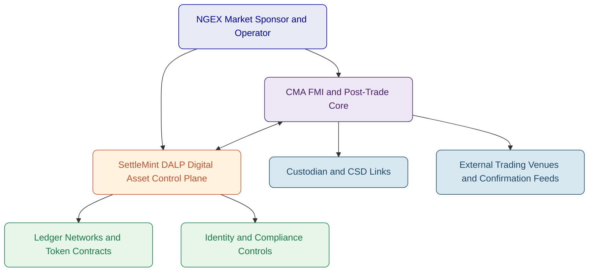
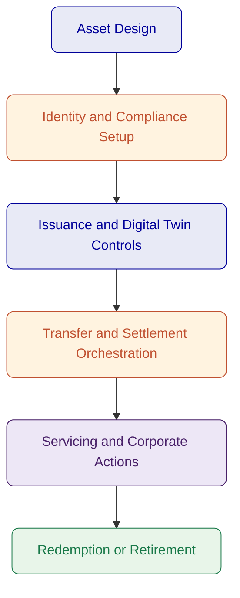
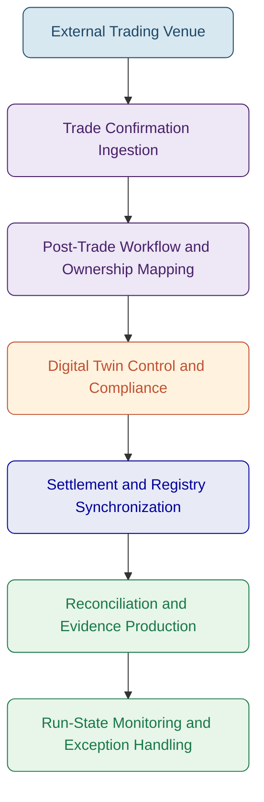
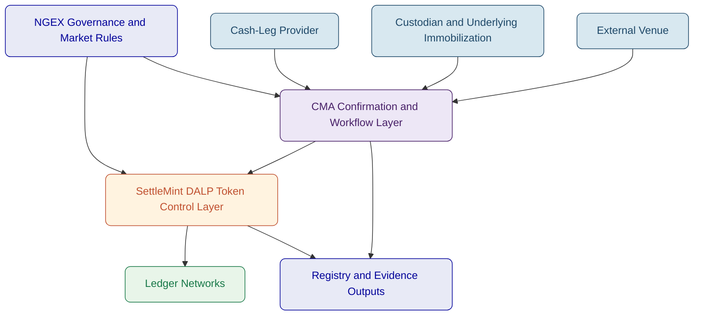
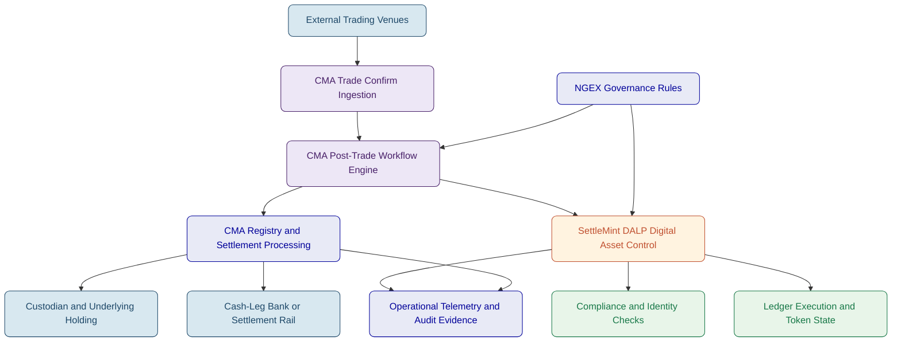
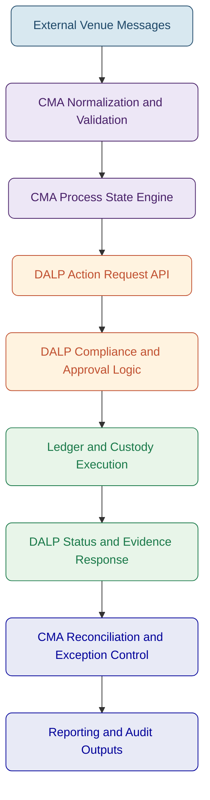
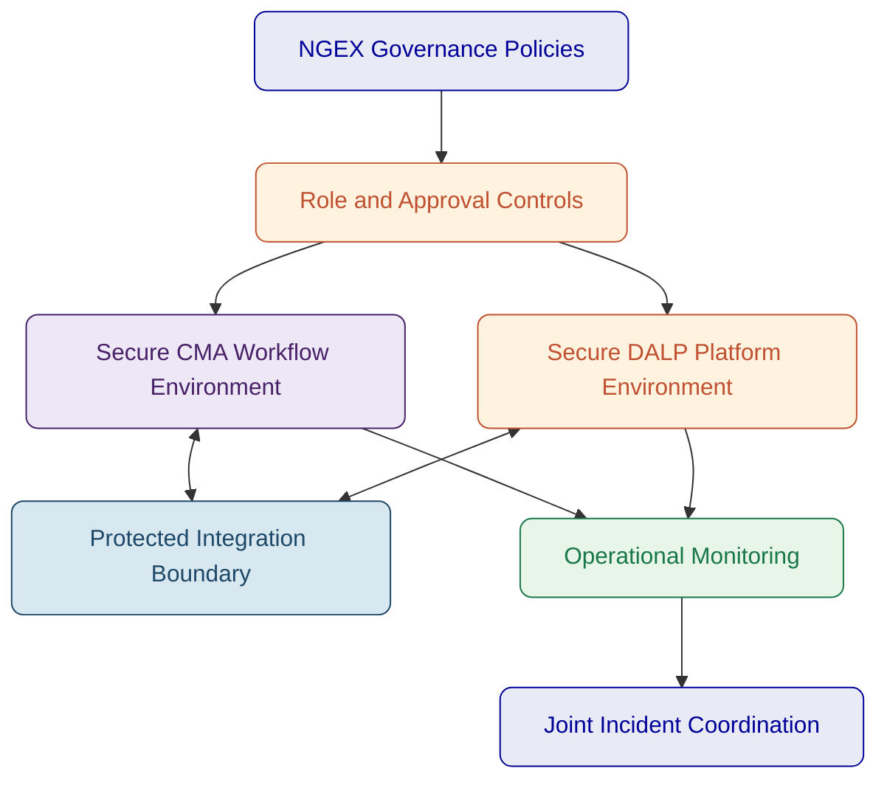
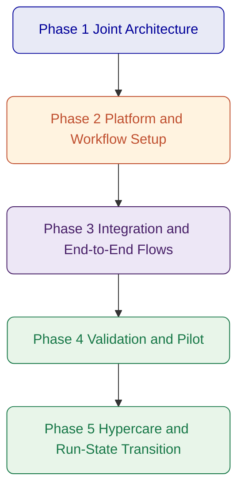
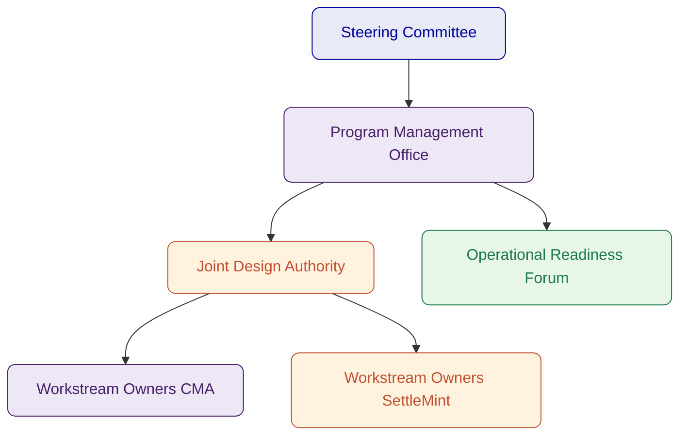
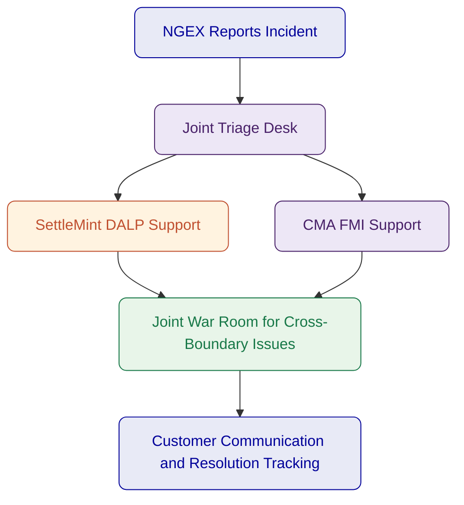

# Executive Summary

NGEX has framed the opportunity correctly. Tokenizing ETF units is not the hard part. The hard part is building a post-trade operating model that stands up under regulated-market scrutiny, preserves clear legal and operational boundaries, handles reconciliations and exceptions with discipline, and can expand from a digital-twin MVP into a broader digital securities infrastructure without forcing a redesign. That is the real selection problem in this opportunity.

The joint response from CMA Small Systems AB and SettleMint is designed around that reality. CMA brings decades of financial market infrastructure experience across central banks, payment systems, securities depositories, and post-trade operations. SettleMint brings DALP, the Digital Asset Lifecycle Platform, which provides the digital asset control plane required for token issuance, lifecycle governance, identity-linked compliance, ledger operations, and atomic settlement orchestration. Together, the consortium covers the two domains NGEX needs to combine: proven traditional FMI operating discipline and production-grade digital asset lifecycle infrastructure.

For the MVP, NGEX wants tokenized ETF units issued as digital twins. That model requires strict 1:1 supply alignment between an immobilized traditional security position and its corresponding token representation on distributed ledger infrastructure. It also requires role clarity across the market structure. In the proposed consortium model, CMA provides the post-trade core that handles depository and registry-style functions, settlement processing coordination, downstream workflow control, evidence production, and operating model governance for market-infrastructure grade processing. SettleMint provides the DALP platform layer that manages token lifecycle configuration, digital twin mint and burn controls, eligibility enforcement, wallet and identity linked restrictions, programmable servicing workflows, and ledger integration across the digital asset perimeter. NGEX retains its role as market sponsor, rule setter, and operator of the target business model, while custodians, cash-leg banks, and venue operators remain clearly bounded third-party roles.

This matters because NGEX explicitly asked respondents not to blur roles. The consortium does not present a vague end-to-end black box. It presents a controlled operating model in which each party owns a defined scope, every handoff is visible, and cross-partner governance is explicit. That is the right architecture for a future market infrastructure, because portability, resilience, and auditability depend on clear interfaces rather than on a monolithic vendor story.

The proposed MVP approach is deliberately pragmatic. It starts with external venue trade confirmations, ingests them into a governed post-trade workflow, validates entitlement and settlement conditions, instructs digital twin movements through DALP, synchronizes registry and depository records through CMA's post-trade infrastructure, and produces evidential outputs for operations, compliance, and audit. That gives NGEX a practical path to validating tokenized ETF post-trade operations under real control conditions. At the same time, the reusable foundation is designed so that the same architecture can later support native digital issuance, more complex corporate actions, broader servicing requirements, additional custodians or CSD-style links, and more than one target ledger environment.

The consortium also aligns with NGEX's non-negotiables. It avoids single points of dependency by separating the digital asset control plane from the broader market-infrastructure and depository functions. It supports interoperability through standards-based integration patterns, portable data exports, and modular ledger connectivity. It enforces segregation of duties through maker-checker and multi-approver controls in DALP and through operational workflow governance in CMA's FMI environment. It treats auditability as a first-class capability, not a reporting afterthought. It is designed for security-by-design, with clear responsibility boundaries for identity, access, approval, settlement, exception handling, and incident coordination. Finally, it provides a credible route away from single-ledger lock-in by distinguishing the reusable orchestration layer from the specific ledger endpoints used in each phase.

The consortium's value is not just that both parties are strong. It is that their strengths fit the exact seam NGEX is trying to address. CMA covers the institutional post-trade domain that must remain stable, controlled, and regulator-ready. SettleMint covers the digital asset lifecycle domain that must be flexible, programmable, and compliant at the point of execution. The result is a joint solution that addresses NGEX's full requirement perimeter for the MVP while preserving the ability to expand into bonds, equities, and native digital issuances over time.

The table below summarizes the buyer need, consortium contribution, and joint outcome.

| Buyer need | SettleMint contribution | CMA contribution | Joint outcome |
| --- | --- | --- | --- |
| Digital twin ETF MVP with fast time-to-market | DALP token lifecycle, compliance, digital twin controls, ledger integration | Post-trade workflow engine, registry and settlement operations, FMI process governance | Controlled MVP validating a practical tokenized ETF operating model |
| Clear role separation | Platform role boundaries for tokenization, identity, compliance, settlement orchestration | Boundaries for depository, registry, post-trade operations, reconciliation, evidence outputs | Evaluators can see who owns what without ambiguity |
| Reusable foundation for bonds and equities | Asset lifecycle templates and configurable token logic across multiple asset classes | Reusable post-trade operating model and integration architecture for broader securities processing | Expansion path without rebuilding the stack |
| Strong approvals, auditability, and evidence | Maker-checker, multi-approver controls, structured event trails, policy enforcement | End-to-end workflow ownership, reconciliation, breaks, reporting, operational evidence | Market-infrastructure grade audit and control posture |
| Interoperability and portability | API-first platform, portable logs and configuration, ledger abstraction approach | Standards-based integration and modular post-trade system interfaces | Credible path to additional service providers and ledgers |
| Security and operational resilience | Role-based access, custody integration patterns, observability, incident support | Established FMI resilience patterns, operational control, run-state discipline | Joint delivery model suited to regulated production environments |

The proposal that follows explains the consortium logic, the scope split, the target operating architecture, the implementation approach, and the compliance view in detail. Throughout the document, responsibility is made explicit. That is intentional. NGEX is not buying software in isolation. It is evaluating whether a future digital post-trade infrastructure can be delivered with the discipline required for a sovereign-backed market initiative. This consortium is structured to answer that question with clarity.

---

# About the Consortium / Partnership

CMA Small Systems AB and SettleMint are proposing a controlled consortium model built around complementary scopes rather than overlapping claims. The partnership exists for a simple reason: NGEX's target state sits at the intersection of two specialist domains. One is the market-infrastructure domain, where depository logic, registry discipline, settlement workflow control, operational evidence, and day-two resilience are essential. The other is the digital asset lifecycle domain, where digital twins, programmable restrictions, identity-linked compliance, ledger operations, and token servicing become the execution layer for new market rails. Few organizations cover both domains deeply in one platform. This consortium brings the right split.

CMA is the traditional FMI and post-trade lead. Its background in central bank systems, securities depositories, RTGS environments, and post-trade processing gives NGEX a delivery partner that understands market-infrastructure operating models, operational control, and regulated production discipline. CMA's references include regional and national-scale infrastructure such as BUNA, AFAQ, Pakistan PRISM+, and Singapore MEPS+ contingency infrastructure. That experience matters because NGEX is not validating a niche issuance tool. It is evaluating infrastructure that must work as a controlled post-trade environment.

SettleMint is the digital asset platform lead. DALP provides the lifecycle layer for regulated digital assets, covering asset design, issuance, compliance enforcement, identity-linked transfer eligibility, settlement orchestration, corporate actions, observability, and deployment flexibility. DALP is relevant here not because it can mint tokens, but because it provides the digital asset controls that let a market-infrastructure model operate with programmable governance and evidential integrity. That includes digital twin supply controls, ledger-facing approval workflows, ex-ante compliance, and integration interfaces into upstream and downstream financial systems.

The partnership is therefore not an alliance of convenience. It is a scoped operating model. CMA and SettleMint cover different layers of the target capability stack and interact through defined interfaces. Each party remains accountable for its owned domain. Shared responsibilities, such as architecture assurance, integration design, testing coordination, governance, and joint customer reporting, are called out explicitly rather than implied.

The consortium operating principle is single-team delivery with dual-scope accountability. From NGEX's perspective, the proposal should feel like one coordinated response, not two disconnected vendor documents stitched together. That means the consortium commits to one joint architecture baseline, one implementation plan, one governance structure, one risk register, one support handoff model, and one compliance view. It does not mean responsibility is blurred. On the contrary, the value of the joint response is that it combines coordinated delivery with precise accountability.

The capability model below summarizes how the consortium is structured.

| Capability domain | SettleMint | CMA | Joint value |
| --- | --- | --- | --- |
| Digital asset lifecycle | Owns DALP asset configuration, issuance, compliance, servicing, ledger operations | Integrates digital asset events into broader post-trade workflow | Digital assets are controlled as part of a regulated operating model |
| Registry and depository logic | Interfaces with authoritative records through DALP-controlled events and reconciliations | Owns depository and registry-style post-trade scope | Clear authoritative-state model across digital and conventional environments |
| Settlement workflow | Owns atomic DvP/XvP orchestration within DALP scope where digital legs are involved | Owns settlement processing patterns, run-state workflow control, net or gross processing coordination | Practical post-trade settlement design across both digital and traditional components |
| Identity and compliance | Owns identity-linked transfer rules, wallet restrictions, compliance modules, policy enforcement | Owns broader operating model alignment with market rules and participant processes | Policy is enforced before execution and embedded into run-state operations |
| Integration and orchestration | API-first DALP integration layer, events, monitoring, and ledger connectors | FMI integration patterns, trade-confirm ingestion, post-trade orchestration, operational evidence | End-to-end process continuity from venue confirmation to evidencing |
| Security and resilience | Platform security, RBAC, custody integration patterns, observability | FMI security controls, operational resilience, infrastructure discipline | Shared responsibility model suitable for market-infrastructure environments |

The consortium commercial interface can be structured in more than one way depending on NGEX's procurement preference. The essential point is operational rather than legal: NGEX needs a consortium that behaves like one delivery team during design, implementation, testing, and run-state transition. The proposal therefore assumes a joint design authority, a coordinated program cadence, and a shared issue and change-control process, while maintaining direct scope accountability by workstream owner.

The consortium is also relevant to NGEX's strategic intent beyond the MVP. NGEX wants a reusable foundation that can expand from tokenized ETF units to bonds, equities, and more complex servicing and entitlement structures. That requires a solution that separates reusable core capabilities from asset-specific overlays. DALP provides the reusable digital asset control plane. CMA provides the reusable post-trade and market-infrastructure processing backbone. Asset-specific expansion then happens through product configuration, rule extensions, and integration additions, not through a fundamental rewrite of the architecture.

This operating logic reduces delivery risk. It avoids the common failure mode in digital asset programs where one vendor claims end-to-end coverage but is thin in one of the domains that matter most. It also avoids the opposite failure mode, where a bank or market infrastructure buyer is left coordinating multiple point vendors with no clear system integrator or authority boundary. The consortium offers a middle path that is much better suited to NGEX's brief: one controlled response, two specialist scopes, explicit interfaces, and clear accountability.

*Figure: Consortium operating model showing NGEX as market sponsor, CMA as FMI and post-trade lead, and SettleMint as digital asset platform lead.*

---

# About SettleMint

SettleMint is the digital asset lifecycle platform provider within this consortium. Its role in the NGEX opportunity is specific: provide the DALP platform layer that governs tokenized instrument creation, lifecycle events, compliance enforcement, ledger interaction, and digital asset operations in a way that fits regulated financial-market deployment.

SettleMint has spent close to a decade building enterprise and regulated blockchain infrastructure. That matters because the gap in this market is no longer basic tokenization capability. Many institutions can demonstrate a token. Far fewer can run digital assets inside operational models that satisfy risk, compliance, technology, and business stakeholders at the same time. SettleMint's positioning is built around that difference. Tokenization itself has become accessible. Doing it right in production remains hard.

DALP is the expression of that focus. It is not a single-purpose issuance tool. It is a digital asset lifecycle platform that covers asset design, issuance, identity-linked compliance, custody integration, atomic settlement patterns, servicing, corporate actions, monitoring, and deployment flexibility. For NGEX, that matters because the MVP must validate an operating model, not just a token contract. DALP provides the control plane that lets digital asset events be governed in a repeatable, auditable, and integration-ready way.

SettleMint's relevance to NGEX is strengthened by its asset-class breadth and delivery fit. DALP supports bonds, equities, funds, deposits, stablecoins, real estate, and precious metals through purpose-built templates, as well as configurable token patterns for broader instrument types. That allows the NGEX MVP to start with ETF units as digital twins while preserving a realistic path toward bonds, equities, and native digital issuance models later. The reusable platform components remain the same. The product logic, rule sets, and integrations can evolve by asset class without changing the overall operating model.

The platform is also designed for regulated environments. DALP supports ERC-3643 based regulated token patterns, OnchainID-linked identity and claim verification, maker-checker and multi-approver workflows, structured audit trails, and multiple deployment models including managed cloud, private cloud, on-premises, and hybrid. It integrates with institutional custody patterns rather than trying to replace them, and it supports EVM-compatible networks while maintaining an abstraction layer that allows the operating model to expand over time.

From a market perspective, SettleMint has worked across banks, sovereign entities, and market-infrastructure adjacent programs. Reference programs include digital exchange and tokenized securities work with institutions such as Standard Chartered Bank, OCBC, Commerzbank, Maybank, Mizuho Bank, Sony Bank, and sovereign or national-scale initiatives such as the Saudi RER program. The exact relevance of each reference varies by use case, but collectively they demonstrate that SettleMint has experience in the environments that matter for NGEX: regulated financial services, tokenized instruments, integration-heavy enterprise landscapes, and public-sector or sovereign programs.

SettleMint is not presented here as the end-to-end market infrastructure provider. That would be the wrong claim. Its value in this consortium is that it brings the digital asset platform layer required to make NGEX's digital post-trade ambition operationally real. It is the component that ensures digital twins are governed correctly, transfers are compliance-checked before execution, lifecycle events are tracked with evidence, and ledger interactions sit inside a controlled institutional workflow.

| Category | Evidence of relevance |
| --- | --- |
| Platform scope | Digital asset lifecycle platform covering issuance, compliance, custody integration, settlement orchestration, servicing, and observability |
| Asset breadth | Bonds, equities, funds, deposits, stablecoins, real estate, precious metals, configurable token patterns |
| Regulatory posture | ERC-3643, OnchainID, jurisdictional compliance templates, role-based approvals, auditability |
| Deployment flexibility | Managed SaaS, private cloud, on-premises, hybrid |
| Integration fit | API-first architecture, event-driven interfaces, custody integrations, payment-rail connectivity |
| Buyer relevance | Experience supporting banks, sovereign entities, and tokenized market infrastructure programs |

*Figure: DALP dashboard showing the operational control environment used to monitor assets, events, and pending actions.*

SettleMint's role in this proposal is therefore precise. It provides the digital asset operating layer NGEX needs in order to launch and control tokenized ETF units as digital twins, and later extend the model to broader digital securities use cases. It does so as a platform provider, not a consulting body and not a replacement for market participants whose roles properly remain outside the DALP boundary.

---

# About DALP

DALP, the Digital Asset Lifecycle Platform, is the SettleMint platform brought into this consortium. In the NGEX context, DALP should be understood as the programmable control plane for digital securities lifecycle management. It is the layer where tokenized instrument rules are configured, where digital twin issuance and burn events are governed, where wallet and investor eligibility are enforced, where ledger interactions are orchestrated, and where evidence of critical actions is retained for regulated review.

That role is important because NGEX is not evaluating an isolated tokenization engine. It is evaluating how digital asset operations can be embedded into a post-trade market structure. DALP is designed for precisely that kind of embedded deployment. It sits between core institutional systems and blockchain networks, and exposes the governance, workflow, and integration controls needed to make digital assets operable in production.

DALP's lifecycle scope starts with asset design. Through the Asset Designer and configuration workflows, business and operations teams can define the parameters of tokenized instruments, choose asset classes, set denomination and lifecycle logic, attach identity and compliance requirements, and prepare the deployment baseline. This reduces the need to handle each new instrument type as a bespoke software effort. For NGEX, that means the MVP can focus on tokenized ETF units while the same platform primitives remain available for later bonds, equities, funds, or native digital issuances.

*Figure: DALP Asset Designer showing the multi-asset configuration model used to extend beyond ETF twins over time.*

The second pillar is compliance and identity. DALP supports ex-ante enforcement, which means the platform validates eligibility before a transfer or lifecycle action executes. That is a critical distinction for market-infrastructure grade operations. Post-event review is useful for audit. It is not enough for control. DALP combines regulated token standards, policy templates, on-chain identity claims, allowlists, freezes, transfer restrictions, and investor qualification rules into one enforcement model. In NGEX's MVP, this supports the governance needed to ensure that digital twins move only under approved conditions. In future phases, the same policy layer can adapt to other instruments, jurisdictions, and participant categories.

*Figure: DALP compliance template library illustrating the policy-driven approach to transfer and eligibility controls.*

The third pillar is token lifecycle governance. DALP supports issuance and burn controls, maker-checker approval flows, multi-approver policies, freeze and restriction features, evidence capture, and controlled servicing actions such as distributions, redemptions, and other lifecycle events. In a digital twin model, these controls matter because token supply must remain tightly synchronized with the immobilized underlying. DALP does not solve that synchronization in isolation. It works with the authoritative registry, depository, and operational processes owned in the wider architecture. But it provides the token-side controls that make synchronization manageable and auditable.

The fourth pillar is settlement orchestration. DALP supports DvP and XvP patterns, including atomic execution models for digital asset and cash-leg coordination where the required assumptions are met. In the NGEX architecture, that capability is used where the digital leg is in scope. It is not claimed as a replacement for the broader post-trade processing and settlement operating model owned by CMA and the relevant financial participants. Instead, DALP acts as the digital transaction control layer that can coordinate with the post-trade core, custody environment, and cash-leg arrangements.

The fifth pillar is observability and operability. DALP includes metrics, logs, tracing, alerting, and structured monitoring interfaces. For NGEX, this matters because operational resiliency and evidence production are explicit non-negotiables. The platform is designed to expose the operational facts required to monitor activity, review exceptions, and support regulatory or audit review. That complements the end-to-end post-trade evidence model managed through the broader consortium architecture.

*Figure: Identity and verification oversight within DALP, showing how compliance and participant data are operationalized.*

DALP also contributes to NGEX's ledger portability objectives. Today, DALP is strongest across EVM-compatible ledger environments, including public and permissioned EVM networks. The platform's abstraction approach keeps the digital asset operating model separate from any one ledger endpoint. For NGEX, that means the MVP can proceed on a suitable initial ledger strategy while the broader architecture remains structured to support later expansion, rather than binding the entire operating model to one network decision.

The relevance of DALP to NGEX is therefore best understood in six capability domains:

| DALP capability domain | Relevance to NGEX |
| --- | --- |
| Asset configuration and deployment | Rapid setup of ETF twin model with path to broader instrument coverage |
| Identity and compliance | Ex-ante transfer and participant eligibility controls |
| Digital twin lifecycle governance | Controlled mint, burn, freeze, restriction, and evidence flows |
| Settlement orchestration | Digital-leg control for DvP and XvP style patterns |
| Integration and APIs | Connectivity into CMA post-trade workflows, custody, and market participants |
| Monitoring and evidence | Operational telemetry and audit-ready event data |

*Figure: DALP lifecycle view from asset design through retirement.*

In this consortium, DALP does not attempt to own all post-trade functions. That is deliberate. Its job is to ensure that digital asset actions are executed, governed, and evidenced correctly within the wider market-infrastructure design. That is the right fit for NGEX's objectives and for the division of scope between SettleMint and CMA.

---

# About CMA Small Systems AB

CMA Small Systems AB is the market-infrastructure and post-trade lead in this consortium. Its role in the NGEX opportunity is to provide the traditional FMI operating backbone required to translate external trading outcomes into controlled post-trade workflows, settlement instructions, registry updates, reconciliation processes, exception handling, and evidential outputs suitable for regulated-market operations.

CMA brings more than three decades of experience delivering critical financial infrastructure for central banks, market operators, and national financial systems. Its platform portfolio spans real-time gross settlement, retail and instant payment systems, transaction management and integration layers, central securities depository and registry platforms, and trading infrastructure. For NGEX, that background is highly relevant because the target solution is not just about token lifecycle mechanics. It is about whether digital rails can be inserted into a governed post-trade infrastructure with the same discipline expected of national or regional market systems.

CMA's response to the original NGEX RFI makes its positioning clear. It understands the scope as a post-trade infrastructure problem with digital ledger integration requirements. It does not present blockchain as a standalone answer. Instead, it frames the challenge around operating model definition, workflow ownership, day-two operations, settlement processing, reconciliation, and the institutional responsibilities that sit around the ledger itself. That is the right perspective for this opportunity and a major reason why CMA is the correct partner in this consortium.

CMA's reference base includes deployments such as the Arab Monetary Fund's BUNA regional financial infrastructure, Gulf Payments Company's AFAQ cross-border payment infrastructure, the State Bank of Pakistan's PRISM+, the Monetary Authority of Singapore's MEPS+ contingency infrastructure, and multiple capital market, depository, and trading implementations. Those references show experience with high-stakes financial infrastructure, cross-institution coordination, and regulated production operations.

For NGEX, CMA's relevance can be summarized across five domains. First, it understands how post-trade workflows are documented and controlled, including day-two operational realities such as breaks, incident handling, and evidential reporting. Second, it can define role boundaries across infrastructure participants, which is critical for NGEX's operating model. Third, it provides the processing layer for trade-confirm ingestion and downstream post-trade events. Fourth, it can support registry, settlement, and reconciliation discipline. Fifth, it brings the program and governance maturity expected in infrastructure implementations involving many stakeholders.

| CMA capability domain | Relevance to NGEX |
| --- | --- |
| FMI and depository experience | Supports design of a controlled digital post-trade operating model |
| Trade-confirm ingestion and post-trade workflow control | Connects external venue outcomes to downstream processing and evidence |
| Registry and settlement operations | Provides the authoritative process backbone around digital twin events |
| Reconciliation and exception handling | Addresses one of NGEX's clearest non-negotiables for run-state operations |
| Security, resilience, and governance | Brings market-infrastructure discipline to implementation and operations |

CMA's own RFI response also acknowledges an important point: tokenized instruments are emerging, and traditional FMI experience needs to be paired with a digital asset platform rather than stretched into that role alone. That is one of the core strengths of this consortium design. CMA does not need to become a tokenization platform. It needs to work with one. SettleMint does not need to become a traditional CSD or FMI core. It needs to integrate with one. The partnership is credible because it respects those truths instead of trying to blur them.

From an NGEX perspective, CMA provides confidence that the wider market-structure obligations around a digital twin model will be handled with institutional discipline. That includes operational modeling, workflow accountability, settlement and reconciliation governance, controls for run-state processing, and evidence production. These are not side considerations. They are the conditions under which the MVP can be trusted.

---

# Customer References, SettleMint

SettleMint's references are strongest when evaluated against the specific digital asset scope it owns in this consortium: regulated tokenization, lifecycle governance, compliance, settlement orchestration, and integration into institutional environments. Several references are particularly relevant to NGEX's objectives because they combine regulated-market context with asset tokenization, operational controls, or sovereign-grade delivery.

The first relevant reference is Standard Chartered Bank, where SettleMint collaborated on a blockchain-based digital exchange model for fractionalized securities. The relevance is not that NGEX wants to replicate that exact structure. The relevance is that SettleMint has worked on institutional tokenized securities in regions including Asia, Africa, and the Middle East, with a focus on ownership recording, transparency, and more efficient settlement models.

The second is Commerzbank, where SettleMint supported a hybrid on-chain and off-chain model for ETP issuance and management with near real-time clearing and settlement. This is particularly relevant to NGEX's digital twin ambition because it demonstrates the use of digital asset infrastructure in a model that still interacts with conventional market structures rather than assuming a fully native digital market from day one.

The third is Maybank Project Photon, where SettleMint supported exchange-versus-payment flows for tokenized currency settlement. That reference is relevant because it demonstrates DALP's settlement orchestration logic in a financial institution context, especially where both digital asset and cash-leg coordination matter.

The fourth is ADI Finstreet, which is highly relevant geographically and functionally. It demonstrates tokenized equity issuance and lifecycle handling in Abu Dhabi, with institutional custody pathways and governed contract controls. While NGEX's MVP is focused on ETF units as digital twins, the ADI program shows that SettleMint can operate in UAE and GCC contexts with regulated capital-markets relevance.

The fifth is Mizuho Bank, which is relevant because it reflects a platform-led approach to bond tokenization and trade finance without requiring that everything be framed as a custom delivery project. That aligns with NGEX's need for a reusable foundation rather than a one-off build.

A summary table is below.

| Reference | Scope relevance to NGEX | Why it matters |
| --- | --- | --- |
| Standard Chartered Bank | Tokenized securities and institutional trading context | Demonstrates regulated tokenized instrument operations in growth-market regions |
| Commerzbank | Hybrid on-chain and off-chain issuance, near real-time settlement | Relevant to digital twin models bridging conventional and digital records |
| Maybank Project Photon | XvP and tokenized cash-leg coordination | Relevant to settlement design and reduced counterparty risk |
| ADI Finstreet | Tokenized equity in Abu Dhabi, custody integration, governance | Strong regional signal and capital-markets alignment |
| Mizuho Bank | Bond tokenization using standard platform capabilities | Relevant to future NGEX expansion beyond ETFs |
| OCBC Bank | Security token engine with wallet and off-chain integration | Demonstrates platform fit for managed tokenized asset environments |
| Saudi RER | Sovereign-scale digital asset infrastructure | Demonstrates delivery discipline for national-scale programs |

The ADI Finstreet reference deserves specific attention because it demonstrates that SettleMint has already supported a regulated tokenized capital-markets style environment in Abu Dhabi. The exact product scope is different from NGEX's target. Even so, the reference is materially useful because it shows SettleMint's ability to support institutional-grade token lifecycle controls, corporate actions, governance, and custody integration within the GCC environment.

The Commerzbank reference is equally instructive. NGEX is not trying to leap immediately to a fully native digital market. It is starting with a digital twin model. Commerzbank's hybrid operating pattern shows why a platform like DALP is relevant in that setting. It can coordinate digital and traditional components without pretending the entire market structure has already moved on-chain.

Finally, Project Photon with Maybank is relevant to the settlement layer. NGEX asked respondents to be explicit about DvP assumptions, cash-leg dependencies, and the difference between current capability and wider ecosystem requirements. The Maybank reference demonstrates that SettleMint's platform scope includes the programmable coordination logic needed for such patterns when the surrounding infrastructure and assumptions are in place.

These references do not replace the need for CMA's FMI references. They complement them. SettleMint's strength is in the digital asset lifecycle layer. The references above show that the layer is not theoretical and has already been applied in contexts that are directly relevant to NGEX's roadmap.

---

# Customer References, CMA

CMA's references are strongest when assessed against the market-infrastructure and post-trade responsibilities it owns in this consortium. NGEX is not just looking for software features. It is looking for evidence that the delivery team understands national and regional infrastructure operations, the realities of post-trade coordination, and the governance required in regulated financial environments. CMA's references speak directly to those needs.

Pakistan PRISM+ is a strong reference because it demonstrates CMA's work in integrated financial market infrastructure. It shows experience in environments where multiple participants, high-value workflows, and institutional control structures must operate reliably. That kind of experience is directly relevant to NGEX's ambition to establish a digital post-trade environment that is more automated and auditable without losing market-grade control.

BUNA and AFAQ are also highly relevant. Both references show CMA's experience with regional infrastructure and cross-border financial systems. They demonstrate that CMA understands how to design platforms that serve more than one institution, reconcile multiple participants, and maintain operational discipline across interfaces and dependencies. NGEX's future-state architecture will need exactly this kind of thinking, especially as it seeks portability and optionality across custodians, infrastructures, and ledgers over time.

Singapore MEPS+ contingency infrastructure is another important signal. Contingency and resilience capability are not decorative strengths in financial market infrastructure. They are part of the core operating discipline. NGEX explicitly asked for resilience, observability, and recovery posture. CMA's background in this space helps strengthen the consortium's answer in those areas.

The broader depository and capital-markets references, including Vietnam Securities Depository and other capital market infrastructure implementations, also matter because they show practical familiarity with securities custody, depository logic, settlement environments, and operational market workflows. That is the domain into which DALP must integrate for the NGEX MVP.

| CMA reference | Scope relevance to NGEX | Why it matters |
| --- | --- | --- |
| PRISM+ State Bank of Pakistan | Integrated financial market infrastructure | Shows FMI delivery maturity in regulated environments |
| BUNA | Regional financial infrastructure | Demonstrates multi-participant operational and governance experience |
| AFAQ | Cross-border payment infrastructure | Shows standards-based integration and regional scale discipline |
| MEPS+ contingency infrastructure | Resilience and continuity for critical market systems | Relevant to NGEX resilience and recovery expectations |
| Vietnam Securities Depository | Capital-markets depository infrastructure | Relevant to registry, securities processing, and post-trade discipline |
| Other depository and trading references | Market operator and infrastructure design | Supports credibility for workflow ownership and settlement operations |

These references are important not because NGEX is buying an RTGS or replicating a national payment system. They are important because they show that CMA has spent decades delivering systems in environments where reliability, governance, clear operating boundaries, and evidential control are part of the basic entry requirement. That experience is directly transferable to the post-trade perimeter NGEX is trying to modernize.

---

# Joint Customer References

At the time of writing, the consortium does not claim an existing named joint reference in which CMA and SettleMint have already delivered this exact combination together for a customer. It would be the wrong move to pretend otherwise. NGEX asked respondents to be explicit about current evidence, gaps, and dependencies, and this proposal follows that instruction.

The absence of a named joint reference does not weaken the logic of the consortium. It simply changes the proof model. Instead of relying on a prior combined case study, the consortium demonstrates delivery confidence through three things. First, each party brings references that are highly relevant to its owned scope. Second, the scope split is unusually clear, which reduces the risk that responsibilities will be contested mid-project. Third, the joint governance, integration design, and implementation plan in this proposal are intentionally detailed so that NGEX can evaluate how the two parties will work together rather than being asked to assume they will.

That is the correct way to handle a first-of-its-kind joint bid in a market like this. Financial market infrastructure programs are rarely won because two vendors claim they have worked together before. They are won because the buyer can see a coherent operating model, strong individual references, and a realistic approach to integration, governance, and run-state accountability.

| Combined scope proof component | Evidence basis |
| --- | --- |
| Traditional FMI and post-trade domain | CMA references across BUNA, AFAQ, PRISM+, MEPS+, depository and market infrastructure projects |
| Digital asset lifecycle and tokenization domain | SettleMint references across ADI, Maybank, Commerzbank, Standard Chartered, Mizuho, and other regulated digital asset programs |
| Delivery together | This proposal's joint architecture, explicit responsibility matrix, integrated implementation plan, and shared governance model |

NGEX should therefore evaluate the consortium on the clarity of its combined operating model and the strength of each party in its respective layer. That is the more relevant test for a future digital post-trade infrastructure than a forced joint reference that would not actually match the requirement.

---

# Understanding of Requirements

NGEX's RFI is disciplined and unusually clear. The core requirement is not a generic tokenization platform. It is a digital post-trade financial market infrastructure with an MVP centered on tokenized ETF units as digital twins, and with a long-term objective of building a reusable foundation for broader digital securities infrastructure. The right response must therefore address four dimensions at once: operating model clarity, post-trade process integrity, digital asset lifecycle control, and long-term extensibility.

The first requirement domain is role and accountability clarity. NGEX repeatedly asks respondents to be explicit about what they provide versus what is provided by custodians, CSDs, settlement banks, venues, registrars, and other third parties. That signals an evaluator concern that some vendors will overclaim. The consortium interprets this as one of the central scoring dimensions. It is why this proposal makes the scope split visible throughout. CMA addresses the FMI and post-trade layer. SettleMint addresses the digital asset platform layer. NGEX and external market participants retain their distinct responsibilities.

The second requirement domain is digital twin control. NGEX defines digital twins precisely: the underlying traditional security remains immobilized in conventional infrastructure, the distributed ledger record becomes the operative record for the security token, and strict controls must maintain 1:1 alignment between the underlying and the token. That means the architecture must support mint and burn approval control, ongoing reconciliation, break handling, and authoritative-state governance across more than one system. This is not just a smart contract feature. It is a joint operating model challenge, which is why both consortium partners are required.

The third domain is post-trade workflow support. Trading venue functionality is out of scope. External venues produce trade confirmations that must be ingested and transformed into downstream processing steps including settlement instructions, reconciliations, exception handling, reporting, and evidence production. The consortium reads this as an explicit requirement for a post-trade orchestration core, not merely a ledger event handler. CMA owns that process layer. DALP then provides the programmable digital-asset controls where token-side actions and settlement coordination are required.

The fourth domain is future portability. NGEX does not want to solve only for ETF twins on one ledger with one service-provider arrangement. It wants a reusable foundation that can later support native digital issuance, more asset classes, more servicing complexity, more counterparties, and more than one ledger environment. That means the architecture must separate reusable core components from asset-class specific overlays, and it must avoid hard dependencies on one custodian, one depository link, or one ledger design. The consortium's layered model is designed for that reason.

The fifth domain is governance and control. NGEX calls out segregation of duties, maker-checker, configurable multi-approver workflows, auditability, monitoring, reconciliation, exception handling, and evidence production as first-class design principles. The consortium interprets that as a signal that operational maturity matters at least as much as raw feature count. DALP contributes digital approvals, policy enforcement, and ledger-side audit trails. CMA contributes operational workflows, ownership mapping, and the run-state controls needed to make those platform controls meaningful in the broader infrastructure.

The sixth domain is security and resilience. NGEX is not satisfied with abstract security claims. It asks for access controls, key management where applicable, incident response, observability, resilience expectations, and portability. Here again, the right answer is joint. SettleMint covers platform security, custody integration patterns, access and approval models, and platform observability. CMA covers the wider FMI environment, operational continuity, and the discipline of production support in critical financial systems.

The requirement themes can be summarized as follows.

| Requirement theme | Primary lead | Why it matters |
| --- | --- | --- |
| Role declaration and responsibility split | Joint | NGEX wants scope honesty and operational clarity |
| Operating model and workflow ownership | CMA-led, SettleMint contributing | Post-trade success depends on visible process accountability |
| Digital twin and native issuance capability | SettleMint-led, CMA contributing | NGEX needs both immediate MVP fit and future-state evolution |
| Settlement, reconciliation, and exceptions | CMA-led, SettleMint contributing | Core post-trade credibility depends on these functions |
| Controls, approvals, and auditability | Joint | Market infrastructure requires governance at every critical action |
| Ledger compatibility and portability | SettleMint-led, CMA contributing | NGEX wants future flexibility without redesign |

*Figure: Requirement logic from trade confirmation to controlled run-state operations.*

Taken together, NGEX's requirement set points to a solution that must be both modular and disciplined. Modular, because it must evolve across asset classes, roles, and ledgers. Disciplined, because post-trade infrastructure cannot rely on vague handoffs or implied responsibilities. That reading of the requirement set underpins the rest of the proposal.

---

# Responsibility Matrix

The responsibility matrix is the control center of the joint response. It translates the consortium model into accountable work domains so that NGEX can see, requirement by requirement, who owns delivery, who contributes, what remains outside consortium scope, and where integration boundaries sit.

The guiding principle is simple. “Shared” is not enough. Every shared domain still needs a lead. The matrix below therefore distinguishes primary ownership from supporting contribution, and explicitly calls out the NGEX and third-party dependencies that must exist for the target state to operate.

| Requirement area | SettleMint scope | CMA scope | Joint / shared | Notes |
| --- | --- | --- | --- | --- |
| Role declaration and solution boundaries | Define DALP platform role, exclusions, assumptions | Define FMI and post-trade role, exclusions, assumptions | Joint consortium narrative | Scope clarity is a first-order control, not just proposal hygiene |
| MVP operating model | Digital-asset step design, token-side approvals, compliance checkpoints | End-to-end post-trade workflow model, participant responsibilities, day-two operations | Joint design authority | CMA leads overall process mapping |
| Deployment model | DALP deployment options and platform topology | FMI core deployment topology and operational placement | Joint environment model | Final choice depends on NGEX infrastructure policy |
| Trade-confirm ingestion | Consume events and act on token-side steps where relevant | Ingest trade confirmations, normalize, orchestrate downstream processing | Joint interface design | Trading venue remains outside scope |
| Digital twin issuance and burn controls | Owns mint, burn, freeze, restriction, policy-driven token actions | Owns registry-side process coordination and authoritative-state workflow | Joint approval and reconciliation model | 1:1 alignment requires both domains |
| Native digital issuance expansion | Owns DALP-native issuance patterns and lifecycle controls | Owns future-state FMI and operational process adaptation | Joint roadmap planning | Not required to deliver full future-state on day one |
| Golden record governance | Token-side authoritative state, event lineage, evidence | Registry, depository, and post-trade authoritative process model | Joint governance design | Must state exactly which record governs which event |
| Settlement processing | DvP and XvP orchestration for digital leg | Gross and net processing coordination, settlement workflows, post-trade controls | Joint settlement design | Cash-leg assumptions stay explicit |
| Reconciliation and break handling | Provide digital event and position data, operational telemetry | Lead reconciliation cycles, break triage, resolution workflow, evidencing | Shared exception runbooks | CMA leads run-state process |
| Identity and transfer restrictions | Owns identity-linked compliance, allowlists, freezes, transfer controls | Aligns participant and operational model with market rules | Shared policy and operating model | Policy enforcement occurs in DALP scope |
| Security and access control | DALP RBAC, custody integration patterns, approval controls | FMI environment security controls and operational security procedures | Shared incident coordination | Incident boundaries must be pre-defined |
| Audit trail and evidence outputs | Structured platform logs, approval evidence, lifecycle event records | End-to-end operational evidence and reporting outputs | Shared evidence catalog | Buyer should not have to combine evidence manually |
| Support and run-state operations | Support DALP scope and digital asset incidents | Support FMI scope and post-trade incidents | Shared incident routing and customer communication | L1/L2/L3 boundaries defined later in proposal |

This matrix deliberately avoids presenting the consortium as an end-to-end black box. NGEX asked for explicit role allocation across vendor, NGEX, and third parties. That means the buyer needs to understand not only what the consortium owns, but also what sits outside the consortium scope.

The most important external roles are the external trading venue, the immobilizing custody or depository arrangement that anchors the underlying ETF units, the cash-leg providers or settlement banks involved in DvP outcomes, and NGEX itself as the market sponsor and operating authority. The consortium does not seek to erase these roles. Instead, it is designed so that they can connect into the post-trade and digital-asset layers through stable, governed interfaces.

The matrix below makes those outside dependencies visible.

| Role | Primary responsibility |
| --- | --- |
| NGEX | Market sponsor, target operating model owner, governance authority, rule-setting, participant framework, acceptance decisions |
| External trading venue | Trade execution and trade confirmation messages |
| Custodian / immobilization arrangement | Safe holding of underlying ETF units backing the digital twin model |
| Settlement bank or cash-leg rail | Cash settlement processing where required by the selected DvP model |
| CMA | Post-trade workflow, registry and depository-style control, settlement coordination, reconciliation, operational evidence |
| SettleMint | Digital asset lifecycle control, token-side governance, compliance enforcement, ledger integration, digital settlement orchestration |

*Figure: Responsibility boundaries across external parties, CMA, SettleMint, and NGEX governance.*

A few boundary decisions deserve special emphasis:

First, SettleMint is not proposed as custodian, CSD, or transfer agent of record outside the digital asset platform scope. DALP integrates with those operating realities. It does not subsume them.

Second, CMA is not proposed as the tokenization or smart-contract control plane. It provides the market-infrastructure and post-trade backbone that DALP integrates into.

Third, NGEX remains the owner of the market model. The consortium delivers technology and delivery governance. It does not take over NGEX's policy-setting or market-sponsor role.

Fourth, shared domains such as settlement design, evidence production, and support are shared in execution but not ambiguous in ownership. Each shared domain has a lead process owner and a supporting platform owner.

This responsibility model is central to the proposal's credibility because it directly answers one of the biggest risks in digital market-infrastructure programs: responsibility confusion after contract signature. The matrix is designed so that confusion does not happen.

---

# SettleMint Solution Scope

SettleMint's delivery scope in this joint response is the DALP platform layer. For NGEX, that scope is not generic blockchain access. It is the part of the architecture that makes digital securities operable under institutional controls. SettleMint's scope therefore covers asset configuration, digital twin token controls, identity and compliance enforcement, wallet and custody integration patterns, settlement orchestration for digital legs, platform telemetry, and API-based integration into the broader post-trade architecture.

For the MVP, SettleMint's first major responsibility is tokenized ETF digital twin management. DALP supports the creation and governance of tokenized instrument representations with controlled issuance, burn, freeze, and transfer restriction capabilities. This is essential to maintaining 1:1 alignment between the immobilized underlying and the tokenized representation. DALP does not establish the legal or depository control of the underlying security on its own. That sits in the wider operating model. But it does provide the policy and execution controls needed so the token side of the twin model behaves predictably and leaves evidence.

Second, SettleMint owns the platform-level compliance and participant eligibility controls. DALP supports allowlists, identity-linked claims, transfer restrictions, and configurable policy enforcement so that token movements occur only when eligibility and workflow conditions are satisfied. In NGEX's operating model, this provides the programmable controls necessary for controlled transfer and settlement behavior. It is also important for future expansion beyond ETFs, because the same policy engine can be adapted to other instrument classes and distribution models.

Third, SettleMint owns the digital leg of settlement orchestration where DALP is involved. This includes DvP or XvP style coordination patterns within the platform's operating boundary, subject to the availability of the selected cash-leg and market infrastructure assumptions. The scope should be read carefully. DALP can coordinate atomic or orchestrated settlement logic for digital assets. It does not replace the need for settlement banks, payment rails, or post-trade workflow governance outside the platform boundary.

Fourth, SettleMint owns digital asset servicing capabilities relevant to the future roadmap. The MVP may not require the full breadth of servicing and entitlements on day one. Even so, the reusable architecture should preserve the ability to add them. DALP provides lifecycle support for distributions, maturity handling, redemptions, and broader servicing patterns. That is relevant because NGEX explicitly wants a foundation that can evolve beyond a narrow MVP.

Fifth, SettleMint owns the ledger integration model within the digital asset perimeter. DALP currently supports EVM-compatible networks and provides a governance and orchestration layer above those networks. It is therefore the consortium component that delivers concrete production capability today for ledger-based digital securities operations. The broader non-EVM and multi-ledger evolution path is treated as an architectural direction, not overstated as current broad production parity.

Sixth, SettleMint owns platform observability and operational telemetry for DALP-controlled actions. The NGEX RFI puts a strong emphasis on monitoring, alerting, tracing, and evidence production. DALP contributes structured platform logs, event telemetry, approval records, and digital asset operational metrics that can be integrated into the broader run-state evidence model.

The scope map below summarizes SettleMint's delivery perimeter.

| DALP scope element | In scope for SettleMint | Interface boundary |
| --- | --- | --- |
| Asset and token configuration | Yes | Inputs from NGEX product and rule decisions |
| Digital twin issuance, burn, freeze, restrictions | Yes | Coordinated with CMA workflow and underlying custody/depository rules |
| Identity-linked compliance and eligibility | Yes | Aligned with NGEX participant policy and external identity processes |
| Ledger deployment and digital transaction execution | Yes | Subject to selected network model and custody arrangements |
| DvP/XvP digital orchestration | Yes, within DALP boundary | Depends on cash-leg and settlement participant arrangements |
| Registry, depository, and post-trade workflow control | No | Owned by CMA and wider market structure |
| External venue execution | No | External trading venues remain out of scope |
| Custody of underlying conventional securities | No | External custodian or equivalent role |

*Figure: DALP compliance expression builder showing how transfer and eligibility rules can be configured for regulated digital assets.*

SettleMint's scope is also explicitly platform-based. This proposal does not assume custom smart-contract development as the delivery model. Where configuration, rule setup, integration, or implementation work is required, it is performed around DALP's platform capabilities and standard deployment patterns. That is consistent with NGEX's need for a reusable foundation rather than a one-off engineering project.

From a delivery standpoint, SettleMint's workstreams in the MVP include DALP environment setup, asset and policy configuration, digital twin control design, ledger and custody integration setup, API and event integration into the post-trade architecture, test support for digital workflows, and production support within its owned scope. Those workstreams are later tied into the joint implementation plan.

---

# Partner Solution Scope

CMA's solution scope in this joint response covers the traditional financial market infrastructure and post-trade processing domains that sit around and above the digital asset platform layer. For NGEX, this includes the workflow and control environment that receives external trade outcomes, transforms them into controlled post-trade processes, coordinates settlement and registry obligations, manages reconciliations and breaks, and produces the operational and evidential outputs required in run-state.

The first major element of CMA's scope is trade-confirm ingestion and post-trade orchestration. Trading venues are out of scope for the RFI, but NGEX clearly requires the target solution to ingest external trade confirmations and convert them into downstream actions. CMA provides the integration and workflow foundation for that process. It normalizes incoming confirmations, routes them into settlement and registry processes, manages step ownership, and creates the operational framework into which DALP's token-side actions are inserted.

The second element is depository and registry-style processing. NGEX's digital twin model assumes that conventional infrastructure remains part of the underlying reality even while the distributed ledger record becomes operative for the tokenized security. That means the architecture needs disciplined control over registry, depository, and authoritative-state processes. CMA owns that domain within the consortium. It provides the broader post-trade infrastructure logic that keeps market records, process states, and institutional responsibilities aligned.

The third element is settlement processing coordination. NGEX asks respondents to describe support for gross and net processing patterns, to state finality assumptions clearly, and to define the roles of banks, settlement agents, stablecoin rails, or other cash-leg providers. CMA owns the broader settlement workflow model. It coordinates with DALP where digital legs are involved, but it remains the primary owner for the end-to-end processing model, including operational control, dependencies, and process accountability.

The fourth element is reconciliation and break handling. This is one of the most important distinctions between a market-infrastructure response and a generic tokenization response. NGEX requires evidence that reconciliations, exception workflows, failed or corrected inputs, and operational overrides will be handled as first-class processes. CMA's scope covers those run-state responsibilities, supported by DALP telemetry and evidence where digital-asset events are involved.

The fifth element is operating model design and day-two operational control. NGEX wants workflow ownership mapping, role allocation, incident handling, monitoring, reporting, and governance. CMA leads these workstreams because they are rooted in financial market infrastructure operations rather than in ledger mechanics alone.

The scope map below summarizes CMA's owned domains.

| CMA scope element | In scope for CMA | Interface boundary |
| --- | --- | --- |
| Trade-confirm ingestion and normalization | Yes | Inputs from external trading venues |
| Post-trade workflow control | Yes | Integrated with DALP digital asset actions where needed |
| Registry and depository-style processing | Yes | Must align with DALP token-state events and NGEX governance |
| Settlement processing coordination | Yes | Works with DALP where digital settlement legs are in scope |
| Reconciliation, exceptions, and evidencing | Yes | Uses DALP outputs for digital events and positions |
| Token issuance and on-ledger restrictions | No | Owned by SettleMint DALP |
| Smart-contract level compliance enforcement | No | Owned by SettleMint DALP |
| External trading venue execution | No | External participant role |

CMA's scope is therefore the institutional control and operating layer around the digital asset platform. That role is critical in the NGEX opportunity because it is exactly where many otherwise attractive digital asset proposals fall short. They can describe a token lifecycle, but they cannot explain how an external trade becomes a governed post-trade outcome with reconciliations, evidence, and day-two accountability. CMA fills that gap.

---

# Joint Solution Architecture

The target architecture combines a post-trade FMI core with a digital asset lifecycle platform through explicit control boundaries. It is not a monolithic system and should not be evaluated as one. It is a layered architecture in which each layer has a distinct job.

At the top of the process are external trading venues and NGEX's market rules. Trading remains outside scope, as defined in the RFI. The architecture therefore starts with trade confirmations received from external venues. Those confirmations enter CMA's post-trade and workflow environment, where they are normalized, validated, and transformed into downstream process steps. This is where ownership mapping, process-state tracking, and operational accountability begin.

The next layer is the post-trade processing core. CMA's systems manage workflow states, settlement preparation, registry and depository interactions, reconciliation logic, exceptions, and evidence outputs. This is the operational backbone that ensures every trade-driven event has an accountable path through the system.

SettleMint DALP sits as the digital asset control layer connected into that backbone. It is responsible for token-side state changes, compliance enforcement, ledger interactions, and digital settlement coordination. When a digital twin mint, burn, freeze, release, or transfer action is required, DALP handles that execution under policy and approval control. The system does not bypass the post-trade core. It acts as a governed digital execution layer inside the broader operating model.

Below DALP sit the selected ledger networks and custody integrations. The initial production capability is strongest on EVM-compatible environments, including public and permissioned EVM networks. DALP also integrates with custody and key-management arrangements through institutional patterns rather than assuming a proprietary closed model.

To the side of these layers sit the external dependencies: the custodian or immobilization arrangement for the underlying ETF units, the cash-leg bank or settlement mechanism, participant identity and onboarding inputs, and NGEX's market rule framework. These dependencies are not hidden. They are part of the architecture because the MVP must operate in the real world, not in an isolated ledger sandbox.

The architecture can be summarized in five control layers.

| Control layer | Primary owner | Purpose |
| --- | --- | --- |
| Market and trade input layer | External venue, NGEX rules | Produces trade outcomes and governing market rules |
| Post-trade processing layer | CMA | Orchestrates workflow, settlement preparation, registry logic, reconciliation, evidence |
| Digital asset control layer | SettleMint DALP | Executes token-side actions, compliance, digital settlement logic, ledger controls |
| Ledger and custody layer | SettleMint with external providers | Handles on-ledger execution and custody-linked transaction patterns |
| External service and infrastructure layer | NGEX and third parties | Underlying custody, cash-leg rails, participant environment, supporting systems |

*Figure: High-level joint architecture from external trade confirmation to controlled digital execution and evidence production.*

This architecture supports NGEX's reusable-foundation objective because it separates the stable control layers from the asset-specific overlays. The stable layers are the post-trade workflow core, the digital asset control plane, the identity and policy model, and the evidence and monitoring framework. Asset-class specific changes, such as ETF twin rules, bond lifecycle features, or equity servicing requirements, are added through configuration and integration extensions inside those layers rather than by replacing them.

It also supports NGEX's portability objective. Additional custodians or CSD-style links can be connected at the post-trade layer without redesigning the digital asset control plane. Additional ledger targets can be introduced through DALP's network-facing layer without redesigning the post-trade operating model. That layered separation is one of the most important architectural choices in the proposal.

*Figure: Asset-level monitoring in DALP, illustrating the kind of digital-side telemetry that feeds the wider operating model.*

The evaluator should therefore read the architecture as one combined operating environment with clearly labelled ownership on each layer. That is the right answer to NGEX's requirement, because it demonstrates how the two solution parts fit together without pretending they are the same thing.

---

# Integration Design

Integration is where the consortium design either becomes credible or falls apart. NGEX's RFI makes this explicit by asking for trade-confirm ingestion, downstream processing triggers, standards-based interfaces, observability, portability, and day-two evidence production. The integration design therefore focuses on the interfaces that make the joint architecture work as one operating model.

The first interface group sits between external venues and CMA's post-trade workflow layer. Trade confirmations, corrections, cancellations, or late messages are received, normalized, and assigned a process state. This interface group is primarily owned by CMA because it belongs to the FMI and workflow domain. The key design objective is to ensure that trade events enter a controlled operating flow and are not treated as simple message pass-throughs.

The second interface group sits between CMA and SettleMint DALP. This is the most important joint boundary. It is where post-trade process decisions become digital-asset actions, and where digital execution outcomes are fed back into the post-trade record. Examples include requests for digital twin mint or burn, release or freeze actions, eligibility validation outcomes, token-side settlement execution status, and ledger-confirmed event data. The design principle here is deterministic handoff. Each side must know when a request is accepted, when it is pending, when it has completed, and what evidence is attached.

The third interface group sits between DALP and ledger or custody environments. These are SettleMint-owned interfaces and include transaction preparation, signing or delegated broadcast via approved custody patterns, ledger submission, and status capture. NGEX's RFI is right to ask that key-management and security assumptions be stated clearly. This proposal therefore treats custody and key-management patterns as explicit dependencies rather than as hidden internal details.

The fourth interface group sits between the post-trade layer and the wider infrastructure, such as underlying custody arrangements, settlement-bank rails, reporting environments, and operational dashboards. These interfaces allow the market-infrastructure record, the digital asset record, and the supporting external environment to remain aligned.

The interface catalog below provides the core view.

| Interface | Primary owner | Direction | Purpose |
| --- | --- | --- | --- |
| External venue confirmation feed | CMA | Inbound | Receive executed trade data and corrections |
| Workflow to DALP action request | Joint, CMA lead | Outbound from CMA to DALP | Trigger token-side mint, burn, restriction, or transfer actions |
| DALP execution status and evidence | Joint, SettleMint lead | Outbound from DALP to CMA | Return completion status, failure reasons, evidence, and identifiers |
| DALP identity and compliance response | SettleMint | Bidirectional | Validate transfer or participant eligibility before action |
| Ledger and custody integration | SettleMint | Outbound and return status | Execute digital transactions under approved custody model |
| Registry and reconciliation data exchange | CMA | Bidirectional | Compare positions, events, and authoritative records |
| Monitoring and audit export | Joint | Outbound | Feed operational dashboards and evidence outputs |

The design must also address exception handling as a core interface concern. A corrected trade, a duplicated message, a failed digital action, a late confirmation, or a mismatch between token-side and registry-side positions must each generate a defined exception path. These are not edge cases in a post-trade environment. They are ordinary operating realities. The architecture therefore assumes explicit exception states and escalation paths across the boundary between CMA and DALP, rather than forcing manual detective work after the fact.

*Figure: Interface flow from external messages through DALP execution and back into reconciliation and evidence.*

The integration model should be implemented using interface contracts that define payload semantics, action identifiers, response states, idempotency handling, evidence fields, and exception codes. That gives NGEX a portable interface design rather than a fragile point-to-point dependency. It also supports the non-negotiable requirement that additional providers or infrastructure links can be added later without a full rebuild.

---

# Security

Security in this consortium is a shared-responsibility model with explicit ownership. NGEX asked for security-by-design rather than generic assurance language, and that is the right standard for this opportunity. The joint solution therefore separates platform security, post-trade environment security, integration-layer security, and operational incident coordination so that no critical control sits in an accountability blind spot.

SettleMint is responsible for DALP platform security within its owned scope. That includes role-based access control, approval workflows for sensitive token-side actions, identity-linked permissions, custody integration patterns for digital transaction execution, platform telemetry, and digital-asset audit evidence. DALP's security posture is especially relevant for actions that can change token state, such as issuance, burn, freeze, release, allowlist changes, transfer approvals, and settlement execution. These actions are exposed only through controlled workflows and leave evidential records.

CMA is responsible for the security of the post-trade and FMI processing environment within its owned scope. That includes the security controls around message ingestion, workflow operations, registry and settlement processing, operational monitoring, supporting infrastructure, and run-state continuity. CMA's background in national and regional financial infrastructure is valuable here because security in those environments is operational as well as technical. It depends on role discipline, recoverability, visibility, and incident control just as much as on access mechanisms.

The integration layer between CMA and SettleMint requires its own controls. Message authenticity, interface authorization, idempotency, traceability, and exception integrity must be preserved across the boundary. A secure design in one component and a weak interface between components would still fail NGEX's standard. The consortium therefore treats the interface layer as a control surface in its own right.

The security responsibility matrix below summarizes the approach.

| Security domain | SettleMint | CMA | Joint position |
| --- | --- | --- | --- |
| Token-side approvals and permissions | Owns | Supports with workflow context | Critical digital actions remain policy controlled |
| Post-trade workflow access and operations | Supports with status and evidence data | Owns | Workflow security stays with FMI lead |
| Custody and key-management integration | Owns DALP-side integration patterns | Informed and coordinated | Exact operating model depends on selected providers |
| Interface security and traceability | Co-owns | Co-owns | Strong authentication, correlation, and audit are mandatory |
| Monitoring, alerting, and evidence | Owns DALP telemetry | Owns FMI telemetry | Combined evidence catalog for regulated review |
| Incident response | Owns DALP incidents | Owns FMI incidents | Shared escalation and war-room model for cross-boundary events |

From an NGEX perspective, three security points matter most. First, segregation of duties must be real. DALP supports maker-checker and multi-approver controls for critical digital actions, while the wider process model under CMA ensures those actions are triggered only from owned workflows. Second, observability must support investigation. Both partners contribute logs, events, and process evidence that allow incidents or mismatches to be traced. Third, incident ownership must be unambiguous. A digital-action failure, a workflow-routing issue, a position mismatch, or an interface timeout each need predefined ownership and escalation rules.

*Figure: Security responsibility layers across governance, platform, workflow environment, and joint incident control.*

The proposal does not overclaim partner certifications or unsupported controls. Instead, it presents a realistic security model in which each partner secures its own environment and both partners jointly secure the interface boundary and the operational response model. That is the most credible answer for a consortium architecture of this kind.

---

# Joint Implementation Plan

The implementation approach is structured as one program with coordinated workstreams, not as two independent projects running in parallel. NGEX's real implementation risk is not only technical complexity. It is coordination failure between architecture design, integration work, controls definition, and operational readiness. The joint plan is therefore designed to make dependencies visible and decision points explicit.

The implementation starts with a joint architecture and operating model phase. During this phase, CMA and SettleMint work with NGEX to define the exact MVP process scope, participant roles, digital twin control conditions, reconciliation model, exception states, settlement assumptions, and target deployment topology. This phase is where the final golden-record governance model is agreed, including which system is authoritative for which event and how 1:1 alignment is proven.

The second phase focuses on platform and workflow setup. CMA configures the post-trade workflow environment, message handling, role mapping, operational process states, and evidence structure. SettleMint configures DALP environments, asset and policy models, digital twin controls, custody and ledger connectivity, and the relevant compliance and approval rules. The purpose is to stand up the two owned solution layers in a way that already reflects the agreed operating model rather than leaving integration assumptions until later.

The third phase is integration and end-to-end flow enablement. Interfaces between external venue message ingestion, CMA post-trade workflows, DALP action execution, ledger or custody interactions, and evidence outputs are connected and tested. This is also where exception paths are validated, not just happy paths. Digital twin models fail in production when exception handling is treated as secondary. The consortium will not make that mistake.

The fourth phase is controlled validation and pilot deployment. Functional testing, workflow testing, reconciliation testing, control testing, and business-acceptance testing are completed. The pilot then runs under tightly controlled conditions, allowing NGEX to validate the practical operating model and the evidence chain from trade confirmation to digital execution, reconciliation, and reporting.

A fifth phase, hypercare and run-state transition, follows immediately after pilot activation. This phase matters because NGEX's RFI emphasizes day-two operations and evidence production. The consortium uses hypercare not just to fix defects, but to tune the operating model, finalize support routing, and complete handover into the agreed run-state governance.

| Phase | Objective | SettleMint role | CMA role | Joint outputs | Key dependencies |
| --- | --- | --- | --- | --- | --- |
| Phase 1: Joint architecture and operating model | Lock scope, process design, controls, golden record, deployment choices | Define DALP scope, token controls, compliance, ledger assumptions | Define post-trade model, workflow ownership, registry and settlement design | Joint target architecture, responsibility model, MVP design baseline | NGEX governance decisions, participant assumptions |
| Phase 2: Platform and workflow setup | Stand up both owned solution layers | Configure DALP environments, identity, policy, digital twin controls | Configure workflow and post-trade environments, process states, evidence structures | Configured platforms ready for interface testing | Infrastructure access, custody and external system inputs |
| Phase 3: Integration and process enablement | Connect interfaces and validate end-to-end flows | Implement DALP interfaces and status/evidence outputs | Implement message ingestion, orchestration, reconciliation interfaces | Working cross-partner process flows | External system readiness, interface contract approval |
| Phase 4: Validation and pilot | Test, tune, and activate the MVP | Digital workflow and ledger-side test support | Operational, post-trade, and reconciliation test leadership | Pilot-ready service, acceptance evidence | UAT participation, operational sign-off |
| Phase 5: Hypercare and transition | Stabilize run-state and transfer to support model | Support DALP-owned incidents and tuning | Support post-trade-owned incidents and tuning | Stable MVP run-state and finalized support boundaries | Support contacts, governance cadence |

*Figure: Joint implementation phases from architecture through hypercare.*

The plan also includes explicit decision gates. NGEX should not move from architecture to setup without agreement on the digital twin control model, settlement assumptions, and authority boundaries. It should not move from setup to integration without stable interface contracts. It should not move from validation to pilot without evidence that reconciliations, exceptions, and approval workflows operate as intended. Those gates reduce delivery risk because they force consensus before operational complexity compounds.

Client-side dependencies are also visible in the plan. NGEX must provide governance decisions, confirm participant and role assumptions, coordinate access to external providers where needed, and participate in testing and acceptance. The consortium cannot and should not hide those dependencies. Mature infrastructure delivery requires them to be explicit.

---

# Joint Governance Model

The governance model is built to make cross-partner delivery controllable. In a joint solution, governance is not a ceremony. It is the mechanism that prevents drift between two owned workstreams and ensures that design, change, risk, and incident decisions are resolved quickly enough to protect schedule and quality.

The governance structure therefore operates at three levels. At the top sits the steering layer, where NGEX sponsors and senior representatives from CMA and SettleMint review progress, unresolved risks, scope decisions, and major change impacts. This layer protects strategic alignment and unblocks escalations that cannot be solved within the delivery teams.

The second level is the program management layer. This is the core coordination forum for the project. It manages schedule, dependencies, issue tracking, testing readiness, and status reporting. The program layer is where most day-to-day delivery coordination happens. It is also where the joint risk register is maintained and where proposed change requests are assessed before any escalation.

The third level is the design authority and run-state control layer. This is the working forum for architecture, interface changes, process decisions, control adjustments, and incident-analysis outcomes. It ensures that the operating model remains coherent across both partners and that no unilateral design changes introduce risk at the boundary.

| Governance forum | Purpose | Participants | Cadence |
| --- | --- | --- | --- |
| Steering committee | Strategic direction, major decisions, escalations | NGEX sponsors, senior CMA lead, senior SettleMint lead | Bi-weekly or monthly during implementation |
| Program management office | Delivery coordination, risks, dependencies, status, change intake | NGEX PM, CMA PM, SettleMint delivery lead, workstream leads | Weekly |
| Joint design authority | Architecture, integration, control model, exception design, evidence model | Solution architects, technical leads, operations leads | Weekly, or more often during integration |
| Operational readiness forum | Pilot readiness, support routing, hypercare decisions, run-state controls | Operations owners, support leads, PMO | Weekly during pilot and hypercare |

The governance model also defines decision rights. CMA leads decisions related to post-trade workflow design, registry and reconciliation processes, and FMI operational controls. SettleMint leads decisions related to DALP configuration, token-side policies, digital execution controls, and platform telemetry. Joint design authority decisions are required wherever a change affects interface behavior, settlement assumptions, evidence semantics, or authority boundaries. NGEX retains final approval on market rules, participant model, acceptance gates, and any change that alters the agreed MVP operating model.

Escalation paths are equally important. A cross-partner blocker that sits unresolved for too long is one of the fastest ways to lose schedule integrity in a joint delivery. The proposal therefore assumes defined escalation thresholds based on impact and elapsed time. A delivery issue first escalates within the PMO, then to the design authority if the question is architectural, and then to the steering layer if it affects scope, timing, or external-party coordination.

*Figure: Governance structure across steering, program, architecture, and readiness forums.*

This governance model is intentionally practical. It gives NGEX one coordinated delivery structure while preserving the ownership logic that underpins the whole proposal. That is the correct governance posture for a controlled consortium offer.

---

# Deployment

The deployment model must fit both the post-trade infrastructure and the digital asset platform. NGEX asked respondents to be explicit about deployment model suitability, constraints, resilience expectations, and portability. The consortium therefore proposes a deployment model that keeps the two solution layers aligned but does not force them into an artificially single hosting pattern where that would create unnecessary dependency or risk.

For DALP, SettleMint supports managed cloud, private cloud, on-premises, and hybrid deployments. In the NGEX context, the most likely target patterns are private cloud or hybrid, because they preserve infrastructure control and regional policy alignment while still allowing platform agility. For CMA's post-trade environment, deployment choices will depend on NGEX's infrastructure and operational policy, but should be selected with the same principles in mind: controlled environments, observable operations, clear recovery posture, and stable integration pathways.

A hybrid-aligned deployment is often the most credible model for this type of infrastructure. It allows sensitive workflow, registry, or participant-control elements to reside in tightly governed environments while keeping the digital-asset platform connected through secured interfaces and controlled network boundaries. The exact split should be finalized during Phase 1 architecture and operating-model design.

The consortium recommends that NGEX evaluate deployment against four questions. First, where should the authoritative process controls reside from an operational and regulatory perspective. Second, what network connectivity is acceptable between external venues, market participants, post-trade systems, and ledger-facing components. Third, what data-residency and control expectations apply to logs, evidence outputs, and participant data. Fourth, how should recovery and failover be handled without introducing brittle cross-environment dependencies.

| Deployment area | Likely ownership | Deployment note |
| --- | --- | --- |
| CMA post-trade workflow and registry environment | CMA / NGEX-agreed model | Controlled environment with strong operational governance |
| DALP digital asset platform | SettleMint / NGEX-agreed model | Private cloud, on-premises, or hybrid depending on policy |
| Ledger connectivity and custody integrations | SettleMint with providers | Must align with custody model and network choice |
| Monitoring and evidence aggregation | Joint | Should support cross-partner visibility and audit export |
| External connectivity to venues and providers | Joint, owner-specific by interface | Requires secured, observable, and supportable links |

The key architectural point is that deployment should not erase the responsibility model. Even in a tightly integrated deployment, CMA remains responsible for the post-trade core and SettleMint remains responsible for DALP. Operational ownership must remain legible after deployment, because that clarity is essential for support, incident response, and change control.

---

# Training

Training must be coordinated to match the operating model. NGEX does not need two disconnected training streams, one technical and one operational, that leave the future operating team to connect the dots themselves. It needs a joined-up training program that explains how the market process works, how each platform is operated, and how issues are identified and handled at the boundary.

The training approach therefore separates audiences rather than vendors. Operations users need to understand end-to-end workflows, responsibilities, breaks, and evidence outputs. Platform administrators need to understand configuration, role management, monitoring, and routine control procedures. Compliance and risk users need to understand the policy model, approvals, audit evidence, and exception handling. Technical teams need to understand interfaces, runbooks, telemetry, and change-control impacts.

SettleMint will lead training for DALP configuration, digital asset controls, policy setup, monitoring, and platform administration within its owned scope. CMA will lead training for post-trade process operations, workflow ownership, reconciliation cycles, evidence production, and operational exception handling within its owned scope. Joint sessions will cover end-to-end processes, support handoffs, incident routing, and the golden-record model.

| Audience | Topic | Owner | Format | Timing |
| --- | --- | --- | --- | --- |
| Operations team | End-to-end MVP workflow, ownership, exception states | Joint | Workshop and process walkthrough | Before UAT and before pilot |
| DALP administrators | Asset setup, policy controls, approvals, monitoring | SettleMint | Hands-on platform training | During setup and before pilot |
| Post-trade operations | Workflow states, reconciliation, evidencing, reporting | CMA | Process and system training | During validation and before pilot |
| Compliance and risk | Eligibility model, approvals, evidence, escalation | Joint | Scenario-based session | Before pilot |
| Technical support team | Interfaces, logs, support triage, runbooks | Joint | Technical workshop | Before hypercare transition |

The objective is not just knowledge transfer. It is operational coherence. Training is successful only when NGEX teams can see the entire flow and know when they are in a CMA-owned step, a SettleMint-owned step, or a joint control condition.

---

# Support & SLA

Support in a joint solution must feel usable on day one. NGEX should not need to decide during an incident whether a problem belongs to the post-trade layer, the digital asset layer, the interface boundary, or an external participant. The consortium therefore proposes a support model that presents one coordinated front to NGEX while preserving owner-specific escalation behind the scenes.

The support model is structured around domain ownership. SettleMint supports DALP platform issues, digital asset execution issues, token-side control failures, and DALP telemetry within its scope. CMA supports post-trade workflow issues, message-ingestion issues, registry or settlement process issues, reconciliation defects, and FMI operational controls within its scope. Joint incidents, especially interface and cross-boundary incidents, are managed through a shared triage process and, where needed, a joint war-room.

For the MVP and early production period, the consortium recommends a heightened support posture with named contacts, severity-based routing, and a shared operational review cadence. NGEX's choice of long-term SLA structure can then be aligned with the eventual production criticality and operating hours required by the market model.

| Support domain | SettleMint responsibility | CMA responsibility | Joint process | SLA note |
| --- | --- | --- | --- | --- |
| DALP platform availability | Owns | Informed | Shared ticket visibility | Routed to SettleMint lead |
| Post-trade workflow processing | Informed | Owns | Shared ticket visibility | Routed to CMA lead |
| Interface failures between layers | Co-own | Co-own | Joint triage and coordinated fix plan | Priority based on business impact |
| Reconciliation mismatches involving digital events | Provide digital evidence and diagnostics | Lead break management and workflow resolution | Shared investigation | Cross-boundary incident process required |
| Security incidents in owned environment | Owns DALP environment response | Owns FMI environment response | Joint customer communication for cross-impact | Escalation thresholds predefined |
| Planned changes affecting both layers | Participate | Participate | Joint change-control approval | Reviewed through governance model |

The consortium also proposes a common severity model. A critical incident is any event that blocks the MVP service, breaks compliance enforcement, prevents required settlement progression, or causes unresolved record divergence. High-severity incidents materially degrade operations or prevent required processing but have controlled workarounds. Medium and low incidents cover contained defects, reporting issues, or cosmetic matters.

*Figure: Joint incident-routing model for coordinated support and escalation.*

This model is designed to make support operationally credible rather than theoretically shared. That is essential in a consortium response. If the buyer cannot see how support works across boundaries, the solution will not feel production-ready regardless of feature strength.

---

# Risk Management

A joint response carries specific delivery risks that must be addressed openly. NGEX's RFI explicitly values control, evidence, and operational realism, so the right approach is not to minimize risk language but to show that the important risks have been identified, owned, and mitigated.

The first major risk is authority-boundary confusion. If the exact golden-record model, token-side authority, and post-trade workflow responsibilities are not agreed early, the MVP can drift into contested ownership between the conventional and digital environments. The mitigation is to lock these decisions during Phase 1, document them in the target operating model, and require them at the first formal design gate.

The second risk is interface ambiguity. Cross-layer failures often happen because action requests, completion states, or evidence semantics were never defined tightly enough. The mitigation is to implement explicit interface contracts with defined identifiers, statuses, exception codes, retry logic, and evidence fields.

The third risk is dependency delay from external participants such as custody providers, cash-leg banks, or venue interfaces. The mitigation is to identify those dependencies early, isolate them as external prerequisites, and where possible stage the pilot to validate core internal process flows before every long-tail dependency is fully industrialized.

The fourth risk is reconciliation complexity in the digital twin model. Any twin model creates the need to prove alignment between the underlying conventional holding and the tokenized representation. The mitigation is to design reconciliation as a first-class process, with clear ownership, cadence, tolerance logic, break states, and evidence outputs, rather than as a back-office afterthought.

The fifth risk is support confusion after pilot activation. Joint solutions often work well during build and then falter because run-state ownership is still informal. The mitigation is to define support routing, severity rules, named contacts, and cross-boundary incident procedures before pilot go-live.

| Risk | Impact | Likelihood | Owner | Mitigation | Trigger |
| --- | --- | --- | --- | --- | --- |
| Golden-record ambiguity | High | Medium | Joint | Formal authority model agreed in Phase 1 | Unresolved design decisions at gate review |
| Interface contract weakness | High | Medium | Joint, owner by interface | Strict payload and status definitions, test harnesses | Repeated integration defects or unclear status handling |
| External dependency delays | Medium | High | NGEX with consortium support | Early dependency map, staged delivery, escalation plan | Delayed external access or onboarding |
| Reconciliation design gaps | High | Medium | CMA lead, SettleMint support | Reconciliation workstream started early with test evidence | Position mismatches or unowned break states |
| Support routing confusion | Medium | Medium | Joint | Pre-go-live support model and runbooks | Pilot incidents bouncing between teams |
| Scope creep into custom build | Medium | Medium | Joint | Platform-first design discipline and formal change control | Requests that bypass agreed platform scope |

The consortium is confident in the proposed delivery model, but it is more important to be disciplined than to sound effortless. Infrastructure programs succeed when risk is managed visibly. That is the posture taken here.

---

# Project Implementation & Delivery

Delivery will be run as a tightly governed, phased program with one integrated schedule and named workstream ownership across both partners. The delivery method is best described as architecture-led, control-first implementation. That means the operating model, authority boundaries, and exception design are defined before teams optimize for speed. In a digital post-trade program, that order matters.

The delivery rhythm combines five practical elements. First, each phase has a clear objective and a formal exit gate. Second, every workstream is assigned an accountable owner. Third, dependencies on NGEX and third parties are documented and reviewed weekly. Fourth, testing is treated as an operational rehearsal rather than a feature checklist. Fifth, hypercare is built into the plan so that pilot activation becomes the start of a controlled run-state, not the end of delivery.

The indicative delivery structure is shown below.

| Phase | Objective | Outputs | Dependencies | Acceptance gate |
| --- | --- | --- | --- | --- |
| Architecture and scope lock | Confirm MVP operating model, authority boundaries, settlement assumptions | Target architecture, RACI, interface baseline, risk register | NGEX governance decisions, participant assumptions | Signed architecture and operating model baseline |
| Build and configure | Stand up owned solution layers and core controls | Configured DALP, configured post-trade workflows, policy baselines | Infrastructure access, external provider planning | Environment readiness and control validation |
| Integrate and test flows | Connect interfaces and validate end-to-end scenarios | Working interfaces, exception handling, test evidence | External system connectivity, data and message samples | End-to-end test completion |
| Pilot readiness and activation | Validate operational readiness and launch MVP pilot | Acceptance results, support runbooks, pilot cutover plan | UAT participation, operational sign-off | Pilot go-live approval |
| Hypercare and transition | Stabilize and hand over to run-state support | Hypercare report, support transition, optimization backlog | Named support contacts, review cadence | Run-state acceptance |

The role model is equally important.

| Role | SettleMint | CMA | NGEX |
| --- | --- | --- | --- |
| Program delivery lead | Supports and leads DALP workstream | Supports and leads FMI workstream | Sponsors and accepts delivery |
| Solution architecture | Leads DALP design | Leads FMI design | Approves target model |
| Interface ownership | Leads DALP-side interfaces | Leads workflow-side interfaces | Confirms external participant assumptions |
| Operational testing | Supports digital flow testing | Leads process and reconciliation testing | Participates in UAT and sign-off |
| Hypercare support | Leads DALP issue resolution | Leads FMI issue resolution | Provides operational feedback and acceptance |

The delivery philosophy is realistic. The MVP should prove the operating model under controlled conditions, not try to compress every future-state ambition into the first release. That is how NGEX gets to time-to-market without sacrificing infrastructure credibility.

---

# Support Appendix

The support appendix summarizes the practical operating expectations after go-live. Final SLA values and support-commercial terms should be aligned during contracting, but the operating structure should be agreed during implementation so the pilot enters a credible run-state.

| Support tier element | Recommended MVP posture |
| --- | --- |
| Coverage hours | Extended business-hours with critical incident escalation path |
| Named channels | Shared service desk, named email route, named escalation contacts |
| Severity model | Critical, High, Medium, Low |
| Cross-boundary incident handling | Joint triage with owner-specific resolution tracks |
| Maintenance windows | Pre-agreed and jointly communicated |
| Reporting cadence | Weekly during hypercare, then monthly or as agreed |

| Severity | Example | Response expectation | Resolution approach |
| --- | --- | --- | --- |
| Critical | Service unavailable, compliance bypass, unresolved record divergence | Immediate coordinated triage | Joint war-room until service restored |
| High | Core workflow degraded, settlement path blocked, repeated interface failure | Rapid owner assignment and status updates | Owner-led fix with joint coordination |
| Medium | Non-critical defect with workaround | Standard ticket routing | Scheduled correction |
| Low | Cosmetic or minor reporting issue | Normal backlog handling | Planned fix or release inclusion |

The important operational rule is simple: NGEX should report the incident once. The consortium routes it internally. That is what makes a joint support model usable.

---

# Compliance Matrix

The compliance matrix closes the proposal by mapping the core NGEX requirements to the consortium's owned scopes and delivery posture. It is not a substitute for detailed design, but it gives evaluators a single view of coverage, ownership, and major assumptions.

| Requirement ID | Requirement summary | SettleMint response | CMA response | Joint responsibility | Status | Notes |
| --- | --- | --- | --- | --- | --- | --- |
| R-1 | Role declaration and boundaries | Defines DALP as digital asset platform, not custodian or CSD | Defines CMA as FMI and post-trade lead, not tokenization platform | Joint role narrative and exclusions | Yes | Boundaries explicit throughout proposal |
| R-2 | Responsibility split across vendor, NGEX, third parties | Platform scope, approvals, digital controls | Workflow, registry, settlement, reconciliation | Joint matrix and RACI | Yes | NGEX and external roles also defined |
| R-3 | Operating model documentation | Supports digital-asset step design and controls | Leads end-to-end operating model | Joint operating model workstream | Yes | Finalized in Phase 1 |
| R-4 | Workflow ownership mapping | Token-side actions mapped to owners | Leads process-step ownership mapping | Joint ownership model | Yes | Critical shared control area |
| R-5 | Deployment suitability | Supports managed cloud, private cloud, on-prem, hybrid | Supports market-infrastructure deployment options | Joint topology decision | Yes | Final model agreed with NGEX |
| R-6 | Resilience and recovery | DALP observability and platform recovery patterns | FMI resilience and operational continuity discipline | Joint recovery coordination | Partial | Final RTO and RPO depend on chosen deployment |
| R-7 | Observability | Metrics, logs, tracing, alerts within DALP scope | Operational monitoring and evidence in workflow scope | Shared evidence model | Yes | Cross-layer monitoring included |
| R-8 | Integration patterns | API-first DALP interfaces and digital action flows | Trade-confirm ingestion and downstream orchestration | Joint interface catalog | Yes | Final protocol choices confirmed in design phase |
| R-9 | Digital twin support | Supports token-side controls for twin model | Supports operating model around underlying and post-trade processing | Joint twin control design | Yes | Requires custodian and underlying-holding assumptions |
| R-10 | Native issuance support | DALP supports native digital issuance patterns | CMA supports future operating model adaptation | Joint roadmap view | Partial | Full future-state scope beyond MVP |
| R-11 | Golden record governance | Token-side event and state evidence | Registry and post-trade authoritative process model | Joint governance model | Yes | Must be finalized explicitly |
| R-12 | Issuance and burn governance | Supported through policy and approval controls | Operational workflow governance around actions | Joint approval model | Yes | Core MVP control |
| R-13 | Restrictions and enforcement | Identity-linked allowlists, freezes, transfer restrictions | Aligns process and participant rules | Joint policy fit | Yes | Enforced in DALP scope |
| R-14 | Maker-checker and multi-approver | Supported in DALP for critical digital actions | Supported in operational workflow governance | Shared control design | Yes | Configured per process |
| R-15 | Audit trail and evidence outputs | Platform event and approval evidence | End-to-end workflow and reporting evidence | Joint evidence catalog | Yes | Critical evaluation criterion |
| R-16 | Settlement processing patterns | Supports digital-leg settlement orchestration | Supports gross and net processing coordination | Joint settlement design | Yes | Finality assumptions remain explicit |
| R-17 | DvP approach | Supports DvP and XvP patterns in platform boundary | States cash-leg and process dependencies in wider model | Joint DvP design | Partial | Cash-leg provider choices determine final pattern |
| R-18 | Reconciliation and break handling | Provides digital-side data and diagnostics | Leads reconciliation, break triage, evidence, and workflow | Shared exception design | Yes | CMA lead |
| R-19 | Exception handling controls | Supports action status, failure evidence, and rule enforcement | Leads failed, late, duplicated, corrected input processes | Joint incident and exception pathways | Yes | Treated as first-class process |
| R-20 | Ledger support in production | Supports EVM-compatible production environments today | Integrates with selected ledger-facing operating model | Joint architecture decision | Yes | Current strength is EVM-compatible networks |
| R-21 | Multi-ledger abstraction | Provides abstraction approach within DALP architecture | Maintains ledger-neutral post-trade workflow model | Joint portability design | Partial | Broader multi-ledger path to be staged over time |
| R-22 | Portability and export | Supports export of logs, evidence, and configuration in platform scope | Supports export of workflow and operational evidence | Joint portability model | Yes | Final export set agreed in design phase |

The compliance position is intentionally transparent. Where full coverage depends on external choices, such as cash-leg design or broader future-state multi-ledger expansion, the status is shown as partial rather than inflated. That is consistent with NGEX's request for evidence-based honesty.
