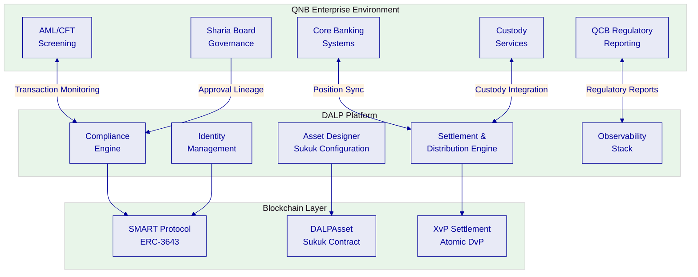
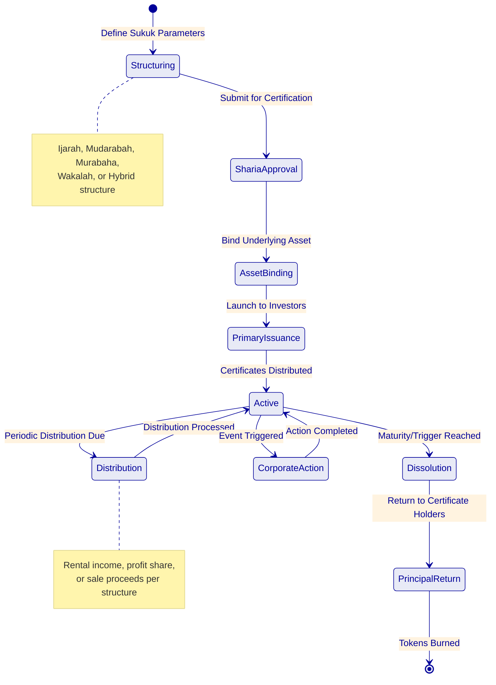
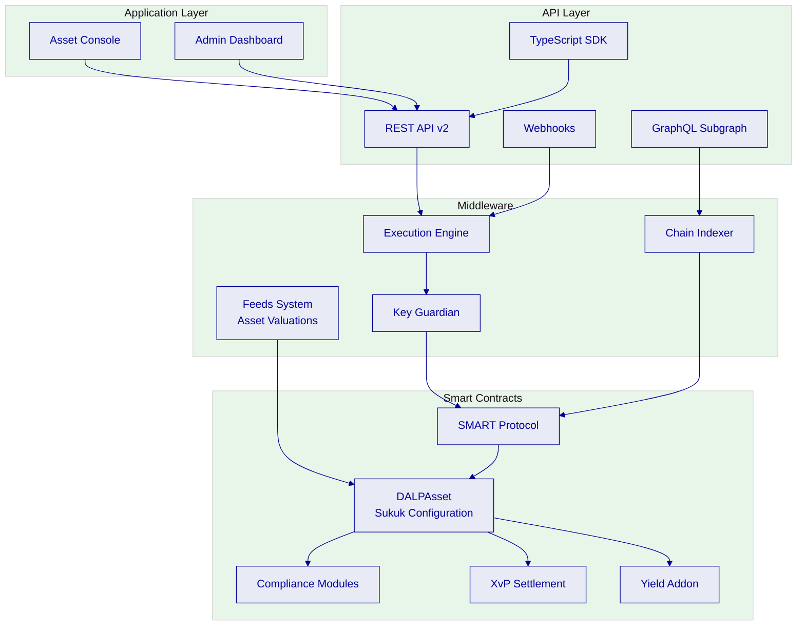
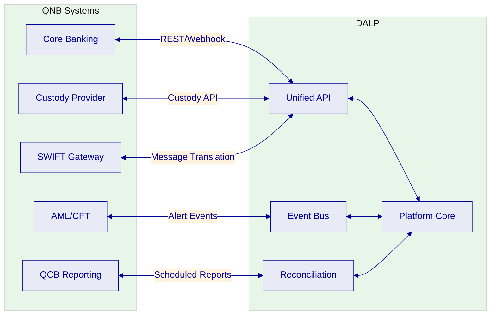
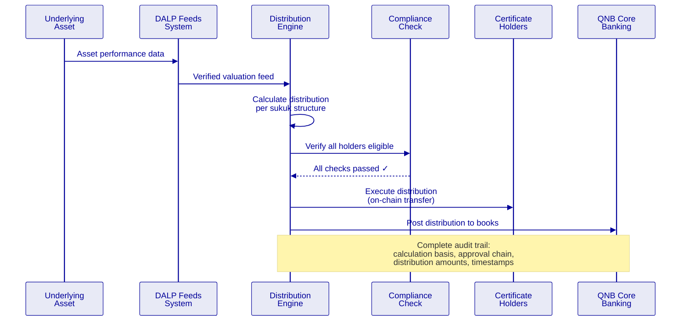
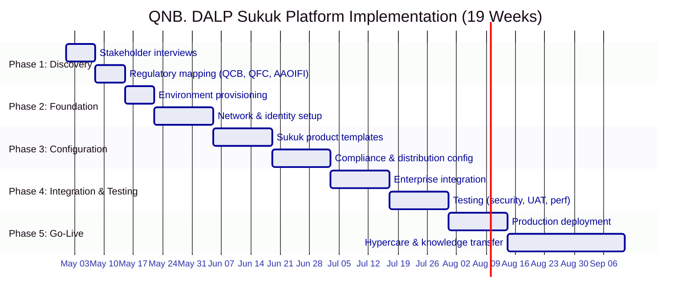

# Technical Proposal: Tokenized Sukuk Issuance and Servicing Platform

| Field | Value |
|---|---|
| Proposal title | Technical Proposal. Tokenized Sukuk Issuance and Servicing Platform |
| Client | Qatar National Bank |
| Submitted by | SettleMint NV |
| Date | March 2026 |
| Version | v1.0 |
| Confidentiality | Restricted |
| RFP Reference | QATAR-NATIONAL-BANK-RFP-TOKENIZED-SUKUK-202603 |
| Primary contact | Adam Popat, CEO |

---

## Table of Contents

- Executive Summary
- Understanding QNB's Programme Objectives
- Proposed DALP Operating Model for Tokenized Sukuk
- Technical Architecture and Integration Boundaries
- Sukuk-Specific Smart Contract Architecture
- Identity, Compliance, and Sharia Governance
- Settlement, Distribution, and Lifecycle Management
- Security, Resilience, and Operational Assurance
- Implementation Approach and Delivery Phases
- Current Coverage, Dependencies, and Qualified Gaps
- Relevant Delivery Evidence
- Appendices

---

## Executive Summary

Qatar National Bank has identified tokenized sukuk issuance and servicing as a business-critical capability. This procurement tests whether the market can supply a dependable platform and implementation model for production-grade tokenized sukuk that operates within QCB regulatory expectations, QFC Authority capital markets rules, AAOIFI standards, and QNB's internal control environment.

SettleMint's Digital Asset Lifecycle Platform (DALP) provides production-ready infrastructure for the entire sukuk lifecycle, from structuring and issuance through periodic distribution, corporate actions, and dissolution, with Sharia compliance enforcement embedded at the smart contract level.

**Why DALP fits QNB's sukuk programme:**

- **Full sukuk lifecycle coverage.** DALP manages the complete sukuk lifecycle through configurable smart contracts: underlying asset referencing, certificate issuance, periodic rental or profit distributions, corporate actions, and dissolution with principal return. The Asset Designer wizard supports sukuk-specific parameters including underlying asset class, distribution frequency, dissolution triggers, and Sharia board attestation requirements.

- **Sharia compliance at the contract layer.** Every sukuk transfer passes through DALP's compliance engine, which enforces investor eligibility, jurisdiction restrictions, holding periods, and Sharia governance approvals at the smart contract level. Compliance rules travel with the token, they cannot be circumvented by application-layer workarounds.

- **Production-proven Islamic finance capability.** DALP powers the Islamic Development Bank's Sharia-compliant subsidy distribution system serving 57 member countries. The Saudi Arabia Real Estate Registry, a national-scale blockchain for property registration and fractionalization, runs on DALP in production since January 2026.

- **Enterprise integration readiness.** DALP integrates with core banking systems, custody providers, AML/CFT tooling, and regulatory reporting through a comprehensive API surface (REST, GraphQL, webhooks, SDK, CLI with 301 commands across 26 groups).

The proposed implementation spans 19 weeks from kickoff to hypercare completion, following SettleMint's phase-gated methodology with formal gate reviews at each stage.

---

## Understanding QNB's Programme Objectives

### The Sukuk Market Opportunity

Qatar's sukuk market represents one of the fastest-growing segments of Islamic capital markets. QNB, as the largest financial institution in the Middle East and Africa by assets, is positioned to lead the digital transformation of sukuk issuance. The challenge is not whether to tokenize sukuk, it is whether the platform can handle the operational complexity of production-grade sukuk servicing: periodic distributions tied to underlying asset performance, dissolution mechanics, Sharia board governance, multi-party settlement, and regulatory reporting across jurisdictions.

### Three Critical Challenges

**Asset-backed integrity.** Every sukuk certificate must reference a verifiable underlying asset. The platform must enforce that distributions are derived from actual asset performance, not simulated returns. This requires integration with asset valuation feeds and on-chain verification of collateral adequacy.

**Distribution complexity.** Sukuk distributions are not simple coupon payments. They may represent rental income (Ijarah), profit shares (Mudarabah), or sale proceeds (Murabaha). Each structure has different calculation mechanics, timing requirements, and Sharia governance implications. The platform must support configurable distribution logic without requiring custom smart contract development per sukuk issuance.

**Lifecycle governance.** From issuance through dissolution, sukuk require multi-party governance involving the issuer, Sharia board, trustee, and regulator. The platform must provide complete audit trails showing who approved each lifecycle event, which compliance checks were applied, and how the resulting state can be reconstructed for regulatory examination.

---

## Proposed DALP Operating Model for Tokenized Sukuk

### Sukuk Product Configuration

DALP's configurable token architecture supports all major sukuk structures without custom smart contract development:

| Sukuk Type | Underlying Asset | Distribution Mechanism | DALP Configuration |
|---|---|---|---|
| Ijarah Sukuk | Real estate, equipment, infrastructure | Rental income pass-through | Fixed Treasury Yield feature + Collateral Requirement module |
| Mudarabah Sukuk | Investment portfolio | Profit-sharing per agreed ratio | Yield feature + configurable ratio parameters |
| Murabaha Sukuk | Trade receivables | Deferred sale markup payments | Maturity & Redemption feature + scheduled distributions |
| Wakalah Sukuk | Mixed asset pool | Agency fee + investment returns | Transaction Fee feature + Yield configuration |
| Hybrid Sukuk | Combined asset classes | Blended distribution mechanics | Multiple features composed on single DALPAsset |

### Operating Model Mapping to QNB Workstreams

| Workstream | DALP Capability | QNB Responsibility |
|---|---|---|
| WS-01: Mobilisation | Environment provisioning, governance framework | Steering committee, design authority |
| WS-02: Product Configuration | Sukuk templates, compliance modules, distribution rules | Sharia board certification, product policy |
| WS-03: Integration | API surface, custody integration, payment rails | Core banking readiness, custody provider selection |
| WS-04: Testing | Platform test environments, security testing | UAT execution, business acceptance |
| WS-05: Operations | Observability, runbooks, SLA framework | Service desk staffing, management reporting |

---

## Technical Architecture and Integration Boundaries

### Four-Layer Architecture

DALP operates as a four-layer stack with distinct responsibility boundaries:

### Enterprise Integration for QNB

---

## Sukuk-Specific Smart Contract Architecture

### DALPAsset Sukuk Configuration

Each sukuk issuance is configured as a DALPAsset with the following composition:

**Token features (runtime-pluggable):**
- Fixed Treasury Yield, for periodic distribution calculations
- Maturity and Redemption, for dissolution mechanics and principal return
- Historical Balances, for audit snapshots at any point in time
- Permit, for gasless approval operations
- Transaction Fee, for agency fees in Wakalah structures

**Compliance modules (fail-closed evaluation):**
1. Identity Verification, verified OnchainID with KYC claims
2. Country Allow List. Qatar and permitted jurisdictions
3. Investor Accreditation, qualified investor checks per QFC rules
4. Transfer Approval. Sharia board and trustee sign-off workflows
5. Holding Period (Time Lock), minimum holding enforcement with FIFO tracking
6. Collateral Requirement, on-chain verification of underlying asset adequacy

### Sukuk Distribution Flow

---

## Identity, Compliance, and Sharia Governance

### Compliance Engine Configuration for Sukuk

DALP's compliance engine operates in fail-closed mode: every transfer must pass all bound compliance modules. For QNB's sukuk programme:

| Module | Purpose | Configuration |
|---|---|---|
| Identity Verification | KYC/AML verified OnchainID | Required for all certificate holders |
| Country Allow List | Jurisdiction restrictions | Qatar + approved jurisdictions |
| Investor Accreditation | Qualified investor checks | Per QFC Authority requirements |
| Transfer Approval | Multi-party governance | Sharia board + trustee approval for secondary transfers |
| Time Lock | Minimum holding period | AAOIFI-guided holding periods per sukuk type |
| Collateral Requirement | Asset-backing verification | On-chain proof of underlying asset adequacy |

### Role-Based Access Control

| Role | Scope | Maker-Checker |
|---|---|---|
| Sukuk Structurer | Product design, parameter configuration | Creates structure → Sharia board approval required |
| Compliance Officer | Compliance module management | Configures rules → Head of Compliance approval |
| Trustee | Asset custody oversight, distribution approval | Reviews → recorded on-chain |
| Sharia Board Rep | Product certification, structure approval | Certifies → immutable on-chain record |
| Treasury Manager | Settlement authorization | Approves → dual authorization required |
| Auditor | Full read-only access | No write access; complete visibility |

---

## Settlement, Distribution, and Lifecycle Management

### Atomic DvP Settlement

DALP supports atomic Delivery versus Payment through the XvP Settlement addon. For sukuk primary issuance and secondary market transfers, this ensures that certificate delivery and payment occur simultaneously or not at all, eliminating settlement risk.

### Distribution Types

| Distribution | Calculation | Frequency | DALP Feature |
|---|---|---|---|
| Ijarah rental | Fixed rental amount per certificate | Monthly/quarterly | Fixed Treasury Yield |
| Mudarabah profit | Pool performance × agreed ratio | Quarterly/semi-annual | Yield addon with configurable ratio |
| Murabaha markup | Scheduled payment amounts | Per sale agreement schedule | Maturity & Redemption |
| Wakalah return | Investment return − agency fee | Per mandate period | Yield + Transaction Fee |

### Dissolution Mechanics

At maturity or upon a dissolution trigger event, DALP executes the dissolution workflow:
1. Calculate final distribution amount per certificate holder
2. Execute distribution via on-chain transfer
3. Return principal to certificate holders
4. Burn sukuk tokens (permanent retirement)
5. Record complete dissolution audit trail

---

## Security, Resilience, and Operational Assurance

### Security Certifications

| Certification | Status |
|---|---|
| ISO 27001 | Current |
| SOC 2 Type II | Current |
| Smart contract audits | Per release |
| Penetration testing | Annual + per major release |

### Operational Resilience

| Capability | Target |
|---|---|
| RPO | < 1 hour |
| RTO | < 4 hours |
| Backup frequency | Daily with integrity verification |
| Monitoring | Three-pillar observability (metrics, logs, traces) |

---

## Implementation Approach and Delivery Phases

### 19-Week Implementation

---

## Current Coverage, Dependencies, and Qualified Gaps

### Requirements Coverage

| Req ID | Requirement | Status | Notes |
|---|---|---|---|
| REQ-01 | Segregated environments | **Full** | Dev, UAT, DR, Production |
| REQ-02 | API-first interfaces | **Full** | REST v2, GraphQL, webhooks, SDK |
| REQ-03 | RBAC, maker-checker, audit | **Full** | Native platform capability |
| REQ-04 | Configurable lifecycle | **Full** | DALPAsset with runtime features |
| REQ-05 | Dependency disclosure | **Full** | See dependency register |
| REQ-06 | Resilience & monitoring | **Full** | ISO 27001, SOC 2, three-pillar observability |
| REQ-07 | Implementation plan | **Full** | 19-week phase-gated methodology |
| REQ-08 | Audit evidence extraction | **Full** | Complete audit trail, queryable API |
| REQ-12 | Sharia board workflows | **Partial** | Approval workflows available; dedicated Sharia portal in Q3 2026 |
| REQ-13 | Profit vs. interest segregation | **Full** | Enforced at smart contract level |

### Qualified Gap: REQ-12

DALP supports Sharia board approval workflows through the Transfer Approval compliance module and GOVERNANCE_ROLE assignment. Fatwa references stored as token metadata. A dedicated Sharia board dashboard with AAOIFI reporting templates is targeted for Q3 2026. Mitigation: core governance workflows operational from day one; dedicated dashboard deliverable during implementation (estimated 2 weeks additional).

---

## Relevant Delivery Evidence

| Client | Region | Relevance |
|---|---|---|
| Islamic Development Bank | 57 countries | Sharia-compliant tokenization at sovereign scale |
| Saudi Arabia RER | KSA | National-scale production, property tokenization |
| Standard Chartered Bank | Asia, ME, Africa | Multi-jurisdiction securities |
| Commerzbank | Germany | Hybrid on/off-chain ETP issuance |
| OCBC Bank | Singapore | Regulated bank, multi-asset securities |
| Maybank (Project Photon) | Malaysia | FX tokenization, cross-border settlement |

---

## Appendices

### Appendix A: Glossary

| Term | Definition |
|---|---|
| DALP | Digital Asset Lifecycle Platform |
| Sukuk | Islamic certificates representing ownership in underlying assets |
| Ijarah | Lease-based sukuk structure |
| Mudarabah | Profit-sharing sukuk structure |
| Murabaha | Cost-plus financing sukuk structure |
| Wakalah | Agency-based sukuk structure |
| DALPAsset | Configurable token contract |
| OnchainID | On-chain identity standard (ERC-734/735) |
| XvP | Exchange versus Payment, atomic settlement |
| AAOIFI | Accounting and Auditing Organization for Islamic Financial Institutions |
| QCB | Qatar Central Bank |
| QFC | Qatar Financial Centre |
