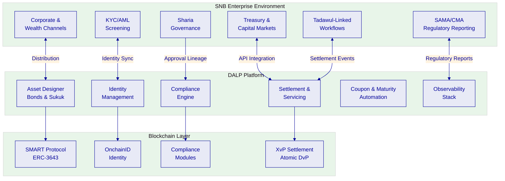
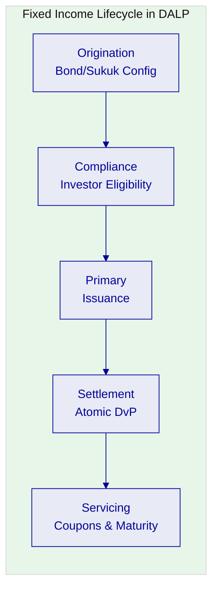
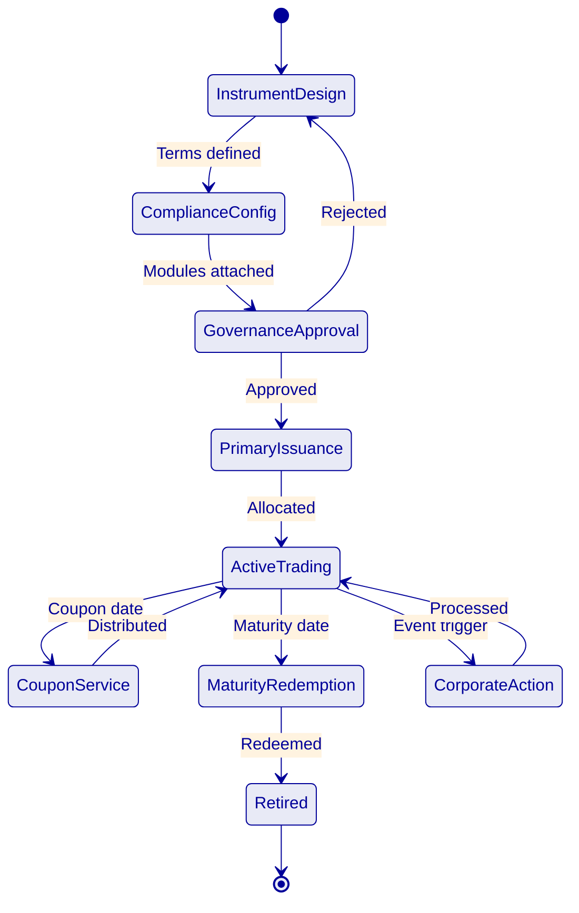
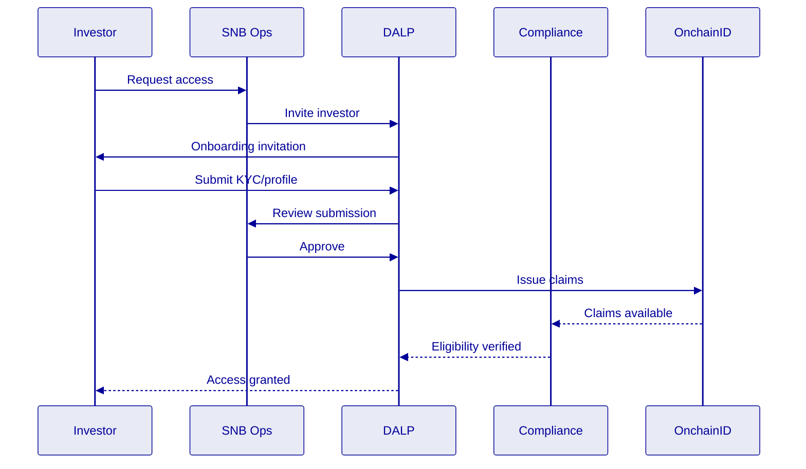
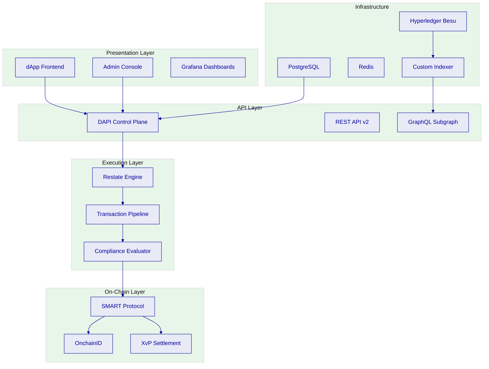
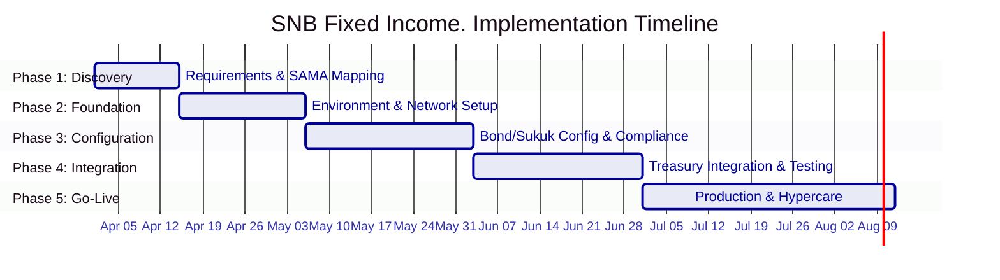

# Technical Proposal: Tokenized Fixed Income Origination and Investor Servicing

| Field | Value |
|---|---|
| Proposal title | Technical Proposal. Tokenized Fixed Income Origination and Investor Servicing |
| Client | Saudi National Bank |
| Submitted by | SettleMint NV |
| Date | March 2026 |
| Version | v1.0 |
| Confidentiality | Restricted |
| RFP Reference | SAUDI-NATIONAL-BANK-RFP-TOKENIZED-FIXED-INCOME-202603 |
| Primary contact | Adam Popat, CEO |

---

## Table of Contents

- Executive Summary
- About SettleMint
- About DALP
- Understanding SNB's Programme Objectives
- Customer References
- Proposed Solution and Functional Capabilities
- Technical Architecture
- Smart Contract Architecture for Fixed Income
- Identity, Compliance, and Regulatory Controls
- Settlement, Servicing, and Lifecycle Management
- Integration Architecture
- Security, Resilience, and Operational Assurance
- Implementation Approach and Delivery Phases
- Deployment Model
- Training and Knowledge Transfer
- Support and SLA
- Risk Management
- Current Coverage, Dependencies, and Qualified Gaps
- Compliance Matrix
- Appendices

---

## Executive Summary

Saudi National Bank has identified tokenized fixed income origination and investor servicing as a business-critical capability requiring production-grade discipline. This procurement tests whether the market can supply a platform that handles the full fixed income lifecycle, origination, issuance, investor onboarding, coupon servicing, maturity redemption, and corporate actions, inside SNB's control environment with the governance expected of core regulated systems.

SettleMint's Digital Asset Lifecycle Platform (DALP) addresses this requirement directly. DALP provides production-ready infrastructure for designing, issuing, servicing, and retiring tokenized financial instruments with compliance enforcement, identity verification, and governance controls embedded at the smart contract level.

**Why DALP fits SNB's fixed income requirements:**

- **Purpose-built fixed income lifecycle.** DALP's bond asset class provides automated coupon schedules, maturity logic, and secondary market connectivity as native platform capabilities. Issuance calendars, allocation workflows, and investor entitlement tracking operate through platform configuration rather than custom development. The compliance engine enforces investor eligibility, transfer restrictions, and holding limits at the smart contract level, ensuring governance rules travel with every instrument through its entire lifecycle.

- **Sharia-compliant sukuk support.** Through DALP's configurable token architecture, sukuk-style instruments can be modelled with profit-sharing distribution mechanics, Sharia board approval lineage, and AAOIFI-aligned governance controls. The Islamic Development Bank engagement, covering Sharia-compliant subsidy distribution across 57 member countries, directly demonstrates DALP's fitness for Islamic finance use cases at sovereign scale.

- **Production-proven at institutional scale.** DALP processes digital assets across production deployments including Commerzbank (exchange-traded products on Boerse Stuttgart with settlement under 10 seconds and EUR 7M annual savings potential), Mizuho Bank (bond tokenization and trade finance, PoC completed late 2025 with production planning underway), Standard Chartered Bank (Digital Virtual Exchange for institutional investors across Asia, Africa, and the Middle East), and OCBC Bank (security token engine for securitization).

- **KSA market presence and regulatory alignment.** SettleMint has active programmes in the Gulf region including the Saudi Arabia Real Estate Registry (country-scale real estate tokenization under REGA/Vision 2030). The platform supports SAMA regulatory expectations, CMA capital markets rules, Saudi cybersecurity and data controls, and Sharia governance through configurable compliance modules and jurisdiction-aware policy templates.

- **Enterprise integration, not isolation.** DALP connects to treasury and capital-markets books, Tadawul-linked workflows, KYC/AML tooling, corporate and wealth channels, and reporting environments through a comprehensive API surface (REST API v2 with OpenAPI 3.1, GraphQL, event webhooks, TypeScript SDK, CLI with 301 commands across 26 command groups).

The proposed implementation follows SettleMint's phase-gated methodology: 19 weeks from kickoff to hypercare completion. The first production fixed income instrument can be live within 13 weeks of kickoff.

---

## About SettleMint

### Company Overview

SettleMint is the production-grade digital asset lifecycle management company for regulated financial markets and sovereign use cases. Founded in 2016 with 10 years of continuous operation and 7+ years of continuous production deployments at regulated banks.

### Production Credentials

| Credential | Evidence |
|---|---|
| Continuous operation | Since 2016, 10 years |
| Production deployments | 7+ years with regulated banks |
| Asset classes in production | Bonds, equities, deposits, stablecoins, real estate, funds, precious metals |
| Geographic coverage | Europe, Middle East, Asia-Pacific |
| Sovereign programs | Saudi Arabia RER, SBI CBDC |
| Certifications | ISO 27001, SOC 2 Type II |

### Relevance to SNB

- **KSA sovereign programme:** Saudi Arabia RER, country-scale real estate tokenization under REGA/Vision 2030
- **Fixed income experience:** Mizuho Bank (bond tokenization PoC, production planning), Commerzbank (exchange-traded products with <10s settlement)
- **Islamic finance:** Islamic Development Bank. Sharia-compliant subsidy distribution across 57 member countries
- **Tier-1 bank experience:** Standard Chartered, Commerzbank, OCBC, SBI, comparable regulatory complexity

---

## About DALP

### Platform Overview

DALP provides production-ready infrastructure for the full digital asset lifecycle. For fixed income, this means origination, primary issuance, compliance enforcement, investor onboarding, coupon servicing, maturity redemption, and corporate actions in a single governed platform.

### Core Lifecycle Pillars

**Origination and Issuance.** DALP's Asset Designer provides a guided wizard for configuring bond and sukuk instruments with coupon schedules, maturity parameters, denomination structures, and compliance rules. DALPAsset supports runtime attachment of compliance modules for investor eligibility enforcement.

**Compliance.** Eighteen compliance module types enforce investor eligibility, country restrictions, accreditation requirements, holding limits, and transfer controls before every transaction executes. Sharia governance controls capture board approval lineage and product rule compliance.

**Settlement.** XvP atomic delivery-versus-payment eliminates counterparty risk. Both asset and cash legs complete together or revert together. Settlement finality is deterministic under IBFT consensus.

**Servicing.** Automated coupon distribution (fixed treasury yield), maturity redemption with treasury payout abstraction, and corporate action processing. All servicing operations maintain compliance integrity throughout the instrument's lifecycle.

### Fixed Income Specific Capabilities

| Capability | DALP Implementation |
|---|---|
| Coupon schedules | Fixed treasury yield feature with configurable frequency |
| Maturity redemption | Automated with treasury payout abstraction |
| Investor eligibility | 18 compliance modules, ex-ante enforcement |
| Transfer restrictions | On-chain enforcement, configurable at runtime |
| Corporate actions | Controlled mint/burn, governance events |
| Issuance calendar | Asset Designer configuration |
| Allocation workflows | Identity-linked distribution |
| Portfolio reporting | Event webhooks, GraphQL queries, dashboards |

---

## Customer References

### Summary Table

| Client | Use Case | Geography | Relevance to SNB |
|---|---|---|---|
| Commerzbank | Exchange-Traded Products | Germany | Regulated exchange, <10s settlement, EUR 7M savings |
| Mizuho Bank | Bond Tokenization | Japan | Fixed income lifecycle, production planning |
| Standard Chartered | Digital Virtual Exchange | Asia, Africa, ME | Institutional distribution |
| OCBC Bank | Security Token Engine | Singapore | Securitization, investor products |
| Islamic Development Bank | Subsidy Distribution | 57 countries | Sharia-compliant, sovereign scale |
| Saudi Arabia RER | Real Estate Registry | KSA | Country-scale sovereign, Vision 2030 |
| State Bank of India | CBDC Infrastructure | India | National-scale payment infrastructure |
| Maybank | FX Tokenization | Malaysia | Atomic cross-border settlement |
| ADI Finstreet | Equity Tokenization | Abu Dhabi | GCC market, institutional custody |
| Sony Bank | Stablecoin Issuance | Japan | Regulated digital instruments |
| KBC Securities | Crowdfunding | Belgium | Issuance, lifecycle, corporate actions |

### Expanded Reference: Commerzbank: Exchange-Traded Products

**Context.** Commerzbank needed to issue exchange-traded products with listing on Boerse Stuttgart, requiring settlement that meets exchange-grade performance requirements.

**Solution.** DALP provides hybrid on/off-chain ETP issuance with settlement under 10 seconds. The platform handles the full issuance lifecycle while meeting regulatory and performance requirements.

**Outcome.** Settlement under 10 seconds. Listed on Boerse Stuttgart. Projected savings of EUR 7M per year. Reduced counterparty risk through near-real-time clearing.

**Transferability.** Demonstrates DALP's fitness for regulated fixed income instruments with strict settlement requirements. The EUR 7M savings model provides SNB with a reference for building its business case.

### Expanded Reference: Mizuho Bank: Bond Tokenization

**Context.** Mizuho Bank sought bond tokenization and trade finance capabilities with emphasis on standard platform capabilities rather than custom development, enabling Mizuho's internal team to operate independently.

**Solution.** DALP powers the bond tokenization layer with standard lifecycle capabilities: issuance, compliance, servicing, and settlement.

**Outcome.** Proof of concept completed late 2025; production planning stage. Demonstrates that fixed income lifecycle management can operate through platform configuration.

**Transferability.** Directly applicable: bond tokenization at a major bank with emphasis on operational independence and standard platform capabilities.

---

## Proposed Solution and Functional Capabilities

### Fixed Income Origination Model

The origination model follows a governed sequence: instrument design (terms, coupon schedule, maturity parameters), compliance configuration (investor eligibility modules, transfer restrictions), governance approval (Sharia board if applicable, internal approvals), primary issuance and allocation, active trading with compliance enforcement, automated coupon servicing, and maturity redemption.

### Coupon and Distribution Automation

DALP's fixed treasury yield feature automates coupon distribution based on configurable schedules. The distribution engine calculates entitlements based on token holdings at the record date, routes payments through the treasury payout abstraction (supporting both EOA and contract-based treasuries), and produces an auditable record of every distribution event. For sukuk-style instruments, profit-sharing distributions follow the same automated pattern with Sharia-compliant calculation logic.

### Investor Onboarding and Eligibility

### Integration with Treasury and Capital Markets

DALP integrates with SNB's treasury and capital markets systems through REST API v2, event webhooks, and server-sent events. Coupon payment events, maturity events, and settlement confirmations are streamed in real time to downstream books. Reconciliation identifiers remain stable across APIs, ledgers, workflow queues, and reports, enabling SNB to match platform records to internal books without ambiguity.

---

## Technical Architecture

### Layered Architecture

### Data Architecture

Three state categories: chain state (immutable ownership, compliance configurations), application state (PostgreSQL, workflows, transaction pipeline, profiles), and indexed state (custom indexer with zero-downtime schema lifecycle for analytics and reporting).

### Operational Architecture

The durable execution engine (Restate) ensures multi-step fixed income workflows, coupon calculation, distribution, settlement confirmation, survive process restarts and infrastructure failures. The async transaction pipeline manages the 11-state lifecycle with idempotency, retry semantics, and dead-letter rescue.

---

## Security, Resilience, and Operational Assurance

### Security Model

Defense-in-depth across application, blockchain, and custody layers. Two-endpoint authentication separates session and API-key access. RBAC with five roles and nine permission levels. Maker-checker workflows enforce separation of duties.

### Key Management

Key Guardian with DFNS/Fireblocks integration. Provider-delegated transaction broadcast separates governance (DALP) from execution (custody provider). HSM and cloud secret manager options for KSA-specific requirements.

### Compliance Controls

Immutable audit trail for every operation. 534 structured error codes. Exportable evidence packs for SAMA, CMA, Sharia board, and internal audit review.

### Security Responsibility Matrix

| Control Area | SettleMint | SNB |
|---|---|---|
| Platform security | Application security, smart contract audits | Enterprise policies, network perimeter |
| Key management | Orchestration, custody integration | Provider selection, key ceremonies |
| Access control | RBAC enforcement | User provisioning, recertification |
| Data protection | Encryption at rest/transit | Data classification, retention |
| Incident management | Platform detection, forensic support | Enterprise incident management |

---

## Implementation Approach and Delivery Phases

### Implementation Timeline

**Phase 1 (Weeks 1-2):** Discovery, SAMA/CMA regulatory mapping, Sharia governance requirements, architecture design.
**Phase 2 (Weeks 3-5):** Environment provisioning, network configuration, identity framework, custody provider integration.
**Phase 3 (Weeks 6-9):** Bond/sukuk configuration, compliance modules, coupon schedule setup, governance workflows.
**Phase 4 (Weeks 10-13):** Treasury system integration, Tadawul-linked workflows, security testing, UAT.
**Phase 5 (Weeks 14-19):** Production deployment, knowledge transfer, 6-week hypercare.

---

## Deployment Model

### Recommended: Dedicated Cloud, KSA-Resident

Dedicated cloud infrastructure within KSA-resident data centers. DALP deploys on Kubernetes with PostgreSQL, Redis, and object storage via Helm charts. All deployment models deliver the same platform capabilities.

---

## Support and SLA

### Recommended: Premium Support

| Aspect | Premium |
|---|---|
| Coverage | 16x5 (Sunday-Thursday for KSA) |
| P1 response | 2 hours |
| P2 response | 4 hours |
| Dedicated engineer | Yes |
| Business reviews | Quarterly |

---

## Risk Management

| ID | Risk | Likelihood | Impact | Mitigation | Owner |
|---|---|---|---|---|---|
| R-01 | SAMA/CMA regulatory interpretation | Medium | High | Phase 1 regulatory mapping workshop | SNB |
| R-02 | Sharia board certification timeline | Medium | High | Early engagement, parallel approval tracks | SNB |
| R-03 | Treasury system API readiness | Medium | High | API specification in Phase 1, integration sandbox | SNB |
| R-04 | Tadawul integration complexity | Medium | Medium | Phased approach, standard API patterns | Joint |
| R-05 | Local hosting requirements | Low | Medium | KSA-resident dedicated cloud | Joint |
| R-06 | Multi-instrument scaling | Low | Medium | Configurable token architecture | SettleMint |

---

## Current Coverage, Dependencies, and Qualified Gaps

### Compliance Matrix

| Req ID | Requirement | Status | Response |
|---|---|---|---|
| REQ-01 | Segregated environments | Full | Kubernetes-based isolation |
| REQ-02 | API-first interfaces | Full | REST, GraphQL, webhooks, SDK, CLI |
| REQ-03 | RBAC and audit | Full | 5 roles, maker-checker, immutable trail |
| REQ-04 | Configurable lifecycle | Full | DALPAsset runtime configuration |
| REQ-05 | Third-party disclosure | Full | All providers documented |
| REQ-06 | Resilience and recovery | Full | HA, backup, monitoring, alerting |
| REQ-07 | Delivery method | Full | 19-week phase-gated plan |
| REQ-08 | Evidence extraction | Full | Structured logs, audit packs |
| REQ-09 | Issuance calendars, coupons, maturity | Full | Asset Designer, fixed treasury yield, maturity redemption |
| REQ-10 | Paying agent, registrar, depository | Partial | Platform provides settlement; external paying agent/registrar integration during Phase 4 |
| REQ-11 | Transfer restrictions, eligibility | Full | 18 compliance modules, ex-ante enforcement |
| RC-01 | Regulatory mapping | Full | Configurable modules, SAMA/CMA alignment |
| RC-02 | AML/CFT | Full | Sanctions screening integration |
| RC-03 | Data governance | Full | Encryption, KSA residency, retention |
| RC-04 | Operational resilience | Full | HA, DR, monitoring |
| RC-05 | Outsourcing | Full | Cloud and custody disclosed |
| RC-06 | Assurance and audit | Full | Logs, reports, attestations |

### Qualified Gap: Paying Agent/Registrar Integration (REQ-10)

DALP handles settlement, coupon distribution, and maturity redemption natively. Integration with external paying agents, registrars, and depository processes requires configuration during Phase 4 to map DALP events to SNB's existing market infrastructure workflows. The platform provides all necessary identifiers, event streams, and batch capabilities to support this integration.

---

## Appendices

### Appendix A: Standards Reference

| Standard | Application |
|---|---|
| ERC-3643 (T-REX) | Core token framework |
| ERC-734/735 | OnchainID identity |
| ERC-20 | Token interface compatibility |
| ERC-5805 | Voting and governance |
| ISO 20022 | Payment message integration |
| OpenAPI 3.1 | REST API specification |
