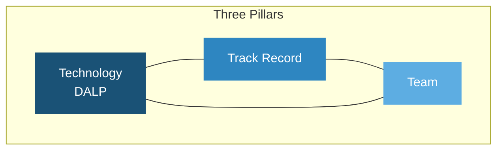
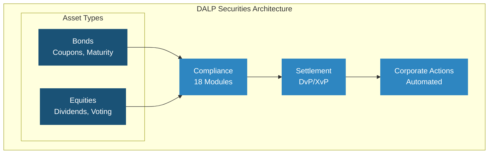
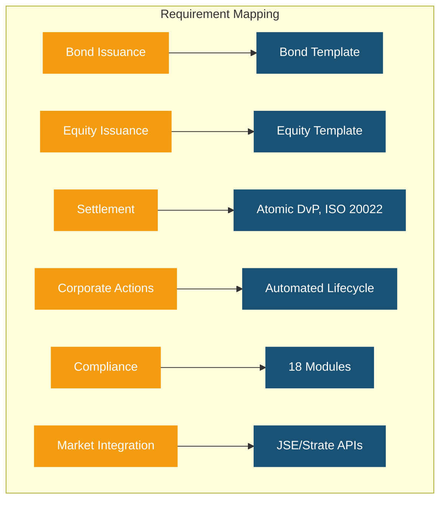
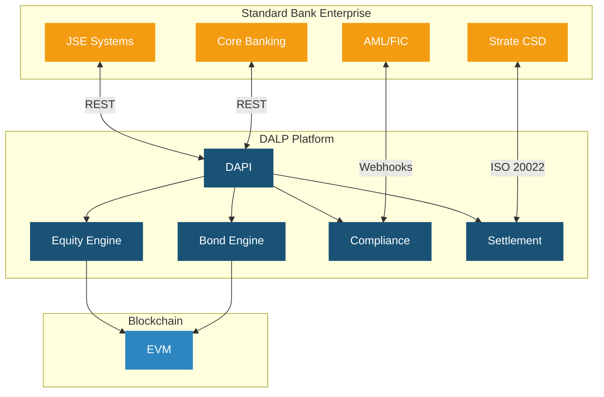
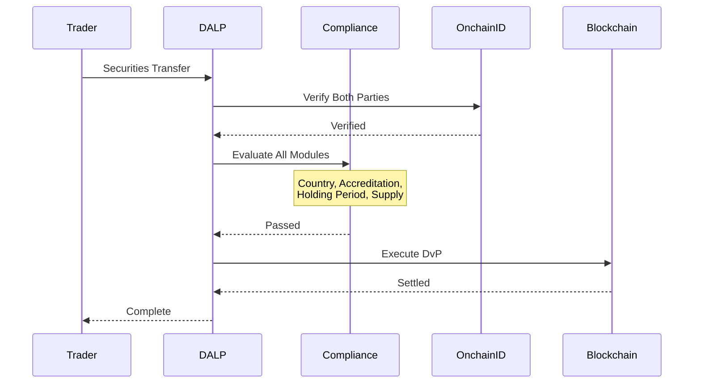
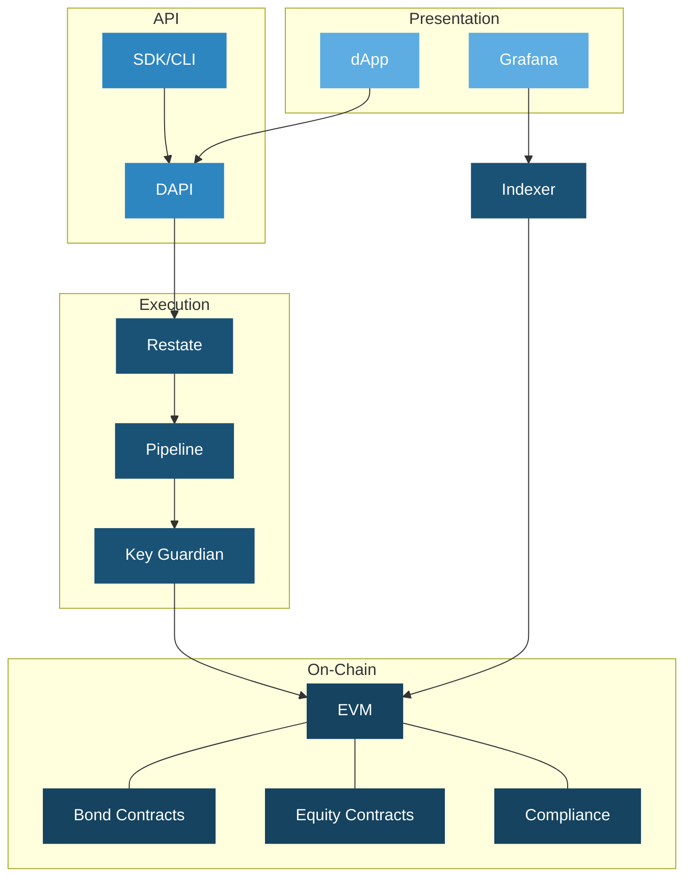
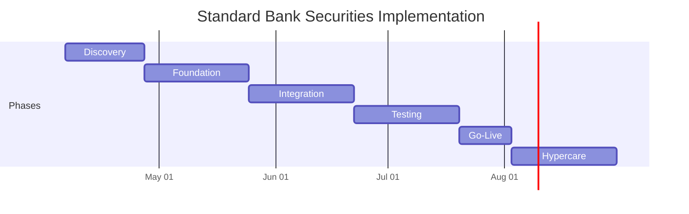

# Technical Proposal: Tokenized Securities Issuance and Settlement Platform

| Field | Value |
|---|---|
| Proposal title | Technical Proposal: Tokenized Securities Issuance and Settlement Platform |
| Client | Standard Bank (South Africa) |
| Submitted by | SettleMint NV |
| Date | March 2026 |
| Version | v1.0 |
| Confidentiality | Restricted |
| RFP Reference | STANDARD-BANK-RFP-TOKENIZED-SECURITIES-202603 |
| Contact | SettleMint NV, Kempische Steenweg 311/4.01, 3500 Hasselt, Belgium |
| Valid until | June 2026 |

---

# Executive Summary

## Context and Strategic Drivers

Standard Bank is procuring a tokenized securities issuance and settlement platform as a business-critical capability operating within its control environment under the South African Reserve Bank (SARB), Financial Sector Conduct Authority (FSCA), and Johannesburg Stock Exchange (JSE) regulatory oversight. As Africa's largest bank by assets, Standard Bank's platform selection carries strategic significance for the broader development of digital securities infrastructure across the continent.

South Africa's capital markets regulatory environment is maturing rapidly. SARB's Project Khokha demonstrated blockchain-based settlement feasibility, and the JSE is actively developing digital asset market infrastructure. Standard Bank requires a platform that delivers deterministic settlement finality in under 3 seconds, supports multi-asset securities across bonds and equities, and provides the compliance, governance, and auditability expected of a systemically important financial institution.

## Why This Programme Is Hard

Tokenized securities issuance and settlement spans multiple asset classes (bonds and equities at minimum), requires integration with JSE market infrastructure, Strate CSD processes, and SARB payment systems, and must support both primary issuance and secondary market settlement. The compliance burden is substantial: SARB prudential requirements, FSCA conduct standards, FIC AML/CFT obligations, and international investor distribution rules create a multi-layered regulatory environment.

Standard Bank's scale and pan-African presence add complexity. A platform that works for South Africa alone may not scale to support Standard Bank's operations across 20 African markets. The architecture must support multi-jurisdictional compliance and cross-border distribution from day one.

## Proposed Response

SettleMint proposes DALP as the tokenized securities lifecycle platform. DALP's multi-asset architecture supports bonds and equities through purpose-built templates with asset-specific lifecycle logic, with expansion capability to funds, deposits, and additional asset classes. The deployment uses dedicated cloud with South Africa-resident infrastructure.

## Why SettleMint

SettleMint's Standard Chartered Bank reference directly demonstrates institutional securities trading capability across Asia, Africa, and the Middle East. The Commerzbank reference shows fixed income settlement under 10 seconds. The Saudi RER reference demonstrates national-scale deployment discipline. Multi-year production experience with regulated banks across multiple jurisdictions provides the credibility Standard Bank requires.

## Why DALP

DALP provides multi-asset lifecycle management (bonds and equities with expansion to funds and deposits), ex-ante compliance enforcement across 18 module types, atomic DvP settlement with T+0 finality, automated corporate actions (dividends, coupons, stock splits, voting), and ISO 20022 payment rail connectivity. The configurable token extends coverage beyond pre-built asset classes for future innovation.

## Reference Fit Snapshot

- **Standard Chartered Bank**: Institutional securities trading across Africa and the Middle East, directly relevant to Standard Bank's market context
- **Commerzbank**: Fixed income settlement under 10 seconds, EUR 7M savings
- **ADI Finstreet**: Tokenized equity with corporate actions on Abu Dhabi mainnet, demonstrating equity-specific capability

---

# About SettleMint

## Production Credentials

| Category | Evidence |
|---|---|
| Market Validation | Nearly 10 years; 7+ years production |
| Operational Maturity | 7 asset classes in production |
| Sovereign Credibility | National-scale Middle East programmes |
| African Market Presence | Standard Chartered engagement across Africa |

## Regulatory Readiness

| Jurisdiction | DALP Support |
|---|---|
| South Africa (SARB, FSCA, FIC) | Controls mapped; buyer interprets |
| Pan-African markets | Configurable compliance per jurisdiction |
| EU (MiCA) | Native templates |
| GCC | Supported |

---

# About DALP

## Core Lifecycle Pillars

### Issuance

Bond templates (coupon schedules, maturity, call/put), equity templates (dividend distribution, voting rights, corporate actions), plus 5 additional asset class templates and configurable token. Deterministic orchestration with paused-by-default governance.

### Compliance

18 compliance module types with ex-ante enforcement. Multi-jurisdictional support for SARB, FSCA, FIC, and pan-African requirements. ERC-3643 with OnchainID.

### Custody

Key Guardian with institutional custody (Fireblocks, DFNS). Maker-checker workflows.

### Settlement

Atomic DvP/XvP with T+0 finality. ISO 20022 for SARB RTGS, JSE settlement, SWIFT. HTLC for cross-border.

### Servicing

Automated dividends, coupons, stock splits, maturity, corporate actions. Voting rights through ERC-5805. Complete audit trail.

---

# Customer References

| Client | Use Case | Geography | Relevance |
|---|---|---|---|
| Standard Chartered | Institutional securities trading | Asia, Africa, ME | African market, securities |
| Commerzbank | ETP issuance, settlement | Germany | Fixed income, EUR 7M savings |
| ADI Finstreet | Tokenized equity, corporate actions | UAE | Equity capability |
| OCBC Bank | Multi-asset security tokens | Singapore | Securities platform |
| Saudi RER | Country-scale tokenization | KSA | National-scale integration |
| KBC Securities | Equity crowdfunding | Belgium | Equity lifecycle |
| Maybank | FX tokenization, XvP | Malaysia | Atomic settlement |
| IsDB | Multi-country distribution | 57 countries | Pan-African relevance |

## Expanded Reference: Standard Chartered Bank

Standard Chartered's Digital Virtual Exchange supports fractional tokenization of securities across Asia, Africa, and the Middle East. Ownership changes are recorded instantly on the blockchain, eliminating custody intermediaries and reducing settlement times. This reference directly demonstrates institutional securities capability in Standard Bank's geographic operating context.

## Expanded Reference: ADI Finstreet

Tokenized equity issuance on Abu Dhabi's mainnet with embedded corporate action functionality, including stock splits and consolidations via controlled mint and burn, and on-chain voting using ERC20Votes. Demonstrates DALP's equity-specific lifecycle management with institutional custody integration (DFNS, Fireblocks path).

---

# Understanding of Requirements

| Domain | Standard Bank Requirements | DALP Coverage |
|---|---|---|
| Securities scope | Bonds and equities, secondary market | Bond and equity templates |
| Compliance | SARB, FSCA, FIC, pan-African | 18 modules, multi-jurisdictional |
| Settlement | JSE integration, SARB RTGS | DvP/XvP, ISO 20022 |
| Corporate actions | Dividends, coupons, splits, voting | Automated lifecycle servicing |
| Integration | Core banking, Strate CSD, JSE | REST, GraphQL, ISO 20022 |

---

# Proposed Solution

## Solution Overview

## Compliance Enforcement

## Functional Fit Matrix

| Requirement | Status | DALP Capability |
|---|---|---|
| Bond issuance | Full | Bond template with lifecycle |
| Equity issuance | Full | Equity template with corporate actions |
| Settlement (JSE/Strate) | Full | DvP/XvP, ISO 20022 |
| Corporate actions | Full | Automated dividends, coupons, splits |
| Voting rights | Full | ERC-5805 |
| RBAC and audit | Full | 5 roles, immutable trail |
| Compliance | Full | 18 modules, ex-ante |
| Environment segregation | Full | Full set |
| Resilience | Full | HA, 3-pillar observability |

---

# Technical Architecture

---

# Security, Implementation, Deployment, Training, Support

## Security

Three-domain trust model. Defense-in-depth. Two-endpoint auth. 5-role RBAC. Key Guardian Tier 4. Maker-checker. Emergency pause.

## Implementation (19 Weeks)

| Phase | Weeks | Objective |
|---|---|---|
| Discovery | 1 to 3 | Requirements, SARB/FSCA mapping, JSE integration design |
| Foundation | 4 to 7 | Environments, bond and equity config, compliance |
| Integration | 8 to 11 | Core banking, Strate, JSE, FIC |
| Testing | 12 to 15 | Functional, NFR, security, UAT |
| Go-Live | 16 to 17 | Controlled cutover |
| Hypercare | 18 to 21 | Monitoring and handover |

## Deployment

Dedicated cloud, South Africa-resident. Multi-zone HA.

## Support

Premium recommended. 99.95% uptime. 2-hour P1 response. Dedicated engineer.

---

# Compliance Matrix

| Requirement | Status |
|---|---|
| Bond issuance and lifecycle | Full |
| Equity issuance and corporate actions | Full |
| Settlement (JSE/Strate integration) | Full |
| Multi-jurisdictional compliance | Full |
| RBAC and audit | Full |
| Environment segregation | Full |
| Resilience and DR | Full |
| Regulatory mapping (SARB/FSCA) | Configurable |
