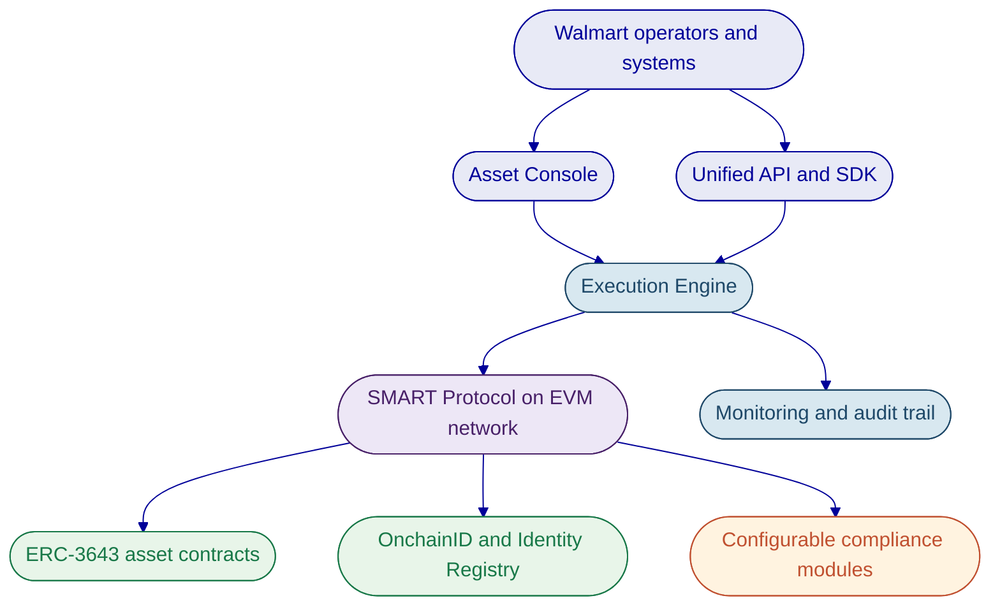

# Walmart Digital Assets Technical Proposal

## Executive Summary

Tokenization is not difficult to start. The difficult part is doing it right in an enterprise operating model where compliance, governance, settlement controls, and day to day operations must work together from the first live asset onward. DALP addresses that problem as a configurable platform, not as a custom build effort. It provides a production-grade control plane for issuing, managing, settling, and servicing regulated digital assets on EVM-compatible networks.

For Walmart, the practical value is operational control. DALP combines ERC-3643 compliant asset contracts, OnchainID-based identity verification, configurable compliance enforcement, atomic settlement patterns, role-based permissions, and audited operational tooling in one platform. That gives Walmart a path to evaluate digital asset programs without stitching together separate issuance, compliance, custody, and lifecycle tools.

This proposal focuses only on verified DALP capabilities. It does not assume a specific Walmart business case, legal structure, or deployment model. Instead, it shows how the platform can support enterprise digital asset programs that require controlled participant onboarding, policy-based transfer restrictions, asset lifecycle servicing, and integration into existing operational systems through typed APIs.

---

## Walmart-Relevant Use Cases

DALP supports several use case patterns that are relevant to a large enterprise with complex treasury, supplier, and operational ecosystems. The first is a controlled cash-equivalent or deposit-style instrument used for internal treasury flows or closed-loop settlement between approved participants. DALP supports cash equivalent asset types, including stablecoins and deposits, with identity-bound transfers, configurable compliance modules, and atomic settlement workflows.

A second use case is tokenized fixed-income or treasury instruments used for short-duration funding, balance sheet efficiency, or programmatic redemption. DALP includes a bond asset type with maturity and redemption support, denomination asset configuration, supply controls, and lifecycle handling from issuance through retirement. That matters because enterprise digital asset programs often create more operational work after issuance than at issuance.

A third use case is controlled value distribution across approved counterparties, such as suppliers, financing participants, or ecosystem partners. DALP can enforce participant eligibility before every transfer through ERC-3643 compliance hooks, OnchainID claim checks, country restrictions, investor limits, transfer approval workflows, and time-based transfer controls. That lets a program remain bounded to verified participants rather than relying on post-trade review.

A fourth use case is corporate action and servicing automation for any instrument that requires periodic events. DALP includes platform support for yield distribution, maturity redemption, transfers, forced transfer administration, freezing, pausing, and auditable role-governed operations. For an enterprise-scale program, this servicing layer is often the difference between a pilot and an operable production environment.

---

## Technical Architecture and Platform Capabilities

DALP is structured as a four-layer stack: Asset Console, Unified API, Execution Engine, and SMART Protocol smart contracts. The Asset Console gives operators a controlled interface for asset creation, compliance administration, monitoring, and lifecycle actions. The Unified API exposes the same platform capabilities to external systems through typed REST interfaces and an SDK. The Execution Engine manages durable workflows, transaction orchestration, and operational recovery. The SMART Protocol layer implements ERC-3643 compliant token behavior, modular compliance, and OnchainID-based identity binding on-chain.

DALP's compliance model is one of its strongest differentiators for enterprise use. It implements ERC-3643 through SettleMint's SMART Protocol and binds every participant wallet to an OnchainID identity record. Transfers are validated before execution, not reviewed after the fact. Verified source material confirms 12 concrete compliance module types across six categories, including identity allow lists, country controls, transfer approval flows, supply controls, timelocks, and collateral-related checks. If a transfer fails policy, it reverts.

The platform also supports atomic Delivery-versus-Payment and Exchange-versus-Payment settlement patterns. This matters for any program where asset movement and payment movement must complete together or not at all. For a Walmart-scale operation, that reduces reconciliation risk and removes the ambiguity that appears when one side of a transaction settles without the other.

From an operational perspective, DALP is API-first and lifecycle-aware. It supports asset creation, minting, transfers, pausing, freezing, role assignment, and redemption through platform interfaces rather than bespoke scripts. It also includes monitoring dashboards, transaction lifecycle tracking, analytics views, and CLI access for administrators who need controlled operational visibility.

---

## Implementation Approach

DALP is designed to be deployed as a platform foundation, then configured for the target asset model, participant controls, and integration perimeter. A practical implementation for Walmart would begin with confirmation of the initial asset type, approved participant model, required jurisdictions, custody policy, and the external systems that need to exchange data or trigger workflows. That discovery step is important because the asset model, the identity claim model, and the transfer policy model need to align from the start.

The next step is environment and policy setup. DALP supports managed cloud, self-hosted cloud, and on-premises deployment models, with Kubernetes and OpenShift support documented in the platform material. At this stage, the platform team would establish the target network, the identity and trusted issuer model, the required compliance modules, and the role structure for administrators, governance, custody, emergency controls, and supply management.

Configuration then moves to the asset itself. DALP supports pre-built asset types including bonds, funds, equity, deposits, stablecoins, real estate, and precious metals, plus a configurable asset pattern for additional token behavior. Asset deployment is factory-driven and initializes the identity, compliance, and role structures in a controlled workflow. Once configured, the same platform surface supports testing, staged rollout, and live operational use.

Integration follows through DALP's typed API surface and SDK. The platform is suited to enterprise environments where external applications need reliable control over asset lifecycle events, onboarding outcomes, transaction status, and monitoring data. The point is not to replace every existing Walmart system. It is to provide a digital asset control plane that can connect to existing treasury, operations, or partner-facing applications without fragmenting the underlying controls.

---

## Security, Compliance, and Operational Controls

DALP uses a defense-in-depth model across identity, access, transaction verification, on-chain compliance, and custody policy. In practice, that means a valid session alone is not enough to move assets. Sensitive blockchain write operations can require wallet verification factors, while on-chain compliance still validates the transaction at execution time. This layered model matters for enterprise governance because it reduces reliance on any single control.

The access model is role-based. Verified material confirms DALP uses RBAC, not ABAC, and enforces authority both in the platform layer and in on-chain roles. Asset-level duties are separated across roles such as admin, custodian, emergency, governance, and supply management. That allows a controlled operating model where issuance, compliance changes, emergency stops, and custody-style interventions are not concentrated in one user path.

Compliance enforcement is also explicit. DALP uses OnchainID and trusted issuers so that eligibility claims come from approved authorities rather than self-declared participant data. Transfers, mints, and related operations are validated through the active policy stack before execution. Forced transfers exist as an exception path for controlled administrative circumstances and remain auditable.

From an assurance perspective, the workspace security content states that SettleMint holds ISO 27001 and SOC 2 Type II certifications. Operationally, DALP includes monitoring dashboards, transaction-state visibility, health collection, and audit evidence across authentication, authorization, and asset activity. Together, these controls support the kind of reviewability that enterprise risk, compliance, and operations teams expect.

---

## Assumptions

This proposal assumes Walmart is evaluating DALP as a platform for a controlled digital asset program rather than an open public retail token launch. It assumes participant onboarding would be limited to approved identities and that transfer restrictions, governance, and operational auditability are required from the first production release.

It also assumes that any cash, treasury, or supplier-related use case would still rely on Walmart's legal, treasury, compliance, and operational policy decisions outside the platform. DALP provides the configurable control plane, the asset lifecycle tooling, the on-chain enforcement model, and the integration surfaces. It does not replace legal documentation, regulated custody obligations, or enterprise decision governance.

Finally, this proposal assumes that deployment scope, target network, custody pattern, and integration boundaries remain to be confirmed. Those choices affect implementation shape, but they do not change the underlying DALP capabilities described here.

---

## Next Steps

The recommended next step is to narrow the target program to one asset and one participant model. For example, that could be a cash-equivalent instrument for controlled settlement, a tokenized short-duration instrument, or a restricted-value program involving approved counterparties. Once the target pattern is selected, DALP can be mapped directly to the required asset type, identity claims, compliance modules, role model, and settlement path.

After that, SettleMint can produce a requirement-mapped solution outline covering deployment model, control design, integration points, and a phased rollout plan. Because DALP already provides the core asset, compliance, identity, settlement, and servicing capabilities, the focus of that exercise becomes configuration and operating model alignment rather than building foundational infrastructure from scratch.
