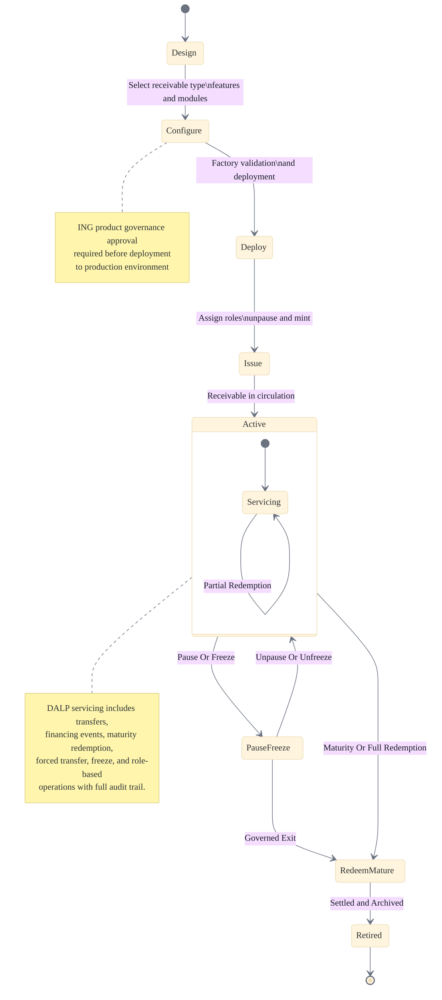
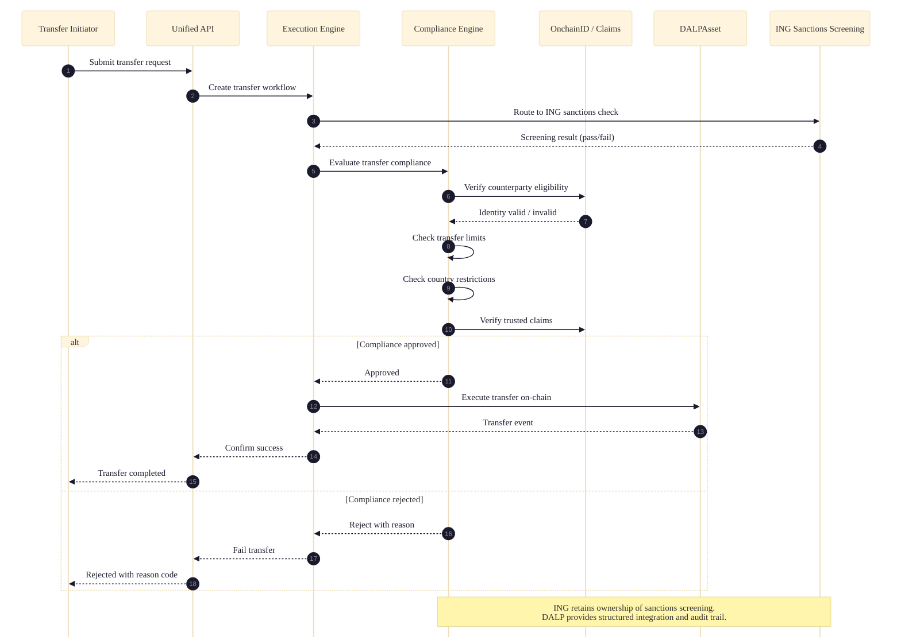
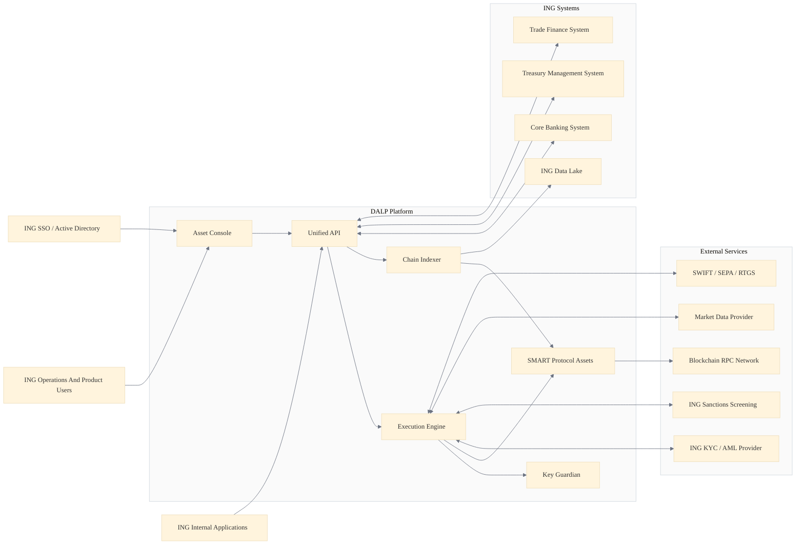
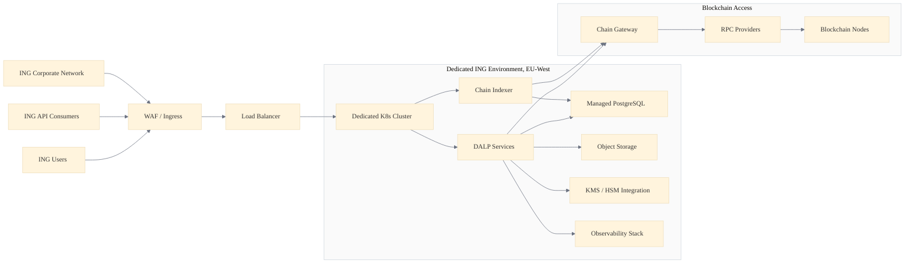
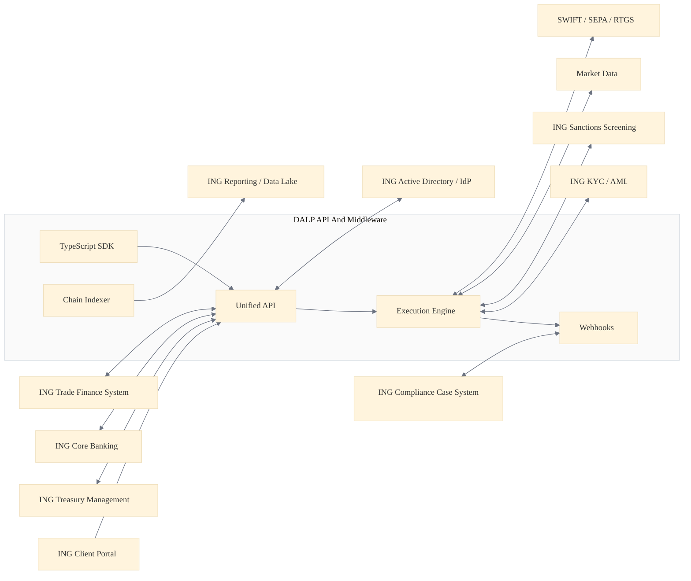
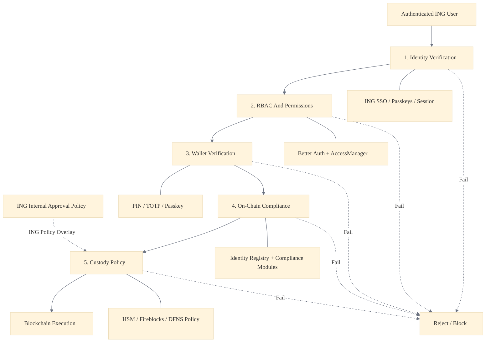
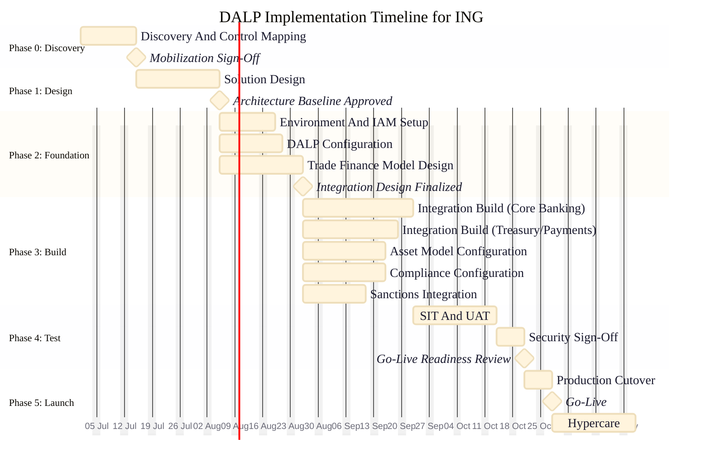
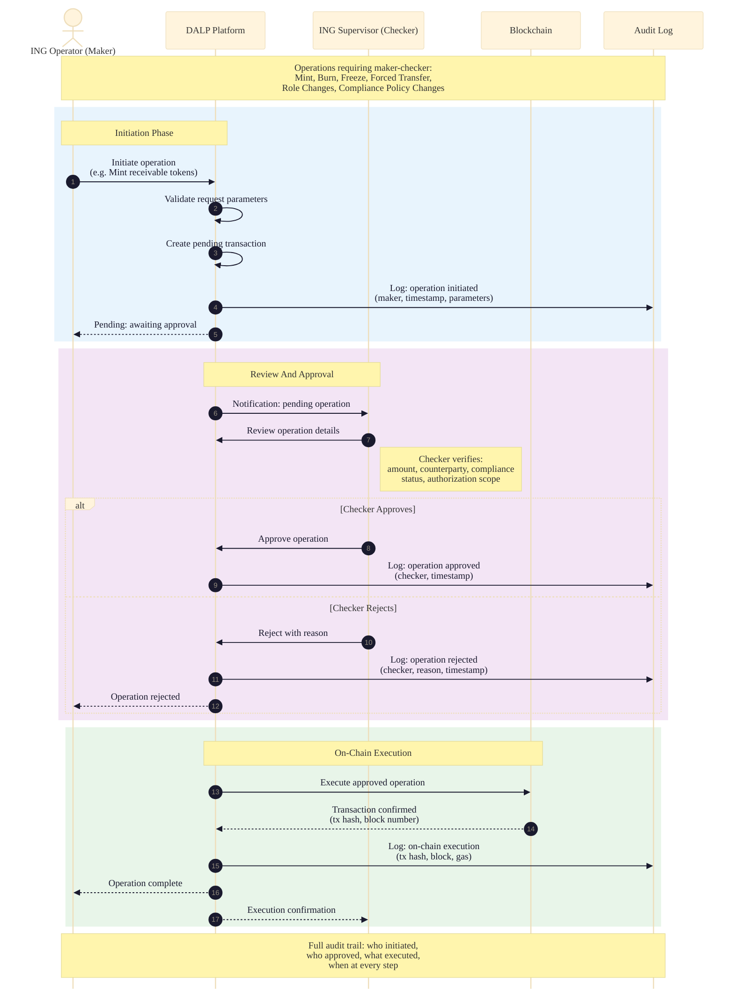

# Tokenized Trade Finance Platform: Technical Proposal for ING Bank N.V.

**Document Reference:** ING-RFP-202603-06
**Submitted by:** SettleMint NV
**Version:** 1.0
**Date:** April 2026
**Classification:** Confidential

---

## 1. Executive Summary

ING Bank N.V. has set out a clear and disciplined procurement objective: establish a controlled, production-grade platform for tokenized trade finance that fits within its enterprise control environment, integrates with existing transaction banking infrastructure, and supports phased rollout across receivables, guarantees, supply-chain finance, and documentary trade. This proposal responds directly to that objective.

SettleMint proposes its Digital Asset Lifecycle Platform (DALP) as the foundation for ING's tokenized trade finance operating model. DALP is not a point solution for issuance or a custody tool repackaged as a platform. It is a unified lifecycle management system covering asset design, issuance, compliance enforcement, custody integration, settlement, servicing, and retirement, all under a single governance model and control plane. This distinction matters because ING's RFP makes clear that a digital-asset layer disconnected from existing books, records, operations controls, treasury workflows, and regulator-facing reporting is unacceptable.

SettleMint brings nearly a decade of focused experience building blockchain infrastructure for regulated financial institutions and sovereign entities. Multi-year production deployments with banks in Europe and Asia, sovereign-scale tokenization programmes in the Middle East, and continuous operation under institutional SLAs have shaped DALP into a platform designed for day-two operations, not just day-one demonstrations.

### 1.1 Strategic Alignment with ING

ING's procurement priorities align precisely with DALP's design philosophy:

| ING Priority | DALP Response |
|---|---|
| Configuration-led extensibility | Asset Designer wizard with composable token features and compliance modules, no vendor source-code modification required |
| Buyer-led governance and approval authority | Maker-checker workflows, role-based access control, configurable approval policies by legal entity and business unit |
| Integration with existing systems | Unified API, webhooks, TypeScript SDK, documented event taxonomy for core banking, treasury, sanctions, and reporting integration |
| Regulatory precision (MiCA, DORA, GDPR) | Native ERC-3643 compliance, 18 configurable compliance module types, EU-hosted deployment, DORA-aligned operational resilience |
| Operational ownership by the buyer | Platform designed for internal operation via documented runbooks, role-based controls, and product-native telemetry |
| Phased rollout without reimplementation | Single control plane supports expansion across products, jurisdictions, and legal entities |

### 1.2 Key Differentiators

**Compliance by design, not by afterthought.** DALP enforces eligibility before execution through on-chain compliance modules. Every transfer is validated against configured rules (country restrictions, investor accreditation, supply limits, holding periods, sanctions integration) before it reaches the blockchain. This ex-ante enforcement model produces the control evidence that ING's compliance, risk, and audit teams require.

**Configuration over code.** DALP's composable architecture allows ING's product owners to configure trade finance instruments, compliance rules, approval workflows, and operational parameters through the Asset Designer and administration console, without requiring SettleMint engineering involvement for standard product variations.

**Full lifecycle, single platform.** From trade document digitization through tokenized receivable issuance, financing limit management, payment trigger execution, cross-border compliance enforcement, and eventual redemption or archival, DALP handles the complete lifecycle under one governance model.

**Operational transparency.** DALP provides the dashboards, exception queues, reconciliation tools, and audit trail exports that operations teams need on difficult days, not just demonstration days.

*Figure 1: DALP Administration Dashboard providing real-time portfolio valuation, AUM tracking, pending action alerts, and live blockchain activity feed.*

---

## 2. About SettleMint

### 2.1 Company Overview

SettleMint is the digital asset lifecycle platform company for regulated financial markets and sovereign use cases. Founded nearly a decade ago, SettleMint has evolved from an early enterprise blockchain infrastructure provider into the category-defining platform company enabling financial institutions, market infrastructure providers, and sovereign entities to move real-world value on-chain with compliance, security, and operational reliability.

SettleMint exists to solve the complexity of doing digital assets right. Tokenization technology is increasingly accessible, but the hard problems, namely regulatory compliance, key management, asset lifecycle operations, settlement logic, and auditability, remain genuinely difficult. Most institutions underestimate this complexity until deep in implementation.

### 2.2 Credentials and Track Record

| Credential | Detail |
|---|---|
| Years in operation | Nearly a decade of continuous enterprise blockchain delivery |
| Production deployments | Multi-year live deployments with regulated banks and sovereign entities |
| Sovereign programmes | National-scale tokenization initiatives in the Middle East |
| Security validation | Deployments have undergone institutional-grade security reviews and penetration testing |
| Regulatory jurisdictions | EU (MiCA, GDPR), Singapore (MAS), UK (FCA), Japan (FSA), US (Reg D/S/CF), GCC |
| Client verticals | Banks, sovereign entities, CSDs, exchanges, custodians, real estate, specialty finance |

### 2.3 Regulatory Readiness

SettleMint's platform is built for regulated environments from day one. Rather than treating compliance as an afterthought, SettleMint embeds regulatory controls, policy enforcement, and auditability into the core architecture. The platform supports compliance frameworks including EU MiCA, MiFID II (where securities treatment applies), GDPR, DORA operational resilience requirements, Dutch DNB/AFM supervision frameworks, and trade finance AML and sanctions obligations.

Native support for the ERC-3643 (T-REX) regulated token standard, combined with OnchainID for verifiable on-chain investor identities, provides a compliance architecture that enforces eligibility before execution. This ex-ante compliance model, with 18 configurable compliance module types, enables ING to navigate complex multi-jurisdictional requirements while maintaining the auditability and evidence trail that Dutch and EU regulators expect.

---

## 3. About DALP

### 3.1 Platform Overview

DALP is SettleMint's Digital Asset Lifecycle Platform for designing, launching, and operating tokenized assets across financial instruments and real-world assets. It encapsulates the complexity of blockchain-based tokenization so institutions can launch compliant digital asset operations without building blockchain expertise internally and without lengthy development cycles.

DALP's architecture is composable by design. A single audited token contract (DALPAsset) can represent any financial instrument through runtime configuration of up to 32 pluggable token features, 12 compliance module types across six categories, customizable metadata schemas, and operational add-ons. Both the token's economic behaviour and the compliance rules that govern it are independently selectable, composable, and reconfigurable post-deployment. Institutions configure from pre-audited catalogues rather than writing custom smart contracts.

For ING's trade finance use case, this composability is critical: tokenized receivables, guarantees, supply-chain finance instruments, and documentary trade assets each require different lifecycle logic, compliance rules, and integration patterns, but all can be configured and operated through the same platform.

### 3.2 Core Lifecycle Pillars

DALP is structured around five integrated core-lifecycle modules:

**Issuance.** Rapid deployment of tokenized assets with configurable business rules, compliance controls, and term structures. The Asset Designer wizard provides guided configuration with enterprise-safe input validation. Issuance follows a paused-by-default model with explicit unpause control for governance.

**Compliance.** Ex-ante enforcement ensures every transfer is validated before execution. DALP's compliance architecture includes 18 compliance module types covering country restrictions, investor accreditation, supply limits, holding periods, collateral backing, and transfer controls. Multi-jurisdictional support models complex requirements across EU MiCA, and other frameworks.

**Custody.** Key management workflows with bring-your-own-custodian integrations. DALP orchestrates custody policy across existing custodian relationships. The Key Guardian supports multiple storage backends: encrypted database, cloud secret manager, HSM, and third-party custody via Fireblocks and DFNS.

**Settlement.** Atomic Delivery-versus-Payment (DvP) and Exchange-versus-Payment (XvP) settlement for asset and cash legs. Both complete together or revert together, eliminating counterparty risk and reconciliation gaps. ISO 20022 integration supports SWIFT, SEPA, and RTGS connectivity.

**Servicing.** Automated lifecycle operations including coupon payments, yield distribution, redemptions, and maturity handling, executed programmatically across every asset type. This operational capability manages the asset from issuance through every event in its lifecycle to retirement.

*Figure 2: DALP Asset Designer, Step 1. The wizard supports all major asset classes including Fixed Income, Flexible Income, Cash Equivalents, and Real World Assets, each configurable for ING's trade finance instruments.*

### 3.3 Platform Foundations

Beneath the five lifecycle pillars, DALP provides cross-cutting platform foundations:

**Identity and Access Management.** OnchainID for verifiable on-chain identities with claim-based verification. Role-based access control with five defined roles. Integration with enterprise SSO/IdP providers.

**Observability and Monitoring.** Full-stack observability: metrics (VictoriaMetrics), logs (Loki), traces (Tempo), pre-built Grafana dashboards, and automated alerting. Operations teams get real-time visibility into platform health, transaction status, and exception states.

**Unified API and Integration Layer.** RESTful API with comprehensive documentation, TypeScript SDK, webhook-based event delivery, and chain indexer for downstream data consumption.

*Figure 3: DALP API Monitoring dashboard providing real-time visibility into API performance, request volumes, and error rates.*

---

## 4. Understanding of Requirements

### 4.1 ING's Strategic Context

ING has a long track record in blockchain-enabled trade finance and capital markets, including roles in Komgo, HQLAx-type collateral mobility discussions, and digitally native bond issuance initiatives. ING focuses on enterprise workflow efficiency, trade documentation, settlement optimization, and network interoperability rather than consumer crypto speculation.

This procurement is not a pilot exercise. ING requires a production operating capability with phased rollout, where the platform fits within the bank's existing enterprise control environment, interacts with established system estates, and supports future expansion without forcing repeated architecture redesign.

### 4.2 Mapping ING's Requirements to DALP Capabilities

ING's RFP identifies five concrete capability domains for the first live use cases. The table below maps each domain to DALP's response:

| ING Capability Domain | DALP Capability | Delivery Mode |
|---|---|---|
| Trade document digitization | Configurable Token with metadata schemas for documentary trade instruments | Native configuration |
| Tokenized receivables and obligations | DALPAsset with receivable-specific lifecycle logic, maturity, yield, and transfer rules | Native configuration |
| Financing limits and document status | Compliance modules for supply limits, time-based rules, and configurable status workflows | Native configuration |
| Payment triggers and cross-border compliance | Event-driven settlement orchestration, country restriction modules, sanctions integration points | Native + integration |
| Product setup, approval, and governance | Asset Designer wizard, maker-checker workflows, RBAC, configurable approval policies | Native configuration |

### 4.3 ING's Governance Model

ING's governance model expects board-level oversight, architecture review, risk sign-off, and third-party control testing before production launch. DALP supports this through:

- Configurable approval workflows that enforce ING's existing change management and governance processes
- Role-based access control configurable by legal entity, business unit, and operational function
- Immutable audit trails for every instruction, approval, execution, and administrative change
- Evidence packaging suitable for internal audit, supervisory review, and dispute investigation
- Platform designed for ING's internal teams to own and operate without permanent vendor dependency

---

## 5. Proposed Solution

### 5.1 Trade Document Digitization

ING's trade finance operations rely on documentary workflows spanning letters of credit, bills of lading, invoices, certificates of origin, and related instruments. DALP's Configurable Token architecture enables digitization of these documents as on-chain representations with structured metadata, provenance tracking, and lifecycle state management.

**Configuration approach:** Each trade document type is defined through DALP's Asset Designer as a Configurable Token with document-specific metadata schemas (document reference, issuer, beneficiary, value, currency, terms, expiry), compliance modules appropriate to the document type, and lifecycle states reflecting the document's progression through the trade finance workflow.

**Document lifecycle management:** DALP tracks each document through its complete lifecycle: creation, validation, endorsement, presentation, acceptance, discrepancy handling, and archival. Each state transition is recorded as an immutable on-chain event with full audit trail. The platform's event-driven architecture triggers downstream notifications to ING's trade finance systems, compliance screening, and reporting platforms.

**Provenance and integrity:** Every document state change is cryptographically secured on-chain, providing tamper-evident proof of document history. This addresses ING's requirement for immutable audit trails (TR-05) and supports regulatory evidence generation for DNB/AFM supervisory review.

*Figure 4: DALP Asset Designer compliance module selection. MiCA EU Standard is pre-configured with appropriate compliance rules for European trade finance instruments.*

### 5.2 Tokenized Receivables and Obligations

Tokenized receivables represent the core financial instrument in ING's trade finance platform. DALP's bond and configurable token templates provide the foundation for representing receivables, guarantees, and supply-chain finance obligations as on-chain assets with full lifecycle management.

**Receivable tokenization:** Each receivable is represented as a DALPAsset token with configured parameters including face value, denomination currency, maturity date, yield terms, obligor and beneficiary identities, and applicable compliance rules. The Asset Designer wizard guides product owners through configuration without code.

**Obligation management:** Guarantees and standby letters of credit are configured with conditional execution logic, expiry terms, and beneficiary eligibility rules. DALP's compliance modules enforce participant eligibility before any transfer or claim execution.

**Supply-chain finance:** Approved payables finance and reverse factoring structures are supported through DALP's multi-party workflows. The maker-checker governance model ensures that financing decisions follow ING's dual-control and four-eyes policies.

**Lifecycle events:** DALP automates the full receivable lifecycle: origination, primary assignment, secondary transfer, partial redemption, maturity processing, and final settlement. Each event triggers downstream integration to ING's core banking and treasury systems via the Unified API and webhooks.

*Figure 5: Trade finance asset lifecycle state model showing the complete journey from design through active servicing to maturity and retirement.*

### 5.3 Financing Limits and Document Status

ING requires precise control over financing limits, document status tracking, and exposure management across its trade finance portfolio. DALP addresses these requirements through its compliance module architecture and configurable status workflows.

**Financing limit enforcement:** DALP's supply limit compliance modules enforce maximum issuance volumes per instrument, per counterparty, and per portfolio segment. Rolling supply caps (configurable by time period) prevent overexposure. These limits are enforced on-chain at the smart contract level, meaning they cannot be bypassed through manual override without triggering the maker-checker approval workflow and producing an auditable record.

**Document status management:** Each trade document maintains a configurable status workflow tracked through DALP's event system. Status transitions (e.g., draft to validated, validated to presented, presented to accepted) are recorded as immutable events. ING's operations teams can monitor document status through DALP's administration dashboard, with configurable alerts for stale documents, approaching deadlines, and exception conditions.

**Exposure reporting:** DALP's chain indexer captures all on-chain events and makes them available for downstream consumption by ING's data lake, risk systems, and regulatory reporting platforms. Real-time position data, aggregated by counterparty, instrument type, geography, and maturity profile, supports ING's risk management and regulatory reporting obligations.

### 5.4 Payment Triggers and Cross-Border Compliance

Trade finance instruments frequently involve conditional payment triggers, cross-border transfers, and multi-jurisdictional compliance requirements. DALP provides the orchestration layer for these workflows.

**Payment trigger orchestration:** DALP's execution engine processes payment triggers based on configurable rules: maturity dates, document presentation events, acceptance confirmations, or external data inputs. When a trigger fires, DALP orchestrates the settlement workflow including compliance validation, approval processing, and settlement instruction generation for ING's payment systems via ISO 20022-compatible interfaces.

**Cross-border compliance enforcement:** DALP's country restriction modules enforce geographic eligibility rules at the transfer level. Combined with sanctions screening integration points (via API to ING's existing sanctions systems), DALP ensures that every cross-border transfer is validated against both ING's internal policies and regulatory requirements before execution.

**Sanctions and AML integration:** DALP does not replace ING's sanctions screening or AML systems. Instead, it provides structured integration points where transfer requests can be routed to ING's existing compliance infrastructure before on-chain execution. Failed screening results block the transfer and produce an auditable record of the rejection with full reason codes.

*Figure 6: Transfer compliance flow with ING sanctions screening integration. Every transfer passes through compliance validation and sanctions checks before on-chain execution.*

### 5.5 Configuration-Led Product Governance

ING explicitly favours solutions that minimise reliance on bespoke development for standard product operations and provide strong configuration-led extensibility. DALP's architecture is built around this principle.

**Product configuration without code:** New trade finance instrument types are created through the Asset Designer wizard, selecting from pre-built asset templates, configuring compliance modules, setting approval policies, and defining lifecycle parameters. No vendor source-code modification is required for standard product variations.

**Rule governance and versioning:** Compliance rules, approval policies, and operational parameters are versioned and auditable. When a rule change is made, DALP records who initiated the change, who approved it, what the previous value was, and when the change took effect. This version history supports ING's requirement to prove after the fact that the approved rule set is the rule set that actually ran in production.

**Approval workflows:** Every operationally sensitive action, including asset creation, rule changes, minting events, participant permission changes, and privileged administrative overrides, follows a configurable maker-checker approval workflow.

*Figure 7: DALP compliance expression builder showing a complex 9-condition compliance rule configuration. ING's product owners can build sophisticated eligibility rules through the UI without code.*

---

## 6. Technical Architecture

### 6.1 Platform Architecture

DALP's architecture is structured in layers designed for institutional deployment. The platform separates concerns between user interface, API gateway, execution engine, compliance engine, chain indexer, key management, and blockchain interaction, allowing each layer to be independently secured, monitored, and scaled.

*Figure 8: DALP solution architecture showing integration with ING's core banking, treasury, trade finance systems, sanctions screening, and payment rails.*

**Core components:**

| Component | Function | ING Relevance |
|---|---|---|
| Asset Console | Web-based administration UI for product owners and operators | Product setup, monitoring, exception management |
| Unified API | RESTful API gateway with comprehensive documentation | Integration with ING's trade finance and core banking systems |
| Execution Engine | Transaction orchestration, compliance validation, settlement processing | Trade finance workflow execution with dual-control enforcement |
| Chain Indexer | On-chain event capture and downstream data delivery | Feeding ING's data lake, risk systems, and regulatory reporting |
| Key Guardian | Key management with HSM, Fireblocks, and DFNS integration | Fits ING's existing key management and custody arrangements |
| SMART Protocol | Audited smart contract suite (DALPAsset, compliance modules) | On-chain enforcement of trade finance rules and lifecycle logic |

### 6.2 Deployment Model

For ING, SettleMint recommends a dedicated cloud deployment hosted within the EU (Netherlands or Germany), providing ING with full data residency compliance, tenant isolation, and control over the deployment environment.

*Figure 9: Dedicated deployment topology for ING. EU-West hosted, tenant-isolated, with connectivity to ING's corporate network and existing infrastructure.*

**Deployment characteristics:**

| Attribute | Detail |
|---|---|
| Hosting region | EU-West (Netherlands or Frankfurt), selected by ING |
| Tenant isolation | Dedicated Kubernetes cluster, no shared resources |
| Environment separation | Development, test, pre-production, DR, and production environments |
| Data residency | All data remains within the EU at all times |
| Network connectivity | VPN or private peering to ING corporate network |
| Infrastructure provider | AWS, Azure, or GCP per ING preference |
| DR design | Active-passive with RPO < 1 hour, RTO < 4 hours |

### 6.3 Integration Architecture

DALP's integration architecture is designed for clean interoperability with ING's established control estate, covering trade finance systems, corporate banking channels, treasury systems, client onboarding, compliance and sanctions controls, event-driven integration, and data platforms.

*Figure 10: DALP integration architecture showing connectivity with ING's trade finance, core banking, treasury, compliance, and payment systems.*

**Integration patterns:**

| ING System | Integration Method | Direction | Data Flow |
|---|---|---|---|
| Trade Finance System | REST API | Bidirectional | Instrument creation, status updates, lifecycle events |
| Core Banking | REST API + Webhooks | Bidirectional | Booking entries, position updates, reconciliation |
| Treasury Management | REST API | Bidirectional | Cash-leg orchestration, liquidity positions |
| Sanctions Screening | REST API | Request-response | Pre-transfer screening, result capture |
| KYC/AML | REST API | Request-response | Identity verification, eligibility checks |
| Data Lake | Chain Indexer events | Outbound | All on-chain events, positions, audit data |
| SWIFT/SEPA/RTGS | ISO 20022 via API | Outbound | Settlement instructions, payment confirmations |
| Active Directory/IdP | OIDC/SAML | Inbound | User authentication, role synchronization |
| Compliance Case System | Webhooks | Outbound | Exception notifications, investigation triggers |
| Client Portal | REST API + SDK | Bidirectional | Client-facing trade finance workflows |

**API design principles:** DALP's Unified API follows RESTful conventions with versioned endpoints, consistent error handling, idempotency controls for critical operations, and comprehensive API documentation. All API interactions are logged and auditable. Schema changes are versioned with backward compatibility guarantees within major versions.

### 6.4 Security Architecture

DALP implements a defense-in-depth security model with five distinct layers, each enforcing independent security controls.

*Figure 11: DALP defense-in-depth security model. Five independent security layers with ING's internal approval policy overlay. Any layer failure blocks execution.*

**Security requirement mapping (SR-01 through SR-06):**

| Requirement | DALP Response |
|---|---|
| SR-01: ISO 27001 ISMS | SettleMint maintains an information security management system aligned to ISO 27001. Certification status and control attestation available upon request. |
| SR-02: Encryption standards | TLS 1.3 for data in transit. AES-256 for data at rest. Key management via KMS/HSM under ING-approved arrangements. |
| SR-03: Privileged access management | Break-glass procedures with tamper-evident logging. All administrative actions logged with actor identity, timestamp, action detail, and approval chain. |
| SR-04: Vulnerability management | Regular penetration testing by independent third parties. Vulnerability management programme with defined remediation SLAs. Redacted testing summaries available. |
| SR-05: Data residency | EU-hosted dedicated deployment. Data residency configurable by ING. No data leaves the approved jurisdiction. |
| SR-06: SIEM integration | Log export via standard formats (JSON, syslog). Integration patterns documented for ING's SIEM, ticketing, identity, and security monitoring tooling. |

### 6.5 Smart Contract Architecture

DALP's smart contract architecture is built on the SMART Protocol, a suite of audited, modular smart contracts deployed on EVM-compatible blockchains.

**DALPAsset contract:** A single audited token contract that represents any financial instrument through runtime configuration. For ING's trade finance use case, each receivable, guarantee, or documentary instrument is deployed as a DALPAsset instance with instrument-specific configuration.

**Compliance modules:** Up to 18 compliance module types can be attached to each asset, covering eligibility checks, transfer restrictions, supply limits, time-based rules, and settlement controls. Modules are independently configurable and can be added or modified post-deployment without redeploying the token contract.

**Contract upgrade governance:** Smart contract upgrades follow a governed process: new versions are deployed to test environments, validated through SIT and UAT, approved through the maker-checker workflow, and promoted to production through a controlled release process. ING retains approval authority over all production deployments.

**Emergency controls:** DALP supports emergency pause capability at the asset level, freezing all transfers for a specific instrument. Forced transfer capability enables regulatory-required asset movements with full audit trail. Both operations require maker-checker approval and produce tamper-evident logs.

---

## 7. Compliance and Regulatory Framework

### 7.1 MiCA and MiFID II Alignment

DALP's compliance architecture is designed to support ING's obligations under MiCA and, where securities treatment applies, MiFID II. The platform provides the following controls:

**MiCA compliance modules:** DALP includes pre-configured compliance templates for MiCA EU Standard requirements, covering investor eligibility, geographic restrictions (all 27 EU member states pre-populated), supply limits with rolling annual caps, and disclosure requirements. These templates are selectable through the Asset Designer and configurable by ING's product owners.

**Securities treatment:** Where ING determines that a tokenized trade finance instrument constitutes a financial instrument under MiFID II, DALP's compliance modules enforce additional requirements including investor classification (professional, eligible counterparty), appropriateness checks, and best execution obligations through integration with ING's existing MiFID II compliance infrastructure.

**Regulatory evidence:** Every compliance decision is recorded as an immutable on-chain event with full context: the rule that was evaluated, the data inputs, the decision outcome, and the timestamp. This evidence chain supports ING's obligation to demonstrate compliance to DNB and AFM.

*Figure 12: DALP compliance policy templates showing global regulatory coverage. MiCA EU Standard is available as a pre-configured template for ING's European trade finance operations.*

### 7.2 DORA Operational Resilience

The Digital Operational Resilience Act (DORA) imposes specific requirements on ICT risk management, incident reporting, resilience testing, and third-party ICT service provider oversight. DALP's architecture and SettleMint's operational model support ING's DORA compliance:

**ICT risk management:** DALP's observability stack (VictoriaMetrics, Loki, Tempo, Grafana) provides the monitoring, alerting, and anomaly detection capabilities required for continuous ICT risk assessment. All infrastructure components are monitored with configurable thresholds and automated alerting.

**Incident classification and reporting:** SettleMint's incident management process aligns with DORA's incident classification framework. Security events are triaged, classified, and reported according to defined severity levels. Log retention and evidence packaging support regulatory incident reporting obligations.

**Resilience testing:** SettleMint conducts regular resilience testing including disaster recovery drills, failover testing, and scenario-based exercises. Test results are documented and available for ING's review as part of third-party ICT oversight.

**Third-party ICT oversight:** SettleMint provides ING with the contractual, operational, and technical controls required for DORA-compliant oversight of critical ICT service providers, including access to audit reports, incident notifications, business continuity plans, and exit provisions.

### 7.3 GDPR and Data Governance

**Personal data processing:** DALP processes personal data only where necessary for platform operations (user authentication, identity verification, audit logging). All personal data processing is documented in a data processing inventory with clear legal bases, retention periods, and deletion procedures.

**Data minimization:** On-chain records contain cryptographic identifiers (OnchainID claims) rather than plaintext personal data. Identity verification is performed off-chain with only the verification result (valid/invalid) recorded on-chain, minimizing the personal data footprint on the immutable ledger.

**Deletion and retention:** Off-chain personal data follows configurable retention schedules aligned with ING's data governance policies. On-chain records are pseudonymized by design. DALP supports right-to-erasure requests for off-chain data while preserving the integrity of on-chain audit trails through pseudonymization.

**Cross-border data transfers:** With EU-hosted dedicated deployment, all data remains within the EU. No personal data is transferred to third countries. Support access is governed by documented procedures with role-based access controls and audit logging.

### 7.4 Dutch Regulatory Compliance (DNB/AFM)

ING operates under the supervision of De Nederlandsche Bank (DNB) and the Autoriteit Financiele Markten (AFM). DALP supports ING's supervisory obligations through:

**Supervisory reporting:** DALP's reporting capabilities produce regulator-ready outputs including transaction registers, position reports, compliance event logs, and exception summaries. Reports are exportable in structured formats suitable for supervisory submission.

**Audit trail completeness:** Every instruction creation, approval, execution, reconciliation, exception, and administrative change is recorded with full context. Audit trails are retained according to configurable retention policies and exportable for supervisory review.

**Outsourcing oversight:** SettleMint's service delivery model supports DNB's outsourcing guidelines. Clear delineation of responsibilities between ING and SettleMint, documented in the service agreement, ensures ING retains accountability for regulated activity while SettleMint provides the platform and support services.

### 7.5 Control Evidence and Assurance

ING expects a practical control evidence package rather than generic corporate policy statements. SettleMint provides:

| Evidence Category | Available Artefacts |
|---|---|
| Security governance | ISMS documentation, security policies, access management procedures |
| Development controls | SDLC documentation, code review processes, automated testing evidence |
| Release management | Release notes, deployment procedures, rollback plans, change approval records |
| Operational monitoring | Monitoring architecture, alerting configuration, incident response procedures |
| Business continuity | BCP/DR documentation, test results, recovery time evidence |
| Incident response | Incident classification framework, escalation procedures, post-incident review process |
| Vulnerability management | Penetration testing summaries (redacted), remediation SLA evidence, patch management process |
| Access management | RBAC model documentation, access review procedures, privileged access management |
| Data handling | Data processing inventory, retention schedules, deletion procedures |

---

## 8. Implementation Approach

### 8.1 Phased Delivery Plan

SettleMint proposes a six-phase implementation approach designed for ING's governance model, with clear gate reviews, evidence-based readiness criteria, and explicit milestone sign-offs at each transition.

*Figure 13: Implementation timeline for ING's tokenized trade finance platform. Approximately 22 weeks from discovery to go-live, with structured gate reviews at each phase transition.*

**Phase detail:**

| Phase | Duration | Key Activities | Gate Criteria |
|---|---|---|---|
| Phase 0: Discovery | 2 weeks | Scope confirmation, control boundary mapping, dependency inventory, success metrics | Signed scope document, dependency register, agreed success metrics |
| Phase 1: Design | 3 weeks | Solution architecture, data flows, environment pattern, control map, integration specifications | Architecture baseline approved by ING architecture review board |
| Phase 2: Foundation | 3 weeks | Environment provisioning, IAM setup, DALP configuration, trade finance model design | Environments operational, integration design finalized |
| Phase 3: Build | 4 weeks | API integration build, asset model configuration, compliance rules, sanctions integration | Working integrations with test evidence |
| Phase 4: Test | 4 weeks | System integration testing, user acceptance testing, security review, performance testing | SIT/UAT sign-off, security clearance, go-live readiness approval |
| Phase 5: Launch | 4 weeks | Production cutover, go-live, hypercare stabilization | Operational dashboards active, support mobilized, evidence exports proven |

### 8.2 Migration and Coexistence Strategy

ING will not switch off incumbent trade finance infrastructure on day one. DALP's implementation approach explicitly supports phased migration and coexistence:

**Phased product onboarding:** Trade finance instrument types are onboarded incrementally, starting with the highest-priority receivable type and expanding to guarantees, supply-chain finance, and documentary trade in subsequent phases.

**Dual running:** During the transition period, DALP runs alongside ING's existing trade finance systems. Reconciliation interfaces between DALP and legacy systems ensure position consistency. The Chain Indexer feeds reconciliation data to ING's data lake for break detection.

**Reference data synchronization:** Counterparty, product, and reference data are synchronized between DALP and ING's master data systems. Schema changes are versioned and managed through a controlled promotion process.

**Rollback and containment:** Each phase includes documented rollback procedures. If a go-live checkpoint is not met, the phase can be reverted without impacting existing operations. DALP's paused-by-default deployment model means new instruments are not active until explicitly enabled through the approval workflow.

### 8.3 Operational Readiness

Operational readiness is validated before each go-live gate through a structured checklist:

- Operational dashboards active and verified
- Support contacts established and tested
- Escalation routes documented and communicated
- Evidence export procedures verified
- Runbooks completed for all day-two operating procedures
- On-call schedule established for hypercare period
- Reconciliation monitoring active between DALP and legacy systems
- End-of-day control procedures documented and tested
- Incident response procedures validated through tabletop exercise

### 8.4 Training

Training is role-specific and covers all stakeholder groups:

| Role | Training Scope | Format | Duration |
|---|---|---|---|
| Product owners | Asset Designer, compliance configuration, product governance workflows | Workshop + hands-on lab | 3 days |
| Operations analysts | Queue monitoring, exception triage, reconciliation, end-of-day controls | Workshop + simulation | 2 days |
| Compliance reviewers | Compliance module management, evidence review, regulatory reporting | Workshop + hands-on lab | 2 days |
| Platform engineers | Environment management, deployment procedures, monitoring, incident response | Technical deep-dive + runbook walkthrough | 3 days |
| Security and audit | Access management, audit trail review, evidence packaging | Workshop + demonstration | 1 day |
| Executive stakeholders | Platform overview, governance model, operational metrics | Briefing session | Half day |

---

## 9. Operations and Support

### 9.1 Day-Two Operating Model

ING's RFP explicitly asks how the platform operates on a normal day, not just on launch day. DALP's day-two operating model covers:

**Queue monitoring and exception triage.** DALP's operations dashboard surfaces pending actions, failed transactions, stale dependencies, and exception conditions in real time. Operations analysts monitor queues, triage exceptions, and process approvals through the Asset Console.

**End-of-day controls.** Reconciliation between DALP's on-chain state and ING's core banking positions is automated through the Chain Indexer. End-of-day control reports are generated automatically and surfaced for operations sign-off.

**Cutoff management.** DALP supports configurable processing cutoffs for different instrument types and settlement windows. Transactions submitted after cutoff are queued for next-day processing with appropriate notifications.

**Reconciliation and break resolution.** When discrepancies are detected between DALP positions and ING's system-of-record positions, the platform surfaces the break with full context: the transaction that caused the discrepancy, the expected state, the actual state, and the timestamp. Operations teams can investigate and resolve breaks through documented procedures.

**Audit log review.** All operations, approvals, and administrative actions are logged with full audit trails. Compliance and audit teams can query logs by date range, user, action type, or instrument, and export results for regulatory review.

*Figure 14: Maker-checker governance model for ING operations. Every critical operation follows dual-control with full audit trail.*

### 9.2 Monitoring and Observability

DALP provides full-stack observability through an integrated monitoring stack:

| Component | Technology | Purpose |
|---|---|---|
| Metrics | VictoriaMetrics | Infrastructure and application metrics, capacity planning |
| Logs | Loki | Centralized log aggregation, search, and correlation |
| Traces | Tempo | Distributed tracing across platform components |
| Dashboards | Grafana | Pre-built operational dashboards, customizable by ING |
| Alerting | Grafana Alerting | Configurable alerts with escalation to ING's ticketing and SIEM systems |
| Blockchain monitoring | Chain Indexer | On-chain event monitoring, transaction status, node health |

*Figure 15: DALP blockchain monitoring dashboard showing infrastructure health, transaction processing, and node status.*

**Stress and failure conditions.** ING's RFP asks specifically how the platform handles adverse conditions. DALP's approach:

| Failure Scenario | Detection | Response | Recovery |
|---|---|---|---|
| Dependency outage (e.g., RPC provider) | Automated health checks with configurable thresholds | Circuit breaker activation, failover to backup provider | Automatic reconnection with retry logic and queue draining |
| Partial settlement | Settlement state monitoring with timeout detection | Alert operations team, hold counterparty position | Manual or automated retry based on configured policy |
| Stale market data | Data freshness checks against configured staleness thresholds | Block operations dependent on stale data, alert operations | Resume when fresh data available, manual override with approval |
| Duplicate submission | Idempotency key validation at API layer | Reject duplicate, return reference to original transaction | No recovery needed, original transaction unaffected |
| Failed signature | Key Guardian health monitoring | Alert with context, retry with backup signing path | Escalation to custody provider if HSM-related |
| Sanctions hit | Inline screening integration result | Block transfer, create compliance case, notify compliance team | Compliance team review and disposition |
| Emergency pause | Operator-initiated via Asset Console | All transfers for affected instrument frozen immediately | Unpause requires maker-checker approval with documented justification |

### 9.3 Support Model and SLAs

SettleMint recommends Enterprise Support for ING's trade finance platform deployment:

| Attribute | Enterprise Support |
|---|---|
| Coverage hours | 24/7/365 |
| Support channels | Email, support portal, dedicated Slack channel, phone, video escalation |
| Named contacts | Unlimited authorized support contacts |
| Uptime SLA | 99.99% monthly (managed infrastructure) |
| Incident management | Dedicated incident manager for P1/P2; war-room escalation for P1 |
| Platform updates | Continuous delivery with staged rollouts, early access environments |
| Proactive monitoring | Full-stack observability with SettleMint-managed alerting and capacity planning |
| Designated support team | Named team with deep familiarity of ING's deployment and integrations |
| Solution architect access | Quarterly architecture reviews and optimization recommendations |
| Account management | Bi-weekly operational review, named Customer Success Manager |

**Severity definitions and response times:**

| Severity | Classification | Response Time | Resolution Target |
|---|---|---|---|
| P1: Critical | Production down, compliance enforcement failure, settlement failure | 15 minutes | 4 hours |
| P2: High | Major degradation affecting critical workflows | 30 minutes | 8 hours |
| P3: Medium | Functional issue with workaround available | 4 hours | 2 business days |
| P4: Low | Minor/cosmetic issue | 8 hours | Next release cycle |

---

## 10. Commercial Terms

### 10.1 Pricing Structure

SettleMint's commercial model for ING is structured for cost predictability and transparency:

| Cost Category | Pricing Basis | Frequency |
|---|---|---|
| Platform subscription | Annual licence, dedicated deployment | Annual |
| Implementation services | Fixed-price phased delivery per agreed scope | One-time |
| Integration enablement | Time-and-materials for ING-specific integrations | One-time |
| Environment costs | Per-environment pricing (dev, test, pre-prod, DR, prod) | Annual |
| Enterprise support | Annual support fee, Enterprise tier | Annual |
| Training | Per-session pricing, role-specific modules | One-time (refresher available) |
| Optional: additional legal entities | Per-entity expansion pricing | As required |
| Optional: additional instrument types | Configuration services for new instrument templates | As required |

### 10.2 Pricing Assumptions

| Assumption | Basis |
|---|---|
| Legal entities | 1 initial legal entity (ING Bank N.V.), expandable |
| Environments | 5 environments (dev, test, pre-prod, DR, production) |
| Named users | Up to 50 concurrent operators and administrators |
| Transaction volume | Up to 10,000 transactions per month in year one |
| Asset types | 4 initial trade finance instrument types |
| Blockchain network | 1 EVM-compatible network, selected jointly |
| Integration points | 6 core integrations (per integration matrix above) |

### 10.3 Commercial Model Notes

All third-party pass-through costs (cloud infrastructure, HSM services, blockchain RPC, custody provider fees) are itemized separately and clearly identified. Volume-based pricing adjustments are defined upfront with agreed thresholds, ensuring cost predictability as ING scales to new products, legal entities, and markets.

SettleMint does not embed hidden implementation costs in the subscription or charge for configuration changes that fall within standard platform capabilities. Custom development, if required for non-standard integrations, is scoped, priced, and approved separately.

---

## 11. Requirement Response Matrix

### 11.1 Technical Requirements

| Req ID | Requirement Summary | Status | DALP Response | Evidence |
|---|---|---|---|---|
| TR-01 | End-to-end lifecycle management | Comply | Full lifecycle from origination through issuance, servicing, transfer, redemption, and archival. All stages managed through single platform. | Solution architecture diagrams, lifecycle state model, workflow documentation |
| TR-02 | Documented APIs and event interfaces | Comply | Unified API with versioned endpoints, TypeScript SDK, webhook event delivery, Chain Indexer for downstream consumption. Full API catalogue available. | API documentation, sample payloads, integration architecture |
| TR-03 | RBAC, dual control, approval workflows, segregation of duties | Comply | Five defined roles, maker-checker workflows, configurable approval policies by legal entity and business unit. | Security model documentation, control screenshots, RBAC configuration |
| TR-04 | Configurable smart-instrument templates without vendor code changes | Comply | Asset Designer wizard with composable token features and compliance modules. Up to 32 pluggable features per token, configurable post-deployment. | Configuration model documentation, Asset Designer walkthrough |
| TR-05 | Immutable audit trails | Comply | On-chain event recording for all lifecycle events. Off-chain audit logs for all instructions, approvals, exceptions, and administrative changes. Configurable retention. | Audit log specification, retention policy documentation |
| TR-06 | Resilient multi-environment deployment | Comply | Dedicated Kubernetes cluster with dev, test, pre-prod, DR, and production environments. Active-passive DR with RPO < 1h, RTO < 4h. | Deployment topology, DR design documentation |
| TR-07 | Interoperability with external networks and providers | Comply | Integration patterns for custodians, payment rails, registries, and external networks. DALP maintains golden-source control. | Integration architecture, operating model documentation |
| TR-08 | Configurable dashboards and reports | Comply | Pre-built Grafana dashboards for operations, risk, compliance, and product governance. Customizable by ING teams. | Dashboard screenshots, reporting inventory |
| TR-09 | Data export and regulator-ready reporting | Comply | Structured data export, evidential packaging, and report generation for audit, supervisory review, and dispute investigation. | Sample reports, export format documentation |
| TR-10 | Advanced analytics and scenario testing | Supported with Assumption | Chain Indexer data feeds support analytics in ING's existing BI tools. Native simulation capabilities on the product roadmap. | Data feed documentation, roadmap overview |

### 11.2 Security and Compliance Requirements

| Req ID | Requirement Summary | Status | DALP Response | Evidence |
|---|---|---|---|---|
| SR-01 | ISO 27001 ISMS | Comply | ISMS aligned to ISO 27001. Certification status and control attestation available. | Certificate/attestation on request |
| SR-02 | Encryption (transit and at rest) | Comply | TLS 1.3 in transit, AES-256 at rest. Key management via KMS/HSM under ING-approved arrangements. | Cryptographic standard statement |
| SR-03 | Privileged access management and tamper-evident logging | Comply | Break-glass procedures, privileged session monitoring, tamper-evident administrative activity logging. | Access control design documentation |
| SR-04 | Vulnerability management and penetration testing | Comply | Regular independent penetration testing, vulnerability management with defined remediation SLAs. | Redacted testing summary available |
| SR-05 | Data residency and environment placement | Comply | EU-hosted dedicated deployment (NL or DE). No data leaves approved jurisdiction. | Hosting options and region documentation |
| SR-06 | SIEM, ticketing, identity, and security monitoring integration | Comply | Log export via JSON/syslog, documented integration patterns for ING's security tooling. | Integration pattern documentation |

---

## 12. References

SettleMint provides three reference categories relevant to ING's procurement:

| Reference Type | Context | Relevance to ING |
|---|---|---|
| European bank deployment | Multi-year production deployment with a regulated European bank for tokenized financial instruments | Lifecycle management, compliance enforcement, integration with core banking, regulatory oversight |
| Sovereign-scale programme | National tokenization programme in the Middle East covering real estate and capital markets infrastructure | Scale, governance, multi-stakeholder operating model, regulatory alignment |
| Asian banking deployment | Production deployment with regulated bank in Asia for digital asset operations | High-volume transaction processing, 24/7 operations, institutional SLA compliance |

Detailed reference information, including institution contacts for validation, is available upon execution of appropriate confidentiality arrangements during the clarification phase.

---

## 13. Appendices

### Appendix A: DALP Platform Screenshots

The following screenshots provide visual evidence of DALP capabilities referenced throughout this proposal:

*Appendix Figure A1: DALP Dashboard with identity management and compliance verification modules.*

*Appendix Figure A2: DALP Dashboard showing identity engine scale: 39 managed identities, 4 trusted issuers, 384 active verifications.*

*Appendix Figure A3: MiCA EU Standard compliance policy detail showing specific regulatory controls and requirements.*

*Appendix Figure A4: DALP identity verification infrastructure showing verification topic categories and management.*

*Appendix Figure A5: DALP XvP Settlement configuration for atomic cross-chain settlement.*

*Appendix Figure A6: DALP modular platform architecture showing available add-on modules.*

### Appendix B: Glossary

| Term | Definition |
|---|---|
| DALP | Digital Asset Lifecycle Platform, SettleMint's core product |
| DALPAsset | Audited smart contract representing any tokenized financial instrument |
| OnchainID | On-chain identity standard for verifiable investor credentials |
| ERC-3643 (T-REX) | Open standard for regulated token transfers implemented by DALP |
| Key Guardian | DALP's key management component supporting multiple custody backends |
| Chain Indexer | DALP component that captures on-chain events for downstream consumption |
| Maker-checker | Dual-control approval workflow requiring initiation and independent approval |
| XvP | Exchange-versus-Payment, atomic settlement of asset and cash legs |
| SMART Protocol | DALP's audited smart contract suite |

### Appendix C: Assumptions and Deviations Register

| Item | Assumption | Impact if Different |
|---|---|---|
| Blockchain network | EVM-compatible network selected jointly during Phase 0 | Network-specific configuration may affect timeline |
| Custody provider | ING has existing custody arrangements (HSM or third-party) | If no custody provider exists, onboarding adds 2-4 weeks |
| SSO/IdP | ING provides OIDC or SAML-compatible identity provider | Custom identity integration may require additional work |
| Sanctions screening | ING provides API-accessible sanctions screening service | If not API-accessible, integration approach requires adjustment |
| Data lake | ING has existing data lake infrastructure for event consumption | If not available, alternative data delivery approaches are available |
| Regulatory approvals | ING secures necessary internal and regulatory approvals for production launch | Timeline assumes approvals are on the critical path |

### Appendix D: Delivery Credibility Statement

SettleMint confirms that the proposed DALP platform is suitable for institutional deployment within ING Bank N.V.'s enterprise control environment. This confirmation is evidence-based:

**What is live now:** DALP is deployed in production with regulated financial institutions, processing real transactions under institutional SLAs. The core lifecycle management, compliance enforcement, custody integration, settlement, and servicing capabilities described in this proposal are delivered platform functionality, not roadmap items.

**What is configuration-led:** Trade finance instrument setup, compliance rule definition, approval workflow configuration, and operational parameter management are performed through the Asset Designer and administration console without vendor source-code modification.

**What depends on third parties:** Custody signing (Fireblocks, DFNS, HSM providers), payment rail connectivity (SWIFT, SEPA), sanctions screening, and KYC/AML verification depend on ING's existing third-party relationships. DALP provides the integration points; ING retains the provider relationships and accountability.

**What ING must do internally:** Regulatory approvals, product governance sign-off, architecture review, security sign-off, operational readiness validation, and internal change management are ING responsibilities. SettleMint supports these processes with documentation, evidence, and subject-matter expertise.

**Main delivery risks:** Integration complexity with ING's existing system estate (mitigated through phased approach), ING internal approval timelines (mitigated through early engagement with architecture and security review boards), and third-party dependency readiness (mitigated through dependency register and parallel workstreams).

This proposal makes implementation risk legible, respects ING's regulated change processes, and describes a sustainable operating model after go-live. SettleMint's commitment is to a partnership that produces an operationally owned capability for ING, not a vendor-dependent black box.

---

*This document is confidential and intended solely for ING Bank N.V. in connection with procurement reference ING-RFP-202603-06. Proposals remain valid for 180 days from the submission deadline.*
