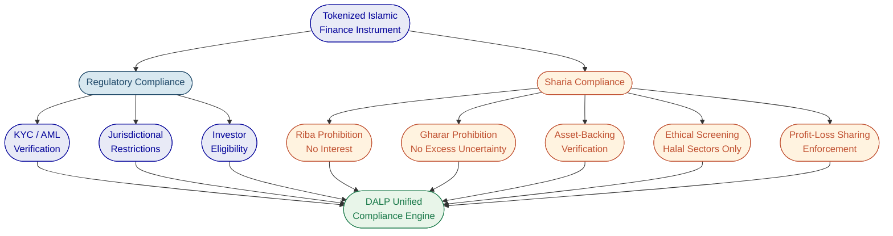
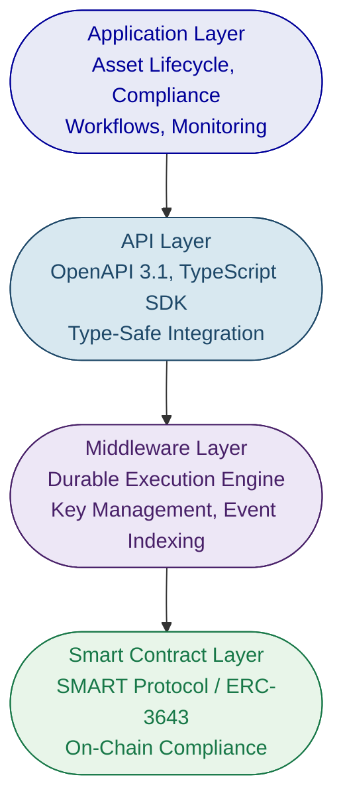
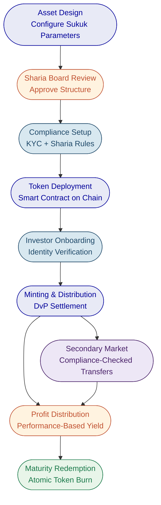
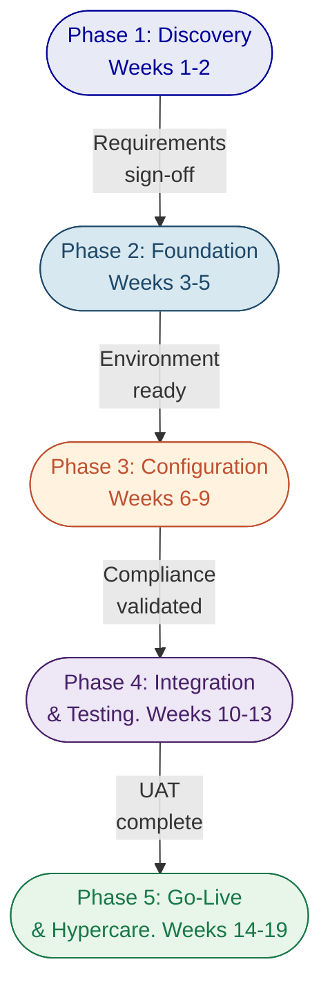

# Islamic Finance and Sharia-Compliant Tokenization with DALP

---

# Executive Summary

Islamic finance represents one of the fastest-growing segments of global financial services, with assets exceeding $4 trillion and projected annual growth rates of 10-12%. Sukuk issuance, Sharia-compliant investment funds, and Islamic banking products are expanding rapidly across the Gulf Cooperation Council (GCC), Southeast Asia, and increasingly in European and African markets. This growth is creating urgent demand for digital infrastructure that can support Sharia-compliant financial products at production scale.

Yet the intersection of Islamic finance and digital asset tokenization presents a particular challenge: how to enforce Sharia compliance programmatically, transparently, and with the auditability that both regulators and Sharia supervisory boards require. Traditional tokenization platforms were not designed with Islamic finance principles in mind. They lack the configurable compliance frameworks needed to enforce prohibitions on riba (interest), gharar (excessive uncertainty), and maysir (gambling), or to ensure that tokenized instruments remain asset-backed and ethically screened throughout their lifecycle.

This is where the complexity of doing it right becomes most acute. Minting a token is straightforward. Ensuring that every transfer, every distribution, and every lifecycle event on that token complies with Sharia principles, local regulatory requirements, and institutional governance standards simultaneously is a production-grade engineering challenge that most platforms cannot address.

SettleMint's Digital Asset Lifecycle Platform (DALP) was built to solve exactly this class of problem. DALP provides production-ready infrastructure for designing, launching, and operating digital assets with configurable compliance enforcement at the smart contract layer. The platform's modular compliance engine, configurable token architecture, and full asset lifecycle management make it uniquely suited to Islamic finance instruments, where compliance is not an optional feature but a structural requirement embedded in every transaction.

DALP is already proven in Islamic finance contexts. SettleMint has delivered solutions for the Islamic Development Bank (IsDB), including Sharia-compliant subsidy distribution across 57 member countries and automated market stabilization for Islamic finance collateral assets. These deployments demonstrate that DALP's configurable compliance framework can enforce Sharia principles at scale, in production, across multiple jurisdictions.

This proposal presents how DALP enables Islamic financial institutions to tokenize Sukuk, Murabaha, Ijara, Mudaraba, and Musharaka instruments with Sharia compliance enforced programmatically at the smart contract level, supported by institutional-grade governance, security, and auditability.

---

# The Islamic Finance Challenge

Islamic financial institutions face a convergence of pressures that traditional tokenization platforms are not equipped to address.

**Manual compliance processes create operational risk.** Sharia compliance in traditional Islamic banking relies heavily on manual review processes, Sharia board approvals documented on paper, and periodic audits that assess compliance retrospectively. A Sukuk issuance, for example, requires Sharia board certification of the underlying asset, the profit-sharing structure, the distribution mechanism, and the terms of maturity. When these compliance decisions exist as PDFs and committee minutes rather than programmable rules, the gap between policy and enforcement becomes a source of operational risk. A transfer that violates the Sharia board's approved investor eligibility criteria may execute and only be discovered during the next audit cycle. In a regulated environment, this kind of ex-post discovery is not an inconvenience; it is a compliance failure.

**Lack of transparency undermines investor confidence.** Islamic finance instruments derive their legitimacy from transparency. Investors in a Sukuk need confidence that the underlying asset exists, that the profit-sharing ratio reflects actual returns, and that the instrument has not been structured in a way that introduces gharar. Traditional financial infrastructure provides this transparency through intermediaries, auditors, and periodic reporting. But intermediary-dependent transparency is slow, expensive, and vulnerable to information asymmetry. Investors in a Mudaraba fund, for instance, may wait quarters for audited reports confirming that the fund manager has adhered to the agreed profit-loss sharing arrangement.

**Limited secondary market liquidity constrains growth.** Many Islamic finance instruments, particularly Sukuk and real estate-backed products, suffer from illiquidity in secondary markets. The combination of complex transfer restrictions (investor eligibility, jurisdictional constraints, holding period requirements), manual compliance processes, and fragmented settlement infrastructure makes secondary trading operationally burdensome. An investor seeking to sell a position in a Sukuk must navigate transfer agent approvals, Sharia compliance re-verification for the buyer, and settlement processes that can take days. This friction suppresses trading volumes and limits the attractiveness of Islamic finance products to institutional investors who require liquidity.

**Fragmented technology stacks increase cost and risk.** Islamic financial institutions typically operate with separate systems for asset origination, compliance management, custody, settlement, and reporting. Each system may handle a piece of the Sharia compliance puzzle, but none provides a unified view of an instrument's compliance posture across its lifecycle. When compliance is distributed across disconnected systems, reconciliation becomes a constant operational burden, and the risk of compliance gaps between systems becomes difficult to quantify.

**Regulatory expectations are intensifying.** Central banks and financial regulators across the GCC, Southeast Asia, and beyond are raising expectations for how Islamic financial institutions demonstrate Sharia compliance. The UAE's CBUAE, Saudi Arabia's SAMA, Malaysia's Bank Negara, and Bahrain's CBB are all moving toward more granular supervisory requirements. These regulators increasingly expect continuous compliance monitoring rather than periodic attestation. Meeting these expectations with manual processes and disconnected systems is becoming unsustainable.

The opportunity for Islamic finance institutions that solve these challenges is significant. A digital asset platform that can enforce Sharia compliance programmatically, provide real-time transparency to investors and regulators, enable liquid secondary markets with automated compliance checks, and manage the full instrument lifecycle from issuance through maturity creates a structural competitive advantage in one of the world's fastest-growing financial sectors.

---

# Sharia Compliance Requirements for Tokenized Assets

Tokenizing Islamic finance instruments is not simply a matter of representing a financial product on a blockchain. The tokenization architecture must encode and enforce the foundational principles of Islamic jurisprudence (fiqh al-muamalat) that govern all Islamic financial transactions. These principles are not optional compliance overlays; they are structural requirements that define whether an instrument is permissible (halal) or prohibited (haram).

**Prohibition of Riba (Interest).** The most fundamental principle in Islamic finance is the prohibition of riba, which encompasses all forms of interest-based returns. A tokenized instrument cannot generate or distribute returns based on fixed interest rates. Instead, returns must be derived from profit-sharing arrangements tied to actual economic activity or asset performance. For a tokenization platform, this means the yield distribution mechanism must be configurable to support profit-loss sharing rather than fixed coupon payments, and the compliance engine must be capable of validating that distribution calculations reflect actual performance rather than predetermined interest rates.

**Prohibition of Gharar (Excessive Uncertainty).** Islamic finance requires that all parties to a transaction have sufficient knowledge of the terms, the underlying asset, and the associated risks. Gharar prohibits excessive ambiguity in contracts, speculative transactions where the outcome is fundamentally uncertain, and the sale of assets that do not yet exist or are not adequately described. For tokenized instruments, this translates into requirements for transparent asset metadata, verifiable on-chain records of the underlying asset's existence and characteristics, and clear documentation of profit-sharing terms embedded in the instrument's lifecycle logic.

**Prohibition of Maysir (Gambling).** Transactions structured as zero-sum games, where one party's gain is inherently another party's loss without productive economic activity, are prohibited. This principle affects how secondary market trading is structured and constrains certain derivative-like structures. A tokenization platform must ensure that the instruments it supports are backed by real economic activity or tangible assets, not synthetic constructs designed for speculative gain.

**Requirement for Asset-Backing.** Islamic finance instruments must be connected to real, tangible assets or genuine economic activity. A Sukuk is not a bond in the conventional sense; it represents ownership or beneficial interest in an underlying asset, project, or business activity. The tokenization platform must maintain a verifiable link between the token and its underlying asset throughout the instrument's lifecycle, with on-chain metadata capturing the asset's characteristics, location, valuation, and ownership structure.

**Ethical Screening.** Islamic finance requires that investments avoid sectors considered haram, including conventional financial services (interest-based banking and insurance), alcohol, tobacco, gambling, pork products, and weapons manufacturing. For a tokenization platform serving Islamic financial institutions, this means the compliance engine must support configurable screening criteria that can be applied at the investor level, the asset level, or both.

**Profit-Loss Sharing (PLS).** Many Islamic finance structures are built on the principle that returns should reflect the actual performance of the underlying activity or asset. In a Mudaraba arrangement, the capital provider and the manager share profits according to a pre-agreed ratio, but losses are borne by the capital provider (unless the manager is negligent). In a Musharaka, all partners share both profits and losses proportionally. The tokenization platform must support configurable distribution mechanisms that can implement these sharing arrangements with full transparency and auditability.

**Sharia Board Oversight.** Every Islamic financial institution operates under the guidance of a Sharia supervisory board that reviews and approves product structures, compliance frameworks, and operational practices. The tokenization platform must provide the audit trails, reporting capabilities, and transparency that enable Sharia boards to exercise effective oversight. This includes the ability to verify that compliance rules are enforced as approved, that instrument structures match their Sharia certification, and that any changes to compliance configuration are logged and attributable.

These requirements, taken together, define a compliance surface that is significantly more complex than conventional securities regulation. A tokenization platform that supports Islamic finance must combine regulatory compliance (KYC/AML, jurisdictional restrictions, investor eligibility) with Sharia compliance (asset-backing verification, ethical screening, profit-loss sharing enforcement) in a single, auditable framework. This is the complexity that DALP is designed to address.

The following diagram illustrates how Sharia compliance requirements layer on top of regulatory compliance to create the dual-compliance framework that any Islamic finance tokenization platform must enforce.

---

# DALP Platform Overview

DALP, the Digital Asset Lifecycle Platform, exists to solve the complexity of doing tokenization right at production scale. Built by SettleMint over nearly a decade of production deployments with regulated banks, market infrastructure providers, and sovereign entities, DALP provides the infrastructure institutions need to design, launch, and operate digital assets with the governance, compliance, and reliability that regulated environments demand.

DALP is a platform, not a consulting engagement. Institutions configure and operate it themselves, using the same software that powers production deployments across Europe, the Middle East, and Asia Pacific. There is no custom development required to launch a tokenized bond, issue fractional real estate tokens, or enforce multi-jurisdictional compliance. The platform ships with the smart contracts, compliance modules, identity infrastructure, and operational tooling required for production, ready from day one.

The platform is built as a four-layer architecture with distinct responsibility boundaries at each level. The Application Layer provides the operational interface for asset lifecycle management, compliance workflows, and system monitoring. The API Layer exposes all platform capabilities through a type-safe interface with OpenAPI 3.1 specifications and a public TypeScript SDK. The Middleware Layer handles workflow orchestration through a durable execution engine, cryptographic key management with HSM and cloud KMS integration, and blockchain event indexing. The Smart Contract Layer enforces compliance, identity, and asset logic on-chain through the SMART Protocol, built on the ERC-3643 standard.

DALP supports seven asset types organized into four classes: Fixed Income (bonds), Flexible Income (equities and funds), Cash Equivalents (stablecoins and deposits), and Real World Assets (real estate and precious metals). Each asset type includes purpose-built lifecycle logic, metadata schemas, and compliance configurations. The configurable token architecture allows any combination of token features and compliance modules to be composed into a financial instrument without custom smart contract development.

The platform's compliance engine enforces rules before execution, not after review. Every token transfer, every minting operation, and every investor onboarding passes through a deterministic policy evaluation engine that validates eligibility, identity claims, and jurisdictional constraints at the smart contract layer. If a transfer would violate any configured rule, it reverts atomically. There is never a state where non-compliant tokens exist in an unauthorized wallet.

The following diagram shows DALP's four-layer architecture and how each layer contributes to the platform's capabilities for Islamic finance tokenization.

DALP supports flexible deployment across managed SaaS, private cloud, on-premises, and hybrid configurations. An institution in the GCC can run DALP entirely within its own data center, meeting local data sovereignty requirements while using the same platform version as a European bank operating on managed cloud infrastructure. All deployment models deliver identical platform capabilities with no feature differences.

---

# How DALP Enables Sharia-Compliant Tokenization

DALP's architecture addresses the requirements of Sharia-compliant tokenization through three reinforcing capabilities: a configurable compliance module system that can encode Sharia rules alongside regulatory requirements, smart contract-level enforcement that makes compliance deterministic rather than advisory, and full asset lifecycle management that maintains Sharia compliance from issuance through maturity and redemption.

## Configurable Compliance for Sharia Rules

DALP ships with a compliance library of 12 configurable controls organized across seven categories: Eligibility, Restrictions, Transfer Controls, Issuance and Supply, Time-Based Rules, and Settlement and Collateral. These controls represent enforceable rule primitives that institutions combine to match their specific regulatory and Sharia requirements.

For Islamic finance, these controls enable several critical Sharia compliance patterns. The identity verification module, combined with DALP's expression builder, can enforce investor eligibility criteria that include both regulatory requirements (KYC, AML) and Sharia-specific attestations (ethical screening, qualified Islamic investor status). The country allowlist module restricts distributions to jurisdictions where the instrument's Sharia certification is recognized. The supply cap and collateral compliance modules ensure that tokenized instruments remain fully asset-backed, preventing over-issuance beyond the value of the underlying asset.

Beyond the pre-built library, organizations can create custom compliance templates for institution-specific or jurisdiction-specific requirements. An Islamic bank can create a "Sharia-Compliant Sukuk" template that combines identity verification, country restrictions, collateral backing verification, and investor count limits into a single reusable compliance profile. Custom templates coexist alongside the DALP library, identified by an "Organisation" badge for clear source differentiation.

## Smart Contract-Level Enforcement

The critical architectural decision in DALP's compliance model is where enforcement happens: before execution, not after. Every token transfer passes through the compliance engine at the smart contract layer. If a transfer would violate any configured rule, including Sharia compliance rules, it reverts atomically. This is ex-ante enforcement, and it provides the guarantee that Sharia supervisory boards need: if a token exists in a wallet, every transfer that placed it there passed every compliance check that was active at the time.

This enforcement model is built on the ERC-3643 (T-REX) standard, an open Ethereum standard designed specifically for regulated securities markets. DALP implements ERC-3643 through the SMART Protocol (SettleMint Asset Regulatory Technology), which adds production-grade features required for institutional deployment: upgradeable compliance modules, multi-jurisdictional regulatory templates, and richer claim-expression logic. For Islamic finance institutions, this means Sharia compliance rules operate with the same deterministic enforcement as regulatory compliance rules, not as advisory guidelines subject to manual verification.

## Full Asset Lifecycle Management

DALP manages tokenized assets from initial design through retirement, ensuring that Sharia compliance is maintained at every lifecycle stage. The Asset Designer wizard guides issuers through token configuration with step-by-step validation of parameters, compliance modules, governance structures, and deployment settings. For Islamic finance instruments, this means the profit-sharing structure, the asset-backing verification, and the Sharia-specific compliance controls are all configured and validated before the instrument is deployed.

Post-deployment, DALP handles the operational lifecycle: minting and distribution to verified investors, compliance-checked transfers on the secondary market, automated yield or profit distributions, corporate actions, and maturity redemption. Each of these operations passes through the same compliance engine, ensuring that Sharia rules are enforced consistently throughout the instrument's life, not just at issuance.

---

# Supported Islamic Finance Instruments

DALP's configurable token architecture enables institutions to create tokenized versions of the major Islamic finance instruments. Each instrument maps to specific DALP asset types, token features, and compliance module configurations.

## Sukuk (Islamic Bonds)

Sukuk represent ownership or beneficial interest in an underlying asset, project, or business activity. Unlike conventional bonds, Sukuk do not pay interest; instead, they generate returns through profit-sharing arrangements tied to the underlying asset's performance. DALP's bond asset type, combined with its configurable token features, provides the foundation for tokenized Sukuk.

The following diagram illustrates the lifecycle of a tokenized Sukuk on DALP, from asset design through maturity redemption.

A tokenized Sukuk on DALP would be configured as a Fixed Income asset with the following architecture. The Fixed Treasury Yield feature handles periodic profit distributions, configured to reflect the actual performance of the underlying asset rather than a fixed interest rate. The Maturity Redemption feature manages the return of the initial investment at maturity, with atomic redemption ensuring that the Sukuk holder receives the denomination asset and the Sukuk tokens are burned in a single transaction. Historical Balances provide the checkpoint system needed for pro-rata profit distribution calculations.

The compliance module configuration for a Sukuk would include identity verification (with an expression combining KYC, AML, and Sharia-specific investor eligibility), country allowlist (restricting distribution to jurisdictions where the Sukuk's Sharia certification is valid), supply cap (ensuring issuance does not exceed the value of the underlying asset), and collateral verification (confirming asset-backing before any minting operation). The denomination asset link, configured at creation time, establishes the settlement relationship before the first token is minted, enabling atomic Delivery-versus-Payment settlement.

## Murabaha (Cost-Plus Financing)

Murabaha is a sale transaction where the financier purchases an asset and sells it to the client at a disclosed markup, with payment deferred over an agreed period. The markup is agreed upfront and does not change, distinguishing it from interest-based lending. On DALP, a Murabaha instrument can be structured using the bond asset type with specific configurations.

The token would represent the client's obligation to pay the agreed price over the deferred payment period. The Fixed Treasury Yield feature would be configured to reflect the agreed payment schedule (the markup distributed over the payment term). The supply cap ensures a one-to-one relationship between the token and the underlying Murabaha contract. On-chain metadata, stored through DALP's verification system, would capture the purchase price, the markup amount, and a reference to the underlying asset, providing the transparency that Sharia compliance requires.

## Ijara (Islamic Leasing)

Ijara structures involve the financier purchasing an asset and leasing it to the client, with rental payments generating the return. The financier retains ownership of the asset throughout the lease term. On DALP, an Ijara instrument maps to a combination of the bond asset type (for the payment stream) and real estate or real-world asset metadata (for the underlying physical asset).

DALP's real estate tokenization capabilities are directly applicable to Ijara structures involving property. The platform captures GPS coordinates, property classification, building specifications, and ownership details as on-chain metadata, creating a verifiable link between the token and the physical asset throughout the lease term. The Fixed Treasury Yield feature handles periodic rental distributions. At the end of the lease term, the Maturity Redemption feature can facilitate transfer of ownership to the lessee if the Ijara includes a purchase option.

## Mudaraba (Profit-Sharing Partnership)

In a Mudaraba arrangement, one party provides capital (rabb al-mal) while the other provides expertise and management (mudarib). Profits are shared according to a pre-agreed ratio, while losses are borne by the capital provider (unless the manager is negligent). On DALP, a Mudaraba fund maps to the Fund asset type.

The Fund asset type supports management fee parameters through the AUM Fee token feature, which would be configured to reflect the mudarib's profit share rather than a fixed management fee. Historical Balances provide the snapshot capability needed for calculating each investor's proportional share of profits at distribution dates. The compliance module configuration would include identity verification with Sharia-specific investor eligibility claims, ensuring that only qualified investors participate. The Voting Power feature can optionally enable investor governance over fund strategy, providing the transparency and oversight that Sharia principles demand.

## Musharaka (Joint Venture Partnership)

Musharaka is a partnership where all parties contribute capital and share profits and losses proportionally. On DALP, a Musharaka can be structured using the Fund asset type with equity-like characteristics. Each partner's contribution is represented by their token holding, with the proportion of tokens reflecting their capital contribution ratio.

The Historical Balances feature maintains a checkpoint-based record of each partner's proportional ownership at any point in time. Profit distributions use the Fixed Treasury Yield feature configured for proportional distribution based on token holdings. The Voting Power feature enables governance rights proportional to each partner's stake, reflecting the Musharaka principle that all partners have the right to participate in management. The compliance module configuration enforces that all token holders meet the Sharia eligibility criteria and that the total supply remains aligned with the partnership's actual capital base.

---

# Compliance and Regulatory Framework

Islamic financial institutions operate under dual compliance obligations: conventional regulatory requirements (KYC/AML, investor eligibility, jurisdictional restrictions) and Sharia compliance requirements (asset-backing, ethical screening, profit-loss sharing structures). DALP's compliance architecture addresses both through a single, auditable framework.

## Built-in KYC/AML with Sharia Extensions

Every participant in DALP is represented by an on-chain identity contract based on the OnchainID protocol. Claims are issued by trusted third parties, not self-asserted. A wallet holder cannot declare themselves KYC-verified or Sharia-eligible; a registered trusted issuer must attest to that fact by writing a signed claim to the holder's OnchainID contract.

For Islamic finance, the verification topic registry can be extended with custom claim types specific to Sharia compliance. Beyond the standard AML and KYC verification topics, institutions can create custom topics such as "Qualified Islamic Investor," "Sharia Board Approved," or "Ethical Screening Passed." These custom topics are configured at the organization level and enforced through the same compliance engine as regulatory claims.

## Configurable Rules Engine

DALP's compliance engine evaluates a configurable set of transfer rules before each transaction. Rules are modular and can be added, removed, or reconfigured at runtime without redeploying the token contract. For an Islamic financial institution, this means Sharia compliance rules can be updated when a Sharia board revises its guidance, without disrupting the operation of existing instruments.

The expression builder enables compliance teams to construct investor eligibility rules using visual boolean logic. A Sharia-compliant instrument might require an expression combining "KYC AND AML AND Qualified Islamic Investor AND Ethical Screening" as a gated compliance requirement. Each condition maps to a verified claim on the investor's OnchainID, and the entire expression is evaluated atomically before any transfer executes.

## Sharia Board Integration Points

DALP's audit trail and transparency features provide the foundation for effective Sharia board oversight. Every action on every asset is logged immutably on-chain with timestamps, transaction hashes, and sender addresses. The activity log is color-coded by category (Identity, Access Control, Assets, System, Transfers), enabling rapid review during compliance audits.

Sharia boards can verify that compliance rules match their approved configuration, that instrument structures conform to their certification, and that any changes to compliance settings are logged with full attribution. The on-chain nature of these records means they cannot be altered retroactively, providing the immutability guarantee that Sharia oversight requires.

## Audit Trails and Regulatory Reporting

DALP maintains a complete, immutable audit trail of every operation across the platform. For Islamic finance, this audit trail serves multiple stakeholders simultaneously. Regulatory supervisors (CBUAE, SAMA, Bank Negara, CBB) can verify KYC/AML compliance and transaction monitoring. Sharia supervisory boards can verify adherence to approved Sharia structures and compliance rules. Internal audit teams can reconstruct the complete history of any instrument or investor interaction. External auditors can verify asset-backing, profit distribution calculations, and compliance enforcement records.

The platform's API-first design enables programmatic extraction of audit data for integration with existing compliance reporting systems, regulatory filing workflows, and Sharia board reporting tools.

---

# Technical Architecture

## Deployment Options

DALP supports four deployment models, each delivering identical platform capabilities. The choice is driven by institutional requirements around data sovereignty, security posture, and regulatory constraints.

**Managed SaaS** provides the fastest path to production with lowest operational overhead. SettleMint operates the full platform on dedicated cloud infrastructure with configurable data residency by region. For GCC-based institutions, this means data can be hosted within the region while benefiting from SettleMint's operational expertise.

**Private Cloud** deployment within the institution's own cloud environment (AWS, Azure, GCP) using Helm charts provides full infrastructure control with SettleMint platform support. This model suits institutions with established cloud operations teams and cloud-first IT strategies.

**On-Premises** deployment within the institution's data center is available for environments requiring complete network isolation. This model is required by sovereign entities and institutions with strict data sovereignty mandates. Air-gap capable configurations ensure that no data leaves the institution's controlled infrastructure.

**Hybrid** configurations provide component-level deployment flexibility. The application layer may run in private cloud while blockchain nodes and key management operate on-premises, or the primary environment may be on-premises with a managed SaaS disaster recovery site.

## Blockchain Agnosticism

DALP operates on any blockchain that implements the Ethereum JSON-RPC specification. No application code changes are required when switching networks. This includes public Layer 1 networks (Ethereum, Polygon, Avalanche), Layer 2 rollups (Arbitrum, Optimism, Base), and private or consortium networks (Hyperledger Besu with IBFT 2.0 or QBFT).

For Islamic financial institutions, private or consortium blockchain networks are often preferred for production deployments. Hyperledger Besu provides permissioned operation with configurable consensus, suitable for multi-institution consortiums such as a group of Islamic banks operating a shared Sukuk trading infrastructure. The same DALP configuration, compliance rules, and operational tooling work identically across all network types.

## Enterprise Integration

DALP is designed as an API-first platform. Every capability available through the web interface is accessible programmatically through the Unified API with OpenAPI 3.1 specifications. The public TypeScript SDK provides the recommended integration surface for programmatic access.

Integration with existing Islamic banking systems is supported through multiple methods. The REST API enables system-to-system connectivity with core banking platforms, treasury management systems, and compliance tools. Event webhooks provide real-time notifications for transaction confirmations, compliance state changes, and asset lifecycle events. These integrations enable DALP to operate alongside existing infrastructure rather than requiring wholesale replacement.

The platform supports internationalization with four locales including Arabic (ar-SA) with full right-to-left layout support, ensuring that Arabic-speaking operators and investors interact with the platform in their preferred language and reading direction.

---

# Security and Access Control

DALP enforces defense-in-depth across five independent security layers. No single-layer failure grants unauthorized access to digital assets.

## Role-Based Permissions

The platform implements 26 distinct roles organized across four layers, enforcing granular separation of duties. For each tokenized Islamic finance instrument, seven per-asset roles govern operations: Default Admin (role management only), Governance (compliance configuration and policy), Supply Management (minting and burning), Custodian (freeze, forced transfers, recovery), Emergency (pause and unpause), Sale Admin (token sale management), and Funds Manager (sale fund withdrawal).

These roles enforce hard separation-of-duties invariants at the smart contract level. The entity issuing tokens cannot freeze or recover them. The entity setting compliance rules does not control token supply. The incident-response role can halt operations but cannot alter the system's state. This separation maps directly to the governance structures that Islamic financial institutions maintain, where Sharia boards, compliance officers, treasury operations, and risk management operate with clearly defined and non-overlapping authorities.

## Custody and Key Management

DALP's Key Guardian service manages cryptographic key material through defense-in-depth with multiple storage backends. For regulated Islamic financial institutions, the platform integrates with institutional-grade MPC custody providers including DFNS and Fireblocks. Both providers ensure that no single private key ever exists in one place.

DFNS provides threshold MPC with distributed key shards and fully programmatic approval workflows. Fireblocks provides MPC-CMP with continuous key refresh and a Transaction Authorization Policy engine that enforces amount thresholds, whitelisted destinations, and multi-approver requirements. Either provider can be selected based on the institution's existing custody relationships and security requirements.

For on-premises deployments, Hardware Security Module (HSM) integration provides FIPS 140-2 Level 3 certified key storage, meeting the security requirements of institutions operating under the most stringent regulatory frameworks.

## Certifications

SettleMint maintains ISO 27001 and SOC 2 Type II certifications, confirming that security controls are independently audited and continuously maintained. The platform undergoes regular penetration testing and security assessments by independent third parties. These certifications provide the assurance that procurement teams and risk committees at Islamic financial institutions require during vendor evaluation.

---

# Implementation Approach

SettleMint follows a structured, phase-gated implementation methodology refined through production deployments with regulated banks, market infrastructure providers, and sovereign entities. The standard implementation spans 19 weeks from kickoff to the end of hypercare, organized into five delivery phases.

## Phased Rollout

The following diagram shows the five implementation phases and their timeline across the 19-week delivery period.

**Phase 1: Discovery and Requirements (Weeks 1-2).** Stakeholder interviews with business sponsors, technology leadership, compliance officers, Sharia board representatives, and operations teams. Documentation of applicable regulatory frameworks and Sharia compliance requirements, mapped to specific DALP compliance modules. Architecture design covering deployment topology, network selection, custody integration, and external system connectivity.

**Phase 2: Foundation and Setup (Weeks 3-5).** Environment provisioning across development, staging, and production. Blockchain network configuration (permissioned Hyperledger Besu for most Islamic finance deployments). Identity and access framework setup with OnchainID-based verification. Key management and custody provider integration. Observability stack deployment.

**Phase 3: Configuration and Compliance (Weeks 6-9).** Token and asset configuration for each Islamic finance instrument type. Compliance module setup including both regulatory (KYC/AML, jurisdictional) and Sharia-specific controls. Custom claim topic creation for Sharia verification. Trusted issuer registration for Sharia board attestations. Feed configuration for pricing and valuation data. Operational workflow design for day-to-day operations.

**Phase 4: Integration and Testing (Weeks 10-13).** System integration with core banking, custody, and identity providers. Functional testing of all asset lifecycle events, compliance rules (including Sharia-specific scenarios), and settlement workflows. Security testing of the full deployment. Performance testing under expected transaction volumes. User acceptance testing with operations teams and compliance officers.

**Phase 5: Go-Live and Hypercare (Weeks 14-19).** Production deployment (2 weeks) followed by intensive post-go-live support (4 weeks) with knowledge transfer and support transition. Each phase concludes with a formal gate review requiring sign-off from both SettleMint and the institution.

## Integration with Existing Islamic Banking Systems

DALP integrates with existing institutional infrastructure through its API-first architecture. Core banking system connectivity enables account reconciliation, position management, and settlement coordination. Custody platform integration is handled through the unified signer abstraction. Identity provider integration enables existing KYC/AML workflows to feed verified claims into DALP's on-chain identity system.

For Islamic banking specifically, integration points include connectivity with the institution's Sharia compliance management system, enabling Sharia board approvals to be reflected as on-chain claims; integration with Islamic treasury management systems for profit distribution calculations; and connectivity with the institution's regulatory reporting infrastructure for supervisory submissions.

---

# Case Studies and Reference Projects

SettleMint has delivered digital asset infrastructure across 14 engagements spanning banking, sovereign institutions, and capital market infrastructure. Several of these projects are directly relevant to Islamic finance and Sharia-compliant tokenization.

## Islamic Development Bank: Sharia-Compliant Subsidy Distribution

The Islamic Development Bank (IsDB) required a blockchain-based system for subsidy distribution across its 57 member countries. Traditional subsidy delivery relied on inefficient analogue processes with limited transparency, making it difficult to ensure funds reached intended recipients. SettleMint built a Sharia-compliant system that digitizes the entire delivery chain and enables direct peer-to-peer distribution of funds. Administrative and legal processes are automated through smart contracts. The solution improved financial inclusion for 1.7 billion people, achieved greater efficiency through elimination of redundancies, and provided full control and visibility over subsidy spending.

## Islamic Development Bank: Automated Market Stabilization

A second engagement with IsDB addressed excessive volatility in assets used as collateral for Sharia-compliant lending. DALP powers an automated system using algorithms, predictive modelling, and smart contracts to regulate collateral asset volatility without human intervention. DALP's configurable compliance modules enforce Sharia rules at the contract level. The system reduced market volatility by 30-50%, providing greater stability and reliability for Islamic finance products and strengthening trust in Sharia-compliant lending mechanisms.

## Saudi Arabia RER: Country-Scale Real Estate Tokenization

SettleMint serves as the delivery partner for Saudi Arabia's national-scale blockchain infrastructure for property registration, fractionalization, and a regulated digital marketplace under the Real Estate General Authority (REGA). This Vision 2030 initiative makes Saudi Arabia the first country to deploy a national-scale property blockchain. DALP powers the tokenization layer, handling asset contract deployment, compliance enforcement, and lifecycle management for tokenized property. Four PropTechs are live in production, processing real transactions. This reference demonstrates DALP's ability to operate at country scale within a GCC regulatory framework.

## Additional GCC and Regional References

SettleMint's broader reference portfolio includes engagements with Standard Chartered Bank (digital virtual exchange for securities across Asia, Africa, and the Middle East), OCBC Bank (security token engine for securitization and tokenization), and ADI-Finstreet (tokenized equity issuance in Abu Dhabi). These references collectively demonstrate production credibility across the asset classes, jurisdictions, and institutional contexts relevant to Islamic finance deployment.

---

# Why SettleMint

## Company Profile

SettleMint was founded in 2016 and is headquartered in Leuven, Belgium. The company has been building enterprise blockchain infrastructure for nearly a decade, with 7+ years of continuous production deployments at regulated banks in Asia and Europe, and active sovereign and national-scale programs in the Middle East.

The leadership team combines deep technical expertise, financial domain knowledge, and enterprise delivery experience. Co-founder and CTO Roderik van der Veer oversees all technology strategy, platform architecture, and engineering execution. Co-founder and CEO Matthew Van Niekerk leads company strategy and market expansion. The team is supported by board members with direct financial services experience, regional leaders across Europe, the Middle East, and Asia-Pacific, and dedicated solution architects and customer success teams.

## Track Record

SettleMint is one of the few companies globally with production deployments across banks, sovereign entities, and market infrastructure providers simultaneously. The reference portfolio spans 14 engagements including OCBC Bank, Standard Chartered Bank, Commerzbank, Mizuho Bank, Maybank, State Bank of India, the Islamic Development Bank (two engagements), Sony Bank, the Saudi Arabia Real Estate Registry, and ADI-Finstreet. These are not pilot projects; they are production systems operating under institutional SLAs with real transactions, real assets, and real regulatory scrutiny.

For Islamic finance specifically, the combination of the IsDB engagements and the Saudi RER program provides direct evidence that SettleMint understands the requirements of Sharia-compliant financial infrastructure and can deliver at institutional and sovereign scale.

## Platform Maturity

DALP consolidates years of production experience into a unified platform. The technology has been battle-tested across multiple regions and regulatory environments. Years of customer deployments have shaped the platform's focus on lifecycle management, integration capability, and operational sustainability rather than proof-of-concept functionality.

SettleMint maintains ISO 27001 and SOC 2 Type II certifications. The platform has passed security reviews, penetration testing, and vendor risk assessments typical of large financial institutions. Procurement teams at Islamic banks and financial institutions will find a vendor that has already navigated the institutional evaluation processes they require.

---

# Commercial Summary

## Licensing Model

DALP uses a platform licensing model, not a per-transaction or per-asset fee structure. Institutions are not charged per mint, transfer, settlement, or compliance check. Creating additional asset types does not incur incremental licensing costs. Investor onboarding does not impose per-user fees. Licensing is structured as an annual subscription, providing budget predictability.

A DALP platform license provides access to all platform capabilities: all seven asset classes, all compliance module types, the full API surface, addon capabilities (settlement, distribution, yield), the observability stack, and all platform updates during the license term.

## Platform Tiers

DALP licensing is structured into tiers based on deployment complexity and institutional requirements, not usage volume. Each tier includes the full platform capability set.

| Tier | Designed For | Key Characteristics |
|------|-------------|---------------------|
| Foundation | Institutions launching their first production digital asset program | Single production environment, single network, single custody integration, standard support |
| Enterprise | Institutions scaling across multiple asset classes or jurisdictions | Multiple environments, multi-network, multi-custody, premium support |
| Sovereign | Country-scale or national infrastructure programs | Unlimited environments, dedicated infrastructure, 24/7 enterprise support, custom SLAs |

All pricing is tailored during commercial discussions based on deployment scope, asset classes, integration requirements, and support level.

## Support Tiers

| Support Level | Availability | Response Times | Scope |
|--------------|-------------|----------------|-------|
| Standard | Business hours (client timezone) | P1: 4 hours, P2: 8 hours | Platform support, quarterly reviews |
| Premium | Extended hours | P1: 2 hours, P2: 4 hours | Named support engineer, monthly reviews |
| Enterprise | 24/7 | P1: 1 hour, P2: 2 hours | Dedicated team, weekly syncs, embedded support option |

## Implementation Services

SettleMint provides structured implementation services following the 19-week phased methodology described in this proposal. Implementation services are scoped per engagement based on the complexity of the deployment, the number of asset classes, integration requirements, and the institution's internal technical capacity.

---

# Next Steps

SettleMint invites your institution to explore how DALP can accelerate your Islamic finance tokenization program. We propose the following engagement path:

**Discovery Workshop (2-3 days).** A focused session with your business, technology, compliance, and Sharia board stakeholders to map your specific requirements to DALP's capabilities. This workshop produces a preliminary architecture design and implementation roadmap at no obligation.

**Platform Demonstration.** A hands-on demonstration of DALP configured for Islamic finance instruments, showing the Asset Designer, compliance module configuration, investor onboarding, and lifecycle operations relevant to your priority use cases.

**Commercial Discussion.** Based on the discovery workshop outcomes, SettleMint will provide a tailored commercial proposal including platform licensing, implementation services, and support packaging.

**Contact Information**

SettleMint NV
Leuven, Belgium

For inquiries regarding this proposal, please contact your SettleMint account representative or reach us at info@settlemint.com.
