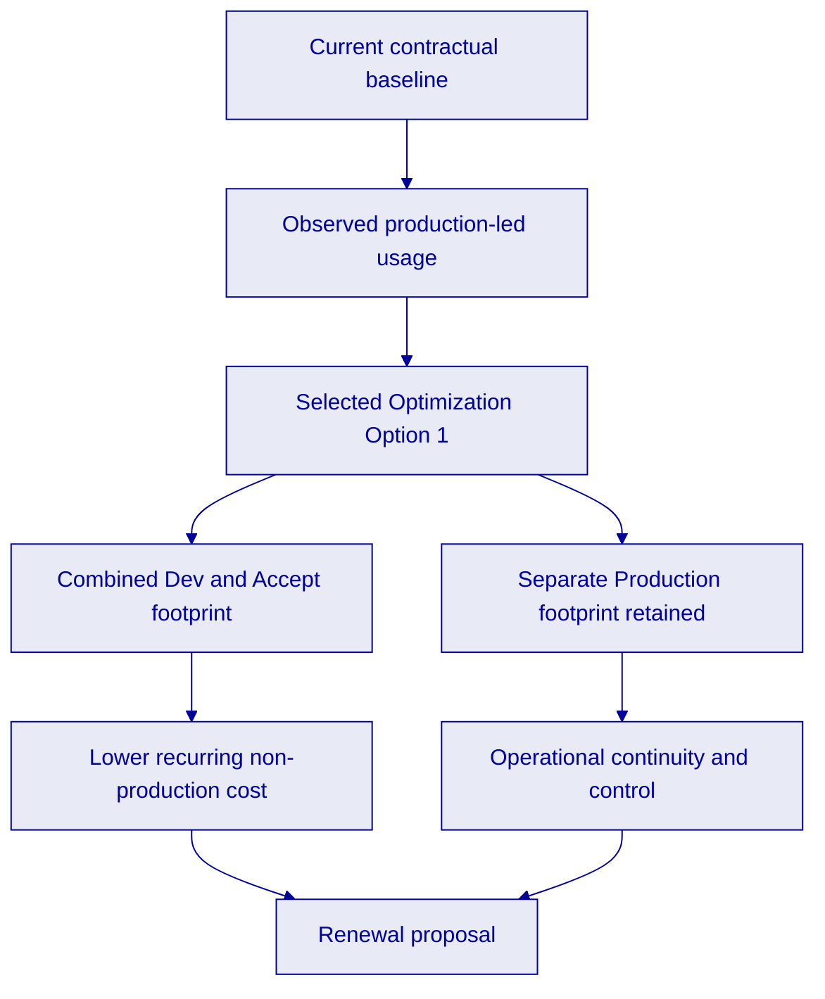

## Executive Summary

KBC Insurance has already proven the value of the current DALP deployment for its high value asset insurance use case. The renewal decision is therefore not about whether blockchain operations are possible. It is about keeping a production grade operating model in place while aligning the environment footprint and recurring run cost to the transaction profile now visible across the current term. That is the complexity of doing it right, preserving the controls and continuity that matter in production while removing avoidable cost from non production operations.

The source material for this renewal shows three things clearly. First, the current contractual baseline was structured around three active environments and a fully provisioned commercial model. Second, the observed transaction activity between August 2025 and February 2026 remained concentrated in production, with materially lower volumes in development and acceptance. Third, KBC selected Optimization Option 1, which combines development and acceptance activities into a shared operating model and rationalizes the deployed services accordingly.

On that basis, SettleMint proposes renewal on the Option 1 model. The proposed monthly run cost for the selected configuration is **€18,841.88**, compared with the historical contractual baseline of **€26,801.00** when all three baseline environments are active. This represents a reduction of **€7,959.12 per month**, or **€95,509.44 per year**, while preserving a separate production environment and the core DALP service set required for secure ongoing operation.

This proposal distinguishes carefully between the current contractual baseline and the proposed renewal scope. Where figures or renewal terms are not directly verifiable from the supplied sources, they are marked **[TO CONFIRM]** rather than assumed.

*Figure: DALP provides an operator view for live platform activity, portfolio oversight, and action management during the renewal term.*

---

## Current Engagement and Observed Platform Utilization

The existing signed agreement establishes the current commercial and contractual baseline between KBC Global Services NV and SettleMint NV. The contract shows an effective date of **1 August 2024** and a **24 month** term, which implies a current term running through **31 July 2026 [TO CONFIRM]**. The accepted commercial offer that underpinned the current term was built around three environments, Development, Accept, and Production, with discounted monthly charges of **€5,865**, **€10,468**, and **€10,468** respectively when active.

The renewal discussion can now be grounded in actual operating data. The utilization workbook contains transaction statistics from **August 2025 to February 2026**. Over that period the environment recorded **3,082 total transactions**, of which **1,911** were in Production, **623** in Accept, and **548** in Development. Production represented the majority of platform activity throughout the observed period, which supports a renewal design that protects production continuity while simplifying the non production footprint.

| Observed transaction period | Development | Accept | Production | Total |
| --- | --- | --- | --- | --- |
| Aug 2025 to Feb 2026 | 548 | 623 | 1,911 | 3,082 |
| Share of total | 17.8% | 20.2% | 62.0% | 100% |

Monthly activity also remained within a moderate range. The lowest total volume in the workbook is **205 transactions** in August 2025, while the highest is **888 transactions** in November 2025. Even at peak month, production remained the dominant environment. This is important because it indicates that the operational requirement is not three equally loaded environments. It is one production environment that remains isolated and appropriately sized, supported by a leaner model for development and testing.

A second view in the workbook shows the currently deployed resource plan at **€22,321.60** per month. The optimization worksheet, however, compares the selected option against the historical contractual baseline of **€26,801.00** per month. This proposal preserves that workbook logic so that the renewal comparison stays aligned with the source material already reviewed with KBC.

---

## Renewal Objectives

The renewal should achieve four objectives.

First, it should preserve business continuity for the insurance application already running on DALP. The production environment remains the operational anchor for the use case and should continue to provide the blockchain runtime, indexing, key management, explorer access, storage, and integration services required for day to day operation.

Second, it should align recurring spend with demonstrated demand. The observed transaction profile does not justify carrying the original fully separated non production footprint at the same level as production. The renewal therefore needs to remove unnecessary duplication without introducing operational fragility.

Third, it should keep the operating model straightforward for KBC teams. A renewal is strongest when it reduces cost and complexity at the same time. Consolidating non production activity into a combined Dev and Accept model does that, because it reduces infrastructure sprawl while keeping a clear distinction between non production and production work.

Fourth, it should stay commercially transparent. The renewal proposal therefore uses the existing contract and accepted offer as the baseline, uses the utilization workbook as the optimization evidence, and flags any term that still requires confirmation.

---

## Selected Optimization Approach

KBC selected **Optimization Option 1**, described in the workbook as **combining development and acceptance environments and rationalizing deployed services**. In practical terms, this approach replaces the separate Development and Accept commercial baseline with a combined **Dev & Accept** footprint, while keeping **Production** as a distinct environment.

The selected option is not a change to DALP's operating role. It is a resource and environment optimization. The same underlying platform service categories remain in scope for the renewal model: blockchain nodes, IPFS storage, smart contract services, middleware, load balancing, explorer access, and key management. The difference is that the non production estate is simplified and resized around actual usage rather than the initial launch posture.

| Commercial comparison | Current contractual baseline | Selected Option 1 |
| --- | --- | --- |
| Non production model | Separate Dev and Accept environments | Combined Dev & Accept environment |
| Production model | Separate Production environment | Separate Production environment retained |
| Monthly total | €26,801.00 | €18,841.88 |
| Monthly reduction |  | €7,959.12 |
| Annualized reduction |  | €95,509.44 |

The commercial logic of Option 1 is straightforward. The combined Dev & Accept footprint is priced at **€9,386.82** per month. The Production footprint is priced at **€9,455.06** per month. Together, they create the proposed renewal run rate of **€18,841.88** per month, which is approximately **29.7%** below the historical baseline used in the workbook comparison.

This option is the strongest fit for the observed activity pattern because it removes one full non production commercial layer without compromising production isolation. It therefore reduces cost while maintaining the control posture expected for a live insurance application.

*Figure: DALP integrates identity and verification management into the operating dashboard, supporting controlled platform administration during the renewal term.*

---

## Proposed Scope for the Renewal Term

The proposed renewal scope covers continued operation of the KBC Insurance DALP platform on the selected Option 1 footprint. The production environment remains in place as a dedicated operational boundary for live business activity. The combined Dev & Accept environment supports ongoing configuration, testing, and controlled pre production work in a leaner commercial model.

Within that scope, the platform services evidenced in the existing offer remain the relevant service set for renewal: blockchain node capacity, middleware for indexed data access, smart contract services, key management, explorer access, IPFS storage, load balancing, and the supporting integration layer. This proposal does not introduce new DALP capabilities that are not evidenced in the supplied source documents. It is a renewal and optimization proposal, not a net new transformation scope.

SettleMint's role during the renewal term is therefore to continue providing the platform runtime and associated service footprint required for the use case already in production, while aligning the resource profile to the selected optimization path. If KBC wishes to add materially new environments, materially increase throughput expectations, or extend the business scope beyond the current insurance application, those items should be treated as explicit change discussions rather than assumed within this renewal.

---

## Commercial Structure

The commercial baseline for the current term comes from the accepted July 2024 commercial offer and the signed agreement that followed it. The workbook then provides the renewal optimization comparison selected by KBC. Based on those sources, the commercial position can be summarized as follows.

| Commercial item | Source-grounded value |
| --- | --- |
| Current contract effective date | 1 August 2024 |
| Current contract term | 24 months |
| Baseline monthly Development cost | €5,865.00 |
| Baseline monthly Accept cost | €10,468.00 |
| Baseline monthly Production cost | €10,468.00 |
| Historical baseline when all active | €26,801.00 per month |
| Proposed renewal monthly cost, Option 1 | €18,841.88 per month |

The implied saving under the selected renewal path is **€7,959.12 per month**. On an annualized basis that equals **€95,509.44**. These figures come directly from the optimization workbook.

The renewal commercial structure should be finalized in line with the renewal order form or contract amendment. The following items are visible in the current baseline documents but should be explicitly reconfirmed for the renewal rather than assumed: renewal start date, renewal duration, invoicing cadence, payment term, support package, any duration discount mechanics, and any early termination rights. Where relevant, this proposal therefore marks such items **[TO CONFIRM]**.

Known baseline references from the current documents are as follows: the accepted commercial offer used a 24 month pricing logic and advance payment language with a net 15 payment term, while the signed agreement also contains general payment language referring to 30 days on correct and non disputed invoice. That apparent difference should be resolved in the renewal paperwork rather than carried forward implicitly.

---

## Delivery, Governance, and Assumptions

The renewal assumes continuity of the existing application and operating model. It does not assume a reimplementation project, a change in the production architecture, or a change in the core legal entity relationship established in the current agreement. The proposal is therefore designed to support an efficient renewal cycle rather than a new platform procurement.

From a governance perspective, the most important principle is a clear separation between live production operations and non production activity. Option 1 preserves that principle. It simplifies the pre production estate, but it does not collapse production into the same operating boundary. That matters for change control, release discipline, and operational accountability.

This proposal also assumes that the current observed workload is a reasonable basis for renewal sizing. If KBC expects a step change in business volume, user base, transaction load, or integration intensity during the next term, the resource plan should be reviewed before signature. Likewise, any requirement for additional resilience measures, additional environments, or a different support model should be reflected explicitly in the commercial schedule.

### Items to Confirm Before Signature

| Item | Status |
| --- | --- |
| Renewal term start date | [TO CONFIRM] |
| Renewal duration | [TO CONFIRM] |
| Invoicing cadence and payment term | [TO CONFIRM] |
| Support package for renewal term | [TO CONFIRM] |
| Any updated termination or credit mechanics | [TO CONFIRM] |
| Whether baseline comparison should reference €26,801.00 or €22,321.60 in the final client narrative | [TO CONFIRM] |

---

## Next Steps and Acceptance

The next step is to validate the renewal commercial schedule against the selected Option 1 workbook output and confirm the few remaining commercial terms that are not conclusively fixed by the provided source set. Once those points are closed, SettleMint can issue the renewal paper in final contractual form.

Subject to that confirmation, the recommended renewal decision is to proceed on the Option 1 model. It reflects the actual usage profile now visible in the platform data, preserves production continuity for the KBC Insurance use case, and materially reduces recurring run cost without overstating a change in scope.

KBC's acceptance of this renewal proposal should therefore confirm three items: the selected optimization path, the renewal term details, and the commercial schedule to be carried into the renewal document pack. After that, the renewal can move directly into execution.
