# Technical Proposal: Blockchain-Based Real Estate Tokenization Platform

## Ministry of Justice, State of Qatar

### Submitted by SettleMint NV in partnership with Malomatia

**Date:** March 2026

**Version:** 1.0

**Classification:** Confidential

**Primary Contact:** Gyan Sharma, VP Digital Assets MEA, gyan@settlemint.com, +971-564500007, DIFC Dubai

---

## Executive Summary

### Context and Strategic Drivers

The State of Qatar is advancing a national agenda to modernize its real estate ecosystem through blockchain technology. The Ministry of Justice (MoJ), as the custodian of property rights and the national land registry (SAK), is uniquely positioned to lead this transformation. The programme aims to introduce fractional ownership of real estate assets through regulated investment tokens, enabling broader participation in Qatar's property market while maintaining the governance, transparency, and legal certainty that the Ministry's mandate requires.

Several forces converge to make this programme both timely and necessary. Qatar's Digital Asset Regulations and the Qatar Financial Centre (QFC) investment token framework provide a maturing regulatory foundation. Regional precedent is accelerating, with Saudi Arabia's national-scale real estate tokenization programme already in production. Investor demand for fractional real estate exposure continues to grow globally. And the Ministry's existing SAK infrastructure provides a digital foundation that a tokenization layer can build upon rather than replace.

SettleMint, in partnership with Malomatia as the system integrator, proposes to deliver this programme using DALP (Digital Asset Lifecycle Platform), the production-grade platform purpose-built for exactly this class of sovereign, regulated digital asset deployment.

### Why This Programme Is Hard

Real estate tokenization at the national level is not a technology demonstration. It is an exercise in institutional infrastructure design, where the technical platform must satisfy overlapping requirements from property law, financial regulation, identity verification, anti-money-laundering compliance, and operational governance, all simultaneously.

The lifecycle complexity alone is substantial. Each tokenized property must pass through legal structuring, regulatory approval, investor eligibility verification, token issuance, secondary transfer with compliance enforcement, yield distribution, and eventual redemption or exit. Every one of these stages involves coordination between the Ministry, financial institutions, KYC/AML providers, custodians, and payment systems.

The governance burden compounds this complexity. Different stakeholders (the Ministry, the QFC regulatory authority, banks, custodians, investors) each require different levels of access, different approval authorities, and different audit visibility. The system must enforce these boundaries at the protocol level, not merely at the application layer.

Integration across existing national infrastructure, including SAK, banking systems, identity providers, and payment rails, must be production-grade from day one. The gap between a working pilot and a production system that the Ministry can rely upon for legally binding property records is precisely the gap that most tokenization initiatives fail to cross.

### Proposed Response

SettleMint proposes a phased, five-year engagement delivering a production-grade real estate tokenization platform built on DALP, deployed on permissioned Hyperledger Besu infrastructure within Ministry-controlled environments.

The platform will tokenize real estate assets as ERC-3643 compliant investment tokens with embedded compliance enforcement, integrate with the SAK national land registry for authoritative property data, connect to Qatar-approved KYC/AML providers for investor identity verification, support Arabic and English interfaces throughout, enable fractional ownership with automated yield distribution, and enforce Qatar Financial Centre regulatory requirements at the smart contract level.

The deployment model is private cloud or on-premises, aligned with the Ministry's data sovereignty requirements. All data, blockchain nodes, and cryptographic keys will reside within Ministry-approved infrastructure in Qatar.

The implementation follows a two-year build-out (Year 1 for core platform implementation, Year 2 for production deployment and professional services), followed by three years of production operation with ongoing support and platform licensing.

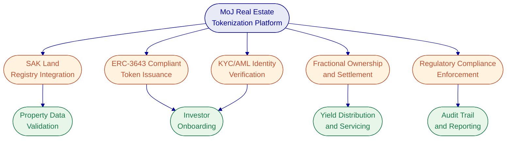

### Why SettleMint

SettleMint has operated in enterprise blockchain infrastructure since 2016, accumulating nearly a decade of production experience with regulated banks, market infrastructure providers, and sovereign entities across Europe, the Middle East, and Asia-Pacific.

The company holds ISO 27001 and SOC 2 Type II certifications, confirming that security controls are independently audited and continuously maintained. SettleMint has passed vendor risk assessments at tier-1 financial institutions and has delivered production deployments under institutional SLAs with 24/7 uptime requirements.

Critically for this programme, SettleMint is the technology partner behind Saudi Arabia's national-scale real estate tokenization initiative (RER), the first country in the world to deploy a blockchain-based property registry at national scale. That programme is live in production with real transactions since January 2026. The architectural patterns, integration approaches, and operational lessons from that deployment directly inform the proposed solution for the Ministry of Justice.

SettleMint has also completed pilot work with the Qatar Financial Centre, establishing regulatory alignment and demonstrating local presence in the Qatari market.

### Why DALP

DALP is not a tokenization toolkit or a blockchain middleware library. It is a full lifecycle platform that manages digital assets from design through retirement, with compliance enforcement, identity management, custody integration, settlement orchestration, and operational tooling built in from the ground up.

For this programme, DALP's relevance is specific. Its ERC-3643 implementation (the SMART Protocol) provides the modular compliance engine required to enforce QFC investment token regulations at the smart contract level. Its configurable real estate asset type supports fractional ownership with the specific parameters this programme requires. Its Arabic localization (ar-SA) with full right-to-left layout support addresses the bilingual requirement without custom development. Its deployment flexibility supports the Ministry's requirement for on-premises or private cloud infrastructure. And its production track record in real estate tokenization, specifically in the Middle East, reduces implementation risk in a way that no unproven platform can match.

### Delivery Confidence

SettleMint's confidence in delivering this programme rests on four concrete foundations, not on abstract capability claims.

**Proven architecture.** The same DALP platform proposed for the MoJ programme is already in production for the Saudi Arabia RER programme. The real estate token type, compliance enforcement, national registry integration pattern, and multi-participant architecture have all been validated through real-world deployment and operation.

**Regulatory familiarity.** Through the QFC Pilot Project, SettleMint has direct experience with Qatar's regulatory environment, institutional dynamics, and compliance requirements. The compliance module configuration proposed for this programme builds on that foundation.

**Partnership strength.** Malomatia's role as system integrator provides local delivery capability, Ministry relationship management, and deep knowledge of SAK and national systems. The combination of SettleMint's platform expertise with Malomatia's local integration capability addresses both the technology and the institutional dimensions of the programme.

**Predictable commercial model.** The flat licensing structure (no per-wallet, no per-transaction fees) provides cost certainty as the programme scales. The five-year contract structure with phased delivery reduces financial risk for the Ministry.

### Reference Fit Snapshot

Three reference projects directly validate SettleMint's capability for this programme:

- **Saudi Arabia RER**: Country-scale real estate tokenization, Middle East, same platform, same asset class, live in production since January 2026
- **Qatar Financial Centre Pilot**: Same country, regulatory alignment, demonstrated local presence and understanding of Qatari requirements
- **OCBC Bank**: Security token engine for tokenization and fractionalization of off-chain assets including real estate, production deployment in Singapore

---

## About SettleMint

### Company Overview

SettleMint is the production-grade digital asset lifecycle management company for regulated financial markets and sovereign use cases. The company provides the governance and orchestration layer between existing core financial systems and blockchain networks, delivering the infrastructure required to build, deploy, and operate compliant digital asset solutions in production.

SettleMint exists to bridge the gap between digital asset ambitions and production-grade execution. Financial institutions and governments recognize that tokenization is becoming core infrastructure for capital markets and real-world assets. Regulatory frameworks are maturing, tokenized instruments are appearing on balance sheets, and expectations have shifted from innovation theater to operational reality. SettleMint turns digital asset strategy into operating systems that reduce time-to-market and remove operational and regulatory risk.

The company targets three institutional segments: regulated financial institutions (banks, asset managers, custodians) seeking to launch digital asset products; market infrastructure providers (exchanges, CSDs, clearing houses) modernizing settlement and custody; and sovereign entities (central banks, government registries, development organizations) building national-scale digital asset infrastructure.

### History and Market Position

SettleMint was founded in 2016 in Leuven, Belgium, by practitioners with hands-on experience designing and delivering tokenization, payments, and capital markets projects since the early enterprise blockchain adoption wave. The company has evolved from its initial focus on enterprise blockchain infrastructure into a purpose-built digital asset lifecycle platform serving institutional and sovereign clients.

Key milestones mark this evolution. Early production deployments with tier-1 and tier-2 financial institutions moved the company beyond proof-of-concept technology into live transaction processing. The development and release of DALP consolidated years of production experience into a unified platform architecture. Geographic expansion extended operations across Europe, the Middle East, and Asia-Pacific. Sovereign-scale programmes with national institutions, including real estate registries and capital markets infrastructure, demonstrated the platform's capacity for country-level deployment.

SettleMint has completed Series A financing backed by leading investors in Europe and the Middle East, providing capital for continued platform development and geographic expansion.

### Production Credentials

| Credential | Detail |
| --- | --- |
| Years of Operation | 10 years, founded 2016 |
| Production Track Record | 7+ years of continuous production at regulated banks |
| Geographic Scope | Europe, Middle East, Asia-Pacific |
| Asset Classes in Production | Bonds, equities, deposits, stablecoins, real estate, funds, precious minerals |
| Sovereign Programmes | Active national-scale programmes in the Gulf region |
| Reference Engagements | 14 named reference projects across banking, sovereign, and market infrastructure |
| Transaction Scale | High-volume transactional flows in payments and settlements under institutional SLAs |

### Regulatory Readiness

| Framework | Status |
| --- | --- |
| Qatar Financial Centre (QFC) Investment Token Regulations | Alignment validated through QFC Pilot Project |
| Qatari Digital Asset Regulations | Platform configurable for QFC rules, token service provider guidelines |
| MiCA and MiFID II (EU) | Pre-built compliance templates |
| MAS Frameworks (Singapore) | Production deployments under MAS jurisdiction |
| Japan FSA Requirements | Live deployments with Japanese banks |
| GCC Regulatory Frameworks | Active programmes in Saudi Arabia and UAE |
| Regulation D/S (US) | Pre-built compliance modules |

SettleMint does not provide legal or regulatory advice. The platform provides the technical enforcement mechanisms for compliance rules defined by the client's legal and compliance teams. The regulatory readiness described above reflects the platform's capability to enforce these frameworks at the protocol level.

### Team and Delivery Capability

SettleMint's leadership combines deep technical expertise, financial domain knowledge, and enterprise delivery experience.

**Adam Popat, CEO**, leads commercial strategy and global market expansion, bringing experience spanning Standard Chartered, SC Ventures, and capital markets. **Matthew Van Niekerk, Co-founder and President**, leads company strategy, investor relations, and market expansion across the Middle East and Asia-Pacific. **Roderik van der Veer, Co-founder and CTO**, oversees all technology strategy, platform architecture, and engineering execution for DALP, with deep expertise in distributed systems, blockchain protocols, and security.

The DALP engineering team is a focused, senior group of four core engineers responsible for the entire platform: smart contract architecture, backend services, API layer, compliance engine, settlement workflows, and infrastructure automation. The small team size is a deliberate design choice enabling rapid iteration, architectural coherence, and deep ownership across the full stack. SettleMint operates with an AI-native engineering workflow that acts as a force multiplier, allowing the team to operate at higher effective capacity.

The leadership team is supported by board members with direct financial services experience, dedicated solution architects and delivery leads operating across regions, and regional leaders providing local regulatory and market knowledge. Gyan Sharma, VP Digital Assets MEA, serves as the primary contact for this engagement, based in DIFC Dubai.

### Ecosystem and Partnerships

SettleMint maintains a partnership ecosystem that extends delivery capability and deepens technology integration.

**Malomatia**, as the system integrator for this programme, provides local delivery presence, Ministry relationship management, and integration with Qatar's national systems including SAK. SettleMint has been selected by global consultancies and regional system integrators as the foundation for institutional digital asset programmes.

The technology ecosystem includes custody providers (Fireblocks, DFNS) through a bring-your-own-custodian model; cloud providers (AWS, Azure, GCP) for deployment flexibility; network partners across public and permissioned EVM chains; OnchainID for verifiable on-chain investor identities; ISO 20022 integration for payment rail connectivity; and integration points for SSO/IAM, SIEM, and enterprise audit logging.

### Certifications, Audits, and Institutional Readiness

SettleMint maintains the certifications and audit postures required for institutional procurement in regulated financial services.

**ISO 27001 Certification.** SettleMint's information security management system meets the international standard for establishing, implementing, maintaining, and continually improving information security. The certification covers risk assessment, security controls, organizational policies, and continuous improvement processes.

**SOC 2 Type II Certification.** Independent third-party audit confirming that SettleMint's controls for security, availability, and confidentiality meet AICPA Trust Services Criteria over an extended observation period. Type II goes beyond point-in-time control design (Type I) to verify that security controls operate effectively over time. The Type II report provides assurance that security controls are not just designed but consistently enforced, access controls and change management are followed in practice, and the organization monitors and responds to security events on an ongoing basis.

**Vendor Risk Assessment Experience.** SettleMint has successfully completed vendor risk assessments at tier-1 and tier-2 financial institutions, passed security reviews and penetration testing, and completed vendor due diligence processes typical of large financial organizations. Standard contractual frameworks and legal entity readiness for institutional procurement are in place.

**Operational Maturity Indicators.** 24/7 operational support capabilities, incident management and business continuity procedures, change management and release processes aligned with enterprise governance expectations, and production deployments operating under institutional SLAs including high-throughput transaction processing.

### Corporate and Financial Credibility

SettleMint NV is incorporated in Belgium with appropriate legal entity structure for contracting and procurement across European, Middle Eastern, and Asia-Pacific jurisdictions. The company has completed Series A financing backed by leading investors in Europe and the Middle East with expertise in financial technology and enterprise software.

SettleMint maintains standard contractual frameworks for licensing, professional services, and support, with experience in institutional procurement processes including NDA, DPA, and vendor onboarding. Appropriate professional indemnity and cyber insurance coverage is in place for enterprise technology vendors.

### Why Relevant to This Programme

This programme requires a technology partner with three specific credentials that SettleMint uniquely provides.

First, **proven real estate tokenization at national scale**. SettleMint is the technology partner behind Saudi Arabia's RER programme, the world's first national-scale property blockchain. The architectural patterns, regulatory integration approaches, and operational lessons from that programme directly apply to the Ministry of Justice's requirements.

Second, **demonstrated presence in Qatar**. Through the QFC Pilot Project, SettleMint has established relationships, validated regulatory alignment, and demonstrated understanding of Qatar's specific institutional and regulatory landscape.

Third, **institutional-grade platform maturity**. DALP is not a proof-of-concept or an innovation lab experiment. It is a production platform with seven years of continuous deployment at regulated banks, ISO 27001 and SOC 2 Type II certifications, and the operational maturity to support sovereign-scale programmes.

---

## About DALP

### Platform Overview

DALP (Digital Asset Lifecycle Platform) is SettleMint's production-grade infrastructure for designing, launching, and operating digital assets in regulated environments. The platform serves as the governance and orchestration layer between existing institutional systems and blockchain networks, providing the control plane that institutions need to manage digital assets throughout their entire lifecycle.

DALP is built as a four-layer stack where each layer has a distinct responsibility boundary. Lower layers enforce stricter invariants; upper layers provide flexibility and user-facing abstraction. Requests flow top-down: a user action in the Asset Console triggers an API call, which the middleware orchestrates into one or more blockchain transactions, which the smart contract layer validates and executes on-chain. Each layer independently enforces its own security controls, so no single-layer failure grants unauthorized access.

The platform treats the entire asset lifecycle as a configuration and operations problem, not a custom development exercise. Token creation, issuance, transfer, servicing, and retirement are all handled through the platform's API and UI, with compliance enforcement woven into every operation automatically.

### Core Lifecycle Pillars

**Issuance.** DALP provides a configuration-driven issuance model through the Asset Designer. Operators select from pre-built asset templates (including real estate), configure token parameters, bind compliance modules, and deploy through a factory pattern that enforces atomic deployment with deterministic addressing. The factory wraps proxy deployment, identity registration, compliance initialization, and role assignment into a single atomic transaction. No partially deployed tokens can exist. Tokens deploy in a paused state by default, giving the compliance team time to verify configuration before the token goes live.

**Compliance.** The platform enforces compliance at the protocol level using the ERC-3643 standard. Every transfer must pass through a modular compliance engine before execution. This is ex-ante enforcement: compliance checks execute before the transfer commits. There is never a state where non-compliant tokens exist in an unauthorized wallet. The compliance module library includes identity verification, country restrictions, investor count limits, holding period enforcement, supply caps, transfer approval workflows, and collateral requirements. Modules can be added, removed, or reconfigured at runtime without redeploying the token contract.

**Custody.** DALP is not a custodian. It orchestrates custody policy across existing custodian relationships through a provider-abstracted signer service. The Key Guardian manages cryptographic key material with support for encrypted database storage, cloud secret managers, HSMs (FIPS 140-2 Level 3), and third-party MPC custody (DFNS, Fireblocks). Switching between custody backends requires only configuration changes, with no workflow or code modifications.

**Settlement.** DALP's XvP (Exchange versus Payment) settlement system provides atomic Delivery-versus-Payment (DvP) and Payment-versus-Payment (PvP) settlement. Local settlements execute atomically in a single transaction. Cross-chain settlements use HTLC (Hash Time-Locked Contracts) for coordinated execution. All legs of a settlement are subject to the compliance rules of each token involved. If any compliance check fails on any leg, the entire settlement reverts. This achieves true T+0 finality with zero counterparty risk.

**Servicing.** The platform handles ongoing lifecycle operations including yield distribution (fixed treasury yield with pull-based claiming, automated yield schedules), maturity redemption (atomic payout with token burn), freeze and unfreeze operations (full and partial), pause and unpause for emergency circuit-breaking, forced transfers for court orders or regulatory enforcement, and role management with separation of duties at the smart contract level.

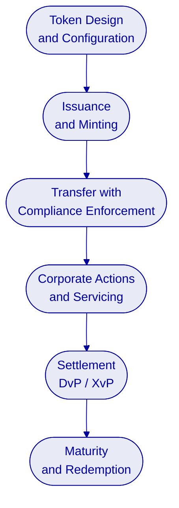

### Platform Foundations

**Identity and Access.** DALP manages on-chain identity through OnchainID (ERC-734/735), storing verifiable KYC/AML claims that the compliance engine evaluates at every transfer. The platform supports multiple authentication methods (email/password, passkeys/WebAuthn, LDAP, OAuth 2.0/OIDC, SAML 2.0) and enforces a dual-layer permission model: off-chain platform roles control API and console access; on-chain roles govern blockchain operations. Twenty-six distinct roles across four layers (platform, system, per-asset, and system module) enable fine-grained separation of duties.

**Integration and Interoperability.** DALP exposes all platform capabilities through a unified API (OpenAPI 3.1) with a TypeScript SDK, a CLI with 301 typed commands, webhooks for event-driven notifications, and SSE streaming for real-time operational monitoring. The API supports both synchronous and asynchronous execution modes. Every mutation is idempotent (enforced via Idempotency-Key headers), durable (survives process restarts), and auditable (full state-transition history). PostgreSQL analytics views (18 views across 5 domains) provide direct database access for BI tools.

**Observability and Operations.** The platform ships a full observability stack: metrics (time-series data for request rates, latencies, error rates, gas prices, block lag), structured logs with correlation identifiers, and distributed traces following operations across component boundaries. Twenty-one pre-built Grafana dashboards cover operations, transactions, compliance, security, and infrastructure health. Alert routing supports enterprise notification channels. OTLP receivers enable integration with existing enterprise monitoring.

### Supported Asset Classes and Operating Scope

| Asset Class | Asset Types | Typical Instruments |
| --- | --- | --- |
| Fixed Income | Bond | Corporate bonds, government bonds, structured notes |
| Flexible Income | Equity, Fund | Common stock, preferred shares, investment fund units |
| Cash Equivalent | Stablecoin, Deposit | Fiat-pegged stablecoins, tokenized bank deposits |
| Real World Asset | Real Estate, Precious Metal | Fractional property ownership, gold-backed tokens |

For the Ministry of Justice programme, the **Real Estate** asset type is the primary deployment target. DALP's real estate token template supports fractional property ownership with configurable parameters including GPS coordinates, property classification, building specifications, and fractional ownership structure. Real estate tokens have burn disabled at the asset level by design, preserving unit integrity since the full supply represents the property and destroying units would break the fractionalization model.

### Standards and Protocols

| Standard | Role in DALP |
| --- | --- |
| ERC-3643 (T-REX) | Foundation for regulated security tokens with modular compliance |
| SMART Protocol | SettleMint's implementation of ERC-3643 with configurable extensions |
| OnchainID (ERC-734/735) | On-chain identity management with verifiable claims |
| ERC-20 | Standard token interface for interoperability |
| ERC-2771 | Meta-transactions for gasless investor operations |
| ERC-4337 | Account abstraction for enhanced transaction patterns |
| ISO 20022 | Payment rail messaging for SWIFT, SEPA, RTGS integration |
| OpenID Connect / OAuth 2.0 | Enterprise SSO integration |
| SAML 2.0 | Legacy enterprise identity federation |
| FIDO2/WebAuthn | Phishing-resistant authentication |
| FIPS 140-2 | HSM-backed key management |

### DALP Screenshots: Platform in Action

The following screenshots demonstrate DALP's production-ready interface for real estate tokenization, the same interface the Ministry's operators will use.

### Key Differentiators

Where generic blockchain platforms require institutions to assemble production infrastructure from disparate components, DALP provides a unified control plane. The differences are structural:

| Dimension | Custom-Assembled Approach | DALP |
| --- | --- | --- |
| Compliance | Application-layer checks, bypassable | Protocol-level enforcement via ERC-3643, cannot be bypassed |
| Asset lifecycle | Manual smart contract development per asset type | Configuration-driven, pre-audited templates |
| Identity | External system, loosely coupled | On-chain via OnchainID, enforced at every transfer |
| Custody | Single provider, tightly coupled | Provider-abstracted, bring-your-own-custodian |
| Settlement | Custom development required | Built-in atomic DvP/XvP with compliance enforcement |
| Deployment | Cloud-only or custom | Cloud, on-premises, hybrid with identical capabilities |
| Localization | Custom development | Arabic/English with RTL support built in |

### Configuration-Driven Asset Design

The traditional approach to tokenizing a financial instrument requires specialized Solidity smart contract development, security audits costing $200,000 to $500,000 per engagement, and deployment cycles measured in months. For an institution offering multiple property types, this means multiple development tracks, each with its own codebase, audit, and maintenance burden.

DALP replaces this with a configuration-driven model. At the core of the platform is DALPAsset, a unified, audited token contract built on the ERC-3643 standard. Rather than writing custom smart contracts for each property, operators configure DALPAsset through a guided wizard that captures the full specification of the instrument: asset class, token parameters, compliance rules, governance structure, and deployment settings. The resulting token inherits the same security guarantees as bespoke development because every component has been independently audited.

The Asset Designer wizard adapts to each asset class, presenting the specific parameters, compliance options, and features relevant to that instrument type. For real estate, the wizard captures GPS coordinates, property classification, building specifications, total area, unit count, and fractional ownership parameters. Each step validates inputs in real time. Asset name and symbol availability are checked against all existing deployments. Jurisdiction is assigned at creation time, binding the token to its regulatory context from the outset.

The compliance module selection step is where the Asset Designer addresses the core complexity of doing tokenization right. Rather than requiring institutions to write custom compliance logic, DALP ships a pre-built compliance library with twelve configurable controls organized across seven categories: eligibility, restrictions, transfer controls, issuance and supply, time-based rules, and settlement and collateral. For the MoJ programme, a custom compliance template will be created for Qatar real estate tokens, combining QFC-specific controls into a reusable template.

Before deployment, the Asset Designer establishes the governance structure for the new token. DALP's per-asset role model defines seven distinct roles: Default Admin, Governance, Supply Management, Custodian, Emergency, Sale Admin, and Funds Manager. Each role is scoped to the specific asset, meaning that holding Governance authority on one token grants no power over any other. The wizard allows operators to assign these roles across multiple parties, establishing institutional-grade separation of duties before the token is ever deployed.

The wizard culminates in a review step that presents the complete configuration: general information, instrument-specific details, compliance modules, and initial permissions. The operator can verify every parameter before committing the token to the blockchain with a single click. Behind the scenes, deployment executes through a durable workflow that is idempotent: if any step fails, deployment resumes from the last successful step without creating orphaned contracts.

### Compliance Template System

Beyond deploying individual tokens, DALP supports a compliance template system where organizations can create reusable compliance profiles. For the MoJ programme, SettleMint will create a "Qatar Real Estate Token" compliance template during Phase 3 that encodes QFC investment token regulations into a reusable configuration. This template can then be applied to every new property tokenized through the platform, ensuring consistent regulatory compliance without requiring compliance officers to manually configure controls for each asset.

The template system supports both DALP's pre-built library (covering MiCA EU, MAS Singapore, Japan FSA, SEC regulations, and FCA frameworks) and custom organizational templates. Templates specify the exact combination of compliance controls, their parameters (country lists, investor limits, holding periods, supply caps), and the identity verification expressions required. Custom templates coexist alongside the DALP library with clear visual differentiation, enabling the Ministry to maintain its own compliance configurations while referencing global standards.

Compliance templates are version-controlled. When regulatory requirements change, the Ministry's compliance team updates the template, and the updated controls propagate to all tokens using that template through a governed process. This is how DALP enables institutions to respond to regulatory evolution without redeploying smart contracts or rebuilding compliance infrastructure.

### Relevance to MoJ Programme

DALP's architecture addresses the Ministry's requirements with specific precision. The real estate asset type provides fractional ownership tokenization without custom smart contract development. The ERC-3643 compliance engine enforces QFC investment token regulations at the protocol level. On-chain identity via OnchainID integrates with Qatar-approved KYC/AML providers. The permissioned Hyperledger Besu deployment satisfies data sovereignty requirements. Arabic localization with full RTL support addresses the bilingual requirement. And the SAK integration follows the same architectural pattern proven in the Saudi Arabia RER programme, where DALP integrates with the national land registry as the authoritative source of property data.

---

## Customer References

### Summary of All Reference Projects

| Client | Region | Asset Class | Scope |
| --- | --- | --- | --- |
| Saudi Arabia RER | Middle East | Real estate | Country-scale property registration, fractionalization, and digital marketplace |
| OCBC Bank | Singapore | Securities, bonds, real estate tokens | Security token engine for securitization and fractionalization |
| KBC Securities | Belgium | Equity, SME loans | Crowdfunding issuance, lifecycle, and corporate actions |
| Standard Chartered Bank | Asia, Africa, ME | Securities | Digital Virtual Exchange with fractional tokenization |
| Reserve Bank of India | India | Trade finance | Multi-bank, multi-cloud blockchain for trade finance |
| Sony Bank | Japan | Stablecoins, digital identity | Stablecoin issuance with integrated KYC digital identity |
| State Bank of India | India | CBDC | National digital currency infrastructure |
| Islamic Development Bank | 57 countries | Subsidy tokens | Sharia-compliant subsidy distribution |
| Mizuho Bank | Japan, Singapore | Bonds, trade finance | Bond tokenization with standard platform capabilities |
| Maybank | Malaysia | FX tokens | FX tokenization and cross-border XvP settlement |
| ADI Finstreet | Abu Dhabi | Equity tokens | Tokenized equity with corporate actions and institutional custody |
| Commerzbank | Germany | Exchange-traded products | Hybrid on/off-chain ETP issuance, settlement under 10 seconds |
| KBC Insurance | Belgium | Insurance-linked NFTs | NFT-based digital product passports |
| IsDB Market Stabilization | 57 countries | Collateral assets | Automated market stabilization using smart contracts |

### Relevance Selection Logic

Three references were selected for expanded treatment based on direct relevance to the MoJ programme: Saudi Arabia RER (same asset class, same region, same platform, national scale), OCBC Bank (real estate token fractionalization, production deployment), and the Qatar Financial Centre Pilot (same country, regulatory alignment). These three projects collectively validate every critical dimension of the MoJ programme: real estate tokenization, national-scale deployment, Middle East regulatory compliance, fractional ownership, and Qatar-specific institutional knowledge.

### Reference Project Distribution

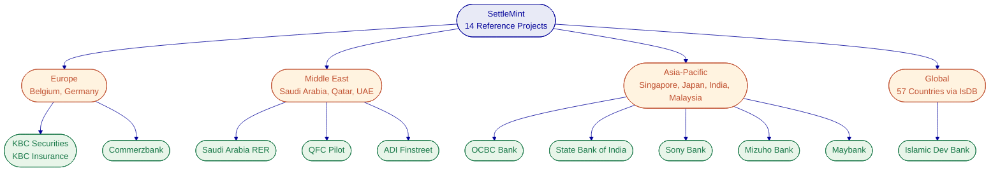

### Expanded Reference: Saudi Arabia RER

The Real Estate General Authority (REGA) of Saudi Arabia set out to build a national-scale blockchain infrastructure for property registration, fractionalization, and a regulated digital marketplace. The initiative sits at the center of Vision 2030's digital transformation agenda, requiring a system where the blockchain ledger functions as the conclusive record of property rights.

The challenge combined technical complexity (integration with national identity via Yakeen, payment rails via Sadad, escrow systems, and the core registry) with institutional complexity (multiple PropTechs, banks, and government agencies operating against a single ledger). No country had attempted real estate tokenization at national scale before this programme.

SettleMint serves as the delivery partner for the complete solution. DALP powers the blockchain and tokenization layer, handling asset contract deployment, compliance enforcement, and lifecycle management for tokenized property. The architecture exposes a unified API Gateway that PropTechs, banks, and developers consume. Marketplace services handle listing, due diligence, identity verification, fee payment, and escrow. Orchestration and integration modules connect DALP to the core registry, billing system, escrow engine, and government systems.

Four PropTechs are live in production processing real transactions as of January 2026. This is the first country in the world to deploy a national-scale property blockchain. Fractional ownership of commercial real estate is operational. Smart contracts automate ownership transfers and tax compliance.

**Transferability to MoJ programme:** The Saudi RER architecture provides a directly transferable blueprint. SAK integration follows the same pattern as the Saudi core registry integration. Property data validation, fractional ownership logic, compliance enforcement, and PropTech/bank participant management all use the same DALP capabilities being proposed for Qatar. The lessons learned from operating at national scale in a Gulf regulatory environment directly reduce implementation risk.

### Expanded Reference: OCBC Bank

OCBC Bank, one of Southeast Asia's largest financial groups, required a security token engine for securitization, tokenization, and fractionalization of off-chain assets targeting high-net-worth individuals. The scope included real estate tokens, bonds, and SPV-based structured products.

SettleMint delivered the platform using DALP's asset lifecycle capabilities, with compliance enforcement through ERC-3643, on-chain identity via OnchainID, and integration with OCBC's existing custody and banking infrastructure. The platform enables fractional ownership of previously illiquid assets, with automated lifecycle management including distributions, corporate actions, and redemption.

**Transferability to MoJ programme:** The OCBC engagement validates DALP's real estate fractionalization capabilities in a regulated banking environment. The integration patterns for custody, identity verification, and core banking connectivity are directly applicable. The platform's ability to serve high-net-worth investors with institutional-grade compliance mirrors the investor protection requirements of the QFC framework.

### Expanded Reference: Qatar Financial Centre Pilot

SettleMint participated in a pilot project with the Qatar Financial Centre, demonstrating DALP's capabilities within Qatar's specific regulatory and institutional context. The pilot validated alignment between the platform's compliance enforcement model and QFC investment token regulations, established working relationships with Qatari regulatory stakeholders, and confirmed the platform's readiness for deployment within Qatar's institutional environment.

**Transferability to MoJ programme:** This reference provides direct evidence of SettleMint's understanding of Qatari regulatory requirements, local institutional dynamics, and the specific compliance frameworks that the MoJ programme must satisfy. The regulatory mapping work from the pilot informs the compliance module configuration proposed for this engagement.

### Reference Fit Matrix

| MoJ Requirement | Saudi RER | OCBC Bank | QFC Pilot |
| --- | --- | --- | --- |
| Real estate tokenization | Direct: national-scale property tokenization | Direct: real estate SPV tokens | Indirect: regulatory framework |
| National registry integration | Direct: Saudi core registry | Not applicable | Not applicable |
| Fractional ownership | Direct: commercial real estate fractions | Direct: off-chain asset fractionalization | Not applicable |
| Regulatory compliance | Direct: Saudi/GCC framework | Direct: MAS framework | Direct: QFC framework |
| Gulf region deployment | Direct: Saudi Arabia | Not applicable | Direct: Qatar |
| Investor protection | Direct: regulated marketplace | Direct: HNWI compliance | Direct: QFC investor rules |

---

## Understanding of Requirements

### Client Context

The Ministry of Justice, as the authority responsible for property rights in Qatar, is undertaking a blockchain-based real estate tokenization programme to modernize property ownership, enable fractional investment, and create a regulated digital marketplace for real estate assets. The programme operates within the Qatar Financial Centre regulatory framework and must integrate with the SAK national land registry as the authoritative source of property records.

The transformation is driven by several objectives: broadening access to real estate investment through fractional ownership tokens; improving transparency and auditability of property transactions; reducing settlement times and intermediary costs; aligning with Qatar's digital transformation agenda; and creating regulatory infrastructure for investment tokens under QFC guidelines.

Target participants include the Ministry of Justice (programme authority and SAK operator), the QFC regulatory authority (regulatory oversight), Malomatia (system integration), licensed banks and financial institutions (distribution and custody), KYC/AML providers (investor verification), property developers and owners (asset originators), and retail and institutional investors (token purchasers).

### Requirement Domains

| Domain | Key Requirements |
| --- | --- |
| Product / Asset Scope | Real estate fractionalization, investment token issuance, secondary transfer, yield distribution |
| Identity / Onboarding | KYC/AML verification aligned with QFC requirements, investor eligibility assessment, Arabic/English |
| Compliance / Control | QFC investment token regulations, token service provider guidelines, transfer restrictions, investor limits |
| Settlement / Cash Leg | DvP settlement for primary issuance, secondary transfer compliance enforcement, yield distribution |
| Integration / Reporting | SAK land registry, banking systems, KYC/AML providers, custodians, regulatory reporting |
| Infrastructure / Operations | On-premises or private cloud, Hyperledger Besu, Arabic/English, HA/DR, 24/7 operations |

### Key Challenges Identified

**SAK Integration Complexity.** The SAK national land registry is the authoritative source of property data. Integration must be bidirectional: DALP reads property records from SAK for token creation, and tokenization events must be reflected in SAK records. This integration must handle data validation, synchronization, and conflict resolution with production-grade reliability.

**Regulatory Compliance Across Multiple Frameworks.** The programme must satisfy QFC investment token regulations, token service provider guidelines, and Qatari Digital Asset Regulations simultaneously. These frameworks define investor eligibility, transfer restrictions, disclosure requirements, and reporting obligations that must be enforced at the protocol level.

**Multi-Stakeholder Governance.** The programme involves multiple institutional participants (Ministry, QFC, banks, custodians, KYC providers, property developers) each with distinct roles, permissions, and audit requirements. The platform must enforce these boundaries technically, not merely through procedural controls.

**Bilingual Operations.** The platform must operate in Arabic and English across all user-facing interfaces, documentation, and compliance communications. This is not a cosmetic requirement; it affects data entry, search, reporting, and regulatory document generation.

**Data Sovereignty.** All platform data, blockchain nodes, and cryptographic keys must reside within Ministry-approved infrastructure in Qatar. This constrains deployment options and requires the platform to deliver full capabilities without dependency on external cloud services.

**Production Readiness at Scale.** The programme must move beyond pilot stage to a production system that the Ministry can rely upon for legally binding property tokenization. This requires high availability, disaster recovery, complete audit trails, and operational maturity.

### Requirement Prioritization

Based on analysis of the programme scope, regulatory context, and operational requirements, the following prioritization reflects the critical path for the implementation:

| Priority | Requirement Domain | Rationale |
| --- | --- | --- |
| Must Have | SAK land registry integration | Core data source; tokenization cannot proceed without authoritative property data |
| Must Have | ERC-3643 compliant token issuance | Regulatory requirement; non-negotiable for QFC compliance |
| Must Have | KYC/AML identity verification | Investor protection requirement; all transfers blocked without verified identity |
| Must Have | QFC compliance module configuration | Regulatory obligation; platform cannot operate without compliant transfer rules |
| Must Have | Arabic/English bilingual interface | Operational requirement; Ministry staff require Arabic language support |
| Must Have | On-premises/private cloud deployment | Data sovereignty requirement; all data must reside in Qatar |
| Must Have | Role-based access control and governance | Institutional requirement; multi-stakeholder programme requires enforced boundaries |
| Should Have | Yield distribution automation | Operational efficiency; can be managed manually initially if needed |
| Should Have | DvP atomic settlement | Reduces settlement risk; can operate with manual settlement coordination initially |
| Should Have | Advanced reporting and analytics | Regulatory reporting; can use basic API queries initially |
| Could Have | Additional property type templates | Value expansion; can be added post-go-live with lower risk |
| Could Have | Secondary marketplace integration | Market development; can be deferred to production operation phase |

### Response Principles

The following principles guide SettleMint's response across all sections of this proposal:

**Control before speed.** Every design decision prioritizes governance and compliance enforcement over transaction throughput. A system that processes transactions quickly but without proper controls is worse than useless in a regulated environment.

**Reuse before fragmentation.** The proposed architecture builds on DALP's production-proven components rather than custom development. This reduces implementation risk and accelerates deployment.

**Phased delivery.** The implementation plan sequences capability delivery to provide early value while managing risk. Core infrastructure and a first asset type are delivered before expanding to additional use cases.

**Evidence-led compliance.** Every compliance rule is enforced at the smart contract level with on-chain audit evidence. Compliance is not a post-facto review process; it is a pre-condition for every transaction.

---

## Proposed Solution and Functional Capabilities

### Solution Overview

The proposed solution deploys DALP on a permissioned Hyperledger Besu network within Ministry-controlled infrastructure, integrated with SAK, KYC/AML providers, banking systems, and custodians through DALP's API layer.

The solution boundary encompasses the DALP platform (Asset Console, Unified API, Execution Engine, SMART Protocol), the blockchain network (Hyperledger Besu with IBFT 2.0/QBFT consensus), and the integration layer connecting to external systems. Infrastructure provisioning is the Ministry's responsibility, with SettleMint providing deployment artefacts, configuration, and support.

Actors in the system include Ministry administrators (platform governance), compliance officers (compliance module management, investor verification oversight), issuers (property developers and owners tokenizing real estate), investors (purchasing and holding fractional ownership tokens), banks (distribution, custody, payment processing), KYC/AML providers (identity verification), and system integrators (Malomatia, integration management).

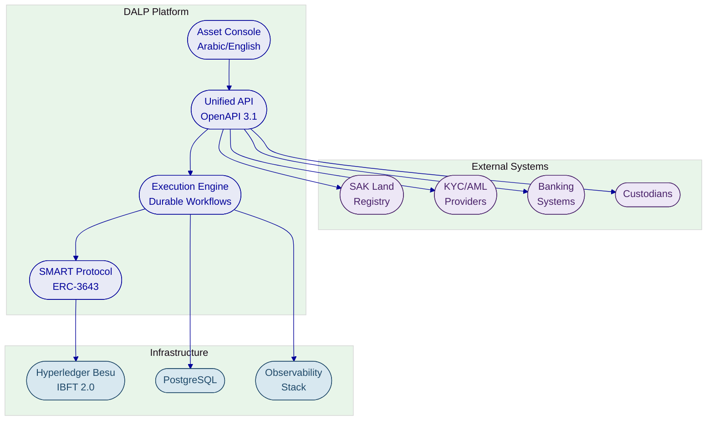

### Issuance and Asset Configuration

DALP's real estate asset type is purpose-built for property tokenization. The Asset Designer wizard guides issuers through configuration: property identification (linked to SAK record), fractional ownership parameters, compliance module selection aligned with QFC requirements, governance structure (role assignments for Ministry, issuer, and compliance teams), and deployment settings.

Each real estate token is deployed through the factory pattern using CREATE2 deterministic addressing, which provides predictable token addresses, atomic deployment (proxy deployment, identity registration, compliance initialization, and role assignment in a single transaction), and enforced initialization order (identity before compliance, compliance before transfers are enabled).

Real estate tokens have burn disabled at the asset level, preserving the integrity of the fractionalization model. The full token supply represents the property; the total supply is preminted to the issuer and then distributed to investors through compliance-checked transfers.

Token features configured for MoJ real estate tokens will include historical balances (for snapshot-based yield distribution), voting power (for fractional owner governance), and fixed treasury yield (for automated rental income distribution). Compliance modules will include identity verification (requiring verified OnchainID for all transfers), country restrictions (jurisdiction-based investor eligibility), investor count limits (regulatory caps on holders), and transfer approval (manual approval workflows for specified transfer types).

### Identity and Eligibility

DALP manages on-chain identity through OnchainID, the ERC-734/735 standard for verifiable claims. Each investor receives an OnchainID contract on the permissioned Besu network, with verifiable claims attesting to their KYC/AML verification status, investor eligibility classification, and jurisdictional information.

The identity workflow for the MoJ programme integrates with Qatar-approved KYC/AML providers. The integration flow is: the external KYC provider verifies the investor off-chain; the verification result is translated into DALP claim topics; a trusted issuer writes signed claims to the investor's OnchainID contract; the Trusted Issuers Registry validates the issuer is authorized for the relevant claim topics; and compliance modules read those claims at every transfer to make eligibility decisions.

Claims have expiry dates. Expired claims are rejected at transfer time, and the system fails closed: if a claim cannot be verified, the transfer is blocked. This ensures that investor eligibility is continuously enforced, not just verified at onboarding.

Once verified, an investor's identity is reusable across all tokens in the system that accept their claims. There is no per-token re-verification, reducing operational friction while maintaining compliance rigour.

### Compliance Enforcement

Compliance is the architectural centerpiece of the proposed solution. DALP enforces compliance at the smart contract level using ERC-3643's modular compliance engine. Every transfer, mint, burn, and settlement operation passes through the compliance engine before execution.

The compliance module configuration for the MoJ programme will be tailored to QFC investment token regulations:

| QFC Requirement | DALP Compliance Module | Enforcement Mechanism |
| --- | --- | --- |
| Investor eligibility | Identity Verification | OnchainID claims with trusted issuer attestation |
| Jurisdictional restrictions | Country Allow/Block List | Per-token country-based transfer rules |
| Investor count limits | Investor Count Limit | Per-country tracking with cross-token counting |
| Minimum holding periods | Time Lock | FIFO batch tracking with holding period enforcement |
| Transfer approval | Transfer Approval | Manual approval with configurable expiry |
| Supply limits | Supply Cap | Lifetime and period caps on token minting |
| Qualified investor verification | Identity Verification (expression) | RPN-based logical expressions for complex eligibility rules |

Modules evaluate in sequence. A single module veto blocks the transfer. This is a fail-closed design: the default is denial unless all modules explicitly approve. Compliance modules can be added, removed, or reconfigured at runtime without redeploying the token contract, enabling the Ministry to respond to regulatory changes without system downtime.

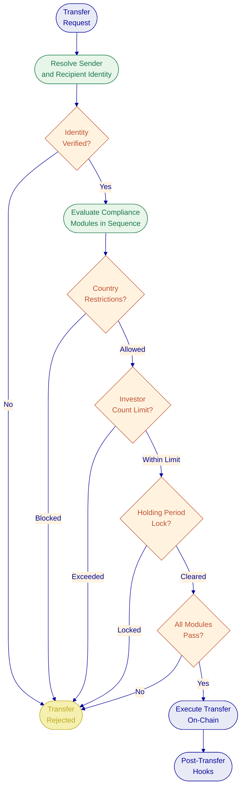

### Transfer, Settlement, and Cash-Leg Coordination

Every token transfer follows a deterministic compliance path. The Identity Registry resolves both sender and recipient wallets to their OnchainID contracts. All configured compliance modules evaluate in sequence. Token features run their pre-check hooks. If all checks pass, the ERC-20 balance update executes atomically. Post-transfer hooks handle fee collection, balance checkpoints, voting power transfers, and FIFO batch recording.

For primary issuance, DALP supports batch minting to multiple investor wallets in a single API call with up to 100 recipients per request. If any recipient fails compliance checks, the entire batch is rejected.

For settlement, DALP's XvP system provides atomic DvP where the real estate token and payment token transfer simultaneously or both revert. Local settlements (when both tokens are on the same chain) execute atomically in a single transaction. The settlement lifecycle tracks through deterministic states: pending, approved, executed, cancelled, or expired.

The XvP settlement system provides the infrastructure for structured primary and secondary market operations. For primary issuance, a property developer sells fractional tokens to investors through a DvP settlement where real estate tokens and payment tokens transfer atomically. Neither party bears counterparty risk because the exchange either completes in full or reverts entirely. For secondary transfers between investors, the same atomic settlement mechanism applies, ensuring that every change of fractional ownership settles with finality.

The settlement lifecycle tracks through deterministic states: pending (created but not yet approved by all parties), approved (all parties have confirmed), executed (atomic transfer completed), cancelled (voluntarily terminated by a party), or expired (time limit reached without execution). Each state transition is recorded on-chain for audit purposes. The settlement contract enforces that only open settlements can transition, and all transitions are irreversible.

For more complex scenarios involving multiple parties (for example, a property sale involving the seller, buyer, Ministry escrow, and a fee recipient), the XvP system supports multi-party settlements where three or more counterparties exchange assets atomically. If any leg fails (due to insufficient balance, compliance block, or party withdrawal), the entire settlement reverts.

Forced transfers are available for the Custodian role to handle court-ordered asset seizures, estate transfers, regulatory enforcement, and wallet recovery. Forced transfers bypass compliance checks by design but remain fully logged on-chain for auditability.

### Reporting and Analytics

DALP provides multiple reporting and analytics pathways to support the Ministry's regulatory reporting obligations and operational visibility requirements.

**PostgreSQL Analytics Views.** Eighteen analytics views across five domains provide direct database access for BI tools (Looker, Tableau, Power BI, or the Ministry's existing reporting infrastructure). Views cover identity statistics (identity counts, key statistics), compliance metrics (claims statistics, trusted issuer statistics, compliance module statistics), addon activity (vault activity, airdrop statistics, settlement statistics, yield schedule statistics), cross-cutting metrics (transaction counts, daily/hourly transaction history, daily/hourly asset activity, asset lifecycle tracking, country-level asset counts), and action tracking.

Views support both type-safe queries through the application layer and raw SQL access for direct BI tool integration. This enables standard ETL pipelines without requiring all reporting to flow through the DALP API.

**Real-Time Event Streaming.** Server-Sent Events (SSE) provide real-time operational monitoring data including API metrics (request rates, latency, error rates), blockchain health status changes (with three-sample hysteresis to prevent alert flapping), and transaction lifecycle state changes. This enables real-time dashboards without polling.

**API-Based Reporting.** The Unified API exposes transaction history, compliance events, investor registry data, and settlement records through paginated, filterable endpoints. The API supports both individual record retrieval and bulk export for regulatory reporting.

**Blockchain Explorer.** Blockscout provides a blockchain explorer for direct transaction visibility on the Besu network. Operators can inspect individual transactions, view contract state, and trace execution paths. This is particularly valuable for compliance officers investigating specific transactions or auditors verifying the on-chain audit trail.

**Audit Trail Completeness.** Every platform action generates an auditable record. On-chain events (transfers, compliance checks, role changes, settlements) are inherently tamper-evident. Off-chain events (authentication, authorization, configuration changes, API access) are logged with timestamps, actor identity, and outcomes. The Chain Indexer processes on-chain events into the analytics views within five seconds of the event occurring on the blockchain.

For the MoJ programme, the reporting infrastructure will be configured to support QFC regulatory reporting requirements, with specific views and exports tailored to the Ministry's reporting cadence and format requirements. Integration with the Ministry's existing reporting systems will be designed during the Discovery phase.

### Lifecycle Servicing and Corporate Actions

Once real estate tokens are issued and distributed, DALP manages ongoing servicing operations.

**Yield Distribution.** Rental income and property dividends are distributed through DALP's yield mechanisms. The Fixed Treasury Yield feature provides a pull-based system where holders claim accrued yield at configured intervals. The Yield Schedule addon automates distribution with snapshot-based balance capture, flexible schedules, pro-rata calculation, and the option to distribute in the same token or a different payment token.

**Freeze and Unfreeze.** The Custodian role can freeze individual investor wallets (full or partial freeze) for suspicious activity investigation, regulatory holds, dispute resolution, or sanctions enforcement.

**Pause and Unpause.** The Emergency role provides a circuit breaker that halts all operations on a token. This is reserved for security incidents, smart contract vulnerability discovery, regulatory emergency orders, or market disruption events.

**Asset Recovery.** The Emergency role can recover stuck tokens from the asset contract. The Custodian role handles broader wallet recovery through forced transfers.

**Role Management.** Five operational roles (admin, custodian, emergency, governance, supply management) enforce separation of duties at the smart contract level. Role changes support single and batch operations, with role grants and revocations executing atomically on-chain.

### Investor Onboarding Workflow

The investor onboarding process for the MoJ programme follows a structured workflow that ensures regulatory compliance before any investor can receive real estate tokens:

**Step 1: Investor Registration.** An investor submits their information through the platform interface or a banking partner's system. The investor's wallet address and country of residence are captured.

**Step 2: Identity Registration.** DALP creates an OnchainID identity contract for the investor on the Besu network. The identity is registered in the system's Identity Registry with a status of "Pending Registration." At this stage, the investor has an on-chain identity but cannot receive tokens.

**Step 3: KYC/AML Verification.** The investor's identity information is submitted to a Qatar-approved KYC/AML provider for verification. This happens off-chain through the provider's standard verification process. The KYC profile in DALP progresses through states: draft, under review, approved (or rejected with mandatory reason).

**Step 4: Claim Issuance.** Upon successful verification, a trusted issuer writes signed claims to the investor's OnchainID contract. Claims attest to the investor's KYC verification status, investor classification (qualified, retail, institutional), and any additional regulatory attestations required by QFC rules. Claims include expiry dates, ensuring that verification currency is maintained.

**Step 5: Registry Activation.** With valid claims in place, the investor's identity status progresses to "Verified." The investor can now receive tokens subject to the compliance rules configured on each specific token.

**Step 6: Ongoing Compliance.** Claims are checked at every transfer. Expired claims block transfers automatically. The system fails closed: if a claim cannot be verified at transfer time, the transfer is rejected. Claim renewal follows the same KYC/AML verification and issuance process.

This workflow ensures that investor eligibility is not just verified at onboarding but continuously enforced throughout the investor's participation in the programme.

### Token Sale and Primary Distribution

For primary distribution of real estate tokens, DALP provides a configurable token sale mechanism. The token sale contract supports an optional presale followed by a public sale, multi-currency payment acceptance (ERC-20 payment tokens), per-investor purchase limits (minimum and maximum), optional vesting schedules with linear vesting, soft and hard cap mechanics with refund safety, and a full API and UI with a five-tab operational console.

The token sale mechanism is particularly relevant for the MoJ programme because it provides a structured, compliant distribution channel for fractional real estate tokens. Investors purchase tokens through the sale contract, and compliance checks are enforced at purchase time. If the sale does not reach its soft cap, investors can claim refunds through a per-currency pull pattern that protects against blocked refunds from individual payment currencies.

Alternative distribution mechanisms include airdrop distribution (three variants: push airdrop, time-bound self-claim, and vesting airdrop) and direct minting to investor wallets through the API for institutional placements.

### Multi-Signature Treasury Operations

For property-related fund management, DALP provides a Vault addon that implements multi-signature treasury operations. The vault supports deterministic deployment (CREATE2 for predictable addresses), contract identity binding through OnchainID, configurable signer weights and approval thresholds, and full lifecycle tracking (creation, balance changes, approval tracking, execution monitoring).

The vault is relevant for the MoJ programme in scenarios where multiple parties (Ministry, property issuer, custodian) must jointly approve fund movements, such as rental income disbursement or property-related expenses. The multi-signature requirement enforces governance without requiring trust in any single party.

### Integration and Interoperability

The integration architecture for the MoJ programme connects DALP to five external system categories through the platform's API layer.

**SAK Land Registry.** Bidirectional integration with the national land registry. Property data is read from SAK during token configuration and issuance. Tokenization events are written back to SAK to maintain registry synchronization. The integration follows the same architectural pattern proven in the Saudi Arabia RER programme. SettleMint and Malomatia will jointly design the specific API contracts and data mapping during the Discovery phase.

**KYC/AML Providers.** Integration with Qatar-approved identity verification providers. DALP provides the on-chain identity infrastructure (OnchainID) that verification results flow into. The KYC provider performs verification off-chain; results are translated into on-chain claims through DALP's trusted issuer system.

**Banking Systems.** Integration with licensed banks for investor account management, payment processing, and custody services. DALP's API supports ISO 20022 message formats for connectivity with payment networks. Banks interact with DALP through the Unified API using organization-scoped API keys.

**Custodians.** Integration with custody providers for institutional-grade key management. DALP supports DFNS (fully programmatic approval) and Fireblocks (MPC-CMP with continuous key refresh) through its provider-abstracted signer service. The Ministry selects its preferred custody provider; DALP provides the integration layer.

**Regulatory Reporting.** DALP's 18 PostgreSQL analytics views and event streaming capabilities enable automated regulatory reporting. Transaction history, compliance events, investor registry data, and settlement records are accessible through standard SQL queries or the API, supporting integration with the Ministry's reporting infrastructure.

| Integration Method | Use Case | Authentication |
| --- | --- | --- |
| REST API (OpenAPI 3.1) | SAK integration, banking system connectivity, regulatory reporting | API keys (organization-scoped) |
| TypeScript SDK | Custom application development, scripted operations | API keys |
| CLI (301 commands) | Automated operations, CI/CD pipeline integration, batch processing | Device-code flow |
| Webhooks | Event-driven notifications for transaction confirmations and compliance events | Configured per endpoint |
| SSE Streaming | Real-time operational monitoring and dashboard integration | Session-based |
| PostgreSQL Views | Direct BI tool access for reporting and analytics | Database credentials |

### Functional Fit Matrix

| Functional Requirement | DALP Capability | Response Status |
| --- | --- | --- |
| Real estate tokenization | Real Estate asset type with fractional ownership | Full |
| ERC-3643 compliant tokens | SMART Protocol, native ERC-3643 implementation | Full |
| SAK land registry integration | Unified API with configurable integration endpoints | Configurable |
| KYC/AML integration | OnchainID with trusted issuer system and claim management | Full |
| Investor eligibility enforcement | Modular compliance engine with 18 module types | Full |
| Fractional ownership | Pre-built real estate template with configurable fractionalization | Full |
| Yield distribution | Fixed Treasury Yield and Yield Schedule addon | Full |
| DvP settlement | XvP settlement system with atomic execution | Full |
| Arabic/English interface | i18n with ar-SA locale including RTL layout support | Full |
| Permissioned blockchain | Hyperledger Besu with IBFT 2.0/QBFT | Full |
| On-premises deployment | Helm/Kubernetes with air-gap capability | Full |
| Role-based access control | 26 roles across 4 layers with on-chain enforcement | Full |
| Audit trail | Immutable on-chain events with indexed analytics views | Full |
| Freeze/unfreeze operations | Full and partial freeze at custodian role level | Full |
| Emergency pause | Circuit-breaker with Emergency role | Full |
| Forced transfers | Court-ordered transfers with full audit trail | Full |
| Regulatory reporting | 18 PostgreSQL analytics views with API and SQL access | Full |
| Multi-stakeholder governance | Separation of duties across 5 per-asset roles | Full |
| Transfer approval workflows | Transfer Approval compliance module with configurable expiry | Full |

---

## Technical Architecture

### Architectural Principles

DALP's architecture follows five foundational principles, each directly relevant to the MoJ programme:

**Lifecycle-first design.** Every architectural component serves the full digital asset lifecycle from issuance through servicing to retirement. The architecture accounts for ongoing operations like compliance monitoring, corporate actions, holder management, and asset maturity from the start, not as afterthoughts bolted onto a token creation tool.

**Durable execution.** All stateful operations run through a durable execution engine that guarantees workflow completion even through infrastructure failures, process restarts, and network partitions. This is the core execution model, not an optional reliability layer. For the Ministry, this means that a token deployment or settlement operation will complete correctly even if the server restarts mid-execution.

**Defense-in-depth.** Security is enforced at every layer independently: authentication, authorization, wallet verification, on-chain compliance, and custody provider policy. Five independent security layers must all pass for a transaction to reach the blockchain. No single control failure grants unauthorized access.

**Separation of concerns.** API routing, business logic, blockchain interaction, data indexing, and observability are cleanly separated into independently deployable and scalable components. This enables the Ministry's infrastructure team to scale, update, and monitor components independently based on operational demands.

**Provider abstraction.** Infrastructure dependencies (custody, secrets, object storage, database) are accessed through provider-abstracted interfaces. This prevents vendor lock-in and enables deployment across different environments without application changes.

### Layered Architecture

DALP is structured as a four-layer stack:

**Smart Contract Layer (On-Chain).** Built on the SMART Protocol (ERC-3643), this layer enforces compliance, identity, and asset logic directly on the Hyperledger Besu network. The five-layer on-chain architecture (SMART Protocol, Global, System, Assets, Addons) provides clear separation between shared infrastructure and asset-specific logic. DALPAsset contracts use the SMARTConfigurable extension, allowing features and compliance modules to be attached and reconfigured at runtime. UUPS proxy upgrades enable contract logic updates without changing addresses or disrupting on-chain state. CREATE2 deterministic deployment provides predictable contract addresses and atomic factory deployment.

**Middleware Layer (Execution Engine).** This layer handles the operational complexity of blockchain interaction. The Execution Engine provides reliable workflow orchestration with persistent state and exactly-once semantics. The Key Guardian manages cryptographic key storage with HSM and cloud KMS integration. The Transaction Signer handles transaction preparation, gas estimation, nonce management, and signing. The Chain Indexer processes blockchain events and constructs queryable domain models. The Chain Gateway provides multi-node RPC load balancing with failover.

**API Layer (Unified API).** The Unified API exposes all platform capabilities through type-safe, documented interfaces with OpenAPI 3.1 specifications. The API supports session-based authentication, API keys, and enterprise SSO. Blockchain-writing operations require wallet verification through PIN, TOTP, or backup codes. Meta-transaction support through ERC-2771 enables gasless workflows for investors.

**Application Layer (Asset Console).** The Asset Console provides the operational interface for asset lifecycle management, compliance workflows, portfolio views, system monitoring, and the Asset Designer wizard. The console supports Arabic (ar-SA) with full right-to-left layout and uses arbitrary-precision arithmetic for financial calculations.

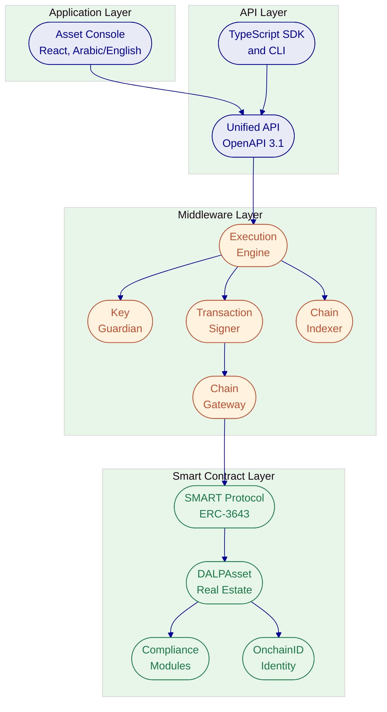

### Data Architecture

DALP manages four distinct data categories, each with specific storage and access patterns:

**Chain State.** The authoritative source of truth for token balances, compliance configurations, identity claims, and role assignments. Stored on the Hyperledger Besu blockchain. Immutable and auditable. Every state change produces an event that the indexer processes.

**Application State.** User sessions, API keys, KYC profiles, system configuration, and operational metadata. Stored in PostgreSQL with application-level encryption. Tenant isolation enforced at the database query level.

**Indexed/Analytical State.** Domain models constructed from blockchain events for application queries. The Chain Indexer transforms event logs into asset balances, investor portfolios, transaction history, compliance status, and distribution records, all queryable with millisecond-latency responses. Eighteen PostgreSQL analytics views across five domains provide direct access for BI tools.

**Audit Evidence.** Authentication events, authorization decisions, data access records, configuration changes, administrative actions, and wallet verification attempts. Retained according to regulatory requirements (typically seven years for financial services). The on-chain audit trail is inherently tamper-evident; the off-chain audit trail uses tamper-evident storage.

### API Layer Detail

The Unified API exposes all DALP platform capabilities through a type-safe, documented interface. The API is organized by domain namespace, providing clear separation of concerns for integration engineers.

| Namespace | Purpose | Key Operations |
| --- | --- | --- |
| token | Asset lifecycle operations | Create, mint, burn, transfer, freeze, pause, configure |
| system | Platform administration | Role management, identity registration, trusted issuer configuration |
| user | User management | Profile, stats, growth metrics |
| account | Wallet operations | Identity lookup, claim verification |
| transaction | Transaction tracking | Read, status, lifecycle history |
| addons | Settlement and yield | XvP settlement, fixed yield, token sale, vault, airdrop |
| contacts | Investor management | Address book, investor relationships |
| exchangeRates | Currency management | Rate sync, conversion, history |
| search | Global search | Cross-entity search across tokens, contacts, transactions |
| settings | Platform configuration | System settings, asset class definitions |
| monitoring | Operational health | API health, blockchain health, logs, streaming |

The API supports three execution modes for blockchain-writing operations, negotiated through RFC 7240 Prefer headers: synchronous (blocks until on-chain confirmation), asynchronous (returns HTTP 202 with status URL for polling), and hybrid (server decides based on expected execution time). Transaction speed can be further controlled via X-Transaction-Speed headers.

Every API mutation is idempotent (enforced via Idempotency-Key headers), durable (survives process restarts through the Execution Engine), and auditable (full state-transition history maintained). Transaction status can be tracked through the 11-state lifecycle: created, queued, submitted, broadcasting, pending, confirming, confirmed, failed, cancelled, expired, or replaced.

The API includes a structured error system with 534 auto-generated error codes from smart contract ABIs, each with severity levels, audience targeting, retryability flags, and translations across four locales (en-US, de-DE, ar-SA, ja-JP). Blockchain revert reasons surface as structured errors rather than opaque revert data, enabling integration engineers to build precise error handling.

For the MoJ programme, the Arabic error translations ensure that Arabic-language operators receive localized error messages when investigating transaction failures or compliance blocks.

**Meta-Transaction Support.** Through ERC-2771 integration, investors can submit signed transaction payloads without holding native tokens for gas. A configured relayer sponsors transaction costs, enabling gasless workflows. This is particularly valuable for the MoJ programme where retail investors should not need to manage Besu network gas tokens to participate in fractional real estate ownership.

**TypeScript SDK.** DALP ships a public TypeScript SDK (@settlemint/dalp-sdk) as the recommended integration surface for programmatic consumers. The SDK provides a typed client factory with automatic serialization of blockchain value types (arbitrary-precision decimals, BigInt, Date), support for all API namespaces, and request/response validation plugins. While TypeScript is the first-party SDK, the OpenAPI specification enables SDK generation in Python, Go, C#, Java, or any language with OpenAPI tooling.

**CLI.** The DALP CLI provides 301 typed commands across 26 command groups, covering all platform operations. The CLI supports scripting and automation for batch operations, CI/CD pipeline integration, and operational tasks. For the MoJ programme, the CLI enables Malomatia to script common operations (batch investor registration, compliance module updates, bulk reporting) without building custom integration code.

### Network and Chain Topology

The MoJ programme will deploy on a permissioned Hyperledger Besu network with IBFT 2.0 or QBFT consensus. This selection is driven by the Ministry's requirements for data sovereignty (all data within Qatar), transaction privacy (restricted visibility to network participants), operational control (full control over consensus, gas, block time, and participants), and regulatory posture (no shared public infrastructure).

The recommended production topology includes four validator nodes and two RPC nodes, distributed across Ministry data centers for resilience. The IBFT 2.0/QBFT consensus algorithm provides Byzantine fault tolerance, meaning the network can continue operating correctly even if one of the four validators fails or behaves maliciously. With four validators, the network tolerates one faulty node while maintaining consensus.

**Consensus Configuration.** IBFT 2.0 uses a round-robin leader selection where validators take turns proposing blocks. The block period is configurable (typically two to five seconds for production networks). Gas limits are configurable or can be set to zero for a zero-cost transaction model. Request timeout, minimum number of nodes, and message queue parameters are tunable based on the Ministry's performance requirements.

**Network Permissioning.** Besu supports node-level and account-level permissioning. Node permissioning controls which nodes can join the network through an allowlist of enode URLs or an on-chain permissioning contract. Account permissioning controls which accounts can send transactions, providing an additional security layer beyond DALP's application-level access controls. For the MoJ programme, permissioning will be configured to restrict network participation to Ministry-approved nodes and accounts.

**Privacy Groups.** While not required for the initial MoJ deployment, Besu supports privacy groups that enable confidential transactions visible only to designated participants. This capability could be relevant for future programme expansion where different property pools or investor groups require transaction privacy from each other while sharing the same blockchain network. DALP contracts are pre-deployed at genesis on the SettleMint-managed network, allowing implementation to begin directly at platform configuration rather than requiring a contract deployment phase.

Network configuration is environment-variable driven. Parameters include block confirmation count (1 for the private network), gas price strategy (configurable or zero-gas), and chain ID for identity registry separation. No application code changes are required for network configuration.

### Multi-Tenancy and Environment Segregation

DALP supports configurable multi-tenancy through organization isolation. For the MoJ programme, this enables separation between the Ministry's administrative operations, individual property issuers, banking participants, and other institutional actors.

Tenant isolation is enforced at the database query level on every API request. Cross-tenant operations are not possible. Each tenant has isolated membership, roles, assets, compliance records, and audit trails.

Three environments are provisioned (development, staging, production), each running the full DALP stack independently with environment-specific configuration through Helm value files.

### Operational Architecture

**Execution Reliability.** All critical operations run as durable, deterministic workflows. Workflow phases are explicitly state-tracked with persisted status, enabling recovery from any interruption point. Configurable retry handling with exponential backoff (fast, standard, and long-running presets) ensures operations complete even through transient failures.

**Transaction Lifecycle.** Every transaction follows an 11-state lifecycle: created, queued, submitted, broadcasting, pending, confirming, confirmed (success), failed, cancelled, expired, or replaced. Full state-transition history is maintained for audit purposes.

**Nonce Management.** A durable nonce coordination service serializes nonce allocation per wallet and chain ID, with self-healing behavior for nonce conflicts. Operator repair surfaces enable manual intervention if needed.

**Indexer Behavior.** The Chain Indexer processes events across eight domains (token, identity, compliance, addons, feeds, and more) with event freshness under five seconds from blockchain event to view availability. Zero-downtime reindexing enables schema upgrades without service interruption.

### Transaction Processing Architecture

DALP treats transaction management as a first-class runtime capability with dedicated services designed for the reliability requirements of regulated financial operations.

**Nonce Coordination.** A durable virtual-object service serializes nonce allocation per address and chain ID. It performs atomic consume-and-broadcast for local signer flows and includes self-healing behavior for nonce conflicts. When a "nonce too low" error occurs, the service re-reads on-chain state, advances to the maximum of the current nonce plus one or the on-chain nonce, and retries up to three times before surfacing a terminal error. Operator repair surfaces are explicit: synchronize with on-chain state, reset, force-set, and retrieve full history. For the MoJ programme operating on a permissioned Besu network, nonce management is simpler than on public networks, but the same resilience guarantees apply.

**External Signer Abstraction.** A provider-agnostic service normalizes wallet creation, signing, and approvals across local, DFNS, and Fireblocks custody backends. Provider health is a first-class concern with dedicated health-check APIs. Runtime capability detection determines whether to use local or provider-delegated execution paths dynamically. The Ministry can switch custody providers by changing configuration without modifying workflows or code.

**Transaction Processor.** A partition-locked virtual-object service keyed by wallet address and chain ID provides exclusive locking during submission and broadcast. It handles contract validation, attribution tracking (ERC-8021), provider-native versus local broadcast branching, confirmation polling, reconciliation, and cancellation via replacement-by-fee. For every transaction, the processor maintains a complete state-transition history, enabling operators to track progress, identify bottlenecks, and audit the full lifecycle from creation through confirmation.

**Gas Management.** Gas estimation queries the target chain with actual transaction parameters. For the permissioned Besu network, gas costs can be configured to zero, simplifying operations for investors who would otherwise need to manage native tokens. Configurable strategies support fast (priority fee for quick inclusion), standard (base fee plus moderate priority), and economy (minimum viable fee) modes. The meta-transaction support through ERC-2771 enables gasless workflows where a configured relayer sponsors transaction costs, enabling investors to interact with tokens without managing cryptocurrency for fees.

### Data Flow Architecture

The data flow for a real estate token transfer in the MoJ programme follows a deterministic path through multiple system layers:

1. An investor initiates a transfer through the Asset Console or a banking partner's system calls the API
2. The API layer authenticates the request (session or API key), resolves organization context, and synchronizes on-chain roles
3. Wallet verification (PIN, TOTP, or passkey) confirms the caller controls the signing wallet
4. The transaction enters the durable workflow queue with the appropriate execution mode (sync or async)
5. The Execution Engine prepares the transaction: resolving contract addresses, encoding parameters, estimating gas
6. The Key Guardian retrieves the appropriate signing key from the configured storage tier
7. The Transaction Signer signs the transaction with managed nonce allocation
8. The Chain Gateway routes the signed transaction to the Besu network through the optimal RPC endpoint
9. The SMART Protocol's compliance engine evaluates all configured modules on-chain (identity verification, country restrictions, investor limits, holding period)
10. If all checks pass, the ERC-20 balance update executes atomically; if any check fails, the transaction reverts with a specific error code
11. The Chain Indexer processes the resulting events and updates domain models within five seconds
12. The Asset Console reflects the updated state, and any configured webhooks fire to notify integrated systems

This flow is identical for every transfer, whether initiated by an investor, a batch operation, or a forced transfer. The only difference is which compliance checks are evaluated: forced transfers bypass the compliance engine but are restricted to the Custodian role and fully logged.

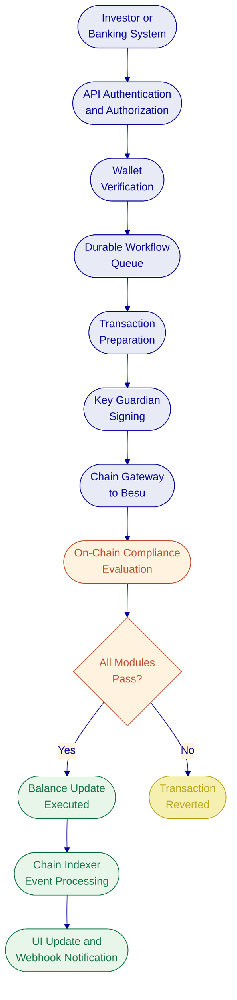

### SAK Integration Architecture

The integration between DALP and the SAK national land registry follows the same architectural pattern proven in the Saudi Arabia RER programme. SAK serves as the authoritative source of property data; DALP serves as the tokenization and lifecycle management layer. The integration is bidirectional:

**SAK to DALP (Property Data Ingestion).** When a property is selected for tokenization, DALP reads the property record from SAK through the integration API. This record includes the property identification number, legal description, ownership details, encumbrances, and geographic data. DALP validates the property data against its asset configuration schema and uses it to populate the real estate token's metadata. The property record from SAK is stored as verifiable claims on the token's OnchainID contract, creating an on-chain attestation of the property's attributes that the compliance engine can reference.

**DALP to SAK (Tokenization Events).** When a property is tokenized, a fractional ownership transfer occurs, or a corporate action executes (such as a forced transfer or freeze), DALP notifies SAK through the integration API. This ensures the national registry reflects the current tokenized ownership state. The notification includes transaction identifiers, timestamps, and relevant event data, enabling SAK to maintain its own audit trail.

**Synchronization and Conflict Resolution.** The integration layer includes validation logic to detect inconsistencies between SAK records and DALP state. If a property record changes in SAK after tokenization (for example, a legal encumbrance is recorded), the integration layer surfaces the change to the platform administrators and can trigger an automatic pause of the affected token until the discrepancy is resolved. This fail-safe approach ensures that legal reality in SAK and tokenized state in DALP remain aligned.

The specific API contracts, data mappings, authentication mechanisms, and error handling patterns for the SAK integration will be designed jointly by SettleMint and Malomatia during the Discovery phase, building on the architectural patterns from the Saudi RER implementation.

### Token Issuance Flow

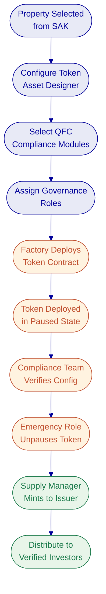

### Real Estate Token Lifecycle in Detail

The lifecycle of a tokenized real estate asset in the MoJ programme follows a structured path from property selection through eventual retirement:

**Property Selection and Validation.** A property is selected for tokenization. SAK data is retrieved and validated. Legal prerequisites (ownership confirmation, regulatory approval, compliance clearance) are verified outside the platform. The property is registered in DALP as a candidate asset.

**Token Configuration.** Using the Asset Designer, the issuer configures the real estate token: property identification linked to SAK, fractional ownership parameters (total supply representing 100% of the property, token decimal precision), QFC compliance modules (identity verification, country restrictions, investor limits), governance structure (role assignments for Ministry administrators, the issuer, compliance officers, and custodians), and deployment settings for the Besu network.

**Token Deployment.** The factory deploys the token through a durable workflow: proxy contract deployment, OnchainID identity binding, compliance engine initialization with QFC modules, class-aware claim issuance (property classification, location, pricing, SAK identifier), feature configuration (historical balances, voting power, yield distribution), and role assignment. The token deploys in a paused state.

**Pre-Issuance Verification.** The compliance team verifies the complete configuration against QFC requirements. SAK integration confirms property data alignment. Role assignments are validated. The Emergency role holder unpauses the token.

**Primary Issuance.** The Supply Management role mints the full token supply to the issuer's wallet. The issuer distributes tokens to investors through compliance-checked transfers or through a token sale contract. Each investor must have a verified OnchainID with valid KYC/AML claims from a trusted issuer before they can receive tokens.

**Secondary Transfers.** Investor-to-investor transfers pass through the full compliance pipeline. Every transfer checks identity verification, country eligibility, investor count limits, and any holding period restrictions. The compliance engine evaluates all modules in sequence; a single module veto blocks the transfer.

**Yield Distribution.** Rental income is distributed through the yield schedule mechanism. A snapshot captures holder balances at the distribution date. The yield is calculated pro-rata based on each holder's balance at the snapshot. Holders claim their yield through the platform interface or API. The distribution can be in the same real estate token or in a separate payment token.

**Servicing Events.** Throughout the token's life, the platform handles freeze operations (for regulatory holds or dispute investigation), compliance module updates (for regulatory changes), investor eligibility updates (for expired KYC claims requiring renewal), and forced transfers (for court-ordered seizures or estate transfers).

**Property Exit or Retirement.** When the underlying property is sold or the tokenization structure is unwound, the issuer coordinates the redemption process. Since real estate tokens have burn disabled, the exit process involves transferring all tokens back to the issuer (or a designated redemption wallet) with corresponding cash distribution to holders, then pausing the token permanently. The SAK registry is notified of the de-tokenization event.

---

## Security

### Security Model Overview

DALP treats security as a structural property of the platform. The architecture enforces defense-in-depth across five independent control layers: identity verification, role-based access control, transaction-level wallet verification, on-chain compliance enforcement, and custody provider policy evaluation. No single-layer failure grants unauthorized access to digital assets.

Three trust boundaries define the security perimeter. The platform boundary (between external users and DALP's API surface) is controlled by authentication, session management, and rate limiting. The execution boundary (between the API layer and the Execution Engine) is controlled by authorization, input validation, and wallet verification. The chain boundary (between the Execution Engine and the blockchain) is controlled by on-chain compliance, custody provider policies, and MPC signing.

Each boundary operates independently. A compromised session token is blocked by wallet verification. A bypassed API authorization check is blocked by on-chain compliance. Custody provider policies provide the final gate before any transaction reaches the blockchain.

SettleMint holds ISO 27001 and SOC 2 Type II certifications, confirming that security controls are not just designed but independently audited and continuously maintained.

### Authentication and Access Control

DALP supports multiple authentication methods appropriate to different operational contexts: email and password for standard access, passkeys (WebAuthn) for phishing-resistant hardware security key authentication, LDAP/Active Directory for corporate directory integration, OAuth 2.0/OIDC for SSO with Okta, Auth0, or Azure AD, and SAML 2.0 for legacy enterprise SSO.

For the MoJ programme, authentication will be configured to integrate with the Ministry's enterprise identity infrastructure, providing single sign-on for Ministry staff and a separate authentication path for external participants (investors, banks, property issuers).

Session management uses HTTP-only, Secure, SameSite cookies with 7-day expiry and 24-hour refresh windows. API keys use a hashed storage model where cleartext is shown once at creation and never stored. Rate limiting enforces 10,000 requests per 60-second window per key.

Beyond session authentication, DALP enforces wallet verification (step-up authentication) for all blockchain write operations. Even with a valid session, no on-chain transaction executes without the user proving wallet control through PIN, TOTP, backup codes, or passkey challenge-response. There is no administrative override for wallet verification.

Authorization operates through a dual-layer permission model. Off-chain platform roles (owner, admin, member) control API and console access. On-chain roles (26 roles across four layers) govern blockchain operations. The on-chain AccessManager contract is the authoritative source for all role assignments. Both layers must pass for any blockchain write operation.

### Key Management and Custody Integration

The Key Guardian service manages cryptographic key material through defense-in-depth with four storage tiers: encrypted database (development), cloud secret manager (standard production), hardware security module (FIPS 140-2 Level 3, for regulated environments), and third-party MPC custody through DFNS or Fireblocks (highest security).

For the MoJ programme, SettleMint recommends HSM-backed key management for Ministry operational keys and MPC custody integration for institutional participant keys. The specific custody provider will be selected during the Discovery phase based on the Ministry's existing custody relationships and security requirements.

Key lifecycle management covers generation (HSM-backed keys generate entirely within hardware), rotation (active signing keys replaced while maintaining historical keys for verification), recovery (sharded backups with threshold signature schemes requiring multiple custodians), and revocation (compromised keys immediately removed with on-chain permission updates).

The unified signer abstraction enables the Ministry to switch between custody providers through configuration changes alone, without workflow or code modifications.

**DFNS Integration Detail.** DFNS provides delegated MPC custody where key shards distribute across DFNS infrastructure. Configuration requires an API URL, organization ID, authentication token, credential ID, and elliptic curve private key. The DFNS policy engine evaluates transaction rules before MPC signing proceeds: auto-sign rules for routine operations, amount thresholds requiring approval, IP and time restrictions, and multi-party approval requirements. When a policy requires approval, DALP surfaces the pending approval through its interface, enabling operators to review, approve, or reject without leaving the DALP environment. Audit logs synchronize between DFNS and DALP for unified compliance reporting.

**Fireblocks Integration Detail.** Fireblocks provides institutional MPC-CMP custody with continuous key refresh, eliminating static key shares. Configuration requires an API key, RSA private key, and API endpoint. Fireblocks organizes keys into vault accounts, each containing asset wallets. The Transaction Authorization Policy (TAP) enforces amount thresholds, whitelisted destinations, velocity limits, and multi-approver requirements. DALP supports vault account creation, asset wallet activation, and vault queries across the organization.

**Two-Layer Policy Model.** Every transaction passes through two independent policy layers. Layer 1 (on-chain, DALP compliance modules) enforces identity/KYC claims, country restrictions, supply and issuance caps, holding period locks, and investor count caps, executed by the EVM and immutably auditable in the transaction trace. Layer 2 (custodian policies, DFNS or Fireblocks) enforces transaction amount thresholds, multi-party approval workflows, rolling spend limits, and destination allowlists. Layer 1 is authoritative for regulatory enforcement; Layer 2 protects signing infrastructure. Both must pass in sequence.

### Data Protection and Encryption

All communication between clients and DALP is encrypted using TLS. Session cookies carry the Secure flag, ensuring they are only transmitted over encrypted connections. API keys are transmitted only during creation and stored as hashed values.

For the on-premises or private cloud deployment, encryption at rest is enforced through database-managed keys (application-level encryption before storage), HSM-backed key storage (keys never leave the hardware boundary), and object storage with provider-native encryption-at-rest capabilities.

A dual-bucket model separates public assets from sensitive data in private buckets. Filesystem operations use HMAC-SHA256 signed presigned URLs with constant-time comparison for verification. Production deployments enforce rejection of default development signing keys at startup.

Tenant data isolation is enforced at the database query level. Every API request is scoped to the active organization, preventing cross-tenant data access.

### Compliance Controls and Auditability

The platform captures audit trails for compliance and forensic purposes across all authentication events, authorization decisions, data access records, configuration changes, administrative actions, wallet verification attempts, and key lifecycle events. All events include timestamps, actor identity, action details, and outcomes.

On-chain events provide an inherently tamper-evident audit trail for every token transfer, compliance check result, identity verification, role change, and settlement operation. The Chain Indexer processes these events into queryable analytics views that support regulatory reporting requirements.

For the MoJ programme, audit data retention will be configured to meet Qatari regulatory requirements. The on-chain audit trail is permanent by design; off-chain audit data retention is configurable.

DALP's 18 PostgreSQL analytics views, SSE event streaming, and API export capabilities enable integration with the Ministry's existing SIEM and compliance reporting infrastructure.

### Operational Security and Monitoring

The platform includes a full observability stack built on three pillars: metrics, logs, and traces. For the MoJ programme, this stack will be deployed within the Ministry's infrastructure alongside the DALP platform.

**Metrics.** Time-series data captures request rates, latencies, error rates, resource utilization, transaction volumes, block lag, gas prices, and confirmation times. Twenty-one pre-built Grafana dashboards cover operations, transactions, compliance, security, and infrastructure health. Alert rules trigger notifications when metrics exceed configurable thresholds: error rate above 5% for five minutes (critical), P99 latency above twice the baseline (warning), memory above 90% for ten minutes (warning), no blocks processed for five minutes (critical), and transaction failure rate above 1% (warning).

**Logs.** Structured JSON logs with correlation identifiers link related entries across components. Configurable log levels (debug, info, warn, error, fatal) per environment enable operational teams to adjust verbosity based on diagnostic needs. The log aggregation layer includes secret filtering to prevent sensitive data from appearing in logs.

**Traces.** Distributed traces follow operations across component boundaries with span-level timing and metadata. Transaction-phase traces track the full lifecycle: submit, sign, broadcast, confirm. Indexer-specific metrics track blocks processed, block lag, events processed, and reorg detection.

**Alert Routing.** The platform supports enterprise notification channels including PagerDuty for critical alerts, Slack or Microsoft Teams for warnings, and email for informational notifications. For the MoJ programme, alert routing will be configured to integrate with the Ministry's existing incident management workflows.

**SIEM Integration.** Structured audit logging and OTLP export on ports 4317 (gRPC) and 4318 (HTTP) enable integration with the Ministry's Security Information and Event Management infrastructure. Cross-navigation between traces, logs, and metrics supports rapid incident triage. SSO/IAM integration for dashboard access ensures that monitoring visibility follows the same access control model as the platform itself.

| Dashboard | Audience | Key Metrics |
| --- | --- | --- |
| Operations overview | Platform operators | Request rates, error rates, latency percentiles |
| Transaction monitor | Operations team | Pending transactions, gas usage, confirmation times |
| Compliance activity | Compliance officers | Verification volumes, approval rates, blocked transfers |
| Security overview | Security team | Authentication events, access patterns, failed attempts |
| Infrastructure health | DevOps/Malomatia | Resource utilization, node health, storage capacity |
| Blockchain health | Platform administrators | Block height, validator status, indexer lag |

### Testing and Assurance

SettleMint conducts regular penetration testing and security assessments through independent third parties. The platform incorporates multiple layers of vulnerability prevention: wallet verification rate limiting with progressive lockout, API key rate limiting, input validation at the API contract layer with schema enforcement, path traversal protection, HMAC-signed presigned URLs, and production safety checks that reject default development credentials.

During implementation, a dedicated security testing track (Track 2 of the four-track testing strategy) will cover penetration testing of the API surface, authentication bypass attempts, authorization escalation testing, smart contract security review, custody integration security, and infrastructure configuration review.

### Defense-in-Depth Visualization

The following diagram illustrates the five independent security layers that protect digital assets in DALP. Each layer operates independently; a failure at any single layer is contained by the remaining layers.

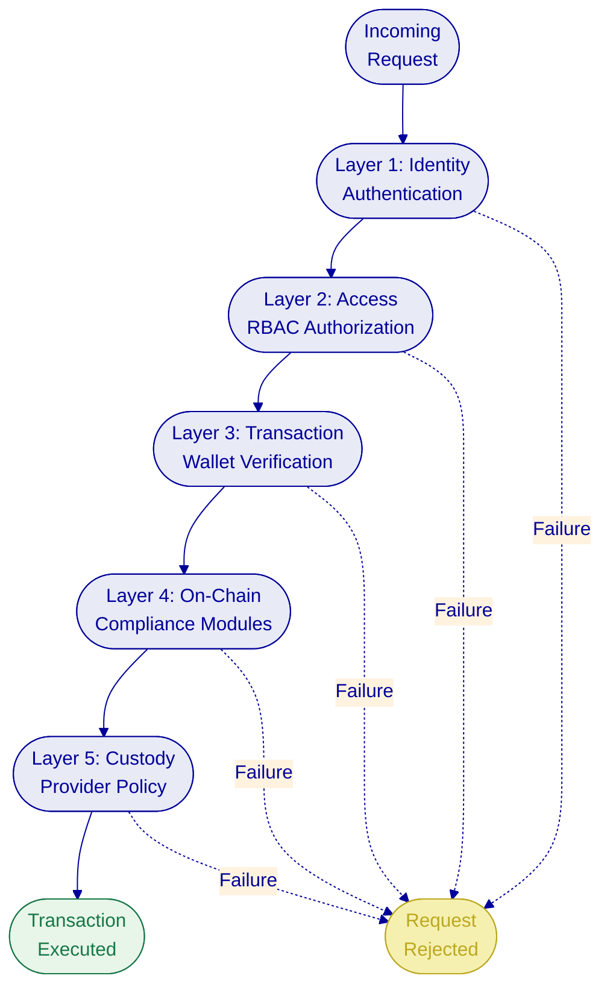

### Security Responsibility Matrix

| Control Area | SettleMint Responsibility | Ministry/Malomatia Responsibility |
| --- | --- | --- |
| Platform security (application layer) | Design, implementation, patching, testing | Deployment, configuration per guidance |
| Smart contract security | Development, audit, upgrade management | Review, approval of upgrades |
| Infrastructure security | Architecture guidance, Helm chart security defaults | Provisioning, network security, firewall rules |
| Key management | Key Guardian software, custody integration | HSM provisioning, custody provider selection |
| Identity and access | RBAC framework, authentication methods | User provisioning, role assignment policies |
| Monitoring and alerting | Dashboard templates, alert rule definitions | Grafana hosting, alert routing, SIEM integration |
| Incident response | Application-level response per SLA | Infrastructure-level response, escalation coordination |
| Penetration testing | Platform-level testing | Infrastructure-level testing, coordination |
| Compliance enforcement | On-chain compliance modules | Compliance rule definition, regulatory interpretation |

---

## Project Implementation and Delivery

### Delivery Overview

SettleMint follows a structured, phase-gated implementation methodology refined through production deployments with regulated banks, market infrastructure providers, and sovereign entities. For the MoJ programme, the implementation spans the first two years of the five-year contract, organized into the standard five delivery phases with timeline adjustments reflecting the programme's scope and the specific requirements of SAK integration and QFC compliance configuration.

Each phase concludes with a formal gate review involving key stakeholders from SettleMint, Malomatia, and the Ministry. Progression requires sign-off on defined deliverables and acceptance criteria.

### Phase Plan

**Phase 1: Discovery and Requirements (Weeks 1 to 8)**

Objective: Establish a validated understanding of the Ministry's objectives, SAK integration requirements, QFC regulatory mapping, and operational requirements.

Key activities include stakeholder interviews with MoJ, Malomatia, QFC, and banking participants; SAK system assessment for bidirectional integration design; regulatory and compliance mapping to QFC investment token regulations and Qatari Digital Asset Regulations; real estate asset class scoping including property types, fractional ownership parameters, and lifecycle events; architecture design for on-premises/private cloud deployment on Hyperledger Besu; and Arabic/English localization requirements capture.

Outputs: Business Requirements Document, Regulatory and Compliance Matrix (QFC-specific), Target Architecture Document, SAK Integration Design, Implementation Roadmap, RACI Matrix.

Acceptance gate: All requirements validated by MoJ stakeholders, compliance matrix reviewed by QFC, architecture accepted by Ministry technology leadership.

**Phase 2: Foundation and Setup (Weeks 9 to 16)**

Objective: Provision the DALP environment on Ministry infrastructure, deploy the Hyperledger Besu network, and establish the identity and access framework.

Key activities include Kubernetes cluster deployment within Ministry infrastructure; Hyperledger Besu network provisioning (four validators, two RPC nodes, IBFT 2.0/QBFT consensus); DALP platform deployment via Helm charts; OnchainID-based identity framework configuration; Key Guardian and custody integration setup; observability stack deployment; and SAK integration connector development.

Outputs: Provisioned environments (development, staging, production), network configuration, identity and access design, key management configuration, SAK connector prototype.

Acceptance gate: All environments operational, blockchain network functional, identity framework verified, SAK connectivity established.

**Phase 3: Configuration and Compliance (Weeks 17 to 28)**

Objective: Configure real estate asset types, QFC compliance modules, data feeds, and operational workflows.

Key activities include real estate token configuration using DALP's Asset Designer; QFC compliance module setup (identity verification, country restrictions, investor limits, holding periods, transfer approval); trusted issuer configuration for KYC/AML providers; feed configuration for property valuation data; workflow design for issuance, transfer, settlement, and servicing operations; Arabic/English localization validation.

Outputs: Asset configuration documentation, compliance module configuration (QFC-mapped), integration design document, operational workflow documentation.

Acceptance gate: All asset types configured and validated in staging, compliance modules tested against QFC requirements (both allow and block scenarios), Arabic/English interface validated.

**Phase 4: Integration and Testing (Weeks 29 to 40)**

Objective: Connect DALP to SAK, KYC/AML providers, banking systems, and custodians; validate the complete system.

Testing follows a structured four-track approach: functional testing (asset lifecycle, compliance enforcement, settlement), security testing (API penetration, authorization, smart contract review), performance testing (throughput, latency, concurrent capacity), and user acceptance testing (MoJ, Malomatia, banking participants).

Outputs: Integrated system, test reports across all four tracks, go-live readiness assessment.

Acceptance gate: All integrations operational, no open P1/P2 defects, security assessment completed, UAT sign-off received.

**Phase 5: Go-Live and Hypercare (Weeks 41 to 52)**

Objective: Execute production deployment and provide intensive post-go-live support.

Go-live activities include production deployment execution, data migration from staging, smoke-test validation, and 48-hour dedicated support coverage. The four-week hypercare period provides dedicated monitoring, performance optimization, knowledge transfer completion across all three training tracks, and managed transition to contracted support tier.

Outputs: Production deployment confirmation, hypercare summary report, knowledge transfer completion, support transition plan.

### Testing Strategy Detail

Testing follows a four-track approach where all test plans, scripts, and results are documented and retained as part of the implementation evidence package.

**Track 1: Functional Testing.** Systematic validation of all configured asset types, lifecycle events, compliance rules, custody workflows, and settlement logic. Test scenarios cover both standard operations and exception cases, with specific attention to boundary conditions in compliance modules (investors at exact count limits, transfers at exact value thresholds, claims approaching expiry). For the MoJ programme, functional testing will include specific SAK integration scenarios and QFC compliance enforcement validation.

| Test Category | Scope | Pass Criteria |
| --- | --- | --- |
| Asset lifecycle | Issuance, transfer, pause, freeze, burn, maturity, redemption | All lifecycle states transition correctly with proper event emission |
| Compliance enforcement | QFC module configuration, identity verification, country restrictions, investor limits | Compliant transactions pass; non-compliant transactions blocked with correct error codes |
| SAK integration | Property data retrieval, tokenization event notification, synchronization | Bidirectional data flow verified with error handling |
| Custody workflows | Signing, approval, rejection, timeout, policy enforcement | Transactions follow configured approval paths |
| Settlement | DvP creation, approval, execution, cancellation, expiry | Settlement logic executes correctly with proper atomicity |
| Identity and claims | Registration, claim issuance, verification, revocation, expiry | Identity lifecycle operates correctly; expired claims block transfers |
| Arabic localization | RTL layout, Arabic data entry, bilingual search and reporting | All user-facing functions operate correctly in Arabic |

**Track 2: Security Testing.** Penetration testing of the API surface (both RPC and v2 endpoints), authentication bypass attempts, authorization escalation testing across the 26-role model, input validation and injection vectors, smart contract security review with focus on compliance module bypass scenarios, custody integration security, and infrastructure configuration review. The security assessment is conducted in alignment with the Ministry's security review process.

| Security Domain | Test Focus | Evidence Produced |
| --- | --- | --- |
| API security | Authentication bypass, injection, rate limiting, input validation | Penetration test report with severity-classified findings |
| Authorization | Role escalation, cross-organization access, per-asset boundary enforcement | Authorization matrix test results |
| Smart contract | Reentrancy, overflow, access control, compliance bypass, upgrade safety | Smart contract security assessment |
| Custody integration | Signing policy bypass, approval workflow integrity | Custody integration security assessment |
| Infrastructure | Network segmentation, TLS configuration, secrets exposure | Infrastructure security scan results |
| Data protection | Encryption at rest and in transit, PII handling, backup encryption | Data protection assessment report |

**Track 3: Performance Testing.** Validation of transaction throughput under the expected workload profile, API response latency against agreed targets, and system behavior under peak conditions including concurrent user sessions and burst transaction volumes.

| Performance Metric | Measurement Method | Typical Target |
| --- | --- | --- |
| API response latency (p50) | Load test with realistic workload | Less than 200ms |
| API response latency (p99) | Load test with burst traffic | Less than 2,000ms |
| Transaction throughput | Sustained load at expected peak volume | Per deployment configuration |
| Concurrent user capacity | Simulated concurrent sessions | Per deployment configuration |
| Indexer event latency | Time from blockchain event to analytics view | Less than 5 seconds |
| Recovery time | Simulated component failure during load | Within agreed RTO target |

**Track 4: User Acceptance Testing (UAT).** Structured sessions with designated participants from the Ministry, Malomatia, and banking partners, using business-scenario test scripts derived from actual operational workflows. UAT validates that the system meets business requirements in practice.

| UAT Track | Participants | Validation Focus |
| --- | --- | --- |
| Business operations | MoJ operations staff | Property tokenization, investor management, yield distribution |
| Compliance operations | MoJ compliance officers | Compliance enforcement, audit trail completeness, exception handling |
| Technical operations | Malomatia infrastructure team | Monitoring, alerting, backup procedures, incident response |
| Integration validation | Malomatia integration developers | SAK data flow, KYC integration, banking connectivity |
| Arabic localization | MoJ Arabic-language users | Full RTL workflow, Arabic data entry, bilingual reporting |

### Defect Classification

| Severity | Definition | Go-Live Impact |
| --- | --- | --- |
| P1: Critical | System unusable, data loss risk, compliance enforcement failure | Blocks go-live |
| P2: High | Major function impaired, no acceptable workaround | Blocks go-live |
| P3: Medium | Function impaired but workaround exists | Does not block go-live; remediation timeline agreed |
| P4: Low | Minor issue, cosmetic, or enhancement request | Post-go-live backlog |

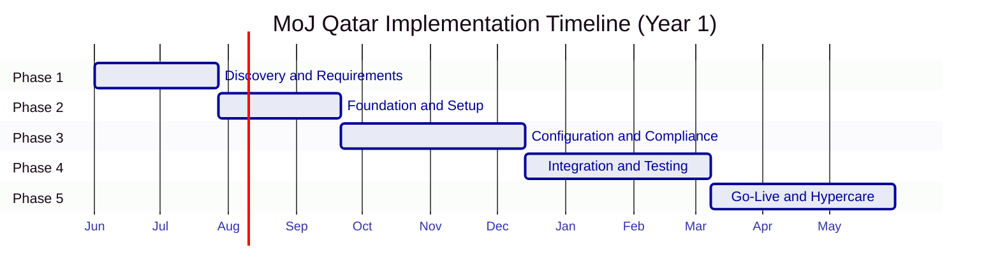

### RACI Matrix Summary

| Activity | SettleMint | Malomatia | MoJ |
| --- | --- | --- | --- |
| **Phase 1: Discovery** | | | |
| Stakeholder interviews | R | C | A |
| SAK system assessment | C | R | A |
| Regulatory mapping | R | C | A (Compliance) |
| Architecture design | A | C | C |
| Implementation roadmap | A | R | C |
| **Phase 2: Foundation** | | | |
| Environment provisioning | R | C | A (Infra) |
| Besu network configuration | R | C | I |
| Identity and access setup | R | C | A |
| Key management setup | R | I | C |
| **Phase 3: Configuration** | | | |
| Token and asset configuration | R | C | A |
| QFC compliance module setup | R | C | A (Compliance) |
| SAK connector development | C | R | C |
| Arabic localization validation | C | C | A |
| **Phase 4: Integration** | | | |
| API integration | R | R | C |
| SAK integration testing | C | R | A |
| Functional testing | R | C | C |
| Security testing | R | C | A (Security) |
| UAT coordination | A | C | R |
| **Phase 5: Go-Live** | | | |
| Production deployment | R | C | A |
| Go-live validation | R | R | C |
| Knowledge transfer | R | C | C |
| Support transition | A | C | R |

R = Responsible (does the work), A = Accountable (owns the outcome), C = Consulted, I = Informed.

### Governance and Decision Structure

The programme governance structure operates at three levels: a Steering Committee (quarterly, Ministry leadership, Malomatia leadership, SettleMint leadership) for strategic direction and escalation; a Programme Board (monthly, programme managers from all parties) for milestone tracking, risk review, and decision making; and a Delivery Team (weekly, technical leads and architects) for operational coordination, issue resolution, and sprint planning.

The RACI matrix assigns clear responsibilities across SettleMint, Malomatia, and Ministry stakeholders for every implementation activity. Named decision-makers and proxy authority are established in Phase 1. Decisions pending beyond five business days are escalated through the Programme Board.

### Resource Model

| Role | SettleMint | Malomatia | MoJ |
| --- | --- | --- | --- |
| Programme Manager | Delivery Lead | SI Project Manager | MoJ Programme Director |
| Solution Architect | Full (Phase 1-3), on-call after | SI Architect | MoJ Technical Lead |
| Platform Engineers | Full (Phase 2-5) | Integration developers | Infrastructure team |
| QA/Test Lead | Partial (Phase 3), full (Phase 4) | Test team | UAT participants |
| Compliance | Compliance module configuration | Regulatory liaison | QFC compliance team |

### Year 2: Production Deployment and Professional Services

Year 2 extends the initial implementation into full production readiness, platform expansion, and operational maturity.

**Development License Activation (Month 13).** The DALP development license activates at the start of Year 2, providing the Ministry and Malomatia with access to development environments for ongoing configuration, testing, and integration work. The development license runs at EUR 2,500 per month.

**Professional Services (60 Mandates).** Sixty days of professional services are included in Year 2, delivered by SettleMint solution architects and platform engineers. These mandates cover additional asset type configuration (expanding beyond the initial real estate types), advanced compliance module customization for evolving QFC requirements, additional system integrations identified during Year 1 operations, performance optimization based on production metrics, and advanced training for new team members or expanded use cases. Professional services are delivered at EUR 700 per day.

**Platform Expansion.** Based on Year 1 operational experience, the Ministry may choose to expand the platform to additional property types, new participant categories (additional banks, new KYC providers), enhanced reporting and analytics, or integration with additional government systems.

### Years 3 to 5: Production Operation

The production operation phase (Years 3 through 5) is the steady-state period where the platform operates under the contracted support tier with ongoing licensing.

**Production License.** The DALP production license activates at the start of Year 3 at EUR 26,000 per month. This license includes the full platform stack, HA/DR capabilities, and ongoing platform updates per the contracted support tier.

**Development License Continuation.** The development license continues at EUR 2,500 per month throughout Years 2 through 5, providing a permanent development and staging environment for the Ministry's testing and integration work.

**Ongoing Support.** SettleMint provides ongoing support per the contracted tier (Standard, Premium, or Enterprise), including incident response, platform updates, and scheduled maintenance.

**No Per-Wallet or Per-Transaction Fees.** The commercial model includes no per-wallet or per-transaction charges. The Ministry pays flat monthly licensing fees regardless of the number of investors, properties tokenized, or transactions processed. This predictable cost structure supports the Ministry's budgeting requirements and eliminates unit economics uncertainty as the platform scales.

### Risks to Delivery and Mitigations

| Risk | Impact | Mitigation |
| --- | --- | --- |
| SAK integration complexity | Phase 4 extension | Early SAK assessment in Phase 1; mock interfaces for parallel development; Saudi RER integration patterns as blueprint |
| QFC regulatory changes | Compliance rework | Modular compliance engine enables runtime reconfiguration; regulatory buffer in Phase 3; change control process |
| Ministry infrastructure readiness | Phase 2 blocked | Infrastructure prerequisites checklist in Phase 1; weekly tracking; managed cloud fallback option |
| Decision latency | Schedule slippage | Named decision-makers in RACI; 5-day escalation threshold; proxy authority established |
| Multi-stakeholder coordination | Integration delays | Clear RACI across MoJ, Malomatia, SettleMint; weekly delivery coordination; parallel workstreams |
| Arabic localization completeness | UAT rework | Early localization validation in Phase 3; bilingual test scenarios in Phase 4 |

---

## Deployment

### Deployment Principles

DALP delivers identical platform capabilities across all deployment models. The choice of deployment model is driven by institutional requirements, not by platform limitations. For the MoJ programme, the deployment model is driven by the Ministry's data sovereignty requirements and existing infrastructure.

Three principles guide the deployment design: all data, blockchain nodes, and cryptographic keys reside within Ministry-approved infrastructure in Qatar; the deployment delivers the same lifecycle modules, compliance engine, settlement protocols, observability stack, and API surface as any other DALP deployment; and the deployment architecture supports the 99.9% to 99.99% uptime targets appropriate for a national-scale programme.

### Recommended Deployment Model

**Private cloud or on-premises** deployment within Ministry-controlled infrastructure, based on the Ministry's data sovereignty requirements and regulatory constraints.

This model provides full infrastructure control over hardware, network, storage, and compute within the Ministry's environment. Helm/Kubernetes deployment uses Ministry-provisioned Kubernetes clusters. The Ministry manages infrastructure operations (with SettleMint support for platform-level issues). All data residency requirements are satisfied by design.

The deployment assumes the Ministry will provision Kubernetes infrastructure (standard Kubernetes 1.27+ or OpenShift 4.14+), managed PostgreSQL (version 17.x with HA), managed Redis (version 8.x), S3-compatible object storage, and network connectivity for container image access.

### Deployment Options Considered

| Capability | Managed SaaS | Private Cloud | On-Premises | Hybrid |
| --- | --- | --- | --- | --- |
| Data sovereignty | Configurable | Full control | Full control | Component-level |
| Network connectivity | Internet/VPN | Private link | Air-gap capable | Mixed |
| Update management | Automated | Coordinated | Client-controlled | Component-specific |
| Operational overhead | Lowest | Moderate | Highest | Moderate |
| **Fit for MoJ** | **Not recommended** | **Recommended** | **Alternative** | **Alternative** |

The managed SaaS option is not recommended due to data sovereignty requirements. On-premises and hybrid models remain available if the Ministry's infrastructure policies evolve.

### Infrastructure Requirements

| Requirement | Specification |
| --- | --- |
| Kubernetes | 1.27+ (standard) or OpenShift 4.14+ |
| Node count | Minimum 3, recommended 6+ (multi-AZ distribution) |
| Node sizing | Minimum 4 vCPU / 16 GB RAM per node, recommended 8 vCPU / 32 GB RAM |
| PostgreSQL | 17.x with multi-AZ HA, point-in-time recovery, SSL/TLS |
| Redis | 8.x with TLS, AUTH, persistence, minimum 6 GB |
| Object storage | S3-compatible with versioning and lifecycle policies |
| Besu validators | 4 validator nodes + 2 RPC nodes |
| Network | Outbound HTTPS to harbor.settlemint.com for container images |

### Availability, Resilience, and DR Approach

The recommended cloud-native HA pattern uses multi-AZ Kubernetes node distribution across three availability zones, pod disruption budgets for controlled rolling updates, database HA through managed service multi-AZ or operator clustering, and blockchain node redundancy through multiple validator and RPC node deployment.

| Scenario | RTO | RPO |
| --- | --- | --- |
| Cloud-native (recommended) | 2 to 15 minutes | Seconds to 1 minute |
| Hot-warm (geographic redundancy) | 30 to 180 minutes | 5 to 60 minutes |

Backup capabilities include Velero for Kubernetes resource backups, managed database point-in-time recovery, object storage versioning, and documented DR runbooks with quarterly drill recommendations.

### Environment Strategy

DALP implementations provision three independent environments:

| Environment | Purpose | Data | Access |
| --- | --- | --- | --- |
| Development | Iterative configuration, developer testing, integration prototyping | Synthetic | SettleMint + Malomatia + MoJ development team |
| Staging | Integration testing, UAT, performance testing, pre-production validation | Anonymized production-representative | SettleMint + Malomatia + MoJ full team |
| Production | Live operations | Real | Controlled per RBAC model |

Each environment runs the full DALP stack independently. Configuration is environment-specific through Helm value files, enabling consistent deployment processes across environments while allowing different parameters (network endpoints, database connections, custody credentials, compliance module configurations).

The development environment is available from Year 2 onwards (EUR 2,500/month). The staging environment is provisioned during Phase 2 of the implementation. The production environment is provisioned during Phase 2 but remains locked until Phase 5 deployment.

### DevOps and Deployment Operations

All DALP deployments use Helm charts as the standard packaging and deployment mechanism. SettleMint provides versioned, tested Helm chart packages that include all platform components, supporting infrastructure, and the observability stack.

Helm charts support configuration through value files covering all platform component parameters (replica counts, resource limits, feature flags), database and cache connection details, object storage configuration, observability configuration, ingress and TLS settings, blockchain network parameters, custody provider credentials, and backup and recovery settings.

**Container Image Management.** All container images are served through harbor.settlemint.com. For the Ministry's deployment, images will be mirrored to a Ministry-operated private registry, ensuring full air-gap capability after initial provisioning. Container images are security-scanned before release.

**Update and Release Management.** Release cadence varies by support tier. For managed SaaS deployments, updates are applied by SettleMint with coordinated change windows. For the Ministry's on-premises or private cloud deployment, SettleMint provides updated Helm charts with migration guides, and the Ministry or Malomatia executes the upgrade through their change control process.

**CI/CD Integration.** The deployment model integrates with standard CI/CD tooling including GitOps workflows (ArgoCD, Flux), standard pipelines (Jenkins, GitLab CI, GitHub Actions), and infrastructure-as-code tools (Terraform, Pulumi). The DALP CLI supports scripting and automation for operational tasks within CI/CD pipelines.

**CRD and Operator Requirements.** DALP Helm charts install Custom Resource Definitions for several components (Traefik, CloudNativePG, Velero). These require cluster-level permissions and security team approval before deployment. Operators are configured for namespace-scoped RBAC. On OpenShift, the charts are compatible with the restricted-v2 Security Context Constraint with all containers running as non-root.

### Data Residency and Sovereignty

All platform data, blockchain state, cryptographic keys, investor identity records, compliance evidence, and audit trails will reside within Ministry-approved infrastructure in Qatar. No data will be processed or stored outside Qatar's jurisdiction.

Container images are pulled from SettleMint's Harbor registry and can be mirrored to a Ministry-operated private registry for air-gap deployments. The platform operates fully within the Ministry's network boundary after initial image provisioning.

**Blockchain Data.** All blockchain state (token balances, compliance configurations, identity claims, role assignments, settlement records) is stored on the Besu validators and RPC nodes within Qatar. The blockchain is a private, permissioned network with no connection to public blockchain networks.

**Application Data.** All user sessions, API keys, KYC profiles, system configuration, and operational metadata are stored in the Ministry's PostgreSQL instance within Qatar. Tenant isolation is enforced at the database query level.

**Cryptographic Keys.** All signing keys, wallet keys, and encryption keys are stored within the Ministry's key management infrastructure (HSM, cloud KMS, or encrypted database within Qatar). Keys never leave the Ministry's secure boundaries in plaintext.

**Audit Data.** All audit trails (on-chain events and off-chain logs) are retained within Qatar. The on-chain audit trail is permanently stored on the blockchain. Off-chain audit data retention is configurable to meet Qatari regulatory requirements.

**Container Images.** After initial mirroring from SettleMint's Harbor registry, container images reside in the Ministry's private registry. Subsequent updates follow the same mirror process during scheduled maintenance windows, ensuring the Ministry controls when and how new platform versions are introduced.

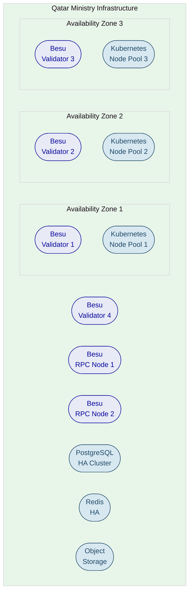

---

## Training and Knowledge Transfer

### Training Strategy

SettleMint delivers a structured training programme organized around three role-based tracks, customized to the MoJ programme's specific configuration, integrations, and operational workflows. Training begins during implementation phases (configuration, integration, and testing) as Ministry and Malomatia team members shadow SettleMint engineers, and is formally completed during the hypercare period.

The goal is operational independence: by the end of hypercare, the Ministry's teams should manage day-to-day operations, handle common scenarios, troubleshoot issues, and know when and how to escalate to SettleMint support. All training is delivered in English with Arabic documentation support where required.

### Administrator Track (3 to 4 days)

Covers platform architecture and component overview, environment management, user and access management across DALP's role hierarchy, compliance module administration (QFC-specific configuration), OnchainID identity management, Key Guardian and custody administration, monitoring and observability (Grafana dashboards, alerting), backup and recovery procedures, and platform update processes.

Audience: MoJ platform administrators, Malomatia infrastructure leads, compliance officers.

### Developer/Integration Track (4 to 5 days)

Covers DALP API deep dive (REST API, authentication, rate limiting, error handling, retry strategies), SAK integration patterns and maintenance, KYC/AML provider integration management, custody provider connector operations, event-driven architecture (webhooks, event types, payload schemas), CLI scripting for automated operations, testing and validation strategies, and security practices.

Audience: Malomatia integration developers, MoJ technical architects, banking system integration teams.

### End-User/Operations Track (2 days)

Covers platform navigation (Arabic/English), asset operations (issuance, transfer, batch operations, lifecycle events), compliance workflows (investor onboarding, verification, exception handling), settlement operations (DvP workflows, status monitoring), custody operations (signing workflows, freeze/recovery), reporting and audit trail navigation, and common troubleshooting scenarios.

Audience: MoJ operations staff, compliance officers, relationship managers.

### Knowledge Transfer Method

Knowledge transfer is integrated into the implementation lifecycle. Administrators shadow SettleMint engineers during Phase 2 environment setup. Developers participate in Phase 3 compliance module configuration and integration design. All tracks participate in Phase 4 UAT. Formal training delivery follows during hypercare.

The approach combines instructor-led sessions for conceptual models, guided labs on the Ministry's staging environment for hands-on practice, shadowing during implementation for real-world operational patterns, and documentation with recorded sessions for persistent reference.

An operational readiness assessment at the conclusion of knowledge transfer verifies that each role can independently execute core responsibilities, including scenario-based proficiency testing. Sample assessment scenarios include:

- Review a blocked transfer and identify which compliance module rejected it, then explain the remediation path
- Trace a delayed transaction through the lifecycle states to identify the bottleneck
- Rotate an API key for an integration without causing service interruption
- Review an expiring claim population and initiate renewal actions through the KYC provider
- Confirm that monitoring alerts route correctly to operational channels
- Execute a rollback procedure for a failed platform deployment
- Add a new property to the platform using the Asset Designer, including compliance module selection
- Freeze an investor wallet and document the regulatory justification
- Generate a compliance report for a QFC regulatory review

The readiness assessment requires formal sign-off by designated Ministry stakeholders before the support transition is completed.

### Documentation Package

Every implementation includes a complete documentation package tailored to the Ministry's specific deployment:

| Document | Description |
| --- | --- |
| Architecture Guide | Ministry-specific deployment architecture, component topology, network design, and integration map |
| Administrator Guide | Platform configuration, user management, compliance module administration, monitoring, and update procedures |
| Developer Guide (API Reference) | API reference, integration patterns, webhook configuration, and extension development |
| User Guide | Step-by-step procedures for all Asset Console operations in Arabic and English |
| Operational Runbooks | Procedure-driven guides for incident response, backup/recovery, failover, and common troubleshooting |
| Compliance Module Reference | Detailed reference for all configured QFC compliance modules: rules, parameters, and testing procedures |
| SAK Integration Guide | API contracts, data mappings, error handling, and synchronization procedures for SAK integration |

Documentation is maintained alongside the platform. Major releases include updated documentation reflecting new features, changed behaviors, and revised procedures.

### Self-Service Resources

Beyond initial training, SettleMint provides ongoing resources: a continuously updated documentation portal, a searchable knowledge base maintained from real support interactions, release training materials covering new features, refresher training available on request for new team members, and periodic office hours with SettleMint engineers (Premium and Enterprise tiers).

---

## Support and SLA

### Support Model Overview

SettleMint provides structured, tiered support for all DALP production deployments. For the MoJ programme, SettleMint recommends the Premium or Enterprise support tier given the national-scale nature of the deployment and the regulatory requirements for continuous availability.

### Support Tiers

| Attribute | Standard | Premium | Enterprise |
| --- | --- | --- | --- |
| Coverage hours | 09:00 to 18:00 CET, Mon to Fri | 07:00 to 22:00 CET, Mon to Fri; P1 weekend on-call | 24/7/365 |
| Support channels | Email, portal | Email, portal, dedicated Slack/Teams, phone | Email, portal, Slack/Teams, phone, video |
| Named contacts | Up to 3 | Up to 8 | Unlimited |
| Uptime SLA | 99.9% | 99.95% | 99.99% |
| P1 response time | 4 hours | 1 hour | 15 minutes |
| P1 resolution target | 8 hours | 4 hours | 2 hours |
| Designated engineer | Shared pool | Named individual | Named team |
| Release cadence | Quarterly | Monthly | Continuous with staged rollout |
| Business reviews | Quarterly | Monthly | Bi-weekly |
| Architecture reviews | None | None | Quarterly with Solution Architect |

### Severity and Response Matrix

| Severity | Classification | P1 Response | P1 Resolution |
| --- | --- | --- | --- |
| P1: Critical | Platform unavailable, compliance failure, settlement failure | 15 min (Enterprise) to 4 hr (Standard) | 2 hr (Enterprise) to 8 hr (Standard) |
| P2: High | Major degradation, integration failure, settlement delays | 1 hr (Enterprise) to 8 hr (Standard) | 4 hr (Enterprise) to 24 hr (Standard) |
| P3: Medium | Workaround available, non-critical degradation | 4 hr (Enterprise) to 2 business days (Standard) | 2 business days (Enterprise) to 5 business days (Standard) |
| P4: Low | Minor/cosmetic, enhancement request | 1 business day (Enterprise) to 5 business days (Standard) | 3 business days (Enterprise) to 10 business days (Standard) |

### Escalation and Incident Management

Automatic escalation triggers when P1 incidents are not acknowledged within response targets (escalation to Support Engineering Manager), when P1 incidents exceed resolution targets (escalation to VP Engineering with client notification), or when recurring P1/P2 incidents occur (three or more in 30 days trigger root cause review with Solution Architect).

Client-initiated escalation follows a four-level path: designated support engineer (Level 1, technical investigation), Support Engineering Manager (Level 2, resource allocation and SLA concerns), VP Engineering/Head of Customer Success (Level 3, persistent issues), and SettleMint Executive Management (Level 4, material service failures).

The incident management process follows a structured flow: report through authorized channel, acknowledge and confirm severity within response target, triage and diagnose, resolve or provide workaround within resolution target, conduct post-mortem for P1/P2 incidents within five business days, and close after client confirmation.

### Maintenance and Update Policy

Scheduled maintenance uses a standard window (Saturdays 02:00 to 06:00 CET, or a Ministry-agreed alternative) with minimum five business days advance notification for standard maintenance and ten business days for major upgrades. Emergency maintenance for critical security patches may be executed outside standard windows with maximum practical notice.

Release cadence varies by support tier from quarterly (Standard) to continuous delivery with staged rollouts (Enterprise). Each release includes release candidate validation on staging, detailed release notes, migration guides, and documented rollback procedures.

Smart contract upgrades use the UUPS proxy pattern, allowing logic upgrades without changing contract addresses or disrupting on-chain state. Upgrades affecting compliance modules are coordinated with the Ministry's compliance team.

### Maintenance and Update Policy Detail

All changes to the production environment follow a structured change management process aligned with enterprise governance practices.

**Standard Changes.** Pre-approved, low-risk changes (configuration adjustments, minor patches) executed during maintenance windows with advance notification. These follow a streamlined approval process with documented scope and rollback plans.

**Normal Changes.** Reviewed and approved through a change advisory process involving SettleMint and Ministry stakeholders. Normal changes include impact assessment, rollback plan, and test validation on staging before production deployment. The Ministry reviews and approves normal changes through their existing change management governance.

**Emergency Changes.** Reserved for critical security or compliance fixes. Executed with shortened approval and maximum practical notice. Full documentation and post-change review follow within two business days. Emergency changes may address security vulnerabilities, compliance module defects that could allow non-compliant transfers, or critical operational issues affecting platform availability.

**Smart Contract Upgrade Process.** DALP's smart contracts use the UUPS proxy pattern, allowing contract logic to be upgraded without changing contract addresses or disrupting on-chain state. The upgrade process includes impact assessment by SettleMint's engineering team, staging validation with the Ministry's specific configuration, client review by technical and compliance stakeholders, production deployment during the agreed maintenance window, and post-upgrade verification confirming state integrity and compliance behavior. Contract addresses remain stable across upgrades; existing balances, approvals, and compliance state are preserved.

**Release Delivery Pipeline.** Each DALP release follows a controlled process: release candidate published to staging for validation, detailed changelog covering new features and breaking changes, migration guide with step-by-step instructions, staged rollout (staging first, production after validation), post-deployment verification with automated health checks, and documented rollback procedures tested before each release.

### Service Reporting

Monthly uptime reports are provided as part of the regular business review. Service credits apply when uptime falls below the contracted SLA target: 10% of monthly support fees for uptime below target but above 99.0%, 25% for uptime between 98.0% and 99.0%, and 50% for uptime below 98.0%.

### Client Responsibilities

The following responsibilities are required from the Ministry and Malomatia to maintain the implementation timeline. Delays in these areas are the primary source of schedule slippage in regulated platform deployments.

**Decision Making and Governance.** Named decision-makers must be available for scheduled review sessions and gate approvals. Decision turnaround on design decisions, configuration approvals, and compliance rule sign-offs should be completed within five business days. Scope changes should be managed through the agreed change-control process with impact assessment and prioritization.

**Technical and Infrastructure.** Timely provisioning of infrastructure resources (Kubernetes clusters, database instances, DNS entries, TLS certificates, firewall rules) per the implementation roadmap. Outbound access to harbor.settlemint.com (port 443) for container images. API access, credentials, and test environments for SAK, KYC/AML providers, banking systems, and custody providers.

**Compliance and Business.** Complete documentation of applicable QFC regulatory frameworks, jurisdictional rules, and investor eligibility requirements. Specific configuration parameters for compliance modules (country lists, investor count limits, holding periods, supply caps) with formal sign-off. Real estate asset class parameters, lifecycle event definitions, and operational workflow specifications.

**Operational.** Designated attendees for all three training tracks with protected time for training sessions. Timely review and feedback on implementation documentation. Designated contacts for ongoing support relationship and internal operational ownership.

### Change Control

Scope changes are expected in regulated programmes, especially when external providers or legal teams discover additional requirements. The change control process ensures changes are visible, assessed for impact, and absorbed through a governed process rather than silent schedule erosion.

1. **Request.** Either party submits a change request describing the proposed change, rationale, and urgency.
2. **Impact Assessment.** SettleMint assesses timeline, effort, risk, and cost impact within five business days.
3. **Decision.** Both programme managers review the assessment and decide: approve, defer to post-go-live, or reject.
4. **Implementation.** Approved changes are incorporated into the implementation plan with updated milestones.
5. **Tracking.** All change requests are logged in the change register with status, impact assessment, and decision rationale.

Changes classified as "must-have for go-live" are prioritized and absorbed into the current timeline with appropriate adjustments. Changes classified as "post-go-live enhancement" are documented and scheduled for implementation after production stabilization.

---

## Risk Management

### Risk Management Approach

Risk management is a continuous activity integrated into programme governance. The risk register is maintained by the SettleMint Delivery Lead in collaboration with Malomatia's Project Manager and reviewed at every Programme Board meeting. Each risk is assessed for likelihood, impact, mitigation effectiveness, and trigger conditions.

### Risk Register

| ID | Risk | Likelihood | Impact | Mitigation | Owner |
| --- | --- | --- | --- | --- | --- |
| R1 | SAK integration more complex than anticipated | Medium | High | Early SAK assessment (Phase 1); mock interfaces for parallel testing; Saudi RER integration patterns as blueprint | SettleMint SA + Malomatia |
| R2 | QFC regulatory requirements change during implementation | Medium | Medium | Modular compliance modules enable runtime reconfiguration; regulatory buffer in Phase 3; change control process | MoJ Compliance |
| R3 | Ministry infrastructure not provisioned on time | Medium | High | Infrastructure checklist in Phase 1 with deadlines; weekly tracking; managed cloud fallback option | MoJ/Malomatia |
| R4 | Decision latency from multi-stakeholder governance | High | Medium | Named decision-makers in RACI; 5-day escalation; proxy authority; Programme Board tracking | Programme Board |
| R5 | Custody provider selection delay | Low | Medium | Early vendor evaluation in Phase 1; DALP supports multiple providers through configuration | MoJ |
| R6 | Arabic localization gaps in edge cases | Low | Low | Early localization testing in Phase 3; bilingual UAT scenarios; ar-SA locale built into platform | SettleMint |
| R7 | Third-party KYC/AML provider integration delays | Medium | Medium | Early engagement in Phase 1; mock interfaces for parallel development; multiple provider options | Malomatia |
| R8 | Key personnel changes during implementation | Low | Medium | All decisions documented; backup personnel included in knowledge transfer; RACI includes secondary contacts | All parties |
| R9 | Scope expansion (additional property types or jurisdictions) | Medium | Medium | Change control process; MoSCoW prioritization; post-go-live enhancement path | Programme Board |
| R10 | Security review timeline exceeds plan | Medium | Medium | Early security review coordination in Phase 1; SettleMint ISO 27001/SOC 2 Type II certifications accelerate vendor assessment | MoJ Security |

### Continuous Risk Assessment

Beyond the initial risk register, SettleMint's delivery methodology incorporates continuous risk assessment through several mechanisms:

**Weekly Risk Review.** The delivery team reviews the risk register weekly, updating likelihood and impact assessments based on current project status. New risks identified during implementation activities are logged immediately with initial assessment and assigned to the appropriate owner.

**Phase Gate Risk Assessment.** At each phase gate review, the risk register is formally reviewed by the Programme Board. Risks that have materialized are documented with the actual impact and effectiveness of the mitigation. Risks that have been retired (no longer applicable) are closed with rationale. New risks emerging from the completed phase's findings are added.

**Integration Risk Monitoring.** SAK integration, KYC/AML provider connectivity, banking system connections, and custody provider integration each have dedicated risk monitoring during Phase 4. Integration risks are tracked against specific acceptance criteria, with fallback plans (mock interfaces, alternative providers, manual workarounds) documented for each critical integration.

**Regulatory Change Monitoring.** During the implementation period, SettleMint monitors QFC regulatory developments that could affect the programme's compliance configuration. Material regulatory changes are flagged to the Programme Board with an impact assessment covering affected compliance modules, configuration changes required, and timeline impact.

### Governance of Risks

Risks are reviewed at every Programme Board meeting. New risks identified during delivery are logged immediately with initial assessment. Risk owners are responsible for monitoring trigger conditions and executing mitigation actions. Risk status changes are communicated to the Steering Committee through the monthly programme report.

---

## Compliance Matrix

### Usage Instructions

The compliance matrix maps the Ministry's requirements to DALP capabilities with clear status codes. Each row identifies the requirement, the platform's response, and any assumptions or dependencies.

### Status Legend

| Code | Meaning |
| --- | --- |
| Full | Requirement fully met by DALP platform capabilities |
| Partial | Requirement partially met; specific gaps or dependencies noted |
| Configurable | Requirement met through platform configuration during implementation |
| Assumption | Response based on stated assumptions requiring Ministry validation |
| Out of Scope | Requirement outside the scope of the DALP platform; addressed by other parties |

### Detailed Matrix

| Requirement | Summary | Status | DALP Response | Assumptions/Notes |
| --- | --- | --- | --- | --- |
| REQ-01 | Real estate tokenization with fractional ownership | Full | Real Estate asset type with configurable fractionalization, ERC-3643 compliance | Property data sourced from SAK |
| REQ-02 | ERC-3643 compliant investment tokens | Full | SMART Protocol, native ERC-3643 implementation with modular compliance | Standard platform capability |
| REQ-03 | SAK land registry integration | Configurable | Unified API with configurable integration endpoints; SAK connector developed during implementation | SAK API specifications provided by Ministry/Malomatia |
| REQ-04 | KYC/AML investor verification | Full | OnchainID with trusted issuer system; external KYC provider verification flows into on-chain claims | Qatar-approved KYC provider selected by Ministry |
| REQ-05 | QFC regulatory compliance enforcement | Configurable | 18 compliance module types configurable for QFC requirements; runtime reconfigurable | QFC compliance rules defined by Ministry compliance team |
| REQ-06 | Permissioned blockchain deployment | Full | Hyperledger Besu with IBFT 2.0/QBFT, permissioned-only operation | Ministry provisions infrastructure |
| REQ-07 | On-premises or private cloud deployment | Full | Helm/Kubernetes deployment, air-gap capable | Kubernetes 1.27+ provisioned by Ministry |
| REQ-08 | Arabic/English bilingual interface | Full | ar-SA locale with RTL layout support, en-US default | Standard DALP localization |
| REQ-09 | Role-based access control | Full | 26 roles across 4 layers with on-chain enforcement | Role hierarchy configured during Phase 2 |
| REQ-10 | Investor eligibility enforcement | Full | Modular compliance engine with identity verification, country restrictions, investor limits | Eligibility rules defined by Ministry compliance team |
| REQ-11 | Yield/dividend distribution | Full | Fixed Treasury Yield and Yield Schedule addon with snapshot-based distribution | Distribution parameters configured per asset |
| REQ-12 | DvP settlement | Full | XvP settlement system with atomic execution | Settlement tokens configured during implementation |
| REQ-13 | Audit trail and regulatory reporting | Full | On-chain events, 18 PostgreSQL analytics views, API and SQL access | Reporting integration designed during Phase 1 |
| REQ-14 | Freeze/unfreeze operations | Full | Full and partial freeze at Custodian role level | Standard DALP capability |
| REQ-15 | Emergency pause | Full | Circuit-breaker with Emergency role | Standard DALP capability |
| REQ-16 | Forced transfers (court orders) | Full | Custodian role forced transfers with full on-chain audit trail | Standard DALP capability |
| REQ-17 | Multi-stakeholder governance | Full | Separation of duties across 5 per-asset roles and 9 system roles | Role assignment designed during Phase 1 |
| REQ-18 | High availability and disaster recovery | Full | Multi-AZ deployment, database HA, blockchain node redundancy, Velero backup | Infrastructure provisioned by Ministry |
| REQ-19 | Data sovereignty (all data in Qatar) | Full | On-premises/private cloud deployment, no external data processing | All components deployed within Qatar |
| REQ-20 | Transfer approval workflows | Full | Transfer Approval compliance module with configurable expiry | Approval rules configured during Phase 3 |
| REQ-21 | Banking system integration | Configurable | REST API, TypeScript SDK, CLI for banking connectivity | Bank API specifications provided during Phase 1 |
| REQ-22 | Custody provider integration | Full | Provider-abstracted signer with DFNS and Fireblocks support | Custody provider selected by Ministry |
| REQ-23 | Training and knowledge transfer | Full | Three-track training programme (administrator, developer, end-user) | Training during hypercare period |
| REQ-24 | Production support and SLA | Full | Three-tier support model with defined SLA targets | Support tier selected by Ministry |

---

## Support Appendix

### Support Tier Comparison

| Attribute | Standard | Premium | Enterprise |
| --- | --- | --- | --- |
| Coverage | Business hours CET | Extended hours CET, P1 weekend on-call | 24/7/365 |
| Channels | Email, portal | + Slack/Teams, phone | + video escalation |
| Uptime SLA | 99.9% (~43 min/month) | 99.95% (~22 min/month) | 99.99% (~4.3 min/month) |
| P1 response | 4 hours | 1 hour | 15 minutes |
| P1 resolution | 8 hours | 4 hours | 2 hours |
| P2 response | 8 hours | 4 hours | 1 hour |
| P2 resolution | 24 hours | 8 hours | 4 hours |
| Named engineer | Shared pool | Designated individual | Designated team |
| Release cadence | Quarterly | Monthly | Continuous, staged |
| Business reviews | Quarterly | Monthly | Bi-weekly |

### Severity Definitions

| Severity | Definition | Examples |
| --- | --- | --- |
| P1: Critical | Platform unavailable, data loss, compliance enforcement failure | DAPI unresponsive; compliance module bypass; DvP settlement failure; Key Guardian signing failure |
| P2: High | Major degradation, no acceptable workaround | Settlement delays; identity verification failures; observability stack down; major SAK integration failure |
| P3: Medium | Functional issue, workaround available | Reporting delay; non-critical API degradation; dashboard rendering; batch processing delay |
| P4: Low | Minor/cosmetic, no material impact | UI cosmetic defect; documentation error; minor logging inconsistency |

### Escalation Path

| Level | Contact | Scope |
| --- | --- | --- |
| Level 1 | Designated Support Engineer | Technical investigation and resolution |
| Level 2 | Support Engineering Manager | Unresolved incidents, SLA concerns |
| Level 3 | VP Engineering / Customer Success | Persistent issues, service quality |
| Level 4 | SettleMint Executive Management | Material service failures, strategic concerns |

### Maintenance Windows

Standard maintenance window: Saturdays 02:00 to 06:00 CET (or Ministry-agreed alternative). Minimum five business days notification for standard maintenance; ten business days for major upgrades. Emergency security patches may be applied outside standard windows with maximum practical notice.

### Service Credits

| Uptime Achieved | Credit |
| --- | --- |
| Below SLA target, above 99.0% | 10% of monthly support fees |
| Below 99.0%, above 98.0% | 25% of monthly support fees |
| Below 98.0% | 50% of monthly support fees |

Credits are capped at 50% of monthly support fees and must be requested within 30 days.

---

## Appendix: Localization and Arabic Language Support

### Arabic Language Implementation

DALP provides full Arabic language support through its internationalization framework, which includes the ar-SA locale as one of four built-in locales (alongside en-US, de-DE, and ja-JP). Arabic support is not a translation overlay; it is an integral part of the platform's design.

**Right-to-Left Layout.** The entire Asset Console interface supports right-to-left (RTL) layout for Arabic users. This includes navigation menus, form layouts, data tables, dashboard widgets, and modal dialogs. The RTL layout is not a mirror of the English interface; it follows Arabic reading patterns and user experience conventions.

**Arabic Data Entry.** All text input fields support Arabic text entry, including property descriptions, investor names, compliance notes, and search queries. The global search function supports Arabic queries with debounced input and section grouping.

**Bilingual Error Messages.** The platform's 534 error codes include Arabic translations (ar-SA), ensuring that Arabic-language operators receive localized error messages when investigating transaction failures, compliance blocks, or system issues.

**Documentation.** While the primary documentation language is English, Arabic documentation support is available for user-facing guides and operational procedures. The training programme includes Arabic documentation supplements where required.

**Regulatory Reporting.** Reports and analytics can be generated in Arabic or English, supporting the Ministry's bilingual reporting requirements for QFC and other regulatory bodies.

For the MoJ programme, the Arabic language implementation means that Ministry staff, compliance officers, and operations teams can work entirely in Arabic if preferred, with the option to switch to English at any time. The platform automatically detects the user's language preference and presents the interface accordingly.

---

## Appendix: Commercial Summary

### Five-Year Cost Structure

| Period | Component | Monthly Cost | Duration | Total |
| --- | --- | --- | --- | --- |
| Year 1 | Implementation project | Scoped per contract | 12 months | Per contract |
| Year 2 | Development license | EUR 2,500 | 12 months | EUR 30,000 |
| Year 2 | Professional services (60 mandates at EUR 700/day) | Variable | As consumed | EUR 42,000 |
| Year 3 | Development license | EUR 2,500 | 12 months | EUR 30,000 |
| Year 3 | Production license | EUR 26,000 | 12 months | EUR 312,000 |
| Year 4 | Development license | EUR 2,500 | 12 months | EUR 30,000 |
| Year 4 | Production license | EUR 26,000 | 12 months | EUR 312,000 |
| Year 5 | Development license | EUR 2,500 | 12 months | EUR 30,000 |
| Year 5 | Production license | EUR 26,000 | 12 months | EUR 312,000 |
| **Total (Years 2-5)** | | | | **EUR 1,098,000** |
| **Total (QAR equivalent)** | | | | **QAR 4,831,200** |

### Pricing Principles

The commercial model follows four principles relevant to the Ministry's evaluation:

**No per-wallet fees.** The platform supports an unlimited number of investor wallets without incremental cost. As the Ministry onboards more investors and properties, the licensing cost remains fixed.

**No per-transaction fees.** Every transfer, settlement, compliance check, and lifecycle operation is included in the platform license. Transaction volume growth does not increase licensing costs.

**HA/DR included.** High availability and disaster recovery capabilities are included in the production license. The Ministry does not pay separately for multi-AZ deployment, database HA, or backup infrastructure at the platform level.

**Infrastructure costs borne by Ministry.** The licensing covers the DALP platform software, support, and updates. Infrastructure costs (Kubernetes clusters, databases, storage, networking) are provisioned and managed by the Ministry or Malomatia. This separation provides the Ministry with full control over infrastructure decisions and vendor relationships.

---

## Appendix: Observability and Monitoring Detail

### Pre-Built Dashboards

DALP ships 21 pre-built Grafana dashboard definitions as code, covering every operational dimension of the platform. For the MoJ programme, these dashboards will be deployed within the Ministry's infrastructure and configured with Ministry-specific alert routing.

| Dashboard Category | Dashboards | Key Metrics |
| --- | --- | --- |
| Platform Operations | Operations overview, service health, resource utilization | Request rates, error rates, latency percentiles, CPU/memory/disk usage |
| Transaction Monitoring | Transaction lifecycle, gas usage, confirmation tracking | Pending transactions, confirmation times, gas consumption, failed transactions |
| Blockchain Health | Block production, validator status, indexer synchronization | Block height, block time consistency, validator participation, indexer lag |
| Compliance Activity | Verification volumes, approval rates, blocked transfers | KYC claim issuance, compliance module evaluations, transfer rejections by module |
| Security | Authentication events, access patterns, rate limiting | Login attempts, failed authentications, API key usage, rate limit hits |
| Settlement | XvP lifecycle, settlement volumes, success/failure rates | Active settlements, completed settlements, settlement duration, failure analysis |

### Alert Configuration

Alert rules are configured with severity levels and routing to appropriate notification channels. For the MoJ programme, alert routing will integrate with the Ministry's existing incident management workflows.

| Alert | Condition | Severity | Default Action |
| --- | --- | --- | --- |
| Platform unavailable | DAPI health check fails for 2 minutes | Critical | Page on-call, create P1 incident |
| Error rate spike | Error rate above 5% for 5 minutes | Critical | Page on-call, notify operations |
| Blockchain stopped | No new blocks for 5 minutes | Critical | Page on-call, check validator status |
| High latency | P99 latency above 2x baseline for 10 minutes | Warning | Notify operations, investigate |
| Indexer lag | Block processing lag above 10 blocks | Warning | Notify operations, check indexer health |
| Resource exhaustion | Memory above 90% for 10 minutes | Warning | Notify DevOps, scale if needed |
| Transaction failures | Failure rate above 1% for 15 minutes | Warning | Notify operations, check compliance config |
| Disk space low | Storage above 80% capacity | Warning | Notify DevOps, expand storage |
| Certificate expiry | TLS certificate expiring within 14 days | Informational | Notify DevOps, schedule renewal |

### Enterprise Monitoring Integration

The observability stack exposes OTLP receivers on ports 4317 (gRPC) and 4318 (HTTP) for external trace and metric ingestion, enabling integration with the Ministry's existing enterprise monitoring tools. Cross-navigation between traces, logs, and metrics supports rapid incident triage. OpenShift Route support is available for enterprise Kubernetes platforms. SSO/IAM integration for dashboard access ensures monitoring visibility follows the platform's access control model.

**SIEM Integration.** Structured audit logging and OTLP export enable forwarding of security events to the Ministry's SIEM infrastructure. Events include authentication attempts, authorization decisions, configuration changes, and transaction lifecycle events. The log format is structured JSON with correlation identifiers, enabling SIEM rules to correlate platform events with broader security monitoring.

**Telemetry Privacy.** API metrics redact cookies, authorization headers, API-key tails, sensitive body keys, and URL query parameters before persistence. This ensures that monitoring data does not inadvertently expose sensitive information, even when shared with operations teams for troubleshooting.

---

## Appendix: Platform Component Reference

| Component | Role | Deployment |
| --- | --- | --- |
| DALP dApp | Web-based operator interface for asset management, compliance, and monitoring | Containerized, Helm-deployed |
| DAPI (Unified API) | REST API and RPC endpoint for programmatic access | Containerized, Helm-deployed |
| Execution Engine | Durable workflow orchestration for transaction lifecycle and settlement | Containerized, Helm-deployed |
| Key Guardian / Transaction Signer | Key management and signing across custody backends | Containerized, Helm-deployed |
| Chain Indexer | Blockchain event processing and domain model construction | Containerized, Helm-deployed |
| Chain Gateway | Multi-node RPC load balancing and failover | Containerized, Helm-deployed |
| Feeds System | On-chain data feed registry and price/NAV data management | Containerized, Helm-deployed |
| Blockscout | Blockchain explorer for transaction visibility | Containerized, Helm-deployed |
| PostgreSQL | Primary data store for indexed data, user records, and analytics | Managed service or in-cluster operator |
| Redis | Session management, caching, and rate limiting | Managed service or in-cluster |
| Object Storage | Document storage, asset artefacts, and backups | S3-compatible (managed or RustFS) |
| Traefik | Ingress controller and TLS termination (Kubernetes) | Containerized, Helm-deployed |
| Grafana | Pre-built dashboards (21 dashboard definitions) | Containerized, Helm-deployed |
| VictoriaMetrics | Time-series metrics collection | Containerized, Helm-deployed |
| Loki | Structured log aggregation | Containerized, Helm-deployed |
| Tempo | Distributed tracing with OpenTelemetry | Containerized, Helm-deployed |
| Alloy | Kubernetes discovery, Prometheus remote write, OTLP receivers | Containerized, Helm-deployed |

---

## Appendix: Standards and Protocol Reference

| Standard | Description | Role in MoJ Programme |
| --- | --- | --- |
| ERC-3643 (T-REX) | Regulated security token standard with modular compliance | Foundation for all real estate tokens |
| SMART Protocol | SettleMint's production implementation of ERC-3643 | Token lifecycle and compliance enforcement |
| OnchainID (ERC-734/735) | Decentralized identity with verifiable claims | Investor identity and KYC/AML attestation |
| ERC-20 | Standard fungible token interface | Interoperability with external systems |
| ERC-2771 | Meta-transactions (trusted forwarder) | Gasless investor operations |
| ERC-4337 | Account abstraction | Enhanced transaction patterns |
| ERC-8021 | Transaction attribution | On-chain provenance tracking |
| IBFT 2.0 | Istanbul Byzantine Fault Tolerant consensus | Permissioned Besu network consensus |
| QBFT | Quorum Byzantine Fault Tolerant consensus | Alternative consensus option |
| UUPS | Universal Upgradeable Proxy Standard | Smart contract upgrade management |
| CREATE2 | Deterministic contract deployment | Predictable token addresses |
| ISO 20022 | Financial messaging standard | Payment rail integration |
| OpenID Connect | Identity federation | Enterprise SSO |
| OAuth 2.0 | Authorization framework | API authentication |
| FIDO2/WebAuthn | Phishing-resistant authentication | Passkey-based login |
| FIPS 140-2 | Cryptographic module standard | HSM-backed key management |

---

## Appendix: Glossary

| Term | Definition |
| --- | --- |
| AML | Anti-Money Laundering, regulatory framework for preventing financial crime |
| API | Application Programming Interface, programmatic access surface for system integration |
| CLI | Command-Line Interface, text-based tool for platform operations and automation |
| CRD | Custom Resource Definition, Kubernetes extension mechanism for custom object types |
| DALP | Digital Asset Lifecycle Platform, SettleMint's production-grade tokenization platform |
| SMART Protocol | SettleMint Adaptable Regulated Token, DALP's implementation of the ERC-3643 standard |
| ERC-3643 | Open standard for regulated security tokens with modular compliance enforcement |
| OnchainID | On-chain identity protocol (ERC-734/735) for verifiable claims |
| SAK | Qatar's national land registry system operated by the Ministry of Justice |
| QFC | Qatar Financial Centre, the regulatory framework governing investment tokens |
| DvP | Delivery versus Payment, atomic settlement where asset and cash transfer simultaneously |
| XvP | Exchange versus Payment, DALP's settlement system supporting DvP, PvP, and multi-party settlement |
| HTLC | Hash Time-Locked Contract, mechanism for cross-chain atomic settlement |
| IBFT 2.0 | Istanbul Byzantine Fault Tolerant consensus algorithm for permissioned networks |
| QBFT | Quorum Byzantine Fault Tolerant consensus, alternative to IBFT 2.0 |
| UUPS | Universal Upgradeable Proxy Standard, enabling smart contract upgrades without address changes |
| CREATE2 | Deterministic contract deployment providing predictable addresses |
| HSM | Hardware Security Module, FIPS 140-2 Level 3 certified key storage |
| MPC | Multi-Party Computation, distributed key management where no single key exists in one place |
| RBAC | Role-Based Access Control, authorization model based on assigned roles |
| REST | Representational State Transfer, architectural style for web service APIs |
| RTL | Right-to-Left, layout support required for Arabic language interfaces |
| RACI | Responsible, Accountable, Consulted, Informed matrix for role assignment |
| SDK | Software Development Kit, programmatic library for platform integration |
| SIEM | Security Information and Event Management, enterprise security monitoring |
| SLA | Service Level Agreement, contractual availability and response commitments |
| SSE | Server-Sent Events, protocol for real-time server-to-client data streaming |
| SSO | Single Sign-On, authentication mechanism enabling access to multiple systems |
| TLS | Transport Layer Security, encryption protocol for data in transit |
| TOTP | Time-based One-Time Password, authentication mechanism per RFC 6238 |
| UAT | User Acceptance Testing, validation by end users against business requirements |
| RTO | Recovery Time Objective, maximum acceptable time to restore service |
| RPO | Recovery Point Objective, maximum acceptable data loss measured in time |
