# Technical Proposal: Digital Asset Core Infrastructure for Regulated Institutional Products

---

## Executive Summary

### Context and Strategic Drivers

National Bank of Egypt stands at a defining inflection point. As Egypt's largest and most systemically important bank, NBE's decision to explore digital asset core infrastructure signals a strategic commitment to modernising institutional financial services under the rigorous supervision of the Central Bank of Egypt and the Financial Regulatory Authority. This programme is not about speculative digital asset trading. It is about building the institutional plumbing that enables tokenized instruments, settlement interfaces, and evidence-grade lifecycle management to operate within the same control environment that governs NBE's existing regulated systems.

The drivers behind this programme are clear: Egypt's Banking Law 194/2020 establishes the supervisory perimeter within which any digital asset infrastructure must operate; the Personal Data Protection Law 151/2020 imposes data sovereignty and retention obligations that constrain deployment architecture; and the Central Bank of Egypt's ongoing payment modernisation initiatives demand that new infrastructure integrate with domestic rails rather than creating parallel operational stacks. NBE's evaluation team will include architecture, security, compliance, treasury, risk, and procurement reviewers, each applying their own lens to the same proposal. SettleMint's response is written for that full committee, not just the innovation function.

*Figure 1: DALP operational dashboard providing real-time visibility across asset portfolios, transaction activity, and platform health, the operational command centre that NBE's teams would use daily.*

### Why This Programme Is Hard

Tokenization technology is increasingly accessible, but implementation that meets regulatory, governance, and operational requirements is not. The gap between minting a token and operating a regulated digital asset programme that satisfies the Central Bank of Egypt, the Financial Regulatory Authority, and NBE's own internal audit function is not a technology gap. It is an execution gap, and it manifests in five specific areas of complexity.

First, lifecycle complexity. A tokenized instrument must be structured, issued, transferred under compliance constraints, serviced through coupon or distribution events, reconciled against books of record, and eventually redeemed or retired. Each stage carries its own control requirements, and most platforms address only one or two stages, leaving institutions to assemble and integrate the rest.

Second, governance and compliance burden. Egypt's regulatory environment requires that every action on a digital asset be attributable to a named actor, governed by an explicit policy, and evidenced in a format that internal audit and supervisory reviewers can reconstruct. Compliance cannot be an afterthought bolted onto a blockchain; it must be enforced before execution, not reviewed after.

Third, the operationalisation gap. The distance between a successful pilot and a production programme that treasury, operations, risk, and compliance teams can actually supervise is where most institutions stall. Production requires runbooks, reconciliation logic, exception handling, incident management, and board-quality reporting.

Fourth, integration burden. Digital asset infrastructure cannot exist as an isolated island. It must connect to NBE's core banking systems, identity services, AML and sanctions screening tools, treasury and government-securities systems, domestic payment rails, and reporting environments without creating reconciliation sinkholes.

Fifth, phased scalability. NBE needs to move from a contained initial launch to broader adoption across additional products, participant types, and potentially jurisdictions, without a platform reset.

### Proposed Response

SettleMint proposes the Digital Asset Lifecycle Platform (DALP) as the core infrastructure layer for NBE's digital asset programme. DALP is not a toolkit for assembling tokenization infrastructure. It is a unified platform covering the full digital asset lifecycle, from asset design through issuance, compliance enforcement, custody integration, settlement, servicing, and retirement, under a single governance model, security posture, and operating framework.

For NBE, the proposed solution architecture comprises five integrated capabilities:

**Lifecycle management.** DALP covers seven pre-built asset classes (bonds, equities, funds, deposits, stablecoins, real estate, precious metals) plus a configurable token type for novel instruments. Each asset class carries purpose-built lifecycle logic, including automated coupon schedules, maturity handling, redemption, and corporate actions, executed programmatically rather than through manual operational processes.

**Ex-ante compliance enforcement.** DALP's 12 compliance module types enforce eligibility, transfer restrictions, supply controls, and time-based rules before every transaction executes, not after. This architecture directly supports CBE supervisory expectations and FRA obligations by embedding compliance into the execution path rather than relying on post-trade review.

**Enterprise integration.** DALP operates as a control plane that sits between NBE's existing enterprise systems and one or more EVM-compatible blockchain networks. The platform provides typed REST APIs, event webhooks, a TypeScript SDK, and ISO 20022 payment rail connectivity for integration with core banking, custody, identity, sanctions screening, and reporting systems.

**Deployment flexibility.** DALP supports on-premises deployment within NBE's data centres, meeting Egyptian data sovereignty requirements under the Personal Data Protection Law 151/2020. The same platform capabilities are available across managed cloud, private cloud, on-premises, and hybrid deployment models.

**Phased delivery.** SettleMint's standard implementation methodology spans 15 to 19 weeks from kickoff to production go-live, with a 4-week hypercare period. The delivery approach is phase-gated, with formal acceptance criteria at each milestone, and is designed to accommodate NBE's internal architecture review, security review, and compliance sign-off processes.

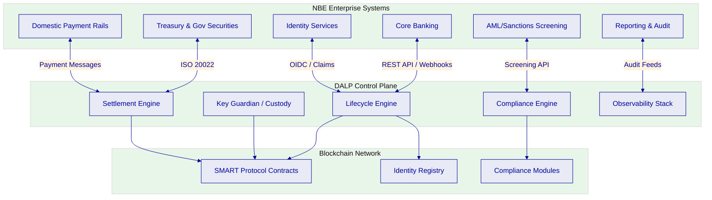

*Figure 2: Proposed solution architecture showing DALP as the control plane between NBE's enterprise systems and the blockchain network, with clearly defined integration boundaries.*

### Why SettleMint

SettleMint is the digital asset lifecycle platform company for regulated financial markets and sovereign use cases. With nearly a decade of focused experience building blockchain infrastructure for the most demanding institutional environments, SettleMint brings three reinforcing advantages to this engagement.

**Production-proven credentials.** Multi-year continuous production deployments with regulated banks in Asia, Europe, and the Middle East, including sovereign and national-scale programmes. SettleMint is one of the few platforms powering country-scale tokenization initiatives, including the Saudi Real Estate Registry programme under REGA and Vision 2030.

**Middle East and Africa expertise.** Active deployments and engagements across the region, including the Islamic Development Bank (subsidy distribution across 57 member countries), Maybank (FX tokenization and cross-border settlement), ADI Finstreet (tokenized equity on Abu Dhabi mainnet), and the Saudi RER programme. SettleMint understands the regulatory, operational, and cultural context of the region.

**Institutional delivery discipline.** SettleMint's team combines deep blockchain engineering, financial domain knowledge, and enterprise delivery expertise. Deployments have passed security reviews, penetration testing, and vendor risk assessments at large financial institutions. The team speaks the language of architecture review boards, compliance committees, and procurement panels.

| Category | Evidence |
| --- | --- |
| Market Validation | Nearly 10 years focused on blockchain infrastructure; 7+ years of continuous production deployments at regulated banks |
| Operational Maturity | Live deployments across bonds, equities, deposits, stablecoins, real estate, funds; security and compliance validated |
| Sovereign Credibility | Active sovereign and national-scale programmes in the Middle East |
| Regional Presence | Active engagements with Islamic Development Bank, Saudi RER, ADI Finstreet, Maybank |
| Team Depth | 200+ years combined banking and blockchain experience across the team |

### Why DALP

DALP is purpose-built for precisely the challenge NBE faces: moving from tokenization ambition to regulated, auditable institutional infrastructure that satisfies regulators, operations teams, and internal audit simultaneously.

The platform's composable architecture is its defining characteristic. A single audited token contract (DALPAsset) can represent any financial instrument through runtime configuration of up to 32 pluggable token features, 12 compliance module types, customizable metadata schemas, and operational add-ons. Both the token's economic behaviour and the compliance rules that govern it are independently selectable, composable, and reconfigurable post-deployment without redeploying the token itself. This means NBE can start with a targeted instrument type and expand into additional asset classes, compliance postures, and participant models without re-engineering the underlying infrastructure.

DALP's five lifecycle pillars (Issuance, Compliance, Custody, Settlement, Servicing) are integrated under a single registry, a single audit trail, and a single operational interface. This eliminates the integration tax that comes from assembling separate tools for each lifecycle stage and provides the unified control plane that NBE's operations, risk, and audit teams require.

### Reference Fit Snapshot

| Reference | Geography | Asset Class | Relevance to NBE |
| --- | --- | --- | --- |
| Islamic Development Bank | 57 member countries (Middle East, Africa, Asia) | Subsidy distribution, Sharia-compliant instruments | Islamic finance governance, multi-entity distribution, regional regulatory context |
| Saudi RER (Real Estate Registry) | Saudi Arabia | Real estate tokenization at national scale | Sovereign-grade infrastructure, government system integration, registry-as-truth model |
| State Bank of India | India | CBDC infrastructure | Central bank-grade scalability, national payment integration, financial inclusion |

---

## About SettleMint

### Company Overview

SettleMint is the digital asset lifecycle platform company for regulated financial markets and sovereign use cases. Founded nearly a decade ago, SettleMint has grown from an early enterprise blockchain infrastructure provider into the category-defining platform company enabling financial institutions, market infrastructure providers, and sovereign entities to move real-world value on-chain with compliance, security, and operational reliability.

SettleMint exists to solve the complexity of doing digital assets right. Tokenization technology is increasingly accessible, but the hard problems, regulatory compliance, key management, asset lifecycle operations, settlement logic, auditability, remain genuinely difficult to get right. Most institutions underestimate this complexity until they are deep in implementation. SettleMint's mission is to enable regulated institutions to move from slides to balance sheets, absorbing infrastructure complexity so they can focus on their business.

### History and Market Position

SettleMint's evolution reflects the broader maturation of the digital asset market. During the early enterprise blockchain era, SettleMint built foundational distributed ledger infrastructure for some of the world's most demanding enterprise environments, spanning financial services, supply chains, telecoms, and government entities. As financial institutions moved beyond proof-of-concept, SettleMint deepened its focus on the regulatory, governance, and operational requirements that separate pilot projects from production infrastructure. Multi-year continuous production deployments with regulated banks in Asia and Europe established SettleMint's credentials in compliance-heavy environments.

Recognising that the market needed more than issuance tools or custody solutions, SettleMint consolidated years of production experience into DALP, the Digital Asset Lifecycle Platform, providing end-to-end coverage from asset design through issuance, compliance enforcement, custody integration, settlement, servicing, and retirement.

| Era | Focus | Outcome |
| --- | --- | --- |
| Enterprise Blockchain (early years) | Foundational DLT infrastructure for enterprises | Global delivery across financial services, telecom, government |
| Institutional Adoption | Regulatory, governance, and operational maturity | Multi-year production deployments with regulated banks |
| Digital Asset Lifecycle | End-to-end platform for regulated digital assets | DALP platform covering full lifecycle under unified governance |

### Production Credentials

| Category | Evidence |
| --- | --- |
| Production Deployments | 7+ years of continuous production at regulated banks |
| Asset Classes in Production | Bonds, equities, deposits, stablecoins, real estate, funds, precious metals |
| Sovereign Programmes | National-scale infrastructure in the Middle East |
| Security Validation | Penetration testing, security reviews, and vendor risk assessments at large financial institutions |
| Reference Count | 14 named reference projects across multiple jurisdictions |

### Regulatory Readiness

SettleMint's platform is built for regulated environments from day one. Rather than treating compliance as an afterthought, SettleMint embeds regulatory controls, policy enforcement, and auditability into the core architecture of DALP.

The platform supports compliance frameworks across multiple jurisdictions, including the European Union (MiCA, GDPR), United States (Reg D, Reg S, Reg CF), Singapore (MAS framework), United Kingdom (FCA requirements), Japan (FSA compliance), and Gulf Cooperation Council regional frameworks including Islamic finance compatibility and Sharia-compliant structures.

For NBE, the most relevant regulatory controls map to Egyptian requirements: CBE supervisory expectations for banking operations, FRA obligations where capital markets activities arise, AML Law 80/2002 for transaction monitoring and sanctions screening integration, Personal Data Protection Law 151/2020 for data residency and retention, and Banking Law 194/2020 for governance and outsourcing controls.

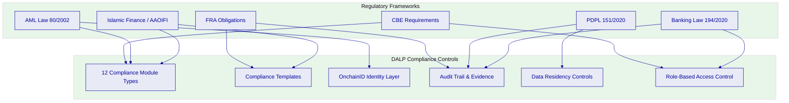

*Figure 3: Mapping of Egyptian regulatory requirements to DALP's compliance control surface, showing how each regulatory obligation is addressed through specific platform capabilities.*

*Figure 4: DALP compliance policy template library, showing reusable compliance configurations that can be tailored to Egyptian regulatory requirements including CBE and FRA obligations.*

### Team and Delivery Capability

The team behind SettleMint combines deep expertise across blockchain engineering, financial markets, and enterprise delivery. The core team brings together decades of combined experience in financial services (banks, market infrastructure, fintech), enterprise software and SaaS, and blockchain R&D and protocol-level work.

Dedicated solution architects, delivery leads, and customer success teams have implemented tokenization and DLT solutions in multiple jurisdictions and navigated internal processes such as security review, vendor onboarding, and change control with large institutions. This mix enables SettleMint to speak the language of CIOs and architects (integration, resilience, scalability), COOs and product owners (operational workflows, business cases), and risk, compliance, and legal functions (controls, governance, regulatory fit).

### Ecosystem and Partnerships

SettleMint has built a partner ecosystem to scale implementations and support local requirements across Europe, MENA, and Asia-Pacific, combining local regulatory and market knowledge with a consistent global platform. This includes partnerships with global consultancies, regional system integrators providing local market knowledge and implementation capacity, institutional custody platforms (Fireblocks, DFNS), and payment rail infrastructure supporting ISO 20022 for SWIFT, SEPA, and RTGS connectivity.

### Why Relevant to This Bid

NBE's procurement requires a supplier that understands national-scale banking infrastructure, conservative regulatory perimeter management, and the practical realities of deploying within Egyptian institutional governance frameworks. SettleMint's track record with sovereign entities, central bank engagements (State Bank of India CBDC infrastructure, Reserve Bank of India Innovation Hub), and Islamic finance institutions (Islamic Development Bank) demonstrates precisely this capability.

The combination of Middle East regional presence, experience with government system integration (Saudi RER programme integrating with core registry, billing, escrow, and government systems), and production deployments in jurisdictions with strong data sovereignty requirements positions SettleMint as a credible partner for an institution of NBE's scale and regulatory sensitivity.

---

## About DALP

### Platform Overview

DALP is SettleMint's Digital Asset Lifecycle Platform for designing, launching, and operating tokenized assets across financial instruments and real-world assets. It encapsulates the complexity of doing digital assets right: regulatory compliance, key management, asset lifecycle operations, settlement logic, and auditability, so institutions can launch without building blockchain expertise internally and without lengthy development cycles.

DALP's architecture is built as a four-layer stack. Each layer has a distinct responsibility boundary, and layers communicate through well-defined interfaces.

| Layer | Role | Key Components |
| --- | --- | --- |
| Application | User-facing interfaces for operators, issuers, and compliance officers | Asset Console (web UI) |
| API | Programmatic access surface for external systems and integrations | Unified API (OpenAPI 3.1), TypeScript SDK |
| Middleware | Workflow orchestration, transaction lifecycle, key management, indexing | Execution Engine, Key Guardian, Transaction Signer, Chain Indexer |
| Smart Contract | On-chain enforcement of compliance, identity, and asset logic | SMART Protocol (ERC-3643), DALPAsset contracts, compliance modules |

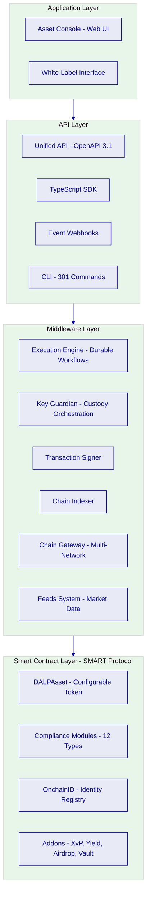

*Figure 5: DALP four-layer platform architecture showing the separation of concerns from user-facing interfaces through API and middleware to on-chain smart contract enforcement.*

### Core Lifecycle Pillars

DALP is structured around five integrated core lifecycle modules, each deployable independently or as part of a unified platform.

**Issuance.** Rapid deployment of tokenized assets across seven asset classes (bonds, equities, funds, deposits, stablecoins, real estate, precious metals), each with purpose-built lifecycle logic. The Asset Designer wizard provides configurable business rules, compliance controls, and term structures per asset class. DALP also supports a Configurable Token type for novel instruments, using a composable architecture with up to 32 pluggable features per token, added or reordered post-deployment without redeploying the token itself.

**Compliance.** Ex-ante enforcement ensures every transfer is validated before execution, not reviewed after. DALP's compliance architecture includes 12 compliance module types covering country restrictions, investor accreditation, supply limits, holding periods, collateral backing, transfer controls, and more. The ERC-3643 (T-REX) regulated token standard ensures compliance travels with the token, not just the platform. OnchainID provides verifiable, on-chain investor identities with claim-based verification reusable across all assets.

**Custody.** Key management workflows with bring-your-own-custodian integrations. DALP orchestrates custody policy across existing custodian relationships without acting as a custodian itself. Key Guardian supports multiple storage backends: encrypted database, cloud secret manager, HSM, and third-party custody via Fireblocks and DFNS. Maker-checker approval workflows with configurable multi-signature quorum enforce institutional governance.

**Settlement.** Atomic Delivery-versus-Payment (DvP) and Exchange-versus-Payment (XvP) settlement for asset and cash legs. Both complete together or revert together, eliminating counterparty risk and reconciliation gaps. Local (same-chain) and HTLC (cross-chain) settlement models are supported, with ISO 20022 integration for SWIFT, SEPA, and RTGS connectivity on payment rails.

**Servicing.** Automated lifecycle operations (coupon payments, yield distribution, dividend processing, redemptions, maturity handling) executed programmatically across every asset type. This is the operational capability most platforms lack entirely: managing the asset from issuance through every event in its lifecycle to retirement.

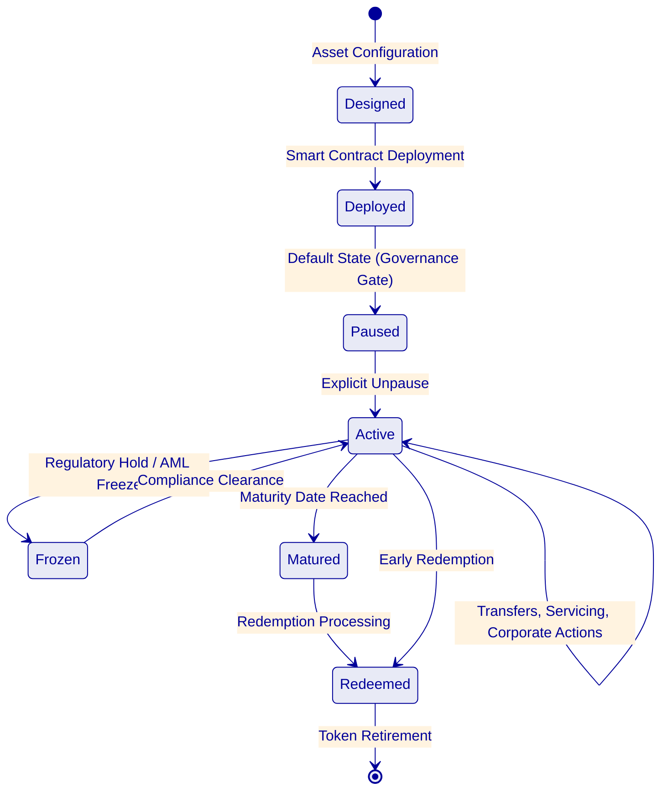

*Figure 6: Asset lifecycle state machine showing the governance-controlled progression from design through deployment, active operations, and eventual redemption or retirement.*

### Platform Foundations

Beneath the five lifecycle pillars, DALP provides three cross-cutting platform foundations.

**Identity and Access Management.** OnchainID provides verifiable, on-chain investor identities. The Identity Registry manages verified profiles with claim-based verification, reusable across all assets and transactions. RBAC governs every action with five defined roles, from token issuance to transfer approval. KYC/KYB profile management includes structured review workflows with deterministic remediation loops.

**Integration and Interoperability.** DALP provides typed REST APIs (OpenAPI 3.1), GraphQL, event webhooks, and oRPC for programmatic access to every platform capability. The TypeScript SDK, a CLI with 301 commands across 26 groups, payment rail connectivity supporting ISO 20022, bring-your-own-custodian integrations, and multi-provider object storage support ensure the platform operates within existing institutional environments rather than replacing them.

**Observability and Operations.** Pre-built dashboards covering operations overview, transaction monitoring, compliance activity, and security events. Three-pillar observability (metrics, logs, traces) with distributed tracing across the full transaction lifecycle. 534 structured error codes with metadata, internationalisation translations in four locales, and automated alerting.

### Supported Asset Classes and Operating Scope

| Asset Class | Lifecycle Features | Relevance to NBE |
| --- | --- | --- |
| Bonds | Automated coupon schedules, maturity logic, call/put options | Government securities, corporate bonds |
| Equities | Dividend distribution, voting rights, corporate actions | Equity market modernisation |
| Funds | NAV integration, fractional units, fee structures, subscription/redemption | Fund management infrastructure |
| Deposits | Programmable interest, maturity, withdrawal rules | Tokenized deposit instruments |
| Stablecoins | Reserve monitoring, attestation, multi-currency support | CBE digital currency considerations |
| Real Estate | Title tokenization, fractional ownership, rental income distribution | Property market digitisation |
| Precious Metals | Asset-backed tokens, provenance tracking | Gold-backed instruments |
| Configurable Token | Up to 32 pluggable features for novel asset classes | Future instrument types |

### Standards and Protocols

| Category | Standards |
| --- | --- |
| Token Standards | ERC-20, ERC-721, ERC-1400, ERC-3643 (T-REX), ERC-5805, EIP-2612 |
| Identity | OnchainID, claim-based verification |
| Account Abstraction | ERC-4337 smart accounts, ERC-7579 modular validation |
| Compliance | 12 module types across eligibility, restrictions, transfer controls, issuance/supply, time-based rules, settlement/collateral |
| Settlement | Atomic DvP/XvP, HTLC cross-chain |
| Payment Rails | ISO 20022 (SWIFT, SEPA, RTGS) |
| Blockchain Networks | Any EVM-compatible network (public or private) |

### Key Differentiators

DALP's moat is the combination of five capabilities that no competitor currently offers together.

| Differentiator | DALP Approach | Generic Alternative |
| --- | --- | --- |
| Lifecycle Coverage | Full lifecycle from issuance through servicing to retirement in one platform | Assemble separate tools for each stage; coordination overhead and unclear ownership |
| Compliance Model | Ex-ante enforcement via 12 composable module types; compliance travels with the token | Application-layer checks that can be bypassed; post-trade review |
| Settlement | Atomic DvP/XvP where both legs complete or both revert | Sequential settlement with counterparty risk and reconciliation gaps |
| Deployment | On-premises, cloud, or hybrid with identical capabilities | Cloud-only or limited on-premises support |
| Composability | Runtime-pluggable token features and compliance modules; evolve without redeploying | Compile-time configuration; changes require new deployments |

### Relevance to NBE's Scope

DALP's strengths map directly to NBE's stated bid priorities. The platform's composable architecture addresses the requirement for configurable lifecycle states and policy controls (REQ-04). The ex-ante compliance engine directly supports evidence extraction for audit and supervisory review (REQ-08). The multi-environment support addresses segregated dev, test, UAT, DR, and production environments (REQ-01). The API-first design with typed interfaces and event webhooks addresses enterprise integration requirements (REQ-02). And the on-premises deployment option with Egyptian data residency addresses data sovereignty under the Personal Data Protection Law 151/2020.

---

## Customer References

### Summary Table

| Company | Use Case | Geography | Asset Theme | Relevance to NBE |
| --- | --- | --- | --- | --- |
| OCBC Bank | Security token engine | Singapore/Asia | Multi-asset tokenization | Institutional banking, asset tokenization |
| KBC Securities (Bolero) | Equity crowdfunding + SME loans | Belgium/Europe | Equity, loans | Lifecycle automation, compliance |
| Standard Chartered Bank | Digital Virtual Exchange | Asia, Africa, Middle East | Fractional securities | Regional presence, institutional trading |
| Reserve Bank of India | Multi-bank trade finance | India | Trade finance | Central bank engagement, multi-party |
| Sony Bank | Stablecoin with digital identity | Japan | Stablecoin | KYC-enabled digital banking |
| State Bank of India | CBDC infrastructure | India | Central bank digital currency | National-scale, payment modernisation |
| Islamic Development Bank | Subsidy distribution | 57 member countries | Sharia-compliant distribution | Islamic finance, multi-country |
| Mizuho Bank | Bond tokenization | Japan | Bonds | Institutional bond lifecycle |
| IsDB (Market Stabilization) | Sharia-compliant stabilization | Multi-country | Collateral management | Islamic finance governance |
| Maybank (Project Photon) | FX tokenization, XvP settlement | Malaysia | FX, cross-border | Atomic settlement, tokenized fiat |
| ADI Finstreet | Tokenized equity | Abu Dhabi/UAE | Equity | GCC context, institutional custody |
| Commerzbank | Hybrid ETP issuance | Germany | Exchange-traded products | Regulated exchange listing, near-real-time settlement |
| Saudi RER | National real estate tokenization | Saudi Arabia | Real estate | Sovereign-scale, government integration |
| KBC Insurance | NFT asset passports | Belgium | Insurance-linked assets | Asset evidence, digital identity |

### Relevance Selection Logic

Three references have been selected for expanded treatment based on their alignment with NBE's specific context: sovereign-scale deployment in the Middle East (Saudi RER), Islamic finance governance across multiple countries (Islamic Development Bank), and central bank-grade infrastructure at national scale (State Bank of India). These references demonstrate SettleMint's capability to deliver within the regulatory, cultural, and operational context most relevant to NBE.

### Islamic Development Bank: Subsidy Distribution

The Islamic Development Bank engaged SettleMint to build a blockchain-based subsidy distribution system spanning 57 member countries. The challenge was replacing inefficient analogue processes with a transparent, Sharia-compliant digital distribution mechanism that could operate across diverse regulatory environments and deliver funds directly to beneficiaries.

SettleMint delivered a digitised subsidy delivery platform enabling direct peer-to-peer distribution of funds, automating administrative and legal processes while maintaining full visibility and control over subsidy spending. The platform supports Sharia-compliant governance requirements, including approval lineage, prohibited activity restrictions, and evidence capture for committee review.

This reference is directly relevant to NBE because it demonstrates SettleMint's ability to operate within Islamic finance governance frameworks, manage multi-entity distribution at scale, and deliver financial inclusion infrastructure across the Middle East and Africa region. The governance evidence model (board approval lineage, product rule controls, documentation treatment) maps directly to the operational governance requirements NBE has outlined.

### Saudi Real Estate Registry (RER)

The Saudi Real Estate Registry programme represents the first country-scale blockchain infrastructure dedicated to real estate registration, fractionalization, and digital marketplace. Operated by the Real Estate Registry under the Real Estate General Authority (REGA), the programme is central to the Kingdom's digital transformation under Vision 2030.

SettleMint serves as delivery partner for the end-to-end solution: marketplace services, API gateway, blockchain and tokenization layer powered by DALP, and orchestration and integration with RER's core registry, billing, escrow, case worker, and government systems. The programme follows a "registry-as-truth" model where the RER ledger serves as the conclusive record of property rights.

This reference demonstrates SettleMint's capability to deliver sovereign-grade infrastructure that integrates with existing government systems, operates under strong data sovereignty requirements, and supports the full journey from listing and due diligence through identity verification, fee payment, escrow, and on-chain transfer. For NBE, the Saudi RER programme is the closest analogue to what a national-scale digital asset programme in Egypt would require: institutional control, policy configurability, government system integration, and sovereign-grade auditability.

### State Bank of India: CBDC Infrastructure

The State Bank of India, India's largest bank, engaged SettleMint to build CBDC infrastructure for a secure, scalable digital currency system. The pilot has been successfully completed and work is in progress for production deployment.

The programme addresses reduced reliance on cash, fraud risk minimisation, faster and more cost-effective transactions, expanded financial access for underserved populations, and cheaper cross-border payments. With projections of over a billion daily digital transactions, the platform is positioned for national scale.

This reference is relevant to NBE because it demonstrates SettleMint's ability to deliver central bank-grade infrastructure at the scale of a national banking system. The security, scalability, and operational resilience requirements of a CBDC programme exceed those of most institutional deployments, and SettleMint's ability to operate at this level provides assurance for NBE's digital asset infrastructure programme.

### Reference Fit Matrix

| Reference | NBE Requirement Area | Why Relevant | Evidence It Supports |
| --- | --- | --- | --- |
| Islamic Development Bank | Regulatory mapping (RC-01), Sharia governance | Islamic finance governance, multi-entity distribution | Compliance configurability, governance evidence |
| Saudi RER | Integration (REQ-02), Data governance (RC-03), Operational resilience (RC-04) | Sovereign-grade infrastructure, government system integration | Enterprise integration capability, data sovereignty |
| State Bank of India | Architecture (REQ-01), Resilience (REQ-06), Scale | National-scale deployment, central bank requirements | Production scalability, security validation |

---

## Understanding of Requirements

### Client Context

National Bank of Egypt is Egypt's largest bank and a systemically important institution within the Egyptian financial system. NBE's decision to procure digital asset core infrastructure reflects a strategic objective to modernise institutional financial services while maintaining the rigorous control environment expected by the Central Bank of Egypt, the Financial Regulatory Authority, and NBE's own governance structures.

The programme's transformation drivers include Egypt's evolving regulatory posture on digital financial services, the need to modernise settlement and securities infrastructure, growing institutional demand for digitised instruments, and the competitive pressure to establish digital asset capabilities before regional peers. The target users span multiple institutional functions: product management, first-line operations, compliance oversight, treasury, information security, platform administration, and executive leadership.

### Requirement Domains

| Domain | NBE Requirement | Implied Complexity | DALP Coverage |
| --- | --- | --- | --- |
| Product and Asset Scope | Configurable lifecycle states, policy controls, limits (REQ-04) | Multi-asset support with asset-specific lifecycle logic | 7 pre-built asset templates plus configurable token; runtime-pluggable features |
| Identity and Onboarding | Participant supervision, eligibility checks (REQ-19) | Integration with existing KYC/AML systems; compliance with PDPL 151/2020 | OnchainID with claim-based verification; external KYC/KYB integration |
| Compliance and Control | RBAC, segregation of duties, maker-checker, audit logs (REQ-03) | Multi-layer enforcement across CBE, FRA, AML requirements | 5-role RBAC, dual-layer authorisation, wallet verification, immutable audit trails |
| Settlement and Cash Leg | Atomic settlement with domestic payment rail integration | Integration with Egyptian payment infrastructure | Atomic DvP/XvP; ISO 20022 connectivity |
| Integration and Reporting | API-first interfaces, eventing, version governance (REQ-02) | Coexistence with core banking, treasury, AML, reporting systems | Typed REST API (OpenAPI 3.1), webhooks, SDK, CLI |
| Infrastructure and Operations | Segregated environments, resilience, recovery (REQ-01, REQ-06) | On-premises deployment within Egyptian data centres | Helm-based deployment; multi-environment support; observability stack |

### Key Challenges Identified

**Challenge 1: Control integrity across the digital asset lifecycle.** NBE's evaluation team must be confident that every action on a digital asset is attributable to a named actor, governed by an explicit policy, and evidenced in a format that internal audit and supervisory reviewers can reconstruct. The complexity lies not in recording events, but in ensuring that the control model is enforced consistently across every lifecycle stage, including the boundary conditions: rejected transactions, stale approvals, mismatched data, delayed settlement, and corrected records.

**Challenge 2: Coexistence with existing enterprise systems.** The selected solution cannot become a reconciliation sinkhole that generates more manual work than it removes. NBE operates a complex enterprise landscape including core banking, treasury and government-securities systems, AML controls, and large-scale citizen and corporate servicing channels. The digital asset platform must integrate with authoritative systems of record, maintain consistent event sequencing, and detect breaks before they become unresolved ledger differences or customer-impacting incidents.

**Challenge 3: Phased scalability without platform reset.** NBE needs to move from a contained initial launch to broader adoption across additional products, participant types, and operating models without fundamental rework. Configuration choices made in phase one must not create expensive downstream constraints, and the governance model must remain stable as scope expands.

**Challenge 4: Egyptian regulatory compliance as a structural property.** Compliance with CBE requirements, FRA obligations, Banking Law 194/2020, AML Law 80/2002, and Personal Data Protection Law 151/2020 cannot be treated as a checklist exercise. The platform must embed regulatory controls into its execution path, support Arabic reporting where required, enforce data sovereignty within Egyptian borders, and produce the evidence artifacts that each regulatory body expects.

**Challenge 5: Multi-stakeholder governance.** NBE's evaluation panel includes architecture, security, compliance, treasury, risk, procurement, and potentially Sharia governance stakeholders. The selected solution must satisfy each stakeholder's specific concerns simultaneously, not trade one domain's confidence for another's risk.

### Requirement Prioritisation

| Priority | Requirements | Assessment |
| --- | --- | --- |
| Mandatory | REQ-01 through REQ-08 (Architecture, API, RBAC, Lifecycle, Dependencies, Resilience, Delivery, Audit) | All addressed through native DALP capabilities and standard delivery methodology |
| High | REQ-18 (Configuration governance, observability), REQ-19 (Participant supervision, policy analytics) | Addressed through DALP's governance controls, observability stack, and compliance modules |
| Mandatory | RC-01 through RC-06 (Regulatory mapping, AML/CFT, Data governance, Resilience, Outsourcing, Assurance) | Addressed through platform controls mapped to Egyptian regulatory context |

### Response Principles

SettleMint's response to this procurement is guided by five principles that reflect NBE's stated priorities.

**Control before speed.** Every capability described in this proposal is production-ready and evidence-backed. No roadmap items are presented as current capabilities.

**Reuse before fragmentation.** DALP provides a single platform for the full lifecycle rather than requiring NBE to assemble and integrate separate point solutions.

**Phased delivery with governance gates.** The implementation methodology includes formal acceptance criteria at each phase, accommodating NBE's internal review processes.

**Evidence-led compliance.** The platform produces the audit trails, control evidence, and reporting artifacts that CBE, FRA, and internal audit require, embedded in the execution path rather than assembled after the fact.

**Operational honesty.** Where capabilities depend on integration, configuration, or client policy decisions, this proposal states those boundaries explicitly. Where gaps exist, they are disclosed directly with compensating controls or integration pathways.

---

## Proposed Solution and Functional Capabilities

### Solution Overview

The proposed solution positions DALP as the digital asset control plane within NBE's enterprise architecture. DALP sits between NBE's existing core systems (core banking, treasury, AML/sanctions, identity, reporting, domestic payment rails) and one or more EVM-compatible blockchain networks. The platform provides the identity verification, compliance enforcement, transaction orchestration, custody integration, lifecycle automation, and operational tooling that turn tokenization into an operating model rather than a one-off issuance exercise.

The deployment model recommended for NBE is on-premises within NBE's data centres, meeting Egyptian data sovereignty requirements. DALP's Helm-based deployment supports Kubernetes clusters in on-premises environments with the same platform capabilities available in cloud deployments. Development and UAT environments can be provisioned alongside production within NBE's infrastructure, with full environment segregation.

The target asset scope for the initial phase should be determined during the discovery and requirements phase, but DALP's seven pre-built asset templates (bonds, equities, funds, deposits, stablecoins, real estate, precious metals) and configurable token type provide coverage for any instrument NBE chooses to prioritise. The compliance framework will be configured to enforce CBE requirements, FRA obligations, and AML Law 80/2002 controls through DALP's 12 compliance module types.

### Issuance and Asset Configuration

DALP's composable token architecture is the foundation for NBE's digital asset infrastructure. A single audited token contract (DALPAsset) can represent any financial instrument through runtime configuration. This architecture eliminates the need to commit to a specialised contract type at deployment time and allows tokens to evolve post-deployment without redeployment.

The composability operates at three layers. The DALPAsset contract provides the base instrument container with ERC-3643 compliance hooks. Token features (up to 32 per token) define the instrument's economic behaviour: fees, yield, governance, maturity, conversion, voting power, and more. These features integrate through six lifecycle hooks (mint, burn, transfer, redeem, update, attach) and can be selected, ordered, and reconfigured at runtime under governance-role control. Compliance modules (12 types across six categories) define the regulatory posture: who can hold, where they can trade, how much can be issued, what approvals are needed. Both layers are independently composable and reconfigurable post-deployment.

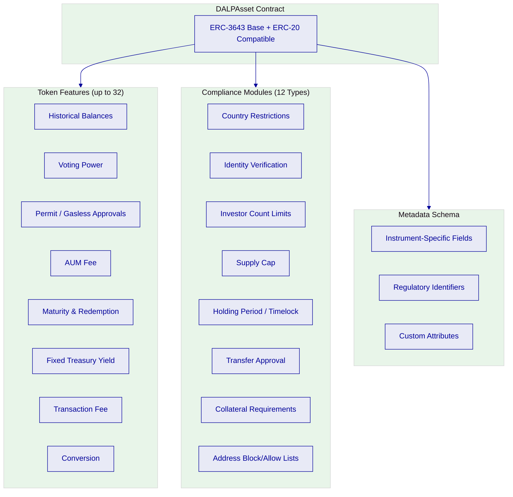

*Figure 7: Composable token architecture showing the three configuration layers: DALPAsset base contract, pluggable token features, and composable compliance modules, all independently selectable and reconfigurable at runtime.*

For NBE, this means the platform can support government securities with automated coupon schedules and maturity logic, corporate bonds with configurable term structures, tokenized deposits with programmable interest and withdrawal rules, or any other instrument type, all from the same contract architecture and under the same governance model. New instrument types can be added post-launch by selecting different feature and compliance module combinations, without re-engineering the underlying infrastructure.

The token feature execution pipeline ensures deterministic processing. When a lifecycle event occurs (mint, transfer, redeem), the platform processes features in their configured order through a defined hook sequence: pre-hooks validate preconditions, the core operation executes, and post-hooks handle downstream effects. This deterministic ordering is critical for regulated environments because it ensures that audit evidence reflects the actual execution sequence and that compliance checks occur before, not after, state changes.

*Figure 8: DALP Asset Designer wizard, the configuration interface through which NBE's product and operations teams would define instrument parameters, compliance rules, and lifecycle logic without blockchain development expertise.*

### Identity and Eligibility

DALP's identity layer is built on OnchainID, an implementation of the ERC-734/735 standard for verifiable on-chain identity. Every participant in NBE's digital asset programme (issuers, investors, counterparties, institutional participants) is represented by an on-chain identity contract that stores verified claims (KYC/KYB credentials, accreditation status, jurisdictional eligibility) issued by trusted claim issuers.

The Identity Registry manages verified profiles with claim-based verification that is reusable across all assets and transactions. When a transfer is initiated, the compliance engine queries the identity claims of both sender and receiver to verify eligibility before the transaction can execute. This is not an application-layer check that can be bypassed; it is enforced by the smart contract itself.

For NBE's context, this architecture supports integration with existing KYC/AML systems through DALP's identity claim framework. External KYC providers issue verified claims to on-chain identities, and the platform enforces those claims during every transfer. The system supports structured review workflows (approve, reject, request-update) with deterministic remediation loops, ensuring that onboarding is traceable and auditable.

RBAC governs every platform action through five defined roles: governance, supply management, custodian, emergency, and admin. These roles enforce segregation of duties at both the platform level and the per-asset level, ensuring that operational, compliance, and administrative functions are governed independently, directly addressing REQ-03.

### Compliance Enforcement

Compliance enforcement in DALP operates on an ex-ante model: every transfer is validated against the full set of configured compliance modules before execution. If any module returns a failure, the transaction is rejected and no state change occurs. This is the fundamental difference between DALP's approach and platforms that perform compliance as a post-trade review.

The compliance engine evaluates transfers through a configurable set of 12 module types across six categories:

| Category | Module Types | NBE Application |
| --- | --- | --- |
| Eligibility | Identity verification, country allowlist/blocklist | Investor eligibility under Egyptian securities law |
| Restrictions | Address block/allow lists, identity block/allow lists | Sanctions screening integration, restricted parties |
| Transfer Controls | Transfer approval workflow | Maker-checker enforcement for high-value transfers |
| Issuance/Supply | Supply cap, investor count limits, token supply limit | Issuance governance, placement controls |
| Time-Based Rules | Holding period, timelock restrictions | Lock-up enforcement, vesting schedules |
| Settlement/Collateral | Collateral requirements | Asset-backed issuance controls |

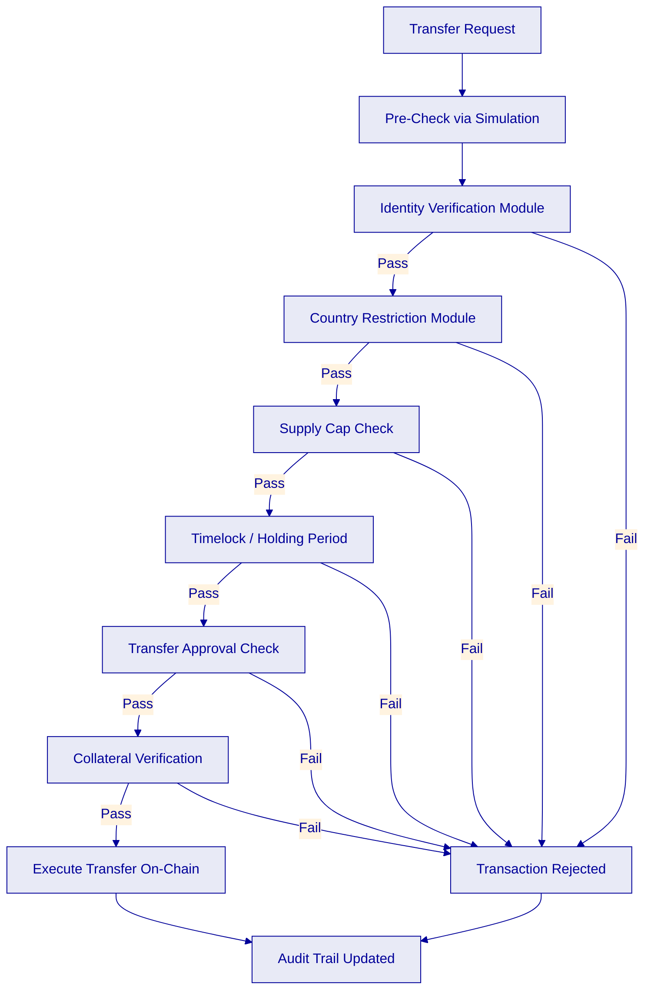

*Figure 9: Compliance evaluation flow showing the sequential check through configured compliance modules. Each module must pass before the transfer executes; failure at any point results in rejection with a full audit trail.*

The compliance modules compose through fail-closed AND logic: all configured modules must pass for a transfer to proceed. Modules can be added, removed, or reconfigured at runtime under governance-role control, which means NBE can update compliance rules as Egyptian regulations evolve without redeploying token contracts or disrupting live operations.

For NBE, this architecture directly supports CBE supervisory expectations. The platform can evidence which policy checks applied to every transaction, who initiated the transfer, who approved it (for maker-checker workflows), and why a transfer was rejected. This evidence is available through structured audit logs and exportable evidence packs, directly addressing REQ-08 and RC-06.

### Transfer, Settlement, and Cash-Leg Coordination

DALP provides atomic Delivery-versus-Payment (DvP) and Exchange-versus-Payment (XvP) settlement. Atomic settlement means the asset leg and the cash leg complete together or both revert together. There is no intermediate state where one party has delivered but the other has not. This eliminates counterparty risk and reconciliation gaps that plague sequential settlement models.

Settlement models include local (same-chain) settlement for transactions where both legs reside on the same network, and HTLC (Hash Time-Locked Contract) settlement for cross-chain transactions where assets reside on different networks. Deterministic settlement closure ensures every settlement reaches an auditable end-state: executed, cancelled, or expired-withdrawn. Closure-readiness checks prevent premature or inconsistent state transitions.

For integration with Egyptian domestic payment infrastructure, DALP's ISO 20022 connectivity supports payment messaging standards used by SWIFT, SEPA, and RTGS systems. The cash leg of settlement transactions can be coordinated with NBE's treasury and payment systems through standard payment messages, maintaining consistency between on-chain asset movement and off-chain cash settlement.

*Figure 10: DALP XvP settlement setup interface showing the configuration of atomic exchange parameters, counterparty details, and settlement conditions.*

### Lifecycle Servicing and Corporate Actions

DALP automates lifecycle operations across every asset type, covering the operational layer that most tokenization platforms lack entirely. Servicing capabilities include automated coupon payments (for bonds and fixed-income instruments), yield distribution (for fund and deposit instruments), dividend processing (for equity instruments), maturity and redemption handling (with treasury payout abstraction supporting both externally-owned accounts and contract-based treasuries), and distribution mechanisms including token sale, airdrop systems (push, time-bound, vesting), and claim fulfilment workflows.

Each servicing event is orchestrated through durable workflows that survive process restarts and infrastructure failures. The execution engine ensures exactly-once semantics, meaning a coupon payment or redemption event will not be duplicated or lost even if infrastructure fails mid-execution. Every servicing event generates an audit trail entry, enabling NBE's operations and compliance teams to track distribution accuracy, timing, and recipient eligibility.

For NBE, this means that once an instrument is configured with its lifecycle parameters (coupon schedule, maturity date, distribution rules), the platform handles servicing programmatically. Operations teams monitor and approve events through the platform interface rather than executing manual calculations and payments.

### Integration and Interoperability

DALP is designed to operate within existing institutional environments, not replace them. The platform's integration architecture provides multiple connectivity methods suited to different enterprise integration patterns.

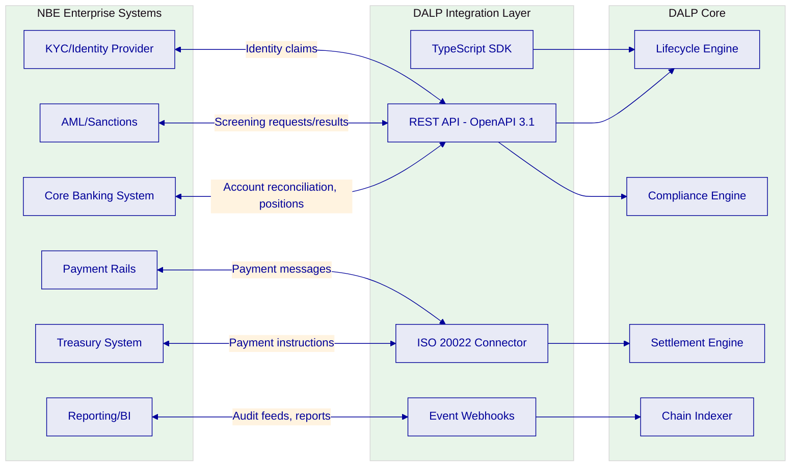

*Figure 11: Integration architecture showing DALP's connectivity with NBE's enterprise systems through typed REST APIs, event webhooks, TypeScript SDK, and ISO 20022 connectors.*

| Integration Method | Protocol | Use Case | Authentication |
| --- | --- | --- | --- |
| REST API | OpenAPI 3.1 | Core banking, AML, identity, reporting integration | API keys (scoped, rate-limited) |
| Event Webhooks | HTTPS callbacks | Real-time event notifications to downstream systems | Configured per endpoint |
| TypeScript SDK | npm package | Application development, automation scripts | API keys |
| CLI | Terminal | System administration, operational tasks | Device authentication |
| ISO 20022 | SWIFT/SEPA/RTGS | Payment rail connectivity for cash-leg settlement | Standards-based |

API versioning follows backward-compatible principles. Breaking changes are versioned, consumers are notified, and test environments reflect production API behaviour. This directly addresses REQ-02's requirement for version governance suitable for enterprise integration.

### Functional Fit Matrix

| Req ID | Requirement Summary | Response Status | DALP Capability | Notes |
| --- | --- | --- | --- | --- |
| REQ-01 | Segregated dev, test, UAT, DR, production environments | Full | Helm-based multi-environment deployment with isolated configurations | On-premises deployment within NBE data centres |
| REQ-02 | API-first interfaces, eventing, version governance | Full | OpenAPI 3.1, webhooks, SDK, CLI; versioned API with backward compatibility | 301 CLI commands, typed SDK, 534 error codes |
| REQ-03 | RBAC, segregation of duties, maker-checker, audit logs | Full | 5-role RBAC, dual-layer authorisation, wallet verification, immutable audit trails | 26 distinct roles across four layers |
| REQ-04 | Configurable lifecycle states, policy controls, limits | Full | Runtime-configurable token features (32) and compliance modules (12 types) | Composable architecture; post-deployment reconfiguration |
| REQ-05 | Third-party dependencies and operational responsibilities | Full | Disclosed in this proposal; custody via Fireblocks/DFNS; cloud/infrastructure per deployment model | Dependency register provided |
| REQ-06 | Resilience, recovery, backup, monitoring, incident management | Full | Durable execution engine, multi-zone deployment, observability stack, structured incident management | RTO/RPO targets per deployment model |
| REQ-07 | Delivery method, client effort, phased plan | Full | 6-phase methodology (15-19 weeks), formal gate reviews, RACI matrix | Detailed in Implementation section |
| REQ-08 | Evidence extraction for audit, supervisory review, board reporting | Full | Structured audit logs, exportable evidence packs, compliance event history, operational dashboards | SIEM-compatible log forwarding |
| REQ-18 | Configuration governance, observability, phased environment promotion | Full | Governance-role controlled configuration; three-pillar observability; staged promotion across environments | Change management through governance roles |
| REQ-19 | Participant supervision, policy analytics, sandbox/CBDC controls | Full | Identity Registry with supervision capabilities; compliance module analytics; configurable policy enforcement | Sandbox environment support for testing |

---

## Technical Architecture

### Architectural Principles

DALP's architecture is governed by five principles that are directly relevant to NBE's control environment.

**Lifecycle-first design.** Every component is organised around the asset lifecycle rather than individual features. This ensures that issuance, compliance, custody, settlement, and servicing are integrated by architecture, not bolted together through integration.

**Durable execution.** Multi-step workflows survive process restarts, infrastructure failures, and network partitions through the Execution Engine built on Restate. This ensures that critical operations (issuance, settlement, corporate actions) complete reliably without manual intervention or data loss.

**Defense-in-depth.** Security is enforced at every layer independently. No single-layer failure grants unauthorised access. Authentication, authorisation, wallet verification, on-chain compliance, and custody provider policies each provide independent control gates.

**Separation of concerns.** The four-layer architecture (Application, API, Middleware, Smart Contract) ensures that each layer has a distinct responsibility boundary. This enables independent scaling, testing, and audit of each layer.

**Provider abstraction.** The platform abstracts blockchain networks, custody providers, identity providers, and infrastructure through well-defined interfaces. This enables NBE to change providers (custody, chain, cloud) without re-engineering the platform.

### Layered Architecture

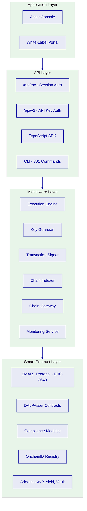

*Figure 12: DALP four-layer architecture with component detail, showing the clear separation of concerns from presentation through API and middleware to on-chain enforcement.*

**Smart Contract Layer.** The on-chain layer enforces compliance, identity, and asset logic through the SMART Protocol (ERC-3643). All DALP smart contracts build on this standard, ensuring that compliance is enforced at the protocol level. The DALPAsset configurable contract type supports runtime-pluggable features and compliance modules through the SMARTConfigurable extension. Deployment uses CREATE2 deterministic addressing with atomic factory transactions.

**Middleware Layer.** The Execution Engine provides durable workflow orchestration with exactly-once semantics. Key Guardian manages cryptographic key material through defense-in-depth with multiple storage backends. The Transaction Signer handles nonce coordination, gas management, and signing. The Chain Indexer processes blockchain events into queryable state projections. The Chain Gateway provides multi-network connectivity with failover.

**API Layer.** The Unified API exposes all platform capabilities through OpenAPI 3.1 with typed interfaces. Two authentication endpoints enforce strict security boundaries: session-based for interactive access, API key-based for programmatic access. The TypeScript SDK and 301-command CLI provide additional integration surfaces.

**Application Layer.** The Asset Console provides the operational interface for asset lifecycle management, compliance workflows, portfolio views, and system monitoring. White-label capability supports custom branding for client-facing interfaces.

### Data Architecture

DALP maintains four distinct data states, each serving a different operational purpose.

| Data State | Purpose | Storage | Characteristics |
| --- | --- | --- | --- |
| Chain State | Authoritative record of asset ownership, compliance status, identity claims | EVM blockchain | Immutable, cryptographically verifiable |
| Application State | Platform configuration, user sessions, workflow state | PostgreSQL | Transactional, encrypted at rest |
| Indexed State | Queryable projections of on-chain events for fast read access | PostgreSQL (Chain Indexer) | Eventually consistent, rebuildable from chain |
| Audit Evidence | Complete evidence trail for regulatory and audit review | Structured logs, exportable packs | Immutable, exportable, SIEM-compatible |

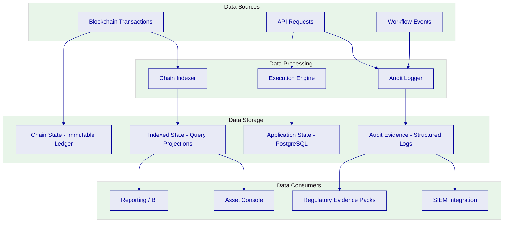

*Figure 13: Data flow architecture showing how data moves from sources through processing to storage and consumers, with clear separation between chain state, application state, indexed projections, and audit evidence.*

For NBE, the separation of data states means that regulatory evidence (audit trail) is maintained independently of operational data. The chain state provides the authoritative, immutable record of asset ownership and compliance events. The indexed state provides fast query access for operational dashboards and reporting. The audit evidence state provides exportable packs for internal audit, CBE supervisory review, and FRA reporting.

### Network and Chain Topology

DALP supports any EVM-compatible blockchain network, public or private. For NBE, the recommended approach is a private, permissioned network deployed within NBE's on-premises infrastructure, providing maximum control over the entire network stack. This approach aligns with Egyptian data sovereignty requirements and NBE's preference for operational resilience and local control.

The platform supports Hyperledger Besu for private/permissioned networks, private Ethereum networks, and other EVM-compatible chains. Multi-chain operation is supported for future expansion, allowing NBE to add additional networks as requirements evolve without changing the governance model or application architecture.

### Multi-Tenancy and Environment Segregation

DALP supports configurable multi-tenancy with tenant isolation enforced at the database query level on every API request. Cross-tenant operations are not possible. Each tenant has isolated membership, roles, assets, compliance records, and audit trails.

For NBE's requirement (REQ-01) for segregated dev, test, UAT, DR, and production environments, DALP's Helm-based deployment enables independent environment instances with isolated configurations, databases, and blockchain networks. Configuration promotion between environments follows a governed pipeline with approval gates at each stage, directly addressing REQ-18.

### Operational Architecture

DALP ships a complete observability stack for institutional environments, directly addressing REQ-06 and REQ-18.

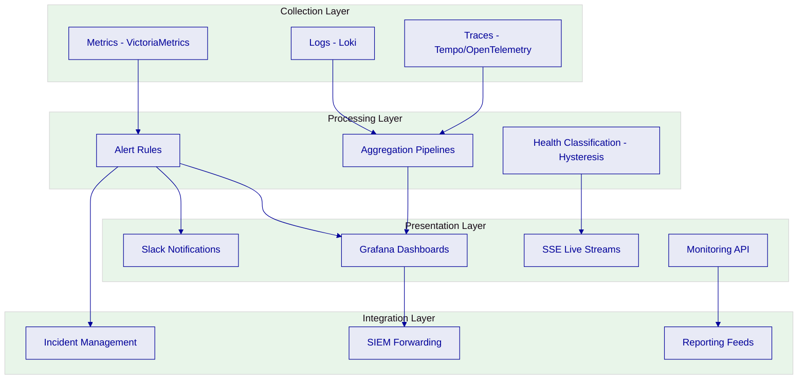

*Figure 14: Observability stack architecture showing the three-pillar collection (metrics, logs, traces), processing and alerting, presentation through dashboards and notifications, and integration with external SIEM and reporting systems.*

*Figure 15: DALP blockchain monitoring dashboard showing real-time network health, node status, and transaction throughput, the operational view NBE's infrastructure team would use to monitor platform health.*

---

## Security

### Security Model Overview

DALP treats security as a structural property of the platform, not an afterthought. The architecture enforces defense-in-depth across five independent control layers: identity verification, role-based access control, transaction-level wallet verification, on-chain compliance enforcement, and custody provider policy evaluation. No single-layer failure grants unauthorised access to digital assets.

SettleMint holds ISO 27001 and SOC 2 Type II certifications, confirming that security controls are independently audited and continuously maintained.

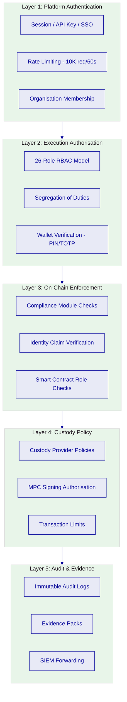

*Figure 16: Defense-in-depth security architecture showing five independent control layers. A request must pass through all layers before any blockchain operation executes.*

### Authentication and Access Control

DALP enforces a strict two-endpoint authentication architecture. The `/api/rpc` endpoint serves interactive web application access through session cookies with HTTP-only, Secure, and SameSite protections. The `/api/v2` endpoint serves programmatic integrations through scoped API keys. API keys are never accepted on the session endpoint, and session cookies are never accepted on the API endpoint. This separation enables clean security policy segmentation appropriate for institutional operations.

Authentication methods include email/password with mandatory email verification, passkeys via WebAuthn (phishing-resistant, hardware-bound authentication), and enterprise SSO integration through configurable identity provider plugins (OAuth 2.0, OIDC, SAML 2.0, LDAP/Active Directory). For NBE, integration with existing Active Directory or enterprise SSO infrastructure is supported through standard protocols.

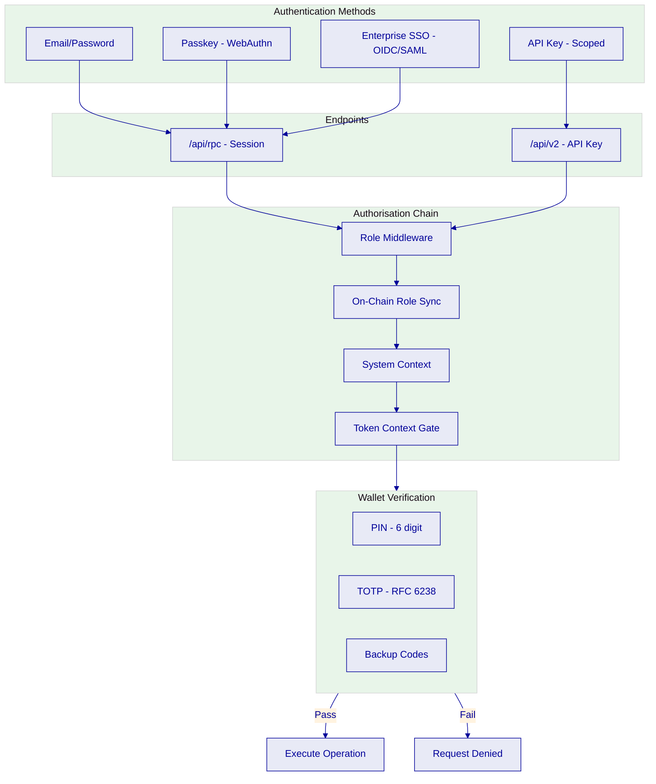

*Figure 17: RBAC and access control model showing authentication methods, endpoint separation, the authorisation middleware chain, and wallet verification gate for blockchain write operations.*

The platform implements 26 distinct roles organised across four layers: platform roles (3), system people roles (9), per-asset roles (7), and system module roles (7). This granularity enables NBE to implement precise segregation of duties, ensuring that operational, compliance, and administrative functions are governed independently. Maker-checker controls are enforced through the transfer approval compliance module and the custody provider's policy engine.

### Key Management and Custody Integration

DALP's Key Guardian service manages cryptographic key material through defense-in-depth with multiple storage backends.

| Storage Tier | Protection Level | Recommended Use |
| --- | --- | --- |
| Encrypted database | Application-level encryption | Development and proof-of-concept |
| Cloud secret manager | Platform-managed encryption | Standard cloud production |
| Hardware security module (HSM) | FIPS 140-2 Level 3 | Regulated financial services (recommended for NBE) |
| Third-party custody (DFNS, Fireblocks) | Delegated institutional MPC | Highest security requirements |

For NBE, the recommended approach is HSM-backed key storage for treasury and high-value operations, with the option to integrate institutional MPC custody through DFNS or Fireblocks for additional security layers. The unified signer abstraction makes custody providers interchangeable through configuration changes alone, without workflow or code modifications.

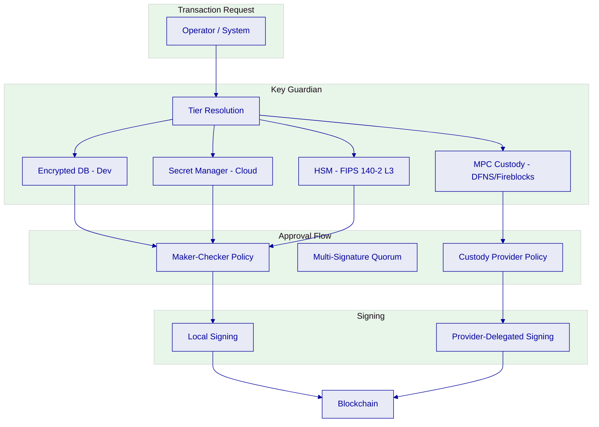

*Figure 18: Custody and key management flow showing tier resolution, approval workflows (maker-checker and custody provider policy), and the dual signing paths for local and provider-delegated operations.*

### Data Protection and Encryption

All data is encrypted at rest and in transit. Database-managed keys are encrypted at application level. HSM-backed keys never leave the hardware boundary. Transport layer security (TLS) is enforced for all API endpoints, console access, and inter-service communication. Session cookies carry HTTP-only, Secure, and SameSite protections.

Object storage uses a dual-bucket model separating public assets from sensitive data in private buckets. Seven storage provider backends are supported (AWS S3, GCP, Azure, S3-compatible, MinIO, RustFS, local filesystem), enabling NBE to use on-premises storage that meets Egyptian data residency requirements.

### Compliance Controls and Auditability

Every platform action generates an immutable audit trail entry. The audit evidence model captures who performed the action, when it occurred, which policy rules applied, what the outcome was, and what changed. This evidence is available through the platform's activity log, through structured log forwarding to external SIEM systems, and through exportable evidence packs for regulatory review.

For NBE, the audit trail supports multiple review audiences simultaneously: first-line operations can track transaction status and exceptions, compliance can review policy enforcement and rule changes, internal audit can reconstruct the full lifecycle of any asset or transaction, and the evidence can be presented to CBE supervisory reviewers or FRA inspectors without reformatting.

*Figure 19: DALP activity log showing the complete audit trail of platform actions, searchable and filterable for operational review, compliance monitoring, and audit evidence.*

### Testing and Assurance

SettleMint's security assurance programme includes penetration testing, vulnerability scanning, and remediation with evidence sharing. Deployments at regulated financial institutions have passed security reviews, penetration testing, and vendor risk assessments. The platform supports integration with NBE's security testing requirements and can provide evidence artifacts for architecture review, information security review, and internal audit walkthrough.

### Security Responsibility Matrix

| Control Area | SettleMint Responsibility | NBE Responsibility | Shared |
| --- | --- | --- | --- |
| Platform security patches | Develop, test, release | Apply to on-premises deployment | Coordinate timing |
| Smart contract security | Code review, audit, testing | Review audit reports | Governance role assignment |
| Key management | Key Guardian service, custody integration | HSM provisioning, custody provider selection | Key rotation procedures |
| Network security | Platform-level network policies | Infrastructure firewall, ingress controls | Network architecture review |
| Access control | RBAC enforcement, role framework | User provisioning, role assignment, recertification | Entitlement review |
| Incident management | Platform incident triage, root cause analysis | Infrastructure incident response, regulatory notification | Joint investigation |
| Data protection | Encryption at rest/transit, audit logging | Infrastructure encryption, backup procedures | Data residency compliance |

---

## Project Implementation and Delivery

### Delivery Overview

SettleMint follows a structured, phase-gated implementation methodology refined through years of production implementations with regulated banks, sovereign entities, and market infrastructure providers. The methodology balances speed-to-value with the rigorous governance, security, and compliance requirements that regulated institutions demand.

The standard implementation timeline spans 15 to 19 weeks from kickoff to production go-live, followed by a 4-week hypercare period. Each phase concludes with a formal gate review involving key stakeholders from both SettleMint and NBE. Progression requires sign-off on defined deliverables and acceptance criteria.

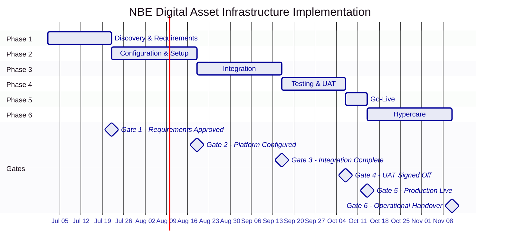

*Figure 20: Implementation timeline showing the six-phase delivery methodology with formal gate reviews at each milestone.*

### Phase Plan

**Phase 1: Discovery and Requirements (Weeks 1 to 3).** Objective: establish comprehensive understanding of NBE's business objectives, technical landscape, regulatory environment, and operational requirements. Activities include stakeholder interviews across business, technology, compliance/risk, operations, and treasury; current state assessment of the existing systems landscape; regulatory and compliance mapping to CBE, FRA, and Egyptian law requirements; asset class and lifecycle scoping; target architecture design for on-premises deployment; and risk assessment. Key deliverables: Business Requirements Document, Regulatory and Compliance Matrix, Target Architecture Document, Implementation Roadmap, RACI Matrix. Gate criteria: all requirements validated and signed off by NBE stakeholders.

**Phase 2: Configuration and Setup (Weeks 4 to 7).** Objective: provision the DALP environment, configure asset types and compliance modules, establish identity and access framework. Activities include environment provisioning (dev, staging, production) within NBE data centres; network configuration for permissioned EVM chain; token and asset configuration using DALP templates; compliance module setup mapped to Egyptian regulatory requirements; identity and access framework configuration with OnchainID and RBAC; key management setup with HSM integration. Gate criteria: environments operational, configurations documented and validated.

**Phase 3: Integration (Weeks 8 to 11).** Objective: connect DALP to NBE's existing systems for end-to-end operational workflows. Activities include API integration with core banking, treasury, AML/sanctions, and identity systems; custody connector setup; identity and KYC integration; payment rail integration for domestic settlement; data feed integration for pricing and reference data; reporting and audit feed integration; end-to-end workflow orchestration. Gate criteria: all integration points operational and tested.

**Phase 4: Testing and User Acceptance (Weeks 12 to 14).** Objective: validate that the complete deployment meets all functional, security, performance, and compliance requirements. Activities include functional testing across all configured asset types, lifecycle events, and compliance rules; security testing (penetration testing, vulnerability scanning, access control validation); performance testing against agreed SLA targets; compliance validation of ex-ante enforcement; structured UAT with NBE business, operations, compliance, and technology teams; disaster recovery testing. Gate criteria: UAT signed off, go-live readiness assessment approved.

**Phase 5: Go-Live (Week 15).** Objective: execute controlled production deployment. Activities include production deployment execution; data migration and validation; go-live validation (smoke tests); cutover coordination with NBE operations; dedicated go-live support. Gate criteria: production validated, all smoke tests passed.

**Phase 6: Hypercare and Optimisation (Weeks 16 to 19).** Objective: intensive post-go-live support, performance optimisation, and knowledge transfer completion. Activities include intensive monitoring of production operations; performance optimisation based on production data; priority issue resolution; structured knowledge transfer sessions; operational readiness validation; transition to standard support. Gate criteria: operational readiness confirmed, knowledge transfer signed off.

### Governance and Decision Structure

| Role | SettleMint | NBE | Frequency |
| --- | --- | --- | --- |
| Steering Committee | Delivery Lead, Account Director | Programme Sponsor, Senior Stakeholders | Bi-weekly |
| Project Management | Delivery Lead | Project Manager | Weekly |
| Technical Design Authority | Solution Architect | Enterprise Architect, Security Lead | As needed |
| Compliance Review | Compliance SME | Compliance Officer, Risk | Phase gates |
| Change Control | Change Manager | Change Advisory Board | Per change request |

### Resource Model

| Role | Phase 1 | Phase 2 | Phase 3 | Phase 4 | Phase 5 | Phase 6 |
| --- | --- | --- | --- | --- | --- | --- |
| SettleMint Delivery Lead | Full | Full | Full | Full | Full | Partial |
| Solution Architect | Full | Full | Partial | Partial | On-call | On-call |
| Platform Engineer(s) | Partial | Full | Full | Full | Full | Partial |
| Integration Engineer(s) | Partial | Partial | Full | Partial | On-call | On-call |
| QA/Test Lead | Partial | Partial | Partial | Full | Partial | On-call |
| Support Engineer | None | None | None | None | Full | Full |
| NBE Project Manager | Full | Full | Full | Full | Full | Full |
| NBE Technical Lead | Full | Full | Full | Full | On-call | On-call |
| NBE Business/Operations SMEs | Full | Partial | Partial | Full | Partial | Full |
| NBE Compliance/Risk | Full | Full | Partial | Full | Partial | Partial |
| NBE Security/InfoSec | Partial | Full | Partial | Full | Partial | Partial |

### Risks to Delivery and Mitigations

| ID | Risk | Likelihood | Impact | Mitigation | Owner |
| --- | --- | --- | --- | --- | --- |
| R1 | Egyptian regulatory requirements evolve during implementation | Medium | High | Phase-gated approach with compliance validation at each gate; modular compliance modules enable rapid adjustment | Joint |
| R2 | Integration complexity with NBE legacy systems exceeds estimates | Medium | High | Detailed integration assessment in Phase 1; DALP API layer reduces custom development; contingency buffer in Phase 3 | Joint |
| R3 | NBE resource availability delays gate approvals | Medium | Medium | RACI matrix and resource commitments agreed in Phase 1; escalation procedures defined | NBE |
| R4 | Security review extends beyond planned timeline | Medium | Medium | Early engagement with NBE InfoSec in Phase 1; security testing parallelised with UAT | Joint |
| R5 | Data sovereignty requirements create deployment constraints | Low | High | On-premises deployment model addresses PDPL 151/2020; all data within Egyptian borders | SettleMint |
| R6 | Third-party provider readiness (custody, identity, payment rail) | Medium | Medium | Early identification in Phase 1; fallback configurations for testing; mock integrations | SettleMint |

---

## Deployment

### Deployment Principles

DALP supports four deployment models (managed SaaS, private cloud, on-premises, hybrid), all delivering identical platform capabilities. The choice is driven by institutional requirements around data sovereignty, security posture, regulatory constraints, and operational preferences.

For NBE, the deployment model is driven by three overriding requirements: data sovereignty under the Personal Data Protection Law 151/2020, the Central Bank of Egypt's expectations for local control over financial infrastructure, and NBE's stated preference for operational resilience and local control.

### Recommended Deployment Model

Based on NBE's requirements, SettleMint recommends **on-premises deployment** within NBE's data centres. This model provides maximum control over the entire technology stack, meets Egyptian data sovereignty requirements, and supports the air-gap capability that may be required for sensitive operational components.

Key characteristics of the on-premises model:

- Full infrastructure control: hardware, network, storage, and compute within NBE's data centres
- Air-gap capable for environments requiring network isolation from public internet
- Helm/Kubernetes deployment on NBE-provisioned Kubernetes clusters
- Private blockchain network deployment for permissioned-only operation
- NBE-managed operations with SettleMint platform support

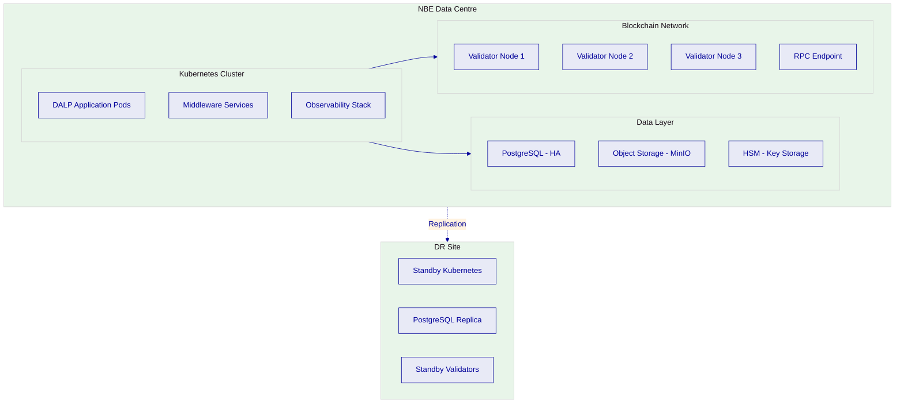

*Figure 21: On-premises deployment architecture within NBE's data centre showing Kubernetes cluster, data layer with HSM, private blockchain network, and disaster recovery site.*

### Deployment Options Considered

| Capability | On-Premises (Recommended) | Private Cloud | Managed SaaS |
| --- | --- | --- | --- |
| Data Residency | Full control within Egypt | Configurable by region | Configurable by region |
| Infrastructure Management | NBE-managed | NBE-managed or co-managed | SettleMint-managed |
| Network Connectivity | Air-gap capable | Client VPN/private link | Internet/VPN |
| Update Management | NBE-controlled | Coordinated releases | Automated by SettleMint |
| Operational Overhead | Highest (mitigated by DALP automation) | Moderate | Lowest |
| Data Sovereignty Compliance | Full | Dependent on cloud region | Dependent on cloud region |

### Infrastructure Requirements

| Component | Specification | Purpose |
| --- | --- | --- |
| Kubernetes Cluster | v1.25+, minimum 16 vCPU / 64 GB RAM (production) | Platform hosting |
| PostgreSQL | v15+, self-managed with HA | Application state, indexed data |
| Object Storage | MinIO, RustFS, or S3-compatible | Document management, asset artifacts |
| HSM | FIPS 140-2 Level 3 | Cryptographic key storage |
| Container Registry | Private registry for DALP images | Image management |
| DNS and TLS | Internal DNS, certificate management | Service routing, encryption |
| Network | Internal service mesh, ingress controls, firewall | Security and connectivity |

### Availability, Resilience, and DR Approach

DALP's durable execution engine ensures that multi-step workflows survive process restarts and infrastructure failures. The platform's recommended DR approach for NBE includes:

- Primary data centre with full production deployment
- DR site with standby Kubernetes cluster, PostgreSQL replication, and standby validator nodes
- Automated backup of all application state and configuration
- Recovery testing as part of Phase 4 implementation

| Target | Standard | With DR Site |
| --- | --- | --- |
| Recovery Time Objective (RTO) | 4 hours | 1 hour |
| Recovery Point Objective (RPO) | 1 hour | 15 minutes |
| Backup Frequency | Hourly | Continuous replication |

### Data Residency and Sovereignty

All data in the recommended on-premises deployment resides within NBE's Egyptian data centres. No data leaves Egyptian borders. The platform's data architecture separates chain state, application state, indexed state, and audit evidence into distinct storage layers, all residing within NBE's infrastructure.

For compliance with Personal Data Protection Law 151/2020, the platform supports configurable data retention periods, controlled deletion procedures, encryption of sensitive data at rest and in transit, access logging for all data operations, and break-glass procedures for privileged access with retrospective review.

---

## Training and Knowledge Transfer

### Training Strategy

SettleMint's training programme is designed to build internal capability at NBE so that the institution can independently operate, administer, and extend the platform after implementation. Training is delivered in three tracks, each targeting a specific audience within NBE's organisation.

### Administrator Track

Platform administrators learn environment management, user provisioning, role assignment, compliance module configuration, system monitoring, and operational procedures. This track covers day-to-day platform administration, entitlement management, configuration changes, and operational runbook execution. Delivered through hands-on workshops with NBE's production environment during Phase 6.

### Developer and Integration Track

Integration engineers and developers learn the DALP API surface (REST, SDK, CLI), integration patterns, webhook configuration, error handling, and the development workflow for building applications against the platform. This track ensures NBE's technology team can independently build and maintain integrations with core banking, treasury, and other enterprise systems.

### End-User and Operations Track

Operations teams, compliance officers, and business users learn asset lifecycle management through the Asset Console, compliance workflow execution, reporting and monitoring interpretation, and exception handling procedures. This track ensures that first-line operations, compliance, and business teams can use the platform effectively.

### Knowledge Transfer Method

Knowledge transfer follows a structured approach: shadowing during implementation phases, guided hands-on labs in NBE's own environments, documented runbooks and operational procedures, and an operational readiness assessment before the handover. All documentation, runbooks, API guides, and troubleshooting guides are delivered as formal project artifacts and maintained through a defined update discipline.

---

## Support and SLA

### Support Model Overview

SettleMint provides structured, tiered support for all DALP production deployments, delivered by engineers with deep expertise in DALP's architecture, blockchain infrastructure, compliance modules, and integration patterns. Every support interaction is logged, tracked, and auditable.

### Support Tiers

| Attribute | Standard | Premium | Enterprise |
| --- | --- | --- | --- |
| Coverage Hours | Business hours (CET) | Extended hours; P1 weekend on-call | 24/7/365 |
| Support Channels | Email, portal | Email, portal, Slack, phone | Email, portal, Slack, phone, video |
| Uptime SLA | 99.9% monthly | 99.95% monthly | 99.99% monthly |
| Named Contacts | Up to 3 | Up to 8 | Unlimited |
| Designated Engineer | No | Named individual | Named team |
| Account Management | Quarterly review | Monthly review | Bi-weekly review, named CSM |

For NBE, SettleMint recommends Premium or Enterprise support given the institution's scale and the business-critical nature of the deployment. The final support tier will be determined during commercial negotiations.

### Severity and Response Matrix

| Severity | Classification | Standard Response | Premium Response | Enterprise Response |
| --- | --- | --- | --- | --- |
| P1: Critical | Production down, compliance failure | 4 hours | 1 hour | 15 minutes |
| P2: High | Major degradation, critical workflow impact | 8 hours | 4 hours | 1 hour |
| P3: Medium | Workaround available | 2 business days | 1 business day | 4 hours |
| P4: Low | Minor/cosmetic | 5 business days | 3 business days | 1 business day |

### Escalation and Incident Management

Incidents follow a defined lifecycle: report, acknowledge, triage, resolve/workaround, post-mortem (for P1/P2), and close. Automatic escalation triggers if response or resolution targets are exceeded. Client-initiated escalation follows a four-level path from designated support engineer through engineering management to executive management.

### Maintenance and Update Policy

Scheduled maintenance uses a standard window (Saturdays 02:00 to 06:00 CET or client-agreed alternative) with minimum 5 business days notification. Emergency maintenance for critical security patches may be executed outside standard windows. Update cadence varies by support tier: quarterly (Standard), monthly (Premium), or continuous delivery (Enterprise).

---

## Risk Management

### Risk Management Approach

Risk management is integrated into every phase of the implementation methodology. Risks are identified during Phase 1 discovery, tracked in a shared risk register, reviewed at every steering committee meeting, and formally assessed at each phase gate. Each risk has a named owner, defined mitigation actions, and trigger conditions for escalation.

### Risk Register

| ID | Risk | Likelihood | Impact | Mitigation | Owner | Status |
| --- | --- | --- | --- | --- | --- | --- |
| R1 | Regulatory change during implementation | Medium | High | Phase-gated compliance validation; modular compliance modules enable rapid adjustment | Joint | Active |
| R2 | Integration complexity exceeds estimates | Medium | High | Detailed assessment in Phase 1; DALP API reduces custom development; Phase 3 buffer | Joint | Active |
| R3 | NBE resource availability | Medium | Medium | RACI matrix agreed upfront; escalation procedures; parallel workstreams | NBE | Active |
| R4 | Security review timeline extension | Medium | Medium | Early InfoSec engagement; parallel security testing | Joint | Active |
| R5 | Third-party dependency delays | Medium | Medium | Early provider identification; fallback configurations; mock integrations | SettleMint | Active |
| R6 | Data quality issues in migration | Medium | Medium | Data assessment in Phase 1; transformation rules validated in Phase 2; reconciliation checkpoints | Joint | Active |
| R7 | Scope expansion during implementation | High | Medium | Formal change control; scope locked at Phase 1 gate; change request procedures | Joint | Active |
| R8 | CBE/FRA regulatory approval dependencies | Medium | High | Early regulatory engagement by NBE; platform evidence packs prepared in Phase 2 | NBE | Active |

### Governance of Risks

Risks are reviewed at bi-weekly steering committee meetings. New risks are added to the register as they are identified. Risk owners are responsible for mitigation execution and status updates. Escalation to steering committee occurs when a risk's likelihood or impact increases beyond its initial assessment, or when mitigation actions require senior decision-making.

---

## Compliance Matrix

### Status Legend

| Status | Meaning |
| --- | --- |
| Full | Requirement fully met through native DALP capabilities |
| Configurable | Met through platform configuration during implementation |
| Integration | Met through integration with external systems |
| Assumption | Response assumes specific conditions stated in notes |

### Detailed Matrix: Technical Requirements

| Req ID | Requirement Summary | Status | Response | Notes |
| --- | --- | --- | --- | --- |
| REQ-01 | Segregated environments (dev, test, UAT, DR, production) | Full | Helm-based multi-environment deployment with isolated configurations, databases, and blockchain networks | On-premises within NBE data centres |
| REQ-02 | API-first interfaces, eventing, version governance | Full | OpenAPI 3.1 REST API, event webhooks, TypeScript SDK, CLI (301 commands); versioned API with backward compatibility | 534 structured error codes |
| REQ-03 | RBAC, segregation of duties, maker-checker, audit logs | Full | 26 roles across 4 layers; dual-layer authorisation; wallet verification; maker-checker via compliance modules and custody policies; immutable audit trails | Every action logged with actor, policy, outcome |
| REQ-04 | Configurable lifecycle states, policy controls, limits | Full | Runtime-configurable token features (up to 32) and compliance modules (12 types); composable architecture reconfigurable post-deployment | Governance-role controlled changes |
| REQ-05 | Third-party dependencies disclosure | Full | Custody: Fireblocks/DFNS (configurable); Blockchain: EVM-compatible (private recommended); Infrastructure: Kubernetes, PostgreSQL, object storage | Full dependency register in appendix |
| REQ-06 | Resilience, recovery, backup, monitoring, incident management | Full | Durable execution engine; multi-zone DR; observability stack (metrics, logs, traces); structured incident management with severity levels and SLAs | RTO/RPO targets defined per deployment |
| REQ-07 | Delivery method, client effort, phased plan | Full | 6-phase methodology (15-19 weeks); formal gate reviews; RACI matrix; detailed resource model with NBE effort assumptions | Phase plan with acceptance criteria |
| REQ-08 | Evidence extraction for audit, supervisory review, board reporting | Full | Structured audit logs; exportable evidence packs; SIEM-compatible forwarding; operational dashboards; compliance event history | Supports CBE, FRA, and internal audit review |
| REQ-18 | Configuration governance, observability, phased promotion | Full | Governance-role controls all configuration changes; three-pillar observability; staged environment promotion with approval gates | Change management through on-chain governance roles |
| REQ-19 | Participant supervision, policy analytics, sandbox/CBDC controls | Full | Identity Registry supervision; compliance module analytics; configurable policy enforcement; sandbox environment support | CBDC infrastructure reference (SBI) |

### Detailed Matrix: Regulatory and Compliance Requirements

| Req ID | Area | Status | Response | Notes |
| --- | --- | --- | --- | --- |
| RC-01 | Regulatory mapping | Full | Platform controls mapped to CBE, FRA, Banking Law 194/2020, AML Law 80/2002, PDPL 151/2020; assumptions on legal characterisation stated explicitly | NBE retains regulatory interpretation responsibility |
| RC-02 | AML/CFT and sanctions | Integration | DALP integrates with external AML/sanctions screening systems via API; on-chain compliance modules enforce screening results; case-management evidence through audit trail | NBE provides AML/sanctions screening system |
| RC-03 | Data governance | Full | On-premises deployment within Egypt; configurable retention periods; encryption at rest and transit; access logging; deletion controls; break-glass procedures with retrospective review | Meets PDPL 151/2020 requirements |
| RC-04 | Operational resilience | Full | Durable execution engine; DR site with replication; tested restoration procedures; incident classification and escalation; dependency-failure handling; degraded-mode procedures | RTO/RPO targets defined |
| RC-05 | Outsourcing and subcontractors | Full | DALP deployed on-premises within NBE infrastructure; SettleMint provides platform support; cloud/managed-service dependencies eliminated in on-premises model | Custody provider selection remains NBE decision |
| RC-06 | Assurance and audit | Full | Structured audit logs; exportable evidence packs; configuration snapshots; role matrices; sample audit logs; environment diagrams; API specifications; backup/restore evidence; operational reports | Pre-built for architecture, security, and audit walkthroughs |

---

## Appendix A: Detailed Operating Model

NBE's digital asset infrastructure programme requires named control owners across six operational functions. The following table defines roles, platform interactions, approval requirements, and evidence available after the fact.

| Function | Accountable Role | Platform Interaction | Approval Requirements | Evidence |
| --- | --- | --- | --- | --- |
| Product Management | Product Owner | Asset Designer configuration, lifecycle parameter setting | Governance-role approval for all configuration changes | Configuration audit trail, change history |
| First-Line Operations | Operations Manager | Transaction monitoring, exception handling, reconciliation | Maker-checker for high-value operations | Activity log, exception queue, reconciliation reports |
| Compliance Oversight | Compliance Officer | Compliance module configuration, policy template management | Governance-role approval; compliance review at phase gates | Compliance event history, policy change log, evidence packs |
| Treasury/Finance | Treasury Manager | Settlement coordination, cash-leg management | Multi-signature approval for treasury operations | Settlement records, payment confirmations, position reports |
| Information Security | CISO / Security Lead | Access control review, key management oversight, incident response | Break-glass approval with retrospective review | Access logs, security event logs, incident reports |
| Platform Administration | Platform Admin | Environment management, user provisioning, system monitoring | Admin-role actions logged; privileged access time-bounded | System configuration snapshots, user management log |
| Executive Oversight | Programme Sponsor | Dashboard review, KPI monitoring, governance escalation | Steering committee decisions | Board reports, KPI dashboards, risk register |

Daily governance routines include transaction exception review, reconciliation monitoring, and compliance alert triage. Weekly routines include entitlement review, threshold monitoring, and incident summary review. Monthly routines include formal reconciliation sign-off, management reporting, and entitlement recertification.

These routines are supported through native DALP reporting and workflow evidence. Where offline controls are required (such as policy interpretation or regulatory engagement), the platform provides the evidence artifacts to support those processes, but the manual judgement remains with NBE's designated control owners.

---

## Appendix B: Security and Resilience Detail

### Encryption and Secrets Handling

All sensitive data is encrypted at rest using AES-256 encryption. HSM-backed keys (FIPS 140-2 Level 3) never leave the hardware boundary. Cloud secret manager backends provide platform-managed encryption for standard deployments. Transport encryption uses TLS 1.2+ for all communications.

### Vulnerability Management

SettleMint maintains a continuous vulnerability management programme including automated dependency scanning, regular penetration testing, and coordinated disclosure procedures. Security patches are released on an accelerated timeline for critical vulnerabilities.

### Recovery Testing

DR testing is conducted as part of the Phase 4 implementation activities and on a regular schedule post-go-live. Testing validates backup integrity, restoration procedures, failover mechanisms, and recovery time against stated RTO/RPO targets.

### Incident Escalation

Incidents follow a four-severity model with defined response and resolution targets per support tier. P1 incidents trigger automatic escalation if not acknowledged within the response target. Post-mortem analysis is produced within 5 business days for all P1/P2 incidents.

### Forensic Support

In the event of a security incident, SettleMint provides forensic support including structured log analysis, transaction trace reconstruction, configuration state evidence, and timeline documentation. The platform's immutable audit trail and structured error codes support rapid incident investigation.

---

## Appendix C: Data and Integration Detail

### Data Model Boundaries

DALP maintains clear data model boundaries between authoritative on-chain state (asset ownership, compliance status, identity claims), application state (platform configuration, workflow state), indexed state (queryable projections for read access), and audit evidence (immutable event records). Reference data ownership is defined during Phase 1 discovery; the platform supports both DALP-authoritative and externally-authoritative reference data models.

### Event Flows

The platform publishes events through webhooks for all significant state changes: asset creation, transfer execution, compliance check results, settlement status changes, corporate action execution, and administrative actions. Events are idempotent (safe to retry) and include correlation identifiers for end-to-end tracing across systems.

### Reconciliation Points

DALP provides reconciliation support at three levels: on-chain state versus indexed state (continuous, automated), platform records versus external books of record (configurable, via API), and settlement records versus payment confirmations (per-transaction, traceable). Reconciliation breaks are surfaced through operational dashboards with clear ownership and escalation paths.

### API Lifecycle Management

API changes follow semantic versioning. Breaking changes are introduced in new major versions with minimum 90-day deprecation notice. Non-breaking changes are added to existing versions. Test environments mirror production API behaviour. Release notes document all changes.

---

## Appendix D: Migration and Cutover Detail

### Migration Approach

The proposed launch assumes greenfield onboarding for the initial phase, with no legacy back-book migration required for the first production scope. If NBE identifies legacy records that must be migrated, the Phase 1 discovery will assess source systems, data quality, transformation rules, and reconciliation checkpoints.

### Parallel Run Requirements

Where the digital asset programme coexists with legacy processes, a parallel run period is recommended during Phase 4/5 to validate that platform operations produce consistent results with existing processes. Defect triage during parallel run follows the standard incident severity model.

### Rollback Conditions

Rollback procedures are defined as part of the go-live runbook. Conditions for rollback include: critical defects affecting settlement integrity, compliance enforcement failures, data corruption, or infrastructure failures that cannot be resolved within the defined RTO. Rollback procedures are tested during Phase 4.

### Go-Live Governance

Go-live requires formal sign-off from NBE's programme sponsor, technical lead, compliance officer, and security lead. The go-live readiness assessment covers technical validation, operational readiness, compliance validation, security clearance, and stakeholder approval.

---

## Appendix E: Staffing and Plan Detail

### Staffing Assumptions

SettleMint provides a dedicated delivery team for the implementation period, including a Delivery Lead (full-time across all phases), Solution Architect (full-time Phases 1-2, partial thereafter), Platform Engineers (scaled to phase requirements), Integration Engineers (focused on Phase 3), QA/Test Lead (focused on Phase 4), and Support Engineers (Phases 5-6 and ongoing).

NBE is expected to provide a full-time Project Manager, a Technical Lead for architecture and integration coordination, Business/Operations SMEs for requirements and UAT, Compliance/Risk representation for regulatory mapping and compliance validation, and Security/InfoSec engagement for security review and penetration testing coordination.

### Milestone Plan

| Milestone | Target Week | Acceptance Criteria | Dependencies |
| --- | --- | --- | --- |
| Requirements Approved | Week 3 | BRD signed off, architecture approved | NBE stakeholder availability |
| Platform Configured | Week 7 | Environments operational, configurations validated | Infrastructure provisioned by NBE |
| Integration Complete | Week 11 | All integration points tested and operational | External system API access from NBE |
| UAT Signed Off | Week 14 | All test scenarios passed, defects resolved | NBE UAT participant availability |
| Production Live | Week 15 | Production validated, smoke tests passed | All gate approvals |
| Operational Handover | Week 19 | Knowledge transfer complete, support transitioned | Operations team designated by NBE |

---

## Appendix F: Operational Governance Detail

### Daily Governance Routines

- Exception review: operations team reviews pending exceptions, stale approvals, and failed transactions through the DALP activity dashboard
- Reconciliation monitoring: automated reconciliation between on-chain state and indexed state; breaks surface through alerting
- Compliance alert triage: compliance team reviews flagged transactions, screening results, and policy enforcement events

### Weekly Governance Routines

- Entitlement review: review of user access, role assignments, and any privileged access usage
- Threshold monitoring: review of volume thresholds, rate limits, and capacity metrics
- Incident review: summary of incidents, root causes, and remediation status

### Monthly Governance Routines

- Formal reconciliation sign-off: management approval of reconciliation status across all integration points
- Management reporting: operational KPIs, transaction volumes, compliance metrics, incident trends
- Entitlement recertification: formal review and re-approval of all user roles and access rights

### Post-Event Review

For rejected transactions, stale approvals, mismatched data, delayed settlement, and corrected records, the platform provides complete evidence trails showing the initial state, the event that triggered the exception, the actions taken, the approvals obtained, and the resolution. This evidence is available through the activity log, exportable evidence packs, and SIEM-forwarded structured logs.

---

## Appendix G: Commercial and Supplier Transparency

### Licensing Model

DALP is licensed on an annual basis with the following baseline pricing:

| License Type | Annual Fee |
| --- | --- |
| Production License | EUR 300,000/year (EUR 25,000/month equivalent) |
| Development License | EUR 120,000/year (EUR 10,000/month equivalent) |
| Production + Development Combined | EUR 420,000/year |

All prices exclude applicable taxes and VAT. Payment is annual, upfront.

### Cost Scaling

Platform license costs are fixed per environment. The license does not scale with transaction volumes, user counts, or asset classes. Infrastructure costs (compute, storage, network) for on-premises deployment are borne by NBE. Implementation services are priced separately per engagement and marked as client-specific until scoped during Phase 1 discovery.

### Supplier Transparency

SettleMint is a privately held company backed by leading investors in Europe and the Middle East, with board-level financial services expertise. The company has nearly a decade of continuous operation and a focused strategy on digital asset lifecycle infrastructure for regulated institutions.

Core platform dependencies include EVM-compatible blockchain networks (open standard, multiple implementations available), custody providers (Fireblocks, DFNS; substitutable through unified signer abstraction), and standard infrastructure components (Kubernetes, PostgreSQL, object storage). No single partner dependency creates a concentration risk that would affect delivery continuity.

### Post-Implementation Service Engagement

After implementation, the ongoing service relationship includes support per the contracted support tier (Standard, Premium, or Enterprise), structured release management with documentation and migration guides, regular business reviews (frequency per support tier), platform update coordination, and roadmap communication through governance forums.

---

## Appendix H: Egyptian Regulatory and Market Context

### CBE Requirements

DALP's deployment within NBE's on-premises infrastructure, combined with its ex-ante compliance enforcement model, supports CBE's supervisory expectations for banking operations. The platform's audit trail provides the evidence basis for supervisory review, and the governance-role controlled configuration model ensures that policy changes are traceable and attributable.

### FRA Obligations

Where the digital asset programme intersects capital markets activity, DALP's compliance modules can be configured to enforce FRA-specific requirements. The platform's configurable compliance module architecture means that FRA-specific rules can be added or modified as the regulatory framework evolves, without redeploying token contracts.

### Banking Law 194/2020

The platform supports Banking Law requirements through its RBAC model (segregation of duties), audit trail (accountability), governance controls (approval workflows), and outsourcing transparency (disclosed third-party dependencies with clear operational boundaries).

### AML Law 80/2002

DALP integrates with external AML/sanctions screening systems through its API layer. On-chain compliance modules enforce screening results before transfers execute. The platform's identity layer (OnchainID) supports customer identification and verification workflows, and the audit trail captures all screening events and outcomes for regulatory reporting.

### Personal Data Protection Law 151/2020

On-premises deployment within Egyptian data centres ensures all data resides within Egyptian borders. The platform supports configurable data retention periods, controlled deletion procedures, encryption at rest and in transit, access logging for all data operations, and break-glass procedures with retrospective review.

### Islamic Finance Governance

Where Islamic finance governance is relevant, DALP's platform supports the capture of board approval lineage, product rule controls, prohibited activity restrictions, and committee evidence through its governance role framework, audit trail, and compliance module architecture. The platform's configurable compliance modules can enforce Sharia-specific constraints (such as prohibition of interest-bearing instruments or restricted investment categories) at the smart contract level, with AAOIFI-aligned documentation and evidence capture.

### Arabic Reporting

DALP's structured error code system supports internationalisation with translations in four locales. Reporting outputs can be configured for Arabic-language presentation through the platform's templating system. Operational dashboards and evidence exports support multi-language rendering as part of deployment configuration.

### National Payment Infrastructure Integration

DALP's ISO 20022 connectivity supports integration with Egyptian domestic payment rails for cash-leg settlement. The platform's settlement engine can coordinate payment instructions with NBE's treasury and payment systems through standard messaging protocols, maintaining consistency between on-chain asset movement and off-chain cash settlement.

---

## Appendix I: Dependency Register

| Dependency | Provider | Type | Substitutable | Risk |
| --- | --- | --- | --- | --- |
| Blockchain Network | EVM-compatible (Besu, Ethereum, etc.) | Open standard | Yes, multiple implementations | Low |
| Custody Provider | Fireblocks, DFNS | Institutional MPC | Yes, unified signer abstraction | Low |
| Database | PostgreSQL | Open source | Standard relational DB | Low |
| Container Orchestration | Kubernetes | Open standard | OpenShift or other K8s distributions | Low |
| Object Storage | MinIO, S3-compatible | Open source / standard API | Multiple providers | Low |
| HSM | FIPS 140-2 Level 3 compliant | Hardware standard | Multiple vendors | Low |
| Identity Provider | OIDC/SAML/LDAP compatible | Open standard | Any standards-compliant provider | Low |
| AML/Sanctions Screening | NBE's existing provider | External integration | NBE-selected | NBE responsibility |
| Payment Rails | ISO 20022 compatible | International standard | Standard protocol | Low |

---

*Document Classification: Confidential*
*Prepared by: SettleMint NV*
*Validity Period: 90 days from date of issue*
