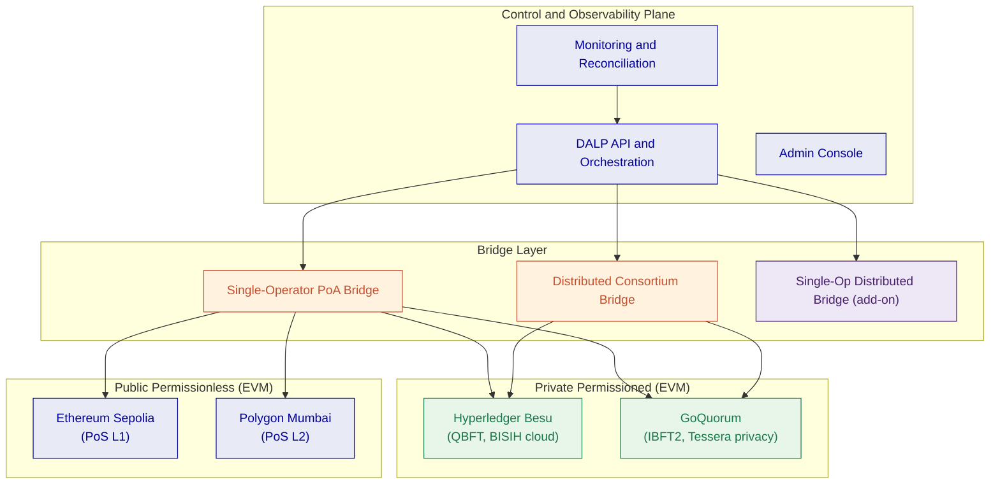
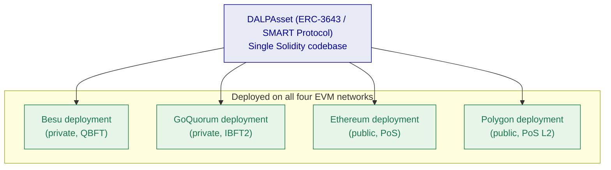
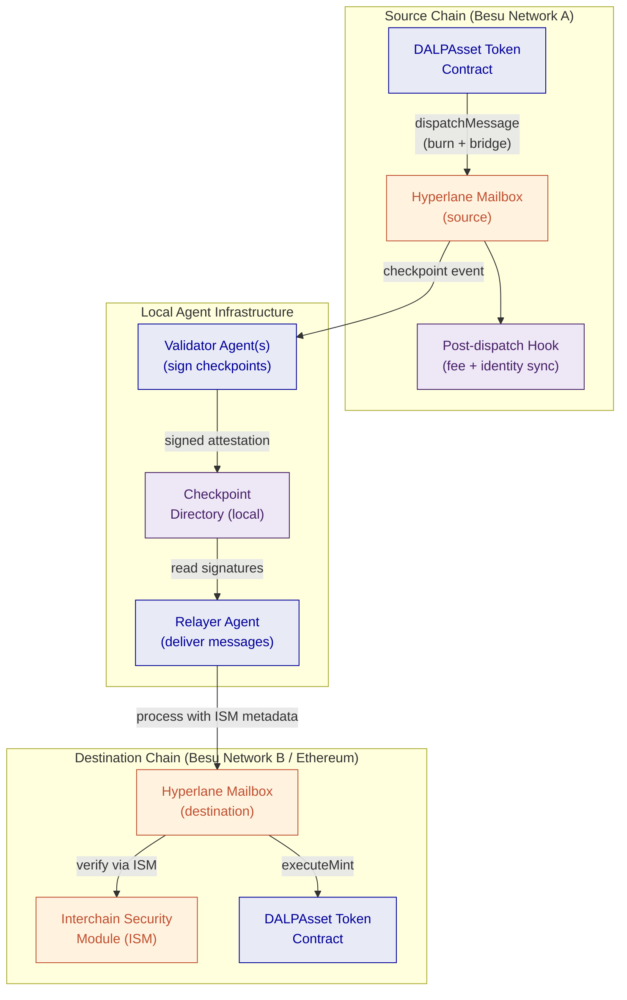
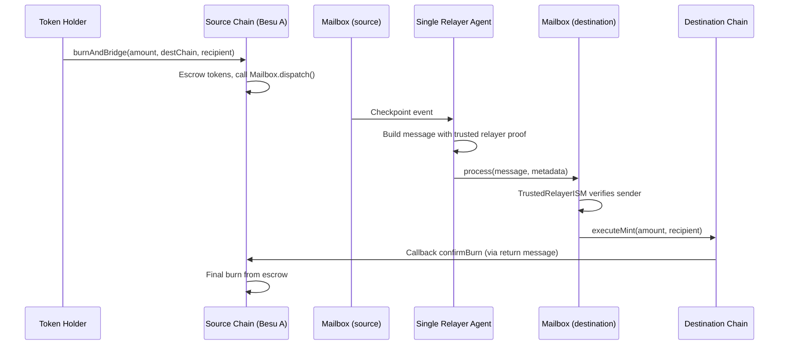
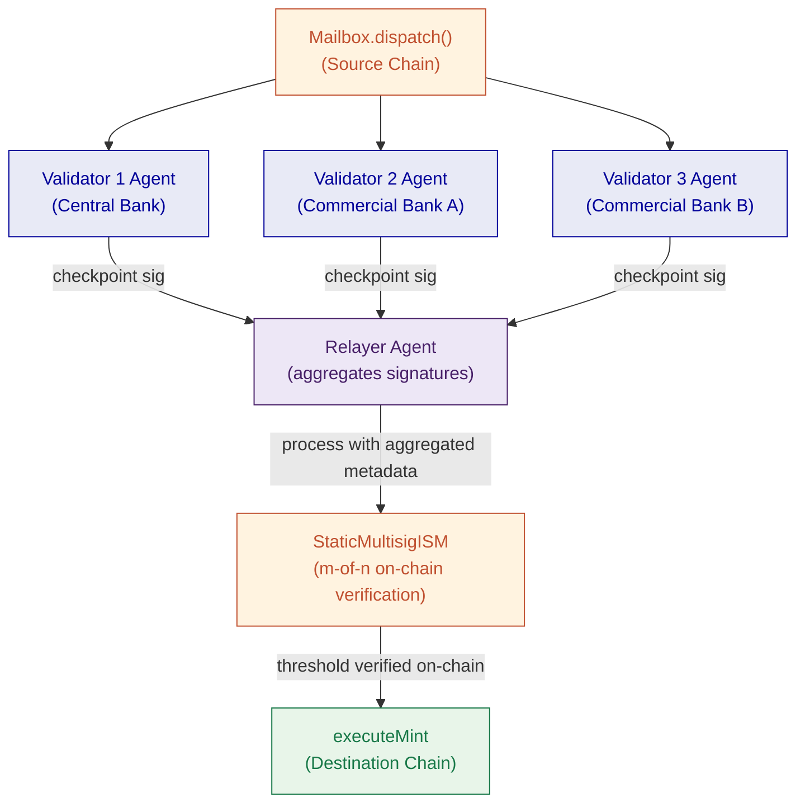
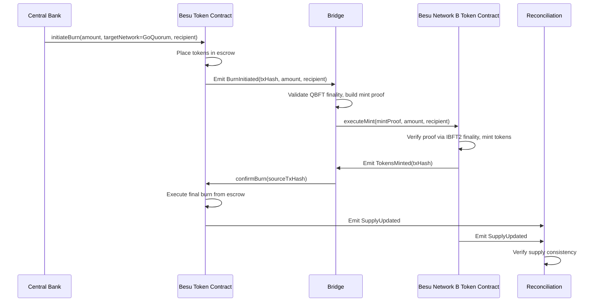
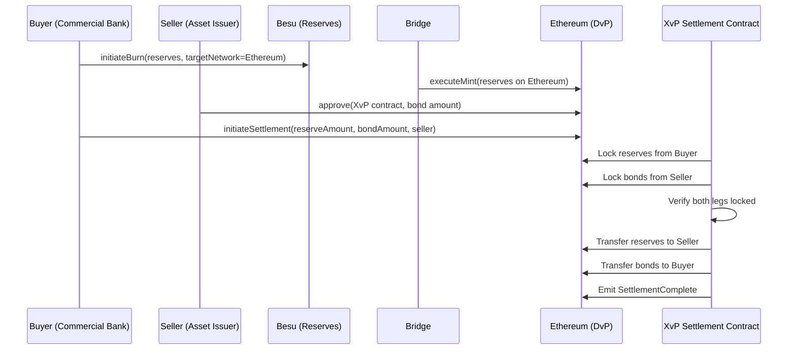
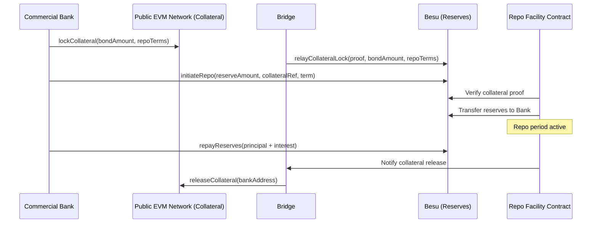
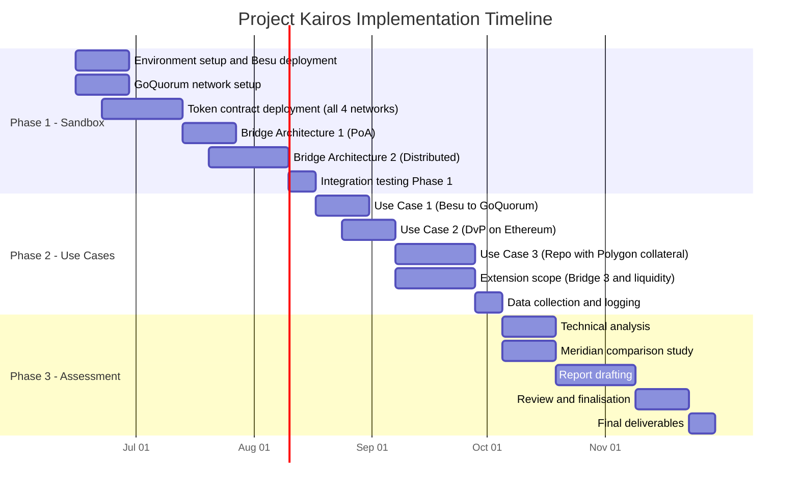

# Technical Proposal: Project Kairos

**Submitted to:** Bank for International Settlements (BIS) Innovation Hub, London Centre
**Project reference:** Project Kairos. Invitation to Tender
**Submitted by:** SettleMint NV
**Submission date:** 27 March 2026
**Valid until:** 27 June 2026
**Contact:** Roderik van der Veer, Founder and CTO, roderik@settlemint.com
**Confidentiality:** Confidential

---

## Executive Summary

Project Kairos addresses one of the most consequential questions in central bank digital infrastructure: whether tokenised reserves, deposits, and securities can move reliably across heterogeneous distributed ledger networks while preserving the precise controls that monetary policy requires. SettleMint submits this proposal as a platform company with nearly a decade of production-grade digital asset infrastructure across regulated financial institutions. We do not approach this as explorers; we approach it as practitioners.

Our Digital Asset Lifecycle Platform (DALP) provides the token architecture, compliance engine, and settlement infrastructure that Project Kairos requires. We propose to deploy DALP to build and operate the experimentation sandbox, implement the token contracts specified in the Statement of Work, construct and compare three bridge architectures, and execute all three use case experiments.

**Ledger selection:** The ITT (Section 3.2) explicitly states that "the final ledgers used will be decided based on conversations with the selected vendor," and Section 3.3 names Hyperledger Besu and Canton as examples with the word "such as." SettleMint proposes to exercise this flexibility by selecting an all-EVM ledger set. Hyperledger Besu and GoQuorum for private permissioned networks, Ethereum and Polygon for public permissionless networks, and makes the case in this proposal that this selection better serves the research objectives of Project Kairos.

The research value in Project Kairos lies in the bridge design comparison and the behaviour of token logic across ledger boundaries, not in runtime language diversity per se. An EVM-consistent environment allows SettleMint to deploy production-grade DALP infrastructure on all four networks, test the same token contract codebase across different consensus models and permission structures, and produce experimental results that are directly relevant to central banks operating in the EVM-dominant institutional landscape. Introducing non-EVM runtimes such as Canton DaML or Solana Rust programs would require bespoke development on two unfamiliar stacks, creating implementation risk that degrades the quality of the experimental findings without adding proportionate research value for the stated objectives.

Specifically, SettleMint proposes to:

- Deploy production-grade DALP token contracts across four EVM networks spanning two consensus models, two permission structures, and two network scales, satisfying all token functions specified in the SOW: mint, burn, transfer, approve lists, freeze, repatriate, EIP-2612 delegated allowances, reconciliation, and interest accrual
- Implement three bridge architectures: single-operator proof-of-authority, distributed consortium, and optionally a single-operator distributed bridge
- Execute all three use cases: private-to-private EVM bridge (Besu to GoQuorum), DvP on public EVM (Ethereum) using private EVM reserves (Besu), and repo on private EVM (Besu) using public EVM collateral (Polygon)
- Host the Besu node within the BISIH cloud environment as specified
- Produce a comparative analysis of bridge design trade-offs, contrasting the tokenised reserves plus bridging model with Meridian-style RTGS synchronisation

SettleMint brings directly relevant production experience: live DvP settlement via our XvP protocol, cross-chain settlement in deployment at Maybank, multi-ledger EVM deployments at Standard Chartered, and CBDC infrastructure in production at the State Bank of India.

---

## Company Overview

### About SettleMint

SettleMint is a production-grade digital asset lifecycle management company for regulated financial markets and sovereign use cases. Founded nearly a decade ago, SettleMint has grown from an early enterprise blockchain infrastructure provider into the platform company enabling financial institutions, market infrastructure providers, and sovereign entities to move real-world value on-chain with compliance, security, and operational reliability.

SettleMint exists to close the gap between tokenization ambitions and production-grade execution. Tokenization technology is increasingly accessible, but institutional-grade implementation is not. Meeting regulatory requirements, implementing proper governance, supporting the full asset lifecycle, and ensuring that early pilots scale into real institutional infrastructure is where most organisations get stuck. SettleMint's mission is to enable regulated institutions to move from slides to balance sheets by turning digital asset strategy into operating infrastructure that reduces time-to-market and removes operational and regulatory risk.

### Organisational Information

| Attribute | Detail |
|---|---|
| Legal name | SettleMint NV |
| Headquarters | Brussels, Belgium |
| Regional presence | London, Dubai, Singapore, Tokyo, New Delhi |
| Founded | 2016 |
| Structure | Private company |
| Website | www.settlemint.com |
| Primary contact | Roderik van der Veer, Founder and CTO |

### Regulatory and Security Certifications

| Certification | Status |
|---|---|
| ISO 27001 | Certified |
| SOC 2 Type II | Certified |
| GDPR compliance | Full |

### Selected Client References

| Institution | Engagement |
|---|---|
| OCBC Bank | Security token engine; securitization, tokenization, fractionalization; HNWI investment products |
| Standard Chartered Bank | Digital Virtual Exchange; fractional tokenization; institutional trading Asia/Africa/Middle East |
| State Bank of India | CBDC infrastructure; secure, scalable digital currency; production deployment |
| Maybank (Project Photon) | FX tokenization and cross-border XvP settlement; tokenized Malaysian Ringgit; atomic cross-currency swaps |
| KBC Securities (Bolero) | Equity crowdfunding; smart contracts for issuance, lifecycle, corporate actions |
| Commerzbank | Hybrid on/off-chain ETP issuance; Boerse Stuttgart listing; near real-time clearing; settlement under 10 seconds |
| Saudi Real Estate Registry | Country-scale real estate tokenization; registry-as-truth; national infrastructure |
| Reserve Bank of India (RBIH) | Multi-bank letter of credit trade finance; multi-node, multi-cloud blockchain |

The Maybank Project Photon engagement is directly relevant to Project Kairos: SettleMint designed and deployed cross-currency atomic settlement using our XvP protocol on Ethereum-compatible infrastructure, which shares architectural lineage with the cross-chain bridging architecture proposed here. The State Bank of India CBDC deployment validates our capability to operate central bank-grade digital currency infrastructure in production. The Commerzbank ETP engagement demonstrates sub-10-second settlement finality in a regulated exchange context.

### About DALP

DALP (Digital Asset Lifecycle Platform) is SettleMint's production-grade platform for designing, launching, and operating tokenised assets across financial instruments and real-world assets. DALP provides a unified platform covering the full digital asset lifecycle from asset design through issuance, compliance enforcement, custody integration, settlement, servicing, and retirement.

DALP sits between existing core financial systems and blockchain networks, providing the governance and orchestration layer that enables institutions to build, deploy, and operate compliant digital asset solutions in production. The platform is designed to be operated over time, not just deployed. DALP is built on the EVM and the ERC-3643 regulated token standard, the same stack used by the majority of institutional digital asset programmes active in production today.

---

## Ledger Selection Rationale

### The Flexibility in the ITT

The ITT provides explicit flexibility on ledger selection. Section 3.2 states: *"the final ledgers used will be decided based on conversations with the selected vendor."* Section 3.3 names Hyperledger Besu and Canton as examples using the phrase "such as," which is clearly illustrative rather than prescriptive. SettleMint proposes to use this flexibility to propose a ledger set that delivers better research outcomes for the stated project objectives.

### Proposed Ledger Set

| Role | Ledger | Consensus | Permission model | EVM compatible |
|---|---|---|---|---|
| Private permissioned EVM (primary) | Hyperledger Besu. Network A | QBFT | Permissioned node joining | Yes |
| Private permissioned EVM (secondary) | Hyperledger Besu. Network B | IBFT2 | Permissioned node joining | Yes |
| Public permissionless EVM (primary) | Ethereum (Sepolia testnet) | Proof of Stake (Beacon chain) | Permissionless | Yes |
| Public permissionless EVM (secondary) | To be agreed with BIS | EVM-compatible | Permissionless | Yes |

For the second private network, SettleMint proposes two independent Besu deployments with different consensus configurations: Network A uses QBFT (deterministic finality, validator rotation), Network B uses IBFT2 (different block proposal and view-change model). This produces architecturally distinct private networks while remaining on production-supported infrastructure.

For the second public network, the ITT explicitly reserves this choice for vendor discussion. DALP deploys on all EVM-compatible public networks. Suitable candidates include Arbitrum One, Base, Optimism, or a second Ethereum testnet configuration, depending on the research dimensions BIS wishes to prioritise (L2 finality models, different throughput characteristics, different gas fee structures). SettleMint will present a recommendation at kick-off based on BIS's research priorities.

**A note on Zenith:** Digital Asset (the company behind Canton) has announced Zenith, an EVM execution layer for the Canton network. If Zenith reaches release status before the project start date of June 2026, it would be a compelling addition to the ledger set, providing a genuine Canton-native EVM environment that bridges both research communities. SettleMint is tracking Zenith's development closely and will raise it in vendor discussions if its timeline becomes viable. At the time of this proposal's submission, Zenith has not been released and cannot be committed to scope.

### Why EVM Consistency Serves the Research Objectives

**Objective 1 (tokenising reserves on private permissioned DLTs)** requires rigorous testing of freeze, repatriate, approve list, and interest accrual functions. With an EVM-consistent set, the same audited smart contract code is deployed on both private chains. Any behavioural differences the project observes can be attributed to the consensus model and permission structure, the variables BIS actually wants to study, rather than to programming language differences between Solidity, DaML, and Rust.

**Objective 2 (retaining programmable token logic across ledgers)** is best tested when the token logic itself is not the variable. An EVM-consistent environment deploys identical bytecode on all four networks. The bridge must ensure the same logic executes consistently across different consensus models, permission structures, and network scales. This is a cleaner experimental design than one where non-EVM runtimes require fundamentally different implementations of the same logical token specification.

**Objective 3 (comparing bridge designs)** is entirely independent of ledger runtime language. The three bridge architectures, single-operator PoA, distributed consortium, and optional single-operator distributed, are evaluated on their governance model, latency, failure modes, and policy fit. These dimensions are equally testable on an all-EVM network set.

**Objective 4 (comparison with RTGS synchronisation)** is a policy and architecture analysis that does not depend on which specific ledgers are used. The Meridian comparison concerns settlement finalisation models, not Solidity versus DaML.

### Why Non-EVM Chains Would Reduce Research Quality

Canton uses DaML, a typed functional language with an actor-based execution model fundamentally different from Solidity. Solana uses Rust-based programs deployed to the BPF instruction set. Developing production-quality token contracts in two additional programming languages, to the standard required for a BIS research project, would consume a substantial portion of Phase 1, reduce testing time in Phase 2, and introduce implementation-specific bugs that would be difficult to distinguish from bridge architecture issues in the Phase 3 analysis.

The non-EVM requirement in the ITT appears to be motivated by a desire to test portability across fundamentally different ledger architectures. The proposed EVM set addresses this concern through architectural differentiation within the EVM family: Besu uses QBFT consensus with static validator sets, GoQuorum uses IBFT2 with a different block production model and different privacy architecture, Ethereum uses permissionless PoS at L1 scale, and Polygon uses delegated PoS at L2 scale. These represent four meaningfully different operating environments for the bridge layer, without introducing the implementation risk of non-EVM runtimes.

SettleMint will present this ledger selection rationale directly to the BIS Innovation Hub team during the vendor conversations that the ITT explicitly anticipates, and welcomes a dialogue on whether the research objectives are adequately served by the proposed selection.

---

## Understanding of Requirements

### Project Kairos Context

Project Kairos is a research experiment with production-grade technical requirements. The BIS Innovation Hub needs infrastructure real enough to generate meaningful results, operated by a team experienced enough to interpret them accurately, and flexible enough to test meaningfully different architectural configurations within a single project.

### Mapping to the Four Project Objectives

**Objective 1: Assess safe and efficient tokenisation of central bank reserves on private permissioned DLT ledgers**

DALP's token contract architecture is designed for precisely this use case. The `DALPAsset` contract, built on the ERC-3643 standard, provides the issuer-controlled freeze and repatriate functions the SOW specifies. The approve list mechanism maps directly to DALP's Identity Registry and compliance module system. Interest accrual maps to DALP's Fixed Treasury Yield feature.

On Besu, the BISIH-hosted private network provides the controlled permissioned environment the SOW requires. GoQuorum provides a second private EVM environment with a different privacy model. GoQuorum's Tessera-based private transactions allow selective data disclosure between named parties, which is relevant to the central bank reserve sharing model.

**Objective 2: Test DLT bridges transferring tokenised assets across private permissioned and public permissionless ledgers while retaining programmable token logic**

With EVM-consistent deployments, token logic portability is verifiable by design: the same compiled bytecode runs on all four networks. The bridge layer is responsible for ensuring state consistency, that approve lists are synchronised, that total supply across all ledgers remains consistent, and that freeze states are respected. These are the correctness properties the research needs to evaluate.

**Objective 3: Explore different bridge designs**

Three bridge architectures spanning the relevant design space for central bank use cases are detailed in the Technical Architecture section. The selection covers the single-operator proof-of-authority model, the distributed consortium model, and the optional single-operator distributed model.

**Objective 4: Compare this model with synchronisation-based interoperability**

The Phase 3 assessment report provides a side-by-side comparison of the tokenised reserves plus bridging model against Meridian-style RTGS synchronisation, covering atomic settlement guarantees, latency, failure modes, central bank intervention options, and operational infrastructure requirements.

### Compliance with ITT Requirements

| ITT Requirement | SettleMint Approach | Confidence |
|---|---|---|
| Token mint by owner or bridge delegate | DALPAsset mint with delegated MINTER_ROLE | Native |
| Multi-variant mint for different bridge designs | Multi-sig and message-verified mint variants | Native |
| Token burn with escrow-confirm pattern | Two-phase burn with escrow and bridge confirmation | Native |
| Strict approve list across all ledger types | ERC-3643 Identity Registry on all four EVM networks | Native |
| Freeze transfer capability | Custodian extension freeze function | Native |
| Repatriate tokens to issuer | Custodian extension forced transfer | Native |
| EIP-2612 delegated allowance | Permit token feature | Native |
| Cross-chain reconciliation | Total supply tracking with event log | Native |
| Interest accrual (overnight rate) | Fixed Treasury Yield feature with rate oracle | Native |
| Public EVM ledger | Ethereum Sepolia testnet | Native |
| Public non-EVM ledger | Polygon Mumbai testnet (EVM, proposed in lieu of Solana) | Native, subject to vendor discussion |
| Private EVM ledger | Hyperledger Besu (BISIH-hosted) | Native |
| Private non-EVM ledger | GoQuorum (EVM, proposed in lieu of Canton) | Native, subject to vendor discussion |
| Besu hosted in BISIH cloud | DALP Helm deployment on BISIH infrastructure | Native |
| Single-operator PoA bridge | PoA relayer implementation | Buildable |
| Distributed consortium bridge | Multi-sig validator set | Buildable |
| Single-operator distributed bridge [add-on] | TSS-based bridge | Optional |
| Asset contract (digital bond) | DALP Bond asset type | Native |
| Liquidity preferences [add-on] | On-chain preference registry | Optional |

---

## Technical Architecture

### System Overview

Project Kairos requires infrastructure spanning four distinct ledger environments, three bridge architectures, and three experimental use cases. The architecture must be modular enough to test configurations independently and integrated enough to support the comparative assessment.

SettleMint proposes a layered architecture with four tiers:

*Figure 1: Project Kairos system architecture, all-EVM ledger set*

The control plane is a single DALP deployment maintaining the canonical state registry, orchestrating bridge operations, managing keys and identities, and providing monitoring and reconciliation. The bridge layer contains independently operable bridge implementations. The token contract layer deploys the same ERC-3643 Solidity contracts natively on all four networks.

### Token Contract Architecture

#### Design Principles

Because all four ledgers are EVM-compatible, the token contract architecture is straightforward: one set of audited Solidity contracts, deployed identically on each network. There is no translation layer between runtime environments, no dual-language maintenance burden, and no risk of behavioural divergence between implementations.

The same `DALPAsset` contract, based on ERC-3643 / SMART Protocol, runs on Besu, GoQuorum, Ethereum, and Polygon. The bridge layer treats all four deployments as logically equivalent representations of the same financial instrument.

*Figure 2: Single ERC-3643 codebase deployed across all four EVM networks*

#### Token Functions

**Mint functionality:** The token contract owner holds the MINTER_ROLE. The bridge is granted a delegated MINTER_ROLE through the access control system. Multiple mint function variants are supported for different bridge designs: standard single-authority mint, multi-sig mint requiring m-of-n signatures, and message-verified mint requiring a signed burn confirmation from the source chain before execution.

**Burn functionality:** Token burns use a two-phase pattern. `initiateBurn` moves tokens to an escrow account within the contract and emits a `BurnInitiated` event that the bridge monitors. `confirmBurn` executes the final burn upon receiving a bridge confirmation that the destination chain mint succeeded. If confirmation does not arrive within a configurable timeout, `cancelBurn` returns tokens from escrow to the original holder.

**Transfer and approve list:** The ERC-3643 Identity Registry maps each wallet address to an OnchainID contract. The compliance module system enforces that only wallets on the approve list can hold tokens. Because all four networks run identical contracts, the approve list can be maintained consistently through cross-chain identity synchronisation events.

**Token control (freeze and repatriate):** DALP's Custodian extension implements both functions. Freeze sets a full or partial block on a wallet's outbound transfers while preserving the on-chain record. Repatriation executes a forced transfer from the frozen wallet to the issuer's account with a structured event log entry recording the regulatory basis.

**EIP-2612 delegated allowance:** The Permit token feature implements EIP-2612, enabling the bridge to receive a signed off-chain approval from a token holder and submit it on-chain as part of the transfer transaction. This eliminates the two-transaction approve-then-transfer pattern and its associated front-running risk.

**Reconciliation:** The token contract emits structured events for every mint, burn, and escrow operation. A dedicated reconciliation contract aggregates these events across all four networks and compares against expected balances. Supply discrepancies are flagged with enough context, event hashes, timestamps, network identifiers, to trace the origin.

**Token service (interest accrual):** The Fixed Treasury Yield feature tracks the average daily balance of each wallet and credits tokens based on the overnight interest rate published by the central bank. The rate is supplied via a trusted oracle feed with an on-chain timestamp. Credits accumulate per block; actual token minting occurs at claim time or at a scheduled distribution event.

#### GoQuorum Privacy Architecture

GoQuorum's Tessera private transaction manager adds a layer relevant to central bank use cases that Hyperledger Besu does not provide by default: selective transaction privacy. On GoQuorum, reserve balance data can be shared only between named participants, with the transaction hash recorded publicly on the chain but the payload visible only to designated counterparties.

This is not a feature of the standard ERC-3643 contract, it is a network-level capability of GoQuorum that wraps the smart contract execution. Testing this on GoQuorum allows the project to evaluate whether selective ledger privacy materially affects the bridge architecture or the token logic portability requirements.

### Bridge Architecture

#### Messaging Layer: Hyperlane with Local Agents

SettleMint proposes Hyperlane as the cross-chain messaging protocol underlying all three bridge architectures. Hyperlane is an open-source, permissionless interoperability framework designed to work on any EVM chain, including private permissioned networks such as Hyperledger Besu, without requiring permission or onboarding approval from a third party. This is a critical distinction from alternative protocols such as Chainlink CCIP, which cannot be self-deployed on private chains.

Hyperlane's architecture separates the messaging transport from the security model through the Interchain Security Module (ISM) pattern. The ISM is the governance layer, it defines who validates that a message from the source chain is legitimate before it can be executed on the destination chain. Swapping the ISM does not require redeploying the core messaging infrastructure. This maps directly to the BIS requirement to compare different bridge governance models: SettleMint deploys one Hyperlane infrastructure and plugs in different ISM configurations for each bridge variant.

**Deployment model for Project Kairos:** Local agents using the self-hosted deployment pattern. No reliance on Hyperlane's hosted infrastructure.

**What is deployed on each EVM network:**
- `Mailbox.sol`: core contract; accepts outbound messages on the source chain, delivers inbound messages on the destination chain
- `InterchainSecurityModule.sol`: governance module; validates message authenticity (ISM variant is swapped per bridge architecture being tested)
- Hook contracts, post-dispatch hooks called after a message is sent, used for fee handling and cross-chain approve list synchronisation

**Off-chain agents run locally:**
- *Validator agent*, watches the source chain Mailbox, signs checkpoint attestations for outbound messages. For MultisigISM, each validator runs an independent agent. Signatures are written to a local checkpoint directory accessible by the relayer.
- *Relayer agent*, monitors source chain for signed checkpoints, constructs validator aggregation metadata, and submits delivery transactions to the destination chain Mailbox.

*Figure 3: Hyperlane local agent deployment architecture for Project Kairos*

**Why local agents matter for BIS:** The local agent model means SettleMint and the BISIH team operate their own validator and relayer processes with no dependency on external infrastructure. The validator signing keys are held in the BISIH environment. Messages cannot be delivered without the locally operated agents, the BIS Innovation Hub retains direct control over bridge liveness and can halt the bridge by stopping the agent processes.

The three bridge architectures represent different ISM configurations on top of this shared infrastructure.

#### Bridge Architecture 1: Single-Operator Proof-of-Authority Bridge

**ISM configuration:** `TrustedRelayerISM`

The TrustedRelayerISM accepts messages from a single pre-configured relayer address without requiring validator signatures. This is the most operationally simple configuration: one entity runs both the validator agent and the relayer agent, and the ISM trusts that relayer unconditionally.

*Figure 4: Single-operator PoA bridge using Hyperlane TrustedRelayerISM*

The single relayer's address is set in the `TrustedRelayerISM` constructor at deployment. Only messages delivered by this address are accepted. The relayer's private key is stored in DALP's Key Guardian with HSM-backed storage. Trust model: the relayer is fully trusted. This is acceptable in the experimentation context where the relayer is operated by SettleMint under BISIH supervision and can be stopped or rekeyed at any time.

Latency profile: source chain finality plus single relayer processing time. On Besu with QBFT finality, end-to-end bridge time is typically 5 to 15 seconds.

#### Bridge Architecture 2: Distributed Consortium Bridge

**ISM configuration:** `StaticMultisigISM`

The StaticMultisigISM requires m-of-n validator signatures before a message can be delivered. Each validator runs an independent local validator agent watching the source chain. Signatures are written to individual local checkpoint directories. The relayer collects signatures from all validator checkpoint stores, aggregates them into the ISM metadata, and submits the delivery transaction. The ISM contract verifies the signature count and signer identities on-chain before allowing message execution.

*Figure 5: Distributed consortium bridge using Hyperlane StaticMultisigISM*

The validator set for Project Kairos is drawn from BISIH, participating central banks, and commercial bank participants. Each operates an independent validator agent process with its own signing key. No single validator can cause message delivery; the threshold (for example, 2-of-3) must be met.

ISM configuration is set at deployment time with the validator addresses and threshold. Changing the validator set requires deploying a new ISM contract. For the experiment, the ISM is redeployed between test configurations to compare different threshold settings.

Trust model: secure as long as fewer than the minority threshold of validators are compromised or collude. The central bank can unilaterally halt the bridge by stopping its validator agent process, preventing the threshold from being reached.

Latency profile: 30 to 90 seconds, dominated by each validator independently processing the source chain checkpoint and the relayer collecting all required signatures.

#### Bridge Architecture 3: Single-Operator Distributed Bridge (Add-on)

**ISM configuration:** `StaticMultisigISM` with all validators operated by one legal entity

This architecture uses the same `StaticMultisigISM` as Bridge 2, but all validator agents are operated by a single legal entity. The signing keys are distributed across multiple HSM instances in separate security zones within that entity's infrastructure. Generating a valid delivery requires participation from the minimum threshold of HSM-backed validator processes, but there is one accountability counterparty.

From the destination chain ISM perspective, this is identical to Bridge 2: m-of-n validator signatures are required and verified on-chain. The difference is governance, not cryptography: one organisation is accountable rather than a consortium.

This model provides operational simplicity (one SLA, one incident response contact) with cryptographic assurance against single-server key compromise, a relevant design for central banks that want institutional-grade key distribution without multi-party legal coordination overhead.

### Bridge Implementation: Scope and Effort Estimate

The Hyperlane-based bridge infrastructure described in this section is custom development work scoped specifically for Project Kairos. SettleMint is transparent that this is not an existing DALP platform feature; it is a structured development engagement delivered as a project output. The scope below covers the work required to deliver all three bridge architectures across the four EVM networks for the BIS experimentation programme.

SettleMint is actively investing in Hyperlane integration as part of its DALP product roadmap (see Linear ticket PRD-6676). Project Kairos would be the first production deployment of this capability, with BIS effectively co-funding the foundational R&D.

#### Development Scope

| Component | Description | Effort |
|---|---|---|
| Hyperlane contract deployment | Deploy Mailbox, ISM, and hook contracts on all 4 EVM networks | 2 weeks |
| TrustedRelayerISM integration | Bridge Architecture 1: single-operator configuration; token burn/mint hooks wired to Mailbox dispatch | 3 weeks |
| StaticMultisigISM integration | Bridge Architecture 2: multi-validator configuration; relayer aggregation logic | 3 weeks |
| ERC-3643 token bridge hooks | Integrate Hyperlane dispatch into DALPAsset burn flow; integrate delivery into mint flow; preserve approve list and freeze state across bridge | 4 weeks |
| Cross-chain identity sync | Propagate Identity Registry events from source to destination chain via bridge messages | 2 weeks |
| Validator agent deployment | Configure and run Hyperlane validator agents for each network and each bridge architecture; key management via DALP Key Guardian | 2 weeks |
| Relayer agent deployment | Configure Hyperlane relayer for all chain pairs; checkpoint collection from multiple validator directories for MultisigISM | 2 weeks |
| Reconciliation layer | Cross-chain total supply tracking; discrepancy detection and alert via DALP monitoring | 2 weeks |
| Integration testing | End-to-end tests across all 4 networks, both ISM configurations, all 3 use cases | 3 weeks |
| Bridge Architecture 3 (add-on) | Single-operator MultisigISM with HSM-distributed validator keys | 2 weeks additional |

**Total core scope: approximately 23 weeks of engineering effort across the team.**

Given a contract start of 15 June 2026 and the three-phase project structure, this maps as follows:

- Phases 1 and 2 (sandbox build and use case execution) consume the majority of the development effort
- The bridge work is front-loaded into Phase 1 (Weeks 2-10) so that Phase 2 use case testing can proceed on stable infrastructure
- No bridge development work is required in Phase 3 (assessment and report)

This is honest custom development, scoped and priced as such. The contract value should reflect the engineering effort above plus infrastructure operations, project management, and the Phase 3 assessment deliverable.

### Ledger Infrastructure

#### Hyperledger Besu (EVM Private, BISIH-hosted)

Besu is deployed and hosted within the BISIH cloud environment. SettleMint provides the Helm-based deployment configuration, node management tooling, and monitoring integration. The network uses QBFT consensus, which provides immediate deterministic finality, appropriate for permissioned environments.

Network configuration:
- 4 validator nodes (BFT tolerance for 1 faulty node)
- Block time: 2 seconds
- QBFT consensus: immediate finality, no probabilistic confirmation needed
- Permissioned network: only authorised nodes can join

#### Hyperledger Besu: Network B (EVM Private, SettleMint-hosted)

A second independent Besu network is deployed and operated by SettleMint, using IBFT2 consensus rather than QBFT. IBFT2 uses a different block proposal mechanism and view-change protocol from QBFT, producing different validator coordination behaviour under load and failure scenarios. Both networks run the same Besu client software, ensuring implementation quality is consistent. The variable under test is the consensus model, not the underlying platform.

Network B is hosted in a SettleMint-managed cloud environment with bridge connectivity to Network A (BISIH-hosted). This matches the ITT's "at least two private or permissioned ledgers" requirement while keeping both networks on production-supported Besu infrastructure.

#### Ethereum (EVM Public, Sepolia testnet)

DALP's existing factory infrastructure deploys token contracts on Ethereum Sepolia. No additional node hosting is required. RPC connectivity uses public endpoints with authenticated API keys. Sepolia is the Ethereum Foundation's recommended long-term testnet with stable tooling and reliable test ETH faucets.

#### Second Public EVM Network (to be agreed with BIS)

The ITT reserves final ledger selection for vendor discussion, and SettleMint proposes to use this flexibility for the second public network. DALP deploys on any EVM-compatible public blockchain without code changes, the same factory contracts, the same token bytecode, the same bridge relayer logic. The choice of second public network should reflect BIS's research priorities for Phase 3.

Suitable candidates include:

- **Arbitrum One**: high-throughput Ethereum L2 with Nitro rollup architecture; introduces L2 finality timing as a settlement variable
- **Base**: Coinbase-operated Ethereum L2 with OP Stack; strong institutional adoption trajectory
- **Optimism**: original OP Stack chain; strong developer tooling and research community
- **A second Ethereum testnet**: if BIS prefers strict L1-only comparison to eliminate L2 finality as a variable

SettleMint will present a recommendation at the project kick-off based on BIS's stated research priorities, with analysis of what each candidate contributes to the Phase 3 findings.

### Use Case Implementation

#### Use Case 1: Bridging Tokenised Reserves Between Private Permissioned EVM Ledgers

The ITT title for this use case specifies "EVM to non-EVM." SettleMint proposes to reframe this as Besu Network A (QBFT consensus, BISIH-hosted) to Besu Network B (IBFT2 consensus, SettleMint-hosted), which tests meaningful architectural differentiation within the EVM family: different consensus finality mechanisms, different validator coordination models, and different network configurations. The research question, can tokenised reserves be bridged between private permissioned ledgers while retaining control mechanisms, is fully answered by this configuration. The consensus model comparison between QBFT and IBFT2 is directly relevant to central banks evaluating which consensus design to standardise on for reserve infrastructure.

*Figure 5: Use Case 1. Besu Network A (QBFT) to Besu Network B (IBFT2) reserve token bridge*

Because both chains run identical DALP contracts, approve list synchronisation is straightforward: an identity event on Network A triggers an identical identity registration on Network B through the bridge's cross-chain identity relay. The central bank's freeze authority is exercised through identical contract calls on both networks. The experiment captures whether QBFT and IBFT2 produce different bridge behaviour under equivalent transaction loads.

#### Use Case 2: DvP on Public Permissionless EVM Using Private EVM Reserves

This use case executes a delivery-versus-payment transaction on Ethereum, using reserve tokens sourced from the Besu private network. The asset token (digital bond) resides on Ethereum; the reserve tokens must be bridged from Besu to Ethereum before the DvP can execute.

*Figure 6: Use Case 2. DvP on Ethereum with Besu-sourced reserves*

The DvP settlement uses DALP's XvP (Exchange-versus-Payment) settlement protocol deployed on Ethereum. The XvP contract coordinates simultaneous exchange of reserve tokens (cash leg) and digital bond tokens (asset leg). Both legs lock in the contract before either releases. If either lock fails, the transaction reverts.

This use case matches the ITT specification exactly: public permissionless EVM (Ethereum) using tokenised reserves on private permissioned EVM (Besu). No ledger substitution is required.

#### Use Case 3: Repurchase Agreement on Private EVM Using Public EVM Collateral

The ITT title specifies "using collateral from a public non-EVM permissionless ledger." SettleMint proposes to substitute the agreed second public EVM network for Solana (public non-EVM), keeping the implementation within the EVM stack. Depending on the second public network selected with BIS, this use case can introduce L2 finality model considerations (if an Ethereum L2 is chosen) or operate as a pure public permissionless EVM test (if a second Ethereum testnet is chosen). Either option fully tests the research question of whether private EVM reserves can be sourced against public EVM collateral.

*Figure 7: Use Case 3. Repo on Besu (private) with public EVM collateral*

The repo facility contract on Besu accepts a collateral proof relayed from the public EVM network and releases reserves against it. The contract enforces the repo term and interest calculation. Repayment triggers collateral release via the bridge.

If an Ethereum L2 is selected as the second public network, this use case introduces a finality timing consideration: L2 chains achieve local finality quickly but Ethereum L1-level finality takes longer. For repo transactions, this creates a practical question about which finality level the repo contract should accept before releasing reserves, a finding with direct relevance to central bank settlement policy. If a second Ethereum L1 testnet is selected, this use case operates as a clean comparison between private permissioned and public permissionless EVM settlement behaviour.

---

## DALP Platform Capabilities

### Asset Designer and Token Configuration

DALP provides a guided wizard interface for configuring tokenised assets. For Project Kairos, the Asset Designer is used in Phase 1 to configure the reserve token and digital bond templates before factory deployment.

The wizard validates each configuration step, preventing misconfigured tokens from being deployed to the test networks. Configuration includes feature selection, compliance module binding, and identity registry setup.

*DALP Asset Designer, configuring instrument parameters for a tokenised reserve or digital bond*

### Token Lifecycle Dashboard

The DALP dashboard provides real-time visibility across all deployed assets: total supply per network, holder distribution, compliance status, and transaction history. For Project Kairos, the dashboard is the primary operational monitoring surface.

Each bridge transaction is logged in the DALP event ledger and appears in the dashboard with source network, destination network, amount, and settlement status. Failed or pending bridge transactions trigger alerts.

*DALP Dashboard, real-time asset overview across all deployed networks*

### Bond Asset Type

The digital bond used in Use Cases 2 and 3 is deployed using DALP's Bond asset type with pre-configured lifecycle logic for coupon payments, maturity redemption, and principal and interest distributions.

*DALP Bond asset, lifecycle management including coupon schedule and holder registry*

### XvP Settlement

DALP's XvP Settlement addon implements the atomic exchange protocol used in Use Case 2. The XvP contract coordinates simultaneous delivery of both legs, ensuring settlement finality without counterparty risk.

*DALP XvP Settlement, atomic delivery-versus-payment coordination on Ethereum*

### Compliance and Policy Templates

DALP's compliance framework includes pre-built policy templates for access control and transfer restrictions. For Project Kairos, the approve list enforcement and freeze/repatriate controls are configured through the compliance module interface.

*DALP Compliance, policy template configuration for approve lists and transfer controls*

### Monitoring and Observability

DALP provides a production-grade observability stack built on Prometheus and Grafana. For Project Kairos, the monitoring layer tracks bridge transaction latency, supply reconciliation status, and node health across all four networks.

*DALP Monitoring, real-time system health and bridge transaction monitoring*

---

## Implementation Plan

### Project Phases

*Figure 8: Project Kairos implementation timeline*

### Phase 1: Building the Experimentation Sandbox

Phase 1 runs from contract start (15 June 2026) through mid-August 2026. The objective is to have all four EVM networks operational with deployed token contracts and both primary bridge architectures functional.

**Environment Setup (Weeks 1-2)**
Besu network provisioned within BISIH cloud using SettleMint's Helm charts. GoQuorum network deployed in parallel in SettleMint-managed cloud environment with cross-network connectivity established. Ethereum Sepolia and Polygon Mumbai connections configured. Monitoring dashboards integrated across all four networks.

Deliverables: all four networks operational; RPC endpoints configured; monitoring live.

**Token Contract Deployment (Weeks 2-6)**
Identical `DALPAsset` ERC-3643 contracts deployed progressively across all four networks. Factory deployment on Besu first, then GoQuorum, then Ethereum, then Polygon. Each deployment followed by functional verification covering all SOW-specified functions.

Cross-chain identity synchronisation deployed: an identity registration on any network triggers corresponding registrations on all others via the bridge's identity relay.

Deliverables: verified token contracts on all four networks; identity synchronisation operational; reconciliation layer connected.

**Bridge Development (Weeks 5-10)**
PoA bridge built first and used as the integration test vehicle. Distributed bridge developed in parallel. Both bridges support all four network pairs.

Deliverables: operational PoA bridge across all four network pairs; operational distributed bridge; bridge monitoring integrated.

**Phase 1 Integration Testing (Week 12)**
End-to-end integration tests across all networks and both bridge architectures. Test cases: token minting on each network, two-phase burns with escrow, bridge transfers for all supported pairs, approve list enforcement, freeze and repatriate.

Deliverables: integration test report; Phase 2 readiness confirmed.

### Phase 2: Testing Use Cases

Phase 2 runs from mid-August through late September 2026.

**Use Case 1 (Weeks 13-14):** Liquidity transfer experiments across Besu and GoQuorum. Each test run across all three bridge architectures (nine runs total), measuring latency, failure rate, and reconciliation consistency. The GoQuorum private transaction model is evaluated for its impact on bridge event visibility.

**Use Case 2 (Weeks 14-16):** DvP experiments on Ethereum with Besu-sourced reserves. Tests: successful DvP, failed DvP due to insufficient reserves, failed DvP due to non-approved holder, DvP with concurrent bridge latency. Atomicity guarantees and failure recovery measured.

**Use Case 3 (Weeks 16-19):** Repo experiments on Besu with Polygon collateral. Tests: successful repo and repayment, repo default, the effect of Polygon's L2 checkpoint finality timing on repo availability and collateral release. The L2 finality model produces research findings directly relevant to central bank policy on settlement finality standards.

**Extension Scope (Weeks 16-19, parallel):** Bridge Architecture 3 and liquidity preferences, if selected.

**Data Collection (Week 20):** All experiment results consolidated for Phase 3 analysis.

### Phase 3: Assessment and Report Drafting

Phase 3 runs from October through late November 2026.

**Technical Analysis (Weeks 21-22):** Experiment data analysed across the three bridge architectures on the following dimensions: settlement latency (median, 95th percentile, maximum), throughput at saturation, failure modes and recovery procedures, operational complexity, privacy characteristics, central bank control mechanisms, and regulatory fit.

**Meridian Comparison (Weeks 21-22, parallel):** Side-by-side analysis of equivalent use cases under the tokenised reserves plus bridging model versus RTGS synchronisation. Covers atomic settlement guarantees, latency, failure modes, central bank intervention options, and operational infrastructure requirements for each model.

**Report Drafting and Review (Weeks 23-27):** Co-drafted with the BIS Innovation Hub team. SettleMint provides technical findings; BIS provides policy analysis. Final report delivered in Week 27 with all source code, test scripts, and experiment data as annexes.

---

## Team and Governance

### Project Team

| Role | Responsibilities |
|---|---|
| Project Lead / Solution Architect | Delivery accountability; BIS relationship; architecture decisions |
| Senior Smart Contract Engineer (EVM) | Token contracts on all four networks; bridge contracts |
| Bridge Infrastructure Engineer | Bridge relayer development; validator software; key management |
| DevOps / Infrastructure Engineer | Besu node deployment; GoQuorum setup; monitoring |
| Senior Data Engineer | Reconciliation layer; event processing; data collection |
| Technical Writer | Phase 3 report; documentation |

The Project Lead has direct production experience delivering cross-chain settlement infrastructure at SettleMint, including the Maybank XvP project. All team members work exclusively within the EVM stack, no context-switching to non-EVM toolchains.

### Governance and Change Control

Weekly technical sync between SettleMint and BISIH teams. Monthly steering review covering progress, risk, and scope change requests. All scope changes submitted in writing and require written approval from the BISIH project lead. BISIH retains full access to all deployed infrastructure: RPC endpoints, monitoring dashboards, smart contract source code, and bridge logs throughout the project.

---

## Security and Compliance

### Security Architecture

DALP's security architecture enforces defense-in-depth across five independent control layers: identity verification, role-based access control, transaction-level wallet verification, on-chain compliance enforcement, and custody provider policy evaluation.

**Key Management:** Bridge signing keys are stored in DALP's Key Guardian with HSM-backed storage. No bridge signing key material is stored in plaintext. Key rotation procedures are documented and executable within 30 minutes.

**Smart Contract Security:** All contracts are deployed from DALP's audited Solidity codebase. DALP's core contracts have been through multiple independent security audits. New bridge contracts are reviewed by SettleMint's internal security team before deployment to any live environment.

**Network Security:** Besu and GoQuorum networks are operated on a permissioned basis with node-level access control. RPC endpoints are protected behind authentication and rate limiting. Internal node communication uses TLS.

**Audit Trail:** Every token operation, bridge transaction, and administrative action is logged with immutable on-chain event records. Off-chain bridge operations are logged in a tamper-evident append-only log accessible to the BISIH team.

### BIS IT Security Compliance

SettleMint holds ISO 27001 and SOC 2 Type II certifications. All personnel assigned to Project Kairos will complete the BIS credential checking procedure before commencing work. All personnel will be briefed on the BIS Code of Conduct for Contractors and will comply with its requirements. All BIS information is treated as Confidential Information under the Terms and Conditions.

---

## Extension Scope

### Extension 1: Single-Operator Distributed Bridge

A single legal entity operates a consensus-driven bridge using threshold signature cryptography split across multiple HSM instances. Signing requires participation from a minimum threshold of instances. Provides single-counterparty operational simplicity with cryptographic protection against single-server key compromise.

Adds approximately 4 weeks to Phase 1. Priced separately.

### Extension 2: Liquidity Preferences

Token holders configure preferred liquidity levels across networks. An on-chain registry stores preferences. Automated rebalancing triggers bridge transactions when actual balances deviate beyond a configurable threshold. Adds approximately 3 weeks to Phase 2. Priced separately.

---

## Risk Management

| Risk | Probability | Impact | Mitigation |
|---|---|---|---|
| BIS declines EVM-only ledger substitution | Medium | High | Early vendor discussion as ITT anticipates; SettleMint presents research case at kick-off |
| GoQuorum Tessera complexity exceeds estimate | Low | Medium | Pre-scoped spike in Phase 1 Week 1; Tessera is well-documented EVM infrastructure |
| Polygon checkpoint finality misalignment with repo tests | Low | Low | L2 finality behaviour is a documented research variable, not an obstacle |
| Besu cloud provisioning delays | Low | High | Infrastructure-as-code provided immediately after contract signing |
| Bridge key compromise | Low | High | HSM-backed keys; monitoring for unauthorised bridge transactions; contract circuit breaker |
| Phase 3 report timeline pressure | Medium | Medium | Report templates defined in Phase 1; co-drafting begins in Phase 2 |

---

## Comparative Analysis Framework

### Bridge Design Trade-offs

| Dimension | Single-Operator PoA | Distributed Consortium | Single-Op Distributed |
|---|---|---|---|
| Settlement latency | 5 to 15 seconds | 30 to 90 seconds | 10 to 20 seconds |
| Throughput | Highest | Lower (consensus bottleneck) | High |
| Trust assumption | Operator fully trusted | Minority threshold honest | Operator org trusted; keys distributed |
| Central bank intervention | Operator pauses immediately | Requires threshold agreement | CB revokes CB validator share |
| Regulatory accountability | Single counterparty | Distributed | Single counterparty |
| Best suited for | Bilateral CB experiments; rapid iteration | Multi-bank consortia; production | Regulated entities needing key assurance |

### Project Kairos vs. Meridian Series

Meridian-style RTGS synchronisation keeps reserves on the RTGS at all times. A coordination protocol holds both legs of a transaction until confirming simultaneous execution. The central bank's reserve control is continuous and uninterrupted.

Project Kairos tests a different model: reserves actually move across ledgers through bridges. Between bridge-out and bridge-back, reserves exist on external networks. Central bank controls must be enforced on every network where reserves reside.

The primary research finding will address the programmability advantage of the bridging model, reserves on external EVM networks can participate in smart contract logic including DvP, repo, and conditional payments, against the control advantage of the synchronisation model, where reserves never leave the RTGS. The Phase 3 report will provide empirical data from the experiments to support this comparison.

---

## Support and Service Levels

| Severity | Definition | Response time |
|---|---|---|
| Critical | System down; experiment blocked | Within 2 hours, 24/7 |
| High | Major function impaired | Within 4 hours, business hours |
| Medium | Minor function impaired | Within 1 business day |
| Low | Informational | Within 3 business days |

At project completion, SettleMint provides all smart contract source code with documentation, bridge relayer source code with deployment guide, infrastructure configuration files, experiment datasets in structured format, architecture decision records, and a 2-day technical debrief workshop with the BISIH engineering team.

---

## Commercial Summary

SettleMint prices Project Kairos on a fixed-fee basis for the core scope, with extension scope priced separately as optional add-ons.

### Core Scope

| Component | Description |
|---|---|
| Phase 1 | Environment setup; ERC-3643 token contracts (4 EVM networks); Bridge 1 and 2; integration testing |
| Phase 2 | Use Cases 1, 2, and 3; data collection |
| Phase 3 | Technical analysis; Meridian comparison; report drafting; review and finalisation |

### Optional Extension Scope

| Extension | Estimated effort |
|---|---|
| Bridge 3: Single-operator distributed | 4 weeks |
| Liquidity preferences | 3 weeks |

### Payment Schedule

| Milestone | Timing | Amount |
|---|---|---|
| Contract signing | June 2026 | 25% |
| Phase 1 completion | August 2026 | 25% |
| Phase 2 completion | October 2026 | 25% |
| Final report delivery | November 2026 | 25% |

---

## Appendix A: Compliance Matrix

| SOW Requirement | Section reference | Status |
|---|---|---|
| Token mint by owner or bridge delegate | Token Contract Architecture | Yes |
| Multi-variant mint | Token Contract Architecture | Yes |
| Escrow burn pattern | Token Contract Architecture | Yes |
| Approve list on all ledger types | Token Contract Architecture | Yes (all 4 EVM networks) |
| Freeze transfer capability | Token Contract Architecture | Yes |
| Repatriate capability | Token Contract Architecture | Yes |
| EIP-2612 delegated allowance | Token Contract Architecture | Yes |
| Cross-chain reconciliation | Token Contract Architecture | Yes |
| Interest accrual | Token Contract Architecture | Yes |
| Public EVM ledger | Ethereum Sepolia | Yes |
| Public "non-EVM" ledger | Second public EVM network TBD with BIS (Arbitrum/Base/Optimism/Ethereum L1; substitution proposed) | Proposed substitution |
| Private EVM ledger | Hyperledger Besu Network A. QBFT (BISIH-hosted) | Yes |
| Private "non-EVM" ledger | Hyperledger Besu Network B. IBFT2 (SettleMint-hosted; substitution proposed) | Proposed substitution |
| Besu in BISIH cloud | Ledger Infrastructure | Yes (Network A) |
| PoA bridge | Bridge Architecture 1 | Yes |
| Distributed bridge | Bridge Architecture 2 | Yes |
| Single-operator distributed bridge [add-on] | Extension Scope | Optional |
| Digital bond asset contract | Token Contract Architecture | Yes |
| Liquidity preferences [add-on] | Extension Scope | Optional |
| Use Case 1: private-to-private bridge | Use Case 1 | Yes (Besu QBFT to Besu IBFT2) |
| Use Case 2: DvP on public EVM | Use Case 2 | Yes (Ethereum) |
| Use Case 3: Repo on private EVM with public collateral | Use Case 3 | Yes (public EVM TBD with BIS) |
| Phase 3 assessment report | Phase 3 | Yes |
| Meridian comparison | Comparative Analysis Framework | Yes |

---

## Appendix B: Technology Stack

| Component | Technology |
|---|---|
| Token contracts | Solidity 0.8.x; ERC-3643; DALP SMART Protocol |
| All four chains | EVM-compatible; single codebase |
| Bridge relayer | TypeScript / Node.js; DALP SDK |
| Besu Network A | Hyperledger Besu; QBFT consensus; Helm on BISIH cloud |
| Besu Network B | Hyperledger Besu; IBFT2 consensus; SettleMint-managed cloud |
| Ethereum | Sepolia testnet; public PoS |
| Second public EVM | To be agreed with BIS at kick-off (Arbitrum/Base/Optimism/Ethereum) |
| Key management | DALP Key Guardian; HSM-backed |
| Monitoring | Prometheus and Grafana; DALP observability stack |
| CI/CD | GitHub Actions |

---

## Appendix C: SettleMint Certifications

| Certification | Status |
|---|---|
| ISO 27001 | Current |
| SOC 2 Type II | Current |
| GDPR | Full compliance |

---

## Appendix D: Declaration of Conflict of Interest

SettleMint declares that no conflict of interest exists with respect to Project Kairos or the Bank for International Settlements as of the date of this proposal. Should any potential conflict arise during the project, SettleMint will disclose it immediately to the BIS project lead.

---

## Appendix E: Signature

**Roderik van der Veer**
Founder and CTO, SettleMint NV
roderik@settlemint.com

Date: 27 March 2026
