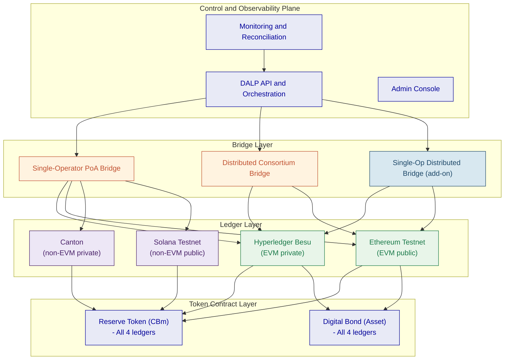
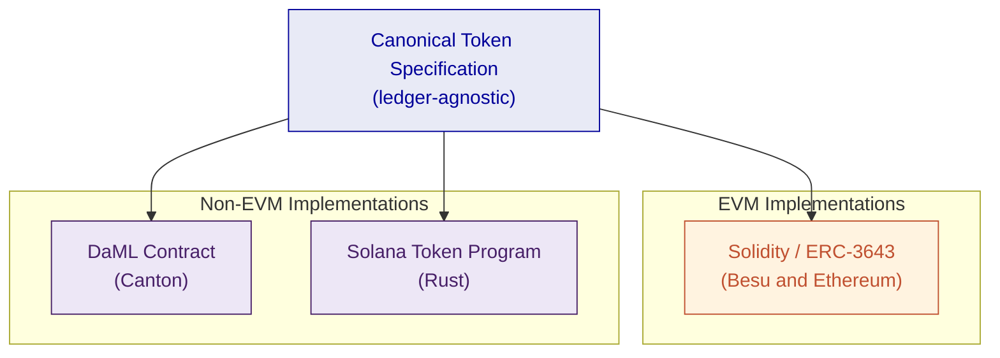
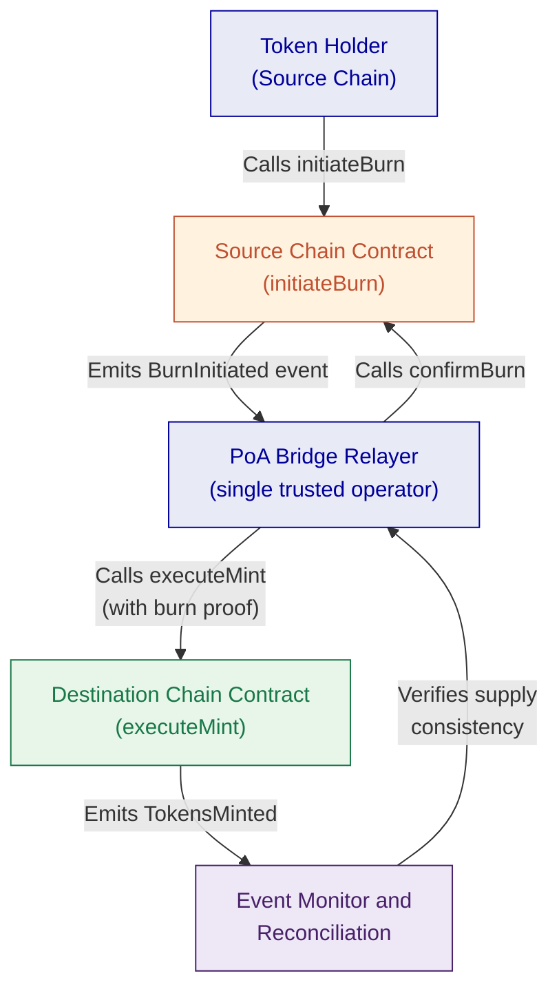
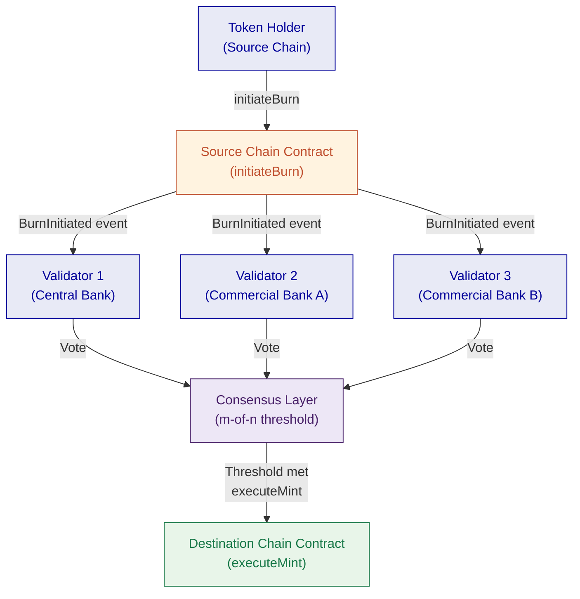
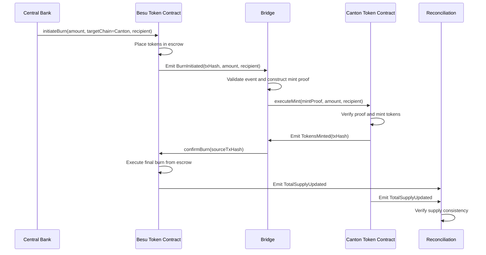
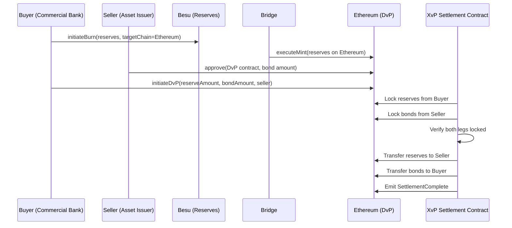
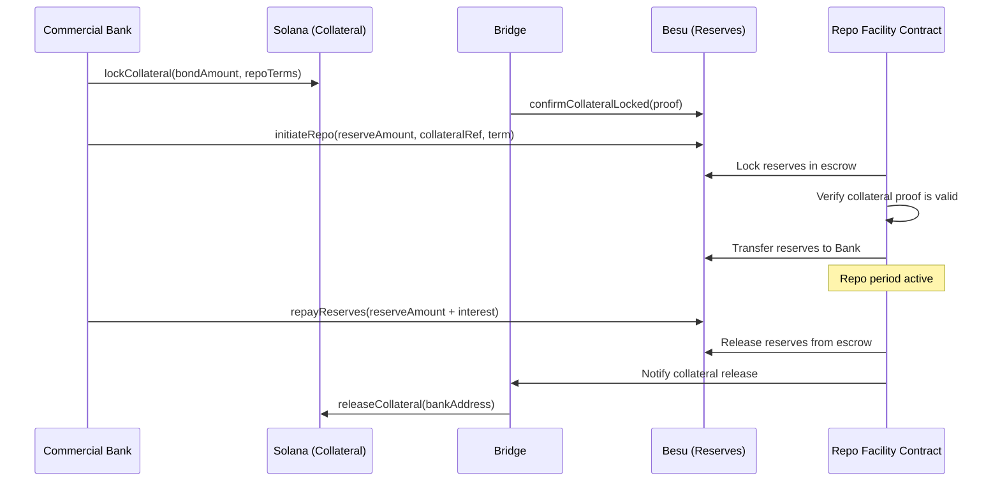
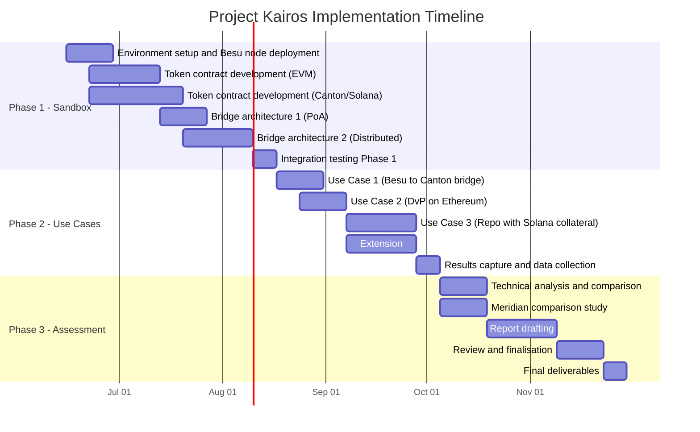

# Technical Proposal: Project Kairos

**Submitted to:** Bank for International Settlements (BIS) Innovation Hub, London Centre
**Project reference:** Project Kairos. Invitation to Tender
**Submitted by:** SettleMint NV
**Submission date:** 27 March 2026
**Valid until:** 27 June 2026
**Contact:** Roderik van der Veer, Founder and CTO, roderik@settlemint.com
**Confidentiality:** Confidential

---

## Executive Summary

Project Kairos addresses one of the most consequential questions in central bank digital infrastructure today: whether tokenised reserves, deposits, and securities can move reliably across heterogeneous distributed ledger networks while preserving the precise control that monetary policy requires. SettleMint submits this proposal as a platform company that has built, deployed, and operated production-grade digital asset infrastructure across regulated financial institutions for nearly a decade. We do not come to this project as explorers; we come as practitioners.

Our Digital Asset Lifecycle Platform (DALP) provides the token architecture, compliance engine, and settlement infrastructure that Project Kairos requires. We propose to deploy DALP to build and operate the experimentation sandbox across four ledger types, implement the token contracts specified in the Statement of Work, construct and compare three bridge architectures, and execute all three use case experiments. The work is grounded in existing DALP production capabilities, not in theoretical designs.

Specifically, SettleMint proposes to:

- Deploy a universal, ledger-agnostic token contract standard across Ethereum (EVM), Solana (non-EVM), Hyperledger Besu (EVM private), and Canton (non-EVM private), covering all token functions specified in the Statement of Work including mint, burn, transfer, approve lists, freeze, repatriate, EIP-2612 delegated allowances, reconciliation, and interest accrual
- Implement three bridge architectures: a single-operator proof-of-authority bridge, a distributed consortium bridge, and an optional single-operator distributed bridge
- Demonstrate all three use cases: tokenised reserve bridging between EVM and non-EVM private permissioned ledgers, DvP on public permissionless Ethereum using Besu reserves, and a repurchase agreement on private Besu using Solana collateral
- Host the Besu ledger within the BISIH cloud environment and connect to the BIS Innovation Hub's experimental infrastructure
- Produce a comparative analysis of bridge design trade-offs, contrasting this model with Meridian-style RTGS synchronisation

SettleMint brings directly relevant experience: production-grade tokenised securities across European and Asian regulated banks, live DvP settlement in production, cross-chain settlement via our XvP protocol, and multi-ledger deployments across EVM and non-EVM environments. The team proposed for Project Kairos has designed and shipped the core DALP settlement and token infrastructure.

The remainder of this proposal provides the technical architecture, implementation approach, team credentials, project plan, and pricing required for evaluation under the BIS ITT criteria.

---

## Company Overview

### About SettleMint

SettleMint is a production-grade digital asset lifecycle management company for regulated financial markets and sovereign use cases. Founded nearly a decade ago, SettleMint has grown from an early enterprise blockchain infrastructure provider into the platform company enabling financial institutions, market infrastructure providers, and sovereign entities to move real-world value on-chain with compliance, security, and operational reliability.

SettleMint exists to bridge the gap between tokenization ambitions and production-grade execution. Tokenization technology is increasingly accessible, but institutional-grade implementation is not. Meeting regulatory requirements, implementing proper governance, supporting the full asset lifecycle, and ensuring that early pilots can scale into real institutional infrastructure is where most institutions get stuck. SettleMint's mission is to enable regulated institutions to move from slides to balance sheets by turning digital asset strategy into operating infrastructure that reduces time-to-market and removes operational and regulatory risk.

### Organisational Information

| Attribute | Detail |
|---|---|
| Legal name | SettleMint NV |
| Headquarters | Brussels, Belgium |
| Regional presence | London, Dubai, Singapore, Tokyo, New Delhi |
| Founded | 2016 |
| Structure | Private company |
| Website | www.settlemint.com |
| Primary contact | Roderik van der Veer, Founder and CTO |

### Regulatory and Security Certifications

| Certification | Status |
|---|---|
| ISO 27001 | Certified |
| SOC 2 Type II | Certified |
| GDPR compliance | Full |

### Selected Client References

| Institution | Engagement |
|---|---|
| OCBC Bank | Security token engine; securitization, tokenization, fractionalization; HNWI investment products |
| Standard Chartered Bank | Digital Virtual Exchange; fractional tokenization; institutional trading Asia/Africa/Middle East |
| State Bank of India | CBDC infrastructure; secure, scalable digital currency; production deployment |
| Maybank (Project Photon) | FX tokenization and cross-border settlement; Exchange-versus-Payment (XvP); tokenized Malaysian Ringgit |
| KBC Securities (Bolero) | Equity crowdfunding; smart contracts for issuance, lifecycle, corporate actions |
| Commerzbank | Hybrid on/off-chain ETP issuance; near real-time clearing and settlement |
| Saudi Real Estate Registry | Country-scale real estate tokenization; registry-as-truth; national infrastructure |
| Reserve Bank of India (RBIH) | Multi-bank letter of credit trade finance; multi-node, multi-cloud blockchain |

The Maybank Project Photon engagement is particularly relevant to Project Kairos: SettleMint designed and deployed cross-currency atomic settlement using its XvP (Exchange-versus-Payment) protocol, which shares architectural lineage with the cross-chain bridging architecture proposed here. The State Bank of India CBDC deployment validates our capability to operate central bank-grade digital currency infrastructure in production.

### About DALP

DALP (Digital Asset Lifecycle Platform) is SettleMint's production-grade platform for designing, launching, and operating tokenised assets across financial instruments and real-world assets. DALP provides a unified platform covering the full digital asset lifecycle from asset design through issuance, compliance enforcement, custody integration, settlement, servicing, and retirement.

DALP sits between existing core financial systems and multiple blockchain networks, providing the governance and orchestration layer that enables institutions to build, deploy, and operate compliant digital asset solutions in production. The platform is designed to be operated over time, not just deployed.

---

## Understanding of Requirements

### Project Kairos Context

Project Kairos is a research experiment, not a production deployment, but it has production-grade technical requirements. The BIS Innovation Hub needs infrastructure that is real enough to generate meaningful results, operated by a team experienced enough to interpret them accurately, and flexible enough to test meaningfully different architectural configurations within a single project.

SettleMint's reading of the ITT and Statement of Work identifies four categories of requirement:

**Functional requirements** concern what the token contracts and bridges must do: mint, burn, transfer, control, reconcile, yield. DALP's existing token architecture satisfies the functional requirements natively. We propose to configure, not build from scratch.

**Topological requirements** concern the ledger landscape that must be supported: two EVM chains (Besu and Ethereum), one non-EVM public chain (Solana), one non-EVM private chain (Canton). SettleMint has deployed across all four of these network types in production contexts. No novel network integration is required.

**Bridge design requirements** concern the different governance models that must be tested: single-operator trusted bridge, distributed consortium bridge, and an optional single-operator distributed bridge. These represent meaningfully different trust and coordination models that have direct policy relevance for central banks.

**Comparative analysis requirements** concern the assessment deliverable: a systematic comparison of bridge design trade-offs, and a comparison with the Meridian project's RTGS synchronisation approach.

### Mapping to the Four Project Objectives

**Objective 1: Assess safe and efficient tokenisation of central bank reserves on private permissioned DLT ledgers**

DALP's token contract architecture is designed for precisely this use case. The `DALPAsset` contract, built on the ERC-3643 standard, provides the issuer-controlled freeze and repatriate functions the SOW specifies. The approve list mechanism maps directly to DALP's Identity Registry and compliance module system. The interest accrual mechanism maps to DALP's Fixed Treasury Yield feature.

For the Besu deployment, we propose to host the node within the BISIH cloud environment as specified, with SettleMint managing the node operations and providing connectivity to the bridge infrastructure.

**Objective 2: Test DLT bridges transferring tokenised assets across private permissioned and public permissionless ledgers while retaining programmable token logic**

The core technical challenge of Objective 2 is not token transfer per se; it is ensuring that the compliance controls, access restrictions, and token logic that govern a reserve token on Besu are also enforced on Ethereum and Solana. This is a harder problem than simple lock-and-mint bridging.

Our proposed architecture maintains token logic portability through a canonical token specification layer that is independent of any specific smart contract implementation. The same token definition, with the same approve list, freeze capability, and interest accrual logic, is deployed natively on each ledger type. The bridge coordinates state transitions and confirms mint/burn atomicity; it does not act as the sole enforcer of token logic.

**Objective 3: Explore different bridge designs**

We propose three bridge architectures that span the relevant design space for central bank use cases. Section 6 of this proposal provides detailed technical specifications for each. The selection covers the single-operator proof-of-authority model (fastest, simplest, most centralized), the distributed consortium model (slower, more complex, decentralised), and the optional single-operator distributed model (speed of central control with cryptographic distribution).

**Objective 4: Compare this model with synchronisation-based interoperability**

The Meridian project series tested RTGS synchronisation: a coordination protocol where assets on separate systems are exchanged by a trusted coordinator that receives both legs, verifies them, then releases both. Tokenised reserves plus bridging takes a different approach: assets actually move between ledgers, changing their chain of custody and making the bridge the settlement finality point rather than the RTGS.

We will produce a side-by-side analysis of equivalent complex use cases under both models, covering atomic settlement guarantees, latency, throughput, failure modes, and central bank policy implications. This analysis will form the core of the Phase 3 assessment report.

### Compliance with ITT Requirements

| ITT Requirement | SettleMint Approach | Confidence |
|---|---|---|
| Token mint by owner or bridge delegate | DALPAsset mint function with delegated minter role | Native |
| Token burn with escrow-confirm pattern | DALPAsset burn with escrow add-on and bridge confirmation hook | Native |
| Strict approve list across all ledger types | Identity Registry with compliance module enforcement | Native |
| Freeze transfer capability | Custodian extension forced-transfer block | Native |
| Repatriate tokens to issuer system | Custodian extension with recovery workflow | Native |
| EIP-2612 delegated allowance | Permit token feature | Native |
| Cross-chain reconciliation | Total supply tracking with reconciliation event log | Native |
| Interest accrual (overnight rate) | Fixed Treasury Yield feature with rate feed | Configurable |
| Ethereum testnet deployment | DALP factory deployment on Sepolia/Holesky | Native |
| Solana testnet deployment | Solana-native token program with equivalent logic | Adaptation required |
| Hyperledger Besu deployment | DALP factory deployment on BISIH-hosted Besu node | Native |
| Canton deployment | Canton DaML smart contract adaptation | Adaptation required |
| Single-operator PoA bridge | Proof-of-authority relayer implementation | Buildable |
| Distributed consortium bridge | Multi-sig validator set implementation | Buildable |
| Single-operator distributed bridge [add-on] | Single entity operating threshold signature scheme | Optional |
| Digital bond asset contract | Bond asset type in DALP | Native |
| Liquidity preferences [add-on] | On-chain or off-chain preferences store | Optional |

---

## Technical Architecture

### System Overview

Project Kairos requires infrastructure that spans four distinct ledger environments, three bridge architectures, and three experimental use cases. The architecture must be simultaneously modular enough to test configurations independently and integrated enough to support the comparative assessment.

SettleMint proposes a layered architecture with four tiers:

*Figure 1: Project Kairos system architecture*

The control plane is a single DALP deployment that maintains the canonical state registry, orchestrates bridge operations, manages keys and identities, and provides the monitoring and reconciliation layer. The bridge layer contains independently operable bridge implementations that connect the four ledger environments. The token contract layer contains the canonical token implementations deployed natively on each ledger.

### Token Contract Architecture

#### Design Principles

The SOW requires token contracts that are "agnostic to the underlying ledger" while satisfying specific functional requirements. This creates a design tension: token logic must be portable across EVM (Solidity) and non-EVM (DaML for Canton, Rust-based programs for Solana) environments, while maintaining the same behavioural guarantees.

Our approach separates the token specification from the token implementation. A canonical token specification document defines the required data elements and functions. Each ledger then implements this specification in its native language. The bridge layer treats these as logically equivalent representations of the same financial instrument, not as different assets.

*Figure 2: Canonical token specification and ledger-specific implementations*

#### EVM Token Contract (Besu and Ethereum)

On EVM-compatible ledgers, we implement the reserve token and digital bond using DALP's `DALPAsset` contract built on the ERC-3643 standard. This provides all functions specified in the SOW natively.

**Mint functionality:** The token contract owner holds the MINTER_ROLE. The bridge is granted a delegated MINTER_ROLE through the access control system. Multiple mint function variants are supported to accommodate different bridge designs: standard mint (single-authority), multi-sig mint (requiring m-of-n signatures before execution), and message-verified mint (requiring a signed message from the bridge that the burn was confirmed on the source chain).

**Burn functionality:** Token burns place tokens in escrow within the contract before the cross-chain confirmation arrives. The escrow pattern is implemented as a two-phase burn: (1) `initiateBurn` moves tokens to an escrow account and emits a `BurnInitiated` event that the bridge monitors; (2) `confirmBurn` executes the final burn upon receiving a bridge confirmation message. If confirmation does not arrive within a configurable timeout window, `cancelBurn` returns tokens from escrow to the original holder.

**Transfer and approve list:** The ERC-3643 Identity Registry maps each wallet address to an OnchainID contract. The compliance module system enforces that only wallets on the approve list can hold tokens. The approve list is controlled by the token issuer (GOVERNANCE_ROLE) or a delegated authority. Unlike a simple whitelist, the DALP implementation allows delegation of approve list management, enabling central bank authorities to delegate day-to-day management to operational teams while retaining governance control.

**Token control (freeze and repatriate):** DALP implements freeze and repatriate through the Custodian extension. A freeze sets a full or partial freeze on a wallet's token balance, preventing outbound transfers while preserving the on-chain record. Repatriation executes a forced transfer from the frozen wallet to the issuer's account, with an event log entry recording the regulatory basis for the action. Both operations emit structured events for the reconciliation layer.

**EIP-2612 delegated allowance:** The Permit token feature implements EIP-2612, enabling the bridge (or any authorized party) to receive a signed off-chain approval from a token holder and submit it on-chain as part of the same transaction that executes the transfer. This eliminates the two-transaction pattern (approve then transfer) that creates front-running risk and operational complexity.

**Reconciliation:** The token contract maintains a global supply counter and emits structured events for every mint, burn, and cross-chain escrow operation. A dedicated reconciliation contract tracks the total supply across all ledgers by aggregating these events and comparing against expected balances. In the event of a discrepancy, the reconciliation contract logs the break with enough context (event hashes, timestamps, ledger identifiers) to trace the origin.

**Token service (interest accrual):** The Fixed Treasury Yield feature tracks the average daily balance of each wallet and credits tokens based on the overnight interest rate published by the central bank. The rate is supplied via a trusted oracle feed and stored on-chain with the timestamp of the last update. Credits are calculated at the block level and accumulated; actual token minting occurs when a wallet claims its yield or at a scheduled distribution event.

#### Canton Token Contract (non-EVM private)

Canton uses DaML as its smart contract language. The reserve token on Canton is implemented as a DaML template with equivalent semantics to the ERC-3643 implementation, adapted for Canton's actor-based execution model.

Canton's privacy model is a natural fit for central bank operations: contracts in DaML are visible only to the parties named in them, which means token holdings are not globally visible on the ledger. The approve list is enforced through DaML's built-in authorization model: only parties explicitly named in a token holding contract can exercise its choices.

Key design decisions for the Canton implementation:

- Mint and burn are modelled as DaML choices on the token contract template, exercisable by the token issuer or a delegated bridging entity
- Freeze is implemented as a state field in the token template that blocks the Transfer choice
- Repatriation is implemented as a mandatory exercise of the Transfer choice by the issuer, overriding the normal authorization model through an explicit Repatriate choice that only the issuer can exercise
- The bridge entity receives delegated authority through DaML's disclosure mechanism rather than through an on-chain role registry

#### Solana Token Contract (non-EVM public)

On Solana, the reserve token is implemented using Solana's Token-2022 (Token Extensions) program, which provides native support for the control mechanisms the SOW requires:

- Transfer hooks: executed on every transfer, enforcing the approve list by checking against an on-chain account registry
- Permanent delegate: used to implement freeze and repatriate functionality at the program level
- Interest-bearing token: native support for interest accrual without a separate yield contract

The approve list is maintained as a Solana account-based registry. Token accounts can only receive tokens if their owner address appears in the registry. The bridge receives a permanent delegate role scoped to the mint authority, enabling it to initiate burns on behalf of token holders.

### Bridge Architecture

The three bridge architectures represent meaningfully different governance models. The choice of bridge is not primarily a technical decision; it is a policy decision about who is trusted, under what circumstances, and with what accountability mechanisms.

#### Bridge Architecture 1: Single-Operator Proof-of-Authority Bridge

*Figure 3: Single-operator PoA bridge flow*

In the single-operator model, a single trusted entity operates the bridge relayer. The relayer monitors source chain events, constructs mint proofs, and submits mint transactions on the destination chain. This is deliberately the simplest and least decentralised architecture.

The bridge relayer holds dedicated signing keys that are authorised as delegated minters and burn confirmers on all token contracts. Key management uses DALP's Key Guardian with HSM-backed storage for the bridge signing keys.

Trust model: the bridge operator is fully trusted. If the bridge operator is compromised or acts maliciously, they could theoretically mint tokens without a corresponding burn. This is acceptable in the experimentation context where the bridge operator is the BISIH or a directly supervised entity, but would not be acceptable in a production deployment without additional governance controls.

Latency profile: median bridge time is dominated by source chain finality plus transaction inclusion time on the destination chain. On private permissioned ledgers with known validators, this is typically 5 to 15 seconds end-to-end.

#### Bridge Architecture 2: Distributed Consortium Bridge

*Figure 4: Distributed consortium bridge flow*

In the distributed model, a consortium of regulated entities operates the bridge validators. Each validator independently monitors source chain events and casts a vote. The mint executes only when the configured threshold of validators has voted in favour (for example, 3 of 5, or 2 of 3).

The validator set for the experiment is drawn from the BIS Innovation Hub, participating central banks, and commercial bank participants. Each validator operates an independent node with its own signing key. No single validator can execute a mint unilaterally.

Consensus implementation: validator votes are submitted to a multi-sig smart contract on the destination chain. When the threshold is reached, the contract executes the mint atomically. This means the consensus is enforced on-chain, not in the validator software, eliminating the risk of a compromised coordinator.

Trust model: the bridge is secure as long as fewer than the minority threshold of validators are compromised or collude. In a 3-of-5 model, three validators must collude to execute an unauthorized mint. The central bank retains the ability to pause the bridge unilaterally by withdrawing its validator key.

Latency profile: median bridge time is dominated by the time for the threshold of validators to observe the source chain event and submit their votes. With 3 validators, the median is approximately 2 to 3 block times after source chain finality. This is typically 30 to 90 seconds depending on network configuration.

#### Bridge Architecture 3: Single-Operator Distributed Bridge (Add-on)

This extension combines the operational simplicity of the single-operator model with cryptographic distribution of key material. A single legal entity operates the bridge, but the bridge's signing key is held in a threshold signature scheme (TSS) split across multiple HSM instances operated by that entity.

The bridge operator cannot access the complete signing key from any single system. Generating a valid bridge signature requires participation from a minimum threshold of the HSM instances, all of which may be within the operator's infrastructure but in different security zones or geographic locations.

From a token contract perspective, this bridge is indistinguishable from the single-operator PoA bridge: the contract sees signatures from a single delegated key. The distribution is internal to the bridge operator's infrastructure.

Policy relevance: this model is relevant for central banks that want operational simplicity (one counterparty, one SLA, one governance framework) but need cryptographic assurance that a single compromised server cannot generate unauthorized bridge transactions.

### Ledger Infrastructure

#### Hyperledger Besu (EVM Private)

Besu will be deployed and hosted within the BISIH cloud environment. SettleMint provides the Helm-based deployment configuration, node management tooling, and monitoring integration. The Besu network uses QBFT (Quorum Byzantine Fault Tolerant) consensus, which provides immediate finality and is appropriate for permissioned environments.

Network configuration:
- Validator nodes: 4 (providing Byzantine fault tolerance for up to 1 faulty node)
- Block time: 2 seconds
- Gas limit: configured to prevent gas exhaustion without imposing performance constraints
- Access control: permissioned at the node level; only authorised nodes can join the network

The BISIH cloud environment hosts the validator nodes and RPC infrastructure. SettleMint provides the node software, configuration, and monitoring; BISIH manages the cloud infrastructure provisioning.

#### Ethereum Testnet (EVM Public)

The token contracts are deployed on either Sepolia or Holesky testnet, subject to final agreement with BIS. Both networks are long-lived, well-maintained Ethereum testnets with good tooling support and reliable faucets for test ETH. We recommend Sepolia for its stability and alignment with Ethereum Foundation's long-term testnet strategy.

DALP's existing factory infrastructure handles the Ethereum deployment. No additional node hosting is required; SettleMint connects to public RPC endpoints.

#### Canton (Non-EVM Private)

Canton is a privacy-preserving distributed ledger designed for financial services. Its key differentiator is that contract state is only visible to the parties named in it, making it suitable for central bank use cases where reserve balances must not be publicly observable.

The Canton network for this experiment uses a participant node model. SettleMint operates participant nodes and connects to the Canton domain (sync domain) that coordinates consensus. The token contracts are deployed as DaML templates and instantiated per-participant.

Canton's non-EVM architecture requires adaptation work for the token contract: the DaML implementation is functionally equivalent to the ERC-3643 contract but expressed in Canton's actor-based execution model. This is a known and manageable adaptation.

#### Solana Testnet (Non-EVM Public)

Token contracts are deployed on Solana's Devnet environment. Solana's Token-2022 program provides the native hooks required for the approve list and control mechanisms. The Rust-based program implementing the token logic is compiled to Solana's BPF instruction set and deployed through the standard Solana deployment process.

DALP's bridge infrastructure connects to Solana through the JSON-RPC interface. Event monitoring uses Solana's pubsub subscription API for low-latency event detection.

### Use Case Implementation

#### Use Case 1: Bridging Tokenised Reserves Between Private Permissioned Ledgers

This use case bridges reserve tokens from Hyperledger Besu (EVM) to Canton (non-EVM), testing cross-architecture token portability within the private permissioned perimeter.

*Figure 5: Use Case 1 sequence: Besu to Canton reserve token bridge*

The bridge must handle the EVM-to-non-EVM translation: the source chain generates an Ethereum event log, and the destination chain requires a DaML exercise command. The bridge transforms between these representations after verifying the burn proof.

The approve list must be maintained consistently across both ledgers. When a wallet is added to the Besu approve list, the bridge triggers a corresponding Canton identity registration. This cross-chain identity synchronisation is a critical correctness requirement: a token holder approved on Besu must also be approved on Canton before the bridged tokens can be received.

Testing matrix: this use case is tested across all three bridge architectures, generating nine test runs (3 bridges × 3 experimental conditions per bridge). Results are logged and compared for latency, failure rate, and governance overhead.

#### Use Case 2: DvP on Public Permissionless Ledger

This use case executes a delivery-versus-payment transaction on Ethereum (EVM public) using reserve tokens sourced from Besu (EVM private). The asset token (digital bond) resides on Ethereum; the reserve tokens must be bridged from Besu to Ethereum before the DvP can execute.

*Figure 6: Use Case 2 sequence: cross-chain DvP with Besu reserves on Ethereum*

The DvP settlement uses DALP's XvP (Exchange-versus-Payment) settlement protocol, deployed as a smart contract on Ethereum. The XvP contract coordinates the simultaneous exchange of two asset types: the reserve token (cash leg) and the digital bond (asset leg). Both legs must be locked in the contract before either can be released. If either lock fails, the entire transaction reverts.

This atomicity guarantee is the core value proposition: unlike legacy settlement where the asset and cash legs may clear separately with a gap risk in between, the on-chain XvP contract provides T+0 settlement finality with no counterparty risk.

A critical design challenge in this use case is the timing coordination between the Besu-to-Ethereum bridge and the DvP initiation. The buyer's reserves must appear on Ethereum before the DvP can be locked. We propose a pre-funding model for the experiment: the buyer pre-bridges reserves to Ethereum before the DvP session begins. This avoids the latency uncertainty of just-in-time bridging during the settlement window.

#### Use Case 3: Repurchase Agreement on Private EVM Using Public Non-EVM Collateral

This use case executes a repurchase agreement where a commercial bank sources central bank reserves on Besu (EVM private) by locking digital bond collateral that resides on Solana (non-EVM public).

*Figure 7: Use Case 3 sequence: cross-chain repo with Solana collateral and Besu reserves*

The repo facility contract on Besu manages the reserve side of the transaction. It accepts a collateral proof (a signed attestation from the bridge that the corresponding bond tokens are locked on Solana) and releases reserves against it. The contract enforces the repo term and interest calculation, and coordinates the release of collateral upon repayment.

The Solana-to-Besu bridge direction presents the most architecturally complex scenario in the project: it requires bridging from a non-EVM public chain to an EVM private chain. The bridge must monitor Solana's account-based state for the collateral lock event, construct a proof that is verifiable in Solidity on Besu, and relay that proof through whichever bridge architecture is under test.

This is the use case that most directly tests the non-EVM portability requirement of Objective 1.

---

## DALP Platform Capabilities

### Asset Designer and Token Configuration

DALP provides a guided wizard interface for configuring tokenised assets. The Asset Designer walks through instrument definition, feature selection, compliance module binding, and identity registry configuration. For Project Kairos, the Asset Designer is used in Phase 1 to configure the initial token templates for both the reserve token and the digital bond.

The wizard validates each configuration step, preventing misconfigured tokens from being deployed to the test networks. This reduces setup errors in the early phases of the experiment when configuration changes are most disruptive.

*DALP Asset Designer, configuring instrument parameters for a new tokenised asset*

### Token Lifecycle Dashboard

The DALP dashboard provides real-time visibility across all deployed assets: total supply, holder distribution, compliance status, and transaction history. For Project Kairos, the dashboard is the primary operational monitoring surface for the experiment team.

Each cross-chain bridge transaction is logged in the DALP event ledger and appears in the dashboard with source chain, destination chain, amount, and settlement status. Failed or pending bridge transactions trigger alerts.

*DALP Dashboard, asset overview showing supply, holders, and transaction activity*

### Bond Asset Type

The digital bond used in Use Cases 2 and 3 is deployed using DALP's Bond asset type. The Bond type includes pre-configured lifecycle logic for coupon payments, maturity redemption, and principal and interest (P&I) distributions, matching the requirements specified in the SOW for digital asset servicing.

*DALP Bond asset, lifecycle management including coupon schedule and holder registry*

### XvP Settlement

DALP's XvP Settlement addon implements the atomic exchange protocol used in Use Case 2. The XvP contract coordinates simultaneous delivery of both legs of a DvP transaction, ensuring settlement finality without counterparty risk.

*DALP XvP Settlement, atomic delivery-versus-payment coordination*

### Compliance and Policy Templates

DALP's compliance framework includes pre-built policy templates for common regulatory requirements. For Project Kairos, the approve list enforcement and freeze/repatriate controls are configured through the compliance module interface.

*DALP Compliance, policy template configuration for access control and transfer restrictions*

### Monitoring and Observability

DALP provides a production-grade observability stack built on Prometheus, Grafana, and structured event logging. For Project Kairos, the monitoring layer tracks bridge transaction latency, supply reconciliation status, and node health across all four ledger environments.

*DALP Monitoring, real-time system health and transaction flow monitoring*

---

## Implementation Plan

### Project Phases

The three-phase structure mirrors the ITT specification. We have further subdivided each phase to reflect the implementation sequence and dependencies.

*Figure 8: Project Kairos implementation timeline*

### Phase 1: Building the Experimentation Sandbox

Phase 1 runs from contract start (15 June 2026) through approximately mid-August 2026. The objective is to have all four ledger environments operational with deployed token contracts and at least the two primary bridge architectures functional.

**Environment Setup (Weeks 1-2)**
SettleMint works with the BISIH team to provision the Besu network within the BISIH cloud environment. This includes node deployment using SettleMint's Helm charts, network configuration and peer connectivity, RPC endpoint setup, and monitoring integration. The Ethereum and Solana testnet connections are configured in parallel. Canton participant nodes are provisioned either within BISIH infrastructure or in a SettleMint-managed environment, subject to agreement.

Deliverables: operational Besu network; connectivity to Ethereum and Solana testnets; Canton participant nodes live; network monitoring dashboards configured.

**Token Contract Development (Weeks 2-6)**
Token contracts are developed in two parallel workstreams: EVM contracts (Besu and Ethereum) and non-EVM contracts (Canton and Solana). The EVM workstream builds on DALP's existing `DALPAsset` infrastructure and requires primarily configuration and deployment. The non-EVM workstream requires adaptation work for Canton (DaML) and Solana (Token-2022 with custom logic).

The token contracts are deployed to testnet environments progressively: Besu first (most controlled), then Ethereum, then Solana, then Canton. Each deployment is followed by a functional verification phase confirming that all SOW-required functions operate correctly.

Deliverables: deployed and verified token contracts on all four ledgers; cross-ledger identity synchronisation operational; reconciliation layer connected.

**Bridge Development (Weeks 5-10)**
Bridge architectures 1 and 2 are built in parallel. The PoA bridge is simpler and completes first; it serves as the initial integration test vehicle for all four ledger pairs. The distributed bridge requires additional development time for the multi-sig validator contract and the validator node software.

Deliverables: operational single-operator PoA bridge across all four ledger pairs; operational distributed bridge across all four ledger pairs; bridge monitoring integrated into DALP dashboard.

**Phase 1 Integration Testing (Week 12)**
End-to-end integration tests across all four ledger environments and both primary bridge architectures. Test cases cover: token minting on each ledger, token burns with escrow confirmation, bridge transfers for all supported ledger pairs, approve list enforcement, freeze and repatriate operations.

Deliverables: integration test report; confirmed readiness for Phase 2 use case execution.

### Phase 2: Testing Use Cases

Phase 2 runs from approximately mid-August through late September 2026. The objective is systematic execution and measurement of all three use cases across all bridge architectures.

**Use Case 1 Execution (Weeks 13-14)**
Liquidity transfer experiments: reserve token bridging from Besu to Canton and reverse. Each experiment is run three times per bridge architecture, recording latency, gas costs, failure rate, and reconciliation consistency. The distributed bridge configuration is varied (2-of-3, 3-of-5) to assess the impact of threshold requirements on performance.

**Use Case 2 Execution (Weeks 14-16)**
DvP experiments on Ethereum with Besu-sourced reserves. Tests cover: successful DvP settlement, failed DvP due to insufficient reserves, failed DvP due to non-approved asset holder, and DvP settlement with concurrent bridge latency. Settlement latency, atomicity guarantees, and failure recovery are measured.

**Use Case 3 Execution (Weeks 16-19)**
Repo experiments on Besu with Solana collateral. Tests cover: successful repo initiation and repayment, repo default scenario, collateral value mismatch handling, and cross-chain latency impact on repo availability. The Solana-to-Besu bridge direction receives particular attention given its cross-architecture complexity.

**Extension Scope (Weeks 16-19, in parallel)**
Bridge Architecture 3 (single-operator distributed) and liquidity preferences are implemented as optional scope in Phase 2. These extensions are scoped and priced separately. If selected, they are developed and tested in parallel with Use Cases 2 and 3.

**Data Collection (Week 20)**
All experiment results are consolidated: transaction logs, latency measurements, reconciliation event logs, bridge operation records, and gas consumption data. This data forms the empirical basis for the Phase 3 assessment report.

### Phase 3: Assessment and Report Drafting

Phase 3 runs from October through late November 2026. The objective is a rigorous comparative analysis and the production of the final assessment report.

**Technical Analysis (Weeks 21-22)**
SettleMint's technical team analyses the experiment data, comparing the three bridge architectures across the following dimensions:

- Settlement latency (median, 95th percentile, maximum)
- Throughput (transactions per second at saturation)
- Failure modes and recovery procedures
- Operational complexity (validator coordination, key management)
- Privacy characteristics (what information each bridge operator can observe)
- Central bank control (ability to pause, revert, or intervene)
- Regulatory fit (which design best aligns with typical central bank policy frameworks)

**Meridian Comparison (Weeks 21-22, in parallel)**
The side-by-side comparison with Meridian-style RTGS synchronisation addresses four equivalent use cases: reserve transfer, DvP settlement, repo, and liquidity rebalancing. For each use case, the comparison covers: atomic settlement guarantees, latency characteristics, failure modes, central bank intervention options, and operational infrastructure requirements.

This analysis answers the core research question of Objective 4: under what conditions is tokenised reserves plus bridging preferable to synchronisation, and under what conditions is it not?

**Report Drafting (Weeks 23-25)**
The assessment report is co-drafted with the BIS Innovation Hub team. SettleMint provides the technical findings; the BIS team provides the policy and regulatory analysis. The report covers all four objectives, presents the empirical experiment results, and provides the comparative bridge design analysis and Meridian comparison.

**Review and Finalisation (Weeks 26-27)**
Draft report reviewed by BIS technical and policy teams. SettleMint addresses feedback and revisions. Final report delivered in Week 27, with all source code, test scripts, and experiment data as supporting annexes.

---

## Team and Governance

### Project Team

SettleMint assigns a dedicated project team for the duration of Project Kairos. The team is drawn from the engineering and architecture groups that built DALP's core token and settlement infrastructure.

| Role | Responsibilities |
|---|---|
| Project Lead / Solution Architect | Overall delivery accountability; BIS relationship; architecture decisions |
| Senior Smart Contract Engineer (EVM) | Besu and Ethereum token contracts; bridge contract development |
| Senior Smart Contract Engineer (non-EVM) | Canton DaML implementation; Solana Token-2022 implementation |
| Bridge Infrastructure Engineer | Bridge relayer development; validator node software; key management |
| DevOps / Infrastructure Engineer | Besu node deployment; cloud infrastructure; monitoring integration |
| Senior Data Engineer | Reconciliation layer; event processing; experiment data collection |
| Technical Writer | Phase 3 report drafting; documentation |

The Project Lead is a senior architect with direct experience delivering cross-chain and central bank digital asset infrastructure at SettleMint. The non-EVM engineer has specific production experience with Canton DaML contracts in financial services deployments.

### Governance and Change Control

Project Kairos is operated under a lightweight governance framework appropriate for a research experiment with a defined scope and timeline.

Weekly technical sync meetings between the SettleMint project team and the BISIH technical team. Monthly steering committee review covering progress, risk, and any scope change requests. Change requests for scope modifications (including extension scope) are submitted in writing and require written approval from the BISIH project lead.

The BISIH team retains full access to all deployed infrastructure: RPC endpoints, monitoring dashboards, smart contract source code, and bridge logs. SettleMint operates in a transparent, audit-open mode throughout the project.

---

## Security and Compliance

### Security Architecture

DALP's security architecture enforces defense-in-depth across five independent control layers: identity verification, role-based access control, transaction-level wallet verification, on-chain compliance enforcement, and custody provider policy evaluation. No single-layer failure grants unauthorized access to digital assets.

For Project Kairos, the security model is adapted for the experimental context while maintaining institutional-grade controls:

**Key Management:** Bridge signing keys are stored in DALP's Key Guardian with HSM-backed storage. No bridge signing key material is stored in plaintext. Key rotation procedures are documented and executable within 30 minutes. The distributed bridge architecture uses separate key material for each validator, with no shared key material between validators.

**Network Security:** The Besu network is operated on a permissioned basis with node-level access control. Only authorised nodes can connect. RPC endpoints are protected behind authentication and rate limiting. Internal node communication uses TLS.

**Smart Contract Security:** All EVM smart contracts are deployed from DALP's audited codebase. DALP's core contracts have been through multiple independent security audits. For Project Kairos, any new contract code (bridge contracts, Canton DaML templates, Solana programs) will be reviewed by SettleMint's internal security team before deployment to the live experiment environment.

**Audit Trail:** Every token operation, bridge transaction, and administrative action is logged with immutable event records on the relevant chain. Off-chain bridge operations are logged in a tamper-evident append-only log. The BISIH team receives read access to all logs for independent verification.

### BIS IT Security Compliance

SettleMint acknowledges the BIS IT Security Standards referenced in the Terms and Conditions. SettleMint's ISO 27001 and SOC 2 Type II certifications provide the framework for our information security program.

Credential checking procedures: SettleMint complies with BIS credential checking requirements for all personnel who will have access to BIS Premises or BIS Data. Personnel assigned to Project Kairos will complete the BIS credential checking procedure before commencing work. SettleMint confirms it will not assign personnel who fail credential checking.

Code of Conduct: all SettleMint personnel assigned to Project Kairos will be briefed on the BIS Code of Conduct for Contractors and will comply with its requirements.

Confidential information: all information provided by BIS in connection with Project Kairos is treated as Confidential Information under the BIS Terms and Conditions. SettleMint applies information classification controls commensurate with the BIS confidentiality requirements.

---

## Extension Scope

The following items are explicitly scoped as optional extensions in the SOW. SettleMint prices these separately to allow BIS to select or defer them without affecting the core project.

### Extension 1: Single-Operator Distributed Bridge

A single legal entity operates a consensus-driven bridge using threshold signature cryptography. The signing key is distributed across multiple HSM instances; generating a valid bridge signature requires participation from a minimum threshold.

This is architecturally distinct from the distributed consortium bridge (which uses multiple independent legal entities) and from the simple PoA bridge (which uses a single key). It provides operational simplicity with cryptographic protection against single-server compromise.

Implementation adds approximately 4 weeks to Phase 1 and requires additional HSM infrastructure. Testing of this bridge variant runs in parallel with Phase 2 Use Cases 2 and 3.

### Extension 2: Liquidity Preferences

Entities that hold reserve tokens are enabled to configure their preferred liquidity levels across chains. These preferences drive automated liquidity rebalancing when actual balances deviate from preferred targets.

The implementation is agnostic to on-chain versus off-chain storage, as specified in the SOW. SettleMint proposes an on-chain registry with a configurable update interval, providing transparency and auditability of preference changes.

The liquidity rebalancing logic triggers bridge transactions when the imbalance exceeds a configurable threshold, sourcing liquidity from chains where the holder holds excess reserves. This "smart sourcing" capability is a natural extension of the bridge infrastructure already built for the core scope.

Implementation adds approximately 3 weeks to Phase 2.

---

## Risk Management

| Risk | Probability | Impact | Mitigation |
|---|---|---|---|
| Canton DaML contract complexity exceeds estimate | Medium | Medium | Pre-scoped spike in Phase 1 Week 1; escalation path to BIS if resizing needed |
| Solana Devnet instability | Low | Medium | Use stable release channel; fallback to local Solana validator for isolated tests |
| Besu cloud provisioning delays | Low | High | Begin environment discussions immediately after contract signing; SettleMint provides infrastructure-as-code |
| Bridge key compromise | Low | High | HSM-backed key storage; monitoring for unauthorized bridge transactions; circuit breaker in bridge contracts |
| EIP-2612 incompatibility on non-EVM chains | Medium | Low | Equivalent delegated approval mechanisms exist in DaML and Solana; semantic equivalence documented in token specification |
| Phase 3 report timeline pressure | Medium | Medium | Report structure and data collection templates defined in Phase 1; co-drafting starts in Phase 2 |

---

## Comparative Analysis Framework

### Bridge Design Trade-offs

The three bridge architectures represent different positions on the trust/decentralization spectrum. Summarising the key trade-offs before the empirical experiments run:

| Dimension | Single-Operator PoA | Distributed Consortium | Single-Op Distributed |
|---|---|---|---|
| Settlement latency | Lowest (~5-15s) | Moderate (~30-90s) | Low (~10-20s) |
| Throughput | Highest | Lower (consensus bottleneck) | High |
| Trust assumption | Operator fully trusted | Minority threshold honest | Operator org trusted; keys distributed |
| Governance | Bilateral (BIS + Operator) | Multilateral (all validators) | Bilateral |
| Central bank intervention | Operator can pause immediately | Requires threshold agreement | CB can revoke CB validator share |
| Regulatory accountability | Clear single counterparty | Distributed accountability | Clear single counterparty |
| Failure recovery | Fast (single decision maker) | Slower (requires coordination) | Fast |
| Best suited for | Initial experiments; bilateral CB arrangements | Multi-bank operations; production consortia | Regulated entities requiring auditability |

### Project Kairos vs. Meridian Series

The Meridian project series explored RTGS synchronisation: tokenized assets on separate ledgers are exchanged by a coordination protocol that holds both legs until confirming simultaneous execution, achieving atomic settlement without either asset actually moving ledgers.

Project Kairos explores a different model: tokenised reserves are the settlement asset, and they actually move across ledgers through bridges. This changes the trust and operational model in several important ways:

**Settlement finality:** In both models, atomic settlement is achievable. The difference is where finality is recorded. In RTGS synchronisation, finality is in the RTGS; in the bridging model, finality is on the destination chain.

**Central bank reserve control:** In the RTGS synchronisation model, reserves remain on the RTGS at all times. The central bank's control over its reserves is complete and continuous. In the bridging model, reserves exist on external ledgers between the bridge-out and the bridge-back. Central bank controls (freeze, repatriate) must be enforced across all ledger environments where reserves may reside.

**Programmability:** Bridged reserves can participate in smart contract logic on the destination chain, enabling programmable settlement conditions (delivery triggers, conditional payments, automatic repos) that are not possible with reserves locked in an RTGS. This is the primary programmability advantage of the Project Kairos model.

**Interoperability scope:** RTGS synchronisation is constrained to ledgers that can communicate with the RTGS. The bridging model can extend to any ledger that can communicate with the bridge, including public permissionless networks.

The Phase 3 assessment report will present this comparison with empirical data from the experiments, rather than the theoretical analysis presented here.

---

## Support and Service Levels

### During the Project

SettleMint provides a dedicated support channel for the BIS Innovation Hub project team during the contract period. Response times:

| Severity | Definition | Response time |
|---|---|---|
| Critical | System down; experiment blocked | Within 2 hours, 24/7 |
| High | Major function impaired; experiment degraded | Within 4 hours, business hours |
| Medium | Minor function impaired | Within 1 business day |
| Low | Informational; documentation | Within 3 business days |

Infrastructure monitoring is active 24/7 with automated alerting for node failures, bridge errors, and supply reconciliation discrepancies. The SettleMint operations team is paged for critical issues outside business hours.

### Post-Project Knowledge Transfer

At project completion, SettleMint provides:

- All smart contract source code with documentation
- Bridge relayer source code with deployment and configuration guide
- Infrastructure configuration files (Helm charts, Terraform modules)
- Experiment data sets in structured format
- Architecture decision records for all major design choices made during the project
- A 2-day technical debrief workshop with the BIS Innovation Hub engineering team

---

## Commercial Summary

SettleMint prices Project Kairos on a time-and-materials basis with a fixed-fee cap for the core scope. Extension scope is priced separately as optional add-ons.

### Core Scope (Fixed Fee)

| Component | Description |
|---|---|
| Phase 1: Sandbox build | Environment setup, token contracts (all 4 ledgers), Bridge 1 + Bridge 2, integration testing |
| Phase 2: Use case execution | Use Cases 1, 2, and 3 across primary bridge architectures; data collection |
| Phase 3: Assessment and report | Technical analysis, Meridian comparison, report drafting, review and finalisation |

Pricing for the core scope is provided in the separate Commercial Appendix.

### Optional Extension Scope

| Extension | Description | Estimated effort |
|---|---|---|
| Bridge 3: Single-operator distributed | TSS-based bridge; Phase 1 and 2 testing | +4 weeks |
| Liquidity preferences | On-chain preference registry; automated rebalancing | +3 weeks |

### Payment Schedule

| Milestone | Timing | Amount |
|---|---|---|
| Contract signing | June 2026 | 25% |
| Phase 1 completion | August 2026 | 25% |
| Phase 2 completion | October 2026 | 25% |
| Final report delivery | November 2026 | 25% |

All prices exclude applicable taxes. BIS's tax-exempt status as an international organisation is acknowledged.

---

## Appendix A: Compliance Matrix

| SOW Requirement | Section reference | Addressed |
|---|---|---|
| Token mint by owner or bridge delegate | Token Contract Architecture | Yes |
| Multi-variant mint functions for different bridge designs | Token Contract Architecture | Yes |
| Token burn with escrow pattern | Token Contract Architecture | Yes |
| Approve list on all ledger types | Token Contract Architecture | Yes |
| Freeze transfer capability | Token Contract Architecture | Yes |
| Repatriate capability | Token Contract Architecture | Yes |
| EIP-2612 delegated allowance | Token Contract Architecture | Yes |
| Cross-chain reconciliation mechanism | Token Contract Architecture | Yes |
| Interest accrual (overnight rate) | Token Contract Architecture | Yes |
| Public permissionless: Ethereum (EVM) | Ledger Infrastructure | Yes |
| Public permissionless: Solana (non-EVM) | Ledger Infrastructure | Yes |
| Private permissioned: Hyperledger Besu (EVM) | Ledger Infrastructure | Yes |
| Private permissioned: Canton (non-EVM) | Ledger Infrastructure | Yes |
| Besu hosted in BISIH cloud | Ledger Infrastructure | Yes |
| Single-operator PoA bridge | Bridge Architecture 1 | Yes |
| Distributed consortium bridge | Bridge Architecture 2 | Yes |
| Single-operator distributed bridge [add-on] | Extension Scope | Optional |
| Asset contract (digital bond) | Token Contract Architecture | Yes |
| Liquidity preferences [add-on] | Extension Scope | Optional |
| Use Case 1: EVM to non-EVM bridging | Use Case 1 | Yes |
| Use Case 2: DvP on public EVM with private reserves | Use Case 2 | Yes |
| Use Case 3: Repo on private EVM with public non-EVM collateral | Use Case 3 | Yes |
| Phase 3 comparative assessment report | Phase 3 | Yes |
| Meridian comparison study | Comparative Analysis Framework | Yes |

---

## Appendix B: Technology Stack

| Component | Technology | Version / Notes |
|---|---|---|
| EVM smart contracts | Solidity | 0.8.x; OpenZeppelin; DALP SMART Protocol |
| Canton contracts | DaML | Canton SDK current release |
| Solana programs | Rust / Token-2022 | Solana CLI current stable |
| Bridge relayer | TypeScript / Node.js | DALP SDK |
| Besu node | Hyperledger Besu | Current stable release; QBFT consensus |
| Container orchestration | Kubernetes + Helm | Deployed on BISIH cloud |
| Key management | DALP Key Guardian | HSM-backed; Thales or AWS CloudHSM |
| Monitoring | Prometheus + Grafana | DALP observability stack |
| CI/CD | GitHub Actions | Automated testing and deployment |
| Event indexing | DALP Chain Indexer | Custom subgraph for bridge events |

---

## Appendix C: SettleMint Certifications

| Certification | Issuing body | Status |
|---|---|---|
| ISO 27001 | BSI / TÜV | Current; audit schedule annual |
| SOC 2 Type II | Independent auditor | Current |
| GDPR Data Processing | Internal DPO + legal review | Full compliance |

Certificates are available on request.

---

## Appendix D: Declaration of Conflict of Interest

SettleMint declares that no conflict of interest exists with respect to Project Kairos or the Bank for International Settlements as of the date of this proposal. SettleMint has no financial relationship with any other bidder on this ITT. Should any potential conflict arise during the project, SettleMint will disclose it immediately to the BIS project lead.

---

## Appendix E: Signature

This proposal is submitted on behalf of SettleMint NV.

**Roderik van der Veer**
Founder and CTO, SettleMint NV
roderik@settlemint.com

Date: 27 March 2026
