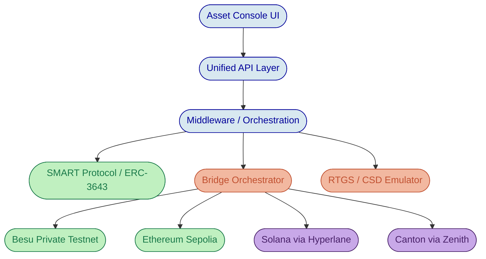
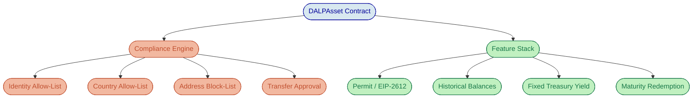
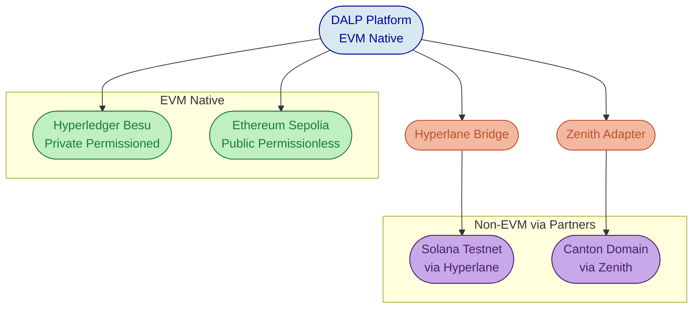
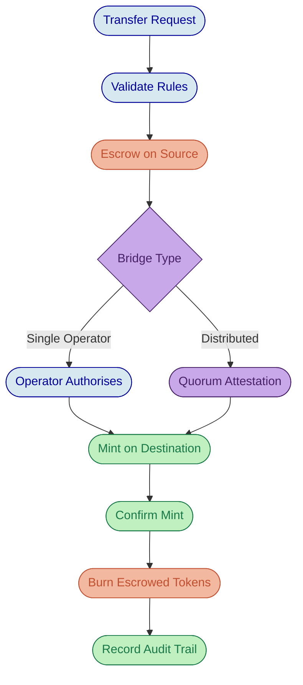
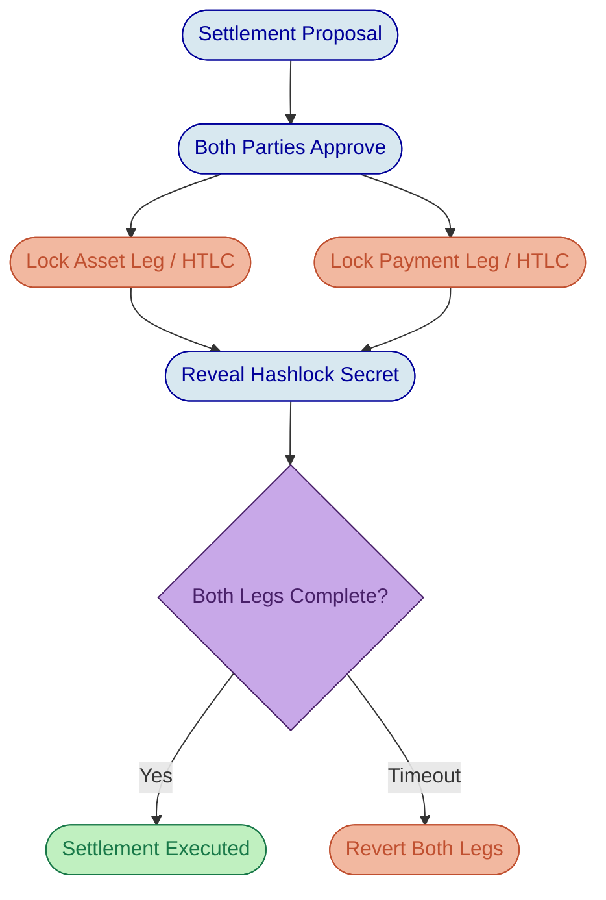
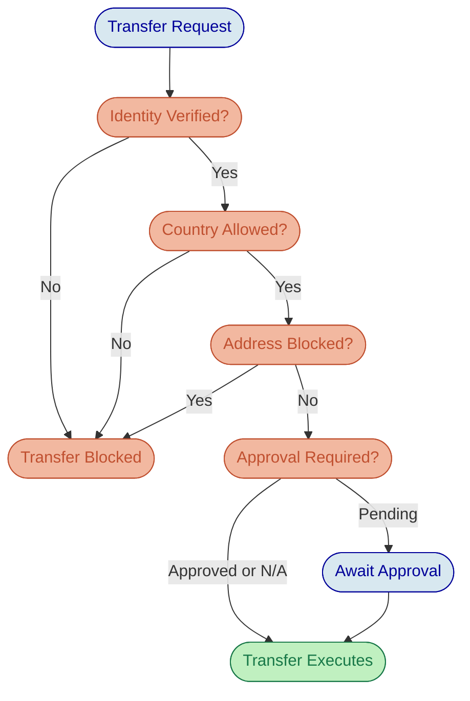
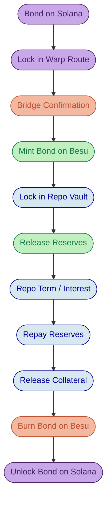
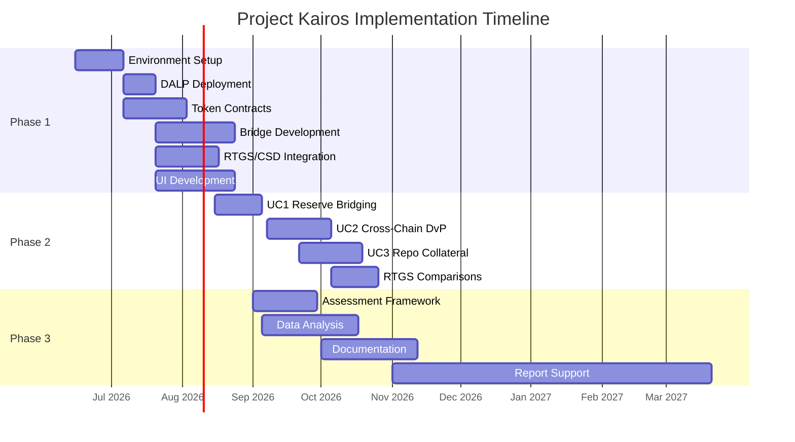
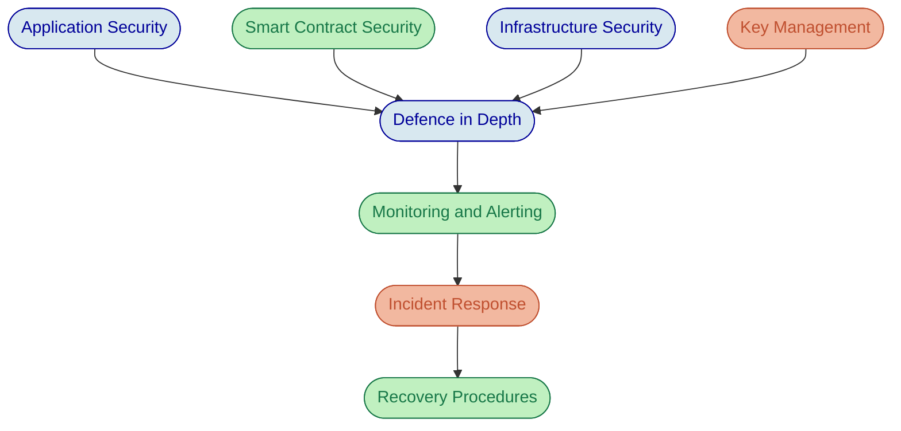
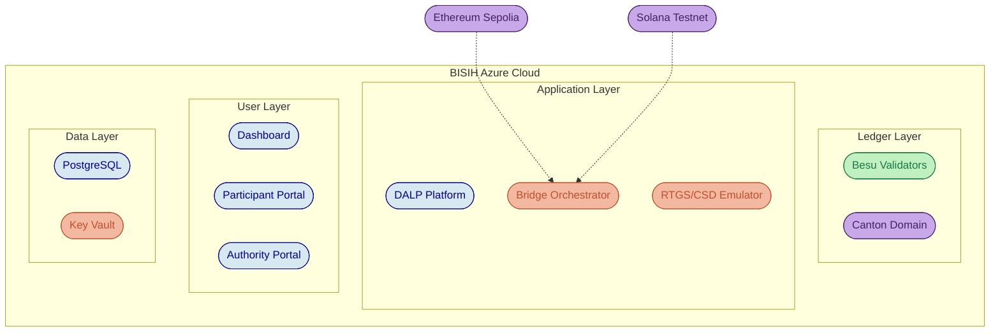

# Executive Summary

Project Kairos represents a pivotal initiative by the Bank for International Settlements Innovation Hub (BISIH) to explore the tokenisation of central bank reserves, commercial bank deposits, and securities across multiple distributed ledger technologies, and to test the mechanisms by which these tokenised instruments can move safely between ledgers with differing architectures and trust models. The project's ambitions are significant: build a multi-ledger experimentation sandbox, implement cross-chain bridges with varying governance models, execute complex settlement scenarios including Delivery-versus-Payment and repurchase agreements, and produce an assessment framework that informs central bank policy on digital asset infrastructure.

SettleMint, an EU-based company headquartered in Belgium, submits this proposal as a technology partner uniquely positioned to deliver the full scope of Project Kairos. With nearly a decade of focused experience building institutional-grade blockchain infrastructure for regulated financial institutions, sovereign entities, and market infrastructure providers, SettleMint brings production-validated technology, deep domain expertise in tokenised asset lifecycle management, and the operational maturity that a programme of this calibre demands.

The core challenge Project Kairos addresses is not tokenisation itself, which is increasingly accessible, but rather doing tokenisation correctly at the institutional level. Central banks require mechanisms to control tokenised reserves with the same precision they apply to traditional monetary instruments: freezing transfers, repatriating tokens, enforcing access controls, and reconciling on-chain positions against real-time gross settlement (RTGS) systems. These requirements demand more than basic smart contract capability. They require a platform that embeds compliance, governance, and lifecycle management into every operation by design.

SettleMint's Digital Asset Lifecycle Platform (DALP) provides exactly this capability. DALP is a composable, EVM-native platform that manages the entire tokenised asset lifecycle, from token design and issuance through compliance enforcement, custody integration, atomic settlement, servicing, and retirement. For Project Kairos, DALP delivers native support for the core EVM requirements (Hyperledger Besu and Ethereum testnets), with partner integration via Hyperlane for Solana interoperability and Zenith, SettleMint's forthcoming EVM compatibility layer, for Canton network connectivity.

## Proposed Approach

SettleMint proposes a three-phase delivery aligned to the BISIH timeline:

**Phase 1 (June to August 2026)** focuses on building the experimentation sandbox within the BISIH Azure Cloud environment. This includes deploying Hyperledger Besu private testnet nodes, connecting to Ethereum Sepolia, implementing all token contracts (reserves, deposits, digital bond) using DALP's ERC-3643 SMART Protocol, developing bridging entities for both single-operator and distributed models, and delivering the orchestrator dashboard, participant portal, and authority portal.

**Phase 2 (August to October 2026)** executes the three core use cases: bridging tokenised reserves between EVM and non-EVM private permissioned ledgers, cross-chain DvP settlement, and repo agreements with cross-chain collateral mobilisation. Each use case is tested across bridge design variants with comparative analysis against RTGS-synchronised settlement.

**Phase 3 (September to November 2026)** delivers the assessment framework, technical documentation, and comparative analysis supporting the BIS project report, with ongoing support through March 2027 for report drafting.

## Why SettleMint

SettleMint's candidacy rests on three reinforcing strengths. First, DALP provides production-validated token lifecycle management with the ERC-3643 standard, 12 compliance module types, atomic DvP/XvP settlement, and multi-chain EVM deployment, all relevant to Project Kairos requirements. Second, SettleMint's multi-year production deployments with regulated banks and sovereign entities demonstrate the operational maturity that separates experimental tooling from institutional infrastructure. Third, SettleMint's team combines protocol-level blockchain engineering, capital markets domain knowledge, and enterprise delivery discipline, the exact combination this programme requires.

## Confidence Assessment

SettleMint presents this proposal with transparency regarding capability boundaries:

- 🟢 **Full confidence**: Token issuance, lifecycle management, compliance enforcement, DvP settlement, reconciliation, identity management, and all EVM chain deployments (Besu, Ethereum)
- 🟡 **Partial confidence**: Solana testnet integration via Hyperlane partner integration (not native DALP functionality); Canton network connectivity via Zenith (forward-looking, currently in development)
- 🔴 **Acknowledged gap**: Native non-EVM chain execution; addressed through partner integrations and EVM adapter strategies

This transparency reflects SettleMint's commitment to honest capability representation. Every claim in this proposal maps to production-available functionality unless explicitly marked otherwise.

---

# Company Overview

## About SettleMint

SettleMint is the digital asset lifecycle platform company for regulated financial markets and sovereign use cases. Headquartered in Belgium as an EU-based company, SettleMint has grown from an early enterprise blockchain infrastructure provider into the category-defining platform company enabling financial institutions, market infrastructure providers, and sovereign entities to move real-world value on-chain with compliance, security, and operational reliability.

The company was founded nearly a decade ago with a clear mission: make regulated digital asset tokenisation compliant, secure, and scalable. While the broader blockchain industry cycled through speculative waves and corrective downturns, SettleMint maintained an unwavering focus on the institutional requirements that separate experimental technology from production infrastructure, namely regulatory compliance, key management, settlement finality, auditability, and operational sustainability.

## Market Position and Production Credentials

SettleMint is not a new entrant reacting to the latest tokenisation wave. The company's evolution reflects the broader maturation of the digital asset market, from early enterprise blockchain infrastructure through institutional adoption to the current digital asset lifecycle era. This trajectory has produced capabilities that cannot be replicated quickly:

- **Multi-year live deployments** with regulated banks and sovereign entities, delivering settlement finality, compliance enforcement, and operational availability under institutional SLAs. These are business-critical workflows, not sandbox experiments.
- **Sovereign and national-scale programmes** in the Middle East, including national real estate tokenisation and sovereign-backed capital markets infrastructure.
- **Security-validated operations** through penetration testing, vendor risk assessments, and compliance reviews typical of large financial institutions.

| Category | Evidence |
| --- | --- |
| Market Validation | Nearly 10 years focused on blockchain infrastructure; 7+ years of continuous production deployments |
| Operational Maturity | Live deployments across bonds, equities, deposits, stablecoins, real estate, funds |
| Sovereign Credibility | Active sovereign and national-scale programmes in the Middle East |
| Ecosystem Strength | Trusted by tier-1 and tier-2 banks, CSDs, and sovereign entities |
| Team Depth | 200+ years combined banking and blockchain experience across the team |

## Regulatory Readiness

SettleMint's platform supports compliance frameworks across multiple jurisdictions, including EU MiCA and GDPR, US Reg D/S/CF, Singapore MAS, UK FCA, Japan FSA, and GCC regional frameworks. Native support for the ERC-3643 regulated token standard, combined with OnchainID for verifiable on-chain identities, provides a compliance architecture that enforces eligibility before execution. This ex-ante compliance model is directly relevant to Project Kairos, where central banks require precise control over who can hold, transfer, and interact with tokenised reserves.

## Relevance to Project Kairos

SettleMint's profile aligns closely with BISIH's requirements for this engagement. The company brings:

- **Central bank and sovereign experience**: Multi-year delivery for sovereign-backed programmes provides direct understanding of the governance, security, and policy requirements that central banks impose on technology infrastructure.
- **EVM-native platform architecture**: DALP's deep EVM expertise covers both the Hyperledger Besu private permissioned and Ethereum public permissionless requirements of Project Kairos natively.
- **Composable token architecture**: The ability to configure token behaviour (access controls, freeze/repatriate, interest servicing, reconciliation) through runtime configuration rather than custom development accelerates sandbox delivery within the project timeline.
- **Settlement expertise**: Production-proven atomic DvP/XvP settlement provides the foundation for the cross-chain settlement scenarios central to Project Kairos.
- **EU jurisdiction**: As a Belgium-headquartered EU company, SettleMint operates under European data protection, corporate governance, and regulatory frameworks.

## Team and Delivery Capability

The team proposed for Project Kairos combines protocol-level blockchain engineering, capital markets domain knowledge, and enterprise delivery expertise. SettleMint's engineering organisation includes smart contract architects with deep ERC-3643 and EVM expertise, infrastructure engineers experienced in Hyperledger Besu deployment and operations, integration specialists with institutional custody and payment rail experience, and solution architects who have designed and delivered tokenisation programmes for regulated institutions across multiple jurisdictions.

SettleMint's delivery methodology follows a structured, phase-gated approach refined through years of institutional engagements. Each phase produces concrete, testable deliverables with explicit acceptance criteria, ensuring alignment with BISIH project management expectations and the Azure DevOps tooling available in the sandbox environment.

---

# Understanding of Requirements

## Project Context

Project Kairos sits at the intersection of three converging forces in central banking. First, the growing recognition that tokenised representations of central bank money and commercial bank deposits could unlock new efficiencies in settlement, collateral management, and cross-border transactions. Second, the need to understand how tokenised instruments behave when moved between ledgers with fundamentally different architectures, trust models, and consensus mechanisms. Third, the imperative to compare these emerging models against existing infrastructure, particularly RTGS systems, to determine where tokenisation adds genuine value versus where it introduces unnecessary complexity.

BISIH has designed Project Kairos as an experimentation programme, not a production deployment. The sandbox environment hosted within BISIH Azure Cloud is intended for testing and validation, with the primary outputs being knowledge, analysis, and an assessment framework rather than a production system. This framing is important because it allows the project to explore design trade-offs, test failure modes, and compare architectural approaches without the constraints of a production timeline.

## Requirement Analysis

SettleMint has analysed the ITT, Statement of Work, and Q&A responses to identify five core requirement domains that shape the technical solution:

### Token Design and Programmability

The SoW specifies three token types (reserves, deposits, and a digital bond) with a comprehensive set of programmable features: mint, burn, transfer, approve list, freeze/repatriation, token allowance (EIP-2612), reconciliation, and interest/P&I servicing. The token design must be "ledger-agnostic" in concept while deployable on both EVM and non-EVM architectures. This requirement directly maps to DALP's composable token architecture, where a single configurable token contract (DALPAsset) supports all of these features through runtime configuration of token features and compliance modules.

### Multi-Ledger Environment

The project requires four distinct ledger environments: Hyperledger Besu (private permissioned EVM), Ethereum Sepolia (public permissionless EVM), Canton (private permissioned non-EVM), and Solana testnet (public permissionless non-EVM). This creates a two-by-two matrix of EVM/non-EVM and permissioned/permissionless combinations that must be bridged in various configurations across the use cases.

### Bridging and Cross-Chain Transfer

Three bridge design variants are required: a single-operator bridge (centralised proof-of-authority), a distributed bridge (consortium of regulated entity validators), and optionally a single-operator distributed bridge (hybrid). The bridge must orchestrate burn-then-mint flows with confirmation semantics, prevent double-spending, preserve programmable logic across ledgers, and support RTGS integration for minting from and redeeming to central bank money.

### Settlement and Repo

The use cases progress in complexity: simple liquidity transfer (Use Case 1), DvP settlement across ledgers (Use Case 2), and repo agreements with cross-chain collateral mobilisation (Use Case 3). Each requires atomic or near-atomic execution guarantees, with comparative analysis against RTGS-synchronised settlement.

### Assessment and Documentation

Phase 3 requires an assessment framework evaluating security, resilience, scalability, and efficiency across bridge designs and ledger types, plus technical documentation and comparative analysis supporting the BIS project report. The vendor is expected to contribute substantively to the analytical output, not merely deliver code.

## Key Challenges Identified

Several challenges emerge from this requirement analysis that directly shape the proposed solution:

**Cross-architecture token portability.** Maintaining consistent token semantics (access controls, freeze capability, interest accrual) across EVM and non-EVM ledgers is fundamentally difficult because each architecture has different state models, execution environments, and smart contract paradigms. The solution must define a clear abstraction layer that preserves token logic regardless of the underlying ledger.

**Bridge trust model trade-offs.** The centralised bridge is simpler to implement but introduces a single point of failure and trust. The distributed bridge is more resilient but introduces consensus overhead and validator coordination complexity. The project explicitly asks for comparative evaluation of these trade-offs, requiring both to be implemented with sufficient fidelity to produce meaningful analysis.

**Settlement atomicity across ledgers.** True atomicity across independent ledgers is architecturally impossible without shared consensus. The solution must define what "atomic" means in this context (likely: orchestrated atomicity with rollback guarantees) and implement mechanisms such as HTLC or escrow-based patterns that provide the strongest achievable guarantees.

**RTGS integration semantics.** The emulated RTGS does not currently support cryptographic signing of confirmations or deterministic finality, as confirmed in the Q&A. The solution must define a pragmatic integration approach that works with the emulator's capabilities while demonstrating the conceptual design that would apply to a production RTGS.

**Redaction on public networks.** All smart contracts and metadata deployed on public networks must be fully redacted to exclude identifiable information. This requires careful contract design, deployment scripting, and ongoing monitoring to ensure no project-related information leaks through transaction metadata, event logs, or contract storage.

---

# Technical Solution Architecture

## Platform Overview: DALP

The Digital Asset Lifecycle Platform (DALP) serves as the foundation for SettleMint's proposed solution for Project Kairos. DALP is a composable, EVM-native platform that manages the entire tokenised asset lifecycle through four architectural layers: the Application layer (Asset Console web interface), the API layer (unified REST/GraphQL/webhook surface), the Middleware layer (workflow orchestration, key management, indexing, transaction lifecycle), and the Smart Contract layer (SMART Protocol implementing ERC-3643 with modular compliance and identity).

For Project Kairos, DALP provides the token issuance engine, compliance enforcement framework, settlement coordination (XvP), identity management, reconciliation capabilities, and operational monitoring. The bridging components, orchestrator, and non-EVM ledger integrations are built as extensions to DALP's architecture, using its API and event infrastructure while adding project-specific functionality for cross-chain coordination.

*Figure 1: High-level solution architecture showing DALP's layered stack, bridge orchestrator, and multi-ledger connectivity for Project Kairos.*

## Token Contract Design

### SMART Protocol and ERC-3643 Foundation

All token contracts for Project Kairos are built on DALP's SMART Protocol, an implementation of the ERC-3643 standard for regulated security tokens. ERC-3643 defines a specification where every transfer must pass through a modular compliance engine before execution. This is not a permissive architecture where transfers succeed by default and compliance is checked after the fact. It is a fail-closed design: the default is denial unless all compliance modules explicitly approve.

The SMART Protocol provides three foundational sub-layers that map directly to Project Kairos requirements:

**Token layer.** ERC-20 compatible contracts with compliance hooks and a modular extension system. External systems (wallets, bridges, indexers) interact through standard ERC-20 and ERC-3643 interfaces, ensuring broad tooling compatibility while enforcing compliance at every interaction.

**Compliance layer.** An orchestration engine that evaluates a configurable set of transfer rules before each transaction. Rules are modular and can be added, removed, or reconfigured at runtime without redeploying the token contract. For Project Kairos, this means access controls, freeze rules, and approve lists can be adjusted as experimentation requires, without disruptive redeployments.

**Identity layer.** On-chain identity management via OnchainID (ERC-734/735), storing verifiable KYC/AML claims. Identity verification is enforced on-chain as a prerequisite for transfers. For Project Kairos, this provides the approve-list mechanism and participant eligibility enforcement that the SoW requires.

### Token Type Implementation

DALP's composable token architecture uses a single configurable contract (DALPAsset) that can represent any of the three required token types through runtime configuration:

**Tokenised Reserves.** Configured with mint/burn restricted to contract owner and delegated bridge entity, approve-list enforcement via identity allow-list and address-level controls, freeze and repatriation capability for the issuing central bank, interest accrual tracking (average daily balance calculation with overnight rate application), and reconciliation event emission for cross-system balance verification.

**Tokenised Deposits.** Similar configuration to reserves but with different issuer controls reflecting commercial bank issuance rather than central bank issuance. Deposit tokens support the same compliance module set and include transfer approval workflows where required.

**Digital Bond (Asset Token).** Configured as a fixed-income instrument with maturity date, coupon schedule (P&I payments), and the ability to serve as collateral in repo agreements. The bond token uses DALP's maturity redemption feature and fixed treasury yield feature for automated coupon processing.

Each token type is deployed through DALP's deterministic factory pattern using CREATE2, ensuring predictable contract addresses and atomic deployment (if any step fails, the entire deployment reverts, preventing partially configured tokens from existing on-chain).

### Mapping to SoW Token Requirements

| SoW Requirement | DALP Capability | Implementation |
| --- | --- | --- |
| Mint (owner/bridge delegated) | DALPAsset with role-based mint | GOVERNANCE_ROLE and delegated SUPPLY_MANAGEMENT_ROLE |
| Burn (owner/bridge delegated) | DALPAsset with role-based burn | Same role delegation with escrow-then-burn flow |
| Transfer | ERC-20 transfer with compliance hooks | Standard transfer with ex-ante compliance check |
| Approve list | Identity allow-list compliance module | Country allow-list + identity allow-list modules |
| Freeze / Repatriation | Custodian extension | Account freezing (full/partial) + forced transfer |
| Token allowance (EIP-2612) | Permit feature | Gasless approvals via off-chain signatures |
| Reconciliation | Event emission + indexer | Portfolio reconciliation + chain indexer + subgraph |
| Interest / P&I service | Fixed treasury yield feature | Average daily balance tracking + scheduled distribution |

### Token Feature Configuration

The composable feature architecture of DALPAsset allows Project Kairos tokens to be configured with precisely the capabilities each use case demands. Features are attached through lifecycle hooks (mint, burn, transfer, redeem, update, attach) and execute in a deterministic order defined at configuration time.

For the reserve token, the feature stack includes: Permit (enabling EIP-2612 gasless approvals for bridge delegation), Historical Balances (supporting average daily balance calculation for interest), and Fixed Treasury Yield (automating overnight interest accrual and distribution).

For the digital bond, the stack adds Maturity Redemption (triggering principal return at bond maturity) and enables P&I payment scheduling through the distribution mechanism.

*Figure 2: DALPAsset composable architecture showing the compliance engine (ex-ante transfer validation) and feature stack (economic behaviour) configured for Project Kairos token types.*

## Multi-Ledger Architecture

Project Kairos requires four ledger environments spanning two architectural families (EVM and non-EVM) and two permission models (permissioned and permissionless). SettleMint's approach leverages DALP's native EVM capabilities for the two EVM chains and extends through partner integrations for the two non-EVM chains.

### Hyperledger Besu (Private Permissioned EVM) 🟢

Hyperledger Besu is DALP's natural operating environment. SettleMint has extensive production experience deploying and operating Besu networks for regulated institutions. For Project Kairos, SettleMint will deploy a private Besu testnet within the BISIH Azure Cloud environment with the following configuration:

- IBFT 2.0 consensus for deterministic finality (no probabilistic confirmation delays)
- Permissioned node access via node-level and account-level allowlists
- Privacy groups for transaction isolation where required
- Full DALP smart contract suite deployment (all token types, compliance modules, settlement contracts)
- Chain indexer integration for real-time event processing and state projection

The Besu network serves as the primary ledger for Use Cases 1, 2, and 3, hosting the core reserve tokens, settlement contracts, and repo facility.

### Ethereum Sepolia (Public Permissionless EVM) 🟢

Ethereum Sepolia testnet provides the public permissionless EVM environment. DALP natively supports Ethereum deployment with the same contract suite used on Besu (ERC-3643 is chain-agnostic within the EVM family). Key considerations for the public testnet deployment:

- Full redaction of all contract metadata, event logs, and storage to exclude identifiable project information, as mandated by the ITT
- Monitoring scripts to detect and alert on any information leakage
- Testnet ETH management for gas funding
- Probabilistic finality handling (waiting for sufficient block confirmations before triggering cross-chain operations)

### Solana Testnet (Public Permissionless Non-EVM) 🟡

**Transparency note:** DALP does not natively support Solana. Solana uses a fundamentally different programming model (programs with account-based state rather than EVM smart contracts) and a different virtual machine (SVM/BPF rather than EVM). Native support would require a separate smart contract implementation outside DALP's EVM-native architecture.

SettleMint proposes to address Solana connectivity through **Hyperlane**, an open-source, permissionless cross-chain messaging protocol. Hyperlane provides a generalised message-passing layer that enables tokens on EVM chains to be represented and transferred on Solana through bridge contracts (known as "Warp Routes" in Hyperlane's terminology).

The Hyperlane integration approach for Project Kairos:

- Deploy Hyperlane validators within the BISIH Azure sandbox (no external infrastructure dependency)
- Implement Warp Route contracts on Solana testnet that represent the token types required for Use Cases 2 and 3
- Use Hyperlane's Interchain Security Module (ISM) to configure trust models matching the single-operator and distributed bridge requirements
- Maintain functional equivalence of token behaviour (approve lists, freeze capability) through Solana program design adapted to the platform's account model

This is a partner integration, not native DALP functionality. Token management on the Solana side requires purpose-built Solana programs that mirror the behaviour of the EVM token contracts. SettleMint will develop these programs as part of the project scope, with Hyperlane providing the cross-chain messaging infrastructure.

### Canton (Private Permissioned Non-EVM) 🟡

**Transparency note:** Canton uses the Daml smart contract language and a fundamentally different execution model (the Canton protocol with its unique privacy and composability properties). DALP does not natively support Canton today.

SettleMint is developing **Zenith**, an EVM compatibility layer for Canton networks. Zenith translates EVM transaction semantics into Canton's Daml execution model, enabling DALP-managed tokens to interact with Canton ledgers through an EVM-compatible interface. Zenith is currently in active development and is a forward-looking roadmap item, not a production-available feature.

For Project Kairos, SettleMint proposes the following approach to Canton integration:

- Deploy a Canton private test domain within the BISIH Azure environment (as confirmed acceptable in Q&A response 28)
- Implement Daml contracts that mirror the required token functionality (mint, burn, transfer, approve list, freeze/repatriation)
- Develop bridge adapters that translate between EVM event semantics and Canton's Daml transaction model
- Use the Zenith development work to accelerate this translation layer, with explicit acknowledgement that Zenith's full capability set may not be available within the project timeline

The Canton implementation is scoped as a functional-equivalence approach: the same token operations and use case scenarios are demonstrated, but through Canton-native contracts rather than through EVM execution on Canton. This is consistent with Q&A response 30, which confirms that "platform-appropriate design adaptations are acceptable provided the same use cases are demonstrated."

*Figure 3: Multi-ledger architecture showing DALP's native EVM support (Besu, Ethereum) and partner-integrated non-EVM connectivity (Solana via Hyperlane, Canton via Zenith).*

## Bridging Architecture

The bridging architecture is the technical centrepiece of Project Kairos. The SoW requires multiple bridge design variants with different trust models, each supporting the burn-then-mint flow for cross-chain token transfers with confirmation semantics that prevent double-spending.

### Bridge Design Principles

SettleMint's bridge architecture follows four design principles derived from the SoW requirements and Q&A clarifications:

**Escrow-before-burn.** Tokens are placed in escrow on the source ledger before any cross-chain operation begins. The actual burn occurs only after confirmed successful mint on the destination ledger. This ensures that at no point do tokens exist simultaneously on multiple ledgers or disappear without corresponding creation.

**Confirmation-driven execution.** Every cross-chain state transition requires explicit confirmation from the destination ledger (or RTGS emulator) before proceeding. The bridge does not assume success; it verifies it.

**Modular trust models.** The same bridge orchestration logic supports different trust models (single operator, distributed consensus) through a pluggable validator module. The core escrow, confirmation, and mint/burn logic remains consistent across variants.

**Recovery by design.** Every bridge operation has defined recovery paths for partial execution failures, including automatic retry, manual intervention, and stuck-transaction resolution. The orchestrator tracks operation lifecycle across all states.

### Single Operator Bridge (Centralised PoA)

The single-operator bridge implements a trusted intermediary model where a single entity (the bridge operator) has authority to execute burn and mint operations on both source and destination ledgers. This is the simplest trust model and serves as the baseline for comparison.

The operation flow for a cross-chain transfer:

1. Participant initiates transfer through the Participant Portal
2. Bridge operator validates the request against approve lists and transfer rules
3. Tokens are placed in escrow on the source ledger
4. Bridge operator issues a mint instruction on the destination ledger
5. Destination ledger confirms successful mint
6. Bridge operator executes burn of escrowed tokens on source ledger
7. Orchestrator records completion with full audit trail

The single-operator model uses DALP's role-based access control to restrict mint and burn authority to the bridge operator's address. The operator's actions are logged through DALP's event emission system, providing a complete audit trail for reconciliation and assessment.

### Distributed Bridge (Decentralised Consortium)

The distributed bridge implements a consortium validation model where multiple regulated entities (simulated commercial banks and central bank within the sandbox) must reach consensus before bridge operations execute. This model distributes trust across multiple parties, reducing single-point-of-failure risk at the cost of coordination complexity.

For the distributed bridge, SettleMint extends the Hyperlane validator framework to implement consortium consensus:

- Each simulated regulated entity operates a Hyperlane validator within the BISIH Azure sandbox
- Bridge operations require a configurable quorum of validator attestations (e.g., 3-of-5) before mint/burn execution
- The Interchain Security Module (ISM) enforces the quorum requirement on-chain
- Validator set management (adding/removing validators) is governed by a multi-signature admin contract

The distributed bridge uses the same escrow-before-burn flow as the single-operator bridge, but the mint instruction on the destination ledger requires quorum attestation rather than single-party authorisation. This produces measurably different latency, throughput, and failure-mode characteristics, providing the comparative data the assessment framework needs.

### Single Operator Distributed Bridge (Extension)

The optional extension variant combines single legal-entity operation with consensus-driven validation. A single operator runs multiple validator nodes that must reach internal consensus before executing bridge operations. This hybrid model is priced separately as specified in the ITT.

*Figure 4: Bridge operation flow showing the escrow-before-burn pattern with branching for single-operator (direct authorisation) and distributed (quorum attestation) trust models.*

### RTGS Bridge Integration

The SoW specifies two RTGS-related bridge flows: minting tokens from RTGS deposits (Section 4.4) and redeeming tokens back to RTGS central bank money (Section 4.5). Given that the RTGS emulator does not currently support cryptographic signing (Q&A response 61), SettleMint proposes the following pragmatic approach:

**Minting from RTGS:** The emulator confirms a deposit into a technical account via its REST API. The bridge operator monitors for this confirmation and, upon receipt, triggers a mint operation on the target ledger. The confirmation is stored as part of the bridge operation's audit trail. In a production scenario, this confirmation would be cryptographically signed; for the sandbox, the emulator's API response serves as the proof-of-deposit.

**Redemption to RTGS:** The token holder initiates redemption through the participant portal. Tokens are escrowed on-ledger. The bridge instructs the RTGS emulator to transfer central bank money from the technical account to the bank's account. Upon confirmed transfer, the escrowed tokens are burned. The ordering ensures that tokens are only destroyed after the corresponding RTGS transfer succeeds.

SettleMint will enhance the RTGS emulator (built on Python/Flask per Q&A response 27) to add a structured confirmation endpoint that returns deterministic confirmation identifiers, enabling reliable correlation between RTGS operations and bridge actions. This enhancement is within the scope of adapting the emulated systems as specified in the SoW.

### Bridge Security Safeguards

The bridge implementation includes multiple security safeguards aligned with the SoW's emphasis on resilience:

**Rate limiting.** Configurable per-address and per-period transfer limits prevent large-scale unauthorised movements even if bridge operator credentials are compromised.

**Circuit breakers.** Automatic bridge pause if anomalous patterns are detected (e.g., transfer volumes exceeding configurable thresholds, multiple failed operations in rapid succession).

**Reconciliation checks.** Automated cross-ledger supply reconciliation runs on a configurable schedule, verifying that total token supply across all ledgers matches the expected aggregate. Discrepancies trigger alerts and automatic bridge pause.

**Operation timeout.** Bridge operations that do not complete within a configurable timeout are marked as stuck and routed to a manual resolution queue with full state capture.

## DvP Settlement (XvP)

Delivery-versus-Payment settlement is central to Use Cases 2 and 3. DALP provides native atomic DvP/XvP settlement through the XvP addon, which uses hashlock-based coordination to ensure that asset and payment legs either both complete or both revert.

### Same-Chain DvP

For transactions where both legs reside on the same ledger (e.g., exchanging reserve tokens for bond tokens on Hyperledger Besu), DALP's XvP addon provides true on-chain atomicity:

1. Seller creates a settlement proposal specifying asset type, quantity, price, and counterparty
2. Both parties approve the settlement, locking their respective tokens
3. A hashlock secret is generated; both legs are conditioned on the same secret
4. Upon secret revelation, both legs execute atomically in a single transaction
5. If the timeout expires without secret revelation, both legs revert and locked tokens return to their original holders

The settlement closes into one of three deterministic end-states: executed (both legs complete), cancelled (parties mutually cancel), or expired-withdrawn (timeout triggers automatic reversion). No intermediate or ambiguous states persist.

### Cross-Chain DvP

For transactions spanning multiple ledgers (e.g., Use Case 2, where a bond on a public ledger is purchased using reserves on a private ledger), true single-transaction atomicity is architecturally impossible because independent ledgers do not share consensus. DALP addresses this through orchestrated atomicity:

1. The DvP orchestrator creates paired hashlock contracts on both ledgers
2. Asset leg: bond tokens are locked in an HTLC on the public ledger
3. Payment leg: reserve tokens are locked in an HTLC on the private ledger
4. The hashlock secret is revealed on one ledger, completing that leg
5. The same secret is used to complete the other leg within the timeout window
6. If the timeout expires on either leg, the locked tokens revert

This provides the strongest settlement guarantee achievable across independent ledgers. The orchestrator monitors both legs and provides real-time status through the dashboard, ensuring participants and authorities have visibility into the settlement lifecycle.

*Figure 5: Cross-chain DvP settlement flow using HTLC hashlock coordination. Both legs must complete within the timeout window; otherwise, all locked tokens revert to original holders.*

## Repo and Collateral Management

Use Case 3 requires a repo facility where a commercial bank borrows reserves from a central bank by posting eligible collateral (a digital bond). The collateral may originate on a different ledger than the repo facility, requiring cross-chain collateral mobilisation.

### Repo Lifecycle

DALP's vault and XvP settlement capabilities provide the building blocks for the repo lifecycle:

**Opening.** The commercial bank identifies eligible collateral (digital bond tokens on the source ledger). The collateral is bridged to the ledger hosting the repo facility using the bridge infrastructure. Once on the repo ledger, collateral tokens are locked in a vault contract. Upon successful collateral lock, the central bank releases reserve tokens to the commercial bank's wallet.

**During term.** The locked collateral remains in the vault contract. If the underlying bond pays a coupon during the repo term, the P&I distribution mechanism directs coupon payments to the vault, which may either hold them or pass them through to the borrower based on the repo terms. Interest on the borrowed reserves accrues using the overnight rate mechanism.

**Unwinding.** The commercial bank repays the borrowed reserves plus accrued interest. Upon confirmed receipt of the repayment, the vault releases the locked collateral. If the collateral originated on a different ledger, it is bridged back to the original ledger. The bridge operation follows the same escrow-before-burn confirmation flow.

**Failure handling.** If the borrower fails to repay by the maturity date, the central bank (as vault administrator) can invoke repatriation to seize the collateral. DALP's custodian extension supports forced transfers, providing the legal and operational mechanism for collateral seizure in default scenarios.

### Cross-Chain Collateral Mobilisation

The specific challenge in Use Case 3 is that the collateral (digital bond) resides on a public non-EVM ledger (Solana testnet) while the repo facility operates on a private EVM ledger (Besu). The collateral mobilisation flow involves:

1. Lock bond tokens on the Solana-side bridge contract
2. Bridge communicates lock confirmation to the EVM-side bridge contract
3. Mint equivalent bond representation on Besu
4. Lock minted bond tokens in the repo vault
5. Release reserve tokens to the commercial bank

At repo unwind, this flow reverses: release from vault, burn on Besu, confirm burn, release original tokens on Solana.

This cross-chain collateral flow demonstrates why the bridge must preserve programmable logic. The bond representation on Besu must retain its properties (maturity date, coupon schedule, eligibility status) so the repo contract can verify collateral eligibility. DALP's metadata schema and compliance module configuration ensure these properties are carried across the bridge.

## Identity and Access Control

### OnchainID and Claims-Based Verification

DALP implements on-chain identity through OnchainID (ERC-734/735), providing verifiable claims that are stored on-chain and enforced as prerequisites for token interactions. For Project Kairos, the identity system serves multiple purposes:

**Participant enrolment.** Each simulated entity (central bank, commercial banks, customers) receives an OnchainID identity with claims establishing their role, jurisdiction, and eligibility. The identity is created once and reused across all token types and ledgers (within the EVM family).

**Approve list enforcement.** The SoW requires that tokens may only be held by approved wallets. DALP implements this through the identity allow-list compliance module: only wallets with verified OnchainID claims matching the token's eligibility criteria can receive transfers. This is enforced on-chain, before every transfer, with no off-chain bypass.

**Trusted issuer model.** Identity claims are issued by trusted verifiers (configured per token or per system). For Project Kairos, the central bank entity acts as the trusted issuer for reserve token eligibility, while a regulatory entity issues claims for bond holder eligibility. The trusted issuer registry is managed through DALP's governance controls.

**Cross-token identity reuse.** A participant verified for one token type does not need separate verification for another token on the same system. OnchainID claims are reusable across all assets within the DALP system, reducing operational overhead for multi-instrument scenarios.

### Role-Based Access Control

DALP enforces role-based access control with five defined roles across the platform:

| Role | Relevant Kairos Function |
| --- | --- |
| ADMIN_ROLE | System administration, participant management |
| GOVERNANCE_ROLE | Token configuration, compliance module management |
| SUPPLY_MANAGEMENT_ROLE | Mint and burn operations (delegated to bridge) |
| CUSTODIAN_ROLE | Freeze, repatriation, forced transfers |
| EMERGENCY_ROLE | Circuit breaker activation, emergency pause |

For Project Kairos, role assignments map to the simulated entities: the central bank holds GOVERNANCE_ROLE and CUSTODIAN_ROLE on reserve tokens, the bridge operator holds delegated SUPPLY_MANAGEMENT_ROLE, and commercial banks hold standard participant rights.

## Compliance Framework

### Ex-Ante Transfer Enforcement

Every token transfer in DALP passes through the compliance engine before execution. The engine evaluates a configured set of compliance modules in sequence; a single module veto blocks the transfer. This fail-closed design ensures that compliance is not advisory but deterministic.

For Project Kairos, the compliance configuration addresses the SoW's control requirements:

**Country allow-list.** Restricts token holding to wallets associated with identities from approved jurisdictions. For the sandbox, this models the real-world requirement that central bank reserves may only be held by entities within the central bank's jurisdiction.

**Identity allow-list.** Restricts transfers to wallets with verified OnchainID claims. Combined with the trusted issuer model, this implements the approve-list requirement: only wallets explicitly approved by the token issuer can hold tokens.

**Address block-list.** Provides a rapid-response mechanism to block specific addresses, useful for demonstrating the freeze/sanction scenario without modifying the broader compliance configuration.

**Transfer approval.** For scenarios requiring explicit central bank approval before transfers (e.g., large-value reserve movements), the transfer approval module requires manual or programmatic approval before each transfer executes.

### Preserving Compliance Across Bridges

A critical challenge in Project Kairos is maintaining compliance enforcement when tokens move between ledgers. DALP's approach ensures that compliance is not lost in transit:

On EVM ledgers (Besu, Ethereum), the full compliance engine deploys with the token. The same modules, configuration, and identity requirements apply regardless of which EVM chain hosts the token.

On non-EVM ledgers (Solana, Canton), the token programs implement equivalent compliance logic adapted to the platform's execution model. The bridge does not transfer tokens to a non-compliant environment; it creates a compliant representation on the destination that enforces the same rules through platform-appropriate mechanisms.

The bridge itself verifies compliance before initiating cross-chain operations. A transfer request that would fail compliance on the destination ledger is rejected at the source, before any tokens are escrowed.

*Figure 6: Ex-ante compliance enforcement flow. Every transfer passes through the compliance module chain; a single veto blocks execution.*

## Reconciliation and Audit

### Cross-Ledger Reconciliation

The SoW requires mechanisms to reconcile total token supply across all ledgers with underlying balances in the RTGS and commercial bank accounts. DALP provides multiple reconciliation capabilities:

**On-chain supply tracking.** Each EVM token contract maintains a totalSupply() function reflecting the aggregate tokens in existence on that ledger. The bridge orchestrator maintains a cross-ledger supply view by aggregating totalSupply() across all ledger deployments of the same token type.

**Event-based reconciliation.** Every mint, burn, and transfer operation emits structured events that the DALP chain indexer processes in real-time. The indexer maintains a projected state that can be compared against on-chain state and RTGS emulator balances.

**Scheduled reconciliation.** Automated reconciliation jobs run on configurable schedules (e.g., hourly, daily), comparing: total token supply across all ledgers, RTGS technical account balance, individual wallet balances against expected positions. Discrepancies trigger alerts and, if configured, automatic bridge pause.

**Reconciliation break investigation.** When a break is detected, the event trail provides complete traceability: every mint and burn is linked to a bridge operation, every bridge operation is linked to an RTGS confirmation (or lack thereof), and every transfer is linked to the compliance checks that approved it. This traceability chain enables rapid root-cause analysis.

### Audit Trail

DALP's audit architecture provides the evidential basis for Project Kairos assessment:

- Every token lifecycle event (mint, burn, transfer, freeze, repatriate) is recorded on-chain with timestamp, actor identification, and transaction reference
- Every bridge operation is logged with source ledger, destination ledger, amount, bridge type, validator attestations (for distributed bridge), and completion status
- Every compliance check result is recorded, including which modules approved and which (if any) vetoed
- Every settlement operation is logged with both legs' status, hashlock state, and settlement outcome
- All logs are exportable in structured formats for the assessment framework

---

# Use Case Implementations

## Use Case 1: Bridging Tokenised Reserves Between Private Permissioned Ledgers

### Scenario

Bank A holds tokenised reserves on Ledger 1 (Hyperledger Besu, private permissioned EVM). Bank A needs to transfer a portion of these reserves to its wallet on Ledger 2 (Canton, private permissioned non-EVM). The bridge must burn reserves on Besu and mint equivalent reserves on Canton while preserving all programmable logic (access controls, freeze capability, interest accrual).

### Implementation

**Step 1: Pre-transfer validation.** The bridge orchestrator validates that Bank A is an approved holder on both Ledger 1 and Ledger 2. On Besu, this check queries the identity allow-list compliance module. On Canton, the equivalent Daml-native eligibility check confirms Bank A's authorisation.

**Step 2: Escrow on Besu.** The specified amount of reserve tokens is transferred to the bridge escrow contract on Besu. This is an on-chain operation that emits an escrow event, triggering the bridge orchestrator.

**Step 3: Bridge authorisation.** For the single-operator bridge, the bridge operator validates the escrow and issues a mint instruction to Canton. For the distributed bridge, Hyperlane validators independently verify the escrow event and produce attestations; once quorum is reached, the mint instruction is authorised.

**Step 4: Mint on Canton.** The Canton bridge adapter translates the mint instruction into a Daml exercise on the reserve token contract. New reserve tokens are created for Bank A's Canton wallet with identical attributes (interest accrual state, approve-list membership).

**Step 5: Confirm and burn.** Upon confirmed mint on Canton, the bridge orchestrator triggers the burn of escrowed tokens on Besu. The escrow contract releases and burns the tokens atomically.

**Step 6: Reconciliation.** The cross-ledger reconciliation mechanism verifies that total reserve supply (Besu + Canton) remains unchanged. The RTGS technical account balance is compared against the aggregate on-chain supply.

### Key Questions Addressed

**Double-spend prevention.** The escrow-before-burn pattern ensures tokens cannot exist on both ledgers simultaneously. Tokens are locked (unusable) on the source before any representation is created on the destination.

**Programmable logic preservation.** The Canton token contract implements the same functional requirements as the Besu contract: approve-list enforcement, freeze capability, and interest accrual. The bridge carries metadata (interest accrual state, eligibility claims) across the transfer.

**Bridge resilience.** If the mint on Canton fails, the escrowed tokens on Besu remain locked. The bridge orchestrator detects the failure, logs it, and either retries or escalates to manual resolution. At no point are tokens lost or duplicated.

### Comparative Analysis

This use case is tested with both bridge variants (single-operator and distributed), producing comparative data on:

| Metric | Single Operator | Distributed |
| --- | --- | --- |
| Latency | Lower (single authorisation) | Higher (quorum consensus) |
| Trust assumption | Full trust in operator | Distributed trust across validators |
| Failure modes | Single point of failure | Quorum unavailability |
| Audit complexity | Single authority trail | Multi-validator attestation trail |
| Recovery | Operator-driven | Consensus-driven resolution |

## Use Case 2: Cross-Chain DvP

### Scenario

Customer A wants to buy a tokenised bond from Customer B on a public permissionless ledger (Ethereum Sepolia). Payment is in deposit tokens. The settlement involves:

1. Customer A's bank converts deposit tokens to reserve tokens
2. Reserve tokens are transferred from Bank A to Bank B on the private permissioned ledger (Besu)
3. Bank B's deposit tokens are minted for Customer B on the public ledger
4. The bond token transfers from Customer B to Customer A on the public ledger

All four steps must be coordinated with atomicity guarantees.

### Implementation

The DvP orchestrator coordinates this multi-step flow using paired HTLC contracts:

**Phase 1: Deposit-to-reserve conversion.** Customer A's deposit tokens are burned on the public ledger. Bank A receives an instruction to provide reserve tokens on Besu. This is coordinated through the RTGS bridge (Section 4.4 of SoW).

**Phase 2: Inter-bank settlement.** Reserve tokens transfer from Bank A to Bank B on Besu using DALP's XvP settlement. The hashlock secret is generated and shared with both legs.

**Phase 3: Deposit minting.** Upon confirmed reserve settlement, Bank B mints deposit tokens for Customer B on the public ledger.

**Phase 4: Bond transfer.** Customer B transfers the bond token to Customer A on the public ledger, conditioned on the same hashlock.

**Atomicity.** The hashlock mechanism ties all legs together: if any leg fails to complete within the timeout, all completed legs are reverted. In practice, the settlement orchestrator monitors all legs and triggers the secret revelation only when all preconditions are confirmed.

### RTGS Comparison

As required by the SoW, this use case is also tested with RTGS-synchronised settlement:

**RTGS variant.** Instead of bridging reserve tokens, the inter-bank settlement uses the RTGS emulator directly. Bank A instructs an RTGS transfer to Bank B. The RTGS confirmation triggers deposit minting for Customer B. The bond transfer on the public ledger is conditioned on confirmed RTGS settlement.

This comparison produces data on settlement latency, atomicity guarantees (RTGS provides finality but not programmable atomicity), operational complexity, and the trade-offs between on-ledger and off-ledger settlement.

## Use Case 3: Repo with Cross-Chain Collateral

### Scenario

A commercial bank needs to borrow reserves from the central bank's repo facility on the private EVM ledger (Besu). The eligible collateral is a tokenised security (digital bond) held on a public non-EVM ledger (Solana testnet). The commercial bank must mobilise this collateral onto the Besu ledger to access the repo facility.

### Implementation

**Phase 1: Collateral mobilisation.** The digital bond on Solana is locked in a Hyperlane Warp Route contract. The Hyperlane validators confirm the lock and produce attestations. Upon quorum (for distributed bridge) or operator authorisation (for single-operator bridge), equivalent bond tokens are minted on Besu with their full metadata (maturity date, coupon schedule, issuer identity, eligibility status).

**Phase 2: Repo opening.** The minted bond tokens on Besu are deposited into the repo vault contract. The vault verifies collateral eligibility (correct asset type, sufficient value, not already encumbered). Upon successful collateral lock, the central bank's repo contract releases reserve tokens to the commercial bank's Besu wallet.

**Phase 3: During repo term.** The collateral remains locked in the vault. If a coupon payment is due on the underlying bond, the P&I distribution mechanism operates on the Besu representation of the bond, with payments directed according to repo terms. The commercial bank's borrowed reserves accrue interest at the overnight rate.

**Phase 4: Repo unwind.** The commercial bank returns the borrowed reserves plus accrued interest. The central bank verifies receipt and instructs the vault to release the collateral. The released bond tokens on Besu are burned through the bridge, and the original bond tokens on Solana are unlocked and returned to the commercial bank.

**Phase 5: Failure scenario.** If the commercial bank fails to repay, the central bank invokes the custodian extension's repatriation capability on the collateral, seizing the bond tokens. This is logged as a forced transfer with full audit trail.

### RTGS Comparison

The SoW requires comparison with RTGS-based settlement:

**RTGS variant.** Reserve delivery uses RTGS transfer instead of on-ledger reserve token movement. The repo facility still operates on Besu for the collateral leg, but the cash leg is settled through the RTGS emulator. This tests the hybrid model where tokenised securities interact with traditional payment infrastructure.

*Figure 7: Cross-chain repo lifecycle showing collateral mobilisation from Solana to Besu, repo execution, and unwind with collateral repatriation.*

---

# Implementation Approach

## Phased Delivery

SettleMint proposes a three-phase delivery aligned to the BISIH timeline, with Phase 3 (assessment) running in parallel with Phases 1 and 2 as specified in the SoW.

### Phase 1: Build the Experimentation Sandbox (June to August 2026)

**Objective:** Deliver a fully functional multi-ledger experimentation environment within the BISIH Azure Cloud sandbox with all token contracts, bridge infrastructure, and user interfaces operational.

**Key activities:**

- Environment setup: Hyperledger Besu private testnet deployment on Azure AKS, Ethereum Sepolia testnet connectivity, Canton private test domain setup, Solana testnet connectivity
- DALP deployment within Azure sandbox using Infrastructure-as-Code (Terraform/Helm)
- Token contract deployment: reserve, deposit, and digital bond tokens on all required ledgers
- Bridge development: single-operator and distributed bridge variants with Hyperlane validator deployment
- RTGS/CSD emulator adaptation: API enhancement for structured confirmations, integration with bridge orchestrator
- UI development: orchestrator dashboard, participant portal, authority portal, visualisation tool
- Identity setup: OnchainID deployment, participant enrolment, trusted issuer configuration
- Compliance configuration: approve lists, freeze capability, transfer rules per token type

**Outputs:** Operational sandbox environment with deployed contracts, functional bridges, and working user interfaces.

**Acceptance gate:** All token types deployable and transferable on EVM ledgers; bridge operational between Besu and at least one other ledger; user interfaces functional for basic operations.

### Phase 2: Testing Use Cases (August to October 2026)

**Phase 2a: Simple Liquidity Transfers and Controls (August to September 2026)**

**Objective:** Validate Use Case 1 (bridging reserves between private permissioned ledgers) with both bridge variants and demonstrate token control functionality.

**Key activities:**

- Execute cross-chain reserve transfers between Besu and Canton
- Test approve-list enforcement across ledgers
- Demonstrate freeze and repatriation on both source and destination
- Run reconciliation across ledgers and RTGS
- Test with both single-operator and distributed bridge variants
- Begin comparative data collection

**Phase 2b: Complex Transfers and Advanced Programmability (September to October 2026)**

**Objective:** Execute Use Cases 2 and 3, testing cross-chain DvP settlement and repo with cross-chain collateral.

**Key activities:**

- Execute cross-chain DvP (Use Case 2) with deposit/reserve conversion, inter-bank settlement, and bond transfer
- Execute repo with cross-chain collateral mobilisation (Use Case 3)
- Test RTGS-synchronised settlement variants for comparison
- Test interest accrual, coupon payments, and maturity handling
- Test failure scenarios and recovery mechanisms
- Complete comparative data collection across all bridge variants

**Outputs:** Completed use case executions with test results, comparative data, and documented observations.

**Acceptance gate:** All three use cases demonstrated with both bridge variants; RTGS comparison variants executed; reconciliation verified; failure/recovery scenarios tested.

### Phase 3: Assessment (September to November 2026)

**Objective:** Produce the assessment framework, technical documentation, and comparative analysis supporting the BIS project report.

**Key activities:**

- Develop assessment framework in collaboration with BIS project team, covering security, resilience, scalability, and efficiency dimensions
- Analyse test results across bridge designs, ledger types, and settlement models
- Document design decisions, trade-offs, and architectural rationale
- Compare implemented solutions against alternative designs not implemented
- Produce technical documentation for all components (contracts, bridges, orchestrator, UIs)
- Support BIS project team in initial insights and draft report sections

**Outputs:** Assessment framework, technical documentation, comparative analysis report, and draft contributions to the BIS project report.

**Acceptance gate:** Assessment framework agreed with BIS project team; all documentation complete; comparative analysis delivered.

*Figure 8: Project Kairos implementation timeline showing three overlapping phases aligned to the BISIH schedule.*

## Timeline

| Milestone | Target Date |
| --- | --- |
| Contract start | 15 June 2026 |
| Sandbox environment operational | 6 July 2026 |
| All token contracts deployed (EVM) | 20 July 2026 |
| Single-operator bridge operational | 3 August 2026 |
| Distributed bridge operational | 17 August 2026 |
| Use Case 1 complete | 5 September 2026 |
| Use Case 2 complete | 5 October 2026 |
| Use Case 3 complete | 26 October 2026 |
| Assessment framework agreed | 30 September 2026 |
| Phases 1, 2a, 2b complete | 31 October 2026 |
| Phase 3 assessment complete | 30 November 2026 |
| Report support complete | March 2027 |

## Team Composition

SettleMint proposes a two-team structure aligned to the BISIH's recommendation (Q&A responses 10, 31):

### Core Delivery Team

| Role | Responsibility | Allocation |
| --- | --- | --- |
| Project Manager | Overall delivery, BISIH coordination, risk management | Full-time (Jun to Nov) |
| Solution Architect | Technical design, architecture decisions, assessment | Full-time (Jun to Nov) |
| Smart Contract Engineer (Lead) | Token contracts, compliance modules, settlement contracts | Full-time (Jun to Nov) |
| Smart Contract Engineer | Contract development, testing, audit-readiness | Full-time (Jun to Oct) |
| Backend Engineer (Lead) | Bridge orchestrator, API development, RTGS integration | Full-time (Jun to Nov) |
| Backend Engineer | Orchestrator, monitoring, reconciliation | Full-time (Jul to Oct) |

### Integration and UI Team

| Role | Responsibility | Allocation |
| --- | --- | --- |
| Integration Engineer | Non-EVM ledger integration (Solana, Canton), Hyperlane | Full-time (Jun to Oct) |
| Frontend Engineer | Dashboard, portals, visualisation tool | Full-time (Jul to Oct) |
| Business Analyst | Use case definition, user stories, assessment support | Full-time (Jun to Nov) |
| DevOps Engineer | Azure infrastructure, CI/CD, deployment automation | Part-time (Jun to Nov) |

### Report Support Phase (December 2026 to March 2027)

| Role | Responsibility | Allocation |
| --- | --- | --- |
| Solution Architect | Technical review, report drafting support | Part-time |
| Business Analyst | Analysis, documentation, report content | Part-time |

---

# Security and Compliance

## Security Model

SettleMint's security approach for Project Kairos follows a defence-in-depth model across four domains: smart contract security, infrastructure security, key management, and operational security.

### Smart Contract Security

All token contracts and bridge contracts are developed following established security patterns:

**Audit-ready code delivery.** As defined in Q&A response 72, all contracts are delivered feature-complete, fully documented, thoroughly tested, and conforming to recognised best practices. The code is in a state where it can be meaningfully assessed by an independent auditor without requiring further development or clarification. Known issues and accepted design trade-offs are disclosed at delivery.

**Testing discipline.** Comprehensive test suites covering unit tests (individual function behaviour), integration tests (multi-contract interactions), scenario tests (full use case flows), and adversarial tests (attack vector validation). Test coverage targets exceed 90% for all critical contract functions.

**Security patterns.** DALP contracts implement checks-effects-interactions ordering, reentrancy guards, explicit access control on all state-modifying functions, and deterministic factory deployment preventing unauthorised contract creation.

**Upgrade safety.** DALPAsset uses the UUPS proxy pattern, where upgrade authority is restricted to the GOVERNANCE_ROLE holder. For Project Kairos, upgrade capability enables iterative improvement during the sandbox phase while maintaining state continuity.

### Infrastructure Security

All components operate within the BISIH Azure Cloud sandbox with the following security controls:

- Network segmentation between ledger nodes, application services, and user-facing interfaces
- Azure security policies and identity/access controls as provided by the sandbox environment
- Container-based deployment on AKS with image signing and vulnerability scanning
- Secrets management through Azure Key Vault for private keys, API credentials, and configuration
- No external infrastructure or service dependencies without BIS written approval

### Key Management

Token signing and bridge operation keys are managed through a layered approach:

**Participant keys.** Simulated entity keys are managed through DALP's Key Guardian with encrypted database storage appropriate for the sandbox (non-production) environment.

**Bridge operator keys.** The bridge operator's signing keys, which authorise mint and burn operations, are stored in Azure Key Vault with access restricted to the bridge service identity.

**Validator keys.** For the distributed bridge, each simulated validator's signing key is independently managed, simulating the key isolation that would exist in a production consortium.

### Operational Security

**Monitoring.** DALP's three-pillar observability (metrics, logs, traces) provides real-time visibility into all system operations. Pre-built dashboards cover transaction monitoring, compliance activity, bridge operations, and security events.

**Alerting.** Automated alerts for anomalous patterns: failed transactions exceeding thresholds, bridge operations stuck beyond timeout, reconciliation discrepancies, and unauthorised access attempts.

**Incident response.** Emergency pause capability can halt all bridge operations immediately. The EMERGENCY_ROLE holder can freeze individual tokens or the entire bridge. Recovery procedures are documented and tested as part of Phase 2 failure scenarios.

### Public Network Redaction

All deployments on Ethereum Sepolia comply with the ITT's redaction requirement:

- Contract metadata (compiler version, constructor arguments) contains no identifiable information
- Event logs use hashed or opaque identifiers rather than human-readable names
- Contract storage does not contain project-specific strings, entity names, or partner information
- Deployment scripts include automated redaction checks before broadcast
- Monitoring scripts scan deployed contracts for potential information leakage

*Figure 9: Defence-in-depth security model showing four security domains converging into unified monitoring, alerting, and incident response.*

---

# Infrastructure and Hosting

## BISIH Azure Cloud Deployment

All Project Kairos infrastructure is deployed within the BISIH Azure Cloud sandbox environment, as mandated by the ITT. SettleMint's deployment approach uses the infrastructure capabilities confirmed in Q&A response 5:

### Deployment Architecture

**Azure Kubernetes Service (AKS).** DALP and all project components are deployed as containerised workloads on the provided AKS clusters. The deployment uses Helm charts with environment-specific value configurations for dev, test, and staging environments.

**Infrastructure as Code.** All Azure resource provisioning uses Terraform/Bicep templates, integrated with the provided CI/CD pipelines and Azure DevOps project. This ensures reproducible environments and version-controlled infrastructure changes.

**GitOps deployment.** Application deployment follows the Argo CD GitOps approach provided in the sandbox, ensuring that all deployment changes are tracked in source control and automatically reconciled.

### Component Deployment

| Component | Deployment Target | Resources |
| --- | --- | --- |
| Hyperledger Besu nodes | AKS (dedicated node pool) | 4 validator nodes + 2 RPC nodes |
| DALP Application | AKS | API, middleware, asset console pods |
| Bridge Orchestrator | AKS | Orchestrator service + event listeners |
| Hyperlane Validators | AKS | 5 validator pods (distributed bridge) |
| Canton Domain | AKS or VM | Canton node + Daml runtime |
| RTGS/CSD Emulator | AKS | Python/Flask + PostgreSQL |
| User Interfaces | AKS | Dashboard, portals (web applications) |
| Monitoring Stack | AKS | Metrics, logs, traces, dashboards |
| Database | Azure managed PostgreSQL | Application state, indexer, audit logs |
| Secrets | Azure Key Vault | Private keys, API credentials |

### Network Architecture

Network segmentation isolates ledger networks from application services and user-facing interfaces:

- **Ledger network:** Besu validator nodes communicate over a dedicated subnet. RPC endpoints are exposed only to the application layer.
- **Application network:** DALP services, bridge orchestrator, and emulators communicate within the application subnet.
- **User network:** Dashboard and portal interfaces are exposed through Azure Application Gateway with appropriate access controls.
- **External connectivity:** Ethereum Sepolia and Solana testnet connectivity is established through controlled egress to public testnet endpoints.

*Figure 10: Deployment architecture within BISIH Azure Cloud showing network segmentation across ledger, application, user, and data layers.*

---

# Reporting and Assessment Support

## Assessment Framework

SettleMint will collaborate with the BIS project team to develop an assessment framework evaluating the implemented designs across four dimensions, as specified in the SoW:

### Security Assessment

Evaluate each bridge design variant and ledger combination against security criteria:

- Key management robustness (single-key vs. multi-party signing)
- Smart contract attack surface (reentrancy, access control, oracle manipulation)
- Bridge-specific risks (validator collusion, message replay, state inconsistency)
- Public network exposure (information leakage, front-running, MEV)
- Overall trust model assumptions and their real-world implications

### Resilience Assessment

Evaluate system behaviour under failure conditions:

- Single-node failure impact on bridge operations
- Validator unavailability in the distributed bridge (below quorum scenarios)
- Network partition between ledgers
- Stuck transaction handling and recovery
- RTGS emulator unavailability during bridge operations

### Scalability Assessment

Evaluate performance characteristics:

- Transaction throughput per bridge variant and ledger combination
- Latency from transfer initiation to completion
- Scalability of validator set in distributed bridge
- Resource consumption per operation type
- Bottleneck identification and architectural implications

### Efficiency Assessment

Compare operational characteristics across settlement models:

- Tokenised reserve bridging vs. RTGS synchronisation
- On-ledger DvP vs. RTGS-coordinated settlement
- Operational complexity (number of steps, manual interventions, monitoring requirements)
- Reconciliation overhead per settlement model
- Cost implications (gas, infrastructure, operational staffing)

## Technical Documentation

SettleMint will deliver comprehensive technical documentation covering:

- Architecture decision records for all major design choices
- Smart contract specifications and API documentation
- Bridge protocol specifications (message formats, state machines, failure handling)
- Deployment and operations runbooks
- Test plans and test results
- User guides for all portals and dashboards

## Report Support

From December 2026 through March 2027, SettleMint provides ongoing support for the BIS project report:

- Technical review of report drafts for accuracy
- Additional analysis or data collection as requested
- Clarification of design decisions and trade-off rationale
- Support for presentation materials if required

---

# Pricing

## Pricing Structure

SettleMint provides pricing in two components as requested by the ITT:

### Fixed-Price Package: Core Delivery

The core fixed-price package covers Phases 1, 2, and 3 delivery (June to November 2026), including:

- Multi-ledger sandbox environment setup and deployment
- All token contracts (reserves, deposits, digital bond) on all required ledgers
- Single-operator bridge (centralised PoA)
- Distributed bridge (decentralised consortium)
- RTGS/CSD emulator adaptation and integration
- All three use cases (Use Cases 1, 2, 3) with both bridge variants
- RTGS comparison variants
- Assessment framework and technical documentation
- Orchestrator dashboard, participant portal, authority portal, visualisation tool
- Project management and business analysis throughout

*[Detailed milestone-based cost breakdown with roles, seniority levels, estimated workdays, and daily rates to be provided in the commercial annex.]*

### Rate Card: Ongoing Support (December 2026 to March 2027)

*[Daily rates by role and seniority level for the report support phase to be provided in the commercial annex.]*

### Extension Items (Priced Separately)

As specified in Q&A response 25, the following are priced separately from the core offering:

- Single-operator distributed bridge (hybrid variant)
- Liquidity preferences functionality
- Automated liquidity rebalancing
- Smart sourcing of liquidity

*[Separate pricing for each extension item to be provided in the commercial annex.]*

---

# Conclusion

Project Kairos represents an opportunity to advance the collective understanding of how tokenised central bank money, commercial bank deposits, and securities can operate safely across multiple distributed ledger technologies. The project's emphasis on comparative analysis, across bridge designs, ledger architectures, and settlement models, ensures that the findings will inform central bank policy with evidence rather than speculation.

SettleMint's proposal for Project Kairos brings together three essential elements that reduce execution risk and maximise the programme's analytical value:

**Production-validated technology.** DALP's SMART Protocol (ERC-3643), composable compliance engine, atomic XvP settlement, and multi-chain EVM support are not theoretical capabilities. They are production features validated through multi-year deployments with regulated institutions. For Project Kairos, this means the token lifecycle, compliance enforcement, and settlement foundations are proven, allowing the project team to focus on the novel challenges of cross-chain bridging and comparative assessment rather than rebuilding basic tokenisation infrastructure.

**Honest capability boundaries.** SettleMint has been transparent about where DALP provides native coverage (EVM chains, token lifecycle, compliance, settlement) and where partner integrations or forward-looking development are required (Solana via Hyperlane, Canton via Zenith). This honesty enables BISIH to evaluate the proposal with full knowledge of what is production-ready, what requires project-specific development, and what carries technical risk.

**Institutional delivery discipline.** SettleMint's team brings the structured delivery methodology, financial domain expertise, and enterprise engagement experience that a programme under BISIH governance requires. The proposed phased approach, with explicit acceptance gates at each milestone, ensures alignment with BISIH project management expectations and provides clear checkpoints for course correction.

SettleMint welcomes the opportunity to present this proposal in person or virtually during the 13 to 17 April 2026 presentation window and looks forward to contributing to this important initiative in central bank digital infrastructure.

---

# Appendices

## Appendix A: DALP Feature Matrix for Project Kairos

| SoW Requirement | DALP Feature | Status | Notes |
| --- | --- | --- | --- |
| Token mint (owner/delegated) | Role-based mint with delegation | 🟢 Native | GOVERNANCE_ROLE + SUPPLY_MANAGEMENT_ROLE |
| Token burn (owner/delegated) | Role-based burn with delegation | 🟢 Native | Escrow-then-burn for bridge flows |
| Token transfer | ERC-20 with compliance hooks | 🟢 Native | Ex-ante compliance enforcement |
| Approve list (allow-list) | Identity + country allow-list modules | 🟢 Native | 12 compliance module types |
| Freeze / repatriation | Custodian extension | 🟢 Native | Full + partial freeze, forced transfer |
| Token allowance (EIP-2612) | Permit feature | 🟢 Native | Gasless off-chain signed approvals |
| Reconciliation | Indexer + event emission | 🟢 Native | Cross-ledger supply reconciliation |
| Interest / P&I service | Fixed treasury yield + distribution | 🟢 Native | Average daily balance + scheduled payout |
| Digital bond | Bond asset class | 🟢 Native | Maturity, coupon, collateral support |
| DvP settlement | XvP addon (HTLC) | 🟢 Native | Atomic same-chain + cross-chain |
| Repo facility | Vault + XvP | 🟢 Native | Collateral lock + release lifecycle |
| Hyperledger Besu | Multi-chain EVM support | 🟢 Native | Production experience with Besu |
| Ethereum testnet | Multi-chain EVM support | 🟢 Native | Native Ethereum deployment |
| Solana testnet | Hyperlane integration | 🟡 Partner | Non-native; Hyperlane bridge |
| Canton | Zenith EVM adapter | 🟡 Roadmap | In development; functional-equiv approach |
| Single operator bridge | Bridge orchestrator | 🟢 Project-built | Centralised PoA model |
| Distributed bridge | Hyperlane validators | 🟢 Project-built | Quorum-based consensus |
| RTGS integration | API bridge + emulator | 🟢 Project-built | Adapted emulator integration |
| Orchestrator dashboard | Web application | 🟢 Project-built | Real-time operation monitoring |
| Participant portal | Web application | 🟢 Project-built | Transfer initiation and tracking |
| Authority portal | Web application | 🟢 Project-built | Regulatory monitoring and control |

## Appendix B: Standards and Protocols Reference

| Standard | Relevance to Project Kairos |
| --- | --- |
| ERC-3643 (T-REX) | Regulated token standard; foundation for all DALP token contracts |
| ERC-20 | Base fungible token interface; ensures broad tooling compatibility |
| EIP-2612 (Permit) | Gasless approval mechanism; enables bridge delegation without on-chain transactions |
| ERC-734/735 (OnchainID) | On-chain identity with verifiable claims; implements approve-list and KYC |
| HTLC | Hash Time-Locked Contracts; provides cross-chain settlement atomicity |
| ISO 20022 | Payment messaging standard; relevant for RTGS integration |
| IBFT 2.0 | Byzantine fault-tolerant consensus for Hyperledger Besu; deterministic finality |
| UUPS (EIP-1822) | Universal Upgradeable Proxy Standard; enables contract evolution in sandbox |

## Appendix C: Glossary

| Term | Definition |
| --- | --- |
| DALP | Digital Asset Lifecycle Platform; SettleMint's core product |
| SMART Protocol | SettleMint Adaptable Regulated Token; ERC-3643 implementation |
| DALPAsset | Configurable token contract supporting runtime feature and compliance composition |
| OnchainID | Decentralised identity standard (ERC-734/735) for on-chain claims |
| XvP | Exchange-versus-Payment; DALP's atomic settlement addon |
| DvP | Delivery-versus-Payment; atomic exchange of asset for payment |
| HTLC | Hash Time-Locked Contract; conditional transfer based on secret revelation |
| Warp Route | Hyperlane's token bridging mechanism |
| ISM | Interchain Security Module; Hyperlane's configurable trust model |
| Zenith | SettleMint's EVM compatibility layer for Canton (in development) |
| BISIH | Bank for International Settlements Innovation Hub |
| AKS | Azure Kubernetes Service |
| IBFT | Istanbul Byzantine Fault Tolerance; consensus algorithm |
| PoA | Proof of Authority; consensus model for single-operator bridge |
