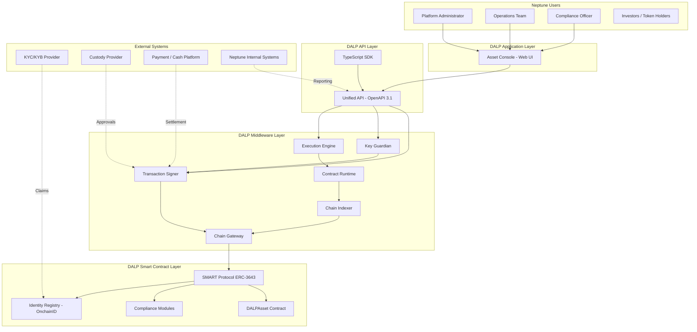
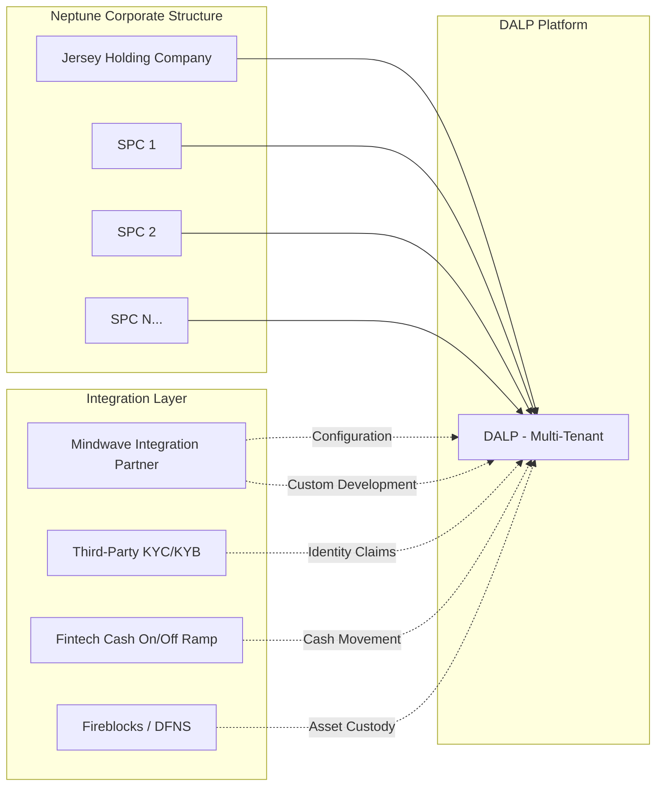
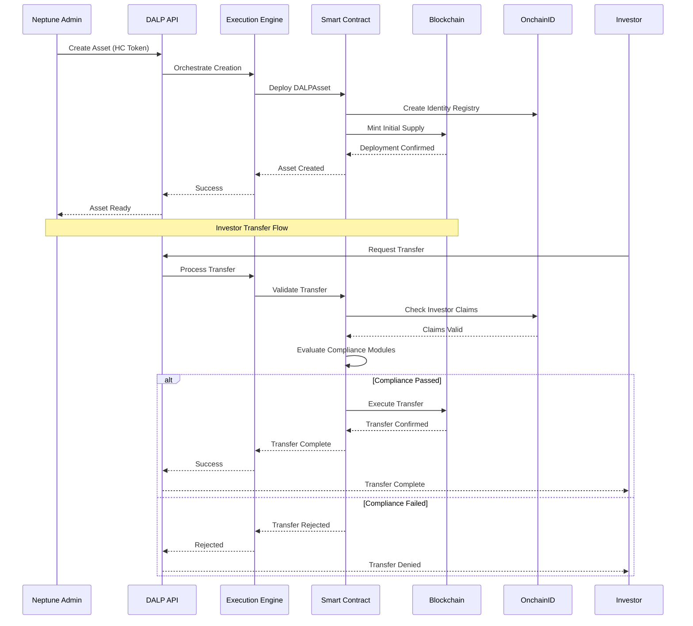
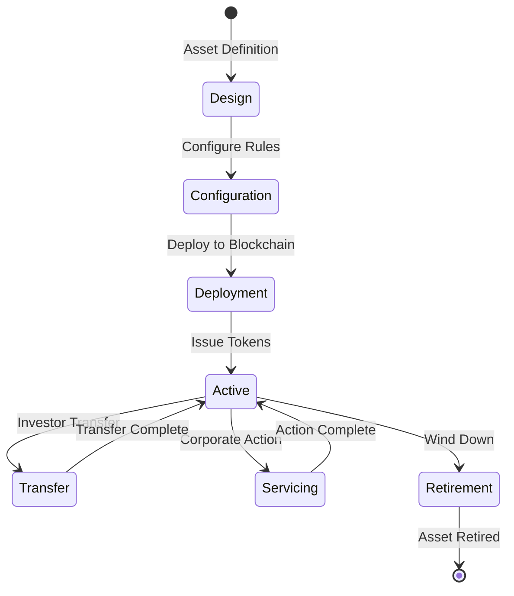
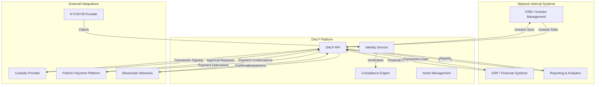

# Technical and Commercial Proposal: Corporate Structure Tokenization Platform

## Neptune Maritime Leasing: DALP Solution

| Field | Value |
|-------|-------|
| **Proposal Title** | Technical and Commercial Proposal. Corporate Structure Tokenization Platform |
| **Client** | Neptune Maritime Leasing |
| **Submitted by** | SettleMint NV |
| **Date** | 18 March 2026 |
| **Version** | 1.0 Draft |
| **Classification** | Confidential |
| **Primary Contacts** | Harris Antoniou, Iraklis Tsirigotis |

---

# Table of Contents

1. Executive Summary
2. Neptune Context and Programme Objectives
3. About SettleMint
4. About DALP. Digital Asset Lifecycle Platform
5. Proposed Solution for Neptune
6. Systems Architecture
7. Phased Implementation Approach
8. RACI Matrix and Role Definitions
9. Governance, Compliance, and Identity Controls
10. Integration Architecture
11. Security and Operational Resilience
12. Commercial Structure
13. Assumptions, Dependencies, and Open Points
14. Conclusion and Next Steps

---

# 1. Executive Summary

## The Neptune Opportunity

Neptune Maritime Leasing is evaluating the tokenization of its corporate structure, a layered hierarchy comprising a Jersey holding company above more than sixty special purpose companies, each tied to vessel receivables and financing arrangements. This is not a simple asset wrapper project. It is an ambitious programme to digitize governance, investor participation, and operational control across a multi-entity corporate structure in a way that can support present shareholders, future capital formation, and scalable issuance without rebuilding the control model for each entity.

The technical complexity of this challenge should not be underestimated. Tokenizing a single vessel or a straightforward equity position is a well-understood problem with multiple technical solutions available. Tokenizing a controlled corporate structure with sixty-plus SPCs, each potentially with different investor pools, compliance requirements, and governance arrangements, requires a platform that treats compliance, identity, and governance as first-class concerns, not afterthoughts bolted onto a generic token contract.

## Why This Matters for Neptune

Neptune operates in a specialized segment of maritime finance where corporate structure complexity is a feature, not a bug. Each SPC represents a distinct financing arrangement, typically tied to a specific vessel or vessel pool. The holding company provides equity cushion and governance oversight. This structure has evolved over decades to optimize for risk management, regulatory compliance, and operational efficiency.

Tokenizing this structure digitally means preserving those same characteristics in a new medium. The tokenized structure must:

- Maintain the same legal rights and economic relationships as the existing instruments
- Support the same governance mechanisms that Neptune's investors and regulators expect
- Scale to sixty-plus SPCs without requiring sixty times the administrative effort
- Comply with Jersey law, securities regulations, and any applicable EU or international frameworks
- Integrate with Neptune's existing operations, including banking relationships and reporting requirements

This is substantially more complex than tokenizing a single asset. It requires a platform that treats the tokenized instrument as a governed financial product, not as a simple digital token.

## The SettleMint Recommendation

SettleMint proposes DALP as the foundational platform for Neptune's corporate structure tokenization programme. DALP (Digital Asset Lifecycle Platform) is a production-grade, standards-based digital asset stack built on ERC-3643 and OnchainID, with configurable token features, modular compliance enforcement, role-based access control, and API-first integration surfaces. It is designed specifically for regulated financial institutions, sovereign entities, and capital markets participants who need more than a token contract, they need an operating system for digital asset issuance, servicing, and governance.

The recommendation for Neptune is a phased rollout:

**Phase 1** establishes the holding-company tokenization perimeter with full governance, compliance, and identity controls. This phase proves the control model and creates the baseline configuration that all subsequent SPC issuances will inherit. Phase 1 takes approximately eight to twelve weeks and results in a production-deployed holding-company token with full operational capability.

**Phase 2** extends the model to repeatable SPC issuance using DALP's configuration-driven deployment approach. With templates, standardized compliance rules, and reusable permission structures, Neptune can scale from one entity to sixty without rebuilding governance for each one. Phase 2 takes approximately twelve to sixteen weeks and can run in parallel with ongoing Phase 1 operations.

**Phase 3** adds investor onboarding, servicing, and broader capital-raising capabilities. This phase activates the full lifecycle, investor onboarding, transfer approvals, corporate actions, and reporting, enabling Neptune to move beyond a single investor structure to broader distribution. Phase 3 takes approximately eight to twelve weeks and completes the programme.

This phased approach aligns with how Neptune's team has described their programme ambitions and reduces execution risk by proving governance and compliance mechanics before scaling issuance across sixty or more structures.

## Key Differentiators for Neptune

DALP offers several capabilities directly relevant to Neptune's requirements:

First, DALP is built on ERC-3643 with native OnchainID integration, the only token standard designed specifically for regulated securities with on-chain compliance enforcement. This matters for Neptune because investor eligibility and transfer restrictions can be enforced programmatically, not just through manual pre-trade checks. Every transfer is automatically validated against the configured compliance rules before execution. If an investor does not hold the required claims or falls within a restricted category, the transfer is blocked at the smart contract level. This provides deterministic enforcement that cannot be bypassed by operational oversight.

Second, DALP's configuration-driven model means Neptune defines templates once and reuses them across entities. The platform does not require bespoke smart contract development for each SPC. Each new SPC can be deployed from a template that inherits the governance model, compliance rules, and operational procedures from the baseline configuration. Variations between SPCs are handled through parameterized configuration rather than custom code. This directly addresses the repeatability requirement that Neptune has identified as central to their programme.

Third, DALP's role-based access control supports clear separation of duties between governance, operations, compliance, and administration. Different roles can be assigned to different individuals, and the platform enforces role boundaries at every level, from API access through to on-chain transaction execution. This is essential for a multi-entity structure where different people hold authority over different entities. The governance team might control strategic decisions, the compliance team might control eligibility rules, and the operations team might control day-to-day transfers.

Fourth, DALP provides the integration flexibility Neptune needs. Whether Neptune works with Mindwave as an implementation partner, connects to a KYC/KYB provider, or integrates with a fintech platform for cash on/off ramps, DALP provides the API surfaces and integration points to make those connections operational. The platform does not require Neptune to abandon existing systems or processes. Instead, it provides the layer that connects those systems to blockchain-based asset management.

Fifth, DALP has a proven track record in production environments with regulated financial institutions. The platform has been deployed at tier-1 and tier-2 banks, sovereign entities, and capital markets infrastructure providers across Europe, the Middle East, and Asia-Pacific. This experience informs every aspect of the platform's design, from security architecture to operational procedures.

## Commercial Position

The source material indicates that commercial discussions have already taken place with a working shape of approximately 8,000 per month for development, 50,000 to 80,000 fixed implementation fee, and 10,000 per month for production. Because the deal notes do not provide a ratified commercial sheet, statement of work, or signed pricing approval, all commercials in this proposal are expressed either as source-derived working placeholders or as explicit **[TO CONFIRM]** items. Nothing in this proposal should be read as a binding commercial commitment until Neptune and SettleMint confirm scope, environment model, integration ownership, and implementation boundaries.

The commercial structure that fits Neptune's described programme is a two-part model: a time-bounded implementation phase paired with a recurring production platform fee. This aligns with the phased rollout and allows Neptune to validate the platform before committing to full-scale production pricing.

## The Path Forward

The recommendation is straightforward: confirm the Phase 1 holding-company instrument, lock the governance and investor-policy model, validate the commercial shape, and implement a controlled first deployment that can serve as the template for later SPC scaling. That is the fastest route to a credible programme and the lowest-risk way to prove that Neptune can operationalize tokenized corporate structures without turning the initiative into an open-ended custom software project.

SettleMint is prepared to begin Phase 1 within weeks of commercial approval. The team has the experience, the platform, and the processes in place to deliver a production-quality outcome. The focus now is on Neptune's side, confirming the programme scope and kicking off the implementation.


---

# 2. Neptune Context and Programme Objectives

**Phase 2** extends the model to repeatable SPC issuance using DALP's configuration-driven deployment approach. With templates, standardized compliance rules, and reusable permission structures, Neptune can scale from one entity to sixty without rebuilding governance for each one.

**Phase 3** adds investor onboarding, servicing, and broader capital-raising capabilities. This phase activates the full lifecycle, investor onboarding, transfer approvals, corporate actions, and reporting, enabling Neptune to move beyond a single investor structure to broader distribution.

This phased approach aligns with how Neptune's team has described their programme ambitions and reduces execution risk by proving governance and compliance mechanics before scaling issuance across sixty or more structures.

## Key Differentiators for Neptune

DALP offers several capabilities directly relevant to Neptune's requirements:

First, DALP is built on ERC-3643 with native OnchainID integration, the only token standard designed specifically for regulated securities with on-chain compliance enforcement. This matters for Neptune because investor eligibility and transfer restrictions can be enforced programmatically, not just through manual pre-trade checks.

Second, DALP's configuration-driven model means Neptune defines templates once and reuses them across entities. The platform does not require bespoke smart contract development for each SPC. This directly addresses the repeatability requirement that Neptune has identified as central to their programme.

Third, DALP's role-based access control supports clear separation of duties between governance, operations, compliance, and administration, essential for a multi-entity structure where different people hold authority over different entities.

Fourth, DALP provides the integration flexibility Neptune needs. Whether Neptune works with Mindwave as an implementation partner, connects to a KYC/KYB provider, or integrates with a fintech platform for cash on/off ramps, DALP provides the API surfaces and integration points to make those connections operational.

## Commercial Position

The source material indicates that commercial discussions have already taken place with a working shape of approximately 8,000 per month for development, 50,000 to 80,000 fixed implementation fee, and 10,000 per month for production. Because the deal notes do not provide a ratified commercial sheet, statement of work, or signed pricing approval, all commercials in this proposal are expressed either as source-derived working placeholders or as explicit **[TO CONFIRM]** items. Nothing in this proposal should be read as a binding commercial commitment until Neptune and SettleMint confirm scope, environment model, integration ownership, and implementation boundaries.

## The Path Forward

The recommendation is straightforward: confirm the Phase 1 holding-company instrument, lock the governance and investor-policy model, validate the commercial shape, and implement a controlled first deployment that can serve as the template for later SPC scaling. That is the fastest route to a credible programme and the lowest-risk way to prove that Neptune can operationalize tokenized corporate structures without turning the initiative into an open-ended custom software project.


---

# 2. Neptune Context and Programme Objectives

## Understanding Neptune's Corporate Structure

Neptune Maritime Leasing operates a corporate structure that is more complex than most tokenization programmes encounter. At the apex sits a Jersey holding company, which owns more than sixty special purpose companies. Each SPC is tied to specific vessel receivables and financing arrangements, creating a layered structure where economic value flows through multiple corporate layers before reaching the underlying maritime assets.

This structure is not accidental. It reflects standard maritime financing practice, where SPCs isolate risk, simplify debt instruments, and provide flexibility for individual vessel transactions without affecting the broader portfolio. However, it also creates operational complexity, each SPC may have different investors, different compliance requirements, different governance arrangements, and different servicing needs.

Neptune sees three strategic dimensions to their tokenization programme:

**First, holding-company tokenization.** The Jersey holding company represents the apex of the corporate structure. Tokenizing this entity would establish the primary governance and ownership framework at the top of the hierarchy. This is the logical starting point because any SPC-level tokenization must ultimately connect to the holding company's ownership structure.

**Second, SPC fleet tokenization.** With sixty-plus SPCs in the structure, Neptune needs a model that can scale, not sixty bespoke implementations, but a repeatable pattern that applies consistent governance and compliance logic across all entities. This is where DALP's configuration-driven approach provides the most value.

**Third, future capital formation.** The initial tokenized structure may need to support additional investor participation and broader distribution. This means the platform must support investor onboarding, transfer approvals, compliance enforcement for new investor categories, and ongoing servicing, not just a one-off issuance.

## Why Corporate Structure Tokenization Matters

Tokenizing a corporate structure differs fundamentally from tokenizing a single asset. The unit of tokenization is not a vessel, not a single equity position, and not a straightforward debt instrument. The unit of tokenization is a governed legal and economic claim sitting inside a multi-entity structure, with rights and restrictions that flow from the holding company down through the SPC hierarchy.

This has several implications for platform selection:

**Entitlement logic must be precise.** Token holders at the SPC level may have rights that derive from or relate to the holding-company structure. The platform must represent these relationships accurately.

**Identity and eligibility must be enforced at every level.** Different SPCs may have different investor eligibility rules, different jurisdictional restrictions, and different transfer approval workflows. The platform must support this granularity without requiring bespoke configuration for each entity.

**Governance must scale.** With sixty-plus potential tokenized entities, the administrative burden of governance must be manageable. Templates, reusable compliance rules, and role-based access control are essential.

**Servicing events must be coordinated.** Corporate actions at the holding-company level may affect SPC-level instruments. The platform must support these cascading relationships.

Neptune's programme therefore requires more than a token issuance tool. It requires a governed lifecycle platform that can represent complex corporate structures, enforce compliance at multiple levels, and scale across many entities without proportional increases in operational complexity.

## Programme Objectives

Based on the deal context and Granola notes, Neptune's programme objectives can be summarized as follows:

**Objective 1: Establish a governance baseline.** The first tokenized entity should establish the control model that all subsequent entities will inherit. This includes the identity and compliance framework, the role and permission structure, and the operating procedures for issuance, transfer, and servicing.

**Objective 2: Prove repeatability.** Before committing to full SPC fleet tokenization, Neptune needs confidence that the model can scale. A successful Phase 1 deployment should demonstrate that subsequent SPC issuances can be configured from templates rather than built from scratch.

**Objective 3: Enable future capital formation.** The platform must support expansion beyond the current investor base. This means investor onboarding workflows, compliance enforcement for new investor categories, and reporting capabilities that meet the expectations of broader distribution.

**Objective 4: Maintain operational control.** Neptune's team must be able to operate the platform without constant vendor dependency. This means clear administrative interfaces, comprehensive audit trails, and operational procedures that the Neptune team can own.

**Objective 5: Preserve legal and regulatory positioning.** The tokenized structure must remain compliant with applicable corporate law, securities regulations, and Jersey regulatory requirements. The platform must support this positioning rather than compromise it.

These objectives directly inform the solution design in the following sections.

---

# 3. About SettleMint

## Company Overview

SettleMint is the production-grade digital asset lifecycle management company for regulated financial markets and sovereign use cases. Founded in 2016 and headquartered in Leuven, Belgium, SettleMint provides the governance and orchestration layer between existing core financial systems and multiple blockchain networks, delivering the infrastructure required to build, deploy, and operate compliant digital asset solutions in production.

The company's mission is to enable financial institutions, market infrastructure providers, and sovereign entities to move real-world value on-chain with a compliant, secure, production-grade digital asset lifecycle platform. SettleMint exists to bridge the gap between digital asset ambitions and production-grade execution.

Financial institutions and governments increasingly recognize that tokenization and digital assets are becoming core infrastructure for capital markets and real-world assets. Regulatory frameworks are maturing, tokenized instruments are appearing on balance sheets, and expectations are shifting from innovation theater to operational reality. Yet tokenization technology being accessible does not mean institutional-grade implementation is. The real challenge lies in doing it correctly at production scale: meeting regulatory requirements, implementing proper governance, supporting the full asset lifecycle, and ensuring that early pilots can scale into real institutional infrastructure. Most organizations remain stuck in pilot mode, overwhelmed by the complexity of regulatory compliance, governance requirements, and building infrastructure that can withstand production scrutiny.

SettleMint solves this complexity, turning digital asset strategy into operating systems that reduce time-to-market and remove operational and regulatory risk.

## Track Record

SettleMint brings a demonstrated track record across multiple geographies and asset classes:

**Geographic coverage** spans Europe, the Middle East, and Asia-Pacific. In Europe, SettleMint has extensive experience with EU regulatory frameworks including MiCA, MiFID II, and DORA. In the Middle East, active sovereign and national-scale programmes in the Gulf region demonstrate capability in markets with distinct regulatory requirements. In Asia-Pacific, production deployments with tier-1 and tier-2 banks in Japan and Singapore provide evidence of multi-jurisdiction operational capability.

**Asset class coverage** includes bonds, equities, funds, deposits, stablecoins, real estate, and precious minerals. This breadth demonstrates that DALP is a general-purpose platform, not a single-use tool.

**Production experience** includes seven or more years of continuous production deployments at regulated banks in Asia and Europe, with live deployments operating under institutional SLAs including high-throughput transaction processing and robust disaster-recovery expectations.

## Leadership and Team

SettleMint's leadership combines deep technical expertise, financial domain knowledge, and enterprise delivery experience:

**Adam Popat, CEO** leads commercial strategy and global market expansion, with experience spanning Standard Chartered, SC Ventures, and capital markets.

**Matthew Van Niekerk, Co-founder and President** leads company strategy, investor relations, and market expansion, with extensive enterprise technology, financial services, and blockchain adoption experience.

**Roderik van der Veer, Co-founder and CTO** oversees technology strategy, platform architecture, and engineering execution for DALP, with deep expertise in distributed systems, blockchain protocols, enterprise software architecture, and security.

The engineering team operates as an engineering-heavy organization, reflecting the fact that for a platform company, engineering output is the product. A focused, senior team of core engineers handles all aspects of platform development: smart contract architecture, backend services, API layer, compliance engine, settlement workflows, and infrastructure automation.

## Certifications and Institutional Readiness

SettleMint maintains the certifications and audit postures required for institutional procurement in regulated financial services:

**ISO 27001** certified. SettleMint's information security management system meets the international standard for establishing, implementing, maintaining, and continually improving information security.

**SOC 2 Type II** certified. Independent third-party audit confirming that SettleMint's controls for security, availability, and confidentiality meet AICPA Trust Services Criteria over an extended observation period.

Additional credentials include regular penetration testing and security assessments conducted by independent third parties, successful completion of vendor risk assessments at tier-1 and tier-2 financial institutions, and standard contractual frameworks and legal entity readiness for institutional procurement.

## Partnerships and Ecosystem

SettleMint maintains a partnership ecosystem that extends delivery capability, deepens technology integration, and provides regional coverage:

**Custody providers** include Fireblocks and DFNS, supporting a bring-your-own-custodian model that allows institutions to retain existing custodian relationships.

**Cloud providers** include AWS, Azure, and GCP, providing full deployment flexibility across cloud, on-premises, and hybrid models.

**Identity and compliance** partners include OnchainID for verifiable on-chain investor identities, with KYC/KYB integration capabilities.

**Payment rails** support ISO 20022 integration for SWIFT, SEPA, and RTGS connectivity.

---

# 4. About DALP: Digital Asset Lifecycle Platform

## Platform Overview

DALP (Digital Asset Lifecycle Platform) is built as a four-layer stack, with each layer having a distinct responsibility boundary and communicating through well-defined interfaces. This architecture reflects years of production experience in regulated financial environments, where separation of concerns, security boundaries, and operational resilience are non-negotiable requirements.

The four layers are:

| Layer | Role | Description |
|-------|------|-------------|
| **Application** | User-facing interfaces | Asset Console (web UI) for operators, issuers, and compliance officers |
| **API** | Programmatic access surface | Unified API (OpenAPI 3.1), TypeScript SDK (@settlemint/dalp-sdk) |
| **Middleware** | Workflow orchestration, key management, indexing | Execution Engine, Key Guardian, Transaction Signer, Contract Runtime, Chain Indexer, Chain Gateway, Feeds System |
| **Smart Contract** | On-chain enforcement | SMART Protocol (ERC-3643), DALPAsset contracts, compliance modules, token features, addons |

Requests flow top-down through these layers. A user action in the Asset Console triggers an API call, which the middleware orchestrates into one or more blockchain transactions, which the smart contract layer validates and executes on-chain. Each layer independently enforces its own security controls, so no single-layer failure grants unauthorized access.

## SMART Protocol (ERC-3643) Foundation

All DALP smart contracts are built on the SMART Protocol, an implementation of the ERC-3643 standard. ERC-3643 defines a specification for regulated security tokens where every transfer must pass through a modular compliance engine before execution. This is the key differentiator from standard ERC-20 tokens, where compliance is typically handled off-chain or not at all.

SMART Protocol provides three foundational sub-layers:

**Token layer**: ERC-20 compatible contracts with compliance hooks and a modular extension system. External systems, wallets, exchanges, indexers, interact through standard ERC-20 and ERC-3643 interfaces.

**Compliance layer**: An orchestration engine that evaluates a configurable set of transfer rules before each transaction. Rules are modular and can be added, removed, or reconfigured at runtime without redeploying the token contract.

**Identity layer**: On-chain identity management via OnchainID (ERC-734/735), storing verifiable KYC/AML claims. Identity verification is enforced on-chain as a prerequisite for transfers.

ERC-3643 was chosen over alternatives such as ERC-1400 for its modular compliance engine, on-chain identity integration through OnchainID, and active ecosystem support.

## DALPAsset: The Configurable Contract

DALPAsset is the recommended contract type for all new tokenization projects. It extends the SMART Protocol with the SMARTConfigurable extension, allowing token features and compliance modules to be attached and reconfigured at runtime, after deployment.

This design eliminates the need to commit to a specialized contract type at deployment time. A DALPAsset token can evolve: start as a simple bearer instrument, then have fee structures added, governance enabled, or maturity and redemption logic configured, all without redeploying the contract.

**Runtime-pluggable token features** integrate through six lifecycle hooks (mint, burn, transfer, redeem, update, attach) via the ISMARTFeature interface. Available features include:

- Historical balances
- Voting power
- Permit (gasless approvals)
- AUM fee
- Maturity and redemption
- Fixed treasury yield
- Transaction fee (multiple variants)
- Conversion and conversion-minter

**Compliance modules** enforce transfer and supply rules through the ERC-3643 compliance engine. Modules can be added, removed, or reconfigured at runtime. Documented module types include:

- Identity verification (requires valid KYC/AML claims)
- Country restrictions (allow/deny by jurisdiction)
- Identity allow/deny lists (specific investor whitelist or blacklist)
- Supply and investor limits (regulatory caps)
- Supply cap and collateral requirements
- Transfer approval workflows (manual approval gates)
- Timelock restrictions (lock periods before transfers are allowed)

All configuration changes require the GOVERNANCE_ROLE. Multi-signature or timelock governance is recommended for production deployments.

## Role-Based Access Control

DALP implements a comprehensive role-based access control model at both the system and asset levels. Roles define who can perform which actions, with clear separation of duties between governance, operations, compliance, and administration.

**System-level roles** include:

- **Owner**: Ultimate administrative authority over the system
- **Admin**: System configuration and management
- **Compliance Officer**: Compliance policy management
- **Auditor**: Read-only access to audit trails

**Asset-level roles** include:

- **Governance**: Strategic decision-making authority over the asset
- **Custodian**: Asset protection and safekeeping
- **Supply Manager**: Minting and burning authority
- **Compliance Manager**: Compliance rule configuration
- **Transfer Manager**: Transfer execution authority
- **Emergency**: Emergency stop and freeze capabilities

This role model directly supports Neptune's requirement for clear separation of duties across a multi-entity structure.


## Multi-Entity and Multi-Tenant Capabilities

DALP is designed to support multiple legal entities from a single platform deployment. Each entity operates within its own isolated context, with dedicated identity registries, compliance configurations, and asset deployments. This is directly relevant to Neptune's structure, where the holding company and each SPC need independent but coordinated operational contexts.

The platform supports:

- Multiple asset issuances per entity
- Entity-specific compliance rules
- Cross-entity reporting and governance coordination
- Hierarchical relationships between entities (parent-subsidiary structures)

Neptune can provision separate operational contexts for the holding company and for groups of SPCs, ensuring that each entity maintains its own compliance boundaries while benefiting from shared infrastructure and operational efficiencies.


---

# 5. Proposed Solution for Neptune

## Solution Overview

SettleMint proposes DALP as the foundational platform for Neptune's corporate structure tokenization programme. The solution addresses Neptune's specific requirements through a combination of native platform capabilities, configuration-driven deployment patterns, and integration flexibility.

The solution is organized around the three categories that this proposal uses to communicate capability boundaries: native DALP capability, configuration-driven behaviour, and integration-dependent outcomes. This distinction is essential for Neptune to understand what the platform provides directly, what requires configuration work, and what depends on external systems and implementation partners.

## Native DALP Capabilities

The following capabilities are native to the DALP platform and require no bespoke development:

**ERC-3643 token foundation**: All assets on DALP are issued as ERC-3643 tokens with built-in compliance enforcement. This is the regulatory-grade foundation that distinguishes DALP from commodity token platforms.

**OnchainID identity architecture**: Every investor interacts with DALP through an OnchainID identity contract that stores verifiable claims. Claims can represent KYC verification, AML screening, accreditation status, or any other eligibility criterion. The identity system is modular, different assets can require different claim types.

**Configurable compliance modules**: The compliance engine supports the full range of documented module types, identity verification, country restrictions, allow/deny lists, investor limits, transfer approvals, timelocks, with runtime reconfigurability.

**Role-based asset administration**: Each asset has its own role model, allowing precise control over who can mint, burn, transfer, governance-vote, or administer each instrument. Roles are assigned at the asset level and enforced by the smart contract.

**Historical balance tracking**: All token balances are tracked with full historical provenance, supporting audit requirements and shareholder rights calculations.

**Voting power support**: For equity-style instruments, DALP supports on-chain voting with configurable vote delegation, quorum requirements, and vote recording.

**Maturity and redemption**: For bond-style instruments, DALP supports fixed-maturity schedules with automated redemption logic at maturity.

**API-led operational access**: All platform capabilities are exposed through REST APIs and a TypeScript SDK, enabling integration with external systems and custom operational workflows.

## Configuration-Driven Behaviour

The following outcomes are achieved through DALP's configuration framework rather than bespoke development. They require configuration work during implementation but do not require smart contract modifications:

**Asset templates**: A repeatable issuance pattern can be defined once and reused across multiple SPCs. This includes the token type, compliance modules, role assignments, and operational procedures.

**Compliance rule sets**: Neptune can define standard compliance rule sets (jurisdictional restrictions, investor categories, transfer approval workflows) and apply them to multiple assets. Variations between SPCs can be managed through parameterized templates.

**Permission structures**: The role hierarchy for each entity can be defined as a template, ensuring consistent separation of duties across the SPC fleet.

**Investor eligibility criteria**: The specific claim types required for investor eligibility can be configured per asset class or per entity, allowing the holding company and different SPCs to have different investor requirements.

**Servicing workflows**: Corporate actions such as distributions, voting, and reporting can be configured with standard procedures that apply across entities.

**Reporting outputs**: Standard reports (holder lists, transaction histories, compliance status) can be configured with consistent formats across the organization.

## Integration-Dependent Outcomes

The following outcomes depend on external systems, implementation partners, or Neptune's own operational processes. DALP provides the integration points, but the end-to-end outcome requires external coordination:

**KYC/KYB data ingestion**: DALP stores and evaluates identity claims, but the claims must be issued by a trusted issuer. Neptune must decide whether to use an existing KYC/KYB provider, integrate a new provider, or operate a partner-led identity verification model.

**Investor onboarding workflows**: The complete investor onboarding journey, from initial application through identity verification, accreditation validation, and account setup, typically involves external systems beyond DALP. This includes document collection, identity verification APIs, and potentially custodian integration.

**Payment and cash-movement connectivity**: For cash on/off ramps (receiving payment for tokens, distributing proceeds from redemptions), DALP can integrate with payment service providers. The specific provider and integration approach must be defined as part of solution design.

**Custody provider integration**: If Neptune uses a third-party custodian, the custody provider's approval experience, transaction signing, and asset servicing must be integrated with DALP. Supported providers include Fireblocks and DFNS.

**Reporting into Neptune systems**: While DALP provides standard reports, Neptune may require custom exports into internal systems. This requires integration development work specific to Neptune's system landscape.

**Mindwave implementation services**: The deal notes reference Mindwave as an implementation partner. The scope of Mindwave's work must be defined, whether it covers integration development, operational support, or both.

## Addressing Neptune's Specific Requirements

**Holding-company tokenization**: DALP can issue a tokenized instrument representing the Jersey holding company equity. The specific instrument type (equity, debt, or hybrid) depends on legal structuring advice. DALP supports equity-style instruments with voting and governance features, bond-style instruments with maturity and redemption, and configurable hybrid structures.

**SPC fleet scalability**: With sixty-plus SPCs, the key requirement is repeatability. DALP's asset template system allows Neptune to define the standard configuration once and apply it to new SPCs with controlled variation. This directly addresses the factory-like approach discussed in the deal notes.

**Investor eligibility enforcement**: DALP's compliance modules can enforce investor eligibility programmatically. For example, if an SPC is restricted to accredited investors in specific jurisdictions, the compliance module will block any transfer to an investor who does not hold the required claims. This provides deterministic enforcement rather than relying on manual pre-trade checks.

**Governance separation**: Different entities can have different governance structures. The holding company might have a board with voting rights, while SPCs might have simpler transfer-only mechanics. DALP's role model supports this granularity.

**Future capital formation**: When Neptune is ready to expand beyond the current investor base, the platform can support new investor onboarding, different compliance rule sets for different investor categories, and broader distribution channels. The infrastructure is already in place, the specific configuration depends on Neptune's commercial decisions.


---

# 6. Systems Architecture

## Logical Architecture

The following diagram illustrates the logical architecture of the proposed solution showing how Neptune's users and external systems interact with DALP:



## Integration Architecture

The following diagram shows the integration architecture with external systems and partners:



## Data Flow Architecture

The following diagram illustrates the key data flows for asset issuance and transfer operations:



## Deployment Topology

The following diagram shows the recommended deployment topology for Neptune:

```mermaid
graph TB
    subgraph "Neptune Corporate Network"
        NeptuneApp[Neptune Internal Applications]
    end
    
    subgraph "DALP - Managed Cloud (Recommended)"
        subgraph "DMZ Layer"
            WAF[Web Application Firewall]
            API GW[API Gateway]
        end
        
        subgraph "Application Layer"
            Console[DALP Console]
            Backend[Application Services]
        end
        
        subgraph "Data Layer"
            DB[(PostgreSQL)]
            Cache[(Redis)]
            ObjectStore[Object Storage]
        end
        
        subgraph "Blockchain Layer"
            Node[RPC Node]
            Indexer[Chain Indexer]
        end
    end
    
    subgraph "Blockchain Networks"
        ETH[Ethereum / L2s]
        POLY[Polygon]
    end
    
    NeptuneApp -->|HTTPS| WAF
    WAF --> API GW
    API GW --> Console
    API GW --> Backend
    Backend --> DB
    Backend --> Cache
    Backend --> ObjectStore
    Backend --> Node
    Node --> ETH
    Node --> POLY
    Indexer --> ETH
    Indexer --> POLY
```

## Detailed Asset Lifecycle

The following diagram illustrates the complete asset lifecycle from creation through servicing to potential retirement:



---

# 7. Phased Implementation Approach

## Phase Overview

The implementation is structured in three phases, each with defined objectives, deliverables, and success criteria. The phased approach reduces risk by proving the platform and governance model at each stage before committing to full-scale deployment.

## Phase 1: Foundation and Holding Company Tokenization

### Objectives

Phase 1 establishes the foundational infrastructure, governance model, and first tokenized entity (the Jersey holding company). The objective is to prove that DALP can support Neptune's requirements before scaling to the SPC fleet.

### Duration

Phase 1 is estimated at eight to twelve weeks from kickoff to production deployment, depending on the speed of legal structuring decisions and Neptune's availability for requirements workshops.

### Key Activities

**Week 1-2: Discovery and Requirements**

- Joint workshop to finalize the holding-company instrument structure (equity, debt, or hybrid)
- Define governance model, investor eligibility criteria, and compliance requirements
- Map Neptune's organizational roles to DALP role model
- Confirm integration requirements (KYC provider, custody, payment)

**Week 3-4: Platform Configuration**

- Provision DALP environments (development, staging, production)
- Configure the holding-company asset template
- Set up identity registry and compliance modules per requirements
- Define role assignments and administrative permissions

**Week 5-6: Integration Development**

- Develop integrations with selected KYC/KYB provider
- Configure custody provider connectivity (Fireblocks or DFNS)
- Develop payment gateway integration for cash movements
- Build custom reporting exports as required

**Week 7-8: Testing and Validation**

- Execute functional testing of all platform capabilities
- Conduct security testing and vulnerability assessment
- Perform user acceptance testing with Neptune operations team
- Complete compliance and regulatory review

**Week 9-10: Pilot Deployment**

- Deploy holding-company token to production
- Execute first issuance with controlled investor cohort
- Validate end-to-end operational workflows
- Document operational procedures and runbooks

**Week 11-12: Transition and Handover**

- Transfer operational knowledge to Neptune team
- Complete documentation and training
- Conduct post-deployment review
- Approve Phase 1 completion

### Who Does What: Phase 1

| Activity | SettleMint | Neptune (NML) | Third Party | Fintech Platform |
|----------|------------|---------------|-------------|------------------|
| Platform provisioning | Lead | Support | - |, |
| Asset template configuration | Lead | Collaborate | - |, |
| Compliance module setup | Lead | Approve | - |, |
| Role model design | Collaborate | Lead | - |, |
| KYC/KYB integration | Lead | Support | Execute | - |
| Custody integration | Lead | Approve | Execute | - |
| Payment integration | Support | Collaborate | - | Lead |
| Testing and validation | Lead | Execute | - |, |
| Operational training | Lead | Execute | - |, |
| Production deployment | Lead | Approve | - |, |

### Deliverables

- Configured DALP environment (development, staging, production)
- Deployed holding-company tokenized instrument
- Configured compliance modules and role assignments
- Integrated KYC/KYB provider
- Integrated custody provider
- Integrated payment gateway
- Tested and validated platform
- Operational documentation and training materials
- Phase 1 completion report

### Success Criteria

- Holding-company token is live on the configured blockchain network
- All compliance modules are functioning and blocking invalid transfers
- Investor onboarding workflow is operational end-to-end
- Transfer approval workflow is functional
- Custody integration is operational (if applicable)
- Payment integration is operational
- Neptune operations team is trained and capable of day-to-day operation
- No critical or high-severity defects

## Phase 2: SPC Fleet Expansion

### Objectives

Phase 2 extends the validated Phase 1 model to the SPC fleet, establishing a repeatable deployment pattern that can scale across Neptune's sixty-plus entities. The focus is on efficiency through templates, automation, and standardized processes.

### Duration

Phase 2 is estimated at twelve to sixteen weeks, depending on the number of SPCs to be tokenized and the degree of standardization across entities.

### Key Activities

**Week 1-2: Template Development**

- Analyze the SPC estate for standardization opportunities
- Define SPC asset templates based on common patterns
- Configure compliance template library for common SPC types
- Define role assignment templates for different SPC categories

**Week 3-6: SPC Deployment (Iteration 1)**

- Deploy the first five to ten SPCs using the standardized templates
- Validate template effectiveness and refine as needed
- Document template customization requirements for edge cases

**Week 7-12: SPC Deployment (Iteration 2)**

- Deploy remaining SPCs in batches
- Implement batch processing for efficiency
- Validate cross-entity governance and reporting

**Week 13-16: Optimization and Scaling**

- Optimize deployment processes based on experience
- Implement automation for routine SPC operations
- Validate scalability to full sixty-plus entity complement

### Who Does What: Phase 2

| Activity | SettleMint | Neptune (NML) | Third Party | Fintech Platform |
|----------|------------|---------------|-------------|------------------|
| Template development | Lead | Collaborate | - |, |
| SPC deployment (first batch) | Lead | Approve | - |, |
| SPC deployment (subsequent) | Support | Execute | - |, |
| Compliance configuration | Collaborate | Lead | - |, |
| Role assignment | Support | Execute | - |, |
| Cross-entity reporting | Lead | Approve | - |, |
| Process automation | Lead | Collaborate | - |, |
| Testing and validation | Collaborate | Execute | - |, |

### Deliverables

- SPC asset template library
- Compliance template library
- Deployed SPC tokens (target: sixty-plus entities)
- Cross-entity governance framework
- Cross-entity reporting capabilities
- Optimized deployment processes
- Phase 2 completion report

### Success Criteria

- Templates support efficient SPC deployment
- At least fifty SPCs are tokenized and operational
- Cross-entity reporting provides consolidated views
- Deployment processes are documented and transferable
- Neptune team can operate independently

## Phase 3: Capital Formation and Distribution

### Objectives

Phase 3 activates the full lifecycle capabilities required for broader capital formation. With the holding company and SPCs operational, Phase 3 focuses on investor acquisition, servicing, and ongoing operations at scale.

### Duration

Phase 3 is estimated at eight to twelve weeks, running partially in parallel with Phase 2 completion.

### Key Activities

**Week 1-2: Investor Onboarding Enhancement**

- Configure expanded investor onboarding workflows
- Integrate additional KYC/KYB verification sources if needed
- Set up investor self-service portal capabilities

**Week 3-4: Servicing and Corporate Actions**

- Configure dividend and distribution workflows
- Set up voting and governance procedures
- Define corporate action notification and processing

**Week 5-8: Reporting and Analytics**

- Configure comprehensive reporting suite
- Set up investor-facing reporting portals
- Implement regulatory reporting capabilities

**Week 9-12: Operational Scaling**

- Validate investor acquisition workflows
- Test servicing operations under load
- Complete operational readiness for scale

### Who Does What: Phase 3

| Activity | SettleMint | Neptune (NML) | Third Party | Fintech Platform |
|----------|------------|---------------|-------------|------------------|
| Onboarding enhancement | Lead | Collaborate | Execute | - |
| Servicing workflows | Lead | Approve | - |, |
| Reporting configuration | Lead | Approve | - |, |
| Investor portal setup | Collaborate | Lead | - |, |
| Regulatory reporting | Collaborate | Lead | - |, |
| Operational scaling | Support | Execute | - |, |

### Deliverables

- Enhanced investor onboarding workflows
- Configured servicing and corporate action capabilities
- Comprehensive reporting suite
- Investor self-service portal
- Regulatory reporting capabilities
- Phase 3 completion report

### Success Criteria

- Investor onboarding supports broader distribution
- Servicing workflows handle full lifecycle operations
- Reporting meets investor and regulatory expectations
- Platform is ready for production-scale operations

---

# 8. RACI Matrix and Role Definitions

## RACI Overview

The following RACI (Responsible, Accountable, Consulted, Informed) matrix defines roles and responsibilities across the four key stakeholders: SettleMint (platform provider), Neptune Maritime Leasing (NML / client), Third Party Systems Integration Partner, and Fintech Platform for Cash On/Off Ramps.

## RACI Matrix

| Workstream / Activity | SettleMint | NML | Third Party Integration Partner | Fintech Cash On/Off Platform |
|----------------------|:----------:|:---:|:-----------------------------:|:---------------------------:|
| **Programme Governance** | | | | |
| Overall programme direction | I | A | C | I |
| Strategic decisions | I | A | C | I |
| Commercial approval | I | A | C | I |
| **Platform Provision** | | | | |
| DALP platform provisioning | R | I | C | - |
| Platform infrastructure (cloud, network) | R | I | C | - |
| Platform security configuration | R | A | C | - |
| Platform upgrades and maintenance | R | I | - |, |
| **Solution Design** | | | | |
| Asset template design | R | A | C | - |
| Compliance rule design | C | A | R | - |
| Role model design | C | A | R | - |
| Integration architecture | R | A | C | - |
| **Implementation** | | | | |
| Platform configuration | R | C | C | - |
| Asset deployment (Phase 1) | R | A | C | - |
| Asset deployment (Phase 2+) | C | A | R | - |
| KYC/KYB integration development | R | C | A | - |
| Custody integration development | R | C | A | - |
| Payment integration development | C | A | - | R |
| Custom development | C | A | R | - |
| **Testing** | | | | |
| Functional testing | R | C | C | C |
| Security testing | R | A | C | - |
| User acceptance testing | C | R | C | C |
| Compliance validation | C | A | - |, |
| **Operations** | | | | |
| Day-to-day platform operations | I | R | - |, |
| Investor onboarding | I | R | C | C |
| Transfer approvals | I | R | - |, |
| Compliance monitoring | I | R | C | - |
| Reporting and analytics | C | A | - |, |
| Incident management | R | A | C | C |
| **Support** | | | | |
| Platform support (L1-L2) | R | I | - |, |
| Platform support (L3) | R | I | - |, |
| Integration support | R | C | A | C |
| Business-as-usual support | C | R | - |, |

## RACI Legend

- **R (Responsible)**: Executes the activity
- **A (Accountable)**: Ultimate decision authority and ownership
- **C (Consulted)**: Provides input before decisions are made
- **I (Informed)**: Notified of outcomes

## Role Definitions

### SettleMint (Platform Provider)

SettleMint is responsible for providing and maintaining the DALP platform. This includes platform provisioning, infrastructure management, security configuration, platform upgrades, and technical support. SettleMint provides the foundational technology layer and ensures the platform operates as specified.

SettleMint's accountabilities include: ensuring platform availability and performance, maintaining security posture, delivering platform capabilities as documented, providing technical support and escalation, and coordinating platform-level incident response.

SettleMint works collaboratively with Neptune on solution design, configuration, and implementation. SettleMint consults with third-party integration partners on technical requirements and integration approaches.

### Neptune Maritime Leasing (NML / Client)

Neptune is accountable for the business direction of the programme. This includes strategic decisions, commercial approvals, and business outcomes. Neptune owns the corporate structure, the legal instruments, the investor relationships, and the regulatory positioning.

Neptune's accountabilities include: defining the tokenized instrument structure, approving governance and compliance policies, managing investor relationships, ensuring regulatory compliance, and operating the platform day-to-day.

Neptune collaborates with SettleMint on solution design and configuration. Neptune is informed of technical implementation progress and consulted on significant technical decisions.

### Third Party Systems Integration Partner

The third-party integration partner (such as Mindwave, as referenced in the deal notes) is responsible for implementation services that extend beyond the core DALP platform. This includes integration development, custom configuration, and potentially operational support.

The integration partner's accountabilities include: delivering integration solutions as designed, coordinating with SettleMint on technical requirements, and ensuring integration quality.

The integration partner is consulted on technical architecture decisions and informed of platform changes that affect integrations.

### Fintech Platform for Cash On/Off Ramps

The fintech platform for cash on/off ramps is responsible for payment processing and cash movement capabilities. This includes payment gateway integration, transaction processing, and cash reconciliation.

The fintech platform's accountabilities include: processing payments reliably, maintaining payment compliance, and coordinating with Neptune on cash operations.

The fintech platform is consulted on payment integration requirements and informed of platform changes that affect payment processing.

## RACI Commentary

The RACI matrix reflects a clear separation between platform provision (SettleMint's responsibility), business direction (Neptune's accountability), integration delivery (third-party partner's responsibility), and payment processing (fintech platform's responsibility).

Neptune maintains accountability for all business-critical decisions: instrument structure, governance policies, compliance rules, investor relationships, and operational outcomes. This ensures Neptune retains control over the elements that define the programme's success.

SettleMint maintains responsibility for platform provisioning, security, and technical support, the elements within its domain expertise. This ensures the platform operates as a reliable foundation.

The third-party integration partner is positioned as the executor of implementation work, with SettleMint providing the platform and Neptune providing direction. This reflects a standard implementation delivery model.

The fintech platform operates independently for payment processing, with Neptune directing the payment requirements and the fintech platform delivering the payment capability.

This structure can be refined once the specific third-party partners are confirmed, as the exact scope of each partner's responsibilities will depend on their engagement terms.

---

# 9. Governance, Compliance, and Identity Controls

## Governance Framework

### On-Chain Governance

DALP provides native on-chain governance capabilities that can be configured for Neptune's holding company and SPC structures. The governance model supports:

**Voting power delegation**: Token holders can delegate their voting power to a representative, enabling board-style governance where directors vote on behalf of shareholders.

**Proposal mechanisms**: Configurable proposal workflows allow governance participants to submit, vote on, and execute decisions. This can cover anything from minor parameter changes to significant corporate actions.

**Quorum requirements**: Configurable quorum thresholds ensure that decisions have appropriate stakeholder participation before execution.

**Timelock execution**: All governance-executed actions can be subject to a timelock delay, providing a window for review and potential intervention before changes take effect.

For Neptune's holding company, this governance layer can represent the board and shareholder meeting structure. For SPCs, simpler governance models may be appropriate depending on the specific structure.

### Off-Chain Governance Coordination

While DALP handles on-chain governance, Neptune will need off-chain governance processes that align with the on-chain mechanics. This includes:

- Board meeting procedures that map to on-chain voting
- Shareholder communication and notification workflows
- Document management and corporate record keeping
- Coordination between holding-company and SPC governance

These off-chain processes are outside DALP's scope but can be coordinated through Neptune's existing governance frameworks.

## Compliance Architecture

### Modular Compliance Engine

DALP's compliance engine is built on a modular architecture where different compliance rules can be composed, configured, and reconfigured without redeploying smart contracts. Each rule is implemented as a compliance module that is evaluated before any transfer is executed.

The compliance engine evaluates modules in sequence, and a transfer is only executed if all applicable modules return a positive result. This means compliance is enforced deterministically, if any compliance rule blocks a transfer, the transfer fails atomically.

### Compliance Module Types

DALP supports the following compliance module types, which can be configured individually or in combination:

**Identity Verification Module**: Requires that the sender and recipient both hold valid identity claims from trusted issuers. This is the foundational module for KYC/AML enforcement, without valid claims, transfers are blocked.

**Country Restriction Module**: Restricts transfers to or from specific jurisdictions. Neptune can configure allowlists (only these countries) or denylists (exclude these countries) as appropriate for each instrument.

**Identity Allowlist Module**: Restricts transfers to a specific list of approved investors. Useful for private placements or where the investor universe is predetermined.

**Identity Denylist Module**: Blocks transfers to specific investors who have been added to a blacklist. Useful for blocking known bad actors or terminated relationships.

**Investor Count Module**: Enforces regulatory limits on the number of investors in an instrument. Automatically blocks transfers that would exceed the configured limit.

**Transfer Approval Module**: Requires manual approval from a designated compliance officer before a transfer can execute. Provides a human-in-the-loop gate for transfers that require additional review.

**Timelock Module**: Imposes a lock period after issuance during which transfers are restricted. Useful for enforcing holding periods or compliance with regulatory cooling-off requirements.

### Compliance Configuration for Neptune

For Neptune's Phase 1 holding company tokenization, the recommended compliance configuration includes:

- **Identity Verification**: Required for all investors to ensure KYC/AML compliance
- **Country Restrictions**: Configured based on the holding company's jurisdictional authorizations
- **Transfer Approvals**: Configurable based on Neptune's internal approval policies
- **Investor Count**: Configured based on regulatory thresholds

For SPCs, the compliance configuration can be templated from the holding-company baseline with variations as needed for specific SPC requirements.

## Identity Management

### OnchainID Architecture

DALP uses OnchainID (ERC-734/735) for on-chain identity management. OnchainID is a decentralized identity standard that enables verifiable claims about investors without exposing sensitive personal data on-chain.

The identity model works as follows:

**Identity Contract**: Each investor has an OnchainID contract deployed on-chain. This contract serves as the container for all verifiable claims about that investor.

**Claims**: Claims are statements about the investor issued by a trusted authority. Examples include:

- KYC verification completed
- AML screening passed
- Investor accreditation confirmed
- Jurisdiction of residence

**Trusted Issuers**: The platform administrator (Neptune) designates which issuers are trusted to issue claims. Only claims from trusted issuers are considered valid.

**Claim Validation**: When a transfer is initiated, the compliance engine checks that both sender and recipient hold the required claims from trusted issuers. If any required claim is missing or invalid, the transfer is blocked.

### Identity Workflow for Neptune

The identity workflow for Neptune operates as follows:

1. **Investor Onboarding**: An investor completes Neptune's onboarding process, which may include document collection, identity verification, and accreditation validation.

2. **Claim Issuance**: Once the investor is verified, a trusted claim issuer (which could be Neptune, a KYC provider, or a designated third party) issues the relevant claims to the investor's OnchainID contract.

3. **Transfer Eligibility**: When the investor attempts a transfer, DALP automatically validates that the required claims exist and are valid. If valid, the transfer proceeds. If not, the transfer is blocked with a clear error message.

4. **Claim Revocation**: If an investor's status changes (for example, accreditation expires), the claim can be revoked, immediately blocking any transfers.

This model ensures that investor eligibility is enforced programmatically, reducing reliance on manual pre-trade checks and providing deterministic compliance enforcement.


---

# 10. Integration Architecture

## Integration Principles

DALP is designed with integration as a first-class concern. The platform exposes comprehensive APIs and supports standard integration patterns, enabling Neptune to connect DALP with existing systems and partner platforms.

The integration architecture follows these principles:

**API-first**: All platform capabilities are accessible through REST APIs, enabling integration with any system that can make HTTP calls.

**Standard protocols**: DALP uses industry-standard protocols (OpenAPI 3.1, OAuth 2.0, webhooks) for integration, reducing integration complexity and enabling standard tooling.

**Provider abstraction**: Where external providers are involved (custody, identity, payments), DALP provides abstraction layers that normalize provider-specific interfaces.

**Secure by default**: All integrations require authentication, and sensitive operations require additional verification.

## Integration Points

### KYC/KYB Integration

DALP integrates with KYC/KYB providers through the OnchainID claims model. The integration flow is:

1. Investor completes verification with the KYC/KYB provider
2. KYC/KYB provider issues a claim to the investor's OnchainID contract
3. DALP validates the claim during transfer operations

Supported integration patterns include:

- Direct API integration with the KYC/KYB provider
- Webhook-based notification of verification events
- Batch upload of verification results

The specific KYC/KYB provider will be confirmed based on Neptune's existing relationships and requirements.

### Custody Integration

DALP supports integration with institutional custody providers through a signer abstraction layer. Supported custody providers include:

**Fireblocks**: Integration through Fireblocks' API, supporting transaction approval workflows, signing orchestration, and asset custody.

**DFNS**: Integration through DFNS' wallet-as-a-service API, supporting key management, transaction signing, and custody.

For Neptune, the custody integration will depend on whether Neptune uses an existing custodian or establishes a new relationship. The integration approach will be confirmed during Phase 1 discovery.

### Payment and Cash Integration

For cash on/off ramps (investors paying for tokens, investors receiving proceeds), DALP can integrate with payment service providers. The integration supports:

- Payment instruction generation
- Payment confirmation tracking
- Settlement reconciliation

The fintech platform for cash on/off ramps will be selected based on Neptune's banking relationships and payment requirements.

### Reporting Integration

DALP provides reporting through multiple channels:

- **Dashboard**: Real-time dashboard for operational monitoring
- **API**: Programmatic access to all platform data
- **Scheduled reports**: Automated report generation and delivery
- **Custom exports**: Configurable export formats for integration with Neptune's systems

Reporting integration will be configured based on Neptune's specific reporting requirements.

## Integration Architecture Diagram

The following diagram shows the complete integration architecture:



---

# 11. Security and Operational Resilience

## Security Architecture

### Defense in Depth

DALP implements a defense-in-depth security model with multiple layers of protection:

**Network layer**: WAF, DDoS protection, network segmentation, and private connectivity options.

**Application layer**: Authentication, authorization, input validation, output encoding, and session management.

**Data layer**: Encryption at rest, encryption in transit, tokenization of sensitive data, and access controls.

**Blockchain layer**: Smart contract security, multi-signature requirements, timelock controls, and on-chain access controls.

### Authentication and Authorization

DALP supports multiple authentication methods:

- **Session authentication**: For web console users, with secure session management
- **API key authentication**: For system integrations, with scoped permissions
- **Enterprise SSO**: For organizations using SAML or OIDC-based identity providers

Authorization follows the role-based model described earlier, with permissions enforced at both the API and smart contract levels.

### Smart Contract Security

DALP smart contracts undergo rigorous security review:

- **Internal review**: All contracts are reviewed by SettleMint's security team
- **External audit**: Independent security audits are conducted before major releases
- **Formal verification**: Critical contract logic uses formal verification techniques where applicable

The contracts use well-established patterns (UUPS proxy, OpenZeppelin libraries) that have been extensively tested and audited.

### Data Protection

DALP implements comprehensive data protection:

- **Encryption**: All data is encrypted at rest and in transit
- **Access control**: Role-based access control limits data access to authorized personnel
- **Audit logging**: All data access is logged for audit purposes
- **Data residency**: Data can be stored in specific geographic regions based on requirements

## Operational Resilience

### Availability

DALP is designed for high availability:

- **Redundant infrastructure**: Multi-AZ deployment with automatic failover
- **Load balancing**: Distributes traffic across multiple instances
- **Health monitoring**: Automated health checks with automatic instance replacement

Target availability is 99.9% or higher for production deployments.

### Disaster Recovery

DALP implements comprehensive disaster recovery:

- **Automated backups**: Regular automated backups of all data
- **Recovery procedures**: Documented recovery procedures with tested restoration processes
- **RTO/RPO targets**: Recovery Time Objective of 4 hours, Recovery Point Objective of 1 hour

### Incident Management

SettleMint maintains a formal incident management process:

- **Detection**: Automated monitoring detects issues quickly
- **Classification**: Incidents are classified by severity
- **Response**: Defined response procedures for each severity level
- **Communication**: Regular stakeholder communication during incidents
- **Post-mortem**: Root cause analysis and improvement actions after incidents

---

# 12. Commercial Structure

## Commercial Summary

Based on the deal notes provided, commercial discussions have taken place with a working commercial shape. Because the deal notes do not provide a ratified commercial sheet, statement of work, or signed pricing approval, all commercials in this proposal are expressed either as source-derived working placeholders or as explicit **[TO CONFIRM]** items.

### Development Period Commercials

| Item | Source Status | Amount |
|------|--------------|--------|
| Development-period platform charge | Mentioned in Neptune deal notes | **[TO CONFIRM] 8,000 per month** |
| Implementation services | Not formalized | **[TO CONFIRM]** |

### Implementation Commercials

| Item | Source Status | Amount |
|------|--------------|--------|
| Fixed implementation fee | Mentioned in Neptune deal notes | **[TO CONFIRM] 50,000 to 80,000 one-time** |
| Third-party integration costs | Not present in sources | **[TO CONFIRM]** |
| Mindwave implementation services | Not formalized | **[TO CONFIRM]** |

### Production Period Commercials

| Item | Source Status | Amount |
|------|--------------|--------|
| Production-period platform charge | Mentioned in Neptune deal notes | **[TO CONFIRM] 10,000 per month** |
| Support and maintenance | Included in platform charge | **[TO CONFIRM]** |

### Additional Commercial Items

| Item | Source Status | Amount |
|------|--------------|--------|
| Third-party KYC/KYB provider costs | Not present in sources | **[TO CONFIRM]** |
| Custody provider costs | Not present in sources | **[TO CONFIRM]** |
| Payment platform costs | Not present in sources | **[TO CONFIRM]** |
| Infrastructure / hosting model | Not present in sources | **[TO CONFIRM]** |
| Number of environments | Not confirmed | **[TO CONFIRM]** |
| Scope of SPC coverage | Not confirmed | **[TO CONFIRM]** |

## Commercial Commentary

The commercial structure described above represents a typical platform licensing and implementation engagement. The key points that require confirmation before a final commercial paper can be issued include:

**Scope definition**: The exact scope of implementation services, including which integrations are included in the fixed fee and which require additional investment.

**Environment model**: Whether Neptune requires dedicated environments, multiple staging environments, or production-only deployment.

**SPC coverage**: Whether production pricing covers a single entity, the holding company plus a subset of SPCs, or the full SPC fleet.

**Partner scope**: Whether the Mindwave implementation services are included in SettleMint's commercial proposal or funded separately.

**Third-party costs**: KYC/KYB, custody, and payment provider costs are typically passed through at cost or negotiated directly between Neptune and the provider.

## Recommended Commercial Structure

On the basis of the available material, the most defensible commercial position is a two-part structure:

**Implementation phase**: A time-bounded implementation with a fixed fee component for known scope and a T&M component for variable scope.

**Production phase**: A recurring monthly platform fee that includes licensing, support, and maintenance.

This aligns with how the Neptune team appears to be discussing the opportunity and fits the phased rollout logic of holding-company first, scale later.

---

# 13. Assumptions, Dependencies, and Open Points

## Assumptions

This proposal assumes the following:

**Scope assumptions**:

- Neptune wants to begin with holding-company tokenization before extending to SPC structures
- The economic and legal interest being digitized will be defined through the transaction workstream rather than inferred by SettleMint
- Neptune wants SettleMint positioned as the product core rather than as a general consulting provider

**Technical assumptions**:

- The preferred deployment model is managed cloud (SettleMint-hosted)
- The target blockchain network is Ethereum or a compatible L2
- Neptune has or will select a custody provider from the supported list (Fireblocks or DFNS)

**Operational assumptions**:

- Neptune will provide a dedicated project team for the implementation
- Neptune will make timely decisions on legal instrument structure and compliance requirements
- Neptune will conduct user acceptance testing within agreed timeframes

## Dependencies

The following dependencies must be addressed for successful delivery:

**Legal structuring**: The tokenized instrument structure (equity, debt, or hybrid) must be confirmed before platform configuration can be finalized. This depends on Neptune's legal advisors.

**KYC/KYB provider**: The identity verification approach must be confirmed, whether through an existing provider, a new provider, or a partner-led model. This affects compliance module configuration.

**Custody provider**: If Neptune uses a third-party custodian, the custody provider must be selected and the integration approach confirmed. This affects transaction signing architecture.

**Payment platform**: The fintech platform for cash on/off ramps must be selected. This affects payment integration scope.

**Mindwave engagement**: The scope of Mindwave's involvement must be defined. This affects implementation planning and commercial structure.

## Open Points

The following points remain open and require confirmation:

**Commercial items**: All commercial items are marked as [TO CONFIRM] pending scope definition and commercial negotiation.

**Phase 1 instrument**: The exact legal instrument structure for the holding company tokenization has not been confirmed.

**SPC standardization**: The degree of standardization across Neptune's SPC estate has not been analyzed in detail. This affects the efficiency of Phase 2 template-based deployment.

**Regulatory positioning**: The specific regulatory approach for the tokenized structure (including Jersey regulatory requirements) has not been confirmed.

---

# 14. Conclusion and Next Steps

## Summary

Neptune's corporate structure tokenization programme represents a significant opportunity to establish a modern, governed digital asset infrastructure for a complex multi-entity maritime financing business. The programme addresses a genuine market need, the ability to manage tokenized corporate structures at scale with proper governance, compliance, and operational controls.

SettleMint's DALP platform is well-suited to this challenge. The platform's ERC-3643 foundation, OnchainID identity architecture, modular compliance engine, and configuration-driven deployment model directly address Neptune's requirements. The phased approach reduces risk by proving the platform and governance model before scaling to the full SPC fleet.

## Recommendation

The recommended next steps are:

1. **Confirm Phase 1 scope**: Finalize the holding-company instrument structure, governance model, and compliance requirements.

2. **Validate commercial shape**: Confirm the working commercial numbers or initiate commercial discussion to reach agreement.

3. **Kick off Phase 1**: Begin the eight-to-twelve-week Phase 1 implementation with the objective of deploying a production-ready holding-company token.

4. **Plan Phase 2**: Begin planning for SPC fleet expansion once Phase 1 is validated.

## Contact

For questions or to discuss this proposal, please contact:

**SettleMint Bid Team**
Digital Asset Solutions
Email: info@settlemint.com
Phone: +32 2 808 73 84

---

*This proposal is confidential and intended solely for Neptune Maritime Leasing. The information contained herein should not be disclosed to third parties without SettleMint's written consent.*

