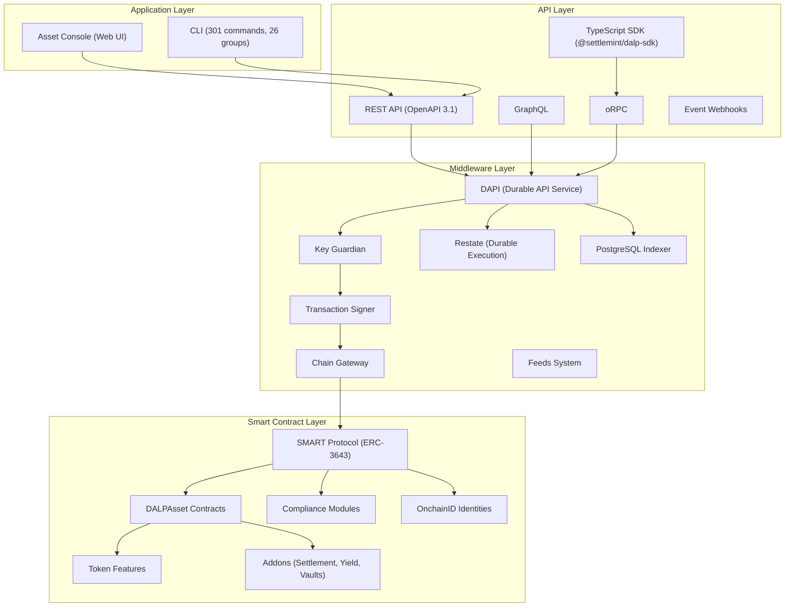
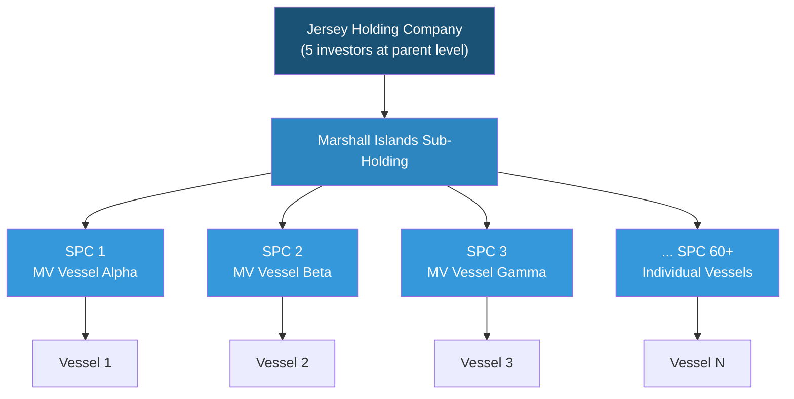
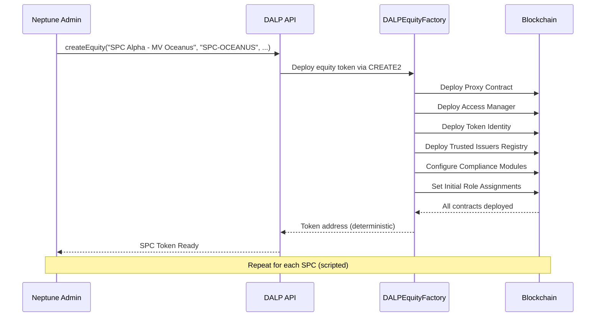
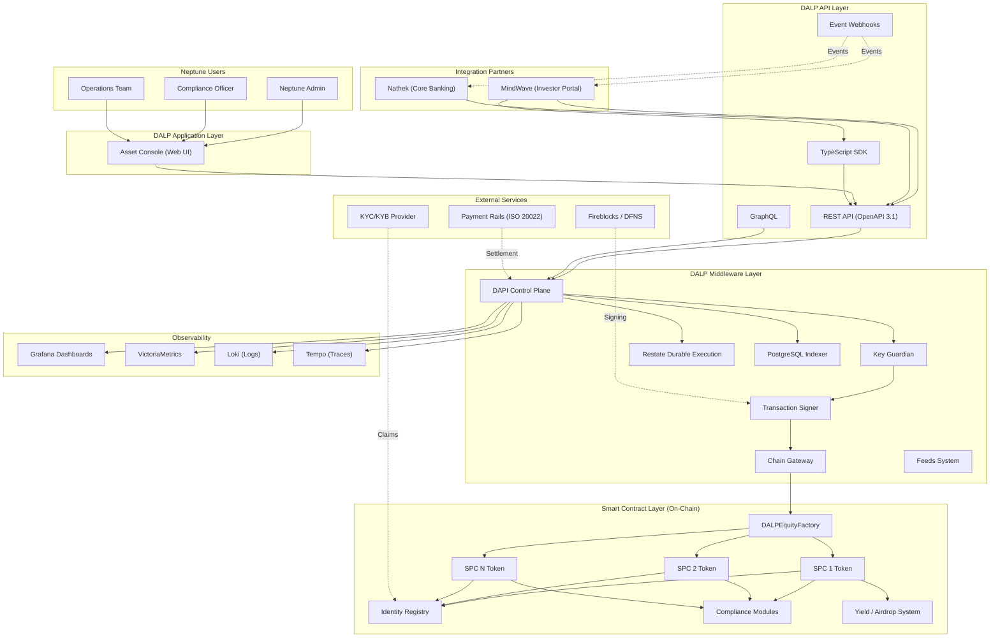
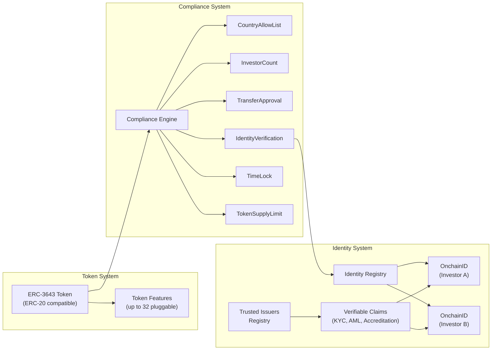
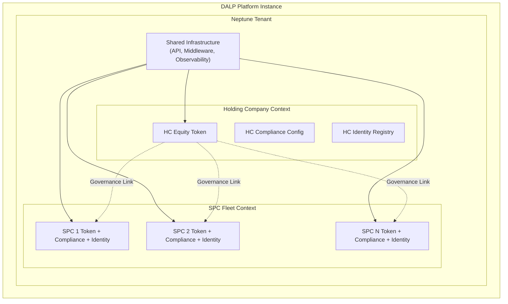
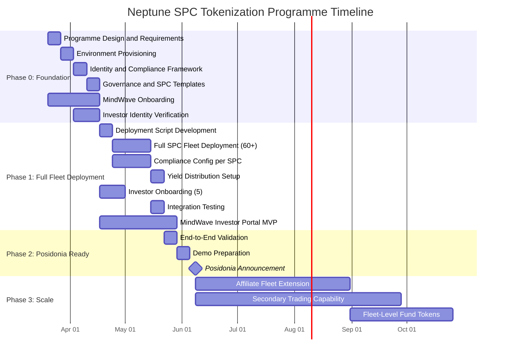
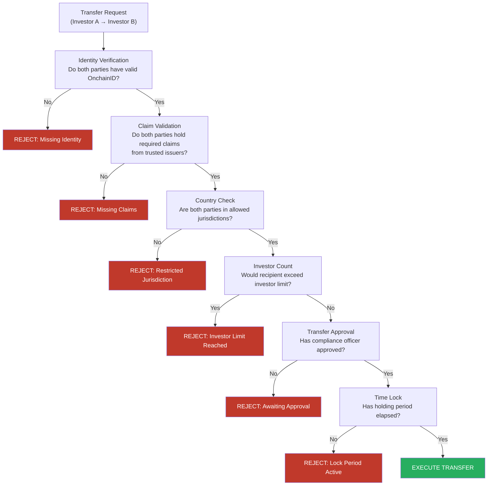
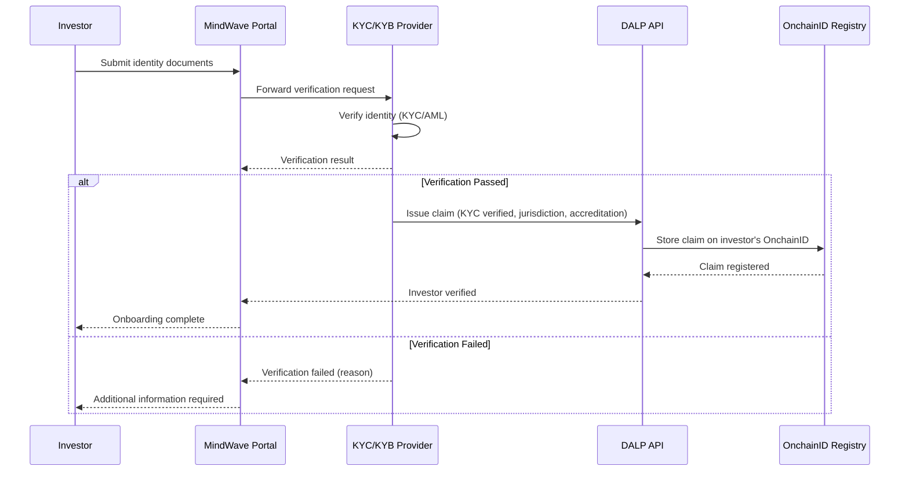
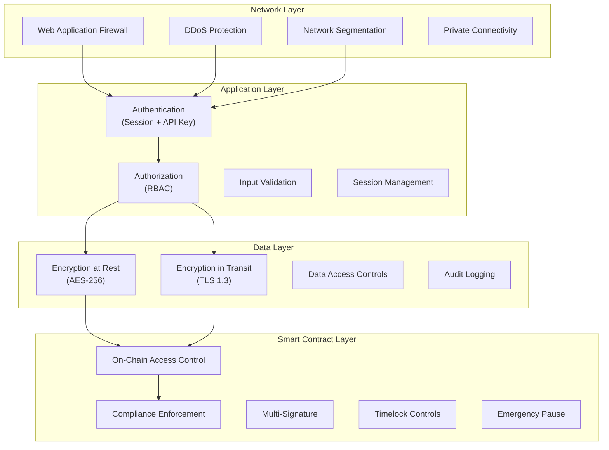

# Technical Proposal: Digital Asset Lifecycle Platform for Corporate Structure Tokenization

## Neptune Maritime Leasing: DALP Solution

| Field | Value |
|---|---|
| Proposal title | Technical Proposal: Digital Asset Lifecycle Platform for Corporate Structure Tokenization |
| Client | Neptune Maritime Leasing |
| Submitted by | SettleMint NV |
| Date | 20 March 2026 |
| Version | v2.0 |
| Classification | Confidential |
| Primary contacts | Harris Antoniou, Iraklis Tsirigotis |

---

## Executive Summary

Neptune Maritime Leasing is pursuing one of the most ambitious tokenization programmes in the maritime finance sector. The programme targets a corporate hierarchy comprising a Jersey-domiciled holding company, a Marshall Islands sub-holding, and more than sixty special purpose companies (SPCs), each tied to a single vessel and its associated receivables and financing arrangements. Neptune's ambition is to tokenize equity interests across this entire SPC fleet, representing 10 to 30 percent partial ownership of each SPC's economic rights, and to do so in time for a public announcement at Posidonia 2026, the world's largest maritime conference, scheduled for early June 2026.

This is not a single-asset tokenization exercise. It is a programme-scale initiative to digitize governance, investor participation, and operational control across a multi-entity corporate structure, in a way that preserves the risk isolation and operational flexibility that SPCs provide while enabling new forms of capital formation and investor engagement. The unit of tokenization is not a vessel. It is a governed legal and economic claim sitting inside a multi-entity structure, with rights and restrictions that flow from the holding company down through the SPC hierarchy.

### Why This Programme Is Achievable at Scale

Neptune's programme is ambitious in scope, sixty-plus SPCs, multi-jurisdictional compliance, and a Posidonia deadline. The platform approach is what makes it achievable. Minting an ERC-20 token is a well-understood operation. Three areas require a platform specifically designed for this scale:

**Multi-entity compliance at scale.** Each SPC may operate under different jurisdictional rules depending on the vessel's flag state, the SPC's domicile, and the residency of its investors. With sixty-plus SPCs, this requires a platform that handles compliance as a first-class concern: each entity needs its own compliance configuration, its own investor eligibility rules, and its own transfer approval workflows. A platform that treats compliance as a single global ruleset cannot serve Neptune's needs.

**Governance repeatability.** Neptune cannot afford sixty bespoke implementations. The governance model, the role hierarchy, the compliance modules, and the operational procedures must be defined once and applied consistently across the fleet, with controlled variation where specific SPCs require different configurations. This demands a platform built around templates and configuration rather than custom smart contract development per entity.

**Lifecycle operations, not just issuance.** Tokenizing sixty SPCs is only the beginning. Each SPC will require ongoing servicing: dividend distributions to token holders based on vessel earnings, voting on corporate decisions, transfer approvals for secondary transactions, and compliance monitoring as investor eligibility evolves. A platform that stops at token creation leaves Neptune with sixty operational gaps.

### SettleMint's Proposed Response

SettleMint proposes its Digital Asset Lifecycle Platform (DALP) as the foundational infrastructure for Neptune's programme. DALP is a standards-based digital asset stack built on ERC-3643 and OnchainID, with configurable token features, modular compliance enforcement, role-based access control, and API-first integration surfaces. It is designed specifically for regulated financial institutions, sovereign entities, and capital markets participants who need more than a token contract: they need an operating system for digital asset issuance, servicing, and governance.

The technical proposal centres on a phased rollout aligned to Neptune's Posidonia deadline:

**Phase 0 (Foundation, 4 weeks, March to April 2026)** deploys the DALP system instance, establishes the identity and compliance framework, defines the governance templates, and prepares all configuration required for full-fleet deployment. Neptune's board has approved immediate tokenization of the full SPC fleet. Phase 0 builds the foundation for executing that commitment at speed.

**Phase 1 (Full Fleet Deployment, 6 weeks, April to May 2026)** deploys all sixty-plus SPC equity tokens using the validated templates from Phase 0. Each SPC receives its own equity token with jurisdiction-specific compliance module configuration, its own identity registry, and its own access control hierarchy. MindWave delivers the investor portal MVP during this phase.

**Phase 2 (Posidonia Readiness, early June 2026)** ensures all sixty-plus SPCs are live with tokens representing partial economic rights, at least one SPC has tokens minted and distributed to investors, and the investor portal is functional for demonstration purposes.

**Phase 3 (Scale, post-Posidonia)** extends the model to affiliate fleets (200 to 300 additional vessels), builds out secondary trading capabilities, and adds fleet-level fund tokens for aggregate exposure.

### Why SettleMint and Why DALP

SettleMint brings three capabilities that are directly relevant to Neptune's programme:

**Live credentials in regulated environments.** SettleMint holds ISO 27001 and SOC 2 Type II certifications and has maintained continuous live deployments at regulated banks for more than seven years. Deployments span bonds, equities, deposits, stablecoins, real estate, and funds across Europe, the Middle East, and Asia-Pacific. This is not a company experimenting with the basics. This is a company operating institutional infrastructure where downtime and compliance failures carry material consequences.

**A platform built for multi-entity programmes.** DALP's architecture supports multiple asset issuances per entity, entity-specific compliance rules, and cross-entity reporting, all from a single platform deployment. The factory pattern (`createEquity()`) with CREATE2 deterministic addressing means Neptune can predict every SPC token's address before deployment. Each SPC gets its own proxy contract, access manager, identity registry, and compliance module set, with no shared state that would create cross-entity risk.

**An honest assessment of boundaries.** DALP provides the tokenization backbone: token issuance, compliance enforcement, identity management, yield distribution, governance, and API-first integration. It does not provide an investor portal (MindWave's scope), a secondary marketplace, legal entity management, fiat on/off-ramps, or automated vessel valuations. These boundaries are stated plainly in this proposal because Neptune's programme will succeed on the strength of what is real, not on the promise of what might be.

The following sections detail the technical architecture, implementation approach, governance controls, integration model, security posture, and risk register for Neptune's programme.

---

## About SettleMint

### Company Overview

SettleMint is the digital asset lifecycle platform company for regulated financial markets and sovereign use cases. Founded in 2016 and headquartered in Leuven, Belgium, SettleMint has grown from an early enterprise blockchain infrastructure provider into the category-defining platform company enabling financial institutions, market infrastructure providers, and sovereign entities to move real-world value on-chain with compliance, security, and operational reliability.

The company exists to solve the operational demands of doing digital assets right. Tokenization technology is increasingly accessible, but the requirements remain substantial: regulatory compliance across multiple jurisdictions, key management for institutional custody requirements, asset lifecycle operations from issuance through servicing to retirement, settlement logic that eliminates counterparty risk, and auditability that satisfies regulators and auditors. Most institutions underestimate these requirements until they are deep in implementation. SettleMint handles that infrastructure layer so institutions can focus on their business.

### Production-Proven Credentials

SettleMint is one of the few companies globally with a track record approaching a decade delivering blockchain and tokenization infrastructure at enterprise and national scale, across some of the world's most demanding environments. Where trust, security, compliance, and uptime are non-negotiable, SettleMint removes execution risk and accelerates time to market with industrial-strength infrastructure that very few organisations can match.

**Multi-year live deployments** with regulated banks and sovereign entities deliver settlement finality, compliance enforcement, and operational availability that regulated environments demand. These are not sandboxes or limited demonstrations; they are business-critical workflows operating under institutional SLAs.

**High-volume transactional flows** in payments and settlements operate under 24/7 uptime requirements with disaster-recovery expectations that reflect the financial services context.

**Sovereign and national-scale programmes** in the Middle East include national real estate tokenization and sovereign-backed capital markets infrastructure. SettleMint is one of the few platforms powering country-scale tokenization initiatives.

**Security-validated operations** have passed security reviews, penetration testing, and vendor risk assessments typical of large financial institutions.

Many SettleMint customer programmes began as innovation initiatives and matured, using the same stack, into business-critical workflows, long-lived platforms under IT ownership, and reference architectures for broader institutional tokenization programmes. This experience directly shaped DALP's focus on lifecycle, integration, and operational sustainability rather than limited demonstration functionality.

### Certifications and Institutional Readiness

SettleMint maintains the certifications and audit postures required for institutional procurement in regulated financial services:

| Certification | Scope |
|---|---|
| ISO 27001 | Information security management system meeting the international standard for establishing, implementing, maintaining, and continually improving information security |
| SOC 2 Type II | Independent third-party audit confirming that SettleMint's controls for security, availability, and confidentiality meet AICPA Trust Services Criteria over an extended observation period |
| Penetration Testing | Regular penetration testing and security assessments conducted by independent third parties |
| Vendor Risk Assessment | Successful completion of vendor risk assessments at tier-1 and tier-2 financial institutions |

These certifications are not marketing claims. They reflect operational discipline that has been tested through years of institutional procurement processes, where vendor risk committees, security teams, and compliance officers evaluate every element of the technology provider's operations before granting approval.

### Leadership

SettleMint's leadership combines deep technical expertise, financial domain knowledge, and enterprise delivery experience:

**Adam Popat, Chief Executive Officer.** Adam leads commercial strategy and global market expansion. His career spans Standard Chartered, SC Ventures, and capital markets, bringing institutional perspective to SettleMint's go-to-market approach. Adam's experience with tier-1 banking environments ensures that SettleMint's engagement model, from pre-sales through delivery, meets the expectations of regulated institutional clients.

**Matthew Van Niekerk, Co-founder and President.** Matthew leads company strategy, investor relations, and market expansion. His extensive experience in enterprise technology, financial services, and blockchain adoption provides the strategic framework within which SettleMint has built its market position. Matthew's long-standing relationships with institutional clients across Europe and the Middle East have been instrumental in securing SettleMint's position as a trusted platform provider.

**Roderik van der Veer, Co-founder and Chief Technology Officer.** Roderik oversees technology strategy, platform architecture, and engineering execution for DALP. With deep expertise in distributed systems, blockchain protocols, enterprise software architecture, and security, Roderik leads a focused engineering team that treats the platform as the product. Under his direction, DALP has evolved from an enterprise blockchain toolkit into a fully integrated digital asset lifecycle platform that reflects the lessons of nearly a decade of production deployments.

The engineering team operates as an engineering-heavy organization. A focused, senior team of core engineers handles all aspects of platform development: smart contract architecture, backend services, API layer, compliance engine, settlement workflows, and infrastructure automation. The team brings together decades of combined experience in financial services (banks, market infrastructure, fintech), enterprise software and SaaS, and blockchain R&D and protocol-level work.

### Geographic Coverage

SettleMint operates across three primary regions:

**Europe.** Headquartered in Leuven, Belgium, with extensive experience across EU regulatory frameworks including MiCA, MiFID II, and DORA. European production deployments span banking, capital markets, and insurance.

**Middle East and Africa.** Active sovereign and national-scale programmes in the Gulf region, including real estate tokenization and sovereign-backed capital markets infrastructure. Partnerships with regional system integrators provide local market knowledge and regulatory expertise.

**Asia-Pacific.** Production deployments with tier-1 and tier-2 banks in Japan and Singapore, with multi-year continuous operations under institutional SLAs. Multi-jurisdiction operational capability validated through live deployments across different regulatory regimes.

This geographic breadth is relevant to Neptune because the programme involves entities domiciled in Jersey, the Marshall Islands, and potentially flag states across multiple continents. SettleMint's experience navigating multi-jurisdictional regulatory requirements is directly applicable.

### Technology Partnerships and Ecosystem

SettleMint has built a partner ecosystem that extends delivery capability, deepens technology integration, and provides regional coverage:

**Custody providers.** Deep integrations with institutional custody platforms including Fireblocks and DFNS, supporting a bring-your-own-custodian model that allows institutions to retain existing custodian relationships while benefiting from DALP's workflow orchestration.

**Cloud infrastructure providers.** Full deployment flexibility across AWS, Azure, and GCP, supporting managed SaaS, private cloud, on-premises, and hybrid deployment models. SettleMint maintains reference architectures and Helm-based deployment automation for each provider.

**Payment rail connectivity.** ISO 20022 integration supporting SWIFT, SEPA, and RTGS connectivity for cash-leg settlement in asset transactions.

**Strategic investors.** Backed by leading investors in Europe and the Middle East, with board-level financial services expertise that reinforces SettleMint's positioning as an institutional-grade platform provider.

### Three Pillars for Success

SettleMint's value to regulated institutions rests on three reinforcing pillars:

**Technology (DALP).** The Digital Asset Lifecycle Platform provides the infrastructure institutions need to operate tokenized assets at scale, under regulation. DALP covers the full digital asset lifecycle: from asset design through issuance, compliance enforcement, custody integration, settlement, servicing, corporate actions, and redemption, treated as one continuous lifecycle under a single governance model, security posture, and operating framework.

**Track Record.** Multi-year production deployments with regulated banks, sovereign entities, and market infrastructure providers. SettleMint's technology has been validated through years of real-world operation, across multiple regions and regulatory environments. Live deployments span bonds, equities, deposits, stablecoins, real estate, funds, and precious minerals.

**Team.** A group with deep, cumulative experience in tokenization and financial infrastructure, combining technical depth, financial domain knowledge, and enterprise delivery expertise. The team has seen the full lifecycle of tokenization programmes and built the operational discipline required to run mission-critical financial infrastructure.

| Category | Evidence |
|---|---|
| Market Validation | Nearly 10 years focused on blockchain infrastructure; 7+ years of continuous production deployments at regulated banks |
| Operational Maturity | Live deployments across bonds, equities, deposits, stablecoins, real estate, funds; security and compliance validated across regulated environments |
| Sovereign Credibility | Active sovereign and national-scale programmes in the Middle East |
| Ecosystem Strength | Trusted by tier-1 and tier-2 banks, CSDs, and sovereign entities; backed by leading European and Middle Eastern investors |
| Team Depth | 200+ years combined banking and blockchain experience across the team |

---

## About DALP

### Platform Overview

DALP is SettleMint's Digital Asset Lifecycle Platform for designing, launching, and operating tokenized assets across financial instruments and real-world assets. It supports bonds, funds, deposits, stablecoins, real estate, equities, precious metals, and configurable token types. DALP encapsulates the operational requirements of doing digital assets right: regulatory compliance, key management, asset lifecycle, settlement logic, and auditability, so institutions can launch without building blockchain expertise internally and without lengthy development cycles.

The platform's architecture is composable by design. A single audited token contract (DALPAsset) can represent any financial instrument through runtime configuration of up to 32 pluggable token features (fees, yield, governance, maturity, conversion, voting power), 12 compliance module types across six categories (eligibility, restrictions, transfer controls, issuance/supply, time-based rules, settlement/collateral), customizable metadata schemas, and operational add-ons (settlement, distribution, vaults, data feeds). Both the token's economic behaviour and the compliance rules that govern it are independently selectable, composable, and reconfigurable post-deployment. Institutions configure from pre-audited catalogues rather than writing custom smart contracts.

Unlike point solutions that address only issuance, only custody, or only trading, DALP provides a unified platform covering the full digital asset lifecycle, from asset design through issuance, compliance enforcement, custody integration, settlement, servicing, and retirement, treated as one continuous lifecycle under a single governance model, security posture, and operating framework.

### Four-Layer Architecture

DALP is built as a four-layer stack, with each layer having a distinct responsibility boundary and communicating through well-defined interfaces:

| Layer | Role | Key Components |
|---|---|---|
| Application | User-facing interfaces for operators, issuers, and compliance officers | Asset Console (web UI), CLI with 301 commands across 26 groups |
| API | Programmatic access surface for integrations and automation | REST (OpenAPI 3.1), GraphQL, oRPC, TypeScript SDK, event webhooks |
| Middleware | Workflow orchestration, key management, indexing, durable execution | DAPI control plane, Key Guardian, Restate durable workflows, PostgreSQL indexer, transaction signer, chain gateway, feeds system |
| Smart Contract | On-chain enforcement of token logic, compliance, and identity | SMART Protocol (ERC-3643), DALPAsset contracts, compliance modules, token features, OnchainID, addons |

Requests flow top-down through these layers. A user action in the Asset Console triggers an API call, which the middleware orchestrates into one or more blockchain transactions, which the smart contract layer validates and executes on-chain. Each layer independently enforces its own security controls, so no single-layer failure grants unauthorized access.

The middleware layer deserves particular attention. DAPI (Durable API Service) is the control plane that converts authenticated API traffic into tenant-scoped, permission-aware, execution-ready operations. Restate provides durable workflow orchestration, meaning multi-step workflows survive process restarts and infrastructure failures. The PostgreSQL indexer uses a zero-downtime schema lifecycle with rotating deployment schemas, enabling continuous operation during upgrades.

### SMART Protocol (ERC-3643) Foundation

All DALP smart contracts are built on the SMART Protocol, SettleMint's implementation of the ERC-3643 standard. ERC-3643 defines a specification for regulated security tokens where every transfer must pass through a modular compliance engine before execution. This is the key differentiator from standard ERC-20 tokens, where compliance is typically handled off-chain or not at all.

SMART Protocol provides three foundational sub-layers:

**Token layer.** ERC-20 compatible contracts with compliance hooks and a modular extension system. External systems, including wallets, exchanges, and indexers, interact through standard ERC-20 and ERC-3643 interfaces. This means Neptune's tokens are compatible with any Ethereum ecosystem tooling.

**Compliance layer.** An orchestration engine that evaluates a configurable set of transfer rules before each transaction. Rules are modular and can be added, removed, or reconfigured at runtime without redeploying the token contract. The engine evaluates modules in sequence, and a transfer executes only if all applicable modules return a positive result.

**Identity layer.** On-chain identity management via OnchainID (ERC-734/735), storing verifiable KYC/AML claims. Identity verification is enforced on-chain as a prerequisite for transfers. Each investor has an OnchainID contract that serves as a container for verifiable claims about their eligibility.

ERC-3643 was chosen over alternatives such as ERC-1400 for its modular compliance engine, on-chain identity integration through OnchainID, and active ecosystem support. For Neptune, ERC-3643 provides the regulatory-grade foundation that maritime finance investors and regulators expect: every transfer is automatically validated against configured compliance rules before execution.

### DALPAsset: The Configurable Contract

DALPAsset is the recommended contract type for all new tokenization projects. It extends the SMART Protocol with the SMARTConfigurable extension, allowing token features and compliance modules to be attached and reconfigured at runtime, after deployment.

This design eliminates the need to commit to a specialised contract type at deployment time. A DALPAsset token can evolve: start as a simple equity instrument, then have yield distribution added, governance enabled, or transfer restrictions modified, all without redeploying the contract.

**Runtime-pluggable token features** integrate through six lifecycle hooks (mint, burn, transfer, redeem, update, attach) via the ISMARTFeature interface. Features relevant to Neptune include:

| Feature | Relevance to Neptune |
|---|---|
| Historical Balances | Snapshot-based balance tracking for pro-rata dividend distributions across SPC token holders |
| Voting Power (ERC5805) | On-chain governance for corporate decisions at holding company or SPC level |
| Permit (EIP-2612) | Gasless approvals enabling investor-friendly transaction flows |
| Fixed Treasury Yield | Configurable yield schedules for SPC earnings distribution |
| AUM Fee | Fee structures for managed fund-style arrangements |
| Maturity and Redemption | End-of-life logic for instruments with fixed terms |

**Compliance modules** enforce transfer and supply rules through the ERC-3643 compliance engine. Modules can be added, removed, or reconfigured at runtime. The full catalogue includes:

- Identity Verification (requires valid KYC/AML claims)
- Country Allow List (restrict to specific jurisdictions)
- Country Block List (exclude specific jurisdictions)
- Investor Count (cap number of holders per token)
- Transfer Approval (require manual compliance officer approval)
- Token Supply Limit (cap total supply)
- Capped Holdings (cap per-investor holdings)
- Time Lock (enforce holding periods)
- Collateral (collateralization requirements)
- Identity Allow/Deny Lists (whitelist or blacklist specific investors)

All configuration changes require the GOVERNANCE_ROLE. Multi-signature or timelock governance is recommended for production deployments.

### Role-Based Access Control

DALP implements role-based access control at both the system and asset levels. Roles define who can perform which actions, with clear separation of duties between governance, operations, compliance, and administration.

**System-level roles** govern platform-wide administration:

| Role | Authority |
|---|---|
| Owner | Ultimate administrative authority over the system |
| Admin | System configuration and management |
| Compliance Officer | Compliance policy management |
| Auditor | Read-only access to audit trails |

**Asset-level roles** govern individual token operations:

| Role | Authority |
|---|---|
| Governance | Strategic decision-making, configuration changes |
| Custodian | Asset protection, freeze and recovery operations |
| Supply Manager | Minting and burning authority |
| Compliance Manager | Compliance rule configuration per asset |
| Transfer Manager | Transfer execution authority |
| Emergency | Emergency stop and freeze capabilities |

This role model directly supports Neptune's requirement for clear separation of duties across a multi-entity structure. The holding company governance team might control strategic decisions, the compliance team might control eligibility rules, and the operations team might control day-to-day transfers, all enforced by the smart contract layer.

### Multi-Entity and Multi-Tenant Capabilities

DALP is designed to support multiple legal entities from a single platform deployment. Each entity operates within its own isolated context, with dedicated identity registries, compliance configurations, and asset deployments. This is directly relevant to Neptune's structure, where the holding company and each SPC need independent but coordinated operational contexts.

The platform supports:

- Multiple asset issuances per entity, enabling Neptune to issue different instrument types (equity, debt, hybrid) under the same SPC if needed
- Entity-specific compliance rules, so each SPC can have jurisdiction-appropriate transfer restrictions
- Cross-entity reporting and governance coordination, providing consolidated views across the fleet
- Hierarchical relationships between entities, supporting the parent-subsidiary structures that characterise Neptune's corporate hierarchy

### Supported Asset Classes

DALP provides purpose-built templates with asset-specific lifecycle logic for seven asset classes, plus a configurable token for custom assets:

| Asset Class | Key Features | Neptune Relevance |
|---|---|---|
| Equities | Dividend distribution, voting rights, corporate actions | Primary fit for SPC tokenization |
| Bonds | Coupon schedules, maturity logic, call/put options | Potential fit for debt instruments |
| Funds | NAV integration, fractional units, fee structures | Fleet-level portfolio tokens (Phase 3) |
| Deposits | Programmable interest, maturity, withdrawal rules | Not directly applicable |
| Stablecoins | Reserve monitoring, attestation, multi-currency | Not directly applicable |
| Real Estate | Property title tokenisation, fractional ownership, rental income | Structural similarity to vessel SPCs |
| Precious Metals | Asset-backed tokens, provenance tracking | Not directly applicable |
| Configurable Token | Up to 32 pluggable features for novel asset classes | Custom maritime instruments |

For Neptune, the **equity** asset class is the primary fit. Each SPC equity token represents partial ownership of the SPC's economic rights, with voting, dividend distribution, and transfer restrictions configured per entity.

### Value Proposition

DALP delivers a unified platform for the entire digital asset lifecycle, with compliance by design, atomic settlement, and the operational tooling that regulated environments demand.

| Outcome | Detail |
|---|---|
| Accelerated Time-to-Market | 60 to 80 percent reduction in launch timelines through pre-built asset templates, jurisdictional compliance templates, and modern APIs |
| Reduced Operational Risk | Single source of truth eliminates multi-vendor drift and nightly reconciliations; atomic operations keep ownership, compliance, and custody synchronised |
| Regulatory Confidence | Compliance-by-design enforces eligibility before execution; auditable evidence of checks and approvals embedded in the system |
| Scalable Business Models | Expand across instruments, jurisdictions, and networks using the same control plane, rule engine, and operating model |
| Strategic Flexibility | Deploy on-prem, cloud, or managed SaaS; connect to existing custodians and payment rails; operate on public or private EVM chains without lock-in |

---

## Understanding of Neptune's Requirements

### Corporate Structure Analysis

Neptune Maritime Leasing operates a corporate structure that is well-suited to systematic, template-driven tokenization. The hierarchy consists of three distinct corporate layers:

**At the apex** sits a Jersey-domiciled holding company, which provides equity cushion and governance oversight for the entire structure. Five investors hold interests at this parent level.

**Below the holding company** sits a Marshall Islands sub-holding entity, which serves as the intermediate layer between the Jersey holding company and the operational SPCs. Marshall Islands incorporation is standard practice in maritime finance, offering well-understood regulatory frameworks and established ship registry procedures.

**At the operational level**, more than sixty special purpose companies each own a single vessel. Each SPC is tied to specific vessel receivables and financing arrangements, creating natural risk isolation between vessels. This structure is not accidental: it reflects decades of maritime financing practice where SPCs isolate risk, simplify debt instruments, and provide flexibility for individual vessel transactions without affecting the broader portfolio.

Neptune's tokenization programme targets this SPC layer directly: each SPC will issue equity tokens representing 10 to 30 percent partial ownership of the SPC's economic rights. The programme's immediate scope is the existing fleet of sixty-plus SPCs, with a longer-term vision encompassing 200 to 300 vessels across Neptune and affiliate fleets.

### Three Strategic Dimensions

Neptune's programme serves three distinct but interconnected strategic objectives:

**SPC fleet tokenization (immediate priority).** The direct tokenization of sixty-plus SPCs, each with its own equity token, its own compliance configuration, and its own investor eligibility rules. This is the core deliverable for Posidonia 2026 and the primary focus of this proposal.

**Capital formation and investor access.** Tokenized SPC interests create new channels for investor participation in maritime assets. Fractional ownership of individual vessel SPCs, rather than undifferentiated exposure to the entire fleet, gives investors the ability to select specific risk-return profiles. For Neptune, this unlocks capital formation pathways that would be impractical through traditional instruments.

**Industry platform ambition.** Neptune's long-term vision extends beyond its own fleet. The objective is to establish a tokenization platform that can serve the broader shipping industry, enabling vessel-by-vessel tokenization, fleet-based tokenization, and corporate instrument issuance across multiple operators. This ambition requires a platform foundation that is configurable, scalable, and not locked to Neptune-specific implementations.

### Programme Objectives

Based on the programme context, Neptune's objectives map to the following technical requirements:

**Objective 1: Deploy tokenized equity interests across sixty-plus SPCs by Posidonia 2026.** Each SPC requires its own ERC-3643 equity token with independently configurable compliance modules, identity verification, and role-based access control. The deployment must be repeatable and efficient, not sixty bespoke implementations.

**Objective 2: Enforce multi-jurisdictional compliance at the SPC level.** Jersey (parent), Marshall Islands (sub-holding), and individual flag states for sixty-plus vessels create a web of jurisdictional requirements. Each SPC token must enforce the appropriate investor eligibility rules for its specific jurisdictional context.

**Objective 3: Support investor participation and servicing.** Token holders expect dividend distributions based on vessel earnings, voting rights on SPC-level decisions, and the ability to transfer interests subject to compliance controls. The platform must support these lifecycle operations, not just issuance.

**Objective 4: Enable Neptune to operate independently.** Neptune's team must be able to manage the platform without constant vendor dependency. This means clear administrative interfaces, comprehensive audit trails, and operational procedures that the Neptune team can own.

**Objective 5: Provide a credible foundation for Posidonia announcement.** The Posidonia demonstration must show a functioning platform with real tokens, real compliance enforcement, and real investor workflows, not a prototype or mockup.

### Key Technical Considerations

The programme presents several technical considerations that directly inform platform selection:

| Consideration | Design Requirement | Platform Response |
|---|---|---|
| Multi-entity deployment at scale | 60+ SPCs, each requiring independent token contracts, compliance, and identity | Must support factory-pattern deployment with per-entity configuration |
| Jurisdictional compliance requirements | Jersey, Marshall Islands, plus flag states across multiple continents | Must support per-token compliance module configuration without code changes |
| Governance repeatability | Consistent role hierarchy and operational procedures across 60+ entities | Must support templates and configuration-driven deployment |
| Lifecycle servicing | Dividend distribution, voting, transfer approvals across all SPCs | Must provide servicing capabilities, not just issuance |
| Timeline pressure | Posidonia deadline in approximately 12 weeks from programme start | Must support rapid deployment with proven deployment patterns |
| Investor identity at scale | 5 investors initially, with potential expansion | Must provide identity registry with claim-based verification |
| Vessel metadata | IMO number, vessel class, flag state, charter details per SPC | Needs metadata layer (custom claims or off-chain registry) |
| Integration requirements | KYC/KYB, custody, payment rails, investor portal, core banking | Must provide API-first integration surface |

### Requirement Domains Mapping

The following table maps Neptune's requirement domains to the proposed solution approach:

| Requirement Domain | Solution Approach | DALP Capability Type |
|---|---|---|
| Token issuance per SPC | createEquity() factory with CREATE2 deterministic addresses | Native |
| Compliance enforcement | Modular compliance modules (CountryAllowList, InvestorCount, TransferApproval, etc.) | Native |
| Identity verification | OnchainID with claim-based KYC/AML verification | Native |
| Dividend distribution | DALPFixedYieldScheduleUpgradeable + airdrop system | Native |
| Voting rights | ERC20Votes (ERC5805) governance | Native |
| Historical balance tracking | SMARTHistoricalBalancesUpgradeable for snapshot-based records | Native |
| Batch token operations | batchMint, batchBurn, batchForcedTransfer, batchSetAddressFrozen | Native |
| Asset templates | Reusable configurations for SPC equity issuance | Configuration-driven |
| Compliance rule sets | Standardized compliance configurations per jurisdiction | Configuration-driven |
| Permission structures | Role hierarchy templates for consistent SPC governance | Configuration-driven |
| KYC/KYB integration | External provider integration via OnchainID claims model | Integration-dependent |
| Investor portal | MindWave custom UI development | Integration-dependent |
| Payment rails | ISO 20022/SEPA connectivity for cash settlement | Integration-dependent |
| Core banking integration | Nathek system connectivity | Integration-dependent |
| Custody services | Fireblocks or DFNS institutional custody | Integration-dependent |
| Vessel metadata management | Custom claims layer or off-chain registry | Requires custom work |
| Secondary marketplace | External exchange or OTC desk integration | Outside DALP scope |
| Legal entity management | Neptune's existing corporate administration | Outside DALP scope |

---

## Proposed Solution

### Solution Overview

SettleMint proposes DALP as the foundational platform for Neptune's corporate structure tokenization programme. The solution addresses Neptune's requirements through a combination of native platform capabilities, configuration-driven deployment patterns, integration-dependent outcomes, and honest boundary acknowledgments. This section details each category, providing Neptune with a clear picture of what the platform delivers directly, what requires configuration work, what depends on external systems, and what sits outside the platform's scope.

### Native DALP Capabilities

The following capabilities are native to the DALP platform and require no bespoke development. They represent the core technical foundation for Neptune's programme.

#### ERC-3643 Token Foundation with OnchainID

All Neptune SPC tokens will be issued as ERC-3643 compliant security tokens with built-in compliance enforcement. This is the regulatory-grade foundation that distinguishes DALP from commodity token platforms. Every transfer is automatically validated against configured compliance rules before execution. If an investor does not hold the required identity claims or falls within a restricted category, the transfer is blocked at the smart contract level. This provides deterministic enforcement that cannot be bypassed by operational oversight.

OnchainID (ERC-734/735) provides the identity layer. Each investor has an on-chain identity contract that stores verifiable claims issued by trusted authorities. Claims can represent KYC verification, AML screening, accreditation status, jurisdictional residence, or any other eligibility criterion. The identity system is modular: different SPC tokens can require different claim types, enabling Neptune to enforce different eligibility rules per SPC without modifying smart contract code.

#### Factory Pattern Deployment

DALP's equity factory (`DALPEquityFactoryImplementation`) provides the `createEquity()` function for deploying individual equity tokens. Each call deploys a complete token stack: proxy contract, access manager, token identity, and trusted issuers registry. The factory uses CREATE2 deterministic addressing, meaning Neptune can predict every SPC token's contract address before deployment.

For Neptune's programme, each of the sixty-plus SPCs requires a separate `createEquity()` transaction. There is no batch deployment function: each SPC is deployed individually. This is a deliberate design choice. Each SPC gets its own isolated set of contracts (proxy, access manager, identity, compliance), with no shared state that would create cross-entity risk. Deploying sixty SPCs requires scripting sixty sequential calls, which is a straightforward engineering exercise estimated at 15 to 20 minutes of sequential transactions on a public chain, and faster on a Layer 2 or private network.

#### Compliance Module Suite

DALP provides a catalogue of compliance modules that can be composed per SPC token. For Neptune, the following modules are directly relevant:

**CountryAllowListComplianceModule.** Restricts token transfers to investors domiciled in specific jurisdictions. Each SPC can have its own jurisdiction allowlist based on the vessel's flag state and applicable regulations.

**InvestorCountComplianceModule.** Caps the number of investors that can hold tokens in a given SPC. This enforces regulatory thresholds (for example, private placement limits) and prevents the investor base from exceeding regulatory boundaries.

**TransferApprovalComplianceModule.** Requires explicit approval from a designated compliance officer before a transfer can execute. This provides a human-in-the-loop gate for transfers that require additional review, which is common in private placement scenarios.

**TimeLockComplianceModule.** Imposes holding periods after issuance during which transfers are restricted. Useful for enforcing regulatory cooling-off requirements or contractual lock-up periods.

**TokenSupplyLimitComplianceModule.** Caps the total supply of tokens for a given SPC. This prevents over-issuance beyond the intended ownership percentage (10 to 30 percent of each SPC's economic rights).

**SMARTIdentityVerificationComplianceModule.** Requires that both sender and recipient hold valid identity claims from trusted issuers before any transfer can proceed. This is the foundational KYC/AML enforcement mechanism.

**CappedComplianceModule.** Caps per-investor holdings, preventing any single investor from acquiring more than a configured percentage of an SPC's tokens.

**CollateralComplianceModule.** Enforces collateralization requirements where applicable.

Compliance modules are composed per token and evaluated sequentially. A transfer executes only if every configured module returns a positive result. Modules can be added, removed, or reconfigured at runtime by holders of the GOVERNANCE_ROLE, without redeploying the token contract.

#### Batch Operations

Each SPC equity token supports batch operations for efficient management across multiple investors:

- `batchMint`: Issue tokens to multiple investors in a single transaction
- `batchBurn`: Redeem tokens from multiple investors in a single transaction
- `batchForcedTransfer`: Execute mandatory transfers (for example, corporate restructuring) across multiple holders
- `batchSetAddressFrozen`: Freeze or unfreeze multiple investor addresses simultaneously

These operations are essential for Neptune's scale. When distributing tokens to five investors across sixty SPCs, batch operations reduce the transaction count from 300 individual operations to 60 batch operations.

#### Yield Distribution and Dividends

DALP provides two mechanisms for distributing SPC earnings to token holders:

**DALPFixedYieldScheduleUpgradeable** supports fixed yield schedules, enabling Neptune to define periodic distribution events tied to vessel earnings.

**Airdrop system** provides push-based distribution: push airdrop (immediate distribution), vesting airdrop (distribution over time), and time-bound airdrop (distribution within a window). These mechanisms can distribute dividends to SPC token holders proportionally based on their holdings.

The `SMARTHistoricalBalancesUpgradeable` feature provides snapshot-based balance tracking, which is the right foundation for pro-rata distributions. At any point in time, Neptune can query the precise token balance of every holder at a specific timestamp, ensuring accurate dividend allocation even when transfers have occurred between the earnings period and the distribution date.

#### Historical Balances and Governance

**Historical balance tracking.** All token balances are tracked with timestamp-based historical provenance. This supports audit requirements, shareholder rights calculations, and the pro-rata distribution mechanism described above.

**Voting power via ERC20Votes (ERC5805).** For equity-style instruments, DALP supports on-chain voting with configurable vote delegation, quorum requirements, and vote recording. Token holders can delegate their voting power to representatives, enabling board-style governance at the SPC or holding company level.

**Custodian capabilities.** Each SPC token includes freeze (per-address and partial), forced transfer, and wallet recovery capabilities for custodian-level control. The emergency pause mechanism (Pausable) provides a full stop capability for individual SPC tokens without affecting other entities.

#### Meta-Transaction Support

All SPC tokens support meta-transactions via ERC-2771, enabling gasless transaction flows for investors. This means investors can interact with their SPC tokens without needing to hold native cryptocurrency for gas fees, which is important for an investor audience that may not be familiar with blockchain operations.

### Configuration-Driven Capabilities

The following outcomes are achieved through DALP's configuration framework rather than bespoke development. They require configuration work during implementation but do not require smart contract modifications:

**Asset templates.** A repeatable issuance pattern can be defined once and reused across multiple SPCs. This includes the token type (equity), compliance module set, role assignments, token features (historical balances, voting, yield), and operational procedures. Templates address Neptune's repeatability requirement: define the SPC equity configuration once, deploy it sixty times with controlled variation.

**Compliance rule sets.** Neptune can define standard compliance rule sets and apply them across groups of SPCs. For example, a "standard SPC" rule set might include identity verification, country allowlist (Jersey, Marshall Islands, relevant flag states), investor count cap, and transfer approval. SPCs with different jurisdictional requirements receive variations of this baseline.

**Permission structures.** The role hierarchy for each entity can be defined as a template, ensuring consistent separation of duties across the SPC fleet. Neptune's governance team holds GOVERNANCE_ROLE across all SPCs; the compliance team holds COMPLIANCE_MANAGER_ROLE; the operations team holds TRANSFER_MANAGER_ROLE and SUPPLY_MANAGER_ROLE.

**Investor eligibility criteria.** The specific claim types required for investor eligibility can be configured per SPC. Different SPCs can require different combinations of KYC verification, accreditation status, and jurisdictional claims, all without code changes.

**Distribution workflows.** Dividend distribution procedures, including yield schedules, airdrop configurations, and snapshot timing, can be standardized across SPCs and executed with consistent processes.

### Integration-Dependent Outcomes

The following outcomes depend on external systems, implementation partners, or Neptune's own operational processes. DALP provides the integration points, but the outcome requires external coordination:

**KYC/KYB data ingestion.** DALP stores and evaluates identity claims, but the claims must be issued by a trusted issuer. Neptune must select a KYC/KYB provider that will verify investor identities and issue claims to investors' OnchainID contracts. DALP's API layer supports direct API integration, webhook-based notification, and batch upload patterns for claim issuance.

**Investor onboarding and portal.** The complete investor-facing experience (which SPCs they hold, vessel details, distributions received, compliance status) requires a custom UI. MindWave, as Neptune's Athens-based development partner, is positioned to build this investor portal on top of DALP's API layer. DALP provides the data and enforcement; MindWave provides the presentation and user experience.

**Payment and cash-movement connectivity.** Investor subscription (paying for SPC tokens) and distributions (receiving dividends) in fiat currency require integration with banking or payment rails. DALP supports ISO 20022 integration for SWIFT, SEPA, and RTGS connectivity, but the specific payment provider and integration approach must be defined with Neptune.

**Custody provider integration.** If Neptune uses a third-party custodian for key management and transaction signing, DALP supports integration with Fireblocks and DFNS through provider-delegated transaction broadcast. The custodian owns nonce allocation, gas handling, signing, and broadcast while DALP retains permissioning and workflow control.

**Nathek core banking integration.** Alex Maruta's presence as Nathek CTO in the programme indicates that core banking integration will be required. DALP's API layer (REST, GraphQL, webhooks) provides the integration surface for connecting to Nathek's systems for treasury management, cash reconciliation, and position reporting.

**MindWave scope.** MindWave's development scope must be defined explicitly. Based on the programme context, MindWave is expected to handle: investor-facing portal development, custom UI for SPC management, integration development between DALP and Neptune's existing systems, and deployment scripting for bulk SPC creation. MindWave's ramp-up time on DALP is a timeline risk that must be managed.

### Honest Boundaries

The following items are outside DALP's native scope. These boundaries are stated plainly because Neptune's programme will succeed on accurate expectations, not on implied capabilities:

**No batch createEquity().** There is no bulk deployment function in the equity factory. Each SPC requires a separate `createEquity()` call. Deploying sixty SPCs requires a script that executes sixty sequential transactions. This is straightforward to implement (MindWave or SettleMint can build it in days, not weeks) but it is not an out-of-the-box function.

**No secondary marketplace.** DALP creates and manages the tokens; it does not provide a trading venue. If Neptune wants SPC token holders to trade interests, Neptune would need to integrate with a licensed exchange or establish an OTC desk with the TransferApprovalComplianceModule providing on-chain approval gates.

**No legal entity management.** DALP does not create or manage the actual SPC legal entities in Marshall Islands or Jersey. The tokens represent a digital overlay on existing legal structures. The legal entities, their corporate governance, and their regulatory filings remain in Neptune's existing corporate administration.

**No fiat on/off-ramp.** DALP does not process fiat payments. Investor subscription payments and dividend distributions in fiat require integration with banking or payment rails through the integration approach described above.

**No automated NAV calculation.** Vessel valuations driving SPC token pricing need an external oracle or manual process feeding into DALP. The platform does not include vessel appraisal, market data feeds, or automated valuation models.

**Vessel metadata needs custom work.** DALP equity tokens do not natively store vessel metadata (IMO number, vessel class, charter party details, flag state). This needs either a custom claims layer through the OnchainID system (attaching vessel-specific claims to the SPC token's identity contract) or an off-chain registry with on-chain pointers. This is configuration and integration work, not a platform limitation, but it requires planning during Phase 0.

### Solution Fit Matrix

The following matrix summarises how DALP addresses each of Neptune's core requirements:

| Neptune Requirement | DALP Response | Capability Type | Gap / Risk |
|---|---|---|---|
| Deploy 60+ SPC equity tokens | createEquity() factory, one call per SPC | Native | No batch function; scripting required |
| Per-SPC compliance configuration | Modular compliance modules composed per token | Native | 60 configurations require legal input per SPC |
| Investor identity verification | OnchainID with claim-based KYC/AML | Native | Requires KYC provider integration |
| Transfer restrictions | TransferApproval, CountryAllowList, TimeLock modules | Native | None |
| Dividend distribution | DALPFixedYieldSchedule + airdrop + historical balances | Native | Configuration needed per SPC |
| Voting rights | ERC20Votes (ERC5805) | Native | None |
| Batch token operations | batchMint, batchBurn, batchForcedTransfer | Native | None |
| Emergency controls | Pause, freeze, forced transfer | Native | None |
| Repeatable deployment | Asset templates with consistent configuration | Configuration-driven | Template design during Phase 0 |
| Compliance rule standardization | Reusable compliance rule sets | Configuration-driven | Legal input required |
| Multi-entity governance | Entity-specific role hierarchies from templates | Configuration-driven | None |
| KYC/KYB integration | API integration with external provider | Integration-dependent | Provider selection required |
| Investor portal | MindWave custom development | Integration-dependent | MindWave ramp-up timeline |
| Payment rails | ISO 20022/SEPA/RTGS connectivity | Integration-dependent | Payment provider selection required |
| Core banking integration | REST/GraphQL/webhook API surface | Integration-dependent | Nathek scope TBD |
| Custody services | Fireblocks/DFNS integration | Integration-dependent | Provider selection required |
| Vessel metadata | Custom claims or off-chain registry | Requires custom work | Design needed in Phase 0 |
| Secondary marketplace | Not provided by DALP | Outside scope | Separate engagement if needed |
| Legal entity management | Not provided by DALP | Outside scope | Neptune existing systems |
| Fiat on/off-ramp | Not provided by DALP | Outside scope | Payment integration covers this |
| Automated vessel valuation | Not provided by DALP | Outside scope | Manual or external oracle |

---

## Technical Architecture

### Architecture Principles

The technical architecture for Neptune's programme follows these principles:

**Isolation by default.** Each SPC token operates with its own proxy contract, access manager, identity registry, and compliance module set. No shared mutable state exists between SPC tokens. A compromise or misconfiguration in one SPC cannot affect another.

**Compliance before execution.** Every transfer passes through the compliance engine before execution. There is no mechanism to bypass compliance checks, even for administrative operations. The system enforces eligibility ex-ante, not ex-post.

**Configuration over code.** Changes to compliance rules, role assignments, and token features are made through configuration, not smart contract redeployment. This enables Neptune to adjust rules as regulations evolve without engineering effort.

**API-first integration.** All platform capabilities are accessible through programmatic interfaces (REST, GraphQL, oRPC, webhooks), enabling MindWave, Nathek, and Neptune's internal systems to integrate with DALP without custom middleware.

**Durable execution.** Multi-step workflows (issuance, settlement, distribution) survive process restarts and infrastructure failures through Restate's durable execution engine. This is enterprise reliability by design, not best-effort scripting.

### Platform Architecture Stack

The following diagram shows the complete platform architecture for Neptune's deployment:

### SMART Protocol Internals

The SMART Protocol implements the ERC-3643 standard with three interconnected sub-systems:

**Transfer validation flow.** When a transfer is initiated, the token contract calls the compliance engine. The engine evaluates each configured module in sequence. If any module rejects the transfer, the entire transaction reverts. This is atomic: there is no partial compliance. The identity verification module checks the Identity Registry to confirm both sender and recipient hold valid claims from trusted issuers.

**Feature execution flow.** Token features execute through lifecycle hooks. When tokens are minted, the mint hook fires across all attached features. When tokens are transferred, the transfer hook fires. This allows features like historical balances, yield calculation, and fee collection to operate transparently alongside the core token logic.

### Data Architecture

DALP's data architecture separates on-chain and off-chain storage:

**On-chain data** includes token ownership records, compliance module configurations, identity claims, transfer history, and governance decisions. This data is immutable and serves as the authoritative record of token state.

**Off-chain data** is managed by the PostgreSQL indexer, which maintains a queryable mirror of on-chain state plus additional metadata. The indexer uses a zero-downtime schema lifecycle with rotating deployment schemas, enabling continuous operation during upgrades. Off-chain data includes enriched transaction metadata, user profiles, document references, and operational state.

**The async transaction pipeline** manages the lifecycle of blockchain transactions through 11 states, with idempotency, optimistic-lock state transitions, dead-letter rescue, and full state-transition audit trail. This ensures that no transaction is lost, even under infrastructure failures.

### EVM Network Topology

DALP operates on any EVM-compatible blockchain network, public or private. For Neptune, the network selection depends on requirements around transaction cost, throughput, finality, and privacy:

| Network Type | Characteristics | Neptune Fit |
|---|---|---|
| Ethereum Mainnet | Maximum security and decentralization; higher gas costs | Suitable for holding company token if settlement finality is paramount |
| Layer 2 (Polygon, Arbitrum, Base) | Lower gas costs, faster finality, Ethereum security inheritance | Recommended for SPC fleet deployment (60+ tokens, frequent operations) |
| Private EVM Network (Hyperledger Besu) | Full privacy, configurable consensus, zero gas costs | Suitable if Neptune requires complete transaction privacy |

The network selection will be confirmed during Phase 0 based on Neptune's cost, privacy, and regulatory requirements.

### Multi-Tenancy Architecture

DALP's multi-tenancy model provides Neptune with isolation guarantees at multiple levels:

**Smart contract isolation.** Each SPC has its own proxy contract, access manager, identity registry, and compliance module instances. No shared mutable state exists between SPCs.

**Middleware isolation.** DAPI enforces tenant-scoped operations, ensuring that API calls are restricted to the authenticated tenant's resources.

**Data isolation.** The PostgreSQL indexer maintains logical separation between entity data, with access control enforced at the query level.

**Infrastructure sharing.** The DALP middleware layer, API layer, and observability stack are shared across all entities within Neptune's tenant, providing operational efficiency without compromising isolation at the token level.

### Operational Architecture

DALP ships operational tooling designed for institutional environments:

**Pre-built Grafana dashboards** covering operations overview, transaction monitoring, compliance activity, and security events provide real-time visibility into platform health.

**Three-pillar observability** through VictoriaMetrics (metrics), Loki (logs), and Tempo/OpenTelemetry (traces) enables full-stack monitoring and troubleshooting.

**Automated alerting** with structured notification templates for firing and resolved alert states ensures that operational issues are detected and escalated promptly.

**534 structured error codes** (DALP-1001 through DALP-NNNN) with metadata, internationalisation translations in four locales, and SDK mirror provide precise diagnostic information for troubleshooting.

**Durable workflow orchestration** via Restate ensures that multi-step workflows survive process restarts and infrastructure failures. This is critical for operations like batch SPC deployment, multi-investor distributions, and cross-entity governance actions.

---

## Phased Implementation Approach

### Phase Overview

The implementation follows a four-phase approach aligned to Neptune's Posidonia deadline and Neptune's board-approved decision to move immediately to full fleet tokenization. Neptune has secured the backing to execute the complete programme from day one. The template-based deployment approach is what makes the timeline achievable.

### Phase 0: Foundation (4 weeks, March to April 2026)

Phase 0 establishes the foundational infrastructure, governance model, identity framework, and deployment templates required for immediate full-fleet execution. The objective is not to validate the concept. Neptune's board has already approved the programme. The objective is to make all sixty-plus SPC deployments repeatable, controlled, and ready to execute.

#### Activities

**Week 1: Programme Design and Requirements.**

- Joint workshop to finalise the SPC equity token structure (economic rights percentage, token supply per SPC, denomination)
- Define compliance requirements per jurisdiction (Jersey, Marshall Islands, flag states across the fleet)
- Map Neptune's organisational roles to DALP's role model
- Confirm integration requirements: KYC/KYB provider selection, custody provider, payment rails
- Legal: Papandreou confirms token structure per SPC and investor eligibility rules per jurisdiction

**Week 2: Environment Provisioning.**

- Deploy DALP system instance (development, staging, production environments)
- Configure blockchain network connectivity (target network confirmed during Week 1)
- Set up observability stack (Grafana, VictoriaMetrics, Loki, Tempo)
- Provision Key Guardian with appropriate storage backend

**Week 3: Identity and Compliance Configuration.**

- Deploy Identity Registry for Neptune's tenant
- Configure trusted issuer designations for KYC/KYB provider
- Define compliance module compositions and templates for full-fleet deployment
- Configure role hierarchy templates

**Weeks 3 to 4: Template Validation and Fleet Preparation.**

- Finalise the SPC equity token template: compile and test a single representative token with full compliance module configuration, role assignments, and feature set
- Validate the template end-to-end: mint test tokens to investor addresses, confirm compliance enforcement, confirm dividend distribution mechanism via historical balance snapshots and airdrop system
- Generate the full fleet deployment script parameterised for all sixty-plus SPCs
- Initiate investor identity verification in parallel

**Weeks 1 to 4 (parallel): MindWave Onboarding.**

- MindWave begins DALP familiarisation using SDK documentation, API reference, and CLI
- MindWave starts investor portal design and development
- Define integration touchpoints between MindWave portal and DALP API layer

#### Deliverables

| Deliverable | Description |
|---|---|
| Provisioned DALP Environments | Development, staging, and production environments operational |
| Identity and Compliance Framework | Identity Registry, trusted issuers, compliance module configurations |
| Validated SPC Equity Token Template | Tested and deployment-ready configuration for the full fleet |
| Full Fleet Deployment Script | Parameterised script ready for Phase 1 execution |
| Role Hierarchy Template | Reusable permission structure for SPC governance |
| Investor Identity Verification Initiated | First investors progressing through KYC/AML claim issuance |
| MindWave Onboarding In Progress | API, SDK, and portal development workstream started |
| Phase 0 Completion Report | Configuration decisions, deployment readiness, and execution plan |

#### Success Criteria

- SPC equity token template is validated and deployment-ready
- Compliance modules correctly block non-compliant transfers and allow compliant ones
- Investor identity verification enforces KYC/AML claim requirements
- Dividend distribution workflow is validated end-to-end
- Full fleet deployment script is ready for Phase 1 execution
- MindWave has begun development on the investor portal
- Investor identity verification is underway for all five investors

### Phase 1: Full Fleet Deployment (6 weeks, April to May 2026)

Phase 1 executes the full fleet deployment of all sixty-plus SPC equity tokens using the templates, governance model, and scripted deployment approach established in Phase 0.

#### Activities

**Week 1: Deployment Script Development.**

- Build deployment script that executes sequential `createEquity()` calls for all SPCs
- Parameterise script for per-SPC variations (name, symbol, compliance module configuration, jurisdiction)
- Test script on staging environment with full fleet simulation

**Weeks 2 to 4: Full SPC Fleet Deployment.**

- Execute deployment script on production network
- Deploy all sixty-plus SPC equity tokens in controlled batches (10 to 15 per batch)
- Validate each deployment: contract addresses, compliance module configuration, role assignments
- Document any SPC-specific variations from the standard template

**Weeks 2 to 4: Compliance Configuration per SPC.**

- Configure jurisdiction-specific compliance rules for each SPC based on vessel flag state and applicable regulations
- Validate compliance enforcement for each unique jurisdiction configuration
- Document compliance configurations for audit purposes

**Week 5: Yield Distribution Setup.**

- Configure DALPFixedYieldScheduleUpgradeable for SPC earnings distribution
- Set up airdrop mechanisms for periodic dividend payments
- Validate pro-rata distribution calculations against historical balance snapshots

**Weeks 4 to 5: Investor Onboarding.**

- Set up verified OnchainID identities for 5 investors across applicable jurisdictions
- Issue KYC/AML claims from designated trusted issuer
- Register investor identities in the Identity Registry
- Assign wallet addresses and test transfer capabilities

**Week 6: Integration Testing.**

- Execute end-to-end testing across all 60+ SPCs
- Test batch operations (batchMint, batchBurn) across the fleet
- Validate cross-entity reporting and governance coordination
- Conduct load testing to confirm platform performance at fleet scale

**Weeks 3 to 8 (parallel): MindWave Investor Portal MVP.**

- MindWave delivers investor-facing portal showing: SPC holdings, vessel details, distribution history, compliance status
- Integration testing between portal and DALP API layer
- User acceptance testing with Neptune stakeholders

#### Deliverables

| Deliverable | Description |
|---|---|
| Fleet Deployment Script | Parameterised script for full SPC equity token deployment |
| 60+ SPC Tokens | Full fleet of 60+ SPC equity tokens operational |
| Per-SPC Compliance Configurations | Jurisdiction-specific compliance rules for each SPC |
| Yield Distribution Configuration | Dividend distribution mechanism configured across fleet |
| Investor Identities | 5 investor OnchainID identities with verified claims |
| Integration Test Results | End-to-end validation across full fleet |
| MindWave Investor Portal MVP | Functional investor-facing portal |

#### Success Criteria

- All 60+ SPC equity tokens are deployed and operational
- Each SPC has correctly configured, jurisdiction-specific compliance modules
- All 5 investor identities are verified and registered
- At least one SPC has tokens minted and distributed to investors
- Batch operations function correctly across the fleet
- MindWave investor portal is functional for demonstration purposes
- No critical or high-severity defects

### Phase 2: Posidonia Readiness (early June 2026)

Phase 2 is a short validation and preparation phase ensuring everything is ready for a credible Posidonia announcement, with the full SPC fleet already live from Phase 1.

#### Activities

- End-to-end validation of the complete programme: 60+ SPCs live, investor identities verified, compliance enforced, distributions functional
- Preparation of demonstration materials: live platform walkthrough, SPC creation to token minting to investor allocation to dividend distribution
- Coordination with Neptune communications team on announcement scope
- Final security review and penetration test

#### Posidonia-Ready Definition

Based on the programme timeline, a realistic Posidonia-ready scope includes:

| Element | Status at Posidonia |
|---|---|
| 60+ SPC equity tokens | All deployed and operational |
| Compliance enforcement | Active on all SPCs |
| Investor identities | 5 investors verified and registered |
| Token distribution | At least 1 to 5 SPCs with tokens minted to investors |
| Dividend distribution | Demonstrated on at least 1 SPC |
| Investor portal | Functional MVP |
| Secondary trading | Not in scope for Posidonia |

This scope is credible and achievable within the timeline. A claim of "Neptune has deployed tokenized equity across its entire SPC fleet on DALP" is accurate because the full SPC fleet is deployed and operational with compliance enforcement active, even if active investor allocations initially begin with a subset of SPCs.

### Phase 3: Scale and Platform (post-Posidonia)

Phase 3 extends the programme beyond Neptune's existing fleet:

- Extend tokenization to affiliate fleets (200 to 300 additional vessels), using the same templates and processes validated in Phases 0 to 2
- Build out secondary trading capability through integration with licensed exchange or OTC desk
- Add fleet-level fund tokens using DALP's fund asset class, providing aggregate exposure across groups of vessels
- Corporate instrument issuance for new financing structures
- Explore platform white-label for other shipping companies

### Timeline Risk Assessment

The Posidonia deadline creates a 12-week window from programme start to announcement readiness. This timeline is ambitious but achievable if key dependencies are resolved promptly.

| ID | Risk | Likelihood | Impact | Mitigation |
|---|---|---|---|---|
| TR-1 | Legal structuring delay | HIGH | CRITICAL | Papandreou's analysis of Marshall Islands SPC token structure and Jersey regulatory requirements is the critical path. If legal clarity is not achieved by end of March, the engineering timeline is compressed beyond what is safe. Mitigation: advance technical and legal tracks in parallel; design compliance modules for rapid reconfiguration without contract redeployment once legal structure is finalised. |
| TR-2 | 60 jurisdiction configurations | MEDIUM | HIGH | Each SPC may need different compliance module configurations depending on vessel flag state. If each SPC has materially different rules, this multiplies configuration and testing time. Mitigation: push for standardisation across SPCs; define 3 to 5 compliance templates that cover the majority of jurisdictions. |
| TR-3 | MindWave ramp-up | MEDIUM | HIGH | MindWave's team size, DALP familiarity, and availability are not yet confirmed. If MindWave needs 4 weeks to ramp up on DALP, the investor portal timeline is at risk. Mitigation: begin MindWave onboarding in Week 1 of Phase 0; provide SDK documentation, API access, and direct engineering support. |
| TR-4 | Smart contract audit timeline | MEDIUM | MEDIUM | If Neptune requires an independent audit of the deployment (recommended), this adds 2 to 4 weeks. Mitigation: DALP's core contracts are already audited; Neptune-specific configurations can be reviewed more quickly. Engage audit firm in Phase 0. |
| TR-5 | Investor KYC process | MEDIUM | MEDIUM | Setting up verified identities for 5 investors across multiple jurisdictions takes time. KYC/AML processes, claim issuance, and identity registration require coordination. Mitigation: begin investor identity verification in Phase 0; do not wait for fleet deployment. |

---

## Governance, Compliance, and Identity Controls

### ERC-3643 and OnchainID Architecture

DALP's governance and compliance architecture is built on two foundational standards: ERC-3643 for regulated token operations and OnchainID (ERC-734/735) for verifiable investor identities. Together, these standards provide the on-chain enforcement layer that Neptune's programme requires.

The architecture operates on a principle of ex-ante enforcement: every transfer is validated before execution, not reviewed after. This means compliance is not a monitoring layer that catches violations after they occur. It is an enforcement layer that prevents violations from occurring in the first place. For Neptune, this provides deterministic compliance that satisfies both regulatory requirements and investor expectations.

### Role Hierarchy for Neptune

The role hierarchy for Neptune's programme separates authority across four functional domains:

**Governance domain.** Holders of the GOVERNANCE_ROLE control strategic decisions: adding or removing compliance modules, changing token parameters, approving configuration changes. For Neptune, this role is expected to be held by the holding company board or designated directors.

**Compliance domain.** Holders of COMPLIANCE_MANAGER_ROLE configure compliance rules, manage the trusted issuers registry, and approve transfer requests (when the TransferApprovalComplianceModule is active). For Neptune, this role is expected to be held by the compliance function or a designated compliance officer.

**Operations domain.** Holders of SUPPLY_MANAGER_ROLE and TRANSFER_MANAGER_ROLE execute day-to-day operations: minting tokens to investors, processing transfers, and executing distributions. For Neptune, this role is expected to be held by the operations team.

**Emergency domain.** Holders of the EMERGENCY_ROLE can pause individual SPC tokens, freeze specific investor addresses, or freeze partial token balances. This provides Neptune with immediate response capability for regulatory intervention, fraud detection, or operational incidents.

**Custodian domain.** Holders of the CUSTODIAN_ROLE can execute forced transfers (for court-ordered asset recovery), wallet recovery (for lost or compromised investor wallets), and address-level freeze operations. This role provides the safekeeping and recovery capabilities that institutional custody requires.

The role hierarchy is enforced by the smart contract layer. A holder of SUPPLY_MANAGER_ROLE cannot change compliance modules (that requires GOVERNANCE_ROLE). A holder of COMPLIANCE_MANAGER_ROLE cannot mint tokens (that requires SUPPLY_MANAGER_ROLE). This separation of duties is enforced at the contract level and cannot be bypassed through the API or UI.

### Compliance Module Composition for Neptune

For Neptune's SPC fleet, the recommended compliance module composition follows a layered approach:

**Baseline modules (applied to all SPCs):**

- SMARTIdentityVerificationComplianceModule: requires valid KYC/AML claims from trusted issuers
- CountryAllowListComplianceModule: restricts to Neptune-approved jurisdictions
- InvestorCountComplianceModule: caps holder count per regulatory thresholds

**Optional modules (applied per SPC based on requirements):**

- TransferApprovalComplianceModule: for SPCs requiring manual approval of secondary transfers
- TimeLockComplianceModule: for SPCs with contractual holding periods
- CappedComplianceModule: for SPCs with per-investor ownership limits
- TokenSupplyLimitComplianceModule: for SPCs with strict supply caps

This composition can be standardised into 3 to 5 templates that cover the majority of Neptune's SPC configurations, reducing the configuration effort from sixty bespoke setups to a small number of template applications with controlled variation.

### Transfer Approval Workflows

For SPCs where manual transfer approval is required, the TransferApprovalComplianceModule provides a structured workflow:

1. **Transfer request.** An investor initiates a transfer through the API or investor portal.
2. **Automatic compliance checks.** All other compliance modules (identity verification, country restrictions, investor count) are evaluated automatically.
3. **Approval queue.** If automatic checks pass, the transfer enters the approval queue visible to holders of COMPLIANCE_MANAGER_ROLE.
4. **Manual review.** The compliance officer reviews the transfer details, including counterparty information, transaction size, and any additional context.
5. **Approval or rejection.** The compliance officer approves or rejects the transfer. If approved, the transfer executes. If rejected, the initiator is notified with the rejection reason.

This workflow provides the human-in-the-loop gate that many private placement structures require, while ensuring that automatic compliance checks are still enforced.

### KYC/AML Claim Model

The identity verification model for Neptune operates through three components:

**Trusted Issuers.** Neptune designates which entities are authorised to issue identity claims. This could be a professional KYC/KYB provider, Neptune's own compliance function, or a designated third party. Only claims from registered trusted issuers are considered valid by the compliance engine.

**Claim Types.** Neptune defines which claim types are required for investor eligibility. Standard claim types include KYC verification, AML screening, accreditation status, jurisdictional residence, and investor categorisation (institutional, professional, retail). Different SPCs can require different combinations of claim types.

**Claim Lifecycle.** Claims have a lifecycle: they are issued, they remain valid for a configured period, and they can be revoked. If an investor's KYC verification expires or is revoked, any transfer involving that investor is automatically blocked until a new valid claim is issued. This ensures continuous compliance enforcement, not just point-in-time verification at onboarding.

---

## Integration Architecture

### API and SDK Surface

DALP provides four programmatic integration surfaces:

**REST API (OpenAPI 3.1).** The primary integration surface for external systems. Every platform capability, from token issuance to compliance configuration to identity management, is accessible through documented REST endpoints with standard authentication (API keys, OAuth 2.0).

**GraphQL.** Query-optimised access for complex data retrieval. Particularly useful for the investor portal (MindWave), where a single query can retrieve an investor's holdings across all SPCs, distribution history, and compliance status.

**Event Webhooks.** Real-time notifications for platform events: token transfers, compliance decisions, identity claim changes, governance actions. MindWave and Nathek can subscribe to relevant events to keep their systems synchronised with DALP state.

**TypeScript SDK (@settlemint/dalp-sdk).** A typed SDK for JavaScript/TypeScript integrators with contract-bound REST client, serialisers, and error code system. MindWave can use the SDK for direct integration with their investor portal, reducing development time compared to raw API integration.

**CLI (301 commands, 26 groups).** For system administration, token lifecycle, identity management, compliance operations, monitoring, and addon workflows. Useful for operational scripting, including the bulk SPC deployment script required in Phase 1.

### KYC/KYB Integration

DALP integrates with KYC/KYB providers through the OnchainID claims model:

The specific KYC/KYB provider will be selected during Phase 0. DALP supports direct API integration, webhook-based notification, and batch upload patterns, providing flexibility regardless of the provider's integration model.

### Custody Integration (Fireblocks / DFNS)

DALP supports a bring-your-own-custodian model through provider-delegated transaction broadcast:

**Fireblocks integration.** Transaction approval workflows, signing orchestration, and asset custody through Fireblocks' institutional API. Fireblocks owns nonce allocation, gas handling, signing, and broadcast while DALP retains permissioning and workflow control.

**DFNS integration.** Wallet-as-a-service integration through DFNS' API, supporting key management, transaction signing, and custody with similar delegation semantics.

For Neptune, the custody integration model is:

1. DALP prepares the transaction (transfer, mint, distribution) based on authenticated API request
2. The transaction is forwarded to the custody provider for approval and signing
3. The custody provider applies its own approval policies (multi-sig, velocity limits, whitelist)
4. Upon approval, the custody provider signs and broadcasts the transaction
5. DALP tracks the transaction through its async pipeline until confirmation

This model ensures that Neptune's custody provider maintains full control over signing and broadcast while DALP manages the business logic, compliance enforcement, and workflow orchestration.

### Payment Rail Connectivity (ISO 20022)

DALP supports ISO 20022 integration for cash-leg settlement:

**SWIFT connectivity.** For cross-border payment instructions and settlement confirmations.

**SEPA connectivity.** For European payment instructions, direct debits, and instant payments.

**RTGS connectivity.** For real-time gross settlement in high-value transactions.

The payment integration enables Neptune to connect investor subscription payments (fiat to tokens) and distribution payments (tokens to fiat) to the banking system. The specific payment flow depends on Neptune's banking relationships and the payment provider selected.

### MindWave Integration Scope

MindWave, as Neptune's Athens-based development partner, is positioned to build the custom components that sit on top of DALP's platform layer:

| Component | MindWave Responsibility | DALP Provides |
|---|---|---|
| Investor Portal | UI/UX design and development | REST API, GraphQL, SDK, event webhooks |
| SPC Management Dashboard | Custom views and workflows | Asset data, compliance status, holder information |
| Deployment Scripting | Bulk SPC deployment automation | createEquity() factory, CLI |
| Reporting Interfaces | Custom report generation | Transaction data, balance history, compliance events |
| Mobile Experience | If required | API-first architecture supports any client |

MindWave integrates with DALP through the same API layer available to all integrators. There is no special integration path; MindWave uses REST, GraphQL, webhooks, and the TypeScript SDK as documented.

### Nathek Core Banking Integration

Nathek provides core banking software for Neptune's treasury operations. The integration between DALP and Nathek covers:

**Position management.** DALP provides real-time token balance and ownership data via API and webhooks. Nathek can synchronise its position records with on-chain state.

**Transaction reporting.** DALP's event webhooks notify Nathek of token transfers, minting events, and distributions for reconciliation with core banking records.

**Cash reconciliation.** When dividend distributions are executed on-chain, the corresponding fiat payments need to be reflected in Nathek's cash management system. The integration coordinates on-chain distribution events with off-chain payment instructions.

The specific integration design will be developed during Phase 0 in collaboration with Alex Maruta and the Nathek technical team.

---

## Security and Operational Resilience

### Defence in Depth

DALP implements a defence-in-depth security model with multiple layers of protection. Each layer independently enforces security controls, so no single-layer compromise grants broad access:

### Authentication and Authorization

DALP implements a two-endpoint authentication model:

**Session-authenticated dApp frontend.** Web console users authenticate through session-based authentication, with secure session management, CSRF protection, and configurable session timeout.

**API-key-authenticated programmatic access.** System integrations (MindWave, Nathek, operational scripts) authenticate through scoped API keys with role-based permissions. Each API key is bound to a specific role and can only access operations permitted by that role.

Hard enforcement of auth-method-to-endpoint affinity prevents session tokens from being used on programmatic endpoints and vice versa, eliminating a common class of authentication confusion attacks.

Authorization follows the role-based model described in the Governance section, enforced at both the API level (middleware) and the smart contract level (on-chain). This double enforcement means that even if the API layer is compromised, the smart contract layer independently validates permissions before executing state-changing operations.

### Key Guardian and HSM Integration

Key Guardian is DALP's key management system, supporting multiple storage backends:

| Backend | Security Level | Use Case |
|---|---|---|
| Encrypted Database | Standard | Development and staging environments |
| Cloud Secret Manager | High | AWS Secrets Manager, GCP Secret Manager, Azure Key Vault |
| HSM | Institutional | Hardware Security Modules for production key material |
| Fireblocks | Institutional | Delegated custody with MPC key management |
| DFNS | Institutional | Delegated custody with wallet-as-a-service |

For Neptune's production deployment, the recommended configuration is either HSM (for self-custodied key management) or Fireblocks/DFNS (for delegated custody). Key Guardian supports maker-checker approval workflows with configurable multi-signature quorum, ensuring that no single operator can execute high-value or high-risk operations unilaterally.

### Data Protection

**Encryption at rest.** All data stored by DALP, including the PostgreSQL database, object storage, and cache layers, is encrypted using AES-256 encryption.

**Encryption in transit.** All network communication uses TLS 1.3. Internal service-to-service communication within the platform cluster is also encrypted.

**Data residency.** DALP can be deployed in specific geographic regions to meet data residency requirements. For Neptune, the deployment region will be selected based on regulatory requirements and proximity to Neptune's operational centres.

**Access control.** Role-based access control limits data access to authorised personnel. All data access is logged for audit purposes.

**Audit logging.** Every action on the platform is logged with timestamp, actor identity, action type, target resource, and result. Audit logs are immutable and can be forwarded to external SIEM systems.

### Smart Contract Security

DALP smart contracts undergo rigorous security review:

**Internal review.** All contracts are reviewed by SettleMint's engineering team before deployment.

**External audit.** DALP's core contracts (SMART Protocol, DALPAsset, compliance modules, factory contracts) have been independently audited. Neptune-specific configurations can undergo additional review as part of the programme.

**Established patterns.** The contracts use well-established security patterns: UUPS proxy for upgradeability, OpenZeppelin libraries for standard functionality, ReentrancyGuard for re-entrancy protection, and Pausable for emergency stop capability.

**Emergency controls.** Each SPC token can be independently paused (stopping all operations), addresses can be frozen (blocking specific investors), and forced transfers can be executed (for court-ordered asset recovery). These controls operate independently per SPC, so emergency action on one SPC does not affect others.

### Availability and Resilience

**Target availability: 99.9% or higher.** DALP is designed for high availability with multi-AZ deployment, automatic failover, and load balancing across multiple instances.

**Durable execution.** Restate ensures that multi-step workflows survive process restarts, node failures, and network interruptions. Pending transactions are not lost during infrastructure events.

**Async transaction pipeline.** The 11-state transaction lifecycle includes idempotency (preventing duplicate execution), optimistic-lock state transitions (preventing race conditions), dead-letter rescue (recovering stuck transactions), and full state-transition audit trail.

### Disaster Recovery

| Parameter | Target |
|---|---|
| Recovery Time Objective (RTO) | 4 hours |
| Recovery Point Objective (RPO) | 1 hour |
| Backup frequency | Automated, continuous |
| DR testing | Quarterly |
| Failover | Automated multi-AZ failover |

**Automated backups.** All DALP data is backed up continuously with point-in-time recovery capability. The blockchain layer provides inherent data durability through distributed ledger replication.

**Recovery procedures.** Documented and tested recovery procedures cover infrastructure failure, data corruption, key compromise, and smart contract incidents. The platform is designed to recover to a consistent state without manual data reconciliation.

### Incident Management

SettleMint maintains a formal incident management process aligned with ITIL best practices:

1. **Detection.** Automated monitoring detects issues through health checks, metric thresholds, log pattern matching, and synthetic probes.
2. **Classification.** Incidents are classified by severity (P1 Critical through P4 Low) based on business impact, scope, and availability of workarounds.
3. **Response.** Defined response procedures for each severity level, with escalation paths that engage progressively senior engineering resources.
4. **Communication.** Regular stakeholder communication during incidents, with frequency proportional to severity.
5. **Resolution.** Service restored or workaround provided within the contracted resolution target for the applicable severity and support tier.
6. **Post-mortem.** Root cause analysis for P1 and P2 incidents, including timeline, root cause, remediation actions, and preventive measures.

---

## Customer References

### Reference Summary

SettleMint has delivered tokenization and digital asset infrastructure for regulated institutions across multiple geographies and asset classes. The following table summarises active and completed engagements:

| Client | Use Case | Geography | Asset Class | Relevance to Neptune |
|---|---|---|---|---|
| OCBC Bank | Security token engine; securitization and fractionalization | Singapore | Multi-asset (bonds, SPVs, stocks, real estate) | Multi-asset platform, HNWI investors |
| KBC Securities (Bolero) | Equity crowdfunding + SME loans; smart contract lifecycle | Belgium | Equity, debt | Automated lifecycle, corporate actions |
| Standard Chartered Bank | Digital Virtual Exchange; fractional tokenization | Asia, Africa, ME | Securities (shares, bonds, currencies) | Institutional trading, fractional ownership |
| Reserve Bank of India | Multi-bank trade finance; multi-node blockchain | India | Trade finance | Multi-party, multi-entity infrastructure |
| Sony Bank | Stablecoin with integrated digital identity | Japan | Stablecoin | Identity-integrated tokenization |
| State Bank of India | CBDC infrastructure | India | Digital currency | National-scale deployment |
| Islamic Development Bank | Sharia-compliant subsidy distribution (57 countries) | Global (OIC) | Subsidies | Multi-jurisdiction scale |
| Mizuho Bank | Bond tokenization and trade finance | Japan | Bonds, trade finance | Standard platform capabilities |
| IsDB (Market Stabilization) | Sharia-compliant market stabilization | Global (OIC) | Collateral management | Smart contract automation |
| Maybank (Project Photon) | FX tokenization, cross-border XvP settlement | Malaysia | FX, tokenized deposits | Atomic settlement, cross-border |
| ADI Finstreet | Tokenized equity on Abu Dhabi mainnet | UAE | Equity | Corporate actions, custody integration |
| Commerzbank | Hybrid on/off-chain ETP issuance | Germany | ETPs | Exchange integration, settlement |
| Saudi RER | Country-scale real estate tokenization | Saudi Arabia | Real estate | Sovereign-scale, marketplace |
| KBC Insurance | NFT-based asset passports for claims | Belgium | Insurance/NFT | Asset-linked digital records |

### Expanded Reference: OCBC Bank

**Context.** OCBC Bank, one of Singapore's largest financial institutions, engaged SettleMint to build a security token engine for securitization, tokenization, and fractionalization of off-chain assets. The target segment was high-net-worth individuals (HNWIs) and high-earner-not-rich-yet (HENRY) investors, with investment products spanning bonds, SPVs, stocks, and real estate.

**Challenge.** OCBC needed a secure end-user interface for tokenization, wallet management, and cash positions, alongside a backend with order book management and APIs to integrate with off-chain securities and cash systems. The solution had to meet Singapore's regulatory requirements under the Monetary Authority of Singapore (MAS) framework while providing institutional operational controls.

**Solution.** SettleMint implemented a security token engine that enhanced liquidity for illiquid assets and expanded investment opportunities for OCBC's wealth management clients. The platform included end-user interfaces for investors, order book management for transactions, and API integration with OCBC's existing securities and cash systems.

**Relevance to Neptune.** OCBC's use case is directly analogous to Neptune's programme in several dimensions. Both involve tokenizing economic interests in underlying assets (OCBC: securities and real estate; Neptune: vessel SPCs). Both serve a defined investor audience through a controlled platform. Both require integration with existing financial systems for cash management and reporting. The OCBC engagement demonstrates SettleMint's ability to deliver a multi-asset tokenization platform that meets institutional and regulatory standards in a demanding financial services environment.

### Expanded Reference: ADI Finstreet

**Context.** ADI Finstreet engaged SettleMint for the issuance and management of tokenized equity on ADI's Abu Dhabi-based mainnet. The programme required corporate action functionality (stock splits, consolidations via controlled mint and burn), on-chain voting using ERC20Votes, and upgradeable smart contracts on ADI's private network.

**Challenge.** The engagement demanded institutional custody integration (DFNS for transaction signing, with Fireblocks integration path), structured approval workflows, and cloud-agnostic infrastructure deployable in the UAE/GCC region using Terraform and Helm.

**Solution.** SettleMint delivered equity tokens with embedded corporate action functionality, on-chain governance, and institutional custody integration. The deployment used upgradeable smart contract patterns and infrastructure automation suitable for the UAE regulatory environment.

**Relevance to Neptune.** ADI Finstreet is the closest architectural analogue to Neptune's programme. Both involve tokenized equity with corporate action capabilities. Both require on-chain voting (ERC20Votes). Both need institutional custody integration. The ADI deployment demonstrates that DALP's equity token architecture, with its corporate action handling, voting, and custody integration, works in a production environment with regulatory requirements comparable to what Neptune will face.

### Expanded Reference: Saudi RER (Real Estate Registry)

**Context.** The Saudi Real Estate Registry (RER), operating under the Real Estate General Authority (REGA), engaged SettleMint as delivery partner for the Kingdom's first country-scale blockchain infrastructure for real estate registration, fractionalization, and digital marketplace. This is a central component of Saudi Arabia's digital transformation under Vision 2030.

**Challenge.** The programme required a "registry-as-truth" model where the RER ledger serves as the conclusive record of property rights. The full journey spans listing, due diligence, identity verification, fee payment, escrow, on-chain transfer, and final deed update. The solution had to integrate with RER's core registry, billing, escrow, case worker, and government systems, and be exposed through a unified API gateway for PropTechs, banks, and developers.

**Solution.** SettleMint delivered the end-to-end solution: marketplace services, API gateway, blockchain and tokenization layer (powered by DALP), orchestration, and integration with the full ecosystem of RER systems. The platform is the first country-scale blockchain infrastructure dedicated to real estate registration and fractionalization.

**Relevance to Neptune.** The Saudi RER engagement demonstrates SettleMint's capability at the largest possible scale: country-wide infrastructure serving an entire asset class. For Neptune, this provides evidence that DALP can handle the multi-entity scale (60+ SPCs, scaling to 200-300 vessels), the integration requirements across multiple external systems, and the governance requirements (sovereign-grade controls) that Neptune's programme demands. If SettleMint can deliver country-scale real estate tokenization infrastructure, it can deliver fleet-scale maritime tokenization infrastructure.

---

## Risk Register

The following risk register identifies the primary risks to Neptune's programme, with likelihood, impact, mitigation strategies, and ownership. Risks are assessed in the context of the Posidonia timeline.

| ID | Risk | Likelihood | Impact | Mitigation | Owner |
|---|---|---|---|---|---|
| R-01 | **Legal structuring delay.** Papandreou's analysis of Marshall Islands SPC token structure and Jersey JFSC notification requirements extends beyond March 2026. | HIGH | CRITICAL | Advance technical and legal tracks in parallel; design compliance modules for rapid reconfiguration without redeployment. Engage legal counsel on parallel track with engineering. | Neptune / Papandreou |
| R-02 | **60 SPC compliance configurations.** Each SPC has materially different compliance requirements based on vessel flag state, creating 60 unique configurations rather than 3 to 5 templates. | MEDIUM | HIGH | Conduct early SPC estate analysis to identify standardisation opportunities. Define compliance templates covering the most common jurisdiction patterns. Engage Neptune for SPC data template early. | SettleMint / Neptune |
| R-03 | **MindWave development capacity.** MindWave's team size, DALP familiarity, and availability are insufficient to deliver the investor portal MVP within the Phase 1 timeline. | MEDIUM | HIGH | Begin MindWave onboarding in Phase 0 Week 1. Provide SDK documentation, API access, and dedicated engineering support. Define minimal viable portal scope. | Neptune / MindWave |
| R-04 | **Smart contract audit timeline.** If Neptune requires an independent audit before Posidonia, the 2 to 4 week audit period compresses the available engineering timeline. | MEDIUM | MEDIUM | DALP's core contracts are already audited. Engage audit firm in Phase 0 for Neptune-specific configuration review. Define audit scope to configuration review, not full contract audit. | SettleMint |
| R-05 | **Investor identity verification.** KYC/AML verification for 5 investors across multiple jurisdictions encounters delays due to documentation requirements or provider processing times. | MEDIUM | MEDIUM | Begin investor identity verification in Phase 0, parallel with platform configuration. Select KYC/KYB provider early. Pre-populate investor data where possible. | Neptune |
| R-06 | **Network selection delay.** Decision on target blockchain network (Ethereum L1, L2, or private) is not finalised during Phase 0 discovery. | LOW | MEDIUM | Provide clear recommendation during Phase 0 based on cost, throughput, and privacy analysis. DALP supports network migration if initial choice needs adjustment. | SettleMint / Neptune |
| R-07 | **Nathek integration scope.** Core banking integration with Nathek may require more effort than anticipated due to legacy system constraints or API limitations. | MEDIUM | LOW | Define Nathek integration scope during Phase 0 discovery. Use webhook-based integration as fallback if direct API integration encounters obstacles. | Neptune / Nathek |
| R-08 | **Neptune team availability.** Neptune's internal team cannot dedicate sufficient time to requirements workshops, UAT, and operational training during the programme. | MEDIUM | MEDIUM | Define Neptune team commitment requirements during Phase 0. Escalate availability risks to programme sponsor early. | Neptune |

### Risk Monitoring

Risk monitoring follows a structured cadence:

- **Weekly risk review** during programme status meetings
- **Risk owner updates** when mitigation actions are due
- **Escalation** to programme steering committee when risk impact or likelihood increases
- **Risk register updates** at each phase gate review

---

## Support and SLA

### Overview

SettleMint provides structured, tiered support for all DALP production deployments. The support framework is designed for regulated institutions where uptime, compliance enforcement, and operational continuity are non-negotiable. Support is delivered by engineers with deep expertise in DALP's architecture, blockchain infrastructure, compliance modules, and integration patterns. Every support interaction is logged, tracked, and auditable.

### Support Tiers

| Attribute | Standard | Premium | Enterprise |
|---|---|---|---|
| Coverage Hours | Business hours (09:00 to 18:00 CET, Mon to Fri) | Extended (07:00 to 22:00 CET, Mon to Fri; P1 on-call weekends) | 24/7/365 |
| Support Channels | Email, support portal | Email, portal, dedicated Slack, phone escalation | Email, portal, Slack, phone, video |
| Named Contacts | Up to 3 | Up to 8 | Unlimited |
| Uptime SLA | 99.9% monthly | 99.95% monthly | 99.99% monthly |
| Designated Support | - | Named engineer | Named team |
| Account Management | Quarterly business review | Monthly review with technical deep-dive | Bi-weekly review; named CSM |
| Platform Updates | Quarterly | Monthly with early access | Continuous delivery with staged rollouts |

### Recommendation for Neptune

**Premium Support** is recommended for Neptune's programme. The rationale:

- Neptune's programme involves 60+ production SPC tokens with compliance enforcement, making it a business-critical deployment that requires faster response times than Standard provides
- Extended coverage hours (07:00 to 22:00 CET) accommodate Neptune's operational timezone and MindWave's Athens-based development team
- A designated support engineer familiar with Neptune's deployment, compliance configuration, and integration landscape provides continuity and reduces diagnostic time
- Monthly business reviews with technical deep-dives ensure ongoing alignment between platform capabilities and Neptune's evolving requirements
- P1 weekend on-call coverage provides assurance for compliance-critical operations

Enterprise Support may be warranted post-Posidonia if Neptune scales to 200 to 300 vessels and operates continuous investor-facing services.

### Severity Levels and Response Targets

| Severity | Description | Examples | Premium Response | Premium Resolution |
|---|---|---|---|---|
| P1 Critical | Production down or compliance failure | DAPI unresponsive; compliance module bypass; signing failure | 1 hour | 4 hours |
| P2 High | Major degradation, no workaround | Settlement delays; identity verification failures; monitoring down | 4 hours | 8 hours |
| P3 Medium | Functional issue, workaround exists | Reporting delay; non-critical API degradation; batch processing delay | 1 business day | 3 business days |
| P4 Low | Minor or cosmetic | UI defect; documentation error; enhancement request | 3 business days | 5 business days |

### Escalation Procedures

**Automatic escalation triggers:**

| Trigger | Action |
|---|---|
| P1 not acknowledged within 1 hour | Immediate escalation to Support Engineering Manager |
| P1 not resolved within 4 hours | Escalation to VP Engineering and client notification |
| P2 exceeding 2x resolution target | Escalation to Support Engineering Manager |
| Recurring P1/P2 (3+ in 30 days) | Root Cause Review with Solution Architect; client briefing |

**Client-initiated escalation path:**

1. Designated Support Engineer
2. Support Engineering Manager
3. VP Engineering / Head of Customer Success
4. SettleMint Executive Management

### Maintenance Windows

- Standard window: Saturdays 02:00 to 06:00 CET (or Neptune-agreed alternative)
- Notification period: 5 business days for standard maintenance; 10 business days for major upgrades
- Emergency maintenance: critical security patches with maximum practical advance notice
- Platform updates: monthly release cycle with early access to release candidates (Premium tier)

### Service Credits

| Uptime Achieved | Service Credit |
|---|---|
| Below SLA target but at or above 99.0% | 10% of monthly support fees |
| Below 99.0% but at or above 98.0% | 25% of monthly support fees |
| Below 98.0% | 50% of monthly support fees |

---

## Assumptions, Dependencies, and Open Points

### Assumptions

This proposal assumes the following:

**Board-approved full-fleet scope.** Neptune's board has approved immediate tokenization of all sixty-plus SPCs. No pilot phase is required before fleet deployment begins. Phase 0 prepares the foundation; Phase 1 executes the full programme.

**Legal instrument.** The tokenized instrument structure (equity representing economic rights in each SPC) will be confirmed by Neptune's legal counsel (Papandreou) before the end of Phase 0. The compliance module configurations designed in Phase 0 may require adjustment once the legal structure is finalised. DALP's runtime-reconfigurable compliance modules support this adjustment without contract redeployment.

**KYC/KYB provider.** Neptune will select a KYC/KYB provider during Phase 0 or designate an existing provider for investor identity verification. DALP's claims-based identity model supports any KYC provider that can issue verifiable claims through API integration.

**Custody provider.** Neptune will confirm its custody approach (Fireblocks, DFNS, or self-custody through Key Guardian) during Phase 0. The custody integration model affects transaction signing architecture and operational workflows.

**MindWave scope and capacity.** MindWave is available to begin development in Phase 0 Week 1, with sufficient team capacity to deliver the investor portal MVP within the Phase 1 timeline. MindWave's scope covers investor portal development, deployment scripting, and integration development between DALP and Neptune's existing systems.

**SPC standardisation.** The majority of Neptune's sixty-plus SPCs can be covered by 3 to 5 compliance templates. If each SPC requires materially different compliance configurations, the Phase 1 timeline may need extension.

**Neptune project team.** Neptune will provide a dedicated project team including a project sponsor, project manager, compliance contact, and technical contact. Key stakeholders will be available for requirements workshops, UAT, and operational training within the Phase 0 and Phase 1 timelines.

### Dependencies

| Dependency | Owner | Impact if Delayed |
|---|---|---|
| Legal instrument structure confirmed | Neptune / Papandreou | Cannot finalise compliance module configuration; blocks Phase 1 deployment |
| KYC/KYB provider selected and integrated | Neptune | Cannot verify investor identities; blocks investor onboarding |
| Custody provider confirmed | Neptune | Cannot finalise transaction signing architecture |
| MindWave team onboarded and productive | Neptune / MindWave | Investor portal MVP delayed; impacts Posidonia readiness |
| Standardised SPC data (vessel name, IMO, flag state, charter details) | Neptune | Cannot configure per-SPC compliance or metadata; blocks Phase 1 |
| Investor identity documents provided | Neptune / Investors | Cannot complete KYC verification; blocks token distribution |
| Nathek integration scope defined | Neptune / Nathek | Core banking integration delayed to post-Posidonia |

### Open Points

The following points require confirmation before or during Phase 0:

| Open Point | Current Status | Required By |
|---|---|---|
| Blockchain network selection (Ethereum L1, L2, or private) | Not confirmed | Phase 0 Week 2 |
| Token economic structure (supply per SPC, denomination, percentage representation) | Working assumption: 10 to 30% economic rights | Phase 0 Week 1 |
| Vessel metadata approach (on-chain claims vs. off-chain registry) | Design decision pending | Phase 0 Week 3 |
| Secondary transfer policy (manual approval required vs. automatic with compliance) | Not confirmed | Phase 1 |
| Dividend distribution frequency and mechanism | Not confirmed | Phase 1 |
| Posidonia announcement scope (press release, stage presentation, booth demo, live platform) | Not confirmed | Phase 2 |
| Post-Posidonia scale plan (affiliate fleet timeline, secondary trading priority) | Not confirmed | Phase 3 planning |

---

*This proposal is confidential and intended solely for Neptune Maritime Leasing. The information contained herein should not be disclosed to third parties without SettleMint's written consent.*

*SettleMint NV, Leuven, Belgium, info@settlemint.com, +32 2 808 73 84*
