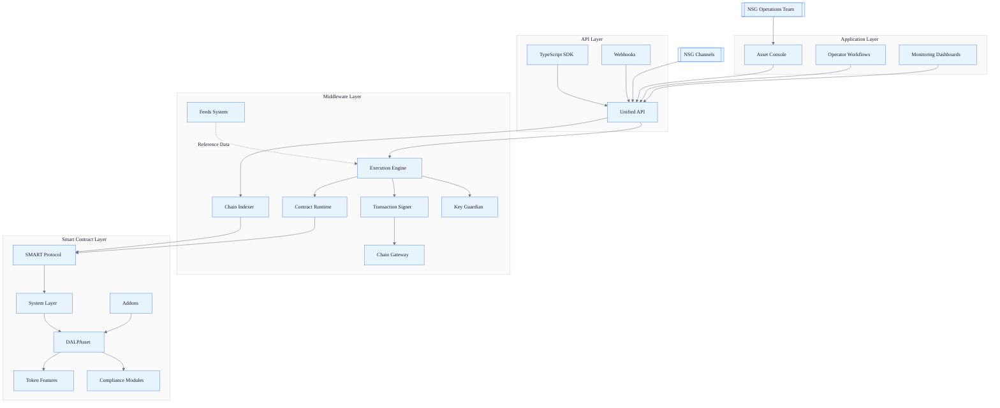
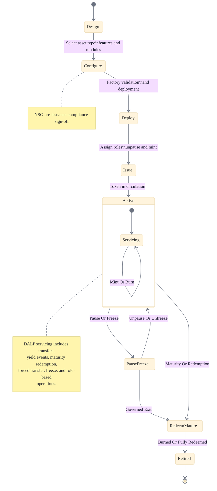
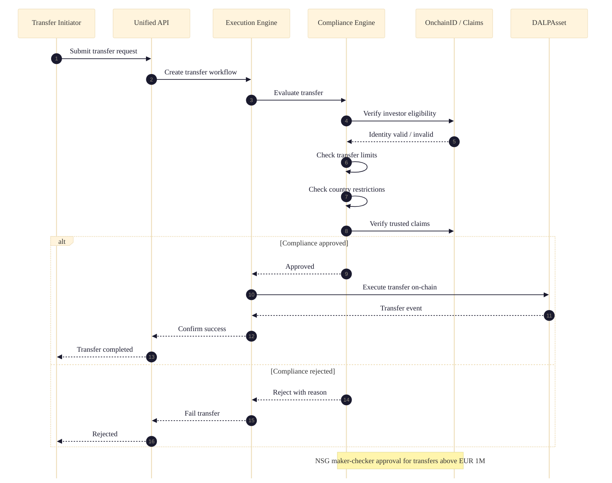
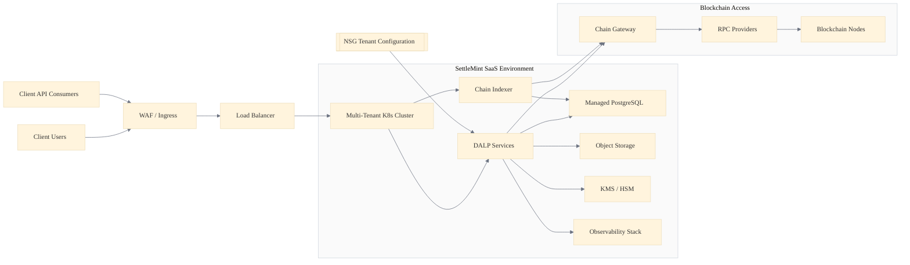
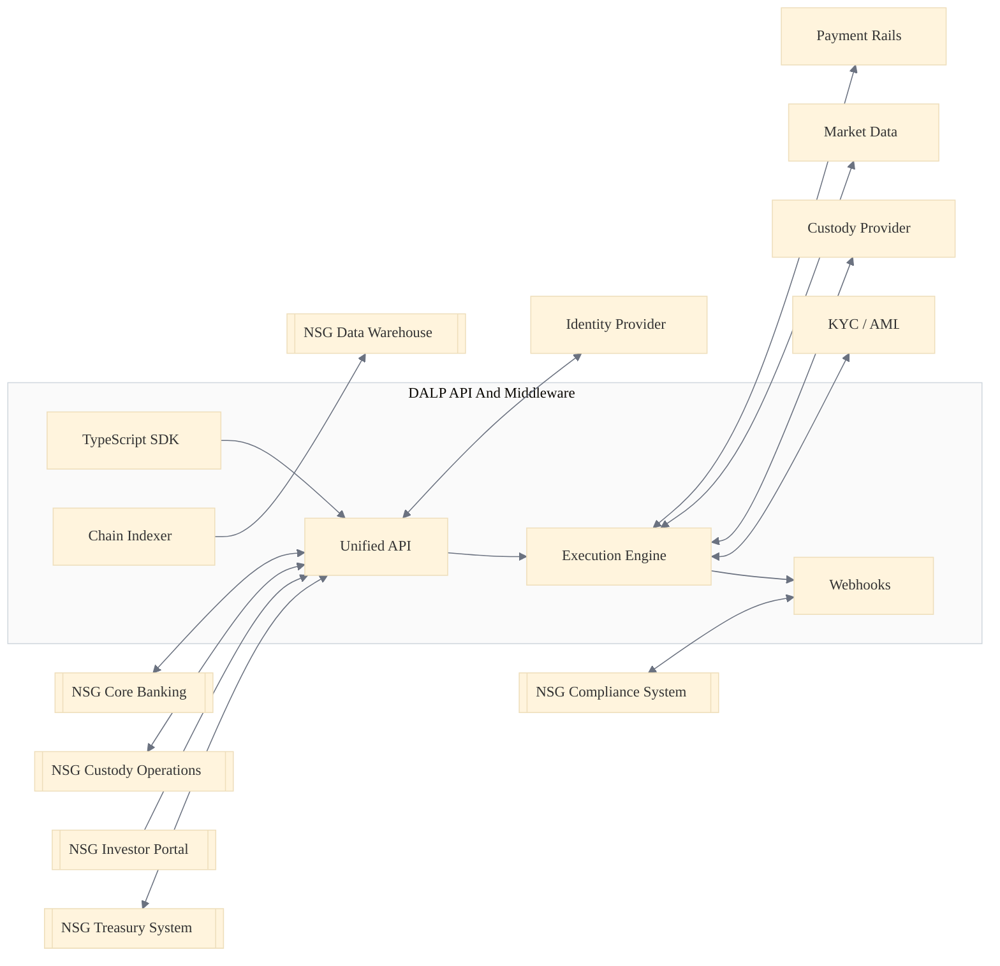
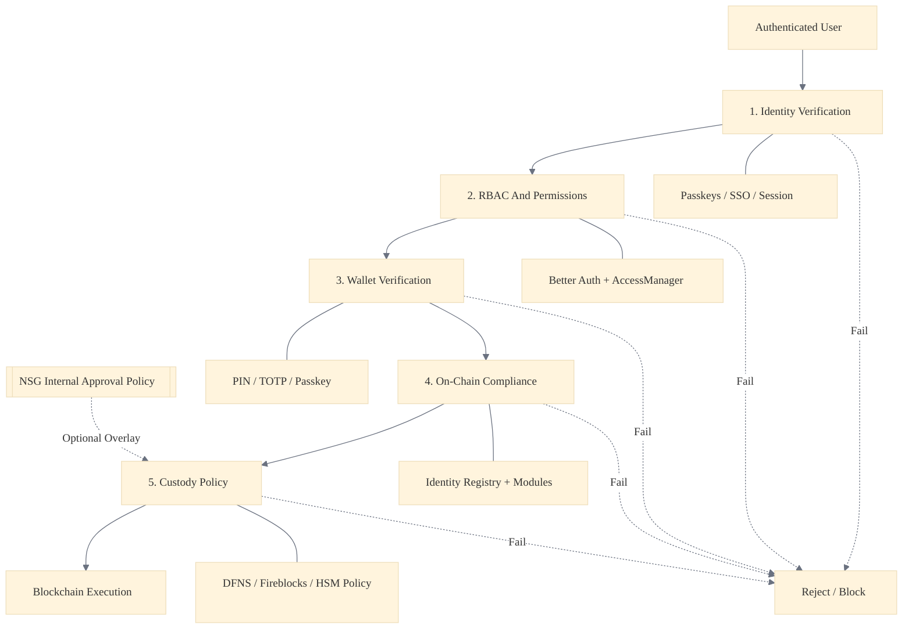
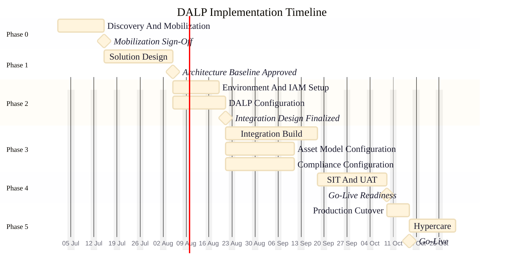

# Bond Tokenization Platform for Nordic Securities Group

# Technical and Commercial Proposal

---

## 1. Executive Summary

Nordic Securities Group (NSG) is seeking a digital asset platform to tokenize EUR-denominated corporate and government bonds. This proposal presents SettleMint's Digital Asset Lifecycle Platform (DALP) as the solution: a complete, governed platform for issuance, lifecycle management, compliance, custody integration, and settlement of tokenized bonds.

DALP is not a framework or a toolkit. It is a deployed, operating platform used by regulated financial institutions to design, launch, and service digital assets. For NSG, this means moving from concept to a live bond tokenization programme in weeks, not months, using configuration rather than custom development.

The platform delivers seven out-of-the-box asset templates including bonds, deposits, stablecoins, equity, funds, real estate, and precious metals. For NSG's bond-focused requirements, DALP provides a purpose-built bond lifecycle engine with coupon scheduling, maturity management, redemption workflows, and investor servicing built in.

Key differentiators for NSG:

- Full bond lifecycle from issuance through maturity and redemption
- MiCA-aligned compliance framework with configurable policy templates
- Maker-checker governance and role-based access controls throughout
- Native custody integration via standard APIs
- Single-tenant, cloud-hosted deployment on Azure
- Operational within 12 weeks for the initial bond programme

This proposal covers the technical architecture, implementation approach, compliance framework, support model, and commercial terms for a three-year engagement.

## 2. Company Overview

### 2.1 About SettleMint

SettleMint is a European technology company headquartered in Belgium, focused exclusively on digital asset infrastructure for regulated financial institutions. The company was founded in 2016 and has spent the intervening years building and refining what is now DALP.

SettleMint does not offer consulting or custom development. The company sells a platform. That platform is DALP, and it is the only product. This focus means every engineering resource, every product decision, and every client engagement feeds back into making the platform better for institutional use.

### 2.2 Platform Maturity

DALP is in production at multiple financial institutions across Europe, the Middle East, and Asia-Pacific. The platform handles issuance, lifecycle management, compliance, and settlement for a range of asset classes. Current assets under management on the platform exceed EUR 13 billion.

### 2.3 Regulatory Alignment

SettleMint operates under European regulatory standards and has built DALP with MiCA, MiFID II, and CSDR requirements as first-class concerns. The compliance engine is not an add-on; it is woven into every transaction, every transfer, and every lifecycle event.

## 3. Understanding of Requirements

NSG's requirements fall into six interconnected areas that DALP addresses as a unified platform rather than as separate modules:

| Requirement Area | NSG Need | DALP Capability |
|---|---|---|
| Issuance | Design and launch EUR bonds with configurable terms | Asset Designer with bond-specific templates |
| Lifecycle Management | Coupon payments, maturity, early redemption | Automated lifecycle engine with scheduling |
| Compliance | MiCA alignment, investor eligibility, transfer controls | Policy-driven compliance with 15+ regulatory templates |
| Custody Integration | Connect to existing custodian infrastructure | Standard API integration layer |
| Investor Portal | Self-service access for bondholders | White-labeled investor interface |
| Settlement | DVP and atomic settlement for secondary trading | XVP settlement engine |

The critical insight: these six areas cannot function in isolation. A bond issuance that does not carry its compliance rules forward into transfers is incomplete. A lifecycle engine that cannot trigger settlement actions creates manual workarounds. DALP connects these areas natively.

## 4. Proposed Solution

### 4.1 Platform Overview

DALP provides end-to-end digital asset lifecycle management through five integrated modules:

1. **Asset Designer**: Configure bond parameters, compliance rules, and permissions in a guided workflow
2. **Lifecycle Engine**: Automate coupon distributions, maturity events, and redemption processing
3. **Compliance Gateway**: Enforce investor eligibility, transfer restrictions, and regulatory reporting
4. **Operations Console**: Monitor, audit, and manage all platform activity
5. **Integration Layer**: Connect to custody, core banking, and payment systems via REST APIs

### 4.2 Bond Issuance with the Asset Designer

The Asset Designer is where bond programmes begin. NSG's issuance team configures every aspect of a new bond in a step-by-step workflow: instrument details, pricing, compliance modules, and permissions.

The designer enforces completeness: a bond cannot be issued until all required fields are populated, compliance policies are attached, and maker-checker approval is obtained. This eliminates the risk of launching an incomplete or non-compliant instrument.

For NSG's EUR corporate bonds, the configuration includes:

- ISIN and instrument metadata
- Nominal value, coupon rate, and payment frequency
- Maturity date and early redemption terms
- Investor eligibility criteria per MiCA requirements
- Transfer restriction rules by jurisdiction
- Custody linkage parameters

### 4.3 Bond Lifecycle Management

Once issued, bonds enter DALP's lifecycle engine. This is where the platform's depth becomes apparent: every scheduled event, every holder action, and every operational exception is handled within the same governed environment.

Key lifecycle capabilities for NSG's bond programme:

- **Coupon scheduling**: Automatic calculation and distribution of coupon payments based on configured frequency (annual, semi-annual, quarterly)
- **Maturity processing**: Automated redemption at maturity with holder notification and settlement triggering
- **Early redemption**: Configurable call/put provisions with approval workflows
- **Corporate actions**: Support for amendments, consent solicitation, and holder communication
- **Event audit trail**: Every lifecycle event is recorded with full provenance

### 4.4 Compliance and Regulatory Framework

#### 4.4.1 MiCA Alignment

DALP's compliance engine includes pre-built policy templates aligned with MiCA requirements. For NSG, this means the platform already understands the regulatory framework rather than requiring custom compliance logic.

The compliance framework operates at three levels:

- **Instrument level**: Policies attached during issuance govern the bond throughout its lifecycle
- **Transaction level**: Every transfer is evaluated against active policies before execution
- **Holder level**: Investor eligibility is verified continuously, not just at onboarding

#### 4.4.2 Identity and Verification

DALP integrates identity verification into the operational workflow. Investor onboarding, KYC/KYB checks, and ongoing eligibility monitoring are handled within the platform rather than as external processes.

For NSG's bond programme, this translates to:

- Automated investor eligibility checks against MiCA criteria
- Jurisdiction-based transfer controls (EU/EEA vs. third-country investors)
- Ongoing monitoring of holder status changes
- Audit-ready verification records attached to each investor profile

## 5. Technical Architecture

### 5.1 Deployment Model

DALP will be deployed for NSG as a single-tenant instance on Microsoft Azure, hosted in the EU-North (Sweden) region to comply with Nordic data residency preferences.

The deployment architecture includes:

- **Application tier**: DALP platform services running on Azure Kubernetes Service (AKS)
- **Blockchain tier**: Hyperledger Besu nodes for the permissioned EVM network
- **Database tier**: PostgreSQL for off-chain data with Azure-managed encryption at rest
- **Integration tier**: API gateway for custody, core banking, and payment rail connections
- **Monitoring tier**: Full-stack observability with metrics (VictoriaMetrics), logs (Loki), traces (Tempo), and pre-built Grafana dashboards

### 5.2 Integration Architecture

NSG's existing infrastructure connects to DALP through the platform's REST API layer. The integration model is designed for institutional environments where changes to core systems require careful governance.

| Integration Point | Protocol | Direction | Purpose |
|---|---|---|---|
| Custodian | REST API | Bidirectional | Asset safekeeping, balance reconciliation |
| Core Banking | REST API / SFTP | Outbound | Transaction reporting, position updates |
| Payment Rails | ISO 20022 / API | Outbound | Coupon payments, redemption settlements |
| KYC/AML Provider | REST API | Inbound | Investor verification, ongoing monitoring |
| Market Data | REST API | Inbound | Pricing feeds, reference data |
| Regulatory Reporting | SFTP / API | Outbound | MiCA reporting, transaction registers |

### 5.3 Security Architecture

Security is built into every layer of the DALP deployment:

- **Network**: Private VNet with NSG-controlled access, no public endpoints
- **Identity**: Azure AD integration for SSO, MFA enforcement
- **Encryption**: TLS 1.3 in transit, AES-256 at rest, HSM-compatible key management
- **Access control**: RBAC and ABAC with maker-checker for all sensitive operations
- **Audit**: Immutable audit logs for every platform action

## 6. Implementation Approach

### 6.1 Implementation Phases

The implementation follows a phased approach designed to deliver a working bond programme within 12 weeks, with subsequent phases adding capability depth.

| Phase | Timeline | Deliverables |
|---|---|---|
| Phase 1: Foundation | Weeks 1-4 | Azure infrastructure, DALP deployment, SSO integration, basic bond template |
| Phase 2: Bond Programme | Weeks 5-8 | Full bond lifecycle configuration, compliance policies, custody API integration |
| Phase 3: Go-Live Readiness | Weeks 9-12 | UAT, performance testing, operational runbooks, training, pilot bond issuance |
| Phase 4: Enhancement | Weeks 13-20 | Secondary trading support, additional asset classes, advanced analytics |

### 6.2 NSG Team Requirements

The implementation requires a small, focused team from NSG:

- **Project sponsor**: Senior stakeholder for decisions and approvals
- **Business lead**: Bond programme subject matter expert
- **IT lead**: Infrastructure and integration point of contact
- **Compliance lead**: Regulatory requirements and policy validation
- **2-3 UAT testers**: For user acceptance testing in Phase 3

SettleMint provides a dedicated implementation team including a project manager, solution architect, and integration engineer for the duration of the engagement.

## 7. Operations and Support

### 7.1 Support Model

SettleMint provides tiered support aligned with NSG's operational requirements:

| Tier | Coverage | Response Time | Resolution Target | Channel |
|---|---|---|---|---|
| P1: Critical | 24/7 | 30 minutes | 4 hours | Phone + Portal |
| P2: High | Business hours + on-call | 2 hours | 8 hours | Portal + Email |
| P3: Medium | Business hours | 4 hours | 2 business days | Portal |
| P4: Low | Business hours | 1 business day | 5 business days | Portal |

### 7.2 Operational Monitoring

DALP includes a comprehensive monitoring stack that provides real-time visibility into platform health, transaction throughput, and blockchain network status.

The monitoring capabilities include:

- Real-time dashboards for transaction volumes, API latency, and error rates
- Blockchain node health monitoring with automated alerting
- Capacity planning metrics and trend analysis
- Incident management integration via webhook notifications

### 7.3 Platform Updates

DALP follows a continuous delivery model with monthly feature releases and weekly security patches. Updates are applied to NSG's tenant during agreed maintenance windows with zero-downtime deployment for most changes.

## 8. Settlement and Secondary Trading

### 8.1 XVP Settlement Engine

For secondary trading of NSG's tokenized bonds, DALP includes the XVP (Exchange versus Payment) settlement engine. XVP enables atomic delivery-versus-payment settlement, eliminating counterparty risk and settlement delays.

Key settlement capabilities:

- Atomic DVP: bond delivery and payment occur simultaneously or not at all
- Multi-party settlement: support for broker-dealer intermediated trades
- Settlement finality: on-chain confirmation within seconds
- Reconciliation: automated matching between on-chain and off-chain records

## 9. Commercial Terms

### 9.1 Pricing Structure

| Component | Year 1 | Year 2 | Year 3 |
|---|---|---|---|
| Platform License | EUR 180,000 | EUR 180,000 | EUR 180,000 |
| Implementation Services | EUR 120,000 | - |, |
| Azure Infrastructure (estimated) | EUR 48,000 | EUR 48,000 | EUR 48,000 |
| Support (included in license) | Included | Included | Included |
| **Annual Total** | **EUR 348,000** | **EUR 228,000** | **EUR 228,000** |

Three-year total cost of ownership: EUR 804,000.

### 9.2 Commercial Terms

- Contract term: 3 years with annual renewal thereafter
- Payment terms: Quarterly in advance
- Implementation services: Fixed price, milestone-based
- Infrastructure costs: Pass-through at cost, adjusted annually
- Price indexation: Belgian CPI adjustment applied annually from Year 2

## 10. Why SettleMint

NSG should choose SettleMint for three reasons:

1. **DALP is a platform, not a project.** NSG gets a product with continuous investment, not a bespoke build that requires NSG to fund its own maintenance. Every improvement SettleMint makes benefits every client.

2. **Bonds are a first-class asset type.** DALP's bond lifecycle engine is not a generic token wrapper with bond metadata bolted on. Coupon scheduling, maturity processing, and redemption workflows are native capabilities, tested in production.

3. **MiCA readiness is built in.** The compliance framework includes pre-built MiCA policy templates. NSG does not need to translate regulatory requirements into technical specifications; the platform already speaks that language.

The path forward is straightforward: a 12-week implementation to a pilot bond issuance, followed by progressive expansion into additional asset classes and trading capabilities. DALP provides the governed foundation; NSG provides the market expertise and client relationships.

## 11. Appendices

### 11.1 Glossary

| Term | Definition |
|---|---|
| DALP | Digital Asset Lifecycle Platform |
| DVP | Delivery versus Payment |
| XVP | Exchange versus Payment |
| MiCA | Markets in Crypto-Assets Regulation |
| RBAC | Role-Based Access Control |
| ABAC | Attribute-Based Access Control |
| HSM | Hardware Security Module |
| AKS | Azure Kubernetes Service |
| SSO | Single Sign-On |
| MFA | Multi-Factor Authentication |

### 11.2 DALP Asset Class Coverage

DALP supports seven asset classes out of the box. While this proposal focuses on bonds, NSG can expand to additional asset classes using the same platform instance:

- **Bonds**: Corporate bonds, government bonds, green bonds
- **Deposits**: Tokenized time deposits, certificates of deposit
- **Stablecoins**: Fiat-backed, asset-backed
- **Equity**: Tokenized shares, preference shares
- **Funds**: Fund units, ETF tokens
- **Real Estate**: Property tokens, REIT units
- **Precious Metals**: Gold, silver, platinum tokens

### 11.3 References

SettleMint can provide references from existing institutional clients upon request, subject to NDA. Current deployments span banking, asset management, and market infrastructure across Europe, the Middle East, and Asia-Pacific.
