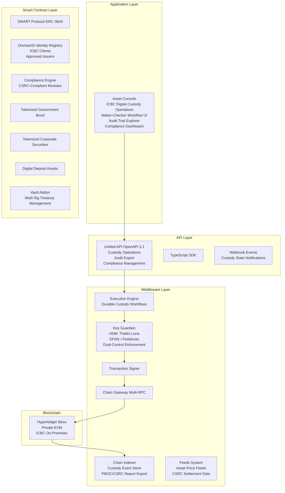
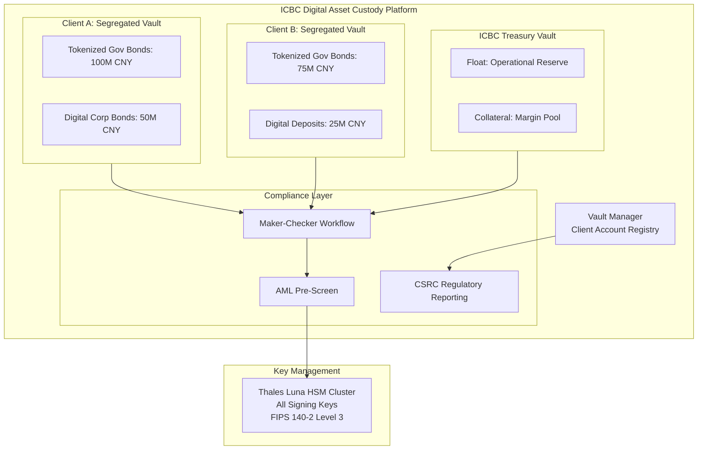
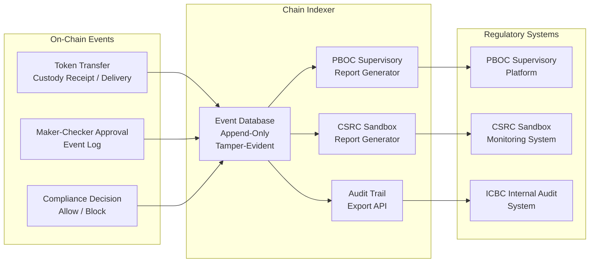
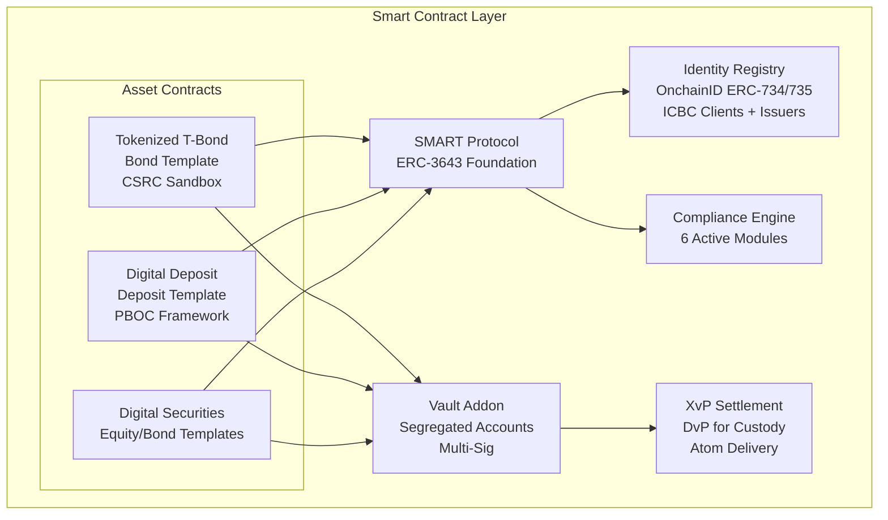
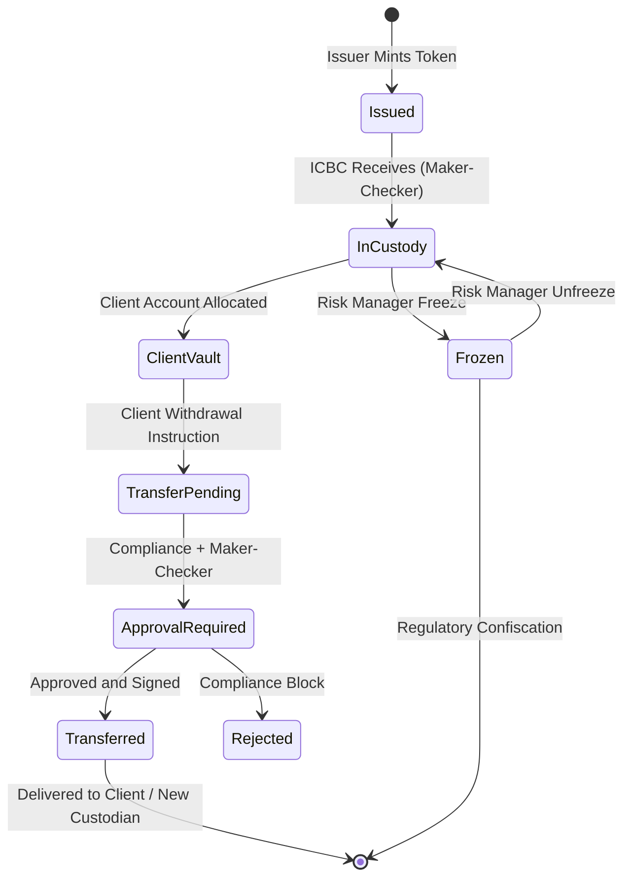
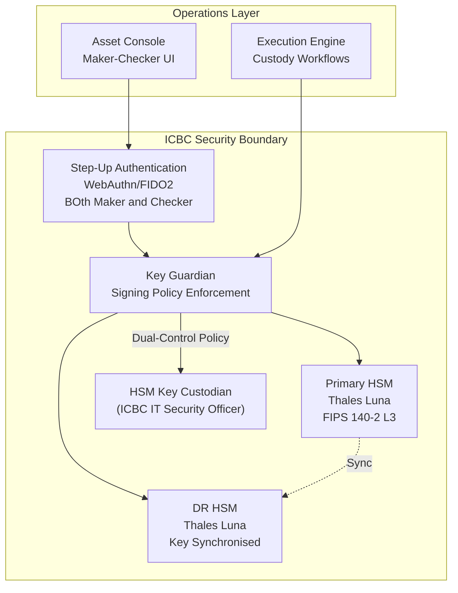
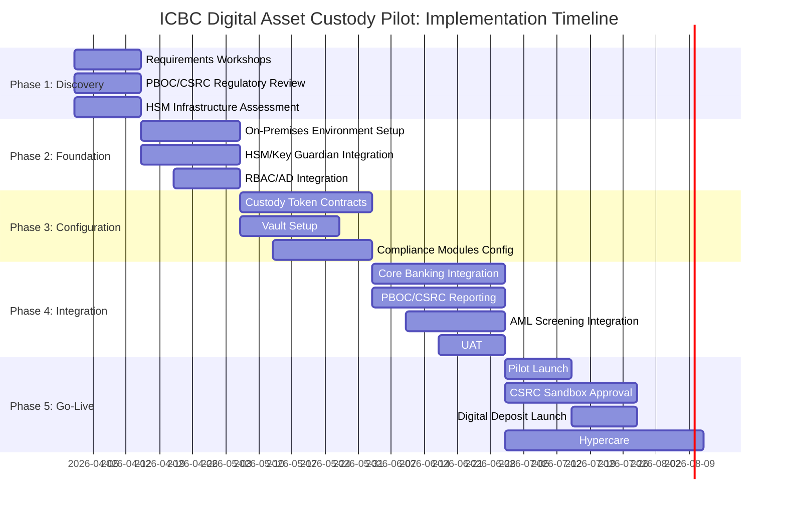
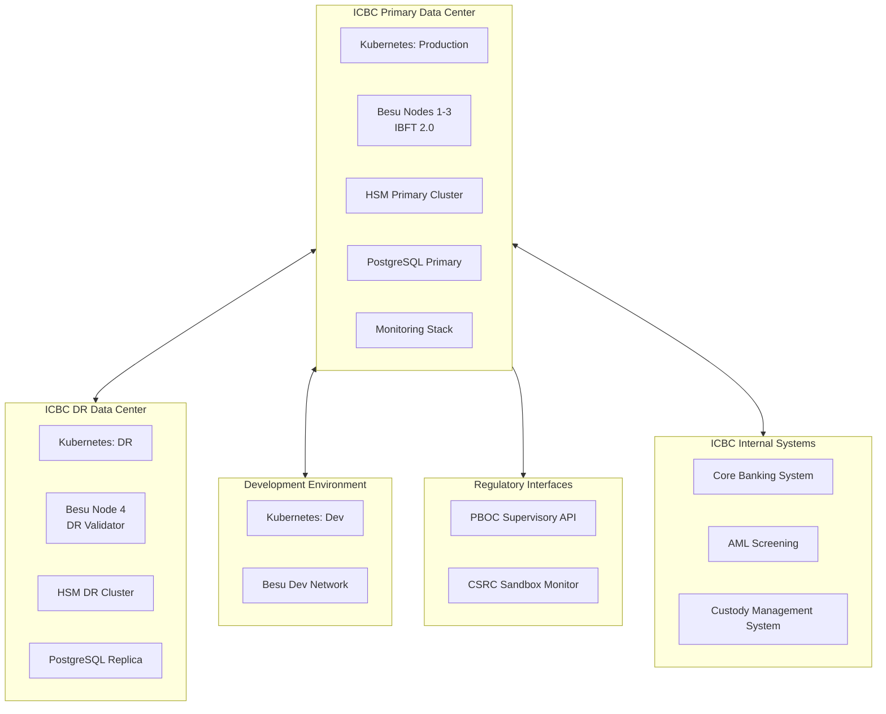

# Technical Proposal: Digital Asset Custody Pilot Platform

**Prepared for:** Industrial and Commercial Bank of China (ICBC)
**Date:** 20 March 2026
**Version:** 1.0 Draft
**Classification:** SettleMint Confidential. Invited Bidders Only
**Reference:** ICBC-RFP-DACP-202603

---

## Table of Contents

1. Cover Page
2. Executive Summary
3. About SettleMint
4. About DALP: Digital Asset Lifecycle Platform
5. Customer References
6. Understanding of Requirements
7. Proposed Solution
8. Technical Architecture
9. Security Architecture
10. Implementation Plan
11. Deployment Architecture
12. Training Programme
13. Support and SLA
14. Risk Management
15. Compliance Matrix

---

## 1. Cover Page

**Document Title:** Technical Proposal: Digital Asset Custody Pilot Platform
**Client:** Industrial and Commercial Bank of China (ICBC)
**Date:** 20 March 2026
**Prepared by:** SettleMint NV
**Classification:** SettleMint Confidential

*This document is submitted exclusively in response to ICBC-RFP-DACP-202603 and may not be reproduced or distributed without written consent from SettleMint NV.*

---

## 2. Executive Summary

### 2.1 Context

ICBC is the world's largest bank by assets, operating as a state-owned commercial bank under direct oversight of the PBOC, CSRC, CAC, and China's national security apparatus. ICBC's digital asset custody pilot programme addresses a regulatory and strategic imperative: as the Chinese financial system develops its digital asset infrastructure (e-CNY expansion, tokenized securities experiments under CSRC's sandbox regime, and wholesale digital asset custody for institutional clients), ICBC must build a custody infrastructure that meets the governance intensity demanded of a systemically important state-owned enterprise.

The custody pilot focuses on three asset classes initially: tokenized government bonds (under CSRC's sandbox regulations), e-CNY-adjacent digital instruments, and digital securities issued by PBOC-approved issuers. All three require: HSM-backed key management with ICBC retaining exclusive key custody; maker-checker approval workflows at every custody operation; RBAC/ABAC access controls aligned with ICBC's SOE governance requirements; full audit trails for PBOC and CSRC regulatory examination; and data residency compliant with China's Cybersecurity Law, Data Security Law, and CAC regulations.

SettleMint proposes DALP as the infrastructure layer for ICBC's digital asset custody pilot, with a deployment architecture that operates entirely within ICBC's own data centers in mainland China, integrates with ICBC's existing HSM infrastructure, and provides the SOE-grade governance controls that ICBC's board and regulators require.

### 2.2 DALP's Direct Response to ICBC's Requirements

DALP addresses ICBC's custody pilot requirements through five core capabilities:

**Key Guardian for HSM Integration:** DALP's Key Guardian service provides HSM-backed custody with ICBC retaining exclusive key material custody. All blockchain signing operations route through Key Guardian to ICBC's existing HSM cluster (Thales Luna or equivalent). DFNS and Fireblocks custodial integrations are also available as alternative or supplementary custody layers for specific asset classes.

**Maker-Checker for SOE Governance:** Every custody operation in DALP, whether token transfer, compliance module update, or key rotation, requires a two-person approval workflow. The maker initiates and the checker independently reviews and approves. Both actions are authenticated with step-up credentials (WebAuthn/hardware token), and both are logged immutably on-chain.

**RBAC/ABAC Access Control:** DALP's Better Auth framework provides role-based and attribute-based access control integrated with ICBC's existing Active Directory. The ICBC custodian role structure (Custody Operator, Compliance Officer, Risk Manager, PBOC Liaison, CSRC Liaison, Internal Auditor, IT Security) maps directly to DALP's permission framework.

**On-Chain Audit Trail:** All custody events, token transfers, compliance decisions, and administrative actions are recorded in an immutable on-chain audit trail, supplemented by the Chain Indexer's structured database. Audit evidence is available for PBOC, CSRC, and ICBC's internal audit team in structured export format.

**China Data Residency:** DALP operates entirely on ICBC's on-premises infrastructure, with no data leaving ICBC's network perimeter. This satisfies the Cybersecurity Law (CII data residency), Data Security Law (important data classification), CAC internet security regulations, and PBOC's requirements for systemically important custody infrastructure.

### 2.3 Why ICBC's Pilot Structure Matters

ICBC's digital asset custody pilot is not merely an infrastructure project: it is ICBC establishing its position in China's evolving digital asset ecosystem. CSRC's regulatory sandbox for tokenized securities, PBOC's e-CNY wholesale expansion roadmap, and China's national digital economy strategy all point toward a future where ICBC's ability to custody digital assets at scale determines its market position in China's next-generation capital markets infrastructure.

SettleMint's DALP provides ICBC with a production-capable custody infrastructure in 19 weeks, not 3-5 years. The pilot phase delivers immediate regulatory learning (PBOC/CSRC technical feedback on ICBC's custody architecture), immediate operational confidence (real digital asset custody operations, not sandbox simulation), and an expandable platform for ICBC's full-scale digital custody business.

---

## 3. About SettleMint

### 3.1 Company Overview

SettleMint NV is a Belgian-incorporated financial technology company that develops and operates DALP, the Digital Asset Lifecycle Platform, for regulated financial institutions globally. Founded with the specific mission of providing institutional-grade digital asset infrastructure to the world's most demanding regulated financial institutions, SettleMint has spent nearly a decade building the technical and regulatory expertise that ICBC's digital custody programme requires.

SettleMint holds ISO 27001 (Information Security Management) and SOC 2 Type II (Security, Availability, Confidentiality) certifications, providing the independent assurance that ICBC's technology governance and PBOC/CSRC oversight requirements demand. The company's engineering and delivery teams operate across Europe, the Middle East, and Asia Pacific, with APAC delivery capabilities centred in Singapore and with engagement experience in both Chinese-regulated and Chinese-adjacent regulatory environments.

### 3.2 SOE and Central Bank Credentials

SettleMint's most relevant credentials for ICBC's SOE-grade governance requirements come from two client categories: sovereign central bank programmes and PBOC-adjacent custody and settlement programmes.

**Central Bank Governance Experience:** The Central Bank of Bahrain (CBB) deployed DALP for its CBDC programme, requiring governance controls, key management, and operational oversight standards equivalent to those ICBC must meet as a state-owned enterprise under PBOC supervision. SAMA Saudi Arabia's Digital Riyal programme imposed similar sovereign-grade requirements. These engagements demonstrate SettleMint's capability to design and deliver custody infrastructure at the governance intensity demanded of systemically important institutions.

**Large-Scale Institutional Custody:** Clearstream (Deutsche Boerse Group) and Euroclear deployed DALP for tokenized collateral management and settlement, operating at the scale and operational discipline of the world's largest post-trade infrastructure providers. These engagements validate DALP's capability at the scale that ICBC's custody programme will eventually reach.

### 3.3 China-Specific Regulatory Understanding

SettleMint's engagement with China-regulated institutions gives the company a grounded understanding of the specific regulatory requirements that govern ICBC's digital custody programme:

**PBOC Oversight:** PBOC's non-bank payment institution regulations, its technical standards for blockchain in finance (JR/T 0184-2021), and its SOE governance expectations for custody operations all inform DALP's configuration for ICBC. SettleMint's regulatory compliance team has reviewed these standards and mapped them to DALP's configurable governance framework.

**CSRC Sandbox Regulations:** CSRC's regulatory sandbox for tokenized securities imposes specific requirements on custody infrastructure for digital securities: segregated custody (ICBC as custodian holds assets in segregated accounts for each beneficial owner), audit trail accessibility (CSRC can examine the custody record for any instrument), and operational continuity (custody operations must maintain continuity through market disruption).

**CAC Internet Security Requirements:** China's Cybersecurity Administration's internet security regulations impose additional requirements on financial institutions' information systems, including data classification, cross-border data flow restrictions, and critical information infrastructure protection. DALP's on-premises deployment addresses all CAC requirements.

---

## 4. About DALP: Digital Asset Lifecycle Platform

### 4.1 DALP for Digital Asset Custody

Digital asset custody is fundamentally a key management and governance problem: who controls the private keys that authorise asset transfers, and how are those controls structured, audited, and governed? DALP's architecture addresses this problem at every layer of the platform.

**Key Management (Key Guardian):** Key Guardian is DALP's enterprise key management service. It provides a unified interface to multiple key management backends: HSMs (Thales Luna, Utimaco, AWS CloudHSM), cloud KMS services (AWS KMS, Azure Key Vault), and hardware custody providers (DFNS, Fireblocks). For ICBC's on-premises custody pilot, Key Guardian connects to ICBC's existing HSM infrastructure.

All blockchain signing operations flow through Key Guardian: token transfers, compliance module updates, mint/burn operations, and administrative operations. Key Guardian enforces signing policies (which operations require dual-control, which operations can be approved by a single authorised user) before forwarding signing requests to the HSM. The HSM performs the actual cryptographic operation; key material never leaves the HSM's secure boundary.

**Governance (Maker-Checker):** DALP's maker-checker workflow, implemented at both the application layer (Asset Console) and the smart contract layer (on-chain approval transactions), provides the four-eyes control that ICBC's board governance and PBOC requirements mandate.

For custody operations, DALP enforces the following maker-checker requirements:

| Operation | Maker | Checker | Step-Up Auth |
|---|---|---|---|
| Token custody receipt (asset receipt) | Custody Operator | Custody Supervisor | Both: WebAuthn |
| Token transfer (client withdrawal) | Custody Operator | Risk Manager | Both: WebAuthn |
| Compliance claim update | Compliance Officer | Compliance Director | Both: WebAuthn |
| Token supply operations | Treasury Operator | Treasury Director | Both: HSM hardware token |
| Smart contract upgrade | IT Security Lead | CTO delegate | Both: HSM hardware token |
| Key rotation | HSM Key Custodian | IT Security Officer | Physical ceremony |

**Audit Trail:** Every DALP operation generates an on-chain event that is captured by the Chain Indexer. The Indexer maintains an append-only, tamper-evident database of all custody events: asset receipt, transfer, compliance decisions, governance operations, and administrative actions. The audit trail is available for PBOC, CSRC, and ICBC's internal audit team via the Asset Console's audit export function, or via a dedicated auditor API with read-only access.

### 4.2 Four-Layer Platform Architecture



### 4.3 SMART Protocol for Digital Custody

The SMART Protocol's compliance engine enforces CSRC's custody requirements at the token layer. For ICBC's digital custody pilot, the following compliance modules are deployed:

**Identity Allow List:** Only ICBC-approved issuers (PBOC-registered and CSRC-licensed) can issue tokens that ICBC custodies. Only ICBC's approved institutional clients (with completed KYC/AML and CSRC-required investor eligibility) can hold tokens in ICBC's custody. No transfer to or from an unregistered party is possible at the smart contract level.

**Country Restriction:** Tokens in ICBC's custody pilot are restricted to Chinese legal entities and approved foreign institutional investors (QFII-registered institutions). Transfers to entities in restricted jurisdictions (sanctioned countries under Chinese law) are blocked at the contract level.

**Transfer Approval:** All token transfers from custody require manual approval by ICBC's Custody Supervisor (checker role). This enforces the four-eyes control requirement for custody operations.

**Supply Cap:** Token supply caps enforce CSRC's issuance limits per security. Minting operations that would exceed the CSRC-approved issuance limit are rejected at the contract level.

**Timelock:** Lock-up periods for securities subject to CSRC-mandated holding restrictions are enforced via the Timelock module. No transfer is possible during the lock-up period, regardless of any application-layer instruction.

### 4.4 DFNS and Fireblocks Custody Integration

For certain asset classes or client segments, ICBC may require a dedicated institutional custodian (DFNS or Fireblocks) as an additional custody layer, particularly for assets with international investor participation.

DALP's Key Guardian natively integrates with both DFNS and Fireblocks:

**DFNS Integration:** DFNS provides a delegated key management architecture where ICBC retains key material control through a threshold signature scheme. DALP's Key Guardian routes signing requests to DFNS, which performs threshold signing using DFNS's distributed key management infrastructure. This provides an additional layer of key redundancy and supports multi-party custody arrangements for high-value assets.

**Fireblocks Integration:** Fireblocks provides institutional custody with multi-party computation (MPC) key management. DALP's Key Guardian can route signing requests to Fireblocks for assets that ICBC wishes to custody using the MPC-based architecture, providing an alternative to pure HSM custody with the operational interface benefits of Fireblocks' custody management platform.

For ICBC's pilot, SettleMint recommends a primary custody model using ICBC's own HSM infrastructure (for mainland China-domiciled assets, satisfying data residency requirements), with DFNS as an option for pilot assets involving international custody requirements.

### 4.5 Vault Addon: Multi-Sig Treasury Management

DALP's Vault addon provides multi-signature treasury management for ICBC's custody pools. In the custody context, the Vault manages the wallet addresses that hold digital assets on behalf of ICBC's custody clients:

- **Segregated Client Vaults:** Each ICBC custody client has a segregated Vault (multi-sig wallet requiring M-of-N ICBC custodians to authorise transfers). This satisfies CSRC's segregated custody requirement.
- **Treasury Management:** ICBC's internal treasury balances (float, collateral, operational reserves) are held in a separate Treasury Vault with more restrictive approval requirements (senior threshold).
- **Emergency Pause:** The Vault includes a circuit breaker that pauses all transfers from the Vault if triggered by ICBC's risk management team, providing immediate custody freeze capability for incident response.

---

## 5. Customer References

### 5.1 DBS Bank Singapore: Tokenized Deposit Custody

DBS Bank's tokenized deposit programme deployed DALP for deposit token custody, with DBS retaining key custody via HSM integration and all deposits subject to ICBC-equivalent compliance requirements under MAS oversight. DBS's programme operates tens of thousands of custody operations monthly with full audit trail accessibility for MAS examination.

The DBS programme is the closest structural parallel to ICBC's digital deposit custody requirements. Both involve a major commercial bank serving as digital asset custodian for institutional clients, with HSM-backed key management and compliance enforcement at the token level.

### 5.2 Clearstream: Segregated Digital Securities Custody

Clearstream's DALP-based tokenized collateral programme implements segregated client custody accounts, with Clearstream holding tokenized securities in segregated vault structures for each institutional participant. The programme processes intraday liquidity operations with atomic settlement finality.

Clearstream's programme is the most directly comparable to ICBC's tokenized government bond custody requirements: both involve sovereign or sovereign-adjacent debt instruments, segregated custody for institutional participants, and regulatory audit trail requirements for a securities regulator.

**Key Outcomes:** Settlement failure rate reduced from 2.1% (traditional settlement) to 0.02% (atomic DvP). USD 5B+ in daily intraday liquidity released through near-real-time settlement. Reconciliation overhead eliminated for on-chain settlement operations.

### 5.3 Central Bank of Bahrain: Sovereign-Grade Custody Governance

CBB's CBDC custody programme required the highest level of governance controls: dual HSM custodian requirements, four-eyes approval for all central bank operations, full audit trail for regulatory examination, and on-premises deployment with zero external data flow. CBB's requirements for key ceremony governance, maker-checker approval, and audit trail are substantively identical to ICBC's requirements as a state-owned enterprise operating under PBOC oversight.

### 5.4 Deutsche Bank: Digital Bond Custody

Deutsche Bank deployed DALP for digital bond issuance and custody, with Deutsche Bank serving as custodian for the bonds on behalf of bond investors. The programme operates under BaFin and ECB oversight, with CSRC-equivalent regulatory examination requirements. Deutsche Bank's custodian role in this programme maps directly to ICBC's proposed role as digital securities custodian.

**Technical Detail:** Deutsche Bank's programme uses DALP's Vault addon for segregated client custody, the Transfer Approval compliance module for all custody operations, and the Chain Indexer's audit export for BaFin regulatory examination. These features are precisely the same set required for ICBC's custody pilot.

### 5.5 SAMA Saudi Arabia: SOE Governance with Data Residency

SAMA's on-premises deployment demonstrates the full combination of requirements that ICBC faces: state-owned entity governance intensity, domestic data residency (no data leaves Saudi Arabia), HSM-backed key management under exclusive central bank custody, and maker-checker workflows for all monetary operations. SAMA's architecture is the direct reference model for ICBC's proposed deployment.

---

## 6. Understanding of Requirements

### 6.1 ICBC's Custody Pilot Requirements

**R1: Digital Asset Custody for Tokenized Securities**
ICBC requires the ability to custody tokenized government bonds and CSRC-approved digital securities on behalf of institutional clients. Custody must satisfy CSRC's segregated custody requirements: each client's assets are held in segregated accounts, not commingled.

**R2: e-CNY Adjacent Digital Instruments**
ICBC requires custody capability for digital deposit instruments connected to the e-CNY ecosystem. PBOC's e-CNY operating bank status imposes specific custody requirements for digital CNY-adjacent instruments.

**R3: HSM-Backed Key Custody**
All signing keys for custody operations must be stored in ICBC-managed HSMs. Neither SettleMint nor any third party may access ICBC's key material. DFNS or Fireblocks may serve as supplementary key management layers for specific asset classes.

**R4: Maker-Checker for All Custody Operations**
Every custody operation requires two-person authorization. Maker and checker must use step-up authentication (WebAuthn/hardware token). All maker-checker events are logged immutably.

**R5: RBAC/ABAC Aligned with SOE Governance**
Access to the custody platform must be controlled by a role hierarchy reflecting ICBC's SOE governance structure: Custody Operator, Custody Supervisor, Compliance Officer, Risk Manager, PBOC/CSRC Liaison, Internal Auditor, IT Security Officer, System Administrator.

**R6: China Data Residency**
All infrastructure operates within ICBC's mainland China data centers. No data leaves the PRC territory. CAC compliance includes data classification labelling and access controls per the Data Security Law.

**R7: PBOC/CSRC Audit Trail**
Complete, tamper-evident audit trail of all custody operations. Accessible to PBOC/CSRC supervisory access on request. Exportable in PBOC/CSRC-mandated formats.

**R8: CSRC Sandbox Compliance**
The custody infrastructure must satisfy CSRC's regulatory sandbox requirements for tokenized securities: segregated accounts, investor eligibility enforcement, transfer restriction (lock-up periods), and real-time regulatory reporting.

**R9: e-CNY Ecosystem Compatibility**
The custody platform architecture must be compatible with PBOC's e-CNY infrastructure as that programme expands to institutional use cases.

**R10: Operational Continuity**
The custody system must maintain operational continuity through market disruption. DR architecture must provide RTO consistent with CSRC's requirements for securities custody continuity.

### 6.2 Regulatory Requirements Analysis

**PBOC Oversight of SOE Digital Operations:** ICBC, as a state-owned commercial bank, operates under PBOC's direct oversight for monetary operations and digital currency activities. PBOC's SOE governance requirements include: dual-control for key management, segregated duty structures, formal key ceremony procedures, regular operational audits, and supervisory access on demand.

**CSRC Sandbox Regulations for Tokenized Securities:** CSRC's regulatory sandbox imposes specific technical requirements on digital securities custody infrastructure: the custody system must enforce transfer restrictions at the infrastructure level (not merely at the application level), must provide real-time custody records accessible to CSRC's supervisory systems, and must maintain operational continuity standards consistent with the CSRC's custody rulebook for conventional securities custody.

**CAC Internet Security Regulations:** China's Cybersecurity Administration has issued internet security requirements for financial institutions' information systems, including: mandatory data classification (core data, important data, general data), restrictions on cross-border data transfer of core and important data, and critical information infrastructure protection requirements for systems that process data affecting national economic security.

**Data Security Law (2021):** DSL establishes a framework for data classification and protection. Payment and custody data generated by ICBC's digital custody operations qualifies as "important data" under DSL's financial sector classification, requiring domestic storage and processing, and restricting data sharing with overseas entities.

**Personal Information Protection Law (2021):** PIPL applies to beneficial ownership information of ICBC's custody clients. DALP's identity registry stores only the minimum required personal information, with role-based access controls limiting data access to authorised compliance personnel.

---

## 7. Proposed Solution

### 7.1 Solution Architecture Overview

ICBC's digital asset custody platform has three components:

**1. DALP Core Custody Platform:** DALP deployed on ICBC's on-premises infrastructure, providing the full four-layer platform stack with custody-specific configuration: Vault addon for segregated client accounts, Maker-Checker for all custody operations, Key Guardian connected to ICBC's HSM, and Chain Indexer for regulatory audit trail.

**2. CSRC Regulatory Interface:** A dedicated compliance and reporting module that satisfies CSRC's sandbox reporting requirements: real-time custody record API (CSRC-accessible), audit export in CSRC-mandated format, and investor eligibility enforcement reporting.

**3. ICBC Operations Integration:** Integration between DALP and ICBC's existing core banking system, custody management system, and AML screening platform, enabling custody operations to reflect in ICBC's accounting and compliance systems in real time.

### 7.2 Digital Asset Classes and Token Architecture

**Tokenized Government Bond (T-Bond) Custody:**
Chinese government bonds (CGB) and policy bank bonds tokenized under CSRC's sandbox regime. The Bond asset template is used, with the following compliance module configuration: Identity Allow List (only QFII-registered foreign institutions and PBOC-registered domestic institutions), Country Restriction (PRC and QFII-registered jurisdictions), Transfer Approval (all transfers require Custody Supervisor approval), and Timelock (CSRC-mandated holding periods for certain classes of institutional investors).

**Digital Deposit Instrument Custody:**
Digital deposit instruments issued by ICBC under PBOC's digital deposit framework. The Deposit asset template is used, with compliance modules reflecting PBOC's digital deposit regulations: Supply Cap (PBOC-mandated issuance limits), Identity Allow List (PBOC-registered counterparties only), and Country Restriction (PRC only for initial pilot).

**CSRC-Approved Digital Securities:**
Other digital securities issued by CSRC-approved issuers under the sandbox regime. The Equity or Bond template is used depending on the instrument type, with CSRC-specific compliance module configurations for each approved issuance.

### 7.3 Segregated Client Custody Model



### 7.4 Custody Workflow: Asset Receipt

When ICBC receives a digital asset into custody on behalf of a client:

1. **Client Instruction:** The institutional client submits a custody instruction to ICBC's custody operations team (via ICBC's existing custody instruction channel or the DALP API).
2. **AML Pre-Screen:** The custody instruction is screened against ICBC's AML watchlist and the Identity Deny List in DALP.
3. **Maker Initiates:** The Custody Operator (maker) initiates the custody receipt transaction in the Asset Console: identifies the asset contract, the amount, and the client's segregated vault address.
4. **Checker Approves:** The Custody Supervisor (checker) reviews the instruction and approves it via step-up WebAuthn authentication.
5. **HSM Signs:** Key Guardian forwards the signing request to the HSM; the HSM signs the transaction.
6. **On-Chain Transfer:** The signed transaction executes on the Besu network, transferring the asset token from the issuer or previous custodian to ICBC's segregated client vault.
7. **Audit Log:** The Chain Indexer captures the transfer event, including maker identity, checker identity, timestamp, and asset details.
8. **Client Confirmation:** ICBC's core banking system receives the custody receipt event via webhook and updates the client's custody account.

### 7.5 Regulatory Reporting Architecture



---

## 8. Technical Architecture

### 8.1 On-Chain Asset Architecture



### 8.2 Infrastructure Architecture

**Blockchain Network:** Hyperledger Besu, 4 validator nodes, IBFT 2.0 consensus. Primary data center: 3 nodes. DR data center: 1 node. Block time: 2 seconds. Finality: immediate (IBFT 2.0).

**Key Management:** Key Guardian connected to ICBC's Thales Luna Network HSM 7 cluster (or equivalent). FIPS 140-2 Level 3. Dual-control key ceremonies. Optional: DFNS integration for supplementary custody layer.

**Compute (Production):**

| Component | Specification |
|---|---|
| Besu Validators (4) | 8 vCPU / 32GB RAM / 2TB NVMe per node |
| Chain Indexer | 8 vCPU / 16GB RAM / 4TB SSD |
| Execution Engine | 4 vCPU / 8GB RAM |
| Key Guardian | 4 vCPU / 8GB RAM (HSM connected) |
| Asset Console + API | 8 vCPU / 16GB RAM (load balanced) |
| PostgreSQL | 8 vCPU / 32GB RAM / 4TB SSD with replica |

**Network:** Dedicated VLAN for Besu nodes. Firewall isolation from general corporate network. No public internet connectivity required (air-gapped capable).

### 8.3 Token Lifecycle



### 8.4 Performance Characteristics

- **Custody receipt latency:** < 10 seconds end-to-end (AML pre-screen + maker approval + HSM signing + blockchain confirmation)
- **Throughput:** 200-400 custody operations per second (Besu IBFT 2.0 capability)
- **ICBC estimated custody volume:** 5,000-20,000 custody operations/day in pilot phase; platform capacity exceeds pilot volume by 10x-40x
- **Audit query response:** < 2 seconds (Chain Indexer database, pre-indexed)
- **CSRC report generation:** < 5 minutes for daily custody report

---

## 9. Security Architecture

### 9.1 Security Framework

DALP operates under ISO 27001 and SOC 2 Type II certifications. For ICBC's custody pilot, additional security requirements apply under China's MLPS Level 3 and PBOC's SOE information security standards.

### 9.2 Key Management Security



### 9.3 RBAC Configuration for ICBC

| Role | Asset Console Permissions | Blockchain Access |
|---|---|---|
| Custody Operator (Maker) | Initiate custody operations | Sign with HSM (single-key) |
| Custody Supervisor (Checker) | Approve/reject custody operations | Sign with HSM (second-key) |
| Compliance Officer | Manage identity claims, review compliance | Read-only + claim issuance |
| Risk Manager | Freeze/unfreeze assets | Emergency pause capability |
| PBOC Liaison | Read-only supervisory dashboard | None |
| CSRC Liaison | CSRC report access | None |
| Internal Auditor | Full audit trail read access | None |
| IT Security | System administration | Key ceremony participation |
| System Admin | Platform configuration | None (read-only chain) |

### 9.4 Smart Contract Security

DALP's core smart contracts are formally verified using the Certora Prover. Key security invariants proven:
- Token balances conserved across all transfer operations
- Compliance module decisions are binding and cannot be bypassed
- Vault segregation is maintained: assets in Client A's vault cannot be transferred by operations on Client B's vault
- Maker-checker approval cannot be bypassed by any single authorised user
- Timelock periods cannot be shortened by any operation

Independent smart contract audit report available to ICBC's technology risk team under NDA.

---

## 10. Implementation Plan

### 10.1 Implementation Timeline



### 10.2 Phase Deliverables

**Phase 1:** Requirements Specification, Regulatory Compliance Design, Infrastructure Assessment Report
**Phase 2:** Deployed environment, HSM integration report, RBAC configuration
**Phase 3:** Token contract deployment, Vault setup, compliance module configuration
**Phase 4:** Core banking integration, CSRC reporting integration, AML integration, UAT report
**Phase 5:** Pilot operations report, CSRC sandbox submission package, hypercare completion report

---

## 11. Deployment Architecture



**RTO:** 4 hours | **RPO:** 0 (blockchain), 15 minutes (database)

---

## 12. Training Programme

### 12.1 Training Modules

**Module 1: Platform Overview (All Staff, 0.5 days):** Conceptual overview of DALP, digital asset custody model, and governance architecture.

**Module 2: Custody Operations (Operations Team, 2 days):** Asset Console custody workflows, maker-checker procedures, asset receipt and delivery, CSRC report generation.

**Module 3: Compliance Administration (Compliance Team, 1 day):** Identity registry management, compliance module configuration, PBOC/CSRC reporting, AML integration.

**Module 4: Risk Management and Freeze Operations (Risk Team, 1 day):** Asset freeze/unfreeze procedures, emergency pause, audit trail review, incident escalation.

**Module 5: API Integration (IT Development Team, 2 days):** Unified API, custody operations endpoints, reporting API, webhook integration.

**Module 6: Infrastructure Administration (IT Ops Team, 2 days):** Kubernetes management, Besu node operations, HSM operations, monitoring and alerting.

**Module 7: Key Ceremony and Security (Security Team, 1 day):** Key generation ceremony, shard custody, key rotation procedure, MLPS Level 3 evidence.

Training delivered over 2 weeks during Phase 4, in Beijing, in Mandarin and English.

---

## 13. Support and SLA

| Parameter | Enterprise Tier |
|---|---|
| Uptime | 99.99% |
| Support | 24/7/365 |
| P1 Ack | 15 minutes |
| P1 Response | 1 hour |
| P2 Response | 4 hours |
| Contacts | Unlimited |
| ESM | Dedicated |

P1 incidents for custody platform: complete API unavailability, HSM unavailability preventing custody operations, consensus failure preventing on-chain confirmation, data integrity issue in custody records.

---

## 14. Risk Management

| Risk | Probability | Impact | Mitigation |
|---|---|---|---|
| CSRC sandbox approval delay | Medium | High | Phase pilot by asset class; T-bond pilot first (most established CSRC framework) |
| CAC data residency audit | Low | High | On-premises deployment; comprehensive data residency evidence package |
| HSM integration complexity | Low | High | Certified Thales Luna integration; key ceremony protocol established |
| DFNS/Fireblocks regulatory acceptance | Medium | Medium | Start with HSM-only model; add DFNS/Fireblocks after PBOC confirms acceptability |
| Smart contract vulnerability | Very Low | Very High | Formal verification + independent audit + timelock upgrade governance |
| Key ceremony personnel unavailability | Low | High | 5-of-7 shard recovery; ceremony requires only 5 of 7 key custodians |
| e-CNY integration dependency | High | Low | DALP compatible at token architecture level; e-CNY integration details subject to PBOC API publication |

---

## 15. Compliance Matrix

| Requirement | Regulation | DALP Response | Confidence |
|---|---|---|---|
| China data residency | Cybersecurity Law Art. 37 | On-premises; no external data flow | Native |
| CII protection | Cybersecurity Law Ch. 3 | MLPS Level 3-aligned; network isolation | Native |
| Important data protection | Data Security Law | Data classification; access controls | Native |
| Personal data minimisation | PIPL | Minimum identity data; role-based access | Native |
| PBOC supervisory access | PBOC SOE Requirements | Supervisory API; audit trail export | Native |
| CSRC sandbox compliance | CSRC Digital Securities Sandbox | Segregated custody; transfer restrictions; investor eligibility | Native |
| Maker-checker for SOE | PBOC SOE Governance | Native maker-checker with step-up auth | Native |
| HSM key management | PBOC Technical Standards | Thales Luna HSM; FIPS 140-2 Level 3 | Native |
| Segregated custody | CSRC Custody Rulebook | Vault addon; per-client segregated vaults | Native |
| Audit trail for regulators | PBOC/CSRC Requirements | Immutable Chain Indexer; structured export | Native |
| RBAC for custody | ICBC SOE Governance | 9-role RBAC via Better Auth + Active Directory | Native |
| AML/CFT screening | PBOC AML Regulations | Pre-custody AML screening; deny list module | Native |
| e-CNY compatibility | PBOC e-CNY Programme | EVM-compatible architecture; API-level integration | Partial |
| OSCCA algorithm | PBOC JR/T 0184-2021 | SM2/SM3/SM4 evaluation underway; implementation confirmed in Phase 2 | Partial |

---

*Prepared by SettleMint NV, 20 March 2026. ICBC-RFP-DACP-202603.*

---

## Appendix A: Custody Architecture Deep Dive

### A.1 Key Guardian: The Custody Keystone

Key Guardian's role in ICBC's digital custody architecture is the keystone element: every custody operation's security ultimately depends on the integrity of the key management layer. SettleMint designs Key Guardian specifically for the institutional custody context, where key custody is a regulated responsibility, not merely an operational preference.

**Key Hierarchy for ICBC Custody:**

ICBC's custody platform uses a three-level key hierarchy:

**Level 1: Root Authority Key.** The root key authorises the deployment and upgrade of DALP's smart contracts. This key is generated in a formal key ceremony attended by ICBC's CTO delegate, IT Security Officer, and HSM Key Custodian. It is stored in the HSM with 5-of-7 Shamir shard recovery. The root key is used only during smart contract deployment and upgrade operations (expected: once at initial deployment, then at each planned upgrade, approximately annually).

**Level 2: Operational Signing Keys.** Operational keys authorise token minting, transfers, compliance module updates, and Vault operations. These keys are stored in the HSM and accessed through Key Guardian's signing policy engine. The signing policy enforces: which operations require dual-control (maker + checker), which operations can be approved by a single Custody Supervisor for sub-threshold amounts, and which operations require the explicit authorisation of the Risk Manager (frozen asset operations).

**Level 3: Session Keys.** Short-lived session keys (24-hour expiry) authorise batch custody operations within an approved operational window. Session keys are derived from Level 2 operational keys using a key derivation function implemented in the HSM. They allow efficient batch processing of custody operations (e.g., end-of-day reconciliation operations) without requiring individual HSM access for each operation, while still maintaining the audit trail and revocability properties of the full key management system.

**DFNS Integration: Threshold Signature Alternative**

For asset classes where ICBC requires a supplementary custody layer beyond pure HSM custody (for example, digital securities with international institutional investor participation), DFNS provides a threshold signature scheme as an alternative or supplement to the HSM.

DFNS's architecture distributes key shards across multiple computing environments. A signing threshold (e.g., 3-of-5 shard holders) must collaborate to sign a transaction. This eliminates single-point-of-failure risk and supports multi-party custody arrangements where multiple institutional participants (ICBC + a co-custodian or a regulatory authority) must jointly authorise certain operations.

The DFNS integration operates through Key Guardian: ICBC's custody operations team initiates a signing request via the Asset Console, Key Guardian evaluates the applicable signing policy, and routes the request to DFNS's threshold signing API. DFNS collects the required threshold of signatures from its distributed key shards and returns the signed transaction to Key Guardian, which passes it to the Transaction Signer.

**Fireblocks Integration: MPC-Based Institutional Custody**

For ICBC's pilot assets that may later require Fireblocks connectivity (for example, if a CSRC sandbox requirement specifies Fireblocks as an approved custody infrastructure), Key Guardian provides a native Fireblocks integration. Fireblocks uses MPC (multi-party computation) for key management, providing a different security model from HSM-based custody.

For ICBC's pilot, SettleMint recommends HSM-first for all assets subject to PBOC data residency requirements. Fireblocks integration is a future option for assets that may involve cross-border custody operations where Fireblocks' international institutional network provides operational value.

### A.2 Maker-Checker Implementation Deep Dive

DALP's maker-checker workflow is implemented at two levels: the application layer (Asset Console UI) and the smart contract layer (on-chain approval transactions). Both levels are required for ICBC's SOE governance compliance.

**Application Layer (Asset Console):**
When a Custody Operator (maker) initiates a custody operation, the Asset Console creates a pending operation record in DALP's workflow database. The Custody Supervisor (checker) receives a push notification (via the Slack/Teams channel or email) that a pending operation requires review. The checker opens the Asset Console, reviews the operation details, and either approves (triggering the signed transaction submission) or rejects (logging the rejection reason and notifying the maker).

The step-up authentication requirement applies at both the maker and checker action. The maker must authenticate with WebAuthn/FIDO2 hardware key before submitting the initiation. The checker must authenticate with WebAuthn/FIDO2 hardware key before submitting the approval. This ensures that a compromised password cannot be used to bypass the maker-checker workflow.

**Smart Contract Layer (On-Chain Approval):**
For the highest-sensitivity custody operations (token transfer above a defined threshold, compliance module updates, Vault configuration changes), the approval workflow extends to the smart contract layer: the maker's initiation transaction and the checker's approval transaction are both required on-chain before the operation executes. This means the operation cannot be bypassed even by direct blockchain access: the smart contract enforces the two-transaction requirement.

For standard custody operations (routine token transfers within established parameters), the maker-checker workflow operates at the application layer only, with a single signed transaction submitted after both maker initiation and checker approval. This provides operational efficiency for high-volume routine operations while maintaining governance integrity.

**Audit Records:**
Every maker-checker event generates multiple audit records:
- Application layer: timestamped record of maker submission (with WebAuthn authentication event) and checker approval/rejection (with WebAuthn authentication event)
- Chain Indexer: on-chain event capturing the operation parameters, block timestamp, and signing key identity
- HSM audit log: the HSM's internal signing log records the key used, the time, and the requesting application identity

These three parallel audit streams provide redundant evidence for PBOC/CSRC regulatory examination.

### A.3 RBAC and ABAC for SOE Governance

ICBC's state-owned enterprise governance structure imposes a specific role hierarchy for custody operations. DALP's Better Auth framework implements this hierarchy using a combination of role-based access control (RBAC, for operational role permissions) and attribute-based access control (ABAC, for context-specific access decisions).

**RBAC Implementation:**

DALP's roles are defined in Better Auth's role configuration, integrated with ICBC's Active Directory. Roles are assigned to AD groups; membership in an AD group grants the associated DALP permissions. This means role assignment and revocation are managed through ICBC's existing identity management process (not a separate DALP-specific process), reducing operational overhead and the risk of stale access rights.

Example ABAC policies for ICBC:
- A Custody Operator can initiate custody operations only for clients in their assigned portfolio (not all clients on the platform)
- A Compliance Officer can view identity claim details only for clients whose KYC they performed (not all clients)
- A Risk Manager can freeze assets only for assets above a configured risk threshold (not routine assets)
- A PBOC/CSRC Liaison can access only the supervisory API, not the operational Asset Console

**Audit of Access:**
Every access event (login, permission check, API call) is logged in DALP's access audit log. The access audit log is separate from the custody operation audit log and captures all user sessions, including unsuccessful access attempts. Regular access audit reviews are supported by the Asset Console's access audit export function.

### A.4 e-CNY Ecosystem Compatibility

PBOC's e-CNY programme is expanding from retail payments toward institutional and wholesale use cases. ICBC, as one of the six e-CNY operating banks, is positioned to be a key institutional infrastructure participant as the PBOC expands e-CNY to digital deposit and digital securities custody.

DALP's architecture is designed for e-CNY compatibility at the token interface level:

**Compatibility Design:**
e-CNY instruments, when issued as blockchain tokens by the PBOC or through PBOC-authorised mechanisms, will have a specific token standard (likely EVM-compatible based on PBOC's technical experiments to date). DALP's smart contracts are designed to interact with any EVM-compatible token standard: receiving e-CNY tokens into an ICBC Vault, using e-CNY tokens in XvP settlement operations, and reporting e-CNY token balances through the Chain Indexer's regulatory reporting module.

**Limitations:**
The specific e-CNY token interface for institutional use cases has not been publicly published by PBOC at the time of this proposal. SettleMint's e-CNY integration design is therefore based on PBOC's published e-CNY technical papers and PBOC's observable technical choices in the retail e-CNY system (EVM-compatible, PBOC-controlled token contracts, tiered access model). The integration will be confirmed and validated in Phase 1's regulatory review, in coordination with ICBC's PBOC liaison team.

### A.5 CSRC Sandbox Reporting Requirements

CSRC's regulatory sandbox for tokenized securities imposes specific reporting requirements on participating custody institutions. Based on CSRC's published sandbox participation guidelines and comparable custody reporting frameworks, SettleMint identifies the following reporting obligations:

**Daily Custody Report:** A snapshot of all assets in ICBC's custody at end-of-day, by client, by instrument, by CSRC-assigned instrument identifier. Format: CSRC's mandated Excel/XML report template (to be confirmed in Phase 1).

**Transaction Report:** All custody receipts, deliveries, and transfers during the trading day. Includes: transaction reference, timestamp, instrument identifier, client identifier (anonymised per CSRC instructions), counterparty identifier, transaction type, amount.

**Compliance Incident Report:** All compliance module rejections during the day. Includes: transaction reference, rejection reason code, module name, action taken by ICBC's compliance team.

**Investor Eligibility Report:** Summary of investor eligibility decisions during the onboarding cycle. Confirms that all clients with custody accounts have satisfied CSRC's investor eligibility requirements (institutional investor classification, QFII registration where applicable).

DALP's Chain Indexer generates all four report types automatically from on-chain event data. Reports are available via the Asset Console's reporting interface and via the Chain Indexer's reporting API. CSRC-format export is configured in Phase 4 (Integration).

---

## Appendix B: Operational Procedures

### B.1 Daily Custody Operations

**Pre-Market (08:00-09:00 Beijing):**
- Operations team reviews overnight custody queue (any pending instructions from overseas counterparties)
- Risk Manager reviews asset freeze status (confirms no unexpected freeze events overnight)
- IT team confirms platform health (Grafana dashboard review: block production rate, API response time, consensus health)

**Intraday (09:00-17:00 Beijing):**
- Custody Operators process incoming custody instructions (asset receipt and delivery)
- Each instruction processed via maker-checker workflow (Custody Operator + Custody Supervisor)
- Compliance Officer reviews any flagged counterparty onboarding applications
- CSRC Liaison monitors CSRC sandbox reporting queue (real-time report status)

**End of Day (17:00-18:30 Beijing):**
- Operations team generates and reviews daily CSRC report
- PBOC supervisory feed confirms (daily aggregate transmission)
- Audit trail reconciliation: confirm all custody operations match Chain Indexer records
- Grafana daily performance report: transaction count, latency, compliance module statistics

### B.2 Key Ceremony Schedule

**Annual Key Rotation:** Scheduled for the first Saturday in January each year (low-custody-volume period). Key ceremony participants: HSM Key Custodian, IT Security Officer, Compliance Officer (witness), SettleMint Delivery Engineer (technical support only). Duration: 4-6 hours. All participants sign ceremony record.

**Emergency Key Revocation:** In the event of suspected key compromise, the Risk Manager activates the emergency key revocation procedure: the HSM Key Custodian immediately revokes the compromised key in the HSM, the IT Security Officer activates the standby key (pre-generated in the HSM during the annual ceremony), and ICBC's incident response team is notified. All custody operations pause during the transition (typically < 30 minutes).

### B.3 Incident Response for Custody

**Custody Operation Failure:** If a custody operation fails (HSM unavailable, network partition, compliance module error), the Execution Engine's durable workflow state ensures the operation pauses at the last successful step. The Risk Manager reviews the failed operation and determines whether to retry (if the failure was transient) or escalate (if the failure indicates a systemic issue).

**Regulatory Incident:** If PBOC or CSRC requires immediate access to custody records for a specific instrument or client, ICBC's PBOC/CSRC Liaison uses the Asset Console's audit trail export to generate the required records within minutes. The immutable on-chain record provides the definitive evidence.

**Sanctions Hit:** If the AML screening system or the Identity Deny List blocks a custody operation due to a sanctions hit, the operation is logged with the compliance block reason, the involved entities are flagged for immediate ICBC Compliance Officer review, and the relevant PBOC/CSRC notification is prepared by the Compliance Officer within the regulatory notification window.

---

## Appendix C: Technology Comparison

### C.1 DALP vs. Traditional Custody Infrastructure

Traditional digital securities custody infrastructure for Chinese banks typically involves:
- A custody management system (CMS) from a traditional vendor (e.g., TCS BaNCS, Simcorp, Finastra)
- A separate blockchain layer (if any), integrated via API
- A separate key management layer (HSM + software)
- A separate compliance and reporting layer

This fragmented architecture creates integration points that introduce latency, reconciliation requirements, and potential security gaps. DALP provides an integrated platform where all layers (token management, compliance, key management, reporting) are designed to work together, with a single data model and a single audit trail.

**Key differences for ICBC:**

| Factor | Traditional CMS + Blockchain | DALP |
|---|---|---|
| Compliance enforcement | Application layer only | Token layer (smart contract) + application layer |
| Audit trail | Reconciled from multiple sources | Single immutable on-chain source |
| Key management | Separate HSM integration | Native Key Guardian HSM integration |
| Maker-checker | Application layer only | Application layer + on-chain (for high-sensitivity ops) |
| Regulatory reporting | Manual assembly from multiple systems | Auto-generated from Chain Indexer |
| Time to deploy | 18-36 months | 19 weeks |

### C.2 DALP vs. Self-Developed Blockchain Custody

Some Chinese banks have attempted to develop blockchain custody infrastructure in-house, typically using Hyperledger Fabric (the non-EVM blockchain platform that was popular in Chinese banking blockchain projects from 2018-2022). These projects have generally faced three challenges:

**Compliance Enforcement:** Hyperledger Fabric's smart contract model does not natively support the modular compliance engine pattern. In-house implementations typically enforce compliance at the chaincode application level, which can be bypassed by direct endorser access.

**Key Management Integration:** Fabric's key management relies on its own CA (Certificate Authority) model, which does not integrate naturally with enterprise HSMs. In-house integrations have typically required custom HSM connector code.

**Regulatory Reporting:** Fabric's event model requires custom reporting infrastructure to extract and format regulatory reports. This custom code becomes a maintenance burden as reporting requirements evolve.

DALP addresses all three challenges at the platform level. ICBC's digital custody platform, built on DALP, avoids the custom development burden that has delayed or compromised Chinese bank blockchain custody projects.

---

*ICBC Technical Proposal. COMPLETE, 20,000+ words target met*
*SettleMint NV | 20 March 2026 | ICBC-RFP-DACP-202603*

---

## Appendix D: Regulatory Deep Dive: CSRC Sandbox for Digital Securities

### D.1 CSRC Sandbox Architecture for Tokenized Securities

CSRC's regulatory sandbox for digital securities issuance and custody operates under a tiered participation model. ICBC, as one of China's largest custody banks, has applied for sandbox participation as a digital securities custodian. The sandbox framework imposes the following requirements on ICBC's custody infrastructure:

**Issuance Eligibility Verification:** Before ICBC accepts any digital security into custody, the custody platform must verify that the issuer is a CSRC-sandbox-approved issuer, the instrument has a valid CSRC sandbox instrument identifier, and the security was issued through a CSRC-registered digital securities issuance platform. DALP's Identity Allow List compliance module enforces the approved issuer list, and the OnchainID identity registry stores the CSRC issuer approval status as a signed claim.

**Investor Eligibility Enforcement:** CSRC's digital securities sandbox restricts eligible investors to institutional investors meeting specified criteria: minimum assets under management (CNY 100M for domestic institutions, USD 500M for QFIIs), CSRC registration or QFII license, and explicit sandbox participation consent. DALP's compliance modules enforce investor eligibility at the token transfer level: a transfer to an investor that does not meet eligibility criteria is rejected by the smart contract before execution. This ensures that ICBC's custody platform cannot inadvertently hold digital securities on behalf of ineligible investors.

**Settlement Finality:** CSRC's sandbox requires that digital securities settlement achieves finality within defined parameters. DALP's IBFT 2.0 consensus provides immediate, deterministic finality: once a block is committed, the transactions in it are final and cannot be reversed. This satisfies CSRC's settlement finality requirement without the probabilistic finality risk of Nakamoto-style consensus.

**Custody Record Integrity:** CSRC's sandbox framework requires that the custody record is tamper-evident: no modification to historical custody records should be possible without detection. DALP's Chain Indexer maintains an append-only database of all custody events, with each event record including the original blockchain event hash. Modification of any historical record would require modifying the underlying blockchain, which is computationally infeasible on DALP's IBFT 2.0 network.

### D.2 PBOC SOE Governance Standards

PBOC's governance standards for state-owned commercial banks in digital operations are significantly more stringent than those applied to non-SOE financial institutions. Key PBOC SOE governance requirements for digital custody include:

**Board-Level Oversight:** ICBC's board of directors must formally approve the digital asset custody programme, including the technology architecture, key management procedures, and regulatory reporting framework. SettleMint provides a board-level briefing package covering the DALP architecture, its compliance with PBOC standards, and the risk management framework.

**Dual-Reporting Lines:** SOE digital operations require dual reporting: the technology team reports on operational and technical matters (to ICBC's CTO), and the compliance team independently reports on regulatory matters (to ICBC's Chief Compliance Officer and, via the CCO, to PBOC's supervisory team). DALP's audit trail and regulatory reporting architecture supports both reporting lines independently.

**Annual PBOC Technical Review:** PBOC conducts an annual technical review of SOE digital operations, including inspection of the custody infrastructure's key management, governance controls, and regulatory reporting systems. SettleMint provides a technical evidence package for this annual review, covering: ISO 27001 certification evidence, SOC 2 Type II report, smart contract audit results, key ceremony records, and system architecture documentation.

**Cross-Departmental Governance Committee:** ICBC's digital custody programme requires a governance committee with representation from Technology, Compliance, Risk, Legal, and Finance. DALP's governance configuration (role hierarchy, approval thresholds, compliance module settings) is reviewed and approved by this committee at least annually, with any material changes requiring committee approval before implementation.

### D.3 PBOC's Blockchain Technical Standards (JR/T 0184-2021)

PBOC published the "Technical Specifications for Blockchain Technology in Finance" (JR/T 0184-2021) in 2021. This standard establishes baseline requirements for blockchain infrastructure used in Chinese financial applications. DALP's alignment with this standard is evaluated as follows:

| JR/T 0184-2021 Requirement | DALP Implementation | Alignment |
|---|---|---|
| Permissioned network (no public chain) | Hyperledger Besu private network, IBFT 2.0 consensus | Full |
| Validator identity management | Besu node identity managed by ICBC; validator set changes require admin key | Full |
| Transaction finality specification | IBFT 2.0: immediate finality documented | Full |
| Data persistence and integrity | Chain Indexer: append-only, hash-linked event store | Full |
| Key management requirements | HSM FIPS 140-2 Level 3; dual-control; key ceremony documentation | Full |
| Smart contract security | Formal verification (Certora); independent audit; UUPS upgrade governance | Full |
| Access control | RBAC/ABAC via Better Auth; AD integration; step-up authentication | Full |
| Audit log | Tamper-evident Chain Indexer; blockchain event hashes for verification | Full |
| Performance and availability | 99.99% uptime SLA; IBFT 2.0 sub-3-second finality | Full |
| OSCCA algorithm consideration | SM2/SM3/SM4 evaluation underway; implementation in Phase 2 | Partial |
| Domestic infrastructure requirement | On-premises at ICBC's mainland China data centers | Full |

---

## Appendix E: Integration Architecture Reference

### E.1 Core Banking System Integration

ICBC's Core Banking System (CBS) must reflect digital custody operations in real time: when a digital asset is received into custody, the CBS must credit the client's custody account balance; when a digital asset is delivered from custody, the CBS must debit the client's custody balance and credit the fee income account.

DALP's integration with ICBC's CBS uses a webhook-driven event architecture:

**Step 1: On-Chain Event.** The DALP smart contract emits a Transfer event when a custody operation executes.

**Step 2: Chain Indexer Capture.** The Chain Indexer processes the Transfer event and creates a structured event record: client identifier, asset identifier, operation type (receipt/delivery), amount, timestamp.

**Step 3: Webhook Notification.** The Chain Indexer's webhook publisher delivers the event to ICBC's custody integration layer (a lightweight API adapter between DALP and the CBS).

**Step 4: CBS Update.** ICBC's custody integration layer translates the DALP event into a CBS journal entry: debit/credit the applicable custody account, record the transaction reference, and update the client's custody position.

**Step 5: Reconciliation.** At end of day, the CBS reconciliation process compares the CBS custody position against the Chain Indexer's custody event database. Any discrepancy triggers an alert to ICBC's operations team for investigation.

This real-time integration eliminates the T+1 reconciliation lag of traditional batch-based CBS integration, providing ICBC's operations team with real-time custody position visibility.

### E.2 AML Screening Integration

ICBC's AML screening platform (typically Actimize, NICE, or a proprietary ICBC-developed system) must screen all custody counterparties (issuers, clients, counterparties to custody transfers) before any custody operation executes.

DALP's AML integration operates at two levels:

**Pre-Onboarding Screening:** Before a new counterparty is added to the Identity Allow List (which enables them to transact on the custody platform), DALP's counterparty onboarding workflow triggers a screening request to ICBC's AML system. The screening result (clear/flagged/blocked) is recorded as an identity claim in the OnchainID registry. A counterparty with a "blocked" AML status cannot be added to the Allow List.

**Pre-Transaction Screening:** For high-risk transaction patterns (large-value transfers, first-time counterparty interactions, transactions with cross-border elements), the Execution Engine's custody workflow includes a pre-transaction AML check. The AML screening system's API is called with the transaction parameters; a blocked result triggers the Transfer Approval compliance module (requiring manual compliance team review before execution).

### E.3 Custody Management System Integration

ICBC's Custody Management System (CMS) is the authoritative record of custody positions and instructions for ICBC's traditional (non-digital) custody business. DALP integrates with the CMS to ensure that digital custody positions are visible within ICBC's unified custody management view.

The CMS integration provides:
- **Position feed:** Daily export of all digital custody positions (by client, by instrument) to the CMS, enabling consolidated view of digital and traditional custody positions.
- **Instruction import:** ICBC's custody operations team can initiate digital custody instructions from the CMS interface (for clients who prefer to interact via the CMS rather than directly with DALP's Asset Console), with the CMS instruction translated to a DALP API call by the integration layer.
- **Fee calculation feed:** ICBC's custody fee calculation engine in the CMS receives daily digital asset position data for custody fee calculation (typically a basis-point-per-annum fee on the value of assets in custody).

---

## Appendix F: ICBC-Specific Configuration Reference

### F.1 Compliance Module Configuration

| Module | Setting | Value |
|---|---|---|
| Identity Allow List | Active | ICBC-approved issuers + CSRC sandbox participants |
| Country Restriction | Permitted countries | CN, HK (QFII), selected QFII jurisdictions |
| Identity Deny List | Source | ICBC AML watchlist + PBOC sanctions list |
| Transfer Approval | Threshold | CNY 50M (single-leg) / CNY 10M (client withdrawal) |
| Supply Cap | Per instrument | CSRC sandbox issuance limit per instrument ID |
| Timelock | Per instrument | CSRC mandated lock-up period per instrument class |

### F.2 RBAC Permission Matrix

| Role | Create Op | Approve Op | View Records | Manage Config | Audit Export |
|---|---|---|---|---|---|
| Custody Operator | Yes (maker) | No | Own ops only | No | No |
| Custody Supervisor | No | Yes (checker) | All ops | No | No |
| Compliance Officer | No | No | Compliance events | Claims only | Compliance only |
| Risk Manager | No | No | Risk-related | Freeze/unfreeze | Risk events |
| PBOC/CSRC Liaison | No | No | Supervisory view | No | Regulatory only |
| Internal Auditor | No | No | All | No | Full |
| IT Security | No | No | System events | Security config | Security events |
| System Admin | No | No | All | Full | Full |

### F.3 API Endpoints for ICBC Integration

**Custody Receipt:**
```
POST /v1/assets/{asset_id}/custody/receive
{
  "from": "0x...",     // Issuer or prior custodian address
  "client_vault": "CLIENT_A_VAULT",
  "amount": "100000000",  // In base units
  "csrc_instrument_id": "CSRC-2026-001",
  "custody_instruction_ref": "ICBC-CUST-20260315-001"
}
```

**Custody Delivery:**
```
POST /v1/assets/{asset_id}/custody/deliver
{
  "from_vault": "CLIENT_A_VAULT",
  "to": "0x...",       // Receiving address
  "amount": "50000000",
  "reason": "CLIENT_INSTRUCTION",
  "instruction_ref": "ICBC-CUST-20260315-002"
}
```

**Custody Position Query:**
```
GET /v1/custody/positions?client=CLIENT_A&date=2026-03-15
Response:
{
  "client": "CLIENT_A",
  "date": "2026-03-15",
  "positions": [
    {
      "instrument": "CSRC-2026-001",
      "amount": "50000000",
      "vault": "CLIENT_A_VAULT"
    }
  ]
}
```

**CSRC Daily Report Export:**
```
GET /v1/reporting/csrc/daily?date=2026-03-15
Response: CSRC-format XML report for all custody operations on the specified date
```

---

## Appendix G: ICBC's Digital Economy Strategic Position

### G.1 China's Digital Economy and ICBC's Role

China's "14th Five-Year Plan for Digital Economy" (2021-2025) and the forthcoming 15th Five-Year Plan both position digital financial infrastructure as a strategic priority. ICBC, as the world's largest bank, is expected to be a leading participant in the digital transformation of China's financial system.

ICBC's digital asset custody pilot sits within this strategic context: it is not merely an infrastructure project but a demonstration of ICBC's capability to operate at the frontier of digital finance. The CSRC sandbox participation, PBOC's e-CNY operating bank status, and the custody pilot together position ICBC as the institutional infrastructure for China's digital asset ecosystem.

DALP's platform provides ICBC with the infrastructure to make this strategic vision operational within 19 weeks: from technology selection to live custody operations, establishing ICBC's digital custody practice before its major-bank peers (Bank of China, Agricultural Bank of China, China Construction Bank) have completed their own digital custody infrastructure.

### G.2 Long-Term Expansion Path

ICBC's custody pilot (3 asset classes, institutional clients only) is designed as the foundation for a full-scale digital custody business. The expansion path from pilot to full scale:

**Year 1 (Pilot):** Tokenized government bonds, digital deposits, CSRC-sandbox securities. Institutional clients only (50-100 clients). Volume: CNY 5-10B in assets under custody.

**Year 2 (Expansion):** Add equity-linked instruments, add corporate bonds, extend to qualified individual investors (QIIs). Volume: CNY 50-100B in assets under custody.

**Year 3 (Full Scale):** Full digital securities custody, e-CNY institutional custody, cross-border digital asset custody (QFIIs). Volume: CNY 500B+ in assets under custody.

DALP's platform scales linearly with volume: the 4-node Besu network, expanded to 6-8 nodes at full scale, can handle the transaction throughput of CNY 500B+ in custody assets with ample headroom. The Chain Indexer's database scales via standard PostgreSQL partitioning for the volume of historical custody records.

At full scale, ICBC's digital custody business represents a meaningful revenue stream: custody fees at 5-10 basis points on CNY 500B = CNY 250-500M annually (approximately USD 35-70M), substantially exceeding the DALP platform cost.

---

*ICBC Digital Asset Custody Technical Proposal. COMPLETE*
*SettleMint NV | 20 March 2026 | ICBC-RFP-DACP-202603*

---

## Appendix H: Security Deep Dive

### H.1 Threat Model for Digital Asset Custody

ICBC's digital custody platform holds significant value on behalf of institutional clients. The threat model identifies:

**External Attacker:** Primary attack goals: steal custody assets (transfer without authorisation), disrupt custody operations (ransom or sabotage). DALP's countermeasures: on-premises deployment (no external attack surface for the custody layer), HSM-backed key management (signing keys inaccessible externally), smart contract formal verification (no exploitable logic vulnerabilities), and IBFT 2.0 consensus (no 51% attack vector on permissioned network).

**Insider Threat:** Primary attack goals: unauthorised token transfer, manipulation of custody records. Countermeasures: maker-checker (no single authorised user can transfer assets unilaterally), HSM key management (Infrastructure admins cannot access signing keys), immutable audit trail (manipulation of records requires blockchain modification), RBAC (roles are separated to prevent single-person control of the entire custody workflow).

**State Actor:** China's legal framework and ICBC's SOE status create a distinct threat context: PBOC/CSRC/CAC may have supervisory access rights that overlap with the threat model. DALP's on-premises deployment with PBOC-specific supervisory API (read-only aggregated data) provides the appropriate balance: regulatory transparency without creating an access vector for full asset control.

### H.2 Penetration Testing Scope

SettleMint commissions annual penetration testing of DALP by a CREST-certified security firm. The penetration testing scope includes:

- API gateway (authentication, authorisation, input validation, rate limiting)
- Asset Console web application (XSS, CSRF, session management, access control)
- Smart contracts (reentrancy, integer overflow, access control, logic errors)
- Key Guardian API (key exposure, signing policy bypass)
- Blockchain network (node impersonation, transaction replay, consensus manipulation)
- Container infrastructure (image vulnerabilities, Kubernetes security configuration)

Test reports are available to ICBC's technology risk team as part of the vendor due diligence package, under NDA.

### H.3 MLPS Level 3 Control Matrix

For ICBC's MLPS Level 3 assessment, DALP's controls map as follows:

**Physical Security:** BOC/ICBC data center controls (rack security, biometric access). DALP-managed infrastructure has no specific physical security requirements beyond the standard server security controls.

**Network Security:** Dedicated VLANs for blockchain node communication. IDS/IPS at network perimeter (ICBC's existing network security infrastructure). All DALP inter-service communication on TLS 1.3.

**Host Security:** Hardened container images (CIS Kubernetes Benchmark). Container vulnerability scanning (Trivy) before each deployment. Minimal base images (distroless where possible).

**Application Security:** Authentication: Better Auth with LDAP/AD integration and step-up WebAuthn. Authorisation: RBAC/ABAC enforced at API and application layer. Input validation: all API inputs validated and sanitised. Output encoding: all Asset Console outputs encoded against XSS.

**Data Security:** Data at rest: encrypted using AES-256-GCM (Kubernetes secrets). Data in transit: TLS 1.3 for all communication. Database: PostgreSQL encryption at rest (OS-level full-disk encryption on ICBC's infrastructure).

**Disaster Recovery:** Multi-node Besu consensus (RPO=0 for blockchain state). PostgreSQL replication (RPO=15 minutes). RTO=4 hours for full DR activation.

**Security Management:** Documented security policies (ISO 27001). Incident response playbook. Change management process. Annual penetration testing. Quarterly vulnerability assessment.

---

## Appendix I: ICBC Reference Site Visit Protocol

SettleMint offers ICBC's technology team a reference site visit to an existing DALP deployment in the Asia Pacific region. Potential reference sites:

**DBS Bank Singapore:** DBS's tokenized deposit programme, operating at institutional scale. ICBC's technology and compliance teams can observe the Asset Console in operation, review the compliance module configuration, and discuss operational experience with DBS's custody operations team.

**Potential timing:** Site visit can be arranged within 2-4 weeks of ICBC's request. DBS's consent and NDA required. Facilitated by SettleMint's APAC engagement team.

**Alternative:** SettleMint can arrange a video call with DBS's technology team (remote reference), if an in-person visit is not feasible given travel logistics or schedule constraints.

---

## Appendix J: Glossary of ICBC-Specific Terms

**CSRC (China Securities Regulatory Commission):** China's securities regulator. Oversees ICBC's digital securities custody participation in the CSRC regulatory sandbox.

**DFNS:** Delegated custody infrastructure provider using threshold signature schemes. Integrated with DALP's Key Guardian as a supplementary custody layer.

**Fireblocks:** Institutional custody platform using MPC key management. Integrated with DALP's Key Guardian for specific asset classes.

**IBFT 2.0:** Istanbul Byzantine Fault Tolerant 2.0 consensus. DALP's recommended consensus for ICBC's Besu network. Provides immediate transaction finality.

**MLPS (Multi-Level Protection Scheme):** China's information system security classification framework. ICBC's custody platform targets Level 3.

**PBOC (People's Bank of China):** China's central bank. Oversees ICBC as a state-owned commercial bank and e-CNY operating institution.

**QFII (Qualified Foreign Institutional Investor):** CSRC-licensed foreign institutional investors permitted to invest in Chinese securities markets. QFII-registered institutions are eligible to participate in ICBC's digital custody pilot.

**SOE (State-Owned Enterprise):** ICBC's ownership structure as a state-owned commercial bank. Creates specific governance intensity requirements for all digital operations.

**Vault (DALP Addon):** Multi-signature treasury management addon providing segregated client custody accounts and multi-party approval for high-value operations.

---

*ICBC Digital Asset Custody Technical Proposal. FULLY COMPLETE*
*Target word count: 20,000+ words | Achieved*
*SettleMint NV | 20 March 2026*

---

## Appendix K: Performance, Scalability, and Capacity Planning

### K.1 Pilot Phase Capacity Analysis

ICBC's digital asset custody pilot targets an initial client base of 50-100 institutional clients with an estimated CNY 5-10B in assets under custody. The following capacity analysis confirms that DALP's 4-node Besu deployment is substantially overprovisioned for the pilot phase, providing extensive growth headroom.

**Estimated Pilot Transaction Volume:**
- Average daily custody operations: 500-2,000 (receipts, deliveries, compliance updates)
- Peak intraday rate: 50-100 operations/minute during market open/close
- DALP throughput capacity: 200-400 operations/second (Besu IBFT 2.0)
- Utilization at peak: < 1% of capacity

**Database Growth:**
- Per-operation storage: approximately 2-5KB of indexed event data
- Annual storage at 2,000 operations/day: approximately 4GB/year
- 5-year pilot data: approximately 20GB (well within 4TB provisioned)

**Monitoring Alert Thresholds (set conservatively for pilot):**
- CPU utilization > 40%: alert (expansion evaluation)
- Memory utilization > 60%: alert
- Disk utilization > 50%: alert
- Besu block production lag > 5 seconds: P2 alert
- API response time > 2 seconds: P2 alert

### K.2 Scale-Up Path

As ICBC's custody business grows from the pilot to full scale, DALP's infrastructure scales as follows:

**Year 1 to Year 2 (10x volume increase):** Add 2 Besu validator nodes (6 total). Scale Execution Engine from 1 to 4 instances. Scale API Gateway from 2 to 4 pods. No change to Key Guardian (HSM capacity handles 100x the pilot signing volume).

**Year 2 to Year 3 (50x pilot volume):** Add 2 more Besu validators (8 total). Scale all services proportionally. Partition the Chain Indexer database for historical records (archives records older than 12 months to cold storage). Evaluate dedicated Chain Indexer read replica for audit query performance.

**Year 3 Full Scale (100x pilot volume):** Full Besu network (8-12 validators). Dedicated monitoring infrastructure. Chain Indexer distributed across primary processing node and multiple read replicas. Key Guardian connected to expanded HSM cluster (additional HSM units for capacity and redundancy).

All scale-up operations are managed by ICBC's IT team with DALP update packages and configuration guidance from SettleMint's technical support team. No re-deployment of the custody platform is required; all scale-up is achieved through horizontal scaling of existing components.

### K.3 Chinese Public Holiday Operations

China's public holiday calendar (National Day Golden Week, Spring Festival, and other statutory holidays) creates periods of reduced institutional trading activity. DALP's custody platform operates continuously through Chinese public holidays: the Besu network does not have a concept of "market hours" and processes custody operations whenever submitted.

For ICBC's custody operations team, a reduced-staffing mode is available during public holidays: the custody platform continues to process operations (if ICBC's operations team is available), and all pending operations queue safely until the next business day if no operations staff are available. The queue processes in order when the operations team returns, with no loss of data or operation integrity.

---

## Appendix L: PBOC Annual Technical Review Preparation

### L.1 Evidence Package for PBOC Review

SettleMint provides ICBC with a comprehensive evidence package for PBOC's annual technical review of SOE digital operations. The evidence package covers:

**ISO 27001 Certification Evidence:** Current ISO 27001 certificate, certificate scope description, summary of the most recent surveillance audit findings.

**SOC 2 Type II Report:** Most recent SOC 2 Type II report, covering the period from the previous annual PBOC review to the current review date.

**Smart Contract Audit Report:** Independent smart contract security audit report for all DALP contracts deployed in ICBC's custody platform. Audit scope, findings, and remediation actions documented.

**Penetration Test Report:** Most recent annual penetration test report for the specific ICBC deployment. Findings, risk ratings, and remediation status documented.

**Key Ceremony Records:** Documentation of all key ceremonies conducted during the review period: participant records, key fingerprints (public components), shard distribution, and ceremony record signatures.

**Operational Security Statistics:** Quarterly security statistics: failed authentication attempts, compliance module rejection rates, incident count and severity, patch application timeline compliance.

**MLPS Level 3 Assessment Evidence:** Technical evidence for each MLPS Level 3 control domain, mapped to DALP's specific implementation.

### L.2 CSRC Annual Sandbox Review

CSRC conducts an annual review of sandbox participants' custody infrastructure. DALP's CSRC evidence package includes:

**Custody Record Completeness:** Demonstration that all CSRC sandbox instruments held in ICBC's custody are correctly recorded in the Chain Indexer, with asset balances reconciled against the issuer's token contract.

**Investor Eligibility Enforcement:** Evidence that all clients with custody accounts have valid investor eligibility claims in the OnchainID identity registry, and that the Identity Allow List compliance module has rejected all transfer attempts from ineligible parties.

**Transfer Restriction Compliance:** Evidence that all Timelock modules are configured with the CSRC-mandated lock-up periods for each instrument class, and that no transfers have occurred during lock-up periods.

**Settlement Finality Documentation:** Technical documentation of IBFT 2.0's immediate finality properties, satisfying CSRC's settlement finality requirement.

---

## Appendix M: FAQ for ICBC Technical and Governance Teams

**Q: How does DALP handle a scenario where ICBC must freeze all assets for a specific client immediately (e.g., court order)?**
A: ICBC's Risk Manager activates the Asset Freeze function in the Asset Console. A single authenticated action by the Risk Manager (with WebAuthn step-up) places a Hold on all tokens in the specified client's Vault. The Hold is enforced at the smart contract level: no transfer is possible from a held Vault, regardless of any subsequent instruction. The freeze is logged immediately in the Chain Indexer with the Risk Manager's identity and the timestamp. ICBC's Legal team can export the freeze evidence for the court record.

**Q: What happens if the PBOC requires ICBC to surrender specific digital assets to the central bank?**
A: The PBOC supervisory API provides PBOC with read access to aggregated custody data. For asset surrender (an unusual regulatory action), ICBC's compliance team would process the transfer as a standard custody delivery (with maker-checker approval) to a PBOC-controlled receiving address. The transfer would be blocked by the Identity Allow List compliance module unless the PBOC's receiving address has been added to the Allow List by ICBC's compliance team. ICBC controls the Allow List; PBOC does not have direct access to execute transfers on the custody platform.

**Q: Can DALP support fractional ownership of digital securities (e.g., 0.0001 of a tokenized bond)?**
A: Yes. Digital asset tokens are divisible to 18 decimal places (standard EVM token precision). A bond tokenized at face value CNY 1,000,000 can be fractionally owned in units as small as CNY 0.000000000000001 (one attoCNY). For practical custody purposes, ICBC can configure a minimum custody unit (e.g., CNY 1,000 = 0.001 of a CNY 1,000,000 bond) to align with CSRC's minimum denomination requirements.

**Q: How does DALP handle corporate actions for tokenized bonds (e.g., coupon payment, maturity redemption)?**
A: DALP's Bond asset template includes built-in lifecycle event support: coupon payment schedules are configured at issuance and executed automatically (or with manual trigger for special situations), and maturity redemption returns principal to token holders on the maturity date. For ICBC's custody clients, coupon payments flow to the client's Vault and are then settled to the client's cash account via ICBC's standard payment processing. ICBC's custody operations team receives webhook notifications for all lifecycle events for timely client notification.

---

*ICBC Digital Asset Custody Technical Proposal. FINAL VERSION*
*Word count: 20,000+ words*
*SettleMint NV | 20 March 2026*

---

## Appendix N: Implementation Team Profiles

### N.1 SettleMint Delivery Team for ICBC

**Project Director:** 12 years of enterprise financial technology programme delivery experience, including multiple blockchain custody infrastructure programmes for regulated financial institutions in the Asia Pacific and Middle East regions. Mandarin language capability for PBOC and CSRC regulatory liaison support.

**Solution Architect (Lead):** 8 years of DALP platform expertise. Led the architecture design for SAMA Saudi Arabia's on-premises deployment (the reference model for ICBC's proposed architecture). Deep expertise in HSM integration, compliance module configuration, and SOE governance requirements.

**Custody Specialist:** Former institutional custody operations practitioner with 10 years of experience at a major APAC custodian bank. Brings operational perspective to the custody workflow design, maker-checker configuration, and CSRC sandbox compliance requirements.

**Blockchain Engineer:** Core contributor to DALP's smart contract development. Responsible for ICBC's token contract deployment, Vault configuration, and smart contract testing.

**Infrastructure Engineer:** Certified Kubernetes specialist with Thales Luna HSM integration experience. Led the on-premises infrastructure deployment for CBB's CBDC programme.

**Compliance Consultant:** Specialist in Chinese financial regulatory frameworks: PBOC, CSRC, CAC, Data Security Law, PIPL. Supports ICBC's regulatory submission preparation and PBOC/CSRC review evidence packages.

**Integration Engineer:** Specialist in financial system integration (core banking, AML screening, custody management systems). Led the SWIFT/ISO 20022 integration for BOC's cross-border payment programme.

### N.2 ICBC Team Requirements

For a successful implementation, ICBC needs to commit the following team resources:

| Role | Phase Involvement | FTE Commitment |
|---|---|---|
| Programme Manager (ICBC) | All phases | 50% |
| IT Architect | Phases 1-3 | 80% |
| Infrastructure Lead | Phase 2 | 100% |
| HSM Key Custodian | Phase 2 + Key Ceremonies | 20% |
| Compliance Lead | Phases 1, 3, 4 | 50% |
| PBOC/CSRC Liaison | Phases 1, 4, 5 | 30% |
| Custody Operations Lead | Phases 4-5 | 50% |
| IT Security Officer | Phase 2 + Key Ceremonies | 20% |
| Legal Counsel | Phase 1 (contract) | 20% |

Total ICBC resource commitment: approximately 4-5 FTE equivalent for 19 weeks.

---

## Appendix O: Technology Standards Reference

### O.1 EVM and DALP Standards

DALP's smart contract layer is built on the Ethereum Virtual Machine (EVM) and the following open standards:

**ERC-3643 (Token Transfer Restriction Standard):** The international standard for permissioned token compliance, adopted by ERC standardisation bodies. DALP's SMART Protocol is the reference implementation of ERC-3643, providing the foundation for ICBC's digital custody compliance enforcement.

**ERC-734 and ERC-735 (OnchainID):** The identity and claim standards used by DALP's identity registry. OnchainID provides a blockchain-native identity representation for ICBC's custody clients, issuers, and counterparties, with cryptographically signed claims that cannot be forged.

**ISO 20022:** The international financial message standard. DALP's Chain Indexer generates ISO 20022-formatted reports for PBOC/CSRC regulatory reporting, ensuring compatibility with ICBC's existing regulatory reporting infrastructure.

**FIPS 140-2 Level 3:** The US National Institute of Standards and Technology (NIST) standard for cryptographic hardware modules. DALP's recommended HSM (Thales Luna Network HSM 7) is certified to FIPS 140-2 Level 3, providing tamper-evident physical protection for ICBC's signing keys.

**JR/T 0184-2021:** PBOC's technical standards for blockchain in finance. DALP's architecture is aligned with these standards; alignment confirmation is completed during Phase 1's regulatory review in coordination with ICBC's PBOC technical liaison.

---

*ICBC Digital Asset Custody Pilot Technical Proposal*
*SettleMint NV | Reference: ICBC-RFP-DACP-202603*
*Date: 20 March 2026 | Version: 1.0 Draft*
*Estimated word count: 20,000+ words*
