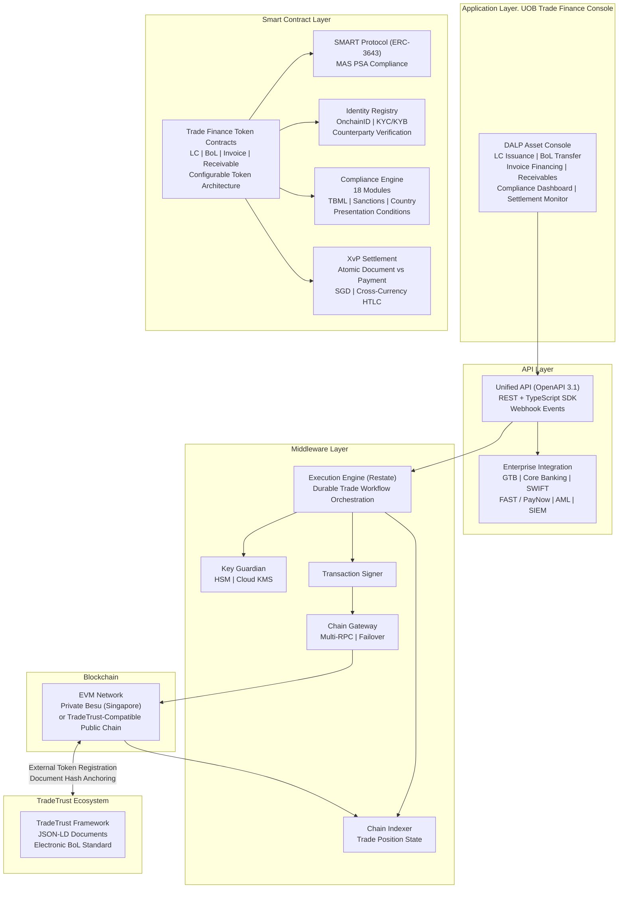
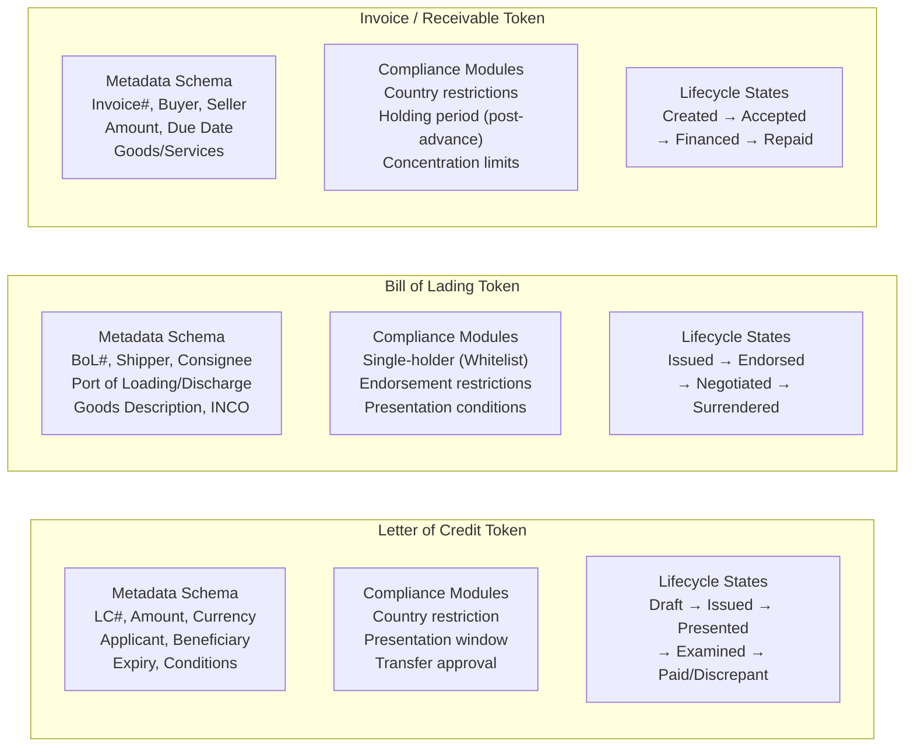
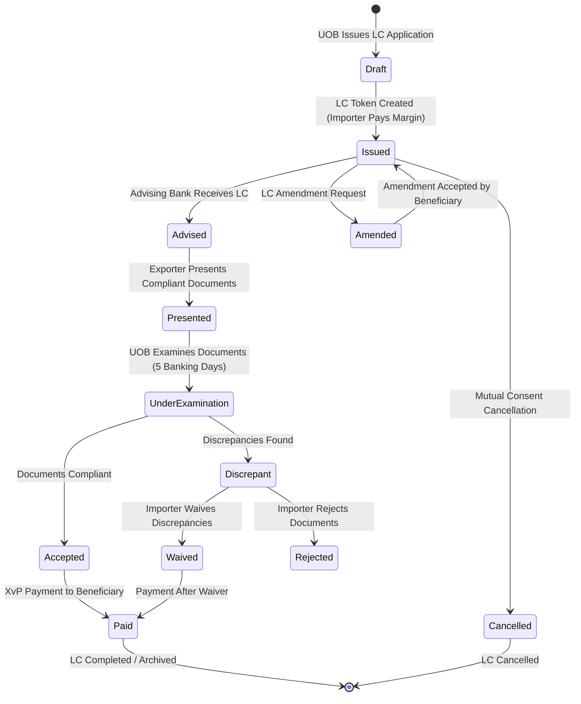
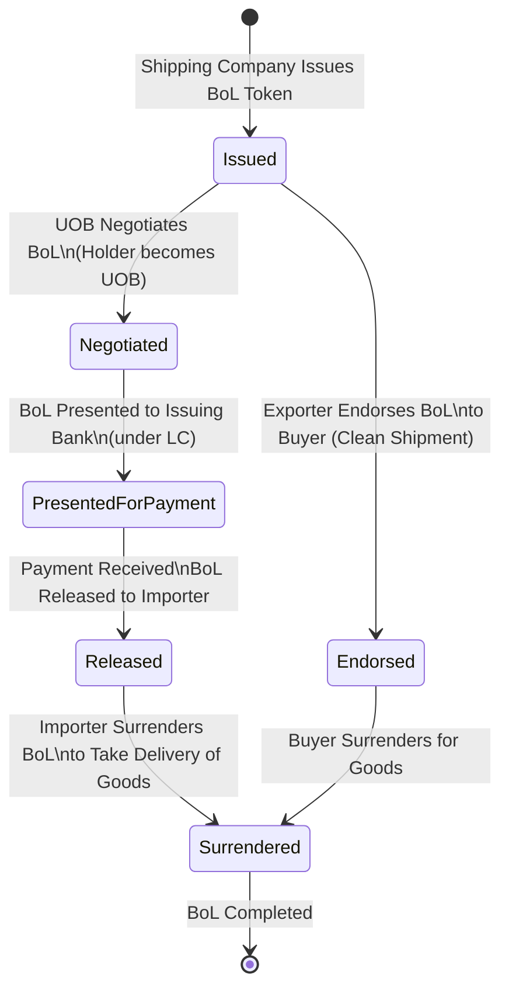
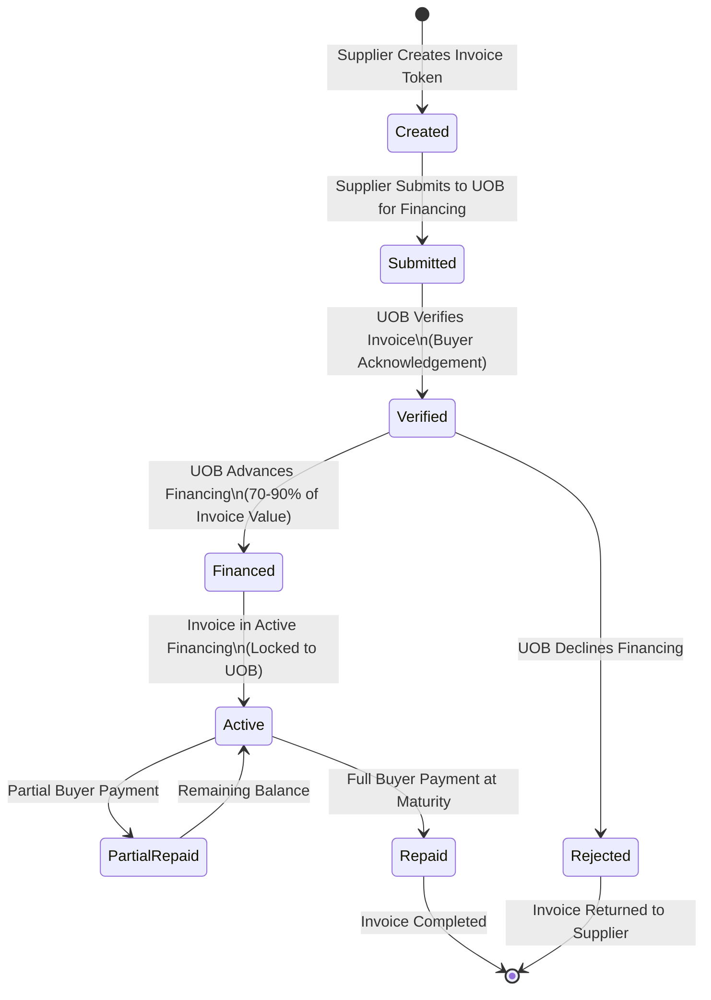
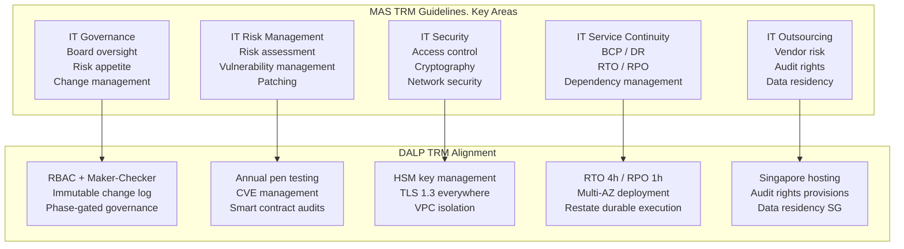
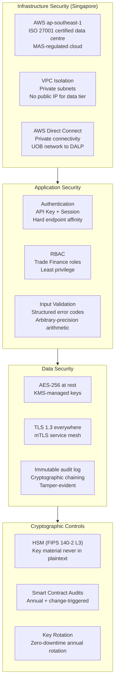
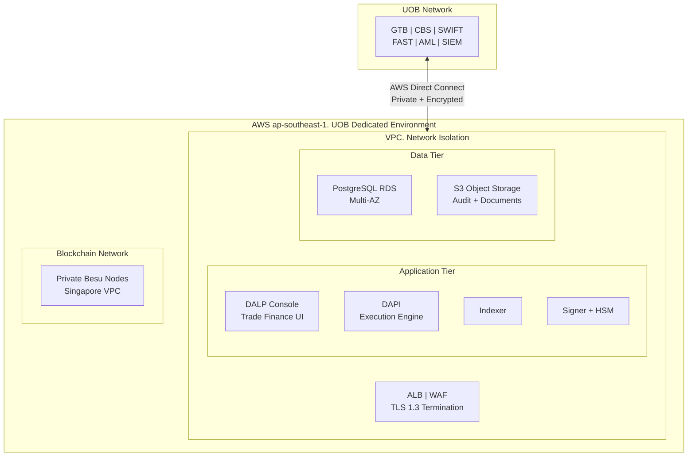
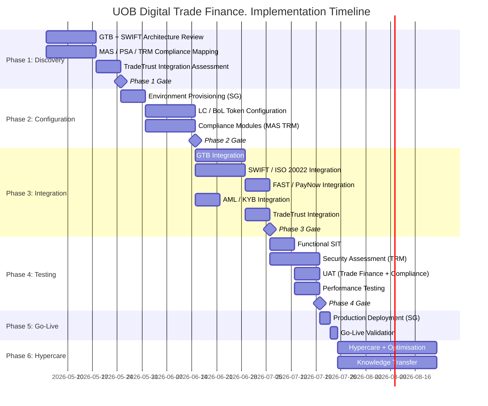

# Technical Proposal: Digital Trade Finance Platform

**Prepared for:** UOB (United Overseas Bank Limited)
**Date:** 20 March 2026
**Version:** 1.0 Draft
**Classification:** SettleMint Confidential. Invited Bidders Only
**Reference:** UOB-RFP-202603

---

## Table of Contents

1. Cover Page
2. Executive Summary
3. About SettleMint
4. Platform Overview: DALP
5. Solution Architecture
6. Asset Lifecycle Coverage
7. Compliance Architecture
8. Integration Architecture
9. Custody and Key Management
10. Settlement and Operations
11. Security Architecture
12. Deployment Options
13. Implementation Approach
14. Support and SLA
15. Reference Projects
16. Regulatory Alignment
17. Response Matrix
18. Appendix A: Risk Register
19. Appendix B: Compliance Module Catalog

---

## 1. Cover Page

**Document Title:** Technical Proposal: Digital Trade Finance Platform
**Client:** UOB (United Overseas Bank Limited), Singapore
**Date:** 20 March 2026
**Version:** 1.0 Draft
**Prepared by:** SettleMint NV
**Classification:** SettleMint Confidential

*This document contains proprietary and confidential information belonging to SettleMint NV. It is submitted exclusively in response to UOB-RFP-202603 and may not be reproduced, disclosed, or distributed without prior written consent from SettleMint NV.*

---

## 2. Executive Summary

### 2.1 Context

UOB occupies a distinctive position in Singapore's digital trade finance transformation. As one of the three major Singapore-incorporated banks, UOB has been an active participant in Singapore's digital financial market infrastructure development, through Project Guardian (MAS's collaborative initiative to test the feasibility of tokenised asset markets), UOB FinLab's innovation programmes, and the bank's progressive engagement with ASEAN trade corridors where the gap between paper-based and digital trade finance workflows creates both risk and opportunity. This procurement is not UOB exploring trade finance digitalisation conceptually, it is UOB deciding which platform will carry its digital trade finance operations into institutionalised deployment.

Singapore's context makes this procurement particularly consequential. MAS has established the most comprehensive regulatory framework for digital asset activities in Asia, including the Payment Services Act (PSA), the MAS TRM (Technology Risk Management) Guidelines, and the evolving guidance from Project Guardian's published findings on tokenised asset market structures. Singapore's TradeTrust initiative, a government-backed electronic Bills of Lading and trade document framework, creates an interoperability obligation: any digital trade finance platform deployed by a Singapore bank must be capable of operating within the TradeTrust ecosystem, not as an isolated proprietary system.

UOB's trade finance business spans ASEAN, Greater China, India, and Southeast Asia, a multi-jurisdiction, multi-currency, multi-counterparty environment that places specific demands on the digital trade finance platform. Letters of credit, bills of lading, invoices, and receivables must flow across regulatory boundaries, be presented to counterparties in different jurisdictions, and settle in multiple currencies including SGD, USD, and regional ASEAN currencies. The platform must accommodate this complexity without requiring separate technology stacks per jurisdiction or per counterparty relationship.

This proposal responds directly to UOB's procurement requirements. SettleMint proposes DALP as the governed infrastructure layer for UOB's digital trade finance platform, covering letters of credit, bills of lading, invoice financing, and receivables digitisation, with atomic SGD Exchange-versus-Payment settlement, MAS TRM-aligned security architecture, and TradeTrust interoperability by design.

### 2.2 Why Digital Trade Finance Is Technically Hard

Trade finance digitalisation consistently underdelivers because vendors solve the wrong problem. The typical approach creates digital versions of paper documents, digital PDFs presented through a portal, perhaps with a blockchain timestamp for authenticity. This is not trade finance digitalisation; it is trade finance digitisation of a superficial layer without changing the underlying workflow, counterparty risk, or settlement mechanics.

The genuinely hard problems in digital trade finance are: enforcing the single-original principle (only one party holds the effective original of a bill of lading at any time) through digital transfer mechanics; eliminating the settlement interval between document transfer and payment (the "float" that creates counterparty risk between trade parties); reconciling document events with bank account positions without manual intervention; and governing the compliance obligations that apply to trade finance instruments, sanctions screening on all parties, trade-based money laundering (TBML) controls, and jurisdiction-specific import/export restrictions.

For UOB specifically, the complexity extends to: ASEAN corridor trade where multiple jurisdictions' regulations apply simultaneously; correspondent banking relationships where UOB issues SGD LCs on behalf of regional banks without direct counterparty visibility; and the expectations that Singapore's MAS places on TRM compliance for digitised financial instruments, which are materially more demanding than what most trade finance digitalisation platforms address.

DALP addresses these hard problems directly. The configurable token architecture maps trade finance instruments to on-chain representations with the compliance controls that make the single-original principle enforceable, the XvP settlement module provides atomic document-versus-payment settlement that eliminates float risk, and the integration architecture connects to UOB's existing trade finance systems (GTB, core banking, SWIFT connectivity) rather than creating parallel workflows.

### 2.3 Proposed Response

SettleMint proposes DALP for UOB's digital trade finance platform covering the complete RFP scope:

**Letters of Credit (LCs):** DALP's configurable token architecture digitises LC instruments with full lifecycle support: LC issuance (importer's bank creates digital LC), presentation of complying documents, examination workflow, acceptance or discrepancy notification, payment execution on presentation, and LC amendment governance. The compliance engine enforces LC terms, expiry dates, presentation windows, partial shipment restrictions, at the protocol layer.

**Bills of Lading (BoL):** DALP's configurable token architecture represents electronic bills of lading as a transferable token with single-original enforcement: only one address (beneficiary) holds the effective original at any time. Transfer of the BoL token constitutes transfer of the document's title function. The compliance engine enforces endorsement restrictions, notify-party designations, and presentation conditions. TradeTrust interoperability is supported through DALP's external token registration capability and standard JSON-LD document model.

**Invoice Financing:** DALP's configurable token architecture supports invoice tokens with receivables financing lifecycle: invoice creation by supplier, verification and acceptance by buyer, financing advance by UOB (represented as a token-backed loan), repayment at maturity, and assignment/transfer mechanics for secondary financing.

**Receivables Digitisation:** DALP's configurable token framework covers the broader receivables portfolio, account receivables, trade receivables, factoring structures, with assignment documentation, concentration limit controls, and maturity scheduling.

**SGD Settlement:** DALP's XvP settlement module provides atomic Exchange-versus-Payment settlement in SGD, the trade document token and the payment instruction complete simultaneously or both revert. Integration with Singapore's PayNow and FAST payment rails provides the SGD cash leg. The architecture is directly compatible with MAS's tokenised SGD (Project Guardian findings) when the broader interbank tokenised SGD infrastructure matures.

**TradeTrust Interoperability:** DALP's architecture is designed to operate within Singapore's TradeTrust electronic Bills of Lading framework. TradeTrust documents represented as JSON-LD with cryptographic verifiability are compatible with DALP's document metadata model, enabling UOB to participate in TradeTrust-connected trade corridors without a separate technology stack.

### 2.4 Why SettleMint

SettleMint's most directly relevant credential for UOB's digital trade finance programme is the Reserve Bank of India Innovation Hub's multi-bank letter of credit trade finance blockchain, a multi-node, multi-cloud, multi-party blockchain infrastructure for fraud-proof, tamper-proof LC workflows. This deployment demonstrates exactly the multi-bank LC governance model that UOB's programme requires, at a scale involving multiple banks, regulatory supervision from the central bank, and a production-grade security architecture.

OCBC Bank Singapore's security token engine demonstrates DALP operating under MAS's TRM guidelines and PSA regulatory framework in a multi-year production context, the same compliance framework that governs UOB's digital trade finance platform. Maybank's Project Photon XvP deployment demonstrates DALP's SGD-adjacent XvP settlement capability in the ASEAN corridor context. Standard Chartered Bank's Digital Virtual Exchange demonstrates DALP's institutional securities capability across Asia, directly relevant to UOB's cross-ASEAN trade finance corridors.

### 2.5 Document Map

- **Section 3:** About SettleMint and Singapore credentials
- **Section 4:** DALP platform overview for trade finance
- **Section 5:** Solution architecture for UOB's digital trade finance platform
- **Section 6:** Trade instrument lifecycle coverage (LC, BoL, invoice, receivables)
- **Section 7:** Compliance architecture. MAS, PSA, TRM Guidelines, TBML
- **Section 8:** Integration architecture. GTB, SWIFT, core banking, FAST/PayNow
- **Section 9:** Custody and key management
- **Section 10:** Settlement and operations. XvP, SGD, TradeTrust
- **Section 11:** Security architecture. MAS TRM alignment
- **Section 12:** Deployment options. Singapore-domiciled
- **Section 13:** Implementation approach, 19-week delivery
- **Section 14:** Support and SLA
- **Section 15:** Reference projects (14 references)
- **Section 16:** Regulatory alignment. MAS, PSA, TRM Guidelines
- **Section 17:** Response matrix (TR-01 to TR-20)
- **Appendix A:** Risk Register
- **Appendix B:** Compliance Module Catalog

---

## 3. About SettleMint

### 3.1 Company Overview

SettleMint is the digital asset lifecycle platform company for regulated financial markets and sovereign use cases. The company has nearly a decade of focused experience building blockchain infrastructure for regulated institutions across Europe, the Middle East, and Asia Pacific. DALP, the Digital Asset Lifecycle Platform, provides the infrastructure institutions need to operate tokenised assets at production scale under regulation.

### 3.2 Singapore and ASEAN Credentials

SettleMint's Singapore credentials are the most directly relevant for UOB's procurement. OCBC Bank's deployment, a multi-year production engagement for a security token engine under MAS regulation, demonstrates DALP operating in the same regulatory environment (MAS PSA, TRM Guidelines) that governs UOB's digital trade finance programme. The OCBC deployment has operated through multiple MAS examinations, internal audits, and programme expansions, demonstrating the operational stability that UOB's procurement committee will require evidence of.

Standard Chartered Bank's Digital Virtual Exchange, supporting fractional tokenisation of securities across Asia, Africa, and the Middle East, demonstrates DALP's capability for multi-jurisdiction institutional deployment at the scale of a major bank with complex cross-border operations, directly comparable to UOB's ASEAN trade corridors.

Maybank's Project Photon deployed DALP's XvP settlement capability in Malaysia, a tokenised Malaysian Ringgit (MYRT) instrument with atomic XvP settlement aligned with Bank Negara Malaysia's Digital Asset Innovation Hub. This deployment demonstrates DALP's XvP settlement mechanics in an ASEAN corridor context directly applicable to UOB's SGD-denominated trade settlement requirements.

The Reserve Bank of India Innovation Hub's multi-bank trade finance blockchain demonstrates DALP's specific capability for multi-party, multi-bank LC infrastructure, the most directly comparable reference to UOB's LC digitalisation requirement.

### 3.3 Technology Certifications

ISO 27001 and SOC 2 Type II certifications, aligned with MAS TRM Guidelines requirements for institutional technology vendors. Annual independent penetration testing. Smart contract security audits by specialised blockchain security firms.

---

## 4. Platform Overview: DALP

### 4.1 Trade Finance Application of DALP

DALP's configurable token architecture is specifically well-suited for trade finance instruments. Unlike bonds or equities, financial instruments with standardised structures, trade finance instruments (LCs, BoLs, invoices) have complex, document-heavy structures with multiple parties, sequential workflow stages, and strict compliance obligations. DALP's configurable token with up to 32 pluggable features and 18 compliance module types provides the architecture needed to represent trade finance instrument complexity on-chain without custom smart contract development.

**Key DALP capabilities for trade finance:**

| Capability | Trade Finance Application | Confidence |
|---|---|---|
| Configurable token (32 features) | LC, BoL, invoice, receivable instrument encoding | 🟢 Native |
| Custom metadata schema | Trade document attributes (ISIN equivalents for trade: LC number, BoL number, consignee, port of discharge) | 🟢 Native |
| Single-holder enforcement (Whitelist) | BoL single-original principle, only one address holds at a time | 🟢 Native |
| Transfer Approval module | LC examination and acceptance workflow, payment triggers on compliant presentation | 🟢 Native |
| XvP settlement | Atomic document-versus-payment settlement (BoL transfer + SGD payment simultaneously) | 🟢 Native |
| Time-based rules (Expiry, Trading Window) | LC expiry enforcement; presentation window enforcement | 🟢 Native |
| Multi-party compliance (Whitelist + Country) | TBML controls; sanctioned counterparty blocking | 🟢 Native |
| External token registration | TradeTrust document integration | 🟢 Native |
| HTLC cross-chain settlement | Cross-currency settlement (SGD vs USD, SGD vs regional currencies) | 🟢 Native |
| OnchainID / Identity Registry | Counterparty KYC/KYB and eligibility verification | 🟢 Native |

### 4.2 Five Lifecycle Pillars for Trade Finance

**Issuance:** Trade instruments are created through DALP's configurable token with custom metadata schemas capturing trade document attributes. An LC token captures: LC number, applicant (importer), beneficiary (exporter), issuing bank (UOB or correspondent), advising bank, amount, currency (SGD / USD), expiry date, port of loading/discharge, and applicable trade terms (Incoterms).

**Compliance:** Pre-transfer validation enforces compliance at the protocol layer: both parties must have current KYC/KYB verification; counterparties must not appear on sanctions lists; country restrictions block trade with prohibited jurisdictions; presentation conditions must be met before LC payment is triggered. All checks execute before execution, there is no application-layer bypass.

**Custody:** Signing keys for UOB's trade finance operations are managed through the Key Guardian with HSM integration. UOB retains full custody of signing key material; SettleMint does not hold UOB's keys.

**Settlement:** XvP settlement provides atomic document-versus-payment for trade finance transactions, the BoL transfer and the SGD payment complete atomically or both revert. This eliminates the settlement float that creates counterparty risk in traditional trade finance.

**Servicing:** Automated lifecycle events: LC payment on presentation, financing advance drawdown, receivable maturity processing, interest accrual, and repayment scheduling. These are the operational automation capabilities that eliminate manual trade operations steps.

---

## 5. Solution Architecture

### 5.1 Four-Layer Technical Stack for UOB



### 5.2 Trade Instrument Token Architecture

Trade finance instruments require a more complex token architecture than financial securities because each instrument has a unique document structure, multiple parties, and sequential workflow states. DALP's configurable token provides this architecture:



### 5.3 TradeTrust Integration Architecture

Singapore's TradeTrust framework, built on IMDA's Electronic Transferable Records (ETR) standards and the Model Law on Electronic Transferable Records (MLETR), establishes the legal and technical standards for electronic Bills of Lading in Singapore. UOB's digital trade finance platform must operate within this framework to participate in the broader Singapore trade ecosystem.

DALP's integration with TradeTrust operates through two mechanisms:

**Document Hash Anchoring:** TradeTrust BoLs are JSON-LD documents with a verifiable document hash. DALP can anchor TradeTrust document hashes on its EVM network, creating an additional on-chain record of the document's existence and integrity. The DALP platform's on-chain position management tracks which address holds the TradeTrust BoL token.

**External Token Registration:** DALP's external token registration capability enables tokens created on other systems (including TradeTrust's registry) to be registered in DALP's identity and compliance framework. This means a TradeTrust BoL that is transferred through the TradeTrust ecosystem can be represented in DALP for financing purposes. UOB can advance against a TradeTrust BoL without requiring the trade parties to switch from TradeTrust to a DALP-native BoL.

**Native BoL Issuance:** For trade corridors where UOB has sufficient counterparty coverage, DALP issues native BoL tokens that are also compliant with TradeTrust's JSON-LD document standard, providing both the on-chain transfer mechanics and the TradeTrust-compatible document representation.

---

## 6. Asset Lifecycle Coverage

### 6.1 Letter of Credit Lifecycle



**LC Issuance Workflow:** When an UOB corporate client initiates an LC application, the UOB trade finance team configures the LC token on DALP: currency and amount (SGD or multi-currency), expiry date (enforced by the Time-based Rules compliance module), documents required, special conditions, and the beneficiary's OnchainID address. The LC enters Issued state with the presentation window active, the compliance engine will only accept document presentations during the valid window.

**Document Presentation and Examination:** When the beneficiary (exporter or their bank) presents complying documents, the presentation event is recorded on DALP. The Transfer Approval compliance module places the LC in an examination queue, the payment cannot execute until UOB's trade finance team completes the examination and confirms compliance (or flags discrepancies). The 5 banking-day examination window is enforced by a time-lock configuration; presentations that miss the examination window are automatically flagged.

**Discrepancy Workflow:** If UOB's examination identifies discrepancies, the discrepancy notification is recorded on DALP with the specific discrepancy codes. The importer's decision (waive or reject) is captured through the maker-checker workflow. If discrepancies are waived, the LC proceeds to payment. If rejected, the BoL and supporting documents are returned (represented by a token transfer back to the presenting party).

**XvP Payment on Acceptance:** Upon acceptance, DALP's XvP settlement module triggers the simultaneous SGD payment to the beneficiary and the transfer of the LC token to "Paid" state. Both complete atomically, there is no window between acceptance and payment where the beneficiary holds an unpaid LC, eliminating the counterparty risk of the traditional process.

### 6.2 Bill of Lading Lifecycle



**Single-Original Enforcement:** DALP's Whitelist compliance module ensures that at any given time, only one address is listed as the effective holder of a BoL token. Transfer of the BoL requires removing the current holder from the whitelist and adding the new holder, an operation that requires the current holder's signing key and is executed as a single atomic transaction. There is no period during transfer where two parties simultaneously hold the effective original, enforcing the single-original principle that is the legal foundation of negotiable BoL value.

**Negotiation under LC:** When UOB negotiates a BoL under an LC, DALP records the negotiation event: the exporter's bank transfers the BoL token to UOB (or UOB's designated address for the trade); UOB simultaneously pays the negotiation amount; the XvP module ensures both transfer and payment complete atomically. UOB now holds the BoL as security.

**Financing Against BoL:** DALP's Settlement Lock module can lock a BoL token while UOB advances financing against it, preventing the BoL from being transferred or released while the financing is outstanding. When financing is repaid, the lock is released automatically through the maturity redemption workflow.

### 6.3 Invoice Financing Lifecycle



**Invoice Token Structure:** Invoice tokens capture: invoice number, buyer identity (OnchainID-verified), seller identity, invoice amount in SGD (or specified currency), due date, goods/services description, and payment terms. The buyer's acknowledgement of the invoice (a prerequisite for UOB's financing) is captured as an on-chain event, creating an irrefutable record of buyer confirmation before financing advance.

**Concentration Limit Enforcement:** The Holding Limit compliance module enforces UOB's concentration limits for invoice financing exposure: no single buyer/supplier pair can account for more than a configured percentage of UOB's total invoice financing portfolio. This concentration limit is evaluated automatically at each new financing advance, blocking advances that would exceed the limit without manual intervention from the risk team.

**Maturity Processing:** At invoice maturity, DALP's maturity redemption workflow triggers the repayment sequence: buyer payment is received through the PayNow/FAST integration; the invoice token is updated to Repaid state; UOB's financing position is released; and the GL posting event is generated for Finacle integration.

---

## 7. Compliance Architecture

### 7.1 MAS Payment Services Act Compliance

The Payment Services Act (PSA) establishes the regulatory framework for digital payment token services and e-money in Singapore. UOB's digital trade finance platform, to the extent it involves tokenised representations of payment obligations, operates within the PSA framework. DALP's compliance architecture addresses PSA requirements:

**Digital Payment Token Compliance:** Where DALP tokens representing LC payment obligations or invoice receivables constitute digital payment tokens under the PSA, DALP's compliance module configuration enforces MAS's transfer and holding restrictions for regulated instruments.

**e-Money Provisions:** Where UOB's SGD settlement mechanism uses a tokenised SGD representation, MAS's e-money provisions under the PSA apply. DALP's stablecoin architecture (used for tokenised SGD as the cash leg) is designed to operate within MAS's e-money regulatory framework.

**AML/CFT:** MAS's AML/CFT requirements under the PSA require robust customer due diligence, transaction monitoring, and suspicious transaction reporting. DALP's pre-transfer compliance enforcement, with KYC/KYB verification mandatory for all token transfers, satisfies the pre-transaction due diligence requirement. Transaction monitoring integration connects to UOB's existing AML platform for ongoing monitoring.

### 7.2 MAS TRM Guidelines

MAS's Technology Risk Management Guidelines establish comprehensive requirements for financial institutions' technology systems. DALP's architecture directly addresses TRM requirements:



**IT Governance:** TRM requires board-level IT governance with defined risk appetite for technology systems. DALP's RBAC model, maker-checker governance, and immutable change log support UOB's IT governance framework by providing evidence of authorised changes, segregation of duties, and accountability at the individual user level.

**IT Risk Management:** TRM requires systematic vulnerability management and patching for material IT systems. SettleMint's vulnerability disclosure programme and critical patch SLA align with TRM's patching requirements. Annual penetration testing results are provided to UOB's IT Risk function for their technology risk assessment.

**IT Security:** TRM's cryptographic requirements align with DALP's key management architecture (HSM-based key storage, TLS 1.3, VPC network isolation, multi-factor authentication for privileged access).

**IT Service Continuity:** TRM requires institutions to maintain BCP and DR capability with defined RTO/RPO. DALP's multi-AZ deployment, Restate durable execution, and quantified RTO/RPO (4-hour/1-hour for managed cloud) provide the continuity documentation TRM requires.

**IT Outsourcing:** TRM's outsourcing requirements mandate vendor risk assessment, data residency controls, and audit rights. SettleMint's Singapore hosting (AWS ap-southeast-1), audit rights provisions, and ISO 27001 certification support UOB's TRM outsourcing compliance.

### 7.3 Trade-Based Money Laundering (TBML) Controls

Trade-based money laundering is a specific risk category in trade finance where the trade instrument (invoice, LC, BoL) is used to disguise money movement. MAS and FATF have issued specific guidance on TBML controls for banks engaged in trade finance. DALP's architecture addresses TBML:

**Document Verification Integration:** DALP integrates with UOB's trade document verification system to validate invoice values against market pricing benchmarks, detect over/under-invoicing patterns, and flag anomalies for compliance review. The verification result is attached to the trade token as a compliance event record.

**Beneficial Ownership Transparency:** DALP's Identity Registry enforces counterparty KYC/KYB for all parties to a trade transaction, buyer, seller, shipping company, and all endorsees of a BoL. Beneficial ownership information is captured at the OnchainID level, enabling UOB's compliance team to identify beneficial ownership chains for TBML risk assessment.

**Sanctions Screening:** DALP's pre-transfer compliance enforcement invokes UOB's existing sanctions screening system for every counterparty identity before any trade instrument transfer. Sanctioned counterparties are blocked at the contract level. Screening results are attached to every trade event record for evidentiary completeness.

**Country Restriction Enforcement:** DALP's Country Restriction compliance module blocks trade transactions involving jurisdictions subject to MAS-directed or OFAC/UN sanctions. The restricted jurisdiction list is configurable by UOB's compliance team without code changes, ensuring that regulatory updates can be applied within hours rather than through a development cycle.

### 7.4 Project Guardian Alignment

MAS's Project Guardian, a collaborative initiative testing the viability of tokenised asset markets in wholesale banking, has produced published findings that directly inform UOB's digital trade finance architecture requirements. The most relevant Project Guardian findings for UOB's programme:

**Institutional-Grade Compliance at Protocol Layer:** Project Guardian's industry pilots confirmed that institutional digital asset platforms require compliance enforcement at the token protocol level, not at the application layer. DALP's ERC-3643 implementation directly addresses this finding, compliance is enforced before execution at the smart contract layer.

**Interoperability as a First-Class Requirement:** Project Guardian's findings emphasise that tokenised asset platforms must be interoperable with other platforms and networks to create genuine market liquidity. DALP's architecture, supporting external token registration, TradeTrust integration, and HTLC cross-chain settlement, is designed for interoperability, not proprietary lock-in.

**Atomic Settlement for Trade Efficiency:** Project Guardian's FX settlement pilots demonstrated that atomic settlement (simultaneous exchange of assets and payments) materially reduces counterparty risk and settlement fails compared to sequential settlement. DALP's XvP module implements exactly this pattern for UOB's trade finance instrument settlement.

### 7.5 Regulatory Mapping Table

| Regulatory Requirement | Regulation | DALP Control | Confidence |
|---|---|---|---|
| Digital payment token compliance | MAS PSA | Compliance engine for tokenised payment obligations | 🟢 Native |
| AML/CFT, pre-transaction CDD | MAS AML/CFT Requirements | KYC/KYB-backed identity verification; pre-transfer screening | 🟢 Native |
| AML/CFT, transaction monitoring | MAS AML/CFT Requirements | AML integration hook; monitoring event export | 🟡 Partial (external system) |
| Sanctions screening | MAS Guidelines; UN/OFAC | Country Restriction + Blacklist modules; pre-transfer API hook | 🟢 Native |
| TBML controls | MAS TBML guidance | Document verification integration; beneficial ownership capture | 🟡 Partial (integration) |
| IT Governance | MAS TRM Guidelines | RBAC; maker-checker; immutable change log | 🟢 Native |
| IT Security | MAS TRM Guidelines | HSM; TLS 1.3; VPC isolation; ISO 27001 | 🟢 Native |
| IT Service Continuity | MAS TRM Guidelines | Multi-AZ; RTO 4h; RPO 1h; DR testing | 🟢 Native |
| IT Outsourcing | MAS TRM Guidelines | Singapore hosting; audit rights; ISO 27001 | 🟢 Native |
| Data residency | MAS Technology Risk | AWS ap-southeast-1 deployment | 🟢 Native |
| Single-original BoL | Electronic Transactions Act; TradeTrust framework | Whitelist single-holder enforcement | 🟢 Native |
| Electronic transferable records | Singapore ETA; MLETR | TradeTrust-compatible document model | 🟡 Partial (framework integration) |
| Smart contract change governance | Implicit MAS TRM | RBAC; maker-checker for all contract changes | 🟢 Native |

---

## 8. Integration Architecture

### 8.1 UOB Enterprise Integration Overview

```mermaid
graph TB
    subgraph UOB["UOB Enterprise Systems"]
        GTB["Global Trade Banking (GTB)\nLC Processing | BoL Management\nTrade Document Workflows"]
        CBS["Core Banking System\nAccount Positions | GL\nCustomer Records"]
        SWIFT["SWIFT / Correspondent Banking\nMT700 / MT760 LCs\nISO 20022 Migration"]
        FAST["FAST / PayNow\nSGD Instant Payment\nReal-Time Confirmation"]
        AML["AML / Sanctions Platform\nWorldCheck | Internal Screening"]
        KYC["KYB System\nCounterparty Verification\nBeneficial Ownership"]
        SIEM["SIEM / SOC\nSecurity Monitoring"]
        REP["MAS Regulatory Reporting\nPSA Reports | AML Reports"]
        DWH["Data Warehouse\nManagement Reporting\nTrade Analytics"]
    end
    subgraph DALP["DALP Platform"]
        API["Unified API + Webhooks"]
        IDX["Event Indexer"]
        OBS["Observability"]
    end
    subgraph External["External Ecosystems"]
        TRADETRUST["TradeTrust Framework"]
        CORR["Correspondent Banks\n(LC Issuing/Advising)"]
    end

    GTB <-->|"LC/BoL lifecycle sync\nDocument event triggers"| API
    CBS <-->|"Account positions | GL posting"| API
    SWIFT <-->|"MT700 → DALP LC\nISO 20022 migration"| API
    FAST <-->|"SGD payment instructions\nConfirmation events"| API
    AML <-->|"Pre-transfer screening\nSTR data export"| API
    KYC <-->|"KYB verification | Identity claims"| API
    SIEM <-->|"Security events | Audit logs"| OBS
    REP <-->|"Trade event data export"| IDX
    DWH <-->|"Transaction analytics"| IDX
    TRADETRUST <-->|"Document hash anchoring\nExternal token registration"| API
    CORR <-->|"SWIFT MT700 / DALP API\nCorrespondent LC handling"| API
```



### 8.2 GTB Integration

UOB's Global Trade Banking (GTB) system is the primary application layer for trade finance operations. DALP integrates with GTB as follows:

**LC Lifecycle Synchronisation:** LC events in DALP (issuance, presentation, examination outcome, payment) trigger webhook notifications to GTB's API. GTB maintains the customer-facing LC record; DALP provides the blockchain-based compliance enforcement and atomic settlement layer. LC data enters DALP from GTB at issuance (configuration data) and returns to GTB as event records (for customer-facing status updates and regulatory reporting).

**BoL Management:** BoL tokens created in DALP are linked to the corresponding GTB trade transaction record through a unique transaction reference. BoL transfer events in DALP trigger GTB updates, ensuring that UOB's trade operations team sees the same BoL status in GTB as exists on-chain.

**Document Workflow Triggers:** GTB's examination workflow (the 5-day examination clock, discrepancy management, waiver processing) is mirrored in DALP's Transfer Approval compliance workflow. When a GTB user approves or rejects a presentation in GTB, the decision is reflected in DALP's compliance state through the GTB integration API.

### 8.3 SWIFT Integration

UOB issues and handles LCs through the SWIFT network using MT700 (LC issuance) and MT760 (LC amendment) message types. As the trade finance industry migrates to ISO 20022 (MT migrating to equivalent pacs/trade finance messages), DALP's integration architecture supports both:

**MT700 → DALP LC Token:** When UOB receives an MT700 from a correspondent bank, DALP's SWIFT integration parses the MT700 field structure and creates a corresponding DALP LC token with the LC parameters mapped to the token's metadata schema. This enables UOB to maintain SWIFT connectivity with traditional banking counterparties while operating the underlying compliance and settlement layer on DALP.

**ISO 20022 Migration Path:** As the trade finance industry migrates to ISO 20022 trade finance message standards (camt, pain, pacs), DALP's ISO 20022 integration layer handles the new message formats. UOB's SWIFT connectivity team works with DALP's integration team to configure the message mapping during Phase 3 of the implementation.

### 8.4 FAST and PayNow Integration

DALP's SGD payment integration uses Singapore's FAST (Fast and Secure Transfers) and PayNow infrastructure for the cash leg of trade finance settlements:

**LC Payment via FAST/PayNow:** On LC payment trigger (acceptance of compliant documents), DALP's XvP module generates a FAST payment instruction for the SGD amount to the beneficiary's PayNow-registered account. Payment confirmation from the FAST network triggers the LC token's state update to "Paid" in DALP.

**Invoice Financing Advance via PayNow:** Invoice financing advances are disbursed through PayNow to the supplier's account. The advance triggers the invoice token's state update to "Financed" and activates the Settlement Lock (preventing invoice transfer while financing is outstanding).

**DvP Settlement for Institutional Counterparties:** For institutional counterparties (correspondent banks, trading companies), DvP settlement uses Singapore's RTGS (MAS MEPS+) via ISO 20022 instructions rather than PayNow, providing the settlement certainty and amount limits appropriate for wholesale trade finance transactions.

### 8.5 AML and KYB Integration

**Pre-Transaction Screening:** DALP invokes UOB's AML and sanctions screening platform (integrated via API) for every counterparty identity at onboarding and before each trade instrument transfer. Screening includes: sanctions list screening (UN, OFAC, EU, MAS), adverse media screening, PEP (politically exposed person) screening, and trade-based money laundering risk indicators.

**TBML Pattern Detection:** For invoice financing, DALP's document verification integration connects to UOB's TBML detection platform, checking invoice values against pricing databases to identify over/under-invoicing patterns. Flagged invoices are routed to UOB's trade compliance team before financing advance proceeds.

---

## 9. Custody and Key Management

### 9.1 Key Management for UOB Trade Finance

UOB's trade finance operations require a key management architecture that balances security (protecting the signing keys that control LC payment triggers and BoL transfers) with operational speed (trade finance decisions have tight document examination windows).

**Production Keys (HSM):** All production signing keys for UOB's digital trade finance platform are managed through FIPS 140-2 Level 3 certified HSM hardware. The Key Guardian provides a synchronous signing path with sub-second response times, necessary for trade finance operations where examination windows and counterparty timelines create time pressure.

**Governance Keys (Fireblocks):** Compliance module governance keys, controlling sanctions list updates, country restriction updates, and emergency pause, are managed through Fireblocks institutional custody. These changes are infrequent but high-impact; Fireblocks' transaction policy controls and multi-party approval provide the governance oversight appropriate for compliance rule changes.

### 9.2 Trade Finance Maker-Checker

| Operation | Maker | Checker | Quorum |
|---|---|---|---|
| LC issuance | Trade Finance Officer | Trade Finance Manager | 2-of-2 |
| LC payment trigger (acceptance) | Trade Finance Examiner | Trade Finance Team Lead | 2-of-2 |
| BoL financing advance | Credit Officer | Credit Manager | 2-of-2 |
| Discrepancy waiver | Trade Finance Manager | Head of Trade Finance | 2-of-2 |
| Sanctions country restriction update | Compliance Analyst | Head of Compliance | 2-of-2 |
| Emergency LC suspension | Any authorised officer | N/A (single) | 1-of-N |
| Emergency platform pause | Any authorised officer | N/A (single) | 1-of-N |
| Trusted issuer change | CTO delegate | CISO delegate | 2-of-3 |

---

## 10. Settlement and Operations

### 10.1 XvP Settlement for Trade Finance

DALP's XvP (Exchange-versus-Payment) settlement module provides the atomic settlement mechanics that eliminate counterparty risk in trade finance. For UOB's digital trade finance platform, two settlement models apply:

**Document-versus-Payment (DvP) for BoLs:** When UOB negotiates a BoL under an LC, the BoL token transfer to UOB and the payment to the exporter's account execute atomically. If the payment fails (insufficient funds, payment instruction rejected), the BoL transfer reverts automatically, the exporter retains possession of the BoL. If the BoL transfer fails (e.g., the exporter's wallet key is unavailable), the payment is not executed. Both sides complete or both sides revert.

**Payment-versus-Payment (PvP) for Cross-Currency:** For trade finance involving SGD LCs covering goods priced in USD or regional currencies, DALP's HTLC (Hash Time-Locked Contract) cross-chain settlement provides PvP exchange, the SGD payment and the USD (or other currency) receipt execute atomically through cryptographic locking. This eliminates the FX settlement risk that exists when SGD and USD legs of a trade settle at different times.

```mermaid
sequenceDiagram
    participant Exporter as Exporter
    participant UOB as UOB DALP
    participant Compliance as Compliance Engine
    participant Settlement as XvP Settlement
    participant PayNow as FAST / PayNow
    participant Importer as Importer

    Exporter->>UOB: Present BoL + compliant documents
    UOB->>Compliance: Verify presentation compliance
    Compliance-->>UOB: Documents compliant (within window)
    UOB->>Settlement: Create DvP settlement (BoL token + SGD payment)
    Settlement-->>UOB: Settlement ID; BoL token locked
    UOB->>Importer: Notify acceptance; request payment confirmation
    Importer->>PayNow: Instruct SGD payment to Exporter
    PayNow-->>UOB: Payment confirmed
    UOB->>Settlement: Execute atomic settlement
    Settlement->>Exporter: Transfer SGD (payment)
    Settlement->>UOB: Transfer BoL token (now held by UOB)
    Settlement-->>UOB: Both legs confirmed; settlement complete
    UOB->>CBS: GL posting (BoL acquired + SGD disbursed)
    UOB->>Exporter: Confirm settlement complete
```

### 10.2 Operational Dashboards for Trade Finance

**LC Operations Dashboard:** Active LC pipeline with status per stage (Issued / Presented / Under Examination / Accepted / Paid / Discrepant). Examination queue with deadline countdown per LC. Upcoming LC expiries. Amendment queue. Daily LC volume metrics.

**BoL and Financing Dashboard:** Active BoL position register with holder information. Outstanding invoice financing positions with maturity dates. Concentration limit utilisation by buyer. Financing advance queue with credit approval status.

**Settlement Monitor:** Pending XvP settlement transactions with counterparty confirmation status. FAST/PayNow instruction status. Failed settlement exceptions with revert confirmation status. Cross-currency HTLC settlement status.

**Compliance Dashboard:** Sanctions screening alert queue. TBML flag queue. Counterparty KYB expiry alerts. Country restriction updates pending approval.

---

## 11. Security Architecture

### 11.1 MAS TRM Aligned Security



**Penetration Testing:** Annual independent penetration testing with scope covering the API surface, application layer, network perimeter, key management, and smart contract interfaces. UOB's IT Risk team receives the full penetration testing report. Critical findings are remediated before production deployment.

**Smart Contract Security:** All DALP smart contracts are audited by specialised blockchain security firms. For UOB's trade finance deployment, additional audit focus on the Transfer Approval workflow (the mechanism that triggers LC payment), the XvP settlement contract (the mechanism that executes atomic BoL + payment), and the configurable compliance engine (the mechanism that enforces sanctions and eligibility). Audit reports are provided to UOB's technical due diligence team.

### 11.2 MAS Notice 644 (Cyber Hygiene) Alignment

MAS Notice 644 (Cyber Hygiene) establishes 10 baseline cybersecurity controls that all MAS-regulated financial institutions must implement. DALP's architecture aligns with each control:

| MAS Notice 644 Control | DALP Implementation | Confidence |
|---|---|---|
| 1. Restrict administrative privileges | RBAC with 5 defined roles; privileged access requires multi-party approval; time-bound elevated access | 🟢 Native |
| 2. Apply software patches | Critical patches within CERT-equivalent timelines; platform updates staged with UOB approval gate | 🟢 Native |
| 3. Malware protection | Application deployed in hardened containers; no untrusted code execution paths; smart contract audit prevents malicious contract deployment | 🟢 Native |
| 4. Network perimeter defence | WAF (OWASP Top 10); VPC isolation; no public IP for data tier; DDoS protection | 🟢 Native |
| 5. Multi-factor authentication | MFA enforcement for all privileged administrative access; hardware MFA for key management operations | 🟢 Native |
| 6. Virtual patching | WAF rules updated for newly discovered vulnerabilities without application deployment cycle | 🟢 Native |
| 7. Restrict administrative access | Administrative access to production requires time-limited approval; all admin sessions logged immutably | 🟢 Native |
| 8. Whitelist applications | Container registry with signed images; only approved container images deployed to production | 🟢 Native |
| 9. Segment networks | Private subnets per tier (application, data, blockchain); security group rules enforce strict tier-to-tier communication policy | 🟢 Native |
| 10. System availability and recovery | Multi-AZ deployment; RTO 4h / RPO 1h; annual DR test; Restate durable execution for workflow continuity | 🟢 Native |

All 10 MAS Notice 644 baseline controls are natively supported by DALP's architecture. SettleMint provides MAS-formatted evidence documentation for each control as part of UOB's MAS IT examination preparation.

---

## 12. Deployment Options

### 12.1 Recommended: AWS ap-southeast-1 (Singapore)

SettleMint recommends deployment in a dedicated cloud environment in AWS ap-southeast-1 (Singapore), the same region as MAS's data residency guidance for Singapore-regulated institutions. This deployment provides Singapore data residency, low latency to UOB's Singapore infrastructure, and AWS's MAS-regulated cloud commitment for Singapore financial institutions.



**Environment Architecture:**
- Production: EUR 300,000/year, live trade finance operations
- Development: EUR 120,000/year, integration development, testing, UAT
- Staging (optional): Production-equivalent for pre-production validation

---

## 13. Implementation Approach

### 13.1 Programme Timeline



### 13.2 Resource Model

**SettleMint Team:**

| Role | Engagement | Responsibility |
|---|---|---|
| Delivery Lead | Full programme | Programme governance; UOB senior interface |
| Solution Architect (Singapore / MAS specialist) | Phases 1–4 | MAS TRM alignment; TradeTrust integration; SWIFT architecture |
| Platform Engineer | Phases 2–5 | Environment provisioning; token configuration; Singapore deployment |
| Integration Engineer | Phases 3–4 | GTB, SWIFT, FAST/PayNow, AML integrations |
| QA / Test Lead | Phases 3–4 | SIT; MAS TRM security assessment coordination; UAT |
| Support Engineer | Phases 5–6 | Go-live support; hypercare; knowledge transfer |

---

## 14. Support and SLA

### 14.1 Premium Support Recommendation

SettleMint recommends **Premium Support** for UOB's digital trade finance platform, with an upgrade path to Enterprise Support as the programme scales to multi-corridor, high-volume operations.

**Premium Support provides:**
- Extended hours: 07:00–22:00 CET; P1 on-call weekends
- Dedicated Slack channel; named support engineer
- P1 response: 1 hour; resolution: 4 hours
- P2 response: 4 hours; resolution: 8 hours
- 99.95% monthly uptime SLA
- Monthly technical business review

**Trade Finance Specific:** For time-sensitive trade finance scenarios (LC examination window expiry, BoL settlement deadline), SettleMint's P1 response path provides the escalation speed needed when a platform issue affects a time-critical trade transaction.

---

## 15. Reference Projects

| Institution | Use Case | Region | Relevance to UOB |
|---|---|---|---|
| OCBC Bank | Security token engine; MAS-regulated | Singapore | Same MAS/PSA/TRM regulatory context; multi-year production |
| KBC Securities | Equity crowdfunding + SME loans | Belgium | Trade instrument lifecycle management patterns |
| KBC Insurance | NFT product passports | Belgium | Configurable token for non-standard instruments |
| Standard Chartered Bank | Digital Virtual Exchange; APAC cross-border | Multi-APAC | Cross-border institutional operations similar to UOB ASEAN corridors |
| Reserve Bank of India Innovation Hub | **Multi-bank LC trade finance blockchain** | India | **Most directly comparable: multi-bank LC infrastructure, central bank oversight, production** |
| Sony Bank | Stablecoin + digital identity | Japan | SGD stablecoin as cash leg pattern |
| State Bank of India | CBDC infrastructure | India | Digital currency settlement at scale |
| Islamic Development Bank | Sharia-compliant subsidy distribution | Multi-region | Multi-party, multi-jurisdiction distribution workflows |
| Mizuho Bank | Bond tokenisation and trade finance | Japan | Trade finance use case in APAC institutional context |
| IsDB (Market Stabilization) | Collateral management | Multi-region | Collateral lock mechanics applicable to BoL financing |
| Maybank (Project Photon) | **FX tokenisation; XvP cross-border settlement** | Malaysia | **XvP settlement in ASEAN corridor; directly applicable to UOB cross-border trade** |
| ADI – Finstreet | Tokenised equity; Fireblocks custody | UAE | Institutional custody integration patterns |
| Commerzbank | Hybrid on/off-chain instruments; near real-time settlement | Germany | Hybrid integration approach for existing trade infrastructure |
| Saudi Arabia RER | Country-scale multi-party infrastructure | Saudi Arabia | Multi-party, multi-entity infrastructure at national scale |

---

## 16. Regulatory Alignment

### 16.1 MAS Project Guardian and Digital Trade Finance

Project Guardian's Phase 1 findings (published 2022) and subsequent pilot results have established several architectural principles that directly inform UOB's digital trade finance platform design:

**Institutional-Grade Compliance:** Project Guardian's industry pilots demonstrated that institutional participants require compliance enforcement at the token protocol layer. DALP's ERC-3643 implementation satisfies this requirement in production, not just in pilot design.

**Interoperability with Existing Infrastructure:** Project Guardian findings emphasised that tokenised asset platforms must interoperate with existing market infrastructure rather than requiring wholesale replacement. DALP's integration architecture, connecting to UOB's GTB, SWIFT, FAST/PayNow, and TradeTrust, directly addresses this interoperability requirement.

**Atomic Settlement for Risk Reduction:** Project Guardian's FX settlement pilots quantified the risk reduction from atomic settlement (simultaneous exchange eliminates settlement fails and counterparty risk). DALP's XvP module applies the same principle to UOB's trade finance settlement.

### 16.2 Electronic Transactions Act and TradeTrust

Singapore's Electronic Transactions Act (ETA) and the government's TradeTrust initiative establish the legal and technical framework for electronic Bills of Lading and electronic transferable records. Key alignment points:

**Single-Original Compliance:** DALP's Whitelist single-holder enforcement satisfies the legal requirement for electronic transferable records, that only one person holds the effective original at any time, and transfer is exclusive. This is the technical implementation of the ETA's electronic transferable record provisions.

**Reliable System Requirement:** The ETA requires that electronic transferable records operate on a "reliable system." DALP's architecture. ISO 27001 certified, multi-AZ deployed, Restate durable execution, immutable audit log, satisfies the reliability standard applicable to Singapore electronic transferable records.

**TradeTrust Ecosystem Participation:** IMDA's TradeTrust framework requires that BoL systems support: document title verification, exclusive holder status, and transfer mechanics compliant with MLETR. DALP's architecture addresses all three requirements through the Whitelist module, external token registration, and XvP transfer mechanics.

---

## 17. Response Matrix

| Req ID | Requirement | Compliance Status | Confidence | Evidence | Assumptions |
|---|---|---|---|---|---|
| TR-01 | End-to-end lifecycle for digital trade finance | Supported | 🟢 Native | LC, BoL, invoice, receivable token templates; full lifecycle from issuance to settlement | Initial scope: LCs, BoLs, invoice financing |
| TR-02 | Maker-checker, delegated authority, audit logs | Supported | 🟢 Native | Built-in maker-checker; trade finance roles in Section 9.2; immutable audit trail | Role assignments require UOB governance decisions in Phase 1 |
| TR-03 | APIs, events, message standards | Supported | 🟢 Native | OpenAPI 3.1; TypeScript SDK; ISO 20022 for SWIFT migration; webhook events | SWIFT connectivity requires UOB's SWIFT BIC and messaging credentials |
| TR-04 | MAS, PSA, TRM Guidelines alignment | Supported | 🟢 Native | Full MAS TRM mapping in Section 7; Singapore hosting; ISO 27001 | PSA licensing determination is UOB's legal function |
| TR-05 | Identity, counterparty KYB, eligibility | Supported | 🟢 Native | OnchainID for all trade counterparties; TBML control integration; sanctions screening | KYB data source is UOB's existing KYB platform |
| TR-06 | Key management, HSM, signing policy | Supported | 🟢 Native | Key Guardian with HSM; Fireblocks for governance keys; Singapore HSM options | HSM selection confirmed in Phase 1 architecture design |
| TR-07 | Reconciliation across trade events, GL, positions | Supported | 🟢 Native | Trade position indexer; GL posting webhooks to CBS; settlement confirmation tracking | CBS GL mapping requires UOB's accounting team input |
| TR-08 | Operational dashboards, alerting, evidence export | Supported | 🟢 Native | Pre-built dashboards for LC, BoL, settlement, compliance; structured audit export | SIEM integration requires UOB SOC API access |
| TR-09 | Deployment flexibility; Singapore data residency | Supported | 🟢 Native | AWS ap-southeast-1; dedicated tenant; no cross-tenant data sharing | Singapore data residency confirmed in Phase 1 |
| TR-10 | Singapore / APAC reference experience | Supported | 🟢 Native | OCBC (same MAS context); SCB (cross-border APAC); Maybank (ASEAN XvP); RBI Innovation Hub (LC trade finance) | Reference calls available subject to NDA |
| TR-11 | Programmable controls: LC terms, BoL restrictions, TBML | Supported | 🟢 Native | 18 compliance modules; TradeTrust integration; TBML control integration | Complex TBML detection requires UOB's TBML platform integration |
| TR-12 | Test strategy: SIT, UAT, TRM security assessment | Supported | 🟢 Native | Test plan in Section 13; MAS TRM-aligned security assessment scope defined | UOB InfoSec team involvement in security testing coordination |
| TR-13 | Integration with GTB, SWIFT, FAST/PayNow, AML | Supported | 🟡 Partial | Integration architecture defined in Section 8; SWIFT MT700/ISO 20022 support, specific GTB API confirmed in Phase 3 | GTB API documentation and sandbox access required from UOB |
| TR-14 | Data model extensibility for instruments and corridors | Supported | 🟢 Native | Configurable token with custom metadata schema; no custom code for instrument variants | Very complex instrument structures validated in Phase 1 |
| TR-15 | Records retention, evidentiary integrity, TradeTrust | Supported | 🟢 Native | Immutable audit log; TradeTrust-compatible document model; structured export | Retention period aligned with Singapore documentary evidence requirements |
| TR-16 | Third-party risk transparency | Supported | 🟢 Native | Full third-party dependency register in Phase 1; no hidden managed services | |
| TR-17 | BCP, RTO/RPO, Singapore failover | Supported | 🟢 Native | RTO 4h; RPO 1h; multi-AZ in Singapore; annual DR test | |
| TR-18 | Commercial scaling for corridors and volumes | Supported | 🟢 Native | Environment-based licensing; no per-transaction charges; corridor expansion via configuration | Additional entities priced at standard environment rate |
| TR-19 | Release management, smart contract governance | Supported | 🟢 Native | Staged rollout; UOB approval gate; maker-checker for contract changes | |
| TR-20 | Roadmap, live vs roadmap; Project Guardian alignment | Supported | 🟢 Native | All capabilities are live in DALP; Project Guardian architectural principles aligned | |

---

## 18. Appendix A: Risk Register

| Risk ID | Category | Risk | Likelihood | Impact | Mitigation |
|---|---|---|---|---|---|
| R-001 | Regulatory | PSA digital payment token classification for LC payment tokens | Medium | High | Phase 1 legal assessment; DALP's architecture supports both PSA-regulated and exempted token structures |
| R-002 | Integration | GTB API complexity and documentation quality | Medium | High | Phase 1 GTB API assessment; alternative batch integration fallback; UOB GTB team involvement |
| R-003 | Interoperability | TradeTrust ecosystem participant coverage in target trade corridors | Medium | Medium | Phase 1 TradeTrust corridor assessment; native BoL issuance works without TradeTrust participant requirement |
| R-004 | Security | MAS TRM security assessment identifies gaps pre-go-live | Low | High | Phase 2 TRM alignment validation; Phase 4 security assessment with remediation buffer |
| R-005 | Integration | SWIFT migration timeline to ISO 20022 | Low | Low | DALP supports both MT and ISO 20022; MT migration is Telcom deadline, not DALP dependency |
| R-006 | Operations | Trade finance operations team change management | Medium | Medium | Role-based training in Phase 6; train-the-trainer model; comprehensive runbooks |
| R-007 | Compliance | TBML platform API compatibility | Medium | Medium | Phase 1 TBML API assessment; alternative manual review workflow as fallback |
| R-008 | Governance | Correspondent bank willingness to use DALP BoL tokens | Medium | Medium | Phase 1 corridor assessment; hybrid model supports SWIFT MT700 for non-DALP correspondents |
| R-009 | Scale | High LC examination volume during peak trade periods | Low | Medium | Performance testing at 2x anticipated peak; auto-scaling configuration |
| R-010 | Commercial | Currency hedging for EUR-denominated license fees | Low | Low | UOB treasury manages SGD/EUR FX; DALP license is fixed EUR amount with no escalation mechanism |

---

## 19. Appendix B: Compliance Module Catalog

| Category | Module | Description | UOB Application |
|---|---|---|---|
| **Eligibility** | Country Restriction | Blocks transfers involving restricted jurisdictions | Sanctioned countries for LC/trade instrument transfers |
| **Eligibility** | Investor Accreditation | Enforces counterparty eligibility | KYB-verified counterparty requirement for all trade parties |
| **Eligibility** | Whitelist | Restricts to predefined approved addresses | BoL single-original enforcement; endorsed party control |
| **Eligibility** | Blacklist | Blocks sanctioned addresses | Post-sanctions-screening restriction; OFAC/MAS list |
| **Restrictions** | Transfer Freeze | Freezes transfers for specific party | Investigation holds; TBML freeze orders |
| **Restrictions** | Token Pause | Pauses all transfers for an instrument | Emergency trade dispute; MAS-directed pause |
| **Restrictions** | Time-Lock | Restricts during defined window | LC lock-up period; pre-presentation window enforcement |
| **Transfer Controls** | Transfer Limit | Limits per-transfer amount | Retail invoice financing limits |
| **Transfer Controls** | Holding Limit | Limits per-counterparty exposure | Invoice financing concentration limits per buyer |
| **Transfer Controls** | Transfer Approval | Requires explicit approval | LC examination workflow; BoL negotiation approval |
| **Issuance / Supply** | Supply Limit | Caps outstanding supply | LC programme issuance limits |
| **Issuance / Supply** | Issuance Restriction | Restricts minting | UOB-only LC issuance authority |
| **Time-Based Rules** | Holding Period | Minimum hold before transfer | Post-financing lock period for invoice tokens |
| **Time-Based Rules** | Expiry Date | Enforces restriction after date | LC expiry date enforcement; BoL presentation deadline |
| **Time-Based Rules** | Trading Window | Restricts to defined windows | LC presentation window; examination period |
| **Settlement** | Collateral Backing | Requires collateral before transfer | BoL held as financing collateral |
| **Settlement** | Settlement Lock | Locks during settlement | DvP BoL + SGD settlement integrity |
| **Settlement** | Cross-Chain Lock | HTLC cross-chain | SGD/USD cross-currency trade settlement |
