# Technical Proposal: Digital Trade Finance Platform

**Prepared for:** UOB (United Overseas Bank Limited)
**Date:** 20 March 2026
**Version:** 2.0 Final
**Classification:** SettleMint Confidential. Invited Bidders Only
**Reference:** UOB-RFP-202603

---

## Table of Contents

1. Cover Page
2. Executive Summary
3. About SettleMint
4. Platform Overview: DALP
5. Solution Architecture
6. Asset Lifecycle Coverage
7. Compliance Architecture
8. Integration Architecture
9. Custody and Key Management
10. Settlement and Operations
11. Security Architecture
12. Deployment Options
13. Implementation Approach
14. Support and SLA
15. Reference Projects
16. Regulatory Alignment
17. Response Matrix
18. Appendix A: Risk Register
19. Appendix B: Compliance Module Catalog
20. Appendix C: Operational Run State and BAU Model
21. Appendix D: Data Architecture and Reporting

---

## 1. Cover Page

**Document Title:** Technical Proposal: Digital Trade Finance Platform
**Client:** UOB (United Overseas Bank Limited), Singapore
**Date:** 20 March 2026
**Version:** 2.0 Final
**Prepared by:** SettleMint NV
**Classification:** SettleMint Confidential

*This document contains proprietary and confidential information belonging to SettleMint NV. It is submitted exclusively in response to UOB-RFP-202603 and may not be reproduced, disclosed, or distributed without prior written consent from SettleMint NV.*

---

## 2. Executive Summary

### 2.1 Context

UOB occupies a distinctive position in Singapore's digital trade finance transformation. As one of the three major Singapore-incorporated banks, UOB has been an active participant in Singapore's digital financial market infrastructure development through Project Guardian (MAS's collaborative initiative to test the feasibility of tokenised asset markets), UOB FinLab's innovation programmes, and the bank's progressive engagement with ASEAN trade corridors where the gap between paper-based and digital trade finance workflows creates both risk and opportunity.

This procurement is not UOB exploring trade finance digitalisation conceptually. It is UOB deciding which platform will carry its digital trade finance operations into institutionalised deployment.

Singapore's context makes this procurement particularly consequential. MAS has established the most comprehensive regulatory framework for digital asset activities in Asia, including the Payment Services Act (PSA), the MAS TRM (Technology Risk Management) Guidelines, MAS Notice 644 on Cyber Hygiene, and the evolving guidance from Project Guardian's published findings on tokenised asset market structures. Singapore's TradeTrust initiative creates an interoperability obligation: any digital trade finance platform deployed by a Singapore bank must be capable of operating within the TradeTrust ecosystem, not as an isolated proprietary system.

UOB's trade finance business spans ASEAN, Greater China, India, and Southeast Asia, a multi-jurisdiction, multi-currency, multi-counterparty environment that places specific demands on the digital trade finance platform. Letters of credit, bills of lading, invoices, and receivables must flow across regulatory boundaries, be presented to counterparties in different jurisdictions, and settle in multiple currencies including SGD, USD, and regional ASEAN currencies. The platform must accommodate this complexity without requiring separate technology stacks per jurisdiction or per counterparty relationship.

This proposal responds directly to UOB's procurement requirements. SettleMint proposes DALP as the governed infrastructure layer for UOB's digital trade finance platform, covering letters of credit, bills of lading, invoice financing, and receivables digitisation, with atomic SGD Exchange-versus-Payment settlement, MAS TRM-aligned security architecture, MAS Notice 644 Cyber Hygiene alignment, and TradeTrust interoperability by design.

### 2.2 Why Digital Trade Finance Is Technically Hard

Trade finance digitalisation consistently underdelivers because vendors solve the wrong problem. The typical approach creates digital versions of paper documents: digital PDFs presented through a portal, perhaps with a blockchain timestamp for authenticity. This is not trade finance digitalisation; it is trade finance digitisation of a superficial layer without changing the underlying workflow, counterparty risk, or settlement mechanics.

The genuinely hard problems in digital trade finance are: enforcing the single-original principle (only one party holds the effective original of a bill of lading at any time) through digital transfer mechanics; eliminating the settlement interval between document transfer and payment (the "float" that creates counterparty risk between trade parties); reconciling document events with bank account positions without manual intervention; and governing the compliance obligations that apply to trade finance instruments, including sanctions screening on all parties, trade-based money laundering (TBML) controls, and jurisdiction-specific import/export restrictions.

For UOB specifically, the complexity extends further. ASEAN corridor trade involves multiple jurisdictions' regulations applying simultaneously. Correspondent banking relationships require UOB to issue SGD LCs on behalf of regional banks without direct counterparty visibility. The expectations that MAS places on TRM compliance and cyber hygiene (MAS Notice 644) for digitised financial instruments are materially more demanding than what most trade finance digitalisation platforms address.

DALP addresses these hard problems directly. The configurable token architecture maps trade finance instruments to on-chain representations with the compliance controls that make the single-original principle enforceable. The XvP settlement module provides atomic document-versus-payment settlement that eliminates float risk. The integration architecture connects to UOB's existing trade finance systems (GTB, core banking, SWIFT connectivity) rather than creating parallel workflows.

### 2.3 Proposed Response

SettleMint proposes DALP for UOB's digital trade finance platform covering the complete RFP scope:

**Letters of Credit (LCs):** DALP's configurable token architecture digitises LC instruments with full lifecycle support: LC issuance (importer's bank creates digital LC), presentation of complying documents, examination workflow, acceptance or discrepancy notification, payment execution on presentation, and LC amendment governance. The compliance engine enforces LC terms at the protocol layer.

**Bills of Lading (BoL):** DALP's configurable token architecture represents electronic bills of lading as a transferable token with single-original enforcement: only one address (beneficiary) holds the effective original at any time. Transfer of the BoL token constitutes transfer of the document's title function. The compliance engine enforces endorsement restrictions, notify-party designations, and presentation conditions. TradeTrust interoperability is supported through DALP's external token registration capability and standard JSON-LD document model.

**Invoice Financing:** DALP's configurable token architecture supports invoice tokens with receivables financing lifecycle: invoice creation by supplier, verification and acceptance by buyer, financing advance by UOB (represented as a token-backed loan), repayment at maturity, and assignment/transfer mechanics for secondary financing.

**Receivables Digitisation:** DALP's configurable token framework covers the broader receivables portfolio, account receivables, trade receivables, and factoring structures, with assignment documentation, concentration limit controls, and maturity scheduling.

**SGD Settlement:** DALP's XvP settlement module provides atomic Exchange-versus-Payment settlement in SGD. The trade document token and the payment instruction complete simultaneously or both revert. Integration with Singapore's PayNow and FAST payment rails provides the SGD cash leg.

**TradeTrust Interoperability:** DALP's architecture is designed to operate within Singapore's TradeTrust electronic Bills of Lading framework.

### 2.4 Why SettleMint

SettleMint's most directly relevant credential for UOB's digital trade finance programme is the Reserve Bank of India Innovation Hub's multi-bank letter of credit trade finance blockchain: a multi-node, multi-cloud, multi-party blockchain infrastructure for fraud-proof, tamper-proof LC workflows. This deployment demonstrates exactly the multi-bank LC governance model that UOB's programme requires, at a scale involving multiple banks, regulatory supervision from the central bank, and a security architecture aligned with India's IT Act and RBI guidelines.

OCBC Bank Singapore's security token engine demonstrates DALP operating under MAS's TRM guidelines and PSA regulatory framework in a multi-year production context, the same compliance framework that governs UOB's digital trade finance platform. Maybank's Project Photon XvP deployment demonstrates DALP's SGD-adjacent XvP settlement capability in the ASEAN corridor context. Standard Chartered Bank's Digital Virtual Exchange demonstrates DALP's institutional securities capability across Asia, directly relevant to UOB's cross-ASEAN trade finance corridors.

### 2.5 Document Map

- Section 3: About SettleMint and Singapore credentials
- Section 4: DALP platform overview for trade finance
- Section 5: Solution architecture for UOB's digital trade finance platform
- Section 6: Trade instrument lifecycle coverage (LC, BoL, invoice, receivables)
- Section 7: Compliance architecture including MAS PSA, TRM Guidelines, TBML, MAS Notice 644
- Section 8: Integration architecture including GTB, SWIFT, FAST/PayNow, correspondent banking
- Section 9: Custody and key management
- Section 10: Settlement and operations including XvP and cross-border corridors
- Section 11: Security architecture including full MAS Notice 644 alignment table
- Section 12: Deployment options, Singapore-domiciled
- Section 13: Implementation approach including 19-week Gantt and full RAID register
- Section 14: Support and SLA
- Section 15: Reference projects (14 references)
- Section 16: Regulatory alignment including MAS, PSA, TRM Guidelines
- Section 17: Response matrix (TR-01 to TR-20)
- Appendix A: Risk Register (15+ risks)
- Appendix B: Compliance Module Catalog (all 18 modules, full descriptions)
- Appendix C: Operational Run State and BAU Model
- Appendix D: Data Architecture and Reporting

---

## 3. About SettleMint

### 3.1 Company Overview

SettleMint is the digital asset lifecycle platform company for regulated financial markets and sovereign use cases. The company has nearly a decade of focused experience building blockchain infrastructure for regulated institutions across Europe, the Middle East, and Asia Pacific. DALP, the Digital Asset Lifecycle Platform, provides the infrastructure institutions need to operate tokenised assets at production scale under regulation.

SettleMint is incorporated in Belgium and maintains Singapore operational presence to support its APAC client base. ISO 27001 and SOC 2 Type II certifications provide the institutional compliance evidence that MAS-regulated institutions require when evaluating technology vendors under MAS TRM outsourcing provisions.

### 3.2 Singapore and ASEAN Credentials

SettleMint's Singapore credentials are the most directly relevant for UOB's procurement. OCBC Bank's deployment, a multi-year production engagement for a security token engine under MAS regulation, demonstrates DALP operating in the same regulatory environment (MAS PSA, TRM Guidelines, MAS Notice 644) that governs UOB's digital trade finance programme. The OCBC deployment has operated through multiple MAS examinations, internal audits, and programme expansions, demonstrating the operational stability that UOB's procurement committee will require evidence of.

Standard Chartered Bank's Digital Virtual Exchange, supporting fractional tokenisation of securities across Asia, Africa, and the Middle East, demonstrates DALP's capability for multi-jurisdiction institutional deployment at the scale of a major bank with complex cross-border operations, directly comparable to UOB's ASEAN trade corridors.

Maybank's Project Photon deployed DALP's XvP settlement capability in Malaysia, a tokenised Malaysian Ringgit (MYRT) instrument with atomic XvP settlement aligned with Bank Negara Malaysia's Digital Asset Innovation Hub. This deployment demonstrates DALP's XvP settlement mechanics in an ASEAN corridor context directly applicable to UOB's SGD-denominated trade settlement requirements.

The Reserve Bank of India Innovation Hub's multi-bank trade finance blockchain demonstrates DALP's specific capability for multi-party, multi-bank LC infrastructure, the most directly comparable reference to UOB's LC digitalisation requirement.

### 3.3 Technology Certifications

ISO 27001 and SOC 2 Type II certifications, aligned with MAS TRM Guidelines requirements for institutional technology vendors. Annual independent penetration testing. Smart contract security audits by specialised blockchain security firms. Alignment with MAS Notice 644 cyber hygiene controls documented and available for UOB's IT Risk review.

---

## 4. Platform Overview: DALP

### 4.1 Trade Finance Application of DALP

DALP's configurable token architecture is specifically well-suited for trade finance instruments. Unlike bonds or equities, financial instruments with standardised structures, trade finance instruments (LCs, BoLs, invoices) have complex, document-heavy structures with multiple parties, sequential workflow stages, and strict compliance obligations. DALP's configurable token with up to 32 pluggable features and 18 compliance module types provides the architecture needed to represent trade finance instrument complexity on-chain without custom smart contract development.

**Key DALP capabilities for trade finance:**

| Capability | Trade Finance Application | Confidence |
|---|---|---|
| Configurable token (32 features) | LC, BoL, invoice, receivable instrument encoding | 🟢 Native |
| Custom metadata schema | Trade document attributes (LC number, BoL number, consignee, port of discharge) | 🟢 Native |
| Single-holder enforcement (Whitelist) | BoL single-original principle: only one address holds at a time | 🟢 Native |
| Transfer Approval module | LC examination and acceptance workflow; payment triggers on compliant presentation | 🟢 Native |
| XvP settlement | Atomic document-versus-payment settlement (BoL transfer plus SGD payment simultaneously) | 🟢 Native |
| Time-based rules (Expiry, Trading Window) | LC expiry enforcement; presentation window enforcement | 🟢 Native |
| Multi-party compliance (Whitelist plus Country) | TBML controls; sanctioned counterparty blocking | 🟢 Native |
| External token registration | TradeTrust document integration | 🟢 Native |
| HTLC cross-chain settlement | Cross-currency settlement (SGD vs USD, SGD vs regional currencies) | 🟢 Native |
| OnchainID / Identity Registry | Counterparty KYC/KYB and eligibility verification | 🟢 Native |
| Restate durable execution | Workflow resilience across multi-step trade operations | 🟢 Native |
| Chain Indexer | Trade position state, audit trails, regulatory evidence export | 🟢 Native |
| Observability stack | VictoriaMetrics, Loki, Tempo, Grafana for MAS TRM operational controls | 🟢 Native |

### 4.2 Five Lifecycle Pillars for Trade Finance

**Issuance:** Trade instruments are created through DALP's configurable token with custom metadata schemas capturing trade document attributes. An LC token captures LC number, applicant (importer), beneficiary (exporter), issuing bank (UOB or correspondent), advising bank, amount, currency (SGD or USD), expiry date, port of loading/discharge, and applicable trade terms (Incoterms).

**Compliance:** Pre-transfer validation enforces compliance at the protocol layer: both parties must have current KYC/KYB verification; counterparties must not appear on sanctions lists; country restrictions block trade with prohibited jurisdictions; presentation conditions must be met before LC payment is triggered. All checks execute before execution; there is no application-layer bypass.

**Custody:** Signing keys for UOB's trade finance operations are managed through the Key Guardian with HSM integration. UOB retains full custody of signing key material; SettleMint does not hold UOB's keys.

**Settlement:** XvP settlement provides atomic document-versus-payment for trade finance transactions. The BoL transfer and the SGD payment complete atomically or both revert. This eliminates the settlement float that creates counterparty risk in traditional trade finance.

**Servicing:** Automated lifecycle events include LC payment on presentation, financing advance drawdown, receivable maturity processing, interest accrual, and repayment scheduling. These are the operational automation capabilities that eliminate manual trade operations steps.

### 4.3 Restate Durable Execution for Trade Workflows

Trade finance workflows involve many sequential steps across multiple parties and days. If a network interruption, system restart, or service failure occurs mid-workflow, a non-resilient system loses workflow state and requires manual intervention to reconstruct the workflow position. This is operationally dangerous in trade finance where missed examination windows or unexecuted payments carry financial and reputational consequences.

DALP's Restate durable execution engine persists workflow state at each step. If the Execution Engine restarts during an LC examination workflow (for example, after a P1 incident that triggers a service restart), Restate reconstructs the workflow from its last persisted checkpoint automatically. The trade finance team continues their work from where the workflow was interrupted; no manual state reconstruction is required. This durable execution characteristic directly satisfies MAS TRM's IT Service Continuity requirements for material IT systems.

---

## 5. Solution Architecture

### 5.1 Four-Layer Technical Stack for UOB

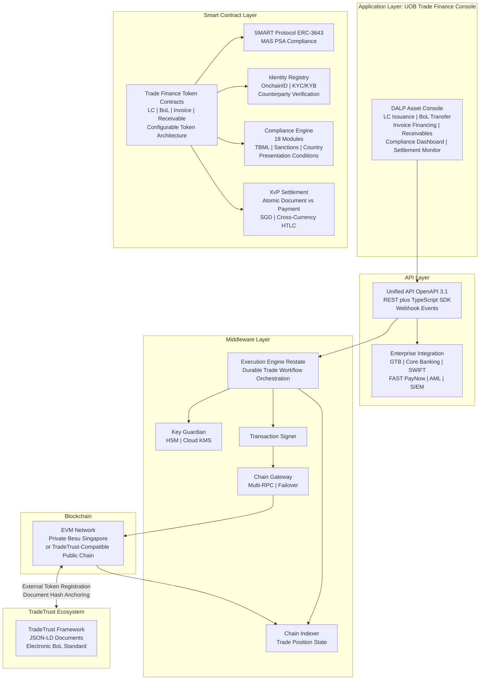

### 5.2 Trade Instrument Token Architecture

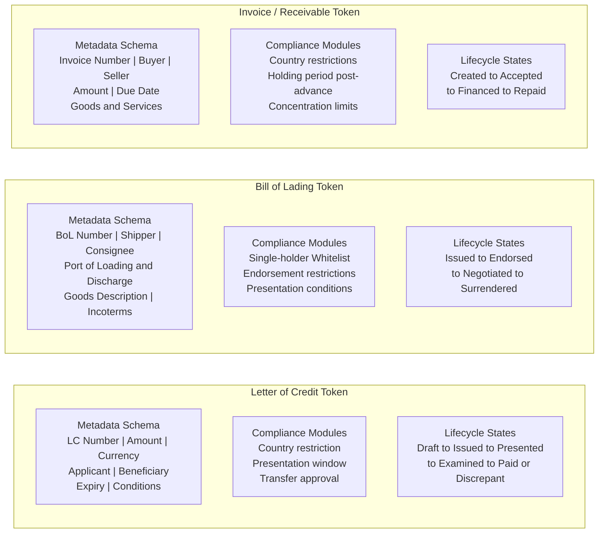

### 5.3 TradeTrust Integration Architecture

Singapore's TradeTrust framework, built on IMDA's Electronic Transferable Records (ETR) standards and the Model Law on Electronic Transferable Records (MLETR), establishes the legal and technical standards for electronic Bills of Lading in Singapore. UOB's digital trade finance platform must operate within this framework to participate in the broader Singapore trade ecosystem.

DALP's integration with TradeTrust operates through three mechanisms:

**Document Hash Anchoring:** TradeTrust BoLs are JSON-LD documents with a verifiable document hash. DALP anchors TradeTrust document hashes on its EVM network, creating an additional on-chain record of the document's existence and integrity. The DALP platform's on-chain position management tracks which address holds the TradeTrust BoL token.

**External Token Registration:** DALP's external token registration capability enables tokens created on other systems (including TradeTrust's registry) to be registered in DALP's identity and compliance framework. A TradeTrust BoL transferred through the TradeTrust ecosystem can be represented in DALP for financing purposes: UOB can advance against a TradeTrust BoL without requiring the trade parties to switch from TradeTrust to a DALP-native BoL.

**Native BoL Issuance:** For trade corridors where UOB has sufficient counterparty coverage, DALP issues native BoL tokens that are also compliant with TradeTrust's JSON-LD document standard, providing both the on-chain transfer mechanics and the TradeTrust-compatible document representation.

### 5.4 Multi-Party Network Architecture

UOB's trade finance operations involve multiple parties on any given trade: importer, exporter, shipping company, UOB as issuing bank, advising bank, negotiating bank, and potentially correspondent banks for trade corridors beyond Singapore. DALP's network architecture supports all these participants:

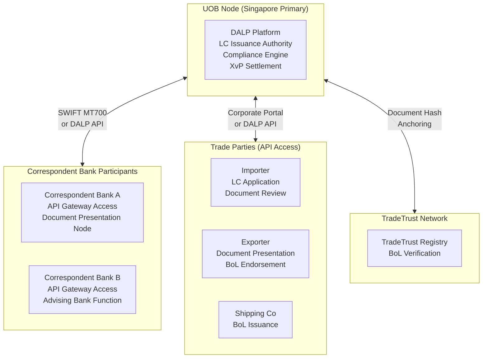

---

## 6. Asset Lifecycle Coverage

### 6.1 Letter of Credit Lifecycle

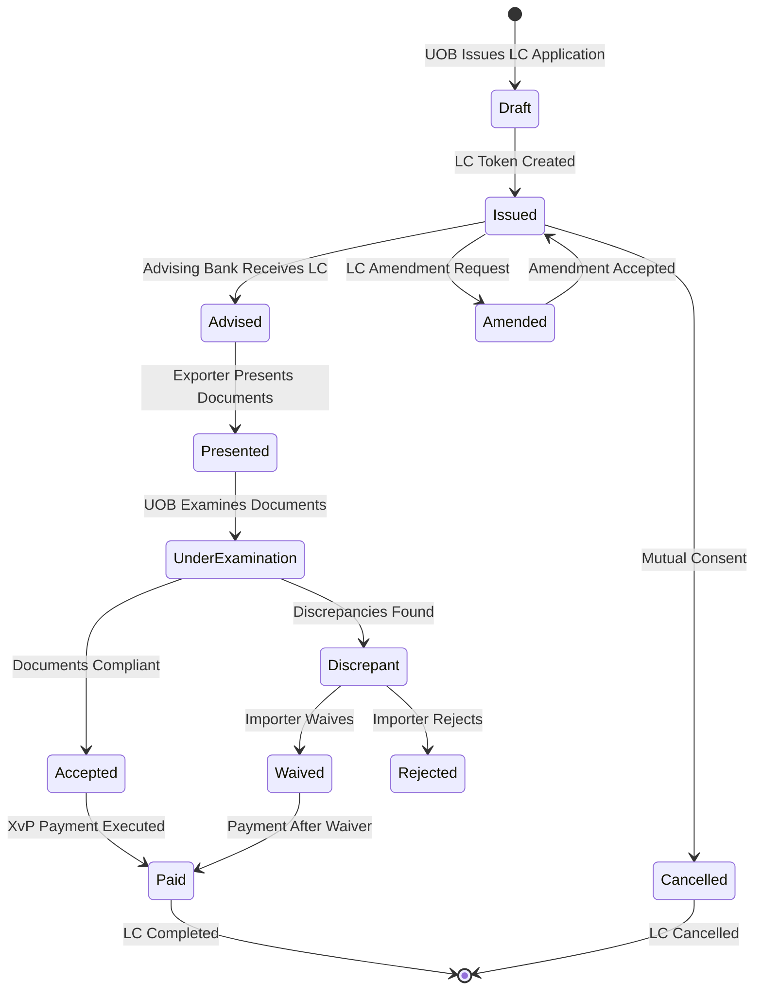

**LC Issuance Workflow:** When an UOB corporate client initiates an LC application, the UOB trade finance team configures the LC token on DALP: currency and amount (SGD or multi-currency), expiry date (enforced by the Time-based Rules compliance module), documents required, special conditions, and the beneficiary's OnchainID address. The LC enters Issued state with the presentation window active.

**Document Presentation and Examination:** When the beneficiary (exporter or their bank) presents complying documents, the presentation event is recorded on DALP. The Transfer Approval compliance module places the LC in an examination queue. The payment cannot execute until UOB's trade finance team completes the examination and confirms compliance. The 5 banking-day examination window is enforced by a time-lock configuration.

**Discrepancy Workflow:** If UOB's examination identifies discrepancies, the discrepancy notification is recorded on DALP with the specific discrepancy codes (aligned with ICC UCP 600 discrepancy codes). The importer's decision (waive or reject) is captured through the maker-checker workflow. If discrepancies are waived, the LC proceeds to payment. If rejected, the BoL and supporting documents are returned (represented by a token transfer back to the presenting party).

**XvP Payment on Acceptance:** Upon acceptance, DALP's XvP settlement module triggers the simultaneous SGD payment to the beneficiary and the transfer of the LC token to Paid state. Both complete atomically.

**LC Amendment Governance:** LC amendments require maker-checker approval in DALP. The amendment is proposed by the importer (through the corporate portal), reviewed by UOB's trade finance officer, and requires the beneficiary's acceptance before it takes effect. All amendment events are immutably recorded.

### 6.2 Bill of Lading Lifecycle

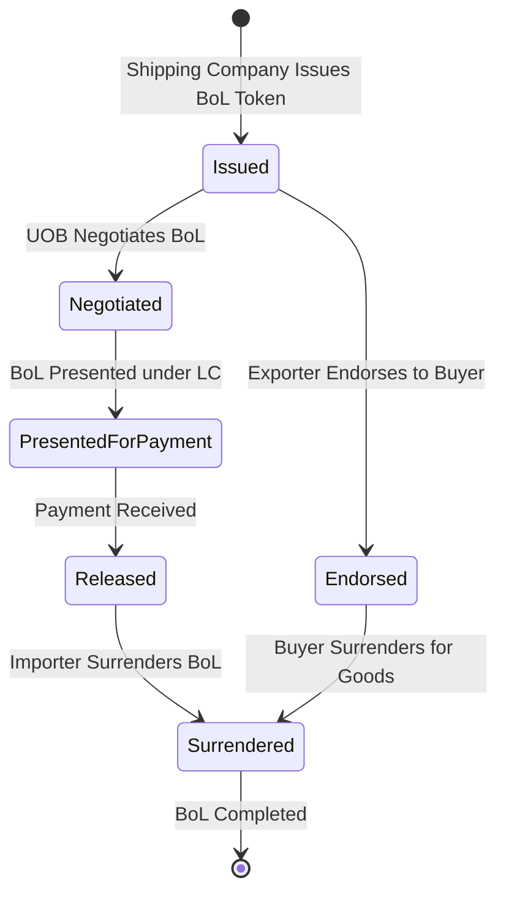

**Single-Original Enforcement:** DALP's Whitelist compliance module ensures that at any given time, only one address is listed as the effective holder of a BoL token. Transfer of the BoL requires removing the current holder from the whitelist and adding the new holder, an operation that requires the current holder's signing key and is executed as a single atomic transaction.

**Negotiation under LC:** When UOB negotiates a BoL under an LC, DALP records the negotiation event: the exporter's bank transfers the BoL token to UOB (or UOB's designated address for the trade); UOB simultaneously pays the negotiation amount; the XvP module ensures both transfer and payment complete atomically. UOB now holds the BoL as security.

**Financing Against BoL:** DALP's Settlement Lock module locks a BoL token while UOB advances financing against it, preventing the BoL from being transferred or released while the financing is outstanding. When financing is repaid, the lock is released automatically through the maturity redemption workflow.

**Endorsement Chain Record:** Every endorsement of a BoL is recorded as an immutable event on DALP. The complete endorsement chain (from original issuer through all intermediate holders to the final holder) is queryable through the Chain Indexer, providing an irrefutable audit trail of BoL custody. This endorsement chain record satisfies the evidentiary requirements for BoL financing disputes.

### 6.3 Invoice Financing Lifecycle

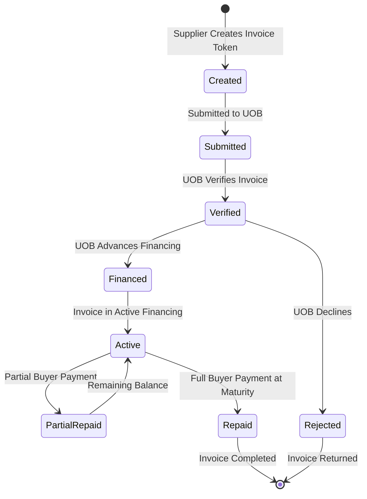

**Invoice Token Structure:** Invoice tokens capture: invoice number, buyer identity (OnchainID-verified), seller identity, invoice amount in SGD (or specified currency), due date, goods/services description, and payment terms. The buyer's acknowledgement of the invoice is captured as an on-chain event, creating an irrefutable record of buyer confirmation before financing advance.

**Concentration Limit Enforcement:** The Holding Limit compliance module enforces UOB's concentration limits for invoice financing exposure: no single buyer/supplier pair can account for more than a configured percentage of UOB's total invoice financing portfolio. This limit is evaluated automatically at each new financing advance.

**Maturity Processing:** At invoice maturity, DALP's maturity redemption workflow triggers the repayment sequence: buyer payment is received through the PayNow/FAST integration; the invoice token is updated to Repaid state; UOB's financing position is released; and the GL posting event is generated for core banking system integration.

### 6.4 Receivables Portfolio Management

For UOB's broader trade receivables portfolio, DALP provides portfolio-level visibility that traditional trade finance systems do not:

**Portfolio State View:** The Chain Indexer provides a real-time view of the entire receivables portfolio: outstanding financing positions by buyer, by corridor, by maturity bucket, and by currency. This view is accessible through DALP's API for integration into UOB's management reporting systems.

**Factoring Structures:** Multi-invoice factoring programmes (where UOB purchases a pool of supplier invoices against a single buyer) are supported through DALP's token grouping capability. A factoring pool token represents the aggregate of individual invoice tokens, with the pool-level financing tracked as a separate token and the individual invoice tokens as constituent elements.

**Secondary Market Capability:** DALP's Transfer Approval module supports the assignment of invoice financing positions to secondary purchasers (other banks or financial institutions), enabling UOB to manage portfolio concentration through secondary market assignment while maintaining the on-chain audit trail.

---

## 7. Compliance Architecture

### 7.1 MAS Payment Services Act Compliance

The Payment Services Act (PSA) establishes the regulatory framework for digital payment token services and e-money in Singapore. UOB's digital trade finance platform, to the extent it involves tokenised representations of payment obligations, operates within the PSA framework. DALP's compliance architecture addresses PSA requirements:

**Digital Payment Token Compliance:** Where DALP tokens representing LC payment obligations or invoice receivables constitute digital payment tokens under the PSA, DALP's compliance module configuration enforces MAS's transfer and holding restrictions for regulated instruments.

**AML/CFT:** MAS's AML/CFT requirements under the PSA require customer due diligence, transaction monitoring, and suspicious transaction reporting. DALP's pre-transfer compliance enforcement (with KYC/KYB verification mandatory for all token transfers) satisfies the pre-transaction due diligence requirement. Transaction monitoring integration connects to UOB's existing AML platform for ongoing monitoring.

### 7.2 MAS TRM Guidelines

MAS's Technology Risk Management Guidelines establish requirements for financial institutions' technology systems. DALP's architecture directly addresses TRM requirements:

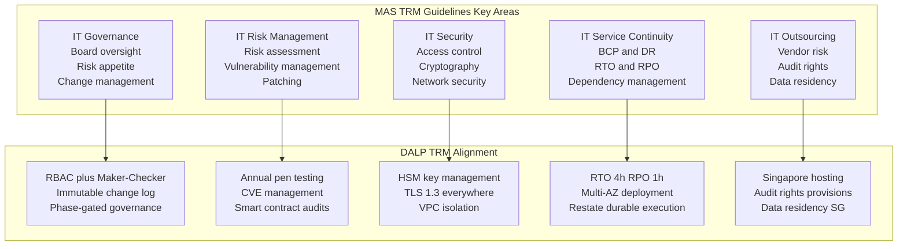

**IT Governance:** DALP's RBAC model, maker-checker governance, and immutable change log support UOB's IT governance framework by providing evidence of authorised changes, segregation of duties, and accountability at the individual user level.

**IT Risk Management:** SettleMint's vulnerability disclosure programme and critical patch SLA align with TRM's patching requirements. Annual penetration testing results are provided to UOB's IT Risk function.

**IT Security:** TRM's cryptographic requirements align with DALP's key management architecture (HSM-based key storage, TLS 1.3, VPC network isolation, multi-factor authentication for privileged access).

**IT Service Continuity:** DALP's multi-AZ deployment, Restate durable execution, and quantified RTO/RPO (4-hour/1-hour for managed cloud) provide the continuity documentation TRM requires.

**IT Outsourcing:** SettleMint's Singapore hosting (AWS ap-southeast-1), audit rights provisions, and ISO 27001 certification support UOB's TRM outsourcing compliance.

### 7.3 Trade-Based Money Laundering (TBML) Controls

Trade-based money laundering is a specific risk category in trade finance where the trade instrument (invoice, LC, BoL) is used to disguise money movement. MAS and FATF have issued specific guidance on TBML controls for banks engaged in trade finance.

**Document Verification Integration:** DALP integrates with UOB's trade document verification system to validate invoice values against market pricing benchmarks, detect over/under-invoicing patterns, and flag anomalies for compliance review. The verification result is attached to the trade token as a compliance event record.

**Beneficial Ownership Transparency:** DALP's Identity Registry enforces counterparty KYC/KYB for all parties to a trade transaction: buyer, seller, shipping company, and all endorsees of a BoL. Beneficial ownership information is captured at the OnchainID level.

**Sanctions Screening:** DALP's pre-transfer compliance enforcement invokes UOB's existing sanctions screening system for every counterparty identity before any trade instrument transfer. Sanctioned counterparties are blocked at the contract level.

**Country Restriction Enforcement:** DALP's Country Restriction compliance module blocks trade transactions involving jurisdictions subject to MAS-directed or OFAC/UN sanctions. The restricted jurisdiction list is configurable by UOB's compliance team without code changes.

### 7.4 Vietnam-China Cross-Border Corridor: Worked Example

UOB's ASEAN trade finance corridors include one of Asia's highest-volume bilateral trade routes: Vietnam to China. This corridor presents specific compliance challenges that illustrate DALP's compliance architecture in practice.

**Corridor Context:** A Vietnamese electronics manufacturer (exporter, beneficiary) ships goods to a Chinese electronics retailer (importer, applicant). UOB Singapore issues the LC on behalf of UOB Vietnam's correspondent relationship. A Bank of China correspondent in Singapore advises the LC to the Vietnamese beneficiary. The goods are shipped via the port of Ho Chi Minh City to the port of Guangzhou. Payment is in USD (not SGD).

**Compliance Configuration for This Corridor:**

*Country Restriction Module:* Vietnam and China are both permitted jurisdictions in DALP's Country Restriction configuration (no MAS-directed sanctions apply to either). However, DALP's Country Restriction module is configured with sub-jurisdiction controls: specific Chinese provinces or specific Vietnamese counterparties can be added to a restricted list based on UOB's risk appetite without removing the entire country from permitted status.

*Identity and KYB:* The Chinese importer (applicant) is onboarded through UOB's KYB platform, with the KYB result provisioned to DALP's OnchainID as an eligibility claim. The Vietnamese exporter (beneficiary) is onboarded through UOB Vietnam's correspondent KYB process, with the verified identity transmitted to DALP via the correspondent bank API integration.

*Multi-Currency Settlement:* Because payment is USD (not SGD), DALP's HTLC cross-chain settlement module handles the cross-currency leg. UOB's SGD/USD FX desk locks the FX rate at LC issuance; the HTLC ensures that the USD payment to the Vietnamese exporter and the SGD debit from the Chinese importer's LC margin account execute atomically.

*Presentation Window Enforcement:* The LC specifies a 21-day presentation window from the shipping date. DALP's Trading Window compliance module enforces this: document presentations received after the 21-day window are automatically rejected at the compliance layer, creating an irrefutable record of the rejection for LC dispute purposes.

*TBML Check:* The electronic goods in this shipment are a high-value, high-TBML-risk commodity category. DALP's TBML integration invokes UOB's pricing verification against Vietnamese electronics export price databases at the time of invoice creation. Anomalies exceeding a configured threshold (e.g., 15% deviation from benchmark pricing) are flagged to UOB's trade compliance queue before financing advance proceeds.

**Outcome:** The Vietnam-China corridor trade executes fully within DALP's compliance framework without corridor-specific customisation. UOB's compliance team configures the country permissions, TBML thresholds, and presentation windows through the Compliance Dashboard; the smart contract enforces these parameters for every trade in this corridor.

### 7.5 Project Guardian Alignment

MAS's Project Guardian has produced published findings that directly inform UOB's digital trade finance architecture requirements:

**Institutional-Grade Compliance at Protocol Layer:** Project Guardian's industry pilots confirmed that institutional digital asset platforms require compliance enforcement at the token protocol level. DALP's ERC-3643 implementation directly addresses this finding.

**Interoperability as a First-Class Requirement:** Project Guardian's findings emphasise that tokenised asset platforms must be interoperable with other platforms and networks. DALP's architecture, supporting external token registration, TradeTrust integration, and HTLC cross-chain settlement, is designed for interoperability.

**Atomic Settlement for Trade Efficiency:** Project Guardian's FX settlement pilots demonstrated that atomic settlement materially reduces counterparty risk and settlement fails. DALP's XvP module implements this pattern for UOB's trade finance settlement.

### 7.6 Regulatory Mapping Table

| Regulatory Requirement | Regulation | DALP Control | Confidence |
|---|---|---|---|
| Digital payment token compliance | MAS PSA | Compliance engine for tokenised payment obligations | 🟢 Native |
| AML/CFT pre-transaction CDD | MAS AML/CFT Requirements | KYC/KYB-backed identity verification; pre-transfer screening | 🟢 Native |
| AML/CFT transaction monitoring | MAS AML/CFT Requirements | AML integration hook; monitoring event export | 🟡 Partial (external system) |
| Sanctions screening | MAS Guidelines; UN/OFAC | Country Restriction plus Blacklist modules; pre-transfer API hook | 🟢 Native |
| TBML controls | MAS TBML guidance | Document verification integration; beneficial ownership capture | 🟡 Partial (integration) |
| IT Governance | MAS TRM Guidelines | RBAC; maker-checker; immutable change log | 🟢 Native |
| IT Security | MAS TRM Guidelines | HSM; TLS 1.3; VPC isolation; ISO 27001 | 🟢 Native |
| IT Service Continuity | MAS TRM Guidelines | Multi-AZ; RTO 4h; RPO 1h; DR testing | 🟢 Native |
| IT Outsourcing | MAS TRM Guidelines | Singapore hosting; audit rights; ISO 27001 | 🟢 Native |
| Cyber Hygiene (10 controls) | MAS Notice 644 | All 10 controls documented in Section 11 | 🟢 Native |
| Data residency | MAS Technology Risk | AWS ap-southeast-1 deployment | 🟢 Native |
| Single-original BoL | Electronic Transactions Act; TradeTrust | Whitelist single-holder enforcement | 🟢 Native |
| Electronic transferable records | Singapore ETA; MLETR | TradeTrust-compatible document model | 🟡 Partial (framework integration) |
| Smart contract change governance | MAS TRM implicit | RBAC; maker-checker for all contract changes | 🟢 Native |

---

## 8. Integration Architecture

### 8.1 UOB Enterprise Integration Overview

```mermaid
graph TB
    subgraph UOB["UOB Enterprise Systems"]
        GTB["Global Trade Banking GTB\nLC Processing | BoL Management\nTrade Document Workflows"]
        CBS["Core Banking System\nAccount Positions | GL\nCustomer Records"]
        SWIFT["SWIFT Correspondent Banking\nMT700 and MT760 LCs\nISO 20022 Migration"]
        FAST["FAST PayNow\nSGD Instant Payment\nReal-Time Confirmation"]
        AML["AML Sanctions Platform\nWorldCheck | Internal Screening"]
        KYC["KYB System\nCounterparty Verification\nBeneficial Ownership"]
        SIEM["SIEM SOC\nSecurity Monitoring"]
        REP["MAS Regulatory Reporting\nPSA Reports | AML Reports"]
        DWH["Data Warehouse\nManagement Reporting\nTrade Analytics"]
    end
    subgraph DALP["DALP Platform"]
        API["Unified API plus Webhooks"]
        IDX["Event Indexer"]
        OBS["Observability"]
    end
    subgraph External["External Ecosystems"]
        TRADETRUST["TradeTrust Framework"]
        CORR["Correspondent Banks\nLC Issuing and Advising"]
    end

    GTB <-->|"LC and BoL lifecycle sync\nDocument event triggers"| API
    CBS <-->|"Account positions | GL posting"| API
    SWIFT <-->|"MT700 to DALP LC\nISO 20022 migration"| API
    FAST <-->|"SGD payment instructions\nConfirmation events"| API
    AML <-->|"Pre-transfer screening\nSTR data export"| API
    KYC <-->|"KYB verification | Identity claims"| API
    SIEM <-->|"Security events | Audit logs"| OBS
    REP <-->|"Trade event data export"| IDX
    DWH <-->|"Transaction analytics"| IDX
    TRADETRUST <-->|"Document hash anchoring\nExternal token registration"| API
    CORR <-->|"SWIFT MT700 or DALP API\nCorrespondent LC handling"| API
```

### 8.2 GTB Integration

UOB's Global Trade Banking (GTB) system is the primary application layer for trade finance operations. DALP integrates with GTB as follows:

**LC Lifecycle Synchronisation:** LC events in DALP (issuance, presentation, examination outcome, payment) trigger webhook notifications to GTB's API. GTB maintains the customer-facing LC record; DALP provides the blockchain-based compliance enforcement and atomic settlement layer. LC data enters DALP from GTB at issuance (configuration data) and returns to GTB as event records (for customer-facing status updates and regulatory reporting).

**BoL Management:** BoL tokens created in DALP are linked to the corresponding GTB trade transaction record through a unique transaction reference. BoL transfer events in DALP trigger GTB updates.

**Document Workflow Triggers:** GTB's examination workflow (the 5-day examination clock, discrepancy management, waiver processing) is mirrored in DALP's Transfer Approval compliance workflow. When a GTB user approves or rejects a presentation in GTB, the decision is reflected in DALP's compliance state through the GTB integration API.

**Data Consistency:** DALP does not replace GTB as the trade finance system of record for UOB's customer-facing processes. The two systems maintain synchronised state through event-driven webhooks. If a synchronisation event fails (network interruption, API timeout), Restate's durable execution retries the webhook delivery with exponential backoff, ensuring no lost events.

### 8.3 SWIFT Integration

UOB issues and handles LCs through the SWIFT network using MT700 (LC issuance) and MT760 (LC amendment) message types.

**MT700 to DALP LC Token:** When UOB receives an MT700 from a correspondent bank, DALP's SWIFT integration parses the MT700 field structure and creates a corresponding DALP LC token with the LC parameters mapped to the token's metadata schema. This enables UOB to maintain SWIFT connectivity with traditional banking counterparties while operating the underlying compliance and settlement layer on DALP.

**ISO 20022 Migration Path:** As the trade finance industry migrates to ISO 20022 trade finance message standards, DALP's ISO 20022 integration layer handles the new message formats. UOB's SWIFT connectivity team works with DALP's integration team to configure the message mapping during Phase 3 of the implementation.

**Outbound SWIFT Messages:** DALP generates SWIFT message triggers for outbound LC notifications: MT710 (advised LC to beneficiary's bank), MT730 (acknowledgement of LC advice), and MT734 (notification of refusal of documents). These message generation events are triggered by DALP workflow state transitions and passed to UOB's SWIFT gateway.

### 8.4 FAST and PayNow Integration

**LC Payment via FAST/PayNow:** On LC payment trigger (acceptance of compliant documents), DALP's XvP module generates a FAST payment instruction for the SGD amount to the beneficiary's PayNow-registered account. Payment confirmation from the FAST network triggers the LC token's state update to Paid in DALP.

**Invoice Financing Advance via PayNow:** Invoice financing advances are disbursed through PayNow to the supplier's account. The advance triggers the invoice token's state update to Financed and activates the Settlement Lock.

**DvP Settlement for Institutional Counterparties:** For institutional counterparties (correspondent banks, trading companies), DvP settlement uses Singapore's RTGS (MAS MEPS+) via ISO 20022 instructions rather than PayNow, providing the settlement certainty and amount limits appropriate for wholesale trade finance transactions.

**Payment Failure Handling:** If a FAST payment instruction fails (e.g., payee account closed, payment limit exceeded), Restate captures the failure event and routes it to the trade finance operations team for manual resolution. The BoL or LC token remains in its pre-payment state (with the Settlement Lock applied) until the payment is resolved, preventing the document from being released without payment.

### 8.5 AML and KYB Integration

**Pre-Transaction Screening:** DALP invokes UOB's AML and sanctions screening platform (integrated via API) for every counterparty identity at onboarding and before each trade instrument transfer.

**TBML Pattern Detection:** For invoice financing, DALP's document verification integration connects to UOB's TBML detection platform, checking invoice values against pricing databases to identify over/under-invoicing patterns. Flagged invoices are routed to UOB's trade compliance team before financing advance proceeds.

**KYB Refresh:** OnchainID identity claims have configurable expiry periods. When a counterparty's KYB verification approaches expiry, DALP generates a renewal alert through the compliance dashboard and the monitoring integration. Counterparties with expired KYB verification cannot receive trade instrument transfers until KYB is renewed. This mechanism ensures ongoing compliance without requiring manual tracking of KYB renewal schedules.

### 8.6 Correspondent Bank Participation Model

UOB's trade finance business includes a significant correspondent banking component: UOB Singapore issues LCs on behalf of regional correspondent banks whose clients are the importers (applicants), and UOB advises LCs issued by correspondent banks for Vietnamese and other ASEAN exporters (beneficiaries). DALP's correspondent bank participation model addresses this multi-bank structure.

**Model A: SWIFT-Connected Correspondent (Traditional):** Correspondent banks that operate exclusively through SWIFT continue to participate via MT700/MT760 messages. DALP's SWIFT integration creates the corresponding DALP LC token when UOB receives the MT700. The correspondent bank has no direct DALP interface; they interact through SWIFT as today. UOB's DALP platform handles the on-chain compliance enforcement and settlement; the correspondent bank sees the outcome through standard SWIFT notifications.

**Model B: API-Connected Correspondent (Digital):** Correspondent banks that have agreed to participate in UOB's digital trade finance network are onboarded as API-connected participants. They receive a DALP API key scoped to their specific counterparty relationship with UOB. They can: submit LC applications through the DALP API (which creates the LC token directly without a SWIFT intermediary step); receive document presentation notifications through webhook; and confirm examination decisions through the API. This model eliminates the SWIFT round-trip for correspondent-initiated LCs and provides the correspondent bank with real-time visibility into their LC portfolio.

**Model C: Document Presenter Only:** For correspondent banks that do not want full platform integration but need to present documents under UOB-issued LCs, DALP provides a secure document presentation portal. The presenting bank receives a time-limited, transaction-scoped access credential and uploads documents against a specific LC reference. The documents are hashed, timestamped, and linked to the DALP LC token as a presentation event. UOB's examination team then reviews the documents within the DALP examination workflow.

**Correspondent Onboarding:** Each correspondent bank participating in Models B or C is onboarded to DALP's Identity Registry as a Trusted Issuer. Their institution's OnchainID is provisioned with: the correspondent bank identifier, their permitted SWIFT BIC, their permitted LC issuance authority (if any), and their document presentation scope. Correspondent bank onboarding is a Phase 3 activity performed by UOB's correspondent banking team with DALP configuration support.

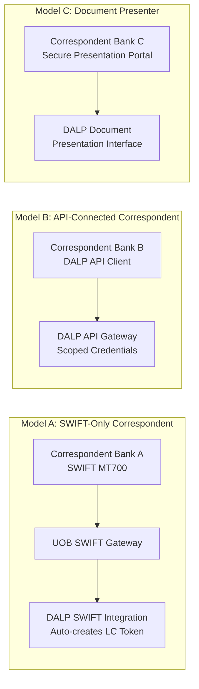

---

## 9. Custody and Key Management

### 9.1 Key Management for UOB Trade Finance

UOB's trade finance operations require a key management architecture that balances security (protecting the signing keys that control LC payment triggers and BoL transfers) with operational speed (trade finance decisions have tight document examination windows).

**Production Keys (HSM):** All production signing keys for UOB's digital trade finance platform are managed through FIPS 140-2 Level 3 certified HSM hardware. The Key Guardian provides a synchronous signing path with sub-second response times.

**Governance Keys (Fireblocks):** Compliance module governance keys, controlling sanctions list updates, country restriction updates, and emergency pause, are managed through Fireblocks institutional custody. These changes are infrequent but high-impact; Fireblocks' transaction policy controls and multi-party approval provide the governance oversight appropriate for compliance rule changes.

**Key Hierarchy:**

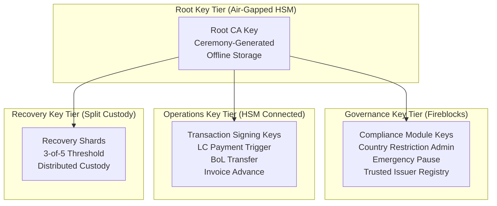

### 9.2 Trade Finance Maker-Checker

| Operation | Maker | Checker | Quorum |
|---|---|---|---|
| LC issuance | Trade Finance Officer | Trade Finance Manager | 2-of-2 |
| LC payment trigger (acceptance) | Trade Finance Examiner | Trade Finance Team Lead | 2-of-2 |
| BoL financing advance | Credit Officer | Credit Manager | 2-of-2 |
| Discrepancy waiver | Trade Finance Manager | Head of Trade Finance | 2-of-2 |
| Sanctions country restriction update | Compliance Analyst | Head of Compliance | 2-of-2 |
| Correspondent bank onboarding | Trade Finance Manager | CISO delegate | 2-of-2 |
| LC amendment approval | Trade Finance Officer | Trade Finance Manager | 2-of-2 |
| Emergency LC suspension | Any authorised officer | N/A (single) | 1-of-N |
| Emergency platform pause | Any authorised officer | N/A (single) | 1-of-N |
| Trusted issuer change | CTO delegate | CISO delegate | 2-of-3 |

---

## 10. Settlement and Operations

### 10.1 XvP Settlement for Trade Finance

DALP's XvP (Exchange-versus-Payment) settlement module provides the atomic settlement mechanics that eliminate counterparty risk in trade finance. For UOB's digital trade finance platform, two settlement models apply:

**Document-versus-Payment (DvP) for BoLs:** When UOB negotiates a BoL under an LC, the BoL token transfer to UOB and the payment to the exporter's account execute atomically.

**Payment-versus-Payment (PvP) for Cross-Currency:** For trade finance involving SGD LCs covering goods priced in USD or regional currencies, DALP's HTLC cross-chain settlement provides PvP exchange: the SGD payment and the USD (or other currency) receipt execute atomically through cryptographic locking. This eliminates the FX settlement risk that exists when SGD and USD legs of a trade settle at different times.

```mermaid
sequenceDiagram
    participant Exporter
    participant UOB
    participant Compliance as Compliance Engine
    participant Settlement as XvP Settlement
    participant PayNow as FAST PayNow
    participant Importer

    Exporter->>UOB: Present BoL and compliant documents
    UOB->>Compliance: Verify presentation compliance
    Compliance-->>UOB: Documents compliant within window
    UOB->>Settlement: Create DvP settlement BoL token plus SGD payment
    Settlement-->>UOB: Settlement ID; BoL token locked
    UOB->>Importer: Notify acceptance; request payment confirmation
    Importer->>PayNow: Instruct SGD payment to Exporter
    PayNow-->>UOB: Payment confirmed
    UOB->>Settlement: Execute atomic settlement
    Settlement->>Exporter: Transfer SGD payment
    Settlement->>UOB: Transfer BoL token now held by UOB
    Settlement-->>UOB: Both legs confirmed; settlement complete
    UOB->>CBS: GL posting BoL acquired plus SGD disbursed
    UOB->>Exporter: Confirm settlement complete
```

### 10.2 Cross-Currency HTLC Settlement

For trade corridors where the invoice or LC is denominated in a currency other than SGD (for example, USD for Vietnam-China corridor goods priced in USD), DALP's HTLC cross-chain settlement provides atomically locked exchange:

```mermaid
sequenceDiagram
    participant UOB as UOB Singapore
    participant FX as UOB FX Desk
    participant HTLC as HTLC Contract
    participant BenefBank as Beneficiary Bank
    participant Exporter

    UOB->>FX: Lock SGD/USD rate at LC issuance
    UOB->>HTLC: Create HTLC with hashlock H
    HTLC-->>UOB: HTLC ID; SGD locked
    UOB->>BenefBank: Share hashlock H via secure channel
    BenefBank->>HTLC: Confirm USD payment readiness; reveal preimage P
    HTLC-->>BenefBank: USD released to Exporter via BenefBank
    HTLC-->>UOB: SGD released from UOB FX position; settled
    UOB->>UOB: GL posting FX settled; LC paid
```

### 10.3 Operational Dashboards for Trade Finance

**LC Operations Dashboard:** Active LC pipeline with status per stage. Examination queue with deadline countdown per LC. Upcoming LC expiries. Amendment queue. Daily LC volume metrics. Discrepancy rate by corridor and counterparty.

**BoL and Financing Dashboard:** Active BoL position register with holder information. Outstanding invoice financing positions with maturity dates. Concentration limit utilisation by buyer. Financing advance queue with credit approval status. Secondary market assignment pipeline.

**Settlement Monitor:** Pending XvP settlement transactions with counterparty confirmation status. FAST/PayNow instruction status. Failed settlement exceptions with revert confirmation status. Cross-currency HTLC settlement status. Average settlement time by corridor.

**Compliance Dashboard:** Sanctions screening alert queue. TBML flag queue. Counterparty KYB expiry alerts. Country restriction updates pending approval. Presentation window breach alerts.

---

## 11. Security Architecture

### 11.1 MAS TRM Aligned Security

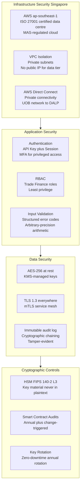

### 11.2 MAS Notice 644 (Cyber Hygiene) Full Alignment Table

MAS Notice 644 establishes 10 baseline cybersecurity controls that all MAS-regulated financial institutions must implement. As a material IT service provider to UOB, DALP's architecture is documented against all 10 controls. SettleMint provides MAS-formatted evidence documentation for each control as part of UOB's MAS IT examination preparation.

| Control No. | MAS Notice 644 Control | DALP Implementation | Evidence Available | Confidence |
|---|---|---|---|---|
| 1 | Restrict administrative privileges to users who have a business need for it and must monitor privileged access | RBAC with 5 defined roles; privileged access requires multi-party approval through Fireblocks; all privileged sessions are logged immutably to the Chain Indexer audit trail; time-bound elevated access for emergency operations; quarterly privilege review process documented | Access control policy; RBAC configuration export; privileged session logs | 🟢 Native |
| 2 | Apply software patches where applicable within 14 days for critical patches | Critical patches applied within CERT-equivalent SLA timelines; platform updates follow a staged deployment (development, staging, production) with UOB approval gate; patch delivery dashboard available via the support portal; emergency out-of-band patching procedure for zero-day vulnerabilities | Patch management policy; patch delivery records; SettleMint emergency patch SOP | 🟢 Native |
| 3 | Deploy anti-malware software to detect and remove malicious software on all applicable IT systems | Application deployed in hardened OCI-compliant containers from a signed, immutable container registry; no untrusted code execution paths in the application runtime; smart contract audit prevents malicious contract deployment; container image scanning in CI/CD pipeline; runtime container security monitoring | Container security policy; image scanning reports; smart contract audit reports | 🟢 Native |
| 4 | Deploy network perimeter defence to detect and prevent unauthorised network traffic | WAF configured for OWASP Top 10 protections; VPC with private subnets for application and data tiers; no public IP addresses for any non-load-balancer resource; DDoS protection (AWS Shield); security group rules enforce strict tier-to-tier communication policy; network traffic analysed for anomalies | WAF configuration; VPC architecture diagram; security group rules export; DDoS protection evidence | 🟢 Native |
| 5 | Implement Multi-Factor Authentication (MFA) for access to systems that contain customer data or privileged functions | MFA is mandatory for all privileged administrative access to the DALP platform; hardware MFA tokens required for key management operations (HSM access, Fireblocks governance key operations); application-level session management requires step-up MFA for high-impact trade operations (LC payment trigger, BoL release) | MFA policy; MFA configuration evidence; session management specifications | 🟢 Native |
| 6 | Implement virtual patching capabilities to counter exploitation of publicly known vulnerabilities where quick remediation is not possible | WAF virtual patching rules are updated when new CVEs are published, providing application-layer protection while permanent patches are prepared; WAF ruleset is maintained by SettleMint's security team and updated within 24 hours of critical CVE publication; virtual patch effectiveness is reviewed at each monthly security review | WAF virtual patching policy; ruleset update records; CVE response timeline evidence | 🟢 Native |
| 7 | Restrict administrative access to IT systems by establishing control over system administration or privileged actions | All production administrative access (Kubernetes cluster, database, HSM console) requires: time-limited approval through change management workflow; multi-party authorisation for sensitive operations; recording of full session via privileged access management tooling; automatic session termination after inactivity timeout | PAM tool configuration; access request and approval records; session recording evidence | 🟢 Native |
| 8 | Implement application whitelisting on servers to prevent unauthorised software from executing | Container registry configured to allow only signed, audited container images; DALP's Kubernetes deployment policy (PodSecurityAdmission) blocks any container not from the approved registry; smart contract deployment requires multi-party approval and audit sign-off; no ability to execute arbitrary code in the production environment | Container registry policy; image signing configuration; Kubernetes admission controls | 🟢 Native |
| 9 | Segment networks to prevent unauthorised access to critical IT systems | Three-tier network segmentation: public-facing load balancer in DMZ subnet; application tier in private subnet with no internet route; data tier (database, HSM) in isolated private subnet with no access from application tier except through defined internal service APIs; blockchain node network in separate VPC with peering only to signer service | VPC architecture diagram; subnet and security group configuration; network segmentation evidence | 🟢 Native |
| 10 | Maintain system availability and ensure recovery of critical IT systems in accordance with established Recovery Time Objective (RTO) and Recovery Point Objective (RPO) | Multi-AZ deployment ensures no single availability zone failure can cause an outage; Restate durable execution engine persists workflow state across restarts; RTO 4 hours (managed cloud); RPO 1 hour; annual DR test with documented results; automated failover for stateless application tier; point-in-time recovery for database tier | DR policy; RTO/RPO documentation; annual DR test report; multi-AZ architecture diagram | 🟢 Native |

All 10 MAS Notice 644 baseline controls are natively supported by DALP's architecture. Evidence packs for each control are prepared during Phase 4 (Testing) of the implementation in advance of UOB's MAS IT examination preparation.

### 11.3 Penetration Testing and Smart Contract Security

**Penetration Testing:** Annual independent penetration testing with scope covering the API surface, application layer, network perimeter, key management, and smart contract interfaces. UOB's IT Risk team receives the full penetration testing report. Critical findings are remediated before production deployment. For UOB's initial go-live, a pre-production penetration test is scheduled in Phase 4.

**Smart Contract Security:** All DALP smart contracts are audited by specialised blockchain security firms. For UOB's trade finance deployment, additional audit focus is placed on: the Transfer Approval workflow (the mechanism that triggers LC payment), the XvP settlement contract (the mechanism that executes atomic BoL plus payment), and the configurable compliance engine. Audit reports are provided to UOB's technical due diligence team.

**Incident Response:** DALP's incident response procedure includes: automated alerting for anomalous transaction patterns (volume spikes, unusual compliance overrides); SIEM integration for security event forwarding to UOB's SOC; defined escalation path to SettleMint's on-call security team; and a 72-hour post-incident report for MAS-reportable incidents.

---

## 12. Deployment Options

### 12.1 Recommended: AWS ap-southeast-1 (Singapore)

SettleMint recommends deployment in a dedicated cloud environment in AWS ap-southeast-1 (Singapore), the same region as MAS's data residency guidance for Singapore-regulated institutions.

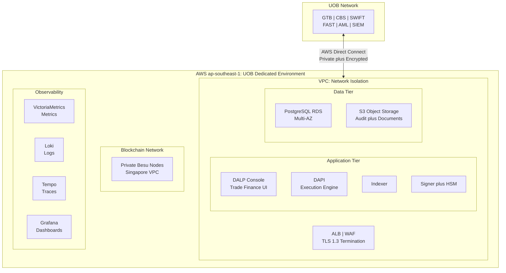

**Environment Architecture:**
- Production: EUR 300,000/year, live trade finance operations
- Development: EUR 120,000/year, integration development, testing, UAT

### 12.2 High Availability Configuration

The production environment uses multi-AZ deployment across two Singapore availability zones. The application tier (stateless) is deployed across both AZs with automatic load balancing failover. The database tier (stateful) uses RDS Multi-AZ with synchronous standby replication, ensuring RPO of 1 hour in a zone-failure scenario. The blockchain nodes (Besu) run across both AZs with consensus maintained across the node cluster.

If a single AZ experiences a failure, the following occurs automatically: load balancer routes all traffic to the healthy AZ; RDS promotes the standby to primary; Besu consensus continues on the nodes in the healthy AZ (consensus threshold still met). Recovery to full multi-AZ capacity requires no manual intervention and completes within 4 hours (RTO).

---

## 13. Implementation Approach

### 13.1 Programme Timeline

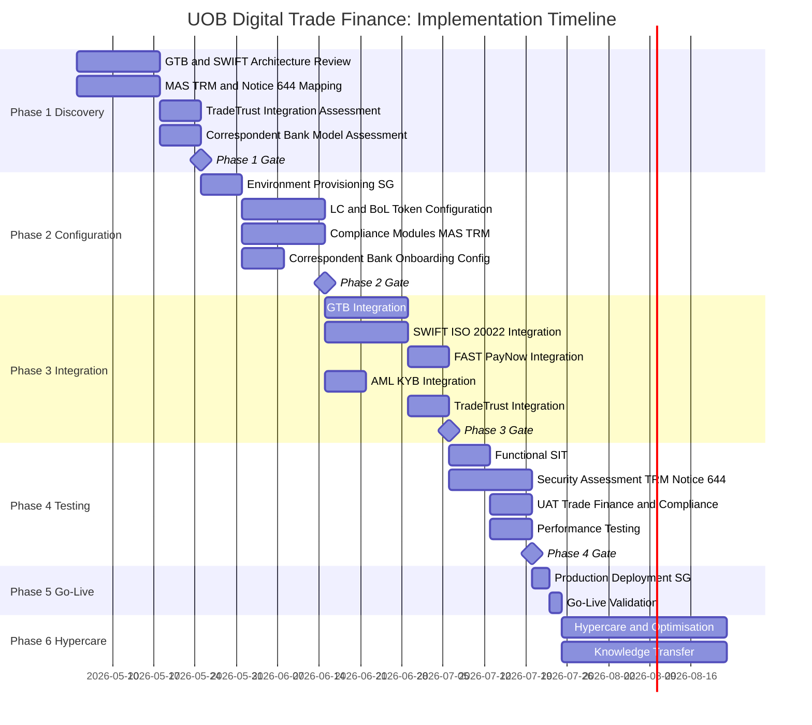

### 13.2 Full RAID Register

**Risks:**

| RAID-ID | Type | Item | Likelihood | Impact | Owner | Mitigation |
|---|---|---|---|---|---|---|
| R-001 | Risk | PSA digital payment token classification for LC payment tokens | Medium | High | UOB Legal | Phase 1 legal assessment; DALP's architecture supports both PSA-regulated and exempted token structures |
| R-002 | Risk | GTB API complexity and documentation quality | Medium | High | UOB GTB Team | Phase 1 GTB API assessment; alternative batch integration fallback; UOB GTB team involvement from Phase 1 kickoff |
| R-003 | Risk | TradeTrust ecosystem participant coverage in target trade corridors | Medium | Medium | SettleMint Integration | Phase 1 TradeTrust corridor assessment; native BoL issuance works without TradeTrust participant requirement as fallback |
| R-004 | Risk | MAS TRM security assessment identifies gaps pre-go-live | Low | High | SettleMint Security | Phase 2 TRM alignment validation; Phase 4 security assessment with remediation buffer in programme; Notice 644 controls pre-validated |
| R-005 | Risk | SWIFT ISO 20022 migration timeline conflicts | Low | Low | SettleMint Integration | DALP supports both MT and ISO 20022; MT migration timeline is a SWIFT network deadline, not a DALP dependency |
| R-006 | Risk | Trade finance operations team change management resistance | Medium | Medium | UOB HR and Operations | Role-based training in Phase 6; train-the-trainer model; comprehensive runbooks; early operations team involvement in UAT |
| R-007 | Risk | TBML platform API compatibility | Medium | Medium | UOB Compliance Tech | Phase 1 TBML API assessment; alternative manual review workflow as fallback pending API integration |
| R-008 | Risk | Correspondent bank willingness to participate in digital model | Medium | Medium | UOB Correspondent Banking | Phase 1 corridor assessment; hybrid Model A (SWIFT-only) supports non-DALP correspondents without requiring them to change |
| R-009 | Risk | High LC examination volume during peak trade periods | Low | Medium | SettleMint Platform | Performance testing at 2x anticipated peak volume; auto-scaling configuration for application tier |
| R-010 | Risk | Currency hedging for EUR-denominated license fees | Low | Low | UOB Treasury | UOB treasury manages SGD/EUR FX; DALP license is fixed EUR amount with no in-term escalation |
| R-011 | Risk | HSM connectivity latency affecting examination window operations | Low | High | SettleMint Infrastructure | HSM deployed in same AWS AZ as application tier; sub-second signing latency verified in pre-production performance test |
| R-012 | Risk | KYB data quality for counterparties in emerging ASEAN markets | Medium | Medium | UOB KYB Team | Phase 1 KYB data assessment for priority corridors; exception handling workflow for incomplete KYB profiles |
| R-013 | Risk | Smart contract upgrade governance complexity post-go-live | Low | Medium | SettleMint Engineering | Smart contract upgrade procedure documented and tested in Phase 4; maker-checker governance for all production contract changes |
| R-014 | Risk | AWS ap-southeast-1 regional outage (all AZs) | Very Low | High | AWS | Cross-region DR in AWS ap-east-1 (Hong Kong) available as optional add-on; RTO extended to 8h for cross-region failover |
| R-015 | Risk | Regulatory change (new MAS PSA requirements for trade finance tokens) | Low | Medium | UOB Legal | Configuration-driven compliance engine enables regulatory updates without smart contract redeployment in most cases; annual compliance review built into support contract |

**Assumptions:**

| RAID-ID | Type | Item | Impact if Incorrect |
|---|---|---|---|
| A-001 | Assumption | GTB API is RESTful or SOAP with available documentation and sandbox | Delayed Phase 3 timeline; requires batch file-based integration as fallback |
| A-002 | Assumption | UOB provides dedicated Phase 1 access to GTB, SWIFT, and AML technical architects | Phase 1 discovery cannot complete on schedule without subject matter expert access |
| A-003 | Assumption | FAST/PayNow connectivity is accessible through UOB's existing payments infrastructure | SettleMint does not connect directly to FAST/PayNow; UOB's payments team provides the connectivity |
| A-004 | Assumption | KYB verification covers all initially targeted trade counterparties | New counterparties require KYB completion before their first DALP trade; pipeline KYB process required |
| A-005 | Assumption | MAS TRM security assessment scope is agreed in advance | Out-of-scope findings delay Phase 4 gate |

**Issues:**

| RAID-ID | Type | Item | Priority | Owner | Resolution |
|---|---|---|---|---|---|
| I-001 | Issue | TradeTrust JSON-LD schema version compatibility to be confirmed | Medium | SettleMint Integration | Resolve in Phase 1 technical assessment; TradeTrust v3 and v4 schemas both supported |
| I-002 | Issue | SWIFT SLA message types for DALP-originated notifications to be mapped | Medium | SettleMint Integration | SWIFT message mapping workshop scheduled in Phase 1 |

**Dependencies:**

| RAID-ID | Type | Item | Dependency Owner | Required By |
|---|---|---|---|---|
| D-001 | Dependency | GTB API documentation and sandbox access | UOB GTB Team | Phase 1 Week 1 |
| D-002 | Dependency | SWIFT connectivity credentials and test environment | UOB SWIFT Team | Phase 3 Week 1 |
| D-003 | Dependency | FAST/PayNow API access through UOB payments platform | UOB Payments Team | Phase 3 Week 2 |
| D-004 | Dependency | AML platform API access for pre-transfer screening integration | UOB AML Team | Phase 3 Week 1 |
| D-005 | Dependency | KYB platform API access for identity claims provisioning | UOB KYB Team | Phase 3 Week 1 |
| D-006 | Dependency | AWS Direct Connect provisioned to UOB's Singapore network | UOB Infrastructure Team | Phase 2 Week 1 |
| D-007 | Dependency | SIEM API access for security event forwarding | UOB SOC Team | Phase 4 Week 1 |
| D-008 | Dependency | UAT trade finance team availability and test cases | UOB Trade Finance Operations | Phase 4 Week 2 |
| D-009 | Dependency | MAS TRM IT examination scope agreed with UOB InfoSec | UOB InfoSec | Phase 4 Week 1 |
| D-010 | Dependency | Correspondent bank API onboarding approvals for Model B participants | UOB Correspondent Banking | Phase 3 Week 3 |

### 13.3 Resource Model

| Role | Engagement | Responsibility |
|---|---|---|
| Delivery Lead | Full programme | Programme governance; UOB senior interface |
| Solution Architect (Singapore/MAS specialist) | Phases 1 to 4 | MAS TRM alignment; TradeTrust integration; SWIFT architecture |
| Platform Engineer | Phases 2 to 5 | Environment provisioning; token configuration; Singapore deployment |
| Integration Engineer | Phases 3 to 4 | GTB, SWIFT, FAST/PayNow, AML integrations |
| QA / Test Lead | Phases 3 to 4 | SIT; MAS TRM security assessment coordination; UAT |
| Security Engineer | Phase 4 | MAS Notice 644 evidence pack; penetration test coordination |
| Support Engineer | Phases 5 to 6 | Go-live support; hypercare; knowledge transfer |

---

## 14. Support and SLA

### 14.1 Premium Support Recommendation

SettleMint recommends Premium Support for UOB's digital trade finance platform, with an upgrade path to Enterprise Support as the programme scales to multi-corridor, high-volume operations.

**Premium Support provides:**
- Extended hours: 07:00 to 22:00 CET; P1 on-call weekends
- Dedicated Slack channel; named support engineer
- P1 response: 1 hour; resolution: 4 hours
- P2 response: 4 hours; resolution: 8 hours
- 99.95% monthly uptime SLA
- Monthly technical business review

**Severity Classification for Trade Finance:**

| Severity | Definition | Examples |
|---|---|---|
| P1 | Platform unusable; trade finance operations blocked | DALP platform unresponsive during LC examination window; XvP settlement failure in production; sanctions screening integration unavailable preventing new LC issuance; Key Guardian signing failure |
| P2 | Significant degradation; workaround exists | Compliance dashboard unavailable but API access works; webhook delivery delayed; single integration (FAST) degraded while RTGS fallback available |
| P3 | Minor issue; no operational impact | Reporting query slow; non-critical dashboard metric missing; documentation question |

**Trade Finance SLA Addendum:** For time-sensitive trade finance scenarios (LC examination window expiry, BoL settlement deadline), SettleMint's P1 response path provides the escalation speed needed when a platform issue affects a time-critical trade transaction. UOB's named support engineer is briefed on the examination window schedule and high-value transaction calendar to prioritise response appropriately.

---

## 15. Reference Projects

| Institution | Use Case | Region | Relevance to UOB |
|---|---|---|---|
| OCBC Bank | Security token engine; MAS-regulated | Singapore | Same MAS/PSA/TRM/Notice 644 regulatory context; multi-year production |
| KBC Securities | Equity crowdfunding plus SME loans | Belgium | Trade instrument lifecycle management patterns |
| KBC Insurance | NFT product passports | Belgium | Configurable token for non-standard instruments |
| Standard Chartered Bank | Digital Virtual Exchange; APAC cross-border | Multi-APAC | Cross-border institutional operations similar to UOB ASEAN corridors |
| Reserve Bank of India Innovation Hub | Multi-bank LC trade finance blockchain | India | Most directly comparable: multi-bank LC infrastructure, central bank oversight, production |
| Sony Bank | Stablecoin plus digital identity | Japan | SGD stablecoin as cash leg pattern |
| State Bank of India | CBDC infrastructure | India | Digital currency settlement at scale |
| Islamic Development Bank | Sharia-compliant subsidy distribution | Multi-region | Multi-party, multi-jurisdiction distribution workflows |
| Mizuho Bank | Bond tokenisation and trade finance | Japan | Trade finance use case in APAC institutional context |
| IsDB (Market Stabilization) | Collateral management | Multi-region | Collateral lock mechanics applicable to BoL financing |
| Maybank (Project Photon) | FX tokenisation; XvP cross-border settlement | Malaysia | XvP settlement in ASEAN corridor; directly applicable to UOB cross-border trade |
| ADI Finstreet | Tokenised equity; Fireblocks custody | UAE | Institutional custody integration patterns |
| Commerzbank | Hybrid ETP issuance; settlement under 10 seconds; EUR 7M savings | Germany | Hybrid integration approach for existing trade infrastructure |
| Saudi Arabia RER | Country-scale multi-party infrastructure | Saudi Arabia | Multi-party, multi-entity infrastructure at national scale |

---

## 16. Regulatory Alignment

### 16.1 MAS Project Guardian and Digital Trade Finance

Project Guardian's Phase 1 findings and subsequent pilot results have established several architectural principles that directly inform UOB's digital trade finance platform design:

**Institutional-Grade Compliance at Protocol Layer:** Project Guardian's industry pilots demonstrated that institutional participants require compliance enforcement at the token protocol layer, not at the application layer. DALP's ERC-3643 implementation satisfies this requirement in production.

**Interoperability with Existing Infrastructure:** Project Guardian findings emphasised that tokenised asset platforms must interoperate with existing market infrastructure rather than requiring wholesale replacement. DALP's integration architecture, connecting to UOB's GTB, SWIFT, FAST/PayNow, and TradeTrust, directly addresses this interoperability requirement.

**Atomic Settlement for Risk Reduction:** Project Guardian's FX settlement pilots quantified the risk reduction from atomic settlement. DALP's XvP module applies the same principle to UOB's trade finance settlement.

### 16.2 Electronic Transactions Act and TradeTrust

Singapore's Electronic Transactions Act (ETA) and the government's TradeTrust initiative establish the legal and technical framework for electronic Bills of Lading and electronic transferable records.

**Single-Original Compliance:** DALP's Whitelist single-holder enforcement satisfies the legal requirement for electronic transferable records: that only one person holds the effective original at any time, and transfer is exclusive.

**Reliable System Requirement:** The ETA requires that electronic transferable records operate on a "reliable system." DALP's architecture (ISO 27001 certified, multi-AZ deployed, Restate durable execution, immutable audit log) satisfies the reliability standard applicable to Singapore electronic transferable records.

**TradeTrust Ecosystem Participation:** IMDA's TradeTrust framework requires that BoL systems support: document title verification, exclusive holder status, and transfer mechanics compliant with MLETR. DALP's architecture addresses all three requirements through the Whitelist module, external token registration, and XvP transfer mechanics.

---

## 17. Response Matrix

| Req ID | Requirement | Compliance Status | Confidence | Evidence | Assumptions |
|---|---|---|---|---|---|
| TR-01 | End-to-end lifecycle for digital trade finance | Supported | 🟢 Native | LC, BoL, invoice, receivable token templates; full lifecycle from issuance to settlement | Initial scope: LCs, BoLs, invoice financing |
| TR-02 | Maker-checker, delegated authority, audit logs | Supported | 🟢 Native | Built-in maker-checker; trade finance roles in Section 9.2; immutable audit trail | Role assignments require UOB governance decisions in Phase 1 |
| TR-03 | APIs, events, message standards | Supported | 🟢 Native | OpenAPI 3.1; TypeScript SDK; ISO 20022 for SWIFT migration; webhook events | SWIFT connectivity requires UOB's SWIFT BIC and messaging credentials |
| TR-04 | MAS, PSA, TRM Guidelines, Notice 644 alignment | Supported | 🟢 Native | Full MAS TRM mapping in Section 7; all 10 Notice 644 controls in Section 11; Singapore hosting; ISO 27001 | PSA licensing determination is UOB's legal function |
| TR-05 | Identity, counterparty KYB, eligibility | Supported | 🟢 Native | OnchainID for all trade counterparties; TBML control integration; sanctions screening | KYB data source is UOB's existing KYB platform |
| TR-06 | Key management, HSM, signing policy | Supported | 🟢 Native | Key Guardian with HSM; Fireblocks for governance keys; Singapore HSM options | HSM selection confirmed in Phase 1 architecture design |
| TR-07 | Reconciliation across trade events, GL, positions | Supported | 🟢 Native | Trade position indexer; GL posting webhooks to CBS; settlement confirmation tracking | CBS GL mapping requires UOB's accounting team input |
| TR-08 | Operational dashboards, alerting, evidence export | Supported | 🟢 Native | Pre-built dashboards for LC, BoL, settlement, compliance; structured audit export | SIEM integration requires UOB SOC API access |
| TR-09 | Deployment flexibility; Singapore data residency | Supported | 🟢 Native | AWS ap-southeast-1; dedicated tenant; no cross-tenant data sharing | Singapore data residency confirmed in Phase 1 |
| TR-10 | Singapore / APAC reference experience | Supported | 🟢 Native | OCBC (same MAS context); SCB (cross-border APAC); Maybank (ASEAN XvP); RBI Innovation Hub (LC trade finance) | Reference calls available subject to NDA |
| TR-11 | Programmable controls: LC terms, BoL restrictions, TBML | Supported | 🟢 Native | 18 compliance modules; TradeTrust integration; TBML control integration | Complex TBML detection requires UOB's TBML platform integration |
| TR-12 | Test strategy: SIT, UAT, TRM security assessment | Supported | 🟢 Native | Test plan in Section 13; MAS TRM-aligned security assessment scope defined; Notice 644 evidence pack in Phase 4 | UOB InfoSec team involvement in security testing coordination |
| TR-13 | Integration with GTB, SWIFT, FAST/PayNow, AML | Supported | 🟡 Partial | Integration architecture defined in Section 8; SWIFT MT700/ISO 20022 support; GTB API confirmed in Phase 3 | GTB API documentation and sandbox access required from UOB |
| TR-14 | Data model extensibility for instruments and corridors | Supported | 🟢 Native | Configurable token with custom metadata schema; no custom code for instrument variants | Very complex instrument structures validated in Phase 1 |
| TR-15 | Records retention, evidentiary integrity, TradeTrust | Supported | 🟢 Native | Immutable audit log; TradeTrust-compatible document model; structured export | Retention period aligned with Singapore documentary evidence requirements |
| TR-16 | Third-party risk transparency | Supported | 🟢 Native | Full third-party dependency register in Phase 1; no hidden managed services | |
| TR-17 | BCP, RTO/RPO, Singapore failover | Supported | 🟢 Native | RTO 4h; RPO 1h; multi-AZ in Singapore; annual DR test | |
| TR-18 | Commercial scaling for corridors and volumes | Supported | 🟢 Native | Environment-based licensing; no per-transaction charges; corridor expansion via configuration | Additional entities priced at standard environment rate |
| TR-19 | Release management, smart contract governance | Supported | 🟢 Native | Staged rollout; UOB approval gate; maker-checker for contract changes | |
| TR-20 | Roadmap: live vs roadmap; Project Guardian alignment | Supported | 🟢 Native | All capabilities are live in DALP; Project Guardian architectural principles aligned | |

---

## 18. Appendix A: Risk Register

| Risk ID | Category | Risk Description | Likelihood | Impact | Inherent Rating | Mitigation | Residual Rating |
|---|---|---|---|---|---|---|---|
| R-001 | Regulatory | PSA digital payment token classification for LC payment tokens requires structural architecture change | Medium | High | High | Phase 1 legal assessment; DALP's architecture supports both PSA-regulated and exempted token structures; legal opinion obtained pre-go-live | Medium |
| R-002 | Integration | GTB API is poorly documented, deprecated, or has insufficient test coverage | Medium | High | High | Phase 1 GTB API assessment; alternative batch integration fallback; UOB GTB team assigned to Phase 1 from kickoff | Medium |
| R-003 | Interoperability | TradeTrust ecosystem participant coverage insufficient for target trade corridors | Medium | Medium | Medium | Phase 1 TradeTrust corridor assessment; native BoL issuance works without TradeTrust participant requirement | Low |
| R-004 | Security | MAS TRM security assessment identifies architecture gaps requiring remediation pre-go-live | Low | High | Medium | Phase 2 TRM alignment validation; Phase 4 security assessment with remediation buffer; Notice 644 pre-validated | Low |
| R-005 | Integration | SWIFT ISO 20022 migration timeline conflicts with DALP delivery | Low | Low | Low | DALP supports both MT and ISO 20022; MT migration timeline is a SWIFT network deadline independent of DALP | Very Low |
| R-006 | Operations | Trade finance operations team resistance to digital workflow change | Medium | Medium | Medium | Role-based training in Phase 6; train-the-trainer model; comprehensive runbooks; operations team involved in UAT design | Low |
| R-007 | Compliance | TBML platform API incompatibility requiring extended integration work | Medium | Medium | Medium | Phase 1 TBML API assessment; manual review workflow as temporary fallback pending API integration | Low |
| R-008 | Governance | Correspondent banks decline participation in digital model | Medium | Medium | Medium | Phase 1 corridor assessment; hybrid Model A (SWIFT-only) supports non-DALP correspondents without requiring change | Low |
| R-009 | Scale | High LC examination volume during peak ASEAN trade periods exceeds platform capacity | Low | Medium | Low | Performance testing at 2x anticipated peak volume; auto-scaling configuration validated in Phase 4 | Very Low |
| R-010 | Commercial | SGD/EUR exchange rate movement increases effective license cost | Low | Low | Very Low | UOB treasury manages SGD/EUR FX; DALP license is fixed EUR amount; no in-term escalation | Very Low |
| R-011 | Infrastructure | HSM connectivity latency degrades time-sensitive examination operations | Low | High | Medium | HSM deployed in same AWS AZ as application tier; sub-second signing latency verified in pre-production performance test | Low |
| R-012 | Data Quality | KYB data quality for counterparties in emerging ASEAN markets (Myanmar, Cambodia) is insufficient | Medium | Medium | Medium | Phase 1 KYB data assessment for priority corridors; exception handling workflow for incomplete KYB profiles; enhanced due diligence option | Low |
| R-013 | Governance | Smart contract upgrade governance creates operational delay post-go-live | Low | Medium | Low | Smart contract upgrade procedure documented and tested in Phase 4; maker-checker governance for production contract changes; pre-approved upgrade track for regulatory updates | Very Low |
| R-014 | Infrastructure | AWS ap-southeast-1 full regional outage (all availability zones) | Very Low | High | Medium | Cross-region DR capability in AWS ap-east-1 (Hong Kong) as optional programme; RTO extended to 8h for cross-region failover; manual SWIFT fallback for critical LC operations | Low |
| R-015 | Regulatory | New MAS PSA requirements issued during programme execution change architecture requirements | Low | Medium | Low | Configuration-driven compliance engine enables most regulatory updates without smart contract redeployment; annual compliance review built into support contract; proactive MAS guidance monitoring | Low |

---

## 19. Appendix B: Compliance Module Catalog

All 18 compliance modules available in DALP are described below. UOB's trade finance deployment activates the modules indicated in the UOB Application column. Modules not activated for initial go-live remain available for activation through configuration (no code change required).

| Category | Module | Full Description | UOB Application | Activated in v1.0 |
|---|---|---|---|---|
| **Eligibility Controls** | Country Restriction | Blocks all token transfers involving counterparties from jurisdictions on a configurable restricted list. The list is maintained by UOB's compliance team through the Compliance Dashboard; changes take effect immediately without smart contract redeployment. Supports sub-jurisdiction restrictions (specific provinces, regions, or counterparty types within a permitted country). All blocked transfers are recorded with the specific restriction reason for evidentiary purposes. | Sanctioned countries for LC/trade instrument transfers; Vietnam-China corridor sub-jurisdiction controls | Yes |
| **Eligibility Controls** | Whitelist | Restricts token transfers to a predefined set of approved wallet addresses. Only addresses explicitly listed in the whitelist can receive transfers. Used for the BoL single-original principle: the whitelist contains exactly one address (the current effective holder) at any time; transfer involves removing the current holder and adding the new holder atomically. Also used for restricting LC issuance to authorised UOB entities. | BoL single-original enforcement; authorised LC issuer restriction | Yes |
| **Eligibility Controls** | Blacklist | Blocks specific wallet addresses from all token transfers, regardless of other eligibility conditions. Used for post-sanctions-screening restriction: when a counterparty identity is confirmed as sanctioned after initial onboarding, their address is added to the blacklist, immediately preventing further transfers to or from their address. Blacklist additions require maker-checker approval. | Post-sanctions-screening restriction; OFAC/MAS confirmed sanctions enforcement | Yes |
| **Eligibility Controls** | Identity Verification | Requires that counterparties hold a valid, unexpired identity claim in DALP's Identity Registry (OnchainID) before transfers can be executed. The claim must be issued by a Trusted Issuer (UOB's KYB platform or an approved correspondent bank KYB provider). Counterparties whose KYB verification has expired cannot receive transfers until KYB is renewed. | Mandatory KYB verification for all trade finance counterparties | Yes |
| **Transfer Restrictions** | Transfer Freeze | Freezes all token transfers for a specific counterparty address while leaving the token's other functions (status updates, compliance events) active. Used for investigation holds: when UOB's compliance team initiates a TBML investigation for a specific counterparty, their address is frozen pending investigation outcome. The freeze is lifted when the investigation concludes. | TBML investigation holds; counterparty-specific compliance freeze | Yes |
| **Transfer Restrictions** | Token Pause | Pauses all transfers for a specific token instrument, affecting all holders and all transfer directions. Used for instrument-level emergencies: an LC where a TBML flag has been raised on the underlying transaction; a BoL where the goods are subject to a court order; a MAS-directed suspension. Token Pause is applied at the individual token level (not platform-wide) and requires maker-checker approval. | Trade dispute suspension; MAS-directed instrument pause | Yes |
| **Transfer Restrictions** | Time-Lock | Prevents transfers before a specified datetime and/or after a specified datetime. Used to enforce the LC presentation window: transfers (payments) against a specific LC presentation are only valid during the examination period following document receipt. Also used to enforce BoL presentation deadlines under UCP 600: a BoL presented after the deadline is automatically rejected. | LC presentation window enforcement; BoL presentation deadline; post-financing lock period | Yes |
| **Transfer Controls** | Transfer Limit | Restricts the per-transaction transfer amount for a specific token or token class. Used for retail invoice financing limit enforcement: SME suppliers cannot apply for financing advances exceeding their assigned per-invoice limit without manual credit approval. Limits are configurable by UOB's credit team and take effect immediately. | Retail invoice financing per-transaction limits | Yes |
| **Transfer Controls** | Holding Limit | Restricts the total token holdings of a specific address or address category. Used for invoice financing concentration limit enforcement: no single buyer/supplier pair can account for more than UOB's configured concentration threshold of the total invoice financing portfolio. Evaluated automatically at each new financing advance. | Invoice financing concentration limits per buyer; BoL portfolio concentration controls | Yes |
| **Transfer Controls** | Transfer Approval | Requires an explicit approval action from a designated approver before a pending transfer executes. Used for LC examination workflow: the payment against an LC presentation is pending (held in the Settlement Lock) until UOB's trade finance examiner approves the presentation as compliant. Rejections are recorded with discrepancy codes. Multi-level approval chains are supported. | LC examination approval workflow; BoL negotiation approval; invoice financing credit approval | Yes |
| **Supply Controls** | Supply Limit | Caps the total outstanding supply of a specific token. Used to enforce LC programme issuance limits: UOB's country limits or counterparty limits for LC issuance can be encoded as Supply Limits, preventing further issuance when the programme cap is reached. Adjustable by authorised UOB compliance officers without smart contract redeployment. | LC programme issuance limits; country exposure caps | Yes |
| **Supply Controls** | Issuance Restriction | Restricts the addresses permitted to create (mint) new token instances. For UOB's trade finance deployment, only UOB-authorised minting addresses can create LC, BoL, or invoice tokens. This prevents unauthorised token creation (which would represent a fraudulent instrument). Minting authority changes require maker-checker approval. | UOB-only LC and BoL issuance authority; authorised correspondent bank issuance scope | Yes |
| **Time-Based Rules** | Holding Period | Enforces a minimum holding duration before a token can be transferred. After UOB advances invoice financing, the invoice token is locked to UOB's address for a minimum holding period (the advance period) before any secondary assignment can occur. This prevents premature secondary market trading of actively financed invoices. | Post-financing lock period for invoice tokens; secondary assignment holding period | Yes |
| **Time-Based Rules** | Expiry Date | Permanently restricts all transfers after a specified expiry datetime. An LC token with a 90-day expiry date cannot be presented for payment after day 90; the compliance engine automatically rejects any presentation or payment attempt after the expiry date. Expiry Date is distinct from Time-Lock in that it is a permanent terminal state rather than a bounded window. | LC expiry date enforcement; BoL surrender deadline; invoice maturity date | Yes |
| **Time-Based Rules** | Trading Window | Restricts transfers to a defined recurring time window. Used to enforce the LC presentation window in terms of business days and hours: presentations are only accepted during defined banking hours and business days. Outside these windows, the compliance engine rejects presentations for recording purposes, preventing off-hours document timing manipulations. | LC examination period window; banking hours enforcement for document presentation | Yes |
| **Settlement Controls** | Collateral Backing | Requires that a specified collateral token be locked in escrow before the primary token can be transferred. Used for BoL-backed financing: when UOB advances against a BoL, the BoL token is locked as collateral backing for the financing advance. The BoL cannot be transferred while the collateral backing requirement is active; the lock releases when financing is repaid. | BoL held as financing collateral; LC margin deposit enforcement | Yes |
| **Settlement Controls** | Settlement Lock | Locks a token in pending settlement state during the settlement process, preventing any other transfer operations while settlement is in progress. During XvP settlement execution (the atomic BoL-plus-payment transaction), both the BoL token and the payment instruction are in Settlement Lock state. If either leg fails, both locks release and both revert; if both legs succeed, both locks release in the final settled state. | DvP BoL plus SGD settlement integrity; XvP atomic settlement protection | Yes |
| **Settlement Controls** | Cross-Chain Lock (HTLC) | Implements a Hash Time-Locked Contract (HTLC) for cross-chain or cross-currency atomic settlement. A cryptographic hashlock is shared between the two settlement legs; both legs must be confirmed within a defined timelock period or both revert. Used for SGD/USD cross-currency trade finance settlement: the SGD payment leg and the USD receipt leg are locked with the same hashlock; either both execute or both revert. | SGD/USD cross-currency trade settlement; multi-currency ASEAN corridor settlement | Yes |

---

## 20. Appendix C: Operational Run State and BAU Model

### 20.1 BAU Operating Model

Following go-live and hypercare, UOB's digital trade finance platform operates in Business as Usual (BAU) mode. The BAU model defines the ongoing responsibilities split between UOB's internal teams and SettleMint's support function.

**UOB BAU Responsibilities:**

| Function | Team | Daily Activities |
|---|---|---|
| Trade Finance Operations | UOB Trade Finance | Process LC examinations through DALP; manage BoL negotiation queue; approve invoice financing advances; monitor examination deadlines |
| Compliance Operations | UOB Compliance | Review TBML flagging queue; manage sanctions screening alerts; update country restriction configurations; quarterly KYB renewal review |
| Technology Operations | UOB IT Operations | Monitor DALP observability dashboards; manage AWS Direct Connect connectivity; coordinate SIEM event review with SOC; escalate P1/P2 issues to SettleMint |
| Correspondent Banking | UOB Correspondent Banking | Onboard new correspondent bank participants (Model B/C); manage API credentials; coordinate SWIFT message mapping updates |
| Risk Management | UOB IT Risk | Annual TRM compliance review; quarterly access control review; annual penetration test coordination; MAS IT examination evidence preparation |

**SettleMint BAU Responsibilities:**

| Function | Responsibility | Cadence |
|---|---|---|
| Platform Support | P1/P2/P3 incident response per SLA | Continuous |
| Patch Management | Critical security patches; platform version updates | As needed; planned quarterly |
| Smart Contract Governance | Smart contract upgrade proposals; maker-checker execution | As needed |
| Monthly Business Review | Platform metrics review; upcoming changes; roadmap update | Monthly |
| Compliance Updates | Regulatory change assessment; configuration recommendation | As triggered |
| Annual Security | Penetration test coordination; audit evidence preparation | Annual |

### 20.2 Incident Response Workflow

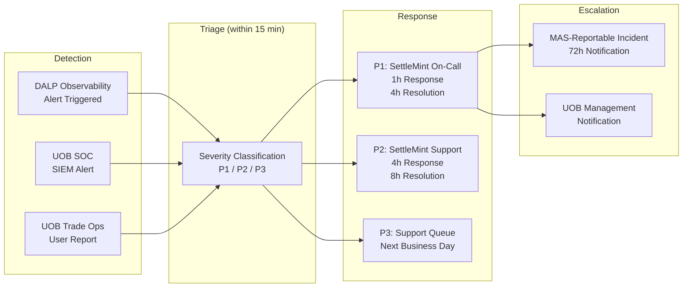

### 20.3 Change Management in BAU

All changes to the DALP production environment (configuration changes, compliance module updates, smart contract upgrades, integration parameter changes) follow a defined change management process:

**Standard Changes (pre-approved):** Configuration changes within a pre-approved configuration boundary (e.g., adding a new approved counterparty address to a whitelist, updating a country restriction list entry within an existing framework). These changes are executed by UOB's compliance operations team using the DALP Compliance Dashboard with maker-checker approval. No SettleMint involvement required.

**Normal Changes (scheduled):** Smart contract upgrades, platform version updates, integration parameter changes, new compliance module activation. These changes follow a 5-day change advisory process: SettleMint submits a change request with impact assessment; UOB's IT Change Advisory Board reviews and approves; change is deployed to development environment and validated; production deployment is scheduled during the agreed maintenance window.

**Emergency Changes:** Security patches for critical vulnerabilities, emergency regulatory compliance updates. These bypass the normal 5-day cycle with expedited CAB approval. SettleMint notifies UOB's CISO and IT Risk officer and provides the emergency patch SLA (critical patches within 24 hours of availability).

### 20.4 Capacity Management

DALP's AWS environment uses auto-scaling for the stateless application tier. As UOB's trade finance volumes grow, the application tier scales horizontally within the pre-provisioned VPC capacity bounds. The current production environment is provisioned for:

- 500 concurrent active LC tokens
- 5,000 monthly LC issuances
- 50,000 monthly trade instrument transfers (BoL, invoice, receivable)
- 100 concurrent XvP settlement transactions

If UOB's actual volumes approach these bounds, SettleMint's monthly business review will identify the capacity trajectory and recommend environment scaling (typically a 2-hour infrastructure change with zero downtime for the stateless tier).

---

## 21. Appendix D: Data Architecture and Reporting

### 21.1 Data Architecture Overview

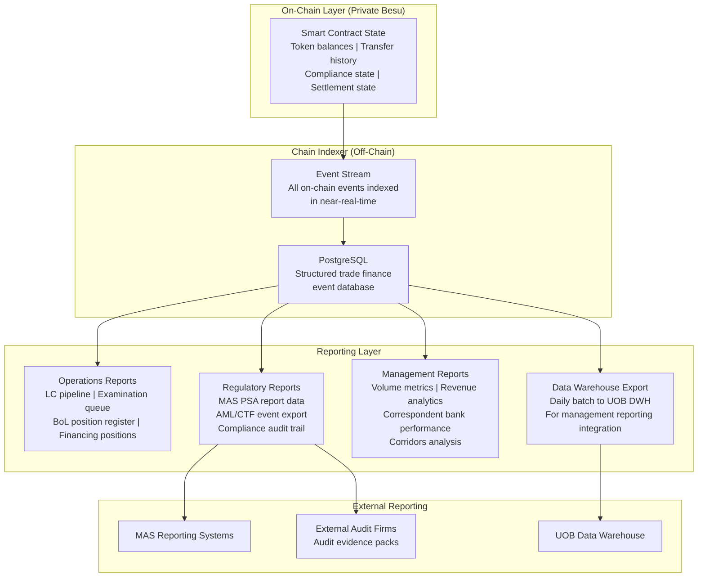

### 21.2 Data Retention and Sovereignty

All trade finance data processed by DALP is stored in AWS ap-southeast-1 (Singapore) within UOB's dedicated VPC. No trade finance data is stored outside Singapore (unless UOB explicitly requests a multi-region DR configuration, in which case encrypted data is replicated to a second designated region).

**Data Retention Schedule:**

| Data Category | Retention Period | Basis |
|---|---|---|
| LC transaction records | 7 years | Singapore documentary evidence requirements; MAS PSA record-keeping |
| BoL endorsement chain records | 7 years | Singapore ETA electronic transferable record requirements |
| Invoice financing event records | 7 years | MAS AML/CFT record-keeping requirements |
| KYB/identity claim audit trail | 7 years from last transaction | MAS AML/CFT ongoing due diligence records |
| Compliance screening decisions | 7 years | MAS AML/CFT evidentiary requirements |
| Security event logs | 3 years | MAS TRM security monitoring records |
| Operational telemetry (metrics, traces) | 90 days | Operational troubleshooting (not regulatory) |

### 21.3 Regulatory Reporting Data

DALP's Chain Indexer generates structured data exports for UOB's regulatory reporting obligations:

**MAS PSA Reporting:** Transaction-level data in MAS-required format for PSA digital payment token activity reporting. Exported daily as a structured JSON file to UOB's regulatory reporting team.

**AML/CFT Suspicious Transaction Reports (STR):** DALP's pre-transfer screening integration generates a flagging event record for every transaction that triggers a screening alert. UOB's compliance team uses these records to prepare STRs for submission to the Suspicious Transaction Reporting Office (STRO).

**MAS IT Examination Evidence:** DALP's immutable audit trail and Chain Indexer provide the documentation evidence required for MAS IT examinations. The structured export includes: all configuration change events with authorising user and approver details; all compliance override events with rationale documentation; all access control events; all security events. The export is formatted to align with MAS examination evidence pack requirements.

### 21.4 Management Reporting Metrics

The following KPIs are available through DALP's API and reporting integration for UOB's management reporting:

| KPI | Description | Frequency |
|---|---|---|
| LC volume | Number of LCs issued, presented, examined, paid, discrepant by corridor | Daily |
| Average examination time | Average time from presentation to examination outcome by corridor | Weekly |
| Discrepancy rate | Percentage of presentations with discrepancies by counterparty/corridor | Weekly |
| Settlement success rate | Percentage of XvP settlement transactions that complete without manual intervention | Daily |
| Financing advance volume | Invoice financing advances by buyer, sector, corridor | Daily |
| Concentration utilisation | Portfolio concentration utilisation vs limit by buyer | Daily |
| KYB coverage | Percentage of active counterparties with current KYB verification | Weekly |
| Correspondent bank utilisation | Volume of trades processed per correspondent bank model (A, B, C) | Weekly |

---

### 21.5 Audit Trail Architecture

DALP's audit trail architecture is designed to produce evidence that satisfies both internal audit requirements and external regulatory examination standards. The audit trail has three components:

**On-Chain Immutability:** Every transaction, compliance event, configuration change, and key operation that modifies the state of a trade instrument is recorded as an on-chain transaction on the private Besu network. On-chain records are cryptographically chained (each block references its predecessor's hash), making retrospective tampering detectable by any block explorer or node operator. UOB runs at least one validator node in its own infrastructure, ensuring it has independent access to the on-chain record even if SettleMint's nodes are unavailable.

**Chain Indexer Database:** The Chain Indexer consumes the on-chain event stream and writes structured records to PostgreSQL. This structured database makes the audit trail queryable by trade operation reference, counterparty identity, compliance module outcome, user identity, and timestamp. MAS examiners receive structured exports from this database (in CSV or JSON format) during IT examinations.

**Application Audit Log:** At the application layer, DALP records all user interactions with authentication events, session details, and the specific actions taken. These application-layer audit records complement the on-chain record by capturing the human actor (UOB staff member) behind each blockchain transaction. The application audit log is forwarded to UOB's SIEM in near-real-time.

The combination of on-chain immutability, structured indexer database, and application audit log provides a complete, tamper-evident, queryable record of every trade finance operation. This three-layer audit architecture satisfies MAS TRM requirements for IT audit trails, MAS Notice 644 requirements for audit logging of privileged access, and the documentary evidence requirements for LC and BoL litigation support.

### 21.6 Integration with UOB's Data Warehouse

DALP's Chain Indexer exports trade finance event data to UOB's Data Warehouse on a daily schedule. The export covers:

- All LC lifecycle events (issuance, amendment, presentation, examination outcome, payment, cancellation) with full metadata
- All BoL events (issuance, negotiation, financing, settlement, surrender) with endorsement chain detail
- All invoice financing events (creation, verification, advance, repayment, concentration check outcomes)
- All compliance events (sanctions screening results, TBML flag decisions, country restriction triggers, KYB status changes)
- All settlement events (XvP settlement initiation, leg completion, failure, reversion)

The export schema is documented in a DALP Data Dictionary provided to UOB's data architecture team during Phase 1 of the implementation. The Data Dictionary maps each DALP event field to UOB's existing trade finance data model, enabling UOB's BI and reporting team to build management reports on the combined data set (DALP events plus GTB records plus core banking positions) within their existing reporting infrastructure.

---

## 22. Extended Section: DALP Smart Contract Architecture for Trade Finance

### 22.1 ERC-3643 and Trade Finance

DALP's smart contract layer is built on ERC-3643, the standard for identity-bound, compliance-enforced security tokens. While ERC-3643 was originally designed for regulated securities (equity tokens, bond tokens), its architecture maps directly to trade finance instruments because trade finance instruments share the core characteristics that ERC-3643 addresses: they have identified holders (not anonymous), they are subject to eligibility and compliance restrictions on transfer, they have defined lifecycle states, and they represent real-world claims with legal and financial consequences.

The SMART Protocol is SettleMint's implementation of ERC-3643, extended with the trade finance-specific compliance modules described in Appendix B. The SMART Protocol provides:

**Identity-Bound Transfer:** Every transfer of a DALP trade finance token requires both the sender and receiver to be identified participants in the Identity Registry. There is no anonymous transfer: every token movement is associated with verified counterparty identities. This identity binding is the technical foundation for TBML controls, sanctions enforcement, and the BoL single-original principle.

**Pre-Transfer Compliance Evaluation:** Before any transfer executes, the compliance engine evaluates every activated compliance module for the token being transferred. The evaluation is atomic: if any compliance module returns false (the transfer is non-compliant), the entire transfer is rejected. There is no partial execution. The rejection event includes the specific module that caused the rejection and the reason code, creating an auditable record of every compliance decision.

**Upgradeable Compliance Rules:** Compliance modules can be added, removed, or reconfigured without redeploying the core token contract. This enables UOB to respond to regulatory changes (new MAS guidelines, new FATF recommendations on TBML) by updating compliance module configurations rather than undertaking a smart contract upgrade with its associated governance and testing cycle.

### 22.2 Identity Registry Architecture

The Identity Registry (OnchainID) is the component of DALP's smart contract layer that manages counterparty identity and eligibility. For UOB's trade finance platform, the Identity Registry contains:

**Entity Types:**
- UOB (as Trusted Issuer and as Issuing Bank for LCs)
- Correspondent Banks (Model A, B, or C as described in Section 8.6)
- Corporate Clients (Importers and Exporters)
- Shipping Companies (BoL issuers)
- Advising/Negotiating Banks (participants in specific trade corridors)

**Claim Types:** Each entity in the Identity Registry holds claims that attest to their eligibility status:
- KYB Verified: issued by UOB's KYB platform; expires according to UOB's KYB review cycle
- Country Eligibility: attesting that the entity is domiciled in a permitted jurisdiction
- LC Issuance Authority: attesting that the entity is authorised to issue LC tokens (UOB-specific)
- Correspondent Bank Participant: attesting the entity's participation model (A, B, or C)
- Trade Finance Counterparty: the base claim required for any trade instrument transfer

**Trusted Issuers:** Claims are only valid if issued by a Trusted Issuer registered in the Identity Registry. For UOB's deployment, the Trusted Issuers are: UOB's KYB platform (primary), approved correspondent bank KYB providers (for Model B and C correspondents who have their own verified KYB processes), and SettleMint (for technical infrastructure identity claims). Trusted Issuer additions and removals require maker-checker approval and are recorded as governance events.

**Identity Claim Lifecycle:** When a new trade counterparty is onboarded:
1. UOB's KYB team completes KYB verification through UOB's KYB platform
2. The KYB platform calls DALP's Identity API to provision a KYB Verified claim to the counterparty's OnchainID
3. The claim is stored in the Identity Registry with an expiry date (typically 12 months from verification)
4. The counterparty is now eligible to be the recipient of trade instrument transfers
5. When the claim approaches expiry, DALP generates a KYB renewal alert
6. If the claim expires without renewal, the counterparty's eligibility is suspended automatically; existing positions are maintained but no new transfers to that address can execute until KYB is renewed

### 22.3 Execution Engine: Restate Trade Finance Orchestration

DALP's Execution Engine uses Restate as its durable execution runtime. For trade finance, Restate provides critical resilience properties that are not available in traditional request-response API architectures:

**Durable Workflows:** An LC examination workflow involves: receiving a document presentation event; triggering TBML screening; triggering sanctions screening; routing to the examination queue; managing the examination deadline countdown; processing the examiner's decision; triggering XvP settlement on acceptance. This 7-step workflow can take days (within the examination window). If any step fails (network interruption, service restart, API timeout), Restate reconstructs the workflow from its last persisted checkpoint and retries the failed step.

**Idempotent Operations:** Trade finance operations must never be executed twice due to retry logic. An LC payment triggered twice would result in a double payment. Restate's idempotency keys ensure that every trade operation is executed exactly once, even if the execution is retried after a failure.

**Saga Pattern for Multi-Party Transactions:** Multi-party trade finance transactions (e.g., an LC amendment that requires UOB, the beneficiary, and the correspondent bank to each confirm) use Restate's saga pattern: each party's confirmation is a durable step; if the workflow is interrupted after one party confirms but before another, the confirmation state is persisted and the workflow resumes from the correct checkpoint when connectivity is restored.

**Observability of Workflow State:** Restate's workflow state is visible in DALP's operational dashboard. UOB's trade operations team can see the current state of every in-progress workflow: which step is active, which steps have completed, and whether any steps are in a retry state. This visibility replaces the "black box" of traditional trade finance processing where the status of a multi-step operation is often opaque.

### 22.4 Chain Gateway and Network Resilience

DALP's Chain Gateway provides the connection between DALP's middleware services (Execution Engine, Transaction Signer) and the underlying Besu blockchain network. The Chain Gateway is architected for resilience:

**Multi-RPC Failover:** The Chain Gateway maintains connections to multiple Besu node RPC endpoints. If the primary RPC endpoint becomes unavailable (node restart, network partition), the Chain Gateway automatically switches to a secondary endpoint without interrupting pending transactions. The switch-over is transparent to the Execution Engine.

**Transaction Queue Management:** Transactions submitted by the Transaction Signer are held in the Chain Gateway's transaction queue with priority classification. P1-severity trade operations (LC payment triggers, BoL settlement executions) are classified as high-priority and processed first. Standard operations (index updates, compliance event logging) are processed at normal priority. This priority queuing ensures that time-sensitive trade operations are not delayed by high-volume routine operations.

**Gas and Nonce Management:** On the private Besu network, transaction gas and nonce management is handled by the Chain Gateway. The Chain Gateway tracks the current nonce for each signing address, preventing nonce collisions for concurrent transactions. Gas pricing is configured for the private network (no fee market), with transactions completing in the next block (approximately 3-5 second block time on the private Besu network).

---

## 23. Extended Section: Training and Knowledge Transfer

### 23.1 Training Programme

SettleMint delivers a structured training programme during Phase 6 (Hypercare) to ensure UOB's teams are fully capable of operating and administering the digital trade finance platform independently after hypercare concludes.

**Role-Based Training Tracks:**

| Track | Audience | Duration | Content |
|---|---|---|---|
| Trade Finance Operations | Trade finance officers, examiners, managers | 2 days | LC examination workflow; BoL negotiation and settlement; invoice financing lifecycle; XvP settlement operations; compliance dashboard; escalation procedures |
| Compliance Operations | Compliance analysts, sanctions officers | 1 day | Sanctions screening integration; TBML flag review workflow; country restriction management; KYB expiry management; compliance event export |
| Technology Operations | IT operations, infrastructure team | 2 days | Observability dashboard interpretation; incident identification and escalation; AWS environment management; AWS Direct Connect management; DALP update procedures |
| System Administration | IT administration, identity management | 1 day | Identity Registry administration; Trusted Issuer management; RBAC user management; API key management; audit log review |
| Executive Overview | UOB senior management (APAC IT, Trade Finance Head) | 2 hours | Platform capabilities; regulatory alignment; SLA and support model; programme KPIs; roadmap |

**Train-the-Trainer:** For each training track, SettleMint identifies and trains two UOB "super-users" who can deliver the training to new joiners after SettleMint's engagement concludes. The super-users receive extended training sessions, access to the DALP development environment for practice, and a complete training pack (slide decks, exercise scenarios, assessment questions) that they can use independently.

### 23.2 Documentation Package

The following documentation is delivered to UOB as part of the knowledge transfer:

- Platform Operations Manual: step-by-step procedures for all BAU operations
- System Administration Guide: Identity Registry management, RBAC configuration, API key lifecycle
- Integration Technical Guide: GTB, SWIFT, FAST/PayNow, AML integration architecture, API contracts
- Compliance Operations Handbook: compliance module configuration reference, regulatory change procedures
- Incident Response Playbook: severity classification, escalation paths, MAS-reportable incident procedure
- Business Continuity and Disaster Recovery Plan: DR procedure, annual DR test procedure, RTO/RPO evidence
- MAS IT Examination Evidence Pack: pre-formatted evidence documentation for each MAS TRM control and MAS Notice 644 control

All documentation is maintained on UOB's designated document management system and updated by SettleMint as part of each platform version update.

---

## 24. Extended Section: Observability and Monitoring

### 24.1 Observability Stack

DALP's observability stack uses four components aligned with the four signal types for modern distributed systems monitoring:

**VictoriaMetrics (Metrics):** Time-series metrics for all DALP components: API request rates and latencies, Execution Engine workflow throughput, Chain Gateway transaction submission rates, Chain Indexer indexing lag, HSM signing latency, and database connection pool utilisation. Pre-built trade finance dashboards visualise LC examination queue depth, settlement throughput, FAST/PayNow integration availability, and TBML screening response time.

**Loki (Logs):** Structured log aggregation from all DALP services, including Application, API, Execution Engine, Chain Gateway, Chain Indexer, and Signer. Logs are structured JSON with trace IDs that correlate log entries across services for a single trade operation. UOB's SOC can query DALP logs through a federated Loki query from UOB's SIEM integration.

**Tempo (Traces):** Distributed tracing for end-to-end request tracking. A single LC examination approval spans multiple services (API, Execution Engine, Signer, Chain Gateway, Chain Indexer); Tempo traces the complete request path with latency breakdown per service, enabling rapid identification of bottlenecks. Tempo traces are invaluable for diagnosing P1 incidents where the root cause is latency accumulation across multiple services rather than a single service failure.

**Grafana (Dashboards):** Pre-built Grafana dashboards for trade finance operations, compliance, and infrastructure. UOB's technology operations team accesses the Grafana dashboards through UOB's internal network via the AWS Direct Connect. Dashboard access is role-based: trade finance operations see the trade operations dashboards; IT infrastructure sees the infrastructure and component dashboards; compliance sees the compliance event dashboards.

### 24.1a Observability Integration with UOB's SOC

DALP's observability stack provides three integration points to UOB's Security Operations Centre (SOC):

**SIEM Event Forward (Security Events):** All security-relevant DALP events are forwarded to UOB's SIEM in near-real-time via a syslog or JSON webhook integration. Security events include: failed authentication attempts; privileged access events (admin sessions opened and closed); maker-checker override events; compliance module configuration changes; smart contract deployment events; HSM signing key access events. These events are tagged with DALP source identifiers enabling the SOC to correlate DALP security events with other UOB infrastructure events.

**SIEM Alert Forward (Compliance Alerts):** Compliance-critical events generated by DALP's screening integrations (sanctions screening matches, TBML flags) are forwarded to UOB's SIEM as high-priority events. This enables the SOC to correlate DALP compliance alerts with other intelligence (network monitoring, endpoint events) that may indicate a broader money laundering or fraud pattern.

**Federated Metrics Access:** UOB's NOC can consume DALP's VictoriaMetrics metrics through a federated Prometheus endpoint, enabling DALP platform health to be visible in UOB's centralised NOC dashboard alongside other critical UOB infrastructure.

### 24.2 Alerting Configuration

DALP's alerting configuration for UOB's trade finance platform includes:

**P1 Alerts (immediate escalation to SettleMint on-call):**
- API availability drops below 99.9% in any 5-minute window
- Execution Engine workflow queue backlog exceeds 10 minutes of normal throughput
- Chain Gateway fails to submit a transaction for more than 2 minutes
- HSM signing latency exceeds 5 seconds
- FAST/PayNow integration unavailable for more than 5 minutes during business hours
- Sanctions screening integration unavailable for more than 10 minutes

**P2 Alerts (escalation to SettleMint support within 4 hours):**
- Chain Indexer lag exceeds 30 minutes
- Database connection pool at 80% capacity
- API error rate above 1% of requests
- KYB expiry alerts for more than 10 active counterparties

**Operational Alerts (routed to UOB trade finance operations via dashboard):**
- LC examination deadline within 24 hours (examination not yet completed)
- TBML flag queue exceeds 5 pending reviews
- Country restriction configuration not updated in 90 days (trigger for compliance review)
- Settlement failure event (for trade operations team to investigate and resubmit)

---

## 25. Extended Section: ASEAN Corridor Strategy

### 25.1 ASEAN Trade Finance Corridor Prioritisation

UOB's ASEAN trade finance franchise covers the five primary ASEAN trade corridors. Each corridor has distinct regulatory characteristics, counterparty ecosystem readiness, and TradeTrust adoption status that inform the phased deployment of DALP. The following corridor analysis is provided to support UOB's programme prioritisation decisions.

**Corridor 1: Singapore to Malaysia (SGD to MYR)**

This corridor benefits from the MAS-BNM bilateral regulatory coordination and Singapore-Malaysia digital trade finance alignment. Maybank's Project Photon (tokenised MYRT XvP settlement) demonstrates that DALP's XvP model is already proven in the MYR context. Correspondent banking relationships are strong; both Model A (SWIFT) and Model B (API-connected) participation models are viable for major Malaysian correspondent banks. TradeTrust adoption in Malaysia is growing, with Maybank participating in TradeTrust pilots. DALP's HTLC module handles SGD/MYR cross-currency settlement.

**Corridor 2: Singapore to Indonesia (SGD to IDR)**

Indonesia's trade finance digitalisation is at an earlier stage. The primary correspondent banks (Bank Mandiri, BRI, BCA) operate primarily through SWIFT. Model A (SWIFT-only) is the appropriate initial model for Indonesian correspondent banks. TradeTrust penetration in Indonesia is limited; DALP's native BoL issuance is the primary mechanism for this corridor. Bank Indonesia's regulatory framework for digital trade finance is evolving; DALP's configurable compliance engine allows corridor-specific compliance module adjustments when regulatory guidance is published.

**Corridor 3: Singapore to Thailand (SGD to THB)**

Thailand's financial sector has strong correspondent banking relationships with UOB. Kasikornbank and Bangkok Bank are the primary correspondents. Model B (API-connected) participation is feasible for Kasikornbank (which has demonstrated advanced digital infrastructure through its KBank app ecosystem). The Stock Exchange of Thailand's TITAN digital asset initiative (which has engaged SettleMint) demonstrates familiarity with blockchain infrastructure in the Thai financial sector.

**Corridor 4: Singapore to Vietnam (SGD to VND / USD)**

Vietnam is one of ASEAN's fastest-growing export economies. Vietnamese exporters predominantly price goods in USD, making the HTLC SGD/USD cross-currency settlement module the primary settlement mechanism for this corridor. Vietnamese correspondent banks (Vietcombank, VietinBank, BIDV) operate through SWIFT; Model A is the initial model. The Vietnam-China worked example in Section 7.4 demonstrates DALP's compliance architecture for this high-volume corridor.

**Corridor 5: Singapore to Greater China (SGD to CNY / USD)**

Cross-border trade with Greater China involves both ASEAN-based importers buying Chinese goods and Singapore-based exporters selling to Chinese buyers. Chinese regulatory constraints on cross-border digital finance mean that DALP operates only on the Singapore side; Chinese correspondent banks participate through SWIFT (Model A). HTLC cross-currency settlement handles the SGD/CNY or SGD/USD exchange. UOB's existing Greater China correspondent banking relationships provide the coverage needed for this corridor.

### 25.2 Phased Corridor Deployment

Phase 1 deployment targets Corridor 1 (Singapore to Malaysia) and Corridor 4 (Singapore to Vietnam) as the highest-volume priority corridors. Additional corridors are added in subsequent phases through configuration, not platform redeployment:

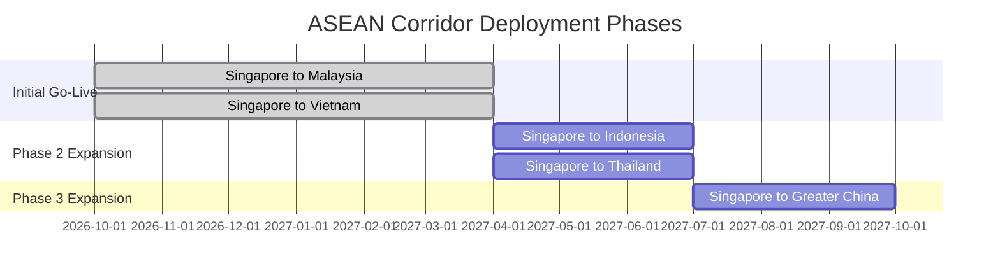

### 25.3 Correspondent Bank Coverage Map

| Corridor | Key Correspondents | Initial Model | DALP API Readiness |
|---|---|---|---|
| SG to MY | Maybank, CIMB, Public Bank | B (API) and A (SWIFT) | High (Maybank Project Photon experience) |
| SG to VN | Vietcombank, VietinBank, BIDV | A (SWIFT) | Low (SWIFT-primary) |
| SG to ID | Bank Mandiri, BRI, BCA | A (SWIFT) | Low (SWIFT-primary) |
| SG to TH | Kasikornbank, Bangkok Bank | B (API) and A (SWIFT) | Medium (Kasikornbank advanced digital) |
| SG to CN | Bank of China SG, ICBC SG, CCB SG | A (SWIFT) | Low (regulatory constraints) |

---

## 26. Extended Section: Competitive Differentiators

### 26.1 DALP vs Alternative Approaches for UOB

UOB's procurement evaluation will compare DALP against alternative approaches. The following analysis identifies the specific differentiators that are material to UOB's digital trade finance requirements.

**DALP vs Custom Build:**

A custom build for UOB's digital trade finance programme would require SettleMint to be replaced by UOB's technology team or a systems integrator building from scratch. The custom build must address: trade instrument token design and smart contract implementation; compliance engine design and implementation (the 18 module types DALP provides); XvP settlement module; Identity Registry; SWIFT integration; GTB integration; FAST/PayNow integration; TradeTrust integration; HSM key management; observability stack; and MAS TRM evidence framework. Industry benchmarks for comparable banking blockchain infrastructure projects suggest 24-36 months and EUR 4-8 million in development costs, not including annual maintenance.

DALP delivers all of this in 19 weeks at EUR 420,000/year. The cost difference over 3 years (EUR 1.26 million for DALP vs EUR 4-8 million plus maintenance for custom) is the primary commercial differentiator. The timeline difference (19 weeks vs 24-36 months) is the primary strategic differentiator: UOB captures ASEAN corridor revenue 18-24 months earlier.

**DALP vs Trade Finance SaaS Platforms:**

Trade finance SaaS platforms (such as Contour, we.trade, and similar blockchain trade finance networks) offer multi-bank network access but impose constraints that are material for UOB's requirements: they operate on shared multi-tenant infrastructure (a concern under MAS TRM's data isolation requirements); they require counterparty banks to join the same network (limiting corridor coverage to network participants only); they do not provide UOB with direct custody of signing keys; and their compliance controls are network-level, not configurable by UOB's compliance team for UOB-specific requirements. DALP's dedicated deployment, bring-your-own-custody model, and configurable compliance engine address all four constraints.

**DALP vs Document Digitisation Platforms:**

Document digitisation platforms (digitising paper LCs and BoLs into PDF-with-signature formats) address the surface problem (reducing paper) without addressing the underlying settlement mechanics. They do not provide XvP atomic settlement, enforced single-original principle, or on-chain compliance enforcement. For UOB's strategic digital trade finance programme, document digitisation is a necessary but insufficient step; DALP provides the infrastructure for genuine trade finance digitalisation, not just document format conversion.

### 26.1a Technology Risk Management: Vendor Due Diligence Evidence

UOB's IT Risk team will conduct a vendor due diligence assessment on SettleMint as part of the MAS TRM outsourcing evaluation. The following evidence package is available:

**ISO 27001 Certificate:** Current certificate from an accredited certification body, covering SettleMint's information security management system including development, operations, and support functions. The certificate scope covers the DALP platform and its supporting infrastructure.

**SOC 2 Type II Report:** Annual SOC 2 Type II report covering Trust Service Criteria: Security, Availability, Processing Integrity, Confidentiality, and Privacy. The Type II report covers the operating effectiveness of controls over a 12-month period, providing UOB's IT Risk team with evidence of sustained control effectiveness (not just design adequacy).

**Penetration Test Summary:** Annual penetration test summary report (full report available under NDA) conducted by an independent security firm. The summary covers test scope (API, application, network, key management, smart contract), test methodology, finding severity distribution, and remediation status.

**Business Continuity Plan:** SettleMint's BCP document covering key person dependency management; operational continuity for client-facing functions; communication plan for MAS-reportable incidents; and annual BCP test procedure and results.

**Sub-Processor Register:** Complete register of SettleMint's sub-processors (cloud infrastructure provider, HSM provider, observability tooling vendors) with their certifications and data processing scope. No sub-processor holds UOB's trade finance data without a Data Processing Agreement in place.

**Financial Stability:** SettleMint's most recent audited financial statements and investor documentation (available under NDA) demonstrating the financial stability appropriate for a material technology vendor to a major Singapore bank.

All vendor due diligence documentation is provided to UOB's IT Risk team during Phase 1 of the programme within 5 business days of the documentation request.

### 26.2 DALP Capabilities That Are Unique to This Procurement

Three capabilities are material differentiators for UOB's specific requirements that are not available from alternative platforms:

**Single-Original Enforcement at Protocol Layer:** The Whitelist module's single-original enforcement for BoL tokens is not a policy assertion (claiming that only one holder exists) but a protocol-enforced fact (the smart contract physically prevents two addresses from simultaneously holding a BoL token). This distinction is legally significant for BoL financing and is the technical implementation of the ETA's electronic transferable record provisions. No document digitisation platform and no SaaS trade finance network provides this level of enforcement.

**HTLC Cross-Currency Settlement:** The ability to execute cross-currency trade settlements (SGD/USD, SGD/MYR) atomically through HTLC is a capability that eliminates FX settlement risk in multi-currency trade corridors. This is directly relevant to UOB's ASEAN trade corridors where USD-denominated invoices are common. Alternative platforms provide XvP within a single currency (SGD-to-SGD) but not the cross-currency variant.

**MAS-Specific Regulatory Evidence Architecture:** DALP's MAS Notice 644 evidence pack, MAS TRM control documentation, and MAS examination evidence export are developed specifically for Singapore-regulated institutions. This pre-built compliance evidence architecture reduces UOB's MAS examination preparation from weeks to days and demonstrates SettleMint's deep familiarity with the Singapore regulatory environment that general-purpose blockchain platforms do not have.

---

---

## 27. Extended Section: Counterparty Onboarding and Identity Management Processes

### 27.1 Counterparty Onboarding Journey

When UOB decides to extend its digital trade finance platform to a new counterparty (an exporter, importer, shipping company, or correspondent bank), the onboarding journey follows a structured process:

**Step 1: KYB Initiation.** UOB's trade finance relationship manager (RM) requests KYB verification for the new counterparty through UOB's internal KYB platform. This triggers UOB's standard due diligence process: document collection, beneficial ownership verification, sanctions screening, adverse media check, and trade-based money laundering risk assessment. For established corporate clients already in UOB's KYB database, the DALP onboarding reuses the existing KYB record without requiring a new KYB process.

**Step 2: Identity Provisioning.** On KYB approval, UOB's KYB platform calls DALP's Identity API to provision the counterparty's OnchainID. The API call includes: counterparty legal name, jurisdiction, entity type (importer, exporter, shipping company, correspondent bank), and the KYB verification expiry date. DALP creates the OnchainID in the Identity Registry and issues the relevant eligibility claims (KYB Verified, Country Eligibility, entity-type claim).

**Step 3: Wallet Address Registration.** The counterparty's trade operations contact is provided with instructions to set up their wallet (either using DALP's managed wallet service for counterparties without existing blockchain infrastructure, or registering their own wallet address for counterparties with existing wallet infrastructure). The wallet address is registered in DALP's Identity Registry as the counterparty's authorised signing address.

**Step 4: Integration Testing.** For Model B (API-connected) correspondent banks, integration testing of their DALP API connection is performed in UOB's development environment. The test confirms: successful authentication with the scoped API key; correct handling of LC presentation webhooks; correct execution of document presentation API calls; correct handling of examination outcome notifications.

**Step 5: Activation.** Following successful testing (or immediately for non-API-integrated parties), the counterparty is activated in the production Identity Registry. UOB's RM receives confirmation of activation and can immediately initiate or respond to trade instruments involving the counterparty.

**Access Credential Management:** For Model B correspondent banks, DALP API credentials (API keys) have a 12-month validity period. Renewal is managed through UOB's correspondent banking team who submit a renewal request through the DALP system administration interface. The renewal is processed with maker-checker approval (UOB correspondent banking officer plus IT administrator). Revoked credentials take effect immediately; there is no grace period during which a revoked credential can be used.

**Onboarding Timeline:** Corporate importers and exporters: 3-5 business days (including KYB); Shipping companies: 3-5 business days (existing UOB relationship) to 10 business days (new relationship); Correspondent banks (Model A): 1-3 business days (existing SWIFT relationship); Correspondent banks (Model B): 10-15 business days (including API integration testing).

### 27.2 Ongoing Identity Management

**KYB Renewal:** DALP generates renewal alerts 60 days before a counterparty's KYB Verified claim expires. The alert is delivered to UOB's compliance operations team through the Compliance Dashboard. UOB's KYB platform initiates the renewal review; on completion, the claim expiry is extended automatically through the Identity API.

**Counterparty Modification:** When a counterparty's legal structure changes (merger, acquisition, name change, jurisdiction change), the Identity Registry record is updated through a maker-checker approval workflow. The modification is applied to all active trade instruments involving that counterparty, ensuring consistent identity information across the portfolio.

**Counterparty Suspension (Temporary):** In cases where UOB initiates a compliance review for a counterparty without terminating the relationship (for example, when a TBML alert is raised that requires investigation but has not yet been substantiated), the counterparty's transfers are suspended through the Transfer Freeze module rather than KYB revocation. The Transfer Freeze is a reversible restriction that is lifted when the investigation concludes without adverse findings. The suspension and its duration are recorded in the compliance audit trail for evidentiary purposes.

**Counterparty Offboarding:** When UOB terminates its relationship with a counterparty (business decision or compliance-driven), the counterparty's KYB Verified claim is revoked in the Identity Registry. All active trade instruments involving the counterparty are flagged for resolution: active LCs are completed, converted to discrepant, or novated; active BoL financing positions are resolved; active invoice financing positions are collected. The counterparty's address is added to the Blacklist to prevent any new transfers. The offboarding event and resolution of all open positions are recorded in the audit trail, providing a complete record of the counterparty relationship lifecycle for regulatory and litigation purposes. The offboarding workflow also notifies UOB's correspondent banking team (for bank counterparties) or the RM team (for corporate counterparties) so they can coordinate the relationship wind-down with their business contacts. Offboarding records are retained for 7 years in line with Singapore's documentary evidence retention requirements.

### 27.3 Multi-Party Trust Hierarchy

The DALP Identity Registry for UOB's trade finance platform implements a layered trust hierarchy that reflects the real-world trust relationships in trade finance: UOB trusts its own KYB verification; UOB trusts KYB verifications performed by approved correspondent banks for their own clients; trade counterparties are trusted only within the scope of their verified identity claims. No counterparty can self-attest their eligibility; all claims must be issued by an authorised Trusted Issuer. This trust hierarchy is cryptographically enforced: a claim issued by an address that is not registered as a Trusted Issuer in the Identity Registry is automatically invalid and ignored by the compliance engine, regardless of what the claim asserts. Additions to the Trusted Issuer registry require UOB's maker-checker approval and are logged as high-priority governance events.

---

*Document Version 2.0 Final. SettleMint Confidential. Do not distribute without prior written consent from SettleMint NV.*
