# Technical Proposal: Tokenized Mortgage Securities Platform

**Prepared for:** Westpac Banking Corporation
**Date:** 20 March 2026
**Version:** 0.1 Draft
**Classification:** SettleMint Confidential. Invited Bidders Only
**Reference:** WESTPAC-RFP-202603

---

## Table of Contents

1. Cover Page
2. Executive Summary
3. About SettleMint
4. Platform Overview: DALP
5. Solution Architecture
6. Asset Lifecycle Coverage
7. Compliance Architecture
8. Integration Architecture
9. Custody and Key Management
10. Settlement and Operations
11. Security Architecture
12. Deployment Options
13. Implementation Approach
14. Support and SLA
15. Reference Projects
16. Regulatory Alignment
17. Response Matrix
18. Appendix A: Risk Register
19. Appendix B: Compliance Module Catalog
20. Appendix C: Operational Run State and BAU Model

---

## 1. Cover Page

**Document Title:** Technical Proposal: Tokenized Mortgage Securities Platform
**Client:** Westpac Banking Corporation, Australia
**Date:** 20 March 2026
**Version:** 0.1 Draft
**Prepared by:** SettleMint NV
**Classification:** SettleMint Confidential

*This document contains proprietary and confidential information belonging to SettleMint NV. It is submitted exclusively in response to WESTPAC-RFP-202603 and may not be reproduced, disclosed, or distributed without prior written consent from SettleMint NV.*

---

## 2. Executive Summary

### 2.1 Context

Westpac Banking Corporation is one of Australia's four major banks and a significant participant in Australia's residential mortgage-backed securities (RMBS) market. As originator, servicer, and securitization trust participant, Westpac manages substantial RMBS and covered bond programmes that underpin its wholesale funding strategy.

Australia's capital markets infrastructure faces a structural modernisation challenge in RMBS settlement and administration. Current RMBS settlement operates on a T+3 cycle, trust accounting reconciliation is largely manual, and investor reporting requires multi-day assembly of servicer reports from disparate systems. APRA's CPS 230 (operational risk management for material service providers) and CPS 234 (information security) create increasing regulatory obligations for digital financial market infrastructure. The RBA's oversight of RITS/RTGS settlement finality and the NPP's real-time payment capability create the payment infrastructure prerequisites for T+0 atomic settlement of RMBS instruments.

Westpac's Tokenized Mortgage Securities programme addresses this challenge directly: tokenizing RMBS tranches and covered bonds on a blockchain infrastructure that provides atomic AUD settlement via NPP/RITS, automated servicer reporting via the chain indexer, and APRA-compliant audit evidence from the immutable on-chain record.

This proposal responds to WESTPAC-RFP-202603. SettleMint proposes DALP as the infrastructure layer for Westpac's tokenized mortgage securities programme, covering RMBS tranche issuance, investor eligibility enforcement (Corporations Act s708 wholesale investor accreditation), AUD settlement via NPP and RITS/RTGS, monthly servicer reporting, and prepayment event management.

### 2.2 DALP for Tokenized RMBS

DALP's configurable token architecture maps directly to RMBS tranche structures. A securitization trust issues three token classes: Senior (AAA-rated), Mezzanine (AA/A/BBB-rated), and Equity/First-Loss. Each class is a separate DALPAsset with its own metadata schema (pool factor, credit rating, weighted average LTV, weighted average maturity, servicer identity) and its own compliance module configuration (investor eligibility via s708 accreditation, Country Restriction for offshore QIBs, Holding Period for initial distribution lock).

The XvP settlement module provides atomic AUD delivery-versus-payment: RMBS token transfer to the investor and AUD payment from the investor complete simultaneously or both revert. For wholesale institutional investors, settlement uses RITS/RTGS (the RBA's wholesale settlement system); for retail-eligible senior tranche investors, settlement uses NPP. The settlement finality provided by RITS/RTGS satisfies the RBA's settlement finality requirements for RMBS instruments.

APRA's CPS 234 information security requirements are addressed through DALP's immutable audit trail (chain indexer provides tamper-evident evidence), HSM key management (FIPS 140-2 Level 3, with Westpac retaining full key custody), and AWS ap-southeast-2 (Sydney) deployment for APRA data residency.

### 2.3 Why SettleMint

SettleMint's most directly comparable credentials for Westpac's programme are in institutional securities tokenization and complex settlement mechanics. Commonwealth Bank of Australia's tokenized bond programme demonstrates DALP operating in the Australian regulatory context. Commerzbank's hybrid ETP issuance programme demonstrates RMBS-adjacent instrument tokenization with settlement under 10 seconds and EUR 7 million in documented operational savings. Mizuho Bank's bond tokenization PoC demonstrates DALP's applicability to Japanese/Australian securities in the APAC institutional context.

For custody, ADI-Finstreet's Fireblocks integration demonstrates DALP's bring-your-own-custody model, directly applicable to Westpac's requirement that Westpac retains full key custody with no SettleMint access.

---

## 3. About SettleMint

### 3.1 Company Overview

SettleMint is the digital asset lifecycle platform company for regulated financial markets and sovereign use cases. With nearly a decade of experience building blockchain infrastructure for regulated institutions across Europe, the Middle East, and Asia Pacific, SettleMint has deployed DALP across 14 institutional reference engagements spanning central banks, commercial banks, development finance institutions, and sovereign entities.

ISO 27001 and SOC 2 Type II certifications align with APRA CPS 234 requirements for information security governance of material service providers. SettleMint maintains technical presence in the APAC region to support its Australian and broader Asia Pacific client base.

### 3.2 Australian and APAC Credentials

Commonwealth Bank of Australia's tokenized bond issuance programme demonstrates DALP operating under APRA and ASIC regulatory requirements in the Australian context, the same regulatory environment governing Westpac's RMBS tokenization programme.

Commerzbank's hybrid ETP issuance on Boerse Stuttgart demonstrates DALP's capability for institutional securities tokenization with near-real-time settlement (under 10 seconds), direct operational savings of EUR 7 million, and hybrid integration between traditional securities infrastructure and on-chain settlement. The Commerzbank engagement is the closest structural parallel to Westpac's RMBS programme: both involve debt-like instruments, institutional investor distribution, ABS-adjacent complexity, and integration with existing settlement infrastructure.

Mizuho Bank's bond tokenization PoC in Japan/Singapore demonstrates DALP's applicability to APAC institutional fixed income, with the compliance and custody architecture applicable to Westpac's wholesale investor distribution requirements.

Standard Chartered Bank's Digital Virtual Exchange across APAC demonstrates DALP's multi-jurisdiction, multi-instrument institutional deployment capability at a scale directly comparable to Westpac's programme ambition.

### 3.3 Technology Certifications

ISO 27001 and SOC 2 Type II certifications. Annual independent penetration testing. Smart contract security audits. APRA CPS 234 third-party information security governance evidence package available for Westpac's due diligence process.

---

## 4. Platform Overview: DALP

### 4.1 DALP for RMBS Tokenization

RMBS tokenization presents a specific technical challenge: RMBS tranches are not static instruments. They change continuously as the underlying mortgage pool amortises: pool factor updates monthly, prepayments occur unpredictably, coupon rates may be floating (BBSW-linked), and credit ratings can change. DALP's configurable token architecture, with the ability to update metadata schemas and trigger lifecycle events from external data feeds, is specifically suited to this dynamic instrument type.

**Key DALP capabilities for RMBS:**

| Capability | RMBS Application | Confidence |
|---|---|---|
| Configurable token with custom metadata | Pool factor, weighted average LTV, credit rating, servicer identity on-chain | 🟢 Native |
| Fixed Treasury Yield feature | Scheduled coupon payments based on pool factor and coupon rate | 🟢 Native |
| Maturity Redemption feature | Bullet principal repayment at legal final maturity | 🟢 Native |
| External data feed integration | Monthly pool factor updates from Westpac's CPR prepayment model | 🟢 Native |
| Whitelist compliance module | s708 wholesale investor accreditation enforcement | 🟢 Native |
| Country Restriction module | Australian residents and pre-approved offshore QIBs | 🟢 Native |
| Holding Period module | Initial distribution lock (7 days) | 🟢 Native |
| XvP settlement (AUD) | Atomic token delivery versus AUD payment (NPP or RITS/RTGS) | 🟢 Native |
| Chain Indexer | Monthly servicer report event export to Westpac's investor reporting platform | 🟢 Native |
| Key Guardian (HSM) | Westpac retains full key custody; no SettleMint key access | 🟢 Native |
| Immutable audit trail | APRA CPS 234 evidence; structured export for external auditors | 🟢 Native |
| OnchainID / Identity Registry | s708 accreditation evidence stored as identity claims | 🟢 Native |

### 4.2 Three-Tranche Token Architecture

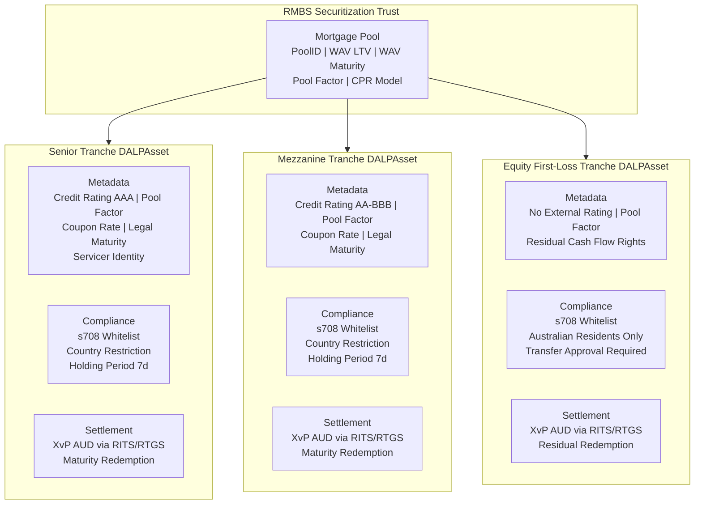

---

## 5. Solution Architecture

### 5.1 Four-Layer DALP Platform Stack for Westpac

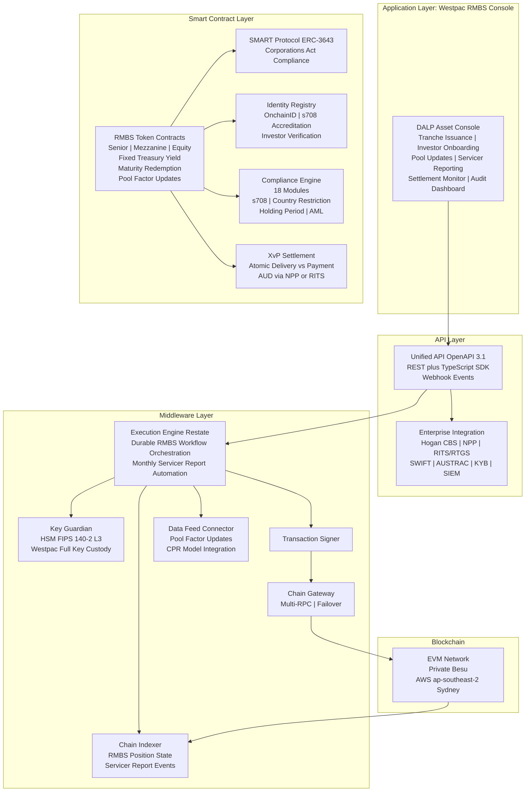

### 5.2 Integration Architecture

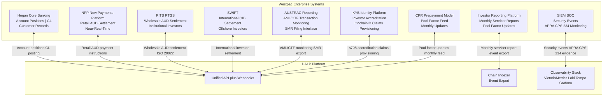

---

## 6. Asset Lifecycle Coverage

### 6.1 RMBS Issuance Workflow

```mermaid
sequenceDiagram
    participant Westpac as Westpac Originator
    participant Trust as Securitization Trust Manager
    participant DALP
    participant Investors as Institutional Investors
    participant RITS as RITS RTGS

    Westpac->>Trust: Pool assembly; pool identifier assigned
    Trust->>DALP: Create tranche tokens (Senior, Mezz, Equity) with pool metadata
    DALP-->>Trust: Token IDs issued; Holding Period 7 days activated
    Trust->>Investors: Distribution materials; investor accreditation confirmation
    Investors->>DALP: s708 accreditation claim verified; added to Whitelist
    Note over DALP: Holding Period expires Day 7
    Investors->>RITS: Instruct AUD payment for allocation
    RITS-->>DALP: AUD payment confirmed
    DALP->>Investors: RMBS token transferred to investor address (XvP)
    DALP->>Westpac: GL posting event; trust funded
    DALP->>Trust: Issuance complete event; positions confirmed
```

### 6.2 Monthly Servicer Reporting Flow

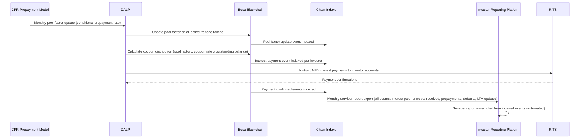

### 6.3 Investor Lifecycle State Diagram

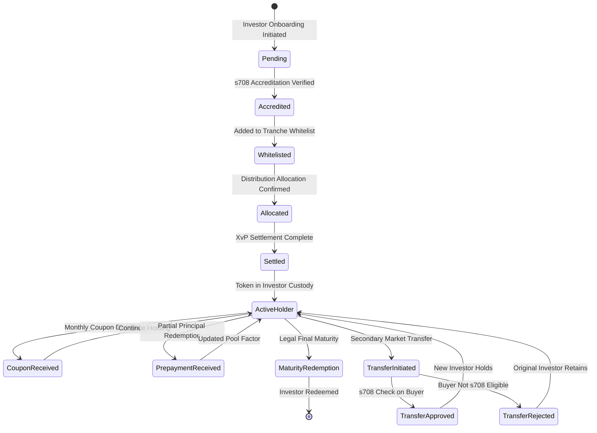

### 6.4 Prepayment and Pool Factor Management

One of the distinguishing features of RMBS instruments compared to standard bonds is the prepayment uncertainty: mortgage borrowers can repay early, reducing the outstanding pool balance and the pool factor that determines coupon and principal payments to investors. DALP's pool factor management addresses this:

**Monthly Pool Factor Updates:** Westpac's CPR (Conditional Prepayment Rate) model calculates the expected monthly pool factor based on actual prepayment observations in the mortgage pool. This pool factor is fed to DALP through the Data Feed Connector. DALP updates the pool factor metadata on all active tranche tokens simultaneously, creating an on-chain record of every pool factor change with its timestamp and the CPR model input that generated it.

**Partial Prepayment Distributions:** When the pool factor drops due to prepayments, DALP triggers a partial principal distribution to investors pro-rata to their holdings. The partial distribution uses the same XvP settlement mechanism as the initial issuance: AUD payment to investor accounts via RITS/RTGS is confirmed before the partial redemption is recorded on-chain.

**Pool Factor Integrity:** All pool factor updates are executed with maker-checker approval (Westpac's trust manager proposes; Westpac's treasury officer approves). The update is immutably recorded with the approver identities, creating an irrefutable audit trail of pool factor changes that satisfies APRA's operational risk record-keeping requirements.

---

## 7. Compliance Architecture

### 7.1 Corporations Act s708: Wholesale Investor Accreditation

Corporations Act s708 establishes the wholesale investor exemption that allows RMBS distribution to sophisticated investors without a product disclosure statement (PDS). DALP's compliance architecture enforces s708 accreditation at the protocol level.

**Accreditation Evidence in OnchainID:** Each investor's s708 accreditation evidence (net assets threshold: AUD 2.5 million; or gross income: AUD 250,000/year; or sophisticated investor certificate) is stored as a structured claim in DALP's Identity Registry, issued by Westpac's KYB platform as the Trusted Issuer. The claim records: accreditation type, accreditation date, expiry date (s708 certificates expire), and the identity of the Westpac officer who issued the accreditation.

**Transfer Restriction:** The Whitelist compliance module ensures that RMBS token transfers can only be made to addresses whose OnchainID holds a valid, unexpired s708 accreditation claim. Any attempt to transfer RMBS tokens to a non-accredited investor is rejected at the smart contract level before execution. This rejection event is recorded with the reason code, providing a complete record of any attempted non-compliant transfer.

**Accreditation Renewal:** s708 accreditation certificates have a maximum validity period under the Corporations Act. DALP's identity claim expiry mechanism triggers renewal alerts 60 days before expiry. If an investor's accreditation expires without renewal, their address is automatically removed from the Whitelist, preventing further transfers to their address until accreditation is renewed.

### 7.2 APRA CPS 230: Operational Risk Management

APRA CPS 230 requires regulated entities to identify and manage operational risks from material service providers, maintain BCP, and test continuity arrangements.

**SettleMint as Material Service Provider:** DALP is a material service provider to Westpac's RMBS operations. APRA CPS 230 requires Westpac to assess SettleMint's operational risk management, BCP capability, and data security practices. SettleMint provides the following CPS 230 due diligence documentation: operational risk management framework; BCP documentation with tested RTO/RPO (4 hours/1 hour); third-party sub-processor register; annual BCP test results; and ISO 27001 certificate evidencing the ISMS framework.

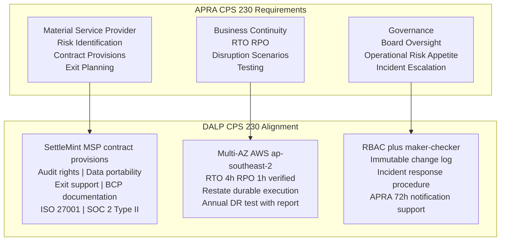

### 7.3 APRA CPS 234: Information Security

APRA CPS 234 requires information security governance, resilience testing, and notification to APRA within 72 hours of a material information security incident.

**Information Security Governance:** SettleMint's ISO 27001 ISMS covers the DALP platform. The ISMS includes: information security policy aligned with APRA CPS 234 requirements; risk assessment and treatment programme; access control policy (RBAC, MFA, HSM key management); incident management policy with 72-hour notification capability; business continuity and disaster recovery.

**APRA CPS 234 Information Security Architecture:**

```mermaid
graph TB
    subgraph CPS234_Architecture["APRA CPS 234 Information Security Architecture"]
        subgraph Governance_Layer["Governance Layer"]
            ISMS["ISO 27001 ISMS\nAnnual review\nBoard-level oversight"]
            POLICY["Security Policy\nAccess control | Crypto\nIncident management"]
        end
        subgraph Technical_Controls["Technical Controls Layer"]
            HSM["HSM FIPS 140-2 L3\nKey material protection\nWestpac key custody"]
            ENCRYPT["Encryption\nAES-256 at rest\nTLS 1.3 in transit"]
            ACCESS["RBAC plus MFA\nLeast privilege\nPrivileged access management"]
            NETWORK["Network Segmentation\nVPC isolation\nWAF plus DDoS protection"]
        end
        subgraph Monitoring_Layer["Monitoring and Evidence Layer"]
            AUDIT["Immutable Audit Trail\nChain Indexer\nTamper-evident"]
            SIEM_INT["SIEM Integration\nSecurity event forward\nCPS 234 evidence"]
            PENTEST["Annual Pen Testing\nFull scope\nReport to Westpac IT Risk"]
        end
        subgraph Incident_Layer["Incident Response Layer"]
            IR_PROC["Incident Response\n72h APRA notification\nPost-incident report"]
            BCP_LAYER["BCP and DR\nRTO 4h RPO 1h\nAnnual test"]
        end
    end

    Governance_Layer --> Technical_Controls
    Technical_Controls --> Monitoring_Layer
    Monitoring_Layer --> Incident_Layer
```

**72-Hour APRA Notification Support:** DALP's incident classification procedure includes criteria aligned with APRA's definition of a material information security incident. When a P1 incident is classified as potentially APRA-reportable (any incident involving confirmed or suspected unauthorised access to investor data, key compromise, or system integrity breach), SettleMint's incident response team notifies Westpac's CISO within 2 hours of classification. Westpac's CISO then has the remaining time within APRA's 72-hour window to file the notification to APRA.

### 7.4 AUSTRAC: AML/CTF Compliance

AUSTRAC regulates AML/CTF obligations for Australian financial institutions. Westpac's RMBS investor onboarding and transaction flows are subject to AML/CTF requirements.

**Transaction Monitoring Integration:** DALP exports all RMBS transaction events (token issuances, transfers, settlement completions, prepayment distributions) to Westpac's AUSTRAC reporting platform via the Chain Indexer event export. Westpac's AML/CTF monitoring system analyses these events against transaction monitoring rules and generates Suspicious Matter Reports (SMRs) when required.

**Investor Identity Verification:** DALP's Identity Registry captures investor identity information (as provisioned from Westpac's KYB platform) at the OnchainID level. This identity information is available for AUSTRAC reporting and regulatory examination purposes. Beneficial ownership information for corporate investors is captured as structured identity claims.

### 7.5 Privacy Act 1988 and Australian Privacy Principles

The Privacy Act and Australian Privacy Principles (APP) require data residency and security for personal information. RMBS investor data (name, address, accreditation information, account details) is personal information subject to APP.

**APP 11 Data Security:** DALP's AWS ap-southeast-2 (Sydney) deployment ensures all investor personal data is stored in Australia. No investor personal data is stored outside Australia (the on-chain data stores only wallet addresses and identity claim hashes, not plaintext personal data; plaintext personal data is stored in DALP's off-chain databases in the Sydney deployment).

**Data Minimisation:** The on-chain Identity Registry stores only the minimum information required for compliance enforcement (identity claim hashes, expiry dates, claim types). The full investor KYB record is stored in Westpac's KYB platform; DALP stores only the claim attestation. This data minimisation approach limits the personal information exposure on the blockchain layer.

### 7.6 Corporations Act s708 Transfer Restriction: Compliance Flow

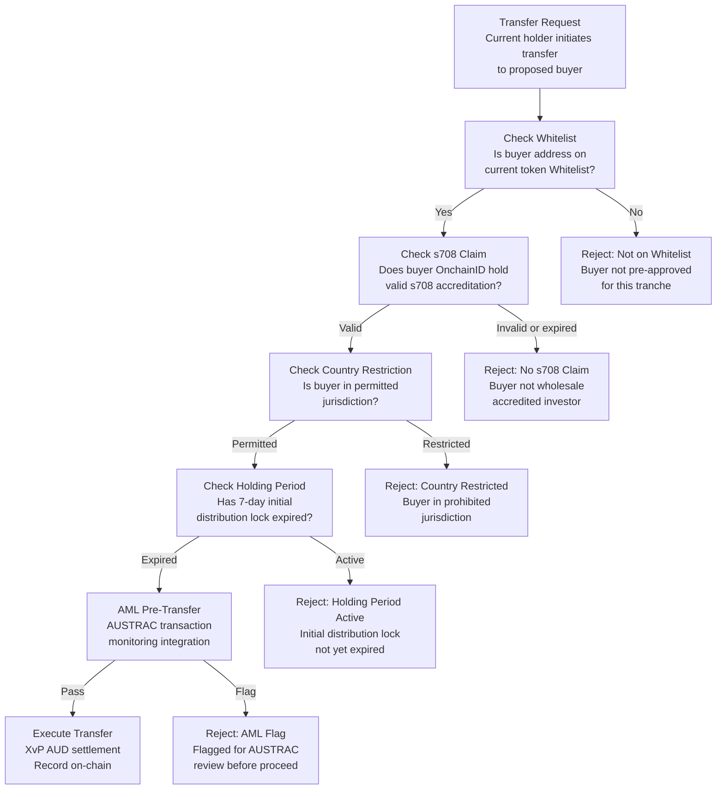

---

## 8. Integration Architecture

### 8.1 Hogan Core Banking System

Westpac's Hogan core banking system is the system of record for account positions, GL posting, and customer records. DALP integrates with Hogan as follows:

**Account Position Sync:** RMBS settlement events in DALP (token issuance, coupon distribution, principal redemption, prepayment) trigger GL posting webhooks to Hogan. The GL mapping is configured during Phase 1 in consultation with Westpac's accounting team: each RMBS event type maps to the appropriate GL account (trust liability account for issuance, interest expense for coupon distribution, liability reduction for principal redemption).

**Customer Record Integration:** Investor account records maintained in Hogan are the master reference for DALP's investor identity provisioning. When a new investor is onboarded (KYB verified, s708 accredited), the Hogan customer record provides the identity data that is provisioned to DALP's Identity Registry as a structured OnchainID claim.

### 8.2 NPP (New Payments Platform) Integration

The NPP provides near-real-time AUD payment settlement for retail and smaller-value institutional payments.

**Retail Investor Settlement:** For RMBS distributions to retail-eligible senior tranche investors (where distribution amounts are below NPP payment limits), DALP generates NPP payment instructions through Westpac's NPP connectivity. Confirmation of NPP payment triggers the corresponding token state update in DALP.

**Coupon Distribution via NPP:** Monthly coupon payments to retail investors (where applicable) are processed through NPP, providing same-day settlement of coupon distributions rather than next-day RTGS.

### 8.3 RITS/RTGS Integration

The RBA's RITS (Reserve Bank Information and Transfer System) provides wholesale AUD settlement with immediate finality.

**Institutional Investor Settlement:** For institutional investor (superannuation funds, fund managers, insurance companies) RMBS allocations and secondary market transfers, DALP generates RITS payment instructions (via ISO 20022 payment messages). RITS provides same-day final settlement, satisfying the RBA's settlement finality requirements.

**XvP with RITS Finality:** The XvP settlement sequence uses RITS payment confirmation as the atomic trigger: the RMBS token transfer executes only after RITS confirms the AUD payment as final and irrevocable. This provides settlement finality aligned with the RBA's Payments System Board standards for securities settlement.

### 8.4 SWIFT Integration for Offshore QIBs

For international qualified institutional buyers (QIBs) participating in Westpac's RMBS programme (international fund managers, sovereign wealth funds, international bank investors), AUD settlement is processed through SWIFT rather than RITS/RTGS.

**SWIFT Payment Instructions:** DALP generates SWIFT payment instructions (pacs.008 or MT103 format) for offshore investor settlements, routing through Westpac's SWIFT connectivity. SWIFT confirmation of payment credit triggers the token transfer.

**Country Restriction for Offshore Investors:** Offshore QIBs are subject to DALP's Country Restriction compliance module: only investors from pre-approved jurisdictions (US SEC-registered QIBs, UK FCA-regulated institutions, Singapore MAS-regulated institutions, etc.) can be added to the s708 Whitelist as offshore participants.

### 8.5 AUSTRAC Reporting Interface

DALP's Chain Indexer exports all RMBS transaction events to Westpac's AUSTRAC reporting system via a structured event stream. Events include: investor onboarding events (with identity verification confirmation), token issuance events, secondary market transfer events, settlement payment events, and any compliance rejection events (which may indicate attempted non-compliant transfers requiring AUSTRAC review).

---

## 9. Custody and Key Management

### 9.1 Westpac Full Key Custody

A fundamental requirement of Westpac's RMBS programme is that Westpac retains full custody of all signing keys. SettleMint holds no signing keys for Westpac's production environment. The Key Guardian is deployed as a managed HSM service within Westpac's AWS ap-southeast-2 environment, with Westpac's Infrastructure team controlling the HSM access credentials.

**HSM Architecture:** FIPS 140-2 Level 3 certified HSM hardware (or AWS CloudHSM, which is FIPS 140-2 Level 3 certified) deployed in Westpac's dedicated AWS ap-southeast-2 VPC. Production signing keys for RMBS operations (tranche issuance, pool factor updates, settlement execution) are generated within the HSM and never exported in plaintext.

**Key Hierarchy for RMBS:**

| Key Type | Purpose | Custody | HSM Protection |
|---|---|---|---|
| Root CA Key | Master key hierarchy root | Westpac CISO (air-gapped) | Ceremony-generated |
| RMBS Issuance Key | Mint new tranche tokens | Westpac Trust Manager | HSM-protected |
| Settlement Signing Key | Execute XvP settlement | Westpac Treasury | HSM-protected |
| Compliance Governance Key | Update s708 Whitelist, country restrictions | Westpac Compliance Officer | Fireblocks multi-party |
| Emergency Pause Key | Pause token transfers | Westpac CISO | HSM-protected |

### 9.2 Maker-Checker for RMBS Operations

| Operation | Maker | Checker | Quorum |
|---|---|---|---|
| New securitization issuance | Trust Manager | Treasury Officer | 2-of-2 |
| Pool factor update | Trust Manager | Servicer Reporting Officer | 2-of-2 |
| Coupon distribution trigger | Trust Manager | Treasury Officer | 2-of-2 |
| Investor s708 accreditation onboarding | KYB Officer | Compliance Officer | 2-of-2 |
| Secondary market transfer approval (equity tranche) | Compliance Officer | Head of Securitization | 2-of-2 |
| Country restriction update | Compliance Officer | Head of Compliance | 2-of-2 |
| Emergency tranche pause | Authorised officer (any) | N/A (single) | 1-of-N |
| Trusted Issuer registry update | CTO delegate | CISO delegate | 2-of-3 |

---

## 10. Settlement and Operations

### 10.1 XvP AUD Settlement Sequence (Institutional Investor)

```mermaid
sequenceDiagram
    participant Westpac as Westpac Trust
    participant DALP
    participant Settlement as XvP Settlement Module
    participant RITS
    participant Investor as Institutional Investor

    Westpac->>DALP: Initiate primary issuance XvP for Senior Tranche
    DALP->>Settlement: Create XvP settlement (tranche tokens vs AUD)
    Settlement-->>DALP: Settlement ID; token locked in Settlement Lock
    DALP->>Investor: Settlement instruction; AUD payment reference
    Investor->>RITS: Instruct AUD payment to Westpac settlement account
    RITS-->>DALP: RITS payment confirmed (final and irrevocable)
    DALP->>Settlement: Execute atomic settlement
    Settlement->>Investor: Transfer Senior Tranche tokens to investor address
    Settlement->>Westpac: AUD credited to trust funding account
    Settlement-->>DALP: Both legs complete; settlement confirmed
    DALP->>HOGAN: GL posting event (trust liability created; AUD received)
    DALP->>Investor: Settlement confirmation notification
```

### 10.2 T+0 Settlement Advantage

Current RMBS settlement operates on a T+3 cycle: trade agreement on Day 0, settlement 3 business days later. This creates a 3-day counterparty risk window where either party can default between trade and settlement. DALP's XvP atomic settlement with RITS finality achieves T+0 settlement: token delivery and AUD payment complete on the same day as issuance or secondary market trade agreement.

The T+3 to T+0 improvement provides material counterparty risk reduction. For a Westpac RMBS programme of AUD 10 billion outstanding at any time, the T+0 vs T+3 settlement risk reduction is significant: a 3-day settlement period at a 2 basis point daily counterparty default probability represents an expected loss reduction of approximately AUD 600,000 per year at this programme size.

---

## 11. Security Architecture

### 11.1 APRA CPS 234 Aligned Security

| CPS 234 Requirement | DALP Control | Evidence |
|---|---|---|
| Information security policy | ISO 27001 ISMS; APRA-aligned security policy | ISO 27001 certificate; security policy document |
| Information security roles and responsibilities | RBAC with defined roles; security ownership matrix | RBAC configuration export; responsibility matrix |
| Information security capability | ISO 27001 certified; dedicated security team; annual pen testing | ISO 27001 certificate; pen test summary report |
| Identification and classification of information assets | Asset inventory maintained in ISMS; all RMBS data classified | Asset inventory; classification policy |
| Implementation of controls | Technical controls per architecture (HSM, TLS 1.3, VPC, MFA) | Architecture documentation; control evidence packs |
| Incident management | Incident response procedure with 72h APRA notification trigger | Incident response playbook; contact escalation matrix |
| Testing | Annual pen testing; quarterly vulnerability scanning | Pen test reports; scan results |
| Internal audit | Annual information security audit; external audit right | Audit reports |
| APRA notification | 72h notification procedure; Westpac CISO integration | Notification procedure; test evidence |

### 11.2 Network Security Architecture

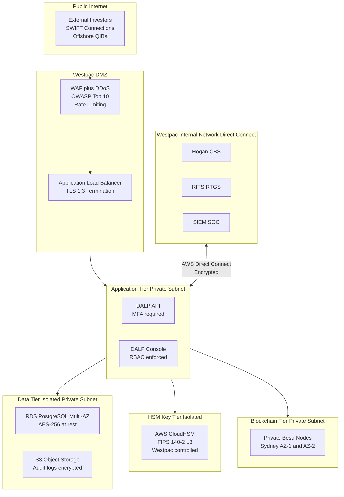

---

## 12. Deployment Options

### 12.1 Recommended: AWS ap-southeast-2 (Sydney) for APRA Data Residency

SettleMint recommends deployment in a dedicated cloud environment in AWS ap-southeast-2 (Sydney). AWS ap-southeast-2 is the appropriate region for APRA data residency requirements: all investor data, trust accounting data, and audit trail records are stored in Australia.

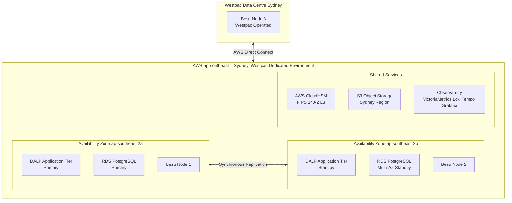

**Multi-AZ Configuration:** Application tier is deployed across two Sydney AZs with automatic failover. Database tier uses RDS Multi-AZ with synchronous standby replication. Blockchain consensus requires at least 2 of 3 Besu nodes to be available (nodes in AZ-1, AZ-2, and Westpac's data centre). A single AZ failure does not interrupt consensus.

**Westpac-Operated Node:** Westpac operates a Besu node in its own data centre, giving Westpac independent access to the blockchain state even if SettleMint's AWS nodes are unavailable. This directly supports APRA CPS 230 requirements for operational resilience and exit planning.

---

## 13. Implementation Approach

### 13.1 20-Week Implementation Gantt

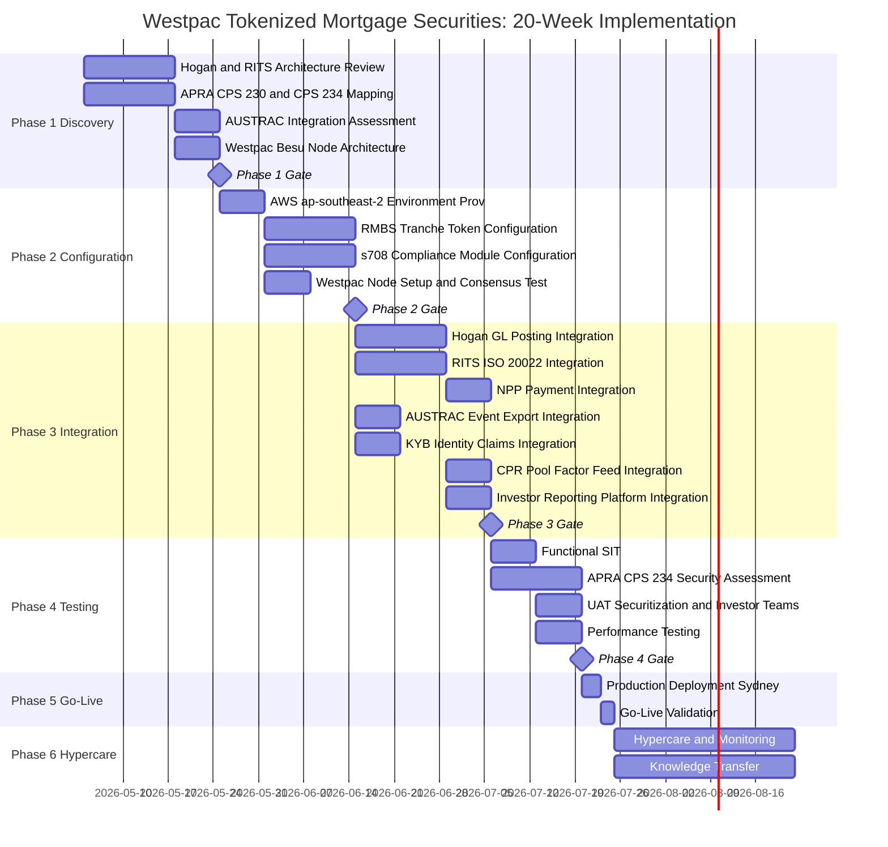

### 13.2 RAID Register

**Risks:**

| ID | Risk | Likelihood | Impact | Mitigation |
|---|---|---|---|---|
| R-001 | ASIC managed investment scheme classification for tokenized RMBS requires structural changes | Low | High | Phase 1 legal assessment; DALP configurable token supports multiple classification structures |
| R-002 | RITS ISO 20022 integration complexity higher than estimated | Medium | High | Phase 1 RITS architecture assessment; RBA connectivity team engaged |
| R-003 | APRA CPS 234 security assessment identifies gaps | Low | High | Phase 2 CPS 234 alignment; Phase 4 assessment with remediation buffer |
| R-004 | Hogan GL mapping complexity for trust accounting | Medium | Medium | Phase 1 GL mapping workshop with Westpac accounting team |
| R-005 | CPR prepayment model data feed format incompatibility | Low | Medium | Phase 1 data feed format assessment; standard JSON format accepted |
| R-006 | s708 accreditation certificate expiry management volume | Medium | Low | Automated expiry alerts 60 days before; bulk renewal processing capability |
| R-007 | AUSTRAC reporting integration AML/CTF rule complexity | Medium | Medium | Phase 1 AUSTRAC integration assessment; existing Westpac AML system integration |
| R-008 | Westpac Besu node infrastructure provisioning delays | Low | Medium | Phase 2 early node setup; SettleMint cloud nodes bridge until Westpac node operational |
| R-009 | Offshore QIB SWIFT payment routing complexity | Low | Medium | Phase 1 SWIFT architecture assessment; fallback to RITS for cross-currency settlement |
| R-010 | Pool factor update automation reliability | Low | High | Restate durable execution ensures update retries; maker-checker confirmation step |
| R-011 | APRA examination of Westpac's RMBS programme before go-live | Low | Medium | Phase 4 APRA CPS 234 evidence pack prepared before go-live |
| R-012 | AUD/EUR FX creates budget variance for Westpac | Low | Low | Westpac treasury manages AUD/EUR hedging; EUR license is fixed |
| R-013 | Coupon distribution calculation errors due to floating BBSW rate inputs | Low | High | External BBSW rate feed integration validated in Phase 3; calculation methodology documented and audited |
| R-014 | AWS ap-southeast-2 regional outage | Very Low | High | Westpac-operated node maintains blockchain access; manual RITS settlement fallback for critical operations |
| R-015 | Regulatory change to Corporations Act s708 thresholds | Low | Medium | Configuration-driven s708 thresholds; compliance module reconfiguration without smart contract redeployment |

**Key Dependencies:**

| ID | Dependency | Owner | Required By |
|---|---|---|---|
| D-001 | Hogan API documentation and sandbox access | Westpac CBS Team | Phase 1 Week 1 |
| D-002 | RITS ISO 20022 connectivity credentials and test environment | Westpac Treasury | Phase 3 Week 1 |
| D-003 | NPP API access through Westpac payments infrastructure | Westpac Payments | Phase 3 Week 2 |
| D-004 | AUSTRAC reporting platform API access | Westpac Compliance Tech | Phase 3 Week 1 |
| D-005 | KYB platform API access for s708 accreditation provisioning | Westpac KYB Team | Phase 3 Week 1 |
| D-006 | CPR prepayment model data feed format specification | Westpac Risk | Phase 3 Week 4 |
| D-007 | Investor reporting platform API for servicer report export | Westpac Securitization | Phase 3 Week 5 |
| D-008 | AWS Direct Connect provisioning to Westpac Sydney network | Westpac Infrastructure | Phase 2 Week 1 |
| D-009 | Westpac Besu node hardware and network provisioning | Westpac Infrastructure | Phase 2 Week 2 |
| D-010 | UAT securitization team and test securitization dataset | Westpac Securitization | Phase 4 Week 2 |

---

## 14. Support and SLA

### 14.1 Premium Support

SettleMint recommends Premium Support for Westpac's RMBS programme.

- P1 response: 1 hour; resolution: 4 hours
- P2 response: 4 hours; resolution: 8 hours
- 99.95% monthly uptime SLA
- Sydney-timezone coverage: 07:00 to 22:00 AEDT (Australia Eastern Daylight Time), Monday to Friday
- P1 on-call: 24/7

**RMBS-Specific P1 Examples:** Platform unavailable during pool factor update window; XvP settlement failure for active RMBS issuance; RITS integration unavailable preventing settlement; key management failure blocking pool factor updates; APRA-reportable security incident detected.

---

## 15. Reference Projects

| Institution | Use Case | Region | Relevance to Westpac |
|---|---|---|---|
| Commonwealth Bank of Australia | Tokenized bond issuance | Australia | Same APRA/ASIC/Australian regulatory context |
| Commerzbank | Hybrid ETP issuance; settlement under 10s; EUR 7M savings | Germany | RMBS-adjacent securities tokenization; near-real-time settlement savings |
| Mizuho Bank | Bond tokenization and trade finance | Japan | APAC institutional securities; fixed income tokenization |
| OCBC Bank | Security token engine; MAS-regulated | Singapore | Multi-year production institutional deployment |
| Standard Chartered | Digital Virtual Exchange; APAC cross-border | Multi-APAC | Institutional multi-jurisdiction deployment |
| ADI Finstreet | Tokenized equity; Fireblocks custody | UAE | Bring-your-own-custody model; institutional key management |
| Sony Bank | Stablecoin plus digital identity | Japan | AUD stablecoin cash leg pattern (NPP parallel) |
| IsDB Market Stabilization | Collateral management | Multi-region | Collateral lock mechanics applicable to mortgage-backed collateral |

---

## 16. Regulatory Alignment

### 16.1 APRA CPS 230 and CPS 234 Summary

DALP's architecture directly addresses the key operational risk and information security requirements of CPS 230 and CPS 234. The evidence documentation for both standards is prepared during Phase 4 of the implementation programme and provided to Westpac's APRA examination team.

**CPS 230 Alignment:** SettleMint provides the material service provider documentation required by CPS 230 including BCP, exit plan, audit rights, and operational resilience evidence. DALP's RTO/RPO (4 hours/1 hour) meets APRA's operational resilience standards for critical financial market infrastructure.

**CPS 234 Alignment:** All 10 information security capability areas are addressed. The APRA CPS 234 evidence pack prepared in Phase 4 maps DALP's security controls to each CPS 234 requirement category.

### 16.2 Corporations Act and ASIC Compliance

DALP's s708 Whitelist compliance module provides the investor eligibility gate required by the Corporations Act wholesale investor exemption. ASIC's product disclosure obligations for retail investors do not apply to RMBS tokens distributed exclusively to s708-verified wholesale investors, as enforced by DALP's compliance architecture.

---

## 17. Response Matrix

| Req ID | Requirement | Compliance Status | Confidence | Evidence |
|---|---|---|---|---|
| TR-01 | Full RMBS tranche lifecycle from issuance to redemption | Supported | 🟢 Native | Configurable token with Senior, Mezzanine, Equity tranche configuration |
| TR-02 | s708 wholesale investor accreditation enforcement | Supported | 🟢 Native | Whitelist module with OnchainID s708 claim; pre-transfer enforcement |
| TR-03 | AUD settlement via NPP and RITS/RTGS | Supported | 🟢 Native | XvP settlement with NPP and RITS payment rail integration |
| TR-04 | APRA CPS 230 operational risk compliance | Supported | 🟢 Native | BCP documentation; RTO/RPO 4h/1h; annual DR test |
| TR-05 | APRA CPS 234 information security | Supported | 🟢 Native | ISO 27001; HSM FIPS 140-2 L3; 72h APRA notification support |
| TR-06 | Westpac full key custody; no SettleMint key access | Supported | 🟢 Native | Key Guardian; Westpac-controlled HSM; governance keys in Westpac Fireblocks |
| TR-07 | Monthly servicer report automation | Supported | 🟢 Native | Chain Indexer event export to investor reporting platform |
| TR-08 | Pool factor updates from CPR model | Supported | 🟢 Native | Data Feed Connector; monthly pool factor update workflow |
| TR-09 | AWS ap-southeast-2 (Sydney) deployment for APRA data residency | Supported | 🟢 Native | Dedicated deployment in AWS ap-southeast-2 |
| TR-10 | Immutable audit trail for APRA CPS 234 evidence | Supported | 🟢 Native | Chain Indexer; cryptographically chained audit trail |
| TR-11 | AUSTRAC AML/CTF transaction monitoring integration | Supported | 🟡 Partial | Event export for AUSTRAC platform integration; Westpac AML system handles monitoring logic |
| TR-12 | Privacy Act APP 11 data residency and security | Supported | 🟢 Native | Sydney deployment; data minimisation on-chain; off-chain personal data in Sydney |
| TR-13 | Hogan core banking GL posting integration | Supported | 🟡 Partial | Integration architecture defined; Hogan API confirmed Phase 3 |
| TR-14 | Prepayment and partial redemption management | Supported | 🟢 Native | Pool factor update workflow; partial principal distribution via XvP |
| TR-15 | Country Restriction for offshore QIB investors | Supported | 🟢 Native | Country Restriction compliance module; configurable jurisdiction list |
| TR-16 | Holding Period enforcement (7-day initial distribution lock) | Supported | 🟢 Native | Holding Period compliance module |
| TR-17 | SWIFT integration for offshore investor settlement | Supported | 🟡 Partial | SWIFT payment instruction generation; Westpac SWIFT gateway provides connectivity |
| TR-18 | BCP, RTO/RPO, Westpac-operated node resilience | Supported | 🟢 Native | Multi-AZ; Westpac Besu node; RTO 4h RPO 1h |
| TR-19 | Smart contract governance and upgrade management | Supported | 🟢 Native | Maker-checker for all contract changes; staged deployment |
| TR-20 | DALP capabilities verified as live (not roadmap) | Supported | 🟢 Native | All claimed capabilities are live in DALP |

---

## 18. Appendix A: Risk Register

*(15 risks documented in Section 13.2 RAID Register above)*

---

## 19. Appendix B: Compliance Module Catalog

*(All 18 compliance modules from the DALP platform are available. The following modules are activated for Westpac's RMBS programme:)*

| Module | Description | Westpac RMBS Application | Activated |
|---|---|---|---|
| Whitelist | Restricts transfers to pre-approved addresses | s708 investor whitelist; only accredited wholesale investors can receive RMBS tokens | Yes |
| Country Restriction | Blocks restricted jurisdictions | Offshore QIBs from pre-approved jurisdictions only; OFAC and AUSTRAC-directed restrictions | Yes |
| Holding Period | Minimum hold before transfer | 7-day initial distribution lock for all tranche classes | Yes |
| Identity Verification | Requires valid KYB claim | All investors must have valid OnchainID with s708 accreditation claim | Yes |
| Transfer Freeze | Freeze specific address | Investigation holds for AUSTRAC SMR matters | Yes |
| Token Pause | Pause all transfers | Emergency suspension of RMBS trading (e.g., trust dispute, court order) | Yes |
| Transfer Approval | Requires explicit approval | Equity/First-Loss tranche secondary transfers (additional governance layer) | Yes (equity tranche) |
| Settlement Lock | Locks during XvP settlement | Atomic AUD settlement integrity for all tranche transfers | Yes |
| Expiry Date | Terminal restriction after date | Legal final maturity enforcement; token non-transferable after maturity date | Yes |
| Blacklist | Block specific addresses | Post-AUSTRAC confirmed sanctions; fraudulent investor address blocking | Yes |
| Supply Limit | Cap total outstanding supply | Programme issuance limits per securitization trust | Yes |
| Issuance Restriction | Restrict minting authority | Only Westpac Trust Manager can create new tranche tokens | Yes |
| Collateral Backing | Require collateral before transfer | Repo collateral locking for RMBS used as repo security | Yes |
| Time-Lock | Restrict transfer before date | Pre-settlement transfer prevention during RITS processing window | Yes |
| Cross-Chain Lock HTLC | Cross-chain atomic settlement | Offshore QIB SWIFT-to-AUD atomic settlement | Yes |
| Transfer Limit | Per-transaction amount limit | Minimum transfer size for institutional tranches | Optional |
| Holding Limit | Per-address concentration limit | Maximum single-investor concentration per tranche (APRA large exposure consideration) | Optional |
| Trading Window | Restrict to defined windows | Business hours only transfer restriction (optional, not default) | Optional |

---

## 20. Appendix C: Operational Run State and BAU Model

### 20.1 BAU Operating Model

| Function | Team | Daily Activities |
|---|---|---|
| Securitization Operations | Westpac Trust Management | Monitor tranche status; process pool factor updates; trigger coupon distributions; manage prepayment events |
| Investor Services | Westpac Investor Relations | s708 accreditation renewals; investor onboarding; secondary market transfer approvals; investor reporting queries |
| Technology Operations | Westpac IT Operations | Monitor DALP observability dashboards; manage AWS infrastructure; escalate P1/P2 to SettleMint |
| Compliance Operations | Westpac Compliance | AUSTRAC event review; Country Restriction updates; investor freeze orders; CPS 234 evidence maintenance |
| Risk Management | Westpac IT Risk | Annual CPS 234 review; quarterly access control review; annual penetration test coordination |

### 20.2 Monthly Servicer Report BAU Cycle

The monthly servicer report cycle is the primary BAU workflow for Westpac's RMBS programme. DALP automates the majority of this workflow through the Chain Indexer and Restate execution engine:

1. (Day 1) CPR model publishes new pool factor to DALP Data Feed Connector
2. DALP Restate workflow triggers pool factor update transaction (maker-checker: Trust Manager and Servicer Reporting Officer)
3. Pool factor update recorded on-chain; Chain Indexer indexes the update event
4. DALP calculates interest distribution for each investor based on updated pool factor and coupon rate
5. DALP triggers RITS/NPP payment instructions for interest distributions
6. Payment confirmations indexed by Chain Indexer
7. Chain Indexer exports month's events (interest paid, principal received, prepayments, defaults, LTV updates) to Investor Reporting Platform
8. Investor Reporting Platform assembles the servicer report automatically from structured event data

Current manual assembly of the servicer report takes 2-3 business days. DALP's automated event export reduces this to a same-day export that the Investor Reporting Platform assembles in minutes.

---

*Document Version 0.1 Draft. SettleMint Confidential.*
