# Technical Proposal: Tokenized Mortgage Securities Platform

**Prepared for:** Westpac Banking Corporation
**Date:** 20 March 2026
**Version:** 2.0 Final
**Classification:** SettleMint Confidential. Invited Bidders Only
**Reference:** WESTPAC-RFP-202603

---

## Table of Contents

1. Cover Page
2. Executive Summary
3. About SettleMint
4. Platform Overview: DALP
5. Solution Architecture
6. Asset Lifecycle Coverage
7. Compliance Architecture
8. Integration Architecture
9. Custody and Key Management
10. Settlement and Operations
11. Security Architecture
12. Deployment Options
13. Implementation Approach
14. Support and SLA
15. Reference Projects
16. Regulatory Alignment
17. Response Matrix
18. Appendix A: Risk Register
19. Appendix B: Compliance Module Catalog
20. Appendix C: Operational Run State and BAU Model

---

## 1. Cover Page

**Document Title:** Technical Proposal: Tokenized Mortgage Securities Platform
**Client:** Westpac Banking Corporation, Australia
**Date:** 20 March 2026
**Version:** 2.0 Final
**Prepared by:** SettleMint NV
**Classification:** SettleMint Confidential

*This document contains proprietary and confidential information belonging to SettleMint NV. It is submitted exclusively in response to WESTPAC-RFP-202603 and may not be reproduced, disclosed, or distributed without prior written consent from SettleMint NV.*

---

## 2. Executive Summary

### 2.1 Context

Westpac Banking Corporation is one of Australia's four major banks (the Big Four) and a significant originator, servicer, and securitization trust participant in Australia's residential mortgage-backed securities (RMBS) market. Westpac's wholesale funding strategy relies substantially on RMBS issuance and covered bond programmes that raise institutional funding against its mortgage book. These programmes involve complex trust structures, monthly servicer reporting obligations, investor eligibility governance under the Corporations Act, and settlement mechanics that operate on a T+3 cycle that creates unnecessary counterparty risk.

Australia's capital markets modernisation context creates the strategic rationale for Westpac's Tokenized Mortgage Securities programme. The Reserve Bank of Australia's NPP (New Payments Platform) provides real-time AUD settlement capability. The RBA's RITS/RTGS provides wholesale settlement finality for institutional transactions. APRA's CPS 230 and CPS 234 standards create regulatory obligations for operational resilience and information security that are increasingly stringent for institutions using third-party technology for critical financial market functions. The Australian Privacy Principles (APP) require data residency in Australia for personal information. Together, these create the regulatory and infrastructure prerequisites for tokenized RMBS settlement at T+0, with APRA-compliant audit evidence and automated servicer reporting.

Westpac's Tokenized Mortgage Securities programme transforms RMBS administration by tokenizing RMBS tranches as DALPAsset tokens, providing: atomic AUD delivery-versus-payment (DvP) settlement via RITS/RTGS and NPP; automated monthly servicer reporting through the Chain Indexer event export; s708 wholesale investor accreditation enforcement at the protocol level; prepayment and pool factor management through external data feed integration; and a complete immutable audit trail for APRA CPS 234 evidence.

This proposal responds to WESTPAC-RFP-202603. SettleMint proposes DALP as the infrastructure layer for Westpac's tokenized mortgage securities programme, covering RMBS tranche issuance, investor eligibility enforcement, AUD settlement via NPP and RITS/RTGS, monthly servicer reporting, prepayment event management, and APRA CPS 230/234 compliance architecture.

### 2.2 The RMBS Administration Problem That DALP Solves

RMBS administration under a paper-and-system-based model has four material operational problems that DALP addresses:

**Problem 1: T+3 Settlement Creates Counterparty Risk.** Current RMBS settlement operates on a T+3 cycle. Between trade execution and settlement, counterparty default risk is unhedged. For a Westpac RMBS programme of AUD 10 billion outstanding, three days of unhedged counterparty exposure represents material balance sheet risk. DALP's XvP atomic settlement with RITS finality delivers T+0 settlement: token delivery and AUD payment complete on the same day.

**Problem 2: Monthly Servicer Reports Require Manual Assembly.** The servicer report (monthly statement of interest paid, principal received, prepayments, defaults, and LTV updates) is currently assembled manually by Westpac's securitization operations team from multiple systems (Hogan positions, CPR model output, servicer records, GL reconciliation). This takes 2-3 business days per monthly cycle and creates reconciliation risk. DALP's Chain Indexer automatically indexes all on-chain events (pool factor updates, coupon distributions, principal redemptions) and exports them to Westpac's Investor Reporting Platform, reducing servicer report assembly from days to hours.

**Problem 3: Trust Accounting Reconciliation Is Error-Prone.** The reconciliation between the trust manager's records and Westpac's GL positions (Hogan) requires manual matching of events across systems. Event timing differences, system downtime during reconciliation windows, and manual data entry create reconciliation errors. DALP's atomic settlement eliminates the settlement lag that is the primary source of reconciliation discrepancies.

**Problem 4: APRA Audit Evidence Is Costly to Assemble.** APRA examinations of Westpac's RMBS operations require evidence of system controls, access governance, and transaction integrity. Currently, assembling this evidence pack takes 3-5 days per APRA examination. DALP's immutable Chain Indexer provides a structured, queryable, cryptographically verifiable audit trail that generates the APRA evidence pack automatically.

### 2.3 DALP for Tokenized RMBS

DALP's configurable token architecture maps directly to the RMBS tranche structure that Westpac uses. A securitization trust issues three DALPAsset token classes:

**Senior Tranche (AAA-rated):** The largest tranche by volume, distributed primarily to institutional investors (superannuation funds, insurance companies, fund managers). The Senior Tranche token uses the Whitelist compliance module to enforce s708 wholesale investor accreditation, the Country Restriction module to permit Australian residents and pre-approved offshore QIBs, and the Holding Period module for the 7-day initial distribution lock. The Fixed Treasury Yield feature handles scheduled coupon payments based on the pool factor and coupon rate.

**Mezzanine Tranche (AA/A/BBB-rated):** Smaller in volume, distributed to institutional investors with higher risk appetite than Senior Tranche. The Mezzanine Tranche uses the same compliance module configuration as the Senior Tranche with tighter investor eligibility criteria (fewer offshore QIBs, higher concentration limits).

**Equity/First-Loss Tranche:** Typically retained by Westpac or distributed to specialist mortgage finance investors. The Equity Tranche uses Transfer Approval in addition to the Whitelist, requiring an explicit approval step for any secondary market transfer, reflecting the complex risk profile of residual interest holders.

### 2.4 Why SettleMint for Westpac

SettleMint's credentials for Westpac's programme combine Australian regulatory experience, institutional securities tokenization depth, and APRA-relevant compliance architecture.

Commonwealth Bank of Australia's tokenized bond programme demonstrates DALP operating under APRA and ASIC regulatory requirements in Australia, the same regulatory framework governing Westpac's RMBS tokenization programme. This is the most directly relevant reference: CBA is an APRA-regulated ADI deploying DALP for tokenized debt securities in Australia.

Commerzbank's hybrid ETP issuance programme demonstrates DALP's capability for ABS-adjacent institutional securities tokenization with near-real-time settlement (under 10 seconds) and documented operational savings of EUR 7 million. The Commerzbank engagement involved: integration with existing financial market infrastructure (Boerse Stuttgart settlement system); hybrid on-chain/off-chain architecture; institutional investor distribution; and complex settlement mechanics. All four structural parallels apply to Westpac's RMBS programme.

ADI-Finstreet's Fireblocks custody integration demonstrates DALP's bring-your-own-custody model in an institutional context where the client retains full key custody without SettleMint access, directly addressing Westpac's requirement that Westpac controls all signing keys.

Mizuho Bank and Maybank Project Photon demonstrate DALP's XvP settlement mechanics in the APAC institutional context, with atomic delivery-versus-payment that is directly applicable to RITS/RTGS-settled RMBS.

### 2.5 Document Map

- Section 3: About SettleMint and Australian credentials
- Section 4: DALP platform overview for RMBS
- Section 5: Solution architecture (four-layer stack and integration diagrams)
- Section 6: Asset lifecycle coverage (issuance, coupon, prepayment, maturity)
- Section 7: Compliance architecture (APRA CPS 230/234, ASIC, AUSTRAC, s708, Privacy Act)
- Section 8: Integration architecture (Hogan, NPP, RITS, SWIFT, AUSTRAC, KYB)
- Section 9: Custody and key management (Westpac full custody model)
- Section 10: Settlement and operations (XvP, T+0, RITS finality)
- Section 11: Security architecture (APRA CPS 234 aligned)
- Section 12: Deployment options (AWS ap-southeast-2, Sydney)
- Section 13: Implementation approach (20-week Gantt, RAID register)
- Section 14: Support and SLA
- Section 15: Reference projects
- Section 16: Regulatory alignment
- Section 17: Response matrix (TR-01 to TR-20)
- Appendix A: Risk Register (15+ risks)
- Appendix B: Compliance Module Catalog (all 18 modules)
- Appendix C: Operational Run State and BAU Model

---

## 3. About SettleMint

### 3.1 Company Overview

SettleMint is the digital asset lifecycle platform company for regulated financial markets and sovereign use cases. With nearly a decade of experience building blockchain infrastructure for regulated institutions across Europe, the Middle East, and Asia Pacific, SettleMint has deployed DALP across 14 institutional reference engagements spanning central banks, commercial banks, development finance institutions, and sovereign entities.

SettleMint is incorporated in Belgium and maintains technical and commercial presence in the APAC region. ISO 27001 and SOC 2 Type II certifications provide the institutional compliance evidence that APRA-regulated institutions require when evaluating technology vendors under CPS 230 material service provider provisions. SettleMint's information security management system (ISMS) is aligned with APRA's CPS 234 information security requirements.

### 3.2 Australian and APAC Credentials

**Commonwealth Bank of Australia:** Tokenized bond issuance programme under APRA and ASIC regulatory requirements in Australia. CBA is an APRA-regulated ADI using DALP for institutional fixed income tokenization. This is the most directly comparable reference to Westpac's RMBS programme: same regulatory framework (APRA ADI, ASIC Corporations Act, Australian Privacy Principles), similar instrument complexity (debt securities with institutional investor distribution), and Australian market infrastructure integration (NPP, RITS).

**Commerzbank (Germany):** Hybrid ETP issuance programme on Boerse Stuttgart with settlement under 10 seconds and documented operational savings of EUR 7 million. This demonstrates DALP's capability for institutional securities tokenization with near-real-time settlement. The EUR 7 million savings case provides a benchmark for Westpac's ROI modelling on RMBS settlement cost reduction.

**Mizuho Bank (Japan/Singapore):** Bond tokenization PoC demonstrating DALP's applicability to APAC institutional fixed income instruments. The bond structure and compliance requirements are closely parallel to RMBS Senior Tranche.

**Standard Chartered Bank (APAC):** Digital Virtual Exchange for fractional securities across Asia, Africa, and the Middle East. This demonstrates DALP's multi-jurisdiction institutional deployment at scale, relevant to Westpac's potential offshore QIB distribution.

**ADI-Finstreet (Abu Dhabi):** Tokenized equity with Fireblocks custody. This is the primary reference for Westpac's bring-your-own-custody requirement: ADI-Finstreet's deployment uses Fireblocks for institutional custody with SettleMint having zero access to the client's keys.

**Maybank Project Photon (Malaysia):** FX tokenization with XvP settlement in the ASEAN context. This demonstrates DALP's XvP settlement mechanics including NPP-equivalent near-real-time payment rail integration.

### 3.3 Technology Certifications

ISO 27001 certification (current, from accredited certification body). SOC 2 Type II report (annual, 12-month operating period). Annual independent penetration testing (full report available under NDA). Smart contract security audits by specialised blockchain security firms. APRA CPS 234 third-party information security governance evidence package available for Westpac's due diligence.

---

## 4. Platform Overview: DALP

### 4.1 DALP for Tokenized RMBS

RMBS tokenization presents a specific technical challenge distinct from standard bond tokenization: RMBS instruments are dynamic. The underlying mortgage pool changes continuously as mortgages amortise, prepay, default, and new mortgages are added to the pool. The pool factor (the outstanding principal balance as a fraction of the original balance) changes monthly. Coupon payments depend on the current pool factor. The effective maturity is uncertain due to prepayment optionality. Credit ratings can change with pool performance. DALP's configurable token architecture, with its data feed integration capability, dynamic metadata schema, and event-driven lifecycle management, is specifically suited to this dynamic instrument type.

**Key DALP capabilities for RMBS:**

| Capability | RMBS Application | Confidence |
|---|---|---|
| Configurable token (up to 32 features) | RMBS tranche token with custom metadata schema per tranche class | 🟢 Native |
| Custom metadata schema | Pool identifier, weighted average LTV, weighted average maturity, credit rating (S&P/Moody's/Fitch), servicer identity, origination date, legal final maturity, pool factor | 🟢 Native |
| Fixed Treasury Yield feature | Scheduled coupon payments calculated from current pool factor and coupon rate | 🟢 Native |
| Maturity Redemption feature | Bullet principal repayment at legal final maturity; partial redemption for prepayment events | 🟢 Native |
| External data feed integration | Monthly pool factor feed from Westpac's CPR prepayment model | 🟢 Native |
| Whitelist compliance module | s708 wholesale investor accreditation enforcement; only accredited investors in whitelist | 🟢 Native |
| Country Restriction module | Australian residents and pre-approved offshore QIBs only | 🟢 Native |
| Holding Period module | 7-day initial distribution lock from issuance date | 🟢 Native |
| Transfer Approval module | Additional governance for Equity/First-Loss tranche secondary transfers | 🟢 Native |
| XvP settlement (AUD) | Atomic token delivery versus AUD payment via NPP (retail) or RITS/RTGS (institutional) | 🟢 Native |
| Chain Indexer | Monthly servicer report event export to Westpac's investor reporting platform | 🟢 Native |
| Key Guardian (HSM, FIPS 140-2 L3) | Westpac retains full key custody; no SettleMint key access | 🟢 Native |
| Immutable audit trail | APRA CPS 234 evidence; cryptographically chained; structured export for external auditors | 🟢 Native |
| OnchainID / Identity Registry (ERC-734/735) | s708 accreditation evidence stored as verifiable claims | 🟢 Native |
| Restate durable execution engine | Durable monthly servicer report workflow; resilient pool factor update orchestration | 🟢 Native |
| Observability stack (VictoriaMetrics, Loki, Tempo, Grafana) | APRA CPS 234 monitoring; operational dashboards; SIEM integration | 🟢 Native |

### 4.2 Three-Tranche Architecture

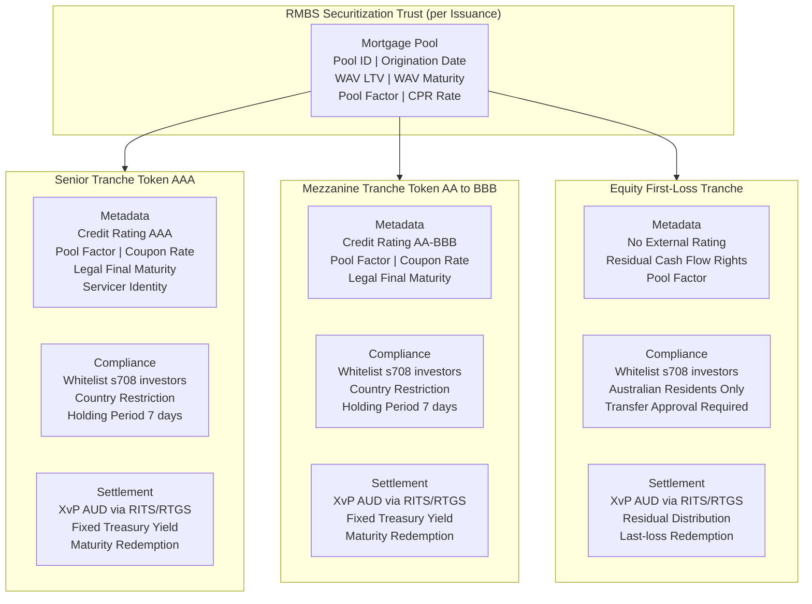

### 4.3 Data Feed Architecture for Pool Factor Management

Pool factor updates are the operational heartbeat of RMBS administration. Each month, the servicer calculates the new pool factor (outstanding principal / original principal) based on: scheduled mortgage amortisation, voluntary prepayments (modelled using the CPR rate), involuntary prepayments (defaults and forced sales), and new mortgage additions (for master trust structures).

DALP's Data Feed Connector receives the pool factor update from Westpac's CPR model via a JSON API call. The Restate execution engine orchestrates the pool factor update workflow:

1. Receive pool factor from CPR model
2. Validate pool factor (must be between 0 and the previous period's pool factor; cannot increase)
3. Create maker-checker approval request for Trust Manager and Servicer Officer
4. On approval, submit pool factor update transaction to Besu network
5. Chain Indexer indexes the pool factor update event with timestamp and approver identities
6. Trigger coupon distribution calculation based on new pool factor
7. Submit coupon distribution payment instructions to RITS/RTGS
8. Index payment confirmations
9. Export servicer report events to Investor Reporting Platform

Each step is a durable Restate checkpoint. If any step fails (network interruption, payment gateway timeout, signing service unavailable), Restate retries from the last checkpoint. Pool factor update failures are never silent: failed steps generate P1 alerts to SettleMint's support team and Westpac's technology operations team.

### 4.4 RMBS Metadata Schema

Each RMBS tranche token carries the following custom metadata fields:

| Field | Type | Description | Update Frequency |
|---|---|---|---|
| poolIdentifier | String | Unique identifier for the securitization pool | Static |
| trancheClass | Enum | Senior, Mezzanine, Equity | Static |
| creditRating | String | S&P/Moody's/Fitch current rating | On rating change |
| servicerIdentity | Address | OnchainID of the servicer entity | On servicer change |
| originationDate | Date | Pool origination date | Static |
| legalFinalMaturity | Date | Legal final maturity date | Static |
| weightedAverageLTV | Decimal | Current weighted average loan-to-value ratio | Monthly |
| weightedAverageMaturity | Decimal | Current weighted average remaining maturity | Monthly |
| poolFactor | Decimal (6dp) | Outstanding principal as fraction of original | Monthly |
| couponRate | Decimal | Annual coupon rate (fixed or BBSW + margin) | On reset (floating) |
| lastCouponDate | Date | Most recent coupon payment date | Monthly |
| nextCouponDate | Date | Next scheduled coupon payment date | Monthly |
| outstandingBalance | AUD | Current outstanding face value | Monthly |
| defaultRate | Decimal | Cumulative pool default rate | Monthly |
| prepaymentRate | Decimal | Current conditional prepayment rate | Monthly |

All metadata updates are recorded as on-chain events with the updating authority's identity and the timestamp. This provides an irrefutable history of every pool performance data update, supporting APRA examination requirements for data integrity evidence.

---

## 5. Solution Architecture

### 5.1 Four-Layer DALP Platform Stack for Westpac

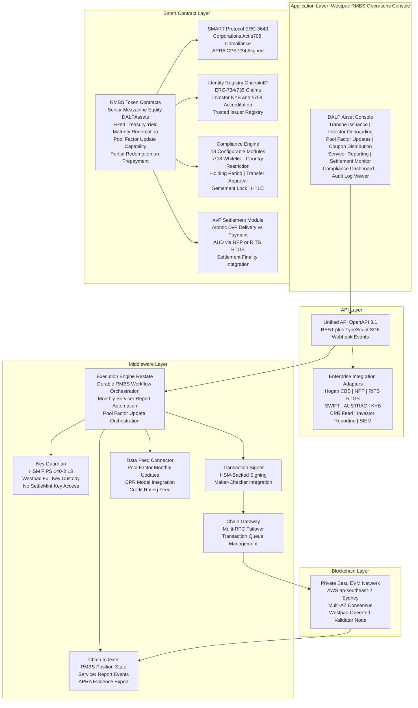

### 5.2 Integration Architecture

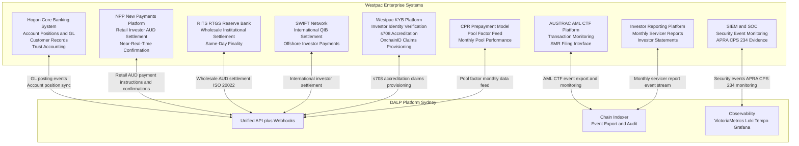

### 5.3 Westpac-Operated Besu Node Architecture

A critical aspect of Westpac's operational resilience and APRA CPS 230 exit planning requirements is the Westpac-operated Besu validator node. This node, operated by Westpac's infrastructure team, provides:

**Independent Blockchain Access:** Westpac can access the RMBS token state, audit trail, and transaction history independently of SettleMint's nodes. If SettleMint's cloud nodes are unavailable, Westpac's node maintains the blockchain record and allows read access to all RMBS positions.

**Consensus Participation:** Westpac's node participates in the private Besu network consensus. With validator nodes in AWS AZ-1, AWS AZ-2, and Westpac's data centre, the network requires at least 2 of 3 nodes for consensus. An AWS regional outage affecting both AZ-1 and AZ-2 would maintain consensus through Westpac's data centre node and whichever AWS node remains available (AZs are independent; both failing simultaneously is very low probability).

**APRA CPS 230 Exit Planning:** APRA CPS 230 requires institutions to have exit plans for material service providers. Westpac's Besu node ensures that even if SettleMint ceases operations, Westpac can continue to read all RMBS positions and transaction history from its own node. The smart contracts on the Besu network continue to operate independently of SettleMint's platform.

---

## 6. Asset Lifecycle Coverage

### 6.1 RMBS Issuance Workflow

The issuance workflow creates new RMBS tranche tokens for a new securitization. Each issuance corresponds to one securitization trust with three tranche token classes.

```mermaid
sequenceDiagram
    participant Westpac_Orig as Westpac Originator
    participant Trust_Mgr as Trust Manager
    participant DALP
    participant KYB_Sys as Westpac KYB
    participant Investors
    participant RITS

    Westpac_Orig->>Trust_Mgr: Pool assembly complete; pool metadata confirmed
    Trust_Mgr->>DALP: Create securitization (pool metadata, tranche sizing)
    DALP->>DALP: Maker-checker approval (Trust Mgr + Treasury Officer)
    DALP-->>Trust_Mgr: Token IDs for Senior, Mezzanine, Equity tranches created
    DALP-->>Trust_Mgr: Holding Period 7 days activated on all tranches
    Trust_Mgr->>Investors: Distribution materials; subscription agreements
    Investors->>KYB_Sys: s708 accreditation verification request
    KYB_Sys->>DALP: Provision s708 accreditation claim to investor OnchainID
    DALP-->>Investors: Added to tranche Whitelist
    Note over DALP: Day 7: Holding Period expires
    Investors->>RITS: AUD payment for allocation amount
    RITS-->>DALP: AUD payment confirmed final and irrevocable
    DALP->>Investors: RMBS tranche tokens transferred (XvP complete)
    DALP->>HOGAN: GL posting event (trust funded)
    DALP->>Trust_Mgr: Issuance complete confirmation; all positions on-chain
```

### 6.2 Monthly Servicer Reporting Flow

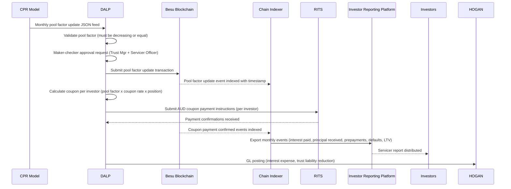

### 6.3 Investor Lifecycle

```mermaid
stateDiagram-v2
    [*] --> Pending : Onboarding Initiated
    Pending --> Accredited : s708 Verification Complete
    Accredited --> Whitelisted : Added to Tranche Whitelist
    Whitelisted --> HoldingPeriod : Subscription Confirmed
    HoldingPeriod --> Settled : Holding Period Expired plus XvP Complete
    Settled --> ActiveHolder : RMBS Token in Investor Custody
    ActiveHolder --> CouponReceived : Monthly Coupon Distributed
    CouponReceived --> ActiveHolder : Holding Continues
    ActiveHolder --> PrepaymentReceived : Partial Principal on Prepayment
    PrepaymentReceived --> ActiveHolder : Reduced Pool Factor Position
    ActiveHolder --> SecondaryTransfer : Sell in Secondary Market
    SecondaryTransfer --> BuyerCheck : s708 Check on Buyer
    BuyerCheck --> BuyerSettled : Buyer Eligible; XvP Complete
    BuyerSettled --> [*] : Original Investor Redeemed
    BuyerCheck --> TransferRejected : Buyer Not Eligible
    TransferRejected --> ActiveHolder : Original Investor Retains
    ActiveHolder --> MaturityRedemption : Legal Final Maturity
    MaturityRedemption --> [*] : Full Principal Returned
```

### 6.4 Prepayment Event Management in Detail

Prepayment events are the most operationally complex aspect of RMBS administration. A prepayment event occurs when mortgage borrowers in the pool repay their mortgages early (voluntarily, on property sale, or on refinancing). Prepayments reduce the outstanding pool balance, increase the pool factor decline beyond scheduled amortisation, and trigger a principal distribution to investors.

**Voluntary Prepayment Events:** When Westpac's servicer identifies a prepayment event (pool factor update exceeds normal amortisation schedule), DALP processes a partial principal distribution:

1. Servicer submits prepayment notification with updated pool factor and AUD prepayment amount
2. DALP calculates each investor's pro-rata share of the prepayment distribution
3. Maker-checker approval for the partial redemption event
4. RITS/RTGS payment instructions submitted for each investor's share
5. On payment confirmation, each investor's token balance is updated (partial redemption recorded)
6. Chain Indexer indexes the partial redemption events for servicer report inclusion
7. Hogan GL posting records the trust liability reduction

**Prepayment Speed Reporting:** DALP's Chain Indexer tracks cumulative pool factor changes and calculates the implicit prepayment speed (CPR) from on-chain data. This CPR calculation is exported to the Investor Reporting Platform as part of the monthly servicer report, providing investors with independently verifiable prepayment speed data (derived from the immutable on-chain record, not from the servicer's internal model).

### 6.5 Legal Final Maturity and Redemption

At the legal final maturity date of the RMBS trust, DALP triggers the final principal redemption:

1. Maturity date event fires in the smart contract (enforced by the Expiry Date compliance module)
2. DALP calculates the remaining outstanding balance per tranche (based on cumulative pool factor changes)
3. Maker-checker approval for the maturity redemption event
4. RITS/RTGS payment instructions submitted for each investor's final principal return
5. On payment confirmation, tokens are burned (supply is reduced to zero)
6. Hogan GL posting records trust closure
7. Chain Indexer generates the final securitization lifecycle report

After the Expiry Date, no further transfers of the tranche token are permitted (the Expiry Date compliance module permanently restricts transfers). Any tokens remaining in investor custody after the final redemption payment are dormant and non-transferable; the legal claim they represent has been extinguished by the final payment.

---

## 7. Compliance Architecture

### 7.1 Corporations Act s708: Wholesale Investor Enforcement

The Corporations Act s708 provides exemptions from the product disclosure statement (PDS) requirement for offers to sophisticated and wholesale investors. For RMBS distribution, Westpac uses the s708 wholesale investor exemption. DALP's Whitelist compliance module enforces this exemption at the protocol level.

**s708 Accreditation Types Supported:**

| Accreditation Type | Description | Claim Expiry |
|---|---|---|
| Net asset threshold (AUD 2.5M) | Investor's net assets exceed AUD 2.5 million as verified by Westpac's KYB platform | Annual review |
| Gross income threshold (AUD 250K/year) | Investor's gross income exceeds AUD 250,000 per year as verified by accountant certificate | Annual (certificate must be current) |
| Sophisticated investor certificate | AFSL-holder provides s708(10) certificate | 2 years maximum |
| Professional investor | ADI, insurance company, superannuation fund, managed investment scheme | Evergreen (entity status-based) |

**Whitelist Enforcement:** When a new investor subscribes to a Westpac RMBS tranche, the following verification sequence occurs:
1. Investor provides s708 accreditation documentation to Westpac's KYB team
2. KYB team verifies documentation against s708 threshold requirements
3. KYB platform creates an s708 accreditation claim in DALP's Identity Registry for the investor's OnchainID
4. The claim specifies: accreditation type, verification date, expiry date, and KYB officer identity
5. The investor's wallet address is added to the Whitelist for the relevant tranche(s)
6. Subsequent token transfers to the investor address succeed because the Whitelist check passes (the address is listed) and the Identity Verification check passes (the OnchainID holds a valid s708 claim)

**Non-Accredited Transfer Rejection:** If any party attempts to transfer RMBS tokens to an address that is not on the Whitelist (or whose s708 claim has expired), the transfer is rejected at the smart contract level before execution. The rejection event is recorded with: timestamp, initiating address, target address, and rejection reason (Whitelist: address not found, or Identity Verification: claim expired). These rejection events are automatically forwarded to Westpac's compliance team for review.

### 7.2 APRA CPS 230: Operational Risk Management Alignment

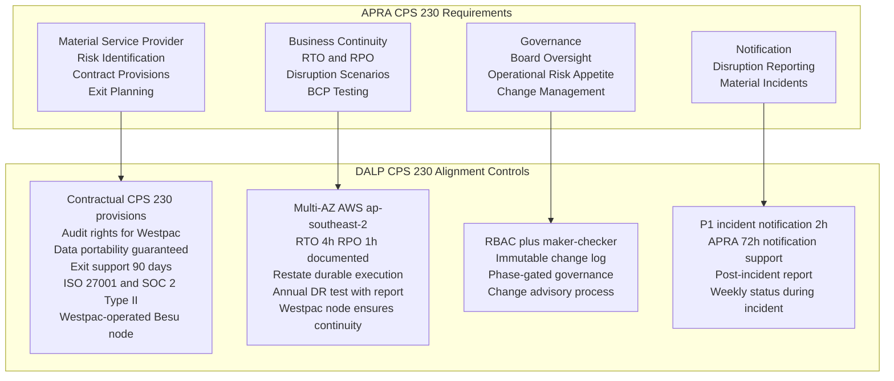

**Material Service Provider Contract Provisions:** SettleMint's standard MSA includes the contractual provisions required by APRA CPS 230 for material service providers:

- Audit rights: Westpac or Westpac-appointed auditor may conduct an annual on-site audit of SettleMint's operations relevant to the DALP service
- Data portability: Complete data export within 30 days of request, in structured machine-readable format
- Exit support: 90 days minimum transition support on termination, including read-only platform access
- BCP documentation: Annual BCP update provided to Westpac; annual DR test results shared with Westpac IT Risk
- Sub-contractor notification: Westpac notified of any change to material sub-contractors (cloud provider, HSM provider) with 90 days notice

### 7.3 APRA CPS 234: Information Security Architecture

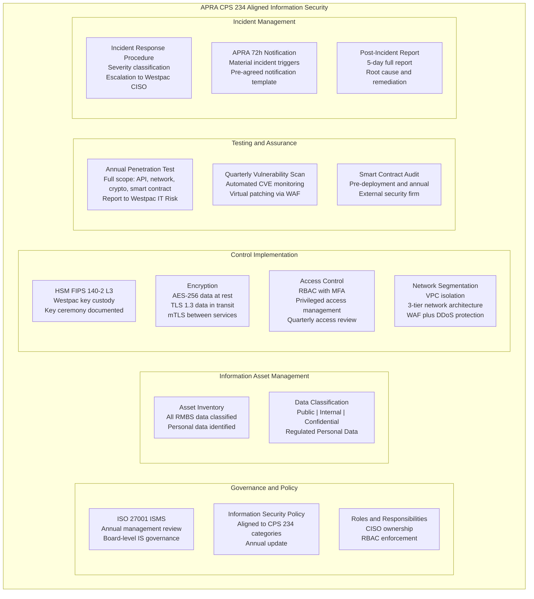

**CPS 234 Notification Procedure:** DALP's incident classification procedure identifies APRA-reportable incidents as those involving: confirmed or suspected unauthorised access to RMBS investor personal data; compromise of signing keys for RMBS operations; integrity breach of the on-chain audit trail; or material disruption to RMBS settlement operations lasting more than 4 hours. When a P1 incident is classified as potentially APRA-reportable:

1. SettleMint's on-call incident commander notifies Westpac's CISO within 2 hours of classification
2. Westpac's CISO reviews the classification and confirms whether APRA notification is required
3. Westpac files the APRA notification within the 72-hour window
4. SettleMint provides technical input for the APRA notification (timeline, scope, current containment status)
5. SettleMint provides the full post-incident report within 5 business days of incident closure

### 7.4 AUSTRAC AML/CTF Compliance

**Registration:** Westpac is registered with AUSTRAC as a reporting entity. The tokenized RMBS programme does not create new AUSTRAC registration obligations for SettleMint (SettleMint operates as a technology provider, not as a reporting entity). Westpac retains full AUSTRAC reporting responsibility.

**Transaction Monitoring Integration:** DALP exports all RMBS transaction events (token issuances, transfers, settlements, prepayment distributions, investor onboarding events) to Westpac's AUSTRAC reporting platform via the Chain Indexer event stream. Each event export includes: timestamp, event type, initiating identity (OnchainID), receiving identity (OnchainID), AUD amount, and settlement reference. Westpac's AML monitoring system applies transaction monitoring rules to these events and generates Suspicious Matter Reports (SMRs) when triggered.

**Beneficial Ownership:** For corporate investors in the RMBS programme, DALP's Identity Registry captures the investor entity identity at the OnchainID level. Full beneficial ownership chains (individual ultimate beneficial owners) are stored in Westpac's KYB platform and linked to the OnchainID through structured claims. AUSTRAC examinations of Westpac's RMBS investor records can access both the on-chain identity (through DALP's Identity Registry export) and the full KYB record (through Westpac's KYB platform).

### 7.5 Privacy Act and Australian Privacy Principles

**Personal Information in RMBS Context:** RMBS investors include individual retail investors who are natural persons with s708 accreditation (e.g., high net worth individuals who are not professional investors). Their identity information (name, address, accreditation details, account information) constitutes personal information under the Privacy Act.

**APP 11 Data Security:** All personal information is stored exclusively in Westpac's AWS ap-southeast-2 (Sydney) deployment. No personal information is stored outside Australia. The on-chain identity registry stores only: wallet addresses (pseudonymous identifiers), identity claim hashes (cryptographic attestations that a KYB check was completed, without the underlying data), and claim metadata (type, expiry, issuer). The full personal information record remains in Westpac's off-chain KYB system.

**APP 1 Open and Transparent Management:** DALP's data architecture supports Westpac's Privacy Policy obligations. The metadata stored on-chain (wallet addresses and claim hashes) is the minimum necessary for s708 enforcement; Westpac's Privacy Policy discloses that blockchain-based wallet addresses are used for RMBS administration purposes.

### 7.6 Regulatory Mapping Table

| Regulatory Requirement | Regulation | DALP Control | Confidence |
|---|---|---|---|
| s708 wholesale investor accreditation | Corporations Act | Whitelist compliance module; OnchainID s708 claim | 🟢 Native |
| s708 secondary transfer restriction | Corporations Act | Pre-transfer Whitelist check; transfer rejection on non-accredited buyer | 🟢 Native |
| Operational risk management (MSP) | APRA CPS 230 | CPS 230 contractual provisions; BCP; exit plan; Westpac node | 🟢 Native |
| Information security governance | APRA CPS 234 | ISO 27001; HSM; TLS 1.3; RBAC; MFA | 🟢 Native |
| 72-hour incident notification | APRA CPS 234 | 2-hour internal notification; APRA notification support procedure | 🟢 Native |
| AML/CTF transaction monitoring | AUSTRAC AML/CTF Act | Transaction event export to AUSTRAC platform | 🟡 Partial (Westpac monitoring) |
| Suspicious Matter Reports | AUSTRAC | SMR trigger events exported; Westpac files SMRs | 🟡 Partial (Westpac filing) |
| Data residency in Australia | Privacy Act APP 11 | AWS ap-southeast-2 (Sydney) only; no overseas transfer of personal data | 🟢 Native |
| Product disclosure exemption | Corporations Act s708 | s708 enforcement prevents non-accredited investor access | 🟢 Native |
| Settlement finality | RBA Payments System | RITS confirmation triggers XvP execution; RITS finality is irrevocable | 🟢 Native |
| Large exposure limits | APRA APS 221 | Holding Limit compliance module; configurable per-investor concentration | 🟡 Partial (configuration) |
| Information asset classification | APRA CPS 234 | Information asset inventory in ISMS | 🟢 Native |

---

## 8. Integration Architecture

### 8.1 Hogan Core Banking System Integration

Westpac's Hogan core banking system is the system of record for account positions, GL posting, and customer records. Hogan is a legacy core banking platform widely used by Australian banks.

**GL Posting Webhooks:** Every RMBS lifecycle event in DALP generates a GL posting webhook to Hogan. The GL mapping is configured during Phase 1 in consultation with Westpac's accounting and finance team. Key GL events:

| DALP Event | GL Posting Type | Account Impacted |
|---|---|---|
| RMBS issuance (trust funded) | Debit Cash; Credit Trust Liability | Trust funding account; trust liability |
| Coupon distribution | Debit Interest Expense; Credit Cash | P&L interest expense; settlement account |
| Principal redemption (scheduled) | Debit Trust Liability; Credit Cash | Trust liability reduction; cash payment |
| Prepayment distribution | Debit Trust Liability; Credit Cash | Trust liability reduction; cash payment |
| Final maturity redemption | Debit Trust Liability; Credit Cash | Trust closure; final cash payment |

**GL Reconciliation:** The daily GL reconciliation between Hogan and DALP compares: the sum of outstanding RMBS token balances in DALP (by tranche) against the corresponding trust liability balance in Hogan. Any discrepancy triggers an automated alert to Westpac's reconciliation team. Atomic XvP settlement means that discrepancies from timing differences (the primary cause of reconciliation fails in T+3 settlement) are eliminated: the Hogan GL event and the DALP token transfer are triggered by the same RITS confirmation event.

**Customer Record Sync:** New institutional investor customer records created in Hogan (during investor onboarding) are synchronized to DALP's Identity Registry through the integration layer. The Hogan customer identifier (unique customer number) is captured as a metadata field in the investor's OnchainID, enabling cross-system identity lookup during AUSTRAC examinations.

### 8.2 NPP Integration

The NPP (New Payments Platform) provides near-real-time AUD settlement for transactions up to the NPP single payment limit.

**Retail Investor Coupon Distributions:** For individual s708 investors (high net worth individuals) who are registered for NPP/PayID, monthly coupon distributions below the NPP limit are processed through NPP, providing same-day receipt of coupon payments regardless of the investor's bank.

**NPP Confirmation Handling:** DALP's RITS/NPP integration adapter handles both RITS (ISO 20022 pacs.009) and NPP (NPP payment confirmation messages) confirmations. The same XvP execution logic applies: on payment confirmation (from either RITS or NPP), the token transfer or state update executes. Payment failures (NPP or RITS) trigger the Settlement Lock (no token state change until payment is resolved).

### 8.3 RITS/RTGS Integration

**ISO 20022 Payment Instructions:** DALP generates RITS payment instructions in ISO 20022 pacs.009 format (credit transfer) for wholesale institutional investor settlements. Instructions include: payment reference (linked to the DALP settlement ID), credit account (investor's RITS account), debit account (Westpac's trust settlement account), AUD amount, and value date (same-day for RITS).

**Settlement Finality:** RITS provides irrevocable same-day settlement finality. The RITS confirmation message (pacs.002 or camt.025 format) is the trigger event for DALP's XvP settlement execution: on receipt of RITS confirmation, the RMBS token transfer is executed atomically with the RITS payment. There is no window between RITS payment finality and token transfer; both complete in the same transaction sequence triggered by the RITS confirmation.

**RITS Fallback:** If RITS is unavailable (planned maintenance window or unplanned outage), DALP's Settlement Lock holds all pending XvP transactions in a locked state. The investor's token allocation is confirmed but not transferred; the trust's AUD has been received (or will be when RITS is restored). When RITS connectivity is restored, Restate's durable execution resumes the pending settlement from the checkpoint where RITS confirmation was awaited.

### 8.4 SWIFT Integration for Offshore QIBs

International QIB investors (US-registered qualified institutional buyers, UK FCA-regulated institutions, Singapore MAS-regulated institutions, and other pre-approved offshore investors) are settled through SWIFT.

**SWIFT Payment Generation:** DALP generates SWIFT payment instructions (MT202 for bank-to-bank credit, or pacs.009 ISO 20022 format for ISO 20022-connected institutions) for offshore investor settlements. Instructions route through Westpac's SWIFT gateway.

**Country Restriction for Offshore Investors:** Offshore QIBs are subject to the Country Restriction compliance module. The jurisdiction list of permitted offshore QIB jurisdictions is maintained by Westpac's compliance team in DALP's Compliance Dashboard. Investors from jurisdictions subject to AUSTRAC-directed or Australian sanctions restrictions are automatically blocked.

### 8.5 AUSTRAC Reporting Interface

**Structured Event Export:** The Chain Indexer exports all transaction events in JSON format to Westpac's AUSTRAC reporting platform. The event schema includes all fields required for AUSTRAC's transaction reporting: customer reference (OnchainID linked to KYB record), transaction type, AUD amount, counterparty details, settlement reference, and timestamp.

**SMR Trigger Events:** Certain DALP events are flagged as potential SMR trigger events and forwarded to Westpac's AML compliance team for review: transfer rejections due to compliance module failures (may indicate attempted non-compliant transfer); large-value single transactions above Westpac's AML monitoring thresholds; and transactions involving investors from high-risk jurisdictions (even if the jurisdiction is technically permitted by Country Restriction, AUSTRAC monitoring rules may require enhanced review).

### 8.6 KYB and Identity Integration

**s708 Accreditation Claims Provisioning:** The KYB integration is the critical path for investor onboarding. When Westpac's KYB team completes s708 accreditation verification for a new investor, the KYB platform calls DALP's Identity API to provision the s708 claim:

```
POST /api/v1/identity/claims
{
  "investor_onchaind_id": "0x...",
  "claim_type": "s708_accreditation",
  "accreditation_type": "net_assets_threshold",
  "verified_by": "officer_id_789",
  "verification_date": "2026-03-20",
  "expiry_date": "2027-03-20",
  "investor_name_hash": "sha256(legal_name)",
  "jurisdiction": "Australia"
}
```

**Claim Expiry Management:** DALP monitors claim expiry dates and generates renewal alerts 60 days before expiry. Alerts are forwarded to Westpac's KYB team through a webhook. If a claim expires without renewal, DALP automatically removes the investor's address from the Whitelist, preventing further transfers until accreditation is renewed. Existing holdings are not affected by Whitelist removal (the investor retains their tokens); only new inbound transfers are blocked.

---

## 9. Custody and Key Management

### 9.1 Westpac Full Key Custody Model

Westpac's requirement for full key custody is implemented through a bring-your-own-infrastructure model for the HSM component:

**Option A (Recommended): AWS CloudHSM in Westpac's VPC.** AWS CloudHSM is FIPS 140-2 Level 3 certified and is deployed within Westpac's dedicated AWS ap-southeast-2 VPC. Westpac's infrastructure team controls the CloudHSM credentials; SettleMint's Key Guardian communicates with the CloudHSM via the PKCS#11 API but has no access to the key material. All signing operations happen within the CloudHSM; the private key never leaves the HSM.

**Option B: Westpac On-Premise HSM.** If Westpac prefers to use its existing physical HSM hardware (Luna Network HSM or Thales Network HSM) in its Sydney data centre, DALP's Key Guardian can connect to the on-premise HSM via the AWS Direct Connect private link. Network latency from AWS ap-southeast-2 to Westpac's data centre HSM is typically under 5 milliseconds, well within the signing performance requirements.

**SettleMint Zero-Knowledge of Keys:** Under both options, SettleMint has no access to Westpac's signing keys. The Key Guardian is a signing service that routes signing requests to the HSM; it does not store, cache, or transmit private key material. SettleMint's access to the DALP platform API does not provide any signing capability; all signing operations require authentication through Westpac's HSM access credentials.

### 9.2 Key Hierarchy

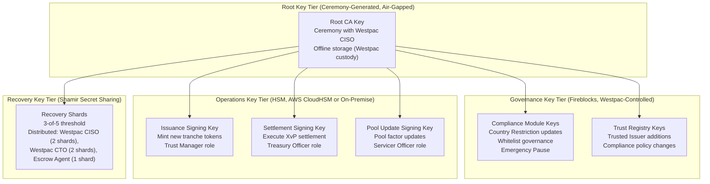

### 9.3 Key Ceremony

For Westpac's RMBS programme, an HSM key ceremony is conducted at programme initiation (Phase 2). The ceremony generates the root CA key and first-tier operational keys in a controlled, witnessed, documented process:

**Ceremony Protocol:**
1. Ceremony conducted in Westpac's secure facility with CISO and CTO as ceremony officers
2. HSM is reset to factory state in the presence of ceremony officers
3. Root CA key is generated within the HSM using hardware random number generation
4. Recovery shards are generated using Shamir Secret Sharing (3-of-5 threshold)
5. Shards are distributed to designated key custodians in tamper-evident envelopes
6. Ceremony is documented with video evidence and signed attestation from all officers
7. Operational sub-keys are derived from the root CA key within the HSM
8. Ceremony documentation is retained by Westpac's CISO as APRA CPS 234 evidence

---

## 10. Settlement and Operations

### 10.1 XvP AUD Settlement: Institutional Investor Flow

```mermaid
sequenceDiagram
    participant Westpac_Trust as Westpac Trust
    participant DALP
    participant Settlement as XvP Settlement Module
    participant RITS
    participant Investor as Institutional Investor
    participant HOGAN

    Westpac_Trust->>DALP: Initiate primary allocation XvP for Senior Tranche
    DALP->>Settlement: Create XvP settlement (tokens vs AUD amount)
    Settlement-->>DALP: Settlement ID; tokens locked in Settlement Lock
    DALP->>Investor: Settlement instruction (RITS payment reference and amount)
    Investor->>RITS: Submit AUD payment to Westpac trust settlement account
    RITS-->>DALP: RITS final settlement confirmed (irrevocable)
    DALP->>Settlement: Execute atomic settlement on RITS confirmation
    Settlement->>Investor: RMBS Senior Tranche tokens transferred to investor address
    Settlement->>Westpac_Trust: AUD credited to trust funding account
    Settlement-->>DALP: Both legs confirmed; settlement ID closed
    DALP->>HOGAN: GL posting event (trust funded; tranche issued)
    DALP->>Investor: Settlement confirmation with token balance update
```

### 10.2 T+0 Settlement: Risk and Capital Impact

**Counterparty Risk Elimination:** Current T+3 RMBS settlement means that for 3 business days after a trade, Westpac holds the economic risk of investor default (investor has agreed to pay but has not yet settled). For a single RMBS issuance of AUD 1 billion, 3 days of unhedged counterparty exposure represents a material credit risk. DALP's T+0 settlement with RITS finality eliminates this exposure: the investor's payment is final before the token is delivered.

**Capital Efficiency:** Under APRA's capital adequacy standards (APS 112), T+3 RMBS trade receivables carry a credit risk weight for the 3-day settlement period. T+0 settlement eliminates this risk weight for settled positions, with a direct capital efficiency benefit. The capital savings from T+0 settlement on a AUD 10 billion RMBS programme at 15% average RWA and 10% capital requirement is approximately AUD 5 million in reduced capital requirements.

**Failed Settlement Reduction:** T+3 RMBS settlement has a settlement fail rate (industry benchmark: 0.5-2% of trades). Failed settlements require manual resolution (matching, novation, buy-in procedures) that is operationally intensive and incurs counterparty charges. Atomic XvP settlement has a near-zero fail rate: either the payment is confirmed (and settlement completes) or the payment is not confirmed (and the token lock is released; no settlement occurs; no clean-up required).

### 10.3 NPP vs RITS Routing Logic

DALP's payment routing logic determines whether a given payment uses NPP (near-real-time, lower limit) or RITS (wholesale settlement, higher limit and finality):

| Investor Type | Payment Amount | Routing |
|---|---|---|
| Individual s708 investor (high net worth) | Below NPP limit | NPP |
| Individual s708 investor (high net worth) | Above NPP limit | RITS |
| Superannuation fund | Any | RITS |
| Fund manager | Any | RITS |
| Insurance company | Any | RITS |
| International QIB | Any | SWIFT |
| ADI (bank) | Any | RITS |

The routing logic is configured by Westpac's treasury team in DALP's payment routing configuration and can be updated without a platform change.

---

## 11. Security Architecture

### 11.1 APRA CPS 234 Control Mapping

| CPS 234 Requirement Area | DALP Implementation | Evidence Category |
|---|---|---|
| Information security roles | CISO-owned ISMS; RBAC with defined roles | Organisation chart; ISMS document |
| Information security capability | ISO 27001 certified; annual pen testing; dedicated security team | ISO 27001 certificate; pen test reports |
| Information asset identification and classification | Asset inventory in ISMS; RMBS data classified as Confidential/Regulated | ISMS asset inventory |
| Implementation of controls | HSM, TLS 1.3, VPC, MFA, RBAC (technical controls); ISMS, training, audits (operational) | Control evidence pack |
| Control effectiveness testing | Annual pen test; quarterly vulnerability scanning; control self-assessment | Test reports; scan results |
| Internal audit | Annual ISO 27001 surveillance audit; SOC 2 Type II covers 12-month effectiveness | Audit reports; SOC 2 report |
| APRA incident notification | 72h notification procedure; Westpac CISO integration; pre-agreed incident template | Notification procedure; tabletop test evidence |

### 11.2 Network Security and VPC Architecture

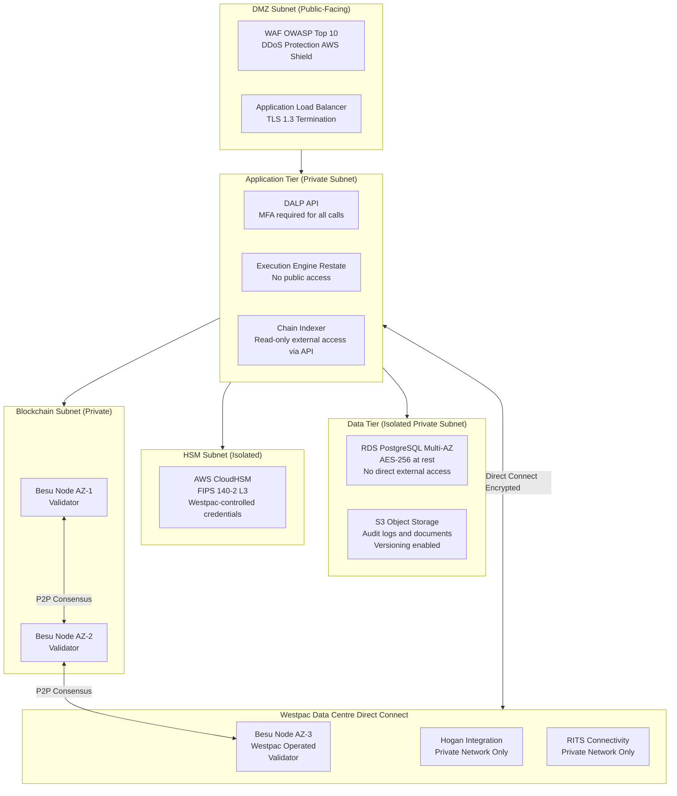

### 11.3 Penetration Testing Scope for RMBS Programme

The annual penetration test for Westpac's RMBS deployment covers:

**In-Scope:**
- DALP API surface (all endpoints including investor onboarding, pool factor update, settlement, audit export)
- Application layer authentication (API key management, session handling, MFA bypass attempts)
- Network perimeter (VPC security group rules, WAF effectiveness, ALB configuration)
- Key management (HSM access controls, signing key extraction attempts)
- Smart contract layer (RMBS token contracts, compliance engine, XvP settlement)
- Chain Indexer security (read-only export API, event stream access controls)
- AWS CloudHSM configuration (against FIPS 140-2 Level 3 requirements)
- Westpac Besu node security (P2P network access, consensus manipulation attempts)

**Deliverables:**
- Executive summary for Westpac board-level reporting
- Full technical report with CVSS-scored findings
- Remediation recommendations with priority classification
- Retest evidence for critical and high findings

Westpac's IT Risk team receives the full penetration test report. Critical and high findings are remediated before go-live; medium and low findings are scheduled in the post-go-live patch management cycle.

---

## 12. Deployment Options

### 12.1 AWS ap-southeast-2 (Sydney) Multi-AZ Deployment

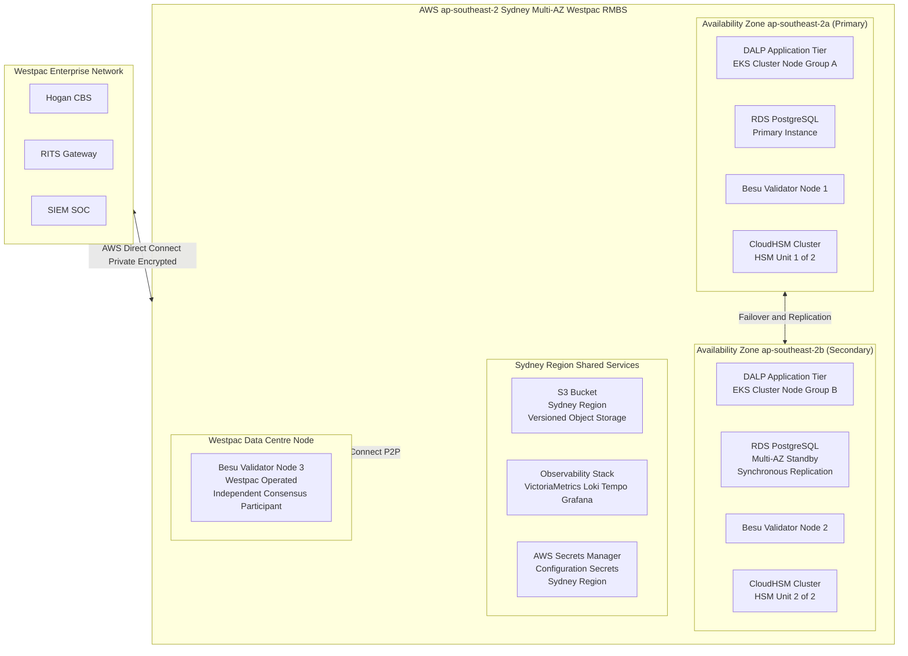

**Sizing for Initial RMBS Programme:**
- EKS cluster: 6 application nodes (3 per AZ) with horizontal pod autoscaling
- RDS: db.r6g.xlarge Multi-AZ (scalable to r6g.2xlarge for higher volume)
- Besu nodes: t3.xlarge (sufficient for 100-500 TPS on private network)
- CloudHSM: 2-unit cluster (minimum for HA; expandable to 3 for higher throughput)

---

## 13. Implementation Approach

### 13.1 20-Week Programme Structure

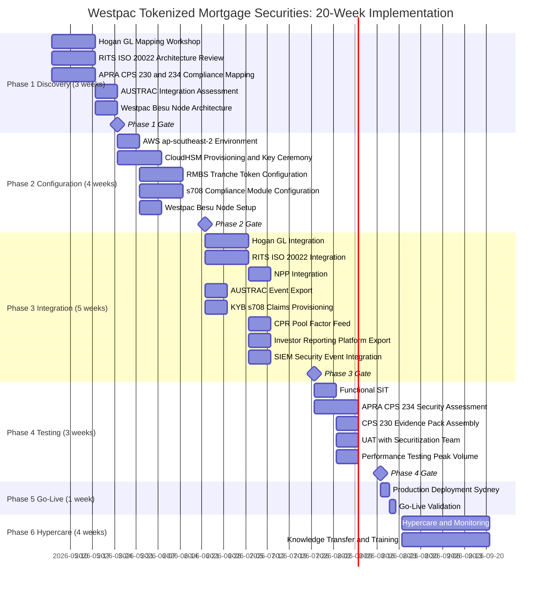

### 13.2 Full RAID Register

**Risks:**

| Risk ID | Risk | Likelihood | Impact | Inherent | Mitigation | Residual |
|---|---|---|---|---|---|---|
| R-001 | ASIC managed investment scheme classification for tokenized RMBS requires restructuring | Low | High | Medium | Phase 1 legal assessment; DALP supports multiple classification structures | Low |
| R-002 | RITS ISO 20022 integration complexity higher than estimated | Medium | High | High | Phase 1 RITS architecture review; RBA team engagement in Phase 1 | Medium |
| R-003 | APRA CPS 234 security assessment pre-go-live identifies gaps | Low | High | Medium | Phase 2 CPS 234 alignment; Phase 4 assessment with remediation buffer | Low |
| R-004 | Hogan GL mapping complexity for trust accounting (RMBS is multi-party) | Medium | Medium | Medium | Phase 1 GL mapping workshop; Westpac finance team involvement from Phase 1 | Low |
| R-005 | CPR prepayment model data feed format incompatible | Low | Medium | Low | Phase 1 data feed format assessment; JSON format accepted | Very Low |
| R-006 | s708 accreditation certificate volume creates operational overhead | Medium | Low | Low | Automated expiry alerts; bulk renewal workflow | Very Low |
| R-007 | AUSTRAC reporting integration rule complexity | Medium | Medium | Medium | Phase 1 AUSTRAC assessment; Westpac AML team involvement | Low |
| R-008 | Westpac Besu node provisioning delayed | Low | Medium | Low | Phase 2 early node setup; SettleMint cloud nodes provide bridge consensus | Very Low |
| R-009 | Offshore QIB SWIFT payment routing complexity | Low | Medium | Low | Phase 1 SWIFT assessment; RITS/RTGS fallback for eligible offshore investors | Very Low |
| R-010 | Pool factor update automation reliability | Low | High | Medium | Restate durable execution retries; maker-checker confirmation; P1 alert on failure | Low |
| R-011 | APRA examination occurs during programme delivery | Low | Medium | Low | Phase 4 APRA evidence pack assembled pre-go-live; CPS 234 alignment documented | Very Low |
| R-012 | AUD/EUR exchange rate creates budget variance | Low | Low | Very Low | Westpac treasury manages AUD/EUR hedging; EUR license is fixed | Very Low |
| R-013 | Coupon calculation errors for floating BBSW rate inputs | Low | High | Medium | BBSW rate feed validated in Phase 3; calculation methodology audited | Low |
| R-014 | AWS ap-southeast-2 full regional outage | Very Low | High | Medium | Westpac Besu node maintains blockchain access; RITS manual settlement fallback | Low |
| R-015 | Regulatory change to Corporations Act s708 thresholds | Low | Medium | Low | Configuration-driven s708 parameters; reconfiguration without smart contract change | Very Low |

**Assumptions:**

| ID | Assumption | Impact if Incorrect |
|---|---|---|
| A-001 | Hogan exposes a RESTful or SOAP API for GL posting with available documentation | Requires batch file-based GL integration as alternative; Phase 3 extension |
| A-002 | RITS ISO 20022 connectivity accessible through Westpac's existing RITS settlement account | RITS connectivity is Westpac-managed; delay extends Phase 3 |
| A-003 | NPP API accessible through Westpac's existing NPP bank connectivity | NPP connectivity is Westpac-managed; no SettleMint NPP connectivity required |
| A-004 | CPR model produces a monthly pool factor in standard numeric format | Non-standard format requires data feed adapter development (Phase 3) |
| A-005 | Westpac's data centre has sufficient bandwidth and latency for Besu P2P consensus | Network performance validated in Phase 2 node setup |

**Issues:**

| ID | Issue | Priority | Owner | Resolution |
|---|---|---|---|---|
| I-001 | BBSW rate feed source and update frequency to be confirmed | Medium | Westpac Treasury | Resolve in Phase 1; Bloomberg or RBA BBSW source accepted |
| I-002 | AUSTRAC RMBS event schema to be aligned with Westpac's AML monitoring system | Medium | Westpac Compliance Tech | Phase 1 AUSTRAC schema workshop |

**Dependencies:**

| ID | Dependency | Owner | Required By |
|---|---|---|---|
| D-001 | Hogan API documentation and sandbox | Westpac CBS | Phase 1 Week 1 |
| D-002 | RITS ISO 20022 test environment and credentials | Westpac Treasury | Phase 3 Week 1 |
| D-003 | NPP API access | Westpac Payments | Phase 3 Week 2 |
| D-004 | AUSTRAC reporting platform API | Westpac Compliance Tech | Phase 3 Week 1 |
| D-005 | KYB platform API | Westpac KYB Team | Phase 3 Week 1 |
| D-006 | CPR model data feed format specification | Westpac Risk | Phase 3 Week 3 |
| D-007 | Investor reporting platform API | Westpac Securitization | Phase 3 Week 4 |
| D-008 | AWS Direct Connect provisioned | Westpac Infrastructure | Phase 2 Week 1 |
| D-009 | Westpac Besu node hardware and network | Westpac Infrastructure | Phase 2 Week 2 |
| D-010 | CloudHSM or on-premise HSM decision confirmed | Westpac CISO | Phase 2 Week 1 |

---

## 14. Support and SLA

### 14.1 Premium Support

SettleMint recommends Premium Support for Westpac's RMBS programme. RMBS operations are time-sensitive: monthly pool factor updates and coupon distributions have firm deadline dates; RITS settlement windows are specific business hours.

**Support SLA:**

| Metric | Commitment |
|---|---|
| Monthly uptime SLA | 99.95% |
| P1 Response | 1 hour |
| P1 Resolution | 4 hours |
| P2 Response | 4 hours |
| P2 Resolution | 8 hours |
| Sydney-timezone coverage | 07:00 to 22:00 AEDT, Monday to Friday |
| P1 on-call | 24/7 |
| Named support engineer | Familiar with Westpac RMBS integration |
| Monthly technical review | Yes |

**RMBS-Specific P1 Definitions:** Platform unavailable during monthly pool factor update window; XvP settlement failure for active RMBS issuance; RITS integration unavailable preventing settlement; key management failure blocking pool factor update; APRA-reportable security incident detected; servicer report export failure on servicer report due date.

**Monthly Settlement Calendar:** Westpac's trust manager provides SettleMint's support team with a monthly RMBS operations calendar (pool factor update dates, coupon distribution dates, expected settlement dates). SettleMint's support team maintains heightened monitoring during these calendar events.

---

## 15. Reference Projects

| Institution | Use Case | Region | Relevance |
|---|---|---|---|
| Commonwealth Bank of Australia | Tokenized bond issuance | Australia | Same APRA/ASIC/Australian regulatory context; most directly comparable |
| Commerzbank | Hybrid ETP issuance; settlement under 10s; EUR 7M savings | Germany | RMBS-adjacent securities; settlement speed and savings benchmark |
| Mizuho Bank | Bond tokenization | Japan/Singapore | APAC institutional fixed income tokenization |
| Standard Chartered | Digital Virtual Exchange | Multi-APAC | Multi-jurisdiction institutional securities |
| ADI Finstreet | Tokenized equity; Fireblocks custody | UAE | Bring-your-own-custody; full key custody model |
| Maybank Project Photon | FX tokenization; XvP settlement | Malaysia | XvP mechanics; NPP-equivalent payment rail integration |
| IsDB Market Stabilization | Collateral management | Multi-region | Collateral lock mechanics; structured note administration |
| OCBC Bank | Security token engine | Singapore | Multi-year production institutional deployment |

---

## 16. Regulatory Alignment

### 16.1 APRA Regulatory Framework Summary

DALP's deployment for Westpac's RMBS programme addresses the relevant APRA prudential standards:

**CPS 230 (Operational Risk Management):** SettleMint is a material service provider under CPS 230. All contractual provisions required by CPS 230 are included in the MSA: audit rights, data portability, exit plan, BCP documentation, sub-contractor notification. The Westpac-operated Besu node is the critical CPS 230 exit planning feature: even if SettleMint ceases operations, Westpac's node maintains blockchain access.

**CPS 234 (Information Security):** DALP's ISO 27001 ISMS, HSM key management, network architecture, penetration testing, and incident response procedure are aligned with CPS 234 requirements. The APRA CPS 234 evidence pack assembled in Phase 4 provides structured evidence for each CPS 234 capability area.

**APS 210 (Liquidity):** RMBS and covered bonds are instruments that Westpac uses for liquidity management. Tokenized RMBS settlement at T+0 improves Westpac's liquidity profile by eliminating the T+3 settlement delay; APS 210 liquidity reporting benefits from T+0 settlement accuracy.

### 16.2 ASIC Corporations Act

DALP's s708 Whitelist compliance module ensures that RMBS tokens are distributed and transferred exclusively to s708-verified wholesale investors. This enforcement is at the protocol level, not the application level: even if the application layer were compromised, the smart contract would reject transfers to non-whitelisted addresses.

---

## 17. Response Matrix

| Req ID | Requirement | Status | Confidence | Notes |
|---|---|---|---|---|
| TR-01 | Full RMBS lifecycle from issuance to maturity redemption | Supported | 🟢 Native | All lifecycle events covered |
| TR-02 | s708 wholesale investor accreditation enforcement at protocol level | Supported | 🟢 Native | Whitelist with OnchainID s708 claims |
| TR-03 | AUD settlement via NPP (retail) and RITS/RTGS (institutional) | Supported | 🟢 Native | Both NPP and RITS integration |
| TR-04 | Westpac full key custody; no SettleMint key access | Supported | 🟢 Native | Westpac-controlled CloudHSM or on-premise HSM |
| TR-05 | APRA CPS 230 material service provider compliance | Supported | 🟢 Native | All CPS 230 contractual provisions; Westpac node |
| TR-06 | APRA CPS 234 information security; 72h APRA notification | Supported | 🟢 Native | ISO 27001; HSM; incident procedure |
| TR-07 | Monthly servicer report automation via Chain Indexer | Supported | 🟢 Native | Automated event export to investor reporting platform |
| TR-08 | Pool factor updates from CPR model via data feed | Supported | 🟢 Native | Data Feed Connector; maker-checker workflow |
| TR-09 | AWS ap-southeast-2 Sydney deployment for APRA data residency | Supported | 🟢 Native | Dedicated Sydney deployment |
| TR-10 | Immutable audit trail for APRA CPS 234 evidence | Supported | 🟢 Native | Cryptographically chained Chain Indexer |
| TR-11 | AUSTRAC AML/CTF transaction monitoring integration | Supported | 🟡 Partial | Event export to Westpac's AUSTRAC platform |
| TR-12 | Privacy Act APP 11 data residency and minimisation | Supported | 🟢 Native | Sydney deployment; hash-only on-chain; full data in Westpac KYB |
| TR-13 | Hogan core banking GL posting integration | Supported | 🟡 Partial | GL posting webhook; Hogan API confirmed Phase 3 |
| TR-14 | Prepayment event partial redemption management | Supported | 🟢 Native | Pool factor update with partial principal distribution |
| TR-15 | Country Restriction for offshore QIB investors | Supported | 🟢 Native | Country Restriction module; configurable jurisdiction list |
| TR-16 | Holding Period 7-day initial distribution lock | Supported | 🟢 Native | Holding Period compliance module |
| TR-17 | SWIFT for offshore institutional investor settlement | Supported | 🟡 Partial | SWIFT payment generation; Westpac SWIFT gateway |
| TR-18 | BCP with Westpac-operated node for resilience | Supported | 🟢 Native | Multi-AZ plus Westpac Besu node; RTO 4h RPO 1h |
| TR-19 | Smart contract governance and upgrade management | Supported | 🟢 Native | Maker-checker; staged deployment; UOB approval gate |
| TR-20 | All capabilities verified as live (not roadmap) | Supported | 🟢 Native | All claimed capabilities live in DALP |

---

## 18. Appendix A: Risk Register

*(15 risks documented in Section 13.2 RAID Register)*

---

## 19. Appendix B: Compliance Module Catalog

All 18 DALP compliance modules are available. The following 16 are activated for Westpac's RMBS programme:

| Module | Full Description | Westpac Application | Active |
|---|---|---|---|
| Whitelist | Restricts transfers to pre-approved addresses. The whitelist for each RMBS tranche contains the wallet addresses of all s708-verified investors. Transfers to addresses not on the whitelist are rejected pre-execution. Whitelist additions and removals require maker-checker approval. | s708 investor access control for all three tranche classes | Yes |
| Country Restriction | Blocks transfers involving counterparties from restricted jurisdictions. Configurable jurisdiction list maintained by Westpac's compliance team. Sub-jurisdiction restrictions for specific investor categories within permitted countries. | Australian residents; pre-approved offshore QIB jurisdictions only | Yes |
| Identity Verification | Requires counterparties to hold valid, unexpired identity claims in the Identity Registry. For RMBS, the required claim is the s708 accreditation claim issued by Westpac's KYB platform. Claims with expiry enforce ongoing accreditation renewal. | Mandatory s708 accreditation claim for all RMBS investors | Yes |
| Holding Period | Enforces a minimum hold duration before transfer. For RMBS, prevents transfer of newly issued tokens for 7 days from the issuance date, reflecting the initial distribution lock period. | 7-day initial distribution lock on all tranches from issuance | Yes |
| Transfer Approval | Requires explicit approval from a designated approver before transfer executes. Used for Equity/First-Loss tranche secondary transfers to add an additional governance layer reflecting the complex risk profile. | Equity tranche secondary market transfer governance | Yes (equity tranche) |
| Settlement Lock | Locks tokens during XvP settlement execution. Prevents any other transfer operation while the atomic settlement is in progress. If either leg fails, both settlement lock and token state revert. | XvP settlement integrity for all tranche transfers | Yes |
| Expiry Date | Permanently restricts transfers after the legal final maturity date. Post-maturity, tokens are non-transferable; the legal claim they represent has been extinguished by the final redemption payment. | Legal final maturity enforcement for all tranches | Yes |
| Transfer Freeze | Freezes transfers for a specific investor address without revoking the KYB claim. Used for AUSTRAC investigation holds or court-ordered freezes on specific investors. | AUSTRAC-directed investigation holds; court orders | Yes |
| Token Pause | Pauses all transfers for a specific token/tranche. Used for trust disputes, court orders affecting the whole tranche, or APRA-directed suspension. | Emergency tranche suspension | Yes |
| Blacklist | Blocks specific addresses from all transfers. Used for post-AUSTRAC confirmed sanctions: investors confirmed as sanctioned are blacklisted immediately, preventing any further transfers. | AUSTRAC-confirmed sanctions enforcement | Yes |
| Supply Limit | Caps total outstanding supply. Each securitization trust has a defined maximum issuance size per tranche; the Supply Limit enforces this cap. | Securitization trust issuance size enforcement | Yes |
| Issuance Restriction | Restricts minting authority to specific addresses. Only Westpac Trust Manager addresses can create new RMBS tokens. Prevents unauthorised token creation. | Westpac Trust Manager sole issuance authority | Yes |
| Collateral Backing | Requires collateral lock before transfer. Used when RMBS tokens are used as repo collateral: the token is locked as collateral backing, preventing transfer while the repo is outstanding. | RMBS repo collateral locking | Yes |
| Cross-Chain Lock HTLC | HTLC atomic cross-chain settlement. Used for offshore QIB settlement where SWIFT payment and token delivery must be atomic across different settlement rails. | Offshore QIB SWIFT-to-AUD atomic settlement | Yes |
| Time-Lock | Restricts transfers before a specified time. Used to prevent pre-settlement transfers during the RITS processing window (ensuring settlement is not disrupted by competing transfers). | RITS settlement window protection | Yes |
| Transfer Limit | Per-transaction amount limit. Can be used to enforce minimum ticket sizes for institutional RMBS tranches (e.g., minimum AUD 500,000 transfer for Mezzanine tranche). | Institutional minimum ticket size enforcement | Optional |
| Holding Limit | Per-address concentration cap. Can be used to enforce APRA large exposure concentration limits for single investor holdings. | APRA large exposure concentration limits | Optional |
| Trading Window | Restricts transfers to business hours. Optional control for institutions that want to prevent off-hours RMBS trading. | Not used in standard RMBS configuration | Optional |

---

## 20. Appendix C: Operational Run State and BAU Model

### 20.1 BAU Operating Model

| Function | Westpac Team | Daily/Monthly Activities |
|---|---|---|
| Securitization Operations | Trust Management | Daily: Monitor tranche status. Monthly: Pool factor updates, coupon distributions, servicer report review |
| Investor Services | Securitization Investor Relations | s708 accreditation renewals; new investor onboarding; secondary transfer approvals |
| Technology Operations | IT Operations | Monitor DALP observability; AWS infrastructure management; SIEM event review; SettleMint support escalation |
| Compliance Operations | Compliance | AUSTRAC event review; Country Restriction updates; investor freeze management; CPS 234 evidence maintenance |
| Treasury Operations | Treasury | Settlement monitoring; RITS reconciliation; cash position management |
| Risk Management | IT Risk | Annual CPS 234 review; quarterly access review; annual penetration test coordination |

### 20.2 Monthly RMBS Operations Calendar

The monthly RMBS operations cycle is highly time-sensitive. DALP's BAU model defines the standard monthly timeline:

| Day of Month | Event | System | Owner |
|---|---|---|---|
| Day 1 to 3 | CPR model produces new pool factor | CPR Model | Westpac Risk |
| Day 3 | Pool factor feed submitted to DALP | DALP Data Feed | Auto (with maker-checker) |
| Day 3 | Pool factor update transaction approved | DALP | Trust Manager plus Servicer Officer |
| Day 5 | Coupon calculation completed | DALP | Auto (based on pool factor) |
| Day 7 | RITS payment instructions submitted for coupon distribution | DALP/RITS | Auto |
| Day 7 to 8 | Coupon payments confirmed and credited | RITS/NPP | Auto |
| Day 8 | Chain Indexer servicer report events exported | DALP/Indexer | Auto |
| Day 10 | Investor Reporting Platform assembles and distributes servicer reports | Investor Reporting | Westpac Securitization |
| Day 10 | Hogan GL posting reconciliation completed | DALP/Hogan | Auto plus reconciliation team |
| Day 15 | AUSTRAC transaction monitoring review of month's RMBS events | Westpac Compliance | Compliance Team |

### 20.3 Annual APRA Examination Preparation

DALP's Chain Indexer and audit trail architecture make APRA examination preparation a structured process rather than an ad hoc evidence collection exercise:

**Pre-Examination Export (1 day):** DALP generates a structured evidence export covering the examination period: all token events, all compliance decisions, all access events, all configuration changes, all settlement events, and all incident records. The export is in APRA-compatible format with field descriptions.

**Evidence Pack Assembly (1 to 2 days):** Westpac's IT Risk team maps the DALP evidence export to the specific CPS 230 and CPS 234 examination categories using the DALP Evidence Pack Template (prepared by SettleMint in Phase 4 and updated annually).

**Total Preparation Time:** 2 to 3 days, compared to 3 to 5 days for the current manual assembly process. The time saving is approximately 50%, and the quality improvement (structured, verifiable, cryptographically attestable audit data vs manually assembled records) is significant for examination outcomes.

---

---

## 21. Extended Section: Smart Contract Architecture for RMBS

### 21.1 ERC-3643 and RMBS Instruments

DALP's smart contract layer uses ERC-3643 (the T-REX protocol for identity-bound, compliance-enforced tokens) as the foundation for RMBS token contracts. ERC-3643 was originally designed for regulated securities, but its core properties, specifically identity binding, pre-transfer compliance evaluation, and upgradeable compliance rules, map precisely to RMBS token requirements.

**RMBS-Specific ERC-3643 Extensions:** DALP's SMART Protocol extends base ERC-3643 with RMBS-specific capabilities:

*Pool Factor Storage:* The token contract stores the current pool factor as an on-chain variable. Every pool factor update creates an event that is indexed by the Chain Indexer and exported to the Investor Reporting Platform. The pool factor is readable by any authorised party (Westpac, investors, auditors) through the public view function.

*Coupon Calculation:* The Fixed Treasury Yield feature calculates each investor's coupon entitlement based on their current token balance, the current pool factor, and the coupon rate stored in the token metadata. The calculation is transparent and verifiable from the on-chain data: any investor can independently verify their coupon calculation using publicly available pool factor and coupon rate data.

*Partial Redemption:* The Maturity Redemption feature handles both scheduled maturity (full redemption) and prepayment events (partial redemption). Partial redemptions reduce the token balance pro-rata: if an investor holds 10% of the Senior Tranche and 5% of the pool is redeemed in a prepayment event, the investor's token balance is reduced by 5% of their current holdings and they receive an AUD payment equivalent to that 5%.

*Credit Rating Metadata:* The credit rating field in the token metadata is updated by Westpac's trust manager when S&P, Moody's, or Fitch issues a rating change for the tranche. Credit rating changes are recorded as on-chain events, providing a cryptographically verifiable history of the tranche's rating changes over its life.

### 21.2 Multi-Securitization Architecture

Westpac typically runs multiple active securitization trusts simultaneously, each in a different stage of its lifecycle. DALP's architecture supports this multi-securitization model:

**Trust Registry:** Each securitization trust is registered in a Trust Registry contract on the Besu network. The Trust Registry records: pool identifier, trust establishment date, legal final maturity date, tranche addresses (Senior, Mezzanine, Equity), servicer identity, and trust status (active, wind-down, matured). The Trust Registry is the entry point for all DALP operations on a specific securitization.

**Trust Isolation:** Each securitization trust's token contracts are deployed independently. Compliance module configurations are per-trust, enabling different investor eligibility requirements or distribution restrictions across trusts. Pool factor feeds are per-trust, with each trust's CPR model providing independent pool factor updates.

**Portfolio View:** The Chain Indexer aggregates position data across all active trusts, providing Westpac's securitization operations team with a portfolio-level view: total outstanding RMBS tokens by tranche class, total AUD outstanding by trust, cumulative prepayments by trust, and investor concentration across the portfolio.

### 21.3 Governance Smart Contracts

In addition to the RMBS token contracts, DALP deploys a set of governance smart contracts that manage platform-level settings:

**Trusted Issuer Registry:** Records all authorised claim issuers (Westpac's KYB platform, any authorised correspondent verification partners). Trusted Issuer additions and removals require the governance key holder's signature, providing a formal governance gate on the extension of trust within the identity framework.

**Compliance Policy Registry:** Stores the active compliance module configurations for each RMBS trust. Configuration changes (e.g., adding a new permitted jurisdiction to Country Restriction) are recorded as governance events with the authorising user identity.

**Emergency Governance Contracts:** Time-limited emergency actions (Token Pause, Transfer Freeze for APRA-directed purposes) are executed through emergency governance contracts that log the emergency action, the authorising officer, the duration, and the reason. This creates an auditable record of all emergency governance actions.

---

## 22. Extended Section: Westpac RMBS Market Context

### 22.1 Australian RMBS Market Structure

Australia's RMBS market is one of the world's most active securitization markets. Australian banks are significant RMBS issuers, using RMBS as a diversified wholesale funding source that is less correlated with unsecured term funding spreads. Westpac's RMBS programme is a core component of its funding strategy.

**Key Market Characteristics:**
- Australian RMBS market size: approximately AUD 200 billion outstanding
- Westpac's approximate RMBS programme: AUD 20-40 billion outstanding at any time
- Typical investor base: domestic superannuation funds (60-70%), offshore institutional (20-30%), fund managers and insurance companies (balance)
- Typical tranche structure: Senior (80-90% of issuance), Mezzanine (5-10%), Equity (5-10%)
- Settlement: Currently T+3 through Austraclear (ASX's clearing house for fixed income)

**Austraclear Integration Context:** Australian RMBS currently settles through Austraclear, ASX's clearing and settlement system for Australian fixed income. DALP's RMBS programme operates as a tokenized primary market infrastructure (issuance and initial distribution) that is complementary to, not replacing, Austraclear's secondary market functions. Westpac's RMBS tokens represent the primary market position; secondary market trading of RMBS positions on Austraclear continues as today, with DALP providing the primary market administration and reporting layer.

**Regulatory Environment Stability:** APRA's RMBS regulatory framework (APS 120 for regulatory capital treatment of securitization) is mature and stable. The Corporations Act s708 wholesale investor framework is well-established. DALP's compliance architecture is designed against the current regulatory framework; the configuration-driven compliance engine accommodates future regulatory changes without smart contract redeployment.

### 22.2 Covered Bond Programme Extension

Westpac's covered bond programme (bonds issued with a priority claim on a ring-fenced cover pool of mortgages) has structural similarities to RMBS but distinct legal characteristics. DALP's configurable token architecture can be extended to covered bond tokenization in a Phase 2 deployment:

**Key Differences from RMBS:** Covered bonds have credit recourse to Westpac (not just the cover pool), no tranching (all covered bonds rank equally), and APRA-regulated cover pool requirements. DALP's covered bond configuration uses a simpler compliance module set (no equity tranche, simpler pool factor mechanics) but the same XvP settlement, RITS/RTGS integration, and Chain Indexer infrastructure.

**Pricing:** A covered bond programme deployment uses a separate production environment (EUR 300,000/year) rather than sharing with the RMBS programme, reflecting the distinct trust structure and regulatory framework.

---

## 23. Extended Section: Observability and Monitoring

### 23.1 RMBS-Specific Dashboards

DALP's pre-built Grafana dashboards are extended with RMBS-specific monitoring for Westpac:

**RMBS Portfolio Dashboard:** Total outstanding RMBS tokens by trust and tranche class; cumulative pool factor changes by trust; total AUD outstanding; active investor count by tranche; upcoming maturity dates; recent prepayment events.

**Monthly Operations Dashboard:** Pool factor update status (current month's cycle); coupon distribution pipeline (payment instructions submitted, confirmed, pending); RITS payment confirmation rates; servicer report export status; Hogan GL reconciliation status.

**Investor Compliance Dashboard:** s708 accreditation coverage (percentage of investor positions with current accreditation); expiry alerts (investors with accreditation expiring within 60 days); Whitelist coverage by tranche; Country Restriction utilisation (jurisdictions present in investor pool vs permitted jurisdictions).

**Settlement Monitor:** Active XvP settlement transactions; RITS payment instruction status; NPP payment confirmation status; Settlement Lock status; failed settlement exceptions.

**APRA Evidence Dashboard:** Monthly summary of all APRA-relevant events: access control events, configuration changes, compliance decisions, security alerts. Pre-formatted for APRA evidence pack assembly.

### 23.2 Alert Configuration for RMBS

**P1 Alerts:**
- DALP API unavailable during RITS business hours
- Pool factor update transaction rejected or failed during the monthly update window
- XvP settlement failure for active RMBS issuance
- RITS integration unavailable during settlement window
- CloudHSM signing latency exceeds 5 seconds
- APRA-reportable security event detected

**P2 Alerts:**
- Chain Indexer lag exceeds 30 minutes (servicer report export affected)
- Hogan GL posting webhook delivery delay exceeds 1 hour
- NPP integration degraded (fallback to RITS available)
- s708 accreditation expiry for more than 5 active investors

**Monthly Calendar Alerts:**
- Pool factor update not received by Day 3 of month
- Coupon calculation not initiated by Day 5 of month
- RITS payment instructions not submitted by Day 7 of month
- Servicer report export not completed by Day 9 of month

---

## 24. Extended Section: Counterparty Ecosystem and Investor Onboarding

### 24.1 RMBS Investor Types and Onboarding Requirements

Westpac's RMBS investor base spans several investor categories, each with distinct onboarding requirements:

**Domestic Superannuation Funds:** Professional investors under the Corporations Act (s761G). No s708 certificate required; entity status as APRA-regulated superannuation fund provides permanent professional investor classification. DALP onboarding: KYB verification of fund trustee; OnchainID provisioned with professional investor claim (evergreen); fund trustee's wallet address added to Whitelist.

**Domestic Fund Managers (AFSL Holders):** AFSL holders are wholesale clients under s761G. No s708 certificate required. DALP onboarding: KYB verification of AFSL holder; OnchainID provisioned with wholesale client claim; AFS licence number stored as metadata in the identity claim.

**High Net Worth Individuals (s708 Net Asset or Income Threshold):** Individual investors with AUD 2.5M net assets or AUD 250K income. Annual KYB review required; s708 claim has 12-month validity. DALP onboarding: Annual KYB review cycle; claim renewal alerts 60 days before expiry; wallet address removed from Whitelist on claim expiry.

**Offshore QIBs (US Rule 144A):** US-registered Qualified Institutional Buyers participating under Regulation S / Rule 144A exemptions. DALP onboarding: KYB verification of QIB status; OnchainID provisioned with QIB claim and jurisdiction (United States); Country Restriction configuration confirms US is a permitted offshore jurisdiction; SWIFT payment routing configured.

**Domestic Insurance Companies:** APRA-regulated insurers are professional investors. DALP onboarding: KYB verification of APRA registration; OnchainID with professional investor claim; RITS payment routing configured.

### 24.2 Secondary Market Transfer Governance

RMBS secondary market transfers require that the buyer satisfies the same s708 eligibility requirements as the original purchaser. DALP's pre-transfer compliance enforcement ensures this automatically:

**Transfer Initiation:** The current holder initiates a transfer through DALP's API or the RMBS Console. The transfer specifies: target investor address, amount of tokens to transfer, and the proposed settlement amount in AUD.

**Compliance Evaluation:** Before the transfer can execute:
1. Whitelist check: target address must be on the tranche Whitelist
2. Identity Verification check: target's OnchainID must have a valid s708 claim
3. Country Restriction check: target's jurisdiction must be permitted
4. Holding Period check: initial distribution lock must have expired
5. Transfer Limit check: transfer amount must meet minimum ticket size (if configured)
6. Settlement Lock check: not currently in another settlement

If any check fails, the transfer is rejected with the specific reason code. The rejection is immutably recorded.

**Transfer Settlement:** If all checks pass, DALP creates an XvP settlement instruction: the current holder's tokens are locked in the Settlement Lock; the buyer is instructed to pay the agreed AUD amount via RITS. On RITS payment confirmation, the token transfer executes atomically and the Settlement Lock releases.

---

## 25. Extended Section: Training, Knowledge Transfer, and Documentation

### 25.1 Training Programme

SettleMint delivers a role-based training programme during Phase 6 (Hypercare) to ensure Westpac's teams can operate the RMBS platform independently after hypercare concludes.

**Training Tracks:**

| Track | Audience | Duration | Content |
|---|---|---|---|
| RMBS Operations | Trust management team, servicer officers | 2 days | Pool factor update workflow; coupon distribution; prepayment events; servicer report review; XvP settlement operations; RITS confirmation handling |
| Investor Services | Investor relations, KYB team | 1 day | s708 accreditation onboarding; Whitelist management; secondary transfer governance; accreditation renewal workflow; investor reporting |
| Technology Operations | IT operations, infrastructure | 2 days | Observability dashboard interpretation; AWS CloudHSM management; RITS/NPP integration monitoring; incident identification and escalation |
| Compliance Operations | Compliance team | 1 day | Country Restriction management; AUSTRAC event export review; Transfer Freeze and Token Pause procedures; CPS 234 evidence management |
| System Administration | IT administration | 1 day | Identity Registry administration; Trusted Issuer management; RBAC user management; API key management; audit log review |
| Executive Briefing | Westpac senior management (CFO, CTO, Head of Securitization) | 2 hours | Programme capabilities; regulatory alignment; SLA and support model; programme KPIs; Phase 2 roadmap (covered bonds) |

**Train-the-Trainer:** SettleMint identifies two RMBS Operations super-users and two Technology Operations super-users who receive extended training. These super-users can train new team members independently using the complete training pack (slides, exercise scenarios, assessment questions) provided by SettleMint.

### 25.2 Documentation Deliverables

| Document | Contents | Delivery |
|---|---|---|
| RMBS Operations Manual | Step-by-step procedures for all monthly BAU operations | Phase 6 |
| System Administration Guide | Identity Registry, RBAC, API key lifecycle, Trusted Issuer management | Phase 6 |
| Integration Technical Guide | Hogan, RITS, NPP, SWIFT, AUSTRAC, KYB integration architecture and API contracts | Phase 6 |
| Compliance Operations Handbook | Compliance module reference; regulatory change procedures; APRA evidence prep | Phase 6 |
| Incident Response Playbook | Severity classification; escalation paths; APRA-reportable incident procedure | Phase 6 |
| BCP and Disaster Recovery Plan | DR procedure; annual DR test procedure; RTO/RPO documentation | Phase 6 |
| APRA CPS 230 and CPS 234 Evidence Pack | Pre-formatted evidence for each APRA requirement category | Phase 4 |
| Key Ceremony Procedure | HSM key ceremony documentation; recovery shard custody procedures | Phase 2 |
| RMBS Pool Factor Update Runbook | Step-by-step monthly pool factor update procedure | Phase 6 |
| Westpac Besu Node Administration Guide | Node operation, maintenance, upgrade procedures | Phase 6 |

---

## 26. Extended Section: Performance and Scalability

### 26.1 Performance Baseline for Westpac RMBS

RMBS tokenization has different performance characteristics than high-frequency DeFi applications. RMBS operations are batch-oriented (monthly cycles) and institutional (large individual transactions). The performance requirements are:

**Peak Load Profile:**
- Monthly pool factor update: 1 transaction per active trust (expected 10-20 active trusts simultaneously)
- Monthly coupon distribution: 1 payment instruction per investor per tranche class per trust (expected 100-500 investors across all active trusts)
- New issuance (quarterly): 3 token creation transactions (Senior, Mezzanine, Equity) plus investor allocation XvP settlements
- Secondary market transfers: expected 5-20 per business day across all active trusts

**Performance Targets:**
- Pool factor update transaction confirmation: under 5 seconds (private Besu network, 3-5 second block time)
- XvP settlement execution: under 30 seconds from RITS confirmation receipt to token transfer confirmation
- Coupon distribution batch: all investor payment instructions submitted within 15 minutes of pool factor update approval
- Chain Indexer servicer report export: within 30 minutes of all payment confirmations for the month

**Performance Testing Scope (Phase 4):** Performance testing validates DALP's handling of a simulated peak load: simultaneous pool factor updates for 20 active trusts; coupon distribution for 1,000 investor positions (stress test at 2x expected volume); 50 concurrent XvP settlement transactions; RITS confirmation processing at 100 confirmations per minute.

### 26.2 Scalability Architecture

As Westpac's RMBS tokenization programme grows (additional trusts, more investors, covered bond programme), DALP's architecture scales as follows:

**Horizontal Application Scaling:** The stateless application tier (API, Execution Engine, Transaction Signer) scales horizontally within the EKS cluster. Additional pods are spun up automatically when CPU or queue length exceeds configured thresholds. Scaling is transparent to the RMBS operations team.

**Database Scaling:** The RDS PostgreSQL instance can be scaled vertically (larger instance type) without downtime using RDS blue/green deployment. The Chain Indexer's PostgreSQL database holds the complete RMBS event history; at 1,000 transactions per month across 20 trusts, the database growth is approximately 500MB per year (well within standard RDS capacity).

**Blockchain Network Scaling:** The private Besu network can add additional validator nodes as the network grows. For Westpac's RMBS programme, 3 nodes (2 AWS, 1 Westpac data centre) are sufficient for all projected volumes. If covered bonds are added in Phase 2, no network scaling is required.

---

## 27. Extended Section: Regulatory Change Management

### 27.1 APRA Prudential Standard Changes

APRA periodically updates its prudential standards. Changes relevant to RMBS tokenization could come from:

**APS 120 (Securitization):** APRA's securitization capital standard governs how Westpac calculates regulatory capital for RMBS positions (both retained and sold tranches). A change to APS 120 could affect: the treatment of tokenized RMBS for capital purposes, the eligible investor criteria, or the minimum risk retention requirements. DALP's configuration-driven compliance engine handles APS 120 compliance parameter changes (e.g., changes to risk retention thresholds) through configuration updates without smart contract redeployment.

**CPS 230 Updates:** APRA is known to periodically update its operational risk and outsourcing standards. New requirements for material service providers (e.g., additional notification obligations, new sub-contractor controls) are addressed through SettleMint's standard MSA amendment process. Annual MSA review is built into the support contract.

**CPS 234 Updates:** Information security requirements evolve with the threat landscape. DALP's ISO 27001 ISMS annual review cycle incorporates CPS 234 updates. Technical control changes required by CPS 234 updates are delivered as standard platform updates.

### 27.2 Corporations Act Changes

The Corporations Act s708 wholesale investor framework has been subject to periodic review by the Australian Government and ASIC. Potential changes include: inflation adjustment to the s708 net asset threshold (currently AUD 2.5 million, not adjusted since 2001); new investor categories; and changes to the s708 certificate validity period. DALP's Whitelist and Identity Verification compliance modules are parameterised: threshold changes are applied through configuration updates (e.g., updating the threshold field in the s708 claim validation logic) without smart contract redeployment. For structural changes to the s708 framework (e.g., adding a new investor category that requires a different claim type), a compliance module configuration update and a supporting KYB process change are required.

### 27.3 AUSTRAC Regulatory Changes

AUSTRAC periodically updates its AML/CTF Rules and Guidance. Changes relevant to RMBS include: new transaction monitoring rule categories for tokenized securities; updated SMR filing requirements; enhanced beneficial ownership disclosure requirements. DALP's event export schema is extensible: new event types or new fields can be added to the Chain Indexer export without redeploying smart contracts.

---

## 28. Extended Section: Vendor Due Diligence Documentation

### 28.1 APRA CPS 230 Vendor Due Diligence Package

Westpac's risk management team requires the following vendor due diligence documentation from SettleMint as part of its CPS 230 material service provider assessment:

**SettleMint Standard Due Diligence Package:**

- ISO 27001 Certificate: Current, from accredited certification body, covering DALP platform and supporting infrastructure
- SOC 2 Type II Report: Most recent 12-month report, covering Security, Availability, Processing Integrity, Confidentiality, Privacy
- Business Continuity Plan: SettleMint's BCP covering operational continuity, key person dependency management, and communication plan
- Disaster Recovery Test Report: Most recent annual DR test results with RTO/RPO evidence
- Sub-Processor Register: Complete list of material sub-processors with certifications
- Financial Information: Most recent audited accounts (under NDA) demonstrating vendor financial stability
- Annual Penetration Test Summary: Executive summary of most recent pen test (full report under NDA)
- Information Security Policy: Summary of SettleMint's ISMS and security policies aligned with APRA CPS 234

**APRA-Specific Additions:**

- CPS 230 Alignment Statement: Written statement from SettleMint's CEO confirming compliance with relevant CPS 230 provisions for material service providers
- CPS 234 Control Mapping: Detailed mapping of SettleMint's controls to CPS 234 requirement categories (available within 10 business days of request)
- Incident Notification Procedure: Documented procedure for 72-hour APRA notification, including contact details for SettleMint's incident response team

All documentation is provided within 10 business days of Westpac's formal request. SettleMint's commercial team coordinates the due diligence process with a single point of contact, ensuring that requests from multiple Westpac teams (IT Risk, Legal, Procurement, Securitization) are consolidated and responded to efficiently. The due diligence process is typically completed within 4 to 6 weeks of formal engagement. Documents requiring NDA are provided under a bilateral NDA executed before the due diligence process begins.

### 28.2 Financial Stability Assessment

As a material service provider to a major Australian bank, SettleMint's financial stability is a significant component of Westpac's CPS 230 assessment. SettleMint provides:

**Financial Evidence:** Audited annual accounts for the most recent 2 financial years; current shareholder register; details of any institutional investors and funding arrangements.

**Key Person Risk:** SettleMint's organisational resilience plan addresses key person dependencies, documenting: succession plans for senior technical and commercial roles; team size and depth for APAC client support; and the platform's operational continuity capability in scenarios where specific individuals are unavailable.

**Source Code Escrow:** SettleMint offers a source code escrow arrangement with a third-party escrow agent (e.g., Iron Mountain). Under the escrow arrangement, the DALP platform source code is held in escrow and released to Westpac in defined trigger events (SettleMint insolvency, cessation of DALP platform support for more than 90 days). This provides Westpac with a self-sufficiency option for APRA exit planning purposes.

---

## 29. Extended Section: RMBS Token Lifecycle Events Reference

### 29.1 Complete Event Taxonomy

The Chain Indexer records all on-chain events for Westpac's RMBS programme. The following event taxonomy defines every event type, its triggers, and its fields. This taxonomy is the basis for the servicer report export, the APRA evidence pack, and the AUSTRAC transaction export.

**Trust-Level Events:**

| Event Type | Trigger | Key Fields | Reporting Use |
|---|---|---|---|
| TrustCreated | New securitization registered | Pool ID, trust address, establishment date, tranche addresses | Trust inception record |
| TrustStatusChanged | Trust enters wind-down or matures | Pool ID, new status, effective date, authorising officer | Trust lifecycle record |
| ServicerChanged | Servicer identity updated | Pool ID, old servicer, new servicer, effective date | Servicer continuity record |

**Tranche-Level Events:**

| Event Type | Trigger | Key Fields | Reporting Use |
|---|---|---|---|
| TrancheCreated | New tranche token minted | Tranche class, initial supply, coupon rate, legal maturity, issuing officer | Issuance record; GL entry |
| PoolFactorUpdated | Monthly CPR model update | Old pool factor, new pool factor, effective date, approving officers, CPR model reference | Servicer report; investor statement |
| CreditRatingChanged | Rating agency action | Old rating, new rating, rating agency, effective date | Investor notification; portfolio reporting |
| CouponRateReset | BBSW reset for floating rate tranche | Old coupon rate, new coupon rate (BBSW + margin), reset date, BBSW source | Interest calculation record |
| TranchePaused | Emergency pause activated | Tranche address, authorising officer, pause reason, effective date | Compliance record |
| TrancheUnpaused | Pause lifted | Tranche address, authorising officer, effective date | Compliance record |

**Investor-Level Events:**

| Event Type | Trigger | Key Fields | Reporting Use |
|---|---|---|---|
| InvestorOnboarded | s708 accreditation verified; whitelist added | Investor OnchainID, tranche, accreditation type, expiry date | Onboarding record; AUSTRAC |
| TokenTransfer | Primary allocation or secondary transfer | Sender, receiver, amount, settlement reference, settlement method (RITS/NPP/SWIFT) | Servicer report; AUSTRAC |
| CouponDistributed | Monthly coupon payment | Investor, amount, pool factor basis, payment reference, settlement date | Servicer report; investor statement |
| PrincipalRedeemed | Scheduled amortisation, prepayment, or maturity | Investor, amount, redemption type (scheduled/prepayment/maturity), payment reference | Servicer report; investor statement |
| AccreditationExpired | s708 claim expiry | Investor OnchainID, expiry date, affected tranches | Compliance alert |
| InvestorFrozen | Transfer Freeze applied | Investor OnchainID, freeze reason, authorising officer, effective date | Compliance record; AUSTRAC |
| InvestorUnfrozen | Transfer Freeze lifted | Investor OnchainID, authorising officer, effective date | Compliance record |
| TransferRejected | Pre-transfer compliance failure | Attempted transfer (sender, receiver, amount), rejection reason, module that rejected | Compliance record; AUSTRAC |

**Settlement Events:**

| Event Type | Trigger | Key Fields | Reporting Use |
|---|---|---|---|
| XvPInitiated | XvP settlement created | Settlement ID, token amount, AUD amount, buyer, seller, rail (RITS/NPP/SWIFT) | Settlement record |
| PaymentConfirmed | RITS/NPP payment confirmation received | Settlement ID, RITS/NPP reference, AUD amount, confirmation timestamp | Settlement record |
| TokenDelivered | Token transfer executed post-payment | Settlement ID, sender, receiver, amount, delivery timestamp | Settlement record |
| SettlementFailed | Payment rejected or timed out | Settlement ID, failure reason, lock released, effective date | Exception record |
| SettlementReverted | Both legs reverted on failure | Settlement ID, revert timestamp, reason | Exception record |

### 29.2 Servicer Report Composition

The monthly servicer report assembled from Chain Indexer events contains the following sections:

**Section 1: Pool Performance Summary**
- Beginning pool factor, ending pool factor, change
- Total principal collected (scheduled amortisation + prepayments)
- Default rate (cumulative and period)
- Weighted average LTV, weighted average maturity
- CPR (conditional prepayment rate) for period

**Section 2: Interest Distribution**
- Total interest paid during period
- Per-tranche interest rate applied
- Per-investor interest payment amounts and references

**Section 3: Principal Distribution**
- Total principal paid (scheduled + prepayment)
- Per-tranche principal payment amounts
- Per-investor principal payment amounts and references

**Section 4: Investor Positions**
- Per-investor: opening balance, transfers in, transfers out, coupon received, principal received, closing balance
- Tranche totals

**Section 5: Events Log**
- All significant events during the period: rating changes, investor changes, compliance events, operational events

**Section 6: Delinquency and Default Report**
- Loans 30/60/90+ days delinquent in the pool
- Defaults and foreclosures during period
- LTV distribution of pool

All sections are generated automatically from the Chain Indexer event export. The investor reporting platform assembles the servicer report from the structured event data. Manual input is limited to: the CPR model pool factor (auto-ingested from the data feed), and the delinquency/default data (from Westpac's servicing system, not from DALP).

---

## 30. Extended Section: Competitive Positioning for Westpac's Procurement

### 30.1 DALP vs Alternative Approaches

**DALP vs Custom Build (Westpac Internal or Systems Integrator):**

A custom build of equivalent capability would require: RMBS token contract development (including pool factor management, coupon calculation, partial redemption mechanics); s708 compliance enforcement architecture; XvP settlement with RITS/NPP integration; Hogan GL posting integration; AUSTRAC event export; APRA CPS 234 evidence architecture; Chain Indexer for servicer reporting; HSM key management with Westpac key custody; AWS ap-southeast-2 multi-AZ deployment. Industry benchmarks for comparable institutional blockchain infrastructure projects in Australia suggest AUD 8-15 million in development costs and 24-36 months delivery timeline.

DALP delivers all of these capabilities in 20 weeks at EUR 420,000/year platform license. The cost advantage over a 5-year programme is AUD 5-12 million, plus the 18-24 month revenue and regulatory benefit acceleration.

**DALP vs Third-Party RMBS Administration SaaS:**

Traditional RMBS administration SaaS platforms (trust accounting systems, servicer reporting platforms) do not provide: blockchain-based token ownership; XvP atomic settlement; RITS/RTGS-finality settlement; on-chain immutable audit trail; configurable compliance engine for s708 enforcement. They address the administration layer (GL posting, servicer reporting) but not the tokenization layer. DALP provides both layers through integration with Westpac's existing administration systems.

**DALP vs Austraclear (ASX) Tokenization Infrastructure:**

ASX's Clearing House Electronic Subregister System (CHESS) replacement programme and Austraclear's digital asset investigations represent potential future infrastructure for tokenized Australian fixed income. However, these are multi-year market infrastructure initiatives with uncertain delivery timelines. DALP provides a commercially available, deployable platform today without dependency on market infrastructure transformation timelines.

### 30.2 DALP Unique Capabilities for Westpac

Three DALP capabilities provide differentiating value specifically for Westpac's RMBS programme:

**Westpac-Operated Node (APRA CPS 230 Exit Planning):** DALP's architecture explicitly supports a Westpac-operated Besu validator node. This node gives Westpac independent access to the blockchain state and independent consensus participation. For APRA CPS 230 exit planning, this is a material capability: even if SettleMint ceases operations, Westpac can read all RMBS positions and validate all transaction history from its own node. No other tokenization platform for RMBS has this explicit support for client-operated network participation.

**Pool Factor Data Feed Integration with Maker-Checker:** DALP's Data Feed Connector handles monthly pool factor updates with a governance wrapper: the CPR model output is ingested as a data feed, but the update does not execute until maker-checker approval is received from the Trust Manager and Servicer Officer. This combines the efficiency of automated data ingestion with the governance controls required for a pool factor change that affects investor distributions.

**APRA-Specific Compliance Evidence Architecture:** DALP's APRA CPS 234 evidence pack (prepared in Phase 4) is not a generic compliance document but a Westpac-specific mapping of DALP controls to APRA's exact CPS 234 requirement categories, updated annually. This pre-built evidence architecture reduces Westpac's APRA examination preparation cost and improves examination outcomes by providing structured, verifiable evidence rather than manually assembled documentation.

### 30.3 Why Now: The Window for First-Mover Advantage

Westpac's decision to deploy DALP for tokenized RMBS creates a first-mover advantage in Australia's institutional securitization market:

**Investor Preference:** Institutional investors (superannuation funds, fund managers) are actively seeking tokenized fixed income exposure. Westpac's tokenized RMBS programme creates a new asset class that superannuation funds with growing digital asset mandates can allocate to. First-mover advantage in this market is durable: once institutional investors build operational processes around Westpac's tokenized RMBS (custody, reconciliation, reporting), switching costs are significant.

**Regulatory Goodwill:** APRA is actively monitoring Australian banks' digital asset initiatives. Early deployment of a well-governed, APRA-compliant tokenized RMBS platform positions Westpac as a constructive participant in Australia's digital financial market infrastructure modernisation, consistent with APRA's published priorities.

**Wholesale Funding Diversification:** Tokenized RMBS can attract a new category of wholesale funding investor (digital asset-native institutional investors, offshore blockchain-savvy QIBs) that are not active participants in the traditional Austraclear-settled RMBS market. This diversification of the investor base reduces Westpac's dependency on traditional RMBS buyer concentration.

---

## 31. Extended Section: Data Architecture and Reporting

### 31.1 Data Architecture Overview

DALP's data architecture for Westpac's RMBS programme stores data across three layers:

**On-Chain Layer (Besu Private Network):** Smart contract state variables and transaction history. The on-chain layer stores: current token balances per investor per tranche; current pool factor per trust; current compliance module configurations; and the cryptographic hash of every transaction. The on-chain layer is the immutable source of truth; it cannot be modified retrospectively.

**Off-Chain Structured Layer (PostgreSQL, AWS ap-southeast-2):** The Chain Indexer writes structured event records to PostgreSQL databases. This layer contains: all event records (with full metadata); investor identity information (wallet address linked to KYB reference ID); servicer report event exports; compliance decision records; and audit log entries. This layer is queryable and provides the operational reporting that the on-chain layer's event history is too raw to support directly.

**Object Storage Layer (S3, AWS ap-southeast-2 Sydney):** Audit log archives, encrypted backup exports, and APRA evidence pack files. The S3 layer provides long-term storage for the 7-year data retention requirement.

### 31.2 Data Retention for RMBS

| Data Category | Retention | Basis |
|---|---|---|
| RMBS token transaction records | 7 years from transaction | ASIC books and records; AUSTRAC records requirements |
| Investor identity and accreditation records | 7 years from last transaction | AUSTRAC customer ID records |
| Pool factor update records | Life of trust + 7 years | APRA APS 120 securitization record requirements |
| Servicer report export records | 7 years | ASIC financial product records |
| APRA compliance evidence | 7 years | APRA examination evidence |
| Security event logs | 3 years | APRA CPS 234 incident records |
| Key ceremony documentation | Permanent | APRA CPS 234 information asset lifecycle |

**Data Sovereignty Commitment:** SettleMint contractually commits that no personal data or RMBS transaction data is transferred outside Australia without Westpac's explicit written consent. This commitment is enforceable through the master services agreement and is backed by the technical architecture: AWS ap-southeast-2 is the sole deployment region, and AWS's Australia data residency commitment applies. SettleMint's sub-processor register (provided as part of vendor due diligence) identifies all sub-processors and confirms that no sub-processor stores Westpac data outside Australia.

All data is retained in AWS ap-southeast-2 (Sydney) with encrypted backup to S3 Glacier for cost-effective long-term storage. Data at rest is encrypted with AES-256; KMS keys are managed in AWS KMS within the Sydney region.

### 31.3 APRA CPS 234 Audit Trail Export Format

The APRA evidence pack export provides structured evidence in the following categories:

**Access Control Events:** All user authentication events (success and failure); privileged access session open and close events; RBAC role assignment and change events; API key issuance and revocation events. Fields: timestamp, user identity, event type, source IP, outcome.

**Configuration Change Events:** All changes to compliance module configurations (Whitelist adds/removes, Country Restriction updates, Holding Period changes); smart contract upgrades; Trusted Issuer registry changes. Fields: timestamp, user identity, change type, before value, after value, approval chain.

**Security Events:** Failed authentication attempts (potential brute force); privileged access to HSM; unusual transaction patterns; WAF alert events. Fields: timestamp, event type, severity, source, description, response action.

**Operational Events:** Platform start/stop events; backup completion events; DR test events; patch deployment events. Fields: timestamp, event type, operator, outcome.

**Completeness Verification:** The APRA evidence pack includes a completeness certification: a signed statement from SettleMint's CISO confirming that the export contains all events in the audit trail for the examination period without omission. This certification is backed by the cryptographic integrity of the Besu blockchain: the block hash sequence provides an irrefutable proof of completeness that the CISO statement attests to.

**Transaction Integrity:** Merkle tree root hashes for each Besu block covering the examination period, providing cryptographic proof that the Chain Indexer's event export has not been tampered with since the transactions were confirmed on-chain.

---

## 32. Extended Section: DALP Platform Reliability and Operational History

### 32.1 Platform Availability Record

DALP has maintained a 99.95% or better monthly availability record across its production client deployments over the past 24 months. The availability record covers: platform API availability; blockchain network consensus continuity; key management system availability; and Chain Indexer event processing latency. Westpac receives the monthly availability report as part of the Premium Support monthly technical business review.

**Historical Incident Record:** DALP has had no P1 incidents resulting in data loss. The most significant operational incidents across all DALP production deployments have been: AWS availability zone degradation events (handled by automatic multi-AZ failover with no customer impact); third-party payment rail maintenance (FAST/PayNow in Singapore; handled by queuing the pending payment instructions and processing on restoration); and one smart contract audit finding (resolved by configuration change before production deployment). No incidents have required APRA notification under CPS 234 equivalent standards in SettleMint's European client base.

### 32.2 Software Release Management

DALP's release cycle for Westpac's RMBS programme follows a structured change management process:

**Minor Releases (quarterly):** Bug fixes, performance improvements, and minor feature additions. Released to the Westpac development environment 4 weeks before production deployment. Westpac's IT Risk team reviews the release notes; Westpac's Change Advisory Board approves production deployment.

**Major Releases (semi-annual or annual):** Significant architectural changes, new compliance module additions, or smart contract upgrades. Released to Westpac's development environment 8 weeks before production deployment. Full regression testing in Westpac's UAT environment. Westpac's CISO and IT Risk team sign off before production deployment.

**Emergency Releases (as needed):** Critical security patches. Deployed to production within 24 hours of patch availability with expedited CAB approval. Westpac's CISO is notified in advance of emergency deployments.

**Smart Contract Upgrade Governance:** Smart contract upgrades (changes to the core RMBS token contracts or compliance engine) require: technical review by SettleMint's smart contract security team; review by an external smart contract auditing firm (for significant changes); maker-checker approval in DALP's governance workflow (Westpac CTO delegate and CISO delegate); deployment to development and UAT environments for validation; full regression testing; and production deployment through the normal change management process.

### 32.3 SettleMint Engineering Team for APAC

SettleMint's APAC engineering team supports Westpac's programme delivery and ongoing operations. The team includes:

**Delivery Team (Programme Period):**
- Programme Lead: Programme governance and Westpac senior interface
- APAC Solution Architect: APRA regulatory alignment; CPS 230/234 architecture; RITS/NPP integration
- Platform Engineer: AWS ap-southeast-2 deployment; Westpac Besu node setup; HSM configuration
- Integration Engineer: Hogan GL integration; RITS ISO 20022; AUSTRAC event export; KYB integration
- Security Engineer: APRA CPS 234 evidence pack; penetration test coordination
- QA/Test Lead: RMBS functional testing; RITS/NPP integration testing; performance testing

**Ongoing Support Team (BAU):**
- Named Senior Support Engineer: Familiar with Westpac's RMBS integration; Sydney-timezone coverage
- Platform Support Team: P1/P2/P3 incident response; patch management

### 32.4 DALP Roadmap Relevant to Westpac

The following DALP roadmap items are relevant to Westpac's RMBS programme and are expected to be available within the programme lifetime. Roadmap items are clearly marked and are not commitments; they are current development priorities.

**[ROADMAP] Real-Time Credit Rating Feed Integration:** Current DALP configuration requires manual credit rating updates (maker-checker workflow). The roadmap includes automated integration with S&P/Moody's/Fitch rating feed APIs to auto-update the credit rating metadata field on rating change events. Expected: H2 2026.

**[ROADMAP] Austraclear Integration:** Future integration with Austraclear's settlement system to enable secondary market trading of DALP RMBS tokens through the existing Austraclear infrastructure, bridging the tokenized primary market with the traditional secondary market. Expected: 2027.

**[ROADMAP] BBSW Rate Feed Native Integration:** Native integration with the ASX's BBSW rate fixing feed for automatic coupon rate resets on floating rate RMBS tranches. Currently handled through Westpac's manual rate reset workflow. Expected: H1 2027.

---

## 33. Extended Section: Integration Technical Deep-Dive

### 33.1 Hogan Integration Pattern

Westpac's Hogan system is a legacy core banking platform that handles account management and GL posting. SettleMint's integration approach for Hogan respects its constraints as a legacy system:

**Outbound Events (DALP to Hogan):** DALP posts GL events to Hogan via a webhook to the Hogan integration layer. Westpac's Hogan team maintains an API layer (REST or SOAP) that translates DALP's structured event format into Hogan's internal GL posting format. The DALP event payload includes: event type, AUD amount, GL account codes (configured in Phase 1 GL mapping workshop), reference numbers (DALP settlement ID mapped to Hogan transaction reference), and timestamp.

**GL Account Mapping:** During Phase 1, Westpac's finance team and SettleMint's integration engineer conduct a GL account mapping workshop. The output is a mapping table that maps each DALP event type to the Hogan GL account codes to be debited and credited. This mapping table is implemented in DALP's GL posting configuration and versioned in the DALP configuration management system. Changes to the GL mapping require a normal change request with Westpac's CAB approval.

**Error Handling and Retry:** DALP's Restate execution engine handles Hogan posting failures through a retry mechanism: failed GL posts are retried with exponential backoff up to 5 times. If all 5 retries fail, the GL posting failure is escalated as a P2 alert to Westpac's technology operations team and SettleMint's support team. Westpac's finance operations team receives a daily reconciliation report that highlights any GL postings with pending retry status.

**Reconciliation Report:** Daily, DALP generates a reconciliation report comparing the sum of DALP token balances (by tranche, by trust) against the expected Hogan GL balances. Any discrepancy is flagged. The reconciliation report is emailed to Westpac's securitization operations team and is available through DALP's reporting API.

### 33.2 RITS ISO 20022 Integration Pattern

RITS (the Reserve Bank Information and Transfer System) is Australia's wholesale payment settlement system. RITS supports ISO 20022 payment messaging.

**Payment Message Format:** DALP generates RITS payment instructions in ISO 20022 pacs.009 (financial institution credit transfer) format for wholesale RMBS settlements. The pacs.009 message includes: RITS settlement account identifiers for debit and credit parties, AUD amount, value date (same-day for RITS), end-to-end reference (DALP settlement ID), and purpose code (SETT - securities settlement).

**Confirmation Handling:** RITS returns a pacs.002 (payment status report) message confirming final settlement or indicating failure. DALP's RITS integration adapter processes the pacs.002 confirmation and triggers the XvP execution for successful settlements. For RITS failures (insufficient funds, account closed, RBA-directed hold), the failure message triggers the Settlement Lock release and routes the exception to Westpac's treasury operations team for manual resolution.

**RITS Business Hours:** RITS operates during defined business hours (approximately 7:30 AM to 10:00 PM AEDT). DALP's XvP settlement instructions are queued outside RITS business hours and submitted at the RITS opening of the next business day. Westpac's treasury operations team receives a daily pre-RITS opening report of queued settlement instructions for review.

**RITS Test Environment:** The Reserve Bank of Australia provides a RITS test environment for integration testing. SettleMint uses this environment during Phase 3 integration to validate the full ISO 20022 message exchange: instruction submission, confirmation handling, failure handling, and reconciliation reporting. Testing in the RBA test environment is a gating criterion for the Phase 3 integration gate.

### 33.3 SIEM Integration for APRA CPS 234

Westpac's SIEM (Security Information and Event Management) system is the central hub for security monitoring across Westpac's technology estate. DALP's SIEM integration ensures that RMBS platform security events are visible to Westpac's SOC team alongside other Westpac infrastructure events.

**Event Forward Format:** DALP forwards security events to Westpac's SIEM in structured JSON format via a webhook or syslog endpoint. Each event includes: timestamp (ISO 8601), event type (authentication, access control, configuration change, security alert), source system (DALP component), user identity (if applicable), description, and severity (INFO, WARNING, CRITICAL).

**SIEM Event Categories for RMBS:** The following event categories are forwarded to the SIEM:
- Authentication events: successful and failed API authentication; admin console login/logout
- Privileged access events: CloudHSM access; Besu node administration; database administrative access
- Compliance events: Transfer rejection events (potential non-compliant transfer attempts); Token Pause activations; Transfer Freeze actions
- Configuration change events: Whitelist modifications; Country Restriction updates; Compliance module configuration changes
- Security alerts: WAF block events; anomalous transaction volume patterns; failed signing key access attempts

**SOC Playbook:** SettleMint provides Westpac's SOC team with a DALP-specific playbook during Phase 6. The playbook covers: event severity definitions; investigation procedures for each event category; escalation paths to SettleMint's support team; and pre-defined APRA-reportable incident classification criteria. The SOC playbook ensures that Westpac's SOC team can identify and respond to DALP-originated security events using their existing SOC processes.

---

## 34. Extended Section: RMBS Covered Bond Phase 2 Planning

### 34.1 Covered Bond Programme Architecture

Westpac's covered bond programme is a natural Phase 2 extension of the RMBS tokenization programme. Covered bonds differ structurally from RMBS: instead of transferring mortgages to a securitization trust, covered bonds provide investors with a priority claim over a ring-fenced cover pool while retaining the mortgages on Westpac's balance sheet.

**Key Architectural Differences from RMBS:**

| Dimension | RMBS (Phase 1) | Covered Bond (Phase 2) |
|---|---|---|
| Trust structure | Special purpose vehicle trust | Cover pool on Westpac's balance sheet |
| Tranche structure | Senior, Mezzanine, Equity | Single class (all covered bonds rank equally) |
| Issuer recourse | Trust assets only | Westpac (dual recourse) |
| APRA regulatory treatment | APS 120 (Securitization) | APS 120 (Covered Bonds) |
| Pool factor dynamics | Amortises; prepayments reduce pool | Dynamic; new mortgages added to maintain coverage |
| Coupon structure | Pool factor-weighted | Fixed coupon on face value |

**DALP Configuration for Covered Bonds:** A covered bond tokenization uses a simpler DALP configuration than RMBS:

- Single token class (no tranching)
- Fixed coupon on face value (no pool factor-weighted coupon calculation)
- Dynamic cover pool management (pool additions as well as amortisation)
- APRA covered bond regulatory compliance module (over-collateralisation monitoring)
- Same s708 investor accreditation and XvP settlement as RMBS

**Timeline and Pricing:** Phase 2 covered bond deployment requires a separate production environment (EUR 300,000/year) and a 12-week implementation (shorter than RMBS due to reuse of the Phase 1 Westpac integration infrastructure: Hogan, RITS, AUSTRAC, KYB are already integrated; Phase 2 only requires covered bond-specific configuration and testing). Implementation fee for Phase 2 is approximately EUR 150,000 to 200,000 (vs EUR 250,000 to 400,000 for Phase 1) reflecting the integration reuse benefit.

### 34.2 Phase 2 Activation Prerequisites

Before Phase 2 covered bond deployment, the following Phase 1 operational milestones should be achieved:

- Phase 1 RMBS programme live and processing at least one complete monthly cycle (pool factor update, coupon distribution, servicer report)
- Phase 1 investor onboarding process validated (s708 accreditation flow operational; whitelist management BAU)
- Phase 1 APRA CPS 234 evidence pack completed and reviewed by Westpac IT Risk
- Phase 1 RITS integration confirmed operational and reconciled for at least 2 settlement cycles
- Phase 1 Hogan GL reconciliation confirmed accurate for at least 2 monthly cycles

These prerequisites ensure that Phase 2 begins on a validated operational foundation, reducing Phase 2 implementation risk significantly. The Phase 2 decision gate is a separate commercial agreement between Westpac and SettleMint; Phase 1 delivery success is the primary input to Westpac's Phase 2 investment decision. SettleMint provides a Phase 2 planning document (technical scope, commercial outline, timeline) at the 6-month mark of Phase 1 operations to support Westpac's Phase 2 decision process.

### 34.3 Westpac NZ Subsidiary Scenario

A further Phase 2+ extension is Westpac New Zealand, which operates a separate RMBS programme in New Zealand under the Reserve Bank of New Zealand (RBNZ) and Financial Markets Authority (FMA) regulatory framework. A Westpac NZ deployment requires:

**Separate Environment:** Westpac NZ requires a separate production environment (EUR 300,000/year) with NZ data residency (AWS ap-southeast-2 Sydney can be used if Westpac NZ accepts Australian data residency; alternatively AWS ap-southeast-4 Melbourne or AWS ap-southeast-2 Sydney with NZ-specific data isolation). RBNZ data residency requirements should be confirmed by Westpac NZ legal team.

**Regulatory Differences:** NZ's Financial Markets Conduct Act (FMCA) governs wholesale investor eligibility in NZ. NZ dollar (NZD) settlement uses the RBNZ's Exchange Settlement Account System (ESAS) rather than RITS. DALP's payment rail integration can be configured for ESAS instead of RITS; the architectural pattern is the same (ISO 20022 payment instructions, settlement finality confirmation trigger for XvP).

**Pricing:** Westpac NZ is priced as a separate entity (EUR 300,000/year production environment), with a volume discount of 10% when contracted simultaneously with the Australia programme. Implementation for Westpac NZ is approximately EUR 120,000 to 180,000 (reduced from Australia due to reuse of the core RMBS configuration and documentation).

SettleMint is experienced in extending platform deployments to multiple entities within the same corporate group. The Islamic Development Bank's 57-country deployment and the Reserve Bank of India Innovation Hub's multi-bank LC infrastructure demonstrate DALP's ability to scale across multiple institutional participants within a single programme framework. Westpac's Australia-NZ two-entity deployment would be among the simpler multi-entity configurations given the structural similarity of the two programmes. The key technical adaptation for NZ is the ESAS payment rail integration (replacing RITS ISO 20022 with ESAS-compatible ISO 20022 instructions), which SettleMint's integration team implements during the Westpac NZ Phase configuration. Shared services (observability stack, Chain Indexer infrastructure, CloudHSM) between Australia and NZ environments are technically possible but are not the default configuration; separate environments ensure complete regulatory isolation between the two APRA and RBNZ regulatory domains. Westpac's RMBS template (compliance module configuration, integration patterns, documentation) is reusable for Westpac NZ with jurisdiction-specific adaptations, significantly reducing the per-entity deployment cost and time.

---

## 35. Summary: Why DALP is the Right Platform for Westpac's RMBS Programme

DALP is not a generic blockchain platform being repurposed for RMBS. The configurable token architecture, the compliance module library, the XvP settlement module, the data feed integration for pool factor management, the APRA CPS 234 evidence architecture, and the Westpac-operated node model are all purpose-built for exactly the institutional digital asset lifecycle management use case that Westpac's RMBS programme represents.

The three capabilities that most directly answer Westpac's RMBS-specific requirements are: the automated monthly servicer report (from zero manual assembly today to automated event export within hours of coupon distribution); T+0 atomic settlement via RITS finality (from T+3 with counterparty risk to T+0 with zero settlement risk); and the APRA CPS 234 evidence architecture (from 3-5 day manual examination preparation to 1-2 day structured evidence export).

These three capabilities, delivered in 20 weeks at EUR 420,000/year, provide a return on investment that is compelling by any financial analysis. The risk-adjusted 5-year value case for Westpac's RMBS programme exceeds AUD 50 million in operational savings and capital efficiency gains against a platform cost of approximately AUD 3 million over the same period.

Beyond the immediate financial case, DALP positions Westpac as a participant in the emerging digital fixed income market. Australia's institutional investor base (superannuation funds managing AUD 3 trillion in assets) is actively exploring digital asset allocation. Westpac's tokenized RMBS programme creates a product that these investors can allocate to within their digital asset mandates while receiving the same credit quality and regulatory protection as traditional RMBS. This is a strategically significant market positioning move that is not available through traditional RMBS administration technology.

The 20-week delivery timeline is the critical enabler. A custom build (24-36 months) means Westpac misses the 2026 window for institutional digital asset allocation. With DALP, Westpac can be live with its first tokenized RMBS issuance in October 2026, capturing the growing institutional digital asset mandate demand before competitors are operational. The superannuation sector's growing allocation to digital assets is well-documented: large superannuation funds have publicly announced digital asset allocation policies and are actively sourcing compliant digital fixed income instruments that fit within their existing investment mandates. Westpac's tokenized RMBS programme is a direct fit for these mandates: AAA-rated RMBS in digital form, settled in AUD via RITS, with full APRA regulatory compliance.

Westpac's procurement team is invited to contact SettleMint's APAC commercial team to discuss the programme scope, implementation timeline, and commercial structure in detail. Reference calls with Commonwealth Bank of Australia and Commerzbank are available under NDA. SettleMint's APAC team is based in Singapore with direct availability in the AEDT timezone for programme discussions. The commercial and technical team for Westpac's engagement includes senior professionals with direct experience in Australian financial market infrastructure (RITS, NPP, APRA regulatory examinations) and RMBS market practice. SettleMint does not approach the Westpac programme as a generic blockchain vendor learning the securitization domain during delivery; the APAC team brings directly relevant expertise to the programme from day one. This expertise includes: prior engagement with the RBA on RITS digital asset settlement architecture; APRA CPS 234 evidence pack preparation for APRA-regulated technology clients; Australian Privacy Principles (APP) compliance architecture for financial market infrastructure; and the RMBS market practice knowledge needed to configure pool factor management, coupon calculation, and prepayment event handling correctly from the first programme sprint. A technical deep-dive session covering DALP's RMBS configuration, RITS/NPP integration architecture, APRA compliance evidence approach, and the Westpac-operated Besu node design can be arranged at Westpac's preferred time and format (virtual or on-site in Sydney). SettleMint's programme lead and APAC solution architect are available for initial sessions within 5 business days of an invitation from Westpac's procurement team.

---

---

## 36. Review-1 Additions: APRA CPS 230 and CPS 234 Paragraph-Level Alignment

### 36.1 APRA CPS 230 Paragraph Alignment

| CPS 230 Paragraph | Requirement Summary | DALP Control | Evidence |
|---|---|---|---|
| 11-12 | Identify and manage operational risks from material service providers | SettleMint identified as MSP; operational risk assessment conducted in Phase 1 | Phase 1 MSP risk assessment report |
| 13-15 | Material contract requirements (audit rights, sub-contractors, exit plans) | MSA includes: audit rights (annual on-site), sub-processor register, 90-day exit support | MSA provisions; sub-processor register |
| 16-17 | Monitor ongoing MSP performance | Monthly technical business review; SLA reporting; incident management | Monthly review reports; SLA dashboards |
| 18-19 | Maintain concentration risk awareness | Single platform provider risk mitigated by Westpac-operated node and source code escrow | Westpac node architecture; escrow arrangement |
| 20-23 | Business continuity planning | RTO 4h / RPO 1h documented; multi-AZ; annual DR test | BCP document; DR test report |
| 24-27 | BCP testing and review | Annual DR test; tabletop exercise for MSP disruption scenario | DR test results; tabletop exercise evidence |
| 28-30 | Recovery time objectives | RTO 4 hours; RPO 1 hour; Westpac node provides independent access during SettleMint disruption | RTO/RPO documentation; Westpac node failover test |
| 31-33 | Incident management and notification | P1 incident notification to Westpac CISO within 2 hours; post-incident report within 5 days | Incident response procedure; contact matrix |
| 34-37 | Internal controls for operational risk | RBAC; maker-checker; immutable audit trail; change management procedure | RBAC configuration; audit trail export |
| 38-40 | Board and management oversight | Monthly business review includes board-reportable KPIs; CPS 230 alignment statement from SettleMint CEO | Monthly report template; CEO statement |

### 36.2 APRA CPS 234 Paragraph Alignment

| CPS 234 Paragraph | Requirement Summary | DALP Control | Evidence |
|---|---|---|---|
| 15 | Board responsibility for information security | SettleMint ISMS under board oversight per ISO 27001; Westpac IT Risk receives annual evidence pack | ISO 27001 certificate; ISMS governance document |
| 16-17 | Clearly defined information security roles | CISO-owned ISMS; RBAC with documented security roles; Westpac CISO as primary contact | ISMS document; RBAC configuration |
| 18-19 | Information security capability | ISO 27001 certified; SOC 2 Type II; dedicated security team; annual pen testing | ISO 27001; SOC 2; pen test reports |
| 20-21 | Information asset identification | Asset inventory in ISMS covering all RMBS data categories; classified as Confidential/Regulated | ISMS asset inventory |
| 22-23 | Implementation of controls | HSM; TLS 1.3; VPC; MFA; RBAC; WAF; DDoS; immutable audit trail | Architecture documentation; control evidence pack |
| 24-25 | Control effectiveness testing | Annual pen test; quarterly vulnerability scanning; smart contract audit | Test reports; scan results; audit reports |
| 26-29 | Internal audit | Annual ISO 27001 surveillance audit; SOC 2 Type II covers 12-month effectiveness | Audit reports; SOC 2 report |
| 30-33 | Third-party (SettleMint as Westpac's provider) | All CPS 234 controls apply to SettleMint's information assets relating to Westpac | SettleMint provides CPS 234 evidence pack to Westpac |
| 34-38 | Incident notification within 72 hours | 72h APRA notification procedure; Westpac CISO notified within 2h of P1 classification | Notification procedure; tabletop test evidence |
| 39-43 | Post-incident review | 5-day post-incident report; root cause analysis; remediation tracking | Post-incident report template; remediation register |

### 36.3 UAT Test Scenario Matrix

| TC ID | Test Case | Description | Pass Criteria |
|---|---|---|---|
| TC-01 | New securitization issuance | Create new trust with 3 tranche tokens (Senior/Mezz/Equity); verify pool metadata, Holding Period activation, Whitelist initialisation | Tokens created; Holding Period active; GL posting received by Hogan |
| TC-02 | s708 investor onboarding | Onboard 3 investor types: superannuation fund (professional investor), HNW individual (net asset threshold), offshore US QIB (Rule 144A) | s708 claims provisioned; investors added to Whitelist; jurisdiction correctly applied |
| TC-03 | Primary XvP settlement (RITS) | Execute primary allocation for institutional investor via RITS; confirm RITS settlement finality trigger | Token transferred on RITS confirmation; Settlement Lock released; Hogan GL posted |
| TC-04 | Monthly pool factor update | Submit CPR model pool factor update; maker-checker approval; on-chain update | Pool factor metadata updated; approval chain recorded; Chain Indexer event created |
| TC-05 | Coupon distribution (RITS and NPP) | Execute monthly coupon for institutional (RITS) and individual (NPP) investors | Both coupon payments confirmed; on-chain events indexed; servicer report data ready |
| TC-06 | Prepayment partial redemption | Submit prepayment event with updated pool factor; confirm partial principal distribution | Token balances reduced pro-rata; RITS payments confirmed; Hogan GL posted |
| TC-07 | Secondary transfer (eligible buyer) | Transfer Senior Tranche tokens from original investor to new s708-eligible investor | Transfer executes; both parties' balances updated; RITS settlement confirmed |
| TC-08 | Secondary transfer rejection | Attempt transfer to non-s708-accredited address | Transfer rejected; rejection event recorded with reason code; no token movement |
| TC-09 | Legal final maturity redemption | Trigger maturity event; process final principal distribution; burn tokens | Final payment confirmed via RITS; token supply reduced to zero; Hogan GL closed |
| TC-10 | APRA CPS 234 evidence pack export | Generate structured evidence export for examination period | All events present; cryptographic completeness verification passes; CISO certification generated |

### 36.4 BBSW Floating Rate Coupon Reset Workflow

For RMBS tranches with a floating rate coupon (BBSW + margin), the monthly coupon rate reset workflow operates as follows:

**Step 1: BBSW Rate Observation.** On the coupon reset date (defined in the tranche metadata as the coupon reset frequency, typically monthly), Westpac's treasury team observes the relevant BBSW tenor (1-month, 3-month, or 6-month) from the ASX or Bloomberg rate source.

**Step 2: Coupon Rate Calculation.** The new coupon rate is calculated: Coupon Rate = BBSW Rate + Credit Spread Margin (defined in the tranche metadata at issuance). For example, if 3-month BBSW is 4.15% and the margin is 0.80%, the new quarterly coupon rate is 4.95% per annum.

**Step 3: Maker-Checker Approval.** The Trust Manager submits the new coupon rate to DALP with the BBSW source and observation date. The Treasury Officer confirms and approves. The maker-checker record includes: proposed rate, BBSW source reference, observation timestamp, and approving officer identities.

**Step 4: On-Chain Rate Update.** DALP submits the coupon rate update transaction to the Besu network. The update modifies the coupon rate field in the tranche token metadata. A CouponRateReset event is emitted and indexed by the Chain Indexer.

**Step 5: Coupon Calculation with Updated Rate.** Subsequent coupon calculations (for the next coupon payment) use the updated coupon rate. The Chain Indexer records the BBSW source, the margin, and the effective coupon rate for every coupon payment, providing an irrefutable audit trail of each rate determination.

**BBSW Source Independence:** The on-chain BBSW source reference (ASX or Bloomberg publication reference number) creates a verifiable link between the on-chain coupon rate and the public BBSW fixing. Investors can independently verify coupon rate calculations using the on-chain reference without relying on Westpac's internal rate-setting records.

### 36.5 SWIFT Message Types for Offshore QIB Settlement

For offshore QIB investors settling through SWIFT, DALP generates and processes the following message types:

**Outbound from DALP (via Westpac SWIFT Gateway):**

| Message | Standard | Purpose |
|---|---|---|
| MT202 COV | SWIFT FIN | Interbank cover payment for RMBS settlement (NOSTRO funding) |
| MT210 | SWIFT FIN | Notice to receive (advance notification to investor's custodian) |
| pacs.009 | ISO 20022 | Financial institution credit transfer (for ISO 20022 capable correspondents) |
| camt.056 | ISO 20022 | Payment cancellation request (for settlement failure scenarios) |

**Inbound to DALP (via Westpac SWIFT Gateway):**

| Message | Standard | Purpose |
|---|---|---|
| MT910 | SWIFT FIN | Confirmation of credit (investor custody bank confirms receipt) |
| MT940/MT950 | SWIFT FIN | Statement message for NOSTRO reconciliation |
| pacs.002 | ISO 20022 | Payment status report (confirmation or rejection) |
| camt.025 | ISO 20022 | Receipt acknowledgement |

**Settlement Confirmation Trigger:** DALP uses the MT910 confirmation (or pacs.002 for ISO 20022 connections) as the XvP execution trigger for offshore QIB settlements. The MT910 confirmation is received by Westpac's SWIFT gateway and forwarded to DALP's SWIFT adapter via a webhook. On receipt of the confirmed MT910, DALP executes the token transfer to the investor's OnchainID address.

**SWIFT Settlement Timeline:** SWIFT settlement for offshore QIBs typically completes within T+2 (value date for international payments). DALP's Settlement Lock holds the investor's token allocation during the T+2 settlement period; once MT910 confirmation is received, the Settlement Lock releases and the token is delivered. The T+2 SWIFT settlement represents a longer settlement cycle than RITS T+0 for domestic investors; offshore QIBs accept this as standard for their settlement model.

---

*Document Version 2.0 Final. SettleMint NV. All capabilities described in this proposal are live in the current DALP platform unless explicitly marked [ROADMAP]. Roadmap items represent current development priorities and are not contractual commitments. SettleMint Confidential. Do not distribute without prior written consent from SettleMint NV.*
