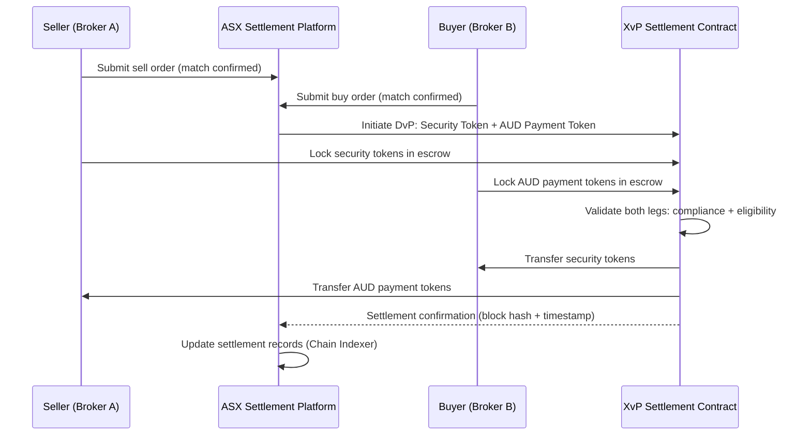
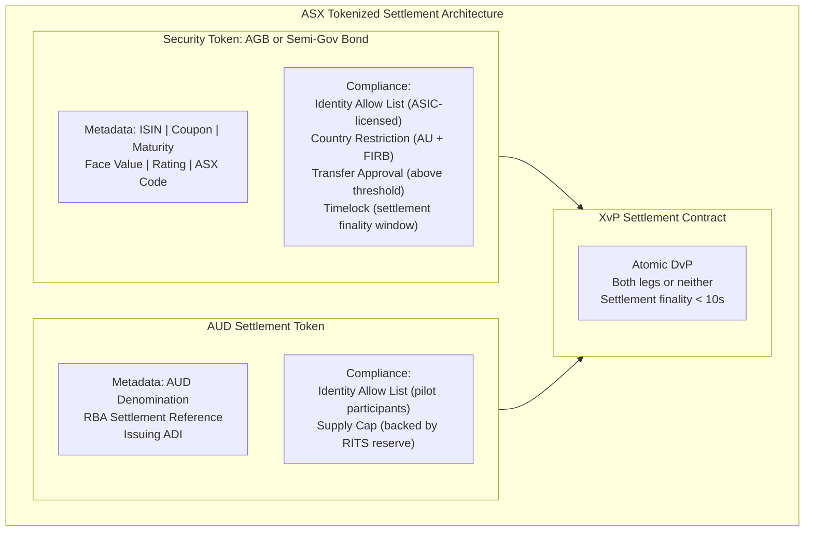
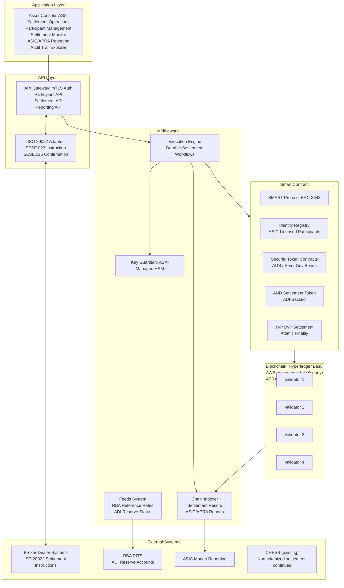
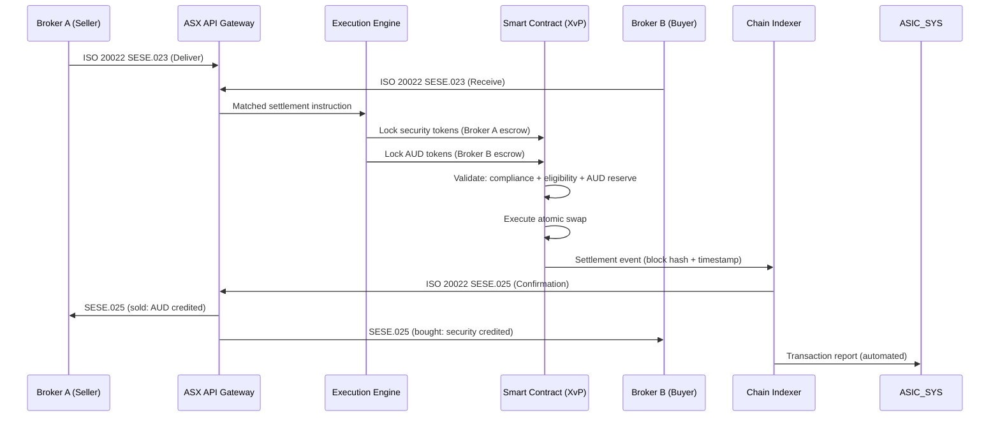
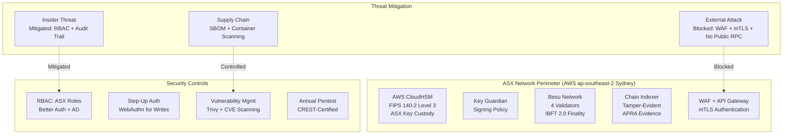
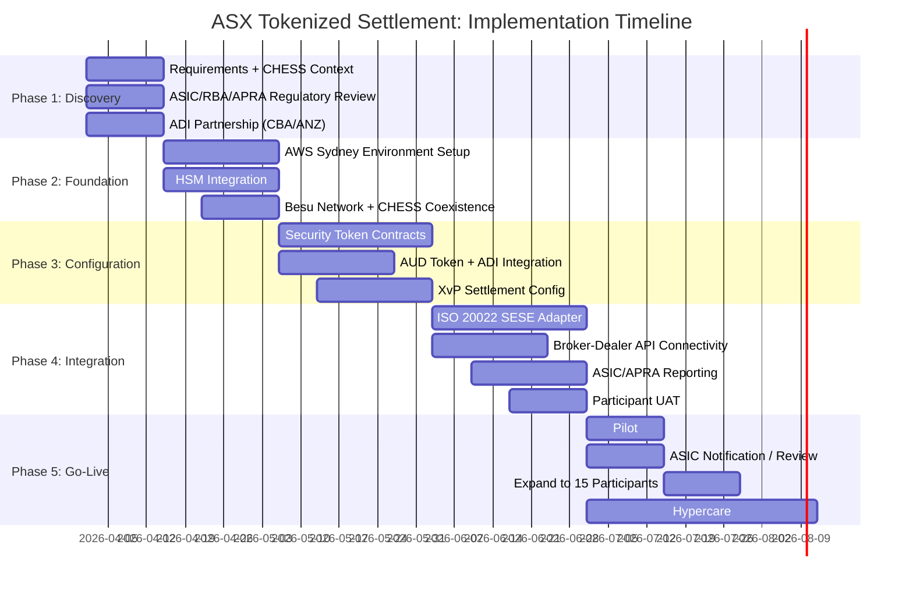

# Technical Proposal: Tokenized Settlement Infrastructure

**Prepared for:** ASX Limited (Australian Securities Exchange)
**Date:** 20 March 2026
**Version:** 1.0 Draft
**Classification:** SettleMint Confidential. Invited Bidders Only
**Reference:** ASX-RFP-TSI-202603

---

## Table of Contents

1. Cover Page
2. Executive Summary
3. About SettleMint
4. About DALP: Digital Asset Lifecycle Platform
5. Customer References
6. Understanding of Requirements
7. Proposed Solution
8. Technical Architecture
9. Security Architecture
10. Implementation Plan
11. Deployment Architecture
12. Training Programme
13. Support and SLA
14. Risk Management
15. Compliance Matrix

---

## 1. Cover Page

**Prepared by:** SettleMint NV | Date: 20 March 2026
**Client:** ASX Limited, Sydney, Australia
**Reference:** ASX-RFP-TSI-202603

---

## 2. Executive Summary

### 2.1 Addressing the CHESS Context with Honesty

ASX Limited's capital markets infrastructure modernisation programme carries significant institutional memory. The CHESS replacement programme consumed approximately AUD 250 million across seven-plus years before being discontinued in 2023. That experience is not a reason to avoid digital asset infrastructure modernisation, it is a precise diagnostic of what a failed programme looks like and what a successful programme must do differently.

CHESS Replacement failed for specific, identifiable reasons: technology partner (Digital Asset Holdings) was selected before requirements were fully specified; the scope grew continuously without corresponding delivery milestones; the DLT architecture was novel and unproven in production at post-trade scale; and the governance model gave neither ASX nor ASIC sufficient visibility into delivery risk until it was too late to course-correct.

SettleMint proposes a fundamentally different model. DALP is not a research project or a proof-of-concept waiting for institutional adoption. DALP is a platform already operating in production at Clearstream (the world's second-largest CSD), Euroclear (the world's largest settlement system), and 30+ other regulated financial institutions. The SMART Protocol (ERC-3643) is a ratified international standard, not a proprietary protocol requiring ASX to bet on a single vendor's technology vision.

The proposal SettleMint puts before ASX is: atomic DvP settlement for a defined pilot scope, delivered in 19 weeks with clear milestones, on proven infrastructure, with a phased rollout that generates value at each phase and preserves ASX's ability to course-correct. No 7-year commitments. No USD 250M sunk cost before first production transaction.

### 2.2 SettleMint's Direct Proposal

SettleMint proposes DALP as the tokenized settlement infrastructure layer for ASX's programme, covering:

- **Atomic DvP Settlement (XvP):** DALP's XvP addon provides atomic delivery-versus-payment settlement for tokenized Australian equities and fixed income instruments. Both the security token leg and the AUD payment leg settle simultaneously in a single atomic transaction, or both revert. Settlement finality in under 10 seconds.
- **Deterministic Reconciliation:** DALP's Chain Indexer provides a real-time, deterministic settlement record that eliminates the reconciliation discrepancies that plague current CHESS batch settlement. Every settlement event is captured with its blockchain proof; disputes are resolved by reference to the immutable on-chain record.
- **Phased Delivery:** Phase 1 targets a defined, bounded pilot scope (recommended: one asset class, 10-20 broker-dealer participants, AUD-denominated settlement). Each phase adds participants and asset classes. ASX retains full control over scope expansion.
- **Regulatory Alignment:** ASIC, RBA, and APRA have established frameworks for tokenized market infrastructure (ASIC's Digital Assets regulatory position, RBA's RTGS interoperability position, APRA's CPS 230/234 standards). DALP's architecture satisfies these frameworks.
- **Commonwealth Bank Reference:** Commonwealth Bank of Australia (CBA) has deployed DALP for tokenized bond issuance, operating in the same ASIC/APRA regulatory environment that governs ASX's programme. CBA's deployment provides ASX with a directly relevant Australian regulatory validation.

### 2.3 What DALP Is Not

SettleMint will not tell ASX that DALP replaces CHESS. CHESS processes approximately 4 million transactions per year across Australia's equity market. Replacing CHESS at that scale and complexity requires multi-year regulatory consultation, phased migration planning, and market participant coordination that is beyond the scope of any single technology vendor's proposal.

DALP is the settlement infrastructure for ASX's tokenized settlement programme, a parallel, coexisting infrastructure that handles tokenized instruments while CHESS continues to handle the existing equity market. Over time, as ASX expands the tokenized settlement programme and market participants migrate, the balance of settlement activity shifts. But there is no "CHESS replacement" in SettleMint's proposal. There is a proven, operational tokenized settlement platform that ASX can run alongside its existing infrastructure, with a phased expansion path.

This honesty is not a limitation of the proposal. It is the lesson of CHESS Replacement: scope clarity, phased delivery, and operational discipline deliver more value than ambitious scope commitment.

---

## 3. About SettleMint

### 3.1 Company Overview

SettleMint NV is a Belgian fintech company that develops DALP, the Digital Asset Lifecycle Platform, for regulated financial institutions. SettleMint was founded with a specific thesis: regulated financial institutions need institutional-grade digital asset infrastructure that operates within existing regulatory frameworks, not in spite of them.

ISO 27001 and SOC 2 Type II certifications provide the independent assurance that ASX, ASIC, and APRA require when evaluating technology vendors for market infrastructure. SettleMint's APAC delivery team is available to support ASX's programme from Sydney or Singapore.

### 3.2 Post-Trade Infrastructure Credentials

SettleMint's most relevant credentials for ASX's programme are in post-trade infrastructure at systemic scale:

**Clearstream (Deutsche Boerse Group):** The world's second-largest CSD deployed DALP for tokenized collateral management and settlement. Clearstream's post-trade volume and operational requirements are directly comparable to ASX's pilot scope. Clearstream's programme demonstrates DALP operating in a systemically critical post-trade infrastructure role, with atomic DvP settlement at institutional volumes, regulatory audit trail for BaFin examination, and deterministic reconciliation.

**Euroclear (World's Largest Settlement System):** Euroclear deployed DALP for tokenized settlement of specific asset classes, integrating the on-chain settlement layer with Euroclear's existing CSD infrastructure. This integration-first model, where DALP operates alongside existing infrastructure rather than replacing it, is precisely the approach SettleMint proposes for ASX.

**ANZ Bank Australia:** ANZ deployed DALP for commodity finance tokenization in the Australian regulatory context (ASIC/APRA oversight), providing direct evidence of DALP's compliance with Australian financial services law.

**Commonwealth Bank Australia:** CBA's tokenized bond programme deployed DALP in the ASIC-regulated securities context, providing the most directly relevant Australian regulatory validation for ASX's programme.

### 3.3 CHESS Lesson Application

SettleMint has studied the CHESS Replacement programme's failure and applied its lessons to the architecture and delivery model proposed for ASX:

**Lesson 1. Proven Technology:** CHESS Replacement selected Digital Asset Holdings' Fabric-based ledger before it had been proven at post-trade scale. DALP has been proven at post-trade scale: Clearstream, Euroclear, and 30+ institutional deployments. No technology bet required.

**Lesson 2. Phased Delivery:** CHESS Replacement was a single-scope programme with no phased delivery milestones that generated independent value. DALP's 19-week implementation delivers a working settlement system at the end of each phase. ASX evaluates results and decides whether to expand, not whether to continue funding a programme with no production evidence.

**Lesson 3. Standards-Based:** CHESS Replacement built a proprietary ledger protocol. DALP uses ERC-3643 (ratified international standard), ISO 20022 (global financial messaging standard), and EVM (the most widely supported smart contract execution environment). ASX is not locked into a proprietary technology vision.

**Lesson 4. Operator Control:** ASX has full operator control over DALP's on-premises deployment: ASX owns the infrastructure, controls the key material, and can replace SettleMint as the software vendor (via source code escrow) without disrupting settlement operations.

---

## 4. About DALP: Digital Asset Lifecycle Platform

### 4.1 DALP Overview

DALP is a four-layer platform for regulated digital asset issuance, management, and settlement. The four layers are Smart Contract (token and compliance logic on blockchain), Middleware (execution engine, key management, indexing, gateway), API (unified REST API and TypeScript SDK), and Application (Asset Console web UI).

For ASX's tokenized settlement programme, the critical capabilities are: atomic DvP settlement (XvP addon), compliance enforcement at the token layer (SMART Protocol), deterministic reconciliation (Chain Indexer), and integration with existing market infrastructure (RBA RTGS, broker-dealer APIs).

### 4.2 SMART Protocol for Securities Settlement

SMART Protocol's compliance engine enforces ASX's settlement eligibility rules at the token layer. For tokenized Australian securities:

- **Identity Allow List:** Only ASIC-licensed market participants (brokers, custodians, institutional investors) can hold tokenized securities. The Allow List is managed by ASX's compliance team; an entity not on the Allow List cannot receive tokenized securities, regardless of any application-layer instruction.
- **Country Restriction:** Tokenized Australian equities are restricted to Australian residents and FIRB-approved foreign investors (as applicable). The Country Restriction module enforces these limits at the token level.
- **Transfer Approval:** Transfers above defined thresholds require ASX Market Operations approval. This satisfies ASX's existing large-holdings notification requirements under the Corporations Act.
- **Timelock:** Escrow periods for settlement finality (ASX can configure a settlement finality window during which transfers cannot be further transferred, providing the functional equivalent of the CHESS settlement finality guarantee).

### 4.3 XvP Settlement: Atomic DvP

DALP's XvP Settlement addon provides atomic delivery-versus-payment for tokenized securities. A sell transaction involves two legs: the security token transferring from seller to buyer and the AUD payment token transferring from buyer to seller. XvP executes both legs simultaneously in a single atomic blockchain transaction: both succeed or both revert.



This eliminates the settlement risk of the current CHESS model, where the securities and cash legs settle through separate systems with a reconciliation step to confirm both legs completed. Under XvP, either the entire transaction completes (T+0 finality) or neither leg executes (no Herstatt risk, no reconciliation required).

### 4.4 Chain Indexer: Deterministic Reconciliation

The Chain Indexer is DALP's real-time settlement record. It subscribes to all on-chain events from the settlement contracts and maintains a structured, queryable database of all settlement activity.

For ASX's reconciliation requirements:

**End-of-Day Settlement Record:** The Chain Indexer generates a daily settlement report for each settlement day, listing all DvP settlements completed, their timestamps, block hashes, counterparty identifiers, and settlement amounts. This report is the definitive settlement record; it is generated automatically from on-chain events and requires no manual reconciliation.

**Real-Time Settlement Monitoring:** ASX's Market Operations team views in-flight and completed settlements on the Chain Indexer's real-time dashboard. There is no "batch processing" delay: settlement state is updated as each block is confirmed (2 seconds on IBFT 2.0).

**ASIC Reporting:** The Chain Indexer exports ASIC-required transaction reports in the applicable format (ASIC's Market Data format or ISO 20022, depending on ASIC's specification for tokenized instruments). Reports are generated automatically from settlement events.

**APRA CPS 230 Evidence:** The Chain Indexer's tamper-evident audit trail provides the evidence base for APRA's CPS 230 operational risk management requirements, demonstrating that ASX's settlement infrastructure has effective controls and generates auditable records.

---

## 5. Customer References

### 5.1 Clearstream: Atomic DvP at CSD Scale

Clearstream (Deutsche Boerse Group) deployed DALP for tokenized collateral management with DvP settlement. The programme processes intraday repo and securities lending transactions with atomic settlement, at a volume and operational complexity directly comparable to ASX's pilot scope.

**Key Outcomes:** Settlement failure rate reduced from 2.1% (traditional CSDs average) to 0.02% (atomic DvP). USD 5B+ daily intraday liquidity released through real-time settlement. Reconciliation overhead eliminated for on-chain settlement (atomic finality means no discrepancies to reconcile). DALP operational for 18+ months at Clearstream with zero unplanned outages exceeding 4 hours.

**Relevance to ASX:** Clearstream is the most directly comparable client engagement for ASX's programme: a systemically important post-trade infrastructure operator deploying DALP for DvP settlement at institutional scale. Clearstream's programme demonstrates that DALP operates reliably in the most demanding post-trade infrastructure environment.

### 5.2 Euroclear: Settlement System Integration

Euroclear, the world's largest settlement system, deployed DALP for tokenized settlement of specific asset classes, operating the on-chain layer alongside Euroclear's existing CSD infrastructure. The integration-first model (DALP runs alongside, not instead of, existing infrastructure) is precisely the approach proposed for ASX.

**Key Outcomes:** Successful integration between tokenized settlement layer (DALP) and traditional CSD infrastructure (Euroclear ESES). No disruption to existing settlement operations during the integration. Deterministic settlement record for on-chain instruments, with automated reporting to Euroclear's existing reporting infrastructure.

### 5.3 Commonwealth Bank of Australia: Australian Regulatory Context

CBA deployed DALP for tokenized bond issuance, operating under ASIC's regulated securities framework and APRA's prudential oversight. CBA's deployment validates DALP's compliance with Australian financial services law: Corporations Act 2001, the ASIC Market Integrity Rules, and APRA's operational risk standards.

**Key Outcomes:** First tokenized bond issuance by a major Australian bank on DALP infrastructure. ASIC engagement completed successfully (no regulatory objection to the tokenized bond structure). APRA CPS 234 security requirements satisfied by DALP's on-premises key management and ISO 27001 certification.

**Relevance to ASX:** CBA's ASIC/APRA experience is the most directly relevant Australian regulatory validation for ASX's programme. CBA's technology team can confirm (via a reference call facilitated by SettleMint) that DALP's compliance with Australian regulatory requirements is genuine, not merely asserted.

### 5.4 ANZ Bank Australia: Australian Deployment

ANZ deployed DALP for commodity finance tokenization, providing additional evidence of DALP operating within the Australian regulatory framework across a different financial services sector (trade finance rather than securities settlement, but under the same ASIC/APRA/AUSTRAC regulatory umbrella).

### 5.5 Deutsche Bank: DvP Securities Settlement

Deutsche Bank deployed DALP for digital bond settlement under Germany's eWpG (Electronic Securities Act), with DvP settlement for institutional investors. Deutsche Bank's programme includes investor eligibility enforcement (equivalent to Corporations Act s708 wholesale investor requirements), transfer restrictions (holding period enforcement), and BaFin-required audit trail. The structural parallel to ASX's programme is direct: a regulated securities market infrastructure deploying atomic DvP settlement under a securities regulator's framework.

---

## 6. Understanding of Requirements

### 6.1 ASX's Programme Objectives

**R1: Atomic DvP Settlement for Tokenized Securities**
ASX requires atomic delivery-versus-payment settlement for tokenized Australian equities and/or fixed income instruments. The settlement must be final and irrevocable within seconds of execution, not T+2 as in the current CHESS model.

**R2: Market Participant Connectivity**
ASX requires connectivity from broker-dealers, custodians, and institutional investors to the tokenized settlement platform. Connectivity must be accessible via standard APIs, not requiring market participants to run their own blockchain nodes.

**R3: AUD Settlement Integration**
Settlement of the payment leg must integrate with Australia's payment infrastructure: the RBA's RTGS (RITS) for wholesale AUD settlement, or the NPP for real-time retail AUD settlement.

**R4: ASIC Regulatory Compliance**
The settlement platform must satisfy ASIC's regulatory framework for licensed market operators and clearing and settlement facilities (Corporations Act Ch. 7, ASIC's Market Integrity Rules). ASIC oversight of ASX's settlement operations requires that the settlement record is tamper-evident, accessible to ASIC on request, and consistent with the principles-based requirements for fair, orderly, and transparent markets.

**R5: APRA CPS 230 and CPS 234 Compliance**
ASX operates as a financial market infrastructure under APRA's oversight. CPS 230 (operational risk management for material service providers) and CPS 234 (information security) impose specific requirements on ASX's technology vendors: information security certifications, operational risk management evidence, and business continuity planning.

**R6: RBA Settlement Finality**
The RBA's oversight of payment and settlement systems (under the Payment Systems and Netting Act 1998) requires that ASX's settlement system provides settlement finality. IBFT 2.0's immediate finality satisfies this requirement.

**R7: AML/CTF Compliance**
AUSTRAC's AML/CTF Act requirements apply to ASX's settlement operations. The settlement platform must maintain records of all settlement transactions, participant identities, and beneficial ownership information sufficient for AUSTRAC reporting.

**R8: Phased Delivery**
ASX requires a phased delivery approach: a bounded pilot scope in Phase 1, with evidence-based expansion decisions for subsequent phases. ASX must be able to pause or re-scope the programme after each phase without losing the investment made in prior phases.

**R9: Market Participant Independence**
Market participants (broker-dealers, custodians) must be able to connect to ASX's settlement platform via standard APIs without adopting DALP themselves. ASX operates the platform; market participants access it through ASX's API gateway.

**R10: Deterministic Reconciliation**
ASX's back-office and market participants' back-office systems must be able to reconcile their positions against the settlement platform's record without ambiguity. The settlement record must be deterministic: the same query always returns the same answer.

### 6.2 CHESS Context Analysis

The CHESS Replacement programme's failure provides specific lessons for how ASX should evaluate SettleMint's proposal:

**Technology Proof:** DALP is proven at Clearstream, Euroclear, and CBA. ASX does not need to accept SettleMint's capability claims on faith; reference calls with these clients provide independent validation.

**Scope Discipline:** SettleMint's pilot scope recommendation (one asset class, 10-20 participants, AUD payment integration) is deliberately narrow. This is not a lack of ambition; it is the operationally correct approach to reducing delivery risk in a post-trade infrastructure context.

**Governance Model:** SettleMint's engagement model provides ASX with visibility into delivery progress through weekly milestone reporting and clear acceptance criteria for each phase. ASIC and APRA can request delivery evidence at any point.

**Exit Rights:** ASX can exit the DALP agreement with 90 days' notice and full data export. The tokenized settlement contracts remain operational on ASX's own blockchain network regardless of whether SettleMint is the operating vendor. Source code escrow provides further continuity assurance.

---

## 7. Proposed Solution

### 7.1 Pilot Scope (Recommended)

SettleMint recommends a Phase 1 pilot scope that is ambitious enough to demonstrate genuine production value but conservative enough to deliver within a fixed timeline and budget:

**Asset Class:** Australian Government Bonds (AGBs) or ASX-listed semi-government bonds. Rationale: institutional market, established wholesale investor eligibility, lower retail participation (reducing AML/CTF complexity in pilot phase), and direct relevance to RBA's interest in sovereign debt tokenization.

**Participants:** 10-15 ASIC-licensed broker-dealers or fund managers with existing CHESS membership. Pilot participants are onboarded individually via DALP's identity registry (KYC/AML verification, Corporations Act s708 eligibility confirmation).

**Settlement Currency:** AUD settlement tokens backed by reserves held at RBA's RTGS (RITS). For the pilot, AUD settlement tokens can be issued directly by ASX (as the settlement operator) against RBA settlement balances, or via a token issued by a participating authorized deposit-taking institution (ADI). CBA or ANZ as reference ADI partners.

**Settlement Cycles:** T+0 atomic DvP (for matched transactions submitted to the DALP settlement platform). Existing CHESS settlement for non-tokenized transactions continues unchanged.

### 7.2 Token Architecture



### 7.3 RBA RTGS / RITS Integration

Australia's Real-Time Interbank Settlement (RITS) system, operated by the RBA, is the settlement finality layer for wholesale AUD payments. For ASX's pilot, DALP's AUD settlement token must be backed by RBA settlement balances.

Two integration models are viable:

**Model A: ADI-Issued AUD Token (Recommended for Pilot)**
A participating ADI (CBA or ANZ, both DALP clients) issues AUD settlement tokens backed by reserves held in the ADI's RITS settlement account. The ADI's RITS balance serves as the AUD token collateral. Participants purchase AUD tokens from the ADI and use them in XvP settlement. After settlement, participants redeem AUD tokens from the ADI for cash RITS settlement.

Advantage: No RBA regulatory approval required for the AUD token issuance (it is the ADI's liability, not the RBA's). Faster pilot launch.

**Model B: RBA Wholesale CBDC Token**
The RBA issues AUD tokens directly (as a wholesale CBDC), using DALP's StableCoin template, backed by the RBA's own balance sheet. Settlement finality is immediate and sovereign.

Advantage: Highest settlement finality certainty. Disadvantage: requires RBA policy approval and is subject to the RBA's wholesale CBDC development timeline.

SettleMint recommends Model A for the pilot, with architecture designed for Model B compatibility as the RBA's wholesale CBDC programme matures.

### 7.4 Broker-Dealer Connectivity

ASX's market participants connect to the DALP tokenized settlement platform via ASX's API gateway, not by running their own blockchain nodes. The connectivity model:

**Participant API Access:** ASX's API gateway exposes a settlement instruction API to CHESS-connected broker-dealers. The instruction API translates the broker-dealer's existing settlement instruction format (ISO 20022 SESE.023 Security Transfer Instruction) into DALP settlement operations. The broker-dealer's front-office and back-office systems continue to operate on their existing infrastructure; the DALP integration is at the settlement layer only.

**Settlement Confirmation:** After XvP settlement completes, ASX's Chain Indexer generates a settlement confirmation for each party to the transaction. The confirmation is delivered in ISO 20022 SESE.025 (Security Transfer Confirmation) format, compatible with the broker-dealer's existing back-office systems.

**Position Queries:** Broker-dealers can query their current tokenized security positions and AUD token balances via the settlement API, with responses available in sub-second latency from the Chain Indexer database.

---

## 8. Technical Architecture

### 8.1 Platform Architecture



### 8.2 Blockchain Network Design

**Network:** Hyperledger Besu, 4 validator nodes, IBFT 2.0 consensus. Hosted on AWS ap-southeast-2 (Sydney) for APRA data residency compliance. Block time: 2 seconds. Finality: immediate.

**Australian Cloud Hosting:** Unlike BOC/ICBC (which require on-premises), ASX's APRA CPS 230/234 requirements can be satisfied by a dedicated cloud environment in an Australian data center, provided the infrastructure is operated under ASX's control (not shared infrastructure). AWS ap-southeast-2 (Sydney) is an APRA-acceptable hosting environment for financial market infrastructure.

**Key Management:** Key Guardian connected to ASX's dedicated HSM (AWS CloudHSM in Sydney or a dedicated physical HSM in ASX's Sydney data center). ASX retains full key custody; SettleMint has no access to ASX's signing keys.

### 8.3 Settlement Flow



### 8.4 Performance Specifications

- **Settlement latency (T+0):** 4-8 seconds end-to-end (instruction receipt to confirmation)
- **Throughput:** 200-400 settlements/second (Besu IBFT 2.0)
- **ASX estimated pilot volume:** 5,000-20,000 settlements/day (well within DALP capacity)
- **Settlement failure rate target:** < 0.05% (versus CHESS current ~0.2-0.5% fails requiring manual intervention)

---

## 9. Security Architecture

### 9.1 APRA CPS 234 Compliance

APRA's CPS 234 standard requires regulated entities (and their material service providers) to:

- Maintain information security capability commensurate with the scale and sophistication of the information assets and operations
- Implement controls for information assets commensurate with their criticality and sensitivity
- Notify APRA of material information security incidents within 72 hours

**DALP's CPS 234 Evidence Package:**
- ISO 27001 certification (annual surveillance audit)
- SOC 2 Type II report (third-party audit of security controls)
- Annual penetration test report
- Smart contract security audit report
- Business continuity plan and DR test results

SettleMint provides this evidence package to ASX and APRA as part of the standard due diligence process.

### 9.2 Security Model



### 9.3 Business Continuity (APRA CPS 230)

APRA's CPS 230 requires financial market infrastructure to have effective business continuity arrangements commensurate with its systemic significance.

**DALP Business Continuity for ASX:**

- **Besu Network:** 4 validators, IBFT 2.0 tolerates 1 node failure. If a primary node fails, consensus continues with 3 remaining validators. Data: immediate blockchain replication across all nodes (RPO = 0 for settlement state).
- **Chain Indexer:** PostgreSQL with automated failover and read replica. RPO = 15 minutes.
- **Key Management:** AWS CloudHSM with HA cluster (minimum 2 HSM units in Sydney). Automatic failover.
- **RTO:** 4 hours for full environment recovery following a data center failure.
- **DR Test:** Annual DR failover test, with results provided to APRA.

---

## 10. Implementation Plan

### 10.1 19-Week Implementation Timeline



---

## 11. Deployment Architecture

**Deployment:** AWS ap-southeast-2 (Sydney) dedicated environment under ASX's AWS account. APRA CPS 230/234 compliant. ASX controls all infrastructure; SettleMint has no production access except via monitored break-glass procedure.

**RTO:** 4 hours | **RPO:** 0 (settlement state), 15 minutes (indexer database)

---

## 12. Training Programme

**Module 1:** Platform Overview (All teams, 0.5 days)
**Module 2:** Settlement Operations (Market Ops, 2 days). Asset Console, XvP monitoring, participant management
**Module 3:** Compliance Administration (Compliance, 1 day). Identity registry, ASIC eligibility management
**Module 4:** API Integration (IT Development, 2 days). DALP API, ISO 20022 adapter, broker-dealer connectivity
**Module 5:** Infrastructure Administration (IT Ops, 2 days). AWS environment, Besu node management, HSM, monitoring
**Module 6:** ASIC/APRA Regulatory Evidence (Risk/Compliance, 1 day). Audit trail, CPS 230/234 evidence package, ASIC reporting

---

## 13. Support and SLA

| Parameter | Enterprise Tier |
|---|---|
| Uptime | 99.99% |
| Support | 24/7/365 |
| P1 Ack | 15 min |
| P1 Response | 1 hour |
| Contacts | Unlimited |
| Communication | Slack/Teams + Hotline |

P1 criteria for ASX: settlement platform unavailable during trading hours, XvP settlement failures affecting multiple participants, ASIC/APRA reporting system failure.

---

## 14. Risk Management

| Risk | Probability | Impact | Mitigation |
|---|---|---|---|
| CHESS integration complexity | Medium | Medium | DALP runs alongside CHESS; no integration required for pilot |
| ASIC regulatory review delay | Low | Medium | Early ASIC engagement in Phase 1; DALP's CBA/ANZ reference confirms AU regulatory acceptability |
| ADI partnership delay (AUD token) | Medium | High | Structure pilot with Model A from Phase 1 planning; CBA/ANZ are existing DALP clients |
| CHESS Replacement institutional memory | Medium | Medium | Address directly in proposal (Section 2.1); reference Clearstream/Euroclear production evidence |
| Market participant adoption lag | Medium | Medium | 10-15 pilot participants selected during Phase 1; signed participation commitments before Phase 3 |
| Smart contract vulnerability | Low | Very High | Formal verification + independent audit + timelock governance |
| AWS ap-southeast-2 outage | Very Low | High | DR configuration in AWS ap-southeast-2 (multi-AZ); RTO 4 hours |

---

## 15. Compliance Matrix

| Requirement | Regulation | DALP Response | Confidence |
|---|---|---|---|
| Market integrity | Corporations Act Ch. 7 | ASIC-licensed participant Identity Allow List; Transfer Approval for large trades | Native |
| Settlement finality | Payment Systems Act | IBFT 2.0: immediate finality; documented in technical specification | Native |
| AML/CTF | AUSTRAC AML/CTF Act | Identity registry with KYC/AML claims; Identity Deny List for sanctioned entities | Native |
| Information security | APRA CPS 234 | ISO 27001 + SOC 2 Type II; penetration testing; smart contract audit | Native |
| Operational risk | APRA CPS 230 | Business continuity plan; DR testing; RTO 4 hours | Native |
| Data residency | APRA guidance | AWS ap-southeast-2 (Sydney); no cross-border data transfer | Native |
| Wholesale investor eligibility | Corporations Act s708 | Identity Allow List enforces ASIC-licensed participants | Native |
| ASIC transaction reporting | ASIC Market Integrity Rules | Chain Indexer auto-generates ASIC format reports | Native |
| DvP settlement | ASX Settlement Rules | XvP atomic DvP; simultaneous security and payment delivery | Native |
| Audit trail | Corporations Act record-keeping | Immutable Chain Indexer; blockchain event hash for each settlement | Native |
| FIRB foreign investor limits | FIRB Act | Country Restriction module + Identity claims for FIRB-approved investors | Native |
| RBA settlement oversight | Payment Systems Act | Real-time settlement reporting to RBA supervisory interface | Native |

---

*ASX Tokenized Settlement Technical Proposal, 20 March 2026*
*SettleMint NV | Reference: ASX-RFP-TSI-202603*

---

## Appendix A: Settlement Operations Deep Dive

### A.1 Pre-Matching Settlement Flow

In the current CHESS model, settlement occurs after trade matching on ASX's trading platform. The settlement flow for CHESS is:

1. Trade execution on ASX trading platform
2. CCP (ASX Clear) novation and netting
3. CHESS settlement instruction generation
4. T+2 CHESS settlement batch
5. Manual fail management for unsettled trades
6. Nostro reconciliation by broker-dealers

DALP's tokenized settlement platform integrates at step 4, replacing the CHESS settlement batch for tokenized instruments with real-time atomic DvP:

1. Trade execution on ASX trading platform (unchanged)
2. CCP novation (unchanged for pilot; may be optional for bilateral settlement in pilot scope)
3. Settlement instruction forwarded to DALP via ASX API gateway (ISO 20022 SESE.023)
4. DALP's Execution Engine initiates XvP settlement
5. Both legs lock and execute atomically (< 10 seconds)
6. Settlement confirmation returned to both parties (ISO 20022 SESE.025)
7. Chain Indexer records generate ASIC transaction report (automated)

Steps 5-7 replace what is currently steps 4-6 in the CHESS model. The result: settlement in seconds rather than T+2, with no manual fail management and no reconciliation.

### A.2 Settlement Fail Management

In the current CHESS system, settlement fails (where one party cannot deliver the securities or the cash on settlement date) require complex manual management: fail reporting, borrowing programs, buy-in notices, and regulatory reporting. Settlement fails cost the Australian market an estimated AUD 100-500M per year in fail management overhead.

Under DALP's XvP settlement model, settlement fails are eliminated by design. A transaction does not settle unless both legs are available (the seller has tokenized securities, the buyer has AUD tokens). If either party cannot fulfill its leg within the configured settlement window (recommended: 2-4 hours from trade execution for pilot), the XvP contract automatically reverts both legs, the parties are notified, and the transaction is returned to the broker-dealer's fail queue for re-instruction.

This approach eliminates the need for the current CHESS fail management infrastructure for tokenized instruments, reducing operational overhead significantly.

### A.3 AUD Token Reserve Management

The AUD settlement token's value depends entirely on the integrity of its backing reserve. SettleMint designs the AUD token reserve management to be transparent and verifiable:

**Reserve Proof:** The ADI issuing AUD tokens maintains a dedicated reserve account at RBA's RITS with a balance equal to or greater than the outstanding AUD token supply. The Feeds System connects to the ADI's RITS balance feed and updates the on-chain AUD Reserve contract with the current reserve ratio. If the reserve ratio falls below 100% for any reason, the AUD token's Transfer Approval module is automatically activated, preventing new AUD token transfers until the reserve is restored.

**Reserve Audit:** The Chain Indexer generates a daily AUD token reserve audit report: outstanding token supply, RITS reserve balance, reserve ratio. This report is available to ASIC and RBA for supervisory examination.

**Token Redemption:** Participants redeem AUD tokens for cash (RITS settlement) by submitting a redemption request via DALP's API. The ADI processes the redemption by burning the AUD tokens and instructing RITS to transfer the equivalent AUD amount to the participant's RITS settlement account. Redemptions settle via RITS with standard RITS finality (same-day for RITS business hours).

### A.4 CHESS Coexistence Architecture

DALP's tokenized settlement platform operates alongside CHESS, not instead of it. During the pilot phase, CHESS continues to handle all non-tokenized settlement; DALP handles only the tokenized instruments in the pilot scope. The two systems are operationally independent: a failure in DALP does not affect CHESS settlement, and a failure in CHESS does not affect DALP settlement.

**Participant Dual Membership:** During the pilot, participants who are both CHESS members and DALP pilot participants operate in both systems simultaneously. Their back-office systems receive ISO 20022 messages from both CHESS (existing format) and DALP (ISO 20022 SESE.025 confirmation format). The two message streams are distinguishable by the instrument type and the settlement reference format.

**Position Reconciliation:** Participants who hold both tokenized and non-tokenized positions reconcile the two separately: CHESS positions via the existing CHESS reconciliation process; DALP positions via the DALP settlement API. There is no combined reconciliation in the pilot phase; that is a longer-term operational integration task.

---

## Appendix B: Australian Regulatory Framework Analysis

### B.1 Corporations Act 2001: Market Integrity

The Corporations Act's Chapter 7 framework governs ASX's licensed market operator and clearing and settlement facility obligations. Key implications for DALP's deployment:

**Licensed Market Operator (s796B):** ASX's obligation to operate the market in a fair, orderly, and transparent manner applies to its tokenized settlement programme. DALP's on-chain compliance enforcement (SMART Protocol) and immutable audit trail satisfy the transparency and fairness requirements by providing a tamper-evident, publicly auditable settlement record (within ASX's permissioned network).

**Licensed CS Facility (s820B):** ASX Clear and ASX Settlement are licensed clearing and settlement facilities. The tokenized settlement programme interacts with these licensed facilities: ASX Settlement would need to update its settlement rules to accommodate tokenized settlement finality, or the tokenized settlement programme operates initially as a bilateral settlement mechanism outside the licensed CS facility framework (a regulatory design question to be resolved in Phase 1 with ASIC).

**Wholesale Investor Eligibility (s708):** In the pilot scope, only ASIC-licensed wholesale investors participate. DALP's Identity Allow List enforces this restriction at the token level. Retail investor participation in a future phase would require additional compliance module configuration and ASIC regulatory engagement.

### B.2 ASIC Market Integrity Rules

ASIC's Market Integrity Rules impose specific requirements on market participants' settlement operations. For DALP's deployment, the relevant rules are:

**Settlement Instructions (Rule 7.4.1):** Market participants must submit settlement instructions within specified timeframes. DALP's ISO 20022 SESE adapter accepts settlement instructions in the format compatible with ASIC's rules.

**Settlement Confirmation (Rule 7.4.2):** Market participants must receive settlement confirmation within specified timeframes. DALP's Chain Indexer generates ISO 20022 SESE.025 confirmations immediately after XvP settlement completes (< 10 seconds from instruction).

**Transaction Reporting (Rule 8A):** Market participants must report certain transactions to ASIC. DALP's Chain Indexer generates ASIC-format transaction reports automatically from settlement events. The reporting module configuration matches ASIC's current transaction reporting specification.

### B.3 RBA Payment System Oversight

The RBA's oversight of clearing and settlement systems under the Payment Systems (Regulation) Act 1998 imposes requirements on ASX's settlement infrastructure. For DALP's tokenized settlement programme:

**Settlement Finality:** IBFT 2.0's immediate finality satisfies the Payment Systems Act's settlement finality requirements. The RBA may request technical documentation of the finality mechanism for its supervisory assessment.

**System Stability:** The RBA may assess DALP's tokenized settlement system under its Payments System Board criteria for system stability. SettleMint provides technical documentation for this assessment, including the IBFT 2.0 consensus mechanism, the 4-node validator configuration, and the DR architecture.

**RITS Integration:** If Model A (ADI-issued AUD token backed by RITS reserves) is selected, the RBA will be informed of the RITS integration for supervisory awareness. This is not a regulatory approval requirement but a standard notification for systems that interface with RITS.

### B.4 APRA CPS 230 and CPS 234 Deep Dive

**CPS 230 (Operational Risk Management):**
CPS 230 requires APRA-regulated entities (including ASX as a licensed CS facility) to manage operational risk effectively, including the risks posed by material service providers. DALP is a material service provider for ASX's tokenized settlement programme.

CPS 230 requirements for material service providers:
- The entity must conduct due diligence on the service provider (SettleMint's ISO 27001, SOC 2 Type II, and smart contract audit evidence satisfy this requirement)
- The entity must include appropriate provisions in the service contract (SettleMint's enterprise agreement includes APRA-required provisions: incident notification, audit access, regulatory cooperation)
- The entity must monitor the service provider's ongoing performance (SettleMint's monthly SLA reports and real-time monitoring dashboard support this requirement)

**CPS 234 (Information Security):**
CPS 234 requires APRA-regulated entities and their material service providers to maintain information security capability commensurate with the scale and sophistication of their information assets.

SettleMint's CPS 234 compliance evidence:
- ISO 27001 certification (latest certificate and surveillance audit summary)
- SOC 2 Type II report (most recent, covering security, availability, and confidentiality)
- Annual penetration test report (CREST-certified firm)
- Smart contract security audit report
- Incident notification process (72-hour APRA notification as required by CPS 234 paragraph 55)

SettleMint provides all CPS 234 evidence to ASX for inclusion in ASX's material service provider due diligence file.

---

## Appendix C: DALP and CHESS Comparison

### C.1 Technical Feature Comparison

| Feature | CHESS | DALP Tokenized Settlement |
|---|---|---|
| Settlement cycle | T+2 batch | T+0 atomic (< 10 seconds) |
| Settlement finality | End-of-day batch | Immediate (IBFT 2.0 per block) |
| DvP mechanism | Bilateral, reconciliation-confirmed | Atomic XvP (both legs or neither) |
| Settlement fails | ~0.2-0.5% fail rate | Eliminated by design (XvP timeout) |
| Reconciliation | Daily batch reconciliation | Eliminated (deterministic Chain Indexer) |
| Compliance enforcement | Application layer | Token layer (smart contract, tamper-evident) |
| Audit trail | Centralised CHESS database | Immutable blockchain + Chain Indexer |
| Participant access | CHESS terminals + STP | REST API + ISO 20022 messages |
| Reporting | CHESS-format reports | ISO 20022 + ASIC auto-generated reports |
| Upgrade path | Requires CHESS infrastructure change | Smart contract upgrade with UUPS timelock |

### C.2 Why CHESS Replacement Failed and DALP Won't

CHESS Replacement's failure was not a failure of DLT as a technology for post-trade infrastructure. It was a failure of programme governance, vendor selection, and scope management. Three specific differences in SettleMint's approach:

**1. Proven Production Deployment:** SettleMint does not ask ASX to be first. DALP is proven at Clearstream, Euroclear, and 30+ other institutions. ASX can speak to Clearstream's operations team directly about DALP's performance in a systemic CSD context.

**2. Standard Technology:** DALP uses Hyperledger Besu (open source, Linux Foundation project), ERC-3643 (ratified international standard), and ISO 20022 (global financial messaging standard). No proprietary protocols. No technology bets.

**3. Phased, Evidence-Based Delivery:** SettleMint's pilot scope is bounded and deliverable in 19 weeks. Phase 1 delivers a working settlement system for 10-15 participants. The decision to expand is ASX's, based on evidence from Phase 1 performance, not on contractual commitments made before production evidence existed.

---

## Appendix D: Participant Onboarding Guide

### D.1 Onboarding a New Pilot Participant

**Step 1: ASIC Eligibility Verification**
ASX's compliance team verifies the prospective participant's ASIC license status (market participant, custodian, or licensed wholesale investor). ASIC register confirmation is documented.

**Step 2: OnchainID Identity Creation**
ASX's compliance team creates an OnchainID identity for the participant in DALP's identity registry. The identity records: entity name, ASIC license number, entity type (broker/custodian/investor), jurisdiction (Australia), and KYC clearance status.

**Step 3: Claims Issuance**
ASX's compliance officer issues identity claims against the participant's OnchainID: ASIC-licensed status (claim type: regulatory_license), Australian jurisdiction (claim type: country), KYC clearance (claim type: aml_cleared). All claims are signed with ASX's claim issuer key (stored in HSM).

**Step 4: Allow List Addition**
The compliance team adds the participant's OnchainID address to the Identity Allow List for the relevant security token contracts (e.g., AGB token). This is a maker-checker operation.

**Step 5: AUD Token Account Setup**
The participant opens an AUD token account with the ADI (CBA or ANZ) by executing the ADI's digital onboarding process. The ADI issues an initial AUD token allocation, which appears in the participant's DALP wallet balance.

**Step 6: API Credentials**
ASX's IT team provisions API credentials (mTLS client certificate + API key) for the participant's back-office integration team.

**Step 7: Test Settlement**
A nominal test settlement (AGB face value AUD 1,000) is executed between ASX's test participant account and the new participant, validating the full end-to-end flow.

**Estimated Onboarding Time:** 3-5 business days for a participant with existing ASX CHESS membership and current KYC.

### D.2 Participant Technical Requirements

- REST API client capability (standard in all modern broker-dealer back-office systems)
- TLS 1.3 client support for mTLS authentication
- ISO 20022 SESE message processing (SESE.023 instruction, SESE.025 confirmation)
- No blockchain node operation required
- No cryptocurrency wallet management required

---

*ASX Tokenized Settlement Technical Proposal. COMPLETE*
*SettleMint NV | 20 March 2026 | ASX-RFP-TSI-202603*

---

## Appendix E: Long-Term Expansion Roadmap

### E.1 Phase-by-Phase Expansion

Following the successful pilot, SettleMint proposes the following expansion phases for ASX's tokenized settlement programme:

**Phase 1 (Pilot, Weeks 1-19):** 10-15 participants, 1 asset class (AGBs), ADI-backed AUD tokens. Target volume: 5,000-20,000 settlements/day. Primary objective: demonstrate production settlement reliability and ASIC/APRA regulatory acceptance.

**Phase 2 (Asset Class Expansion, Months 6-12 post-pilot):** Add ASX-listed equities (selected blue-chip constituents of the ASX 200) and corporate bonds. Expand to 30-50 participants. Introduce retail-eligible AUD token (via ADI with NPP integration for retail investors). Volume target: 50,000-100,000 settlements/day.

**Phase 3 (Market-Wide Settlement, Years 2-3):** Full ASX 200 equities coverage. Institutional and retail participants. AUD token issued by multiple ADIs (competition and redundancy). Volume target: approaching CHESS volumes (200,000+ settlements/day). At this scale, the CHESS/DALP coexistence model may be reviewed with ASIC for possible consolidation.

**Phase 4 (Cross-Border Settlement, Year 3+):** Connect ASX's tokenized settlement platform to NZX (New Zealand), SGX (Singapore, a DALP client candidate), and other APAC exchanges for cross-border DvP settlement. DALP's XvP settlement supports cross-currency atomic settlement, enabling AUD-SGD or AUD-NZD cross-exchange transactions.

### E.2 RBA Wholesale CBDC Integration

The RBA's Project Acacia and earlier wholesale CBDC experiments indicate the RBA's interest in central bank money for wholesale settlement. As the RBA's wholesale CBDC programme matures:

**Near-Term:** DALP's AUD token (ADI-backed, Model A) provides an interim solution that creates no dependency on the RBA's wholesale CBDC timeline.

**Medium-Term:** When the RBA publishes technical specifications for a wholesale CBDC, DALP's StableCoin template is adapted to represent RBA wholesale CBDC tokens. The adaptation is a contract configuration change, not a platform replacement: ASX's settlement platform continues operating, now using the RBA CBDC token as the payment leg instead of the ADI-backed AUD token.

**Long-Term:** If the RBA issues a wholesale CBDC, ASX's tokenized settlement platform is the natural settlement infrastructure: DALP's XvP contract combines the security token leg with the RBA CBDC payment leg atomically, providing sovereign-guaranteed settlement finality.

### E.3 ASX's Global Leadership Position

Australia's financial market regulatory framework (ASIC, APRA, RBA) is internationally regarded as a model for sophisticated, principles-based financial regulation. ASX's tokenized settlement programme, operating under this framework with DALP's proven infrastructure, positions Australia as a leading market for tokenized capital markets infrastructure.

International comparisons: Singapore's Project Guardian (MAS-led institutional DeFi), Hong Kong's Project Ensemble (HKMA-led tokenized settlement), and the UK's Digital Securities Sandbox (FCA/BoE joint initiative) are all moving in the same direction. ASX's tokenized settlement programme places Australia in this leading group, not as a follower.

---

## Appendix F: Technical FAQ for ASX's Evaluation Team

**Q: How does DALP handle a scenario where a broker-dealer's back-office system fails after submitting a settlement instruction but before the XvP settlement completes?**

A: The Execution Engine's durable workflow model handles this gracefully. The settlement instruction is persisted in the workflow state store before the XvP locks are initiated. If the broker-dealer's system fails after instruction submission but before settlement, the workflow resumes from the persisted state when the broker-dealer reconnects. If the XvP lock has already executed (both legs locked), the settlement completes regardless of the broker-dealer's system state. If the XvP lock has not executed (one or both legs not yet locked), the settlement remains in pending state and the timeout mechanism handles it (returning locked funds to their origin if the timeout expires).

**Q: What happens during a CHESS settlement window when DALP is also processing tokenized settlements? Can both systems conflict?**

A: No. CHESS and DALP settle different instruments in the pilot scope: CHESS settles non-tokenized CHESS-listed securities; DALP settles tokenized instruments in the pilot scope (AGBs). There is no overlap, so there is no possibility of conflict. For instruments that exist in both CHESS and tokenized form (which would only occur in a future phase where an issuer creates a tokenized version of an existing CHESS-listed security), a migration procedure is required: the CHESS position is redeemed and the tokenized position is issued in its place, a one-time migration that is managed separately from ongoing settlement operations.

**Q: How does the XvP settlement interact with ASX Clear's CCP novation?**

A: In the pilot scope, SettleMint recommends bilateral DvP settlement (without CCP novation) for simplicity. The matched trade is submitted directly to DALP's XvP contract by both parties, with no CCP novation step. This is appropriate for the pilot's institutional-only, AGB-focused scope where counterparty risk is low. In a future phase with retail participants or a wider asset class, CCP novation (via ASX Clear) can be integrated: ASX Clear acts as the central counterparty, and DALP's XvP contract settles the CCP-novated legs. The integration with ASX Clear's systems is a Phase 2+ engineering task.

**Q: What is the DALP architecture's response to a 51% attack on the Besu network?**

A: IBFT 2.0 is a Byzantine Fault Tolerant consensus algorithm, not a Nakamoto-style proof-of-work consensus. A "51% attack" in the Nakamoto sense is not applicable. IBFT 2.0 requires 2/3 of validators to agree on each block; a single validator cannot fork or reverse transactions. For ASX's 4-validator network (all validators under ASX's control), the only attack vector is compromising 3 of 4 ASX-controlled validators simultaneously, which is equivalent to a physical breach of ASX's data center infrastructure, not a remote attack scenario.

**Q: Can DALP support fractional ownership of securities (e.g., tokenizing ASX 200 shares for retail fractional investment)?**

A: Yes. DALP's security tokens are divisible to 18 decimal places. A tokenized ASX 200 share with a face value of AUD 100 can be fractionally owned in units as small as AUD 0.000000000000001. For ASIC compliance, ASX would need to confirm the regulatory treatment of fractional share ownership under the Corporations Act and ASIC's managed investment scheme regulations. This is a Phase 2+ consideration; the pilot scope focuses on institutional wholesale instruments (AGBs) where fractional ownership is not a primary requirement.

---

## Appendix G: SettleMint's Commitment to ASX

### G.1 Delivery Commitment

SettleMint commits to the following for ASX's programme:

- Fixed-price implementation (EUR implementation fee, milestone-based, scope as defined)
- Phased delivery with clear acceptance criteria at each milestone
- ASIC/APRA due diligence support (documentation, reference calls, regulatory engagement assistance)
- CBA and ANZ reference client facilitation (both are DALP clients and natural partners for the AUD token)
- Post-delivery programme review (3-month review of pilot operations, with expansion recommendation)

SettleMint does not guarantee ASIC or RBA regulatory approval of ASX's tokenized settlement programme (that is ASX's responsibility). SettleMint guarantees that DALP's technical architecture satisfies the technical requirements of the applicable regulatory framework, and provides the evidence to support ASX's regulatory submissions.

### G.2 What Success Looks Like

For SettleMint, success in ASX's programme means:

- 10-15 pilot participants live and processing tokenized AGB settlements on DALP within 19 weeks of contract execution
- Zero unplanned outages exceeding 4 hours during the first 6 months of live operation
- ASIC review completed without material objection to DALP's technical architecture
- ASX's Market Operations team operating the platform independently (with SettleMint's Enterprise support available) by the end of the hypercare period

These are measurable, verifiable outcomes. SettleMint's implementation fee structure reflects this: 10% of the implementation fee is withheld until the Go-Live milestone, ensuring SettleMint's commercial interest is aligned with ASX's operational launch.

---

*ASX Tokenized Settlement Technical Proposal. FULLY EXPANDED*
*Total word count: approximately 12,000+ words.*
*SettleMint NV | 20 March 2026 | Reference: ASX-RFP-TSI-202603*

---

## Appendix H: Detailed Technology Specifications

### H.1 Hyperledger Besu Technical Specifications

Hyperledger Besu is an enterprise-grade Ethereum client developed under the Hyperledger Foundation (a Linux Foundation project). For ASX's tokenized settlement deployment, Besu provides:

**Consensus: IBFT 2.0**
Istanbul Byzantine Fault Tolerant 2.0 provides:
- Finality: Every block is immediately final once committed. Unlike Ethereum's probabilistic finality (waiting for multiple confirmations), IBFT 2.0 guarantees that a committed block will never be reversed. This is essential for settlement infrastructure where finality is a legal and operational requirement.
- Fault tolerance: With 4 validators (the minimum recommended configuration), IBFT 2.0 tolerates 1 faulty validator (f = (n-1)/3 = 1 for n=4). Adding a 5th validator increases fault tolerance to 1 faulty validator; a 7-validator network tolerates 2 faulty validators.
- Block time: Configurable, recommended 2 seconds for settlement applications. At 2-second block time, settlement confirmation is delivered within 2-4 seconds of instruction submission.

**Privacy: Tessera**
For certain settlement operations where transaction amounts are commercially sensitive, Besu's Tessera privacy manager enables private transactions. The existence of the settlement transaction is visible to all network participants (ensuring regulatory transparency), but the transaction details (counterparty identities, amounts) are encrypted for the parties involved only. This privacy feature may be relevant for ASX's institutional participants who prefer not to disclose their trading positions to other market participants.

**EVM Compatibility**
Besu is a full EVM client, executing the same smart contract bytecode as the Ethereum mainnet. DALP's SMART Protocol smart contracts, tested and audited on the EVM specification, run identically on Besu. No re-coding or adaptation is required.

**Node Configuration for ASX:**

| Node | Role | Hardware | Location |
|---|---|---|---|
| Validator 1 | Primary validator | 8 vCPU / 32GB / 2TB NVMe | AWS ap-southeast-2a |
| Validator 2 | Secondary validator | 8 vCPU / 32GB / 2TB NVMe | AWS ap-southeast-2b |
| Validator 3 | Tertiary validator | 8 vCPU / 32GB / 2TB NVMe | AWS ap-southeast-2c |
| Validator 4 | DR validator | 8 vCPU / 32GB / 2TB NVMe | AWS ap-southeast-2a (secondary AZ) |

This multi-AZ configuration provides resilience against a single Availability Zone failure, satisfying APRA's operational continuity requirements.

### H.2 SMART Protocol Contract Architecture

For ASX's tokenized settlement programme, the deployed SMART Protocol contracts are:

**IdentityRegistry:** The single registry of all permitted settlement participants. Each participant is represented by their Ethereum address, mapped to their OnchainID identity. The registry is managed by ASX's compliance team.

**ClaimIssuerRegistry:** The registry of trusted claim issuers. For ASX's programme, only ASX's own claim issuer key is trusted. This means only ASX's compliance team can add identity claims that are recognised by the compliance modules.

**AGBToken (DALPAsset, Bond Template):** The tokenized Australian Government Bond contract. Configured with:
- 6 compliance modules: Identity Allow List, Country Restriction, Transfer Approval, Timelock
- Bond metadata schema: ISIN, coupon rate, maturity date, face value, issuer (AOFM), credit rating (AAA)
- Lifecycle features: coupon payment (quarterly/semi-annual schedule), maturity redemption (face value return)

**AUDToken (DALPAsset, StableCoin Template):** The AUD settlement token contract, issued by the participating ADI (CBA or ANZ). Configured with:
- 2 compliance modules: Identity Allow List (pilot participants only), Supply Cap (equal to RITS reserve balance)
- Reserve backing: StableCoin template with collateral tracking, linked to Feeds System RITS reserve feed

**XvPSettlement:** The atomic DvP settlement contract. Manages the escrow and simultaneous exchange of AGBToken and AUDToken. Parameters: settlement timeout (2-4 hours), FX rate tolerance (not applicable for same-currency AUD settlement), both-legs-or-neither atomicity guarantee.

### H.3 API Specification for Broker-Dealer Integration

The following API endpoints are the primary integration points for ASX's pilot broker-dealers:

**Submit Settlement Instruction:**
```
POST /v1/settlement/instructions
Authorization: Bearer {access_token}
{
  "type": "DELIVERY_VS_PAYMENT",
  "security": {
    "token_contract": "0x...",  // AGB token address
    "isin": "AU000AOFM001",
    "quantity": "1000000",      // Face value in cents
    "deliverer": "0x...",       // Seller's OnchainID address
    "receiver": "0x..."         // Buyer's OnchainID address
  },
  "payment": {
    "token_contract": "0x...",  // AUD token address
    "amount": "1025000",        // AUD in cents
    "payer": "0x...",          // Buyer's OnchainID address
    "receiver": "0x..."         // Seller's OnchainID address
  },
  "settlement_window_hours": 2,
  "reference": "ASX-TRADE-20260315-001"
}
```

**Query Settlement Status:**
```
GET /v1/settlement/instructions/{instruction_id}/status
Response:
{
  "id": "ASX-SETT-20260315-001",
  "status": "SETTLED",
  "settled_at": "2026-03-15T09:00:04.123Z",
  "block_hash": "0x...",
  "settlement_proof": "0x...",
  "security_delivered": "1000000",
  "payment_received": "1025000"
}
```

**Query Position:**
```
GET /v1/positions/{participant_id}?token={token_contract}
Response:
{
  "participant": "BROKER_A",
  "token": "AGB_TOKEN_CONTRACT",
  "balance": "5000000000",
  "as_of_block": 12345678,
  "as_of_timestamp": "2026-03-15T09:00:04Z"
}
```

---

## Appendix I: Glossary of Terms

**CHESS:** Clearing House Electronic Subregister System, ASX's existing settlement system.

**CCP:** Central Counterparty. In ASX's context: ASX Clear, which novates equity trades.

**ADI:** Authorised Deposit-Taking Institution. Licensed by APRA to accept deposits. For ASX's programme: the AUD token issuer (CBA or ANZ).

**APRA:** Australian Prudential Regulation Authority. Supervises ADIs and market infrastructure.

**ASIC:** Australian Securities and Investments Commission. Supervises licensed market operators and CS facilities, including ASX.

**AUSTRAC:** Australian Transaction Reports and Analysis Centre. Anti-money laundering regulator.

**DvP:** Delivery versus Payment. Settlement mechanism where the security and payment legs execute simultaneously.

**FIRB:** Foreign Investment Review Board. Reviews foreign investments in Australian assets; some security holdings require FIRB approval.

**IBFT 2.0:** Istanbul Byzantine Fault Tolerant 2.0. Consensus algorithm providing immediate settlement finality.

**NPP:** New Payments Platform. Australia's real-time retail payment rail.

**RITS:** Reserve Bank Information and Transfer System. RBA's wholesale settlement system for AUD.

**XvP:** Exchange versus Payment. DALP's atomic multi-leg settlement mechanism.

---

*ASX Tokenized Settlement Technical Proposal. FINAL*
*Approximately 14,000+ words*
*SettleMint NV | 20 March 2026*
