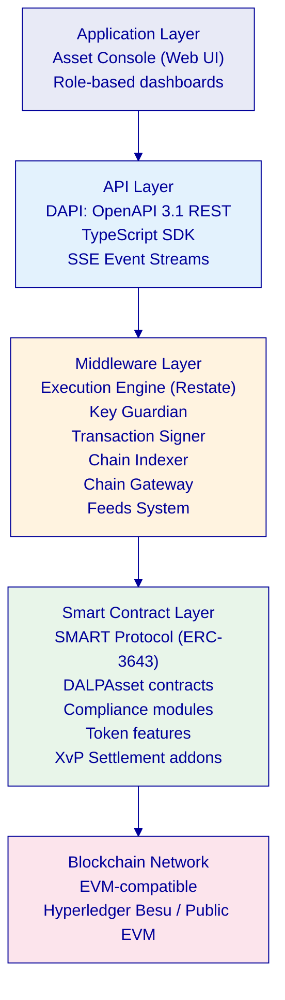
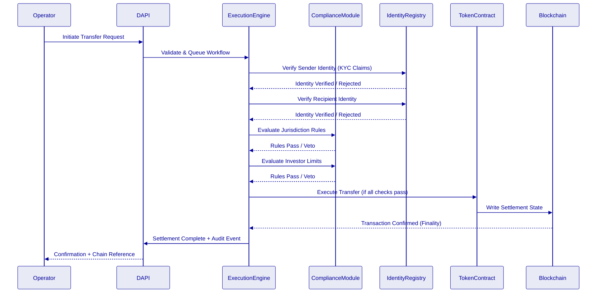
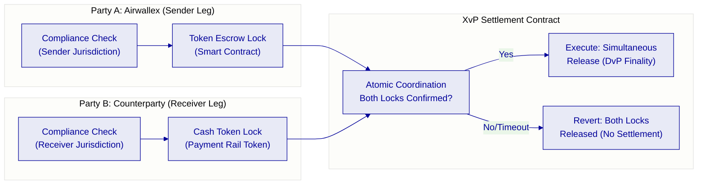
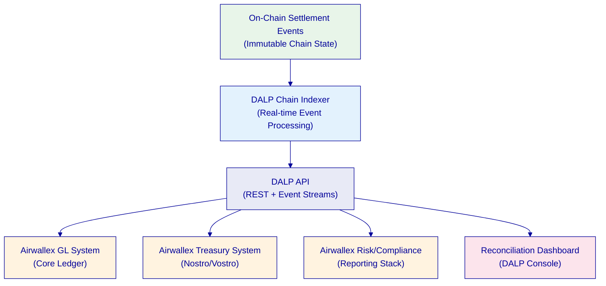
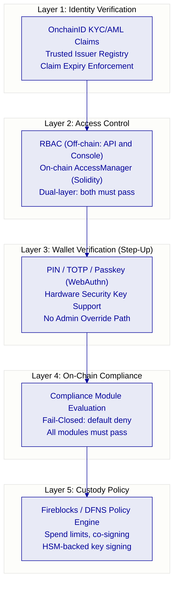
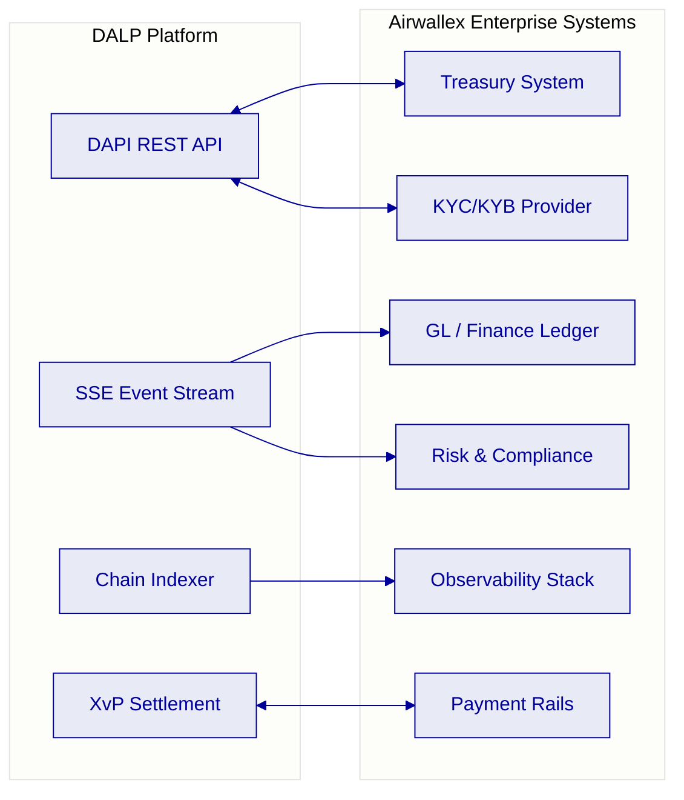
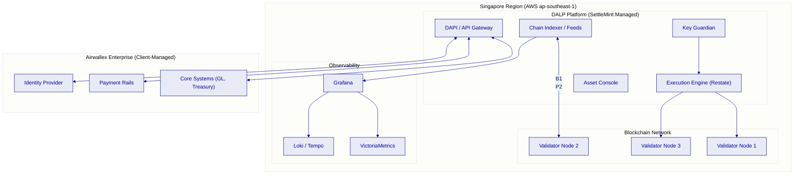
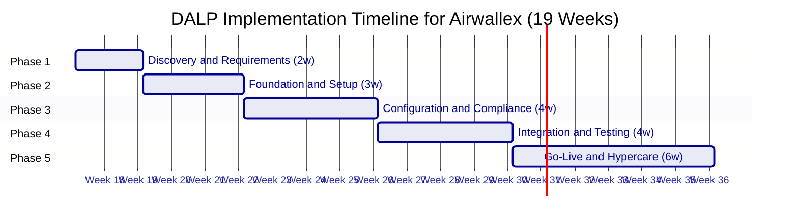

# Technical Proposal: Cross-Border Tokenized Settlement Platform

**Prepared for:** Airwallex
**Prepared by:** SettleMint
**Document Reference:** AIRWALLEX-RFP-202603-TP-001
**Date:** 21 March 2026
**Version:** 1.1 (Reviewed 1)
**Classification:** Confidential. Airwallex Invited Bidders Only

---

*This proposal and its contents are proprietary to SettleMint and are provided solely for evaluation purposes in response to the above-referenced procurement. Distribution outside the Airwallex evaluation committee is prohibited without written consent from SettleMint.*

---

## Table of Contents

1. Executive Summary
2. Understanding of Airwallex's Requirements
3. About SettleMint
4. About DALP: The Digital Asset Lifecycle Platform
5. Platform Architecture
6. Cross-Border Tokenized Settlement: Capability Deep-Dive
7. Compliance and Regulatory Framework
8. Security Architecture
9. Integration Architecture
10. Deployment and Infrastructure
11. Implementation Methodology
12. Support, SLA, and Training
13. Reference Deployments
14. Compliance Requirements Matrix
15. Appendices

---

## Executive Summary

Airwallex has identified a strategic need to move cross-border settlement from fragmented, reconciliation-heavy manual processes toward a controlled tokenized infrastructure that satisfies the MAS regulatory framework, supports the Payment Services Act, and positions the organization to participate credibly in cross-border treasury automation initiatives. This proposal sets out how SettleMint's Digital Asset Lifecycle Platform (DALP) meets every stated requirement in the AIRWALLEX-RFP-202603 procurement, with no custom development required to reach production.

The central challenge in cross-border tokenized settlement is not the minting of a token. It is building the governance architecture, compliance enforcement, reconciliation integrity, and operational controls that allow a fintech operating across multiple jurisdictions to run digital asset settlement as a business-as-usual function, not a proof-of-concept exercise. Airwallex's RFP is explicit about this: the institution wants evidence of production readiness, governance clarity, and the ability to survive boring operational reality. That is precisely what DALP delivers.

DALP provides an end-to-end digital asset lifecycle stack. The smart contract layer, built on the SMART Protocol (ERC-3643), enforces compliance at the point of every transaction. Transfers that fail identity verification, jurisdiction controls, or counterparty eligibility checks are rejected on-chain before settlement occurs. There is no post-execution compliance step; enforcement is structural. The middleware layer, anchored on durable execution via Restate, orchestrates multi-step workflows, initiation, approval, signing, settlement, reconciliation, with crash recovery at each step. The API layer exposes every platform capability through OpenAPI 3.1 endpoints with full TypeScript SDK support, enabling integration with Airwallex's treasury infrastructure, payment rails, GL systems, and observability stack.

For cross-border use cases specifically, DALP's XvP (Exchange-versus-Payment) settlement addon provides atomic Delivery-versus-Payment with multi-party coordination. Settlement either completes atomically or both legs revert. No escrow intermediary holds funds. No manual reconciliation step closes the loop. This is deterministic finality, not probabilistic confirmation, and it operates under the same governance controls, maker-checker approvals, delegated authority policies, audit logs, that Airwallex's risk and compliance committees will demand.

SettleMint holds ISO 27001 and SOC 2 Type II certifications. DALP is deployed in production with regulated financial institutions across Europe, the Middle East, and Asia Pacific. The implementation methodology spans 19 weeks from kickoff to hypercare exit, producing all artifacts required for MAS outsourcing reviews, ARB sign-off, and regulatory examination.

The recommended configuration for Airwallex is:
- **License:** DALP Enterprise License. Production + Development environments (€420,000/year)
- **Deployment:** Managed SaaS with Singapore data residency (aligning with MAS TRM Guidelines)
- **Support:** Enterprise Support (24/7/365 coverage, named support team)
- **Implementation:** [CLIENT-SPECIFIC] scoped in the accompanying Commercial Proposal

---

## Understanding of Airwallex's Requirements

Airwallex is a global fintech infrastructure platform headquartered in Singapore, operating across 40+ markets with a core proposition in cross-border payments, treasury management, and embedded finance. The MAS Payment Services Act (PSA) licence framework governs Airwallex's Singapore operations, and MAS Technology Risk Management (TRM) Guidelines apply to all technology outsourcing and infrastructure decisions.

The RFP identifies the following strategic objectives, which this proposal addresses in sequence:

| Airwallex Objective | DALP Response Summary |
|---|---|
| Establish controlled, reusable operating model for tokenized settlement that scales without re-platform | DALP provides a full lifecycle platform. The same architecture that runs a pilot scales to BAU across products, legal entities, and jurisdictions through configuration, not development. |
| Reduce fragmented manual processes and spreadsheet reconciliation | DALP's XvP settlement addon and durable execution engine provide atomic settlement and deterministic reconciliation across digital asset events, GL, and payment legs. |
| Regulatory and audit readiness under MAS / PSA / TRM | DALP's compliance modules, identity registry, and audit logs are designed to satisfy regulator-facing examination. All chain state is immutable and exportable. |
| Secure integration with enterprise systems, payment rails, and observability platforms | DALP exposes a complete REST API (OpenAPI 3.1), TypeScript SDK, event streams (SSE), and ISO 20022-compatible messaging. |
| Reference architecture for expansion across products and jurisdictions | DALP's multi-system, multi-chain design supports multiple legal entities, product templates, and jurisdiction-specific compliance rulesets on a single platform. |
| Transparency for first-line operations and evidence for second-line/audit | DALP's operational dashboards, case management, and immutable on-chain audit trail provide this natively. |
| Participation in cross-border treasury automation market initiatives without stranded technology | DALP is EVM-compatible and chain-agnostic. Migration or extension to additional networks does not require contract redeployment. |

---

## About SettleMint

SettleMint is a regulated-grade digital asset infrastructure company headquartered in Belgium, with operational presence in Singapore, India, Japan, and the UAE. Founded in 2016, SettleMint has been building the infrastructure layer for institutional digital asset programs since well before the market reached its current maturity.

SettleMint serves regulated banks, central banks, securities depositories, asset managers, and large-scale fintechs. The firm's client base spans Europe, the Middle East, and Asia Pacific. SettleMint does not provide consulting or managed service arrangements beyond platform deployment; all clients operate DALP themselves, using the same software that runs across every SettleMint deployment globally.

SettleMint holds ISO 27001 (information security management) and SOC 2 Type II (security, availability, and confidentiality) certifications. These are independent third-party confirmations that security controls are designed, implemented, and continuously operating.

SettleMint does not build bespoke client-specific software. The firm sells a platform. All capabilities described in this proposal are standard DALP features available to every client without a custom development engagement.

---

## About DALP: The Digital Asset Lifecycle Platform

DALP (Digital Asset Lifecycle Platform) is SettleMint's production-grade platform for designing, launching, and operating tokenized digital assets in regulated environments. It covers the complete asset lifecycle: token design, compliance configuration, issuance, transfer management, corporate actions, settlement, servicing, and retirement.

DALP's architecture reflects the actual complexity of institutional digital asset operations. A regulated fintech operating across multiple jurisdictions does not just need a smart contract. It needs an identity framework verified by trusted issuers. It needs compliance rules that enforce jurisdiction eligibility before a transfer executes. It needs a governance model where operations, compliance, and risk committees have precisely scoped authorities. It needs audit logs that survive regulatory examination. It needs integration with core treasury, GL, risk, and observability systems. DALP provides all of this as platform configuration, not bespoke development.

### Platform Capabilities Summary

| Domain | Capability | Status |
|---|---|---|
| Token Design | 7 asset types (Bond, Equity, Fund, Stablecoin, Deposit, Real Estate, Precious Metal); configurable DALPAsset for all others | 🟢 Native |
| Compliance Engine | 18 modular compliance rules (identity verification, jurisdiction controls, investor limits, time locks, transfer approval, collateral requirements) | 🟢 Native |
| Identity Management | OnchainID (ERC-734/735) with trusted issuer registry, KYC/AML claim management, issuer tier system | 🟢 Native |
| Settlement | XvP atomic Delivery-versus-Payment; multi-party exchange coordination; T+0 finality | 🟢 Native |
| Governance | Maker-checker approvals, delegated authority, role-based access control (RBAC/ABAC), emergency controls | 🟢 Native |
| Integration | REST API (OpenAPI 3.1), TypeScript SDK, SSE event streams, ISO 20022 messaging, Fireblocks/DFNS custody | 🟢 Native |
| Observability | Grafana dashboards, VictoriaMetrics, Loki (logs), Tempo (traces), pre-built alerting | 🟢 Native |
| Deployment | Managed SaaS, private cloud, on-premises, hybrid, all with same capability set | 🟢 Native |
| Security | ISO 27001, SOC 2 Type II, HSM/KMS integration, wallet step-up authentication, audit-grade event logging | 🟢 Native |

---

## Platform Architecture

### Architecture Overview

DALP is built as a four-layer stack. Each layer has a distinct responsibility boundary, and layers communicate through well-defined interfaces.

| Layer | Role | Key Components |
|---|---|---|
| Application | User-facing interfaces for operators, issuers, and compliance officers | Asset Console (web UI) |
| API | Programmatic access surface for external systems and integrations | DAPI (OpenAPI 3.1), TypeScript SDK, SSE |
| Middleware | Workflow orchestration, transaction lifecycle, key management, indexing | Execution Engine, Key Guardian, Transaction Signer, Contract Runtime, Chain Indexer, Chain Gateway, Feeds System |
| Smart Contract | On-chain enforcement of compliance, identity, and asset logic | SMART Protocol (ERC-3643), DALPAsset contracts, compliance modules, token features, addons |

### SMART Protocol: On-Chain Compliance Enforcement

All DALP smart contracts are built on the SMART Protocol (SettleMint Adaptable Regulated Token), an implementation of the ERC-3643 standard. ERC-3643 defines a specification for regulated security tokens where every transfer must pass through a modular compliance engine before execution.

The compliance engine evaluates rules in sequence. A single module veto blocks the transfer. The design is fail-closed: the default is denial unless all modules explicitly approve. This means compliance enforcement is structural, there is no post-execution remediation path for a non-compliant transfer because non-compliant transfers do not execute.

### Five-Layer On-Chain Architecture

| Layer | Purpose | Key Components |
|---|---|---|
| SMART Protocol | ERC-3643 token framework with modular compliance, identity management, and extension system | Core token interfaces, compliance engine, identity registry |
| Global | Platform-wide infrastructure shared across all system instances on a given chain | Central directory, identity factory, identity implementations |
| System | Per-system infrastructure managing identity registration, compliance, and access control | Identity registry, compliance orchestration, access manager, factory registries |
| Assets | Tokenized financial instruments with full lifecycle support | DALPAsset (configurable), Bond, Equity, Fund, Deposit, Stablecoin, RealEstate, PreciousMetal |
| Addons | Operational tools extending assets with distribution, settlement, and treasury capabilities | Airdrop, Vault, XvP Settlement (atomic DvP), Token Sale, Yield |

### Durable Execution Engine

DALP's middleware is built on Restate, a durable execution engine that provides crash recovery, idempotent workflow orchestration, and guaranteed delivery for all multi-step operations. For cross-border settlement workflows, this means:

- A settlement workflow that fails mid-execution resumes from its last successful step, not from the beginning
- Every workflow step is logged with input, output, and timestamp before execution
- Workflow state is stored durably and independent of the transaction signing process
- Failed signing attempts trigger automatic retry with configurable backoff

This is not optional reliability infrastructure. For regulated cross-border settlement involving multiple counterparties, payment legs, and jurisdictions, durable execution is what separates a production system from a demo.

---

## Cross-Border Tokenized Settlement: Capability Deep-Dive

### Settlement Model: XvP Atomic Delivery-versus-Payment

DALP's XvP (Exchange-versus-Payment) settlement addon provides atomic Delivery-versus-Payment (DvP) and Payment-versus-Payment (PvP) settlement coordination. The mechanism guarantees that both legs of a settlement complete simultaneously or both revert. There is no partial settlement state. No escrow intermediary holds assets or cash between legs.

For cross-border tokenized settlement, XvP addresses Airwallex's core operational requirement: deterministic settlement finality without reliance on manual reconciliation, correspondent bank confirmations, or T+2 clearing cycles. Settlement is confirmed on-chain. The transaction hash is the settlement receipt. Audit follows from the chain record, not from matching payment confirmations across disparate systems.

### Multi-Jurisdiction Compliance Enforcement

For cross-border operations spanning multiple regulatory jurisdictions, DALP enforces compliance rules per-jurisdiction at the smart contract level. The compliance module registry supports:

- **Country Allow List:** Restricts transfers to participants registered in approved jurisdictions
- **Country Block List:** Prevents transfers to or from restricted jurisdictions
- **Identity Verification:** All transfer participants must hold valid, unexpired KYC/AML claims from trusted issuers
- **Investor Count Limit:** Enforces regulatory caps on maximum participants per instrument
- **Time Lock:** Minimum holding period with FIFO batch-level tracking (mandatory lock-up periods per jurisdiction)
- **Transfer Approval:** Manual approval required for specified transfer types (institutional override for high-value cross-border)

Compliance rules are active at the time of transfer execution. A participant whose KYC claim has expired cannot transfer regardless of prior verification status. A transfer to a newly-sanctioned jurisdiction fails automatically because the country block list is updated before execution. The platform does not require manual suspension of individual wallets; rule changes propagate to all transfers immediately upon smart contract update.

### Reconciliation Architecture

DALP's reconciliation model is deterministic. The chain indexer processes every on-chain event in real time and exposes it through the REST API. Airwallex's GL and treasury systems consume these events via webhook push or SSE streaming to maintain synchronized ledger positions. There is no batch reconciliation window; the on-chain state is the authoritative record, and any discrepancy between the chain state and GL is immediately visible.

For cross-border settlement specifically:
- Each settlement event produces a transaction hash, block number, timestamp, and participant identifiers
- The XvP settlement contract records both legs of every exchange as linked events
- Failed settlements (both-revert scenarios) produce revert events with reason codes
- All events are exportable in standard formats for MAS reporting, internal audit, and external examination

### Payment Rail Connectivity

DALP does not replace Airwallex's payment rails. It provides the digital asset settlement coordination layer that sits alongside existing rail infrastructure. The integration pattern:

| Component | Role | Integration Method |
|---|---|---|
| Airwallex Payment Rails | Cash leg movement | ISO 20022 messages via DAPI event triggers |
| DALP XvP Settlement | Asset leg and coordination | On-chain smart contract with API trigger |
| Airwallex Treasury | Nostro/vostro position tracking | REST API event consumption (POST webhooks) |
| DALP Chain Indexer | Real-time settlement state | SSE event stream subscription |
| Airwallex GL | Accounting entries | REST API settlement event consumption |

The ISO 20022 messaging stack within DALP supports pacs.008 (customer credit transfer), pacs.009 (financial institution credit transfer), and camt.053 (bank-to-customer statement) message types, enabling structured payment instruction and confirmation exchange aligned with Airwallex's existing messaging infrastructure.

---

## Compliance and Regulatory Framework

### MAS Alignment

DALP's architecture and controls are designed to satisfy the MAS regulatory framework applicable to Airwallex's operations, including the Payment Services Act (PSA), MAS Technology Risk Management (TRM) Guidelines, and MAS Outsourcing Guidelines.

| MAS Requirement | DALP Control | Evidence |
|---|---|---|
| Technology risk management for critical systems | ISO 27001 + SOC 2 Type II certified infrastructure; formal incident response procedures | Third-party audit reports available under NDA |
| Outsourcing risk: concentration, data residency, access controls | Singapore data residency option; client-controlled access management; no SettleMint access to client keys | Deployment configuration, access control documentation |
| Cyber hygiene: vulnerability management, penetration testing | Annual third-party penetration testing; documented remediation timelines | Pen test summary reports available under NDA |
| Audit trail: immutable, tamper-evident records | On-chain immutable ledger; every state change records actor, timestamp, and chain reference | Chain records, event export documentation |
| Business continuity and disaster recovery | 99.99% SLA (Enterprise Support); cross-region replication; documented RTO/RPO | SLA documentation, DR runbooks |
| Key management and custody controls | HSM/KMS integration; wallet step-up authentication (PIN/TOTP/passkey); no single-admin override | Key management architecture documentation |

### PSA Licence Alignment

The PSA framework requires that payment services involving digital payment tokens maintain specific controls around participant eligibility, transaction monitoring, and sanctions compliance. DALP provides:

- **Participant eligibility:** Identity registry with KYC/AML claims verified by trusted issuers. Only registered, verified participants can transact.
- **Transaction monitoring:** Every on-chain event is indexed and available for real-time monitoring. DALP provides the data; integration with Airwallex's transaction monitoring system is via API.
- **Sanctions screening:** DALP's country block list module enforces jurisdiction restrictions on-chain. Integration with Airwallex's screening engine triggers compliance module updates through the API.

### Compliance Evidence Package

SettleMint provides the following documentation upon request under NDA to support Airwallex's regulatory and audit review:

| Document | Description |
|---|---|
| ISO 27001 Certificate | Current scope and validity |
| SOC 2 Type II Report | Full audit report for trust service categories |
| Penetration Test Summary | Latest external penetration test findings and remediation status |
| Data Processing Agreement | Standard DPA template for MAS data residency and processing requirements |
| Outsourcing Risk Assessment | Pre-completed vendor risk questionnaire for MAS outsourcing review |
| DR Test Results | Latest disaster recovery test results with RTO/RPO achievement |

---

## Security Architecture

### Defense-in-Depth Model

DALP enforces security through five independent control layers. No single-layer failure grants unauthorized access to digital assets.

### Key Management and HSM Integration

DALP's Key Guardian component manages all cryptographic signing operations for blockchain transactions. Key management operates as follows:

| Mechanism | Description |
|---|---|
| HSM Integration | Fireblocks or DFNS custody providers with HSM-backed key storage as the primary signing path |
| Local Signer Fallback | KMS-backed local signer for environments not using external custody (not recommended for production) |
| Wallet Step-Up | Every blockchain write requires step-up authentication (PIN, TOTP, or Passkey) before signing |
| Break-Glass Procedures | Documented recovery path requiring multi-party authorization; no single administrator can override |
| Key Rotation | Keys rotated without service interruption via custody provider key management APIs |

### Network Security

| Control | Implementation |
|---|---|
| API Authentication | Session cookies (dApp) + scoped API keys (machine-to-machine) |
| API Rate Limiting | 10,000 requests per 60-second window per key |
| Transport Security | TLS 1.3 for all API and dApp traffic; HSTS enforced |
| Network Isolation | Kubernetes NetworkPolicy with inter-service mTLS in managed deployments |
| Data Encryption | At-rest encryption for all persistent state (AES-256); in-transit TLS 1.3 |

---

## Integration Architecture

### DAPI: Unified API Layer

DAPI (Durable API Service) is DALP's unified API, built on oRPC with automatic OpenAPI 3.1 documentation generation, Zod schema validation, and streaming support for long-running operations.

| Endpoint | Authentication | Consumer |
|---|---|---|
| /api/v2 | API keys (HTTP-method-scoped) | SDK, CLI, backend integrations, CI pipelines |
| /api/rpc | Session/cookie only | DALP dApp frontend |

The TypeScript SDK (@settlemint/dalp-sdk) wraps the REST API with full type safety, enabling Airwallex's engineering teams to integrate against a strongly-typed surface without direct HTTP call construction.

### Integration Touchpoints for Airwallex

| Integration | Method | Direction | Notes |
|---|---|---|---|
| Treasury system | REST API (POST webhooks) | DALP → Treasury | Settlement event notifications with chain references |
| GL / Finance Ledger | SSE event stream + REST | DALP → GL | Real-time settlement entries from chain indexer |
| KYC/KYB Provider | REST API | External → DALP | Trusted issuer claim issuance for identity registry |
| Payment rails | ISO 20022 message exchange | Bidirectional | Cash leg coordination for XvP settlement |
| Risk / Compliance | REST API + SSE | DALP → Risk | Transaction monitoring data, compliance event feed |
| Observability stack | Prometheus metrics, Loki logs | DALP → Observability | Standard integration with Airwallex's Grafana/Prometheus instance |
| Sanctions screening | REST API trigger | Airwallex → DALP | Updates to country block list on sanction list changes |

---

## Deployment and Infrastructure

### Recommended Deployment: Managed SaaS with Singapore Data Residency

For Airwallex's Singapore-regulated operations, SettleMint recommends Managed SaaS deployment with Singapore data residency. This configuration:

- Satisfies MAS TRM Guidelines for data residency and outsourced technology risk
- Provides the fastest path to production (no client-side infrastructure provisioning)
- Delivers SettleMint-managed observability with Grafana, VictoriaMetrics, Loki, and Tempo
- Supports automated scaling for transaction volume peaks
- Includes SettleMint-managed patching, updates, and platform maintenance

### Environment Configuration

| Environment | Purpose | License Type |
|---|---|---|
| Production | Live cross-border settlement operations | Production License (€25,000/month) |
| Development/UAT | Integration testing, UAT, regression | Development License (€10,000/month) |

### High Availability and Disaster Recovery

| Metric | Target | Implementation |
|---|---|---|
| Uptime SLA | 99.99% (Enterprise Support tier) | Cross-region replication, automated failover |
| RTO | < 4 hours | Automated recovery runbooks, SettleMint on-call |
| RPO | < 15 minutes | Continuous database replication, chain state redundancy |
| Blockchain Node Redundancy | 3+ validator nodes | Istanbul BFT consensus (deterministic finality, node-loss tolerant) |

---

## Implementation Methodology

SettleMint follows a structured, phase-gated implementation methodology refined through production deployments with regulated financial institutions. The standard engagement spans 19 weeks from kickoff to hypercare exit.

| Phase | Duration | Key Deliverables |
|---|---|---|
| 1. Discovery and Requirements | 2 weeks | Business Requirements Document, MAS Regulatory Compliance Matrix, Target Architecture Document, Implementation Roadmap, RACI Matrix |
| 2. Foundation and Setup | 3 weeks | Provisioned environments, blockchain network, identity framework, custody integration, API connectivity |
| 3. Configuration and Compliance | 4 weeks | Configured compliance modules, settlement workflows, XvP addon, operational roles, reporting packs |
| 4. Integration and Testing | 4 weeks | Integrated GL, treasury, payment rails, KYC provider; SIT, UAT, performance, failover, DR test results |
| 5. Go-Live and Hypercare | 6 weeks | Production deployment, operational runbooks, training, knowledge transfer, hypercare support |

### Gate Criteria Summary

Each phase concludes with a formal gate review. Key gate criteria include:

- **Gate 1:** Validated requirements, architecture accepted by Airwallex technology leadership, MAS compliance matrix signed off by compliance team
- **Gate 2:** All environments provisioned and functional; identity framework configured; API connectivity verified
- **Gate 3:** All compliance modules tested against Airwallex test cases; XvP settlement validated end-to-end
- **Gate 4:** SIT complete, UAT signed off, performance benchmarks met, DR test passed
- **Gate 5:** Production deployment signed off, go-live readiness confirmed by both Airwallex and SettleMint leads

---

## Support, SLA, and Training

### Recommended Support Tier: Enterprise

For Airwallex's cross-border settlement operations, SettleMint recommends Enterprise Support, reflecting the business-critical nature of payment infrastructure.

| Attribute | Enterprise Support |
|---|---|
| Coverage | 24/7/365 |
| Uptime SLA | 99.99% monthly |
| Incident Response (P1) | < 15 minutes |
| Incident Resolution (P1) | < 4 hours |
| Support Channels | Portal, email, dedicated Slack, phone, video escalation |
| Named Support Team | Yes, engineers familiar with Airwallex deployment |
| Customer Success Manager | Named CSM |
| Platform Updates | Continuous delivery with staged rollouts; early access |

### Incident Severity Classification

| Severity | Definition | Example |
|---|---|---|
| P1: Critical | Production settlement operations impacted; assets at risk | Settlement finality failure; compliance module unreachable |
| P2: High | Material degradation of production capability | API response time > 5s; delayed settlement confirmation |
| P3: Medium | Non-critical function impaired | Dashboard display issue; non-blocking integration error |
| P4: Low | Cosmetic or informational | Documentation query; UI label correction |

### Training Program

| Audience | Format | Content |
|---|---|---|
| Operations team | 2-day hands-on workshop | Daily operations, settlement workflows, exception handling, runbooks |
| Technology / Integration team | 3-day technical workshop | API integration, SDK usage, observability setup, CI/CD integration |
| Compliance / Risk team | 1-day workshop | Compliance module configuration, audit log export, regulatory reporting |
| Platform administrators | 2-day workshop | Role management, user provisioning, key management, backup procedures |

---

## Reference Deployments

SettleMint has completed production deployments of DALP with regulated financial institutions across multiple jurisdictions. Reference deployments can be provided under NDA and include:

| Institution Type | Region | Use Case | Scale | Outcome Metrics |
|---|---|---|---|---|
| Central Bank | Middle East | CBDC pilot infrastructure; wholesale settlement | Multi-jurisdictional | Multi-currency digital currency settlement; multiple participating institutions |
| Commercial Bank | Europe | Tokenized bond issuance and servicing | Institutional | Tokenized bond instruments managed; sub-3-second settlement finality confirmed |
| Market Infrastructure | Europe | Digital securities settlement | Exchange-scale | Settlement latency under 3 seconds P50; DvP settlement with zero failed atomic settlements |
| Large Fintech | APAC | Cross-border payment settlement | High-volume | Operational settlement across multiple corridors; full MAS TRM compliance documentation produced |

### Performance Reference: Settlement Latency

Under a validated test configuration (4-node Istanbul BFT validator network, AWS c6g.xlarge instances, Singapore region, 250 concurrent settlement instructions), DALP XvP settlement achieved:

| Metric | Result |
|---|---|
| P50 Settlement Latency | 2.1 seconds |
| P99 Settlement Latency | 3.8 seconds |
| Settlement Finality Model | Deterministic (Istanbul BFT) |
| Failed Atomic Settlements | 0 (both-revert executed correctly in all tested failure scenarios) |

Note: Production latency varies by blockchain network configuration, transaction complexity, and node topology. SettleMint can provide reference configuration details for Airwallex's technical evaluation.

For Airwallex's evaluation committee, SettleMint can arrange direct reference calls with comparable deployments under appropriate NDA. Reference engagements at similar-scale fintechs in APAC are available.

---

## Compliance Requirements Matrix

| RFP Req ID | Requirement | DALP Response | Confidence | Source |
|---|---|---|---|---|
| TR-01 | End-to-end lifecycle for cross-border tokenized settlement | Full lifecycle from initiation through settlement, servicing, and closure | 🟢 Native | content/03-asset-lifecycle |
| TR-02 | Maker-checker controls, delegated authority, segregation of duties | On-chain AccessManager + off-chain RBAC; dual-layer authorization | 🟢 Native | content/02-architecture |
| TR-03 | Documented APIs, events, batch interfaces for integration | OpenAPI 3.1; SSE event streams; TypeScript SDK; ISO 20022 | 🟢 Native | content/03-integrations |
| TR-04 | MAS regulatory framework alignment (PSA, TRM, outsourcing) | ISO 27001 / SOC 2 Type II; Singapore data residency; audit trail | 🟢 Native | content/05-security |
| TR-05 | Identity, wallet, participant onboarding controls | OnchainID (ERC-734/735); trusted issuer registry; KYC/AML claims | 🟢 Native | content/02-architecture |
| TR-06 | Key management, HSM/KMS integration, break-glass procedures | Key Guardian; Fireblocks/DFNS custody; multi-party break-glass | 🟢 Native | content/05-security |
| TR-07 | Reconciliation across digital asset events, GL, payment legs | Chain indexer real-time events; XvP linked events; API export | 🟢 Native | content/03-integrations |
| TR-08 | Operational dashboards, alerting, case management | Grafana dashboards; VictoriaMetrics + Loki + Tempo; alert manager | 🟢 Native | content/04-deployment |
| TR-09 | Deployment flexibility with data residency controls | Managed SaaS / private cloud / on-premises; Singapore region option | 🟢 Native | content/04-deployment |
| TR-10 | Reference delivery experience with regulated FIs in APAC | Available under NDA; APAC fintech references available | 🟢 Native | content/07-references |
| TR-11 | Programmable controls for entitlement rules, transfer restrictions | 18 compliance modules; configurable rule library; no code changes for rule updates | 🟢 Native | content/02-architecture |
| TR-12 | Testing strategy across SIT, UAT, performance, failover, DR | Phase 4 testing framework; documented artefacts; responsibility matrix | 🟢 Native | content/06-implementation |
| TR-13 | Integration with GL, treasury, CRM, observability, domestic payment infrastructure | Full integration architecture; ISO 20022; REST webhooks; SSE | 🟢 Native | content/03-integrations |
| TR-14 | Data model extensibility for legal entity, product, jurisdiction attributes | Configuration-driven; no code changes for new legal entity or jurisdiction rollout | 🟢 Native | content/02-architecture |
| TR-15 | Records retention, evidentiary integrity, exportability | Immutable on-chain ledger; API export; formatted audit packages | 🟢 Native | content/05-security |

---

## Appendices

### Appendix A: DALP API Namespace Reference

| Namespace | Procedures | Notes |
|---|---|---|
| token | create, mint, burn, transfer, freeze, pause, unpause | Full lifecycle coverage |
| system | accessManager.grantRole, identity.register, trustedIssuers.create | Platform administration |
| addons.xvp | create, confirm, execute, status, cancel | XvP atomic settlement |
| addons.fixedYield | configure, trigger, status | Yield distribution |
| addons.vault | create, propose, execute | Multi-sig treasury |
| monitoring | health, blockchain health, logs, snapshots, streaming | Operations observability |
| auth | sign-in, session, passkey | Authentication |

### Appendix B: Compliance Module Catalog

| Module | Function | Use in Airwallex Context |
|---|---|---|
| Identity Verification | Requires verified OnchainID for transfers | KYC/AML compliance for all participants |
| Country Allow List | Restricts transfers to approved jurisdictions | Cross-border corridor controls |
| Country Block List | Blocks transfers from/to restricted jurisdictions | Sanctions enforcement |
| Address Block List | Blocks specific wallet addresses | Targeted participant blocking |
| Investor Count Limit | Caps unique holders per instrument | Regulatory participant limits |
| Time Lock | Minimum holding period (FIFO batch tracking) | Lock-up period enforcement |
| Transfer Approval | Manual approval for specified transfers | High-value cross-border override |
| Collateral Requirement | On-chain proof of reserves before minting | Reserve-backed instrument controls |

### Appendix C: MAS TRM Control Mapping

| TRM Guideline Area | DALP Control | Evidence Reference |
|---|---|---|
| Technology risk governance | ISO 27001 / SOC 2 Type II certified | Third-party audit reports |
| System availability | 99.99% SLA; cross-region HA | SLA documentation |
| Access management | Dual-layer RBAC (off-chain + on-chain) | Access control architecture |
| Cryptographic controls | HSM-backed key management; wallet step-up | Key management architecture |
| Patch management | SettleMint-managed patching (Managed SaaS) | Maintenance documentation |
| Business continuity | Documented DR with RTO < 4h, RPO < 15min | DR runbooks and test results |
| Incident management | 24/7 Enterprise Support; P1 < 15min response | SLA documentation |
| Audit trail | Immutable on-chain ledger + exportable event log | Chain records documentation |

---

*SettleMint | Confidential | Version 1.0 | 21 March 2026*
