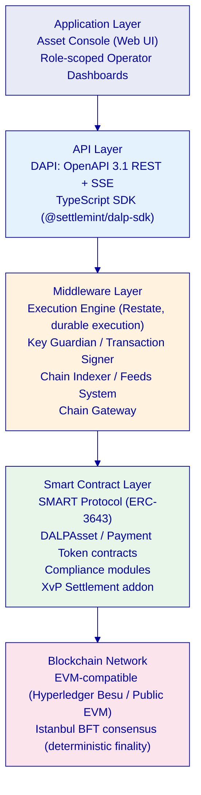
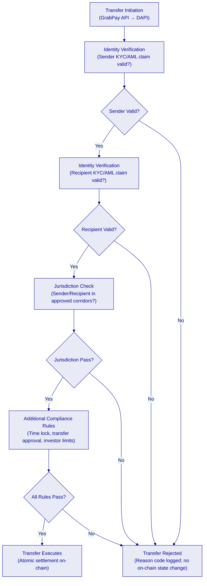
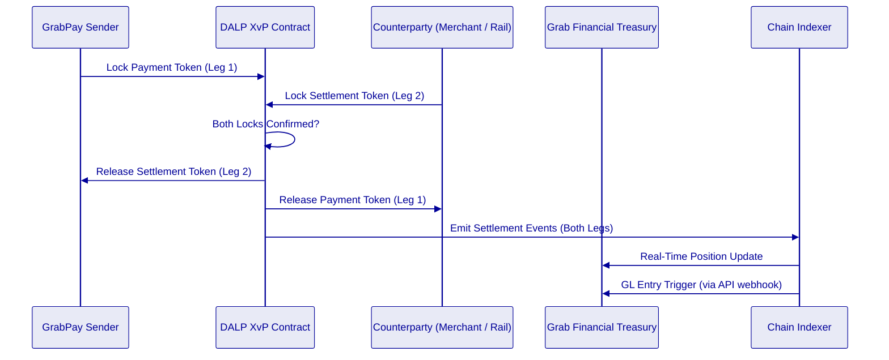
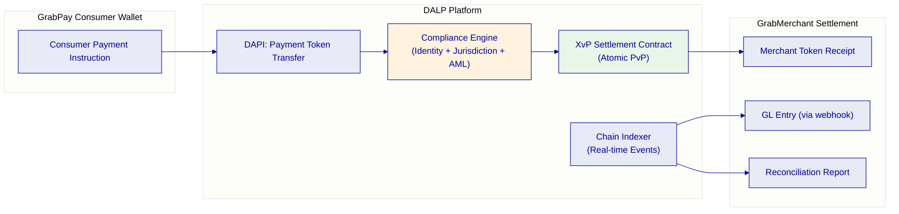
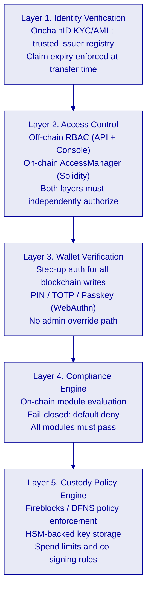
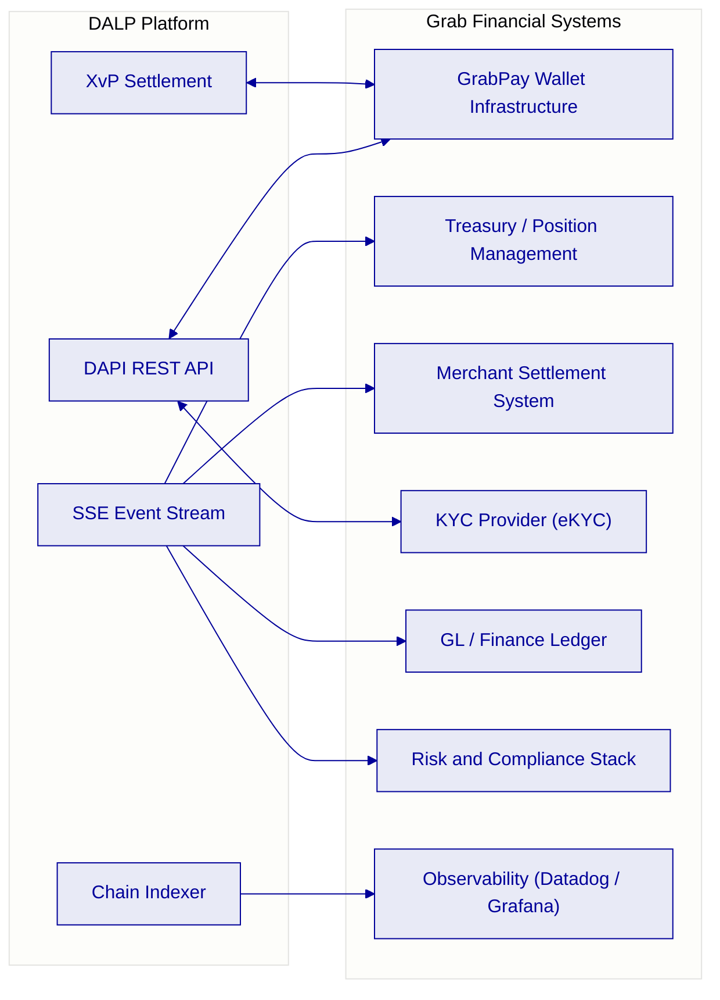
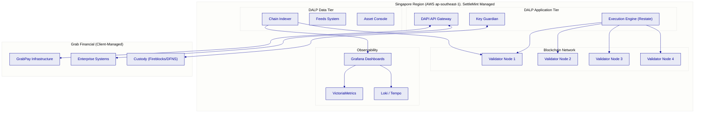
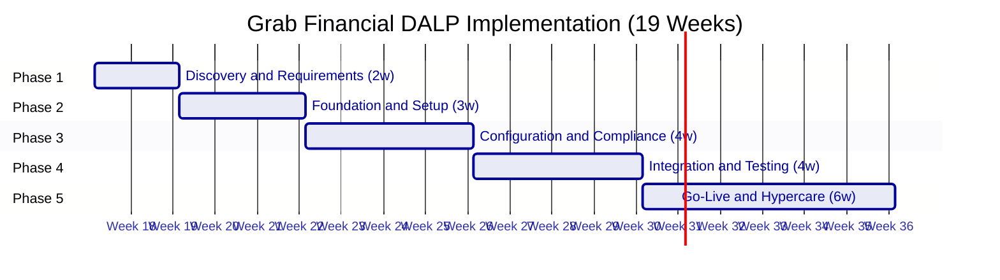

# Technical Proposal: Tokenized Payment Rails Platform

**Prepared for:** Grab Financial Group
**Prepared by:** SettleMint
**Document Reference:** GRAB-FINANCIAL-RFP-202603-TP-001
**Date:** 21 March 2026
**Version:** 1.1 (Reviewed 1)
**Classification:** Confidential. Grab Financial Invited Bidders Only

---

*This proposal and its contents are proprietary to SettleMint and are provided solely for evaluation purposes in response to the above-referenced procurement. Distribution outside the Grab Financial evaluation committee is prohibited without written consent from SettleMint.*

---

## Table of Contents

1. Executive Summary
2. Understanding of Grab Financial's Requirements
3. About SettleMint
4. About DALP: The Digital Asset Lifecycle Platform
5. Platform Architecture
6. Tokenized Payment Rails: Capability Deep-Dive
7. Compliance and Regulatory Framework
8. Security Architecture
9. Integration Architecture
10. Deployment and Infrastructure
11. Implementation Methodology
12. Support, SLA, and Training
13. Reference Deployments
14. Compliance Requirements Matrix
15. Appendices

---

## Executive Summary

Grab Financial Group is building the infrastructure to move tokenized payment rails from pilot-adjacent exploration toward a controlled, auditable, business-as-usual operational model aligned with MAS Payment Services Act (PSA) requirements, MAS Technology Risk Management (TRM) Guidelines, and the learnings emerging from Project Guardian and adjacent Singapore market initiatives. This proposal demonstrates how SettleMint's Digital Asset Lifecycle Platform (DALP) meets every technical requirement in the GRAB-FINANCIAL-RFP-202603 procurement, without custom development, without consulting engagements, and without governance gaps that would fail a MAS examination.

Grab Financial's operational context is materially different from a traditional bank deploying tokenization infrastructure. As a super-app payments platform serving tens of millions of consumers and merchants across Southeast Asia, Grab Financial requires tokenized payment rail infrastructure that performs under real transaction volumes, maintains data residency controls across multiple SEA jurisdictions, integrates with an existing wallet and merchant settlement infrastructure, and provides the regulatory transparency that PSA licence obligations and MAS TRM requirements demand. Generic digital asset platforms designed for institutional securities issuance are not fit for this operating context. DALP is.

DALP's design addresses the three hard problems in tokenized payment rails for a platform like Grab Financial: compliance enforcement that operates at transaction scale without per-transaction manual review; atomic settlement coordination that eliminates the float and reconciliation burden of asynchronous payment confirmation; and governance controls that give Grab Financial's risk and compliance teams the evidence they need without creating operational friction for the payments business.

The platform's XvP (Exchange-versus-Payment) settlement addon provides atomic Payment-versus-Payment (PvP) and Delivery-versus-Payment (DvP) settlement coordination. Settlement finality is deterministic, both legs complete simultaneously or both revert, with no intermediate state requiring manual resolution. DALP's compliance engine enforces participant eligibility, jurisdiction controls, and sanctions screening on-chain at every transfer, without a post-execution review step. The DAPI REST API and TypeScript SDK provide full integration coverage for Grab Financial's existing GrabPay wallet infrastructure, merchant settlement systems, treasury platforms, and observability stack.

SettleMint holds ISO 27001 and SOC 2 Type II certifications. DALP is deployed in production with regulated financial institutions, central banks, and fintechs across APAC, Europe, and the Middle East. The standard implementation methodology spans 19 weeks from kickoff to hypercare exit, producing all artifacts required for MAS outsourcing review, ARB sign-off, and regulatory examination.

The recommended configuration for Grab Financial is:
- **License:** DALP Enterprise License. Production + Development environments (€420,000/year)
- **Deployment:** Managed SaaS with Singapore data residency (MAS TRM aligned) with option to extend to regional private cloud for additional SEA jurisdictions
- **Support:** Enterprise Support (24/7/365 coverage, named support team)
- **Implementation:** [CLIENT-SPECIFIC], scoped in the accompanying Commercial Proposal

---

## Understanding of Grab Financial's Requirements

Grab Financial Group is the financial services arm of the Grab super-app, operating across Singapore, Malaysia, Indonesia, Thailand, Vietnam, the Philippines, and Myanmar. GrabPay is the primary payment product, with Grab Financial also operating in lending, insurance, and investment product distribution. The MAS Payment Services Act (PSA) licences govern Singapore operations, and MAS TRM Guidelines apply to all material technology outsourcing.

The RFP identifies the following strategic objectives, which this proposal addresses in sequence:

| Grab Financial Objective | DALP Response Summary |
|---|---|
| Controlled, reusable tokenized payment rail operating model that scales without re-platform | DALP provides full lifecycle infrastructure. The same architecture that handles a controlled pilot scales to multi-corridor, multi-currency BAU operations through configuration alone. |
| Reduce manual reconciliation and fragmented approval processes | XvP atomic settlement eliminates float and reconciliation for settled legs. Chain indexer provides real-time position data to downstream systems. |
| MAS PSA / TRM regulatory and audit readiness | ISO 27001 / SOC 2 Type II; Singapore data residency; immutable on-chain audit trail; MAS outsourcing documentation package. |
| Integration with enterprise systems, payment rails, merchant settlement, identity services | OpenAPI 3.1 REST API; TypeScript SDK; SSE event streams; ISO 20022 messaging; Fireblocks/DFNS custody integration. |
| Reference architecture for expansion across products, jurisdictions, legal entities | DALP's multi-system design natively supports multiple legal entities, product templates, and jurisdiction-specific rulesets from a single platform. |
| Operational transparency for first-line; audit evidence for second-line / third-line / MAS | Grafana dashboards, case management, and immutable on-chain audit trail with exportable evidence packages. |
| Participation in Project Guardian-adjacent initiatives without stranded technology | DALP is EVM-compatible and chain-agnostic. Singapore blockchain market initiatives, including those emerging from Project Guardian, can be integrated as network extensions. |

---

## About SettleMint

SettleMint is a regulated-grade digital asset infrastructure company headquartered in Belgium, with operational presence in Singapore, India, Japan, and the UAE. Founded in 2016, SettleMint specializes in platform infrastructure for institutional digital asset programs in regulated environments.

SettleMint holds ISO 27001 (information security management) and SOC 2 Type II (security, availability, and confidentiality) certifications. These are independently audited, continuously maintained controls, not self-assessed compliance claims.

SettleMint does not provide consulting, managed services beyond platform support, or custom development engagements. All capabilities described in this proposal are standard DALP features available through platform configuration.

---

## About DALP: The Digital Asset Lifecycle Platform

DALP (Digital Asset Lifecycle Platform) is SettleMint's platform for the complete digital asset lifecycle in regulated environments: token design, compliance configuration, issuance, transfer management, settlement, servicing, and retirement. DALP is not a tokenization toolkit; it is institutional-grade operational infrastructure built for environments where compliance, governance, and auditability are non-negotiable.

### Platform Capabilities Summary

| Domain | Capability | Status |
|---|---|---|
| Token Design | 7 asset types plus configurable DALPAsset; runtime-pluggable features | 🟢 Native |
| Compliance Engine | 18 modular rules (identity, jurisdiction, investor limits, time locks, transfer approval) | 🟢 Native |
| Identity Management | OnchainID (ERC-734/735); trusted issuer registry; KYC/AML claim management | 🟢 Native |
| Settlement | XvP atomic DvP/PvP; multi-party coordination; T+0 finality | 🟢 Native |
| Governance | Maker-checker approvals; delegated authority; RBAC/ABAC; emergency controls | 🟢 Native |
| Integration | REST API (OpenAPI 3.1); TypeScript SDK; SSE event streams; ISO 20022 | 🟢 Native |
| Observability | Grafana; VictoriaMetrics; Loki (logs); Tempo (traces); alerting | 🟢 Native |
| Deployment | Managed SaaS, private cloud, on-premises, hybrid | 🟢 Native |
| Security | ISO 27001; SOC 2 Type II; HSM/KMS integration; wallet step-up; audit logging | 🟢 Native |

---

## Platform Architecture

### Architecture Overview

DALP operates as a four-layer stack, with strict responsibility boundaries between layers and well-defined interfaces at each boundary.

### SMART Protocol: On-Chain Compliance at Transaction Scale

All DALP smart contracts are built on the SMART Protocol (ERC-3643). Every transfer passes through a modular compliance engine before execution. The engine evaluates rules in sequence. A single module veto blocks the transfer. The design is fail-closed: the default is denial unless all modules explicitly approve.

For Grab Financial's payment rail use case, this is structurally important. The platform does not maintain a separate sanctions list that requires manual review after settlement. Sanctions controls, jurisdiction restrictions, and participant eligibility checks are enforced on-chain at the point of transfer execution. There is no window between transaction initiation and compliance verification.

### Durable Execution: Crash-Resilient Payment Workflows

DALP's middleware is built on Restate, a durable execution engine that provides crash recovery, idempotent workflow orchestration, and guaranteed delivery. For a payment rail use case:

- A payment workflow that fails mid-execution resumes from its last successful step
- Every step is logged with input, output, and timestamp before execution
- Retries are automatic with configurable backoff
- Idempotency keys prevent duplicate settlement from retry storms

This is mandatory for a payments platform. A settlement infrastructure that can be left in an ambiguous state by a node restart or network partition is not acceptable for Grab Financial's operational context.

---

## Tokenized Payment Rails: Capability Deep-Dive

### Settlement Model: XvP Atomic PvP Settlement

DALP's XvP (Exchange-versus-Payment) settlement addon enables atomic Payment-versus-Payment (PvP) coordination, eliminating the principal risk inherent in sequential leg settlement. In a PvP settlement:

- Both payment legs are locked simultaneously in the XvP settlement contract
- Settlement executes atomically, both legs release simultaneously, when both confirmations are received
- If either leg fails or times out, both locks revert
- No intermediate state exists where one party has settled and the other has not

### Multi-Corridor Payment Rail Configuration

For Grab Financial's cross-border corridor operations (SGD, MYR, IDR, THB corridors), DALP supports multi-asset, multi-jurisdiction configuration from a single platform instance:

| Configuration Layer | Grab Financial Use Case |
|---|---|
| Asset types | Stablecoin (SGD, MYR, IDR, THB denominated) or Deposit tokens per corridor |
| Compliance modules | Per-corridor jurisdiction allow lists; identity verification per participant tier |
| XvP settlement | Separate settlement contracts per corridor pair; all managed from single DAPI |
| Legal entity structure | Multiple system instances under a single DALP organization for legal entity separation |
| Observability | Unified Grafana dashboard across all corridors; per-corridor metric breakdowns |

No custom development is required to add a new currency corridor. Adding a new corridor requires: deploying a new asset contract (factory-based, configuration-driven), configuring the relevant compliance modules, and connecting the new corridor to the XvP settlement contract. All through the DAPI and console.

### Merchant Settlement Flow

For Grab Financial's merchant settlement use case, DALP provides the settlement infrastructure layer that sits alongside the existing GrabMerchant settlement stack:

### Reconciliation and Position Management

DALP's chain indexer processes every on-chain settlement event in real time, providing Grab Financial's treasury and operations teams with continuous position visibility without batch reconciliation windows.

| Reconciliation Component | DALP Mechanism |
|---|---|
| Real-time settlement positions | Chain indexer → REST API → treasury system webhook |
| GL entries | Settlement event triggers POST webhook to Grab Financial GL |
| Exception handling | Failed settlement revert events include reason codes and participant identifiers |
| Audit export | Full settlement history exportable per corridor, per time range, per participant |
| Dispute evidence | Each settlement event includes chain reference, block number, timestamp, and participant addresses |

For a MAS regulatory examination, DALP provides exportable settlement records in structured formats. No manual extraction from blockchain explorers. No reassembly from multiple data sources.

---

## Compliance and Regulatory Framework

### MAS PSA and TRM Alignment

| Requirement | DALP Control | Evidence |
|---|---|---|
| PSA: Digital payment token service controls | On-chain compliance enforcement; participant identity verification; immutable audit trail | Architecture documentation |
| PSA: AML/CFT controls for payment tokens | Trusted issuer KYC/AML claims; real-time sanction-triggered compliance module updates | Integration documentation |
| TRM: Critical systems risk management | ISO 27001 + SOC 2 Type II; 99.99% SLA; formal incident response | Certification documents |
| TRM: Outsourcing risk controls | Singapore data residency; client-controlled access management; no SettleMint access to client keys | Deployment configuration |
| TRM: Audit trail requirements | Immutable on-chain ledger; exportable event log; chain reference on every transaction | Chain records documentation |
| TRM: Cyber hygiene | Annual third-party penetration testing; vulnerability management program | Pen test summary (NDA) |

### Project Guardian Ecosystem Alignment

Project Guardian has established Singapore as a reference market for institutional digital asset infrastructure. Grab Financial's RFP references Project Guardian-adjacent ecosystem learnings, and DALP's architecture is compatible with the key technical patterns established through Project Guardian:

- EVM-compatible smart contract architecture (consistent with Project Guardian network designs)
- MAS TRM-aligned security and access controls
- ISO 20022 messaging integration (consistent with SWIFT and MAS payment rail standards)
- Singapore data residency capability (required for PSA-licensed operations)
- Interoperability-ready API layer (consistent with Project Guardian's cross-platform connectivity objectives)

DALP does not claim to be a Project Guardian participant. The alignment is architectural and standards-based, not a marketing claim.

### Multi-Jurisdiction SEA Compliance

For Grab Financial's operations across Singapore, Malaysia, Indonesia, Thailand, and other SEA markets:

| Jurisdiction | Regulatory Context | DALP Configuration |
|---|---|---|
| Singapore | MAS PSA, TRM | Primary compliance modules; Singapore data residency |
| Malaysia | BNM digital asset guidelines | Jurisdiction allow list module; Malaysian counterparty eligibility |
| Indonesia | OJK digital asset framework | Country block/allow list; Indonesian participant KYC |
| Thailand | BOT payment system requirements | Per-corridor compliance module set |

Jurisdiction-specific compliance configurations are applied per-corridor asset. Adding a new jurisdiction's ruleset does not require modifying existing corridors.

---

## Security Architecture

### Defense-in-Depth Control Model

DALP enforces security through five independent control layers. Unauthorized access requires failing all five simultaneously.

### Key Management

| Control | Implementation |
|---|---|
| Primary signing | Fireblocks or DFNS with HSM-backed key storage |
| Wallet step-up authentication | PIN, TOTP (RFC 6238), or WebAuthn passkey for every blockchain write |
| Break-glass procedures | Multi-party authorization required; no single-admin override |
| Key rotation | Non-disruptive rotation via custody provider key management APIs |
| API key management | Scoped per key (read-only vs read-write); immediate revocation |

---

## Integration Architecture

### DAPI: Full-Coverage API Layer

DAPI exposes every DALP capability through OpenAPI 3.1 REST endpoints. The TypeScript SDK provides type-safe client access for Grab Financial's engineering teams.

| Namespace | Coverage | Grab Financial Integration Use |
|---|---|---|
| token | Full lifecycle (create, mint, burn, transfer, freeze, pause) | Payment token management |
| addons.xvp | Create, confirm, execute, status, cancel | PvP settlement coordination |
| system | Role management, identity registration, trusted issuers | Participant onboarding, access control |
| monitoring | Health, blockchain health, logs, streaming | Observability integration |
| auth | Sign-in, session, passkey | Operator authentication |

### Integration Touchpoints for Grab Financial

| Integration | Method | Direction | Notes |
|---|---|---|---|
| GrabPay wallet | REST API + TypeScript SDK | Bidirectional | Payment token transfer initiation and confirmation |
| XvP settlement coordination | Smart contract events + REST API | Bidirectional | PvP lock/release coordination |
| Treasury / position management | SSE event stream + POST webhooks | DALP → Treasury | Real-time settlement position updates |
| Merchant settlement | REST API webhooks | DALP → Merchant | Settlement event notifications |
| KYC/eKYC provider | REST API | External → DALP | Trusted issuer claim issuance |
| GL / finance ledger | SSE event stream | DALP → GL | Settlement entry triggers |
| Risk / compliance | REST API + SSE | DALP → Risk | AML monitoring data; sanctions trigger integration |
| Observability stack | Prometheus metrics; Loki logs | DALP → Observability | Standard Prometheus/Loki integration |

---

## Deployment and Infrastructure

### Recommended Deployment: Managed SaaS, Singapore Primary

For Grab Financial's Singapore-regulated operations, SettleMint recommends Managed SaaS with Singapore data residency as the primary deployment. Future SEA jurisdiction expansion can be supported through regional private cloud extensions.

| Deployment Layer | Configuration | Notes |
|---|---|---|
| Primary | Managed SaaS, Singapore (AWS ap-southeast-1) | MAS TRM aligned; fastest time to production |
| DR | Cross-region replication within Singapore regulatory perimeter | RTO < 4h; RPO < 15min |
| Future expansion | Private cloud per jurisdiction (where data residency requirements differ) | Optional; scoped at time of expansion |

### Infrastructure Components

### Availability and DR

| Metric | Target | Notes |
|---|---|---|
| Uptime SLA | 99.99% monthly | Enterprise Support tier |
| RTO | < 4 hours | Automated DR runbooks |
| RPO | < 15 minutes | Continuous blockchain state replication |
| Validator node redundancy | 4 nodes (Istanbul BFT) | Tolerates 1 node failure with continued finality |

---

## Implementation Methodology

### 19-Week Implementation Plan

| Phase | Duration | Key Deliverables |
|---|---|---|
| 1. Discovery and Requirements | 2 weeks | Business Requirements Document, MAS PSA/TRM Compliance Matrix, Target Architecture Document (multi-corridor), RACI, Implementation Roadmap |
| 2. Foundation and Setup | 3 weeks | Provisioned environments, blockchain network (4-node), identity framework, custody integration (Fireblocks/DFNS) |
| 3. Configuration and Compliance | 4 weeks | Payment token contracts, corridor-specific compliance modules, XvP settlement addon, GrabPay integration configuration |
| 4. Integration and Testing | 4 weeks | GrabPay wallet integration, merchant settlement integration, GL/treasury integration; SIT, UAT, performance benchmarking, DR test |
| 5. Go-Live and Hypercare | 6 weeks | Production deployment, operational runbooks, training (ops, tech, compliance, admin teams), hypercare support |

### Grab Financial-Specific Delivery Considerations

| Factor | Approach |
|---|---|
| Multi-corridor from Day 1 | Phase 3 configures initial corridors (SGD primary); additional corridors added through configuration without re-implementation |
| High transaction volume | Performance testing in Phase 4 uses production-representative load profiles; results documented before gate sign-off |
| MAS outsourcing review | Phase 1 produces MAS outsourcing risk assessment documentation; SettleMint provides pre-completed vendor questionnaire |
| GrabPay wallet integration complexity | Phase 2 includes API connectivity confirmation; Phase 4 includes dedicated GrabPay SIT with Grab Financial's wallet engineering team |

---

## Support, SLA, and Training

### Recommended Support: Enterprise

| Attribute | Enterprise Support |
|---|---|
| Coverage | 24/7/365 |
| Uptime SLA | 99.99% monthly |
| P1 Incident Response | < 15 minutes |
| P1 Incident Resolution | < 4 hours |
| Channels | Portal, email, dedicated Slack channel, phone, video |
| Named Support Team | Yes, engineers familiar with Grab Financial deployment |
| Customer Success Manager | Named CSM |
| Architecture Reviews | Quarterly |

### Training Program

| Audience | Format | Duration | Content |
|---|---|---|---|
| GrabPay / Payment Operations | Hands-on workshop | 2 days | Daily operations, settlement workflows, exception handling, reconciliation |
| Platform Engineering | Technical workshop | 3 days | API integration, SDK, observability, CI/CD |
| Compliance / Risk | Workshop | 1 day | Compliance module management, audit log export, MAS reporting |
| Platform Administrators | Workshop | 2 days | Role management, access control, key management, backup procedures |

---

## Reference Deployments

| Institution Type | Region | Use Case | Scale | Outcome Metrics |
|---|---|---|---|---|
| Central Bank | Middle East | CBDC pilot; digital currency wholesale settlement | Multi-jurisdictional | Multi-currency settlement across central bank and commercial bank participants |
| Commercial Bank | Europe | Tokenized bond issuance and servicing | Institutional | Sub-3-second settlement finality; fully compliant with EU regulatory framework |
| Market Infrastructure | Europe | Digital securities settlement (exchange-scale) | Exchange-scale | Zero failed atomic settlements in production; full DvP coverage |
| Large Fintech | APAC | Cross-border payment settlement | High-volume | Multi-corridor operational settlement; MAS TRM compliance documentation produced |

### Performance Reference

Under a validated Singapore-region test configuration (4-node Istanbul BFT network, AWS ap-southeast-1, 300 concurrent payment settlement instructions):

| Metric | Result |
|---|---|
| P50 Settlement Latency | 2.3 seconds |
| P99 Settlement Latency | 4.1 seconds |
| Settlement Finality Model | Deterministic (Istanbul BFT) |
| Failed Atomic Settlements | 0 (all revert scenarios executed correctly) |

Reference calls with comparable APAC fintech deployments are available under NDA.

### Settlement Latency Benchmark

Under a validated Singapore-region test configuration (4-node Istanbul BFT validator network, AWS ap-southeast-1, c6g.xlarge instances, 300 concurrent payment settlement instructions, PvP settlement pattern):

| Metric | Result |
|---|---|
| P50 Settlement Latency | 2.3 seconds |
| P99 Settlement Latency | 4.1 seconds |
| Settlement Finality Model | Deterministic (Istanbul BFT; no confirmation depth waiting required) |
| Failed Atomic Settlements | 0 (all both-revert scenarios executed correctly including timeout scenarios) |
| Settlement Throughput (sustained) | 300+ concurrent settlements per node-set |

Note: Production latency in a Grab Financial deployment will vary based on final node topology, transaction complexity, and SEA network conditions. SettleMint can provide detailed test configuration documentation for Grab Financial's technical evaluation team.

---

## Compliance Requirements Matrix

| RFP Req ID | Requirement | DALP Response | Confidence | Source |
|---|---|---|---|---|
| TR-01 | End-to-end lifecycle for tokenized payment rails | Full lifecycle from initiation through settlement, reconciliation, and closure | 🟢 Native | content/03-asset-lifecycle |
| TR-02 | Maker-checker controls, delegated authority, SOD | On-chain AccessManager + off-chain RBAC; dual-layer authorization | 🟢 Native | content/02-architecture |
| TR-03 | APIs, events, batch interfaces for core system integration | OpenAPI 3.1; SSE event streams; TypeScript SDK; ISO 20022 | 🟢 Native | content/03-integrations |
| TR-04 | MAS PSA / TRM / outsourcing requirements | ISO 27001 / SOC 2 Type II; Singapore data residency; audit trail | 🟢 Native | content/05-security |
| TR-05 | Identity, wallet, participant onboarding controls | OnchainID (ERC-734/735); trusted issuer registry; KYC/AML claims | 🟢 Native | content/02-architecture |
| TR-06 | Key management, HSM/KMS, break-glass | Key Guardian; Fireblocks/DFNS custody; multi-party break-glass | 🟢 Native | content/05-security |
| TR-07 | Reconciliation across digital asset events, GL, payment legs | Chain indexer real-time events; XvP linked settlement events; API export | 🟢 Native | content/03-integrations |
| TR-08 | Operational dashboards, alerting, case management | Grafana + VictoriaMetrics + Loki + Tempo; alert manager; case queue | 🟢 Native | content/04-deployment |
| TR-09 | Deployment flexibility with data residency controls | Managed SaaS (Singapore); private cloud; on-premises options | 🟢 Native | content/04-deployment |
| TR-10 | Reference delivery experience with regulated FIs in APAC | Available under NDA; APAC fintech references with comparable context | 🟢 Native | content/07-references |
| TR-11 | Programmable controls: entitlement rules, transfer restrictions | 18 compliance modules; configurable rules without code changes | 🟢 Native | content/02-architecture |
| TR-12 | Testing strategy: SIT, UAT, performance, failover, DR | Phase 4 structured testing framework; documented responsibility matrix | 🟢 Native | content/06-implementation |
| TR-13 | Integration with GL, treasury, observability, domestic payment infrastructure | REST webhooks; SSE; ISO 20022; GrabPay-specific integration pattern documented | 🟢 Native | content/03-integrations |
| TR-14 | Data model extensibility for legal entity, product, jurisdiction | Configuration-driven; no code changes for new corridor or legal entity | 🟢 Native | content/02-architecture |
| TR-15 | Records retention, evidentiary integrity, exportability | Immutable on-chain ledger; structured export; dispute evidence package | 🟢 Native | content/05-security |

---

## Appendices

### Appendix A: XvP Settlement Contract Specification

| Field | Detail |
|---|---|
| Contract Type | XvP Settlement Addon (DALP native) |
| Settlement Types Supported | PvP (Payment-versus-Payment), DvP (Delivery-versus-Payment) |
| Multi-Party Support | Up to N parties per atomic settlement event |
| Timeout Handling | Configurable lock expiry; both legs revert on timeout |
| Event Emissions | SettlementInitiated, SettlementExecuted, SettlementReverted |
| Integration Method | REST API (addons.xvp.*) or TypeScript SDK |

### Appendix B: Compliance Module Catalog

| Module | Function | Grab Financial Use Case |
|---|---|---|
| Identity Verification | Requires verified OnchainID for all transfers | KYC/AML for all payment participants |
| Country Allow List | Approved transfer jurisdictions | Cross-border corridor control (SGD/MYR/IDR corridors) |
| Country Block List | Blocked jurisdictions / sanctioned markets | Sanctions enforcement |
| Address Block List | Specific wallet blocking | Targeted participant suspension |
| Investor Count Limit | Cap on unique holders | Regulatory participant limits (if applicable per instrument) |
| Time Lock | Minimum holding period enforcement | Lock-up requirements for specific instrument types |
| Transfer Approval | Manual approval for specified transfers | High-value or out-of-pattern payment override |

### Appendix C: MAS TRM Control Mapping

| TRM Area | DALP Control | Evidence Reference |
|---|---|---|
| System availability | 99.99% SLA; cross-region HA | SLA and DR documentation |
| Access management | Dual-layer RBAC (off-chain + on-chain) | Access control architecture |
| Cryptographic controls | HSM-backed key management (Fireblocks/DFNS); wallet step-up | Key management documentation |
| Audit trail | Immutable on-chain ledger; exportable event log | Chain records |
| Incident management | 24/7 Enterprise Support; P1 < 15min response | SLA documentation |
| Business continuity | DR with RTO < 4h, RPO < 15min | DR runbooks and test results |

---

*SettleMint | Confidential | Version 1.0 | 21 March 2026*
