# Technical Proposal: BaaS Digital Asset Module

## Cover Page

| Field | Value |
|-------|-------|
| Document Title | BaaS Digital Asset Module |
| Client Name | Solarisbank |
| Submission Date | March 2026 |
| Version | 1.0 |
| Confidentiality | Restricted |
| Primary Contact | SettleMint Bid Team |

---

## Table of Contents

1. Executive Summary
2. Solution Overview
3. Technical Architecture
4. Asset Lifecycle Management
5. Token Issuance and Management
6. Compliance and Regulatory Framework
7. Integration Architecture
8. Security Model
9. Deployment Architecture
10. Implementation Plan
11. Operational Transition
12. Support and Maintenance
13. Appendices

---

## 1. Executive Summary

### 1.1 Context and Strategic Drivers

Solarisbank operates as a banking-as-a-service provider supporting embedded finance partners that need modular products and clean APIs. The procurement for BaaS digital asset module reflects a strategic imperative to extend the platform's value proposition to digital asset capabilities, enabling partners to offer tokenized products without building independent infrastructure.

The programme addresses three interconnected strategic objectives. First, product extension enables partners to offer digital asset products including tokenized securities, stablecoins, and loyalty tokens within the existing BaaS framework. Second, operational leverage allows the digital asset module to integrate with existing partner onboarding, compliance, and reporting infrastructure rather than requiring separate stacks. Third, regulatory readiness ensures the module meets MiCA, DORA, and German banking regulations for crypto-asset services.

The regulatory environment shapes programme design significantly. In Germany and the broader EEA, the Markets in Crypto-Assets Regulation (MiCA) establishes the licensing and operational framework for crypto-asset service providers. The Digital Operational Resilience Act (DORA) imposes ICT risk management and third-party risk requirements. BaFin oversees banking and financial services, with specific expectations for outsourcing and governance.

### 1.2 Why This Programme Is Hard

BaaS digital asset infrastructure operates at the intersection of banking services, crypto-asset regulation, and embedded finance, creating multi-dimensional complexity that differentiates this procurement from conventional technology projects.

**Regulatory complexity** emerges from the need to satisfy both banking regulations and crypto-asset regulations simultaneously. MiCA creates specific obligations around governance, disclosures, outsourcing, complaints handling, and conduct that must be mapped to the BaaS operating model. The platform must support evidence production for both BaFin and national competent authorities.

**Partner ecosystem complexity** involves the BaaS model where multiple partner platforms consume the digital asset module with different branding, configurations, and compliance requirements. The platform must support multi-tenant isolation while sharing operational infrastructure efficiently.

**Integration complexity** requires the digital asset module to interoperate with existing Solarisbank infrastructure including partner management, KYC/AML, ledger synchronization, and payment processing. The module cannot create a separate operating stack that requires dual-running or manual reconciliation.

**Operational transition complexity** involves the need to maintain existing BaaS service levels while introducing new capability, ensuring that digital asset services meet the same reliability and compliance standards as existing banking services.

### 1.3 Proposed Response

SettleMint proposes the Digital Asset Lifecycle Platform (DALP) as the foundation for Solarisbank's BaaS digital asset module. The response addresses the procurement objectives through six integrated workstreams.

**Workstream 1: Solution Design** establishes target-state architecture, dependency mapping, and environment planning aligned with Solarisbank's existing infrastructure patterns.

**Workstream 2: Core Platform Capability** configures DALP for BaaS digital asset module requirements, including partner-specific lifecycles, tiered compliance controls, and multi-tenant isolation.

**Workstream 3: Integration Delivery** implements APIs, events, webhook handling, identity integration, ledger connectivity, and observability consistent with Solarisbank's integration standards.

**Workstream 4: Security and Compliance Setup** establishes role models, approval workflows, segregation of duties, logging, evidence generation, and data controls.

**Workstream 5: Testing and Readiness** executes functional, non-functional, security, resilience, and user acceptance testing with clear go/no-go criteria.

**Workstream 6: Operational Enablement** delivers runbooks, training, support model, incident handling, and KPI framework.

### 1.4 Key Differentiators

**BaaS-native architecture**: DALP's multi-tenant architecture is designed for BaaS deployment patterns, supporting partner isolation, configurable branding, and tiered compliance enforcement. The platform has been deployed in banking-as-a-service contexts with demonstrated partner onboarding capabilities.

**MiCA/DORA readiness**: The platform includes pre-built compliance modules for MiCA token issuance, DORA ICT risk management, and GDPR data handling. Configuration rather than customization addresses regulatory requirements.

**Integration-first approach**: DALP exposes APIs and events that integrate with existing BaaS infrastructure, avoiding the digital-asset-island problem. The platform maintains ledger integrity while synchronizing with Solarisbank's books and records.

**Operational transparency**: Full audit trails, reconciliation dashboards, and exception management support day-two operations with the same rigor as existing Solarisbank services.

---

## 2. Solution Overview

### 2.1 Platform Introduction

The Digital Asset Lifecycle Platform (DALP) provides a comprehensive foundation for creating, issuing, managing, and servicing digital assets within a regulated BaaS environment. The platform addresses the full lifecycle of digital assets from initial issuance through final settlement, with embedded controls, compliance enforcement, and operational governance throughout.

DALP follows a microservices architecture that separates concerns across orchestration, lifecycle management, compliance enforcement, settlement coordination, and reporting. Each service exposes well-defined APIs and emits events that enable integration with external systems while maintaining internal consistency. The architecture supports multi-tenant BaaS deployment patterns with configurable isolation levels.

The platform operates as a control plane over underlying distributed ledger or database infrastructure, managing asset lifecycle state, enforcing business rules, maintaining audit trails, and coordinating with external settlement systems. This architecture provides institutional-grade reliability while maintaining the transparency and immutability benefits of distributed ledger technology.

### 2.2 Fit for BaaS Digital Asset Module

DALP addresses the specific requirements of the BaaS digital asset module through native capabilities in three key areas.

**Multi-tenant capability** handles the BaaS model where multiple partner platforms consume the digital asset service with different configurations, compliance requirements, and branding. The platform supports tenant isolation, configurable feature sets, and tiered service levels.

**Partner integration** enables the digital asset module to leverage existing Solarisbank infrastructure for partner onboarding, KYC/AML, ledger synchronization, and payment processing. Integration patterns follow existing Solarisbank API standards.

**Regulatory compliance** embeds controls for MiCA, DORA, GDPR, and BaFin requirements with evidence generation for regulatory reviews. Configuration addresses jurisdiction-specific requirements within the BaaS model.

### 2.3 Capability Summary

The following table summarizes DALP capabilities relevant to the procurement scope:

| Capability | Status | Evidence |
|------------|--------|----------|
| Segregated environments (dev/test/UAT/DR/prod) | 🟢 Native | Architecture documentation, deployment guides |
| API-first interfaces with versioning | 🟢 Native | API specification, developer documentation |
| RBAC, segregation of duties, maker-checker | 🟢 Native | Security architecture, role matrix |
| Configurable lifecycle states and policy controls | 🟢 Native | Lifecycle configuration guide |
| Third-party dependency disclosure | 🟢 Native | Integration documentation, dependency register |
| Resilience, recovery, backup, monitoring | 🟢 Native | Operational runbooks, resilience testing evidence |
| Delivery method and phased implementation | 🟢 Native | Implementation methodology, project plans |
| Evidence extraction for audit | 🟢 Native | Audit trail documentation, evidence packs |
| Multi-tenant isolation | 🟢 Native | Multi-tenant architecture guide |
| MiCA token issuance support | 🟢 Native | MiCA compliance module |
| DORA ICT risk management | 🟢 Native | DORA compliance module |

---

## 3. Technical Architecture

### 3.1 Platform Architecture Overview

DALP implements a layered architecture that separates concerns across presentation, orchestration, domain, integration, and infrastructure layers. This separation enables independent scaling, technology choice flexibility, and clear ownership boundaries appropriate for BaaS operation.

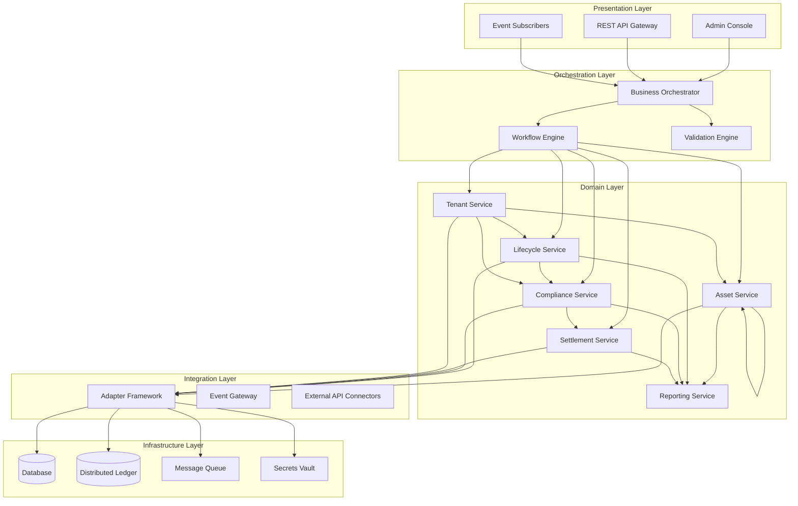

The **Presentation Layer** provides multiple interaction channels: an administrative console for operational staff, REST APIs for programmatic access, and event subscriptions for real-time processing. All channels connect through the orchestration layer, ensuring consistent behavior regardless of interaction pattern.

The **Orchestration Layer** coordinates complex workflows spanning multiple domain services. The business orchestrator manages state machines and workflow definitions, while the workflow engine handles long-running processes with compensation capabilities. The validation engine enforces business rules and regulatory requirements before state transitions proceed.

The **Domain Layer** implements core business capabilities. Asset service manages asset creation, modification, and query operations. Lifecycle service handles state transitions and lifecycle events. Compliance service enforces regulatory and policy rules. Settlement service coordinates with external payment and settlement systems. Tenant service manages multi-tenant isolation and configuration. Reporting service generates operational and regulatory reports.

The **Integration Layer** manages connectivity with external systems through an adapter framework that normalizes protocols and data formats. The event gateway publishes internal events to external subscribers. External API connectors integrate with partner systems, custodians, and market infrastructure.

The **Infrastructure Layer** provides runtime capabilities through database, distributed ledger, message queue, and secrets vault components. The platform supports multiple deployment configurations including cloud-native, on-premises, and hybrid models.

### 3.2 Multi-Tenant Architecture

DALP implements multi-tenant isolation appropriate for BaaS deployment.

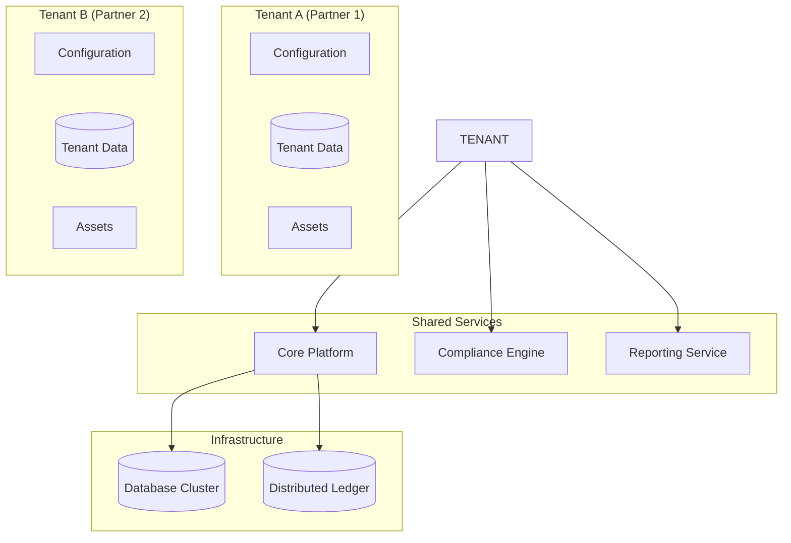

**Tenant Isolation**: Each partner (tenant) has isolated configuration, data, and asset records. Cross-tenant access is prevented at the application layer.

**Shared Services**: Core platform services, compliance engine, and reporting are shared across tenants with appropriate access controls.

**Data Isolation**: Database and ledger access is controlled through tenant-aware queries, ensuring each tenant can only access their own data.

**Configuration Isolation**: Each tenant has independent configuration for feature flags, compliance rules, and operational parameters.

### 3.3 Component Architecture

Each domain service implements a consistent internal structure with API handlers, business logic, and persistence layers.

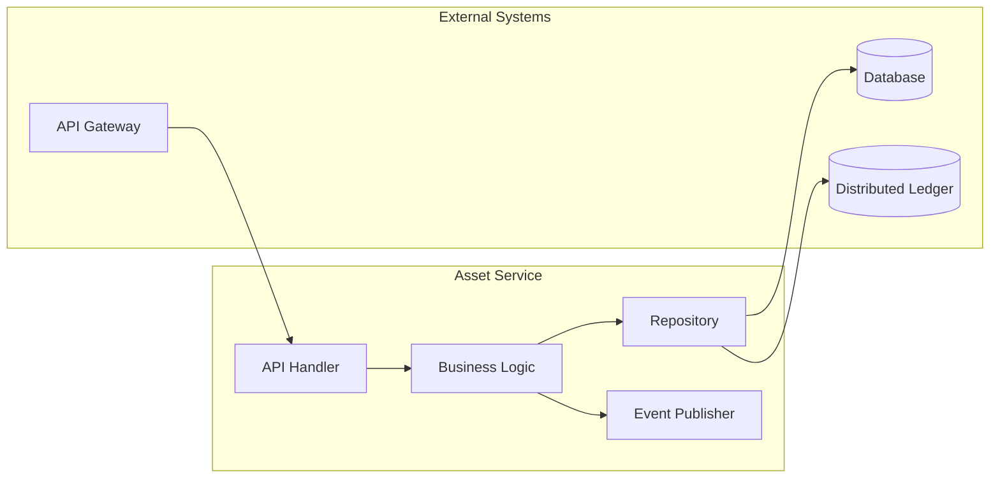

**API Handlers** translate incoming requests into internal command objects, perform basic validation, and route to appropriate business logic. Handlers implement tenant identification and idempotency guarantees.

**Business Logic** implements domain rules, enforces invariants, and coordinates with other services. Logic is expressed through declarative rules where possible, enabling configuration rather than code changes.

**Repositories** abstract persistence concerns, providing transactional guarantees and supporting both database and distributed ledger storage. Tenant context is enforced at the repository layer.

**Event Publishers** emit state change events that enable external systems to react to platform activity. Events include tenant context enabling partner-specific processing.

### 3.4 Environment Architecture

The platform supports the required segregated environments through infrastructure-level isolation and deployment-time configuration.

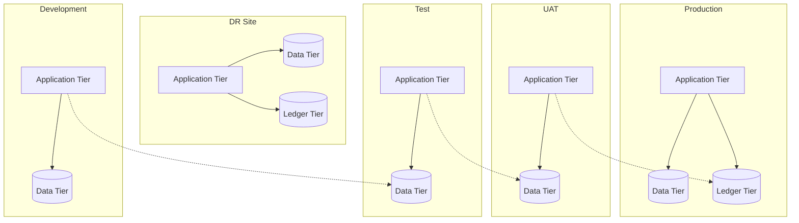

**Development** environments support active development with minimal isolation, sharing infrastructure where cost efficiency warrants.

**Test** environments provide isolated testing with representative data volumes, supporting integration testing and performance validation.

**UAT** environments mirror production configuration for user acceptance testing, with data refresh capabilities supporting realistic test scenarios.

**Production** environments support the live workload with appropriate redundancy, scaling, and operational controls.

**DR** environments provide disaster recovery capability with defined RTO and RPO targets, regular testing, and documented failover procedures.

---

## 4. Asset Lifecycle Management

### 4.1 Digital Asset Lifecycle Overview

The BaaS digital asset lifecycle spans from initial creation through final settlement, with intermediate states for partner-specific processing, compliance verification, and settlement.

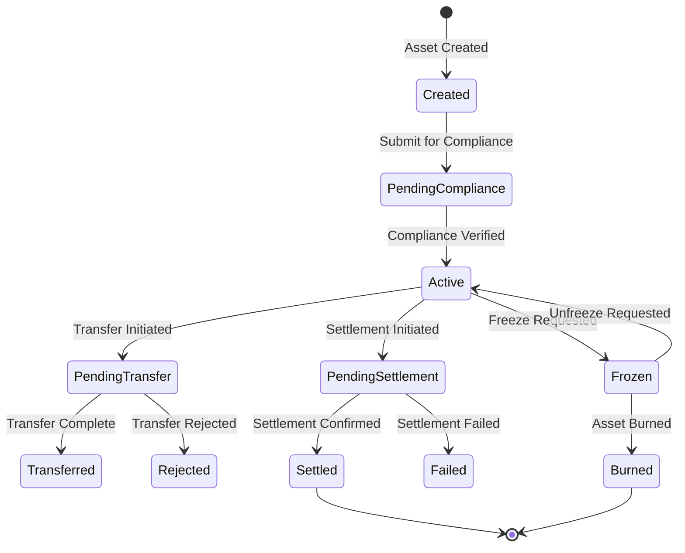

**Created** state represents an asset when created by a partner or system. The asset captures asset type, quantity, metadata, and initial compliance status.

**PendingCompliance** state indicates the asset is awaiting compliance verification. Transition to active occurs after verification of regulatory requirements.

**Active** state indicates the asset is in good standing and available for transfer or settlement.

**PendingTransfer** state applies when a transfer is initiated. The state tracks transfer status and holds the asset from other operations.

**Transferred** state records successful transfer completion with counterparty confirmation.

**Rejected** state indicates transfer was rejected, returning the asset to active status.

**PendingSettlement** state applies when settlement is initiated. The state tracks settlement progress with external systems.

**Settled** state represents final confirmation that settlement is complete.

**Failed** state indicates settlement failure with appropriate error handling.

**Frozen** state allows assets to be frozen for regulatory or operational reasons, preventing transfer or settlement.

**Burned** state represents final destruction of the asset.

### 4.2 Partner Asset Management

The platform supports BaaS partner-specific asset management:

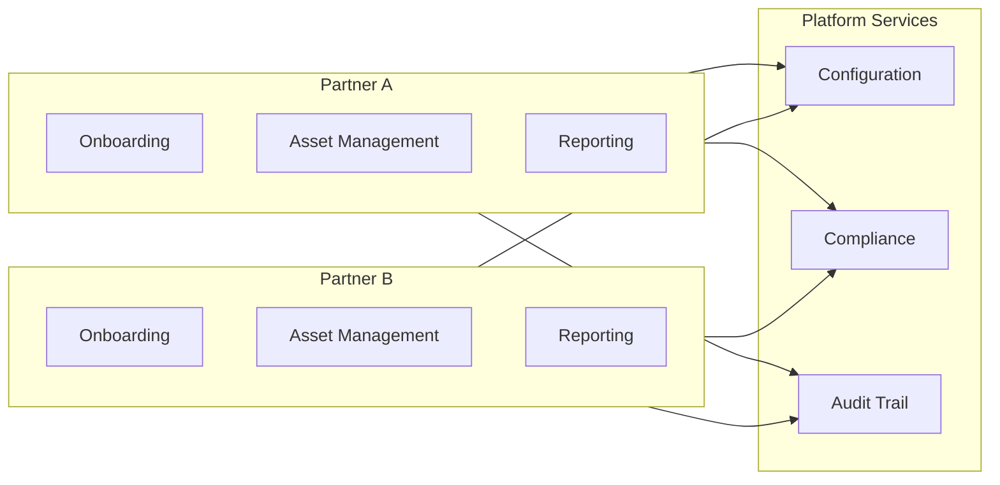

**Partner Onboarding**: Each partner has independent onboarding flow with partner-specific configuration for KYC requirements, transaction limits, and asset types.

**Asset Management**: Partners manage their assets through APIs, with tenant isolation ensuring partner data is protected.

**Reporting**: Partners receive partner-specific reports with appropriate data segmentation.

**Configuration**: Partner-specific configuration for feature flags, compliance rules, and operational parameters.

---

## 5. Token Issuance and Management

### 5.1 Token Architecture

DALP implements a dual-token architecture that separates the legal record of ownership from the technical representation of the asset on distributed ledger infrastructure.

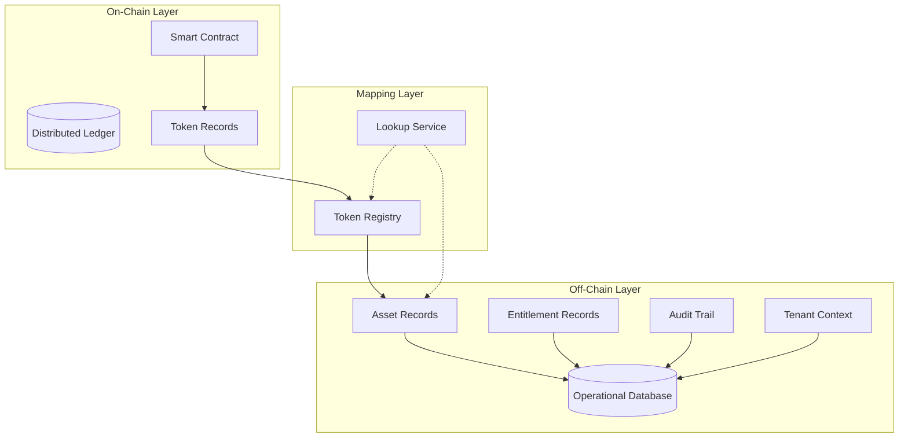

**Smart Contract** layer manages on-chain token representation, including transfer logic, access control, and emission events. The contract implements standard token interfaces compatible with wallets and exchanges.

**Operational Database** maintains authoritative records of asset attributes, entitlement calculations, audit trail, and tenant context. This database serves as the system of record for operational queries and reporting.

**Token Registry** maps on-chain token identifiers to off-chain asset records, enabling correlation between blockchain and operational representations. The registry includes tenant context mapping.

### 5.2 Token Issuance Flow

Asset tokenization follows a controlled process that maintains regulatory compliance throughout.

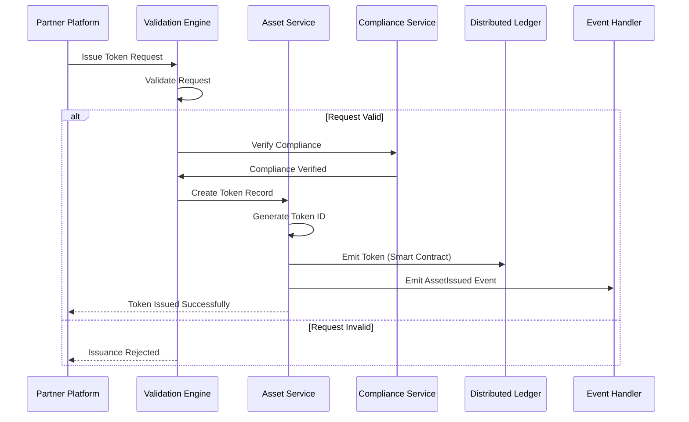

**Validation** confirms request validity including tenant identification, asset type eligibility, and quantity limits before token creation.

**Compliance Verification** applies regulatory checks including MiCA requirements where applicable.

**Token Creation** generates a unique token identifier and creates the on-chain representation through smart contract invocation.

**Event Emission** notifies downstream systems of the issuance.

---

## 6. Compliance and Regulatory Framework

### 6.1 Regulatory Architecture

DALP implements a modular compliance framework that enables jurisdiction-specific rule configuration without code changes.

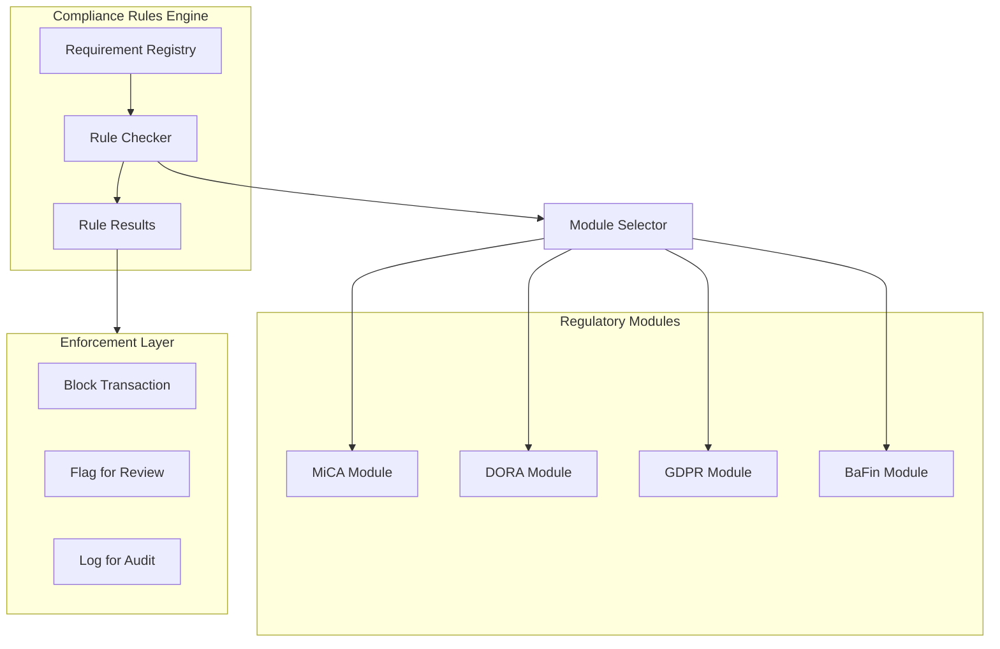

**Requirement Registry** maintains structured definitions of regulatory requirements, including requirement text, applicability conditions, and enforcement action.

**Rule Checker** evaluates transactions against applicable requirements based on asset type, jurisdiction, partner classification, and transaction characteristics.

**Regulatory Modules** encapsulate jurisdiction-specific rule sets. Modules can be combined for multi-requirement scenarios.

**Enforcement Layer** applies the appropriate action based on rule evaluation: block the transaction outright, flag for compliance review, or log for audit trail.

### 6.2 MiCA Compliance

The platform addresses MiCA requirements through specific compliance modules.

**Token Issuance**: The platform supports MiCA-compliant token issuance including white paper requirements, governance obligations, and disclosure requirements.

**Service Provider Obligations**: The platform supports compliance with MiCA requirements for crypto-asset service providers including organizational requirements, custody, and trading platform obligations.

**Reporting**: The platform generates reports required for MiCA compliance including transaction reports and periodic disclosures.

### 6.3 DORA Compliance

The platform addresses DORA requirements through specific compliance modules.

**ICT Risk Management**: The platform supports ICT risk management requirements including risk assessment, controls, and incident management.

**Third-Party Risk**: The platform manages third-party dependencies with appropriate risk assessment and oversight.

**Operational Resilience**: The platform implements controls supporting operational resilience requirements including recovery and testing.

### 6.4 GDPR Compliance

The platform addresses GDPR requirements through specific controls.

**Data Minimization**: The platform collects only data necessary for the specified purpose.

**Retention Controls**: The platform implements data retention policies with automated deletion at retention period end.

**Cross-Border Transfers**: The platform supports appropriate safeguards for cross-border data transfers.

**Subject Rights**: The platform supports data subject rights including access, correction, and deletion requests.

---

## 7. Integration Architecture

### 7.1 Integration Patterns

DALP supports multiple integration patterns to accommodate diverse enterprise architectures and partner capabilities.

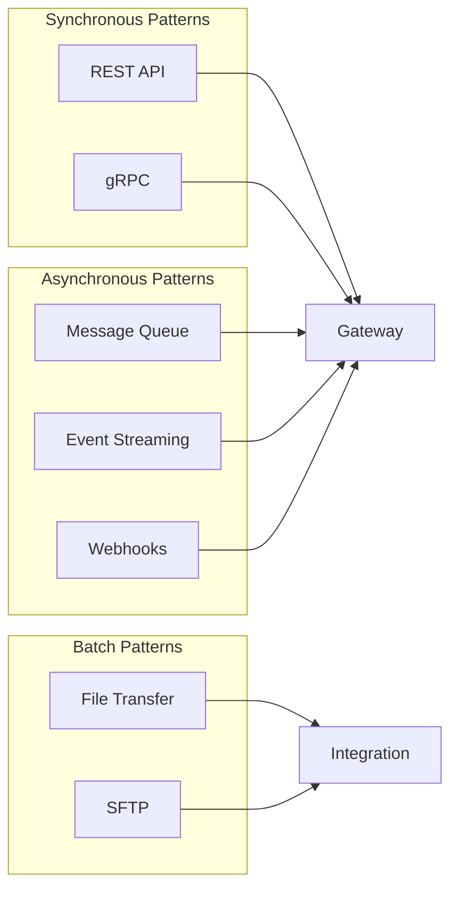

**REST API** provides synchronous request-response integration for real-time operations. APIs follow OpenAPI specification with comprehensive documentation and sandbox environment support.

**gRPC** enables high-performance integration for scenarios requiring low latency or efficient payload sizes.

**Message Queue** supports asynchronous integration for reliable delivery of operations.

**Event Streaming** enables real-time data sharing through publish-subscribe patterns.

**Webhooks** provides callback-based notification for external systems.

**File Transfer** supports batch operations including data import, report distribution, and reconciliation processing.

### 7.2 Integration Points

The following integration points are required for the Solarisbank implementation:

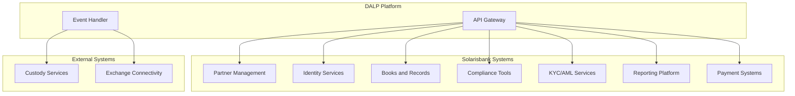

**Partner Management**: Integration with Solarisbank's partner management for onboarding, configuration, and lifecycle management.

**Identity Services**: Integration with enterprise identity management for user authentication and authorization.

**Books and Records**: Bidirectional integration with the general ledger or books-and-records system.

**Compliance Tools**: Integration with existing AML/KYC, sanctions screening, and transaction monitoring systems.

**KYC/AML Services**: Integration with identity verification and AML screening services for participant onboarding.

**Reporting Platform**: Export of operational and regulatory reports to the enterprise reporting infrastructure.

**Payment Systems**: Integration with payment processing for settlement finality and cash movement.

---

## 8. Security Model

### 8.1 Security Architecture

DALP implements defense-in-depth security controls across network, application, and data layers.

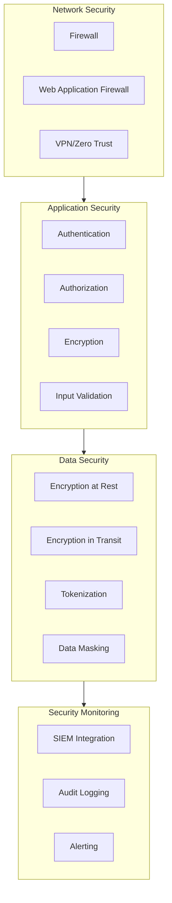

**Network Security**: Firewall controls, web application firewall, and zero-trust network architecture.

**Application Security**: Strong authentication, role-based authorization, encryption, and input validation.

**Data Security**: Encryption at rest and in transit, tokenization, and data masking.

**Security Monitoring**: SIEM integration, comprehensive audit logging, and alerting.

### 8.2 Identity and Access Management

DALP implements role-based access control with fine-grained permissions including BaaS-specific roles:

| Role Category | Example Roles | Access Type |
|---------------|---------------|-------------|
| Partner Admin | Partner Platform Admin | Manage partner configuration |
| Business Initiator | Partner Operations | Create assets, initiate transfers |
| Approver | Risk Manager, Compliance Officer | Approve exceptions, review alerts |
| Supervisor | Team Lead, Operations Manager | Monitor activity, manage queues |
| Administrator | System Administrator, Security Admin | Configure system, manage users |
| Auditor | Internal Audit, External Auditor | Read-only access to logs and reports |
| Support | Help Desk, Technical Support | Limited access for investigation |

---

## 9. Deployment Architecture

### 9.1 Deployment Options

DALP supports multiple deployment models to accommodate regulatory, operational, and cost requirements.

| Deployment Model | Description | Typical Use Case |
|------------------|-------------|------------------|
| Cloud Native | Fully managed by cloud provider | Fast deployment, reduced operational burden |
| Self-Hosted | On customer infrastructure | Regulatory data residency requirements |
| Hybrid | Cloud and on-premises combination | Regulatory requirements with operational efficiency |
| BaaS | Multi-tenant shared infrastructure | Cost optimization, lower volume workloads |

### 9.2 High Availability Configuration

Production deployments implement high availability with the following characteristics:

**Application Tier**: Multiple replicas of each service across availability zones. Health checks automatically remove unhealthy instances. Rolling updates maintain availability during deployments.

**Data Tier**: Primary-replica configuration with automatic failover. Point-in-time recovery capability. Cross-region replication for disaster recovery.

**Network Tier**: Multi-path networking with automatic failover. CDN integration for static content. DDoS protection at the edge.

**RTO/RPO**: Target RTO of 4 hours, target RPO of 1 hour for standard deployments.

---

## 10. Implementation Plan

### 10.1 Implementation Phases

The implementation follows a phased approach aligned with Solarisbank's workstream structure.

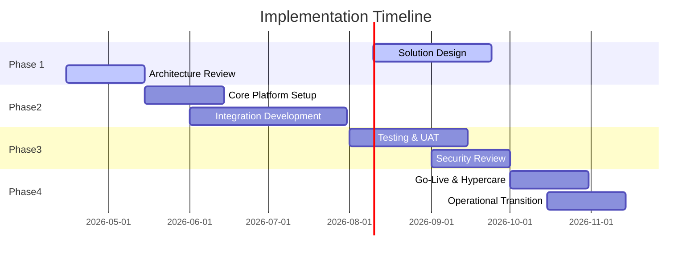

**Phase 1: Solution Design (Weeks 1-10)**

- Target-state architecture development
- Dependency mapping and environment planning
- Partner integration pattern definition
- Security and compliance framework establishment

**Phase 2: Core Platform Setup (Weeks 11-22)**

- Core platform configuration including multi-tenant setup
- Integration development including Solarisbank system integration
- Security control implementation
- Compliance module configuration

**Phase 3: Testing and Readiness (Weeks 23-31)**

- System integration testing
- User acceptance testing
- Security testing and remediation
- Performance testing

**Phase 4: Operational Transition (Weeks 32-38)**

- Go-live preparation
- Cutover execution
- Hypercare support
- Operational transition

### 10.2 Workstream Alignment

| Workstream | Scope | Deliverables |
|------------|-------|---------------|
| WS-1 | Solution Design | Architecture, dependency map, environment plan |
| WS-2 | Core Platform Capability | Configured platform, partner lifecycle |
| WS-3 | Integration Delivery | APIs, events, observability |
| WS-4 | Security and Compliance | Role model, controls, evidence |
| WS-5 | Testing and Readiness | Test results, UAT sign-off |
| WS-6 | Operational Enablement | Runbooks, support model, KPIs |

---

## 11. Operational Transition

### 11.1 Operational Model

DALP supports multiple operational models based on customer capability and preference.

**Self-Service Model**: Solarisbank operates the platform with vendor support for escalations.

**Shared Operations Model**: Vendor and customer share operational responsibilities with defined boundaries.

**Managed Service Model**: Vendor operates the platform on behalf of Solarisbank.

### 11.2 Support Model

The following support tiers are available:

| Tier | Description | Response Time |
|------|-------------|---------------|
| Standard | Business hours support | 8 hours |
| Premium | Extended hours support | 4 hours |
| Mission Critical | 24/7 support with dedicated resources | 1 hour |

---

## 12. Support and Maintenance

### 12.1 Software Maintenance

The platform includes regular maintenance releases:

**Patch Releases**: Monthly releases addressing security vulnerabilities, bug fixes, and minor enhancements.

**Feature Releases**: Quarterly releases introducing new capabilities and significant improvements.

**Upgrade Support**: Assistance with major version upgrades including planning, testing, and execution support.

### 12.2 Service Level Agreement

| Metric | Target |
|--------|--------|
| Platform Availability | 99.9% |
| API Response Time (P95) | < 500ms |
| Incident Resolution (Critical) | < 4 hours |
| Incident Resolution (High) | < 8 hours |

---

## 13. Appendices

### Appendix A: Compliance Matrix

| Requirement | Status | Evidence |
|-------------|--------|----------|
| BR-01: Configurable workflows | Supported | Configuration guide |
| BR-02: Deterministic state transitions | Supported | State machine documentation |
| BR-03: Entitlement accuracy | Supported | Ledger model |
| BR-04: Role-based operations | Supported | Role matrix |
| BR-05: Configurable limits | Supported | Rules engine |
| TR-01: REST API documentation | Supported | API docs |
| TR-03: Webhook patterns | Supported | Event documentation |
| SR-01: MiCA readiness | Supported | MiCA module |
| SR-02: DORA compliance | Supported | DORA module |

### Appendix B: Integration Dependencies

| System | Dependency Type | Criticality |
|--------|-----------------|-------------|
| Partner Management | Bidirectional | High |
| Identity Services | Inbound | High |
| Books and Records | Bidirectional | High |
| KYC/AML Services | Inbound | High |
| Payment Systems | Outbound | High |
| Custody Services | Outbound | Medium |

---

**Document Control**

| Version | Date | Author | Changes |
|---------|------|--------|---------|
| 1.0 | March 2026 | SettleMint | Initial draft |

*This document is confidential and intended solely for the use of Solarisbank.*